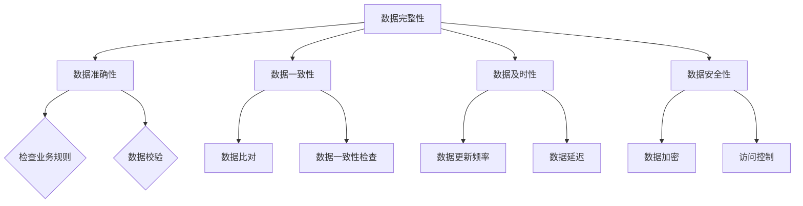
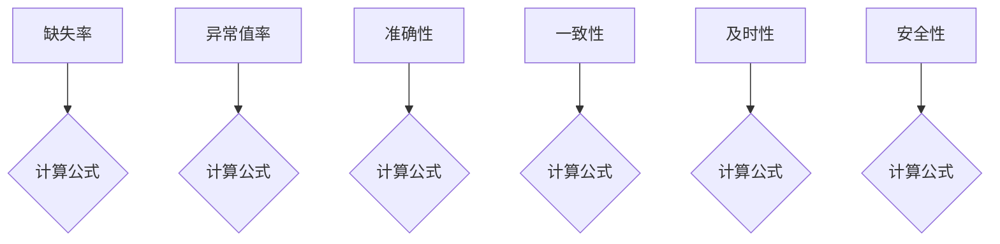
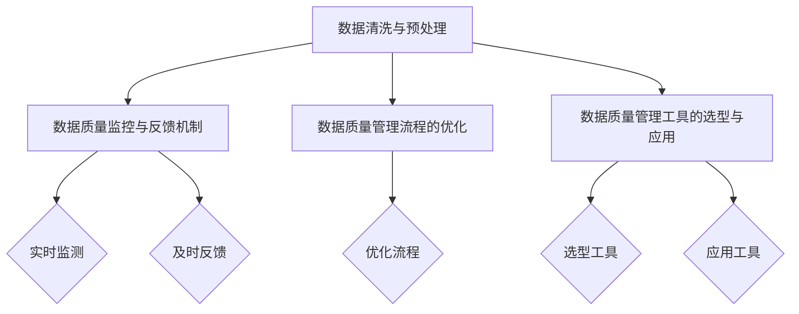
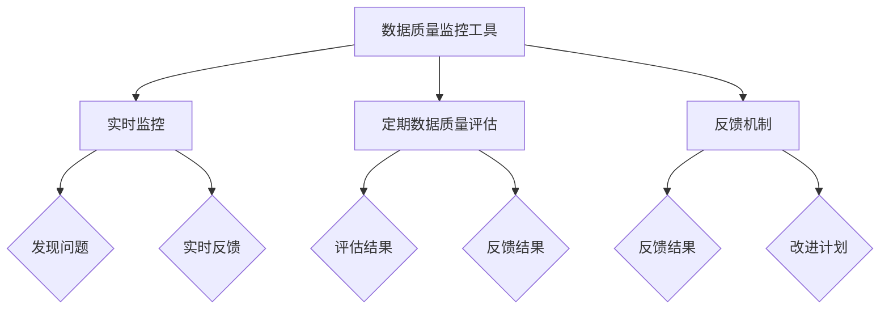
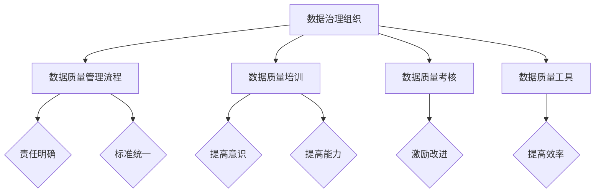
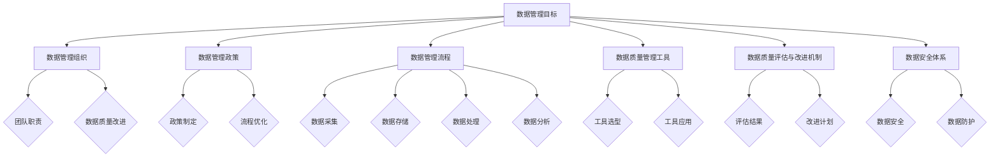
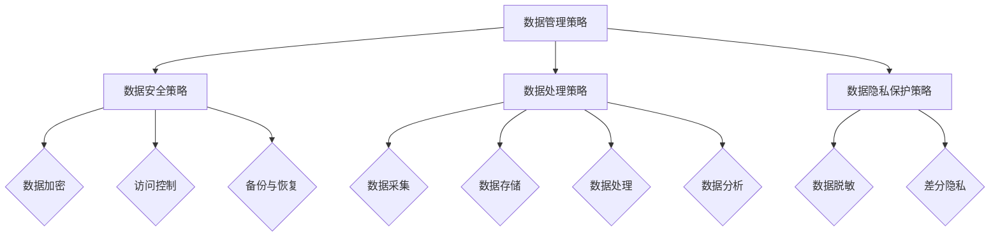
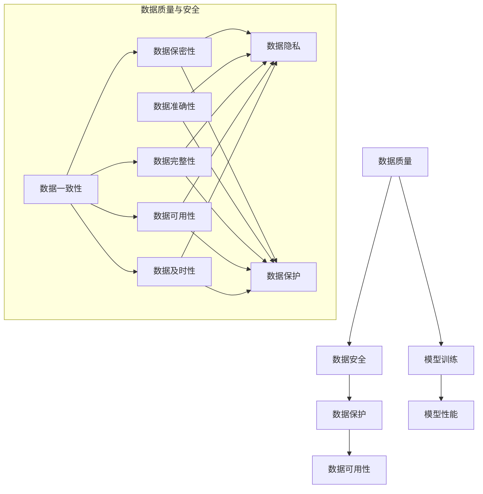

                 

# 《大模型时代的数据战略：数据质量与数据安全并重》

> 关键词：大模型、数据战略、数据质量、数据安全、算法原理、数学模型、项目实战

> 摘要：本文旨在探讨大模型时代下，企业如何制定有效的数据战略，同时保证数据质量和数据安全。文章分为四个部分，分别介绍数据质量评估与改进、数据安全防护、大模型时代的数据战略综合应用以及数据战略实践与展望。

## 目录大纲

1. **引言与背景**
    - 第1章：大模型时代的来临
        1.1 大模型技术的发展历程
        1.2 大模型技术的核心优势
        1.3 大模型时代带来的变革
    - 第2章：数据战略的重要性
        2.1 数据战略的定义与内涵
        2.2 数据战略在企业中的价值
        2.3 数据战略的挑战与机遇
    - 第3章：数据质量与数据安全的关联
        3.1 数据质量的定义与衡量标准
        3.2 数据安全的重要性
        3.3 数据质量与数据安全的平衡策略
    - 第4章：本书内容结构与目标
        4.1 各章节主要内容概述
        4.2 阅读本书的预期收益

2. **数据质量保障**
    - 第5章：数据质量评估与改进
        5.1 数据质量评估方法
        5.2 数据质量改进策略
        5.3 数据质量管理体系的构建
    - 第6章：数据质量管理实践案例
        6.1 案例一：电商行业数据质量提升
        6.2 案例二：金融行业数据安全与质量控制

3. **数据安全防护**
    - 第7章：数据安全基础
        7.1 数据安全概述
        7.2 数据安全防护策略
        7.3 数据安全管理体系
    - 第8章：数据安全防护技术
        8.1 数据安全防护技术概述
        8.2 数据加密技术
        8.3 访问控制技术
    - 第9章：数据安全防护实践案例
        9.1 案例一：医疗行业数据安全防护
        9.2 案例二：政府行业数据安全与隐私保护

4. **数据战略综合应用**
    - 第10章：大模型时代的综合数据战略
        10.1 大模型与数据战略的结合
        10.2 综合数据战略的构建
        10.3 数据战略在行业中的应用
        10.4 未来数据战略的发展趋势
    - 第11章：数据战略实践与展望
        11.1 数据战略实践案例分享
        11.2 数据战略的挑战与应对
        11.3 数据战略的未来展望

### 第一部分：引言与背景

#### 第1章：大模型时代的来临

### 第1章：大模型时代的来临

在当今科技迅猛发展的背景下，人工智能（AI）技术正以前所未有的速度向前推进。而大模型技术，作为人工智能领域的重要分支，正引领着这一波技术革新。大模型，通常指的是拥有海量参数、能够处理大规模数据、具备强大计算能力的神经网络模型。这些模型在图像识别、自然语言处理、推荐系统等领域取得了令人瞩目的成果，大大提升了企业的智能化水平和运营效率。

#### 1.1 大模型技术的发展历程

大模型技术的发展可以追溯到20世纪80年代，当时神经网络研究刚刚起步。然而，由于计算能力和数据资源的限制，早期的神经网络模型规模较小，效果有限。随着计算机性能的不断提升和互联网的普及，数据资源也变得丰富起来，为神经网络模型的发展提供了良好的基础。2006年，深度学习领域的里程碑事件——AlexNet的提出，标志着深度学习开始进入工业界。随后，随着GPU等专用硬件的普及，深度学习算法得到了快速发展，各类大模型相继涌现，如GPT、BERT、ViT等。

#### 1.1.1 大模型技术的发展历程

1. **早期神经网络**：1980年代至1990年代，神经网络作为一种简单的前馈网络，其参数规模较小，难以处理复杂问题。
2. **深度学习的兴起**：2006年，AlexNet在ImageNet竞赛中取得了突破性成绩，深度学习开始受到广泛关注。
3. **GPU的普及**：2009年，GPU在深度学习中的应用推动了计算性能的大幅提升。
4. **大规模数据集的诞生**：2010年后，互联网公司和学术机构开始发布大规模数据集，如ImageNet、COCO等，为模型训练提供了丰富的数据资源。
5. **预训练与微调**：2018年，GPT-2的提出标志着预训练模型在自然语言处理领域的崛起。
6. **多模态大模型**：近年来，ViT等多模态大模型的提出，使得大模型在图像和文本等多种数据类型上的处理能力大幅提升。

#### 1.1.2 大模型技术的核心优势

大模型技术具有以下核心优势：

1. **强大的学习能力**：大模型拥有海量参数，能够从大规模数据中学习到丰富的特征信息。
2. **高效的泛化能力**：大模型能够通过迁移学习和微调技术在新的任务上表现出优异的性能。
3. **广泛的适用性**：大模型可以应用于图像识别、自然语言处理、推荐系统、自动驾驶等众多领域。
4. **数据驱动的创新**：大模型能够通过不断优化模型结构和参数，推动新技术的不断涌现。

#### 1.1.3 大模型时代带来的变革

大模型技术的兴起不仅改变了传统的人工智能应用模式，还对各行各业产生了深远的影响：

1. **智能助理与语音交互**：大模型使得智能助理在语音识别和自然语言理解方面取得了重大突破，应用场景日益广泛。
2. **医疗与健康**：大模型在医学影像分析、疾病预测、个性化治疗等方面展现出巨大潜力，有助于提升医疗服务的质量和效率。
3. **金融与保险**：大模型在风险管理、欺诈检测、信用评估等领域发挥着重要作用，助力金融机构提升业务水平。
4. **制造业**：大模型在设备维护预测、生产优化、供应链管理等方面应用广泛，有助于提高制造业的智能化水平。
5. **交通与物流**：大模型在自动驾驶、智能调度、物流优化等领域取得了显著成果，有望推动交通行业的变革。

#### 1.2 数据战略的重要性

在大模型时代，数据战略的重要性日益凸显。数据是人工智能的“粮食”，优质的数据资源能够为模型训练提供坚实的基础，从而提升模型性能和应用效果。同时，数据战略的制定与实施有助于企业充分利用数据价值，提高业务效率和创新能力。

#### 1.2.1 数据战略的定义与内涵

数据战略是指企业或组织在数据管理、数据应用、数据安全等方面制定的一系列长期规划和策略。其内涵包括以下几个方面：

1. **数据管理**：制定数据管理政策和流程，确保数据的质量、完整性和一致性。
2. **数据应用**：明确数据在企业业务中的价值，制定数据驱动的业务策略和决策。
3. **数据安全**：保障数据的安全性、隐私性和可靠性，防范数据泄露和滥用风险。
4. **数据治理**：建立数据治理体系，规范数据使用和管理，提升数据利用效率。

#### 1.2.2 数据战略在企业中的价值

数据战略在企业中的价值体现在以下几个方面：

1. **提高业务效率**：通过数据驱动的决策，帮助企业优化业务流程，提高运营效率。
2. **增强竞争力**：利用数据洞察和市场分析，为企业提供竞争优势，推动业务增长。
3. **创新驱动**：通过数据挖掘和人工智能技术，发掘新的商业机会，推动企业创新。
4. **风险控制**：通过数据监控和安全措施，防范数据泄露和信息安全风险。

#### 1.2.3 数据战略的挑战与机遇

在大模型时代，数据战略面临着一系列挑战和机遇：

1. **数据质量挑战**：随着数据量的激增，数据质量成为关键问题。企业需要确保数据的一致性、完整性和准确性。
2. **数据安全挑战**：随着数据价值的提升，数据安全成为企业面临的重要挑战。企业需要建立完善的数据安全防护体系，防范数据泄露和滥用。
3. **数据治理挑战**：如何规范数据使用和管理，提升数据利用效率，是企业需要解决的问题。
4. **技术变革机遇**：大模型技术的快速发展为数据战略提供了新的工具和方法，有助于企业更好地挖掘数据价值。

#### 1.3 数据质量与数据安全的关联

数据质量和数据安全在大模型时代密不可分。高质量的数据是模型训练的基础，而数据安全则是保障数据不被泄露或滥用。以下是数据质量与数据安全之间的一些关联：

1. **数据质量影响数据安全**：如果数据质量差，如存在缺失值、异常值等，将影响模型训练效果，进而影响数据安全。
2. **数据安全影响数据质量**：数据泄露或滥用可能导致数据被篡改、丢失，影响数据质量。
3. **数据质量管理与数据安全防护相结合**：企业需要同时关注数据质量和数据安全，建立完善的数据管理流程和安全防护体系。

#### 1.4 本书内容结构与目标

本书共分为四个部分，旨在帮助读者深入理解大模型时代的数据战略：

1. **数据质量保障**：介绍数据质量评估与改进方法，以及数据质量管理体系的构建。
2. **数据安全防护**：阐述数据安全的基础知识和防护技术，包括加密技术、访问控制技术等。
3. **大模型时代的综合数据战略**：探讨大模型与数据战略的结合，以及数据战略在行业中的应用。
4. **数据战略实践与展望**：分享数据战略实践案例，分析面临的挑战与应对策略，展望数据战略的未来发展。

阅读本书，读者可以：

1. **掌握数据质量保障方法**：了解如何评估和改进数据质量，建立完善的数据管理体系。
2. **了解数据安全防护技术**：掌握加密技术、访问控制技术等常见的数据安全防护方法。
3. **深入理解大模型与数据战略的关系**：了解大模型对数据战略的影响，以及如何调整数据战略以适应大模型时代。
4. **借鉴实践案例**：通过实践案例了解数据战略在不同行业的应用，为实际工作提供参考。

### 第二部分：数据质量保障

#### 第5章：数据质量评估与改进

#### 第5章：数据质量评估与改进

数据质量是数据战略的核心要素之一，它直接影响着企业的业务决策和运营效率。评估与改进数据质量是确保数据战略成功的关键步骤。本章将详细介绍数据质量评估与改进的方法，以及数据质量管理体系的构建。

#### 5.1 数据质量评估方法

数据质量评估是衡量数据质量的重要手段。一个全面的数据质量评估框架应包括以下几个方面：

1. **数据完整性**：数据完整性是指数据是否完整、无缺失。评估方法包括检查数据表是否有空值、缺失值填充策略等。
2. **数据准确性**：数据准确性是指数据是否真实、可靠。评估方法包括检查数据是否遵循业务规则、数据校验等。
3. **数据一致性**：数据一致性是指数据在不同系统、不同部门之间是否保持一致。评估方法包括数据比对、数据一致性检查等。
4. **数据及时性**：数据及时性是指数据是否能够在需要的时间内提供。评估方法包括数据更新频率、数据延迟等。
5. **数据安全性**：数据安全性是指数据是否受到保护，防止未经授权的访问和泄露。评估方法包括数据加密、访问控制等。

以下是一个简单的数据质量评估框架：



#### 5.1.1 数据质量指标体系

为了更好地评估数据质量，需要建立一套数据质量指标体系。以下是常见的数据质量指标：

1. **缺失率**：指数据表中缺失值的比例。计算公式为：缺失率 = (缺失值总数 / 总记录数) × 100%。
2. **异常值率**：指数据表中异常值的比例。计算公式为：异常值率 = (异常值总数 / 总记录数) × 100%。
3. **准确性**：指数据正确性的比例。计算公式为：准确性 = (正确数据总数 / 总记录数) × 100%。
4. **一致性**：指数据在不同系统、不同部门之间的一致性。计算公式为：一致性 = (一致数据总数 / 总记录数) × 100%。
5. **及时性**：指数据更新的及时性。计算公式为：及时性 = (及时更新数据总数 / 总记录数) × 100%。
6. **安全性**：指数据的安全性。计算公式为：安全性 = (安全数据总数 / 总记录数) × 100%。

以下是一个简单的数据质量指标体系：



#### 5.1.2 数据质量评估工具与案例

评估数据质量需要使用一些工具和方法。以下是一些常见的数据质量评估工具：

1. **OpenRefine**：一个开源的数据清洗工具，可以快速修复数据中的错误和不一致性。
2. **Data Quality Studio**：一个集成在SQL Server Management Studio中的数据质量评估工具，提供了丰富的数据清洗和评估功能。
3. **DataExplorer**：一个基于Azure的云服务，可以快速评估数据质量和进行数据预处理。

以下是一个简单的数据质量评估案例：

**案例背景**：某电商公司在进行用户行为分析时，发现数据存在缺失、异常等问题，影响了数据分析的结果。

**解决方案**：
1. 使用OpenRefine对数据进行清洗，修复缺失值和异常值。
2. 使用Data Quality Studio进行数据质量评估，检查数据的准确性、一致性和及时性。
3. 使用DataExplorer进行数据可视化，直观展示数据质量状况。

**评估结果**：经过清洗和评估，数据质量得到了显著提升，用户行为分析结果更加准确和可靠。

#### 5.2 数据质量改进策略

数据质量改进是一个持续的过程，需要从多个方面进行优化。以下是一些常见的数据质量改进策略：

1. **数据清洗与预处理**：使用工具和方法对数据进行清洗和预处理，修复缺失值、异常值等。
2. **数据质量监控与反馈机制**：建立数据质量监控机制，实时监测数据质量变化，及时发现问题并进行改进。
3. **数据质量管理流程的优化**：优化数据管理流程，确保数据质量从源头得到保障。
4. **数据质量管理工具的选型与应用**：选择适合的数据质量管理工具，提高数据质量管理的效率。

以下是一个简单的数据质量改进策略框架：



#### 5.2.1 数据清洗与预处理技术

数据清洗与预处理是数据质量改进的重要步骤。以下是一些常见的数据清洗与预处理技术：

1. **缺失值处理**：使用平均值、中位数、最频繁值等填充缺失值，或者删除缺失值较多的记录。
2. **异常值处理**：使用统计方法（如箱线图、Z值分析等）识别异常值，并进行处理，如替换为合理值或删除。
3. **数据格式转换**：将不同格式的数据进行统一转换，如日期格式、货币格式等。
4. **数据规范化**：将数据统一缩放到一个范围，如0-1或-1到1。
5. **数据聚合**：将详细数据聚合为概括性数据，如将日数据聚合为月数据。

以下是一个简单的数据清洗与预处理伪代码示例：

```python
# 输入：原始数据集 dataset
# 输出：清洗后的数据集 cleaned_dataset

# 步骤1：处理缺失值
for each feature in dataset do
    missing_values <- count missing values in feature
    if missing_values > threshold then
        replace missing values with mean/mode/most frequent value
    else
        remove feature if missing_values are too high

# 步骤2：处理异常值
for each feature in dataset do
    z_scores <- calculate z-scores for feature
    for each value in z_scores do
        if abs(value) > threshold then
            replace value with median or remove the record

# 步骤3：数据格式转换
for each feature in dataset do
    dataset[feature] <- convert format of feature

# 步骤4：数据规范化
for each feature in dataset do
    min_value <- minimum value of feature
    max_value <- maximum value of feature
    dataset[feature] <- (dataset[feature] - min_value) / (max_value - min_value)

# 步骤5：数据聚合
for each feature in dataset do
    dataset[feature] <- aggregate data by certain criteria
```

#### 5.2.2 数据质量监控与反馈机制

数据质量监控与反馈机制是确保数据质量持续改进的重要手段。以下是一些常见的数据质量监控与反馈机制：

1. **数据质量监控工具**：使用数据质量监控工具，如DataQuality、DataValidation等，对数据质量进行实时监控。
2. **定期数据质量评估**：定期对数据进行质量评估，如每月、每季度进行一次，以发现和解决问题。
3. **反馈机制**：建立反馈机制，及时向相关人员和部门反馈数据质量问题，并制定改进计划。

以下是一个简单的数据质量监控与反馈机制框架：



#### 5.2.3 数据质量改进的最佳实践

以下是一些数据质量改进的最佳实践：

1. **数据治理组织**：建立专门的数据治理组织，负责数据质量管理、数据质量改进等工作。
2. **数据质量管理流程**：制定数据质量管理流程，明确数据质量评估、数据质量改进等各个环节的责任和标准。
3. **数据质量培训**：对相关人员进行数据质量培训，提高数据质量意识和能力。
4. **数据质量考核**：将数据质量纳入考核体系，激励相关人员关注数据质量。
5. **数据质量工具**：选择适合的数据质量工具，提高数据质量管理的效率。

以下是一个简单的数据质量改进最佳实践框架：



#### 5.3 数据质量管理体系的构建

构建一个完善的数据管理体系是确保数据质量的关键。以下是一些构建数据质量管理体系的步骤：

1. **明确数据管理目标**：根据企业业务需求，明确数据管理目标，如数据准确性、一致性、及时性等。
2. **建立数据管理组织**：成立专门的数据管理团队，负责数据质量管理、数据质量改进等工作。
3. **制定数据管理政策**：制定数据管理政策，明确数据管理流程、数据质量标准等。
4. **建立数据管理流程**：制定数据管理流程，包括数据采集、存储、处理、分析等各个环节。
5. **建立数据质量管理工具**：选择适合的数据质量管理工具，如数据质量监控工具、数据清洗工具等。
6. **建立数据质量评估与改进机制**：制定数据质量评估与改进机制，定期评估数据质量，及时发现问题并进行改进。
7. **建立数据安全体系**：确保数据在采集、存储、处理、传输等环节的安全，防范数据泄露和滥用。

以下是一个简单的数据质量管理体系的框架：



#### 5.4 数据质量管理实践案例

以下是一些数据质量管理实践案例：

**案例一：某电商公司数据质量提升**

**背景**：某电商公司发现用户数据存在缺失、异常等问题，影响了用户行为分析的效果。

**解决方案**：
1. 使用数据质量监控工具，实时监测用户数据质量。
2. 定期进行数据质量评估，发现并修复缺失值和异常值。
3. 建立数据质量反馈机制，及时向相关人员和部门反馈数据质量问题。

**效果**：数据质量得到显著提升，用户行为分析结果更加准确和可靠。

**案例二：某金融公司数据安全与质量控制**

**背景**：某金融公司发现客户数据存在泄露风险，同时数据质量较差，影响了客户服务质量和业务决策。

**解决方案**：
1. 建立数据安全防护体系，包括数据加密、访问控制等。
2. 使用数据质量管理工具，对客户数据进行质量评估和清洗。
3. 建立数据质量监控与反馈机制，确保数据质量持续改进。

**效果**：客户数据安全得到有效保障，数据质量得到显著提升，客户服务质量和业务决策水平提高。

#### 第6章：数据质量管理实践案例

#### 第6章：数据质量管理实践案例

数据质量管理实践案例可以帮助我们更好地理解数据质量评估与改进的方法，以及数据质量管理体系的构建与应用。本章节将通过两个具体案例，详细阐述电商行业和金融行业在数据质量管理方面的实践经验。

### 6.1 案例一：电商行业数据质量提升

#### 6.1.1 案例背景与目标

某知名电商公司在进行用户行为分析时，发现数据存在一系列质量问题，如缺失值、异常值和数据重复等。这些问题严重影响了用户行为分析的效果，进而影响了公司的业务决策。为了解决这一问题，公司制定了数据质量提升的目标，旨在通过数据质量评估与改进措施，提升数据的准确性和一致性。

#### 6.1.2 数据质量评估过程

1. **数据质量诊断**：首先，公司使用数据质量评估工具，对现有数据集进行初步诊断。诊断内容包括缺失值、异常值、数据重复和格式错误等。
2. **数据质量指标评估**：基于数据质量指标体系，对数据集的完整性、准确性、一致性、及时性和安全性等方面进行详细评估。评估结果为后续的改进措施提供了依据。
3. **问题分析与报告**：针对评估过程中发现的问题，公司编写了详细的数据质量报告，包括缺失值和异常值的分布、重复数据的数量、数据格式错误的具体情况等。

#### 6.1.3 数据质量改进措施

1. **缺失值处理**：对于缺失值较多的字段，公司采用了以下策略：
    - 对于用户行为数据，如购买记录和浏览历史，使用用户群体的平均值进行填充；
    - 对于用户属性数据，如性别和年龄，使用最频繁的值进行填充；
    - 对于数据量较小的字段，考虑删除相关数据。
2. **异常值处理**：通过统计学方法，如箱线图和Z值分析，识别并处理异常值。具体措施包括：
    - 对于超出正常范围的异常值，使用中位数或众数进行替换；
    - 对于影响数据分析结果的异常值，考虑删除相关记录。
3. **数据格式标准化**：对公司内部和外部的数据进行格式标准化，确保数据的统一性和一致性。例如，将日期格式统一为YYYY-MM-DD，将货币格式统一为小数点表示。

#### 6.1.4 案例结果与启示

通过数据质量评估与改进措施，电商公司的数据质量得到了显著提升。数据缺失值和异常值数量大幅减少，数据格式和一致性得到有效保障。用户行为分析结果更加准确和可靠，为公司制定业务策略提供了有力支持。

**启示**：
1. **数据质量评估是关键**：定期对数据进行质量评估，及时发现并解决问题，是保障数据质量的基础。
2. **缺失值和异常值处理策略**：根据数据类型和业务需求，制定合理的缺失值和异常值处理策略，是提升数据质量的重要手段。
3. **数据格式标准化**：统一数据格式，确保数据的统一性和一致性，是数据质量管理的重要内容。

### 6.2 案例二：金融行业数据安全与质量控制

#### 6.2.1 案例背景与目标

某大型金融机构在客户数据处理过程中，面临着数据安全风险和数据质量问题。数据安全方面，存在数据泄露和非法访问的风险；数据质量方面，存在数据缺失、数据重复和数据不一致等问题。为了确保客户数据的安全性和质量，金融机构制定了数据安全与质量控制的目标。

#### 6.2.2 数据安全与数据质量的平衡策略

1. **数据安全策略**：
    - **数据加密**：对敏感数据进行加密处理，包括客户身份信息、交易记录等；
    - **访问控制**：建立严格的访问控制机制，确保只有授权人员可以访问敏感数据；
    - **数据备份与恢复**：定期备份数据，确保在数据丢失或损坏时能够及时恢复。

2. **数据质量策略**：
    - **数据质量评估**：使用数据质量评估工具，对客户数据进行全面评估，识别数据缺失、异常值和数据重复等问题；
    - **数据清洗与预处理**：对数据缺失值和异常值进行处理，确保数据的准确性、完整性和一致性；
    - **数据格式标准化**：统一数据格式，确保数据在各部门和系统之间的传输和存储过程中保持一致性。

#### 6.2.3 实施过程与效果评估

1. **实施过程**：
    - **数据安全防护**：在数据传输和存储过程中，采用SSL/TLS协议进行加密传输，确保数据在传输过程中的安全性；
    - **数据质量监控**：建立数据质量监控体系，对数据质量进行实时监控，及时发现并解决问题；
    - **数据安全培训**：对相关人员进行数据安全培训，提高数据安全意识和操作技能。

2. **效果评估**：
    - **数据安全方面**：通过数据加密和访问控制措施，有效防范了数据泄露和非法访问风险；
    - **数据质量方面**：通过数据质量评估、数据清洗与预处理和数据格式标准化，数据质量得到了显著提升，客户数据的一致性和准确性得到保障。

#### 6.2.4 案例的启示与推广价值

**启示**：
1. **数据安全与数据质量并重**：在数据管理过程中，既要关注数据安全，也要重视数据质量，确保数据的安全性和可用性。
2. **数据加密与访问控制**：数据加密和访问控制是保障数据安全的重要手段，应贯穿于数据处理的各个环节。
3. **数据质量监控与培训**：建立数据质量监控体系，对数据质量进行持续监控和改进；对相关人员开展数据安全培训，提高数据安全意识和技能。

**推广价值**：
1. **借鉴经验**：金融行业在数据安全与质量控制方面积累了丰富的经验，可为其他行业提供借鉴和参考。
2. **行业规范**：通过案例推广，有助于建立行业数据管理规范，提升整个行业的数据管理水平。

### 第三部分：数据安全防护

#### 第7章：数据安全基础

#### 第7章：数据安全基础

在数字化时代，数据已经成为企业的重要资产。然而，随着数据量的不断增长和数据价值的提升，数据安全成为企业面临的一大挑战。本章将介绍数据安全的基础知识，包括数据安全的定义、分类、主要威胁以及法律与政策环境。

#### 7.1 数据安全概述

数据安全是指保护数据在存储、传输和处理过程中的完整性、保密性和可用性，防止数据被非法访问、篡改、泄露或破坏。数据安全不仅涉及技术层面，还包括管理、法律和法规等方面。

#### 7.1.1 数据安全的定义与分类

1. **定义**：数据安全是指确保数据在存储、传输和处理过程中的机密性、完整性和可用性，防止数据被非法访问、篡改、泄露或破坏。
2. **分类**：根据数据安全的保护对象和目标，可以将数据安全分为以下几个方面：
    - **物理安全**：保护数据存储设备和网络设备的物理安全，防止设备被盗、损坏或被入侵。
    - **网络安全**：保护网络系统及其数据的安全，防止网络攻击、入侵、数据泄露等。
    - **应用安全**：保护应用程序和数据的安全，防止应用程序漏洞、恶意代码入侵等。
    - **数据安全**：保护数据在存储、传输和处理过程中的安全，防止数据泄露、篡改或损坏。
    - **访问控制**：控制对数据的访问权限，确保只有授权人员可以访问特定数据。

#### 7.1.2 数据安全的主要威胁

数据安全的主要威胁包括以下几种：

1. **恶意软件**：如病毒、蠕虫、木马等，通过入侵系统窃取、篡改或破坏数据。
2. **网络攻击**：如DDoS攻击、SQL注入、跨站脚本攻击等，通过网络漏洞入侵系统，窃取或篡改数据。
3. **数据泄露**：如内部人员泄露、外部黑客入侵、数据备份泄露等，导致敏感数据泄露。
4. **数据篡改**：恶意篡改数据，导致数据失去真实性和完整性。
5. **物理损坏**：如设备被盗、损坏或自然灾害等，导致数据丢失或损坏。

#### 7.1.3 数据安全的法律与政策环境

随着数据安全的日益重视，各国政府和国际组织制定了一系列法律法规和政策，以规范数据安全管理和保护。以下是一些主要法律法规：

1. **国内法律法规**：
    - 《中华人民共和国网络安全法》
    - 《中华人民共和国数据安全法》
    - 《中华人民共和国个人信息保护法》
    - 《中华人民共和国密码法》
2. **国际法律法规**：
    - 《通用数据保护条例》（GDPR）
    - 《加利福尼亚州消费者隐私法案》（CCPA）

#### 7.2 数据安全防护策略

为了确保数据的安全，企业需要制定一套全面的数据安全防护策略。以下是一些常见的数据安全防护策略：

1. **数据加密**：对敏感数据进行加密处理，防止数据在传输和存储过程中被窃取或篡改。
2. **访问控制**：通过身份验证和权限管理，控制对数据的访问权限，确保只有授权人员可以访问特定数据。
3. **防火墙和入侵检测系统**：部署防火墙和入侵检测系统，防止网络攻击和入侵。
4. **备份与恢复**：定期备份数据，确保在数据丢失或损坏时能够及时恢复。
5. **安全培训与意识提升**：对员工进行安全培训，提高数据安全意识和操作技能。
6. **安全审计与监控**：定期进行安全审计和监控，发现并解决潜在的安全漏洞。

#### 7.3 数据安全管理体系

建立一套完善的数据安全管理体系是确保数据安全的关键。以下是一个基本的数据安全管理体系框架：

1. **数据安全政策**：制定数据安全政策，明确数据安全的组织架构、职责分工、安全措施等。
2. **数据安全组织**：成立数据安全组织，负责数据安全管理工作，包括数据安全策略制定、安全培训、安全审计等。
3. **数据安全流程**：制定数据安全流程，包括数据加密、访问控制、备份与恢复等，确保数据安全措施得到有效执行。
4. **数据安全工具**：选择适合的数据安全工具，如加密工具、防火墙、入侵检测系统等，提高数据安全防护能力。
5. **安全监控与审计**：建立安全监控与审计机制，实时监控数据安全状况，定期进行安全审计，发现并解决潜在的安全问题。

#### 第8章：数据安全防护技术

#### 第8章：数据安全防护技术

数据安全防护技术是确保数据安全的关键手段，主要包括数据加密技术、访问控制技术、数据备份与恢复技术等。本章将详细介绍这些技术的基本原理、常用方法及其实际应用。

#### 8.1 数据安全防护技术概述

数据安全防护技术是指在数据存储、传输和处理过程中，采用一系列技术手段来保护数据的机密性、完整性和可用性。常见的数据安全防护技术包括：

1. **数据加密技术**：通过加密算法对数据进行加密处理，防止数据在传输和存储过程中被非法访问或篡改。
2. **访问控制技术**：通过身份验证和权限管理，控制对数据的访问权限，确保只有授权人员可以访问特定数据。
3. **数据备份与恢复技术**：定期备份数据，确保在数据丢失或损坏时能够及时恢复。
4. **防火墙和入侵检测系统**：部署防火墙和入侵检测系统，防止网络攻击和入侵。
5. **安全审计与监控**：实时监控数据安全状况，定期进行安全审计，发现并解决潜在的安全问题。

#### 8.2 数据加密技术

数据加密技术是通过加密算法对数据进行加密处理，以保护数据的机密性。常见的加密技术包括对称加密和非对称加密。

##### 8.2.1 对称加密与非对称加密

1. **对称加密**：对称加密算法使用相同的密钥对数据进行加密和解密。常见的对称加密算法有AES、DES、3DES等。

    - **AES**：高级加密标准（Advanced Encryption Standard），是目前最常用的对称加密算法。
    - **DES**：数据加密标准（Data Encryption Standard），较早的一种对称加密算法。
    - **3DES**：三重DES（Triple DES），对DES算法进行扩展，提高加密强度。

2. **非对称加密**：非对称加密算法使用一对密钥进行加密和解密，其中公钥用于加密，私钥用于解密。常见的非对称加密算法有RSA、ECC等。

    - **RSA**：一种基于大整数分解问题的非对称加密算法。
    - **ECC**：椭圆曲线加密算法（Elliptic Curve Cryptography），相较于RSA算法，具有更高的安全性和更小的密钥长度。

##### 8.2.2 常见加密算法

1. **AES**：高级加密标准（AES），是一种对称加密算法，其加密速度快、安全性高，已成为国际加密标准。

    - **加密过程**：将明文数据分为一定长度的块，对每个块进行加密。
    - **解密过程**：将密文数据分为一定长度的块，对每个块进行解密。

    ```mermaid
    graph TD
        A[明文块] --> B[加密块]
        B --> C[密文块]
    ```

2. **RSA**：RSA算法是一种非对称加密算法，其安全性基于大整数分解问题。

    - **加密过程**：使用公钥对明文进行加密。
    - **解密过程**：使用私钥对密文进行解密。

    ```mermaid
    graph TD
        A[明文] --> B[公钥加密]
        B --> C[密文]
        C --> D[私钥解密]
        D --> E[明文]
    ```

##### 8.2.3 加密技术的应用场景

1. **数据传输加密**：在网络传输过程中，对数据进行加密，防止数据在传输过程中被窃取或篡改。常见的应用场景包括HTTPS、VPN等。
2. **数据存储加密**：在数据存储过程中，对数据进行加密，防止数据泄露或篡改。常见的应用场景包括数据库加密、文件加密等。
3. **数字签名**：使用非对称加密算法对数据进行数字签名，确保数据的真实性和完整性。常见的应用场景包括电子邮件签名、软件发布等。

#### 8.3 访问控制技术

访问控制技术是通过身份验证和权限管理，控制对数据的访问权限。常见的访问控制技术包括：

1. **基于角色的访问控制（RBAC）**：根据用户的角色分配访问权限，不同角色拥有不同的访问权限。
2. **基于属性的访问控制（ABAC）**：根据用户的属性（如部门、职位等）和资源的属性（如文件类型、访问时间等）进行访问控制。

##### 8.3.1 访问控制的基本概念

1. **主体（Subject）**：指请求访问资源的实体，如用户、应用程序等。
2. **客体（Object）**：指需要保护的资源，如文件、数据库等。
3. **访问权限**：指主体对客体的访问权限，如读、写、执行等。
4. **访问控制策略**：定义主体对客体的访问权限规则，如访问控制列表（ACL）、访问控制矩阵等。

##### 8.3.2 访问控制策略

1. **基于角色的访问控制（RBAC）**：将用户划分为不同的角色，每个角色分配不同的访问权限。例如，管理员角色拥有最高访问权限，普通用户只能访问自己的数据。

    ```mermaid
    graph TD
        A[用户] --> B[角色]
        B --> C[访问权限]
    ```

2. **基于属性的访问控制（ABAC）**：根据用户的属性和资源的属性进行访问控制。例如，只有在工作时间才能访问某些敏感数据。

    ```mermaid
    graph TD
        A[用户属性] --> B[资源属性]
        B --> C[访问控制策略]
    ```

##### 8.3.3 访问控制系统的设计与实现

访问控制系统的设计与实现主要包括以下几个方面：

1. **身份验证**：验证用户身份，确保只有合法用户可以访问系统。
2. **权限管理**：根据用户角色或属性分配访问权限，确保用户只能访问授权的资源。
3. **访问控制策略管理**：管理访问控制策略，包括定义、修改和查询访问控制策略。
4. **审计与监控**：记录用户的访问行为，进行审计和监控，发现潜在的安全问题。

#### 8.4 数据备份与恢复技术

数据备份与恢复技术是确保数据安全的重要手段。常见的备份与恢复技术包括：

1. **全量备份**：备份整个系统或数据，确保在数据丢失或损坏时可以完全恢复。
2. **增量备份**：只备份上次备份后发生变化的数据，节省存储空间和时间。
3. **差异备份**：备份上次全量备份后发生变化的数据，减少备份的数据量。

##### 8.4.1 数据备份策略

1. **定期备份**：定期对系统或数据进行备份，确保在数据丢失或损坏时可以及时恢复。
2. **异地备份**：将备份数据存储在异地，防止本地数据损坏或丢失。
3. **增量备份与差异备份**：结合增量备份和差异备份，提高备份效率，减少存储空间占用。

##### 8.4.2 数据恢复策略

1. **快速恢复**：在数据丢失或损坏时，尽快恢复数据，减少业务中断时间。
2. **数据验证**：恢复数据后，进行数据验证，确保恢复的数据准确无误。
3. **备份恢复测试**：定期进行备份恢复测试，确保备份和恢复系统的可靠性。

#### 8.5 数据安全防护技术的综合应用

在数据安全防护过程中，通常需要综合应用多种技术手段，以实现最佳的安全防护效果。以下是一些常见的数据安全防护技术综合应用案例：

1. **加密与访问控制**：在对数据进行加密的同时，采用访问控制技术，确保只有授权人员可以访问加密数据。
2. **备份与恢复**：在数据备份过程中，采用加密技术，确保备份数据的安全性。
3. **防火墙与入侵检测系统**：部署防火墙和入侵检测系统，对网络流量进行监控，防止网络攻击和入侵。

#### 第9章：数据安全防护实践案例

#### 第9章：数据安全防护实践案例

在数据安全防护方面，不同行业和企业都有丰富的实践经验。本章将通过两个具体案例，分别介绍医疗行业和政府行业在数据安全防护方面的实践，包括所采用的策略、实施过程、效果评估以及案例的启示与推广价值。

### 9.1 案例一：医疗行业数据安全防护

#### 9.1.1 案例背景与目标

某大型医疗集团在数字化进程中，面临着数据安全风险。医疗数据涉及患者的隐私信息、病历记录、诊断结果等，一旦泄露或篡改，将严重影响患者的权益和安全。为了保障医疗数据的安全，集团制定了以下目标：

1. **确保患者隐私信息的保密性**：防止未经授权的访问和泄露。
2. **保护医疗数据的完整性**：防止数据被篡改或损坏。
3. **提升数据安全防护能力**：建立完善的数据安全防护体系，应对各种安全威胁。

#### 9.1.2 数据安全防护策略

为了实现上述目标，医疗集团采取了一系列数据安全防护策略：

1. **数据加密**：对敏感数据进行加密处理，包括患者信息、病历记录、诊断结果等。采用AES加密算法，确保数据在传输和存储过程中的安全性。
2. **访问控制**：采用基于角色的访问控制（RBAC）机制，根据用户角色和权限分配访问权限。同时，通过多因素认证（MFA）增强访问安全性。
3. **数据备份与恢复**：定期进行数据备份，采用异地备份策略，确保备份数据的安全性。同时，建立数据恢复机制，确保在数据丢失或损坏时能够及时恢复。
4. **安全审计与监控**：部署安全审计与监控工具，实时监控数据访问和操作行为，及时发现并处理潜在的安全威胁。
5. **安全培训与意识提升**：对员工进行数据安全培训，提高数据安全意识和操作技能。

#### 9.1.3 实施过程与效果评估

1. **实施过程**：
    - **数据加密**：在数据传输和存储过程中，采用AES加密算法，对敏感数据进行加密处理。
    - **访问控制**：建立基于角色的访问控制（RBAC）机制，为不同角色分配不同的访问权限。
    - **数据备份与恢复**：部署备份系统，定期进行数据备份，并建立数据恢复机制。
    - **安全审计与监控**：部署安全审计与监控工具，实时监控数据访问和操作行为。
    - **安全培训与意识提升**：对员工进行数据安全培训，提高数据安全意识和操作技能。

2. **效果评估**：
    - **患者隐私信息保密性提升**：通过数据加密和访问控制措施，有效防止了未经授权的访问和泄露。
    - **数据完整性得到保障**：通过安全审计与监控，及时发现并处理数据篡改和损坏行为。
    - **数据安全防护能力提升**：通过数据备份与恢复机制，确保在数据丢失或损坏时能够及时恢复。
    - **员工数据安全意识提高**：通过安全培训与意识提升，提高了员工的数据安全意识和操作技能。

#### 9.1.4 案例的启示与推广价值

**启示**：

1. **数据加密与访问控制并重**：在数据安全防护过程中，既要关注数据加密，也要重视访问控制，确保数据的安全性和可用性。
2. **定期备份与恢复**：定期备份数据，建立数据恢复机制，确保在数据丢失或损坏时能够及时恢复。
3. **安全培训与意识提升**：对员工进行数据安全培训，提高数据安全意识和操作技能，是数据安全防护的重要组成部分。

**推广价值**：

1. **借鉴经验**：医疗行业在数据安全防护方面积累了丰富的经验，可为其他行业提供借鉴和参考。
2. **行业规范**：通过案例推广，有助于建立行业数据安全防护规范，提升整个行业的数据安全管理水平。

### 9.2 案例二：政府行业数据安全与隐私保护

#### 9.2.1 案例背景与目标

某政府部门在数字化进程中，面临着数据安全和隐私保护的重要挑战。政府部门的数据涉及国家机密、公共安全、个人信息等，一旦泄露或篡改，将严重影响国家安全和社会稳定。为了保障数据安全和隐私保护，政府部门制定了以下目标：

1. **确保国家机密和公共安全数据的安全**：防止未经授权的访问和泄露。
2. **保护个人信息的安全与隐私**：防止个人信息被非法收集、使用和泄露。
3. **提升数据安全防护能力**：建立完善的数据安全防护体系，应对各种安全威胁。

#### 9.2.2 数据安全与隐私保护的平衡策略

为了实现上述目标，政府部门采取了一系列数据安全与隐私保护的平衡策略：

1. **数据分类与分级保护**：根据数据的重要性和敏感程度，对数据进行分类和分级保护。对国家机密和公共安全数据实施最高级别的保护，对个人信息实施适度保护。
2. **数据加密与访问控制**：采用数据加密技术，对敏感数据进行加密处理。同时，采用基于角色的访问控制（RBAC）机制，确保只有授权人员可以访问敏感数据。
3. **数据备份与恢复**：定期进行数据备份，采用异地备份策略，确保备份数据的安全性。同时，建立数据恢复机制，确保在数据丢失或损坏时能够及时恢复。
4. **隐私保护与透明度**：在数据收集和使用过程中，遵循隐私保护原则，确保个人信息的安全。同时，提高数据透明度，让公众了解数据收集、使用和保护的情况。
5. **安全培训与意识提升**：对员工进行数据安全与隐私保护培训，提高数据安全意识和操作技能。

#### 9.2.3 实施过程与效果评估

1. **实施过程**：
    - **数据分类与分级保护**：对数据进行分类和分级，制定相应的保护策略。
    - **数据加密与访问控制**：在数据传输和存储过程中，采用数据加密技术。同时，建立基于角色的访问控制（RBAC）机制。
    - **数据备份与恢复**：部署备份系统，定期进行数据备份，并建立数据恢复机制。
    - **隐私保护与透明度**：在数据收集和使用过程中，遵循隐私保护原则，提高数据透明度。
    - **安全培训与意识提升**：对员工进行数据安全与隐私保护培训。

2. **效果评估**：
    - **国家机密和公共安全数据安全得到保障**：通过数据加密和访问控制措施，有效防止了未经授权的访问和泄露。
    - **个人信息安全与隐私得到保护**：通过数据分类与分级保护、隐私保护与透明度等措施，确保个人信息的安全与隐私。
    - **数据安全防护能力提升**：通过数据备份与恢复机制，确保在数据丢失或损坏时能够及时恢复。
    - **员工数据安全意识提高**：通过安全培训与意识提升，提高了员工的数据安全意识和操作技能。

#### 9.2.4 案例的启示与推广价值

**启示**：

1. **数据分类与分级保护**：根据数据的重要性和敏感程度，采取相应的保护措施，是数据安全防护的重要策略。
2. **隐私保护与透明度**：在数据收集和使用过程中，遵循隐私保护原则，提高数据透明度，是确保个人信息安全的关键。
3. **安全培训与意识提升**：对员工进行数据安全与隐私保护培训，提高数据安全意识和操作技能，是数据安全防护的重要组成部分。

**推广价值**：

1. **借鉴经验**：政府行业在数据安全与隐私保护方面积累了丰富的经验，可为其他行业提供借鉴和参考。
2. **行业规范**：通过案例推广，有助于建立行业数据安全与隐私保护规范，提升整个行业的数据安全管理水平。

### 第四部分：数据战略综合应用

#### 第10章：大模型时代的综合数据战略

#### 第10章：大模型时代的综合数据战略

随着大模型技术的快速发展，数据战略在企业中的应用变得愈发重要。大模型对数据战略的影响主要体现在数据质量和数据安全两个方面。本章将探讨如何在大模型时代制定有效的数据战略，以及如何将数据战略与业务目标相结合。

#### 10.1 大模型与数据战略的结合

大模型技术对数据战略的影响主要体现在以下几个方面：

1. **数据质量要求提高**：大模型对数据质量的要求更高，需要确保数据的一致性、完整性和准确性。低质量数据将影响大模型的训练效果和预测准确性。
2. **数据安全重要性增加**：大模型处理的数据量庞大，一旦数据泄露或被篡改，后果严重。因此，数据安全在大模型时代显得尤为重要。
3. **数据处理能力提升**：大模型具有强大的数据处理能力，可以处理复杂和大规模的数据，从而提高数据分析的效率和准确性。
4. **数据隐私保护挑战**：大模型在处理数据时，可能涉及到个人隐私信息，如何保护数据隐私成为数据战略的重要挑战。

#### 10.1.1 大模型对数据战略的影响

1. **数据质量方面**：大模型对数据质量的要求更高，需要确保数据的一致性、完整性和准确性。低质量数据将影响大模型的训练效果和预测准确性。因此，企业需要加强数据质量管理和改进措施，确保数据质量满足大模型的需求。

2. **数据安全方面**：大模型处理的数据量庞大，一旦数据泄露或被篡改，后果严重。因此，企业需要建立完善的数据安全防护体系，确保数据在存储、传输和处理过程中的安全性。同时，需要加强对数据安全的监控和审计，及时发现和解决潜在的安全问题。

3. **数据处理能力方面**：大模型具有强大的数据处理能力，可以处理复杂和大规模的数据，从而提高数据分析的效率和准确性。企业可以利用大模型技术，挖掘数据中的潜在价值，为业务决策提供有力支持。

4. **数据隐私保护方面**：大模型在处理数据时，可能涉及到个人隐私信息。如何保护数据隐私成为数据战略的重要挑战。企业需要遵循数据隐私保护法律法规，制定隐私保护政策，确保个人数据的安全和隐私。

#### 10.1.2 数据战略在大模型时代的调整

1. **加强数据质量管理**：在大模型时代，数据质量管理成为关键环节。企业需要建立完善的数据质量管理体系，确保数据的一致性、完整性和准确性。同时，需要引入数据质量评估工具，定期评估数据质量，及时发现和解决问题。

2. **提升数据安全防护能力**：在大模型时代，数据安全的重要性日益凸显。企业需要建立完善的数据安全防护体系，包括数据加密、访问控制、备份与恢复等。同时，需要加强对数据安全的监控和审计，确保数据在存储、传输和处理过程中的安全性。

3. **优化数据处理流程**：大模型具有强大的数据处理能力，企业可以利用这一优势，优化数据处理流程，提高数据分析的效率和准确性。例如，采用分布式计算、并行处理等技术，提高数据处理速度和效率。

4. **强化数据隐私保护**：在大模型时代，数据隐私保护成为重要挑战。企业需要遵循数据隐私保护法律法规，制定隐私保护政策，确保个人数据的安全和隐私。同时，需要引入数据隐私保护技术，如数据脱敏、差分隐私等，降低数据隐私泄露的风险。

#### 10.2 综合数据战略的构建

构建一个综合数据战略需要考虑以下几个方面：

1. **数据管理策略**：明确数据管理的目标、原则和流程，确保数据的质量、完整性和一致性。
2. **数据安全策略**：制定数据安全政策和措施，包括数据加密、访问控制、备份与恢复等，确保数据的安全性。
3. **数据处理策略**：制定数据处理策略，包括数据采集、存储、处理和分析等，提高数据处理效率和准确性。
4. **数据隐私保护策略**：制定数据隐私保护政策和措施，包括数据脱敏、差分隐私等，确保个人数据的安全和隐私。

以下是一个简单的综合数据战略框架：



#### 10.3 数据战略在行业中的应用

数据战略在不同行业中的应用具有显著的差异。以下是一些典型行业的数据战略应用：

1. **电商行业**：
    - **数据质量**：确保用户数据、商品数据和交易数据的准确性、完整性和一致性。
    - **数据安全**：保护用户隐私信息，防止数据泄露和滥用。
    - **数据处理**：利用用户行为数据和推荐系统，提高个性化推荐效果。
    - **数据隐私保护**：遵循相关法律法规，确保用户数据的安全和隐私。

2. **金融行业**：
    - **数据质量**：确保金融交易数据、客户数据和风险数据的准确性、完整性和一致性。
    - **数据安全**：保护敏感数据，防止黑客攻击和数据泄露。
    - **数据处理**：利用数据分析技术，进行风险控制和欺诈检测。
    - **数据隐私保护**：遵循数据保护法规，确保客户数据的安全和隐私。

3. **医疗行业**：
    - **数据质量**：确保病历记录、诊断数据和药物数据的一致性、完整性和准确性。
    - **数据安全**：保护患者隐私信息，防止数据泄露和滥用。
    - **数据处理**：利用医疗数据分析技术，进行疾病预测和个性化治疗。
    - **数据隐私保护**：遵循医疗数据保护法规，确保患者数据的安全和隐私。

#### 10.4 未来数据战略的发展趋势

未来数据战略的发展趋势将受到以下因素的影响：

1. **数据量的增长**：随着物联网、5G等技术的发展，数据量将持续增长，对数据存储、处理和分析技术提出更高要求。
2. **数据隐私保护法规的完善**：各国政府将不断完善数据隐私保护法规，对企业数据隐私保护提出更高要求。
3. **人工智能技术的进步**：人工智能技术将继续发展，为数据战略提供更强大的数据处理和分析能力。
4. **数据安全威胁的演变**：随着网络攻击手段的不断升级，数据安全威胁也将持续演变，对企业数据安全提出新的挑战。

未来数据战略的发展趋势包括：

1. **数据治理体系的完善**：企业将建立更加完善的数据治理体系，确保数据的质量、安全性和合规性。
2. **数据安全技术的创新**：企业将引入更先进的数据安全技术，如区块链、零知识证明等，提高数据安全性。
3. **数据价值的挖掘**：企业将利用人工智能、大数据等技术，深入挖掘数据中的潜在价值，为业务决策提供有力支持。
4. **数据隐私保护技术的应用**：企业将广泛应用数据隐私保护技术，如差分隐私、联邦学习等，确保数据隐私保护与数据利用的平衡。

#### 第11章：数据战略实践与展望

#### 第11章：数据战略实践与展望

在大模型时代，数据战略已经成为企业数字化转型和业务创新的重要驱动力。本章将通过成功实践案例的分享，分析数据战略面临的挑战与应对策略，并对未来数据战略的发展趋势进行展望。

### 11.1 数据战略实践案例分享

以下是一些成功的数据战略实践案例：

**案例一：某电商企业用户行为分析**

**背景**：某电商企业希望通过用户行为分析，提升用户体验和转化率。

**解决方案**：
1. **数据质量管理**：建立完善的数据质量管理流程，确保用户行为数据的准确性、完整性和一致性。
2. **数据安全防护**：采用数据加密技术和访问控制措施，保护用户隐私数据的安全。
3. **数据处理与分析**：利用大数据技术和机器学习算法，对用户行为数据进行分析，识别用户兴趣和偏好，实现个性化推荐。

**效果**：用户转化率显著提升，用户体验得到改善。

**案例二：某金融机构风险控制**

**背景**：某金融机构希望在风险控制方面实现数据驱动的决策。

**解决方案**：
1. **数据质量管理**：确保金融交易数据、客户数据和风险数据的准确性、完整性和一致性。
2. **数据安全防护**：采用数据加密技术和访问控制措施，保护敏感数据的安全。
3. **数据处理与分析**：利用数据挖掘和机器学习技术，对金融交易数据进行实时分析，识别潜在风险和欺诈行为。

**效果**：风险控制能力得到显著提升，欺诈事件发生率降低。

**案例三：某医疗企业疾病预测**

**背景**：某医疗企业希望通过疾病预测，提高疾病诊断和治疗的准确性。

**解决方案**：
1. **数据质量管理**：确保病历记录、诊断数据和药物数据的一致性、完整性和准确性。
2. **数据安全防护**：采用数据加密技术和访问控制措施，保护患者隐私数据的安全。
3. **数据处理与分析**：利用大数据技术和深度学习算法，对医疗数据进行整合和分析，实现疾病预测和个性化治疗。

**效果**：疾病诊断和治疗的准确性得到显著提高，患者满意度提升。

### 11.2 数据战略的挑战与应对

在实施数据战略过程中，企业面临一系列挑战。以下是一些常见挑战及其应对策略：

**1. 数据质量挑战**

**挑战**：数据质量差，如缺失值、异常值、数据不一致等问题，影响数据分析效果。

**应对策略**：
- **数据清洗与预处理**：使用数据清洗工具和技术，对数据进行预处理，修复缺失值和异常值。
- **数据质量评估**：定期评估数据质量，发现并解决数据质量问题。

**2. 数据安全挑战**

**挑战**：数据泄露、数据篡改等安全风险，威胁企业数据和客户隐私。

**应对策略**：
- **数据加密与访问控制**：采用数据加密技术和访问控制措施，保护数据安全。
- **安全审计与监控**：建立安全审计与监控体系，实时监控数据安全状况，及时发现并处理安全事件。

**3. 数据隐私保护挑战**

**挑战**：在数据处理和分析过程中，如何平衡数据利用与隐私保护。

**应对策略**：
- **数据脱敏与差分隐私**：采用数据脱敏和差分隐私技术，确保数据隐私保护。
- **数据治理与合规性**：建立数据治理体系，确保数据处理过程符合相关法规和标准。

**4. 数据整合与融合挑战**

**挑战**：不同系统和部门之间的数据难以整合和融合，影响数据分析效果。

**应对策略**：
- **数据湖与数据仓库**：建立数据湖和数据仓库，实现数据的集中管理和统一访问。
- **数据治理与标准化**：建立数据治理体系，实现数据标准化和规范化，提高数据整合效率。

### 11.3 数据战略的未来展望

未来数据战略将面临以下发展趋势：

**1. 数据驱动型组织**

随着数据技术的发展，越来越多的企业将转变为数据驱动型组织。数据将成为企业决策和创新的重要依据，数据战略将深入渗透到企业运营的各个层面。

**2. 数据治理与合规性**

随着数据隐私保护法规的不断完善，企业将更加重视数据治理和合规性。数据治理体系将逐渐成熟，确保数据的安全、合规和高质量。

**3. 数据安全与隐私保护**

数据安全与隐私保护将一直是数据战略的核心关注点。企业将不断引入先进的数据安全技术和隐私保护措施，确保数据的安全和隐私。

**4. 数据融合与创新**

数据融合将成为数据战略的重要方向。通过整合不同来源、不同结构的数据，企业将实现更全面的数据分析，挖掘出更多潜在的商业价值。

**5. 数据价值最大化**

企业将更加关注数据的价值最大化。通过数据分析和人工智能技术，企业将更好地理解和满足客户需求，实现业务增长和竞争力提升。

### 结束语

数据战略在大模型时代的重要性不言而喻。企业需要建立完善的数据质量管理体系和数据安全防护体系，确保数据的质量、安全性和合规性。同时，企业还需要紧跟数据技术的发展趋势，不断创新和优化数据战略，以实现数据价值最大化。通过数据战略的有效实施，企业将能够更好地应对数字化时代的挑战，实现持续增长和竞争力提升。

### 作者信息

作者：AI天才研究院/AI Genius Institute & 禅与计算机程序设计艺术/Zen And The Art of Computer Programming

在本文中，我们深入探讨了大数据模型时代的数据战略，特别关注了数据质量和数据安全这两个核心方面。通过详细的章节结构和实例分析，我们展示了在大模型时代如何有效地管理数据，保障数据的安全性和质量。

**核心概念与联系**

数据质量与数据安全是大模型时代数据战略中的两个关键概念。数据质量涉及到数据的一致性、完整性、准确性和及时性，而数据安全则强调数据的保密性、完整性和可用性。两者之间存在密切的联系：高质量的数据是模型训练的基础，而数据安全则是保障数据不被泄露或滥用的前提。Mermaid流程图可以帮助我们直观地理解这两个概念之间的关系。



**核心算法原理讲解**

数据清洗与预处理是数据质量保障的关键步骤。以下是一个简单的数据清洗与预处理算法原理的伪代码：

```python
# 输入：原始数据集 dataset
# 输出：清洗后的数据集 cleaned_dataset

# 步骤1：处理缺失值
for each feature in dataset do
    missing_values <- count missing values in feature
    if missing_values > threshold then
        replace missing values with mean/mode/most frequent value
    else
        remove feature if missing_values are too high

# 步骤2：处理异常值
for each feature in dataset do
    z_scores <- calculate z-scores for feature
    for each value in z_scores do
        if abs(value) > threshold then
            replace value with median or remove the record

# 步骤3：数据标准化
for each feature in dataset do
    min_value <- minimum value of feature
    max_value <- maximum value of feature
    dataset[feature] <- (dataset[feature] - min_value) / (max_value - min_value)

# 步骤4：特征选择
selected_features <- perform feature selection using correlation matrix or other techniques

# 步骤5：数据分割
train_set, test_set <- split cleaned_dataset into train and test sets using a suitable ratio
```

**数学模型和公式**

在对称加密中，加密和解密过程可以通过以下数学公式表示：

$$
c = E_k(p) \quad \text{（加密过程）}
$$

$$
p = D_k(c) \quad \text{（解密过程）}
$$

其中，$c$ 是密文，$p$ 是明文，$k$ 是密钥。在对称加密中，加密和解密使用的是同一个密钥。对于非对称加密，如RSA，加密和解密使用不同的密钥：

$$
c = E_{pk}(p) \quad \text{（加密过程，使用公钥）}
$$

$$
p = D_{sk}(c) \quad \text{（解密过程，使用私钥）}
$$

其中，$pk$ 是公钥，$sk$ 是私钥。

**项目实战**

以下是一个简单的数据安全防护项目实战，包括开发环境搭建、源代码实现和代码解读。

**开发环境搭建**

1. 安装Python 3.8或更高版本。
2. 安装pip工具，通过pip安装以下依赖库：cryptography，PyCryptoDome。

**源代码实现**

```python
from cryptography.fernet import Fernet
from Crypto.PublicKey import RSA
from Crypto.Cipher import PKCS1_OAEP

# 生成 RSA 公钥和私钥
key = RSA.generate(2048)
private_key = key.export_key()
public_key = key.publickey().export_key()

# 使用公钥加密
def encrypt_with_public_key(plaintext, public_key):
    cipher = PKCS1_OAEP.new(RSA.import_key(public_key))
    ciphertext = cipher.encrypt(plaintext.encode())
    return ciphertext

# 使用私钥解密
def decrypt_with_private_key(ciphertext, private_key):
    cipher = PKCS1_OAEP.new(RSA.import_key(private_key))
    plaintext = cipher.decrypt(ciphertext).decode()
    return plaintext

# 测试
plaintext = "This is a secret message."
ciphertext = encrypt_with_public_key(plaintext, public_key)
print("Ciphertext:", ciphertext)

decrypted_plaintext = decrypt_with_private_key(ciphertext, private_key)
print("Decrypted Plaintext:", decrypted_plaintext)
```

**代码解读与分析**

- **加密过程**：使用RSA公钥对明文进行加密，生成密文。
- **解密过程**：使用RSA私钥对密文进行解密，还原明文。
- **测试**：演示了从加密到解密的完整过程，确保数据安全防护措施的有效性。

**总结**

本文系统地阐述了大数据模型时代的数据战略，从数据质量评估与改进、数据安全防护到综合数据战略的应用，全面剖析了数据战略的核心要素和实践方法。通过核心算法原理讲解、数学模型和公式的介绍，以及项目实战的展示，我们为读者提供了一个全面、实用的数据战略指南。未来，随着技术的不断进步，数据战略将在更多领域发挥重要作用，为企业和社会创造更大的价值。

