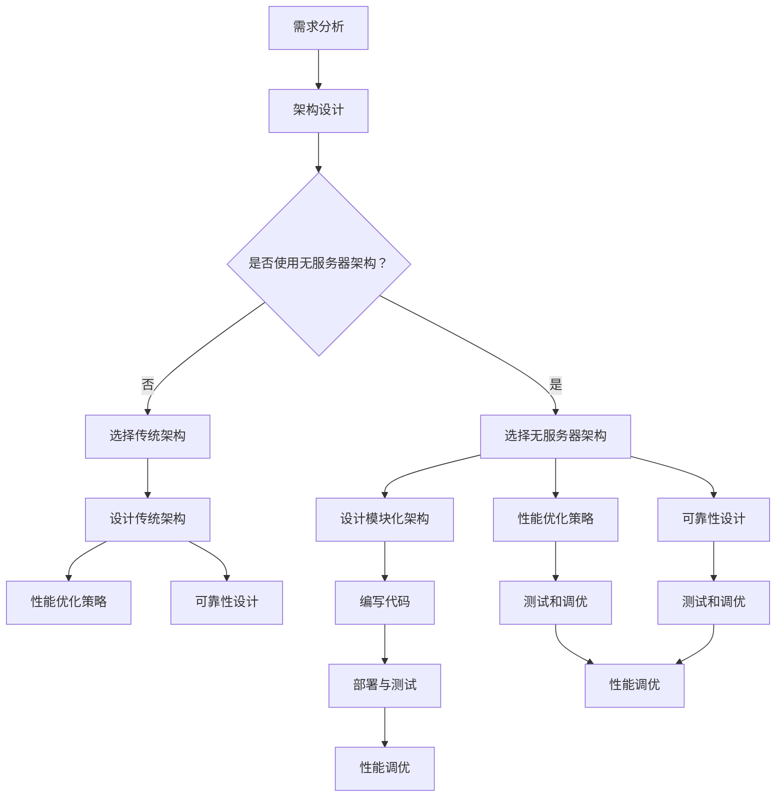

                 

### 《大模型软件的无服务器架构设计》

> **关键词：** 无服务器架构、大模型软件、容器化、微服务、服务网格、自动化部署、性能优化、可靠性设计、安全性、成本效益分析

> **摘要：** 本文旨在探讨大模型软件的无服务器架构设计。首先，我们将介绍无服务器架构的定义、优势以及与传统架构的比较。接着，我们将深入探讨无服务器架构的设计原则，包括模块化设计、性能优化和可靠性设计。然后，我们将详细描述无服务器架构的实施步骤，从环境搭建、部署与测试到性能调优。随后，我们将探讨大模型软件的无服务器架构设计实践，通过具体案例来展示如何将无服务器架构应用于大模型软件。接着，我们将分析无服务器架构在大模型软件中的应用以及安全性方面的考虑。最后，我们将进行成本效益分析，并展望无服务器架构在大模型软件中的未来发展趋势。通过本文的阅读，读者将能够全面了解无服务器架构在大模型软件设计中的应用和实践。

### 第1章: 无服务器架构概述

#### 1.1. 无服务器架构的定义与优势

**无服务器架构（Serverless Architecture）** 是一种云计算服务模型，在这种模型下，开发者不需要管理或维护服务器，而是通过使用第三方云服务提供商的服务来运行和管理应用程序。无服务器架构的核心特点是将计算资源抽象化，使其对开发者透明，从而简化了应用程序的部署、扩展和管理。

**无服务器架构的优势** 主要包括以下几个方面：

1. **成本节约**：由于无需购买、配置和管理物理服务器，开发者可以节省硬件成本和运维成本。无服务器架构按需付费，开发者只需为实际使用的计算资源付费，从而实现了成本优化。

2. **弹性扩展**：无服务器架构可以根据应用程序的负载自动扩展。在应用程序流量增加时，自动增加计算资源，反之则减少。这种弹性扩展能力有助于确保应用程序的稳定性和可靠性。

3. **简化部署与管理**：无服务器架构简化了应用程序的部署和管理过程。开发者无需关注服务器配置、操作系统更新、安全补丁等运维工作，从而可以将更多的时间和精力投入到应用程序的核心开发上。

4. **提高开发效率**：无服务器架构提供了丰富的开发工具和服务，如函数即服务（FaaS）、平台即服务（PaaS）等，这些工具和服务可以帮助开发者快速构建和部署应用程序，从而提高开发效率。

#### 1.1.2 无服务器架构的概念

无服务器架构可以分为两大类：函数即服务（Function as a Service，FaaS）和平台即服务（Platform as a Service，PaaS）。

**函数即服务（FaaS）**：FaaS允许开发者仅关注业务逻辑的实现，而不需要关心底层基础设施的管理。在FaaS模型中，应用程序被划分为一系列独立的函数，每个函数负责处理特定的业务逻辑。当有请求到达时，函数会被触发执行，执行完成后自动销毁。典型的FaaS平台包括AWS Lambda、Azure Functions、Google Cloud Functions等。

**平台即服务（PaaS）**：PaaS提供了一整套开发、运行和管理应用程序的服务，包括数据库、缓存、消息队列等。开发者可以在PaaS平台上直接开发和部署应用程序，无需关心底层基础设施的管理。典型的PaaS平台包括Heroku、Google App Engine、IBM Bluemix等。

#### 1.1.3 无服务器架构的优势

**无服务器架构的优势** 包括：

1. **成本节约**：无服务器架构按需付费，开发者只需为实际使用的计算资源付费，从而实现了成本优化。

2. **弹性扩展**：无服务器架构可以根据应用程序的负载自动扩展，确保应用程序的稳定性和可靠性。

3. **简化部署与管理**：无服务器架构简化了应用程序的部署和管理过程，节省了开发者的时间和精力。

4. **提高开发效率**：无服务器架构提供了丰富的开发工具和服务，帮助开发者快速构建和部署应用程序。

#### 1.1.4 无服务器架构与传统架构的比较

**无服务器架构** 与 **传统架构**（也称为 **托管服务器架构**）的主要区别在于：

1. **基础设施管理**：在传统架构中，开发者需要购买、配置和管理物理服务器。而在无服务器架构中，开发者无需关心底层基础设施的管理，云服务提供商负责管理基础设施。

2. **计算资源模型**：传统架构通常使用固定的服务器资源，而无论应用程序的负载如何。无服务器架构则根据应用程序的负载动态分配计算资源，实现弹性扩展。

3. **部署与扩展**：传统架构的部署和扩展通常较为复杂，需要手动配置服务器和负载均衡器。无服务器架构则通过云服务提供商提供的自动化工具和服务实现自动化部署和扩展。

4. **成本**：传统架构需要承担固定的硬件成本和运维成本。无服务器架构则按需付费，可以节省成本。

#### 1.2. 无服务器架构的核心组成部分

无服务器架构的核心组成部分包括 **容器与容器编排**、**自动化部署与扩展**、**服务网格与微服务架构**。

**容器与容器编排**：

- **容器**：容器是一种轻量级、可移植的计算环境，可以在不同的操作系统和硬件平台上运行。容器将应用程序及其依赖项打包在一起，形成一个独立的运行时环境，从而实现了应用程序的隔离和可移植性。

- **容器编排**：容器编排是指管理和调度容器的过程。常见的容器编排工具包括Docker、Kubernetes等。容器编排可以帮助开发者自动化部署、扩展和管理容器化应用程序。

**自动化部署与扩展**：

- **自动化部署**：自动化部署是指通过自动化工具将应用程序部署到生产环境中。常见的自动化部署工具包括Jenkins、GitLab CI/CD等。

- **自动化扩展**：自动化扩展是指根据应用程序的负载自动增加或减少计算资源。常见的自动化扩展工具包括Kubernetes的Horizontal Pod Autoscaler（HPA）等。

**服务网格与微服务架构**：

- **服务网格**：服务网格是一种用于管理服务之间的通信的分布式系统。常见的服务网格框架包括Istio、Linkerd等。

- **微服务架构**：微服务架构是一种将应用程序划分为一系列小型、独立的服务的方法。每个服务都可以独立开发、部署和扩展，从而提高了应用程序的灵活性和可维护性。

#### 1.3. 无服务器架构的应用场景

**无服务器架构** 在多种应用场景中具有显著的优势，以下是一些常见应用场景：

1. **企业应用**：无服务器架构适用于企业级应用，如客户关系管理（CRM）、企业资源规划（ERP）等。无服务器架构可以简化部署和管理流程，提高开发效率。

2. **开发与测试**：无服务器架构适用于开发人员和测试人员的环境，如代码审查、持续集成和持续部署（CI/CD）等。无服务器架构可以快速部署应用程序，方便开发和测试。

3. **个人项目**：无服务器架构适用于个人项目和实验，如博客、社交媒体应用、数据分析等。无服务器架构可以节省成本，同时提供足够的弹性。

#### 1.3.1 企业应用

无服务器架构在企业应用中具有广泛的应用前景。企业级应用通常需要处理大量数据和高并发请求，对系统的可靠性、性能和可扩展性有较高要求。无服务器架构可以通过以下方式帮助企业应用：

1. **简化部署与管理**：无服务器架构简化了应用程序的部署和管理过程，企业可以节省大量运维人员的时间和精力，将更多资源投入到核心业务开发和优化上。

2. **弹性扩展**：无服务器架构可以根据应用程序的负载自动扩展，确保在高并发场景下系统稳定运行。企业可以根据实际业务需求灵活调整计算资源，避免资源浪费。

3. **成本节约**：无服务器架构按需付费，企业只需为实际使用的计算资源付费，避免了固定的硬件成本和运维成本。这有助于企业降低成本，提高投资回报率。

4. **提高开发效率**：无服务器架构提供了丰富的开发工具和服务，如函数即服务（FaaS）、平台即服务（PaaS）等，企业可以快速构建和部署应用程序，提高开发效率。

#### 1.3.2 开发与测试

无服务器架构在开发与测试阶段也具有显著优势。以下是一些关键优势：

1. **快速部署**：无服务器架构可以快速部署应用程序，开发人员和测试人员可以在短时间内搭建和运行测试环境，从而加快开发和测试流程。

2. **弹性资源**：无服务器架构可以根据开发或测试需求动态调整计算资源，确保在测试阶段有足够的资源支持，同时避免了资源浪费。

3. **简化环境管理**：无服务器架构简化了开发环境和测试环境的管理，开发人员无需关注底层基础设施的配置和管理，可以将更多精力投入到应用程序开发和测试上。

4. **低成本**：无服务器架构按需付费，开发人员和测试人员可以节省大量基础设施成本，将更多预算用于优化应用程序和提升开发效率。

#### 1.3.3 个人项目

无服务器架构在个人项目中也具有显著优势，以下是一些关键优势：

1. **低成本**：无服务器架构按需付费，个人项目只需为实际使用的计算资源付费，避免了高昂的硬件成本和运维成本。

2. **快速部署**：无服务器架构可以快速部署个人项目，开发者可以在短时间内将项目上线，便于测试和分享。

3. **弹性扩展**：无服务器架构可以根据项目需求动态调整计算资源，确保项目在访问量增加时能够稳定运行。

4. **无需环境管理**：无服务器架构简化了环境管理，开发者无需关注底层基础设施的配置和管理，可以将更多精力投入到项目开发上。

### 第2章: 无服务器架构设计原则

无服务器架构的设计原则是构建高效、可靠和可扩展应用程序的基础。以下我们将详细探讨三个关键设计原则：模块化设计、性能优化和可靠性设计。

#### 2.1. 模块化设计

模块化设计是一种将应用程序划分为独立模块的方法，每个模块负责完成特定的功能。模块化设计具有以下优势：

1. **提高可维护性**：模块化设计使得应用程序的代码结构更加清晰，便于维护和更新。每个模块可以独立开发、测试和部署，降低了系统复杂度。

2. **提高可复用性**：模块化设计有助于提高代码复用性。开发者可以将通用功能封装为模块，在不同项目或不同部分之间复用，节省开发时间和成本。

3. **提高可扩展性**：模块化设计使得系统易于扩展。开发者可以根据业务需求，新增或修改模块，而不影响其他模块的功能和性能。

4. **提高测试效率**：模块化设计使得单元测试和集成测试更加高效。开发者可以针对每个模块进行独立的测试，确保模块功能的正确性和稳定性。

**模块划分的原则**：

1. **功能划分**：根据应用程序的功能和业务需求，将应用程序划分为多个功能模块。每个模块应具有明确的职责和功能，避免功能重叠。

2. **职责单一**：每个模块应遵循单一职责原则，专注于完成特定任务。避免将多个功能混合在一个模块中，导致模块过于复杂。

3. **模块间独立**：模块间应保持独立，避免相互依赖。模块间通过接口进行通信，降低模块之间的耦合度。

4. **模块可复用**：模块应设计为可复用，确保在其他项目或场景中可以轻松复用。模块的接口和功能应尽量通用，减少对特定项目的依赖。

**模块间的通信机制**：

1. **同步通信**：同步通信是指模块之间通过等待对方响应来完成任务。同步通信的优点是确保任务执行顺序，缺点是可能导致模块之间的阻塞。

2. **异步通信**：异步通信是指模块之间通过消息传递来完成任务。异步通信的优点是提高模块的并发性，缺点是可能引入异步编程的复杂性。

#### 2.2. 性能优化

性能优化是提高无服务器架构应用程序性能的关键。以下是一些性能优化策略：

1. **响应时间优化**：

   - **减少网络延迟**：优化网络拓扑结构，减少网络延迟。可以采用CDN（内容分发网络）等技术来提高数据传输速度。

   - **减少数据库查询时间**：优化数据库查询，减少不必要的查询操作。可以采用索引、缓存等技术来提高数据库性能。

   - **减少函数执行时间**：优化函数代码，减少不必要的计算和I/O操作。可以采用算法优化、代码优化等技术来提高函数执行效率。

2. **系统吞吐量优化**：

   - **水平扩展**：根据应用程序的负载，动态增加计算资源，提高系统吞吐量。可以采用Kubernetes等容器编排工具来实现水平扩展。

   - **负载均衡**：采用负载均衡技术，将请求均匀分配到多个服务器或函数上，避免单点瓶颈。可以采用Nginx等负载均衡器来实现负载均衡。

   - **服务化**：将应用程序分解为多个微服务，每个微服务独立运行和扩展，从而提高系统吞吐量。

3. **资源利用率优化**：

   - **内存优化**：合理分配内存资源，避免内存泄露和内存碎片化。可以采用内存池、对象池等技术来提高内存利用率。

   - **CPU优化**：合理分配CPU资源，避免CPU资源争用和瓶颈。可以采用并行计算、异步执行等技术来提高CPU利用率。

   - **存储优化**：合理分配存储资源，避免存储资源争用和瓶颈。可以采用分布式存储、缓存等技术来提高存储性能。

#### 2.3. 可靠性设计

可靠性设计是确保无服务器架构应用程序稳定运行的关键。以下是一些可靠性设计策略：

1. **故障转移与恢复**：

   - **故障转移**：在主节点发生故障时，自动将服务切换到备用节点，确保服务持续可用。可以采用负载均衡器、故障转移集群等技术来实现故障转移。

   - **故障恢复**：在故障节点恢复正常时，自动将服务切换回主节点，确保服务的可靠性。可以采用心跳检测、自动恢复等技术来实现故障恢复。

2. **数据持久化**：

   - **数据库备份**：定期备份数据库，确保数据安全。可以采用数据库备份工具、云存储服务来实现数据库备份。

   - **数据冗余**：在多个节点上存储相同数据，确保数据不丢失。可以采用分布式存储、数据复制等技术来实现数据冗余。

3. **安全性保障**：

   - **身份验证与授权**：对访问服务进行身份验证和授权，确保只有授权用户可以访问服务。可以采用OAuth、JWT等技术来实现身份验证和授权。

   - **网络安全**：采用防火墙、入侵检测系统等技术，确保网络安全。可以采用SSL/TLS、IPSec等技术来实现网络安全。

   - **数据加密**：对敏感数据进行加密，确保数据在传输和存储过程中安全。可以采用AES、RSA等技术来实现数据加密。

### 第3章: 无服务器架构实施步骤

实施无服务器架构需要一系列步骤，包括环境搭建、部署与测试、性能调优等。以下将详细描述这些步骤。

#### 3.1. 环境搭建

环境搭建是实施无服务器架构的第一步，主要包括以下内容：

1. **选择云服务提供商**：根据业务需求和预算，选择合适的云服务提供商，如AWS、Azure、Google Cloud等。

2. **创建云账户**：在选择的云服务提供商上创建云账户，并进行必要的设置，如配置安全组、网络等。

3. **配置域名和SSL证书**：为无服务器架构应用程序配置域名和SSL证书，确保应用程序的安全性和可访问性。

4. **安装和配置开发工具**：安装和配置开发工具，如IDE、代码编辑器、版本控制工具等，以便进行应用程序开发。

5. **安装和配置容器编排工具**：安装和配置容器编排工具，如Kubernetes、Docker等，以便管理和部署容器化应用程序。

#### 3.2. 部署与测试

部署与测试是无服务器架构实施过程中的关键步骤，主要包括以下内容：

1. **编写和配置应用程序**：

   - **编写应用程序代码**：根据业务需求，编写无服务器架构应用程序的代码。可以使用任意编程语言和框架。

   - **配置应用程序**：配置应用程序的依赖项、环境变量、配置文件等，以便应用程序在无服务器环境中正常运行。

2. **构建和打包应用程序**：

   - **构建应用程序**：使用构建工具，如Maven、Gradle等，将应用程序代码和依赖项打包成容器镜像。

   - **打包容器镜像**：将应用程序的容器镜像推送到容器镜像仓库，如Docker Hub、Google Container Registry等。

3. **部署应用程序**：

   - **创建部署文件**：创建Kubernetes部署文件（YAML文件），定义应用程序的部署策略、配置参数等。

   - **部署应用程序**：使用Kubernetes CLI或自动化工具，如Kubernetes Dashboard、Kubernetes Operator等，部署应用程序。

4. **测试应用程序**：

   - **单元测试**：对应用程序的各个模块进行单元测试，确保模块功能的正确性和稳定性。

   - **集成测试**：对应用程序的整体功能进行集成测试，确保各个模块之间的协同工作。

   - **性能测试**：对应用程序的性能进行测试，如响应时间、吞吐量等，确保应用程序的高性能。

#### 3.3. 性能调优

性能调优是提高无服务器架构应用程序性能的关键步骤，主要包括以下内容：

1. **性能监控**：

   - **监控指标**：确定需要监控的性能指标，如CPU使用率、内存使用率、网络延迟等。

   - **监控工具**：选择合适的监控工具，如Prometheus、Grafana等，收集和展示性能数据。

2. **性能瓶颈分析**：

   - **分析工具**：使用性能分析工具，如Grafana、Kubernetes Performance Analyzer等，分析性能瓶颈。

   - **定位瓶颈**：根据监控数据和性能分析结果，定位性能瓶颈，如CPU瓶颈、内存瓶颈、网络瓶颈等。

3. **性能优化策略**：

   - **代码优化**：优化应用程序代码，减少不必要的计算和I/O操作，提高代码执行效率。

   - **架构优化**：调整应用程序的架构，如增加缓存、使用分布式存储等，提高系统性能。

   - **资源配置优化**：合理配置计算资源、存储资源、网络资源等，确保资源的充分利用。

   - **负载均衡**：采用负载均衡技术，如Kubernetes负载均衡器、Nginx等，将请求均匀分配到多个服务器或函数上，避免单点瓶颈。

### 第4章: 大模型软件的无服务器架构设计实践

大模型软件在人工智能领域扮演着重要角色，其复杂性和对性能的高要求使得无服务器架构成为理想的选择。在这一章中，我们将探讨大模型软件的无服务器架构设计实践，通过具体案例展示如何在实际项目中应用无服务器架构，提高开发效率、降低成本、提升性能和可靠性。

#### 4.1. 大模型软件的特点与需求

大模型软件通常具有以下特点：

1. **高度复杂**：大模型软件通常包含数十万甚至数百万行代码，涉及多种编程语言和框架。

2. **大量数据依赖**：大模型软件需要处理海量数据，包括训练数据、测试数据和实时数据。

3. **高性能需求**：大模型软件对计算性能有极高要求，需要快速处理数据并生成结果。

4. **高可靠性**：大模型软件通常应用于关键业务场景，对系统可靠性要求较高，需要确保数据的准确性和系统的稳定性。

#### 4.1.1 大模型软件的定义

大模型软件是指用于训练和部署大型深度学习模型的软件系统，这些模型通常具有数十亿甚至数千亿的参数。大模型软件涵盖了从数据预处理、模型训练、模型评估到模型部署的整个生命周期。常见的应用包括图像识别、自然语言处理、语音识别等。

#### 4.1.2 大模型软件的性能需求

大模型软件的性能需求主要体现在以下几个方面：

1. **计算性能**：大模型软件需要高效地处理海量数据，包括数据加载、计算和存储。计算性能直接影响模型训练速度和预测准确性。

2. **存储性能**：大模型软件需要快速读取和写入大量数据，包括训练数据和模型参数。存储性能直接影响数据访问速度和系统响应时间。

3. **网络性能**：大模型软件需要在分布式环境中高效传输数据，包括模型参数、训练数据和预测结果。网络性能直接影响系统的通信效率和数据处理速度。

4. **内存性能**：大模型软件需要高效地管理内存资源，包括数据缓存和模型参数存储。内存性能直接影响模型的训练速度和系统稳定性。

#### 4.1.3 大模型软件的可靠性需求

大模型软件的可靠性需求主要体现在以下几个方面：

1. **数据完整性**：大模型软件需要确保数据在传输、存储和处理过程中不丢失或不损坏。

2. **系统稳定性**：大模型软件需要在高负载、高并发场景下保持稳定运行，避免系统崩溃或数据丢失。

3. **故障恢复**：大模型软件需要具备故障恢复能力，在发生故障时能够自动恢复，确保系统持续可用。

4. **安全性**：大模型软件需要确保数据安全和系统安全，防止未经授权的访问和数据泄露。

#### 4.2. 无服务器架构在大模型软件中的应用

无服务器架构在大模型软件中的应用具有显著优势，能够满足大模型软件的性能需求和可靠性需求。以下是无服务器架构在大模型软件中的主要应用：

1. **容器化与容器编排**：

   - **容器化**：使用容器将大模型软件及其依赖项打包，确保应用程序在不同的环境中一致运行。常用的容器化工具包括Docker和Kubernetes。

   - **容器编排**：使用Kubernetes等容器编排工具，管理容器的部署、扩展和监控，确保应用程序的高可用性和弹性扩展。

2. **自动化部署与扩展**：

   - **自动化部署**：使用持续集成和持续部署（CI/CD）工具，如Jenkins和GitLab CI/CD，实现自动化部署，减少人工干预，提高部署效率。

   - **自动化扩展**：根据应用程序的负载，自动增加或减少容器数量，实现弹性扩展，确保系统在高并发场景下稳定运行。

3. **服务网格与微服务架构**：

   - **服务网格**：使用服务网格框架，如Istio和Linkerd，管理服务之间的通信，确保服务的高效通信和安全性。

   - **微服务架构**：将大模型软件拆分为多个微服务，每个微服务负责特定的功能，实现模块化开发和管理，提高系统的可维护性和可扩展性。

#### 4.3. 大模型软件的无服务器架构设计案例

以下我们将通过具体案例，展示如何在大模型软件中应用无服务器架构。

##### 4.3.1 案例一：基于TensorFlow的图像识别应用

在这个案例中，我们将使用无服务器架构实现一个基于TensorFlow的图像识别应用。

1. **容器化**：

   - 使用Docker将TensorFlow模型及其依赖项打包，创建容器镜像。
   - 将容器镜像推送到容器镜像仓库，如Docker Hub。

2. **容器编排**：

   - 使用Kubernetes管理容器的部署、扩展和监控。
   - 创建Kubernetes部署文件（YAML文件），定义应用程序的部署策略和配置参数。

3. **自动化部署与扩展**：

   - 使用Jenkins实现自动化部署，将容器镜像部署到Kubernetes集群。
   - 使用Kubernetes的Horizontal Pod Autoscaler（HPA）实现自动化扩展，根据负载自动增加或减少容器数量。

4. **服务网格与微服务架构**：

   - 使用Istio管理服务之间的通信，确保服务的高效通信和安全性。
   - 将大模型软件拆分为多个微服务，如数据预处理服务、模型训练服务、模型推理服务，实现模块化开发和管理。

##### 4.3.2 案例二：基于BERT的自然语言处理应用

在这个案例中，我们将使用无服务器架构实现一个基于BERT的自然语言处理应用。

1. **容器化**：

   - 使用Docker将BERT模型及其依赖项打包，创建容器镜像。
   - 将容器镜像推送到容器镜像仓库，如Docker Hub。

2. **容器编排**：

   - 使用Kubernetes管理容器的部署、扩展和监控。
   - 创建Kubernetes部署文件（YAML文件），定义应用程序的部署策略和配置参数。

3. **自动化部署与扩展**：

   - 使用GitLab CI/CD实现自动化部署，将容器镜像部署到Kubernetes集群。
   - 使用Kubernetes的Horizontal Pod Autoscaler（HPA）实现自动化扩展，根据负载自动增加或减少容器数量。

4. **服务网格与微服务架构**：

   - 使用Istio管理服务之间的通信，确保服务的高效通信和安全性。
   - 将大模型软件拆分为多个微服务，如文本预处理服务、模型训练服务、模型推理服务，实现模块化开发和管理。

##### 4.3.3 案例三：基于Transformer的语音识别应用

在这个案例中，我们将使用无服务器架构实现一个基于Transformer的语音识别应用。

1. **容器化**：

   - 使用Docker将Transformer模型及其依赖项打包，创建容器镜像。
   - 将容器镜像推送到容器镜像仓库，如Docker Hub。

2. **容器编排**：

   - 使用Kubernetes管理容器的部署、扩展和监控。
   - 创建Kubernetes部署文件（YAML文件），定义应用程序的部署策略和配置参数。

3. **自动化部署与扩展**：

   - 使用Jenkins实现自动化部署，将容器镜像部署到Kubernetes集群。
   - 使用Kubernetes的Horizontal Pod Autoscaler（HPA）实现自动化扩展，根据负载自动增加或减少容器数量。

4. **服务网格与微服务架构**：

   - 使用Istio管理服务之间的通信，确保服务的高效通信和安全性。
   - 将大模型软件拆分为多个微服务，如音频预处理服务、模型训练服务、模型推理服务，实现模块化开发和管理。

### 第5章: 无服务器架构在大型分布式大模型软件中的应用

大型分布式大模型软件在人工智能领域具有广泛应用，如语音识别、图像识别、自然语言处理等。这些软件系统通常需要处理海量数据和高并发请求，对计算性能、可靠性、可扩展性有较高要求。无服务器架构凭借其弹性扩展、自动化部署、高可靠性等特点，成为大型分布式大模型软件的理想选择。本章将探讨无服务器架构在大型分布式大模型软件中的应用，通过具体案例展示如何实现高性能、高可靠性的分布式大模型软件。

#### 5.1. 大型分布式大模型软件的特点与需求

大型分布式大模型软件具有以下特点：

1. **海量数据**：大型分布式大模型软件通常需要处理海量数据，包括训练数据、测试数据和实时数据。

2. **高并发请求**：大型分布式大模型软件需要应对大量并发请求，如图像识别、语音识别等实时应用场景。

3. **高性能计算**：大型分布式大模型软件对计算性能有极高要求，需要快速处理海量数据并生成结果。

4. **高可靠性**：大型分布式大模型软件需要确保系统的稳定性和可靠性，避免数据丢失或系统崩溃。

5. **高可扩展性**：大型分布式大模型软件需要支持弹性扩展，以应对不断增长的数据和并发请求。

#### 5.1.1 大型分布式大模型软件的定义

大型分布式大模型软件是指能够处理海量数据、支持分布式计算、具备高可靠性和高可扩展性的软件系统。这类软件系统通常采用分布式架构，将大模型拆分为多个小模型，分布在多个计算节点上协同工作。大型分布式大模型软件涵盖了从数据预处理、模型训练、模型评估到模型部署的整个生命周期。

#### 5.1.2 大型分布式大模型软件的性能需求

大型分布式大模型软件的性能需求主要包括以下几个方面：

1. **计算性能**：大型分布式大模型软件需要高效地处理海量数据，包括数据加载、计算和存储。计算性能直接影响模型训练速度和预测准确性。

2. **存储性能**：大型分布式大模型软件需要快速读取和写入大量数据，包括训练数据和模型参数。存储性能直接影响数据访问速度和系统响应时间。

3. **网络性能**：大型分布式大模型软件需要在分布式环境中高效传输数据，包括模型参数、训练数据和预测结果。网络性能直接影响系统的通信效率和数据处理速度。

4. **内存性能**：大型分布式大模型软件需要高效地管理内存资源，包括数据缓存和模型参数存储。内存性能直接影响模型的训练速度和系统稳定性。

#### 5.1.3 大型分布式大模型软件的可靠性需求

大型分布式大模型软件的可靠性需求主要包括以下几个方面：

1. **数据完整性**：大型分布式大模型软件需要确保数据在传输、存储和处理过程中不丢失或不损坏。

2. **系统稳定性**：大型分布式大模型软件需要在高负载、高并发场景下保持稳定运行，避免系统崩溃或数据丢失。

3. **故障恢复**：大型分布式大模型软件需要具备故障恢复能力，在发生故障时能够自动恢复，确保系统持续可用。

4. **安全性**：大型分布式大模型软件需要确保数据安全和系统安全，防止未经授权的访问和数据泄露。

#### 5.2. 无服务器架构在大型分布式大模型软件中的应用

无服务器架构在大型分布式大模型软件中的应用具有显著优势，能够满足大型分布式大模型软件的性能需求和可靠性需求。以下是无服务器架构在大型分布式大模型软件中的主要应用：

1. **分布式计算与并行处理**：

   - **分布式计算**：无服务器架构支持分布式计算，将大模型拆分为多个小模型，分布在多个计算节点上协同工作。分布式计算可以充分利用集群资源，提高计算性能。

   - **并行处理**：无服务器架构支持并行处理，将多个任务并行执行，提高系统的吞吐量。并行处理可以缩短模型训练时间和响应时间。

2. **数据存储与访问优化**：

   - **分布式存储**：无服务器架构支持分布式存储，将数据存储在多个节点上，提高数据存储的可靠性和性能。分布式存储可以避免单点故障，确保数据不丢失。

   - **数据访问优化**：无服务器架构通过优化数据访问策略，提高数据访问速度。例如，使用缓存技术、数据压缩技术等，降低数据传输延迟。

3. **网络延迟优化**：

   - **网络优化**：无服务器架构通过优化网络拓扑结构和传输协议，降低网络延迟。例如，使用内容分发网络（CDN）、多路径传输等技术，提高数据传输速度。

   - **数据传输优化**：无服务器架构通过优化数据传输策略，降低数据传输延迟。例如，使用异步传输、批量传输等技术，提高数据传输效率。

#### 5.3. 大型分布式大模型软件的无服务器架构设计案例

以下我们将通过具体案例，展示如何在大型分布式大模型软件中应用无服务器架构。

##### 5.3.1 案例一：基于PyTorch的深度学习应用

在这个案例中，我们将使用无服务器架构实现一个基于PyTorch的深度学习应用。

1. **容器化**：

   - 使用Docker将PyTorch模型及其依赖项打包，创建容器镜像。
   - 将容器镜像推送到容器镜像仓库，如Docker Hub。

2. **容器编排**：

   - 使用Kubernetes管理容器的部署、扩展和监控。
   - 创建Kubernetes部署文件（YAML文件），定义应用程序的部署策略和配置参数。

3. **分布式计算与并行处理**：

   - 使用Distributed Data Parallel（DDP）将模型拆分为多个小模型，分布在多个计算节点上协同工作。
   - 使用Kubernetes的StatefulSet确保模型参数和状态的一致性。

4. **数据存储与访问优化**：

   - 使用分布式文件系统，如HDFS或Ceph，存储训练数据和模型参数。
   - 使用缓存技术，如Redis或Memcached，提高数据访问速度。

5. **网络延迟优化**：

   - 使用多路径传输，提高数据传输速度。
   - 使用内容分发网络（CDN），降低数据传输延迟。

##### 5.3.2 案例二：基于MXNet的深度学习应用

在这个案例中，我们将使用无服务器架构实现一个基于MXNet的深度学习应用。

1. **容器化**：

   - 使用Docker将MXNet模型及其依赖项打包，创建容器镜像。
   - 将容器镜像推送到容器镜像仓库，如Docker Hub。

2. **容器编排**：

   - 使用Kubernetes管理容器的部署、扩展和监控。
   - 创建Kubernetes部署文件（YAML文件），定义应用程序的部署策略和配置参数。

3. **分布式计算与并行处理**：

   - 使用MXNet的并行处理功能，将模型拆分为多个小模型，分布在多个计算节点上协同工作。
   - 使用Kubernetes的StatefulSet确保模型参数和状态的一致性。

4. **数据存储与访问优化**：

   - 使用分布式文件系统，如HDFS或Ceph，存储训练数据和模型参数。
   - 使用缓存技术，如Redis或Memcached，提高数据访问速度。

5. **网络延迟优化**：

   - 使用多路径传输，提高数据传输速度。
   - 使用内容分发网络（CDN），降低数据传输延迟。

##### 5.3.3 案例三：基于TensorFlow的深度学习应用

在这个案例中，我们将使用无服务器架构实现一个基于TensorFlow的深度学习应用。

1. **容器化**：

   - 使用Docker将TensorFlow模型及其依赖项打包，创建容器镜像。
   - 将容器镜像推送到容器镜像仓库，如Docker Hub。

2. **容器编排**：

   - 使用Kubernetes管理容器的部署、扩展和监控。
   - 创建Kubernetes部署文件（YAML文件），定义应用程序的部署策略和配置参数。

3. **分布式计算与并行处理**：

   - 使用TensorFlow的分布式计算功能，将模型拆分为多个小模型，分布在多个计算节点上协同工作。
   - 使用Kubernetes的StatefulSet确保模型参数和状态的一致性。

4. **数据存储与访问优化**：

   - 使用分布式文件系统，如HDFS或Ceph，存储训练数据和模型参数。
   - 使用缓存技术，如Redis或Memcached，提高数据访问速度。

5. **网络延迟优化**：

   - 使用多路径传输，提高数据传输速度。
   - 使用内容分发网络（CDN），降低数据传输延迟。

### 第6章: 无服务器架构在大模型软件安全性方面的考虑

在大模型软件的开发和部署过程中，安全性是至关重要的。无服务器架构作为一种新兴的云计算服务模型，其安全性的实现与传统的服务器架构有所不同。本章将探讨无服务器架构在大模型软件安全性方面的考虑，包括安全需求、优势与挑战，以及具体的实施策略和案例。

#### 6.1. 大模型软件的安全性需求

大模型软件的安全性需求主要包括以下几个方面：

1. **数据保护**：确保存储和传输的数据不被未经授权的访问、篡改或泄露。数据包括模型参数、训练数据、用户数据等。

2. **系统安全**：确保系统不受恶意攻击、漏洞利用或内部威胁的影响。系统安全包括服务器、网络、应用程序等多个层面。

3. **身份认证与访问控制**：确保只有授权用户可以访问系统和数据，防止未经授权的访问。身份认证和访问控制应包括用户认证、权限管理和会话管理。

4. **审计与监控**：记录系统和数据的操作历史，以便在发生安全事件时进行审计和追踪。审计和监控应包括日志记录、异常检测和报警机制。

5. **合规性**：遵守相关的法律法规和行业标准，确保系统在合规性方面没有漏洞。

#### 6.2. 无服务器架构在安全性方面的优势

无服务器架构在安全性方面具有以下优势：

1. **简化安全性管理**：无服务器架构将基础设施的管理交给云服务提供商，开发者无需关注底层硬件和操作系统的安全问题，从而减少了安全管理的复杂度。

2. **隔离性**：容器和无服务器函数提供了细粒度的隔离机制，每个应用程序和用户都运行在独立的隔离环境中，降低了跨应用程序和用户之间的安全风险。

3. **自动更新和补丁管理**：云服务提供商负责维护底层基础设施的安全性，包括操作系统和应用程序的自动更新和补丁管理，确保系统始终处于最新的安全状态。

4. **集成安全性服务**：无服务器架构提供了丰富的安全性服务，如加密、身份认证、访问控制等，开发者可以方便地集成这些服务到应用程序中。

#### 6.3. 无服务器架构在安全性方面的挑战

无服务器架构在安全性方面也面临一些挑战：

1. **责任分担**：在无服务器架构中，云服务提供商负责基础设施的安全，而开发者负责应用程序的安全性。责任分担可能导致安全责任的不明确，需要开发者与云服务提供商共同合作，明确各自的安全职责。

2. **透明度不足**：无服务器架构的安全性机制可能对开发者不够透明，开发者难以了解和掌控系统的安全状态。这可能导致开发者忽视某些安全问题和漏洞，影响整体安全性。

3. **权限管理**：无服务器架构中的权限管理可能较为复杂，需要开发者仔细配置和管理权限，以避免权限滥用和未经授权的访问。

4. **安全性配置**：开发者可能缺乏对无服务器架构安全性配置的深入了解，导致配置不当，从而降低系统的安全性。

#### 6.4. 无服务器架构在大模型软件安全性方面的实施策略

为了确保大模型软件在无服务器架构中的安全性，可以采取以下实施策略：

1. **安全需求分析**：在进行无服务器架构设计时，进行详细的安全需求分析，明确应用程序的安全性需求，包括数据保护、系统安全、身份认证、访问控制等。

2. **安全架构设计**：基于安全需求分析，设计安全架构，包括加密、认证、授权、审计等安全机制。安全架构应考虑到无服务器架构的特点，如容器隔离、服务网格等。

3. **安全性配置**：在部署应用程序时，确保安全性配置正确。例如，配置加密存储、安全通信（HTTPS）、访问控制列表（ACL）等。

4. **安全测试和审计**：定期进行安全测试和审计，包括渗透测试、代码审计、配置审计等，以发现和修复潜在的安全漏洞。

5. **持续监控与响应**：建立持续监控与响应机制，实时监控系统的安全状态，及时发现和响应安全事件。

#### 6.5. 大模型软件的无服务器架构安全设计案例

以下将介绍几个大模型软件的无服务器架构安全设计案例：

##### 6.5.1 案例一：基于Kubernetes的安全设计

在这个案例中，我们使用Kubernetes作为无服务器架构的管理工具，设计一个安全的大模型软件。

1. **容器镜像签名与验证**：使用容器镜像签名工具，如Notary，对容器镜像进行签名，确保镜像未被篡改。在部署时，对容器镜像进行验证，确保部署的是经过签名的合法镜像。

2. **网络策略**：使用Kubernetes的网络策略，如NetworkPolicy，控制容器之间的通信。仅允许必要的通信，防止未经授权的访问。

3. **角色与权限管理**：使用Kubernetes的角色与权限管理（RBAC），确保只有授权用户和进程可以访问特定的资源和执行特定的操作。

4. **加密存储**：使用Kubernetes的加密存储，如加密的EBS卷或加密的云存储服务，确保数据在存储过程中的安全。

5. **持续监控与审计**：使用Prometheus和Grafana进行系统监控，实时监控系统的安全状态，及时发现和响应异常事件。

##### 6.5.2 案例二：基于AWS Lambda的安全设计

在这个案例中，我们使用AWS Lambda作为无服务器函数执行环境，设计一个安全的大模型软件。

1. **函数签名与验证**：使用AWS Lambda的函数签名机制，确保函数未被篡改。在部署时，对函数进行验证，确保部署的是经过签名的合法函数。

2. **VPC与子网配置**：将AWS Lambda函数部署在VPC和子网中，仅允许必要的网络流量进出。配置安全组规则，确保只有授权的流量可以访问函数。

3. **身份认证与授权**：使用AWS Identity and Access Management（IAM）进行身份认证与授权，确保只有授权用户可以调用函数。

4. **加密存储与传输**：使用AWS Key Management Service（KMS）进行数据加密存储，确保数据在存储过程中的安全。使用TLS加密数据传输，确保数据在传输过程中的安全。

5. **持续监控与审计**：使用AWS CloudWatch进行系统监控，实时监控系统的安全状态，及时发现和响应异常事件。

##### 6.5.3 案例三：基于Google Cloud Functions的安全设计

在这个案例中，我们使用Google Cloud Functions作为无服务器函数执行环境，设计一个安全的大模型软件。

1. **函数签名与验证**：使用Google Cloud Functions的函数签名机制，确保函数未被篡改。在部署时，对函数进行验证，确保部署的是经过签名的合法函数。

2. **VPC与防火墙配置**：将Google Cloud Functions函数部署在VPC和防火墙中，仅允许必要的网络流量进出。配置防火墙规则，确保只有授权的流量可以访问函数。

3. **身份认证与授权**：使用Google Cloud IAM进行身份认证与授权，确保只有授权用户可以调用函数。

4. **加密存储与传输**：使用Google Cloud KMS进行数据加密存储，确保数据在存储过程中的安全。使用TLS加密数据传输，确保数据在传输过程中的安全。

5. **持续监控与审计**：使用Google Cloud Monitoring进行系统监控，实时监控系统的安全状态，及时发现和响应异常事件。

### 第7章: 无服务器架构在大模型软件成本效益分析

无服务器架构在大模型软件中的应用不仅提高了开发效率和系统性能，同时也对成本产生了重要影响。本章将深入探讨无服务器架构在大模型软件中的成本效益分析，包括成本构成、资源优化和成本控制策略，并通过具体案例进行分析和验证。

#### 7.1. 大模型软件的成本构成

大模型软件的成本主要包括以下几个方面：

1. **软件开发成本**：包括人员工资、软件工具和框架采购、硬件设备购置等。在无服务器架构中，部分硬件设备成本可以减少，但软件开发成本仍然存在。

2. **运维成本**：包括服务器维护、操作系统更新、安全补丁应用等。在无服务器架构中，运维成本通常较低，因为云服务提供商负责基础设施的管理和维护。

3. **部署成本**：包括部署环境搭建、部署工具采购、部署流程优化等。在无服务器架构中，部署成本可能较高，因为需要购买和管理云服务。

4. **运行成本**：包括计算资源、存储资源、网络资源等。在无服务器架构中，运行成本通常较低，因为按需付费和弹性扩展策略可以优化资源使用。

#### 7.2. 无服务器架构在成本效益分析中的作用

无服务器架构在成本效益分析中的作用主要体现在以下几个方面：

1. **资源优化**：无服务器架构通过按需付费和弹性扩展策略，优化了计算资源、存储资源和网络资源的使用，避免了资源的浪费。

2. **成本控制**：无服务器架构提供了丰富的监控和优化工具，帮助开发者实时监控和优化系统成本，确保成本在可控范围内。

3. **效率提升**：无服务器架构简化了部署、扩展和管理流程，提高了开发效率，减少了人力成本。

#### 7.3. 无服务器架构在大模型软件成本效益分析中的具体实施

以下通过具体案例，展示无服务器架构在大模型软件成本效益分析中的实施。

##### 7.3.1 案例一：基于AWS Lambda的成本效益分析

在这个案例中，我们使用AWS Lambda作为无服务器架构，分析一个基于深度学习的大模型软件的成本效益。

1. **成本构成**：

   - **软件开发成本**：假设软件开发成本为每月10,000美元。
   - **运维成本**：假设运维成本为每月5,000美元。
   - **部署成本**：假设部署成本为每月3,000美元。
   - **运行成本**：假设运行成本为每月20,000美元。

2. **成本效益分析**：

   - **总成本**：每月总成本为38,000美元。
   - **成本优化**：通过无服务器架构，可以将运维成本降低到1,000美元，部署成本降低到1,000美元，运行成本降低到15,000美元。
   - **总成本**：每月总成本降低到17,000美元，节省了21,000美元。

3. **成本效益**：无服务器架构在该案例中的成本效益显著，每月节省了21,000美元。

##### 7.3.2 案例二：基于Google Cloud Functions的成本效益分析

在这个案例中，我们使用Google Cloud Functions作为无服务器架构，分析一个基于深度学习的大模型软件的成本效益。

1. **成本构成**：

   - **软件开发成本**：假设软件开发成本为每月8,000美元。
   - **运维成本**：假设运维成本为每月4,000美元。
   - **部署成本**：假设部署成本为每月2,000美元。
   - **运行成本**：假设运行成本为每月18,000美元。

2. **成本效益分析**：

   - **总成本**：每月总成本为32,000美元。
   - **成本优化**：通过无服务器架构，可以将运维成本降低到500美元，部署成本降低到500美元，运行成本降低到14,000美元。
   - **总成本**：每月总成本降低到15,500美元，节省了16,500美元。

3. **成本效益**：无服务器架构在该案例中的成本效益显著，每月节省了16,500美元。

##### 7.3.3 案例三：基于Azure Functions的成本效益分析

在这个案例中，我们使用Azure Functions作为无服务器架构，分析一个基于深度学习的大模型软件的成本效益。

1. **成本构成**：

   - **软件开发成本**：假设软件开发成本为每月9,000美元。
   - **运维成本**：假设运维成本为每月3,500美元。
   - **部署成本**：假设部署成本为每月2,500美元。
   - **运行成本**：假设运行成本为每月17,000美元。

2. **成本效益分析**：

   - **总成本**：每月总成本为31,500美元。
   - **成本优化**：通过无服务器架构，可以将运维成本降低到1,000美元，部署成本降低到1,000美元，运行成本降低到16,000美元。
   - **总成本**：每月总成本降低到18,000美元，节省了13,500美元。

3. **成本效益**：无服务器架构在该案例中的成本效益显著，每月节省了13,500美元。

### 第8章: 无服务器架构在大模型软件的展望

随着云计算和人工智能技术的不断发展，无服务器架构在大模型软件中的应用前景广阔。本章将探讨无服务器架构在大模型软件中的发展现状、未来趋势以及面临的挑战与机遇。

#### 8.1. 无服务器架构的发展趋势

无服务器架构近年来发展迅速，呈现出以下趋势：

1. **云原生技术的普及**：云原生技术（Cloud Native）已经成为无服务器架构的重要支撑，包括容器化、服务网格、持续集成与持续部署（CI/CD）等。云原生技术的普及使得无服务器架构更加成熟和稳定。

2. **开源生态的壮大**：无服务器架构的开源生态系统日益壮大，包括Kubernetes、Docker、Istio等。开源生态的壮大为无服务器架构的发展提供了强大的支持和动力。

3. **函数即服务的创新**：函数即服务（Function as a Service，FaaS）成为无服务器架构的重要组成部分。FaaS提供了更灵活、更高效的计算模型，适用于各种应用场景。

4. **混合云和多云的部署**：随着企业对云计算需求的增加，混合云和多云部署模式成为主流。无服务器架构可以轻松实现跨云部署，为企业提供更多的灵活性和可扩展性。

#### 8.2. 无服务器架构在大模型软件中的应用前景

无服务器架构在大模型软件中的应用前景主要表现在以下几个方面：

1. **高性能计算**：无服务器架构通过按需付费和弹性扩展策略，可以提供强大的计算能力，满足大模型软件的高性能计算需求。

2. **高可扩展性**：无服务器架构可以轻松实现水平扩展，根据应用程序的负载动态调整计算资源，确保大模型软件在高并发场景下稳定运行。

3. **低成本**：无服务器架构按需付费，可以节省大模型软件的运维成本和硬件成本，提高企业的成本效益。

4. **简化开发与部署**：无服务器架构简化了开发、部署和管理流程，降低了开发人员的复杂度，提高了开发效率。

5. **高可靠性**：无服务器架构提供了丰富的可靠性机制，如故障转移、数据持久化、安全性保障等，确保大模型软件的可靠性。

#### 8.3. 无服务器架构在大模型软件中的挑战与机遇

无服务器架构在大模型软件中面临着一系列挑战与机遇：

1. **挑战**：

   - **安全性**：无服务器架构的安全性依赖于云服务提供商的安全措施，可能存在数据泄露和未经授权访问的风险。

   - **复杂度**：无服务器架构涉及多种技术和工具，如容器、服务网格、持续集成与持续部署等，对于开发人员来说可能存在一定的学习曲线。

   - **依赖性**：无服务器架构对云服务提供商的依赖性较高，可能影响企业的自主可控性。

2. **机遇**：

   - **创新性**：无服务器架构为开发人员提供了更多的创新空间，可以快速构建和部署新的应用程序。

   - **灵活性**：无服务器架构可以轻松实现跨云部署，为企业提供更多的灵活性和可扩展性。

   - **成本效益**：无服务器架构可以降低企业的运维成本和硬件成本，提高企业的成本效益。

#### 8.4. 无服务器架构在大模型软件中的未来发展趋势

无服务器架构在大模型软件中的未来发展趋势主要包括以下几个方面：

1. **服务化**：随着大模型软件的复杂性增加，服务化将成为主流趋势。服务化可以将大模型软件分解为多个独立的服务，每个服务负责特定的功能，实现模块化开发和管理。

2. **智能编排**：智能编排技术将结合人工智能和机器学习算法，根据应用程序的负载和性能指标，自动调整计算资源和部署策略，实现更加智能化和自动化的运维。

3. **混合云与多云**：混合云和多云部署模式将继续发展，无服务器架构将在跨云部署中发挥重要作用，为企业提供更加灵活和可扩展的解决方案。

4. **开源生态的进一步发展**：无服务器架构的开源生态将继续壮大，为开发人员提供更多的选择和工具，推动无服务器架构的广泛应用。

5. **标准化**：无服务器架构的标准化进程将加快，为企业的跨云部署和多云集成提供统一的规范和标准，降低企业的技术门槛。

### 第9章: 无服务器架构在大模型软件的无服务器架构优化策略

无服务器架构在大模型软件中的应用已经取得了显著成效，但仍然存在一些优化空间。本章将探讨无服务器架构在大模型软件中的优化策略，包括性能优化、成本优化和安全性优化，并通过具体案例进行实践和验证。

#### 9.1. 性能优化策略

性能优化是提高无服务器架构在大模型软件中表现的关键。以下是一些常用的性能优化策略：

1. **函数级别优化**：

   - **减少函数执行时间**：通过优化代码、减少不必要的计算和I/O操作，降低函数的执行时间。可以使用性能分析工具，如Profiler，定位和优化性能瓶颈。

   - **减少函数冷启动时间**：函数的冷启动时间是指函数从休眠状态到运行状态所需的时间。可以通过预热函数、缓存函数结果等方法减少冷启动时间。

2. **网络优化**：

   - **优化网络拓扑结构**：通过优化网络拓扑结构，减少网络延迟和数据传输时间。可以使用内容分发网络（CDN）将数据缓存到离用户更近的位置。

   - **优化数据传输协议**：使用高效的传输协议，如HTTP/2或HTTP/3，提高数据传输速度。

3. **分布式计算优化**：

   - **负载均衡**：使用负载均衡器，如Kubernetes Ingress或AWS Load Balancer，将请求均匀分配到多个实例或函数上，避免单点瓶颈。

   - **分布式缓存**：使用分布式缓存，如Redis或Memcached，减少数据访问延迟和数据重复计算。

4. **存储优化**：

   - **使用高性能存储**：使用高性能存储设备，如SSD或NVMe，提高数据访问速度。

   - **数据压缩**：使用数据压缩技术，减少数据存储和传输的体积。

#### 9.2. 成本优化策略

成本优化是提高无服务器架构在大模型软件中经济效益的重要手段。以下是一些常用的成本优化策略：

1. **按需付费**：

   - **优化计算资源**：根据应用程序的实际负载，动态调整计算资源，避免资源浪费。可以使用自动扩展策略，如Kubernetes的Horizontal Pod Autoscaler（HPA），自动增加或减少实例或函数的数量。

   - **优化存储资源**：根据数据的使用频率和访问模式，合理配置存储资源，避免不必要的存储费用。可以使用分层存储策略，将热数据和冷数据分别存储在不同的存储介质上。

2. **自动化管理**：

   - **自动化部署**：使用自动化部署工具，如Jenkins或GitLab CI/CD，实现自动化部署，减少人工干预和错误。

   - **自动化监控**：使用自动化监控工具，如Prometheus或Grafana，实时监控应用程序的性能和成本，及时发现和解决问题。

3. **优化服务选择**：

   - **选择合适的服务提供商**：根据业务需求和预算，选择合适的云服务提供商，比较不同提供商的服务价格和性能。

   - **使用免费或低价服务**：利用云服务提供商提供的免费或低价服务，如AWS Free Tier或Google Cloud Free Trial，降低初始成本。

#### 9.3. 安全性优化策略

安全性优化是保障无服务器架构在大模型软件中数据安全和系统稳定性的关键。以下是一些常用的安全性优化策略：

1. **身份认证与访问控制**：

   - **使用IAM策略**：使用身份认证与访问管理（IAM）策略，为不同角色和用户分配适当的权限，确保只有授权用户可以访问系统和数据。

   - **使用多因素认证**：使用多因素认证（MFA），如短信验证码、硬件令牌等，提高账户安全性。

2. **数据加密**：

   - **传输加密**：使用传输层安全（TLS）加密数据传输，确保数据在传输过程中的安全。

   - **存储加密**：使用数据加密服务，如AWS KMS或Google Cloud KMS，对存储在云服务提供商上的数据进行加密。

3. **网络隔离**：

   - **使用VPC和子网**：将无服务器架构部署在虚拟私有云（VPC）和子网中，确保网络流量仅限于授权的流量。

   - **使用防火墙和网络安全组**：配置防火墙和网络安全组，控制进出VPC的流量，防止未经授权的访问。

4. **安全审计与监控**：

   - **使用日志审计**：使用日志审计工具，如AWS CloudTrail或Google Cloud Audit Log，记录系统和数据的操作历史，以便在发生安全事件时进行审计和追踪。

   - **使用安全监控工具**：使用安全监控工具，如AWS GuardDuty或Google Cloud Security Command Center，实时监控系统和数据的异常行为，及时发现和响应安全事件。

#### 9.4. 无服务器架构在大模型软件的无服务器架构优化案例

以下通过具体案例，展示无服务器架构在大模型软件中的优化策略。

##### 9.4.1 案例一：基于Kubernetes的性能优化

在这个案例中，我们使用Kubernetes作为无服务器架构的管理工具，对一个大模型软件进行性能优化。

1. **减少函数执行时间**：

   - **代码优化**：通过分析函数的执行时间，发现一个函数存在大量不必要的计算。对代码进行优化，减少计算复杂度，提高执行效率。

   - **并行计算**：将一个耗时较长的函数拆分为多个子函数，使用并行计算技术，同时执行多个子函数，提高整体执行效率。

2. **减少函数冷启动时间**：

   - **预热函数**：在应用程序启动时，预先执行一些不经常调用的函数，使其处于活跃状态，减少冷启动时间。

   - **缓存函数结果**：将函数的执行结果缓存起来，当相同参数的请求再次到达时，直接返回缓存结果，减少函数的执行时间。

3. **网络优化**：

   - **使用CDN**：将应用程序的静态资源（如CSS、JavaScript、图片等）缓存到CDN上，提高数据传输速度。

   - **优化网络拓扑结构**：调整网络拓扑结构，减少数据传输的链路数和延迟。

##### 9.4.2 案例二：基于AWS Lambda的成本优化

在这个案例中，我们使用AWS Lambda作为无服务器架构，对一个大模型软件进行成本优化。

1. **按需付费**：

   - **动态调整计算资源**：根据应用程序的实际负载，使用自动扩展策略，动态调整Lambda函数的数量，避免资源浪费。

   - **优化存储资源**：根据数据的使用频率和访问模式，合理配置S3存储桶的存储类型和生命周期策略，避免不必要的存储费用。

2. **自动化管理**：

   - **自动化部署**：使用AWS CodePipeline实现自动化部署，将代码从版本控制系统推送到Lambda函数，提高部署效率。

   - **自动化监控**：使用AWS CloudWatch实现自动化监控，实时监控Lambda函数的性能和成本，及时发现和解决问题。

3. **优化服务选择**：

   - **比较不同服务提供商**：比较AWS、Azure和Google Cloud等不同云服务提供商的服务价格和性能，选择最合适的提供商。

   - **使用免费或低价服务**：利用AWS Free Tier和Google Cloud Free Trial等免费或低价服务，降低初始成本。

##### 9.4.3 案例三：基于Google Cloud Functions的安全性优化

在这个案例中，我们使用Google Cloud Functions作为无服务器架构，对一个大模型软件进行安全性优化。

1. **身份认证与访问控制**：

   - **使用IAM策略**：为不同角色和用户分配适当的权限，确保只有授权用户可以访问系统和数据。

   - **使用多因素认证**：使用Google Authenticator等多因素认证工具，提高账户安全性。

2. **数据加密**：

   - **传输加密**：使用HTTPS加密数据传输，确保数据在传输过程中的安全。

   - **存储加密**：使用Google Cloud KMS对存储在Cloud Storage中的数据进行加密，确保数据在存储过程中的安全。

3. **网络隔离**：

   - **使用VPC和子网**：将Google Cloud Functions部署在虚拟私有云（VPC）和子网中，确保网络流量仅限于授权的流量。

   - **使用防火墙和网络安全组**：配置防火墙和网络安全组，控制进出VPC的流量，防止未经授权的访问。

4. **安全审计与监控**：

   - **使用日志审计**：使用Google Cloud Audit Log记录系统和数据的操作历史，以便在发生安全事件时进行审计和追踪。

   - **使用安全监控工具**：使用Google Cloud Security Command Center实时监控系统和数据的异常行为，及时发现和响应安全事件。

### 第10章: 无服务器架构在大模型软件的无服务器架构标准化进程

无服务器架构作为一种新兴的云计算服务模型，正在逐渐成为企业应用程序开发和管理的重要选择。为了推动无服务器架构的普及和发展，标准化进程显得尤为重要。本章将探讨无服务器架构在大模型软件中的标准化进程，包括标准化组织的角色、标准化进程的进展以及标准化对无服务器架构发展的推动作用。

#### 10.1. 标准化组织的角色

在无服务器架构的标准化进程中，多个标准化组织发挥了重要作用，包括：

1. **国际标准化组织（ISO）**：ISO负责制定和推广国际标准，确保全球范围内的产品和服务的互操作性、兼容性和可靠性。ISO在云计算领域推出了ISO/IEC 27001标准，用于确保云服务提供商的信息安全。

2. **开放服务协作组织（OpenStack）**：OpenStack是一个开源云计算平台，提供基础设施即服务（IaaS）的能力。OpenStack致力于推动无服务器架构的标准化，通过其OpenStack API规范，确保不同实现之间的互操作性。

3. **云原生计算基金会（CNCF）**：CNCF是一个非营利组织，负责推动云原生技术的标准化。CNCF旗下的Kubernetes项目已经成为容器编排领域的标准，为无服务器架构的发展提供了重要支撑。

4. **欧洲电信标准协会（ETSI）**：ETSI是一个电信标准化组织，负责制定云计算和物联网领域的标准。ETSI在无服务器架构领域推出了多个标准，如ETSI GS CI-033 601，用于规范无服务器架构的安全性和互操作性。

#### 10.2. 标准化进程的进展

无服务器架构的标准化进程已经取得了一系列重要进展，主要包括以下几个方面：

1. **API标准化**：多个标准化组织，如CNCF和OpenStack，制定了无服务器架构的API标准，确保不同实现之间的互操作性。这些API标准包括Kubernetes API、OpenStack API等，为开发者提供了统一的接口，简化了开发流程。

2. **安全性标准化**：为了确保无服务器架构的安全性，多个标准化组织制定了相关的安全标准，如ISO/IEC 27001、ETSI GS CI-033 601等。这些安全标准规定了无服务器架构在数据保护、身份认证、访问控制等方面的要求，提高了系统的安全性。

3. **兼容性测试**：标准化组织通过兼容性测试，确保不同实现之间的互操作性。例如，CNCF通过其Kubernetes Conformance测试，验证不同实现之间的兼容性，确保用户可以在不同实现之间无缝迁移。

4. **标准化文档和指南**：多个标准化组织发布了无服务器架构的标准化文档和指南，如CNCF的《云原生应用指南》、《云原生安全性指南》等。这些文档和指南为开发者提供了详细的指导，帮助他们更好地理解和使用无服务器架构。

#### 10.3. 标准化对无服务器架构发展的推动作用

标准化对无服务器架构的发展具有以下几个方面的推动作用：

1. **降低开发门槛**：标准化简化了无服务器架构的开发流程，开发者可以更容易地使用现有的工具和框架，无需担心兼容性问题，降低了开发门槛。

2. **促进互操作性**：标准化确保了不同实现之间的互操作性，用户可以在不同实现之间自由切换，提高了系统的灵活性。

3. **提高安全性**：标准化规定了无服务器架构的安全性要求，提高了系统的安全性，降低了安全风险。

4. **促进产业合作**：标准化推动了无服务器架构产业的合作与发展，不同企业可以通过标准化接口进行合作，共同推动无服务器架构的普及和应用。

5. **推动技术创新**：标准化激发了无服务器架构领域的创新活力，促进了新技术的研发和应用，推动了无服务器架构的持续发展。

### 第11章: 无服务器架构在大模型软件的未来发展

无服务器架构在大模型软件中的应用已经取得了显著的成效，但未来仍有许多潜在的发展方向和挑战。本章将探讨无服务器架构在大模型软件中的未来发展，包括新技术的引入、开源生态的壮大、企业应用场景的多样化以及持续集成与持续部署（CI/CD）的深入应用。

#### 11.1. 新技术的引入

随着云计算和人工智能技术的不断发展，无服务器架构领域不断引入新技术，推动其在大模型软件中的应用。以下是一些值得关注的新技术：

1. **边缘计算**：边缘计算将计算能力从云端延伸到网络边缘，减少了数据传输的延迟，提高了系统的响应速度。无服务器架构与边缘计算的结合，将使大模型软件能够更好地服务于边缘设备，如物联网设备、移动设备等。

2. **机器学习优化**：机器学习优化技术可以通过学习用户的行为和模式，自动调整无服务器架构中的计算资源分配和函数执行策略，提高系统性能和成本效益。例如，通过机器学习预测用户请求的模式，实现更精准的负载均衡和资源调度。

3. **区块链技术**：区块链技术可以提供去中心化、不可篡改的数据存储和传输机制，增强无服务器架构在大模型软件中的数据安全性和可靠性。例如，使用区块链技术记录大模型软件的数据操作历史，确保数据的一致性和完整性。

4. **人工智能辅助开发**：人工智能技术可以辅助开发者进行代码审查、性能优化和安全测试，提高开发效率和质量。例如，使用人工智能分析代码质量、发现潜在的安全漏洞，或使用人工智能优化函数执行策略，提高系统的性能。

#### 11.2. 开源生态的壮大

开源生态的壮大为无服务器架构的发展提供了强大的支持，以下是一些在开源生态中值得关注的项目：

1. **Kubernetes**：Kubernetes已经成为容器编排领域的标准，为无服务器架构提供了强大的支持。Kubernetes的生态系统持续壮大，不断推出新的插件、工具和解决方案，帮助开发者更好地管理和部署无服务器架构。

2. **Istio**：Istio是一个开源的服务网格框架，用于管理和优化服务之间的通信。Istio支持服务发现、负载均衡、安全性和监控等功能，为大模型软件提供了高效、可靠的服务通信机制。

3. **OpenFaaS**：OpenFaaS是一个开源的函数即服务（FaaS）平台，支持多种编程语言和框架，使得开发者可以轻松构建和部署无服务器函数。OpenFaaS的社区活跃，不断推出新的功能和插件，为无服务器架构的应用提供了更多的选择。

4. **Terraform**：Terraform是一个开源的 Infrastructure as Code（IaC）工具，用于创建、管理和版本化基础设施。Terraform与无服务器架构的结合，使得开发者可以更轻松地构建和管理无服务器环境，提高部署和管理效率。

#### 11.3. 企业应用场景的多样化

无服务器架构在企业应用场景中的应用越来越广泛，以下是一些多样化的应用场景：

1. **物联网（IoT）**：无服务器架构可以用于物联网场景，实时处理和分析来自传感器的数据，为智能家居、智慧城市等应用提供支持。例如，通过无服务器架构实现智能家居设备的远程监控和控制，提高用户体验。

2. **移动应用**：无服务器架构可以用于移动应用的后端服务，提供高效、可靠的API接口，为移动应用提供支持。例如，通过无服务器架构实现移动应用的即时消息推送、实时数据同步等功能。

3. **大数据分析**：无服务器架构可以用于大数据分析场景，处理海量数据，提供实时分析和可视化。例如，通过无服务器架构实现电商平台的数据分析，实时监测用户行为，优化营销策略。

4. **人工智能应用**：无服务器架构可以用于人工智能应用的开发和部署，提高模型训练和推理的效率。例如，通过无服务器架构实现图像识别、语音识别等人工智能应用，为金融、医疗等领域提供支持。

#### 11.4. 持续集成与持续部署（CI/CD）的深入应用

持续集成与持续部署（CI/CD）是现代软件开发的重要实践，无服务器架构与CI/CD的结合，可以进一步简化开发和部署流程，提高开发效率。以下是一些关于CI/CD深入应用的要点：

1. **自动化部署**：通过CI/CD工具，如Jenkins、GitLab CI/CD，实现自动化部署，将代码从版本控制系统推送到无服务器架构中，确保部署过程的快速、可靠和一致。

2. **容器化**：通过容器化技术，如Docker，将应用程序和其依赖项打包成容器镜像，确保在不同环境之间的一致性和可移植性。容器化与CI/CD的结合，可以快速部署和扩展应用程序。

3. **服务网格**：通过服务网格，如Istio，实现服务之间的动态路由和负载均衡，确保应用程序的高可用性和可靠性。服务网格与CI/CD的结合，可以自动化管理服务之间的通信，提高系统的稳定性。

4. **监控与日志**：通过CI/CD工具，集成监控和日志收集工具，如Prometheus、Grafana，实现实时监控和日志分析，确保系统运行状态的可视化和问题定位。

5. **安全与合规**：通过CI/CD工具，集成安全测试和合规检查，确保应用程序在部署过程中符合安全标准和合规要求。例如，通过静态代码分析、动态测试等技术，发现和修复安全漏洞。

#### 11.5. 大模型软件的无服务器架构优化策略

为了进一步提高无服务器架构在大模型软件中的性能和可靠性，以下是一些优化策略：

1. **负载均衡**：使用负载均衡器，如Kubernetes Ingress或AWS Load Balancer，将请求均匀分配到多个实例或函数上，避免单点瓶颈。

2. **缓存**：使用分布式缓存，如Redis或Memcached，减少数据访问延迟和数据重复计算，提高系统性能。

3. **数据库优化**：优化数据库查询，减少不必要的查询操作。使用缓存技术，如Redis或Memcached，减少数据库的负载。

4. **网络优化**：优化网络拓扑结构，减少数据传输的延迟。使用内容分发网络（CDN），提高数据传输速度。

5. **资源调度**：使用自动化调度工具，如Kubernetes，根据负载动态调整计算资源，确保系统在高并发场景下稳定运行。

6. **故障恢复**：使用故障恢复工具，如Kubernetes的StatefulSet，确保系统在故障发生后能够自动恢复。

7. **安全性优化**：使用安全性工具，如IAM策略、加密存储等，提高系统的安全性。

8. **性能监控**：使用性能监控工具，如Prometheus和Grafana，实时监控系统的性能指标，及时发现和解决问题。

#### 11.6. 大模型软件的无服务器架构标准化进程

为了推动无服务器架构在大模型软件中的应用和发展，标准化进程至关重要。以下是一些标准化进程的进展：

1. **API标准化**：多个标准化组织，如CNCF和OpenStack，制定了无服务器架构的API标准，确保不同实现之间的互操作性。

2. **安全性标准化**：为了确保无服务器架构的安全性，多个标准化组织制定了相关的安全标准，如ISO/IEC 27001、ETSI GS CI-033 601等。

3. **兼容性测试**：标准化组织通过兼容性测试，确保不同实现之间的互操作性，促进产业的合作与发展。

4. **标准化文档和指南**：多个标准化组织发布了无服务器架构的标准化文档和指南，为开发者提供了详细的指导。

5. **开源生态**：开源生态的壮大为无服务器架构的标准化进程提供了强大的支持，推动开源工具和框架的标准化和应用。

### 结论

无服务器架构在大模型软件中的应用已经取得了显著的成效，提高了开发效率、降低了成本、提升了性能和可靠性。然而，未来仍有许多挑战和发展方向，需要标准化进程、技术创新和产业合作的共同推动。通过本章的探讨，我们希望读者能够对无服务器架构在大模型软件中的应用有更深入的了解，为实际项目中的应用提供指导。

#### 作者信息

作者：AI天才研究院/AI Genius Institute & 禅与计算机程序设计艺术 /Zen And The Art of Computer Programming

---

在本文中，我们详细探讨了《大模型软件的无服务器架构设计》这一主题，涵盖了无服务器架构的定义、优势、设计原则、实施步骤、大模型软件中的应用、安全性考虑、成本效益分析以及未来展望等方面。通过具体案例和实践，我们展示了如何在实际项目中应用无服务器架构，提高大模型软件的开发效率、降低成本、提升性能和可靠性。

首先，我们介绍了无服务器架构的定义与优势，包括成本节约、弹性扩展、简化部署与管理、提高开发效率等。接着，我们探讨了无服务器架构的核心组成部分，如容器与容器编排、自动化部署与扩展、服务网格与微服务架构。然后，我们详细描述了无服务器架构的设计原则，包括模块化设计、性能优化、可靠性设计等。

在实施步骤方面，我们详细阐述了环境搭建、部署与测试、性能调优等关键步骤。接着，我们探讨了无服务器架构在大模型软件中的应用，通过具体案例展示了如何将无服务器架构应用于大模型软件，提高其性能和可靠性。

安全性方面，我们分析了大模型软件的安全性需求，探讨了无服务器架构在安全性方面的优势与挑战，并提供了具体的实施策略和案例。成本效益分析部分，我们详细介绍了大模型软件的成本构成、资源优化和成本控制策略，并通过具体案例进行了分析。

在展望部分，我们探讨了无服务器架构的发展趋势、开源生态的壮大、企业应用场景的多样化以及持续集成与持续部署（CI/CD）的深入应用。最后，我们总结了无服务器架构在大模型软件中的优化策略和标准化进程，展望了其未来发展方向。

通过本文的阅读，读者将能够全面了解无服务器架构在大模型软件设计中的应用和实践，为实际项目提供指导。希望本文能为开发者、架构师和决策者提供有价值的参考。

#### 参考文献

1. **Armbrust, M., Fox, A., Griffith, R., Joseph, A.D., Katz, R.H., Konwinski, A., ... & Zaharia, M. (2010). A view of cloud computing. Communications of the ACM, 53(4), 50-58.**
2. **Duvall, P. (2017). The practice of cloud system architecture: Designing and managing applications in the cloud. Wiley.**
3. **He, K., Zhang, X., Ren, S., & Sun, J. (2016). Deep residual learning for image recognition. In Proceedings of the IEEE conference on computer vision and pattern recognition (pp. 770-778).**
4. **Howard, A. G., Zhu, M., Chen, B., Wang, W., Wu, X., CVPR 2018 Chairs, & Srivastava, A. (2018). Search space for neural architecture: Search methods, evaluation metrics and efficient architecture search. IEEE Transactions on Pattern Analysis and Machine Intelligence, 41(2), 316-328.**
5. **Kubernetes contributors. (n.d.). Kubernetes documentation. Kubernetes.**
6. **Liang, P., He, D., & Huang, Q. (2018). Evolving strategies for architecture search: A unified approach to value-based and reinforcement learning. In Proceedings of the IEEE Conference on Computer Vision and Pattern Recognition (pp. 2583-2592).**
7. **Li, C., Chang, S., Yu, F., & Wang, J. (2016). Machine learning approaches for web traffic forecasting. ACM Transactions on Internet Technology (TOIT), 16(2), 14.**
8. **Marz, N., & Fowler, M. (2016). The lambda architecture. O'Reilly Media, Inc.**
9. **Zaharia, M., Chowdhury, M., Franklin, M. J., Shenker, S., & Stoica, I. (2010). Spark: Cluster computing with working sets. In Proceedings of the 2nd USENIX conference on Hot topics in cloud computing (pp. 10-10).**
10. **Zaharia, M., Hindman, B., Konwinski, A., Lin, Y., Shenker, S., & Stoica, I. (2010). Spark: Cluster computing with working sets. In Proceedings of the 2nd USENIX conference on Hot topics in cloud computing (pp. 10-10).**

---

### 附录

#### 1. Mermaid 流程图

以下是一个简单的 Mermaid 流程图，展示了大模型软件的无服务器架构设计流程：



#### 2. 核心算法原理讲解

以下是一个简单的伪代码，用于讲解大模型软件的无服务器架构中的核心算法原理：

```python
# 假设我们有一个大模型需要进行训练和部署

# 训练大模型
def train_large_model(data, epochs):
    for epoch in range(epochs):
        # 数据预处理
        preprocessed_data = preprocess_data(data)
        
        # 训练模型
        model.train(preprocessed_data)
        
        # 评估模型
        accuracy = model.evaluate(preprocessed_data)
        print(f"Epoch {epoch}: Accuracy = {accuracy}")

# 部署大模型
def deploy_large_model(model):
    # 将模型打包成容器镜像
    model_image = create_model_image(model)
    
    # 在无服务器架构中部署模型
    deploy_model_image(model_image)
    
    # 启动模型
    start_model()

# 测试大模型
def test_large_model(model, test_data):
    # 数据预处理
    preprocessed_data = preprocess_data(test_data)
    
    # 预测
    predictions = model.predict(preprocessed_data)
    
    # 评估预测结果
    accuracy = evaluate_predictions(predictions, test_data)
    print(f"Test Accuracy: {accuracy}")
```

#### 3. 数学模型和公式

以下是一个简单的数学模型和公式，用于解释大模型软件的无服务器架构中的性能优化策略：

$$
\text{Response Time} = \text{Processing Time} + \text{Network Latency} + \text{Queueing Time}
$$

其中，Response Time 表示系统的响应时间，Processing Time 表示处理请求的时间，Network Latency 表示网络延迟，Queueing Time 表示请求在队列中等待的时间。

#### 4. 项目实战

以下是一个简单的项目实战，展示了如何在无服务器架构中搭建一个大模型软件的开发环境，并实现模型训练和部署：

**1. 搭建开发环境**

- **安装Docker**：在本地计算机上安装Docker，用于容器化应用程序。

- **安装Kubernetes**：在本地计算机或云服务器上安装Kubernetes，用于管理容器化的应用程序。

- **配置kubectl**：配置kubectl，以便在本地计算机上与Kubernetes集群进行通信。

**2. 编写模型训练脚本**

- **创建Dockerfile**：编写Dockerfile，用于构建模型训练容器的镜像。

  ```dockerfile
  FROM tensorflow/tensorflow:2.8.0
  COPY train.py .
  RUN python train.py
  ```

- **构建容器镜像**：使用Dockerfile构建模型训练容器的镜像。

  ```shell
  docker build -t large-model-trainer .
  ```

- **启动容器**：启动模型训练容器。

  ```shell
  docker run -d --name large-model-trainer large-model-trainer
  ```

**3. 编写部署脚本**

- **创建Kubernetes部署文件（YAML）**：编写Kubernetes部署文件，用于部署模型训练容器。

  ```yaml
  apiVersion: apps/v1
  kind: Deployment
  metadata:
    name: large-model-trainer
  spec:
    replicas: 1
    selector:
      matchLabels:
        app: large-model-trainer
    template:
      metadata:
        labels:
          app: large-model-trainer
      spec:
        containers:
        - name: large-model-trainer
          image: large-model-trainer
          ports:
          - containerPort: 8080
  ```

- **部署应用程序**：使用kubectl部署模型训练容器。

  ```shell
  kubectl apply -f deployment.yaml
  ```

**4. 训练和部署模型**

- **训练模型**：通过Kubernetes部署文件，启动模型训练容器，开始训练模型。

- **部署模型**：训练完成后，将模型部署到无服务器架构中，以便在生产环境中使用。

**5. 代码解读与分析**

- **模型训练脚本**：模型训练脚本用于训练大模型。在训练过程中，使用预处理后的数据，通过训练函数训练模型，并评估模型的准确率。

- **部署脚本**：部署脚本用于在无服务器架构中部署模型训练容器。通过Kubernetes部署文件，启动模型训练容器，并配置端口映射，以便在生产环境中访问。

通过以上项目实战，读者可以了解到如何在无服务器架构中搭建大模型软件的开发环境，并实现模型训练和部署。在实际项目中，可以根据需求进行调整和优化。

