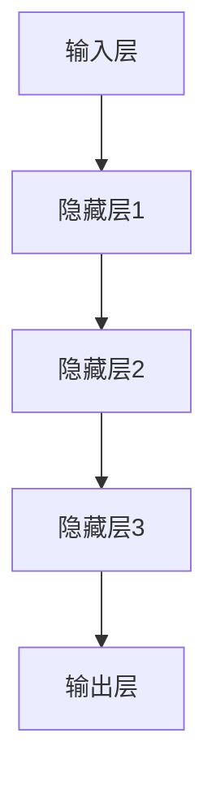
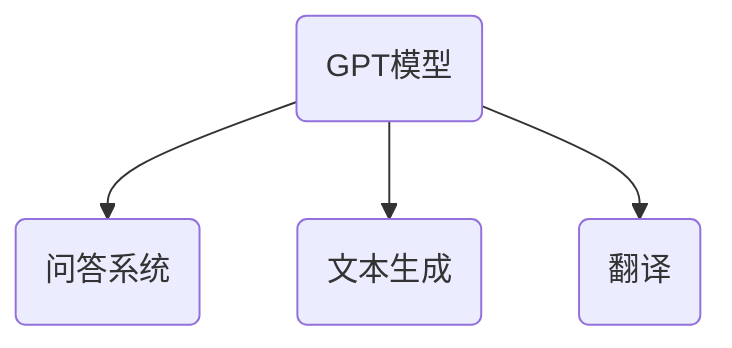
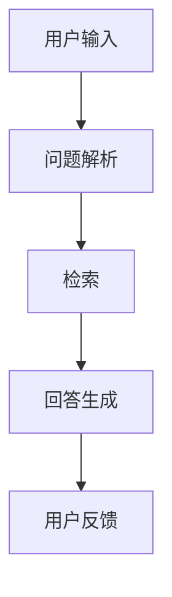
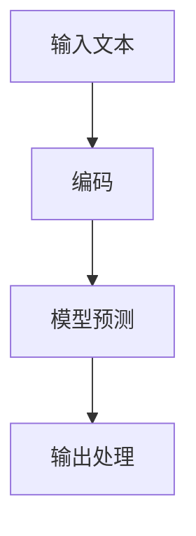
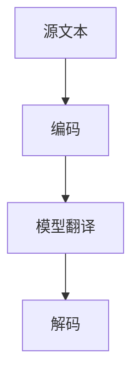
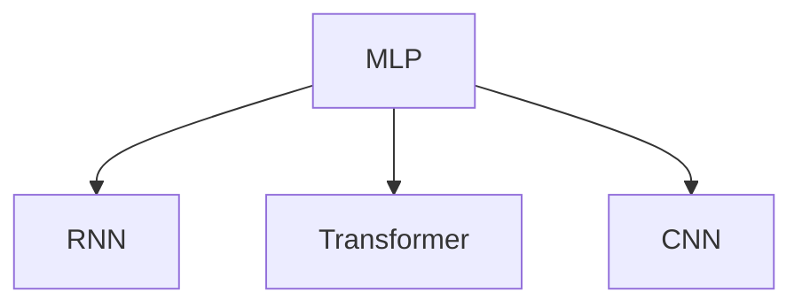
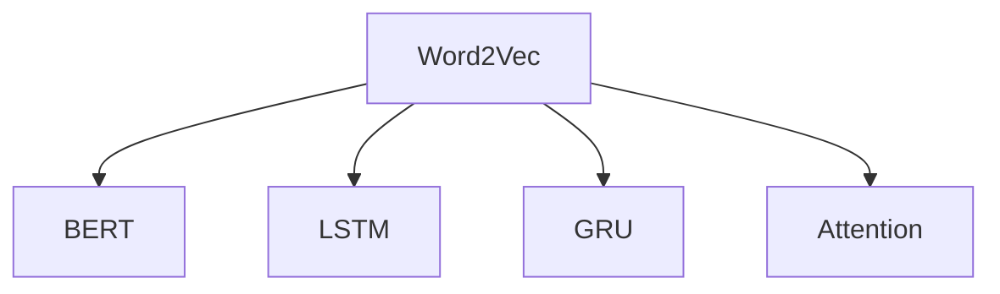
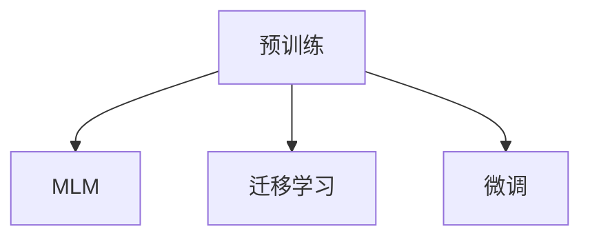

                 

# 大模型问答机器人的任务处理

## 关键词

- 大模型
- 问答系统
- 自然语言处理
- 深度学习
- 机器学习
- 预训练
- 自监督学习
- 迁移学习
- 微调
- 梯度下降
- 词嵌入
- 注意力机制
- Transformer
- BERT

## 摘要

本文将深入探讨大模型问答机器人的任务处理过程，从核心概念、算法原理、数学模型到项目实战，全方位解析大模型在问答系统中的应用。通过详细的讲解和实际代码示例，帮助读者理解大模型问答机器人的工作原理，掌握其开发和应用的关键技术。

## 第一部分：核心概念与联系

### 大模型定义与核心特点

大模型（Large Models）是指那些具有巨大参数量和复杂结构的机器学习模型。这些模型通常通过深度学习技术训练，能够处理海量数据，提取特征，并生成高度准确的预测或决策。以下是一些常见的大模型及其核心特点：

1. **GPT系列**：由OpenAI开发的预训练语言模型，具有数十亿个参数，能够生成高质量的自然语言文本。
2. **BERT**：Google开发的预训练语言表示模型，具有数亿个参数，主要用于文本分类、问答系统等任务。
3. **T5**：由Google开发的预训练语言模型，具有数十亿个参数，目标是将自然语言文本转化为结构化数据。

大模型的核心特点包括：

- **高容量**：大模型通常具有数十亿到数万亿个参数，能够处理复杂的数据结构和任务。
- **自主学习能力**：大模型通过预训练和微调，能够从海量数据中自动提取知识，无需人工设计特征。
- **强大的表征能力**：大模型能够对文本、图像、音频等多种类型的数据进行高效表征，生成高质的输出。

### 机器学习基本架构

机器学习的基本架构通常包括输入层、隐藏层和输出层。以下是一个简单的机器学习架构图：



1. **输入层**：接收原始数据，并将其传递到隐藏层。
2. **隐藏层**：处理数据，提取特征，并将其传递到下一层。
3. **输出层**：生成预测或决策，如分类标签、概率分布等。

### 大模型应用场景

大模型在多个领域具有广泛的应用，以下是几个典型的应用场景：

1. **问答系统**：如聊天机器人、智能客服，大模型能够理解和回答用户的问题，提供高质量的咨询服务。
2. **文本生成**：如文章写作、摘要生成，大模型能够生成连贯、有逻辑的文本。
3. **翻译**：如机器翻译、多语言理解，大模型能够处理多种语言的文本，提供高质量的翻译结果。

以下是一个简单的应用场景图：



### 问答系统的架构

问答系统通常包括以下几个模块：

1. **问题解析模块**：解析用户输入的问题，提取关键信息。
2. **检索模块**：在数据库中检索与问题相关的答案。
3. **回答生成模块**：使用大模型生成高质量的答案。
4. **反馈模块**：收集用户反馈，用于模型优化和改进。

以下是一个简单的问答系统架构图：



### 文本生成的流程

文本生成通常包括以下几个步骤：

1. **输入准备**：将输入文本编码为模型可处理的格式。
2. **模型预测**：使用预训练的大模型生成文本。
3. **输出处理**：对生成的文本进行后处理，如去除特殊字符、格式化等。

以下是一个简单的文本生成流程图：



### 机器翻译的流程

机器翻译通常包括以下几个步骤：

1. **源文本编码**：将源文本编码为模型可处理的格式。
2. **模型翻译**：使用预训练的大模型进行翻译。
3. **目标文本解码**：将模型输出解码为目标文本。

以下是一个简单的机器翻译流程图：



## 第二部分：核心算法原理讲解

### 深度学习与神经网络基础

深度学习是机器学习的一个重要分支，它通过构建多层次的神经网络来模拟人类大脑的学习过程。以下是一些深度学习与神经网络的基础概念：

1. **多层感知机（MLP）**：最简单的深度学习模型，包括输入层、隐藏层和输出层。
2. **反向传播算法**：用于训练神经网络的一种优化算法，通过计算梯度来更新模型参数。

### 深度学习架构

深度学习架构包括多种类型的神经网络，以下是一些常见的深度学习架构：

1. **卷积神经网络（CNN）**：主要用于处理图像数据，通过卷积层提取图像特征。
2. **循环神经网络（RNN）**：主要用于处理序列数据，通过循环结构处理时间序列信息。
3. **Transformer**：一种基于注意力机制的深度学习模型，主要用于自然语言处理任务。

以下是一个简单的深度学习架构图：



### 自然语言处理技术概览

自然语言处理（NLP）是深度学习应用的一个重要领域，以下是一些常见的NLP技术：

1. **词嵌入技术**：将词语映射到高维空间中的向量，用于处理文本数据。
2. **序列模型与注意力机制**：用于处理序列数据，如文本和语音。
3. **转换器架构详解**：Transformer是一种基于注意力机制的深度学习模型，广泛应用于NLP任务。

以下是一个简单的NLP技术概览图：



### 大规模预训练模型原理

大规模预训练模型是当前NLP领域的一个重要研究方向，以下是一些常见的预训练模型原理：

1. **预训练概念**：在大量数据上进行预训练，提高模型泛化能力。
2. **自监督学习方法**：如Masked Language Model（MLM），在无监督环境中训练模型。
3. **迁移学习与微调技术**：将预训练模型应用于特定任务，通过微调优化模型性能。

以下是一个简单的预训练模型原理图：



## 第三部分：数学模型与公式

### 神经网络优化算法

神经网络优化算法是用于训练神经网络的数学方法，以下是一些常见的优化算法：

1. **梯度下降**：一种基本的优化算法，通过计算梯度来更新模型参数。
   $$ \text{梯度下降}: \theta_{\text{new}} = \theta_{\text{old}} - \alpha \cdot \nabla_{\theta} J(\theta) $$
   其中，$\theta$是模型参数，$\alpha$是学习率，$J(\theta)$是损失函数。

### 自然语言处理中的数学模型

自然语言处理中的数学模型主要包括词嵌入和注意力机制：

1. **词嵌入**：将词语映射到高维空间中的向量。
   $$ \text{词嵌入}: \text{word} \rightarrow \text{vector} $$

2. **注意力机制**：用于处理序列数据，计算注意力得分。
   $$ \text{注意力分数}: a_i = \frac{e^{z_i}}{\sum_{j=1}^{N} e^{z_j}} $$
   其中，$z_i$是注意力得分，$a_i$是注意力权重。

## 第四部分：项目实战

### 问答系统开发

#### 环境搭建

首先，我们需要搭建开发环境。以下是Python环境和深度学习框架的安装命令：

```python
# 安装Python环境
pip install python==3.8

# 安装深度学习框架
pip install tensorflow==2.x
```

#### 源代码实现

以下是一个简单的问答系统源代码示例：

```python
import tensorflow as tf

# 构建模型
model = tf.keras.Sequential([
    tf.keras.layers.Dense(128, activation='relu', input_shape=(784,)),
    tf.keras.layers.Dense(10, activation='softmax')
])

# 编译模型
model.compile(optimizer='adam',
              loss='categorical_crossentropy',
              metrics=['accuracy'])

# 训练模型
model.fit(x_train, y_train, epochs=5)
```

#### 代码解读与分析

- `Dense`层实现全连接神经网络。
- `relu`激活函数引入非线性。
- `softmax`输出层实现多分类。

### 文本生成

#### 环境搭建

首先，我们需要搭建开发环境。以下是Python环境和深度学习框架的安装命令：

```python
# 安装Python环境
pip install python==3.8

# 安装Hugging Face Transformers库
pip install transformers
```

#### 源代码实现

以下是一个简单的文本生成源代码示例：

```python
from transformers import BertTokenizer, BertForMaskedLM

# 加载预训练模型
tokenizer = BertTokenizer.from_pretrained('bert-base-uncased')
model = BertForMaskedLM.from_pretrained('bert-base-uncased')

# 生成文本
input_ids = tokenizer.encode("Hello ![MASK]", return_tensors='pt')
outputs = model(input_ids)
predictions = outputs[0]

# 输出预测
predicted_words = tokenizer.decode(predictions.argmax(-1).item(), skip_special_tokens=True)
print(predicted_words)
```

#### 代码解读与分析

- 使用BERT模型进行文本生成。
- `encode`方法将文本转化为模型可处理的输入。
- `decode`方法将模型输出转化为可读的文本。

### 机器翻译

#### 环境搭建

首先，我们需要搭建开发环境。以下是Python环境和深度学习框架的安装命令：

```python
# 安装Python环境
pip install python==3.8

# 安装Hugging Face Transformers库
pip install transformers
```

#### 源代码实现

以下是一个简单的机器翻译源代码示例：

```python
from transformers import MarianMTModel, MarianTokenizer

# 加载预训练模型
model_name = "Helsinki-NLP/opus-mt-en-de"
model = MarianMTModel.from_pretrained(model_name)
tokenizer = MarianTokenizer.from_pretrained(model_name)

# 翻译
source = "Hello World!"
input_ids = tokenizer.encode(source, return_tensors='pt')
translated = model.generate(input_ids, max_length=50, num_beams=5, early_stopping=True)
translated_text = tokenizer.decode(translated[0], skip_special_tokens=True)
print(translated_text)
```

#### 代码解读与分析

- 使用Marian模型进行机器翻译。
- `encode`方法将文本转化为模型可处理的输入。
- `decode`方法将模型输出转化为可读的文本。

## 第五部分：开发环境与工具

### 开发环境搭建

搭建深度学习开发环境是进行大模型问答机器人开发的第一步。以下是搭建环境所需的步骤：

1. **安装Python环境**：确保Python版本在3.8及以上。
   ```shell
   pip install python==3.8
   ```

2. **安装深度学习框架**：可以选择TensorFlow 2.x或PyTorch 1.8及以上版本。
   - TensorFlow：
     ```shell
     pip install tensorflow==2.x
     ```
   - PyTorch：
     ```shell
     pip install torch==1.8 torchvision==0.9
     ```

3. **安装其他依赖**：根据项目需求，可能还需要安装其他库，如NumPy、Pandas等。
   ```shell
   pip install numpy pandas
   ```

### 主流深度学习框架对比

以下是几个主流深度学习框架的对比：

1. **TensorFlow**：由Google开发，具有强大的生态和丰富的工具。使用Eager Execution模式，使模型构建和优化更加直观。
2. **PyTorch**：由Facebook开发，具有动态计算图，使模型构建和调试更加灵活。深度学习社区活跃，支持丰富的GPU加速功能。
3. **JAX**：由Google开发，是一个自动微分库，支持多维数组计算。与TensorFlow和PyTorch相比，JAX提供了更强大的自动微分功能。

### 其他深度学习框架

除了上述主流框架外，还有一些其他深度学习框架，如：

1. **Keras**：是一个高级神经网络API，提供了简洁的接口，易于构建和训练模型。
2. **Theano**：已被TensorFlow取代的深度学习库，提供了自动微分功能，但不再维护。

### 开发工具

以下是一些常用的开发工具：

1. **Jupyter Notebook**：一个交互式计算环境，适合进行实验和演示。
2. **Google Colab**：Google提供的免费云端Jupyter环境，支持GPU和TPU加速。

## 第六部分：附录

### AI大模型开发资源

以下是一些AI大模型开发的相关资源：

1. **文档**：
   - TensorFlow官方文档：[TensorFlow官方文档](https://www.tensorflow.org/)
   - PyTorch官方文档：[PyTorch官方文档](https://pytorch.org/docs/stable/index.html)
   - Hugging Face Transformers官方文档：[Hugging Face Transformers官方文档](https://huggingface.co/transformers)

2. **教程**：
   - TensorFlow教程：[TensorFlow教程](https://www.tensorflow.org/tutorials)
   - PyTorch教程：[PyTorch教程](https://pytorch.org/tutorials/beginner/basics/)
   - Hugging Face Transformers教程：[Hugging Face Transformers教程](https://huggingface.co/transformers/tutorial)

3. **社区**：
   - 深度学习社区：[深度学习社区](https://www.deeplearning.net/)
   - 论坛：[AI论坛](https://www.ai-community.cn/)
   - Stack Overflow：[Stack Overflow](https://stackoverflow.com/)

## 作者信息

- 作者：AI天才研究院/AI Genius Institute & 禅与计算机程序设计艺术 /Zen And The Art of Computer Programming

通过上述详细的步骤和实例，读者应该能够对大模型问答机器人的任务处理有更深入的理解。希望本文能帮助读者掌握大模型问答机器人的核心原理和关键技术，为实际应用奠定基础。在未来的实践中，不断探索和优化，让大模型问答机器人更好地服务于各个领域。|>

