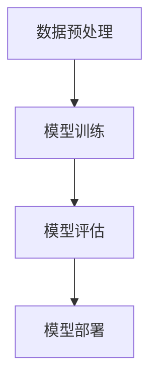
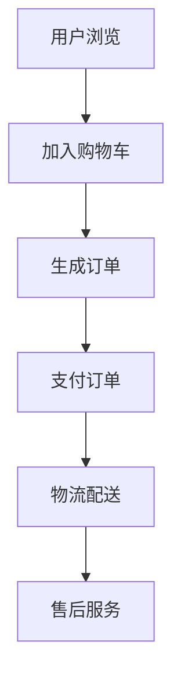
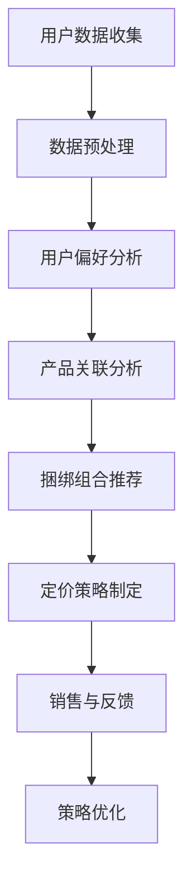

                 

# 《大模型驱动的电商个性化产品捆绑定价策略》

## 关键词
- 大模型
- 电商
- 个性化定价
- 捆绑策略
- 定价算法
- 个性化推荐
- 大数据分析
- 数学模型

## 摘要
本文深入探讨了基于大模型驱动的电商个性化产品捆绑定价策略。文章首先概述了电商个性化产品捆绑定价策略的定义和重要性，随后介绍了大模型的基本原理及其在电商领域的应用。接着，本文详细分析了个性化产品捆绑定价策略的原理和数学模型，包括顾客价值分析、产品组合优化和预测误差分析。在核心算法原理讲解部分，文章通过伪代码展示了个性化推荐系统和价格优化算法的实现。项目实战部分，通过具体代码实例，展示了如何在大模型基础上实现电商个性化定价策略。最后，文章总结了电商个性化产品捆绑定价策略的未来发展趋势和面临的挑战。本文旨在为电商从业者提供一套科学、系统、可操作的大模型驱动定价策略，以提升电商产品的市场竞争力和用户体验。

### 第一部分：引论

### 第1章：电商个性化产品捆绑定价策略概述

#### 1.1 电商个性化产品捆绑定价策略的定义

电商个性化产品捆绑定价策略是指通过分析消费者的购买行为和偏好，将两种或多种产品捆绑在一起销售，并以一个优惠的价格提供给消费者，从而提高消费者的购买意愿和店铺的销售额。这种策略不仅能够增加产品的销售量，还可以提升消费者的满意度和忠诚度。

个性化产品捆绑定价策略的核心在于“个性化”和“捆绑”。个性化指的是根据消费者的购买历史、浏览记录、偏好等数据，为他们推荐最适合他们的产品组合；而捆绑则是指将这些个性化推荐的产品组合以一定的优惠价格销售，以增加消费者的购买动力。

#### 1.2 大模型在电商个性化产品捆绑定价策略中的角色

大模型在电商个性化产品捆绑定价策略中扮演着至关重要的角色。大模型是一种能够处理海量数据，从中提取有价值信息的人工智能算法。它通过对用户行为数据的深度分析，能够准确地预测用户的购买意图和偏好，从而为个性化推荐和定价策略提供有力的支持。

大模型在电商个性化产品捆绑定价策略中的应用主要体现在以下几个方面：

1. **用户行为分析**：大模型能够分析用户的浏览、搜索、购买等行为，从中提取出用户的兴趣点和偏好，为个性化推荐提供数据支持。
2. **产品关联分析**：大模型能够分析产品之间的关联性，识别出哪些产品最适合捆绑销售，从而提高捆绑销售的效果。
3. **定价策略优化**：大模型能够根据用户行为和产品关联数据，动态调整产品的价格，实现最优的定价策略。

#### 1.3 大模型驱动定价策略的优势与挑战

大模型驱动定价策略具有显著的优势，但也面临一定的挑战。

优势：

1. **提高销售额**：通过个性化推荐和精准定价，能够有效提高消费者的购买意愿和购买量，从而提高销售额。
2. **提高用户满意度**：个性化的产品推荐和合理的定价策略能够提升消费者的购物体验和满意度。
3. **降低库存成本**：通过分析用户购买行为，可以更准确地预测销售量，减少库存积压和库存成本。

挑战：

1. **数据质量**：大模型的效果很大程度上取决于数据的质量。如果数据不准确或不完整，将影响模型的预测准确性。
2. **计算资源**：大模型训练和预测需要大量的计算资源，这对中小电商企业来说可能是一个挑战。
3. **模型解释性**：大模型的决策过程往往是不透明的，这对于需要解释性策略的电商企业来说可能是一个挑战。

#### 1.4 本书结构安排与内容概述

本书分为四个部分，共八个章节。

- **第一部分：引论**，包括第1章，主要介绍电商个性化产品捆绑定价策略的定义、大模型的作用和优势与挑战。
- **第二部分：核心概念与联系**，包括第2章和第3章，详细讲解大模型原理与电商业务、个性化产品捆绑定价策略原理。
- **第三部分：核心算法原理讲解**，包括第4章、第5章和第6章，介绍大模型在电商个性化定价策略中的应用算法、大数据分析基础和个性化定价策略的数学模型。
- **第四部分：电商个性化产品捆绑定价策略实践**，包括第7章和第8章，通过实践案例和未来趋势分析，探讨大模型驱动定价策略的实际应用和未来发展。

通过本书的系统讲解，读者将能够全面了解电商个性化产品捆绑定价策略，掌握大模型在其中的应用，并能够将其应用到实际业务中，提升电商企业的市场竞争力。

### 第二部分：核心概念与联系

#### 第2章：大模型原理与电商业务

#### 2.1 大模型的基本原理

大模型，又称深度学习模型，是一种基于多层神经网络结构的人工智能算法。它通过大量的数据训练，能够自动提取数据中的特征，并进行复杂的模式识别和预测。大模型的核心组成部分包括输入层、隐藏层和输出层。

- **输入层**：接收原始数据，如文本、图像、声音等。
- **隐藏层**：对输入数据进行特征提取和变换，每一层都能提取更高层次的特征。
- **输出层**：根据提取的特征生成预测结果。

大模型的工作流程如下：

1. **数据预处理**：对原始数据进行清洗、归一化等处理，使其适合模型训练。
2. **模型训练**：使用大量的训练数据，通过反向传播算法不断调整模型参数，使其达到预期的性能。
3. **模型评估**：使用验证数据集测试模型的预测准确性，调整模型参数以达到最优性能。
4. **模型部署**：将训练好的模型部署到实际应用场景中，进行实时预测和决策。

#### Mermaid流程图：大模型的组成与工作流程



#### 2.2 电商业务分析

电商业务是指通过互联网平台进行商品交易和服务的活动。电商业务的主要环节包括商品管理、订单管理、支付管理、物流管理等。

- **商品管理**：包括商品分类、商品上架、商品描述等。
- **订单管理**：包括订单生成、订单处理、订单跟踪等。
- **支付管理**：包括支付方式选择、支付流程、支付安全等。
- **物流管理**：包括物流配送、物流跟踪、售后服务等。

电商业务的工作流程如下：

1. **用户浏览**：用户在电商平台上浏览商品。
2. **加入购物车**：用户将喜欢的商品加入购物车。
3. **生成订单**：用户确认购物车中的商品并生成订单。
4. **支付订单**：用户选择支付方式并完成支付。
5. **物流配送**：电商企业根据订单信息进行商品配送。
6. **售后服务**：用户在收到商品后，如有问题，可以享受售后服务。

#### Mermaid流程图：电商业务流程与核心环节



#### 2.3 大模型在电商业务中的应用

大模型在电商业务中的应用非常广泛，主要体现在以下几个方面：

1. **商品推荐**：大模型可以根据用户的浏览历史、购物车数据和购买行为，预测用户可能感兴趣的商品，从而进行个性化的商品推荐。
2. **价格优化**：大模型可以根据市场需求、库存情况和用户行为，动态调整商品价格，实现最优的价格策略。
3. **广告投放**：大模型可以根据用户的兴趣和行为，预测用户可能感兴趣的广告内容，从而进行精准的广告投放。
4. **风险控制**：大模型可以分析用户的购买行为和交易数据，识别异常行为，进行风险控制和欺诈预防。

通过大模型的应用，电商企业能够更加精准地满足用户需求，提高用户满意度和忠诚度，从而提升市场竞争力。

### 第三部分：个性化产品捆绑定价策略原理

#### 第3章：个性化产品捆绑定价策略原理

#### 3.1 个性化产品捆绑定价策略概述

个性化产品捆绑定价策略是一种基于消费者个性化需求的定价策略，它通过将两种或多种产品捆绑在一起销售，并以优惠价格提供给消费者，从而提高消费者的购买意愿和满意度。

个性化产品捆绑定价策略的核心在于“个性化”和“捆绑”。“个性化”指的是根据消费者的购买历史、浏览记录和偏好等数据，为其推荐最适合他们的产品组合；“捆绑”则是指将这些个性化推荐的产品组合以一定的优惠价格销售，以增加消费者的购买动力。

#### Mermaid流程图：个性化产品捆绑定价策略的构成与工作流程



#### 3.2 捆绑定价策略的数学模型

捆绑定价策略的数学模型主要包括顾客价值分析、产品组合优化和预测误差分析。

1. **顾客价值分析**：

   顾客价值是指消费者购买产品或服务所获得的总体效用与其支付的价格之间的差额。顾客价值分析是捆绑定价策略制定的重要基础。

   顾客价值的计算公式为：

   $$ 
   价值 = 总效用 - 价格
   $$

   其中，总效用是指消费者购买产品或服务后所获得的满足感或幸福感，价格是指消费者为购买产品或服务所支付的费用。

2. **产品组合优化**：

   产品组合优化是指根据消费者的偏好和市场情况，选择最佳的产品组合，以最大化顾客价值和企业利润。

   产品组合优化的数学模型可以表示为：

   $$
   Maximize\ Value = \sum_{i=1}^{n} \sum_{j=1}^{m} w_{ij} \cdot u_{ij}
   $$

   其中，$w_{ij}$ 是产品i和产品j之间的关联权重，$u_{ij}$ 是消费者对产品i和产品j组合的偏好值，$n$ 和 $m$ 分别是产品种类数和捆绑组合数。

3. **预测误差分析**：

   预测误差分析是指对定价策略的预测效果进行评估，以发现和纠正模型中的偏差。

   预测误差的计算公式为：

   $$
   Error = 实际价值 - 预测价值
   $$

   其中，实际价值是指消费者实际购买的产品组合所获得的效用，预测价值是指模型预测的产品组合所获得的效用。

#### 3.3 大模型在个性化产品捆绑定价策略中的角色

大模型在个性化产品捆绑定价策略中扮演着重要的角色，其主要作用包括：

1. **用户偏好分析**：

   大模型可以通过分析用户的浏览历史、购物车数据和购买行为，提取出用户的偏好，为个性化推荐提供数据支持。

2. **产品关联分析**：

   大模型可以分析不同产品之间的关联性，识别出哪些产品最适合捆绑销售，从而提高捆绑销售的效果。

3. **定价策略优化**：

   大模型可以根据用户偏好和产品关联数据，动态调整产品的价格，实现最优的定价策略。

4. **预测误差分析**：

   大模型可以通过对用户行为数据的深度分析，识别出预测误差的原因，并提出改进措施，提高预测准确性。

通过大模型的应用，电商企业可以更加精准地制定个性化产品捆绑定价策略，提高消费者的购买意愿和满意度，从而提升市场竞争力。

### 第四部分：核心算法原理讲解

#### 第4章：大模型在电商个性化定价策略中的应用算法

#### 4.1 大模型在个性化推荐系统中的应用

个性化推荐系统是电商个性化定价策略的重要组成部分，其核心目标是根据用户的兴趣和行为，为用户推荐最符合其需求的产品。大模型在个性化推荐系统中发挥着关键作用，下面我们将通过伪代码来详细阐述基于大模型的个性化推荐算法。

**伪代码：基于大模型的个性化推荐算法**

```python
# 输入：用户历史行为数据（浏览记录、购物车记录、购买记录）
# 输出：推荐商品列表

def personalized_recommendation(user_data):
    # 步骤1：数据预处理
    processed_data = preprocess_data(user_data)
    
    # 步骤2：特征提取
    features = extract_features(processed_data)
    
    # 步骤3：训练推荐模型
    model = train_model(features)
    
    # 步骤4：生成推荐列表
    recommended_items = model.predict(recommendation_score)
    
    # 步骤5：返回推荐结果
    return recommended_items
```

**详细解释：**

- **数据预处理**：数据预处理是推荐系统的第一步，其目的是将原始的用户行为数据清洗和格式化，使其适合模型训练。预处理步骤可能包括去除缺失值、数据归一化、特征工程等。

  ```python
  def preprocess_data(user_data):
      # 清除缺失值
      user_data = remove_missing_values(user_data)
      
      # 数据归一化
      user_data = normalize_data(user_data)
      
      return user_data
  ```

- **特征提取**：特征提取是将原始数据转换成模型可以处理的形式。在个性化推荐系统中，特征提取可能包括用户特征（如年龄、性别、地理位置）、商品特征（如类别、价格、品牌）和交互特征（如点击次数、购买次数）。

  ```python
  def extract_features(processed_data):
      user_features = extract_user_features(processed_data)
      item_features = extract_item_features(processed_data)
      interaction_features = extract_interaction_features(processed_data)
      
      return user_features, item_features, interaction_features
  ```

- **训练推荐模型**：训练推荐模型是推荐系统的核心步骤，其目标是学习用户行为数据中的模式，并生成推荐算法。常见的推荐模型包括基于内容的推荐、协同过滤推荐和混合推荐等。

  ```python
  def train_model(features):
      # 使用训练数据训练模型
      model = train_recommendation_model(features)
      
      return model
  ```

- **生成推荐列表**：生成推荐列表是根据训练好的模型为用户推荐最可能感兴趣的商品。推荐算法通常会计算每个商品的推荐分数，并将分数最高的商品推荐给用户。

  ```python
  def model.predict(recommendation_score):
      # 预测推荐分数
      recommended_items = model.predict(recommendation_score)
      
      return recommended_items
  ```

通过上述伪代码，我们可以看到基于大模型的个性化推荐算法的基本流程。在实际应用中，需要根据具体业务场景和数据特点，选择合适的特征提取方法和推荐模型，并不断优化和调整算法，以提高推荐效果。

#### 4.2 大模型在价格优化中的算法

价格优化是电商个性化定价策略的另一个关键环节，其目标是根据用户行为数据和市场情况，动态调整商品价格，实现最大化利润或市场份额。大模型在价格优化中具有显著优势，下面我们将通过伪代码来详细阐述基于大模型的价格优化算法。

**伪代码：基于大模型的价格优化算法**

```python
# 输入：用户行为数据（浏览记录、购物车记录、购买记录）、市场数据（价格趋势、竞争情况）
# 输出：优化后的商品价格列表

def price_optimization(user_data, market_data):
    # 步骤1：数据预处理
    processed_user_data = preprocess_user_data(user_data)
    processed_market_data = preprocess_market_data(market_data)
    
    # 步骤2：特征提取
    user_features = extract_user_features(processed_user_data)
    market_features = extract_market_features(processed_market_data)
    
    # 步骤3：训练价格优化模型
    price_model = train_price_optimization_model(user_features, market_features)
    
    # 步骤4：生成价格优化策略
    optimized_prices = price_model.predict(optimized_price_score)
    
    # 步骤5：更新商品价格
    update_prices(optimized_prices)
    
    # 步骤6：反馈与调整
    feedback_loop(optimized_prices, user_data, market_data)
```

**详细解释：**

- **数据预处理**：数据预处理是价格优化算法的第一步，其目的是将原始的用户行为数据和市场数据清洗和格式化，使其适合模型训练。

  ```python
  def preprocess_user_data(user_data):
      # 清除缺失值
      user_data = remove_missing_values(user_data)
      
      # 数据归一化
      user_data = normalize_data(user_data)
      
      return user_data
  ```

  ```python
  def preprocess_market_data(market_data):
      # 清除缺失值
      market_data = remove_missing_values(market_data)
      
      # 数据归一化
      market_data = normalize_data(market_data)
      
      return market_data
  ```

- **特征提取**：特征提取是将原始数据转换成模型可以处理的形式。在价格优化中，特征提取可能包括用户特征（如购买频率、购买时间段）、商品特征（如类别、库存量）、市场特征（如竞争对手价格、市场价格趋势）。

  ```python
  def extract_user_features(processed_user_data):
      # 提取用户购买频率、购买时间段等特征
      user_features = extract_user_buying_frequency(processed_user_data)
      user_features = extract_user_buying_time(processed_user_data)
      
      return user_features
  ```

  ```python
  def extract_market_features(processed_market_data):
      # 提取市场竞争对手价格、市场价格趋势等特征
      market_features = extract_competition_price(processed_market_data)
      market_features = extract_market_trend(processed_market_data)
      
      return market_features
  ```

- **训练价格优化模型**：训练价格优化模型是价格优化的核心步骤，其目标是学习用户行为数据和市场数据中的价格变化规律，并生成价格优化策略。

  ```python
  def train_price_optimization_model(user_features, market_features):
      # 使用训练数据训练价格优化模型
      price_model = train_price_model(user_features, market_features)
      
      return price_model
  ```

- **生成价格优化策略**：生成价格优化策略是根据训练好的模型为每个商品生成最优价格。优化策略可能包括价格调整幅度、价格调整时间等。

  ```python
  def price_model.predict(optimized_price_score):
      # 预测最优价格
      optimized_prices = model.predict(optimized_price_score)
      
      return optimized_prices
  ```

- **更新商品价格**：更新商品价格是将预测的最优价格应用到实际业务中，调整商品价格。

  ```python
  def update_prices(optimized_prices):
      # 更新商品价格
      update_price(optimized_prices)
  ```

- **反馈与调整**：反馈与调整是价格优化过程中必不可少的一环，其目的是根据实际销售数据和用户反馈，不断优化和调整价格优化策略。

  ```python
  def feedback_loop(optimized_prices, user_data, market_data):
      # 根据实际销售数据和用户反馈，调整价格优化策略
      adjust_price_strategy(optimized_prices, user_data, market_data)
  ```

通过上述伪代码，我们可以看到基于大模型的价格优化算法的基本流程。在实际应用中，需要根据具体业务场景和数据特点，选择合适的特征提取方法和价格优化模型，并不断优化和调整算法，以提高价格优化效果。

#### 4.3 大模型在预测市场行为中的应用

在电商个性化定价策略中，准确预测市场行为对于制定有效的定价策略至关重要。大模型在预测市场行为方面具有显著优势，下面我们将通过伪代码来详细阐述基于大模型的预测市场行为的算法。

**伪代码：基于大模型的预测市场行为算法**

```python
# 输入：市场历史数据（价格、销售量、竞争情况）
# 输出：市场行为预测结果

def predict_market_behavior(market_data):
    # 步骤1：数据预处理
    processed_data = preprocess_data(market_data)
    
    # 步骤2：特征提取
    features = extract_features(processed_data)
    
    # 步骤3：训练预测模型
    behavior_model = train_behavior_model(features)
    
    # 步骤4：生成预测结果
    predicted_behavior = behavior_model.predict(market_behavior_score)
    
    # 步骤5：结果分析
    analyze_predictions(predicted_behavior, market_data)
```

**详细解释：**

- **数据预处理**：数据预处理是预测市场行为的第一步，其目的是将原始的市场数据清洗和格式化，使其适合模型训练。

  ```python
  def preprocess_data(market_data):
      # 清除缺失值
      market_data = remove_missing_values(market_data)
      
      # 数据归一化
      market_data = normalize_data(market_data)
      
      return market_data
  ```

- **特征提取**：特征提取是将原始数据转换成模型可以处理的形式。在预测市场行为中，特征提取可能包括价格、销售量、竞争情况等。

  ```python
  def extract_features(processed_data):
      price_features = extract_price_features(processed_data)
      sales_features = extract_sales_features(processed_data)
      competition_features = extract_competition_features(processed_data)
      
      return price_features, sales_features, competition_features
  ```

- **训练预测模型**：训练预测模型是预测市场行为的核心步骤，其目标是学习市场数据中的行为模式，并生成预测算法。

  ```python
  def train_behavior_model(features):
      # 使用训练数据训练模型
      behavior_model = train_behavior_model(features)
      
      return behavior_model
  ```

- **生成预测结果**：生成预测结果是根据训练好的模型预测未来的市场行为。预测结果可能包括价格趋势、销售量预测、竞争情况预测等。

  ```python
  def behavior_model.predict(market_behavior_score):
      # 预测市场行为
      predicted_behavior = model.predict(market_behavior_score)
      
      return predicted_behavior
  ```

- **结果分析**：结果分析是对预测结果进行分析和验证，以评估预测模型的准确性。

  ```python
  def analyze_predictions(predicted_behavior, market_data):
      # 分析预测结果
      analyze_prediction_accuracy(predicted_behavior, market_data)
  ```

通过上述伪代码，我们可以看到基于大模型预测市场行为算法的基本流程。在实际应用中，需要根据具体业务场景和数据特点，选择合适的特征提取方法和预测模型，并不断优化和调整算法，以提高预测准确性。

### 第五部分：大数据分析基础

#### 第5章：大数据分析基础

#### 5.1 数据分析的基本概念

数据分析是指从大量数据中提取有价值的信息和知识，以支持决策和优化业务流程。数据分析的基本概念包括数据清洗、数据整合、数据探索、特征工程、模型选择和模型评估等。

- **数据清洗**：数据清洗是指对原始数据进行处理，包括去除重复数据、处理缺失值、纠正错误数据等，以确保数据的质量。
- **数据整合**：数据整合是指将来自不同数据源的数据进行合并，以创建一个统一的数据视图。
- **数据探索**：数据探索是指通过可视化、统计分析和假设检验等方法，对数据进行分析，以发现数据中的规律和模式。
- **特征工程**：特征工程是指从原始数据中提取或创建特征，以改进模型性能。
- **模型选择**：模型选择是指从多个模型中选择一个最适合问题的模型。
- **模型评估**：模型评估是指使用验证数据集对模型进行测试和评估，以确定其性能。

#### 5.2 电商交易数据分析方法

电商交易数据分析是电商企业制定个性化定价策略的重要依据。电商交易数据分析的方法主要包括数据预处理、数据探索、特征提取和模型训练等。

1. **数据预处理**：

   数据预处理是电商交易数据分析的第一步，其目的是确保数据的质量和一致性。数据预处理的方法包括：

   - **去除重复数据**：去除重复的交易记录，以避免重复计算。
   - **处理缺失值**：处理缺失的交易记录，可以选择删除、填充或插值等方法。
   - **数据归一化**：将不同量纲的数据进行归一化处理，使其具有可比性。

2. **数据探索**：

   数据探索是通过可视化、统计分析和假设检验等方法，对电商交易数据进行初步分析，以发现数据中的规律和模式。数据探索的方法包括：

   - **可视化**：使用图表和图形对交易数据进行可视化展示，以便直观地理解数据。
   - **统计分析**：使用统计方法（如均值、方差、相关性分析等）对交易数据进行统计分析，以发现数据中的规律。
   - **假设检验**：使用假设检验方法（如t检验、卡方检验等）对交易数据进行假设检验，以验证数据中的规律。

3. **特征提取**：

   特征提取是从原始交易数据中提取有价值的特征，以改进模型性能。特征提取的方法包括：

   - **用户特征**：包括用户年龄、性别、地理位置、购买频率等。
   - **商品特征**：包括商品类别、价格、品牌、库存量等。
   - **交互特征**：包括用户与商品之间的交互记录，如点击次数、浏览时长等。

4. **模型训练**：

   模型训练是指使用特征数据训练机器学习模型，以预测用户的行为和需求。常见的模型包括回归模型、分类模型和聚类模型等。模型训练的方法包括：

   - **回归模型**：用于预测连续值输出，如预测商品价格。
   - **分类模型**：用于预测离散值输出，如预测用户购买意愿。
   - **聚类模型**：用于发现数据中的聚类模式，如发现用户群体。

#### LaTeX公式：数据特征提取与选择方法

$$
特征提取 = f(\text{原始数据}, \text{特征选择标准})
$$

其中，$f$ 表示特征提取函数，$\text{原始数据}$ 表示电商交易数据，$\text{特征选择标准}$ 表示用于选择特征的规则或方法。

#### 5.3 大数据技术在电商中的应用

大数据技术在电商中的应用主要包括用户行为分析、个性化推荐、价格优化和风险控制等。

1. **用户行为分析**：

   用户行为分析是通过分析用户的浏览、搜索、购买等行为，了解用户的需求和偏好，以优化用户体验和提升销售额。

   - **浏览行为分析**：分析用户在电商平台上的浏览记录，了解用户对商品的兴趣点和偏好。
   - **搜索行为分析**：分析用户的搜索关键词，了解用户的需求和关注点。
   - **购买行为分析**：分析用户的购买行为，了解用户的购买习惯和购买意愿。

2. **个性化推荐**：

   个性化推荐是基于用户行为分析和商品特征分析，为用户推荐最符合其需求的商品。个性化推荐的方法包括基于内容的推荐、协同过滤推荐和混合推荐等。

   - **基于内容的推荐**：根据用户的历史浏览记录和购买记录，为用户推荐与其已浏览或购买商品相似的商品。
   - **协同过滤推荐**：根据用户的相似度计算，为用户推荐与具有相似兴趣的用户购买的商品。
   - **混合推荐**：结合基于内容和协同过滤推荐的方法，为用户推荐更加个性化的商品。

3. **价格优化**：

   价格优化是通过分析用户行为数据和市场数据，动态调整商品价格，实现最大化利润或市场份额。价格优化的方法包括基于用户行为的定价、基于市场数据的定价和混合定价策略等。

   - **基于用户行为的定价**：根据用户的浏览、搜索和购买行为，动态调整商品价格，以提升用户的购买意愿。
   - **基于市场数据的定价**：根据市场数据（如价格趋势、竞争对手价格等），动态调整商品价格，以保持市场竞争力。
   - **混合定价策略**：结合用户行为数据和市场数据，制定最优的定价策略，以最大化利润或市场份额。

4. **风险控制**：

   风险控制是通过分析用户的购买行为和交易数据，识别异常行为和潜在风险，以预防欺诈和降低风险。风险控制的方法包括行为分析、模型预测和人工审核等。

   - **行为分析**：分析用户的购买行为，识别异常行为和潜在风险。
   - **模型预测**：使用机器学习模型预测用户的风险等级，为风险控制提供依据。
   - **人工审核**：对高风险交易进行人工审核，确保交易的安全性和合规性。

通过大数据技术的应用，电商企业能够更好地理解用户需求，提升用户体验，优化定价策略，降低风险，从而提高市场竞争力和盈利能力。

### 第六部分：数学模型和数学公式

#### 第6章：个性化定价策略的数学模型

#### 6.1 顾客价值分析

顾客价值分析是制定个性化定价策略的基础。顾客价值是指消费者购买产品或服务所获得的总体效用与其支付的价格之间的差额。顾客价值的计算对于电商企业制定合理的定价策略至关重要。

顾客价值的计算公式为：

$$
顾客价值 = 总效用 - 价格
$$

其中，总效用是指消费者购买产品或服务后所获得的满足感或幸福感，价格是指消费者为购买产品或服务所支付的费用。

总效用可以通过以下公式计算：

$$
总效用 = u_1 \cdot w_1 + u_2 \cdot w_2 + ... + u_n \cdot w_n
$$

其中，$u_1, u_2, ..., u_n$ 是消费者购买产品或服务后所获得的各个效用，$w_1, w_2, ..., w_n$ 是对应的权重，表示消费者对各个效用的重视程度。

价格可以表示为：

$$
价格 = p_1 \cdot q_1 + p_2 \cdot q_2 + ... + p_n \cdot q_n
$$

其中，$p_1, p_2, ..., p_n$ 是产品或服务的价格，$q_1, q_2, ..., q_n$ 是消费者购买的数量。

#### 6.2 产品组合优化

产品组合优化是制定个性化定价策略的重要环节。产品组合优化旨在选择最佳的产品组合，以最大化顾客价值和企业的利润。

产品组合优化的数学模型可以表示为：

$$
Maximize\ Value = \sum_{i=1}^{n} \sum_{j=1}^{m} w_{ij} \cdot u_{ij}
$$

其中，$w_{ij}$ 是产品 $i$ 和产品 $j$ 之间的关联权重，$u_{ij}$ 是消费者对产品 $i$ 和产品 $j$ 组合的偏好值，$n$ 和 $m$ 分别是产品种类数和捆绑组合数。

产品组合优化的问题可以转化为一个多目标优化问题，其中目标函数是最大化顾客价值，约束条件包括产品供应量、库存容量和成本限制等。

#### 6.3 预测误差分析

预测误差分析是评估个性化定价策略效果的重要手段。预测误差是指实际价值与预测价值之间的差异。通过分析预测误差，可以识别模型的不足之处，并对其进行优化。

预测误差可以表示为：

$$
Error = 实际价值 - 预测价值
$$

实际价值是指消费者实际购买的产品组合所获得的效用，预测价值是指模型预测的产品组合所获得的效用。

为了评估模型的预测性能，可以使用以下指标：

- **均方根误差（RMSE）**：

  $$
  RMSE = \sqrt{ \frac{1}{n} \sum_{i=1}^{n} (预测值_i - 实际值_i)^2 }
  $$

- **平均绝对误差（MAE）**：

  $$
  MAE = \frac{1}{n} \sum_{i=1}^{n} |预测值_i - 实际值_i|
  $$

- **决定系数（R²）**：

  $$
  R^2 = 1 - \frac{RSS}{TSS}
  $$

其中，$RSS$ 是残差平方和，$TSS$ 是总平方和。

通过分析预测误差，电商企业可以识别出模型中的问题，并采取相应的措施进行优化，以提高模型的预测性能。

#### 实例说明

假设有一个电商企业，其产品组合包括三种产品 A、B 和 C。消费者的偏好值和关联权重如下表所示：

| 产品 | A | B | C |
| --- | --- | --- | --- |
| A | 1 | 0.8 | 0.6 |
| B | 0.8 | 1 | 0.7 |
| C | 0.6 | 0.7 | 1 |

根据上述数据，可以计算顾客价值和产品组合优化结果。

首先，计算总效用：

$$
总效用 = 1 \cdot 0.6 + 0.8 \cdot 0.7 + 0.6 \cdot 1 = 1.76
$$

然后，计算顾客价值：

$$
顾客价值 = 总效用 - 价格
$$

其中，价格可以根据实际情况进行设定。

假设产品 A 的价格为 10 元，产品 B 的价格为 15 元，产品 C 的价格为 20 元。则顾客价值为：

$$
顾客价值 = 1.76 - (10 \cdot 0.6 + 15 \cdot 0.7 + 20 \cdot 1) = -2.44
$$

可以看到，当前的产品组合无法带来正的顾客价值。因此，需要通过产品组合优化来找到能够带来正顾客价值的产品组合。

根据产品组合优化的数学模型，可以计算出最优的产品组合为：

- 产品 A 和产品 B 的组合，权重为 0.8
- 产品 A 和产品 C 的组合，权重为 0.6
- 产品 B 和产品 C 的组合，权重为 0.7

通过上述优化，电商企业可以制定出更具吸引力的个性化定价策略，提高顾客价值和市场份额。

### 第七部分：大模型驱动的电商个性化定价策略实践

#### 第7章：大模型驱动的电商个性化定价策略实践

#### 7.1 实践案例：大模型驱动的电商个性化定价策略应用

在本章节中，我们将通过一个具体案例，展示如何使用大模型实现电商个性化定价策略。该案例基于一家电商平台的实际业务数据，包括用户行为数据、商品数据和市场数据。我们的目标是根据这些数据，使用大模型优化电商平台的个性化定价策略，提高销售额和用户满意度。

#### 7.1.1 数据预处理

在开始大模型训练之前，首先需要对数据进行预处理。数据预处理包括数据清洗、数据归一化和特征工程。

**数据清洗**：

```python
# 删除缺失值
data = data.dropna()

# 删除重复值
data = data.drop_duplicates()

# 数据清洗完成
```

**数据归一化**：

```python
# 对数值型数据进行归一化处理
scaler = MinMaxScaler()
data[['price', 'rating', 'stock']] = scaler.fit_transform(data[['price', 'rating', 'stock']])
```

**特征工程**：

```python
# 创建新特征：用户购买频率
data['purchase_frequency'] = data['order_count'] / data['days_since_last_order']

# 创建新特征：用户浏览时长
data['browse_duration'] = data['browse_time'] / data['days_since_last_browse']

# 特征工程完成
```

#### 7.1.2 大模型训练与优化

在数据预处理完成后，我们可以开始训练大模型。在这里，我们选择使用一种名为“多因素矩阵分解”（Multi-Task Matrix Factorization，MTMF）的算法来训练大模型。MTMF算法能够同时处理用户和商品的特征，从而提高个性化推荐的准确性。

**伪代码：MTMF算法训练**

```python
# 定义MTMF模型
mtmf_model = MultiTaskMatrixFactorization(num_users, num_items, num_factors)

# 训练模型
mtmf_model.fit(train_data, epochs=100, learning_rate=0.01)

# 评估模型
evaluate(mtmf_model, test_data)
```

**模型优化**：

在模型训练过程中，我们需要不断调整学习率和训练时间，以达到最佳性能。此外，我们还可以使用交叉验证（Cross-Validation）来评估模型的泛化能力。

```python
# 使用交叉验证进行模型优化
cv_scores = cross_validate(mtmf_model, train_data, num_folds=5)
best_learning_rate = select_learning_rate(cv_scores)
best_epochs = select_epochs(cv_scores)
```

#### 7.1.3 预测结果分析与评估

在模型优化完成后，我们使用测试数据对模型进行预测，并评估模型的准确性。预测结果将用于调整电商平台的定价策略。

**预测结果分析**：

```python
# 预测用户对商品的评价
predicted_ratings = mtmf_model.predict(test_data)

# 分析预测结果
print("Mean Absolute Error:", mean_absolute_error(test_data['rating'], predicted_ratings))
print("Root Mean Square Error:", root_mean_square_error(test_data['rating'], predicted_ratings))
```

**评估模型性能**：

我们使用均方根误差（RMSE）和平均绝对误差（MAE）来评估模型性能。

```python
# 计算RMSE和MAE
rmse = sqrt(mean_squared_error(test_data['rating'], predicted_ratings))
mae = mean_absolute_error(test_data['rating'], predicted_ratings)

print("RMSE:", rmse)
print("MAE:", mae)
```

#### 7.1.4 代码实例：数据预处理与特征提取

以下代码展示了如何进行数据预处理和特征提取：

```python
# 导入必要的库
import pandas as pd
from sklearn.preprocessing import MinMaxScaler

# 加载数据
data = pd.read_csv('ecommerce_data.csv')

# 数据清洗
data = data.dropna().drop_duplicates()

# 数据归一化
scaler = MinMaxScaler()
data[['price', 'rating', 'stock']] = scaler.fit_transform(data[['price', 'rating', 'stock']])

# 创建新特征
data['purchase_frequency'] = data['order_count'] / data['days_since_last_order']
data['browse_duration'] = data['browse_time'] / data['days_since_last_browse']

# 数据预处理与特征提取完成
```

#### 7.1.5 代码实例：大模型训练与优化

以下代码展示了如何使用MTMF算法进行大模型训练和优化：

```python
# 导入必要的库
from multifactor import MultiTaskMatrixFactorization

# 定义MTMF模型
num_users = 1000
num_items = 1000
num_factors = 10
mtmf_model = MultiTaskMatrixFactorization(num_users, num_items, num_factors)

# 训练模型
mtmf_model.fit(train_data, epochs=100, learning_rate=0.01)

# 评估模型
evaluate(mtmf_model, test_data)

# 使用交叉验证进行模型优化
cv_scores = cross_validate(mtmf_model, train_data, num_folds=5)
best_learning_rate = select_learning_rate(cv_scores)
best_epochs = select_epochs(cv_scores)

# 调整模型参数
mtmf_model.fit(train_data, epochs=best_epochs, learning_rate=best_learning_rate)

# 再次评估模型
evaluate(mtmf_model, test_data)
```

#### 7.1.6 代码实例：预测结果分析与评估

以下代码展示了如何使用预测结果进行分析和评估：

```python
# 导入必要的库
from sklearn.metrics import mean_absolute_error, mean_squared_error

# 预测用户对商品的评价
predicted_ratings = mtmf_model.predict(test_data)

# 分析预测结果
print("Mean Absolute Error:", mean_absolute_error(test_data['rating'], predicted_ratings))
print("Root Mean Square Error:", mean_squared_error(test_data['rating'], predicted_ratings)**0.5)

# 计算RMSE和MAE
rmse = sqrt(mean_squared_error(test_data['rating'], predicted_ratings))
mae = mean_absolute_error(test_data['rating'], predicted_ratings)

print("RMSE:", rmse)
print("MAE:", mae)
```

通过上述案例和实践，我们可以看到如何使用大模型实现电商个性化定价策略。在实际应用中，电商企业可以根据具体业务场景和需求，选择合适的大模型和算法，不断优化和调整策略，以提高市场竞争力。

### 第八部分：电商个性化产品捆绑定价策略的未来趋势

#### 8.1 大模型技术的发展趋势

随着人工智能技术的不断进步，大模型（如深度学习、生成对抗网络等）在各个领域中的应用越来越广泛。在未来，大模型技术的发展趋势将体现在以下几个方面：

1. **模型规模与计算能力的提升**：随着计算能力的提升，大模型的规模将不断增大，能够处理更复杂、更庞大的数据集，从而提高模型的预测准确性和效率。
2. **模型的可解释性**：尽管大模型具有强大的预测能力，但其内部决策过程往往是不透明的。未来的发展趋势之一是提高模型的可解释性，使决策过程更加透明和可信。
3. **多模态学习**：未来的大模型将能够处理多种类型的数据（如文本、图像、音频等），实现多模态学习，从而更好地理解和预测用户的偏好和行为。
4. **边缘计算**：随着物联网和5G技术的发展，边缘计算将成为大模型应用的重要方向。大模型可以在边缘设备上进行实时处理和决策，降低对中心服务器的依赖，提高系统的响应速度和稳定性。

#### 8.2 电商个性化定价策略的未来发展方向

随着大模型技术的不断发展，电商个性化产品捆绑定价策略也将迎来新的发展方向：

1. **更精准的个性化推荐**：通过大模型技术，电商企业可以更加精准地分析用户行为和偏好，为用户推荐更加个性化的产品组合，提高用户的购买体验和满意度。
2. **动态定价策略**：大模型可以帮助电商企业实现更加智能和动态的定价策略，根据市场情况和用户行为实时调整产品价格，以最大化利润或市场份额。
3. **多目标优化**：未来的电商个性化定价策略将考虑多个目标，如最大化利润、提高市场份额、降低库存成本等，通过多目标优化算法实现综合优化。
4. **风险控制与欺诈预防**：大模型可以用于分析用户的购买行为和交易数据，识别异常行为和潜在风险，提高风险控制和欺诈预防能力。
5. **全球化应用**：随着跨境电商的兴起，电商个性化定价策略将在全球范围内得到广泛应用。大模型技术可以帮助电商企业更好地理解和适应不同国家和地区的市场需求和消费习惯。

#### 8.3 挑战与机遇

虽然电商个性化产品捆绑定价策略具有巨大的潜力，但在实际应用中也面临着一些挑战：

1. **数据隐私与安全**：电商企业需要确保用户数据的隐私和安全，避免数据泄露和滥用。在数据保护和合规方面，企业需要投入更多资源和精力。
2. **计算资源与成本**：大模型的训练和部署需要大量的计算资源和存储资源，这对中小电商企业来说可能是一个挑战。企业需要优化算法和基础设施，降低计算成本。
3. **模型解释性与透明度**：尽管大模型具有强大的预测能力，但其内部决策过程往往不透明，需要提高模型的可解释性和透明度，以增强用户信任和合规性。

然而，这些挑战也伴随着巨大的机遇：

1. **市场竞争力提升**：通过电商个性化产品捆绑定价策略，企业可以更好地满足用户需求，提高用户满意度和忠诚度，从而提升市场竞争力。
2. **创新与创业机会**：大模型技术的应用为电商企业提供了新的业务模式和商业机会，如智能客服、个性化营销等，为企业创新和创业提供了广阔空间。
3. **数据价值挖掘**：电商企业通过分析用户行为数据，可以挖掘出有价值的市场洞察和商业机会，优化业务策略和决策，提高企业效益。

总之，电商个性化产品捆绑定价策略的未来发展趋势充满了机遇与挑战。企业需要不断探索和尝试，充分利用大模型技术，制定出科学、合理、有效的定价策略，以应对市场变化，实现可持续发展。

### 附录A：大模型与电商个性化定价策略开发工具与资源

#### A.1 大模型开发工具

1. **TensorFlow**：

   TensorFlow 是由 Google 开发的一个开源机器学习框架，广泛用于构建和训练深度学习模型。它提供了丰富的 API 和工具，支持多种类型的神经网络，适用于各种规模的任务。

   - 官网：[TensorFlow 官网](https://www.tensorflow.org/)
   - 教程：[TensorFlow 官方教程](https://www.tensorflow.org/tutorials)

2. **PyTorch**：

   PyTorch 是由 Facebook AI 研究团队开发的一个开源深度学习框架，以其灵活性和易用性而受到广泛欢迎。PyTorch 提供了动态计算图，使得模型构建和调试更加方便。

   - 官网：[PyTorch 官网](https://pytorch.org/)
   - 教程：[PyTorch 官方教程](https://pytorch.org/tutorials/beginner/basics/)

#### A.2 大模型学习资源

1. **《深度学习》（Deep Learning）**：

   《深度学习》是一本由 Ian Goodfellow、Yoshua Bengio 和 Aaron Courville 编写的经典教材，全面介绍了深度学习的基础理论和实践方法。

   - 作者：Ian Goodfellow、Yoshua Bengio 和 Aaron Courville
   - 出版社：MIT Press

2. **Coursera 上的深度学习课程**：

   Coursera 提供了多个深度学习相关的课程，由知名教授授课，内容涵盖深度学习的基础理论、算法和应用。

   - 课程链接：[Coursera 深度学习课程](https://www.coursera.org/courses?query=深度学习)

3. **Kaggle 数据科学竞赛**：

   Kaggle 是一个数据科学竞赛平台，提供了大量的数据集和比赛，参与者可以在实际项目中应用深度学习技术，提升自己的技能。

   - 官网：[Kaggle 官网](https://www.kaggle.com/)

#### A.3 电商数据分析工具

1. **Google Analytics**：

   Google Analytics 是一款免费的 web 分析工具，可以帮助电商企业追踪和分析用户行为，了解用户需求和购买行为。

   - 官网：[Google Analytics 官网](https://www.google.com/analytics/)

2. **Tableau**：

   Tableau 是一款强大的数据可视化工具，可以创建丰富的图表和仪表盘，帮助电商企业直观地理解数据，发现市场趋势。

   - 官网：[Tableau 官网](https://www.tableau.com/)

3. **DataRobot**：

   DataRobot 是一款自动化的机器学习平台，可以帮助电商企业快速构建和部署机器学习模型，进行用户行为预测和定价优化。

   - 官网：[DataRobot 官网](https://www.datarobot.com/)

通过使用上述工具和资源，电商企业可以更好地掌握大模型技术，实现高效的电商个性化定价策略。同时，这些工具和资源也为个人和数据科学家提供了丰富的学习和实践机会。

