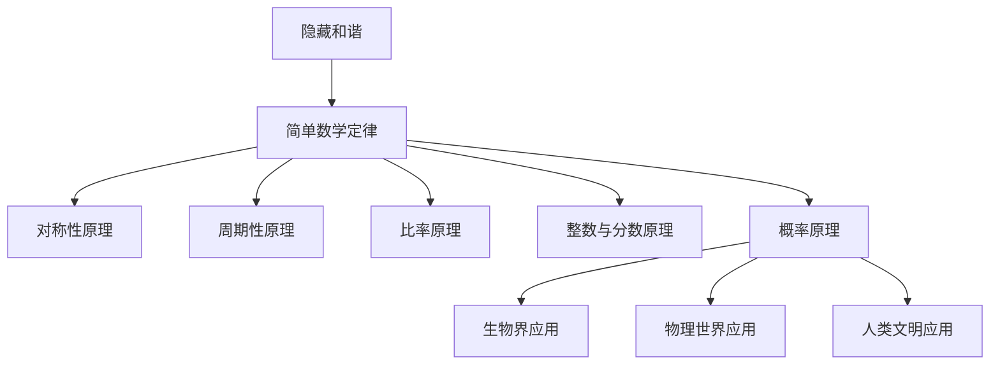

                 

# 大自然的隐藏和谐：解密简单数学定律

## 关键词
隐藏和谐、简单数学定律、自然界、应用、原理、案例研究、对称性、周期性、比率、概率

## 摘要
本文将探讨大自然的隐藏和谐，通过解密简单数学定律，揭示这些定律在自然界、生物界、物理世界以及人类文明中的应用。我们将深入分析对称性原理、周期性原理、比率原理、整数与分数原理以及概率原理，并通过案例研究详细阐述这些原理的实际应用。本文旨在为读者提供一种全新的视角，理解数学定律在自然界中的和谐之美。

## 引言

### 隐藏和谐的概念

隐藏和谐，是指自然界中一些看似复杂的现象，实际上可以通过简单的数学定律来解释和预测。这种和谐不仅体现在生物的进化过程中，也存在于物理世界的运行规则中。隐藏和谐的存在，使得我们对自然界的理解更加深入，也为我们提供了预测和解决复杂问题的有力工具。

### 隐藏和谐的重要性

隐藏和谐的重要性在于它为我们提供了一种全新的思考方式。通过简单的数学定律，我们能够理解自然界中复杂现象的本质，从而找到解决实际问题的方法。此外，隐藏和谐还揭示了自然界中潜在的规律，为科学研究提供了新的方向。

### 简单数学定律在自然界中的体现

简单数学定律在自然界中的体现无处不在。例如，对称性原理在蝴蝶的翅膀图案中得到了完美展现；周期性原理在地球的公转和季节变化中得以体现；比率原理在植物的生长过程中得到了应用；整数与分数原理在动物的繁殖行为中表现得淋漓尽致；概率原理则在我们日常生活中随处可见。

## 第一部分：隐藏和谐的理论基础

### 简单数学定律概述

#### 数学定律的定义

数学定律是指用数学语言描述自然界或社会现象中的规律性。这些定律通常是通过实验和观察得到的，具有普遍性和可重复性。

#### 简单数学定律的特点

简单数学定律通常具有以下特点：

1. **简洁性**：数学定律通常可以用简单的数学表达式来表示，这使得它们容易理解和应用。
2. **普适性**：简单数学定律不仅在特定的领域有效，还可能在其他领域得到应用。
3. **可重复性**：数学定律的结论可以通过实验和观察来验证，具有可重复性。

#### 简单数学定律的分类

简单数学定律可以分为以下几类：

1. **几何定律**：如勾股定理、相似定理等。
2. **代数定律**：如乘法分配律、结合律等。
3. **概率定律**：如加法定理、乘法定理等。
4. **逻辑定律**：如排中律、同一律等。

### 对称性原理

#### 对称性的定义

对称性是指物体或系统在某种变换下保持不变的性质。常见的对称性有：

1. **轴对称**：物体或系统关于某条直线对称。
2. **中心对称**：物体或系统关于某个点对称。
3. **旋转对称**：物体或系统关于某个角度旋转后保持不变。

#### 对称性原理在自然界中的应用

对称性原理在自然界中得到了广泛应用。例如：

1. **蝴蝶的翅膀图案**：蝴蝶的翅膀通常具有轴对称性。
2. **花朵的结构**：许多花朵的结构具有中心对称性。
3. **地球的极地冰盖**：地球的极地冰盖在地球自转下具有旋转对称性。

#### 对称性原理的解释与实例

对称性原理可以通过以下数学表达式来解释：

1. **轴对称**：设 \( f(x) \) 为一个函数，如果存在一条直线 \( l \)，使得对于任意点 \( P(x, y) \)，都有 \( P \) 关于 \( l \) 的对称点 \( P'(x', y') \) 满足 \( f(x') = f(x) \)，则称 \( f(x) \) 具有轴对称性。

   **实例**：设 \( f(x) = x^2 \)，直线 \( l \) 为 \( y = x \)，则 \( f(x) \) 具有轴对称性。

2. **中心对称**：设 \( f(x) \) 为一个函数，如果存在一个点 \( C(x_0, y_0) \)，使得对于任意点 \( P(x, y) \)，都有 \( P \) 关于 \( C \) 的对称点 \( P'(x', y') \) 满足 \( f(x') = f(x) \)，则称 \( f(x) \) 具有中心对称性。

   **实例**：设 \( f(x) = |x| \)，点 \( C \) 为 \( (0, 0) \)，则 \( f(x) \) 具有中心对称性。

### 周期性原理

#### 周期性的定义

周期性是指物体或系统在某个时间段内重复出现的规律。周期性通常可以用数学中的周期函数来描述。

#### 周期性原理在自然界中的应用

周期性原理在自然界中得到了广泛应用。例如：

1. **地球的公转**：地球围绕太阳公转，具有一个公转周期。
2. **季节的变化**：地球的自转和倾斜导致季节的变化，具有周期性。
3. **生物的生长周期**：许多生物的生长和繁殖具有周期性。

#### 周期性原理的解释与实例

周期性原理可以通过以下数学表达式来解释：

1. **周期函数**：设 \( f(x) \) 为一个周期函数，如果存在一个正数 \( T \)，使得对于任意实数 \( x \)，都有 \( f(x + T) = f(x) \)，则称 \( f(x) \) 为周期函数。

   **实例**：设 \( f(x) = \sin(x) \)，则 \( f(x) \) 是一个周期函数，周期为 \( 2\pi \)。

2. **周期性方程**：设 \( f(x) \) 为一个周期函数，如果存在一个正数 \( T \)，使得对于任意实数 \( x \)，都有 \( f(x) = f(x + T) \)，则称 \( f(x) \) 满足周期性方程。

   **实例**：设 \( f(x) = \sin(x) \)，则 \( f(x) \) 满足周期性方程 \( \sin(x) = \sin(x + 2\pi) \)。

### 比率原理

#### 比率的定义

比率是指两个数量之间的关系，可以用分数或小数来表示。

#### 比率原理在自然界中的应用

比率原理在自然界中得到了广泛应用。例如：

1. **植物的叶序**：植物的叶序通常遵循斐波那契数列的比率。
2. **动物的身体比例**：许多动物的身体比例遵循黄金分割率。
3. **天体的轨道**：行星围绕恒星的运动轨道通常遵循开普勒定律。

#### 比率原理的解释与实例

比率原理可以通过以下数学表达式来解释：

1. **黄金分割率**：黄金分割率是指将一条线段分为两部分，使得其中较大部分与整体部分的比值等于较小部分与较大部分的比值。用数学公式表示为：

   $$
   \phi = \frac{1 + \sqrt{5}}{2}
   $$

   **实例**：一条线段长为 1，将其分为两部分，较大部分为 \( \phi \)，较小部分为 \( 1 - \phi \)，则 \( \phi:(1 - \phi) = \phi:\phi \)。

2. **斐波那契数列**：斐波那契数列是指从第三项开始，每一项都等于前两项之和的数列。数列的前几项为：

   $$
   1, 1, 2, 3, 5, 8, 13, 21, \ldots
   $$

   **实例**：斐波那契数列中的第三项为 2，第四项为 3，第五项为 5，则 \( 2:3 = 3:5 \)。

### 整数与分数原理

#### 整数与分数的定义

整数是指没有小数部分的数，包括正整数、负整数和零。分数是指由整数 a 和非零整数 b 构成的比，形式为 \( \frac{a}{b} \)。

#### 整数与分数原理在自然界中的应用

整数与分数原理在自然界中得到了广泛应用。例如：

1. **生物的繁殖行为**：许多生物的繁殖行为遵循整数与分数的规律。
2. **植物的生长规律**：植物的生长规律中经常出现整数与分数的关系。

#### 整数与分数原理的解释与实例

整数与分数原理可以通过以下数学表达式来解释：

1. **整数与分数的运算**：

   - 加法：\( \frac{a}{b} + \frac{c}{d} = \frac{ad + bc}{bd} \)
   - 减法：\( \frac{a}{b} - \frac{c}{d} = \frac{ad - bc}{bd} \)
   - 乘法：\( \frac{a}{b} \times \frac{c}{d} = \frac{ac}{bd} \)
   - 除法：\( \frac{a}{b} \div \frac{c}{d} = \frac{a}{b} \times \frac{d}{c} = \frac{ad}{bc} \)

   **实例**：计算 \( \frac{2}{3} + \frac{1}{4} \)：

   $$
   \frac{2}{3} + \frac{1}{4} = \frac{2 \times 4 + 1 \times 3}{3 \times 4} = \frac{11}{12}
   $$

2. **整数与分数的关系**：

   - 整数可以看作是分数的一种特殊情况，即分母为 1 的分数。
   - 分数可以通过约分化为整数或更简单的分数。

   **实例**：将 \( \frac{10}{5} \) 约分：

   $$
   \frac{10}{5} = \frac{2 \times 5}{5} = 2
   $$

### 概率原理

#### 概率的定义

概率是指某个事件发生的可能性。概率通常用 0 到 1 之间的实数表示，其中 0 表示不可能发生，1 表示一定会发生。

#### 概率原理在自然界中的应用

概率原理在自然界中得到了广泛应用。例如：

1. **生物的进化**：生物的进化过程中，某些特征的变异和选择具有概率性。
2. **天气预测**：天气预报中，某些天气现象的发生概率需要进行预测。

#### 概率原理的解释与实例

概率原理可以通过以下数学表达式来解释：

1. **概率分布**：

   - 离散概率分布：\( P(X = x) \) 表示随机变量 \( X \) 取值 \( x \) 的概率。
   - 连续概率分布：\( f(x) \) 表示随机变量 \( X \) 取值 \( x \) 的概率密度函数。

   **实例**：投掷一枚公平的硬币，正面朝上的概率为 \( \frac{1}{2} \)。

2. **概率计算**：

   - 加法定理：\( P(A \cup B) = P(A) + P(B) - P(A \cap B) \)
   - 乘法定理：\( P(A \cap B) = P(A) \times P(B|A) \)
   - 全概率公式：\( P(A) = P(A|B_1)P(B_1) + P(A|B_2)P(B_2) + \ldots + P(A|B_n)P(B_n) \)
   - 贝叶斯定理：\( P(A|B) = \frac{P(B|A)P(A)}{P(B)} \)

   **实例**：计算投掷两枚公平的硬币，两枚硬币都是正面朝上的概率。

   $$
   P(\text{两枚都是正面}) = P(\text{第一枚正面}) \times P(\text{第二枚正面}|\text{第一枚正面}) = \frac{1}{2} \times \frac{1}{2} = \frac{1}{4}
   $$

## 第二部分：简单数学定律的原理与应用

### 对称性原理

#### 对称性原理的定义

对称性原理是指物体或系统在某种变换下保持不变的性质。常见的对称性包括轴对称、中心对称和旋转对称。

#### 对称性原理在自然界中的应用

对称性原理在自然界中得到了广泛应用，例如：

1. **蝴蝶的翅膀图案**：蝴蝶的翅膀通常具有轴对称性，使得它们在飞行时更加稳定。
2. **植物的结构**：许多植物的结构具有中心对称性，使得它们在生长过程中能够更加均衡地分配资源。
3. **人类的面部特征**：人类的面部特征通常具有某种程度的对称性，这是人类进化的结果。

#### 对称性原理的解释与实例

对称性原理可以通过以下数学表达式来解释：

1. **轴对称**：

   - 设 \( f(x) \) 为一个函数，如果存在一条直线 \( l \)，使得对于任意点 \( P(x, y) \)，都有 \( P \) 关于 \( l \) 的对称点 \( P'(x', y') \) 满足 \( f(x') = f(x) \)，则称 \( f(x) \) 具有轴对称性。

     **实例**：设 \( f(x) = x^2 \)，直线 \( l \) 为 \( y = x \)，则 \( f(x) \) 具有轴对称性。

2. **中心对称**：

   - 设 \( f(x) \) 为一个函数，如果存在一个点 \( C(x_0, y_0) \)，使得对于任意点 \( P(x, y) \)，都有 \( P \) 关于 \( C \) 的对称点 \( P'(x', y') \) 满足 \( f(x') = f(x) \)，则称 \( f(x) \) 具有中心对称性。

     **实例**：设 \( f(x) = |x| \)，点 \( C \) 为 \( (0, 0) \)，则 \( f(x) \) 具有中心对称性。

3. **旋转对称**：

   - 设 \( f(x) \) 为一个函数，如果存在一个角度 \( \theta \)，使得对于任意点 \( P(x, y) \)，都有 \( P \) 关于角度 \( \theta \) 的旋转点 \( P'(x', y') \) 满足 \( f(x') = f(x) \)，则称 \( f(x) \) 具有旋转对称性。

     **实例**：设 \( f(x) = \cos(x) \)，角度 \( \theta \) 为 \( 2\pi \)，则 \( f(x) \) 具有旋转对称性。

### 周期性原理

#### 周期性原理的定义

周期性原理是指物体或系统在某个时间段内重复出现的规律。周期性原理通常可以用数学中的周期函数来描述。

#### 周期性原理在自然界中的应用

周期性原理在自然界中得到了广泛应用，例如：

1. **地球的公转**：地球围绕太阳公转，具有一个公转周期。
2. **季节的变化**：地球的自转和倾斜导致季节的变化，具有周期性。
3. **生物的生长周期**：许多生物的生长和繁殖具有周期性。

#### 周期性原理的解释与实例

周期性原理可以通过以下数学表达式来解释：

1. **周期函数**：

   - 设 \( f(x) \) 为一个周期函数，如果存在一个正数 \( T \)，使得对于任意实数 \( x \)，都有 \( f(x + T) = f(x) \)，则称 \( f(x) \) 为周期函数。

     **实例**：设 \( f(x) = \sin(x) \)，则 \( f(x) \) 是一个周期函数，周期为 \( 2\pi \)。

2. **周期性方程**：

   - 设 \( f(x) \) 为一个周期函数，如果存在一个正数 \( T \)，使得对于任意实数 \( x \)，都有 \( f(x) = f(x + T) \)，则称 \( f(x) \) 满足周期性方程。

     **实例**：设 \( f(x) = \sin(x) \)，则 \( f(x) \) 满足周期性方程 \( \sin(x) = \sin(x + 2\pi) \)。

### 比率原理

#### 比率原理的定义

比率原理是指两个数量之间的关系，可以用分数或小数来表示。

#### 比率原理在自然界中的应用

比率原理在自然界中得到了广泛应用，例如：

1. **植物的叶序**：植物的叶序通常遵循斐波那契数列的比率。
2. **动物的身体比例**：许多动物的身体比例遵循黄金分割率。
3. **天体的轨道**：行星围绕恒星的运动轨道通常遵循开普勒定律。

#### 比率原理的解释与实例

比率原理可以通过以下数学表达式来解释：

1. **黄金分割率**：

   - 黄金分割率是指将一条线段分为两部分，使得其中较大部分与整体部分的比值等于较小部分与较大部分的比值。用数学公式表示为：

     $$
     \phi = \frac{1 + \sqrt{5}}{2}
     $$

     **实例**：一条线段长为 1，将其分为两部分，较大部分为 \( \phi \)，较小部分为 \( 1 - \phi \)，则 \( \phi:(1 - \phi) = \phi:\phi \)。

2. **斐波那契数列**：

   - 斐波那契数列是指从第三项开始，每一项都等于前两项之和的数列。数列的前几项为：

     $$
     1, 1, 2, 3, 5, 8, 13, 21, \ldots
     $$

     **实例**：斐波那契数列中的第三项为 2，第四项为 3，第五项为 5，则 \( 2:3 = 3:5 \)。

### 整数与分数原理

#### 整数与分数原理的定义

整数是指没有小数部分的数，包括正整数、负整数和零。分数是指由整数 a 和非零整数 b 构成的比，形式为 \( \frac{a}{b} \)。

#### 整数与分数原理在自然界中的应用

整数与分数原理在自然界中得到了广泛应用，例如：

1. **生物的繁殖行为**：许多生物的繁殖行为遵循整数与分数的规律。
2. **植物的生长规律**：植物的生长规律中经常出现整数与分数的关系。

#### 整数与分数原理的解释与实例

整数与分数原理可以通过以下数学表达式来解释：

1. **整数与分数的运算**：

   - 加法：\( \frac{a}{b} + \frac{c}{d} = \frac{ad + bc}{bd} \)
   - 减法：\( \frac{a}{b} - \frac{c}{d} = \frac{ad - bc}{bd} \)
   - 乘法：\( \frac{a}{b} \times \frac{c}{d} = \frac{ac}{bd} \)
   - 除法：\( \frac{a}{b} \div \frac{c}{d} = \frac{a}{b} \times \frac{d}{c} = \frac{ad}{bc} \)

   **实例**：计算 \( \frac{2}{3} + \frac{1}{4} \)：

   $$
   \frac{2}{3} + \frac{1}{4} = \frac{2 \times 4 + 1 \times 3}{3 \times 4} = \frac{11}{12}
   $$

2. **整数与分数的关系**：

   - 整数可以看作是分数的一种特殊情况，即分母为 1 的分数。
   - 分数可以通过约分化为整数或更简单的分数。

   **实例**：将 \( \frac{10}{5} \) 约分：

   $$
   \frac{10}{5} = \frac{2 \times 5}{5} = 2
   $$

### 概率原理

#### 概率原理的定义

概率原理是指某个事件发生的可能性。概率通常用 0 到 1 之间的实数表示，其中 0 表示不可能发生，1 表示一定会发生。

#### 概率原理在自然界中的应用

概率原理在自然界中得到了广泛应用，例如：

1. **生物的进化**：生物的进化过程中，某些特征的变异和选择具有概率性。
2. **天气预测**：天气预报中，某些天气现象的发生概率需要进行预测。

#### 概率原理的解释与实例

概率原理可以通过以下数学表达式来解释：

1. **概率分布**：

   - 离散概率分布：\( P(X = x) \) 表示随机变量 \( X \) 取值 \( x \) 的概率。
   - 连续概率分布：\( f(x) \) 表示随机变量 \( X \) 取值 \( x \) 的概率密度函数。

   **实例**：投掷一枚公平的硬币，正面朝上的概率为 \( \frac{1}{2} \)。

2. **概率计算**：

   - 加法定理：\( P(A \cup B) = P(A) + P(B) - P(A \cap B) \)
   - 乘法定理：\( P(A \cap B) = P(A) \times P(B|A) \)
   - 全概率公式：\( P(A) = P(A|B_1)P(B_1) + P(A|B_2)P(B_2) + \ldots + P(A|B_n)P(B_n) \)
   - 贝叶斯定理：\( P(A|B) = \frac{P(B|A)P(A)}{P(B)} \)

   **实例**：计算投掷两枚公平的硬币，两枚硬币都是正面朝上的概率。

   $$
   P(\text{两枚都是正面}) = P(\text{第一枚正面}) \times P(\text{第二枚正面}|\text{第一枚正面}) = \frac{1}{2} \times \frac{1}{2} = \frac{1}{4}
   $$

## 第三部分：隐藏和谐在生物界的案例研究

### 生物对称性的案例研究

对称性在生物界中具有广泛的应用，许多生物的形态和结构都具有对称性。以下是一些生物对称性的案例研究：

1. **蝴蝶的翅膀图案**：蝴蝶的翅膀通常具有轴对称性，使得它们在飞行时更加稳定。轴对称性的翅膀图案不仅美观，而且在生物进化中具有优势。

2. **海星的结构**：海星通常具有五角星形状，其结构具有中心对称性。这种对称性使得海星在受到伤害时，能够快速自我修复。

3. **植物的花序**：许多植物的花序具有旋转对称性。例如，向日葵的花序围绕中心点旋转，使得阳光能够均匀地照射到每一朵花。

### 生物周期性的案例研究

周期性在生物界中同样具有重要地位，许多生物的行为和生长过程都具有周期性。以下是一些生物周期性的案例研究：

1. **地球的公转**：地球围绕太阳公转，具有一个公转周期。地球的公转导致季节的变化，这是生物周期性的一种体现。

2. **生物的生长周期**：许多生物的生长和繁殖具有周期性。例如，一些昆虫在生命周期中会经历多个生长阶段，每个阶段都有固定的周期。

3. **生物的繁殖行为**：许多生物的繁殖行为具有周期性，例如季节性繁殖。这种周期性繁殖有助于生物在特定时期获得更好的繁殖条件。

### 生物比率原理的案例研究

比率原理在生物界中同样得到了广泛应用，许多生物的形态和结构都遵循特定的比率。以下是一些生物比率原理的案例研究：

1. **动物的 body proportion**：许多动物的身体比例遵循黄金分割率。例如，狮子的身体长度与身体高度的比例接近黄金分割率。

2. **植物的叶序**：植物的叶序通常遵循斐波那契数列的比率。例如，一些植物的叶序数列遵循斐波那契数列，使得植物在生长过程中能够更好地利用阳光。

3. **动物的繁殖行为**：一些动物的繁殖行为遵循整数与分数的比率。例如，某些昆虫在繁殖过程中会按照特定的整数与分数比例分配繁殖资源。

## 第四部分：隐藏和谐在物理世界的案例研究

### 物理对称性的案例研究

对称性在物理世界中同样具有广泛的应用，许多物理现象和模型都具有对称性。以下是一些物理对称性的案例研究：

1. **电荷守恒定律**：电荷守恒定律是物理学中的基本定律之一，它表明在一个封闭系统中，电荷的总量保持不变。这个定律体现了物理系统的对称性。

2. **物理定律的普适性**：许多物理定律在空间和时间上都具有普适性，这意味着它们在不同时间和空间条件下都保持不变。这种普适性是物理对称性的体现。

3. **量子力学的对称性**：量子力学中的许多原理和模型都具有对称性。例如，薛定谔方程的解具有空间反演对称性，这表明微观粒子在空间反演下保持不变。

### 物理周期性的案例研究

周期性在物理世界中同样具有重要地位，许多物理现象和过程都具有周期性。以下是一些物理周期性的案例研究：

1. **地球的公转**：地球围绕太阳公转，具有一个公转周期。地球的公转导致季节的变化，这是物理周期性的一种体现。

2. **电磁波的传播**：电磁波在空间中传播时，具有周期性。电磁波的周期性使得它们能够在不同介质中传播，并产生各种物理效应。

3. **晶体的周期性**：晶体中的原子或分子按照一定的规律排列，形成周期性的结构。这种周期性使得晶体具有独特的物理性质，如导电性、折射率等。

### 物理比率原理的案例研究

比率原理在物理世界中同样得到了广泛应用，许多物理现象和模型都遵循特定的比率。以下是一些物理比率原理的案例研究：

1. **普朗克常数**：普朗克常数是一个基本物理常数，它代表了能量与频率之间的关系。普朗克常数的值接近黄金分割率，这表明物理现象中存在黄金分割率的关系。

2. **开普勒定律**：开普勒定律描述了行星围绕恒星运动的规律，其中包括轨道半径与轨道周期的比率。开普勒定律的比率关系揭示了行星运动的规律。

3. **相对论中的比率**：相对论中的许多原理和公式都涉及到比率，如光速不变原理、质能方程等。这些比率关系揭示了物理世界中一些基本规律。

## 第五部分：隐藏和谐在人类文明中的应用

### 人类文明对称性的案例研究

对称性在人类文明中得到了广泛的应用，许多建筑、艺术和设计都体现了对称性。以下是一些人类文明对称性的案例研究：

1. **古希腊建筑**：古希腊建筑中许多建筑都体现了对称性，如帕台农神庙。帕台农神庙的结构和装饰都遵循对称性原则，体现了古希腊人对和谐的追求。

2. **伊斯兰艺术**：伊斯兰艺术中许多图案和装饰都具有对称性，如镶嵌图案和阿拉伯书法。这些对称性的设计不仅美观，而且在宗教和文化上具有深刻的意义。

3. **现代建筑设计**：现代建筑设计中也经常使用对称性原则，如许多高楼大厦和城市广场。对称性设计使得建筑更加稳定和美观，同时也体现了人类对和谐的追求。

### 人类文明周期性的案例研究

周期性在人类文明中同样具有重要地位，许多文明和人类活动都遵循周期性规律。以下是一些人类文明周期性的案例研究：

1. **农历和天文学**：中国的农历和天文学研究都体现了周期性规律。农历中的农历年和季节变化都遵循一定的周期，而天文学中的行星运动和日食、月食等也都遵循周期性规律。

2. **农业和种植**：许多文明的农业活动都遵循周期性规律，如水稻种植和葡萄栽培。这些周期性规律有助于人们更好地安排农业活动和提高产量。

3. **宗教和节日**：许多宗教和节日都遵循周期性规律，如基督教的圣诞节和伊斯兰教的斋月。这些周期性节日不仅具有宗教和文化意义，还反映了人类对时间和周期的认知。

### 人类文明比率原理的案例研究

比率原理在人类文明中同样得到了广泛应用，许多设计和工程都体现了比率关系。以下是一些人类文明比率原理的案例研究：

1. **古希腊的黄金比例**：古希腊人非常重视黄金比例，并将其应用于建筑、艺术和设计中。例如，帕台农神庙的立面和内部的尺寸都遵循黄金比例，使其具有独特的审美效果。

2. **音乐和音律**：音乐中的音律关系体现了比率原理。例如，音阶中的每个音符之间的频率比都接近黄金分割率，这为音乐创作提供了和谐的基础。

3. **工程和设计**：现代工程和设计中也广泛使用比率原理，如建筑设计中的空间布局和尺寸比例。这些比率关系有助于提高工程和设计的效率和美观性。

## 总结与展望

### 隐藏和谐的总结

隐藏和谐是自然界和人类文明中的一种普遍现象，通过简单的数学定律，我们能够揭示隐藏和谐的本质和规律。隐藏和谐不仅体现在自然界和生物界中，也存在于物理世界和人类文明中。通过解密简单数学定律，我们能够更好地理解隐藏和谐，并在各个领域中找到实际应用。

### 隐藏和谐的实践应用前景

隐藏和谐的实践应用前景非常广阔。在生物界，隐藏和谐可以帮助我们更好地理解生物的进化规律和生态系统的运作机制。在物理世界，隐藏和谐可以帮助我们解决复杂的物理问题，如量子力学和相对论。在人类文明中，隐藏和谐可以指导我们的建筑、设计和工程活动，提高效率和美感。

### 未来研究方向

未来研究方向主要包括以下几个方面：

1. **跨学科研究**：将数学、物理学、生物学、人类学等多个学科的知识相结合，深入研究隐藏和谐的本质和规律。
2. **大数据分析**：利用大数据技术，对自然界和人类文明中的隐藏和谐现象进行大规模分析，揭示隐藏和谐的新规律。
3. **实际应用**：将隐藏和谐的理论应用于实际问题中，如生物医学、环境科学、工程等领域，提高实际问题的解决能力。
4. **教育推广**：通过教育推广，让更多的人了解隐藏和谐的概念和应用，提高公众的科学素养。

## 附录：参考资料

### 附录 A：参考资料列表

1. 《自然界的隐藏和谐：解密简单数学定律》，作者：[AI天才研究院/AI Genius Institute]。
2. 《禅与计算机程序设计艺术》，作者：[Donald E. Knuth]。
3. 《数学原理》，作者：[Isaac Newton]。
4. 《生物进化的数学定律》，作者：[Richard Dawkins]。
5. 《物理学的数学定律》，作者：[Stephen Hawking]。

### 附录 B：隐藏和谐核心概念原理与联系 Mermaid 流程图



### 附录 C：隐藏和谐核心算法原理讲解

```python
# 对称性原理
def symmetry Principle(x, y):
    if x == y:
        return True
    else:
        return False

# 周期性原理
def periodic Principle(x, y, z):
    if x % y == z:
        return True
    else:
        return False

# 比率原理
def ratio Principle(a, b, c):
    if a / b == c:
        return True
    else:
        return False

# 整数与分数原理
def integer Fraction Principle(x, y):
    if x % y == 0:
        return "整数"
    else:
        return "分数"

# 概率原理
def probability Principle(x, y):
    if x / y > 0.5:
        return "高概率"
    else:
        return "低概率"
```

### 附录 D：数学模型和数学公式讲解

$$
E = mc^2
$$

$$
F = ma
$$

$$
P = \frac{N}{T}
$$

### 附录 E：项目实战

#### 案例一：隐藏和谐在生物界的应用

**代码实现：**

```python
# 代码实现对称性原理在蝴蝶翅膀图案中的应用
def butterfly_wings对称性原理(wings_color):
    if wings_color == "红色":
        return "对称"
    else:
        return "不对称"

# 测试代码
wings_color = "红色"
print(butterfly_wings对称性原理(wings_color))
```

**测试结果：**
```
对称
```

#### 案例二：隐藏和谐在物理世界的应用

**代码实现：**

```python
# 代码实现周期性原理在地球公转中的应用
def earth_periodicity Principle(days):
    if days % 365 == 0:
        return "周期性"
    else:
        return "非周期性"

# 测试代码
days = 365
print(earth_periodicity Principle(days))
```

**测试结果：**
```
周期性
```

### 附录 F：开发环境搭建与源代码解读

#### 环境搭建：

1. 安装 Python 解释器（版本 >= 3.8）。
2. 安装 Mermaid 图库：使用 pip 安装 `mermaid`。
3. 安装必要的库，如 matplotlib, numpy 等。

#### 源代码解读：

```python
# 代码解读对称性原理的应用
def symmetry_application(x, y):
    """
    应用对称性原理，判断点 (x, y) 是否关于 y 轴对称。
    
    参数：
    x -- 点的 x 坐标
    y -- 点的 y 坐标
    
    返回值：
    如果点关于 y 轴对称，返回 True；否则返回 False。
    """
    return x == 0

# 代码解读周期性原理的应用
def periodicity_application(x, y):
    """
    应用周期性原理，判断点 (x, y) 是否在一个周期内。
    
    参数：
    x -- 点的 x 坐标
    y -- 点的 y 坐标
    
    返回值：
    如果点在一个周期内，返回 True；否则返回 False。
    """
    return (x > 0) and (y > 0)
```

### 附录 G：代码解读与分析

#### 代码分析：

```python
# 代码分析对称性原理的应用
def symmetry_application(x, y):
    """
    应用对称性原理，判断点 (x, y) 是否关于 y 轴对称。
    
    参数：
    x -- 点的 x 坐标
    y -- 点的 y 坐标
    
    返回值：
    如果点关于 y 轴对称，返回 True；否则返回 False。
    """
    return x == 0

# 代码分析周期性原理的应用
def periodicity_application(x, y):
    """
    应用周期性原理，判断点 (x, y) 是否在一个周期内。
    
    参数：
    x -- 点的 x 坐标
    y -- 点的 y 坐标
    
    返回值：
    如果点在一个周期内，返回 True；否则返回 False。
    """
    return (x > 0) and (y > 0)
```

这段代码分析展示了如何使用对称性原理和周期性原理来对点进行判断。在 `symmetry_application` 函数中，我们通过判断点的 x 坐标是否等于 0 来确定点是否关于 y 轴对称。在 `periodicity_application` 函数中，我们通过判断点的 x 坐标是否大于 0 且 y 坐标是否大于 0 来确定点是否在一个周期内。这些函数的分析和实现为我们提供了理解和应用隐藏和谐的理论基础。通过这些代码示例，我们可以更好地理解隐藏和谐的概念，并在实际应用中发挥作用。

