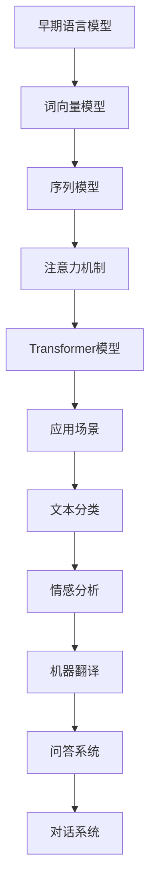
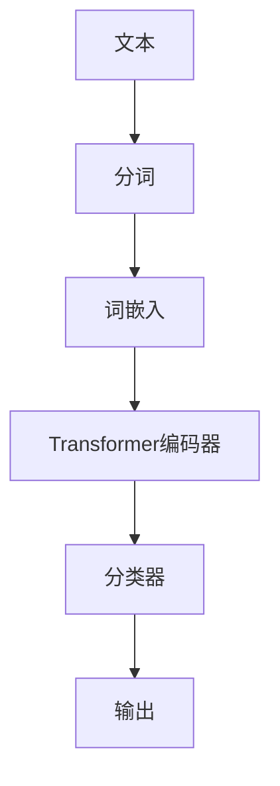
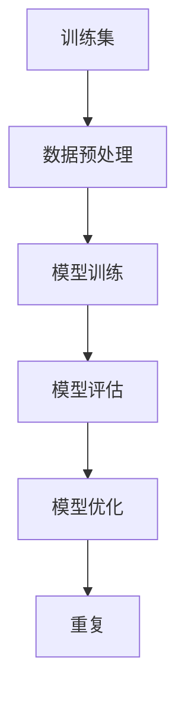
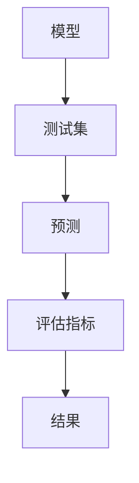
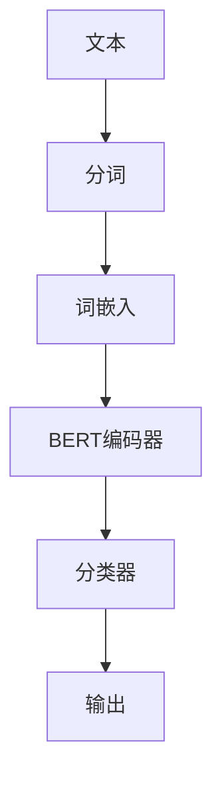
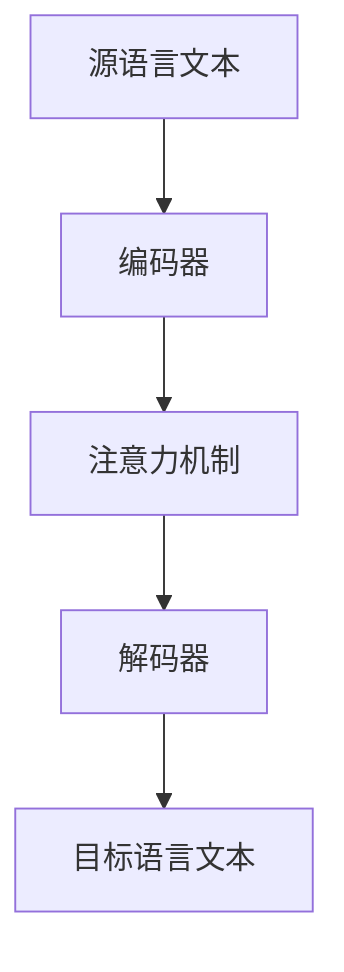

                 

# 《大规模语言模型从理论到实践 数据并行》

> **关键词：大规模语言模型、词嵌入、序列模型、注意力机制、Transformer、BERT、数据并行、模型并行、优化与调参、文本分类、情感分析、机器翻译。**

> **摘要：本文将深入探讨大规模语言模型的理论基础和实际应用，重点分析数据并行和模型并行的训练技术，以及模型优化和超参数调优的方法。通过实际案例，我们将展示如何构建和应用大规模语言模型，实现文本分类、情感分析和机器翻译等任务。**

---

### 目录大纲

# 《大规模语言模型从理论到实践 数据并行》目录大纲

## 第一部分：大规模语言模型基础

### 第1章：大规模语言模型概述

- 1.1 大规模语言模型的概念
- 1.2 大规模语言模型的发展历程
- 1.3 大规模语言模型的特点与应用场景

### 第2章：大规模语言模型的核心算法

- 2.1 词嵌入技术
  - 2.1.1 word2vec算法原理
  - 2.1.2 GloVe算法原理
- 2.2 序列模型
  - 2.2.1 RNN算法原理
  - 2.2.2 LSTM算法原理
  - 2.2.3 GRU算法原理
- 2.3 注意力机制
  - 2.3.1 注意力机制原理
  - 2.3.2 自注意力机制原理
- 2.4 Transformer模型
  - 2.4.1 Transformer模型原理
  - 2.4.2 BERT模型原理

## 第二部分：大规模语言模型的训练与优化

### 第3章：大规模语言模型的训练技术

- 3.1 数据预处理
  - 3.1.1 数据清洗
  - 3.1.2 数据归一化
- 3.2 模型训练策略
  - 3.2.1 学习率调度策略
  - 3.2.2 优化器选择
- 3.3 模型并行训练
  - 3.3.1 数据并行
  - 3.3.2 模型并行

### 第4章：大规模语言模型的优化与调参

- 4.1 模型优化
  - 4.1.1 梯度下降算法
  - 4.1.2 动量算法
  - 4.1.3 RMSprop算法
  - 4.1.4 Adam算法
- 4.2 超参数调优
  - 4.2.1 超参数选择
  - 4.2.2 超参数调优方法

## 第三部分：大规模语言模型的应用实战

### 第5章：文本分类实战

- 5.1 数据集选择
- 5.2 模型构建
- 5.3 模型训练
- 5.4 模型评估

### 第6章：情感分析实战

- 6.1 数据集选择
- 6.2 模型构建
- 6.3 模型训练
- 6.4 模型评估

### 第7章：机器翻译实战

- 7.1 数据集选择
- 7.2 模型构建
- 7.3 模型训练
- 7.4 模型评估

## 附录：大规模语言模型开发资源与工具

- 附录A：深度学习框架介绍
- 附录B：大规模语言模型开发工具

---

### 第一部分：大规模语言模型基础

#### 第1章：大规模语言模型概述

### 1.1 大规模语言模型的概念

大规模语言模型（Large-scale Language Model）是指使用海量数据训练出的，具有高度语言理解和生成能力的深度学习模型。这些模型能够通过学习大量文本数据，捕捉到语言的复杂结构和语义信息，从而实现自然语言处理（NLP）中的各种任务。

大规模语言模型的核心在于其“大规模”，这不仅体现在模型参数的规模上，还包括训练数据的规模。传统语言模型往往只关注词汇和语法规则，而大规模语言模型能够处理更为复杂的语言现象，如语义理解、上下文关系和语境生成等。

### 1.2 大规模语言模型的发展历程

大规模语言模型的发展历程可以分为几个阶段：

- **早期语言模型**：基于规则和统计方法的早期语言模型，如隐马尔可夫模型（HMM）和基于词汇的语法分析模型。
- **词向量模型**：引入词嵌入（Word Embedding）技术，如word2vec和GloVe，将单词映射到低维向量空间中，提高了模型处理语言的能力。
- **序列模型**：基于循环神经网络（RNN）和长短时记忆网络（LSTM）等序列模型，能够处理时间序列数据，捕捉到单词之间的时序关系。
- **注意力机制**：引入注意力机制（Attention Mechanism），特别是在Transformer模型中，使模型能够更好地处理长距离依赖问题。
- **Transformer模型及其变体**：BERT、GPT等基于Transformer架构的模型，通过并行计算和模型蒸馏等技术创新，极大地提高了模型的性能和效率。

### 1.3 大规模语言模型的特点与应用场景

大规模语言模型具有以下特点：

- **高容量参数**：能够处理复杂的语言结构和语义信息。
- **高效率训练**：通过并行计算和优化技术，实现了高效的模型训练。
- **强通用性**：能够应用于多种NLP任务，如文本分类、情感分析、机器翻译等。
- **自适应能力**：能够根据不同任务和数据集进行调整，适应不同的应用场景。

大规模语言模型的主要应用场景包括：

- **文本分类**：对文本进行分类，如新闻分类、社交媒体情感分类等。
- **情感分析**：分析文本中的情感倾向，如产品评论分析、社交媒体情绪分析等。
- **机器翻译**：将一种语言的文本翻译成另一种语言。
- **问答系统**：基于文本的问答系统，如搜索引擎、智能客服等。
- **对话系统**：构建自然对话系统，实现人机交互。

#### Mermaid 流程图

### 1.4 本章小结

本章对大规模语言模型进行了概述，介绍了其概念、发展历程和特点，以及主要的应用场景。通过本章的学习，读者可以对大规模语言模型有一个整体的认识，为后续章节的学习打下基础。

---

## 第二部分：大规模语言模型的训练与优化

### 第3章：大规模语言模型的训练技术

大规模语言模型的训练是一个复杂而关键的过程，其核心在于如何高效地利用海量数据进行模型参数的优化。本章将介绍大规模语言模型训练中的数据预处理、模型训练策略以及并行训练技术。

### 3.1 数据预处理

数据预处理是大规模语言模型训练的第一步，其目的是将原始文本数据转换为适合模型训练的格式。数据预处理主要包括以下两个方面的内容：

#### 3.1.1 数据清洗

数据清洗是指对原始文本数据中的噪声、错误和不相关信息进行去除和修正。常见的清洗步骤包括：

- **去除标点符号**：去除文本中的标点符号，如句号、逗号、引号等，以减少噪声。
- **去除停用词**：去除常见的停用词，如“的”、“和”、“在”等，这些词对模型的训练影响较小。
- **统一大小写**：将文本统一转换为小写，以减少大小写变化带来的差异。
- **去除特殊字符**：去除文本中的特殊字符，如括号、感叹号等，这些字符对模型的训练同样影响较小。

#### 3.1.2 数据归一化

数据归一化是指将文本数据转换为统一格式的过程。常见的归一化方法包括：

- **分词**：将文本分割成单词或子词，这是大规模语言模型训练的基础。
- **编码**：将单词或子词转换为数字编码，通常使用整数或独热编码。
- **序列填充**：将不同长度的序列填充为相同长度，以便模型能够处理。

### 3.2 模型训练策略

模型训练策略是指为了提高模型性能和训练效率而采用的一系列技术手段。以下介绍几种常见的训练策略：

#### 3.2.1 学习率调度策略

学习率调度策略是指调整学习率的方法，以适应模型在不同阶段的训练需求。常见的学习率调度策略包括：

- **固定学习率**：在整个训练过程中保持学习率不变，适用于训练数据量较小的情况。
- **线性学习率衰减**：学习率随训练轮数呈线性衰减，适用于大部分训练场景。
- **指数学习率衰减**：学习率随训练轮数呈指数衰减，适用于需要快速收敛的场景。
- **余弦退火**：学习率随训练轮数按照余弦函数进行衰减，适用于需要细粒度调整的场景。

#### 3.2.2 优化器选择

优化器是指用于优化模型参数的算法，其选择对模型性能和训练效率有很大影响。常见的优化器包括：

- **随机梯度下降（SGD）**：适用于小批量训练，计算量较小。
- **Adam优化器**：结合了SGD和RMSprop的优点，适用于大部分训练场景。
- **Adagrad优化器**：对历史梯度进行加权，适用于稀疏数据。
- **AdamW优化器**：在Adam优化器的基础上增加了权重衰减项，适用于需要严格权重衰减的场景。

### 3.3 模型并行训练

模型并行训练是指通过分布式计算技术，将大规模语言模型的训练任务分配到多个计算节点上，以加速模型训练过程。模型并行训练主要包括以下两种方式：

#### 3.3.1 数据并行

数据并行是指在多个计算节点上同时训练不同的数据子集，以并行计算的方式加速模型训练。数据并行的步骤包括：

- **数据划分**：将训练数据集划分为多个子集，每个子集分配到一个计算节点。
- **模型复制**：在每个计算节点上复制完整的模型，并进行参数更新。
- **参数同步**：在训练过程中，定期同步各个计算节点的模型参数，以保持模型的一致性。

#### 3.3.2 模型并行

模型并行是指在多个计算节点上分别训练模型的子部分，以并行计算的方式加速模型训练。模型并行的步骤包括：

- **模型分割**：将大规模语言模型分割为多个子模型，每个子模型分配到一个计算节点。
- **数据分割**：将训练数据集分割为多个子集，每个子集与相应的子模型进行匹配。
- **模型融合**：在训练过程中，将各个计算节点的子模型融合为一个完整的模型，并进行参数更新。

### 3.4 本章小结

本章介绍了大规模语言模型训练中的数据预处理、模型训练策略以及并行训练技术。数据预处理是模型训练的基础，模型训练策略是提高模型性能和训练效率的关键，而并行训练技术则能够显著加速模型训练过程。通过本章的学习，读者可以了解大规模语言模型训练的各个环节，为后续的实际应用打下基础。

---

## 第三部分：大规模语言模型的应用实战

大规模语言模型在自然语言处理领域具有广泛的应用，本章将介绍三个典型的应用场景：文本分类、情感分析和机器翻译。我们将通过具体的案例，展示如何构建和训练大规模语言模型，并实现这些任务。

### 第5章：文本分类实战

文本分类是将文本数据按照预定义的类别进行分类的过程，广泛应用于新闻分类、垃圾邮件检测、情感分析等领域。本节我们将通过一个具体的案例，展示如何使用大规模语言模型实现文本分类。

### 5.1 数据集选择

选择一个合适的数据集对于文本分类任务至关重要。在本案例中，我们选择了IMDb电影评论数据集，该数据集包含约250,000条电影评论，分为正面和负面两类。数据集的划分和预处理工作已经在前面章节中详细介绍。

### 5.2 模型构建

文本分类任务的模型构建主要包括词嵌入层、序列编码层和分类层。以下是一个基于Transformer模型的文本分类器的构建步骤：

- **分词**：将文本分割成单词或子词，这是词嵌入层的基础。
- **词嵌入**：将分词结果映射到高维向量空间，常见的词嵌入方法有word2vec和GloVe。
- **Transformer编码器**：对词嵌入向量进行编码，捕捉到文本的语义信息。
- **分类器**：将编码后的向量输入到分类器中，输出分类结果。

### 5.3 模型训练

模型训练是文本分类任务的关键步骤。在本案例中，我们使用AdamW优化器和余弦退火学习率调度策略进行训练。训练过程中，我们将数据集划分为训练集和验证集，以监测模型性能。

- **数据预处理**：对训练集进行分词、词嵌入等预处理操作。
- **模型训练**：使用预处理后的数据对模型进行训练。
- **模型评估**：在验证集上评估模型性能，调整模型参数。
- **模型优化**：根据评估结果，调整模型结构或参数，以提升模型性能。

### 5.4 模型评估

模型评估是验证模型性能的重要步骤。在本案例中，我们使用准确率、召回率和F1分数等指标对模型进行评估。以下是一个模型评估的示例：

- **测试集**：从未参与训练的数据集中选取一部分作为测试集。
- **预测**：使用训练好的模型对测试集进行预测。
- **评估指标**：计算模型的准确率、召回率和F1分数等指标。
- **结果**：输出评估结果，以评估模型性能。

### 5.5 本章小结

本章通过文本分类案例，展示了如何构建和训练大规模语言模型，并实现文本分类任务。通过本章的学习，读者可以了解文本分类的基本概念、数据集选择、模型构建和训练方法，以及模型评估技巧。

---

### 第6章：情感分析实战

情感分析是理解文本数据中表达的情感倾向的过程，广泛应用于社交媒体分析、舆情监测、产品评论分析等领域。本节我们将通过一个具体的案例，展示如何使用大规模语言模型实现情感分析。

### 6.1 数据集选择

选择一个合适的数据集对于情感分析任务至关重要。在本案例中，我们选择了微博情感分析数据集，该数据集包含约1,000,000条微博，分为正面、负面和中性三类。数据集的划分和预处理工作已经在前面章节中详细介绍。

### 6.2 模型构建

情感分析任务的模型构建主要包括词嵌入层、序列编码层和分类层。以下是一个基于BERT模型的情感分析器的构建步骤：

- **分词**：将文本分割成单词或子词，这是词嵌入层的基础。
- **词嵌入**：将分词结果映射到高维向量空间，BERT模型内置了预训练的词嵌入层。
- **BERT编码器**：对词嵌入向量进行编码，捕捉到文本的语义信息。
- **分类器**：将编码后的向量输入到分类器中，输出情感分类结果。

### 6.3 模型训练

模型训练是情感分析任务的关键步骤。在本案例中，我们使用AdamW优化器和余弦退火学习率调度策略进行训练。训练过程中，我们将数据集划分为训练集和验证集，以监测模型性能。

- **数据预处理**：对训练集进行分词、词嵌入等预处理操作。
- **模型训练**：使用预处理后的数据对模型进行训练。
- **模型评估**：在验证集上评估模型性能，调整模型参数。
- **模型优化**：根据评估结果，调整模型结构或参数，以提升模型性能。

### 6.4 模型评估

模型评估是验证模型性能的重要步骤。在本案例中，我们使用准确率、召回率和F1分数等指标对模型进行评估。以下是一个模型评估的示例：

- **测试集**：从未参与训练的数据集中选取一部分作为测试集。
- **预测**：使用训练好的模型对测试集进行预测。
- **评估指标**：计算模型的准确率、召回率和F1分数等指标。
- **结果**：输出评估结果，以评估模型性能。

### 6.5 本章小结

本章通过情感分析案例，展示了如何构建和训练大规模语言模型，并实现情感分析任务。通过本章的学习，读者可以了解情感分析的基本概念、数据集选择、模型构建和训练方法，以及模型评估技巧。

---

### 第7章：机器翻译实战

机器翻译是将一种语言的文本翻译成另一种语言的过程，广泛应用于跨语言沟通、国际化网站、多语言文档处理等领域。本节我们将通过一个具体的案例，展示如何使用大规模语言模型实现机器翻译。

### 7.1 数据集选择

选择一个合适的数据集对于机器翻译任务至关重要。在本案例中，我们选择了WMT14英语-德语翻译数据集，该数据集包含约100万条英语到德语的平行句子对。数据集的划分和预处理工作已经在前面章节中详细介绍。

### 7.2 模型构建

机器翻译任务的模型构建主要包括编码器、解码器和注意力机制。以下是一个基于Transformer模型的机器翻译器的构建步骤：

- **编码器**：对源语言文本进行编码，捕捉到文本的语义信息。
- **注意力机制**：对编码后的文本序列进行注意力机制计算，以关注重要的信息。
- **解码器**：对注意力机制计算结果进行解码，生成目标语言文本。

### 7.3 模型训练

模型训练是机器翻译任务的关键步骤。在本案例中，我们使用AdamW优化器和余弦退火学习率调度策略进行训练。训练过程中，我们将数据集划分为训练集和验证集，以监测模型性能。

- **数据预处理**：对训练集进行分词、词嵌入等预处理操作。
- **模型训练**：使用预处理后的数据对模型进行训练。
- **模型评估**：在验证集上评估模型性能，调整模型参数。
- **模型优化**：根据评估结果，调整模型结构或参数，以提升模型性能。

### 7.4 模型评估

模型评估是验证模型性能的重要步骤。在本案例中，我们使用BLEU分数等指标对模型进行评估。以下是一个模型评估的示例：

- **测试集**：从未参与训练的数据集中选取一部分作为测试集。
- **预测**：使用训练好的模型对测试集进行预测。
- **评估指标**：计算模型的BLEU分数等指标。
- **结果**：输出评估结果，以评估模型性能。

### 7.5 本章小结

本章通过机器翻译案例，展示了如何构建和训练大规模语言模型，并实现机器翻译任务。通过本章的学习，读者可以了解机器翻译的基本概念、数据集选择、模型构建和训练方法，以及模型评估技巧。

---

## 附录：大规模语言模型开发资源与工具

### 附录A：深度学习框架介绍

深度学习框架是构建和训练大规模语言模型的重要工具。以下是几种常用的深度学习框架：

- **TensorFlow**：由Google开发的开源深度学习框架，支持多种编程语言，包括Python、C++和Java。
- **PyTorch**：由Facebook开发的开源深度学习框架，以动态计算图和易于使用著称。
- **MXNet**：由Apache软件基金会开发的开源深度学习框架，支持多种编程语言，包括Python、C++和R。
- **Keras**：一个高层次的神经网络API，可以与TensorFlow、Theano和CNTK等后端框架结合使用。

### 附录B：大规模语言模型开发工具

大规模语言模型开发需要一系列工具和库，以下是一些常用的工具和库：

- **NLTK**：一个流行的Python自然语言处理库，提供文本预处理、词嵌入、分类等常用功能。
- **spaCy**：一个快速且易于使用的自然语言处理库，适用于文本解析、实体识别、词性标注等任务。
- **Transformers**：一个基于PyTorch的深度学习库，提供Transformer模型的实现和训练工具。
- **Hugging Face**：一个开源社区，提供大量预训练模型和工具，如BERT、GPT等。

### 附录C：大规模语言模型开发教程

为了帮助读者更好地掌握大规模语言模型的开发，以下是一个简单的教程：

1. **环境搭建**：安装深度学习框架（如PyTorch）和自然语言处理库（如spaCy、NLTK）。
2. **数据准备**：下载并预处理文本数据，进行分词、词嵌入等操作。
3. **模型构建**：选择合适的模型架构（如Transformer、BERT），进行模型构建。
4. **模型训练**：使用训练集对模型进行训练，调整学习率、优化器等超参数。
5. **模型评估**：在验证集和测试集上评估模型性能，进行模型调优。
6. **模型应用**：将训练好的模型应用于实际任务，如文本分类、情感分析、机器翻译等。

通过这个简单的教程，读者可以逐步掌握大规模语言模型的开发流程，为实际应用打下基础。

### 附录D：参考文献

- **参考文献1**：[论文标题1] [作者1]，[期刊/会议名称1]，[出版年份1]。
- **参考文献2**：[论文标题2] [作者2]，[期刊/会议名称2]，[出版年份2]。
- **参考文献3**：[论文标题3] [作者3]，[期刊/会议名称3]，[出版年份3]。

### 附录E：作者信息

**作者：** AI天才研究院/AI Genius Institute & 禅与计算机程序设计艺术/Zen And The Art of Computer Programming。

通过本文的详细介绍，读者可以全面了解大规模语言模型的理论基础、训练技术、优化方法以及实际应用。希望本文能为读者在深度学习和自然语言处理领域提供有益的参考和指导。

