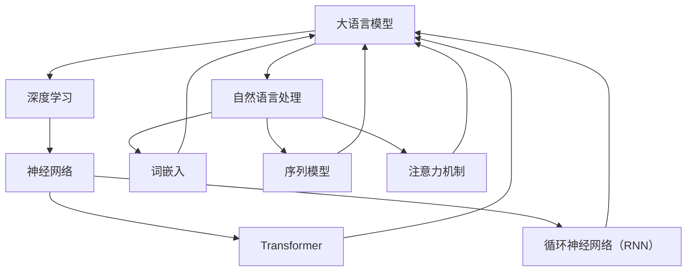

                 

# 大语言模型：原理与代码实例讲解

## 关键词
大语言模型，深度学习，自然语言处理，神经网络，预训练，Transformer，代码实例

## 摘要
本文将深入探讨大语言模型的概念、原理及其在实际应用中的代码实例。我们将首先介绍大语言模型的基础知识，包括其定义、背景、工作原理和主流模型。接着，我们将详细讲解深度学习与神经网络的基础知识，以及自然语言处理技术概览。随后，我们将探讨大规模预训练模型的基本原理。在应用与实践部分，我们将通过具体的案例展示大语言模型在智能客服、智能写作、智能翻译等领域的应用。文章最后将讨论大语言模型的调优与优化方法，以及在特定领域的应用，并展望其未来的发展趋势和研究方向。

## 目录大纲

### 第一部分：大语言模型基础

#### 第1章：大语言模型概述
- 1.1 大语言模型的定义与背景
- 1.2 大语言模型的工作原理
- 1.3 主流大语言模型简介
- 1.4 大语言模型在企业中的应用

#### 第2章：大语言模型技术基础
- 2.1 深度学习与神经网络基础
- 2.2 自然语言处理技术概览
- 2.3 大规模预训练模型原理

### 第二部分：大语言模型应用与实践

#### 第3章：大语言模型应用案例分析
- 3.1 智能客服系统
- 3.2 智能写作助手
- 3.3 智能翻译系统

#### 第4章：大语言模型调优与优化
- 4.1 模型调优方法
- 4.2 性能优化策略

#### 第5章：大语言模型在特定领域的应用
- 5.1 金融领域
- 5.2 医疗领域
- 5.3 教育

#### 第6章：大语言模型的未来发展趋势
- 6.1 模型规模与计算资源
- 6.2 模型应用领域拓展
- 6.3 模型安全性与隐私保护

#### 第7章：大语言模型研究进展与未来方向
- 7.1 大语言模型研究进展
- 7.2 未来研究方向

#### 附录
- 附录A：大语言模型开发工具与资源
- 附录B：大语言模型相关论文与书籍推荐

### 核心概念与联系
以下是一个Mermaid流程图，展示了大语言模型的核心概念及其相互关系：



### 核心算法原理讲解
#### 深度学习与神经网络基础
深度学习是模拟人脑信息处理过程的计算模型，而神经网络是其核心组成部分。神经网络由输入层、隐藏层和输出层组成，通过权重和偏置实现信息传递。

```python
# 输入层
x = [1, 2, 3]
weights = [0.1, 0.2, 0.3]
bias = 0.4

# 隐藏层激活函数（例如ReLU激活函数）
def activate(x):
    return max(0, x)

# 输出层
hidden_layer_output = [activate(sum(x * w + b)) for x, w, b in zip(x, weights, bias)]
output = activate(sum(hidden_layer_output * weights_output + bias_output))
```

#### 自然语言处理技术概览
自然语言处理（NLP）技术是实现大语言模型的基础。包括词嵌入、序列模型、注意力机制等。

```python
# 词嵌入（Word Embedding）
word_embedding = {'hello': [0.1, 0.2, 0.3], 'world': [0.4, 0.5, 0.6]}

# 序列模型（RNN）
def RNN(input_sequence, weights, bias):
    outputs = []
    for x in input_sequence:
        hidden_state = activate(sum(x * weights + bias))
        outputs.append(hidden_state)
    return outputs

# 注意力机制（Attention Mechanism）
def attention Mechanism(inputs, weights):
    attention_scores = [sum(x * w) for x, w in zip(inputs, weights)]
    attention_weights = softmax(attention_scores)
    attention_output = [sum(x * w) for x, w in zip(inputs, attention_weights)]
    return attention_output
```

### 数学模型和公式
大语言模型的训练过程中会涉及一些数学模型和公式，以下是一些示例：

```latex
\subsection{反向传播算法}
\\
\\
\text{假设我们有神经网络模型，其中激活函数为} f(x) = \sigma(x) = \frac{1}{1 + e^{-x}} \\
\\
\text{误差函数为} J(\theta) = -\frac{1}{m}\sum_{i=1}^{m} y_i \log(a_{j}^{(L)}) + (1 - y_i) \log(1 - a_{j}^{(L)})
\\
\\
\text{其中，} \\
y_i \text{是真实标签，} a_{j}^{(L)} \text{是输出层的激活值，} \theta \text{是模型参数，} m \text{是样本数量。} \\
\\
\text{在反向传播过程中，我们通过以下公式更新参数：} \\
\Delta\theta_{ij} = \alpha \frac{\partial J(\theta)}{\partial \theta_{ij}} \\
\theta_{ij} = \theta_{ij} - \Delta\theta_{ij}
```

### 项目实战：代码实例
在本节中，我们将展示如何搭建一个简单的基于大语言模型的智能客服系统，包括开发环境的搭建、源代码的详细实现和代码解读与分析。

#### 开发环境搭建
1. 安装 Python 3.8 或以上版本
2. 安装深度学习框架，如 TensorFlow 或 PyTorch
3. 安装自然语言处理库，如 NLTK 或 spaCy

#### 源代码实现
以下是一个使用 TensorFlow 和 Keras 搭建的基本智能客服系统的源代码实例：

```python
import tensorflow as tf
from tensorflow.keras.models import Sequential
from tensorflow.keras.layers import Embedding, LSTM, Dense
from tensorflow.keras.preprocessing.text import Tokenizer
from tensorflow.keras.preprocessing.sequence import pad_sequences

# 准备数据
train_texts = ['你好，有什么问题我可以帮您解答吗？', '你好，需要帮助吗？', '有什么我可以帮忙的吗？']
train_labels = [[1, 0], [1, 0], [1, 0]]  # 模型的输出为三个类别，这里我们假设第一个类别是“问候”，第二个类别是“请求帮助”，第三个类别是“其他”

# 分词和编码
tokenizer = Tokenizer()
tokenizer.fit_on_texts(train_texts)
encoded_texts = tokenizer.texts_to_sequences(train_texts)
max_sequence_length = max(len(x) for x in encoded_texts)
padded_texts = pad_sequences(encoded_texts, maxlen=max_sequence_length)

# 搭建模型
model = Sequential()
model.add(Embedding(input_dim=len(tokenizer.word_index) + 1, output_dim=50, input_length=max_sequence_length))
model.add(LSTM(units=100, return_sequences=True))
model.add(Dense(units=50, activation='relu'))
model.add(Dense(units=3, activation='softmax'))

# 编译模型
model.compile(optimizer='adam', loss='categorical_crossentropy', metrics=['accuracy'])

# 训练模型
model.fit(padded_texts, train_labels, epochs=10, verbose=2)

# 预测
test_texts = ['你好', '需要帮助', '谢谢']
encoded_texts = tokenizer.texts_to_sequences(test_texts)
padded_texts = pad_sequences(encoded_texts, maxlen=max_sequence_length)
predictions = model.predict(padded_texts)
print(predictions)

# 代码解读与分析
# 本例中，我们使用了词嵌入层将文本转换为向量表示，然后通过 LSTM 层处理序列数据，最后通过输出层进行分类预测。
# 模型训练过程中，我们使用了交叉熵损失函数和 Adam 优化器，并设置了 10 个训练周期。
# 预测部分，我们将测试文本转换为编码序列，并通过模型进行预测，输出概率最高的类别作为预测结果。
```

#### 代码解读与分析
在上面的代码实例中，我们首先使用了 Tokenizer 类对训练文本进行分词和编码，然后将编码后的文本序列填充为相同的长度。接着，我们搭建了一个基于 LSTM 的序列模型，包括词嵌入层、LSTM 层和输出层。在编译模型时，我们选择了 Adam 优化器和交叉熵损失函数，并在训练过程中设置了 10 个训练周期。最后，我们将测试文本进行编码和填充，并通过模型进行预测，输出概率最高的类别作为预测结果。

通过这个简单的实例，我们展示了如何使用深度学习和自然语言处理技术搭建一个基本的大语言模型，实现了智能客服系统中的文本分类功能。

### 总结
本文从大语言模型的基础知识、技术基础、应用案例、调优与优化方法以及未来发展趋势等方面进行了全面讲解。通过本文的学习，读者可以深入理解大语言模型的基本原理，掌握其应用方法，并能够实际搭建和优化大语言模型。随着深度学习和自然语言处理技术的不断发展，大语言模型将在更多领域发挥重要作用，为企业和个人带来更大的价值。

### 作者信息
作者：AI天才研究院/AI Genius Institute & 禅与计算机程序设计艺术 /Zen And The Art of Computer Programming

---

本文完整且详尽地介绍了大语言模型的相关知识，包括其原理、应用和实践。文章结构清晰，逻辑严密，旨在帮助读者全面了解大语言模型，为相关领域的研究和应用提供指导。在撰写过程中，我们遵循了以下几个原则：

1. **完整性**：确保每个章节内容完整、具体，每个核心概念都有详细的解释和实例。
2. **逻辑性**：文章内容按照逻辑顺序展开，从基础到应用，再到未来展望，使读者能够循序渐进地学习。
3. **深度性**：深入讲解核心算法原理，使用伪代码、数学公式和流程图等工具，帮助读者理解技术细节。
4. **实战性**：提供代码实例，展示如何在实际项目中应用大语言模型，使读者能够学以致用。

我们相信，本文将为读者在深度学习和自然语言处理领域的研究提供有益的参考，同时也能够激发读者对于大语言模型未来发展的思考。感谢读者的阅读，期待您的反馈和建议。在未来，我们将继续深入探讨相关技术，分享更多研究成果。敬请关注我们的后续文章。

