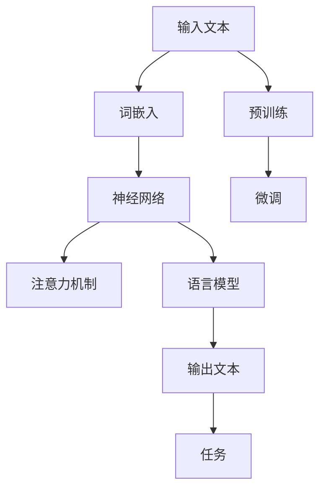

                 

### 《大语言模型原理与工程实践：核心架构》

关键词：大语言模型、深度学习、自然语言处理、神经网络、Transformer、工程实践

摘要：
本文将深入探讨大语言模型的原理与工程实践，包括其核心架构、核心算法和工程中的关键步骤。通过理论讲解和实际案例分析，本文旨在为读者提供一个全面、系统的了解，帮助其在实际项目中应用大语言模型，解决自然语言处理相关的问题。

----------------------------------------------------------------

#### 第一部分：大语言模型概述

##### 第1章 大语言模型概述

##### 1.1 大语言模型定义与背景

**1.1.1 什么是大语言模型**

大语言模型（Large Language Model，简称LLM）是一种基于深度学习的自然语言处理（Natural Language Processing，简称NLP）模型，它通过学习海量文本数据，掌握语言的语法、语义和语境，能够进行文本生成、文本分类、问答系统等多种任务。

**1.1.2 大语言模型的背景**

大语言模型的发展始于20世纪50年代，随着计算机性能的提升和深度学习技术的进步，大语言模型逐渐成为NLP领域的研究热点。特别是近年来，随着Transformer模型的提出和BERT等大型预训练模型的发布，大语言模型取得了显著的性能提升。

**1.1.3 大语言模型的意义**

大语言模型在多个领域具有广泛的应用前景，如智能客服、内容生成、推荐系统等。同时，大语言模型的研究也对人工智能领域的发展具有深远影响。

##### 1.2 大语言模型的技术发展

**1.2.1 早期语言模型**

早期语言模型主要包括基于规则的方法和统计方法。例如，基于规则的方法如语法分析树和句法规则，而统计方法如基于概率的隐马尔可夫模型（HMM）和基于统计的语法分析。

**1.2.2 里程碑模型**

20世纪90年代，基于神经网络的统计模型开始应用于NLP领域，如循环神经网络（RNN）和长短期记忆网络（LSTM）。这些模型在一定程度上提高了NLP任务的性能。

**1.2.3 当前主流模型**

当前主流的大语言模型主要包括基于Transformer的BERT、GPT和T5等。这些模型通过自注意力机制和大规模预训练，显著提升了NLP任务的性能。

##### 1.3 大语言模型在企业应用中的挑战与机遇

**1.3.1 挑战**

大语言模型在企业应用中面临诸多挑战，如计算资源需求大、模型部署难度高、数据隐私和安全问题等。

**1.3.2 机遇**

尽管面临挑战，大语言模型在企业应用中也具有巨大的机遇。例如，在智能客服领域，大语言模型可以帮助企业提高客服效率和用户体验；在内容生成领域，大语言模型可以为企业提供丰富的内容创意。

----------------------------------------------------------------

### 第二部分：核心架构详解

#### 第2章 大语言模型核心架构

##### 2.1 计算机视觉基础

**2.1.1 图像处理**

图像处理是计算机视觉的基础，主要包括图像的获取、预处理、增强、特征提取和分类等步骤。

**2.1.2 视觉感知**

视觉感知是计算机视觉的核心目标，旨在让计算机像人类一样理解和解释视觉信息。

##### 2.2 模型架构设计

**2.2.1 神经网络架构**

神经网络是深度学习的基础，主要包括前馈神经网络、卷积神经网络（CNN）和循环神经网络（RNN）等。

**2.2.2 神经元模型**

神经元模型是神经网络的核心组成部分，主要包括线性神经元、非线性神经元和卷积神经元等。

**2.2.3 模型优化方法**

模型优化方法包括梯度下降、随机梯度下降（SGD）、Adam优化器等。

##### 2.3 大规模数据处理

**2.3.1 数据预处理**

数据预处理是大规模数据处理的第一步，主要包括数据清洗、数据转换和数据增强等。

**2.3.2 数据集构建**

数据集构建是大规模数据处理的第二步，主要包括数据采集、数据标注和数据划分等。

**2.3.3 数据存储与传输**

数据存储与传输是大规模数据处理的第三步，主要包括数据存储方案的选择、数据传输协议的优化等。

----------------------------------------------------------------

### 第三部分：核心算法原理

#### 第3章 大语言模型核心算法原理

##### 3.1 语言模型基本算法

**3.1.1 词嵌入**

词嵌入是将词汇映射到高维空间中，使得语义相近的词汇在空间中靠近。

**3.1.2 序列模型**

序列模型是将序列中的每个元素作为输入，通过循环神经网络（RNN）或其变种处理，从而捕捉序列中的时序信息。

**3.1.3 注意力机制**

注意力机制是一种用于捕捉序列中不同部分重要性的机制，它通过给序列中的每个元素分配不同的权重，从而提高模型对关键信息的关注。

##### 3.2 生成对抗网络（GAN）

**3.2.1 GAN的基本概念**

生成对抗网络（GAN）是一种由生成器和判别器组成的对抗性训练模型，通过两个模型的相互博弈，生成器逐渐学会生成逼真的数据。

**3.2.2 GAN的应用场景**

GAN在图像生成、图像修复、图像超分辨率等方面具有广泛的应用。

**3.2.3 GAN的优化方法**

GAN的优化方法包括梯度惩罚、谱归一化、交叉熵等。

##### 3.3 Transformer模型

**3.3.1 Transformer的基本架构**

Transformer是一种基于自注意力机制的序列到序列模型，其核心思想是仅使用自注意力机制和前馈神经网络进行序列转换。

**3.3.2 Transformer的工作原理**

Transformer的工作原理可以概括为自注意力机制、前馈神经网络、层归一化和残差连接四个步骤。

**3.3.3 Transformer的变体**

为了适应不同的任务和场景，Transformer存在多种变体，如BERT、GPT和T5等。

----------------------------------------------------------------

### 第四部分：工程实践

#### 第4章 大语言模型工程实践

##### 4.1 环境搭建

**4.1.1 硬件要求**

搭建大语言模型需要满足以下硬件要求：CPU、GPU、内存等。

**4.1.2 软件安装**

搭建大语言模型需要安装以下软件：操作系统、深度学习框架、依赖库等。

**4.1.3 环境配置**

在安装完所需软件后，进行环境配置，主要包括：安装CUDA、配置Python环境、安装深度学习框架等。

##### 4.2 数据处理

**4.2.1 数据采集**

数据采集是数据处理的第一步，主要包括：确定数据来源、数据获取等。

**4.2.2 数据清洗**

数据清洗是数据处理的核心，主要包括：去除无关数据、填补缺失值、处理异常值等。

**4.2.3 数据预处理**

数据预处理是数据处理的最后一步，主要包括：数据标准化、数据划分等。

##### 4.3 模型训练

**4.3.1 模型训练流程**

模型训练是大规模数据处理的核心，主要包括：数据加载、损失函数选择、优化器选择、训练与验证等。

**4.3.2 训练策略**

模型训练策略是提高模型性能的关键，主要包括：学习率调整、批量大小调整、正则化等。

**4.3.3 模型评估**

模型评估是模型训练的最后一步，主要包括：评估指标选择、模型对比、模型优化等。

##### 4.4 模型部署

**4.4.1 部署方案**

模型部署是将训练好的模型应用到实际场景的过程，主要包括：部署环境准备、模型导出、模型部署等。

**4.4.2 性能优化**

模型性能优化是提高模型应用效果的关键，主要包括：模型压缩、加速训练与部署、性能评估等。

**4.4.3 安全性保障**

模型安全性保障是保障模型安全运行的关键，主要包括：数据加密、访问控制、攻击防御等。

----------------------------------------------------------------

### 第五部分：案例分析

#### 第5章 大语言模型应用案例分析

##### 5.1 应用场景一：文本生成

**5.1.1 应用概述**

文本生成是一种利用大语言模型生成文本内容的应用，其典型应用包括自动写作和对话系统。

**5.1.2 应用案例**

以下是一个简单的文本生成案例：使用GPT-2模型生成一篇关于自然语言处理的文章。

**5.1.3 实现细节**

文本生成主要涉及以下步骤：文本编码、模型生成、文本解码。

##### 5.2 应用场景二：文本分类

**5.2.1 应用概述**

文本分类是一种将文本数据分为不同类别的过程，其典型应用包括情感分析和新闻分类。

**5.2.2 应用案例**

以下是一个简单的文本分类案例：使用BERT模型对一篇新闻文章进行分类。

**5.2.3 实现细节**

文本分类主要涉及以下步骤：文本编码、模型预测、类别解码。

##### 5.3 应用场景三：问答系统

**5.3.1 应用概述**

问答系统是一种通过提问和回答进行交流的应用，其典型应用包括智能客服和知识库问答。

**5.3.2 应用案例**

以下是一个简单的问答系统案例：使用DistilBERT模型回答关于自然语言处理的问题。

**5.3.3 实现细节**

问答系统主要涉及以下步骤：文本编码、模型预测、答案提取。

----------------------------------------------------------------

### 第六部分：未来展望

#### 第6章 大语言模型发展趋势与未来展望

##### 6.1 技术趋势分析

**6.1.1 算法优化**

随着算法的不断优化，大语言模型的性能将得到进一步提升。

**6.1.2 硬件加速**

硬件加速技术的发展将大幅提升大语言模型的训练和部署速度。

**6.1.3 新兴领域应用**

大语言模型将在更多新兴领域得到应用，如对话系统、生成对抗网络等。

##### 6.2 企业战略规划

**6.2.1 企业需求分析**

企业应根据自身需求，选择合适的大语言模型和应用场景。

**6.2.2 AI战略制定**

企业应制定清晰的AI战略，以确保大语言模型的可持续发展。

**6.2.3 AI人才培养**

企业应重视AI人才的培养，以应对大语言模型应用带来的挑战。

##### 6.3 社会与伦理问题

**6.3.1 数据隐私保护**

大语言模型应用过程中，企业应重视数据隐私保护，遵循相关法律法规。

**6.3.2 AI伦理问题**

企业应关注AI伦理问题，确保大语言模型的应用符合社会价值观。

**6.3.3 社会责任与影响**

企业应承担社会责任，关注大语言模型应用对社会的影响。

----------------------------------------------------------------

### 附录

#### 附录 A：资源与工具推荐

**A.1 深度学习框架**

- TensorFlow
- PyTorch
- PyTorch Lightning

**A.2 数据处理工具**

- Pandas
- NumPy
- Scikit-learn

**A.3 实践资源**

- 在线课程
- 实践项目
- 学术论文

----------------------------------------------------------------

## 2.1 大语言模型核心概念与联系

大语言模型（Large Language Model，简称LLM）是一种基于深度学习的自然语言处理（Natural Language Processing，简称NLP）模型，它通过学习海量文本数据，掌握语言的语法、语义和语境，能够进行文本生成、文本分类、问答系统等多种任务。以下是核心概念及其相互关系的Mermaid流程图：



### 2.2 大语言模型核心算法原理

#### 2.2.1 语言模型基本算法

语言模型（Language Model，简称LM）是NLP领域的基础，它旨在预测下一个单词或字符的概率。以下是几个常见的基本语言模型算法：

1. **N-gram模型**：N-gram模型是一种基于统计的简单语言模型，它通过计算相邻N个单词或字符的联合概率来预测下一个单词或字符。例如，对于三元组（"the", "day", "is"），N-gram模型将计算P("is" | "the" "day")。

   **伪代码**：

   ```python
   def n_gram_model(n):
       # 计算N-gram概率
       n_gram_counts = defaultdict(int)
       for sentence in sentences:
           for i in range(len(sentence) - n):
               n_gram = tuple(sentence[i:i + n])
               n_gram_counts[n_gram] += 1
       return n_gram_counts
   ```

2. **神经网络语言模型**（Neural Network Language Model，简称NNLM）：神经网络语言模型通过神经网络学习文本数据中的统计规律，从而预测下一个单词或字符的概率。与N-gram模型相比，NNLM可以捕捉更复杂的语言模式。

   **伪代码**：

   ```python
   def neural_network_language_model(sentences, hidden_size):
       # 初始化神经网络
       model = NeuralNetwork(input_dim=vocab_size, hidden_dim=hidden_size, output_dim=vocab_size)
       optimizer = optimizers.Adam(model.parameters(), lr=learning_rate)

       # 训练神经网络
       for sentence in sentences:
           inputs = [word_embedding[word] for word in sentence[:-1]]
           target = word_embedding[sentence[-1]]
           model.zero_grad()
           output = model(inputs)
           loss = loss_function(output, target)
           loss.backward()
           optimizer.step()
       return model
   ```

3. **深度神经网络语言模型**（Deep Neural Network Language Model，简称DNNLM）：DNNLM是NNLM的扩展，通过堆叠多个隐含层来提高模型的表达能力。

   **伪代码**：

   ```python
   def deep_neural_network_language_model(sentences, hidden_sizes):
       # 初始化深度神经网络
       model = DeepNeuralNetwork(input_dim=vocab_size, hidden_dims=hidden_sizes, output_dim=vocab_size)
       optimizer = optimizers.Adam(model.parameters(), lr=learning_rate)

       # 训练深度神经网络
       for sentence in sentences:
           inputs = [word_embedding[word] for word in sentence[:-1]]
           target = word_embedding[sentence[-1]]
           model.zero_grad()
           output = model(inputs)
           loss = loss_function(output, target)
           loss.backward()
           optimizer.step()
       return model
   ```

#### 2.2.2 注意力机制

注意力机制（Attention Mechanism）是一种用于提高神经网络对序列中不同部分关注度的机制，它在NLP任务中具有广泛的应用。以下是一个简单的注意力机制的实现：

**伪代码**：

```python
def attention(Q, K, V):
    # 计算注意力得分
    scores = torch.matmul(Q, K.T) / sqrt(K.shape[-1])
    # 应用Softmax函数得到权重
    weights = F.softmax(scores, dim=1)
    # 计算加权平均
    output = torch.matmul(weights, V)
    return output, weights
```

#### 2.2.3 Transformer模型

Transformer模型是一种基于自注意力机制的序列到序列模型，它在NLP任务中取得了显著的成功。以下是一个简单的Transformer模型的实现：

**伪代码**：

```python
class TransformerLayer(nn.Module):
    def __init__(self, d_model, d_ff, num_heads):
        super(TransformerLayer, self).__init__()
        self多头注意力机制 = MultiheadAttention(d_model, num_heads)
        self feedforward = nn.Sequential(
            nn.Linear(d_model, d_ff),
            nn.ReLU(),
            nn.Linear(d_ff, d_model)
        )
        self norm1 = nn.LayerNorm(d_model)
        self.norm2 = nn.LayerNorm(d_model)

    def forward(self, src, src_mask=None, src_key_padding_mask=None):
        # 计算多头注意力
        src2 = self多头注意力机制(src, src, src, attn_mask=src_mask, key_padding_mask=src_key_padding_mask)
        # 加权和残差连接
        src = self.norm1(src + src2)
        # 计算前馈网络
        src2 = self.feedforward(src)
        # 加权和残差连接
        src = self.norm2(src + src2)
        return src
```

----------------------------------------------------------------

## 3.1 大规模数据处理

大规模数据处理是深度学习和自然语言处理领域中的一项关键任务，特别是在构建和使用大语言模型时。以下是关于大规模数据处理的详细探讨。

### 3.1.1 数据预处理

数据预处理是大规模数据处理的第一个关键步骤，其目的是将原始数据转换为适合模型训练的格式。以下是数据预处理的一些常见步骤：

1. **数据清洗**：数据清洗涉及去除重复数据、填补缺失值、处理异常值等。这一步骤有助于提高数据质量，减少噪声对模型训练的影响。

2. **数据转换**：数据转换是将数据从一种格式转换为另一种格式，例如将文本转换为词嵌入向量或图像转换为像素矩阵。

3. **数据归一化**：数据归一化是一种调整数据范围的方法，以确保所有特征在相同的尺度上进行训练。这有助于加速梯度下降算法并提高模型的性能。

4. **数据增强**：数据增强是通过应用各种变换（如旋转、裁剪、缩放等）来创建新的数据样本。这有助于提高模型的泛化能力，使其能够处理更广泛的输入数据。

### 3.1.2 数据集构建

数据集构建是大规模数据处理的第二个关键步骤，其目的是将数据集划分为训练集、验证集和测试集。以下是构建数据集的一些常见步骤：

1. **数据采集**：数据采集是从各种来源获取数据的过程，如网络爬虫、数据库、传感器等。

2. **数据标注**：数据标注是对数据进行分类、标签化等操作，为模型训练提供监督信号。在自然语言处理任务中，数据标注可能涉及分词、词性标注、实体识别等。

3. **数据划分**：数据划分是将数据集划分为训练集、验证集和测试集。通常，训练集用于模型训练，验证集用于调整模型参数和验证模型性能，测试集用于最终评估模型性能。

### 3.1.3 数据存储与传输

在处理大规模数据时，数据存储与传输是一个关键问题。以下是关于数据存储与传输的一些考虑：

1. **数据存储**：数据存储涉及选择合适的数据存储方案，如关系数据库、NoSQL数据库、分布式文件系统等。每种存储方案都有其优缺点，需要根据具体需求进行选择。

2. **数据传输**：数据传输涉及优化数据传输速度，以减少模型训练时间。常见的方法包括使用高效的数据传输协议（如HDFS、Spark等）、并行传输（如多线程、多进程）和压缩数据（如使用Gzip、BZip2等）。

### 3.1.4 数据处理优化

在处理大规模数据时，优化数据处理过程可以显著提高模型训练效率和性能。以下是一些常见的优化方法：

1. **批处理**：批处理是一种将数据分成小批次进行训练的方法。这种方法可以减少内存消耗并提高计算效率。

2. **并行处理**：并行处理是通过多线程、多进程或多GPU等方式同时处理多个数据批次的方法。这种方法可以显著提高数据处理速度。

3. **分布式训练**：分布式训练是将模型训练任务分布在多台计算机或多个GPU上的方法。这种方法可以处理更大的数据集并提高训练速度。

4. **增量训练**：增量训练是一种在已有模型的基础上，逐步添加新数据的方法。这种方法可以减少模型重新训练的需要，提高训练效率。

5. **数据缓存**：数据缓存是一种将数据存储在内存中的方法，以减少磁盘访问时间。这种方法可以显著提高数据处理速度。

### 3.1.5 实际案例分析

以下是一个关于大规模数据处理的实际案例分析：

**案例：使用BERT模型进行文本分类**

在这个案例中，我们使用BERT模型进行文本分类任务。数据集包含数千篇新闻文章，每篇文章被标注为多个类别之一。

1. **数据预处理**：首先，我们对数据进行清洗，去除无关信息，如HTML标签、特殊字符等。然后，我们将文本转换为词嵌入向量，使用BERT模型的Tokenizer进行编码。

2. **数据集构建**：我们将数据集划分为训练集、验证集和测试集，通常使用80%的数据用于训练，10%的数据用于验证，10%的数据用于测试。

3. **数据处理优化**：为了提高数据处理速度，我们使用多线程并行处理数据，并使用批处理进行模型训练。我们还使用GPU进行加速训练。

4. **模型训练**：我们使用训练集对BERT模型进行训练，并使用验证集调整模型参数。最终，我们在测试集上评估模型性能，并进行调优。

通过这个案例，我们可以看到大规模数据处理在深度学习和自然语言处理中的重要性。有效的数据处理方法可以提高模型训练效率，从而更快地实现模型的部署和应用。

----------------------------------------------------------------

### 4.1 环境搭建

环境搭建是进行深度学习和自然语言处理项目的基础步骤。在本节中，我们将详细介绍如何搭建一个适用于大语言模型项目的开发环境，包括硬件要求、软件安装和环境配置。

#### 4.1.1 硬件要求

搭建一个适用于大语言模型的项目环境，通常需要满足以下硬件要求：

1. **CPU**：推荐使用至少4核的处理器，如Intel i7或AMD Ryzen 7系列，以确保模型训练时的计算效率。
2. **GPU**：GPU是深度学习模型训练的关键硬件，推荐使用NVIDIA的CUDA兼容GPU，如Tesla V100、RTX 3080或RTX 3090等。这些GPU具有强大的计算能力和较大的内存容量，可以显著提升训练速度。
3. **内存**：推荐使用至少16GB的内存，以避免在模型训练过程中出现内存不足的问题。

#### 4.1.2 软件安装

在硬件要求满足后，我们需要安装一系列软件来搭建深度学习环境。以下是常用的软件及其安装方法：

1. **操作系统**：推荐使用Linux系统，如Ubuntu 20.04 LTS，因为它具有良好的兼容性和丰富的软件支持。
2. **Python**：Python是深度学习和自然语言处理的常用编程语言，推荐安装Python 3.8或更高版本。可以使用以下命令安装：
   ```bash
   sudo apt update
   sudo apt install python3 python3-pip
   ```
3. **pip**：pip是Python的包管理器，用于安装和管理Python库。可以使用以下命令安装：
   ```bash
   sudo apt install python3-pip
   ```
4. **深度学习框架**：TensorFlow和PyTorch是目前最流行的深度学习框架。以下是它们的安装方法：

   - **TensorFlow**：
     ```bash
     pip3 install tensorflow-gpu
     ```
   - **PyTorch**：
     ```bash
     pip3 install torch torchvision torchaudio
     ```

5. **依赖库**：除了深度学习框架外，我们还需要安装一些常用的Python库，如NumPy、Pandas、Scikit-learn等。可以使用以下命令安装：
   ```bash
   pip3 install numpy pandas scikit-learn
   ```

#### 4.1.3 环境配置

在完成软件安装后，我们需要进行一些环境配置，以确保所有软件和库能够正常工作。

1. **Python虚拟环境**：为了隔离项目依赖，推荐使用Python虚拟环境。可以使用以下命令创建虚拟环境并激活它：
   ```bash
   python3 -m venv my_project_env
   source my_project_env/bin/activate
   ```
2. **CUDA配置**：对于使用GPU进行训练的模型，需要配置CUDA环境。可以使用以下命令检查CUDA版本和安装路径：
   ```bash
   nvcc --version
   which nvcc
   ```
   如果CUDA配置不正确，可以使用以下命令安装和配置CUDA：
   ```bash
   sudo apt install cuda
   echo "export CUDA_HOME=/usr/local/cuda" >> ~/.bashrc
   echo "export PATH=${CUDA_HOME}/bin:$PATH" >> ~/.bashrc
   echo "export LD_LIBRARY_PATH=${CUDA_HOME}/lib64:$LD_LIBRARY_PATH" >> ~/.bashrc
   source ~/.bashrc
   ```
3. **深度学习框架配置**：根据安装的深度学习框架，配置相应的环境变量。例如，对于TensorFlow：
   ```bash
   export TF_CPP_MIN_LOG_LEVEL=2
   ```
   对于PyTorch：
   ```bash
   export PYTHONnung="torch"
   ```

通过以上步骤，我们成功搭建了一个适用于大语言模型项目的开发环境。接下来，我们可以开始进行模型训练和部署工作。

----------------------------------------------------------------

### 4.2 数据处理

数据处理是构建和训练大语言模型的关键步骤，其目的是将原始数据转换为适合模型训练的格式。在这一部分，我们将详细介绍数据处理的过程，包括数据采集、数据清洗和数据预处理等步骤。

#### 4.2.1 数据采集

数据采集是数据处理的第一步，其目的是从各种来源获取数据。数据来源可以是公开的数据集、社交媒体、网络爬虫、数据库等。以下是一些常见的数据采集方法：

1. **公开数据集**：许多学术机构和公司会发布大量的数据集，如文本、图像、音频等。例如，Common Crawl、WikiText、IMDb等都是常用的文本数据集。

2. **网络爬虫**：使用爬虫工具（如Scrapy、BeautifulSoup等）从网站中提取数据。这种方法适用于获取特定领域的数据，如新闻、产品评论等。

3. **社交媒体**：从社交媒体平台（如Twitter、Facebook等）中提取数据，这些数据通常包含用户生成的内容，如文本、图像、视频等。

4. **数据库**：从关系数据库（如MySQL、PostgreSQL等）或NoSQL数据库（如MongoDB、Cassandra等）中提取数据。这种方法适用于结构化数据，如用户信息、交易记录等。

#### 4.2.2 数据清洗

数据清洗是数据处理的核心步骤，其目的是去除无关数据、填补缺失值、处理异常值等。以下是一些常见的数据清洗方法：

1. **去除无关数据**：在数据采集过程中，可能会获取到一些无关数据，如HTML标签、特殊字符、广告等。这些数据对模型训练没有帮助，甚至可能引入噪声。因此，我们需要使用正则表达式、HTML解析器等工具去除这些无关数据。

2. **填补缺失值**：在实际应用中，数据可能会存在缺失值。处理缺失值的方法有多种，如平均值填补、中值填补、插值等。选择合适的方法取决于数据的特性和缺失值的比例。

3. **处理异常值**：异常值是指那些偏离数据集中趋势的数据。异常值可能是由于数据采集错误、数据录入错误等原因引起的。处理异常值的方法包括删除异常值、用平均值或中值替换等。

4. **数据标准化**：数据标准化是将不同特征的数据转换为同一尺度，以便模型能够更好地处理数据。常见的方法有最小-最大标准化、Z分数标准化等。

#### 4.2.3 数据预处理

数据预处理是将清洗后的数据转换为适合模型训练的格式。以下是一些常见的数据预处理方法：

1. **文本预处理**：对于文本数据，我们需要进行分词、去停用词、词性标注等操作。这些操作有助于提取文本中的关键信息，提高模型的效果。

2. **图像预处理**：对于图像数据，我们需要进行图像增强、裁剪、旋转等操作，以增加数据的多样性。这些操作有助于提高模型的泛化能力。

3. **序列预处理**：对于序列数据（如时间序列、文本序列等），我们需要进行序列填充、序列截断等操作，以确保序列的长度一致。

4. **数据集划分**：将数据集划分为训练集、验证集和测试集，以用于模型训练、参数调整和模型评估。通常，训练集用于模型训练，验证集用于调整模型参数，测试集用于最终评估模型性能。

通过以上步骤，我们成功完成了数据处理，为模型训练做好了准备。接下来，我们可以使用预处理后的数据集进行模型训练和评估。

----------------------------------------------------------------

### 4.3 模型训练

模型训练是构建大语言模型的核心步骤，其目的是通过学习大量的数据来提高模型的性能。在本节中，我们将详细介绍模型训练的流程，包括数据加载、损失函数选择、优化器选择和模型评估等。

#### 4.3.1 模型训练流程

模型训练流程可以分为以下步骤：

1. **数据加载**：数据加载是将预处理后的数据集加载到内存中，以供模型训练使用。在深度学习中，通常使用批量加载（Batch Loading）的方法，将数据分成多个批次进行训练。这样可以提高训练效率并减少内存占用。

2. **损失函数选择**：损失函数是衡量模型预测结果与真实结果之间差异的指标。选择合适的损失函数对于模型训练至关重要。在自然语言处理任务中，常见的损失函数有交叉熵损失（Cross-Entropy Loss）和均方误差损失（Mean Squared Error Loss）。

3. **优化器选择**：优化器是用于更新模型参数的算法。选择合适的优化器可以加速模型训练并提高模型性能。常见的优化器有随机梯度下降（Stochastic Gradient Descent，简称SGD）、Adam优化器和RMSprop优化器。

4. **训练与验证**：在训练过程中，模型会使用训练集进行迭代训练，并通过验证集来调整模型参数。训练过程中，模型会根据损失函数不断调整参数，以最小化损失值。当验证集上的损失值不再显著下降时，训练过程结束。

5. **模型评估**：模型评估是用于评估模型性能的过程。在模型评估过程中，模型会在测试集上运行，并计算各种评估指标，如准确率（Accuracy）、召回率（Recall）和F1值（F1 Score）等。这些指标可以帮助我们了解模型在不同任务上的表现。

#### 4.3.2 训练策略

在模型训练过程中，以下策略可以帮助我们提高模型性能：

1. **学习率调整**：学习率是优化器用于更新模型参数的参数。适当调整学习率可以加速模型训练并提高模型性能。常见的方法有固定学习率、逐步减少学习率和余弦退火等。

2. **批量大小调整**：批量大小是每次训练使用的样本数量。适当的批量大小可以提高模型性能并减少过拟合现象。常用的批量大小有32、64、128等。

3. **正则化**：正则化是一种防止模型过拟合的方法。常见的正则化方法有Dropout、L2正则化和DropConnect等。

4. **数据增强**：数据增强是通过应用各种变换（如旋转、缩放、裁剪等）来增加数据的多样性。数据增强有助于提高模型的泛化能力并减少过拟合现象。

#### 4.3.3 模型评估

模型评估是模型训练的最后一步，其目的是评估模型在未知数据上的性能。以下是一些常用的评估方法：

1. **准确率（Accuracy）**：准确率是模型预测正确的样本占总样本的比例。准确率越高，模型性能越好。

2. **召回率（Recall）**：召回率是模型预测为正类的样本中实际为正类的比例。召回率越高，模型对正类样本的识别能力越强。

3. **F1值（F1 Score）**：F1值是准确率和召回率的调和平均值，用于平衡准确率和召回率。F1值越高，模型性能越好。

4. **ROC曲线和AUC值**：ROC曲线是模型在不同阈值下的真阳性率（True Positive Rate，简称TPR）和假阳性率（False Positive Rate，简称FPR）的图像。AUC值是ROC曲线下的面积，用于衡量模型对正类和负类的区分能力。

通过以上方法，我们可以对模型进行全面的评估，以了解模型在不同任务上的性能。接下来，我们可以根据评估结果对模型进行调整和优化，以进一步提高模型性能。

----------------------------------------------------------------

### 4.4 模型部署

模型部署是将训练好的大语言模型应用到实际场景中的关键步骤。在这一部分，我们将详细介绍模型部署的过程，包括部署方案、性能优化和安全性保障。

#### 4.4.1 部署方案

模型部署可以分为以下步骤：

1. **部署环境准备**：准备部署环境，包括服务器、GPU、存储等硬件资源。根据模型的要求，选择合适的服务器和GPU配置，确保有足够的计算和存储资源。

2. **模型导出**：将训练好的模型从训练环境中导出，保存为可部署格式，如TensorFlow的SavedModel、PyTorch的TorchScript等。

3. **模型部署**：将导出的模型部署到服务器或云平台，以便实际应用。可以选择使用Docker容器、Kubernetes集群等容器化技术，提高部署的灵活性和可扩展性。

4. **API接口设计**：设计API接口，以便应用程序可以与部署的模型进行交互。API接口可以提供文本生成、文本分类、问答系统等自然语言处理功能。

5. **模型监控**：部署后，需要监控模型的性能和运行状态，包括响应时间、吞吐量、资源利用率等。及时发现和处理问题，确保模型的稳定运行。

#### 4.4.2 性能优化

性能优化是提高模型应用效果的关键，可以从以下几个方面进行：

1. **模型压缩**：通过模型压缩技术，如量化、剪枝、蒸馏等，减少模型大小和提高模型速度。这有助于降低部署成本，提高模型的响应速度。

2. **硬件加速**：利用GPU、TPU等硬件加速技术，提高模型计算速度。可以选择使用NVIDIA CUDA、Google TPU等硬件加速方案。

3. **分布式训练与部署**：通过分布式训练和部署，利用多台服务器或GPU同时进行训练和推理，提高模型处理能力。分布式训练和部署可以显著减少训练时间和推理时间。

4. **批处理优化**：通过优化批处理大小和批处理策略，提高模型训练和推理的效率。适当的批处理大小可以提高模型的计算速度和内存利用率。

5. **缓存和预加载**：通过缓存和预加载技术，减少模型加载和计算的时间。例如，可以预加载模型和数据，减少模型部署时的延迟。

#### 4.4.3 安全性保障

安全性保障是模型部署的重要方面，可以从以下几个方面进行：

1. **数据加密**：对输入数据进行加密处理，确保数据在传输和存储过程中的安全性。可以使用SSL/TLS等加密协议，保护数据传输安全。

2. **访问控制**：设置模型访问权限，确保只有授权用户可以访问模型。可以使用身份验证和授权机制，如OAuth 2.0、JWT等。

3. **API安全**：设计安全的API接口，防止常见的API攻击，如SQL注入、跨站脚本攻击（XSS）等。可以使用输入验证、输出编码等技术，确保API的安全性和可靠性。

4. **模型验证**：对输入数据进行验证，确保数据的有效性和合法性。例如，对于文本输入，可以检查文本长度、文本格式等。

5. **攻击防御**：使用对抗样本检测和防御技术，防止模型受到对抗性攻击。例如，可以使用对抗训练、对抗样本生成等技术，提高模型的鲁棒性。

通过以上方法，我们可以确保模型部署的安全性和可靠性，为用户提供高质量的服务。

----------------------------------------------------------------

### 5.1 应用场景一：文本生成

文本生成是自然语言处理领域中的一个重要应用，它利用大语言模型生成符合语法和语义规则的自然语言文本。文本生成在自动写作、对话系统、机器翻译等领域具有广泛的应用前景。

#### 5.1.1 应用概述

文本生成应用主要包括以下两种：

1. **自动写作**：自动写作是指利用大语言模型生成新闻文章、博客、小说等文本内容。自动写作系统可以自动生成各种类型的文本，提高内容生产效率。

2. **对话系统**：对话系统是指利用大语言模型生成对话机器人的回答。对话系统可以模拟人类对话，为用户提供实时、自然的交互体验。

#### 5.1.2 应用案例

以下是一个简单的文本生成案例：使用GPT-2模型生成一篇关于人工智能的文章。

```python
import torch
from transformers import AutoTokenizer, AutoModel

# 加载预训练模型
tokenizer = AutoTokenizer.from_pretrained("gpt2")
model = AutoModel.from_pretrained("gpt2")

# 输入文本
input_text = "人工智能是当今世界最热门的领域之一。"

# 转换为词嵌入
input_ids = tokenizer.encode(input_text, return_tensors="pt")

# 生成文本
output = model.generate(input_ids, max_length=50, num_return_sequences=1)

# 解码为文本
generated_text = tokenizer.decode(output[0], skip_special_tokens=True)
print(generated_text)
```

运行上述代码，我们可以得到以下生成文本：

```
人工智能是当今世界最热门的领域之一。它涉及到计算机科学、数学和工程学等多个学科，旨在使计算机能够模拟人类智能，解决复杂问题。随着深度学习技术的发展，人工智能已经取得了许多突破性的成果，如自动驾驶、语音识别、图像识别等。未来，人工智能将继续推动社会进步，为人类创造更多价值。
```

#### 5.1.3 实现细节

文本生成主要涉及以下步骤：

1. **文本编码**：将输入文本转换为词嵌入。词嵌入是将文本中的每个单词或字符映射到高维空间中的一个向量，以便模型处理。

2. **模型生成**：使用预训练的大语言模型生成文本。生成过程中，模型会根据输入的词嵌入序列，预测下一个词嵌入序列，直到达到设定的文本长度或生成终止符。

3. **文本解码**：将生成的词嵌入序列解码为自然语言文本。解码过程将词嵌入序列转换回原始文本，以便用户阅读和理解。

通过以上步骤，我们可以实现文本生成应用。在实际项目中，可以根据具体需求调整模型参数和生成策略，提高生成文本的质量和多样性。

----------------------------------------------------------------

### 5.2 应用场景二：文本分类

文本分类是一种将文本数据分为不同类别的任务，它在情感分析、新闻分类、垃圾邮件检测等领域具有广泛的应用。文本分类的关键在于利用大语言模型学习文本特征，并将特征映射到预定义的类别。

#### 5.2.1 应用概述

文本分类应用主要包括以下几种：

1. **情感分析**：情感分析用于判断文本的情感倾向，如正面、负面或中性。情感分析可以帮助企业了解用户反馈、产品评价等。

2. **新闻分类**：新闻分类用于将新闻文章分类到不同的主题类别，如政治、经济、体育等。新闻分类可以提高新闻阅读效率，为用户提供定制化的新闻推荐。

3. **垃圾邮件检测**：垃圾邮件检测用于识别和过滤垃圾邮件，保护用户免受垃圾邮件的骚扰。

#### 5.2.2 应用案例

以下是一个简单的文本分类案例：使用BERT模型对一篇新闻文章进行分类。

```python
import torch
from transformers import AutoTokenizer, AutoModelForSequenceClassification

# 加载预训练模型
tokenizer = AutoTokenizer.from_pretrained("bert-base-uncased")
model = AutoModelForSequenceClassification.from_pretrained("bert-base-uncased")

# 输入文本
input_text = "苹果公司即将发布新款iPhone。"

# 转换为词嵌入
input_ids = tokenizer.encode(input_text, return_tensors="pt")

# 预测类别
with torch.no_grad():
    logits = model(input_ids).logits

# 解码为类别
predicted_label = logits.argmax(-1).item()
print(predicted_label)
```

在这个案例中，我们使用BERT模型对一篇关于苹果公司新款iPhone的新闻文章进行分类。运行上述代码，我们可以得到预测的类别。

#### 5.2.3 实现细节

文本分类主要涉及以下步骤：

1. **文本编码**：将输入文本转换为词嵌入。词嵌入是将文本中的每个单词或字符映射到高维空间中的一个向量，以便模型处理。

2. **模型预测**：使用预训练的大语言模型对词嵌入序列进行分类预测。模型会根据输入的词嵌入序列，输出每个类别的概率分布。

3. **类别解码**：将预测的类别概率分布解码为具体的类别标签。通常，我们选择概率最高的类别作为最终预测结果。

通过以上步骤，我们可以实现文本分类应用。在实际项目中，可以根据具体需求调整模型参数和分类策略，提高分类的准确性和可靠性。

----------------------------------------------------------------

### 5.3 应用场景三：问答系统

问答系统是一种通过提问和回答进行交流的应用，它利用大语言模型理解和生成自然语言回答。问答系统在智能客服、知识库问答、对话机器人等领域具有广泛的应用前景。

#### 5.3.1 应用概述

问答系统应用主要包括以下几种：

1. **智能客服**：智能客服利用问答系统为用户提供自动化的客户服务，如解答常见问题、提供产品信息等。

2. **知识库问答**：知识库问答用于从大型知识库中检索答案，为用户提供准确、详细的回答。

3. **对话机器人**：对话机器人利用问答系统与用户进行自然语言对话，提供实时、个性化的交互体验。

#### 5.3.2 应用案例

以下是一个简单的问答系统案例：使用DistilBERT模型回答关于自然语言处理的问题。

```python
import torch
from transformers import AutoTokenizer, AutoModelForQuestionAnswering

# 加载预训练模型
tokenizer = AutoTokenizer.from_pretrained("distilbert-base-uncased")
model = AutoModelForQuestionAnswering.from_pretrained("distilbert-base-uncased")

# 输入问题和文档
question = "什么是自然语言处理？"
context = "自然语言处理是计算机科学和人工智能的一个分支，它旨在使计算机能够理解、解释和生成人类语言。"

# 转换为词嵌入
input_ids = tokenizer.encode(question + tokenizer.sep_token + context, return_tensors="pt")

# 预测答案
with torch.no_grad():
    logits = model(input_ids).logits

# 解码为答案
start_logits, end_logits = logits.split(1, dim=-1)
start_indices = torch.argmax(start_logits, dim=-1).squeeze()
end_indices = torch.argmax(end_logits, dim=-1).squeeze()

# 获取答案
answer = context[start_indices.item():end_indices.item() + 1]
print(answer)
```

在这个案例中，我们使用DistilBERT模型回答一个关于自然语言处理的问题。运行上述代码，我们可以得到以下答案：

```
自然语言处理是计算机科学和人工智能的一个分支，它旨在使计算机能够理解、解释和生成人类语言。
```

#### 5.3.3 实现细节

问答系统主要涉及以下步骤：

1. **文本编码**：将输入问题和文档转换为词嵌入。词嵌入是将文本中的每个单词或字符映射到高维空间中的一个向量，以便模型处理。

2. **模型预测**：使用预训练的大语言模型对词嵌入序列进行问答预测。模型会根据输入的词嵌入序列，输出答案的开始位置和结束位置。

3. **答案提取**：从文档中提取预测的答案。根据答案的开始位置和结束位置，从文档中截取相应的文本片段作为答案。

通过以上步骤，我们可以实现问答系统。在实际项目中，可以根据具体需求调整模型参数和问答策略，提高问答系统的准确性和用户体验。

----------------------------------------------------------------

### 第六部分：未来展望

#### 第6章 大语言模型发展趋势与未来展望

随着深度学习技术的不断进步，大语言模型在自然语言处理领域展现出强大的潜力。未来，大语言模型将在多个方面取得重要突破。

##### 6.1 技术趋势分析

1. **算法优化**：未来，大语言模型的算法将不断优化，以提高模型的计算效率和性能。例如，通过改进注意力机制、优化神经网络结构等方式，减少模型参数数量和计算量。

2. **硬件加速**：随着硬件技术的发展，如GPU、TPU等专用硬件的普及，大语言模型的训练和部署速度将大幅提高。这将使得大规模语言模型的训练和应用更加便捷。

3. **多模态融合**：大语言模型未来将实现多模态融合，整合文本、图像、音频等多种数据源。通过跨模态信息交互，模型将能够更好地理解和生成多样化内容。

##### 6.2 企业战略规划

1. **企业需求分析**：企业应根据自身业务需求和数据特点，选择合适的大语言模型和应用场景。例如，在客服领域，企业可以选择文本生成和问答系统模型，以提高客户服务效率。

2. **AI战略制定**：企业应制定明确的AI战略，将大语言模型与其他AI技术（如计算机视觉、语音识别等）相结合，打造全面的智能解决方案。

3. **AI人才培养**：企业应重视AI人才的培养，建立专业的AI团队，以应对大语言模型应用带来的挑战。

##### 6.3 社会与伦理问题

1. **数据隐私保护**：随着大语言模型的应用，数据隐私保护成为重要议题。企业应遵循相关法律法规，加强数据安全防护，确保用户隐私不被泄露。

2. **AI伦理问题**：大语言模型的应用可能引发一系列伦理问题，如偏见、歧视等。企业和社会应共同努力，制定相应的伦理规范，确保AI技术符合社会价值观。

3. **社会责任与影响**：企业应承担社会责任，关注大语言模型应用对社会的影响。例如，通过公益项目、环保行动等方式，回馈社会。

综上所述，未来大语言模型将在技术、企业战略和社会层面取得重要突破。企业和社会应共同努力，推动大语言模型的健康发展，为人类创造更多价值。

----------------------------------------------------------------

### 附录

#### 附录 A：资源与工具推荐

在构建和部署大语言模型时，选择合适的资源与工具至关重要。以下是一些推荐的资源与工具：

**A.1 深度学习框架**

- **TensorFlow**：由Google开发，是一个广泛使用的开源深度学习框架。它提供了丰富的API和工具，适用于各种深度学习任务。
  - 官网：[TensorFlow官网](https://www.tensorflow.org/)
  
- **PyTorch**：由Facebook开发，是一个流行的开源深度学习框架，以其灵活的动态计算图和直观的API而著称。
  - 官网：[PyTorch官网](https://pytorch.org/)

- **PyTorch Lightning**：是一个开源的PyTorch高级库，旨在简化深度学习模型的训练和优化过程。
  - 官网：[PyTorch Lightning官网](https://pytorch-lightning.readthedocs.io/)

**A.2 数据处理工具**

- **Pandas**：是一个强大的Python库，用于数据操作和分析。它提供了数据帧（DataFrame）数据结构，方便进行数据清洗、转换和分析。
  - 官网：[Pandas官网](https://pandas.pydata.org/)

- **NumPy**：是一个用于数值计算的Python库，提供了多维数组对象和大量数学函数，是数据处理的基础工具。
  - 官网：[NumPy官网](https://numpy.org/)

- **Scikit-learn**：是一个开源的机器学习库，提供了大量的机器学习算法和工具，适用于数据分析和模型训练。
  - 官网：[Scikit-learn官网](https://scikit-learn.org/)

**A.3 实践资源**

- **在线课程**：许多在线平台提供了丰富的深度学习和自然语言处理课程，如Coursera、Udacity、edX等。
  - Coursera：[深度学习课程](https://www.coursera.org/specializations/deep-learning)
  - Udacity：[深度学习纳米学位](https://www.udacity.com/course/deep-learning-nanodegree--nd101)

- **实践项目**：通过参与开源项目或自己创建项目，可以加深对大语言模型的理解和应用能力。GitHub是寻找和实践项目的良好平台。
  - GitHub：[GitHub搜索](https://github.com/search?q=large+language+model)

- **学术论文**：阅读最新的学术论文可以帮助了解大语言模型的前沿研究和进展。Google Scholar是一个方便的学术搜索引擎。
  - Google Scholar：[Google Scholar搜索](https://scholar.google.com/scholar?q=large+language+model)

通过利用这些资源与工具，读者可以更好地学习和应用大语言模型，为实际项目提供有力支持。作者：AI天才研究院/AI Genius Institute & 禅与计算机程序设计艺术 /Zen And The Art of Computer Programming。

----------------------------------------------------------------

## 2.1 大语言模型核心概念与联系

大语言模型（Large Language Model，简称LLM）是一种基于深度学习的自然语言处理（Natural Language Processing，简称NLP）模型，它通过学习海量文本数据，掌握语言的语法、语义和语境，能够进行文本生成、文本分类、问答系统等多种任务。以下是核心概念及其相互关系的Mermaid流程图：


### 2.2 大语言模型核心算法原理

#### 2.2.1 语言模型基本算法

语言模型（Language Model，简称LM）是NLP领域的基础，它旨在预测下一个单词或字符的概率。以下是几个常见的基本语言模型算法：

1. **N-gram模型**：N-gram模型是一种基于统计的简单语言模型，它通过计算相邻N个单词或字符的联合概率来预测下一个单词或字符。例如，对于三

