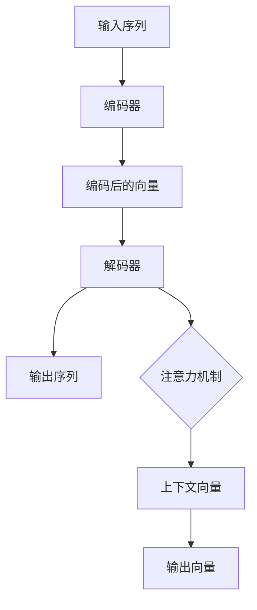

                 

# 《大语言模型原理基础与前沿 模型架构》

## 关键词

- 大语言模型
- 模型架构
- 预训练
- 微调
- 词嵌入
- 注意力机制
- 编码器-解码器
- 数学基础
- 应用场景
- 优化与加速

## 摘要

本文将系统地介绍大语言模型的原理和前沿，重点讨论其模型架构。首先，我们将回顾大语言模型的发展历程，理解其重要性。接着，我们将深入探讨大语言模型的基本架构，包括神经网络基础、词嵌入技术以及编码器-解码器架构。随后，我们将介绍大语言模型的数学基础，包括向量空间与线性代数基础、概率论基础，以及贝叶斯定理。接着，我们将详细解析大语言模型的主要算法，如预训练与微调、自然语言处理算法等。在应用场景部分，我们将探讨大语言模型在文本生成和问答系统等领域的应用。最后，我们将讨论大语言模型的优化与加速方法，包括并行计算与分布式训练、混合精度训练等。通过本文的阅读，读者将对大语言模型有全面深入的理解，并能掌握其核心原理和应用。

## 目录大纲

### 第一部分：大语言模型概述与基础

**第1章：大语言模型的概念与背景**

1.1 大语言模型的发展历程

1.2 大语言模型的重要性

1.3 大语言模型的基本概念

**第2章：大语言模型的基本架构**

2.1 神经网络基础

2.2 词嵌入技术

2.3 编码器-解码器架构

### 第二部分：大语言模型的数学原理与算法

**第3章：大语言模型的数学基础**

3.1 向量空间与线性代数基础

3.2 概率论基础

3.3 大语言模型的数学原理

**第4章：大语言模型的主要算法**

4.1 预训练与微调

4.2 自然语言处理算法

### 第三部分：大语言模型的应用场景

**第5章：大语言模型的应用场景**

5.1 文本生成

5.2 问答系统

### 第四部分：大语言模型的优化与加速

**第6章：大语言模型的优化与加速**

6.1 并行计算与分布式训练

6.2 混合精度训练

### 第五部分：大语言模型的未来展望

**第7章：大语言模型的未来展望**

7.1 技术趋势与挑战

7.2 社会影响与伦理问题

### 附录：实践资源与工具

**附录 A：大语言模型开发工具**

**附录 B：大语言模型开源项目**

## 第一部分：大语言模型概述与基础

### 第1章：大语言模型的概念与背景

#### 1.1 大语言模型的发展历程

大语言模型（Large Language Models）的发展历程可以追溯到20世纪80年代，当时神经网络刚刚开始被引入到人工智能领域。最早的神经网络模型如感知机、BP神经网络等，为后续的模型发展奠定了基础。然而，由于计算资源和数据集的限制，这些早期的模型在性能上并不理想。

进入20世纪90年代，HMM（Hidden Markov Model）在语音识别和自然语言处理中占据了主导地位。HMM模型能够处理时间序列数据，并在语音识别中取得了显著成果。同时，统计语言模型如N-gram模型也开始被广泛应用于文本生成任务。

2000年后，随着计算能力的提升和数据集的扩展，神经网络在自然语言处理领域再次崛起。Word2Vec模型的出现标志着词嵌入技术的兴起，它通过将单词映射到高维向量空间，使得神经网络能够更好地处理文本数据。随后，基于神经网络的序列模型如LSTM（Long Short-Term Memory）和GRU（Gated Recurrent Unit）在语言建模和文本生成任务中表现出色。

2018年，Google推出了BERT（Bidirectional Encoder Representations from Transformers）模型，这是大语言模型发展中的一个重要里程碑。BERT模型通过双向Transformer架构，实现了对文本的深入理解，并在多个自然语言处理任务中取得了SOTA（State-of-the-Art）性能。

紧接着，OpenAI推出了GPT系列模型，包括GPT、GPT-2和GPT-3。这些模型在预训练和微调方面取得了显著进展，尤其是在文本生成和问答系统等任务中表现出色。特别是GPT-3，其参数规模达到了1750亿，成为迄今为止最大的预训练模型。

#### 1.2 大语言模型的重要性

大语言模型在自然语言处理领域的重要性不容忽视，其主要体现在以下几个方面：

1. **强大的文本生成能力**：大语言模型能够生成连贯、有逻辑的文本，广泛应用于自动摘要、文本创作、对话系统等任务。

2. **高效的预训练与微调**：大语言模型通过在大规模语料库上进行预训练，可以快速适应不同任务，节省了模型开发的时间。

3. **广泛的适应性**：大语言模型可以应用于多种自然语言处理任务，如文本分类、情感分析、机器翻译等，具有很强的适应性。

4. **推动人工智能的发展**：大语言模型的研究和应用促进了人工智能在自然语言处理领域的突破，推动了相关技术的进步。

#### 1.3 大语言模型的基本概念

1. **预训练（Pre-training）**：预训练是指在大规模语料库上对模型进行训练，使其具备一定的语言理解能力。

2. **微调（Fine-tuning）**：微调是指将预训练模型在特定任务上进行训练，使其能够适应具体任务。

3. **词嵌入（Word Embedding）**：词嵌入是指将单词映射到高维向量空间，以便于模型处理和计算。

4. **编码器-解码器架构（Encoder-Decoder Architecture）**：编码器将输入序列编码为固定长度的向量，解码器则利用这些向量生成输出序列。

5. **注意力机制（Attention Mechanism）**：注意力机制用于在处理长序列时关注重要的信息，提高生成文本的质量。

#### Mermaid 流程图



### 第2章：大语言模型的基本架构

#### 2.1 神经网络基础

##### 2.1.1 神经网络的结构

神经网络（Neural Networks）是由大量神经元（或节点）组成的网络，每个神经元接收多个输入信号，并通过加权求和后加上偏置项，再经过激活函数输出结果。神经网络可以分为输入层、隐藏层和输出层。

1. **输入层（Input Layer）**：接收外部输入数据。
2. **隐藏层（Hidden Layers）**：负责数据变换和特征提取。
3. **输出层（Output Layer）**：产生最终的预测结果。

多个隐藏层可以堆叠形成深度神经网络（Deep Neural Networks）。

##### 2.1.2 激活函数

激活函数（Activation Function）为神经网络引入非线性特性，常见的激活函数有：

1. **Sigmoid函数**：\( f(x) = \frac{1}{1 + e^{-x}} \)
2. **ReLU函数**：\( f(x) = max(0, x) \)
3. **Tanh函数**：\( f(x) = \frac{e^x - e^{-x}}{e^x + e^{-x}} \)
4. **Leaky ReLU函数**：\( f(x) = \max(0.01x, x) \)

激活函数的选择会影响神经网络的性能和训练速度。

##### 2.1.3 前向传播与反向传播算法

1. **前向传播（Forward Propagation）**：输入数据从输入层传递到输出层，每层神经元计算加权求和并经过激活函数得到输出。

2. **反向传播（Backpropagation）**：计算输出层预测值与实际值之间的误差，然后沿反向路径传播误差，更新各层的权重和偏置。

伪代码：

```python
# 前向传播
for layer in network:
    layer.forward()

# 反向传播
for layer in reversed(network):
    layer.backward()
```

#### 2.2 词嵌入技术

##### 2.2.1 词嵌入的概念

词嵌入（Word Embedding）是将单词映射到高维向量空间的一种技术，用于表示单词的语义信息。

##### 2.2.2 词嵌入的常见方法

1. **分布式表示（Distributed Representation）**：将单词映射到向量空间，向量中每个维度表示单词的一个特征。

2. **Word2Vec**：基于神经网络的方法，通过训练单词的上下文来学习词向量。

3. **GloVe**：基于全局信息的词向量学习方法，通过计算单词共现矩阵的奇异值分解来学习词向量。

4. **BERT**：使用多层Transformer模型进行预训练，生成高质量的词向量。

#### 2.3 编码器-解码器架构

##### 2.3.1 编码器的作用

编码器（Encoder）将输入序列编码为固定长度的向量，用于表示整个序列的语义信息。

##### 2.3.2 解码器的作用

解码器（Decoder）利用编码器输出的向量生成输出序列，通常采用自回归方式，逐个预测每个单词的概率。

##### 2.3.3 注意力机制

注意力机制（Attention Mechanism）用于在处理长序列时关注重要的信息，提高生成文本的质量。

注意力机制的计算过程如下：

1. 计算查询向量（Query）和键值对（Key-Value）之间的相似度。
2. 对相似度进行加权求和，得到上下文向量（Context Vector）。
3. 将上下文向量与值向量（Value）进行拼接，并经过线性变换得到输出向量。

伪代码：

```python
# 注意力机制
for key, value in keys_values:
    similarity = compute_similarity(query, key)
    context_vector = weighted_sum(similarity, values)
output_vector = linear_transform(context_vector)
```

#### Mermaid 流程图


### 第3章：大语言模型的数学基础

#### 3.1 向量空间与线性代数基础

##### 3.1.1 向量与矩阵

向量是数学中的一个基本概念，表示由一组有序数构成的数组。矩阵是由多个向量组成的二维数组。

向量表示：

\[ \vec{v} = \begin{bmatrix} v_1 \\ v_2 \\ \vdots \\ v_n \end{bmatrix} \]

矩阵表示：

\[ \mathbf{A} = \begin{bmatrix} a_{11} & a_{12} & \cdots & a_{1n} \\ a_{21} & a_{22} & \cdots & a_{2n} \\ \vdots & \vdots & \ddots & \vdots \\ a_{m1} & a_{m2} & \cdots & a_{mn} \end{bmatrix} \]

##### 3.1.2 矩阵乘法

矩阵乘法是线性代数中的一个基本运算，用于计算两个矩阵的乘积。

\[ \mathbf{C} = \mathbf{A} \mathbf{B} \]

其中，矩阵C是矩阵A和矩阵B的乘积。

##### 3.1.3 矩阵求导

矩阵求导是数学中的一个重要概念，用于计算矩阵函数的导数。

设矩阵函数为：

\[ \mathbf{f}(\mathbf{x}) = \mathbf{A} \mathbf{x} + \mathbf{b} \]

其中，\(\mathbf{x}\) 是输入矩阵，\(\mathbf{A}\) 和 \(\mathbf{b}\) 是常数矩阵。

求导结果为：

\[ \frac{\partial \mathbf{f}}{\partial \mathbf{x}} = \mathbf{A} \]

#### 3.2 概率论基础

##### 3.2.1 概率分布

概率分布是描述随机变量取值概率的函数。常见的概率分布有：

1. **伯努利分布**：二元分布，取值为0或1。
2. **二项分布**：k次伯努利试验中成功次数的分布。
3. **泊松分布**：单位时间内事件发生的次数分布。
4. **正态分布**：连续随机变量的分布。

##### 3.2.2 条件概率

条件概率是给定某个事件发生的情况下，另一个事件发生的概率。

设事件A和事件B，条件概率公式为：

\[ P(A|B) = \frac{P(A \cap B)}{P(B)} \]

##### 3.2.3 贝叶斯定理

贝叶斯定理是概率论中的一个重要公式，用于计算后验概率。

设事件A和事件B，贝叶斯定理公式为：

\[ P(A|B) = \frac{P(B|A)P(A)}{P(B)} \]

#### 3.3 大语言模型的数学原理

##### 3.3.1 向量空间与线性代数基础

大语言模型中的向量空间与线性代数基础主要用于计算和表示语言信息。

1. **向量表示**：单词和句子可以用向量表示，向量中每个维度表示单词或句子的某个特征。
2. **矩阵运算**：矩阵乘法和求导运算用于计算和优化模型参数。

##### 3.3.2 概率论基础

概率论基础用于计算语言模型中的概率分布。

1. **概率分布**：用于计算单词或句子的概率分布。
2. **条件概率**：用于计算给定某个单词或句子情况下，另一个单词或句子的概率。

##### 3.3.3 贝叶斯定理

贝叶斯定理用于计算后验概率，在大语言模型中用于推理和预测。

#### 数学公式与详细讲解

1. **向量加法**：

\[ \vec{v}_1 + \vec{v}_2 = \begin{bmatrix} v_{11} + v_{21} \\ v_{12} + v_{22} \\ \vdots \\ v_{1n} + v_{2n} \end{bmatrix} \]

2. **向量减法**：

\[ \vec{v}_1 - \vec{v}_2 = \begin{bmatrix} v_{11} - v_{21} \\ v_{12} - v_{22} \\ \vdots \\ v_{1n} - v_{2n} \end{bmatrix} \]

3. **矩阵乘法**：

\[ \mathbf{C} = \mathbf{A} \mathbf{B} = \begin{bmatrix} a_{11}b_{11} + a_{12}b_{21} & a_{11}b_{12} + a_{12}b_{22} & \cdots & a_{11}b_{1n} + a_{12}b_{2n} \\ a_{21}b_{11} + a_{22}b_{21} & a_{21}b_{12} + a_{22}b_{22} & \cdots & a_{21}b_{1n} + a_{22}b_{2n} \\ \vdots & \vdots & \ddots & \vdots \\ a_{m1}b_{11} + a_{m2}b_{21} & a_{m1}b_{12} + a_{m2}b_{22} & \cdots & a_{m1}b_{1n} + a_{m2}b_{2n} \end{bmatrix} \]

4. **矩阵求导**：

\[ \frac{\partial \mathbf{f}}{\partial \mathbf{x}} = \mathbf{A} \]

#### 3.3.4 举例说明

##### 例子 1：向量加法

设有两个向量：

\[ \vec{v}_1 = \begin{bmatrix} 1 \\ 2 \\ 3 \end{bmatrix}, \vec{v}_2 = \begin{bmatrix} 4 \\ 5 \\ 6 \end{bmatrix} \]

计算向量加法：

\[ \vec{v}_1 + \vec{v}_2 = \begin{bmatrix} 1 + 4 \\ 2 + 5 \\ 3 + 6 \end{bmatrix} = \begin{bmatrix} 5 \\ 7 \\ 9 \end{bmatrix} \]

##### 例子 2：矩阵乘法

设有两个矩阵：

\[ \mathbf{A} = \begin{bmatrix} 1 & 2 \\ 3 & 4 \end{bmatrix}, \mathbf{B} = \begin{bmatrix} 5 & 6 \\ 7 & 8 \end{bmatrix} \]

计算矩阵乘法：

\[ \mathbf{C} = \mathbf{A} \mathbf{B} = \begin{bmatrix} 1 \times 5 + 2 \times 7 & 1 \times 6 + 2 \times 8 \\ 3 \times 5 + 4 \times 7 & 3 \times 6 + 4 \times 8 \end{bmatrix} = \begin{bmatrix} 19 & 22 \\ 43 & 50 \end{bmatrix} \]

##### 例子 3：矩阵求导

设有矩阵函数：

\[ \mathbf{f}(\mathbf{x}) = \mathbf{A} \mathbf{x} + \mathbf{b} \]

其中，\(\mathbf{x} = \begin{bmatrix} x_1 \\ x_2 \end{bmatrix}\)，\(\mathbf{A} = \begin{bmatrix} 1 & 2 \\ 3 & 4 \end{bmatrix}\)，\(\mathbf{b} = \begin{bmatrix} 5 \\ 6 \end{bmatrix}\)

计算矩阵求导：

\[ \frac{\partial \mathbf{f}}{\partial \mathbf{x}} = \mathbf{A} \]

### 第4章：大语言模型的主要算法

#### 4.1 预训练与微调

##### 4.1.1 预训练的概念

预训练（Pre-training）是指在特定任务之前，在大规模语料库上对模型进行训练，使其具备一定的语言理解能力。

##### 4.1.2 微调的技术细节

微调（Fine-tuning）是指在预训练模型的基础上，在特定任务上对其进行调整，使其适应具体任务。

微调的过程通常包括以下步骤：

1. 将预训练模型的权重作为初始权重。
2. 在特定任务上添加任务特定的层（如分类层）。
3. 在任务数据集上进行训练，同时保持预训练模型的权重不变。
4. 根据任务性能调整权重。

#### 4.2 自然语言处理算法

##### 4.2.1 语言模型

语言模型（Language Model）用于预测下一个单词的概率。常见的语言模型有：

1. **N-gram模型**：基于词的历史信息，预测下一个单词。
2. **神经网络模型**：基于单词的向量表示，预测下一个单词。

##### 4.2.2 机器翻译

机器翻译（Machine Translation）是将一种语言的文本翻译成另一种语言的文本。

常见的机器翻译模型有：

1. **基于规则的方法**：使用语言规则进行翻译。
2. **统计机器翻译**：基于统计方法进行翻译，如基于N-gram的方法。
3. **神经网络机器翻译**：基于神经网络模型进行翻译，如基于序列到序列（Seq2Seq）模型的方法。

##### 4.2.3 问答系统

问答系统（Question Answering System）用于回答用户提出的问题。

常见的问答系统方法有：

1. **基于知识图谱的方法**：使用知识图谱来获取答案。
2. **基于文本匹配的方法**：使用文本相似度计算方法来获取答案。
3. **基于机器学习的方法**：使用机器学习模型来获取答案。

### 第5章：大语言模型的应用场景

#### 5.1 文本生成

##### 5.1.1 自动摘要

自动摘要（Automatic Summarization）是将长文本压缩成简洁的摘要。

常见的自动摘要方法有：

1. **提取式摘要**：从文本中提取关键信息进行摘要。
2. **抽象式摘要**：基于语义理解生成新的摘要。

##### 5.1.2 文本创作

文本创作（Text Generation）是生成新的文本内容。

常见的文本创作方法有：

1. **模板生成**：基于模板生成文本。
2. **基于生成式模型的文本生成**：使用生成式模型（如GPT）生成文本。

#### 5.2 问答系统

##### 5.2.1 机器阅读理解

机器阅读理解（Machine Reading Comprehension）是让机器阅读文本并回答相关问题。

常见的机器阅读理解方法有：

1. **基于检索的方法**：使用文本相似度计算方法检索答案。
2. **基于生成式模型的方法**：使用生成式模型（如BERT）生成答案。

##### 5.2.2 对话系统

对话系统（Dialogue System）是人与机器之间进行对话的系统。

常见的对话系统方法有：

1. **基于规则的方法**：使用规则进行对话。
2. **基于机器学习的方法**：使用机器学习模型进行对话。
3. **基于生成式模型的方法**：使用生成式模型（如GPT）进行对话。

### 第6章：大语言模型的优化与加速

#### 6.1 并行计算与分布式训练

##### 6.1.1 数据并行

数据并行（Data Parallelism）是一种分布式训练策略，将训练数据分成多个部分，同时在不同的设备上训练相同的模型。

数据并行的优势：

1. 可以利用多台设备的计算资源，加速训练过程。
2. 可以提高模型的容错性。

##### 6.1.2 模型并行

模型并行（Model Parallelism）是一种分布式训练策略，将模型分成多个部分，同时在不同的设备上训练。

模型并行的优势：

1. 可以处理超过单卡容量的模型。
2. 可以优化计算资源的利用。

#### 6.2 混合精度训练

##### 6.2.1 混合精度训练的原理

混合精度训练（Mixed Precision Training）是一种使用不同精度的数据类型进行训练的方法，以提高计算速度和减少内存占用。

混合精度训练的基本原理：

1. 使用低精度数据类型（如float16）进行计算，以提高计算速度。
2. 在必要时将结果转换回高精度数据类型（如float32），以保持数值稳定性。

##### 6.2.2 实践案例

以下是一个简单的混合精度训练实践案例：

```python
import torch
import torch.cuda.amp as amp

# 设置混合精度训练
torch.cuda.set_device(0)
torch.cuda.set_device(1)

model = MyModel()
optimizer = torch.optim.Adam(model.parameters(), lr=0.001)
criterion = torch.nn.CrossEntropyLoss()

# 将模型和数据移动到GPU
model.to(0)
data.to(1)

# 混合精度训练
for epoch in range(num_epochs):
    for inputs, targets in data_loader:
        inputs, targets = inputs.to(0), targets.to(1)

        # 前向传播
        with amp.autocast():
            outputs = model(inputs)
            loss = criterion(outputs, targets)

        # 反向传播
        optimizer.zero_grad()
        loss.backward()

        # 更新模型参数
        optimizer.step()

        # 更新学习率
        adjust_learning_rate(optimizer, epoch)
```

### 第7章：大语言模型的未来展望

#### 7.1 技术趋势与挑战

##### 7.1.1 大模型的发展方向

大模型的发展方向主要包括以下几个方面：

1. **更大规模的预训练模型**：随着计算资源和数据资源的增加，更大规模的大模型将不断涌现。
2. **更高效的训练算法**：研究更高效的训练算法，以提高大模型的训练速度。
3. **更先进的优化技术**：探索新的优化技术，以提高大模型的性能和稳定性。

##### 7.1.2 大模型的挑战与解决方案

大模型面临的挑战主要包括以下几个方面：

1. **计算资源消耗**：大模型训练和推理需要大量计算资源，需要研究更高效的训练算法和优化技术。
2. **数据隐私保护**：大模型训练需要大量数据，如何保护数据隐私是一个重要问题。
3. **模型解释性**：大模型通常具有很高的性能，但其内部机制复杂，如何提高模型的可解释性是一个挑战。

解决方案：

1. **分布式训练**：通过分布式训练策略，利用多台设备的计算资源，提高训练速度。
2. **联邦学习**：通过联邦学习技术，在保护数据隐私的同时，提高模型的训练效果。
3. **模型压缩与加速**：研究模型压缩与加速技术，降低大模型的计算资源消耗。

#### 7.2 社会影响与伦理问题

##### 7.2.1 大模型的伦理问题

大模型的伦理问题主要包括以下几个方面：

1. **偏见与歧视**：大模型可能基于训练数据中的偏见，产生不公平的决策。
2. **隐私泄露**：大模型在训练过程中可能泄露用户隐私。
3. **滥用风险**：大模型可能被用于恶意目的，如网络攻击、虚假信息传播等。

##### 7.2.2 社会影响与监管

大模型对社会的影响主要包括以下几个方面：

1. **经济影响**：大模型在各个领域具有广泛的应用，可能带来巨大的经济利益。
2. **社会结构**：大模型可能改变社会结构，影响就业、教育等领域。
3. **文化影响**：大模型可能改变文化表达和创作方式。

为了应对大模型的伦理和社会影响，需要建立相应的监管机制，包括：

1. **法律法规**：制定相关法律法规，规范大模型的研究与应用。
2. **伦理审查**：对大模型研究与应用进行伦理审查，确保其符合伦理标准。
3. **社会参与**：鼓励社会各界参与大模型的研究与应用，提高透明度和公众参与度。

## 附录：实践资源与工具

### 附录 A：大语言模型开发工具

##### A.1 TensorFlow

TensorFlow 是一个开源的机器学习框架，支持大规模的数值计算和深度学习模型的训练与部署。

- **官方网站**：[TensorFlow官网](https://www.tensorflow.org)
- **文档**：[TensorFlow文档](https://www.tensorflow.org/overview)
- **示例**：[TensorFlow示例](https://www.tensorflow.org/tutorials)

##### A.2 PyTorch

PyTorch 是一个开源的机器学习库，支持动态计算图和自动微分。

- **官方网站**：[PyTorch官网](https://pytorch.org)
- **文档**：[PyTorch文档](https://pytorch.org/docs/stable/index.html)
- **示例**：[PyTorch示例](https://pytorch.org/tutorials)

##### A.3 其他常用工具

- **MXNet**：Apache MXNet 是一个开源的深度学习框架，支持多种编程语言。
  - **官方网站**：[MXNet官网](https://mxnet.incubator.apache.org)
  - **文档**：[MXNet文档](https://mxnet.incubator.apache.org/docs/stable/index.html)
  - **示例**：[MXNet示例](https://mxnet.incubator.apache.org/docs/stable/zh/user/get-started/index.html)

- **Caffe**：Caffe 是一个开源的深度学习框架，适用于图像分类和识别任务。
  - **官方网站**：[Caffe官网](https://caffesrcneuro.github.io/caffe/)
  - **文档**：[Caffe文档](https://caffesrcneuro.github.io/caffe/doxygen/)
  - **示例**：[Caffe示例](https://caffesrcneuro.github.io/caffe/doxygen/examples.html)

### 附录 B：大语言模型开源项目

##### B.1 OpenAI GPT系列

OpenAI GPT系列模型是开源的大语言模型，包括GPT、GPT-2和GPT-3。

- **官方网站**：[GPT系列官网](https://openai.com/blog/bidirectional-language-models/)
- **文档**：[GPT系列文档](https://openai.com/docs/introduction/what-are-gpt-models/)
- **示例**：[GPT系列示例](https://colab.research.google.com/github/openai/gpt-2/blob/master/finetuning_with_pytorch.ipynb)

##### B.2 Google BERT模型

BERT（Bidirectional Encoder Representations from Transformers）是Google开发的预训练语言模型。

- **官方网站**：[BERT官网](https://github.com/google-research/bert)
- **文档**：[BERT文档](https://github.com/google-research/bert)
- **示例**：[BERT示例](https://colab.research.google.com/github/google-research/bert/blob/master/run_bert.py)

##### B.3 其他知名开源项目

- **Transformers**：一个用于构建和维护大规模语言模型的PyTorch库。
  - **官方网站**：[Transformers官网](https://github.com/huggingface/transformers)
  - **文档**：[Transformers文档](https://huggingface.co/transformers)
  - **示例**：[Transformers示例](https://huggingface.co/transformers/examples.html)

- **flair**：一个用于自然语言处理的Python库，支持多种任务，如文本分类、实体识别等。
  - **官方网站**：[flair官网](https://flairNLP.org/)
  - **文档**：[flair文档](https://flairNLP.org/docs)
  - **示例**：[flair示例](https://flairNLP.org/docs/tutorial.html)

- **spaCy**：一个快速易用的自然语言处理库，适用于文本处理和分析。
  - **官方网站**：[spaCy官网](https://spacy.io/)
  - **文档**：[spaCy文档](https://spacy.io/usage)
  - **示例**：[spaCy示例](https://spacy.io/usage/quick-start)

