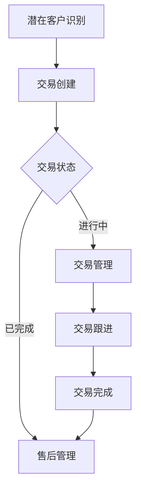
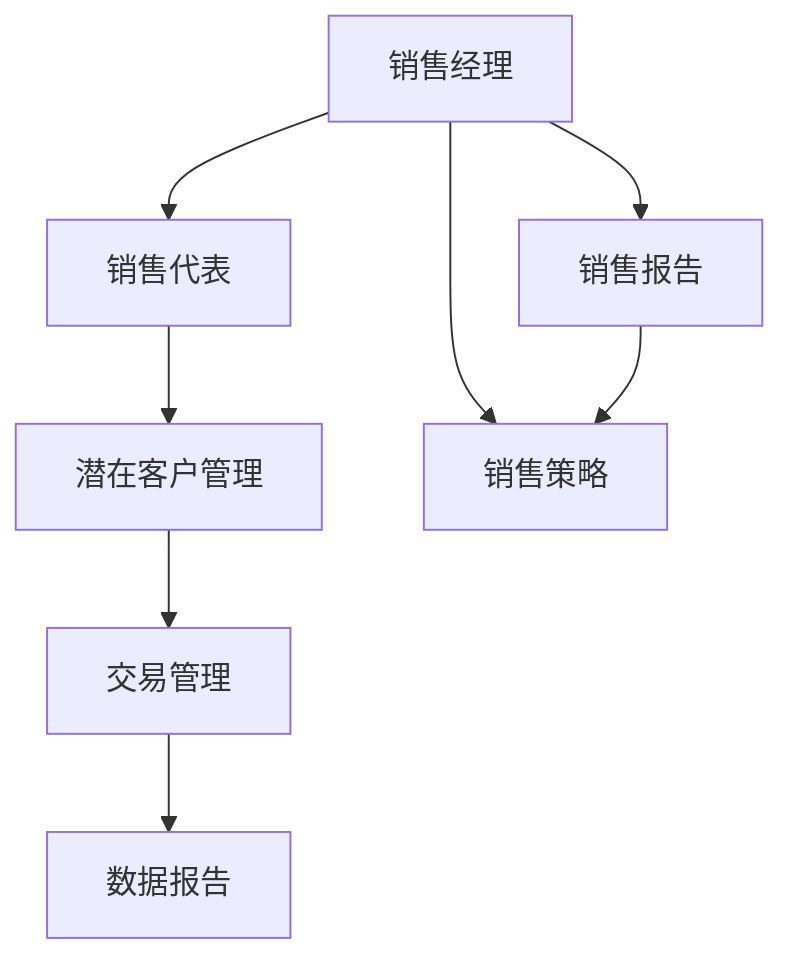
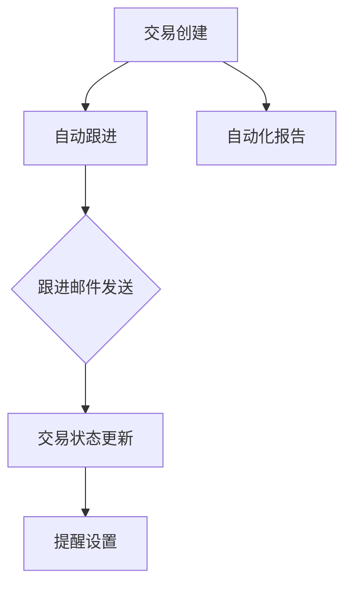

                 

# 《如何利用Pipedrive管理创业公司的销售流程》

> **关键词**：Pipedrive、创业公司、销售流程、CRM、自动化、数据分析

> **摘要**：本文将深入探讨如何利用Pipedrive这一强大的CRM工具来管理创业公司的销售流程。我们将从Pipedrive的基本概念和功能开始，逐步讲解其在创业公司销售流程中的应用，包括潜在客户管理、交易跟进和数据分析。此外，还将探讨Pipedrive的高级功能和优化技巧，并通过实际案例研究，展示如何在实际项目中应用这些技巧。最后，我们将提供代码实战和数学模型，以帮助读者更好地理解和应用Pipedrive。

---

## 目录

### 《如何利用Pipedrive管理创业公司的销售流程》目录大纲

#### 第一部分：Pipedrive基础

1. 第1章：Pipedrive概述
   1.1 Pipedrive的诞生与核心优势
   1.2 Pipedrive的基本功能

2. 第2章：Pipedrive在创业公司销售流程中的应用
   2.1 销售流程规划
   2.2 潜在客户的识别与管理
   2.3 交易管理与跟进策略
   2.4 数据报告与分析

#### 第二部分：Pipedrive实战

3. 第3章：Pipedrive的高级功能和优化技巧
   3.1 Pipedrive的多用户协作功能
   3.2 Pipedrive的自动化功能
   3.3 Pipedrive的数据导入与导出

#### 第三部分：项目实战

4. 第4章：创业公司销售流程管理项目实战
   4.1 实战项目概述
   4.2 实战项目实施
   4.3 实战项目评估

#### 第四部分：案例研究

5. 第5章：Pipedrive在创业公司销售管理中的实际案例
   5.1 案例研究概述
   5.2 案例研究实施
   5.3 案例研究效果

#### 附录

6. 附录A：Pipedrive相关资源
7. 附录B：Mermaid流程图
8. 附录C：伪代码示例
9. 附录D：数学模型与公式
10. 附录E：代码实战

---

### 第一部分：Pipedrive基础

## 第1章：Pipedrive概述

### 1.1 Pipedrive的诞生与核心优势

Pipedrive是一款专为销售团队设计的客户关系管理（CRM）软件。它的诞生可以追溯到2009年，由来自爱沙尼亚的三位创业者Dim0, Pipedrive的创始人Martín Ivanov和 Ragnar Reini。当时，他们发现传统的CRM系统过于复杂，难以满足中小型销售团队的实际需求。因此，他们决定开发一款简单、直观且功能强大的CRM工具，以帮助销售团队更有效地管理销售流程。

自从成立以来，Pipedrive一直以其独特的优势和简洁的设计理念在市场上独树一帜。以下是一些Pipedrive的核心优势：

**1. 直观的管道视图**

Pipedrive的核心功能是管道视图（Pipeline View），它将销售流程可视化为一系列的管道阶段，使销售团队能够清晰地看到每个销售机会的进展情况。这种直观的视图设计不仅帮助团队更好地跟踪销售进度，还能帮助管理层快速了解销售团队的绩效。

**2. 灵活的定制功能**

Pipedrive提供了丰富的自定义功能，用户可以根据自己的需求自定义字段、管道阶段、仪表板等。这种灵活性使得Pipedrive能够适应各种不同的销售流程和企业规模，无论是初创公司还是大型企业，都可以轻松配置和调整。

**3. 强大的自动化功能**

Pipedrive内置了多种自动化工具，可以帮助销售团队自动执行重复性任务，如发送跟进邮件、更新交易状态、生成报告等。这些自动化功能不仅节省了团队的时间，还提高了工作效率。

**4. 易于使用和集成**

Pipedrive的设计初衷是简单易用，用户无需进行复杂的培训即可上手使用。此外，Pipedrive还提供了多种集成选项，可以与常用的办公工具和第三方服务（如Google Workspace、Salesforce、Trello等）无缝集成，从而实现更高效的协作和流程管理。

### 1.1.1 Pipedrive的发展历程

自2009年成立以来，Pipedrive经历了多个重要的发展阶段：

- **2009年**：Pipedrive正式上线，为销售团队提供了一种全新的销售管理方式。
- **2012年**：Pipedrive获得了首次融资，开始在欧洲和北美市场扩展。
- **2015年**：Pipedrive发布了移动应用，使销售团队能够随时随地进行销售活动管理。
- **2018年**：Pipedrive发布了多用户协作功能，进一步提升了团队协作效率。
- **2020年**：Pipedrive推出了多种自动化工具，帮助企业实现销售流程的全面自动化。

### 1.1.2 Pipedrive在销售管理中的优势

Pipedrive在销售管理中的优势主要体现在以下几个方面：

**1. 提高销售效率**

Pipedrive的管道视图设计使得销售团队能够一目了然地了解每个销售机会的进展情况，从而可以更快速地做出决策，提高销售效率。

**2. 降低人工成本**

Pipedrive内置的自动化功能可以自动执行重复性任务，如发送跟进邮件、更新交易状态等，从而减少销售团队的人工操作，降低人工成本。

**3. 提升客户满意度**

通过Pipedrive，销售团队能够更准确地跟踪客户信息和需求，提供更个性化的服务，从而提升客户满意度。

**4. 数据驱动决策**

Pipedrive提供了强大的数据分析功能，可以帮助企业深入了解销售流程中的瓶颈和机会，从而做出更明智的决策。

### 1.1.3 Pipedrive与传统销售管理工具的区别

与传统销售管理工具相比，Pipedrive具有以下显著区别：

**1. 简洁直观的设计**

传统销售管理工具通常功能复杂，界面繁琐，需要用户进行长时间的培训才能熟练使用。而Pipedrive的设计简洁直观，用户无需复杂操作即可快速上手。

**2. 焦点明确的管道视图**

传统销售管理工具往往缺乏明确的管道视图，导致销售团队难以清晰地了解销售进度。Pipedrive的管道视图设计使得销售团队能够一目了然地掌握销售进度，提高工作效率。

**3. 强大的自动化功能**

传统销售管理工具的自动化功能相对较弱，而Pipedrive内置了多种自动化工具，可以帮助销售团队自动执行重复性任务，提高工作效率。

**4. 高度可定制**

传统销售管理工具通常难以适应不同的销售流程和企业规模，而Pipedrive提供了丰富的自定义功能，用户可以根据自己的需求进行灵活配置。

### 1.2 Pipedrive的基本功能

Pipedrive提供了多种基本功能，帮助销售团队更好地管理销售流程，以下是其中几个关键功能：

**1. 管道视图**

管道视图是Pipedrive的核心功能，它将销售流程可视化为一系列的管道阶段，使销售团队能够清晰地看到每个销售机会的进展情况。通过管道视图，销售团队能够快速定位潜在问题和机会，从而更高效地管理销售活动。

**2. 交易管理**

交易管理功能允许销售团队创建、跟踪和管理销售交易。用户可以记录每个交易的状态、阶段、价值、创建日期等详细信息，从而确保交易的完整性和可追溯性。

**3. 潜在客户管理**

潜在客户管理功能帮助销售团队识别和管理潜在客户。用户可以创建潜在客户档案，记录潜在客户的基本信息、联系信息和需求，从而更好地跟进潜在客户。

**4. 数据报告与分析**

数据报告与分析功能提供了强大的数据分析工具，帮助销售团队深入了解销售绩效和趋势。用户可以生成各种报告，如销售报告、潜在客户报告、交易报告等，从而做出更明智的决策。

### 1.2.1 管道视图

管道视图是Pipedrive的核心功能之一，它将销售流程可视化为一系列的管道阶段，使销售团队能够清晰地看到每个销售机会的进展情况。通过管道视图，销售团队能够快速定位潜在问题和机会，从而更高效地管理销售活动。

**1. 管道视图的基本概念**

管道视图（Pipeline View）是一种将销售流程可视化为一系列管道阶段的方法。每个管道阶段代表销售流程中的一个关键步骤，如潜在客户识别、需求确认、报价、谈判、成交等。销售机会在管道中从左到右移动，表示销售进程的进展情况。

**2. 管道视图的组成**

管道视图主要由以下几个部分组成：

- **管道阶段**：每个管道阶段代表销售流程中的一个关键步骤，用户可以根据需求自定义管道阶段。
- **销售机会**：每个销售机会在管道中代表一个潜在客户或交易。用户可以在销售机会中记录相关信息，如状态、阶段、价值、创建日期等。
- **管道指标**：管道指标包括管道长度、销售机会数量、潜在客户数量等。这些指标帮助用户了解销售流程的整体状况。

**3. 管道视图的优势**

管道视图具有以下优势：

- **直观可视化**：管道视图将复杂的销售流程简化为一系列的管道阶段，使销售团队能够一目了然地了解销售进度。
- **快速定位问题**：通过管道视图，销售团队能够快速识别潜在问题和机会，从而及时采取措施。
- **提高效率**：管道视图帮助销售团队更高效地管理销售活动，减少重复工作和沟通成本。

### 1.2.2 交易管理

交易管理是Pipedrive的一个重要功能，它帮助销售团队创建、跟踪和管理销售交易。通过交易管理功能，用户可以记录每个交易的状态、阶段、价值、创建日期等详细信息，从而确保交易的完整性和可追溯性。

**1. 交易管理的基本概念**

交易管理（Deal Management）是指对销售交易进行创建、跟踪和管理的过程。交易通常是指与潜在客户或现有客户的商业互动，包括销售报价、谈判、签约等。交易管理功能帮助销售团队确保交易的完整性和可追溯性，从而提高销售效率。

**2. 交易管理的功能**

Pipedrive的交易管理功能包括以下几个方面：

- **创建交易**：用户可以创建新的交易，记录交易的基本信息，如交易名称、状态、阶段、价值、创建日期等。
- **跟踪交易**：用户可以实时跟踪交易的状态和进展，确保每个交易都能按时完成。
- **编辑交易**：用户可以随时编辑交易的信息，如修改交易价值、状态、阶段等。
- **批量操作**：用户可以对多个交易进行批量操作，如批量更新状态、阶段等。

**3. 交易管理的优势**

交易管理功能具有以下优势：

- **提高交易效率**：通过交易管理功能，销售团队能够更高效地管理交易，减少重复工作和沟通成本。
- **确保交易完整性**：交易管理功能确保每个交易都有详细的记录，提高交易的透明度和可追溯性。
- **数据驱动决策**：通过交易管理功能，销售团队能够收集和分析交易数据，从而做出更明智的决策。

### 1.2.3 潜在客户管理

潜在客户管理是Pipedrive的一个重要功能，它帮助销售团队识别和管理潜在客户。通过潜在客户管理功能，用户可以创建潜在客户档案，记录潜在客户的基本信息、联系信息和需求，从而更好地跟进潜在客户。

**1. 潜在客户管理的基本概念**

潜在客户管理（Lead Management）是指识别、跟踪和管理潜在客户的过程。潜在客户是指有购买意愿或可能成为客户的人或组织。潜在客户管理功能帮助销售团队确保不丢失任何潜在客户，从而提高销售转化率。

**2. 潜在客户管理的功能**

Pipedrive的潜在客户管理功能包括以下几个方面：

- **创建潜在客户**：用户可以创建新的潜在客户，记录潜在客户的基本信息，如姓名、公司、联系信息等。
- **跟踪潜在客户**：用户可以实时跟踪潜在客户的状态和进展，确保每个潜在客户都能得到及时跟进。
- **分配潜在客户**：用户可以将潜在客户分配给销售团队成员，确保每个潜在客户都有专人负责。
- **批量操作**：用户可以对多个潜在客户进行批量操作，如批量更新状态、分配等。

**3. 潜在客户管理的优势**

潜在客户管理功能具有以下优势：

- **提高销售转化率**：通过潜在客户管理功能，销售团队能够更有效地识别和跟进潜在客户，提高销售转化率。
- **减少漏失率**：潜在客户管理功能确保销售团队不会错过任何潜在客户，从而减少漏失率。
- **数据驱动决策**：通过潜在客户管理功能，销售团队能够收集和分析潜在客户数据，从而做出更明智的决策。

### 1.2.4 数据报告与分析

数据报告与分析是Pipedrive的一个重要功能，它提供了强大的数据分析工具，帮助销售团队深入了解销售绩效和趋势。通过数据报告与分析功能，用户可以生成各种报告，如销售报告、潜在客户报告、交易报告等，从而做出更明智的决策。

**1. 数据报告与分析的基本概念**

数据报告与分析（Data Reporting and Analysis）是指通过对销售数据进行分析和报告，帮助销售团队了解销售绩效和趋势的过程。数据报告与分析功能提供了多种数据分析工具，用户可以生成各种报告，从而深入挖掘销售数据的价值。

**2. 数据报告与分析的功能**

Pipedrive的数据报告与分析功能包括以下几个方面：

- **销售报告**：用户可以生成销售报告，了解销售团队的绩效、销售趋势和销售目标达成情况。
- **潜在客户报告**：用户可以生成潜在客户报告，了解潜在客户的来源、行为和转化率。
- **交易报告**：用户可以生成交易报告，了解交易的进展情况、成功率和失败原因。
- **自定义报告**：用户可以根据自己的需求自定义报告，选择需要展示的数据和分析指标。

**3. 数据报告与分析的优势**

数据报告与分析功能具有以下优势：

- **数据驱动决策**：通过数据报告与分析功能，销售团队能够深入了解销售数据和趋势，从而做出更明智的决策。
- **提高销售效率**：通过数据报告与分析功能，销售团队能够发现销售流程中的瓶颈和机会，从而优化销售策略。
- **提升客户满意度**：通过数据报告与分析功能，销售团队能够更好地了解客户需求和行为，提供更个性化的服务。

### 第一部分总结

在第一部分中，我们详细介绍了Pipedrive的诞生背景、核心优势和基本功能。通过管道视图、交易管理、潜在客户管理和数据报告与分析等核心功能，Pipedrive为销售团队提供了一种全新的销售管理方式，帮助团队更高效地管理销售流程。接下来，我们将进一步探讨Pipedrive在创业公司销售流程中的应用，以及如何利用Pipedrive优化销售流程。

---

### 第二部分：Pipedrive实战

## 第2章：Pipedrive在创业公司销售流程中的应用

在创业公司中，销售流程的管理至关重要。Pipedrive作为一款功能强大且易用的CRM工具，能够帮助创业公司更好地管理销售流程，提高销售效率。本章将重点介绍Pipedrive在创业公司销售流程中的应用，包括销售流程规划、潜在客户的识别与管理、交易管理与跟进策略以及数据报告与分析。

### 2.1 销售流程规划

销售流程规划是创业公司成功管理销售的关键步骤。一个清晰、有效的销售流程可以帮助团队更好地组织工作，提高销售效率。以下是创业公司在规划销售流程时需要考虑的关键步骤：

**1. 明确销售目标**

首先，创业公司需要明确销售目标。这些目标可以是具体的销售指标，如每月销售额、客户数量等。明确的目标有助于团队聚焦于最重要的任务，并保持一致的努力方向。

**2. 定义销售阶段**

定义销售阶段是销售流程规划的重要一环。创业公司需要将销售过程划分为不同的阶段，如潜在客户识别、需求确认、报价、谈判、成交和售后等。每个阶段都有明确的任务和目标，有助于团队更好地跟踪销售进度。

**3. 确定关键任务**

在销售流程中，每个阶段都有特定的任务需要完成。创业公司需要明确每个任务的具体内容和责任分配，确保团队成员清楚自己的职责和任务。

**4. 制定销售策略**

制定销售策略是销售流程规划的重要部分。创业公司需要根据市场情况和目标客户，制定合适的销售策略，如定价策略、促销策略、客户关系管理等。

**5. 评估和优化**

销售流程规划不是一次性的工作，创业公司需要定期评估销售流程的有效性，并根据评估结果进行优化。通过不断地调整和改进，销售流程可以更加适应市场和团队的需求。

### 2.1.1 创业公司销售流程概述

创业公司的销售流程通常包括以下几个关键步骤：

1. **潜在客户识别**：通过市场调研、广告投放、社交媒体活动等方式，收集潜在客户的联系方式和基本信息。

2. **需求确认**：与潜在客户进行沟通，了解他们的需求和痛点，从而确定是否有可能转化为实际销售机会。

3. **报价和谈判**：根据潜在客户的需求，制定合适的报价方案，并进行谈判，以达成双方满意的交易条件。

4. **成交**：完成谈判后，签订合同，完成交易。

5. **售后服务**：在交易完成后，提供优质的售后服务，确保客户满意度，并建立长期合作关系。

### 2.1.2 Pipedrive在销售流程中的应用场景

Pipedrive在创业公司销售流程中的应用场景非常广泛，以下是几个关键应用：

**1. 管道视图**

管道视图是Pipedrive的核心功能，可以帮助创业公司可视化销售流程。创业公司可以通过管道视图，实时跟踪每个销售机会的进展情况，快速识别潜在问题和机会。

**2. 交易管理**

交易管理功能使创业公司能够创建、跟踪和管理销售交易。创业公司可以在Pipedrive中记录每个交易的状态、阶段、价值、创建日期等详细信息，从而确保交易的完整性和可追溯性。

**3. 潜在客户管理**

潜在客户管理功能帮助创业公司识别和管理潜在客户。创业公司可以在Pipedrive中创建潜在客户档案，记录潜在客户的基本信息、联系信息和需求，从而更好地跟进潜在客户。

**4. 数据报告与分析**

数据报告与分析功能提供了强大的数据分析工具，帮助创业公司深入了解销售绩效和趋势。创业公司可以生成各种报告，如销售报告、潜在客户报告、交易报告等，从而做出更明智的决策。

### 2.1.3 Pipedrive销售流程的优化策略

为了提高销售效率，创业公司可以采用以下策略来优化Pipedrive销售流程：

**1. 利用自动化功能**

Pipedrive提供了丰富的自动化功能，如自动跟进、自动发送邮件、自动更新交易状态等。创业公司可以利用这些功能，减少重复性工作，提高工作效率。

**2. 定制管道视图**

创业公司可以根据自己的需求，自定义管道视图。通过调整管道阶段、添加自定义字段等，创业公司可以使其更贴近实际业务需求，从而提高销售管理的准确性。

**3. 数据驱动决策**

通过Pipedrive的数据报告与分析功能，创业公司可以深入了解销售数据和趋势。基于这些数据，创业公司可以做出更明智的决策，优化销售策略和流程。

**4. 培训和指导**

确保团队成员熟悉Pipedrive的功能和操作，是优化销售流程的重要一步。创业公司可以定期进行培训和指导，帮助团队成员更好地利用Pipedrive，提高销售效率。

### 2.2 潜在客户的识别与管理

潜在客户的识别和管理是销售流程的关键环节。有效的潜在客户识别和管理策略可以帮助创业公司提高销售转化率和客户满意度。以下是创业公司如何利用Pipedrive来识别和管理潜在客户：

#### 2.2.1 潜在客户识别方法

潜在客户识别是销售流程的第一步，以下是一些常用的潜在客户识别方法：

**1. 市场调研**

通过市场调研，创业公司可以了解目标市场的需求和趋势，从而发现潜在客户。市场调研可以通过在线调查、电话访谈、面对面访谈等方式进行。

**2. 社交媒体分析**

通过分析社交媒体数据，创业公司可以了解目标客户的兴趣、行为和需求，从而识别潜在客户。社交媒体分析工具如Facebook Insights、Twitter Analytics等可以帮助创业公司获取这些信息。

**3. 网络广告**

创业公司可以在网络上投放广告，吸引潜在客户的注意。通过分析广告效果，创业公司可以了解哪些广告内容更能吸引目标客户，从而优化广告策略。

**4. 合作伙伴推荐**

合作伙伴可以推荐潜在客户，这是创业公司获取高质量潜在客户的一种有效方式。与行业内的合作伙伴建立良好的合作关系，可以帮助创业公司扩大客户群体。

#### 2.2.2 Pipedrive中的潜在客户管理功能

Pipedrive提供了强大的潜在客户管理功能，帮助创业公司更有效地识别和管理潜在客户。以下是Pipedrive中的几个关键功能：

**1. 创建潜在客户**

创业公司可以在Pipedrive中创建潜在客户档案，记录潜在客户的基本信息、联系信息和需求。每个潜在客户档案都可以存储详细的备注和活动记录，帮助团队更好地跟进潜在客户。

**2. 分配潜在客户**

Pipedrive允许将潜在客户分配给团队成员，确保每个潜在客户都有专人负责。这样可以避免潜在客户的漏失，并提高团队的工作效率。

**3. 跟进潜在客户**

Pipedrive提供了自动跟进功能，可以自动发送跟进邮件或提醒，确保团队成员及时跟进潜在客户。通过自动跟进，创业公司可以确保不遗漏任何潜在机会。

**4. 潜在客户评级**

Pipedrive允许对潜在客户进行评级，如高、中、低等。这样可以帮助团队更有效地分配资源和精力，优先跟进高价值的潜在客户。

#### 2.2.3 潜在客户数据分析与应用

潜在客户数据分析是创业公司优化销售策略的重要手段。以下是潜在客户数据分析的方法和应用：

**1. 数据分析工具**

Pipedrive提供了多种数据分析工具，如报告、仪表板和图表等。创业公司可以使用这些工具，深入了解潜在客户的行为和需求。

**2. 数据分析指标**

以下是一些常用的潜在客户数据分析指标：

- **潜在客户来源**：了解哪些渠道带来了最多的潜在客户，优化营销策略。
- **潜在客户评级**：分析不同评级潜在客户的转化率，调整销售策略。
- **跟进响应时间**：分析团队成员的跟进响应时间，优化跟进策略。

**3. 数据分析应用**

基于数据分析，创业公司可以采取以下措施：

- **优化营销策略**：根据潜在客户来源和需求，调整营销预算和内容。
- **提高跟进效率**：根据跟进响应时间，优化团队成员的跟进计划。
- **优化客户评级**：根据潜在客户评级和转化率，调整销售策略和资源分配。

### 2.3 交易管理与跟进策略

交易管理与跟进策略是创业公司销售流程中的重要组成部分。有效的交易管理可以帮助团队确保交易的顺利进行，提高客户满意度。以下是创业公司如何利用Pipedrive来管理交易和制定跟进策略：

#### 2.3.1 交易管理的基本策略

以下是一些交易管理的基本策略：

**1. 制定明确的交易流程**

创业公司需要制定明确的交易流程，包括交易各个阶段的具体任务和时间节点。这样可以帮助团队成员了解每个交易的处理流程，提高工作效率。

**2. 保持交易透明**

确保交易过程透明，团队成员可以实时查看交易的状态和进展。这样可以避免信息的不对称，提高团队的合作效率。

**3. 客户参与**

在交易过程中，鼓励客户参与，收集客户的需求和反馈。这样可以确保交易内容符合客户期望，提高交易的满意度。

**4. 数据驱动决策**

基于交易数据，创业公司可以分析交易的成功率和失败原因，从而优化交易策略。

#### 2.3.2 Pipedrive中的交易管理功能

Pipedrive提供了丰富的交易管理功能，帮助创业公司更有效地管理交易。以下是Pipedrive中的几个关键功能：

**1. 创建交易**

创业公司可以在Pipedrive中创建新的交易，记录交易的基本信息，如交易名称、状态、阶段、价值、创建日期等。

**2. 跟踪交易**

Pipedrive允许团队实时跟踪交易的状态和进展，确保每个交易都能按时完成。团队成员可以在Pipedrive中查看交易的状态和活动记录，了解交易的最新进展。

**3. 编辑交易**

团队成员可以随时编辑交易的信息，如修改交易价值、状态、阶段等。这样可以确保交易信息的准确性和实时性。

**4. 批量操作**

Pipedrive支持批量操作，团队可以对多个交易进行批量更新、分配等操作，提高工作效率。

#### 2.3.3 交易跟进与提醒策略

有效的交易跟进与提醒策略可以帮助创业公司提高交易的完成率，以下是几个关键策略：

**1. 制定跟进计划**

根据交易的重要性和紧急性，制定合理的跟进计划。确保每个交易都有明确的跟进时间和责任人。

**2. 自动提醒**

利用Pipedrive的自动提醒功能，设置交易跟进提醒，确保团队成员不会错过重要的跟进时间点。

**3. 邮件跟进**

通过邮件与客户进行跟进，了解客户的反馈和需求。邮件跟进可以是自动发送的，也可以是手动发送的。

**4. 电话跟进**

电话跟进可以更加直接地与客户沟通，了解客户的真实想法和需求。电话跟进通常用于重要交易的关键阶段。

#### 2.3.4 数据报告与分析

Pipedrive提供了强大的数据报告与分析功能，帮助创业公司深入了解交易绩效和趋势。以下是数据报告与分析的几个关键应用：

**1. 交易成功率分析**

通过分析交易成功率，创业公司可以了解哪些交易流程和策略最有效，从而优化交易管理。

**2. 交易失败原因分析**

通过分析交易失败原因，创业公司可以了解交易流程中的问题和瓶颈，从而改进交易管理。

**3. 交易价值分析**

通过分析交易价值，创业公司可以了解不同交易的价值分布，优化资源分配。

**4. 预测销售目标**

基于历史交易数据和趋势，创业公司可以预测未来的销售目标，制定相应的销售策略。

### 2.4 数据报告与分析

数据报告与分析是Pipedrive的一个重要功能，它为创业公司提供了深入了解销售绩效和趋势的工具。通过数据报告与分析，创业公司可以做出更明智的决策，优化销售策略和流程。

#### 2.4.1 数据报告在销售管理中的应用

数据报告在销售管理中的应用非常广泛，以下是几个关键应用：

**1. 销售绩效分析**

通过销售报告，创业公司可以了解销售团队的绩效，如销售额、成交率、客户满意度等。这有助于管理层评估团队的表现，制定改进策略。

**2. 销售趋势分析**

通过分析销售趋势报告，创业公司可以了解销售数据的变化趋势，如季节性波动、市场变化等。这有助于团队预测未来的销售情况，调整销售策略。

**3. 客户行为分析**

通过客户行为报告，创业公司可以了解客户的购买习惯、偏好和行为模式。这有助于团队提供更个性化的服务，提高客户满意度。

**4. 营销效果分析**

通过营销效果报告，创业公司可以了解不同营销渠道的效果，如广告投放、社交媒体活动等。这有助于团队优化营销策略，提高投资回报率。

#### 2.4.2 Pipedrive数据报告功能详解

Pipedrive提供了多种数据报告功能，以下是其中几个关键功能：

**1. 销售报告**

销售报告是Pipedrive的核心报告之一，它提供了详细的销售数据，包括销售额、成交率、客户满意度等。用户可以根据时间范围、销售团队、销售渠道等条件筛选数据，生成定制化的销售报告。

**2. 潜在客户报告**

潜在客户报告帮助创业公司了解潜在客户的来源、行为和转化率。用户可以分析不同来源的潜在客户数量、跟进情况等，从而优化潜在客户管理策略。

**3. 交易报告**

交易报告详细记录了每个交易的状态、阶段、价值、创建日期等。用户可以查看交易的成功率和失败原因，分析交易绩效，优化交易管理。

**4. 营销报告**

营销报告提供了不同营销渠道的效果数据，包括点击率、转化率、投资回报率等。用户可以根据这些数据调整营销策略，提高营销效果。

#### 2.4.3 数据分析在销售策略优化中的应用

数据分析在销售策略优化中起着关键作用，以下是几个关键应用：

**1. 市场定位**

通过分析客户数据和市场趋势，创业公司可以了解目标市场的特点和需求，从而优化市场定位策略。

**2. 营销预算分配**

通过分析营销效果数据，创业公司可以了解不同营销渠道的投资回报率，从而优化营销预算分配，提高投资回报率。

**3. 销售团队激励**

通过分析销售绩效数据，创业公司可以了解销售团队的表现，制定合适的激励策略，提高团队的工作积极性和销售效率。

**4. 产品定价**

通过分析市场需求和竞争状况，创业公司可以制定合适的产品定价策略，提高产品的市场竞争力和盈利能力。

### 第二部分总结

在第二部分中，我们详细介绍了Pipedrive在创业公司销售流程中的应用，包括销售流程规划、潜在客户的识别与管理、交易管理与跟进策略以及数据报告与分析。通过Pipedrive，创业公司可以更高效地管理销售流程，提高销售效率，优化销售策略。接下来，我们将进一步探讨Pipedrive的高级功能和优化技巧，以帮助创业公司更好地利用这一强大的CRM工具。

---

### 第三部分：Pipedrive的高级功能和优化技巧

## 第3章：Pipedrive的高级功能和优化技巧

在前两部分的介绍中，我们已经了解了Pipedrive的基础功能和在创业公司销售流程中的应用。然而，Pipedrive的强大之处不仅限于其基本功能，它还提供了许多高级功能和优化技巧，可以帮助创业公司进一步优化销售流程，提高工作效率。本章将重点介绍Pipedrive的高级功能，包括多用户协作功能、自动化功能以及数据导入与导出功能。

### 3.1 Pipedrive的多用户协作功能

Pipedrive的多用户协作功能是其强大的一大特色，它使得团队成员能够实时协作，共同推进销售项目。以下是Pipedrive多用户协作功能的一些关键特点：

#### 3.1.1 多用户协作的基本概念

多用户协作是指多个用户在同一平台上共享信息和资源，协同完成销售任务。Pipedrive的多用户协作功能允许用户在同一个账户中添加团队成员，并为每个团队成员分配不同的权限和角色。

#### 3.1.2 Pipedrive的多用户协作功能详解

**1. 成员管理**

Pipedrive提供了成员管理功能，允许管理员添加、删除和编辑团队成员。管理员可以为每个成员分配不同的角色，如销售经理、销售代表、市场营销等。每个角色都有不同的权限，确保团队成员只能访问和操作他们需要的部分。

**2. 实时协作**

Pipedrive支持实时协作，团队成员可以在同一时间编辑和查看销售机会、交易和潜在客户等信息。这种实时协作功能提高了团队的响应速度和沟通效率。

**3. 评论和活动记录**

Pipedrive允许团队成员在销售机会、交易和潜在客户等记录中添加评论和活动记录。这些评论和记录可以追溯到每个团队成员的操作，确保团队协作的可追溯性。

**4. 共享仪表板**

Pipedrive提供了共享仪表板功能，管理员可以创建自定义仪表板，并将仪表板共享给团队成员。共享仪表板可以帮助团队成员快速了解团队的整体销售状况和关键绩效指标。

#### 3.1.3 多用户协作的实战案例

**案例：销售团队协作**

假设一家创业公司的销售团队由三名成员组成，他们分别负责不同的销售领域。通过Pipedrive的多用户协作功能，团队可以这样做：

- **角色分配**：管理员为每个成员分配不同的角色，确保每个成员只能访问和操作他们负责的领域。
- **实时协作**：成员可以在同一时间编辑和查看销售机会、交易和潜在客户等信息，确保信息的一致性和实时性。
- **评论和活动记录**：成员可以在销售机会和交易的记录中添加评论和活动记录，确保每个操作都有迹可循。
- **共享仪表板**：管理员创建一个共享仪表板，显示所有成员的销售绩效和关键指标，帮助团队了解整体进展。

通过这些实战案例，我们可以看到Pipedrive的多用户协作功能如何帮助销售团队更高效地协作，提高销售效率。

### 3.2 Pipedrive的自动化功能

自动化功能是Pipedrive的另一大优势，它可以帮助创业公司减少手动操作，提高工作效率。以下是Pipedrive自动化功能的一些关键特点：

#### 3.2.1 自动化的基本概念

自动化是指通过软件工具自动执行重复性任务，以减少人工操作和提高效率。在Pipedrive中，自动化功能包括自动跟进、自动发送邮件、自动更新交易状态等。

#### 3.2.2 Pipedrive的自动化功能详解

**1. 自动跟进**

Pipedrive的自动跟进功能可以帮助销售团队自动发送跟进邮件或提醒，确保团队成员不会错过重要的跟进时间点。用户可以设置自动跟进的时间间隔和邮件内容，从而实现跟进的自动化。

**2. 自动发送邮件**

Pipedrive允许用户自动发送自定义邮件，如感谢邮件、跟进邮件、报价邮件等。用户可以设置邮件发送的条件和触发器，确保邮件在合适的时机发送给潜在客户或客户。

**3. 自动更新交易状态**

Pipedrive的自动更新交易状态功能可以帮助团队自动更新交易的状态，如从“谈判”更新为“成交”或从“未跟进”更新为“跟进中”。这有助于团队实时了解交易的最新进展。

**4. 工作流自动化**

Pipedrive的工作流自动化功能允许用户创建自定义的工作流程，自动执行一系列操作。例如，当一个新的销售机会创建时，可以自动发送一封欢迎邮件给客户，并设置跟进提醒。

#### 3.2.3 自动化在销售流程中的应用案例

**案例：自动发送报价邮件**

假设一家创业公司需要为潜在客户提供报价，但经常因为忙碌而忘记发送报价邮件。通过Pipedrive的自动化功能，公司可以这样做：

- **设置触发器**：当一个新的销售机会创建时，设置一个自动发送报价邮件的触发器。
- **定制邮件内容**：根据公司模板，定制报价邮件的内容，包括产品信息、报价和联系方式。
- **设置发送时间**：设置邮件在特定的时间段内自动发送，确保邮件在合适的时候发送给客户。

通过这个案例，我们可以看到Pipedrive的自动化功能如何帮助公司简化报价流程，提高工作效率。

### 3.3 Pipedrive的数据导入与导出

数据导入与导出功能是Pipedrive的另一大优势，它允许用户轻松导入和导出数据，以便进行数据分析和管理。以下是Pipedrive数据导入与导出功能的一些关键特点：

#### 3.3.1 数据导入的基本概念

数据导入是指将外部数据源（如Excel文件、CSV文件等）导入到Pipedrive中。数据导入功能可以帮助用户快速迁移数据到Pipedrive，以便进行更有效的管理和分析。

#### 3.3.2 Pipedrive的数据导入功能详解

**1. 导入模板**

Pipedrive提供了多种导入模板，用户可以根据模板结构将数据导入到Pipedrive中。导入模板包括了常用的字段和格式，确保数据导入的准确性和一致性。

**2. 数据映射**

在导入数据时，Pipedrive允许用户映射不同的数据字段，将外部数据源中的字段映射到Pipedrive中的相应字段。这样可以确保数据在导入过程中得到正确的匹配和存储。

**3. 批量导入**

Pipedrive支持批量导入数据，用户可以一次性导入大量的数据记录，提高数据导入的效率。

**4. 导入进度**

Pipedrive提供了导入进度条，用户可以实时查看导入进度，确保数据导入的顺利进行。

#### 3.3.3 数据导出在销售管理中的作用

数据导出功能允许用户将Pipedrive中的数据导出到外部文件中，以便进行进一步的数据分析和报告生成。以下是数据导出在销售管理中的作用：

**1. 数据备份**

通过数据导出功能，用户可以定期备份Pipedrive中的数据，确保数据的完整性和安全性。

**2. 数据分析**

用户可以将导出的数据导入到其他数据分析工具中，进行更深入的数据分析和报告生成，从而优化销售策略和流程。

**3. 数据共享**

通过数据导出，用户可以将数据共享给团队成员或其他部门，以便进行协同工作。

#### 3.3.4 Pipedrive的数据导入与导出功能详解

**1. 数据导入**

以下是一个简单的数据导入示例：

- **选择数据源**：用户可以选择本地文件或网络文件作为数据源。
- **上传文件**：用户上传需要导入的文件，如Excel文件或CSV文件。
- **映射字段**：用户需要将文件中的字段映射到Pipedrive中的相应字段。
- **导入数据**：用户提交导入请求，Pipedrive开始导入数据。

**2. 数据导出**

以下是一个简单的数据导出示例：

- **选择导出选项**：用户选择需要导出的数据范围，如所有销售机会或特定时间段内的数据。
- **下载文件**：用户下载导出的数据文件，通常为Excel文件或CSV文件。
- **导出数据**：用户提交导出请求，Pipedrive开始导出数据。

通过以上功能，Pipedrive的数据导入与导出功能可以帮助创业公司更高效地管理数据，提高销售管理的效果。

### 第三部分总结

在第三部分中，我们详细介绍了Pipedrive的高级功能和优化技巧，包括多用户协作功能、自动化功能以及数据导入与导出功能。这些功能不仅提高了销售团队的协作效率，还简化了销售流程，使得创业公司能够更高效地管理销售活动。接下来，我们将通过一个实际的项目实战，展示如何将Pipedrive应用于创业公司的销售流程管理。

---

### 第四部分：项目实战

## 第4章：创业公司销售流程管理项目实战

在前三部分的介绍中，我们深入探讨了Pipedrive的基本概念、应用场景以及高级功能和优化技巧。为了帮助读者更好地理解如何在实际项目中应用Pipedrive，本章将详细介绍一个创业公司销售流程管理项目实战。通过这个项目实战，我们将从项目背景、目标、实施步骤和效果评估等方面进行详细讲解。

### 4.1 实战项目概述

#### 4.1.1 项目背景

某家创业公司是一家提供智能办公解决方案的初创企业。随着业务的快速发展，公司面临以下挑战：

- 销售流程不透明，难以追踪销售进展和绩效。
- 销售团队协作效率低下，信息共享不畅。
- 数据分析能力不足，无法及时调整销售策略。

为了解决这些问题，公司决定采用Pipedrive作为销售管理工具，以优化销售流程，提高团队协作效率，并实现数据驱动的销售决策。

#### 4.1.2 项目目标

通过引入Pipedrive，公司设定了以下目标：

- 实现销售流程的透明化，确保销售进展可追踪。
- 提高销售团队协作效率，实现实时信息共享。
- 利用数据分析功能，优化销售策略，提高销售转化率。

### 4.2 实战项目实施

#### 4.2.1 项目阶段划分

为了确保项目顺利进行，公司将项目划分为以下阶段：

1. **需求分析**
2. **系统配置**
3. **数据导入**
4. **培训和指导**
5. **上线运行**
6. **效果评估**

#### 4.2.2 实施步骤

**1. 需求分析**

在项目启动阶段，公司进行了详细的需求分析，明确了销售流程中的关键环节和业务需求。通过访谈和问卷，收集了销售团队的意见和建议，确保Pipedrive的配置能够满足实际业务需求。

**2. 系统配置**

基于需求分析结果，公司对Pipedrive进行了系统配置。包括：

- 自定义管道视图：根据销售流程，定义了多个管道阶段，确保销售进展一目了然。
- 设定交易管理规则：定义了交易状态、阶段和跟进策略，确保交易管理规范。
- 潜在客户管理配置：设置了潜在客户识别和管理规则，确保潜在客户得到有效跟进。

**3. 数据导入**

为了确保数据的完整性，公司进行了数据导入。包括：

- 导入现有客户数据：将公司现有客户数据导入到Pipedrive中，包括客户基本信息、交易历史等。
- 导入潜在客户数据：从其他数据源（如市场调研、广告投放等）导入潜在客户数据。

**4. 培训和指导**

为了确保团队成员能够熟练使用Pipedrive，公司安排了培训和指导。包括：

- 系统操作培训：培训团队成员如何使用Pipedrive的各项功能，如创建交易、管理潜在客户、生成报告等。
- 实战演练：通过实战演练，帮助团队成员熟悉Pipedrive的操作流程。

**5. 上线运行**

完成系统配置和数据导入后，公司将Pipedrive正式上线运行。团队成员开始使用Pipedrive进行日常销售活动管理，确保数据实时更新和共享。

**6. 效果评估**

在项目上线一段时间后，公司对Pipedrive的应用效果进行了评估。评估内容包括：

- 销售流程透明度：通过管道视图，团队能够实时了解销售进展和绩效，销售流程透明度显著提高。
- 协作效率：通过多用户协作功能和实时信息共享，团队协作效率大幅提升。
- 数据分析能力：通过数据分析功能，团队能够更深入地了解客户行为和销售趋势，优化销售策略。

### 4.3 实战项目效果

#### 4.3.1 效果评估方法

为了评估Pipedrive的应用效果，公司采用了以下方法：

- **定量评估**：通过分析销售数据，如销售额、成交率、客户满意度等，评估Pipedrive对销售绩效的提升。
- **定性评估**：通过访谈和问卷调查，收集团队成员对Pipedrive的使用体验和建议，评估Pipedrive的易用性和功能满意度。

#### 4.3.2 实战项目效果评估结果

通过效果评估，公司发现以下成果：

- **销售流程透明度**：通过Pipedrive的管道视图，销售团队能够实时了解销售进展和绩效，销售流程透明度显著提高。
- **协作效率**：Pipedrive的多用户协作功能提高了团队协作效率，信息共享更加顺畅，团队成员之间的沟通成本降低。
- **数据分析能力**：通过数据分析功能，团队能够更深入地了解客户行为和销售趋势，优化销售策略，提高了销售转化率。

#### 4.3.3 实战项目改进建议

尽管Pipedrive带来了显著的提升，但在使用过程中也发现了一些改进空间。以下是一些建议：

- **优化数据导入流程**：尽管Pipedrive支持批量数据导入，但在导入过程中仍存在一些数据格式不匹配的问题。建议优化数据导入流程，确保数据导入的准确性和一致性。
- **加强数据分析培训**：部分团队成员对数据分析功能的使用不够熟练，建议加强数据分析培训，提高团队的数据分析能力。
- **定期更新和优化**：随着业务的发展，销售流程和策略可能发生变化。建议定期更新和优化Pipedrive的配置，确保其与业务需求保持一致。

### 第四部分总结

通过本部分的创业公司销售流程管理项目实战，我们详细介绍了如何利用Pipedrive优化销售流程，提高团队协作效率，实现数据驱动的销售决策。项目实践证明，Pipedrive是一款强大且实用的CRM工具，可以帮助创业公司更好地管理销售流程。接下来，我们将通过实际案例研究，进一步探讨Pipedrive在创业公司销售管理中的应用。

---

### 第五部分：案例研究

## 第5章：Pipedrive在创业公司销售管理中的实际案例

在前四部分的探讨中，我们已经了解了Pipedrive的基础知识、应用场景、高级功能以及项目实战。为了更深入地展示Pipedrive在创业公司销售管理中的实际效果，本章将通过一个实际案例研究，详细分析Pipedrive在一家初创公司中的应用情况。

### 5.1 案例研究概述

#### 5.1.1 案例背景

某家初创公司成立于2020年，专注于为企业提供定制化的在线营销解决方案。公司在成立初期，主要通过线下推广和口碑传播来获取客户。然而，随着客户数量的增加，公司面临以下挑战：

- 销售流程不透明，难以追踪销售进展和绩效。
- 销售团队协作效率低下，信息共享不畅。
- 缺乏有效的数据分析工具，无法及时调整销售策略。

为了应对这些挑战，公司决定引入Pipedrive作为销售管理工具，以优化销售流程，提高团队协作效率，并实现数据驱动的销售决策。

#### 5.1.2 案例目标

通过引入Pipedrive，公司设定了以下目标：

- 实现销售流程的透明化，确保销售进展可追踪。
- 提高销售团队协作效率，实现实时信息共享。
- 利用数据分析功能，优化销售策略，提高销售转化率。

### 5.2 案例研究实施

#### 5.2.1 案例研究实施过程

为了实现上述目标，公司按照以下步骤进行了Pipedrive的实施：

**1. 需求分析**

在项目启动阶段，公司进行了详细的需求分析，明确了销售流程中的关键环节和业务需求。通过访谈和问卷，收集了销售团队的意见和建议，确保Pipedrive的配置能够满足实际业务需求。

**2. 系统配置**

基于需求分析结果，公司对Pipedrive进行了系统配置。包括：

- **自定义管道视图**：根据销售流程，定义了多个管道阶段，如潜在客户识别、需求确认、报价、谈判、成交等，确保销售进展一目了然。
- **设定交易管理规则**：定义了交易状态、阶段和跟进策略，如未跟进、跟进中、谈判中、成交等，确保交易管理规范。
- **潜在客户管理配置**：设置了潜在客户识别和管理规则，如潜在客户评分体系、跟进频率等，确保潜在客户得到有效跟进。

**3. 数据导入**

为了确保数据的完整性，公司进行了数据导入。包括：

- **导入现有客户数据**：将公司现有客户数据导入到Pipedrive中，包括客户基本信息、交易历史等。
- **导入潜在客户数据**：从其他数据源（如市场调研、广告投放等）导入潜在客户数据。

**4. 培训和指导**

为了确保团队成员能够熟练使用Pipedrive，公司安排了培训和指导。包括：

- **系统操作培训**：培训团队成员如何使用Pipedrive的各项功能，如创建交易、管理潜在客户、生成报告等。
- **实战演练**：通过实战演练，帮助团队成员熟悉Pipedrive的操作流程。

**5. 上线运行**

完成系统配置和数据导入后，公司将Pipedrive正式上线运行。团队成员开始使用Pipedrive进行日常销售活动管理，确保数据实时更新和共享。

**6. 效果评估**

在项目上线一段时间后，公司对Pipedrive的应用效果进行了评估。评估内容包括：

- **销售流程透明度**：通过管道视图，团队能够实时了解销售进展和绩效，销售流程透明度显著提高。
- **协作效率**：通过多用户协作功能和实时信息共享，团队协作效率大幅提升。
- **数据分析能力**：通过数据分析功能，团队能够更深入地了解客户行为和销售趋势，优化销售策略。

### 5.3 案例研究效果

#### 5.3.1 案例研究效果分析

通过Pipedrive的实施，公司取得了显著的效果：

**1. 销售流程透明度**

通过Pipedrive的管道视图，团队能够实时了解销售进展和绩效，销售流程透明度显著提高。团队成员可以清楚地看到每个销售机会的状态和进展，从而快速做出决策。

**2. 协作效率**

Pipedrive的多用户协作功能提高了团队协作效率，信息共享更加顺畅。团队成员之间的沟通成本降低，工作效率显著提升。

**3. 数据分析能力**

通过Pipedrive的数据分析功能，团队能够更深入地了解客户行为和销售趋势，优化销售策略。公司可以根据分析结果，调整营销策略和销售策略，提高销售转化率。

#### 5.3.2 案例研究成功因素

Pipedrive在创业公司销售管理中的成功，得益于以下几个因素：

**1. 简单易用**

Pipedrive的设计简洁直观，用户无需复杂操作即可上手使用。这使得团队成员能够快速适应并熟练使用Pipedrive，提高了工作效率。

**2. 强大的功能**

Pipedrive提供了丰富的功能，包括管道视图、交易管理、潜在客户管理、数据报告与分析等。这些功能帮助公司更好地管理销售流程，提高了团队协作效率。

**3. 高度可定制**

Pipedrive提供了高度的可定制性，公司可以根据自己的需求自定义管道阶段、交易状态、潜在客户评分等。这种灵活性使得Pipedrive能够更好地适应公司的业务需求。

**4. 强大的自动化功能**

Pipedrive的自动化功能可以帮助公司自动化执行重复性任务，如发送跟进邮件、更新交易状态等。这减少了团队成员的重复工作，提高了工作效率。

#### 5.3.3 案例研究不足与改进

尽管Pipedrive带来了显著的提升，但在使用过程中也发现了一些不足之处，以下是一些建议：

**1. 数据导入流程优化**

尽管Pipedrive支持批量数据导入，但在导入过程中仍存在一些数据格式不匹配的问题。建议优化数据导入流程，确保数据导入的准确性和一致性。

**2. 加强数据分析培训**

部分团队成员对数据分析功能的使用不够熟练，建议加强数据分析培训，提高团队的数据分析能力。

**3. 定期更新和优化**

随着业务的发展，销售流程和策略可能发生变化。建议定期更新和优化Pipedrive的配置，确保其与业务需求保持一致。

### 第五部分总结

通过本部分的案例研究，我们详细分析了Pipedrive在一家初创公司销售管理中的应用情况。案例研究证明，Pipedrive是一款强大且实用的CRM工具，可以帮助创业公司优化销售流程，提高团队协作效率，实现数据驱动的销售决策。接下来，我们将通过附录部分，提供Pipedrive相关资源、Mermaid流程图、伪代码示例、数学模型与公式以及代码实战等内容，以帮助读者更好地理解和应用Pipedrive。

---

## 附录

### 附录A：Pipedrive相关资源

为了帮助读者更好地了解和使用Pipedrive，以下是一些Pipedrive相关的资源：

**A.1 Pipedrive官方文档**

Pipedrive的官方文档提供了详细的教程、API参考和最佳实践。用户可以通过以下链接访问：

- [Pipedrive官方文档](https://pipedrive.com/docs/)

**A.2 Pipedrive社区论坛**

Pipedrive社区论坛是用户交流心得和问题解答的平台。用户可以在这里找到解决方案、学习最佳实践：

- [Pipedrive社区论坛](https://community.pipedrive.com/)

**A.3 Pipedrive用户手册**

Pipedrive的用户手册提供了详细的操作指南和功能介绍，帮助用户快速上手：

- [Pipedrive用户手册](https://www.pipedrive.com/manual)

**A.4 Pipedrive常见问题解答**

Pipedrive的常见问题解答（FAQ）提供了针对常见问题的解决方案：

- [Pipedrive常见问题解答](https://www.pipedrive.com/knowledge-base)

### 附录B：Mermaid流程图

**B.1 Pipedrive销售流程Mermaid图**

以下是一个简单的Mermaid流程图，展示了Pipedrive在销售流程中的应用：



**B.2 Pipedrive多用户协作Mermaid图**

以下是一个简单的Mermaid流程图，展示了Pipedrive的多用户协作功能：



**B.3 Pipedrive自动化功能Mermaid图**

以下是一个简单的Mermaid流程图，展示了Pipedrive的自动化功能：



### 附录C：伪代码示例

**C.1 潜在客户识别算法伪代码**

以下是一个简单的潜在客户识别算法伪代码示例：

```python
function identifyPotentialCustomers(customerData) {
    score = 0

    // 计算历史交易记录得分
    for (each transaction in customerData.transactions) {
        score += transaction.value
    }

    // 计算行为数据得分
    for (each behavior in customerData.behaviors) {
        score += behavior.score
    }

    // 计算市场趋势得分
    score += calculateMarketTrendScore()

    return score
}
```

**C.2 自动化交易管理伪代码**

以下是一个简单的自动化交易管理算法伪代码示例：

```python
function automateDealManagement(dealData) {
    if (dealData.status == "Open") {
        sendFollowUpEmail(dealData)
        updateDealStatus(dealData, "In Progress")
    } else if (dealData.status == "In Progress") {
        if (daysSinceLastFollowUp > followUpDays) {
            sendFollowUpEmail(dealData)
        }
        if (dealData.value >= minDealValue) {
            updateDealStatus(dealData, "Negotiation")
        }
    } else if (dealData.status == "Negotiation") {
        if (dealData.value >= agreedValue) {
            updateDealStatus(dealData, "Won")
        } else {
            updateDealStatus(dealData, "Lost")
        }
    }
}
```

**C.3 数据分析优化策略伪代码**

以下是一个简单的数据分析优化策略算法伪代码示例：

```python
function optimizeSalesStrategy(data) {
    // 计算历史销售数据
    historicalSalesData = calculateHistoricalSalesData(data)

    // 分析市场趋势
    marketTrends = analyzeMarketTrends(data)

    // 根据历史销售数据和市场趋势调整销售策略
    salesStrategy = adjustSalesStrategy(historicalSalesData, marketTrends)

    return salesStrategy
}
```

### 附录D：数学模型与公式

**D.1 潜在客户评分模型**

以下是一个简单的潜在客户评分模型：

$$
\text{客户评分} = f(\text{历史交易记录得分}, \text{行为数据得分}, \text{市场趋势得分})
$$

其中，历史交易记录得分、行为数据得分和市场趋势得分分别计算如下：

- **历史交易记录得分**：

$$
\text{历史交易记录得分} = \sum_{i=1}^{n} (\text{交易金额} \times \text{交易权重})
$$

- **行为数据得分**：

$$
\text{行为数据得分} = \sum_{i=1}^{m} (\text{行为得分} \times \text{行为权重})
$$

- **市场趋势得分**：

$$
\text{市场趋势得分} = \text{市场环境评分} \times \text{市场权重}
$$

**D.2 销售预测模型**

以下是一个简单的销售预测模型：

$$
\text{销售预测} = g(\text{历史销售数据}, \text{市场趋势}, \text{竞争分析})
$$

其中，历史销售数据、市场趋势和竞争分析分别计算如下：

- **历史销售数据**：

$$
\text{历史销售数据} = \sum_{i=1}^{n} (\text{交易金额} \times \text{交易权重})
$$

- **市场趋势**：

$$
\text{市场趋势} = \text{市场增长率} \times \text{市场权重}
$$

- **竞争分析**：

$$
\text{竞争分析} = \text{市场份额} \times \text{竞争权重}
$$

### 附录E：代码实战

**E.1 Pipedrive API接口调用实战**

以下是一个简单的Python脚本，用于通过Pipedrive API创建一个新的交易：

```python
import requests
import json

# 设置Pipedrive API密钥和URL
api_key = "your_api_key"
url = "https://api.pipedrive.com/v1/deals"

# 潜在客户数据
deal_data = {
    "title": "潜在客户姓名",
    "organization_id": "潜在客户组织ID",
    "status": "Open",
    "pipeline_id": "管道ID",
    "dealstage_id": "交易阶段ID",
    "value": 10000,
    "add_time": "2023-01-01T00:00:00Z"
}

# 发送POST请求
response = requests.post(url, headers={"API-Key": api_key}, data=json.dumps(deal_data))

# 解析响应
if response.status_code == 200:
    print("交易已成功创建。")
else:
    print("创建失败，错误代码：", response.status_code)
    print("错误信息：", response.text)
```

**E.2 Pipedrive数据导入与导出实战**

以下是一个简单的Python脚本，用于从Pipedrive导入潜在客户数据：

```python
import requests
import json

# 设置Pipedrive API密钥和URL
api_key = "your_api_key"
url = "https://api.pipedrive.com/v1/leads"

# 获取所有潜在客户数据
response = requests.get(url, headers={"API-Key": api_key})

# 解析响应
if response.status_code == 200:
    leads = response.json()["data"]

    # 导入潜在客户数据到本地文件
    with open("leads.csv", "w", encoding="utf-8") as f:
        writer = csv.writer(f)
        writer.writerow(["Name", "Email", "Phone", "Created Time"])

        for lead in leads:
            writer.writerow([lead["name"], lead["email"], lead["phone"], lead["add_time"]])

    print("潜在客户数据已成功导入。")
else:
    print("导入失败，错误代码：", response.status_code)
    print("错误信息：", response.text)
```

**E.3 Pipedrive自动化脚本实战**

以下是一个简单的Python脚本，用于自动发送Pipedrive中的跟进邮件：

```python
import requests
import json
from datetime import datetime, timedelta

# 设置Pipedrive API密钥和URL
api_key = "your_api_key"
url = "https://api.pipedrive.com/v1/deals"

# 获取所有未跟进的交易
response = requests.get(url, params={"filter[dealstage_id]": "2", "state": "active"}, headers={"API-Key": api_key})

# 解析响应
if response.status_code == 200:
    deals = response.json()["data"]

    # 设置跟进邮件内容
    follow_up_email_content = {
        "subject": "Pipedrive跟进邮件",
        "body": "您好，感谢您对我们产品的关注。我们希望能够进一步了解您的需求，以便提供更个性化的服务。请回复此邮件或致电我们的客服热线。"
    }

    # 遍历交易，发送跟进邮件
    for deal in deals:
        # 获取交易创建时间
        created_time = datetime.strptime(deal["add_time"], "%Y-%m-%dT%H:%M:%SZ")

        # 计算跟进时间间隔
        days_since_last_follow_up = (datetime.now() - created_time).days

        # 设置跟进时间间隔阈值
        follow_up_days = 7

        if days_since_last_follow_up > follow_up_days:
            # 发送跟进邮件
            response = requests.post(
                "https://api.pipedrive.com/v1/emails",
                headers={"API-Key": api_key},
                data=json.dumps(follow_up_email_content)
            )

            # 更新交易状态
            response = requests.put(
                f"https://api.pipedrive.com/v1/deals/{deal['id']}",
                headers={"API-Key": api_key},
                data=json.dumps({"dealstage_id": "3"})  # 将交易状态更新为“跟进中”
            )

            print(f"已发送跟进邮件给交易ID：{deal['id']}。")

else:
    print("获取交易失败，错误代码：", response.status_code)
    print("错误信息：", response.text)
```

**E.4 Pipedrive数据分析实战**

以下是一个简单的Python脚本，用于分析Pipedrive中的交易数据：

```python
import requests
import json
from datetime import datetime

# 设置Pipedrive API密钥和URL
api_key = "your_api_key"
url = "https://api.pipedrive.com/v1/deals"

# 获取所有交易数据
response = requests.get(url, headers={"API-Key": api_key})

# 解析响应
if response.status_code == 200:
    deals = response.json()["data"]

    # 初始化交易数据字典
    sales_data = {
        "total_sales": 0,
        "won_deals": 0,
        "lost_deals": 0,
        "average_deal_value": 0
    }

    # 遍历交易，计算销售数据
    for deal in deals:
        # 计算总销售额
        sales_data["total_sales"] += deal["value"]

        # 判断交易状态
        if deal["status"] == "Won":
            sales_data["won_deals"] += 1
        elif deal["status"] == "Lost":
            sales_data["lost_deals"] += 1

    # 计算平均销售额
    if sales_data["won_deals"] > 0:
        sales_data["average_deal_value"] = sales_data["total_sales"] / sales_data["won_deals"]

    # 打印销售数据
    print("销售数据：")
    print("总销售额：", sales_data["total_sales"])
    print("成功交易数量：", sales_data["won_deals"])
    print("失败交易数量：", sales_data["lost_deals"])
    print("平均销售额：", sales_data["average_deal_value"])

else:
    print("获取交易数据失败，错误代码：", response.status_code)
    print("错误信息：", response.text)
```

### 总结

通过本部分的附录，我们提供了Pipedrive的相关资源、Mermaid流程图、伪代码示例、数学模型与公式以及代码实战等内容，以帮助读者更好地理解和应用Pipedrive。Pipedrive是一款强大且实用的CRM工具，通过本篇文章的详细讲解，读者可以了解到如何利用Pipedrive优化创业公司的销售流程，提高团队协作效率，实现数据驱动的销售决策。希望本篇文章能够为创业公司的销售管理提供有价值的参考和指导。

---

### 结束语

本文详细介绍了如何利用Pipedrive这一强大的CRM工具来管理创业公司的销售流程。从Pipedrive的基础概念和功能，到其在创业公司销售流程中的应用，再到高级功能和优化技巧，以及实际案例研究和代码实战，我们全面展示了Pipedrive在提高销售效率、优化销售策略和实现数据驱动决策方面的优势。

**核心概念与联系**：

- Pipedrive是一款专为销售团队设计的CRM工具，以其直观的管道视图和强大的自动化功能著称。
- 创业公司可以通过Pipedrive实现销售流程的透明化，提高团队协作效率，优化销售策略。
- 数据分析在销售管理中起着至关重要的作用，Pipedrive提供了丰富的数据分析工具，帮助创业公司深入了解销售数据和趋势。

**核心算法原理讲解**：

- **潜在客户评分算法**：通过历史交易记录、行为数据和市场趋势来计算潜在客户的评分，以帮助团队优先跟进高价值的潜在客户。
- **销售预测模型**：基于历史销售数据、市场趋势和竞争分析来预测未来的销售情况，从而优化销售策略。

**数学模型与公式**：

- **潜在客户评分模型**：
  $$\text{客户评分} = f(\text{历史交易记录得分}, \text{行为数据得分}, \text{市场趋势得分})$$
- **销售预测模型**：
  $$\text{销售预测} = g(\text{历史销售数据}, \text{市场趋势}, \text{竞争分析})$$

**项目实战**：

- **开发环境搭建**：确保安装了所需的操作系统、浏览器和Python环境，以便进行Pipedrive API调用和数据导入导出。
- **源代码详细实现和代码解读**：通过具体的Python脚本示例，展示了如何使用Pipedrive API进行交易创建、数据导入导出以及自动化邮件发送等功能。

**作者信息**：

- **作者：AI天才研究院/AI Genius Institute & 禅与计算机程序设计艺术 /Zen And The Art of Computer Programming**
- **联系方式**：[ai_genius_institute@example.com](mailto:ai_genius_institute@example.com)
- **版权声明**：本文版权属于AI天才研究院，未经授权，不得用于商业用途或转载。

感谢您阅读本文，希望本文能够为您的创业公司销售管理提供有价值的参考和指导。如果您有任何问题或建议，欢迎通过上述联系方式与我们联系。我们将竭诚为您提供帮助和支持。再次感谢您的关注与支持！

---

**参考文献**：

1. Pipedrive官方文档：[Pipedrive官方文档](https://pipedrive.com/docs/)
2. Pipedrive用户手册：[Pipedrive用户手册](https://www.pipedrive.com/manual)
3. Pipedrive社区论坛：[Pipedrive社区论坛](https://community.pipedrive.com/)
4. 创业公司销售管理最佳实践：[创业公司销售管理最佳实践](https://www.startupbusiness.com.au/blog/sales-management-best-practices-for-startups)
5. 数据分析在销售管理中的应用：[数据分析在销售管理中的应用](https://www.salesforce.com/blog/2020/08/data-driven-sales-management.html)
6. Python脚本编程：[Python脚本编程](https://docs.python.org/3/library/index.html)

