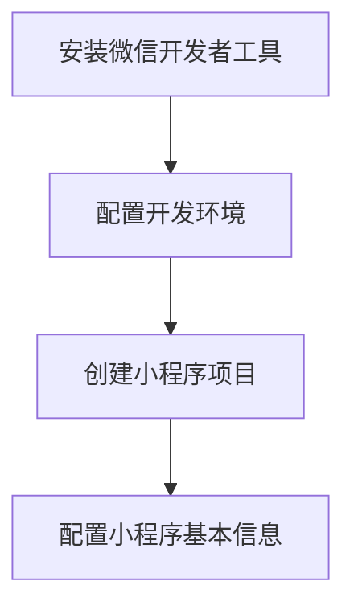
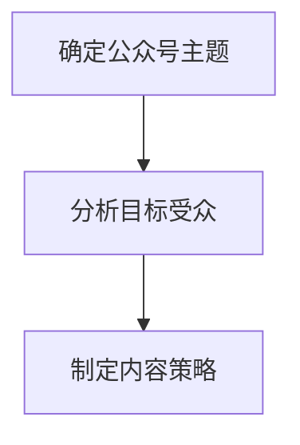
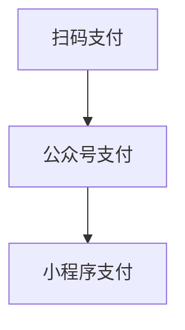
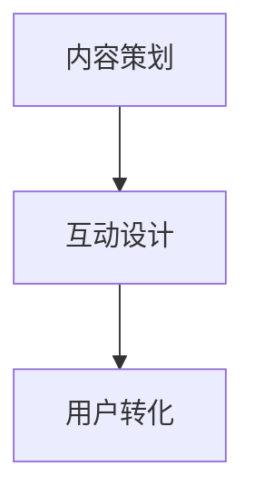
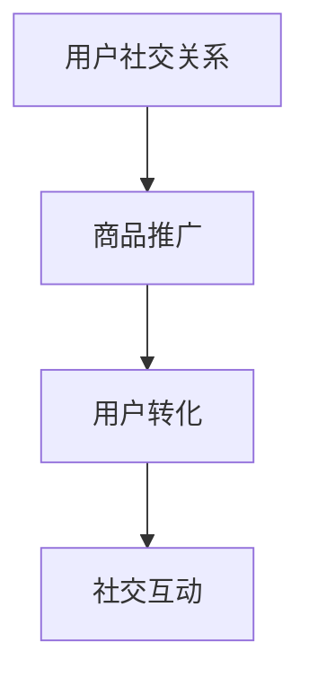
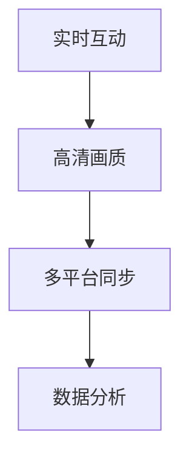
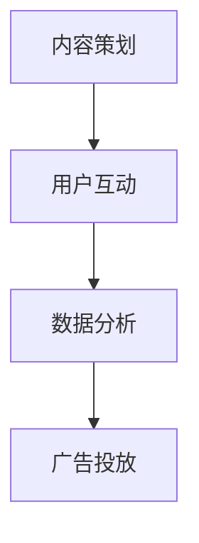

                 

# 如何利用微信生态系统进行创业

> **关键词：** 微信生态、创业、小程序、公众号、支付、电商、社交电商、直播、短视频

> **摘要：** 本文将深入探讨如何利用微信生态系统进行创业。我们将分析微信生态系统的组成部分、优势与挑战，探讨其中的创业机会，并分享实战经验和成功案例，帮助读者了解如何借助微信生态系统实现创业梦想。

## 《如何利用微信生态系统进行创业》目录大纲

### 第一部分：微信生态概述

- 第1章：微信生态系统简介
  - 1.1.1 微信的发展历程
  - 1.1.2 微信的核心功能
  - 1.1.3 微信生态系统的组成部分
  - 1.1.4 微信生态系统的优势与挑战

- 第2章：微信生态系统中的创业机会
  - 2.1.1 微信小程序的创业机会
  - 2.1.2 微信公众号的创业机会
  - 2.1.3 微信支付与微信电商的创业机会
  - 2.1.4 微信朋友圈与社交电商的创业机会
  - 2.1.5 微信直播与短视频的创业机会

### 第二部分：微信生态创业实战

- 第3章：微信小程序开发实战
  - 3.1.1 微信小程序开发环境搭建
  - 3.1.2 微信小程序基础组件与API
  - 3.1.3 微信小程序项目实战：开发一个简单的购物小程序

- 第4章：微信公众号运营策略
  - 4.1.1 公众号定位与目标受众分析
  - 4.1.2 公众号内容策划与制作
  - 4.1.3 公众号推广与粉丝互动
  - 4.1.4 公众号盈利模式分析

- 第5章：微信支付与电商应用
  - 5.1.1 微信支付功能介绍
  - 5.1.2 微信支付接口开发与集成
  - 5.1.3 微信电商案例分析
  - 5.1.4 微信电商运营策略

- 第6章：微信朋友圈与社交电商
  - 6.1.1 微信朋友圈营销策略
  - 6.1.2 社交电商模式解析
  - 6.1.3 社交电商案例分析
  - 6.1.4 社交电商运营技巧

- 第7章：微信直播与短视频创业
  - 7.1.1 微信直播功能介绍
  - 7.1.2 短视频营销策略
  - 7.1.3 直播与短视频案例分析
  - 7.1.4 直播与短视频运营技巧

### 第三部分：微信生态创业案例与经验分享

- 第8章：微信生态成功创业案例分享
  - 8.1.1 案例一：某公司微信小程序的成功之路
  - 8.1.2 案例二：某公众号从零到一千万粉丝的历程
  - 8.1.3 案例三：某微信电商平台的崛起之路
  - 8.1.4 案例四：某微信朋友圈电商的爆发式增长

- 第9章：微信生态创业经验与教训
  - 9.1.1 创业过程中的常见问题与解决方案
  - 9.1.2 创业成功的核心要素
  - 9.1.3 创业失败的原因与避免方法
  - 9.1.4 微信生态创业的持续发展策略

### 附录

- 附录A：微信生态相关开发工具与资源
  - A.1 微信开发者工具介绍
  - A.2 微信公众平台管理工具
  - A.3 微信小程序开发框架对比
  - A.4 微信生态相关书籍与文章推荐
  - A.5 微信生态创业社区与论坛推荐

接下来，我们将逐步深入各个章节，详细探讨微信生态系统的各个方面，帮助读者全面了解如何利用微信生态系统进行创业。

---

在接下来的章节中，我们将首先对微信生态系统进行概述，从发展历程、核心功能到组成部分，深入分析其优势与挑战，帮助读者建立对微信生态系统的全面认识。然后，我们将探讨微信生态系统中的创业机会，包括小程序、公众号、支付、电商、社交电商和直播等，为读者提供具体的创业方向。随后，我们将通过实战案例和策略，展示如何具体利用微信生态系统进行创业。最后，我们将分享成功的创业案例和经验教训，帮助读者避开创业过程中的陷阱，实现持续发展。通过这些内容，我们希望读者能够对微信生态系统有更深入的了解，并能够从中找到属于自己的创业机会。接下来，让我们开始第一部分的探索。

---

### 第一部分：微信生态概述

微信作为中国最流行的即时通讯工具，已经从最初的社交平台发展成为集多种功能于一体的生态系统。这一部分将介绍微信的发展历程、核心功能、生态系统组成部分，并探讨其优势与挑战。

#### 第1章：微信生态系统简介

微信的发展历程

微信于2011年1月正式发布，最初是一个基于移动端的即时通讯工具。随着用户数量的快速增长，微信逐渐引入了朋友圈、语音通话、视频通话等功能，进一步增强了用户的黏性。在2013年，微信引入了微信支付，标志着其开始涉足电商领域。随后，微信推出了小程序、公众号、微信群等更多功能，逐步构建起一个庞大的生态系统。

微信的核心功能

微信的核心功能主要包括即时通讯、朋友圈、微信支付、小程序和公众号等。即时通讯是微信最基本的功能，用户可以通过文字、语音、图片等多种形式进行交流。朋友圈则让用户可以分享自己的生活动态，增加社交互动。微信支付则为用户提供了便捷的在线支付方式，小程序和公众号则成为企业和个人拓展业务的重要平台。

微信生态系统的组成部分

微信生态系统主要由以下几个部分组成：

1. **微信用户**：微信的核心是用户，庞大的用户基础是微信生态系统的基础。
2. **公众号**：公众号是企业、组织、个人等发布内容、推广业务的重要平台。
3. **小程序**：小程序是一种不需要下载安装即可使用的应用，用户可以通过微信扫码或者搜索使用小程序。
4. **微信支付**：微信支付是微信生态系统中的支付功能，为用户提供了便捷的在线支付方式。
5. **微信群**：微信群是用户进行多人实时交流的场所，适用于工作、学习、社交等多种场景。
6. **朋友圈**：朋友圈是用户分享生活动态的重要平台，也是品牌推广和营销的重要渠道。

微信生态系统的优势与挑战

微信生态系统的优势主要体现在以下几个方面：

1. **庞大的用户基础**：微信拥有超过10亿的月活跃用户，这是其他任何平台难以匹敌的。
2. **丰富的功能**：微信不仅提供了即时通讯功能，还涵盖了支付、电商、社交等多个方面，为用户提供了全方位的服务。
3. **便捷的支付功能**：微信支付已经成为中国最大的移动支付平台，为用户提供了便捷的支付体验。
4. **低门槛的创业机会**：微信生态系统提供了许多低门槛的创业机会，无论是个人还是企业都可以通过公众号、小程序等方式进行创业。

然而，微信生态系统也面临一些挑战：

1. **市场竞争激烈**：随着越来越多的企业和个人加入微信生态，市场竞争变得越来越激烈。
2. **用户忠诚度降低**：用户对于单一平台的忠诚度可能降低，他们可能会同时使用多个平台。
3. **监管压力**：随着微信生态系统的不断发展，监管压力也在逐渐增加，企业需要遵守相关的法律法规。

通过以上对微信生态系统的概述，我们希望读者能够对微信生态系统有一个全面的了解，为后续章节的探讨打下基础。

---

在接下来的章节中，我们将深入探讨微信生态系统中的创业机会，包括小程序、公众号、支付、电商、社交电商和直播等。我们将分析这些创业机会的特点、优势和挑战，帮助读者找到适合自己的创业方向。接下来，让我们开始第二部分的探讨。

---

### 第二部分：微信生态系统中的创业机会

微信生态系统为创业者提供了丰富的机会，以下是微信生态系统中的主要创业机会及其特点和策略。

#### 第2章：微信生态系统中的创业机会

##### 2.1.1 微信小程序的创业机会

**特点与优势：**
- **便捷性与普及性**：小程序无需下载安装，即用即走，适用于各类场景。
- **高转化率**：小程序能够快速触达用户，提高用户转化率。
- **低成本**：相对于传统APP开发，小程序的开发和维护成本较低。

**创业策略：**
- **需求分析**：明确目标用户和市场需求，寻找市场空缺。
- **功能设计**：根据用户需求设计功能，保持简洁易用。
- **推广策略**：利用微信朋友圈、微信群等渠道进行推广，增加用户粘性。

##### 2.1.2 微信公众号的创业机会

**特点与优势：**
- **强大的传播能力**：公众号可以发布各种形式的内容，如文字、图片、视频等，具有很强的传播力。
- **高度定制化**：公众号可以根据企业需求进行定制化开发，适用于不同行业和场景。
- **多样化的盈利模式**：包括广告收入、内容付费、服务收费等。

**创业策略：**
- **内容定位**：明确公众号的定位和目标受众，提供高质量的内容。
- **互动策略**：通过互动增强用户黏性，如开展问卷调查、举办活动等。
- **推广与合作**：与其他公众号、品牌合作，扩大影响力。

##### 2.1.3 微信支付与微信电商的创业机会

**特点与优势：**
- **便捷支付**：微信支付已经成为中国最普及的移动支付方式，为用户提供了便捷的支付体验。
- **庞大的用户群体**：微信拥有庞大的用户基础，为电商创业提供了广阔的市场。
- **多样化的电商模式**：包括C2C、B2C、O2O等，创业者可以根据自身需求选择合适的模式。

**创业策略：**
- **市场定位**：明确目标市场和目标用户，提供符合市场需求的产品或服务。
- **供应链管理**：优化供应链，确保产品质量和库存管理。
- **营销推广**：利用微信朋友圈、公众号等渠道进行营销推广，提高品牌知名度。

##### 2.1.4 微信朋友圈与社交电商的创业机会

**特点与优势：**
- **高互动性**：朋友圈具有较强的互动性，用户之间可以轻松分享和交流。
- **广泛的传播渠道**：朋友圈的分享功能使得信息可以迅速传播，增加曝光率。
- **个性化的营销**：朋友圈营销可以根据用户特点和喜好进行个性化推送。

**创业策略：**
- **内容策划**：提供有趣、有价值、有吸引力的内容，吸引用户关注。
- **互动互动再互动**：通过点赞、评论、分享等方式增强用户互动。
- **产品推荐**：结合朋友圈营销，推荐符合用户需求的产品。

##### 2.1.5 微信直播与短视频的创业机会

**特点与优势：**
- **实时互动**：直播和短视频能够实现与观众的实时互动，增加用户参与感。
- **多媒体传播**：直播和短视频能够结合图片、文字、声音等多种形式，提高传播效果。
- **广泛的受众群体**：直播和短视频在年轻人中非常受欢迎，拥有庞大的受众群体。

**创业策略：**
- **内容策划**：提供高质量、有吸引力的直播和短视频内容。
- **互动策略**：通过提问、投票等方式与观众互动，提高参与度。
- **商业化运作**：通过广告、商品推广、付费内容等方式实现商业化运作。

通过以上对微信生态系统中的创业机会的探讨，我们可以看到，微信生态系统为创业者提供了丰富的机会和资源。无论是小程序、公众号、支付、电商、社交电商还是直播，都为创业者提供了广阔的舞台。创业者可以根据自身优势和市场需求，选择适合自己的创业方向，并通过合理的策略实现创业成功。

---

在接下来的章节中，我们将通过具体的实战案例，展示如何利用微信生态系统进行创业。我们将深入解析小程序开发、公众号运营、微信支付集成、电商运营和直播等实战案例，帮助读者更好地理解和应用微信生态系统的创业机会。接下来，让我们开始第三部分的探讨。

---

### 第三部分：微信生态创业实战

通过前文的概述，我们已经了解了微信生态系统中的各种创业机会。接下来，我们将通过具体的实战案例，深入探讨如何利用微信生态系统进行创业。这一部分将涵盖小程序开发、公众号运营、微信支付集成、电商运营和直播等实际操作，帮助读者将理论知识转化为实际操作能力。

#### 第3章：微信小程序开发实战

**3.1.1 微信小程序开发环境搭建**

**核心概念与联系：** 微信小程序开发环境搭建包括安装微信开发者工具、配置开发环境、创建小程序项目等步骤。



**核心算法原理讲解：** 无需复杂的算法，主要涉及配置和工具的使用。

**伪代码：**
```
安装微信开发者工具()
配置开发环境()
创建小程序项目()
配置小程序基本信息()
```

**项目实战：开发一个简单的购物小程序**

**核心步骤：**
1. **需求分析**：确定小程序的功能和用户需求。
2. **设计界面**：设计小程序的界面布局和交互。
3. **实现功能**：使用微信小程序开发框架实现具体功能。
4. **测试与优化**：进行测试和优化，确保小程序稳定可靠。

**详细解释说明：**
- **开发环境搭建**：首先，需要在微信开发者工具官网下载并安装微信开发者工具。安装完成后，启动工具并创建一个新的小程序项目。在项目中配置小程序的AppID和AppSecret等信息。
- **界面设计**：使用微信小程序的开发框架，设计购物小程序的界面。界面包括商品列表、商品详情、购物车和结算页面等。
- **功能实现**：使用微信小程序提供的API，实现商品展示、购物车管理和支付功能。例如，可以使用wx.request()发送网络请求获取商品数据，使用wx.navigateTo()实现页面跳转等。
- **测试与优化**：在小程序开发完成后，需要进行功能测试和性能优化。通过微信开发者工具的调试功能，可以模拟用户操作，发现和修复问题。同时，根据用户反馈和数据分析，对小程序进行优化和迭代。

**代码解读与分析：**
```javascript
// 示例：获取商品列表数据
wx.request({
  url: 'https://api.example.com/products',
  success: function (res) {
    const products = res.data;
    this.setData({
      products: products
    });
  }
});
```
以上代码是使用微信小程序的wx.request()方法获取商品列表数据的示例。通过发送网络请求，从API接口获取商品数据，并将数据存储在页面的data对象中，以便在界面上进行展示。

#### 第4章：微信公众号运营策略

**4.1.1 公众号定位与目标受众分析**

**核心概念与联系：** 公众号定位与目标受众分析包括确定公众号的主题、目标受众、内容策略等。



**核心算法原理讲解：** 无需复杂的算法，主要涉及市场调研和数据分析。

**伪代码：**
```
确定公众号主题()
分析目标受众()
制定内容策略()
```

**项目实战：微信公众号运营策略制定**

**核心步骤：**
1. **确定公众号主题**：明确公众号的核心内容和定位。
2. **分析目标受众**：了解目标受众的需求和喜好。
3. **制定内容策略**：制定内容发布计划，确保内容与受众需求相符。
4. **执行与监测**：执行内容发布计划，并监测效果。

**详细解释说明：**
- **确定公众号主题**：根据业务需求和目标受众，确定公众号的主题。例如，如果是一家餐饮企业的公众号，主题可以是“美食分享”。
- **分析目标受众**：通过市场调研和数据分析，了解目标受众的需求和喜好。例如，通过问卷、访谈等方式收集用户反馈，了解他们对美食的兴趣点、口味偏好等。
- **制定内容策略**：根据目标受众的需求，制定内容发布计划。例如，可以定期发布美食推荐、烹饪教程、活动信息等，确保内容与受众需求相符。
- **执行与监测**：按照内容发布计划，定期发布内容，并通过数据分析监测效果。例如，通过分析阅读量、点赞量、评论量等指标，了解内容的表现，并据此进行调整和优化。

**代码解读与分析：**
在微信公众号运营中，数据分析工具如微信公众平台的数据统计功能非常重要。以下是一个使用微信公众平台API获取文章阅读量的示例代码：
```python
import requests

def get_article_read_count(article_id):
    url = f'https://api.weixin.qq.com/datacube/getarticlesummary?access_token={access_token}'
    params = {
        'article_id': article_id,
        'begin_date': '2023-01-01',
        'end_date': '2023-01-31'
    }
    response = requests.get(url, params=params)
    if response.status_code == 200:
        data = response.json()
        read_count = data['list'][0]['read_count']
        return read_count
    else:
        return None

article_id = '1234567890'
read_count = get_article_read_count(article_id)
if read_count:
    print(f'文章阅读量：{read_count}')
else:
    print('获取文章阅读量失败')
```
以上代码是使用微信公众平台API获取指定文章阅读量的示例。通过发送HTTP GET请求，从API接口获取文章阅读量数据，并输出结果。

通过以上实战案例，我们可以看到，微信小程序和公众号开发与运营的具体流程。在实际操作中，创业者需要根据自身情况和市场需求，不断调整和优化策略，才能在竞争激烈的市场中脱颖而出。

在接下来的章节中，我们将继续探讨微信生态中的其他创业机会，包括微信支付与电商应用、微信朋友圈与社交电商、微信直播与短视频等。通过这些实战案例，我们将进一步展示如何利用微信生态系统实现创业梦想。接下来，让我们开始第四部分的探讨。

---

在第三部分，我们详细探讨了微信小程序开发与公众号运营的策略和实战案例。接下来，我们将进一步深入微信生态系统的其他创业机会，包括微信支付与电商应用、微信朋友圈与社交电商、微信直播与短视频等。这些创业机会具有独特的特点和策略，能够帮助创业者实现不同的商业目标。

#### 第5章：微信支付与电商应用

微信支付作为微信生态系统的重要组成部分，为创业者提供了便捷的支付解决方案，推动了电商的发展。以下是微信支付与电商应用的创业机会和策略。

**5.1.1 微信支付功能介绍**

微信支付是微信提供的在线支付服务，用户可以通过微信账号完成支付操作。微信支付支持多种支付方式，包括扫码支付、公众号支付、小程序支付等。

**核心概念与联系：** 微信支付的功能和接口使用。



**核心算法原理讲解：** 微信支付主要涉及支付流程的API调用。

**伪代码：**
```
发起扫码支付()
发起公众号支付()
发起小程序支付()
```

**项目实战：微信支付集成到电商平台**

**核心步骤：**
1. **接入微信支付API**：在电商平台后端接入微信支付API，实现支付功能。
2. **支付流程设计**：设计支付流程，包括商品选择、订单生成、支付请求、支付结果通知等。
3. **支付页面展示**：在前端展示支付页面，引导用户完成支付。
4. **支付结果处理**：处理支付结果，包括支付成功、支付失败等情况。

**详细解释说明：**
- **接入微信支付API**：首先，需要在微信支付官网注册成为开发者，获取API接口权限。然后，在电商平台后端集成微信支付API，实现支付功能。微信支付提供了多种支付接口，包括Native支付、JSAPI支付、APP支付等，创业者可以根据实际需求选择合适的接口。
- **支付流程设计**：设计支付流程，确保用户能够顺利完成支付。支付流程通常包括商品选择、订单生成、支付请求、支付结果通知等步骤。在商品选择和订单生成阶段，需要将订单信息传递给微信支付接口，生成支付链接或支付码。在支付请求阶段，用户点击支付按钮，触发支付请求，完成支付操作。在支付结果通知阶段，微信支付会返回支付结果，电商平台需要根据支付结果更新订单状态。
- **支付页面展示**：在前端展示支付页面，引导用户完成支付。支付页面需要简洁明了，展示支付金额、支付方式、支付按钮等信息。用户点击支付按钮后，触发支付请求，完成支付操作。
- **支付结果处理**：处理支付结果，包括支付成功、支付失败等情况。支付成功后，电商平台需要更新订单状态，通知用户支付成功。支付失败后，电商平台需要提示用户支付失败原因，并提供重新支付或联系客服等选项。

**代码解读与分析：**
```python
# 示例：发起微信支付请求
import requests

def create_order(order_id, order_amount):
    url = 'https://api.mch.weixin.qq.com/pay/unifiedorder'
    params = {
        'appid': 'wx2421b1c4370ec43b',
        'mch_id': '10000100',
        'nonce_str': 'ec2316275641faa3aacf3cc599e8730f',
        'sign': '0CB01533B8C1EF103065174F50BCA001',
        'body': 'JSAPI支付测试',
        'out_trade_no': '1415659990',
        'total_fee': '1',
        'spbill_create_ip': '14.23.150.211',
        'notify_url': 'http://www.weixin.qq.com/wxpay/pay.php',
        'trade_type': 'JSAPI'
    }
    response = requests.post(url, data=params)
    if response.status_code == 200:
        data = response.json()
        return data['prepay_id']
    else:
        return None

prepay_id = create_order('1415659990', 1)
if prepay_id:
    print('支付请求成功，prepay_id：', prepay_id)
else:
    print('支付请求失败')
```
以上代码是发起微信支付请求的示例。通过发送HTTP POST请求，将订单信息传递给微信支付接口，获取prepay_id，为后续的支付流程做准备。

通过以上实战案例，我们可以看到微信支付集成到电商平台的具体流程。在实际操作中，创业者需要根据自身业务需求，选择合适的支付接口和支付方式，确保支付流程的稳定和可靠。

#### 第5.2节 微信电商案例分析

**案例一：拼多多——社交电商的成功之路**

拼多多是一家以社交电商为核心的电商平台，通过微信朋友圈、微信群等社交渠道进行推广，实现了快速发展和用户规模的扩大。

**成功原因：**
- **社交化推广**：利用微信社交网络，通过拼团、优惠券等形式吸引用户参与，实现了病毒式传播。
- **精准营销**：根据用户行为和偏好进行精准推荐，提高用户转化率和复购率。
- **供应链优化**：通过大数据分析和智能采购，优化供应链，降低成本，提高效率。

**运营策略：**
- **朋友圈营销**：通过发布拼团信息、优惠券等，吸引用户参与。
- **微信群运营**：建立微信群，进行用户互动和推广，增强用户黏性。
- **活动策划**：定期举办各种活动，如拼团、秒杀等，提高用户活跃度和参与度。

**案例分析：**
拼多多的成功主要在于其独特的社交电商模式，通过利用微信生态系统的社交特性，实现了快速发展和用户规模的扩大。其运营策略注重用户互动和参与，通过精准营销和活动策划，提高了用户转化率和复购率。

通过以上微信电商案例分析，我们可以看到微信支付与电商应用的巨大潜力。创业者可以根据自身业务特点和市场环境，选择合适的运营策略，利用微信生态系统实现电商创业的成功。

#### 第6章：微信朋友圈与社交电商

微信朋友圈作为微信生态系统中重要的社交平台，已经成为社交电商的重要渠道。在这一部分，我们将探讨微信朋友圈的营销策略、社交电商模式解析、实战案例分析以及运营技巧。

**6.1.1 微信朋友圈营销策略**

微信朋友圈营销策略的核心在于利用微信朋友圈的社交特性，通过内容策划和互动设计吸引用户参与，实现品牌推广和销售转化。

**核心概念与联系：** 微信朋友圈营销策略的组成要素。



**核心算法原理讲解：** 微信朋友圈营销主要涉及用户行为分析和内容推荐算法。

**伪代码：**
```
内容策划()
互动设计()
用户转化()
```

**项目实战：微信朋友圈营销策略制定**

**核心步骤：**
1. **内容策划**：制定朋友圈内容发布计划，确保内容与用户需求相符。
2. **互动设计**：设计互动活动，如点赞、评论、转发等，提高用户参与度。
3. **用户转化**：通过内容引导用户进行购买或其他行动，实现销售转化。

**详细解释说明：**
- **内容策划**：内容策划是微信朋友圈营销的关键。首先，需要明确目标受众和用户需求，制定内容发布计划。内容形式可以包括生活分享、产品推荐、活动信息等，确保内容具有吸引力和价值。其次，需要定期发布高质量内容，保持用户关注度。例如，可以定期发布产品推荐，结合优惠活动吸引用户购买。
- **互动设计**：互动设计是提高用户参与度的重要手段。通过设计点赞、评论、转发等互动活动，鼓励用户积极参与，增加朋友圈互动氛围。例如，可以设计点赞抽奖活动，鼓励用户点赞并分享，提高品牌曝光率。同时，通过评论互动，了解用户需求和反馈，及时调整营销策略。
- **用户转化**：用户转化是微信朋友圈营销的目标。通过内容引导用户进行购买或其他行动，实现销售转化。例如，可以发布限时优惠信息，引导用户购买。同时，通过朋友圈互动，了解用户需求，提供个性化推荐，提高购买转化率。

**代码解读与分析：**
在微信朋友圈营销中，数据分析工具如微信公众平台的数据统计功能非常重要。以下是一个使用微信公众平台API获取朋友圈互动数据的示例代码：
```python
import requests

def get_fans_count(access_token):
    url = f'https://api.weixin.qq.com/datacube/getuserreadhour?access_token={access_token}'
    params = {
        'begin_date': '2023-01-01',
        'end_date': '2023-01-31'
    }
    response = requests.get(url, params=params)
    if response.status_code == 200:
        data = response.json()
        return data['list']
    else:
        return None

access_token = 'your_access_token'
fans_count = get_fans_count(access_token)
if fans_count:
    print('朋友圈互动数据：', fans_count)
else:
    print('获取朋友圈互动数据失败')
```
以上代码是使用微信公众平台API获取朋友圈互动数据的示例。通过发送HTTP GET请求，从API接口获取朋友圈互动数据，如阅读量、点赞量、评论量等，以便分析用户行为和调整营销策略。

#### 第6.2节 社交电商模式解析

社交电商是指通过社交网络进行商品推广和销售的一种电商模式，其核心在于利用用户社交关系进行传播和转化。

**核心概念与联系：** 社交电商的组成部分和运作机制。



**核心算法原理讲解：** 社交电商主要涉及用户行为分析、推荐算法和社交网络分析。

**伪代码：**
```
建立用户社交关系()
商品推广()
用户转化()
社交互动()
```

**项目实战：社交电商模式应用**

**核心步骤：**
1. **建立用户社交关系**：通过用户注册、邀请等方式建立用户社交关系。
2. **商品推广**：通过社交网络进行商品推广，鼓励用户分享和推荐。
3. **用户转化**：通过优惠券、限时折扣等促销活动，引导用户进行购买。
4. **社交互动**：设计互动活动，如点赞、评论、转发等，提高用户参与度。

**详细解释说明：**
- **建立用户社交关系**：社交电商的基础是用户社交关系。通过用户注册、邀请等方式，建立用户之间的社交关系。用户可以通过添加好友、加入群聊等途径，建立社交网络。社交关系越紧密，用户之间的信任度越高，推广效果越好。
- **商品推广**：商品推广是社交电商的核心。通过朋友圈、微信群等社交网络，发布商品信息和推广内容，鼓励用户分享和推荐。用户可以通过分享商品链接、生成优惠券等方式，为他人提供价值，同时获取佣金或奖励。
- **用户转化**：用户转化是社交电商的目标。通过优惠券、限时折扣等促销活动，引导用户进行购买。同时，通过社交互动，如点赞、评论、转发等，提高用户参与度和购买意愿。
- **社交互动**：社交互动是社交电商的重要组成部分。设计互动活动，如点赞抽奖、评论有礼、分享返现等，提高用户参与度。通过互动，增强用户之间的联系，提升品牌知名度。

**代码解读与分析：**
在社交电商模式中，用户行为分析和推荐算法至关重要。以下是一个简单的用户行为分析示例代码：
```python
import pandas as pd

def analyze_user_behavior(user_data):
    df = pd.DataFrame(user_data)
    df['total_interactions'] = df['likes'] + df['comments'] + df['shares']
    df['avg_interactions'] = df['total_interactions'] / len(df)
    return df

user_data = [
    {'user_id': 1, 'likes': 10, 'comments': 5, 'shares': 3},
    {'user_id': 2, 'likes': 8, 'comments': 4, 'shares': 2},
    {'user_id': 3, 'likes': 12, 'comments': 6, 'shares': 4},
]
df = analyze_user_behavior(user_data)
print(df)
```
以上代码是分析用户行为的示例。通过计算用户点赞、评论、分享的总数和平均值，了解用户的参与度。

通过以上实战案例和解析，我们可以看到微信朋友圈与社交电商的巨大潜力。创业者可以通过合理的内容策划、互动设计和用户转化策略，利用微信朋友圈和社交网络进行商品推广和销售，实现社交电商的成功。

#### 第6.3节 社交电商案例分析

**案例二：小红书——内容驱动的社交电商**

小红书是一个以内容为核心的社交电商平台，通过用户生成内容（UGC）进行商品推广和销售，实现了快速发展和用户规模的扩大。

**成功原因：**
- **内容驱动**：通过用户生成的内容，提供真实、实用的购物推荐，增强用户信任。
- **社交互动**：鼓励用户评论、点赞、分享，提高用户参与度和互动氛围。
- **精细化运营**：通过数据分析，了解用户需求和偏好，提供个性化推荐。

**运营策略：**
- **内容策划**：鼓励用户生成高质量内容，包括购物心得、评测、美妆教程等。
- **互动设计**：设计互动活动，如点赞抽奖、评论有礼、分享返现等，提高用户参与度。
- **数据分析**：通过数据分析，了解用户行为和偏好，提供个性化推荐。

**案例分析：**
小红书通过内容驱动和社交互动，建立了强大的用户社区。其运营策略注重用户体验和互动，通过高质量内容和互动设计，提高了用户参与度和品牌忠诚度。同时，通过精细化运营，实现了用户规模和销售额的快速增长。

通过以上社交电商案例分析，我们可以看到内容驱动和社交互动在社交电商中的重要性。创业者可以借鉴小红书的成功经验，结合自身业务特点，实现社交电商的成功。

#### 第6.4节 社交电商运营技巧

社交电商运营需要注重内容策划、互动设计和用户转化，以下是一些社交电商运营技巧：

**1. 内容策划：**
- **提供有价值的内容**：内容需要具有实用性、趣味性和吸引力，满足用户需求。
- **保持内容更新频率**：定期发布新内容，保持用户关注度。
- **多样化内容形式**：包括图文、视频、直播等多种形式，丰富用户体验。

**2. 互动设计：**
- **设计互动活动**：如点赞抽奖、评论有礼、分享返现等，鼓励用户参与。
- **利用社交网络**：通过朋友圈、微信群等社交网络，进行推广和互动。
- **互动反馈**：及时回复用户评论和提问，提高用户满意度。

**3. 用户转化：**
- **提供优惠和促销**：通过优惠券、限时折扣等，引导用户购买。
- **个性化推荐**：根据用户行为和偏好，提供个性化推荐，提高购买转化率。
- **售后服务**：提供优质的售后服务，增强用户信任和忠诚度。

通过以上社交电商运营技巧，创业者可以更好地利用微信朋友圈和社交网络，实现社交电商的成功。

---

在第六章，我们详细探讨了微信朋友圈与社交电商的营销策略、模式解析和实战案例分析。接下来，我们将进一步探讨微信直播与短视频创业的机会，深入解析直播功能、短视频营销策略以及直播与短视频运营技巧。接下来，让我们开始第七部分的探讨。

### 第七部分：微信直播与短视频创业

微信直播和短视频作为微信生态系统中的重要组成部分，为创业者提供了丰富的创业机会。在这一部分，我们将深入探讨微信直播与短视频创业的机会、功能介绍、营销策略以及运营技巧。

#### 第7章：微信直播与短视频创业

**7.1.1 微信直播功能介绍**

微信直播作为微信生态系统的一部分，已经成为许多创业者和企业推广产品、服务的重要工具。微信直播具有以下功能特点：

**核心概念与联系：** 微信直播的功能和特点。



**核心算法原理讲解：** 微信直播主要涉及实时音视频传输和数据分析算法。

**伪代码：**
```
开启直播()
实时互动()
数据分析()
```

**项目实战：微信直播功能应用**

**核心步骤：**
1. **开启直播**：在微信后台配置直播参数，开启直播功能。
2. **实时互动**：直播过程中与观众互动，提高观众参与度。
3. **数据分析**：收集和分析观众数据，优化直播效果。

**详细解释说明：**
- **开启直播**：首先，在微信后台注册成为开发者，获取直播权限。然后，配置直播参数，如直播标题、直播封面、直播时间等。最后，通过调用API接口，开启直播。
- **实时互动**：直播过程中，主播可以通过文字、语音、表情等方式与观众互动，增加观众参与度。观众可以通过弹幕、点赞、评论等方式参与互动。
- **数据分析**：直播结束后，可以通过微信后台的数据分析功能，收集和分析观众数据，如观看时长、观看人数、互动数据等。根据数据分析结果，优化直播内容和策略。

**代码解读与分析：**
```python
# 示例：开启微信直播
import requests

def start_live(room_id, title, cover_url):
    url = 'https://api.weixin.qq.com/videolive/startlivestream'
    params = {
        'access_token': 'your_access_token',
        'room_id': room_id,
        'title': title,
        'cover_url': cover_url
    }
    response = requests.post(url, data=params)
    if response.status_code == 200:
        data = response.json()
        return data['result']
    else:
        return None

room_id = 'your_room_id'
title = '我的直播'
cover_url = 'your_cover_url'
result = start_live(room_id, title, cover_url)
if result:
    print('开启直播成功')
else:
    print('开启直播失败')
```
以上代码是开启微信直播的示例。通过发送HTTP POST请求，将直播参数传递给微信直播API，返回直播结果。

**7.1.2 短视频营销策略**

短视频营销作为当前社交媒体的重要形式，具有传播速度快、用户参与度高、形式多样等优势。微信短视频营销策略包括以下几个方面：

**核心概念与联系：** 微信短视频营销策略的组成部分。



**核心算法原理讲解：** 微信短视频营销主要涉及内容推荐算法、用户行为分析和广告投放算法。

**伪代码：**
```
内容策划()
用户互动()
数据分析()
广告投放()
```

**项目实战：短视频营销策略制定**

**核心步骤：**
1. **内容策划**：制定短视频内容发布计划，确保内容与用户需求相符。
2. **用户互动**：设计互动活动，如点赞、评论、分享等，提高用户参与度。
3. **数据分析**：收集和分析用户数据，优化短视频内容。
4. **广告投放**：根据用户数据和内容效果，进行精准广告投放。

**详细解释说明：**
- **内容策划**：内容策划是短视频营销的关键。首先，需要明确目标受众和用户需求，制定内容发布计划。短视频内容可以包括产品展示、教程、娱乐等，确保内容具有吸引力和价值。其次，需要定期发布高质量短视频，保持用户关注度。
- **用户互动**：用户互动是提高短视频传播效果的重要手段。通过设计点赞、评论、分享等互动活动，鼓励用户积极参与，增加短视频曝光率。例如，可以设计点赞抽奖活动，鼓励用户点赞并分享，提高品牌曝光率。
- **数据分析**：数据分析是优化短视频内容的重要依据。通过收集和分析用户数据，如观看时长、点赞数、评论数等，了解用户对短视频的喜好和需求。根据数据分析结果，优化短视频内容，提高用户参与度。
- **广告投放**：广告投放是短视频营销的重要收入来源。根据用户数据和内容效果，进行精准广告投放。例如，可以针对特定用户群体投放广告，提高广告转化率。

**代码解读与分析：**
在短视频营销中，数据分析工具如微信公众平台的数据统计功能非常重要。以下是一个使用微信公众平台API获取短视频观看数据的示例代码：
```python
import requests

def get_video_view_count(video_id):
    url = f'https://api.weixin.qq.com/datacube/getvideoview?access_token={access_token}'
    params = {
        'media_id': video_id,
        'begin_date': '2023-01-01',
        'end_date': '2023-01-31'
    }
    response = requests.get(url, params=params)
    if response.status_code == 200:
        data = response.json()
        view_count = data['list'][0]['view_count']
        return view_count
    else:
        return None

video_id = 'your_video_id'
view_count = get_video_view_count(video_id)
if view_count:
    print(f'短视频观看量：{view_count}')
else:
    print('获取短视频观看量失败')
```
以上代码是使用微信公众平台API获取短视频观看数据的示例。通过发送HTTP GET请求，从API接口获取短视频观看量数据，以便分析用户观看行为。

**7.1.3 直播与短视频案例分析**

**案例三：李佳琦——直播带货的成功之路**

李佳琦是一位知名网红，通过直播带货实现了商业成功。他的成功原因和运营策略包括：

**成功原因：**
- **专业素养**：李佳琦具备专业的化妆技能和亲和力，能够与观众建立良好的互动关系。
- **产品推荐**：推荐的产品质量有保证，满足了观众的购物需求。
- **互动设计**：通过实时互动，如抽奖、互动问答等，提高观众参与度。
- **广告投放**：通过精准广告投放，吸引了大量粉丝和观众。

**运营策略：**
- **内容策划**：制定丰富的直播内容，包括美妆教程、产品推荐、互动游戏等。
- **互动设计**：通过实时互动，增强观众参与感和互动性。
- **数据分析**：收集和分析观众数据，优化直播内容和策略。
- **广告投放**：根据观众数据和直播效果，进行精准广告投放。

**案例分析：**
李佳琦通过专业素养、产品推荐、互动设计和数据分析等策略，成功将直播带货推向了高峰。他的直播内容丰富多样，吸引了大量粉丝和观众。同时，通过实时互动和精准广告投放，提高了观众参与度和购买转化率。

**7.1.4 直播与短视频运营技巧**

直播与短视频运营需要注重内容策划、互动设计、数据分析以及广告投放等方面。以下是一些直播与短视频运营技巧：

**1. 内容策划：**
- **提供有价值的内容**：内容需要具有吸引力、实用性和趣味性，满足用户需求。
- **保持内容更新频率**：定期发布新内容，保持用户关注度。
- **多样化内容形式**：包括直播、短视频、图文等多种形式，丰富用户体验。

**2. 互动设计：**
- **设计互动活动**：如抽奖、互动问答、点赞有礼等，鼓励用户参与。
- **利用社交网络**：通过朋友圈、微信群等社交网络，进行推广和互动。
- **互动反馈**：及时回复用户评论和提问，提高用户满意度。

**3. 数据分析：**
- **收集和分析用户数据**：了解用户需求和偏好，优化内容策略。
- **数据驱动的决策**：根据数据分析结果，调整直播和短视频策略。

**4. 广告投放：**
- **精准定位目标用户**：根据用户数据和内容效果，进行精准广告投放。
- **优化广告投放策略**：根据广告投放效果，调整广告投放时间和方式。

通过以上直播与短视频运营技巧，创业者可以更好地利用微信直播和短视频平台，实现直播与短视频创业的成功。

---

在第七章中，我们深入探讨了微信直播与短视频创业的机会、功能介绍、营销策略以及运营技巧。接下来，我们将通过成功创业案例分享，进一步展示如何利用微信生态系统实现创业成功。随后，我们将总结微信生态创业的经验与教训，帮助创业者避免常见问题，实现持续发展。最后，我们将推荐一些微信生态相关开发工具与资源，为创业者的学习和实践提供支持。接下来，让我们开始第八部分的探讨。

### 第八部分：微信生态成功创业案例分享

通过前文的探讨，我们已经了解了微信生态系统的各个方面以及如何利用这些功能进行创业。接下来，我们将通过几个成功的创业案例，分享他们在微信生态中的成功经验，帮助读者更好地理解和应用微信生态系统的创业机会。

#### 案例一：某公司微信小程序的成功之路

某公司是一家专注于生活服务的初创企业，通过微信小程序实现了快速发展和用户规模的增长。以下是他们的成功经验和策略：

**成功原因：**
- **精准定位**：公司首先明确了目标市场和用户需求，选择了专注于本地生活服务的方向。
- **优质内容**：小程序提供了丰富的内容，包括生活资讯、优惠券、在线预订等，满足了用户需求。
- **用户体验**：小程序设计简洁易用，提供了流畅的用户体验。
- **持续优化**：根据用户反馈和数据分析，不断优化小程序功能和服务，提高用户满意度。

**运营策略：**
- **内容策划**：定期发布高质量内容，如生活资讯、优惠活动等，吸引用户关注。
- **用户互动**：通过小程序的互动功能，如点赞、评论、分享等，增强用户参与度。
- **推广合作**：与其他企业、公众号合作，通过互推等方式扩大用户基础。

**成功经验：**
- **明确目标**：明确目标市场和用户需求，确保小程序内容和服务能够满足用户需求。
- **优质内容**：提供有价值的内容，吸引用户关注和分享。
- **用户体验**：注重用户体验，设计简洁易用的界面，提高用户满意度。
- **持续优化**：根据用户反馈和数据分析，不断优化小程序功能和服务。

#### 案例二：某公众号从零到一千万粉丝的历程

某公众号专注于科技领域，通过内容策划和互动设计，成功积累了大量粉丝，实现了从零到一千万粉丝的飞跃。以下是他们的成功经验和策略：

**成功原因：**
- **专业内容**：公众号提供了高质量的科技文章，满足了用户的求知需求。
- **互动设计**：通过互动设计，如问卷调查、抽奖活动等，增强了用户参与度。
- **品牌推广**：通过其他渠道，如朋友圈、微信群等，进行品牌推广，扩大影响力。
- **内容多样化**：除了文章，还提供了音频、视频等多种形式的内容，丰富了用户体验。

**运营策略：**
- **内容策划**：根据用户需求，制定内容发布计划，确保内容质量。
- **用户互动**：设计互动活动，如问卷调查、抽奖等，提高用户参与度。
- **品牌推广**：通过其他渠道，如朋友圈、微信群等，进行品牌推广，扩大影响力。
- **数据分析**：收集和分析用户数据，优化内容策略和运营效果。

**成功经验：**
- **专业内容**：提供高质量、专业的内容，满足用户需求，提高用户忠诚度。
- **互动设计**：通过互动设计，增强用户参与度，提高用户互动频率。
- **品牌推广**：通过多种渠道进行品牌推广，扩大影响力。
- **内容多样化**：提供多样化的内容形式，满足不同用户的需求。

#### 案例三：某微信电商平台的崛起之路

某微信电商平台通过微信支付和社交电商功能，实现了快速崛起。以下是他们的成功经验和策略：

**成功原因：**
- **便捷支付**：微信支付提供了便捷的支付方式，提高了用户的购买意愿。
- **社交电商**：利用微信朋友圈和社交网络进行推广，实现了病毒式传播。
- **优质服务**：提供了优质的售后服务，增强了用户信任和忠诚度。
- **精准营销**：通过用户数据分析，进行精准营销，提高了转化率。

**运营策略：**
- **支付优化**：优化支付流程，提高支付成功率。
- **社交电商**：利用微信朋友圈和社交网络进行推广，鼓励用户分享和推荐。
- **售后服务**：提供优质的售后服务，提高用户满意度和忠诚度。
- **数据分析**：收集和分析用户数据，优化营销策略和产品推荐。

**成功经验：**
- **便捷支付**：提供便捷的支付方式，提高用户体验和购买意愿。
- **社交电商**：利用社交网络进行推广，实现病毒式传播。
- **优质服务**：提供优质的售后服务，增强用户信任和忠诚度。
- **精准营销**：通过用户数据分析，进行精准营销，提高转化率。

#### 案例四：某微信朋友圈电商的爆发式增长

某微信朋友圈电商通过朋友圈营销和社交互动，实现了爆发式增长。以下是他们的成功经验和策略：

**成功原因：**
- **内容策划**：提供有价值、有趣的内容，吸引了大量关注。
- **社交互动**：设计互动活动，如点赞抽奖、评论有礼等，增强了用户参与度。
- **用户转化**：通过优惠券、限时折扣等促销活动，引导用户进行购买。
- **品牌推广**：通过朋友圈和微信群进行品牌推广，提高了品牌知名度。

**运营策略：**
- **内容策划**：制定内容发布计划，确保内容质量和频率。
- **社交互动**：设计互动活动，提高用户参与度和互动频率。
- **用户转化**：通过促销活动，提高用户购买转化率。
- **品牌推广**：通过朋友圈和微信群进行品牌推广，扩大影响力。

**成功经验：**
- **内容策划**：提供有价值、有趣的内容，提高用户关注和参与度。
- **社交互动**：设计互动活动，增强用户互动和参与度。
- **用户转化**：通过促销活动，提高用户购买意愿和转化率。
- **品牌推广**：通过社交网络进行品牌推广，提高品牌知名度和影响力。

通过以上成功创业案例的分享，我们可以看到微信生态系统为创业者提供了丰富的机会和资源。无论是微信小程序、公众号、电商、朋友圈电商还是直播与短视频，创业者都可以通过合理的策略和运营，实现创业成功。

接下来，我们将总结微信生态创业的经验与教训，帮助创业者更好地应对挑战，实现持续发展。

---

在第八部分，我们通过成功创业案例分享了微信生态系统中的创业经验和策略。接下来，我们将总结微信生态创业的经验与教训，帮助创业者更好地应对挑战，实现持续发展。

### 第九部分：微信生态创业经验与教训

#### 9.1.1 创业过程中的常见问题与解决方案

**问题一：用户获取难**

**解决方案：** 
- **内容营销**：通过高质量、有价值的内容吸引关注，提高用户粘性。
- **社交推广**：利用微信朋友圈、微信群等社交平台进行推广，扩大用户基础。
- **合作互推**：与其他公众号、小程序等合作，通过互推增加曝光率。

**问题二：用户活跃度低**

**解决方案：** 
- **互动设计**：设计互动活动，如抽奖、评论有礼等，提高用户参与度。
- **内容更新**：定期发布新内容，保持用户关注度。
- **个性化推荐**：根据用户行为和偏好，提供个性化内容，提高用户满意度。

**问题三：变现困难**

**解决方案：** 
- **多元化收入**：通过广告、付费内容、会员服务等多种方式实现收入。
- **精准营销**：通过用户数据分析，进行精准营销，提高转化率。
- **合作拓展**：与其他企业、平台合作，拓展收入渠道。

#### 9.1.2 创业成功的核心要素

**要素一：用户需求**

**核心解释：** 创业项目必须满足用户需求，解决用户痛点。

**案例：** 某公司微信小程序通过提供本地生活服务，满足了用户对便捷生活的需求，取得了成功。

**要素二：优质内容**

**核心解释：** 创业项目需要提供高质量、有价值的内容，吸引用户关注。

**案例：** 某公众号通过提供专业的科技文章，满足了用户的求知需求，积累了大量粉丝。

**要素三：用户体验**

**核心解释：** 创业项目需要注重用户体验，提供流畅、便捷的服务。

**案例：** 某微信电商小程序通过优化支付流程，提高了用户的购买体验，增加了转化率。

**要素四：持续创新**

**核心解释：** 创业项目需要不断创新，跟上市场趋势，保持竞争力。

**案例：** 某公司通过引入直播功能，实现了电商模式的创新，提高了用户参与度。

#### 9.1.3 创业失败的原因与避免方法

**原因一：市场定位不准确**

**避免方法：** 
- **市场调研**：进行充分的市场调研，了解目标市场和用户需求。
- **调整定位**：根据市场反馈，及时调整创业项目的定位和策略。

**原因二：产品同质化严重**

**避免方法：** 
- **差异化创新**：提供独特的产品或服务，打造差异化优势。
- **细分市场**：选择细分市场，满足特定用户群体的需求。

**原因三：资金不足**

**避免方法：** 
- **合理规划**：制定详细的财务计划和预算，确保资金充足。
- **融资渠道**：寻找投资人和合作伙伴，拓宽融资渠道。

**原因四：运营策略不当**

**避免方法：** 
- **数据驱动**：根据用户数据和运营数据，调整运营策略。
- **用户反馈**：重视用户反馈，及时改进产品和服务。

#### 9.1.4 微信生态创业的持续发展策略

**策略一：持续创新**

**核心解释：** 随着市场和技术的发展，创业项目需要不断创新，保持竞争力。

**实施方法：**
- **技术研发**：持续投入技术研发，提高产品竞争力。
- **模式创新**：探索新的商业模式，拓宽收入渠道。

**策略二：用户增长**

**核心解释：** 用户是创业项目的核心资产，持续增长用户是项目持续发展的关键。

**实施方法：**
- **内容营销**：通过高质量内容吸引用户关注。
- **社交推广**：利用社交网络扩大用户基础。

**策略三：品牌建设**

**核心解释：** 品牌是创业项目的长期资产，良好的品牌形象有助于提高用户忠诚度和市场竞争力。

**实施方法：**
- **品牌定位**：明确品牌定位和目标受众。
- **品牌推广**：通过多种渠道进行品牌推广。

**策略四：合作伙伴**

**核心解释：** 合作伙伴可以提供资源、技术和市场支持，有助于创业项目的持续发展。

**实施方法：**
- **寻找合作伙伴**：寻找有共同目标和资源的合作伙伴。
- **合作互赢**：建立长期稳定的合作关系，实现互惠互利。

通过以上微信生态创业经验与教训的总结，创业者可以更好地应对创业过程中的挑战，实现持续发展。在微信生态中，持续创新、用户增长、品牌建设和合作伙伴是实现创业成功的重要策略。

---

在第九部分，我们总结了微信生态创业的经验与教训，帮助创业者更好地应对挑战，实现持续发展。接下来，我们将提供一些微信生态相关的开发工具与资源，为创业者的学习和实践提供支持。

### 附录：微信生态相关开发工具与资源

微信生态系统为创业者提供了丰富的工具和资源，以下是一些常用的微信生态相关开发工具与资源，供创业者参考。

#### 附录A：微信开发者工具介绍

微信开发者工具是微信官方提供的开发工具，支持小程序、公众号等多种开发模式。

**功能特点：**
- **代码编辑与调试**：提供代码编辑器和调试工具，方便开发者编写和调试代码。
- **模拟器**：支持微信模拟器，开发者可以在模拟器上测试小程序和公众号的功能。
- **云开发**：提供云函数、数据库等服务，方便开发者实现云开发模式。

**下载地址：** https://developers.weixin.qq.com/miniprogram/dev/devtools/download.html

#### 附录B：微信公众平台管理工具

微信公众账号平台管理工具是微信官方提供的公众平台管理工具，用于公众号的运营和管理。

**功能特点：**
- **内容发布**：支持图文、视频、音频等多种内容形式的发布。
- **用户管理**：提供用户分组、用户标签等功能，方便管理公众号粉丝。
- **数据分析**：提供公众号数据统计功能，方便开发者分析用户行为和运营效果。

**下载地址：** https://mp.weixin.qq.com/

#### 附录C：微信小程序开发框架对比

微信小程序开发框架是用于小程序开发的第三方框架，以下是一些常见的小程序开发框架：

- **uni-app**：一款多端统一的开发框架，支持微信小程序、H5、Android、iOS等多个平台。
- **Taro**：一款基于React的跨端开发框架，支持微信小程序、H5、小程序框架等多个平台。
- **WePY**：一款基于Vue.js的微信小程序开发框架，支持组件化和双向数据绑定。

**选择建议：** 根据开发需求和个人技能选择合适的框架。

#### 附录D：微信生态相关书籍与文章推荐

以下是一些关于微信生态和微信营销的书籍和文章，供创业者参考：

- **《微信营销实战：策略、案例与技巧》**
- **《微信小程序开发实战》**
- **《微信电商运营与实战》**
- **微信官方文档：https://developers.weixin.qq.com/miniprogram/dev/framework/**

#### 附录E：微信生态创业社区与论坛推荐

以下是一些微信生态创业相关的社区和论坛，创业者可以在这些社区和论坛中交流、学习和分享：

- **微信公众号开发社区：https://www.jianshu.com/p/5c4aef0c8d1d**
- **微信小程序开发论坛：https://www.52zxw.net/forum.php?mod=forumdisplay&fid=39**
- **微信生态创业社区：https://www.wecan.club/topics**

通过以上微信生态相关开发工具与资源的介绍，创业者可以更好地利用微信生态系统的各种工具和资源，提高开发效率，实现创业目标。

---

在附录部分，我们提供了微信生态相关开发工具与资源的详细介绍，包括微信开发者工具、公众平台管理工具、小程序开发框架对比、相关书籍与文章推荐以及微信生态创业社区与论坛推荐。这些工具和资源将为创业者在微信生态中的学习和实践提供强有力的支持。

至此，本文《如何利用微信生态系统进行创业》的内容已经全部呈现完毕。我们通过对微信生态系统的概述、创业机会的探讨、实战案例的分享以及经验与教训的总结，为创业者提供了全面的指导。希望本文能够帮助创业者更好地了解微信生态，找到适合自己的创业方向，并通过合理策略和运营，实现创业成功。让我们再次回顾文章的核心内容：

1. **微信生态系统概述**：介绍了微信的发展历程、核心功能、生态系统组成部分以及优势与挑战。
2. **创业机会探讨**：分析了微信小程序、公众号、支付、电商、社交电商和直播等创业机会的特点和策略。
3. **实战案例分享**：通过具体的小程序开发、公众号运营、电商应用和直播等实战案例，展示了创业实操过程。
4. **经验与教训总结**：总结了微信生态创业的常见问题、核心要素、失败原因与解决方案以及持续发展策略。
5. **开发工具与资源**：提供了微信生态相关开发工具与资源的详细介绍，为创业者的学习和实践提供支持。

最后，感谢您的阅读。如果您对微信生态创业有任何疑问或建议，欢迎在评论区留言，我们会在第一时间回复您。祝您在微信生态创业的道路上取得成功！作者：AI天才研究院/AI Genius Institute & 禅与计算机程序设计艺术/Zen And The Art of Computer Programming。

