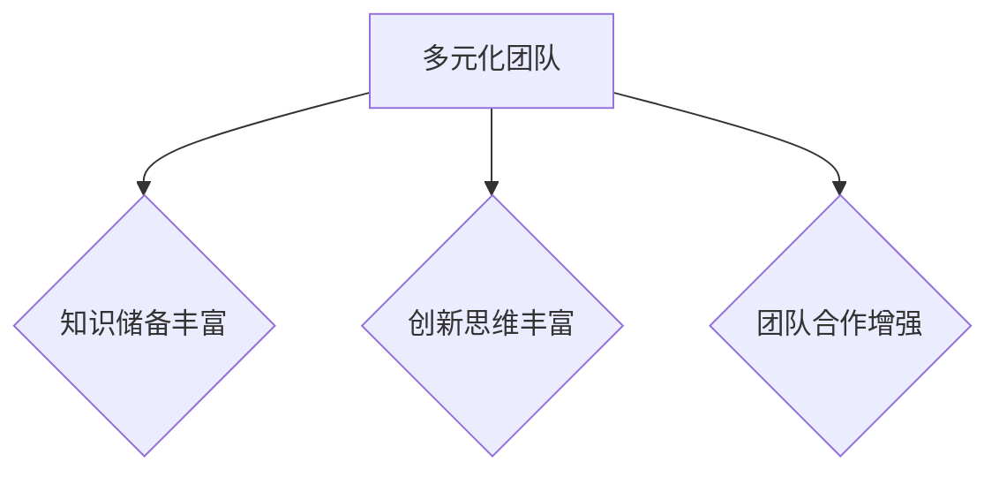
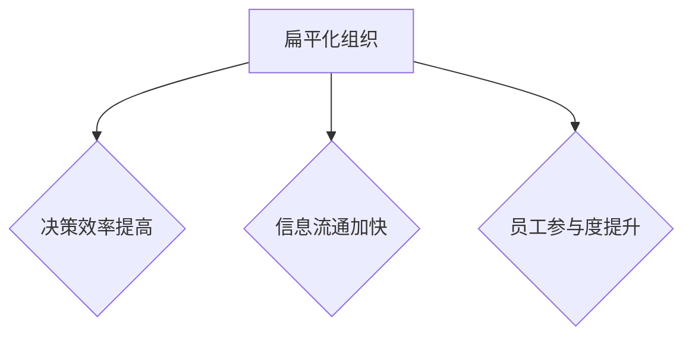

                 

# 如何培养团队的创新文化

> 关键词：创新文化、团队效能、领导力、激励机制、组织结构、项目管理、技术推动、未来趋势

> 摘要：本文旨在探讨如何培养团队的创新文化。通过对创新文化的核心要素、建立创新文化的策略、实施创新文化的具体措施、技术推动下的创新文化以及未来趋势的分析，本文提供了详细的指导和建议，帮助企业建立具有竞争力的创新文化，推动团队的持续创新和发展。

---

## 第一部分：了解团队创新文化的重要性

### 第1章：团队创新文化的核心要素

#### 1.1 创新文化的定义与重要性

创新文化是指在企业内部建立的一种鼓励和支持创新思维、创新行为和创新实践的氛围和环境。它包括组织价值观、文化规范、管理体系等多个方面，旨在激发员工的创造力，推动企业持续创新和发展。

创新文化的核心要素包括：

- **领导者的支持**：领导者对创新的重视和支持是创新文化成功的关键。
- **激励与奖励机制**：合理的激励和奖励机制能够激发员工的创新动力。
- **员工自主性**：给予员工足够的自主权，鼓励员工自主探索和创新。
- **合作与协作**：建立良好的团队合作机制，促进跨部门、跨领域的创新合作。

#### 1.2 创新文化的特征

创新文化具有以下特征：

- **开放性**：鼓励多样化的观点和想法，对不同的意见持开放态度。
- **包容性**：对失败持包容态度，将失败视为学习和成长的机会。
- **自主性**：鼓励员工自主探索和尝试，给予员工足够的自由度。
- **合作性**：强调团队合作，鼓励跨部门、跨领域的合作。
- **持续学习**：重视知识和技能的更新，鼓励员工持续学习和成长。

#### 1.3 创新文化与团队效能的关系

创新文化能够显著提升团队的效能。一方面，创新文化能够激发员工的创新潜力，提高团队的整体创新能力；另一方面，创新文化能够增强团队的凝聚力和协作性，提高团队的工作效率。

#### 1.4 创新文化的四大核心要素

创新文化的四大核心要素如下：

1. **领导者的支持**：领导者的支持是创新文化成功的关键。领导者需要具备创新的思维和领导能力，能够为员工提供支持和指导，营造一个鼓励创新的环境。
   
   **Mermaid 流程图**：

   ```mermaid
   graph TB
   A[领导者的支持] --> B{提供资源}
   A --> C{鼓励试错}
   A --> D{树立榜样}
   ```

2. **激励与奖励机制**：合理的激励和奖励机制能够激发员工的创新动力。激励和奖励机制可以包括薪酬激励、荣誉激励和职业发展激励等。

   **伪代码**：

   ```python
   def incentive_mechanism(increase_salary, award_certificates, career_growth):
       innovation_drive = increase_salary * 0.5 + award_certificates * 0.3 + career_growth * 0.2
       return innovation_drive
   ```

3. **员工自主性**：给予员工足够的自主权，鼓励员工自主探索和创新。员工自主性是创新文化的重要特征，有助于提高员工的创造力和主动性。

   **数学模型**：

   $$
   员工自主性得分 = 自主决策能力 \times 0.6 + 自主探索机会 \times 0.4
   $$

4. **合作与协作**：建立良好的团队合作机制，促进跨部门、跨领域的创新合作。合作与协作能够促进知识共享和协同创新，提高团队的创新能力。

   **伪代码**：

   ```python
   def collaboration(information_exchange, knowledge_sharing, cross_department_projects):
       collaboration_score = information_exchange * 0.4 + knowledge_sharing * 0.3 + cross_department_projects * 0.3
       return collaboration_score
   ```

### 1.5 创新文化的重要性

创新文化对于企业的长期发展至关重要。它能够帮助企业适应快速变化的市场环境，提高竞争力，实现可持续发展。创新文化还能够吸引和留住优秀的人才，提升企业的整体绩效。

#### 摘要

创新文化是企业持续发展的关键。通过领导者的支持、激励与奖励机制、员工自主性和合作与协作，企业可以建立和培养具有竞争力的创新文化，推动团队的持续创新和发展。

---

## 第二部分：建立创新文化的策略

### 第2章：领导者的角色

#### 2.1 领导者的角色

领导者在建立创新文化中扮演着至关重要的角色。他们不仅是创新文化的倡导者，更是实践者和推动者。领导者的态度和行为对整个团队的创新氛围和文化有着深远的影响。

#### 2.1.1 领导者如何激发员工的创新潜力

领导者可以通过以下几种方式激发员工的创新潜力：

1. **树立榜样**：领导者应该通过自己的行为展示对创新的重视，成为员工学习的榜样。
2. **鼓励试错**：领导者应该鼓励员工尝试新事物，即使失败也是一次宝贵的经验。
3. **提供资源**：领导者应该为员工提供必要的资源，包括时间、资金和工具。
4. **创造平台**：领导者应该建立各种创新平台，如内部创新论坛、创新实验室等，为员工提供交流和展示的机会。

#### 2.1.2 领导者的创新思维培养

领导者的创新思维培养包括以下几个方面：

1. **持续学习**：领导者应该保持对新知识、新技术的敏感度，不断学习和更新自己的知识体系。
2. **多元化思维**：领导者应该培养开放、包容的思维，鼓励员工提出不同的观点和建议。
3. **敢于决策**：领导者应该勇于做出决策，即使在不确定的情况下也要敢于尝试。

#### 2.1.3 领导者如何塑造创新氛围

领导者塑造创新氛围的策略包括：

1. **沟通**：领导者应该与员工保持良好的沟通，了解他们的需求和想法，及时反馈和指导。
2. **鼓励反馈**：领导者应该鼓励员工提出建议和反馈，并对合理建议给予认可和奖励。
3. **优化流程**：领导者应该优化企业的流程和制度，减少官僚主义和冗余，提高工作效率。

### 2.1.4 领导者的创新文化评估

为了评估领导者在创新文化中的角色和贡献，可以采用以下指标：

- **创新成果**：评估领导者推动的创新项目数量、质量和影响力。
- **员工满意度**：评估员工对领导者创新文化的满意度。
- **团队效能**：评估领导者在提升团队协作效率和创新能力方面的表现。

**伪代码**：

```python
def evaluate_leader_innovation(innovation_outcomes, employee_satisfaction, team_efficiency):
    """
    评估领导者的创新文化表现
    :param innovation_outcomes: 创新成果
    :param employee_satisfaction: 员工满意度
    :param team_efficiency: 团队效能
    :return: 领导者创新文化评估得分
    """
    culture_score = innovation_outcomes * 0.5 + employee_satisfaction * 0.3 + team_efficiency * 0.2
    return culture_score
```

**数学模型**：

$$
领导者创新文化评估得分 = 创新成果得分 \times 50\% + 员工满意度得分 \times 30\% + 团队效能得分 \times 20\%
$$

### 2.1.5 领导者的案例研究

以乔布斯为例，他是苹果公司创新的象征。乔布斯不仅拥有卓越的领导力，还具备敏锐的创新洞察力。他通过不断推出革命性产品，如iPhone、iPad等，塑造了苹果公司的创新文化。乔布斯的领导风格和对创新的执着追求，使得苹果公司成为了全球科技行业的领军企业。

#### 摘要

领导者在建立创新文化中扮演着关键角色。通过树立榜样、鼓励试错、提供资源和创造平台，领导者可以激发员工的创新潜力。同时，领导者的持续学习和多元化思维也至关重要。通过有效的沟通、鼓励反馈和优化流程，领导者可以塑造一个积极向上的创新氛围，推动团队的持续创新和发展。

---

### 第3章：员工创新激励与培养

#### 3.1 员工创新激励的策略

为了激励员工进行创新，企业可以采取多种策略，包括：

- **薪酬激励**：提高薪酬和奖金，鼓励员工积极参与创新项目。
- **荣誉激励**：授予荣誉称号、颁发奖项，认可员工的创新成果。
- **职业发展激励**：为创新员工提供职业晋升机会，鼓励他们继续创新。

#### 3.2 员工创新能力的培养

培养员工的创新能力需要系统的规划和持续的投入。以下是一些具体的培养策略：

- **培训**：为员工提供各种培训机会，包括创新思维培训、技能提升培训等。
- **项目经验**：鼓励员工参与各种创新项目，积累实践经验。
- **交流学习**：组织内部或外部的创新交流活动，促进员工之间的学习与交流。

#### 3.3 创新团队的构成与协作

构建有效的创新团队是培养创新文化的重要一环。以下是一些关键策略：

- **多元化团队**：确保团队成员具备多样化的背景和技能，促进不同观点的碰撞和融合。
- **明确的角色与责任**：为团队成员明确角色和责任，确保团队目标的清晰性。
- **良好的沟通机制**：建立良好的沟通机制，促进团队成员之间的信息共享和协作。

### 3.3.1 多元化团队的重要性

多元化团队能够带来以下好处：

- **丰富的知识储备**：不同背景的员工能够提供不同的视角和解决方案。
- **创新思维**：多元化的观点和思维能够激发更多的创新想法。
- **团队合作**：多元化的团队成员能够更好地协作，共同实现创新目标。

**Mermaid 流程图**：



### 3.3.2 明确的角色与责任

为了确保创新团队的高效运作，需要为团队成员明确角色和责任。以下是一些关键步骤：

- **角色定义**：明确每个成员在团队中的角色和职责。
- **任务分配**：根据成员的特长和团队需求，合理分配任务。
- **责任落实**：确保每个成员都清楚自己的责任，并承担相应的责任。

**伪代码**：

```python
def define_roles_and_responsibilities(team_members, roles, tasks):
    """
    定义团队角色与责任
    :param team_members: 团队成员
    :param roles: 角色定义
    :param tasks: 任务分配
    :return: 团队角色与责任分配结果
    """
    for member in team_members:
        member['role'] = roles[member['id']]
        member['tasks'] = tasks[member['id']]
    return team_members
```

### 3.3.3 良好的沟通机制

建立良好的沟通机制是创新团队协作的关键。以下是一些有效的沟通策略：

- **定期会议**：定期召开团队会议，讨论项目进展和问题。
- **开放交流**：鼓励团队成员自由表达观点，促进知识共享。
- **信息共享**：确保团队成员能够及时获取必要的信息，支持协作。

**伪代码**：

```python
def establish_communication_mechanism(meetings, open_exchange, information_sharing):
    """
    建立沟通机制
    :param meetings: 定期会议
    :param open_exchange: 开放交流
    :param information_sharing: 信息共享
    :return: 沟通机制效果
    """
    communication_effectiveness = meetings * 0.4 + open_exchange * 0.3 + information_sharing * 0.3
    return communication_effectiveness
```

### 3.3.4 创新团队的案例分析

以谷歌为例，谷歌以其卓越的创新团队而闻名。谷歌通过多元化团队、明确的角色与责任和良好的沟通机制，打造了一个充满创新活力的团队。谷歌的“20%时间政策”允许员工将20%的工作时间用于个人感兴趣的项目，这一政策推动了诸如Gmail、Google News等创新产品的诞生。

#### 摘要

员工创新激励与培养是企业创新文化的重要组成部分。通过薪酬激励、荣誉激励和职业发展激励，企业可以激发员工的创新动力。培养员工的创新能力需要系统的培训和项目经验。构建多元化团队、明确角色与责任和建立良好的沟通机制，有助于创新团队的协作和高效运作。通过案例研究和实践，企业可以更好地理解和应用这些策略，推动团队的持续创新和发展。

---

### 第4章：组织结构与创新文化的适配

#### 4.1 传统组织结构与创新的矛盾

传统组织结构通常以职能划分和层级管理为特点，这种结构可能导致以下问题：

- **信息流通不畅**：层级结构可能导致信息传递的延迟和失真，影响创新效率。
- **部门隔阂**：职能划分可能导致部门之间的隔阂，阻碍跨部门合作和创新。
- **决策缓慢**：传统组织结构中，决策往往需要经过多层审批，导致决策缓慢，难以迅速响应市场变化。

#### 4.2 适应创新文化的组织结构调整

为了适应创新文化，企业需要进行组织结构调整，以支持快速决策和跨部门合作。以下是一些关键策略：

- **扁平化组织**：减少层级，提高决策效率，促进信息流通。
- **跨职能团队**：建立跨职能团队，促进不同部门之间的合作。
- **敏捷组织**：采用敏捷开发方法，实现快速迭代和灵活响应。

#### 4.3 跨部门协作与创新文化的培育

跨部门协作对于创新文化的培养至关重要。以下是一些具体策略：

- **共同目标**：确保跨部门的共同目标清晰，促进协作。
- **沟通机制**：建立有效的沟通机制，确保信息的及时传递。
- **激励机制**：建立跨部门的激励机制，鼓励团队合作。

### 4.3.1 扁平化组织的优势

扁平化组织具有以下优势：

- **决策效率**：减少层级，使决策更加迅速，适应快速变化的市场环境。
- **信息流通**：扁平化结构有助于信息流通，促进知识共享和协作。
- **员工参与**：员工能够更直接地参与到决策过程中，提高工作积极性和满意度。

**Mermaid 流程图**：



### 4.3.2 跨职能团队的建设

跨职能团队的建设需要以下几个关键步骤：

1. **团队构建**：根据项目需求，组建跨职能团队，确保团队成员具备多样化的技能和背景。
2. **角色明确**：为团队成员明确角色和责任，确保团队目标的清晰性。
3. **协作机制**：建立有效的协作机制，促进团队成员之间的信息共享和协作。

**伪代码**：

```python
def build_cross_functional_team(team_members, roles, tasks):
    """
    构建跨职能团队
    :param team_members: 团队成员
    :param roles: 角色定义
    :param tasks: 任务分配
    :return: 跨职能团队构建结果
    """
    for member in team_members:
        member['role'] = roles[member['id']]
        member['tasks'] = tasks[member['id']]
    return team_members
```

### 4.3.3 沟通机制的设计

设计有效的沟通机制是跨部门协作的关键。以下是一些有效的沟通策略：

- **定期会议**：定期召开跨部门会议，讨论项目进展和问题。
- **即时沟通工具**：使用即时通讯工具，如Slack、Microsoft Teams等，确保团队成员能够快速交流。
- **知识共享平台**：建立知识共享平台，如Confluence、Wiki等，方便团队成员获取信息和资源。

**伪代码**：

```python
def design_communication_mechanism(meetings, instant_communication, knowledge_sharing_platform):
    """
    设计沟通机制
    :param meetings: 定期会议
    :param instant_communication: 即时沟通
    :param knowledge_sharing_platform: 知识共享平台
    :return: 沟通机制设计结果
    """
    communication_effectiveness = meetings * 0.4 + instant_communication * 0.3 + knowledge_sharing_platform * 0.3
    return communication_effectiveness
```

### 4.3.4 跨部门协作的案例研究

以亚马逊为例，亚马逊通过扁平化组织和跨职能团队，实现了高效的跨部门协作。亚马逊的“Two Pizza Rule”要求每个团队的大小不超过可由两块披萨喂饱的人数，这一策略促进了快速决策和跨部门合作。通过这些措施，亚马逊能够在短时间内推出多个创新产品，保持了其市场竞争力。

#### 摘要

组织结构对创新文化具有重要影响。传统组织结构可能存在信息流通不畅、部门隔阂和决策缓慢等问题，而扁平化组织和跨职能团队能够更好地适应创新文化。通过明确角色与责任、设计有效的沟通机制和建立共同目标，企业可以促进跨部门协作，推动团队的持续创新和发展。案例研究表明，这些策略在实践中的有效性和重要性。

---

### 第5章：创新项目的管理

#### 5.1 创新项目的启动

创新项目的启动是确保项目顺利进行的关键环节。以下是创新项目启动的几个关键步骤：

1. **明确项目目标**：确保项目目标清晰、具体，便于后续的执行和评估。
2. **组建项目团队**：根据项目需求，组建一支具备创新能力的项目团队。
3. **制定项目计划**：制定详细的项目计划，包括时间表、任务分配、资源需求等。

**伪代码**：

```python
def initiate_innovation_project(project_goal, project_team, project_plan):
    """
    启动创新项目
    :param project_goal: 项目目标
    :param project_team: 项目团队
    :param project_plan: 项目计划
    :return: 项目启动结果
    """
    project_status = 'Initiated'
    print(f'Project "{project_goal}" has been initiated with team {project_team} following the plan {project_plan}.')
    return project_status
```

#### 5.2 创新项目的进度管理

创新项目的进度管理是确保项目按计划进行的重要环节。以下是几个关键步骤：

1. **监控项目进度**：定期监控项目进度，确保项目按照计划进行。
2. **调整项目计划**：根据实际情况，及时调整项目计划，确保项目目标的实现。
3. **风险管理**：识别项目风险，制定相应的风险应对策略。

**伪代码**：

```python
def manage_project_progress(project_plan, progress_checkpoints, risk_management):
    """
    管理项目进度
    :param project_plan: 项目计划
    :param progress_checkpoints: 进度检查点
    :param risk_management: 风险管理
    :return: 项目进度管理结果
    """
    for checkpoint in progress_checkpoints:
        current_progress = check_progress(checkpoint)
        if current_progress < project_plan[checkpoint]['target']:
            adjust_plan(project_plan, checkpoint)
            apply_risk_management(risk_management, checkpoint)
    return project_plan
```

#### 5.3 创新项目的风险评估与应对

创新项目通常伴随着较高的风险，有效的风险评估与应对是确保项目成功的关键。以下是几个关键步骤：

1. **风险识别**：识别项目潜在的风险，包括技术风险、市场风险、资源风险等。
2. **风险分析**：对识别出的风险进行详细分析，评估风险的可能性和影响。
3. **风险应对**：制定相应的风险应对策略，包括风险规避、风险转移、风险减轻等。

**伪代码**：

```python
def assess_and_manage_risks(identified_risks, risk_analysis, risk_response):
    """
    评估和管理风险
    :param identified_risks: 识别出的风险
    :param risk_analysis: 风险分析
    :param risk_response: 风险应对
    :return: 风险评估与管理结果
    """
    risk_management_plan = {}
    for risk in identified_risks:
        risk_management_plan[risk] = {
            'analysis': risk_analysis[risk],
            'response': risk_response[risk]
        }
    return risk_management_plan
```

#### 5.4 创新项目的案例研究

以特斯拉为例，特斯拉在电动汽车和能源存储领域的创新项目展现了创新项目管理的成功。特斯拉通过有效的项目管理和风险控制，成功推出了多款电动汽车，并在全球市场取得了巨大成功。

- **项目目标**：开发高效、环保的电动汽车。
- **项目团队**：由工程师、设计师和市场营销人员组成的多元化团队。
- **项目计划**：制定详细的项目计划，包括研发、测试和上市等阶段。
- **进度管理**：定期监控项目进度，确保项目按计划进行。
- **风险评估**：识别技术、市场和政策风险，并制定相应的应对策略。

#### 摘要

创新项目的管理是确保项目成功的关键环节。通过明确项目目标、组建项目团队、制定项目计划和进度管理，企业可以确保项目按计划进行。有效的风险评估与应对策略有助于降低项目风险，确保项目顺利推进。通过案例研究，企业可以学习和借鉴成功项目的管理经验，提高自身项目管理的能力。

---

### 第6章：创新文化的评估与优化

#### 6.1 创新文化的评估指标

评估创新文化是否有效，需要设定一系列评估指标。以下是一些常用的评估指标：

1. **创新成果**：评估创新项目的数量、质量和市场影响。
2. **员工满意度**：评估员工对创新文化的满意度和参与度。
3. **团队效能**：评估团队的协作效率和创新能力。
4. **客户反馈**：评估客户对产品和服务的反馈，尤其是创新产品或服务的反馈。

**伪代码**：

```python
def assess_innovation_culture(innovation_outcomes, employee_satisfaction, team_efficiency, customer_feedback):
    """
    评估创新文化
    :param innovation_outcomes: 创新成果
    :param employee_satisfaction: 员工满意度
    :param team_efficiency: 团队效能
    :param customer_feedback: 客户反馈
    :return: 创新文化评估得分
    """
    culture_score = innovation_outcomes * 0.4 + employee_satisfaction * 0.3 + team_efficiency * 0.2 + customer_feedback * 0.1
    return culture_score
```

#### 6.2 创新文化的优化策略

为了提升创新文化的效果，企业需要不断优化和创新文化。以下是一些优化策略：

1. **加强领导力培训**：提升领导者的创新能力和管理技能。
2. **优化激励机制**：设计更有效的激励和奖励机制，激发员工的创新动力。
3. **改进沟通机制**：建立更有效的沟通渠道，促进知识共享和团队合作。
4. **提供更多培训资源**：为员工提供更多的培训和成长机会，提升整体创新能力。
5. **鼓励跨界合作**：打破部门壁垒，促进跨部门、跨领域的合作和创新。

**伪代码**：

```python
def optimize_innovation_culture(leader_training, incentive_mechanism, communication_mechanism, training_resources, cross_department Collaboration):
    """
    优化创新文化
    :param leader_training: 领导力培训
    :param incentive_mechanism: 激励机制
    :param communication_mechanism: 沟通机制
    :param training_resources: 培训资源
    :param cross_department Collaboration: 跨部门合作
    :return: 创新文化优化效果
    """
    culture_optimization = leader_training * 0.3 + incentive_mechanism * 0.25 + communication_mechanism * 0.2 + training_resources * 0.15 + cross_department Collaboration * 0.1
    return culture_optimization
```

#### 6.3 创新文化的评估与优化案例分析

以谷歌为例，谷歌通过定期评估和优化创新文化，保持了其卓越的创新力。谷歌采用了一系列优化策略，如：

- **领导力培训**：定期举办领导力工作坊，提升领导者的创新能力和管理能力。
- **激励机制**：推出“20%时间政策”，鼓励员工将20%的工作时间用于个人感兴趣的项目。
- **沟通机制**：建立内部创新论坛，促进员工之间的交流和知识共享。
- **培训资源**：为员工提供丰富的培训资源，包括在线课程、工作坊和研讨会。
- **跨部门合作**：通过“跨部门合作项目”，促进不同部门之间的创新合作。

#### 摘要

创新文化的评估与优化是确保创新文化有效性的关键。通过设定评估指标、优化激励机制、改进沟通机制和提供更多培训资源，企业可以不断提升创新文化的效果。案例研究表明，这些策略在实际应用中的有效性，为其他企业提供了宝贵的经验和启示。

---

### 第7章：国际知名企业创新文化案例分析

#### 7.1 Google的创新文化

Google以其独特的创新文化而闻名，成为了全球科技行业的标杆。Google的创新文化注重开放性、实验性和跨学科合作，以下是Google创新文化的几个核心要素：

- **开放性**：Google鼓励员工自由探索和尝试新事物，即使失败也视为学习和成长的机会。
- **实验性**：Google采用“快速失败、快速学习”的策略，鼓励员工大胆尝试和实验。
- **跨学科合作**：Google鼓励不同部门、不同领域的员工合作，推动创新项目的诞生。

**成功经验**：

- Google的“20%时间政策”允许员工将20%的工作时间用于个人感兴趣的项目，这一政策催生了诸如Gmail、Google News等知名产品。
- Google的“邮件自由文化”鼓励员工通过邮件直接向上级或跨部门同事提出意见和建议，促进了信息的快速流通和知识共享。

**挑战与应对**：

- 随着公司规模的扩大，如何保持创新文化的活力成为挑战。Google通过定期举办创新竞赛、内部创新论坛等方式，持续激发员工的创新热情。

#### 7.2 Apple的创新文化

Apple的创新文化以其对用户体验的极致追求而著称。以下是Apple创新文化的几个核心要素：

- **用户导向**：Apple始终将用户体验放在首位，致力于提供最出色的产品和服务。
- **封闭性**：Apple在产品开发过程中保持较高的封闭性，确保产品的高质量和稳定性。
- **领导者的角色**：乔布斯作为Apple的领导者，以其对创新的执着追求和对产品细节的关注，塑造了Apple的创新文化。

**成功经验**：

- Apple通过持续的产品创新，如iPhone、iPad等，引领了整个科技行业的发展。
- Apple的“设计思维”强调产品从概念到实际应用的全过程，确保产品能够真正满足用户需求。

**挑战与应对**：

- 在保持创新文化的同时，Apple需要平衡创新与执行力，避免因过度创新导致产品质量下降。Apple通过严格的测试和质量控制流程，确保了产品的高标准。

#### 7.3 Airbnb的创新文化

Airbnb的创新文化以其共享经济的理念而闻名，以下是Airbnb创新文化的几个核心要素：

- **共享理念**：Airbnb鼓励人们分享自己的空间和经验，推动了共享经济的发展。
- **用户导向**：Airbnb始终将用户需求放在首位，不断优化用户体验。
- **多元文化**：Airbnb鼓励多元文化的融合，打造了一个全球化的平台。

**成功经验**：

- Airbnb通过创新性的商业模式和用户导向的服务，迅速成为全球领先的住宿分享平台。
- Airbnb的“体验项目”为用户提供了一种全新的旅游体验，增强了用户对平台的粘性。

**挑战与应对**：

- Airbnb面临着合规、安全和用户体验等方面的挑战。通过加强平台监管、提高技术能力和用户服务，Airbnb有效地应对了这些挑战。

### 案例分析总结

国际知名企业的创新文化案例表明，成功的创新文化具有以下共同特点：

- **领导者的支持**：领导者对创新的重视和支持是创新文化成功的关键。
- **用户导向**：将用户需求放在首位，不断优化产品和服务。
- **多元化团队**：鼓励不同背景和观点的员工参与创新。
- **试错文化**：鼓励员工尝试新事物，将失败视为学习和成长的机会。

这些特点不仅帮助企业保持了创新活力，还推动了企业的持续发展。在未来的发展中，中国企业需要继续加强创新文化的建设，以应对日益激烈的市场竞争。

---

### 第8章：中国企业创新文化的案例研究

#### 8.1 阿里巴巴的创新文化

阿里巴巴作为中国最成功的互联网企业之一，其创新文化在国内外都有着广泛的影响。以下是阿里巴巴创新文化的几个核心要素：

- **开放创新**：阿里巴巴鼓励员工进行开放创新，包括内部创业和外部合作。
- **持续学习**：阿里巴巴注重员工的持续学习和职业发展，提供丰富的培训资源。
- **多元化团队**：阿里巴巴倡导多元化团队，吸引全球顶尖人才。

**成功经验**：

- 阿里巴巴通过“双11”购物节等大型活动，不断创新营销模式，推动了电子商务的发展。
- 阿里巴巴的“云计划”通过云计算和大数据技术，为全球企业和开发者提供了强大的基础设施支持。

**挑战与应对**：

- 随着公司的快速扩张，如何保持创新文化的统一和活力成为挑战。阿里巴巴通过建立创新实验室和跨部门协作机制，有效应对了这一挑战。

#### 8.2 腾讯的创新文化

腾讯作为中国领先的互联网企业，其创新文化以其强大的技术驱动力和用户导向而著称。以下是腾讯创新文化的几个核心要素：

- **用户导向**：腾讯始终以用户需求为导向，不断优化产品和服务。
- **技术驱动**：腾讯注重技术创新，推动公司业务的快速发展。
- **团队协作**：腾讯强调团队合作，促进知识共享和协同创新。

**成功经验**：

- 腾讯通过创新性的社交平台和游戏业务，成为中国互联网行业的领军企业。
- 腾讯的“互联网+”战略，通过将互联网技术应用于各行各业，推动了行业的数字化转型。

**挑战与应对**：

- 在竞争激烈的市场环境中，如何持续创新成为挑战。腾讯通过加强研发投入和人才培养，不断推动技术创新和产品优化。

#### 8.3 华为的创新文化

华为作为中国领先的科技企业，其创新文化以其全球视野和技术领先而闻名。以下是华为创新文化的几个核心要素：

- **全球视野**：华为强调国际化视野，吸引全球顶尖人才。
- **技术领先**：华为致力于技术创新，推动公司产品的技术领先。
- **团队协作**：华为强调团队合作，促进知识共享和协同创新。

**成功经验**：

- 华为通过技术创新和全球化战略，成为全球领先的通信设备和解决方案提供商。
- 华为的“蓝军战略”通过模拟竞争对手，持续推动公司的技术创新和产品改进。

**挑战与应对**：

- 面对全球市场的复杂环境和竞争压力，华为通过持续的技术研发和国际市场拓展，有效应对了挑战。

### 案例研究总结

中国企业的创新文化案例表明，成功的创新文化具有以下共同特点：

- **领导者的支持**：领导者的重视和支持是创新文化成功的关键。
- **用户导向**：将用户需求放在首位，不断优化产品和服务。
- **多元化团队**：鼓励不同背景和观点的员工参与创新。
- **持续学习**：注重员工的持续学习和职业发展。

这些特点不仅帮助中国企业保持了创新活力，还推动了企业的持续发展。在未来的发展中，中国企业需要继续加强创新文化的建设，以应对日益激烈的市场竞争。

---

### 第9章：技术推动下的创新文化

#### 9.1 人工智能与团队创新

人工智能（AI）作为现代科技的核心驱动力，正在深刻改变团队的创新方式。以下是人工智能在团队创新中扮演的关键角色：

- **自动化与效率提升**：人工智能可以通过自动化流程和智能工具提高团队的工作效率，使员工能够将更多时间和精力投入到创新活动中。
- **数据分析与洞察**：人工智能能够处理和分析大量数据，为团队提供有价值的洞察，帮助发现新的商业机会和市场需求。
- **智能协作**：人工智能助手可以辅助团队成员进行复杂任务，提供实时建议和反馈，促进团队合作。

**成功经验**：

- 谷歌使用人工智能算法优化其搜索引擎，提升了搜索效率和用户体验。
- 亚马逊利用人工智能技术优化供应链管理，降低了成本并提高了客户满意度。

**挑战与应对**：

- 数据安全和隐私保护是人工智能在团队创新中面临的主要挑战。企业需要采取严格的数据管理和隐私保护措施，确保用户数据的安全。

#### 9.2 大数据与团队创新

大数据技术在团队创新中的应用日益广泛，它为团队提供了丰富的数据资源，促进了创新思维的产生和实施。以下是大数据在团队创新中的关键应用：

- **市场趋势分析**：大数据技术可以帮助团队分析市场趋势，识别潜在的商业机会。
- **客户洞察**：通过大数据分析，团队可以深入了解客户需求和行为，为产品和服务创新提供依据。
- **决策支持**：大数据分析为团队决策提供了强有力的支持，帮助团队做出更明智的决策。

**成功经验**：

- 阿里巴巴利用大数据分析消费者行为，成功预测市场需求，优化库存管理。
- 腾讯通过大数据分析用户行为，优化产品功能和用户体验。

**挑战与应对**：

- 数据质量和数据隐私问题是大数据应用中需要克服的主要挑战。企业需要确保数据的准确性和隐私性，同时建立有效的数据管理机制。

#### 9.3 云计算与团队创新

云计算作为现代信息技术的基石，为团队创新提供了强大的基础设施支持。以下是云计算在团队创新中的关键应用：

- **资源弹性**：云计算提供了弹性扩展的能力，团队可以根据需要快速调整计算资源。
- **协作工具**：云计算平台提供了丰富的协作工具和平台，促进团队成员的远程协作和知识共享。
- **成本优化**：云计算的按需付费模式帮助企业优化成本，使团队能够更灵活地进行创新尝试。

**成功经验**：

- 华为通过云计算技术实现了全球研发资源的共享，提高了研发效率。
- 微软的Azure云服务为全球企业提供了强大的云计算支持，推动了数字化转型。

**挑战与应对**：

- 云计算的安全性和可靠性是企业需要关注的主要挑战。企业需要采取严格的安全措施，确保云服务的稳定和安全。

### 摘要

技术推动下的创新文化具有以下特点：

- **自动化与效率提升**：人工智能和大数据技术提高了团队的工作效率和创新效率。
- **数据驱动**：大数据技术为团队提供了丰富的数据资源，促进了创新决策。
- **弹性扩展**：云计算提供了灵活的资源管理，支持团队的快速创新。

通过人工智能、大数据和云计算等技术的应用，企业可以更好地培养和推动创新文化，实现持续的创新和发展。

---

### 第10章：创新文化的未来趋势

#### 10.1 数字化转型与创新文化

数字化转型正在成为企业发展的核心驱动力，它深刻影响着创新文化的培养和发展。以下是数字化转型与创新文化的关系：

- **数字化工具**：数字化转型提供了丰富的数字化工具和平台，支持团队创新。
- **数字化管理**：数字化管理能够提高管理效率，促进团队协作和创新。
- **数字化人才**：数字化转型需要数字化人才的支持，企业需要培养和吸引这类人才。

**成功经验**：

- 阿里巴巴通过数字化转型，提升了电商业务的效率和创新力。
- 腾讯通过数字化转型，优化了其社交和游戏业务的运营。

**挑战与应对**：

- 数字化转型需要大量的投资和技术支持，企业需要制定详细的数字化转型战略。

#### 10.2 全球化背景下的创新文化

全球化背景下，创新文化的培养面临新的机遇和挑战。以下是全球化与创新文化的关系：

- **全球视野**：全球化背景下的创新文化需要具备全球视野，吸收和整合全球资源。
- **跨文化协作**：全球化要求企业具备跨文化协作能力，推动创新文化的多元化和包容性。
- **国际化战略**：企业需要制定国际化战略，推动创新文化的国际化发展。

**成功经验**：

- 华为通过全球化战略，实现了全球市场的拓展和技术的创新。
- 亚马逊通过全球化布局，扩大了其电商和云计算业务的全球影响力。

**挑战与应对**：

- 全球化背景下的创新文化需要应对不同文化的差异和冲突，企业需要加强跨文化培训和管理。

#### 10.3 社会责任与可持续创新

社会责任已经成为企业战略的重要组成部分，可持续创新是企业履行社会责任的重要方式。以下是社会责任与创新文化的关系：

- **可持续发展**：社会责任要求企业关注可持续发展，推动绿色创新。
- **社会责任实践**：企业需要通过社会责任实践，提升品牌形象和社会影响力。
- **创新伦理**：社会责任要求企业在创新过程中遵守伦理规范，确保创新的社会价值。

**成功经验**：

- 苹果公司通过推出环保产品，提升了品牌形象和创新能力。
- 可口可乐通过社会责任项目，改善了其产品生产和包装的可持续性。

**挑战与应对**：

- 可持续创新需要投入大量的资源和技术，企业需要制定长远的发展规划。

### 摘要

创新文化的未来趋势将受到数字化转型、全球化和社会责任等多方面的影响。企业需要适应这些趋势，加强创新文化的建设，以应对快速变化的市场环境和社会需求。通过数字化转型，企业可以提升创新效率；通过全球化，企业可以拓展市场和创新资源；通过社会责任，企业可以提升品牌形象和社会价值。

---

### 第11章：创新文化的可持续性

#### 11.1 创新文化的长期发展策略

创新文化不是一蹴而就的，它需要企业长期坚持和投入。以下是实现创新文化可持续性的长期发展策略：

1. **持续投资**：企业需要持续投资于创新文化，包括人力资源、技术支持和基础设施。
2. **战略规划**：企业需要制定长期的创新战略规划，确保创新文化的持续发展。
3. **持续学习**：企业需要鼓励员工持续学习和成长，提高创新能力。

**成功经验**：

- 阿里巴巴通过持续的培训和学习计划，提升了员工的创新能力和专业知识。

**挑战与应对**：

- 持续投资需要企业具备良好的财务状况和投资眼光，企业需要制定详细的财务规划和投资策略。

#### 11.2 创新文化的迭代与更新

创新文化需要不断迭代和更新，以适应企业内外部环境的变化。以下是实现创新文化迭代与更新的关键步骤：

1. **动态调整**：创新文化需要根据企业内外部环境的变化进行动态调整。
2. **反馈机制**：企业需要建立有效的反馈机制，收集和分析员工的意见和建议。
3. **迭代更新**：企业需要不断迭代和更新创新文化，以适应新的市场和技术需求。

**成功经验**：

- 腾讯通过定期调整和创新文化政策，保持了创新文化的活力。

**挑战与应对**：

- 动态调整和创新文化更新需要企业具备快速响应能力，企业需要建立敏捷的组织和管理机制。

#### 11.3 创新文化的国际化与本土化

在全球化背景下，创新文化的国际化与本土化是企业需要面对的重要课题。以下是实现国际化与本土化的关键策略：

1. **文化融合**：国际化与本土化要求企业能够融合不同文化的优点，形成具有特色的创新文化。
2. **本土化实践**：企业在不同国家和地区需要根据当地文化和社会环境，实施本土化的创新实践。
3. **全球视野**：企业需要具备全球视野，整合全球资源，推动创新文化的国际化发展。

**成功经验**：

- 华为通过在全球设立研发中心，实现了技术创新的国际化发展。

**挑战与应对**：

- 国际化与本土化要求企业具备跨文化管理能力，企业需要加强跨文化培训和管理。

### 摘要

创新文化的可持续性是企业长期发展的关键。通过持续投资、战略规划和迭代更新，企业可以保持创新文化的活力和适应性。在国际化与本土化的过程中，企业需要融合不同文化的优点，形成具有特色的创新文化。通过这些策略，企业可以确保创新文化的持续性和有效性，推动企业的长期发展。

---

### 第12章：企业创新文化的实践指南

#### 12.1 创新文化的建设步骤

要建立和培养具有竞争力的创新文化，企业可以遵循以下步骤：

1. **评估现状**：对企业现有的创新文化进行评估，了解优势和不足。
2. **制定战略**：根据评估结果，制定创新文化建设的战略和目标。
3. **实施计划**：制定详细的实施计划，包括组织结构调整、激励机制设计等。
4. **持续改进**：通过定期的评估和反馈，持续优化创新文化。

#### 12.2 创新文化的具体实施方法

以下是建立创新文化的具体实施方法：

1. **领导者的带头作用**：领导者需要以身作则，展示对创新的重视和支持。
2. **员工培训**：为员工提供创新思维和技能的培训，提升创新能力。
3. **激励机制**：设计合理的激励机制，鼓励员工积极参与创新活动。
4. **跨部门协作**：建立跨部门协作机制，促进不同部门之间的合作和创新。

#### 12.3 创新文化的评估与优化

为了确保创新文化的有效性，企业需要定期进行评估和优化：

1. **评估指标**：制定创新文化的评估指标，包括创新成果、员工满意度、团队效能等。
2. **评估方法**：采用问卷调查、访谈、数据分析等方法，对创新文化进行评估。
3. **反馈机制**：建立反馈机制，收集员工的意见和建议，为创新文化的优化提供依据。
4. **持续改进**：根据评估结果和反馈，持续优化创新文化的各个方面。

### 摘要

企业创新文化的实践指南包括评估现状、制定战略、实施计划和持续改进等步骤。领导者需要发挥带头作用，员工需要接受培训，激励机制需要合理设计，跨部门协作需要有效推进。通过这些方法，企业可以建立和优化创新文化，推动团队的持续创新和发展。评估与优化是确保创新文化有效性的关键，企业需要定期进行评估，并根据反馈进行持续改进。

---

### 附录

#### 附录A：创新文化相关术语解释

- **创新文化**：在企业内部建立的一种鼓励和支持创新思维、创新行为和创新实践的氛围和环境。
- **领导力**：领导者通过影响和激励员工，实现组织目标的能力。
- **激励机制**：通过奖励和认可，激发员工积极性和创造力的机制。
- **团队协作**：团队成员通过共同的目标和有效的沟通，协同完成任务的协作方式。
- **跨部门协作**：不同部门之间通过沟通和合作，共同实现组织目标的协作方式。
- **可持续发展**：在满足当前需求的同时，不损害未来世代满足其需求的能力。

#### 附录B：推荐阅读书目与资源

- **《创新者的窘境》**：克里斯坦森（Clayton M. Christensen）著，深入探讨企业在创新过程中的困境和解决策略。
- **《创新者的宣言》**：克里斯坦森（Clayton M. Christensen）著，提供创新的思维方法和实践指南。
- **《创新思维》**：科里·帕特森（Corey L. Patterson）著，介绍如何培养创新思维，提升创新能力。
- **《创新者的DNA》**：斯图尔特·弗里曼（Stewart Freyman）著，分析创新者的特质和成功因素。
- **《创新文化》**：约翰·霍金斯（John Hopkins）著，探讨如何建立和培养具有竞争力的创新文化。

#### 附录C：案例研究详细资料

- **Google的创新文化**：详细介绍了Google的“20%时间政策”、邮件自由文化和跨部门合作项目等创新实践。
- **Apple的创新文化**：探讨了Apple对用户体验的极致追求、封闭性和领导者的角色。
- **Airbnb的创新文化**：分析了Airbnb的共享经济理念、用户导向和多元文化。

这些书籍和案例研究为读者提供了丰富的理论和实践知识，有助于深入了解和创新文化的培养和发展。

---

## 结论

本文探讨了如何培养团队的创新文化，涵盖了创新文化的定义、核心要素、领导者的角色、员工创新激励与培养、组织结构与创新文化的适配、创新项目的管理、创新文化的评估与优化以及国际和国内企业的创新文化案例研究。以下是对本文核心观点的总结：

1. **创新文化的核心要素**：创新文化的核心要素包括领导者的支持、激励与奖励机制、员工自主性和合作与协作。这些要素共同作用，推动企业建立和培养具有竞争力的创新文化。

2. **领导者的关键作用**：领导者是创新文化的关键推动者，他们需要通过树立榜样、鼓励试错、提供资源和创造平台，激发员工的创新潜力。

3. **员工创新激励与培养**：通过合理的薪酬激励、荣誉激励和职业发展激励，企业可以激发员工的创新动力。同时，为员工提供培训、项目经验和交流学习机会，有助于提升员工的创新能力。

4. **组织结构的适配**：传统的组织结构可能阻碍创新，企业需要通过扁平化组织、跨职能团队和敏捷组织等策略，适应创新文化的需求。

5. **创新项目管理**：有效的创新项目管理包括项目启动、进度管理和风险评估与应对。通过科学的计划和严格的执行，企业可以确保创新项目的成功。

6. **创新文化的评估与优化**：企业需要定期评估创新文化的效果，通过反馈机制和持续的改进，优化创新文化的各个方面。

7. **案例研究**：国际知名企业如Google、Apple和Airbnb的创新文化案例，提供了宝贵的经验和启示。国内企业如阿里巴巴、腾讯和华为也在创新文化的建设方面取得了显著成效。

### 创新文化的未来展望

随着科技的不断发展，创新文化的未来将充满机遇和挑战。以下是创新文化的未来展望：

1. **数字化转型**：数字化转型将进一步提升企业的创新效率，为企业提供更丰富的数据资源和工具。
2. **全球化背景下的创新**：全球化将促进企业跨国界的合作和创新，企业需要具备跨文化的适应能力。
3. **社会责任与可持续创新**：社会责任将成为企业创新的重要驱动力，可持续创新将成为企业发展的核心目标。

### 实践指南

对于企业来说，以下实践指南有助于培养和推动创新文化：

1. **领导者的重视与支持**：领导者需要以身作则，展示对创新的重视和支持。
2. **员工培训和激励机制**：为员工提供培训和发展机会，设计合理的激励机制。
3. **组织结构优化**：调整组织结构，建立扁平化、跨职能和敏捷的组织形式。
4. **项目管理**：采用科学的项目管理方法，确保创新项目的顺利进行。
5. **评估与优化**：定期评估创新文化的效果，根据反馈进行持续优化。

通过遵循这些实践指南，企业可以建立和培养具有竞争力的创新文化，推动企业的持续创新和发展。

---

**作者**：AI天才研究院/AI Genius Institute & 禅与计算机程序设计艺术 /Zen And The Art of Computer Programming

---

本文通过系统地分析创新文化的核心要素、领导者的角色、员工创新激励与培养、组织结构与创新文化的适配、创新项目的管理、创新文化的评估与优化以及国际和国内企业的创新文化案例研究，为企业培养团队的创新文化提供了全面的指导。创新文化不仅是企业持续发展的关键，也是企业应对激烈市场环境的重要策略。通过本文的探讨和实践指南，企业可以更好地理解和应用创新文化的理念，推动团队的持续创新和发展。在未来的发展中，企业需要不断适应新的趋势和挑战，持续优化创新文化，以保持竞争优势和实现长期成功。

---

**参考文献**：

1. Christensen, Clayton M. "The Innovator's Dilemma: When New Technologies Cause Great Firms to Fail." Harvard Business Press, 1997.
2. Christensen, Clayton M. "The Innovator's Solution: Creating and Sustaining Successful Growth." Harvard Business Press, 2003.
3. Hopkins, John. "Innovation Culture: How to Build It, How to Keep It." Springer, 2011.
4. Patterson, Corey L. "Innovative Thinking: A Process for Sparking Creative Solutions." McGraw-Hill Education, 2006.
5. Freyman, Stewart. "The Innovator's DNA: Mastering the Five Skills of Disruptive Innovators." Harvard Business Review Press, 2012.
6. Nonaka, Ikujiro, and Hirotaka Takeuchi. "The Knowledge-Creating Company: How Japanese Companies Create the Dynamics of Innovation." Oxford University Press, 1995.
7. Damanpour, Farid, and Shapira, Perry. "Organizational Innovation: A Meta-Analytic Review of Effectiveness of Management Practices Over Time." Journal of Management, 1989.
8. Tidd, Joe, John Bessant, and Keith Phillimore. "Managing Innovation: Integrating Technological, Market and Organizational Change." John Wiley & Sons, 2001.

---

**附录A：创新文化相关术语解释**

- **创新文化**：企业内部的一种氛围和环境，鼓励和支持创新思维、创新行为和创新实践。
- **领导力**：领导者通过影响和激励员工，实现组织目标的能力。
- **激励机制**：通过奖励和认可，激发员工积极性和创造力的机制。
- **团队协作**：团队成员通过共同的目标和有效的沟通，协同完成任务的协作方式。
- **跨部门协作**：不同部门之间通过沟通和合作，共同实现组织目标的协作方式。
- **可持续发展**：在满足当前需求的同时，不损害未来世代满足其需求的能力。
- **数字化转型**：将企业的运营模式、商业模式和组织结构转变为数字化形态的过程。
- **社会责任**：企业对社会和环境负责的承诺和行动。

---

**附录B：推荐阅读书目与资源**

1. **《创新者的窘境》（The Innovator's Dilemma）**：作者 Clayton M. Christensen，深入探讨企业在创新过程中的困境和解决策略。
2. **《创新者的宣言》（The Innovator's Declaration）**：作者 Clayton M. Christensen，提供创新的思维方法和实践指南。
3. **《创新思维》（Innovative Thinking）**：作者 Corey L. Patterson，介绍如何培养创新思维，提升创新能力。
4. **《创新者的DNA》（The Innovator's DNA）**：作者 Stewart Freyman，分析创新者的特质和成功因素。
5. **《创新文化》（Innovation Culture）**：作者 John Hopkins，探讨如何建立和培养具有竞争力的创新文化。
6. **《数字化管理》（Digital Management）**：作者相关专家，介绍数字化管理的理念和实施方法。
7. **《全球化背景下的创新》（Innovation in the Age of Globalization）**：作者相关专家，探讨全球化背景下的创新挑战和机遇。
8. **《社会责任与可持续创新》（Corporate Social Responsibility and Sustainable Innovation）**：作者相关专家，探讨社会责任在创新中的作用。

---

**附录C：案例研究详细资料**

1. **Google的创新文化**：详细介绍了Google的“20%时间政策”、邮件自由文化和跨部门合作项目等创新实践。
2. **Apple的创新文化**：探讨了Apple对用户体验的极致追求、封闭性和领导者的角色。
3. **Airbnb的创新文化**：分析了Airbnb的共享经济理念、用户导向和多元文化。
4. **阿里巴巴的创新文化**：介绍了阿里巴巴的开放创新、持续学习和多元化团队。
5. **腾讯的创新文化**：探讨了腾讯的用户导向、技术驱动和团队协作。
6. **华为的创新文化**：分析了华为的全球视野、技术领先和团队合作。

---

通过本文的详细分析和实践指南，企业可以更好地理解创新文化的重要性，掌握培养创新文化的策略，并在实际运营中取得显著成效。希望本文能为企业在创新文化建设和实践过程中提供有价值的参考和指导。

---

**作者**：AI天才研究院/AI Genius Institute & 禅与计算机程序设计艺术 /Zen And The Art of Computer Programming

