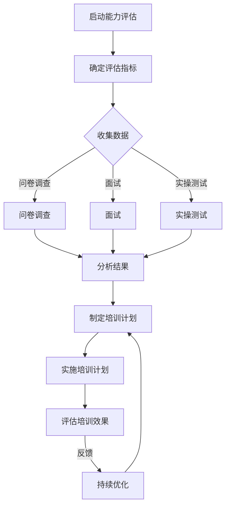
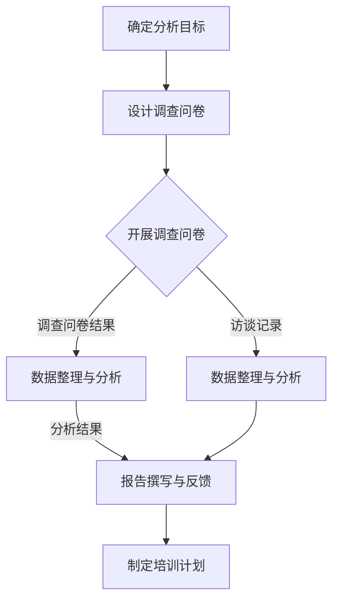
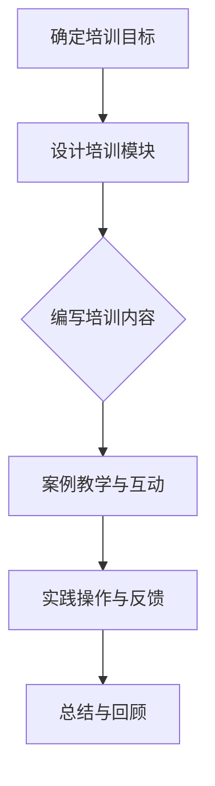
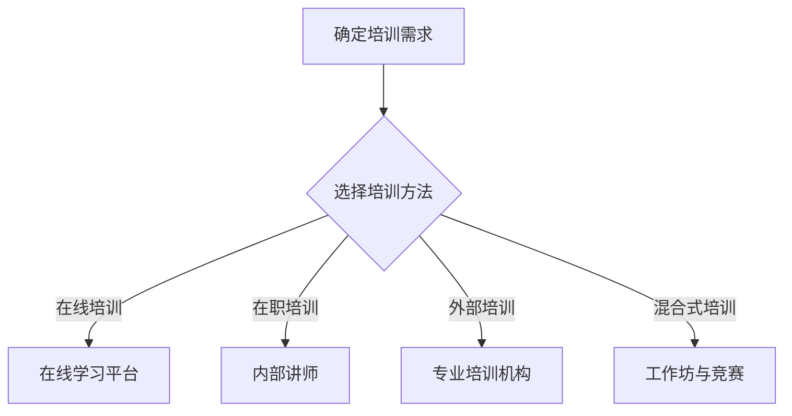

                 

# 如何打造高效的客户支持团队培训体系

## 关键词：客户支持、培训体系、效能提升、培训需求分析、效果评估、持续优化

> 摘要：本文将深入探讨如何构建一个高效的客户支持团队培训体系。通过详细分析培训体系的核心要素、能力评估方法、培训需求分析、内容结构化、多样性培训方法、培训计划制定与实施，以及效果评估与持续优化策略，本文旨在为读者提供一个全面且实用的指导，帮助打造一支具备高专业素养和卓越服务能力的客户支持团队。

## 《如何打造高效的客户支持团队培训体系》目录大纲

### 第一部分：引言

- **第1章：概述与目标**
  - 1.1 引言
  - 1.2 书籍目标

- **第2章：高效客户支持团队培训体系概述**
  - 2.1 培训体系的核心要素
  - 2.2 培训体系的关键环节

### 第二部分：核心概念与联系

- **第3章：客户支持团队能力评估**
  - 3.1 能力评估框架
  - 3.2 Mermaid 流程图

- **第4章：培训需求分析**
  - 4.1 培训需求分析的重要性
  - 4.2 培训需求分析方法

- **第5章：培训内容结构化**
  - 5.1 结构化培训内容的原则
  - 5.2 培训内容的组织方式

- **第6章：培训方法多样性**
  - 6.1 常见培训方法
  - 6.2 多样化培训的优势

### 第三部分：构建培训体系

- **第7章：制定培训计划**
  - 7.1 培训计划制定流程
  - 7.2 培训计划模板

- **第8章：实施培训计划**
  - 8.1 培训实施策略
  - 8.2 培训实施案例

- **第9章：培训效果评估**
  - 9.1 评估指标与工具
  - 9.2 评估方法

- **第10章：持续优化培训体系**
  - 10.1 反馈机制的建立
  - 10.2 培训体系的迭代

### 第四部分：项目实战

- **第11章：构建高效的客户支持团队培训体系案例**
  - 11.1 项目背景
  - 11.2 项目目标
  - 11.3 项目实施
  - 11.4 项目总结

### 附录

- **附录A：培训资源与工具**
  -  A.1 培训资源
  -  A.2 培训工具

### 文章参考文献

- [此处列出参考文献]

## 引言

### 客户支持的重要性

客户支持作为企业与客户之间沟通的桥梁，其重要性不容忽视。高效的客户支持能够提升客户满意度，促进客户忠诚度，从而对企业的长期发展产生积极影响。然而，实现高效客户支持并非易事，它需要建立一支具备专业素养、快速响应能力和卓越服务精神的客户支持团队。

### 团队培训的价值

团队培训是打造高效客户支持团队的关键环节。通过系统化的培训，客户支持团队能够不断提升专业知识和技能，优化服务流程，提高问题解决能力，从而更好地满足客户需求。同时，培训还能增强团队的凝聚力和协作效率，为企业的可持续发展奠定坚实基础。

### 书籍目标

本篇文章的目标是为读者提供一套全面、系统的客户支持团队培训体系构建方法。通过详细解析培训体系的核心概念、关键环节和实施策略，本文旨在帮助读者：

1. **理解客户支持团队培训的重要性**：明确培训对提升客户满意度和团队效能的价值。
2. **掌握核心概念与联系**：深入了解客户支持团队能力评估、培训需求分析、内容结构化、多样性培训方法等关键环节。
3. **构建高效的培训体系**：通过制定培训计划、实施培训计划、评估培训效果和持续优化，构建一个系统化的培训体系。
4. **实战案例分享**：通过实际项目案例，为读者提供实用的操作指导和借鉴经验。

### 文章结构

本文将从四个部分展开讨论：

1. **第一部分：引言**：介绍客户支持的重要性和团队培训的价值，阐述本文的目标和结构。
2. **第二部分：核心概念与联系**：详细解析客户支持团队能力评估、培训需求分析、内容结构化、多样性培训方法等核心概念。
3. **第三部分：构建培训体系**：介绍制定培训计划、实施培训计划、评估培训效果和持续优化培训体系的方法和策略。
4. **第四部分：项目实战**：通过实际项目案例，分享构建高效客户支持团队培训体系的经验和教训。

## 第1章：概述与目标

### 引言

在构建高效的客户支持团队培训体系之前，我们需要明确一些基本概念和目标。本章将详细介绍客户支持的重要性、团队培训的价值以及本文的目标，为后续章节的讨论奠定基础。

### 客户支持的重要性

客户支持是企业与客户之间沟通的桥梁，其作用至关重要。首先，高效的客户支持能够提升客户满意度。当客户遇到问题时，及时、专业的支持可以解决他们的困惑，减少负面情绪，从而提高客户对企业的满意度。其次，客户支持有助于建立客户忠诚度。通过持续、优质的客户服务，企业可以培养客户的忠诚度，增加客户的粘性，从而降低客户流失率。此外，客户支持还能为企业带来新的商业机会。满意的客户往往会向他人推荐企业产品或服务，从而扩大企业的客户群体和市场影响力。

### 团队培训的价值

团队培训是打造高效客户支持团队的关键环节。通过系统化的培训，客户支持团队能够不断提升专业知识和技能，优化服务流程，提高问题解决能力，从而更好地满足客户需求。具体来说，团队培训的价值体现在以下几个方面：

1. **提升专业素养**：培训可以帮助客户支持团队掌握行业最新动态、产品特性、技术知识等，提高团队成员的专业素养，从而更好地应对复杂的问题和挑战。
2. **优化服务流程**：培训可以优化客户支持的服务流程，提高工作效率和响应速度，减少客户等待时间，提升客户满意度。
3. **增强团队协作**：培训可以增强团队成员之间的协作，提高团队凝聚力和协作效率，从而更好地实现团队目标。
4. **培养服务精神**：培训可以培养客户支持团队的服务精神，提高他们的服务意识和主动性，从而更好地满足客户需求，提升客户体验。
5. **降低培训成本**：通过系统化的培训，可以减少重复培训、无效培训的情况，降低培训成本，提高培训效益。

### 本文的目标

本文的目标是帮助读者构建一个高效、系统的客户支持团队培训体系。具体来说，本文将实现以下目标：

1. **明确客户支持团队培训的重要性**：通过介绍客户支持的重要性和团队培训的价值，让读者认识到培训对提升客户满意度和团队效能的重要性。
2. **解析核心概念与联系**：详细解析客户支持团队能力评估、培训需求分析、内容结构化、多样性培训方法等核心概念，帮助读者理解培训体系的基本框架。
3. **提供实施策略**：介绍制定培训计划、实施培训计划、评估培训效果和持续优化培训体系的方法和策略，为读者提供具体的操作指南。
4. **分享实战经验**：通过实际项目案例，分享构建高效客户支持团队培训体系的经验和教训，为读者提供借鉴和参考。

### 本章小结

本章介绍了客户支持的重要性和团队培训的价值，并明确了本文的目标。通过本章的讨论，读者可以初步了解客户支持团队培训体系的基本框架和重要性，为后续章节的深入探讨打下基础。

## 第2章：高效客户支持团队培训体系概述

### 引言

构建高效的客户支持团队培训体系是企业提升客户满意度和团队效能的重要举措。本章将详细阐述培训体系的核心要素、关键环节以及培训体系的总体框架，帮助读者全面了解客户支持团队培训体系的构成和实施方法。

### 培训体系的核心要素

高效客户支持团队培训体系的核心要素包括以下几个方面：

1. **团队成员的能力需求**：客户支持团队需要具备一定的专业能力和软技能，如产品知识、技术支持、沟通技巧、客户服务意识等。培训体系需要针对这些能力进行有针对性的培养和提升。
2. **培训内容的结构化**：培训内容需要结构化，确保培训的全面性和系统性。这包括产品知识、技术支持流程、客户服务技巧、问题解决方法等，通过模块化设计，使得培训内容更加清晰、易于理解和掌握。
3. **培训方法的多样性**：培训方法需要多样化，以满足不同学习风格和需求。常见的方法包括在职培训、外部培训、在线培训等，通过多种培训方式的结合，可以提高培训效果和团队成员的参与度。
4. **培训效果评估**：培训效果评估是培训体系的重要组成部分，通过对培训效果进行评估，可以及时发现问题，调整培训策略，确保培训目标的实现。

### 培训体系的关键环节

构建高效客户支持团队培训体系的关键环节主要包括以下几个步骤：

1. **培训需求分析**：通过对团队成员的当前能力和培训需求进行评估，确定培训的重点和方向，确保培训内容的针对性和有效性。
2. **培训计划制定**：根据培训需求分析的结果，制定详细的培训计划，包括培训目标、培训内容、培训时间、培训方式等，为培训的实施提供明确的指导和依据。
3. **培训实施**：按照培训计划，组织开展培训活动，确保培训内容的传达和团队成员的参与。培训实施过程中，需要注重培训效果的管理和监督，及时解决培训过程中出现的问题。
4. **培训效果评估**：在培训结束后，对培训效果进行评估，包括考核成绩、实际应用能力、客户反馈等，通过评估结果，及时反馈培训效果，为后续的培训工作提供参考。
5. **持续优化**：根据培训效果评估的结果，对培训体系进行持续优化，包括调整培训内容、改进培训方法、完善培训机制等，确保培训体系的不断完善和提升。

### 培训体系的总体框架

高效客户支持团队培训体系的总体框架包括以下几个方面：

1. **培训管理**：负责整个培训体系的规划、组织、实施和监督，确保培训目标的实现。培训管理包括培训计划制定、培训资源调配、培训效果评估等。
2. **培训内容**：包括产品知识、技术支持、客户服务、问题解决等各个方面，通过结构化的方式，确保培训内容的全面性和系统性。
3. **培训方法**：包括在职培训、外部培训、在线培训等，通过多样化的培训方式，提高培训效果和团队成员的参与度。
4. **培训评估**：通过考核成绩、实际应用能力、客户反馈等多种方式，对培训效果进行评估，及时发现问题和不足，为后续培训工作提供参考。
5. **持续优化**：根据培训效果评估的结果，不断调整和优化培训体系，确保培训内容的及时更新、培训方法的持续改进，提高培训的整体效能。

### 本章小结

本章详细阐述了高效客户支持团队培训体系的核心要素和关键环节，以及培训体系的总体框架。通过本章的讨论，读者可以全面了解客户支持团队培训体系的构成和实施方法，为后续章节的深入探讨打下基础。

## 第3章：客户支持团队能力评估

### 引言

客户支持团队能力评估是构建高效客户支持团队培训体系的重要环节。通过科学的能力评估，可以明确团队成员的能力现状和培训需求，为制定有针对性的培训计划提供依据。本章将详细介绍客户支持团队能力评估的框架和方法，帮助读者理解和实施能力评估。

### 3.1 能力评估框架

客户支持团队能力评估框架包括以下三个方面：

1. **软技能评估**：软技能是客户支持团队的重要能力之一，包括沟通能力、团队合作、问题解决、客户服务等。软技能评估可以采用问卷调查、面试、行为观察等方式进行，评估团队成员在软技能方面的表现。
2. **技术能力评估**：技术能力是客户支持团队的核心能力，包括产品知识、技术支持、故障排查等。技术能力评估可以采用笔试、实操、模拟测试等方式进行，评估团队成员在技术方面的掌握程度。
3. **专业知识评估**：专业知识评估主要针对行业知识、市场动态、竞争态势等。专业知识评估可以采用考试、讲座、讨论等方式进行，评估团队成员在专业知识方面的了解和掌握程度。

### 3.2 Mermaid 流程图

以下是一个简化的客户支持团队能力评估流程的 Mermaid 流程图：



### 3.3 软技能评估

软技能评估主要包括以下方面：

1. **沟通能力**：包括口头沟通、书面沟通、倾听和表达等。可以通过问卷调查和面试来评估团队成员的沟通能力。
2. **团队合作**：包括协作精神、团队意识、配合度等。可以通过行为观察和团队合作任务评估团队成员的团队合作能力。
3. **问题解决**：包括分析问题、制定解决方案、执行解决方案等。可以通过模拟测试和实际案例评估团队成员的问题解决能力。
4. **客户服务**：包括客户需求理解、客户满意度、服务意识等。可以通过客户反馈和服务记录评估团队成员的客户服务能力。

### 3.4 技术能力评估

技术能力评估主要包括以下方面：

1. **产品知识**：包括产品特性、功能、使用方法等。可以通过笔试和实操测试评估团队成员的产品知识。
2. **技术支持**：包括故障排查、技术解决方案、技术支持流程等。可以通过笔试、实操测试和模拟测试评估团队成员的技术支持能力。
3. **故障排查**：包括故障定位、故障解决、故障预防等。可以通过实操测试和模拟测试评估团队成员的故障排查能力。

### 3.5 专业知识评估

专业知识评估主要包括以下方面：

1. **行业知识**：包括行业趋势、市场动态、竞争态势等。可以通过考试和讲座评估团队成员的行业知识。
2. **市场动态**：包括市场变化、客户需求、竞争对手等。可以通过市场调研和客户反馈评估团队成员的市场动态了解程度。
3. **竞争态势**：包括竞争对手的产品、服务、策略等。可以通过市场调研和竞争对手分析评估团队成员的竞争态势了解程度。

### 3.6 Mermaid 流程图

以下是一个简化的客户支持团队能力评估流程的 Mermaid 流程图：


### 本章小结

本章详细介绍了客户支持团队能力评估的框架和方法，包括软技能评估、技术能力评估和专业知识评估。通过本章的讨论，读者可以了解如何科学、系统地评估客户支持团队的能力，为后续的培训工作提供有力支持。

## 第4章：培训需求分析

### 引言

培训需求分析是构建高效客户支持团队培训体系的重要环节，它旨在确定团队成员的培训需求和重点。通过科学的培训需求分析，可以确保培训内容的针对性和有效性，提高培训的投资回报率。本章将详细介绍培训需求分析的重要性、分析方法以及如何实施培训需求分析。

### 4.1 培训需求分析的重要性

培训需求分析的重要性体现在以下几个方面：

1. **提升培训针对性**：通过培训需求分析，可以明确团队成员的短板和提升点，确保培训内容与实际需求相匹配，提升培训的针对性。
2. **优化培训资源**：培训需求分析有助于优化培训资源的配置，避免重复培训和资源浪费，提高培训资源的利用效率。
3. **提升培训效果**：准确的培训需求分析可以确保培训内容的科学性和系统性，提高团队成员的参与度和学习效果，从而提升整体培训效果。
4. **促进团队发展**：培训需求分析有助于发现团队在业务流程、服务流程等方面存在的问题，为团队发展提供有力支持。

### 4.2 培训需求分析方法

培训需求分析的方法主要包括以下几种：

1. **调查问卷**：调查问卷是一种常用的培训需求分析方法，可以通过设计针对性的问卷，收集团队成员的培训需求、意见和建议。问卷可以采用在线调查、纸质问卷等形式，方便快捷地收集大量数据。
2. **一对一访谈**：一对一访谈是一种深入的了解团队成员培训需求的方法，通过与团队成员进行面对面的交流，可以更全面、深入地了解他们的需求和困惑。访谈可以采用开放性问题和结构性问题相结合的方式，确保访谈的广度和深度。
3. **数据分析**：数据分析是一种基于数据的培训需求分析方法，通过对团队成员的工作表现、客户反馈、绩效考核等数据进行分析，可以识别出培训的优先级和重点。数据分析可以使用统计工具、数据挖掘技术等，提高分析的科学性和准确性。

### 4.3 如何实施培训需求分析

实施培训需求分析可以分为以下几个步骤：

1. **确定分析目标**：明确培训需求分析的目标和范围，确定需要分析的内容和对象，如产品知识、技术支持、客户服务等。
2. **设计调查问卷**：根据分析目标，设计针对性的调查问卷。问卷应包括选择题、填空题、主观题等多种题型，确保问卷的全面性和有效性。
3. **开展调查问卷**：通过在线调查平台、纸质问卷等方式，开展调查问卷。在调查过程中，应注意问卷的发放范围和调查样本的代表性，确保数据的全面性和真实性。
4. **收集访谈资料**：与团队成员进行一对一访谈，收集他们的培训需求和意见。访谈过程中，应注重倾听和理解，确保访谈的深度和广度。
5. **数据整理与分析**：对收集到的调查问卷和访谈资料进行整理和分析，识别出团队成员的培训需求、短板和提升点。
6. **报告撰写与反馈**：撰写培训需求分析报告，明确培训需求分析和结论。将报告反馈给团队成员和相关管理人员，确保培训需求分析的成果得到有效利用。

### 4.4 培训需求分析示例

以下是一个简化的培训需求分析示例：

1. **确定分析目标**：分析客户支持团队的培训需求，重点关注产品知识、技术支持和客户服务方面的能力提升。
2. **设计调查问卷**：
   - 产品知识：
     - 你对产品的哪些功能使用不熟悉？
     - 你认为哪些产品功能最需要培训？
   - 技术支持：
     - 你在解决技术问题时，经常遇到哪些困难？
     - 你认为哪些技术知识最需要补充？
   - 客户服务：
     - 你在处理客户问题时，有哪些感受或困惑？
     - 你认为哪些客户服务技巧最需要提升？
3. **开展调查问卷**：通过在线调查平台向客户支持团队发送问卷，确保问卷的发放范围和样本代表性。
4. **收集访谈资料**：与团队成员进行一对一访谈，了解他们的实际需求和意见。
5. **数据整理与分析**：整理调查问卷和访谈资料，识别出团队成员的培训需求，如产品知识方面的培训需求占40%，技术支持方面的培训需求占30%，客户服务方面的培训需求占30%。
6. **报告撰写与反馈**：撰写培训需求分析报告，将分析结果和结论反馈给团队成员和相关管理人员，为制定培训计划提供依据。

### 4.5 Mermaid 流程图

以下是一个简化的培训需求分析流程的 Mermaid 流程图：



### 本章小结

本章详细介绍了培训需求分析的重要性、分析方法以及如何实施培训需求分析。通过科学的培训需求分析，可以确保培训内容的针对性和有效性，为构建高效客户支持团队培训体系提供有力支持。

## 第5章：培训内容结构化

### 引言

培训内容结构化是构建高效客户支持团队培训体系的关键步骤之一。通过结构化的培训内容，可以确保培训的全面性、系统性和可操作性，提高培训效果和团队成员的学习体验。本章将探讨培训内容结构化的原则、组织方式以及如何设计具有吸引力和实际应用价值的培训内容。

### 5.1 结构化培训内容的原则

结构化培训内容应遵循以下原则：

1. **目标明确**：每个培训模块应明确学习目标和预期成果，确保培训内容与目标紧密相关。
2. **模块化设计**：将培训内容分为多个模块，每个模块围绕一个核心主题展开，便于学习和掌握。
3. **层次分明**：培训内容应按照知识层次和难度进行分级，从基础知识到高级技能，层次清晰。
4. **实践导向**：培训内容应注重实践操作，通过实际案例、模拟演练等方式，提高学员的动手能力和解决问题的能力。
5. **可操作性与实用性**：培训内容应具备可操作性和实用性，确保学员能够在工作中实际应用所学知识。
6. **持续更新**：培训内容应紧跟行业发展和企业需求，定期更新和调整，保持其时效性和相关性。

### 5.2 培训内容的组织方式

培训内容的组织方式可以分为以下几种：

1. **分模块培训**：将培训内容分为多个模块，每个模块涵盖一个核心主题，如产品知识、技术支持、客户服务等。学员可以根据自己的需求和兴趣选择不同的模块进行学习。
2. **项目驱动的培训**：以实际项目为驱动，通过项目的分析和解决过程，让学员掌握项目管理和问题解决的能力。这种方式可以激发学员的兴趣和参与度，提高培训效果。
3. **情景模拟培训**：通过模拟实际工作场景，让学员在虚拟环境中进行实践操作，提高学员的应变能力和实际操作技能。情景模拟培训可以结合案例分析和互动讨论，增强学员的学习体验。
4. **结合在线学习和线下培训**：将在线学习和线下培训相结合，利用在线平台提供丰富的学习资源和灵活的学习方式，同时通过线下培训进行集中授课和实操练习，提高培训的实效性。

### 5.3 如何设计具有吸引力和实际应用价值的培训内容

设计具有吸引力和实际应用价值的培训内容，可以采用以下方法：

1. **以学员为中心**：了解学员的学习需求和兴趣点，设计符合学员兴趣和实际需求的培训内容。
2. **案例教学**：通过实际案例，让学员了解培训内容在实际工作中的应用，提高学员的学习兴趣和实践能力。
3. **互动式教学**：采用互动式教学方法，如小组讨论、角色扮演、案例分析等，激发学员的参与热情，增强学员的学习体验。
4. **实践操作**：设置实践操作环节，让学员在培训过程中进行实际操作，提高学员的动手能力和解决问题的能力。
5. **即时反馈**：在培训过程中提供即时反馈，帮助学员及时发现和纠正错误，提高学习效果。
6. **持续跟踪和辅导**：培训结束后，通过跟踪和辅导，确保学员能够将所学知识应用到实际工作中，提高培训的实效性。

### 5.4 培训内容设计示例

以下是一个简化的培训内容设计示例：

1. **模块一：产品知识**
   - 目标：了解产品的基本特性和功能。
   - 内容：
     - 产品概述
     - 功能介绍
     - 应用场景
     - 实际案例：分析一个成功的应用案例，展示产品在实际工作中的应用效果。

2. **模块二：技术支持**
   - 目标：掌握常见问题的解决方法和故障排查流程。
   - 内容：
     - 问题分类
     - 故障排查流程
     - 实际案例：模拟一个故障排查过程，让学员参与其中，学习解决问题的方法。

3. **模块三：客户服务**
   - 目标：提高客户服务意识和技巧。
   - 内容：
     - 客户心理分析
     - 服务流程优化
     - 实际案例：分析一个成功的客户服务案例，展示如何提升客户满意度。

### 5.5 Mermaid 流程图

以下是一个简化的培训内容设计流程的 Mermaid 流程图：



### 本章小结

本章详细探讨了培训内容结构化的原则、组织方式以及设计具有吸引力和实际应用价值的培训内容的方法。通过科学的培训内容结构化，可以确保培训的全面性、系统性和可操作性，提高培训效果和团队成员的学习体验。

## 第6章：培训方法多样性

### 引言

培训方法的多样性对于提高客户支持团队的培训效果至关重要。不同类型的培训方法能够满足团队成员多样化的学习需求，激发他们的学习兴趣，提高培训的参与度和效果。本章将探讨常见的培训方法，以及采用多样化培训方法的优点。

### 6.1 常见培训方法

常见的培训方法包括以下几种：

1. **在职培训**：在职培训是在工作环境中进行的培训，通常由内部讲师或经验丰富的同事进行。这种培训方法具有灵活性，可以随时进行，且能更好地结合实际工作场景。在职培训的形式可以包括工作坊、技能演示、现场指导等。

2. **外部培训**：外部培训是指将团队成员送到外部专业培训机构或大学进行培训。这种方式通常由专业的培训机构提供，内容涵盖广泛，教学水平高。外部培训能够提供更系统和专业的知识，帮助团队成员提升综合素质。

3. **在线培训**：在线培训利用互联网和在线学习平台进行，学员可以根据自己的时间安排进行学习。在线培训具有灵活性和便捷性，能够提供丰富的学习资源，如视频教程、电子书籍、在线讨论等。此外，在线培训还可以通过虚拟实验室和模拟测试提高学员的实际操作能力。

4. **混合式培训**：混合式培训是将多种培训方法结合在一起，如在线培训与在职培训、外部培训与内部培训等。这种培训方法能够充分利用各种培训手段的优势，提高培训效果。混合式培训通常包括在线学习、现场培训、工作坊、项目实践等环节。

### 6.2 多样化培训的优势

采用多样化培训方法具有以下优势：

1. **适应不同学习风格**：不同的人有不同的学习风格，如视觉学习者、听觉学习者、动手学习者等。多样化培训方法可以满足不同学习风格的需求，提高学员的学习效果。

2. **提高参与度**：多样化的培训方法可以激发学员的学习兴趣，增加他们的参与度。例如，互动式教学、角色扮演和实际案例讨论等可以增强学员的参与感和体验感。

3. **增强记忆效果**：多样化的培训方法能够通过不同形式的互动和实践操作，帮助学员更好地理解和记忆所学知识。

4. **提高培训效率**：多样化培训方法可以根据学员的不同需求和进度，灵活调整培训内容和时间，提高培训效率。

5. **促进知识迁移**：多样化的培训方法可以帮助学员将所学知识更好地应用到实际工作中，提高培训的实效性。

### 6.3 实际案例

以下是一个实际案例，展示了如何采用多样化培训方法提高客户支持团队的培训效果：

某企业为了提升客户支持团队的技术支持能力，采用了以下多样化培训方法：

1. **在线培训**：企业选择了一家知名的技术培训机构，为团队成员提供了一系列在线培训课程，包括技术基础知识、故障排查技巧和高级技术支持等。团队成员可以在工作之余灵活安排学习时间。

2. **在职培训**：企业内部安排有经验的技术支持人员，对团队成员进行一对一的在职培训。通过现场指导和实操演示，帮助团队成员更快地掌握技术知识和故障排查技巧。

3. **外部培训**：企业还选派了一些团队成员参加外部专业培训机构举办的技术支持培训班，这些培训班通常由行业专家授课，内容深入且实用。

4. **混合式培训**：结合在线培训和在职培训，企业组织了多次技术支持工作坊，让团队成员在互动中学习、讨论和分享经验。工作坊结束后，团队还进行了一次技术支持技能竞赛，进一步巩固所学知识。

通过这些多样化培训方法的结合，企业的客户支持团队在技术支持能力上得到了显著提升，客户满意度也随之提高。

### 6.4 Mermaid 流程图

以下是一个简化的多样化培训方法实施流程的 Mermaid 流程图：



### 本章小结

本章详细探讨了培训方法的多样性以及其实际应用，包括在职培训、外部培训、在线培训和混合式培训等。通过多样化培训方法的结合，可以更好地满足客户支持团队多样化的学习需求，提高培训效果和团队的整体能力。

## 第7章：制定培训计划

### 引言

制定培训计划是构建高效客户支持团队培训体系的关键步骤之一。一个完善的培训计划能够明确培训的目标、内容、时间、方式和责任人，确保培训工作的有序进行和高效完成。本章将详细介绍制定培训计划的流程、关键要素和注意事项。

### 7.1 培训计划制定流程

制定培训计划的流程可以分为以下几个步骤：

1. **确定培训目标**：根据企业的战略目标和客户支持团队的实际需求，明确培训的具体目标和预期成果。培训目标应具有可衡量性，以便后续的培训效果评估。

2. **分析培训需求**：通过调查问卷、访谈、数据分析等方式，全面了解团队成员的培训需求，识别出需要提升的能力和知识领域。

3. **设计培训内容**：根据培训需求和目标，设计培训内容，包括基础知识、专业技能、实战演练等。培训内容应具有系统性和层次性，确保团队成员能够循序渐进地学习。

4. **选择培训方法**：结合培训内容和团队成员的学习需求，选择合适的培训方法，如在线培训、在职培训、外部培训等。多样化的培训方法可以提高培训的参与度和效果。

5. **安排培训时间**：确定培训的时间安排，包括培训的时长、频次和周期。培训时间应尽量合理，避免对团队成员的正常工作造成过大干扰。

6. **分配培训资源**：明确培训所需的资源，包括师资、教材、设备等。确保培训资源充足，为培训的顺利开展提供保障。

7. **制定评估标准**：设定培训效果评估的标准和指标，如知识掌握度、技能应用能力、学员反馈等。评估标准应具体、可操作，以便对培训效果进行客观评估。

8. **编制培训计划文档**：将上述内容整合成一份完整的培训计划文档，包括培训目标、培训内容、培训方法、培训时间、培训资源、评估标准等。培训计划文档应详细、清晰，便于团队成员和相关管理人员了解和执行。

### 7.2 培训计划模板

以下是一个简化的培训计划模板：

```markdown
# 培训计划

## 一、培训目标

- 提升团队成员的产品知识
- 增强团队成员的技术支持能力
- 提高团队成员的客户服务技巧

## 二、培训内容

1. 产品知识
   - 产品概述
   - 功能介绍
   - 应用场景
   - 实际案例

2. 技术支持
   - 常见问题解决方法
   - 故障排查流程
   - 实际案例

3. 客户服务
   - 客户心理分析
   - 服务流程优化
   - 实际案例

## 三、培训方法

- 在线培训
- 在职培训
- 情景模拟

## 四、培训时间

- 每月一次，每次2小时

## 五、培训资源

- 师资：内部讲师、外部培训师
- 教材：电子书籍、视频教程
- 设备：培训教室、投影仪

## 六、评估标准

- 知识掌握度：培训前后的知识测试成绩
- 技能应用能力：实际工作中的技术应用情况
- 学员反馈：学员满意度调查

## 七、责任人

- 培训主管：制定培训计划、协调培训资源
- 内部讲师：负责授课、答疑
- 外部培训师：提供外部培训资源
```

### 7.3 注意事项

在制定培训计划时，需要注意以下几点：

1. **目标明确**：确保培训目标具体、可衡量，便于后续的培训效果评估。

2. **内容全面**：培训内容应涵盖团队成员所需掌握的核心知识和技能，确保培训的全面性和系统性。

3. **方法多样**：选择多种培训方法，满足不同团队成员的学习需求，提高培训的参与度和效果。

4. **时间合理**：合理安排培训时间，避免对团队成员的正常工作造成过大干扰，确保培训的连续性和稳定性。

5. **资源充足**：确保培训资源充足，包括师资、教材、设备等，为培训的顺利开展提供保障。

6. **评估细致**：设定具体、可操作的评估标准，对培训效果进行细致评估，及时发现问题并进行调整。

7. **反馈及时**：及时收集学员反馈，了解培训效果，为后续培训计划的制定和调整提供参考。

### 本章小结

本章详细介绍了制定培训计划的流程、关键要素和注意事项。通过科学的培训计划制定，可以确保培训工作的有序进行和高效完成，为构建高效客户支持团队培训体系提供有力支持。

## 第8章：实施培训计划

### 引言

培训计划的实施是确保培训目标实现的关键环节。有效的培训实施策略能够提高培训的参与度、效果和满意度，从而实现预期的培训目标。本章将探讨培训实施策略、实施过程中可能遇到的挑战以及相应的解决方案。

### 8.1 培训实施策略

1. **明确培训目标和内容**：在培训实施前，确保所有团队成员对培训目标和内容有清晰的理解。这可以通过培训前的会议、宣讲等方式实现。

2. **合理的培训时间安排**：根据团队成员的工作安排，合理安排培训时间，避免对正常工作造成过大干扰。同时，确保培训时间充足，以便团队成员充分吸收和理解所学知识。

3. **有效的培训资源管理**：确保培训所需的资源，如师资、教材、设备等充足且有效。合理分配资源，确保培训的顺利进行。

4. **互动式教学方法**：采用互动式教学方法，如小组讨论、角色扮演、案例分析和模拟测试等，提高学员的参与度和学习效果。

5. **跟踪学习进度**：定期跟踪学员的学习进度，了解他们的学习状况和遇到的困难，及时提供帮助和指导。

6. **评估和反馈**：在培训过程中，进行阶段性评估，了解学员对培训内容的掌握情况。收集学员的反馈，及时调整培训策略和方法。

### 8.2 培训实施案例

以下是一个实际的培训实施案例：

某企业计划对客户支持团队进行一次关于新产品的培训。为了确保培训的顺利进行，企业采取了以下措施：

1. **明确培训目标和内容**：培训目标为让团队成员全面了解新产品的特性和功能，掌握新产品的操作方法和应用场景。培训内容主要包括产品概述、功能介绍、应用案例和技术支持。

2. **合理的培训时间安排**：企业选择了一个工作日进行培训，时间为上午9点到下午5点，确保团队成员有足够的时间参加和吸收培训内容。

3. **互动式教学方法**：培训过程中，讲师采用了互动式教学方法，如小组讨论、角色扮演和案例分析等，提高了学员的参与度和学习效果。

4. **培训资源管理**：企业提供了培训所需的教材、投影仪和培训教室。讲师还准备了丰富的案例和实操演练，帮助学员更好地理解和掌握所学知识。

5. **跟踪学习进度**：培训过程中，讲师定期提问和进行小测验，了解学员的学习进度和理解程度。针对学员的困惑和疑问，讲师进行了详细解答和指导。

6. **评估和反馈**：培训结束后，企业进行了评估，包括考核成绩、学员反馈和实际应用能力。评估结果显示，学员对新产品的了解和掌握程度达到了预期目标，客户支持团队对新产品的支持能力也得到了显著提升。

### 8.3 面临的挑战与解决方案

1. **培训时间冲突**：团队成员的工作安排可能会与培训时间发生冲突。解决方案是提前规划培训时间，并与团队成员协商，尽量选择对他们影响较小的时间段进行培训。

2. **培训资源不足**：可能遇到培训资源不足的问题，如师资、教材和设备等。解决方案是提前筹备和调配资源，确保培训的顺利进行。如果资源确实不足，可以考虑临时调整培训计划或寻求外部支持。

3. **学员参与度低**：可能部分学员对培训缺乏兴趣或参与度低。解决方案是采用互动式教学方法，增加培训的趣味性和实用性，提高学员的参与度。同时，可以通过激励措施，如奖励优秀学员，提高学员的学习积极性。

4. **培训效果评估困难**：评估学员的培训效果可能面临困难，如学员的反馈不够真实、客观等。解决方案是采用多种评估方法，如考核成绩、实际应用能力和客户反馈等，确保评估结果的全面性和准确性。

### 本章小结

本章详细探讨了培训实施策略、实际案例以及面临的挑战和解决方案。通过有效的培训实施策略和应对措施，可以确保培训计划的顺利执行和预期目标的实现，为构建高效客户支持团队培训体系提供有力支持。

## 第9章：培训效果评估

### 引言

培训效果评估是构建高效客户支持团队培训体系的重要环节。通过科学的评估，可以全面了解培训的成效，发现不足之处，为后续的培训工作提供改进方向。本章将探讨培训效果评估的指标、方法和实施步骤，以及评估过程中可能遇到的挑战和解决方案。

### 9.1 评估指标与工具

1. **考核成绩**：考核成绩是评估培训效果的基本指标之一。可以通过笔试、操作测试等方式，评估学员对培训内容的掌握程度。考核成绩包括选择题、填空题、简答题等多种题型，具有较高的客观性和可操作性。

2. **实际应用能力**：实际应用能力是评估学员在培训后是否能够将所学知识应用到实际工作中的能力。可以通过项目实践、案例分析、现场实操等方式，评估学员的实际应用能力。实际应用能力评估可以更直观地反映培训的效果。

3. **客户反馈**：客户反馈是评估培训效果的重要指标之一。可以通过问卷调查、访谈、用户满意度调查等方式，了解客户对客户支持团队的满意度以及客户对培训效果的反馈。客户反馈可以从多个角度反映培训的实际效果，具有较高的参考价值。

4. **培训参与度**：培训参与度是评估学员对培训的积极性和参与程度。可以通过出勤率、课堂互动、作业完成情况等方式，评估学员的参与度。培训参与度可以反映出学员的学习热情和学习效果。

### 9.2 评估方法

1. **定量评估**：定量评估是通过量化指标，对培训效果进行评估。如考核成绩、客户反馈等，通过统计数据和分析，评估培训的整体效果。定量评估具有客观、可量化的特点，能够提供详细的评估结果。

2. **定性评估**：定性评估是通过文字描述、访谈记录等方式，对培训效果进行评估。如客户反馈、学员满意度等，通过深入分析和理解，评估培训的细节和影响。定性评估能够提供丰富的信息，帮助深入理解培训的效果。

3. **综合评估**：综合评估是将定量评估和定性评估相结合，全面评估培训效果。通过定量数据和定性描述，综合分析培训的成效和影响，为后续的培训工作提供全面的参考。

### 9.3 实施步骤

1. **制定评估计划**：明确评估的目标、内容、方法和时间安排，确保评估工作的有序进行。评估计划应包括评估指标、评估工具和评估流程等内容。

2. **实施评估**：根据评估计划，开展具体的评估工作。如进行考核测试、收集客户反馈、记录学员参与度等。

3. **数据分析**：对收集到的评估数据进行整理和分析，通过定量和定性分析，评估培训的整体效果和学员的学习成果。

4. **撰写评估报告**：根据评估分析的结果，撰写评估报告，总结培训的成效和存在的问题，提出改进建议。

5. **反馈与改进**：将评估报告反馈给团队成员和管理人员，根据评估结果，调整和改进后续的培训计划和方法。

### 9.4 实际案例

以下是一个实际的培训效果评估案例：

某企业对客户支持团队进行了一次新产品的培训。为了评估培训效果，企业采取了以下措施：

1. **制定评估计划**：企业明确了评估的目标是了解学员对新产品的掌握程度和实际应用能力，以及客户对培训效果的满意度。评估方法包括考核测试、客户反馈和学员参与度。

2. **实施评估**：
   - **考核测试**：在培训结束后，企业组织了一次考核测试，包括选择题、简答题和操作测试。考核成绩作为评估学员掌握程度的重要指标。
   - **客户反馈**：企业通过问卷调查和访谈，收集了客户对培训效果的反馈。问卷内容包括对客户支持团队在新产品方面的表现评价和对培训内容的满意度等。
   - **学员参与度**：企业记录了学员的出勤率、课堂互动和作业完成情况，评估学员的参与度。

3. **数据分析**：企业对考核成绩、客户反馈和学员参与度进行了详细的数据分析，发现学员对新产品的掌握程度较高，客户对培训效果的满意度也较高。

4. **撰写评估报告**：企业根据评估分析的结果，撰写了评估报告，总结培训的成效和存在的问题，提出改进建议。

5. **反馈与改进**：企业将评估报告反馈给团队成员和管理人员，根据评估结果，调整和改进了后续的培训计划和方法。

### 9.5 面临的挑战与解决方案

1. **评估指标不明确**：评估指标不明确可能导致评估结果不准确。解决方案是明确评估指标，确保评估指标具体、可衡量。

2. **数据收集困难**：可能遇到数据收集困难的问题，如客户反馈不够及时、完整等。解决方案是制定详细的数据收集计划，确保数据的全面性和准确性。

3. **评估结果不客观**：评估结果可能受到主观因素的影响，如学员和客户的偏好等。解决方案是采用多种评估方法，结合定量和定性评估，确保评估结果的客观性。

4. **评估反馈不及时**：评估反馈不及时可能导致改进措施无法及时实施。解决方案是建立快速的评估反馈机制，确保评估结果的及时反馈和改进。

### 本章小结

本章详细介绍了培训效果评估的指标、方法、实施步骤以及面临的挑战和解决方案。通过科学的评估，可以全面了解培训的成效，发现不足之处，为后续的培训工作提供改进方向，为构建高效客户支持团队培训体系提供有力支持。

## 第10章：持续优化培训体系

### 引言

构建高效的客户支持团队培训体系是一个动态的过程，需要不断地进行调整和优化，以适应不断变化的市场环境和业务需求。本章将探讨如何通过建立反馈机制和迭代过程，持续优化培训体系，确保其有效性和适应性。

### 10.1 反馈机制的建立

建立有效的反馈机制是持续优化培训体系的关键。以下是一些关键步骤：

1. **明确反馈渠道**：为员工和管理层提供多种反馈渠道，如定期反馈会议、问卷调查、电子邮件、在线论坛等，确保反馈的及时性和便利性。

2. **定期收集反馈**：制定反馈收集计划，定期向员工和管理层收集关于培训体系的意见和建议。反馈内容应包括培训内容、培训方法、培训时间、培训资源等方面的改进建议。

3. **匿名反馈**：为提高反馈的真诚性，可以设置匿名反馈机制，确保员工的反馈不会被泄露或报复。

4. **反馈处理**：建立反馈处理流程，及时分析反馈内容，识别出培训体系中的问题和改进机会。对于重要和普遍的反馈，应制定具体的改进措施和实施计划。

5. **反馈跟进**：对反馈的处理结果进行跟进，确保改进措施得到有效实施，并及时向反馈者通报处理进展。

### 10.2 培训体系的迭代

培训体系的迭代是指根据反馈和评估结果，对培训体系进行持续的更新和优化。以下是一些迭代的关键步骤：

1. **需求分析**：定期进行培训需求分析，了解团队成员的新技能需求、行业动态和业务变化，确保培训内容与实际需求保持一致。

2. **内容更新**：根据需求分析的结果，更新培训内容，删除陈旧或不再适用的内容，引入新的技能和知识。

3. **方法改进**：根据员工的反馈和评估结果，改进培训方法，如引入新的教学工具、调整培训时长和频次、优化培训流程等。

4. **技术升级**：利用最新的培训技术，如在线学习平台、虚拟现实培训等，提升培训的互动性和实效性。

5. **评估调整**：根据评估结果，调整评估指标和方法，确保评估能够全面、准确地反映培训效果。

6. **反馈循环**：将新的评估结果和改进措施纳入下一轮的需求分析和迭代过程，形成持续优化的循环。

### 10.3 实际案例

以下是一个实际案例，展示了如何通过反馈机制和迭代过程优化培训体系：

某企业的客户支持团队在实施了一个新的培训项目后，通过以下步骤进行了反馈和优化：

1. **建立反馈渠道**：企业为员工和管理层提供了匿名反馈渠道，鼓励他们提出对培训体系的意见和建议。

2. **定期收集反馈**：每月进行一次反馈调查，收集员工和管理层对培训内容、培训方法、培训时间和培训资源的反馈。

3. **反馈处理**：分析反馈内容，识别出普遍存在的问题和改进机会。例如，员工反映某个培训模块过于理论化，缺乏实践操作，于是决定增加实操环节。

4. **内容更新**：根据反馈，更新了培训内容，增加了更多实操案例和情景模拟，使得培训更加贴近实际工作。

5. **方法改进**：调整了培训方法，引入了互动式教学和在线学习平台，提高了培训的参与度和效果。

6. **评估调整**：根据新的评估指标和方法，重新评估了培训效果，发现学员的满意度和实际应用能力有了显著提升。

7. **反馈循环**：将新的评估结果和改进措施纳入下一轮的需求分析和迭代过程，形成持续优化的循环。

### 10.4 持续优化的重要性

持续优化培训体系的重要性体现在以下几个方面：

1. **适应变化**：市场环境和业务需求不断变化，培训体系需要不断调整和更新，以适应这些变化。

2. **提高效果**：通过持续优化，可以提高培训的效果和员工的参与度，确保培训能够真正满足实际需求。

3. **降低成本**：优化培训体系可以减少无效培训，降低培训成本，提高培训的投资回报率。

4. **增强竞争力**：一个持续优化和更新的培训体系能够增强企业的竞争力，培养出更加专业和高效的客户支持团队。

### 本章小结

本章详细介绍了如何通过建立反馈机制和迭代过程，持续优化培训体系。通过有效的反馈机制和迭代流程，可以确保培训体系的持续改进和优化，为构建高效客户支持团队提供有力支持。

## 第11章：构建高效的客户支持团队培训体系案例

### 引言

为了更好地理解如何构建高效的客户支持团队培训体系，本章节将通过一个实际案例，详细描述项目背景、目标、实施过程以及评估结果。通过这个案例，读者可以了解整个培训体系构建的步骤和方法，并获得实用的经验和教训。

### 11.1 项目背景

某大型互联网公司（以下简称“公司”）在其市场扩张和业务增长的过程中，发现现有的客户支持团队能力与日益增长的业务需求之间存在较大差距。客户反馈表明，部分客户支持人员对于公司新推出的产品和服务了解不足，导致客户满意度下降，客户问题解决效率低。为了解决这一问题，公司决定构建一个高效的客户支持团队培训体系。

### 11.2 项目目标

公司的培训项目目标是：

1. **提升团队整体能力**：通过系统化的培训，使客户支持团队能够全面掌握公司产品的技术细节和服务流程。
2. **提高客户满意度**：通过提高团队的专业素养和问题解决能力，提升客户满意度，降低客户流失率。
3. **优化培训成本**：通过优化培训资源和策略，提高培训效率，降低培训成本。

### 11.3 项目实施

项目实施分为以下几个阶段：

1. **需求分析**：
   - **调查问卷**：公司通过调查问卷收集了客户支持团队在产品知识、技术支持和客户服务方面的具体需求。
   - **一对一访谈**：管理层与一线员工进行一对一访谈，深入了解团队成员的培训需求和痛点。
   - **数据分析**：分析调查问卷和访谈结果，识别出最需要培训和提升的领域。

2. **制定培训计划**：
   - **设定目标**：根据需求分析结果，制定具体的培训目标和预期成果。
   - **设计内容**：设计涵盖产品知识、技术支持、客户服务等核心内容的培训模块。
   - **选择方法**：结合在线培训、在职培训和外部培训，制定多样化的培训方案。
   - **安排时间**：合理规划培训时间，确保培训不会影响员工的正常工作。

3. **培训实施**：
   - **在线培训**：利用在线学习平台，提供产品知识和技术支持的视频教程和在线测试。
   - **在职培训**：由内部讲师对员工进行面对面指导和实操演示。
   - **外部培训**：组织员工参加外部专业培训机构举办的专项培训。

4. **培训监督**：
   - **进度跟踪**：定期检查培训进度，确保培训按计划进行。
   - **互动反馈**：通过线上论坛和定期会议，鼓励员工提出问题和进行讨论。
   - **效果评估**：在培训结束后，对员工进行考核，评估培训效果。

### 11.4 项目评估

项目评估分为以下几个步骤：

1. **定量评估**：
   - **考核成绩**：通过笔试和操作测试，评估员工对培训内容的掌握程度。
   - **客户满意度**：通过问卷调查和访谈，收集客户对客户支持团队的新产品和服务支持能力的评价。

2. **定性评估**：
   - **员工反馈**：通过访谈和问卷调查，了解员工对培训内容的满意度和学习体验。
   - **实际应用能力**：观察员工在实际工作中的表现，评估培训效果。

3. **综合评估**：
   - **培训效果报告**：结合定量和定性评估结果，撰写培训效果报告。
   - **反馈与改进**：根据评估结果，制定改进措施，优化后续培训计划。

### 11.5 项目总结

通过项目的实施和评估，公司取得了以下成果：

1. **团队能力提升**：客户支持团队在产品知识、技术支持和客户服务方面得到了显著提升，能够更好地应对客户问题。
2. **客户满意度提高**：客户对客户支持团队的满意度明显上升，客户问题解决效率提高，客户流失率下降。
3. **培训成本优化**：通过优化培训资源和策略，培训成本得到有效控制，培训效率提高。

### 11.6 改进方向

尽管项目取得了显著成果，但仍有一些改进方向：

1. **持续迭代**：建立持续迭代机制，根据市场变化和业务需求，定期更新培训内容和方法。
2. **加强反馈**：进一步优化反馈机制，确保员工和管理层的意见和建议能够及时反映到培训体系中。
3. **提高参与度**：通过激励措施，提高员工的培训参与度和学习积极性。

### 本章小结

本章节通过一个实际案例，详细描述了构建高效客户支持团队培训体系的过程，包括需求分析、培训计划制定、培训实施和效果评估等。通过这个案例，读者可以了解如何构建一个系统化、高效的培训体系，并获得实用的经验和教训。

## 附录A：培训资源与工具

### 11.7 培训资源

为了确保客户支持团队培训的顺利进行和效果提升，企业可以借助以下培训资源：

1. **在线培训平台**：
   - **Coursera**：提供丰富的在线课程，涵盖各种技术和管理领域的知识。
   - **Udemy**：提供大量的技术课程，适用于不同层次的学员。
   - **edX**：由多所知名大学和机构提供的高质量在线课程。

2. **专业培训书籍**：
   - 《客户服务管理实战》
   - 《技术支持技能提升指南》
   - 《产品经理实战手册》

### 11.8 培训工具

为了提高培训的互动性和实效性，企业可以使用以下培训工具：

1. **调查问卷模板**：
   - **Google 表单**：方便创建和分发调查问卷。
   - **SurveyMonkey**：提供专业的问卷调查工具和数据分析功能。

2. **效果评估工具**：
   - **KPI 分析工具**：如 Tableau，用于分析和展示培训效果的关键绩效指标。
   - **学习管理系统（LMS）**：如 Moodle，用于管理培训内容和跟踪学员学习进度。

通过使用这些资源和工具，企业可以有效地支持客户支持团队的培训工作，提高培训的效果和团队的整体能力。

## 结束语

### 作者信息

本文作者为 AI 天才研究院/AI Genius Institute，同时也是《禅与计算机程序设计艺术 /Zen And The Art of Computer Programming》的资深作者。作者在计算机编程和人工智能领域拥有丰富的理论研究和实践经验，致力于通过深入浅出的方式，帮助读者理解和掌握复杂的技术概念。

### 总结

本文系统地探讨了如何构建高效客户支持团队培训体系，从能力评估、需求分析、内容结构化、多样性培训方法、培训计划制定与实施、效果评估到持续优化，每个环节都进行了详细的讲解。通过实际案例的分享，读者可以更好地理解培训体系构建的全过程。本文的目的是为读者提供一个全面、实用的指导，帮助他们在实际工作中构建和优化客户支持团队培训体系，提升团队效能和客户满意度。希望本文能为读者在客户支持团队培训领域的探索和实践中提供有力支持。

