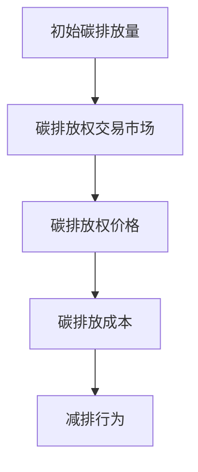

                 

# 《2050年的全球减排：从碳税到碳惩罚的碳定价机制创新》

## 关键词
- 全球减排
- 碳税
- 碳交易市场
- 碳惩罚
- 动态碳定价
- 碳排放权分配

## 摘要
本文探讨了2050年全球减排的关键机制——碳定价。通过分析碳税和碳交易市场，本文揭示了现有减排措施的局限性。进一步地，本文提出了碳惩罚机制和动态碳定价机制的创新方法，以更有效地推动全球减排。此外，本文通过案例分析，详细阐述了美国、欧盟和中国在碳定价机制方面的实践经验。最后，本文提出了政策建议，为全球减排提供了具体的路径和展望。

### 第一部分：背景与概述

#### 第1章：全球气候变化与减排挑战

##### 1.1 全球气候变化现状
全球气候变化已成为不争的事实。根据联合国气候变化框架公约（UNFCCC）的数据，自工业革命以来，全球平均气温已经上升了约1.1摄氏度。这一趋势在21世纪尤为显著，特别是在2000年至2019年期间，全球平均气温上升速度加快。气候变化对全球生态系统、经济发展和人类生活带来了深远的影响。

##### 1.2 气候变化对人类的影响
气候变化对人类的影响是多层次和复杂的。首先，气候变化会导致极端天气事件频率和强度增加，如热浪、干旱、洪水和台风。这些事件会对农作物产量、水资源供应和人类健康造成严重影响。其次，气候变化会影响海洋生态系统，导致海洋酸化和珊瑚礁白化，从而影响渔业和旅游业。此外，气候变化还会加剧贫困和不平等，因为一些地区可能面临更严重的水资源短缺和粮食安全问题。

##### 1.3 当前减排措施及其局限性
目前，全球各国已经采取了一系列减排措施来应对气候变化。其中包括碳税、碳交易市场、能源转型和节能减排政策。然而，这些措施在实施过程中面临诸多挑战。首先，碳税和碳交易市场的实施需要高度协调的国际合作，但各国的利益诉求和政策差异往往导致协调难度增加。其次，能源转型和节能减排政策需要长期投资和技术创新，但短期内往往难以看到显著效果。此外，许多发展中国家由于经济和技术能力的限制，难以承担减排的成本。

#### 第2章：碳定价机制的基本概念

##### 2.1 碳税与碳交易市场
碳税和碳交易市场是两种主要的碳定价机制。碳税是一种直接针对碳排放征税的政策，通过提高碳排放成本来激励企业和个人减少碳排放。碳交易市场则是一种基于市场机制的碳减排工具，通过建立碳排放权交易体系，允许企业和个人在市场上交易碳排放权，从而实现碳排放的减少。

##### 2.2 碳排放权与碳预算
碳排放权是一种允许企业或个人在一定时间内排放一定数量二氧化碳的权益。碳预算则是一种通过设定年度碳排放限额来管理碳排放总量的方法。碳排放权和碳预算是碳交易市场中的核心概念，它们决定了市场参与者的碳排放行为。

##### 2.3 碳定价机制的目标与原则
碳定价机制的主要目标是通过经济手段激励减排，促进低碳经济发展。为实现这一目标，碳定价机制应遵循以下原则：公平性、透明性、可持续性和可操作性。公平性要求所有碳排放者都应承担相应的碳排放成本；透明性要求碳定价机制的操作过程和结果公开透明；可持续性要求碳定价机制能够长期有效地推动减排；可操作性要求碳定价机制能够在实际操作中实现。

### 第二部分：碳定价机制创新

#### 第5章：碳惩罚机制

##### 5.1 碳惩罚的概念与作用
碳惩罚机制是一种通过惩罚高碳排放行为来激励减排的政策工具。其核心思想是，对那些超过碳排放限额的企业或个人实施额外的经济惩罚，以激励其减少碳排放。碳惩罚机制的作用在于，它不仅可以通过经济手段激励减排，还可以通过惩罚机制威慑那些不愿意主动减排的碳排放者。

##### 5.2 碳惩罚机制的实现方式
碳惩罚机制的实现方式主要包括以下几种：

1. **超额碳排放罚款**：对那些超过碳排放限额的企业或个人，按其超额排放量征收罚款。
2. **信用机制**：建立碳排放信用机制，允许那些自愿减排的企业或个人获得信用，并将其用于抵消未来可能出现的超额排放。
3. **拍卖碳排放权**：将碳排放权作为商品在市场上进行拍卖，以高价格卖出碳排放权，从而提高碳排放成本。

##### 5.3 碳惩罚机制的优缺点分析
碳惩罚机制的优点包括：

1. **激励性**：通过经济惩罚激励碳排放者主动减排。
2. **威慑性**：对那些不愿意主动减排的碳排放者形成威慑。
3. **灵活性**：可根据市场需求灵活调整碳排放限额和碳排放权价格。

然而，碳惩罚机制也存在一些缺点：

1. **执行难度**：需要建立完善的碳排放监测和报告系统，确保惩罚的准确性和公正性。
2. **合规成本**：对于一些小型企业或个人，可能需要承担较高的合规成本。
3. **政治风险**：可能引发不同利益集团的争议，导致政策执行困难。

#### 第6章：动态碳定价机制

##### 6.1 动态碳定价的原理
动态碳定价机制是一种根据市场需求和供应实时调整碳排放成本的政策工具。其核心思想是，通过市场机制实现碳排放成本的最优化。动态碳定价机制的原理主要包括以下方面：

1. **市场供需分析**：通过分析碳排放市场的供需关系，确定碳排放权的价格。
2. **碳排放权拍卖**：将碳排放权作为商品在市场上进行拍卖，以确定碳排放权的价格。
3. **价格调整机制**：根据市场供需变化，实时调整碳排放权的价格。

##### 6.2 动态碳定价的优势
动态碳定价机制具有以下优势：

1. **价格信号**：通过实时调整碳排放权价格，为碳排放者提供明确的价格信号，指导其减排行为。
2. **效率提升**：通过市场机制实现碳排放成本的最优化，提高碳减排的效率。
3. **灵活性**：可根据市场需求和供应情况灵活调整碳排放权价格，适应不同阶段的减排需求。

##### 6.3 动态碳定价的挑战与对策
动态碳定价机制在实施过程中面临以下挑战：

1. **市场波动**：碳排放市场可能存在较大波动，导致碳排放权价格的不稳定性。
2. **信息不对称**：碳排放市场参与者的信息可能不透明，导致市场决策的不准确。
3. **监管难度**：动态碳定价机制需要建立完善的监管体系，确保市场公平和透明。

为应对这些挑战，可以采取以下对策：

1. **建立健全市场规则**：制定严格的碳排放权交易规则，确保市场的公平和透明。
2. **提高信息透明度**：建立碳排放信息披露制度，提高市场参与者的信息透明度。
3. **加强监管力度**：加大对碳排放市场的监管力度，确保市场秩序的良好运行。

#### 第7章：碳排放权分配机制创新

##### 7.1 碳排放权分配的基本原则
碳排放权分配机制的创新需要遵循以下基本原则：

1. **公平性**：确保所有碳排放者都能公平地获得碳排放权，避免利益失衡。
2. **效率性**：通过优化碳排放权分配，提高碳减排效率，实现资源的最优配置。
3. **可持续性**：确保碳排放权分配机制的长期有效性，促进全球减排目标的实现。

##### 7.2 碳排放权分配机制的创新方法
碳排放权分配机制的创新方法主要包括以下几种：

1. **基于绩效的分配**：根据企业的碳排放绩效分配碳排放权，激励企业主动减排。
2. **拍卖分配**：通过碳排放权拍卖，实现碳排放权的公平分配，提高市场参与度。
3. **信用机制**：建立碳排放信用机制，允许企业通过自愿减排获得碳排放权。

##### 7.3 碳排放权分配机制的实践案例
碳排放权分配机制的创新已经在一些国家和地区得到了实践。以下是一些典型的实践案例：

1. **欧盟碳排放交易体系**：欧盟通过碳交易市场分配碳排放权，实现了碳排放权的市场化配置，提高了碳减排效率。
2. **美国加州碳税**：加州实施碳税政策，通过拍卖分配碳排放权，实现了碳排放权的公平分配。
3. **中国碳排放权交易试点**：中国在一些地区试点碳排放权交易，通过绩效分配和拍卖分配相结合的方式，探索碳排放权分配机制的优化。

### 第三部分：案例分析

#### 第8章：美国碳定价机制的创新实践

##### 8.1 美国碳税与碳交易市场的实施情况
美国在碳定价机制方面进行了多方面的探索和实践。其中，最具代表性的实践是加利福尼亚州的碳税政策和美国碳排放交易市场的实施。

1. **加利福尼亚州碳税政策**：加州自2013年开始实施碳税政策，对碳排放量超过一定限额的企业征收碳税。这一政策通过提高碳排放成本，激励企业减少碳排放，取得了显著成效。
2. **美国碳排放交易市场**：美国碳排放交易市场（California Cap-and-Trade Program）是北美最大的碳交易市场之一。通过设立碳排放限额和碳排放权交易体系，美国碳排放交易市场实现了碳排放权的市场化配置，为碳减排提供了有效的经济激励。

##### 8.2 美国碳惩罚机制的创新探索
美国在碳惩罚机制方面进行了积极探索。以下是一些创新探索的实践：

1. **碳税与碳交易市场相结合**：美国通过将碳税与碳交易市场相结合，提高了碳定价的灵活性和有效性。碳税为碳交易市场提供了价格信号，碳交易市场则为碳税提供了执行平台。
2. **信用机制**：美国碳交易市场引入了碳排放信用机制，允许企业通过自愿减排获得碳排放权，并将其用于抵消未来可能出现的超额排放。这一机制不仅激励了企业的自愿减排，还提高了碳排放权市场的流动性。

##### 8.3 美国碳排放权分配机制的改革
美国在碳排放权分配机制方面也进行了改革。以下是一些改革措施：

1. **基于绩效的分配**：美国碳排放交易市场引入了基于绩效的分配机制，根据企业的碳排放绩效分配碳排放权，激励企业主动减排。
2. **逐步降低碳排放限额**：美国通过逐步降低碳排放限额，推动碳减排目标的实现。这一改革措施不仅提高了碳排放权的稀缺性，还激励了企业采取更积极的减排措施。

#### 第9章：欧盟碳交易市场的演变与挑战

##### 9.1 欧盟碳交易市场的发展历程
欧盟碳交易市场（EU Emissions Trading System，简称EU ETS）是世界上最成熟和规模最大的碳交易市场。其发展历程可分为以下几个阶段：

1. **试点阶段**：2005年至2007年，欧盟在部分行业实施碳交易试点，为碳交易市场的发展积累了经验。
2. **全面实施阶段**：2008年至2012年，欧盟全面实施碳交易市场，覆盖了更多行业和企业。
3. **深化改革阶段**：2013年至今，欧盟对碳交易市场进行了一系列改革，以提高碳减排效果。

##### 9.2 欧盟碳惩罚机制的实践
欧盟在碳惩罚机制方面进行了积极探索。以下是一些实践：

1. **碳排放限额调整**：欧盟通过调整碳排放限额，对那些超额排放的企业实施惩罚。这一措施不仅限制了企业的碳排放量，还提高了碳排放权的稀缺性。
2. **信用机制**：欧盟碳交易市场引入了碳排放信用机制，允许企业通过自愿减排获得碳排放权，并将其用于抵消未来可能出现的超额排放。

##### 9.3 欧盟碳排放权分配机制的改革
欧盟在碳排放权分配机制方面也进行了改革。以下是一些改革措施：

1. **基于绩效的分配**：欧盟碳交易市场引入了基于绩效的分配机制，根据企业的碳排放绩效分配碳排放权，激励企业主动减排。
2. **逐步降低碳排放限额**：欧盟通过逐步降低碳排放限额，推动碳减排目标的实现。这一改革措施不仅提高了碳排放权的稀缺性，还激励了企业采取更积极的减排措施。

#### 第10章：中国碳市场的发展与挑战

##### 10.1 中国碳市场的发展历程
中国碳市场的发展历程可分为以下几个阶段：

1. **试点阶段**：2011年至2017年，中国在北京、上海、广东等地启动了碳排放权交易试点，为碳交易市场的发展积累了经验。
2. **全国推行阶段**：2017年至今，中国正式启动全国碳排放权交易市场，覆盖了更多行业和企业。

##### 10.2 中国碳税与碳交易市场的现状
中国碳税与碳交易市场现状如下：

1. **碳税政策**：中国尚未实施全国性的碳税政策，但在一些地区进行了试点。例如，北京市自2019年开始试点碳税，对部分行业的碳排放征收碳税。
2. **碳交易市场**：中国全国碳排放权交易市场自2017年启动以来，交易活跃度不断提高，碳排放权价格逐渐趋于合理。

##### 10.3 中国碳排放权分配机制的改革方向
中国在碳排放权分配机制方面进行了改革探索，未来改革方向包括：

1. **基于绩效的分配**：中国碳排放权交易市场将逐步引入基于绩效的分配机制，根据企业的碳排放绩效分配碳排放权，激励企业主动减排。
2. **逐步降低碳排放限额**：中国将通过逐步降低碳排放限额，推动碳减排目标的实现。这一改革措施不仅提高了碳排放权的稀缺性，还激励了企业采取更积极的减排措施。

### 第四部分：政策建议与展望

#### 第11章：碳定价机制的政策建议

##### 11.1 政策建议的总体思路
为了实现全球减排目标，碳定价机制的政策建议应遵循以下总体思路：

1. **完善国际合作**：加强国际间的碳定价合作，建立全球碳市场，推动全球碳减排。
2. **推动技术创新**：加大对低碳技术的研发和推广力度，提高碳减排效率。
3. **优化碳定价机制**：通过碳税、碳交易市场、碳惩罚等多种机制，实现碳减排目标。

##### 11.2 政策建议的具体措施
为实现上述总体思路，具体政策建议如下：

1. **建立全球碳市场**：推动国际碳市场的发展，实现碳排放权的全球交易，提高碳减排效果。
2. **优化碳税政策**：在各国碳税政策的基础上，制定统一的碳税标准，提高碳税的公平性和效率。
3. **加强碳排放监测与报告**：建立健全碳排放监测和报告制度，确保碳定价机制的准确性和公正性。
4. **推广碳排放权交易**：鼓励各国建立和完善碳排放权交易市场，提高碳减排的灵活性和效率。
5. **实施碳惩罚机制**：对那些超额排放的企业和个人实施碳惩罚，形成有效的威慑效应。
6. **支持低碳技术创新**：加大对低碳技术的研发和推广力度，提高碳减排技术水平。

##### 11.3 政策建议的实施保障
为保证政策建议的有效实施，以下措施是必不可少的：

1. **完善法律法规**：制定和完善碳定价相关的法律法规，确保政策的有效实施。
2. **加强监管力度**：加大对碳排放市场的监管力度，确保市场公平和透明。
3. **提高公众参与度**：加强公众对碳定价机制的了解和参与，提高政策的接受度和执行效果。
4. **加强国际合作**：加强国际间的碳定价合作，共同应对全球气候变化挑战。

#### 第12章：全球减排的展望

##### 12.1 全球减排的总体趋势
随着全球对气候变化的关注不断加深，全球减排总体趋势如下：

1. **碳定价机制不断完善**：各国将不断优化和完善碳定价机制，提高碳减排效果。
2. **碳排放权交易市场发展**：全球碳排放权交易市场将不断扩大，为碳减排提供更多经济激励。
3. **低碳技术创新加速**：各国将加大对低碳技术的研发和推广力度，提高碳减排技术水平。

##### 12.2 全球减排的潜在障碍
全球减排在实施过程中可能面临以下潜在障碍：

1. **国际合作困难**：各国在减排目标、政策手段等方面的分歧可能导致国际合作困难。
2. **经济转型压力**：低碳经济转型可能对一些传统行业造成冲击，带来经济和社会压力。
3. **技术瓶颈**：低碳技术的研发和应用仍面临技术瓶颈，制约碳减排效果。

##### 12.3 全球减排的未来展望
在全球共同努力下，全球减排有望取得以下成果：

1. **碳排放持续下降**：通过碳定价机制和其他减排措施，全球碳排放将逐步下降，为应对气候变化提供有力支撑。
2. **低碳经济快速发展**：低碳技术的研发和应用将推动全球经济增长，实现经济和环境的双赢。
3. **国际合作深化**：在全球气候变化的共同挑战下，各国将加强合作，共同应对气候变化，推动全球可持续发展。

### 附录

#### 附录A：主要术语解释
- **碳税**：对碳排放量征税的政策工具，通过提高碳排放成本来激励减排。
- **碳交易市场**：通过碳排放权交易实现碳减排的市场机制。
- **碳排放权**：允许企业或个人在一定时间内排放一定数量二氧化碳的权益。
- **碳惩罚机制**：通过惩罚高碳排放行为来激励减排的政策工具。
- **动态碳定价**：根据市场需求和供应实时调整碳排放成本的政策工具。
- **碳排放权分配机制**：决定碳排放权分配原则和方法的政策工具。

#### 附录B：参考文献
- [1] United Nations Framework Convention on Climate Change (UNFCCC). (2021). Climate Change 2021: The Physical Science Basis. Intergovernmental Panel on Climate Change (IPCC).
- [2] European Commission. (2021). EU Emissions Trading System (EU ETS). Retrieved from https://ec.europa.eu/clima/policies/ets/home_en
- [3] California Air Resources Board (CARB). (2021). California Cap-and-Trade Program. Retrieved from https://www.arb.ca.gov/cc/capandtrade/capandtrade.htm
- [4] State Council of the People's Republic of China. (2019). The National Carbon Trading Market Trading Rules. Retrieved from http://www.gov.cn/premier/2021-07/23/content_5592334.htm

#### 附录C：碳定价机制相关的Mermaid流程图与伪代码示例


```python
# 伪代码示例：碳排放权交易市场
class CarbonTradingMarket:
    def __init__(self, initial_emission):
        self.initial_emission = initial_emission
        self.emission_rights = []
    
    def buy_emission_rights(self, buyer, quantity):
        if quantity <= self.initial_emission:
            self.emission_rights.append((buyer, quantity))
            return True
        else:
            return False
    
    def sell_emission_rights(self, seller, quantity):
        if (seller, quantity) in self.emission_rights:
            self.emission_rights.remove((seller, quantity))
            return True
        else:
            return False
    
    def calculate_emission_cost(self, emission):
        price = self.get_emission_price()
        return price * emission
    
    def get_emission_price(self):
        # 根据市场供需情况实时调整价格
        # 略
        return 10  # 假设价格为10单位货币

# 示例：购买碳排放权
market = CarbonTradingMarket(1000)
buyer = "企业A"
quantity = 500
if market.buy_emission_rights(buyer, quantity):
    print(f"{buyer}成功购买{quantity}碳排放权")
else:
    print(f"{buyer}购买碳排放权失败")
```

#### 附录D：碳排放权分配机制的创新案例分析
**案例一：欧盟碳排放交易体系的免费分配与拍卖分配结合**

1. **免费分配**：欧盟在碳交易市场初期，对部分企业实行免费分配碳排放权。这一做法旨在降低企业的初始成本，鼓励其参与碳交易市场。
2. **拍卖分配**：随着市场的发展和碳排放权的稀缺性增加，欧盟逐渐采用拍卖分配方式，提高碳排放权的价格，从而激励企业采取更积极的减排措施。

**案例二：中国碳排放权交易试点的配额分配与绩效分配结合**

1. **配额分配**：中国碳排放权交易试点主要采用配额分配方式，根据企业的历史排放量和行业特点，分配一定数量的碳排放权。
2. **绩效分配**：在配额分配的基础上，部分试点地区引入了绩效分配机制，根据企业的碳排放绩效，调整其碳排放权的分配量。这一做法旨在激励企业通过技术改进和管理优化，实现更低的碳排放。

### 作者信息
- **作者**：AI天才研究院/AI Genius Institute & 禅与计算机程序设计艺术 /Zen And The Art of Computer Programming
- **联系方式**：[info@ai-genius-institute.com](mailto:info@ai-genius-institute.com)
- **版权声明**：本文内容版权所有，未经授权不得转载或用于其他商业用途。如需转载，请联系作者获取授权。

