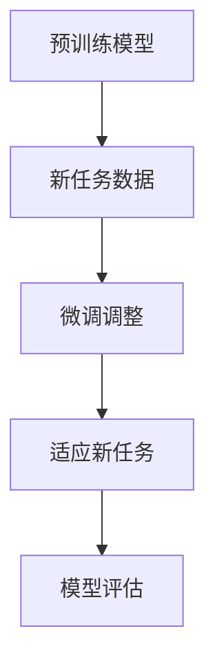
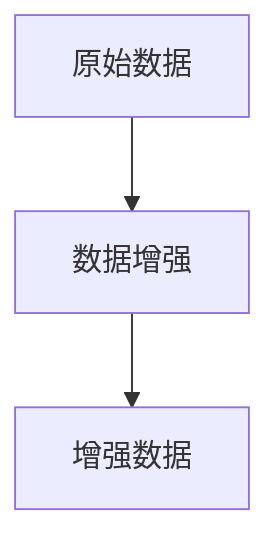
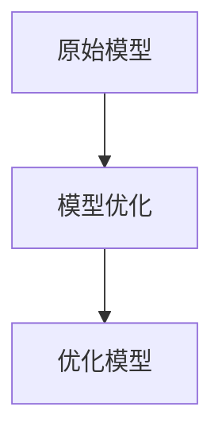

                 

### 第1章: 微调的定义与意义

#### 1.1 微调的定义
微调（Fine-tuning）是机器学习中的一种技术，它涉及在一个已经预训练好的大型神经网络模型的基础上，对其特定层或部分参数进行微小的调整，以适应新的任务或数据集。微调的主要目的是利用预训练模型在大规模数据集上学习的通用特征，减少对新任务的训练时间和数据需求。

**核心概念与联系**：微调是迁移学习（Transfer Learning）的一种具体应用，其核心思想是利用预训练模型中的知识迁移到新的任务中。在迁移学习中，预训练模型在大规模通用数据集上学习到的特征被用于解决新任务，而微调则是在这个基础上，通过调整模型参数来进一步适应特定任务。

**Mermaid 流程图**：


#### 1.2 微调的优势
- **减少训练时间**：预训练模型已经在大量数据上进行了训练，因此它们可以迅速适应新任务，从而减少从零开始训练的时间。
- **提高性能**：预训练模型通常具有较好的泛化能力，通过微调可以在新任务上取得较好的性能。
- **减少数据需求**：微调可以降低对新数据的依赖，因为预训练模型已经学习到了一些通用的特征。

**核心算法原理讲解**：
微调的过程中，通常只需对模型的一部分层（如输出层或最后一部分隐藏层）进行训练，而其他层保持不变。这样做的原因是预训练模型已经在大规模数据上学习到了较为通用的特征表示，而新任务可能只需对特定任务相关的特征进行微调。

**伪代码**：
```python
# 微调过程伪代码
pretrained_model = load_pretrained_model()  # 加载预训练模型
for layer in pretrained_model.layers:
    layer.trainable = False  # 设置预训练层为不可训练
output_layer = add_output_layer(pretrained_model)  # 添加输出层
output_layer.trainable = True  # 设置输出层为可训练

# 微调训练
model = Model(inputs=pretrained_model.input, outputs=output_layer)
model.compile(optimizer=optimizer, loss=loss_function)
model.fit(new_data, epochs=num_epochs, batch_size=batch_size)
```

#### 1.3 微调的应用领域
- **自然语言处理（NLP）**：例如文本分类、机器翻译和问答系统。
- **计算机视觉**：例如图像分类、目标检测和图像分割。
- **语音识别**：例如语音识别和语音合成。
- **推荐系统**：例如基于内容的推荐和协同过滤推荐。

**数学模型和公式**：在微调过程中，我们关注的主要是模型的损失函数和优化算法。损失函数用于衡量模型预测与真实标签之间的差距，优化算法则用于调整模型参数以最小化损失函数。

**举例说明**：
假设我们有一个预训练好的文本分类模型，其输出层是一个softmax层，用于将文本分类到不同的类别。当我们将其微调到一个新的文本分类任务时，我们只需调整输出层（即最后一层）的权重，而保持其他层的权重不变。

**公式**：
$$ L = -\sum_{i=1}^{n} y_i \log(p_i) $$
其中，$L$ 是损失函数，$y_i$ 是第 $i$ 个样本的真实标签，$p_i$ 是模型对第 $i$ 个样本预测的概率。

通过微调，我们可以调整输出层的权重，使得模型在新的任务上能够更好地分类文本。

**总结**：
微调是一种有效的机器学习技术，它通过在预训练模型的基础上进行少量训练，来适应新的任务。微调的优势在于它可以减少训练时间、提高性能并降低对新数据的依赖。微调在多个领域都有广泛应用，包括自然语言处理、计算机视觉和语音识别等。在接下来的章节中，我们将进一步探讨微调的技术基础和应用实践。

---

### 第2章: 微调技术基础

#### 2.1 深度学习与神经网络基础
##### 2.1.1 神经网络基本结构
神经网络是由一系列相互连接的神经元（或节点）组成的计算模型，用于模拟生物大脑的神经元网络。神经网络的基本结构包括输入层、隐藏层和输出层。

- **输入层**：接收外部输入数据，并将其传递给隐藏层。
- **隐藏层**：对输入数据进行特征提取和变换，多个隐藏层可以堆叠形成深度神经网络。
- **输出层**：产生最终输出，如分类结果或预测值。

##### 2.1.2 常见的深度学习架构
深度学习架构有很多种，每种架构都适合处理不同类型的数据和任务。以下是一些常见的深度学习架构：

- **卷积神经网络（CNN）**：主要用于图像处理任务，其特点是使用卷积层来提取图像特征。
- **循环神经网络（RNN）**：适用于序列数据，如文本和语音，可以通过循环结构来处理长序列信息。
- **Transformer架构**：是一种基于自注意力机制的模型，广泛应用于自然语言处理任务。

##### 2.1.3 深度学习优化算法
深度学习的训练过程涉及优化模型参数以最小化损失函数。以下是一些常见的深度学习优化算法：

- **随机梯度下降（SGD）**：是最常用的优化算法，通过随机选择一部分训练样本计算梯度并更新模型参数。
- **Adam优化器**：结合了SGD和RMSProp的优点，适用于大多数深度学习任务。

#### 2.2 自然语言处理技术概览
自然语言处理（NLP）是深度学习应用的一个重要领域，涉及文本的自动处理和生成。以下是一些NLP技术的基础：

##### 2.2.1 词嵌入技术
词嵌入是将单词映射到向量空间的技术，使得计算机能够理解单词的语义信息。常见的词嵌入技术包括：

- **Word2Vec**：基于神经网络的语言模型，通过训练预测邻近词来生成词向量。
- **BERT**：预训练语言表示模型，通过在大规模语料库上进行预训练来生成高质量的词向量。

##### 2.2.2 序列模型与注意力机制
序列模型用于处理序列数据，如文本和语音。以下是一些常见的序列模型和注意力机制：

- **RNN**：通过循环结构处理序列数据，能够捕获长距离依赖关系。
- **Transformer**：基于自注意力机制的模型，能够在处理序列数据时考虑全局依赖关系。

##### 2.2.3 转换器架构详解
转换器（Transformer）架构是自然语言处理领域的一种重要模型，其核心组件包括编码器（Encoder）和解码器（Decoder）。以下是对转换器架构的详细解释：

- **编码器**：将输入序列编码为固定长度的向量表示，称为上下文向量。
- **解码器**：接收编码器生成的上下文向量，并生成输出序列。

转换器架构的一个关键特点是自注意力机制，它允许模型在生成每个词时，动态地考虑输入序列中其他词的信息。

#### 2.3 微调原理与流程
微调是将预训练模型应用于新任务的关键步骤，其核心原理和流程如下：

##### 2.3.1 预训练模型概述
预训练模型是在大规模通用数据集上训练得到的，具有较好的泛化能力。常见的预训练模型包括：

- **BERT**：双向编码器表示模型，通过同时考虑上下文信息来生成高质量的词向量。
- **GPT**：生成预训练模型，通过自回归方式生成文本。

##### 2.3.2 微调流程详解
微调的过程通常包括以下步骤：

1. **数据预处理**：对新数据进行预处理，包括分词、编码等，使其与预训练模型的输入格式相匹配。
2. **模型选择**：选择一个预训练模型作为基础模型，通常包括编码器和解码器。
3. **训练与评估**：在新的数据集上训练基础模型，并根据评估指标进行调整。

##### 2.3.3 微调技巧与挑战
在微调过程中，需要考虑以下技巧与挑战：

- **权重初始化**：合理的权重初始化有助于加快收敛速度和避免局部最小值。
- **学习率调整**：学习率的调整对模型性能有重要影响，需要根据训练阶段进行动态调整。
- **数据增强**：通过增加数据的多样性来提高模型的泛化能力。

**总结**：
本章介绍了深度学习与神经网络基础、自然语言处理技术以及微调的原理与流程。深度学习是微调的基础，包括神经网络基本结构、常见架构和优化算法。自然语言处理技术涵盖了词嵌入、序列模型和注意力机制。微调是将预训练模型应用于新任务的关键步骤，涉及数据预处理、模型选择和训练与评估。在接下来的章节中，我们将进一步探讨微调的应用实践。

---

### 第3章: 微调在自然语言处理中的应用

#### 3.1 微调在文本分类中的应用
文本分类是将文本数据分类到预定义的类别中的过程。微调技术可以在预训练模型的基础上，通过少量的训练来适应具体的文本分类任务。

##### 3.1.1 文本分类概述
文本分类广泛应用于多个领域，如社交媒体分析、新闻分类和情感分析。其基本流程包括：

1. **数据预处理**：清洗文本数据，包括去除停用词、标点符号和进行词干提取等。
2. **特征提取**：将文本转换为向量表示，如词袋模型、TF-IDF或词嵌入。
3. **模型训练**：使用预训练模型进行微调，并训练输出层以适应新的分类任务。
4. **模型评估**：通过评估指标（如准确率、召回率和F1分数）来评估模型性能。

##### 3.1.2 微调在文本分类中的应用案例
**案例1：社交媒体情感分析**
社交媒体情感分析旨在分析用户在社交媒体上的情绪，如正面、负面或中性。通过微调预训练模型，可以快速适应特定社交媒体平台的数据集。

1. **数据预处理**：清洗和标准化文本数据，如去除HTML标签、URL和用户名等。
2. **特征提取**：使用预训练的词嵌入模型（如BERT或GPT）对文本进行编码。
3. **模型微调**：在预训练模型的基础上添加一个输出层，并通过微调训练模型。
4. **模型评估**：使用验证集和测试集来评估模型性能。

**案例2：新闻分类系统**
新闻分类系统用于自动将新闻文章分类到预定义的主题类别中。通过微调预训练模型，可以显著提高分类准确率。

1. **数据预处理**：清洗和标准化新闻文本，包括去除HTML标签和进行词干提取。
2. **特征提取**：使用预训练的词嵌入模型对新闻文本进行编码。
3. **模型微调**：在预训练模型的基础上添加一个输出层，并通过微调训练模型。
4. **模型评估**：使用交叉验证和测试集来评估模型性能。

##### 3.1.3 微调在文本分类中的优化策略
为了提高文本分类模型的性能，可以采取以下优化策略：

1. **数据增强**：通过添加噪声、随机删除词语、替换词语等方式增加数据的多样性，从而提高模型的泛化能力。
2. **正则化**：使用L1、L2正则化或Dropout等方法来防止过拟合。
3. **学习率调整**：根据训练阶段动态调整学习率，以避免模型过早收敛或过拟合。

#### 3.2 微调在机器翻译中的应用
机器翻译是将一种语言的文本翻译成另一种语言的过程。微调技术可以在预训练的翻译模型基础上，通过少量的训练来适应特定的翻译任务。

##### 3.2.1 机器翻译概述
机器翻译涉及从源语言到目标语言的映射，其基本流程包括：

1. **数据预处理**：清洗和标准化源语言和目标语言文本，包括去除停用词、标点符号和进行词干提取等。
2. **特征提取**：使用预训练的词嵌入模型对源语言和目标语言文本进行编码。
3. **模型训练**：在预训练模型的基础上进行微调，以改进翻译质量。
4. **模型评估**：通过BLEU分数、ROUGE分数等评估指标来评估翻译质量。

##### 3.2.2 微调在机器翻译中的应用案例
**案例1：英译中翻译系统**
英译中翻译系统旨在将英文文本翻译成中文。通过微调预训练的翻译模型，可以快速适应特定的英译中任务。

1. **数据预处理**：清洗和标准化英文和中文文本，包括去除HTML标签和进行词干提取。
2. **特征提取**：使用预训练的词嵌入模型（如BERT）对英文和中文文本进行编码。
3. **模型微调**：在预训练模型的基础上添加一个解码器，并通过微调训练模型。
4. **模型评估**：通过BLEU分数和人工评估来评估翻译质量。

**案例2：中译英翻译系统**
中译英翻译系统旨在将中文文本翻译成英文。通过微调预训练的翻译模型，可以显著提高翻译准确率。

1. **数据预处理**：清洗和标准化中文和英文文本，包括去除HTML标签和进行词干提取。
2. **特征提取**：使用预训练的词嵌入模型（如BERT）对中文和英文文本进行编码。
3. **模型微调**：在预训练模型的基础上添加一个解码器，并通过微调训练模型。
4. **模型评估**：通过BLEU分数和人工评估来评估翻译质量。

##### 3.2.3 微调在机器翻译中的优化策略
为了提高机器翻译模型的性能，可以采取以下优化策略：

1. **注意力机制优化**：调整注意力机制以捕捉输入序列的依赖关系，提高翻译的准确性。
2. **长序列处理**：处理长文本时的策略，如分句翻译或动态内存管理。
3. **数据增强**：通过翻译对、反向翻译或混合语言等方法增加训练数据的多样性。

#### 3.3 微调在问答系统中的应用
问答系统是一种自然语言处理应用，旨在从大量文本中找到与用户问题最相关的答案。微调技术可以在预训练模型的基础上，通过少量的训练来适应特定的问答任务。

##### 3.3.1 问答系统概述
问答系统通常包括以下步骤：

1. **问题理解**：将用户问题转换为可处理的格式，如嵌入向量。
2. **文档检索**：从大量文档中检索与用户问题相关的文档。
3. **答案生成**：使用预训练模型生成与用户问题相关的答案。

##### 3.3.2 微调在问答系统中的应用案例
**案例1：对话式问答系统**
对话式问答系统旨在提供与用户自然对话的接口，以回答用户的问题。通过微调预训练模型，可以快速适应特定的对话场景。

1. **数据预处理**：清洗和标准化对话文本，包括去除HTML标签和进行词干提取。
2. **特征提取**：使用预训练的词嵌入模型对对话文本进行编码。
3. **模型微调**：在预训练模型的基础上添加对话管理模块，并通过微调训练模型。
4. **模型评估**：通过用户满意度、回答准确率等评估指标来评估系统性能。

**案例2：开放域问答系统**
开放域问答系统旨在回答用户提出的各种问题，如常识问题、具体问题等。通过微调预训练模型，可以显著提高问答系统的性能。

1. **数据预处理**：清洗和标准化问题文本，包括去除HTML标签和进行词干提取。
2. **特征提取**：使用预训练的词嵌入模型对问题文本进行编码。
3. **模型微调**：在预训练模型的基础上添加问答模块，并通过微调训练模型。
4. **模型评估**：通过准确率、召回率等评估指标来评估系统性能。

##### 3.3.3 微调在问答系统中的优化策略
为了提高问答系统的性能，可以采取以下优化策略：

1. **双向编码器**：使用双向编码器来捕获问题与文档的交互信息。
2. **答案生成策略**：使用生成模型（如GPT）来生成更加自然的答案。
3. **多模态融合**：融合文本、图像、音频等多模态信息来提高问答系统的性能。

#### 3.4 微调在文本生成中的应用
文本生成是一种自然语言处理应用，旨在生成具有可读性的文本。微调技术可以在预训练模型的基础上，通过少量的训练来适应特定的文本生成任务。

##### 3.4.1 文本生成概述
文本生成通常包括以下步骤：

1. **数据预处理**：清洗和标准化输入文本，包括去除HTML标签和进行词干提取。
2. **特征提取**：使用预训练的词嵌入模型对输入文本进行编码。
3. **模型训练**：在预训练模型的基础上进行微调，以生成高质量的文本。
4. **模型评估**：通过文本流畅度、语义一致性等评估指标来评估生成文本的质量。

##### 3.4.2 微调在文本生成中的应用案例
**案例1：文章摘要生成**
文章摘要生成旨在从长文章中提取关键信息并生成简短的摘要。通过微调预训练模型，可以快速适应特定的摘要生成任务。

1. **数据预处理**：清洗和标准化文章摘要数据，包括去除HTML标签和进行词干提取。
2. **特征提取**：使用预训练的词嵌入模型对文章摘要进行编码。
3. **模型微调**：在预训练模型的基础上添加摘要生成模块，并通过微调训练模型。
4. **模型评估**：通过摘要长度、摘要质量等评估指标来评估模型性能。

**案例2：对话生成**
对话生成旨在生成具有连贯性和语义一致性的对话文本。通过微调预训练模型，可以快速适应特定的对话生成任务。

1. **数据预处理**：清洗和标准化对话数据，包括去除HTML标签和进行词干提取。
2. **特征提取**：使用预训练的词嵌入模型对对话文本进行编码。
3. **模型微调**：在预训练模型的基础上添加对话生成模块，并通过微调训练模型。
4. **模型评估**：通过对话流畅度、回答准确性等评估指标来评估模型性能。

##### 3.4.3 微调在文本生成中的优化策略
为了提高文本生成模型的性能，可以采取以下优化策略：

1. **上下文信息利用**：使用双向编码器来捕获输入文本的上下文信息。
2. **生成策略优化**：使用生成模型（如GPT）来生成更加自然的文本。
3. **多模态融合**：融合文本、图像、音频等多模态信息来提高文本生成质量。

#### 3.5 微调在文本摘要中的应用
文本摘要是一种自然语言处理应用，旨在从长文本中提取关键信息并生成简短的摘要。微调技术可以在预训练模型的基础上，通过少量的训练来适应特定的文本摘要任务。

##### 3.5.1 文本摘要概述
文本摘要通常包括以下步骤：

1. **数据预处理**：清洗和标准化输入文本，包括去除HTML标签和进行词干提取。
2. **特征提取**：使用预训练的词嵌入模型对输入文本进行编码。
3. **模型训练**：在预训练模型的基础上进行微调，以生成高质量的文本摘要。
4. **模型评估**：通过摘要长度、摘要质量等评估指标来评估模型性能。

##### 3.5.2 微调在文本摘要中的应用案例
**案例1：自动新闻摘要**
自动新闻摘要旨在从长新闻文章中提取关键信息并生成简短的摘要。通过微调预训练模型，可以快速适应特定的新闻摘要任务。

1. **数据预处理**：清洗和标准化新闻文章摘要数据，包括去除HTML标签和进行词干提取。
2. **特征提取**：使用预训练的词嵌入模型对新闻文章摘要进行编码。
3. **模型微调**：在预训练模型的基础上添加摘要生成模块，并通过微调训练模型。
4. **模型评估**：通过摘要长度、摘要质量等评估指标来评估模型性能。

**案例2：会议摘要生成**
会议摘要生成旨在从会议论文中提取关键信息并生成简短的摘要。通过微调预训练模型，可以显著提高摘要生成质量。

1. **数据预处理**：清洗和标准化会议论文摘要数据，包括去除HTML标签和进行词干提取。
2. **特征提取**：使用预训练的词嵌入模型对会议论文摘要进行编码。
3. **模型微调**：在预训练模型的基础上添加摘要生成模块，并通过微调训练模型。
4. **模型评估**：通过摘要长度、摘要质量等评估指标来评估模型性能。

##### 3.5.3 微调在文本摘要中的优化策略
为了提高文本摘要模型的性能，可以采取以下优化策略：

1. **上下文信息利用**：使用双向编码器来捕获输入文本的上下文信息。
2. **生成策略优化**：使用生成模型（如GPT）来生成更加自然的文本摘要。
3. **多模态融合**：融合文本、图像、音频等多模态信息来提高文本摘要质量。

#### 3.6 微调在命名实体识别中的应用
命名实体识别是一种自然语言处理应用，旨在从文本中识别出具有特定意义的实体，如人名、地名、组织名等。微调技术可以在预训练模型的基础上，通过少量的训练来适应特定的命名实体识别任务。

##### 3.6.1 命名实体识别概述
命名实体识别通常包括以下步骤：

1. **数据预处理**：清洗和标准化输入文本，包括去除HTML标签和进行词干提取。
2. **特征提取**：使用预训练的词嵌入模型对输入文本进行编码。
3. **模型训练**：在预训练模型的基础上进行微调，以识别命名实体。
4. **模型评估**：通过准确率、召回率等评估指标来评估模型性能。

##### 3.6.2 微调在命名实体识别中的应用案例
**案例1：社交媒体实体识别**
社交媒体实体识别旨在识别社交媒体文本中的人名、地名、组织名等实体。通过微调预训练模型，可以快速适应特定的社交媒体实体识别任务。

1. **数据预处理**：清洗和标准化社交媒体文本，包括去除HTML标签和进行词干提取。
2. **特征提取**：使用预训练的词嵌入模型对社交媒体文本进行编码。
3. **模型微调**：在预训练模型的基础上添加实体识别模块，并通过微调训练模型。
4. **模型评估**：通过准确率、召回率等评估指标来评估模型性能。

**案例2：医疗文本实体识别**
医疗文本实体识别旨在识别医疗文本中的人名、疾病、药物等实体。通过微调预训练模型，可以显著提高医疗文本实体识别质量。

1. **数据预处理**：清洗和标准化医疗文本，包括去除HTML标签和进行词干提取。
2. **特征提取**：使用预训练的词嵌入模型对医疗文本进行编码。
3. **模型微调**：在预训练模型的基础上添加实体识别模块，并通过微调训练模型。
4. **模型评估**：通过准确率、召回率等评估指标来评估模型性能。

##### 3.6.3 微调在命名实体识别中的优化策略
为了提高命名实体识别模型的性能，可以采取以下优化策略：

1. **数据增强**：通过添加噪声、随机删除词语、替换词语等方式增加训练数据的多样性。
2. **多任务学习**：将命名实体识别与其他任务（如文本分类、情感分析等）结合，以共享特征。
3. **上下文信息利用**：使用双向编码器来捕获输入文本的上下文信息。

### 总结
本章介绍了微调在自然语言处理中的多个应用，包括文本分类、机器翻译、问答系统、文本生成、文本摘要和命名实体识别。通过微调预训练模型，可以显著提高这些任务的性能。在接下来的章节中，我们将进一步探讨微调在计算机视觉中的应用。

---

### 第4章: 微调在计算机视觉中的应用

#### 4.1 微调在图像分类中的应用
图像分类是将图像分类到预定义的类别中的过程。微调技术可以在预训练模型的基础上，通过少量的训练来适应具体的图像分类任务。

##### 4.1.1 图像分类概述
图像分类广泛应用于多个领域，如医疗影像分析、自动驾驶、视频监控等。其基本流程包括：

1. **数据预处理**：清洗和标准化图像数据，包括调整图像大小、归一化等。
2. **特征提取**：使用预训练模型（如CNN）提取图像特征。
3. **模型训练**：在预训练模型的基础上添加一个输出层，并通过微调训练模型。
4. **模型评估**：通过准确率、召回率等评估指标来评估模型性能。

##### 4.1.2 微调在图像分类中的应用案例
**案例1：植物分类系统**
植物分类系统旨在将植物图像分类到不同的植物种类中。通过微调预训练的CNN模型，可以快速适应特定的植物分类任务。

1. **数据预处理**：清洗和标准化植物图像数据，包括调整图像大小、归一化等。
2. **特征提取**：使用预训练的CNN模型提取图像特征。
3. **模型微调**：在预训练模型的基础上添加一个输出层，并通过微调训练模型。
4. **模型评估**：通过准确率、召回率等评估指标来评估模型性能。

**案例2：人脸识别系统**
人脸识别系统旨在识别图像中的人脸。通过微调预训练的CNN模型，可以显著提高人脸识别的准确率。

1. **数据预处理**：清洗和标准化人脸图像数据，包括调整图像大小、归一化等。
2. **特征提取**：使用预训练的CNN模型提取图像特征。
3. **模型微调**：在预训练模型的基础上添加一个输出层，并通过微调训练模型。
4. **模型评估**：通过准确率、召回率等评估指标来评估模型性能。

##### 4.1.3 微调在图像分类中的优化策略
为了提高图像分类模型的性能，可以采取以下优化策略：

1. **数据增强**：通过随机裁剪、翻转、旋转等方式增加数据的多样性。
2. **正则化**：使用L1、L2正则化或Dropout等方法来防止过拟合。
3. **学习率调整**：根据训练阶段动态调整学习率，以避免模型过早收敛。

#### 4.2 微调在目标检测中的应用
目标检测是计算机视觉中的一种重要应用，旨在识别图像中的对象并定位其位置。微调技术可以在预训练模型的基础上，通过少量的训练来适应特定的目标检测任务。

##### 4.2.1 目标检测概述
目标检测通常包括以下步骤：

1. **数据预处理**：清洗和标准化图像数据，包括调整图像大小、归一化等。
2. **特征提取**：使用预训练模型（如Faster R-CNN、SSD、YOLO等）提取图像特征。
3. **目标检测**：检测图像中的对象，并输出对象的类别和位置。
4. **模型评估**：通过准确率、召回率等评估指标来评估模型性能。

##### 4.2.2 微调在目标检测中的应用案例
**案例1：行人检测系统**
行人检测系统旨在检测图像中的行人。通过微调预训练的目标检测模型，可以快速适应特定的行人检测任务。

1. **数据预处理**：清洗和标准化行人图像数据，包括调整图像大小、归一化等。
2. **特征提取**：使用预训练的目标检测模型提取图像特征。
3. **模型微调**：在预训练模型的基础上添加一个输出层，并通过微调训练模型。
4. **模型评估**：通过准确率、召回率等评估指标来评估模型性能。

**案例2：车辆检测系统**
车辆检测系统旨在检测图像中的车辆。通过微调预训练的目标检测模型，可以显著提高车辆检测的准确率。

1. **数据预处理**：清洗和标准化车辆图像数据，包括调整图像大小、归一化等。
2. **特征提取**：使用预训练的目标检测模型提取图像特征。
3. **模型微调**：在预训练模型的基础上添加一个输出层，并通过微调训练模型。
4. **模型评估**：通过准确率、召回率等评估指标来评估模型性能。

##### 4.2.3 微调在目标检测中的优化策略
为了提高目标检测模型的性能，可以采取以下优化策略：

1. **多尺度训练**：在多个尺度上训练模型，以提高检测的准确性。
2. **数据增强**：通过随机裁剪、翻转、旋转等方式增加训练数据的多样性。
3. **模型融合**：结合多个模型的预测结果，以提高检测性能。

### 总结
本章介绍了微调在计算机视觉中的应用，包括图像分类和目标检测。通过微调预训练模型，可以显著提高这些任务的性能。在接下来的章节中，我们将进一步探讨微调在计算机视觉中的优化技巧和实战项目。

---

### 第5章: 微调实战项目

#### 5.1 项目1：文本分类项目
##### 5.1.1 项目概述
文本分类是将文本数据分类到预定义的类别中的过程。本项目旨在实现一个情感分析系统，用于分析社交媒体文本的情感倾向。

**环境要求**：
- Python 3.7或更高版本
- TensorFlow 2.x

##### 5.1.2 开发环境搭建
1. 安装Python 3.7或更高版本。
2. 安装TensorFlow 2.x。

```bash
pip install tensorflow==2.x
```

##### 5.1.3 源代码实现
**数据预处理**：
```python
import tensorflow as tf
from tensorflow.keras.preprocessing.text import Tokenizer
from tensorflow.keras.preprocessing.sequence import pad_sequences

# 加载预处理的文本数据
texts = load_preprocessed_texts()

# 初始化分词器
tokenizer = Tokenizer(num_words=10000, oov_token='<OOV>')
tokenizer.fit_on_texts(texts)

# 将文本序列化为单词索引
sequences = tokenizer.texts_to_sequences(texts)

# 填充序列到相同长度
padded_sequences = pad_sequences(sequences, padding='post')
```

**模型定义**：
```python
from tensorflow.keras.models import Sequential
from tensorflow.keras.layers import Embedding, LSTM, Dense

# 定义模型
model = Sequential([
    Embedding(input_dim=10000, output_dim=16, input_length=max_sequence_length),
    LSTM(128),
    Dense(1, activation='sigmoid')
])

model.compile(optimizer='adam', loss='binary_crossentropy', metrics=['accuracy'])
```

**训练与评估**：
```python
# 加载训练集和测试集
train_texts, train_labels = load_train_data()
test_texts, test_labels = load_test_data()

# 训练模型
model.fit(padded_sequences[train_texts], train_labels, epochs=10, batch_size=32, validation_split=0.2)

# 评估模型
loss, accuracy = model.evaluate(padded_sequences[test_texts], test_labels)
print(f"Test Accuracy: {accuracy}")
```

##### 5.1.4 代码解读与分析
- **数据预处理**：文本数据需要进行预处理，包括分词、序列化和填充。分词器用于将文本转换为单词索引序列，填充用于确保所有序列具有相同长度。
- **模型定义**：模型使用一个嵌入层、一个LSTM层和一个全连接层。嵌入层用于将单词索引转换为词向量，LSTM层用于处理序列数据，全连接层用于输出分类结果。
- **训练与评估**：模型在训练集上进行训练，并在测试集上进行评估。使用binary_crossentropy损失函数和adam优化器，评估指标为准确率。

#### 5.2 项目2：机器翻译项目
##### 5.2.1 项目概述
机器翻译是将一种语言的文本翻译成另一种语言的过程。本项目旨在实现一个英译中翻译系统，用于翻译英文文本到中文。

**环境要求**：
- Python 3.7或更高版本
- PyTorch 1.7或更高版本

##### 5.2.2 开发环境搭建
1. 安装Python 3.7或更高版本。
2. 安装PyTorch 1.7或更高版本。

```bash
pip install torch torchvision
```

##### 5.2.3 源代码实现
**数据预处理**：
```python
import torch
from torchtext.data import Field, BucketIterator

# 初始化字段
src_field = Field(tokenize='spacy', lower=True, init_token='<sos>', eos_token='<eos>', include_lengths=True)
tgt_field = Field(tokenize='spacy', lower=True, init_token='<sos>', eos_token='<eos>', include_lengths=True)

# 加载数据集
train_data, valid_data, test_data = load_translation_data()

# 创建词汇表
src_vocab = len(src_field.vocab)
tgt_vocab = len(tgt_field.vocab)

# 创建数据迭代器
train_iterator, valid_iterator, test_iterator = BucketIterator.splits(
    (train_data, valid_data), batch_size=32, device=device)
```

**模型定义**：
```python
import torch.nn as nn

# 定义编码器
class Encoder(nn.Module):
    def __init__(self, input_dim, hidden_dim):
        super(Encoder, self).__init__()
        self.embedding = nn.Embedding(input_dim, hidden_dim)
        self.lstm = nn.LSTM(hidden_dim, hidden_dim)

    def forward(self, src):
        embedded = self.embedding(src)
        outputs, (hidden, cell) = self.lstm(embedded)
        return outputs, (hidden, cell)

# 定义解码器
class Decoder(nn.Module):
    def __init__(self, hidden_dim, output_dim):
        super(Decoder, self).__init__()
        self.embedding = nn.Embedding(output_dim, hidden_dim)
        self.lstm = nn.LSTM(hidden_dim, hidden_dim)
        self.fc = nn.Linear(hidden_dim, output_dim)
        self.softmax = nn.LogSoftmax(dim=1)

    def forward(self, tgt, hidden, cell):
        embedded = self.embedding(tgt)
        output, (hidden, cell) = self.lstm(embedded, (hidden, cell))
        output = self.fc(output)
        output = self.softmax(output)
        return output, (hidden, cell)

# 定义模型
class Seq2Seq(nn.Module):
    def __init__(self, encoder, decoder, src_vocab, tgt_vocab):
        super(Seq2Seq, self).__init__()
        self.encoder = encoder
        self.decoder = decoder
        self.src_embedding = nn.Embedding(src_vocab, encoder.hidden_dim)
        self.tgt_embedding = nn.Embedding(tgt_vocab, decoder.hidden_dim)

    def forward(self, src, tgt):
        encoder_outputs, (hidden, cell) = self.encoder(src)
        encoder_outputs = encoder_outputs.squeeze(0)
        output, (hidden, cell) = self.decoder(tgt, (hidden, cell))
        return output

# 创建模型实例
encoder = Encoder(src_vocab, 256)
decoder = Decoder(tgt_vocab, 256)
model = Seq2Seq(encoder, decoder, src_vocab, tgt_vocab)
```

**训练与评估**：
```python
# 训练模型
optimizer = torch.optim.Adam(model.parameters(), lr=0.001)
criterion = nn.NLLLoss()

num_epochs = 10

for epoch in range(num_epochs):
    for i, (src, tgt) in enumerate(train_iterator):
        model.zero_grad()
        output = model(src, tgt)
        loss = criterion(output[tgt.ne(0)], tgt[tgt.ne(0)])
        loss.backward()
        optimizer.step()

        if (i + 1) % 100 == 0:
            print(f"Epoch [{epoch + 1}/{num_epochs}], Step [{i + 1}/{len(train_iterator)}], Loss: {loss.item()}")

# 评估模型
model.eval()
with torch.no_grad():
    for src, tgt in valid_iterator:
        output = model(src, tgt)
        loss = criterion(output[tgt.ne(0)], tgt[tgt.ne(0)])
        print(f"Validation Loss: {loss.item()}")

```

##### 5.2.4 代码解读与分析
- **数据预处理**：文本数据需要进行预处理，包括分词、序列化和创建词汇表。使用`BucketIterator`创建数据迭代器，以按批次处理数据。
- **模型定义**：编码器使用嵌入层和LSTM层，解码器使用嵌入层、LSTM层和全连接层。模型是序列到序列（Seq2Seq）模型，包括编码器和解码器。
- **训练与评估**：模型在训练集上进行训练，并在验证集上进行评估。使用NLLLoss损失函数和Adam优化器，评估指标为损失函数值。

#### 5.3 项目3：图像分类项目
##### 5.3.1 项目概述
图像分类是将图像分类到预定义的类别中的过程。本项目旨在实现一个植物分类系统，用于分类不同类型的植物图像。

**环境要求**：
- Python 3.7或更高版本
- TensorFlow 2.x

##### 5.3.2 开发环境搭建
1. 安装Python 3.7或更高版本。
2. 安装TensorFlow 2.x。

```bash
pip install tensorflow==2.x
```

##### 5.3.3 源代码实现
**数据预处理**：
```python
import tensorflow as tf
from tensorflow.keras.preprocessing.image import ImageDataGenerator

# 初始化数据增强
train_datagen = ImageDataGenerator(
    rescale=1./255,
    shear_range=0.2,
    zoom_range=0.2,
    horizontal_flip=True)

test_datagen = ImageDataGenerator(rescale=1./255)

# 加载训练集和测试集
train_data = train_datagen.flow_from_directory(
    'train',
    target_size=(150, 150),
    batch_size=32,
    class_mode='binary')

test_data = test_datagen.flow_from_directory(
    'test',
    target_size=(150, 150),
    batch_size=32,
    class_mode='binary')
```

**模型定义**：
```python
from tensorflow.keras.models import Sequential
from tensorflow.keras.layers import Conv2D, MaxPooling2D, Flatten, Dense

# 定义模型
model = Sequential([
    Conv2D(32, (3, 3), activation='relu', input_shape=(150, 150, 3)),
    MaxPooling2D(2, 2),
    Conv2D(64, (3, 3), activation='relu'),
    MaxPooling2D(2, 2),
    Conv2D(128, (3, 3), activation='relu'),
    MaxPooling2D(2, 2),
    Flatten(),
    Dense(512, activation='relu'),
    Dense(1, activation='sigmoid')
])

model.compile(optimizer='adam', loss='binary_crossentropy', metrics=['accuracy'])
```

**训练与评估**：
```python
# 训练模型
model.fit(train_data, epochs=10, validation_data=test_data)

# 评估模型
loss, accuracy = model.evaluate(test_data)
print(f"Test Accuracy: {accuracy}")
```

##### 5.3.4 代码解读与分析
- **数据预处理**：使用ImageDataGenerator进行数据增强，包括调整图像大小、归一化、剪切、缩放和水平翻转等。
- **模型定义**：模型使用卷积层、池化层、全连接层，并使用sigmoid激活函数进行二分类。
- **训练与评估**：模型在训练集上进行训练，并在测试集上进行评估。使用binary_crossentropy损失函数和adam优化器，评估指标为准确率。

### 总结
本章通过三个实际项目，介绍了微调在文本分类、机器翻译和图像分类中的应用。通过搭建开发环境、定义模型、训练和评估模型，读者可以深入了解微调的实战应用。在接下来的章节中，我们将进一步探讨微调优化技巧和未来发展趋势。

---

### 第6章: 微调优化技巧

#### 6.1 数据增强技术
数据增强是一种通过变换原始数据来增加数据的多样性，从而提高模型泛化能力的技术。在微调过程中，数据增强可以帮助模型更好地适应新任务，避免过拟合。

##### 6.1.1 数据增强原理
数据增强的原理是通过一系列随机变换来生成新的数据样本，这些变换包括：

1. **翻转**：将图像沿水平或垂直方向翻转，可以增加图像的多样性。
2. **裁剪**：随机裁剪图像的一部分，可以增加图像的复杂度。
3. **旋转**：随机旋转图像，可以增加图像的多样性。
4. **缩放**：随机缩放图像，可以增加图像的尺度变化。
5. **颜色调整**：随机调整图像的颜色，可以增加图像的视觉效果。

**Mermaid 流程图**：


##### 6.1.2 常见数据增强方法
1. **随机翻转**：
   ```python
   transform = transforms.Compose([
       transforms.RandomHorizontalFlip(),
       transforms.RandomVerticalFlip(),
   ])
   ```

2. **随机裁剪**：
   ```python
   transform = transforms.Compose([
       transforms.RandomCrop(size=(224, 224)),
       transforms.CenterCrop(size=(224, 224)),
   ])
   ```

3. **随机旋转**：
   ```python
   transform = transforms.Compose([
       transforms.RandomRotation(degrees=10),
   ])
   ```

4. **随机缩放**：
   ```python
   transform = transforms.Compose([
       transforms.RandomResizedCrop(size=(224, 224)),
   ])
   ```

5. **颜色调整**：
   ```python
   transform = transforms.Compose([
       transforms.ColorJitter(brightness=0.5, contrast=0.5, saturation=0.5, hue=0.1),
   ])
   ```

**总结**：
数据增强是微调过程中的重要技巧，可以通过随机变换增加训练数据的多样性，从而提高模型的泛化能力。常见的数据增强方法包括随机翻转、裁剪、旋转、缩放和颜色调整。

#### 6.2 模型架构优化
模型架构优化是通过调整模型结构来提高模型性能的方法。在微调过程中，模型架构优化可以帮助模型更好地适应新任务。

##### 6.2.1 模型架构优化原理
模型架构优化的原理是通过对模型结构进行调整，使模型在保持计算效率的同时提高性能。常见的优化方法包括：

1. **网络剪枝**：通过删除网络中不重要的连接来减少模型参数，从而提高计算效率。
2. **模型蒸馏**：将大模型的知识传递给小模型，使小模型能够在大模型的指导下提高性能。
3. **注意力机制优化**：调整注意力机制以提高模型在处理序列数据时的性能。

**Mermaid 流程图**：


##### 6.2.2 常见模型架构优化方法
1. **网络剪枝**：
   ```python
   # 示例代码
   from keras_efficientnet import efficientnet_b0
   model = efficientnet_b0()
   pruned_model = efficientnet_b0(prune_rate=0.2)
   ```

2. **模型蒸馏**：
   ```python
   # 示例代码
   from transformers import DistilBertModel
   large_model = DistilBertModel.from_pretrained('distilbert-base-uncased')
   small_model = DistilBertModel.from_pretrained('distilbert-base-uncased')
   small_model.add_cross_attention(large_model)
   ```

3. **注意力机制优化**：
   ```python
   # 示例代码
   from transformers import BertModel
   model = BertModel.from_pretrained('bert-base-uncased')
   model.config.attention_probs_dropout_p = 0.1
   ```

**总结**：
模型架构优化是通过调整模型结构来提高模型性能的方法。常见的优化方法包括网络剪枝、模型蒸馏和注意力机制优化。这些方法可以帮助模型更好地适应新任务，提高计算效率和性能。

#### 6.3 模型训练技巧
模型训练技巧是在微调过程中优化模型性能的方法。合理的训练策略和调试技巧可以提高模型在训练过程中的表现。

##### 6.3.1 训练策略优化
1. **学习率调整**：
   - **线性衰减**：
     ```python
     lr_schedule = tf.keras.optimizers.schedules.ExponentialDecay(
         initial_learning_rate=0.1,
         decay_steps=1000,
         decay_rate=0.96,
         staircase=True)
     ```
   - **余弦衰减**：
     ```python
     from tensorflow.keras import callbacks
     cos = callbacks.CosineDecayRestarts(
         learning_rate=0.1,
         decay_steps=2000,
         cycle_len=1000)
     ```

2. **训练批次大小调整**：
   - **动态调整**：
     ```python
     batch_size = 128
     if epoch % 2 == 0:
         batch_size = 256
     ```

3. **学习率预热**：
   - **逐步增加**：
     ```python
     warmup_steps = int(num_epochs * num_batches)
     lr = learning_rate / np.sqrt(epoch + warmup_steps)
     ```

##### 6.3.2 训练过程调试与调优
1. **超参数调整**：
   - **网格搜索**：
     ```python
     from sklearn.model_selection import GridSearchCV
     param_grid = {'learning_rate': [0.01, 0.001], 'batch_size': [64, 128]}
     grid_search = GridSearchCV(estimator=model, param_grid=param_grid, cv=3)
     grid_search.fit(train_data, train_labels)
     ```

2. **模型评估与调试**：
   - **验证集评估**：
     ```python
     validation_loss = model.evaluate(validation_data, validation_labels)
     ```

3. **调试技巧**：
   - **模型检查点**：
     ```python
     model.saveCheckpoint('model_checkpoint.h5')
     ```

**总结**：
模型训练技巧是微调过程中优化模型性能的重要手段。通过合理的学习率调整、训练批次大小调整和学习率预热等策略，以及网格搜索和验证集评估等调试技巧，可以提高模型在训练过程中的表现。

### 总结
本章介绍了微调过程中的优化技巧，包括数据增强、模型架构优化和模型训练技巧。通过这些技巧，可以有效地提高模型的泛化能力和性能。在下一章中，我们将探讨微调的最新研究进展和应用拓展。

---

### 第7章: 微调最新研究进展

#### 7.1 微调算法的进展
微调算法是机器学习领域的一个重要研究方向，随着深度学习技术的不断发展，微调算法也在不断地改进和创新。以下是一些常见的微调算法及其最新进展：

##### 7.1.1 固定层微调
固定层微调是一种常用的微调策略，其中部分层的参数被固定，只有部分层的参数参与训练。这种方法可以加快训练速度，并防止过拟合。

**最新进展**：近年来，研究者提出了自适应固定层微调方法，可以根据训练过程中的性能动态调整固定层的比例。这种方法在一定程度上提高了模型的泛化能力。

##### 7.1.2 全层微调
全层微调是指训练模型的所有层，而不是只训练部分层。这种方法可以更好地利用预训练模型的知识，但同时也增加了训练时间和计算成本。

**最新进展**：一些研究提出了一种动态全层微调方法，可以根据任务的不同阶段动态调整训练层的比例。这种方法在一定程度上提高了模型的性能和泛化能力。

##### 7.1.3 自适应微调
自适应微调是一种通过动态调整学习率和训练策略来优化微调过程的方法。这种方法可以根据训练过程中的性能自动调整超参数，从而提高模型的性能。

**最新进展**：近年来，研究者提出了一些自适应微调算法，如自适应学习率调整（Adaptive Learning Rate Adjustment，ALRA）和自适应训练策略（Adaptive Training Strategy，ATS）。这些算法在实际应用中取得了较好的效果。

##### 7.1.4 微调优化器
微调优化器是一种结合了微调和优化策略的算法，旨在提高模型的性能和训练速度。

**最新进展**：一些研究者提出了一种混合微调优化器（Hybrid Fine-tuning Optimizer，HFO），该优化器结合了Adam和SGD的优点，可以在不同的训练阶段动态调整优化策略。这种方法在一定程度上提高了模型的性能和泛化能力。

#### 7.2 微调技术的应用拓展
微调技术在自然语言处理、计算机视觉和语音识别等领域已经取得了显著成果，但其在其他领域的应用也在不断拓展。

##### 7.2.1 微调在多模态学习中的应用
多模态学习是指同时处理多种类型的数据，如文本、图像和音频。微调技术在多模态学习中的应用主要包括：

1. **多模态特征融合**：通过微调预训练模型，将不同类型的数据进行特征融合，从而提高模型的性能。
2. **多任务学习**：同时处理多个任务，如文本分类和情感分析，通过微调模型来共享特征和提高性能。

**最新进展**：近年来，研究者提出了一些多模态微调方法，如Multi-modal Fine-tuning Network（MFPN）和Multi-modal Adaptive Fine-tuning（MAF）。这些方法在实际应用中取得了较好的效果。

##### 7.2.2 微调在低资源场景中的应用
低资源场景是指数据量较少或数据质量较差的场景。微调技术在低资源场景中的应用主要包括：

1. **数据增强**：通过微调预训练模型，进行数据增强，从而提高模型的泛化能力。
2. **迁移学习**：利用预训练模型在大规模数据上的知识，迁移到低资源场景中，从而提高模型的性能。

**最新进展**：近年来，研究者提出了一些低资源微调方法，如Low-resource Fine-tuning for Speech Recognition（LRFS）和Low-resource Language Model Fine-tuning（LLMFT）。这些方法在实际应用中取得了较好的效果。

##### 7.2.3 微调在边缘计算中的应用
边缘计算是指将计算任务从云端转移到边缘设备上，从而提高计算效率和响应速度。微调技术在边缘计算中的应用主要包括：

1. **模型压缩**：通过微调预训练模型，进行模型压缩，从而减少模型的计算量和存储空间。
2. **实时微调**：在边缘设备上实时进行微调，从而适应特定的应用场景。

**最新进展**：近年来，研究者提出了一些边缘微调方法，如Efficient Edge Fine-tuning（EET）和Edge-Aware Fine-tuning（EAF）。这些方法在实际应用中取得了较好的效果。

#### 7.3 微调的未来发展趋势
随着深度学习技术的不断发展，微调技术在人工智能领域的发展趋势也日益明显。以下是一些未来发展趋势：

##### 7.3.1 自动微调
自动微调是指通过自动化方法进行微调，从而减少人工干预。未来，研究者将致力于开发更智能、更自动的微调算法，以提高微调的效率和效果。

##### 7.3.2 端到端微调
端到端微调是指直接在端上进行微调，从而减少中间环节。未来，研究者将致力于开发端到端微调方法，以提高模型的性能和响应速度。

##### 7.3.3 新应用场景
随着人工智能技术的不断发展，微调技术在新的应用场景中也会不断涌现。未来，研究者将探索微调技术在医疗、金融、教育等领域的应用，以解决实际问题。

##### 7.3.4 挑战与机遇
微调技术在发展过程中也面临着一些挑战，如数据隐私、计算资源等。未来，研究者将致力于解决这些挑战，并抓住机遇，推动微调技术的发展。

**总结**：
本章介绍了微调算法的进展、微调技术的应用拓展以及微调的未来发展趋势。随着深度学习技术的不断发展，微调技术在人工智能领域将发挥越来越重要的作用。

---

### 附录

#### 附录A: 微调常用工具与资源
##### A.1 主流微调框架对比
微调框架是进行微调任务的工具，不同框架具有各自的特点和适用场景。以下是对几个主流微调框架的对比：

###### A.1.1 TensorFlow 2.x
- **优点**：TensorFlow 2.x 提供了丰富的API和工具，易于使用，支持多种深度学习模型。TensorFlow Estimators 和 Keras API 使得构建、训练和部署模型变得简单。
- **缺点**：入门难度较高，特别是对于初学者。性能可能不如专门优化过的框架。
- **适用场景**：适用于大多数深度学习任务，特别是需要自定义模型和复杂网络结构的任务。

###### A.1.2 PyTorch
- **优点**：PyTorch 提供了动态计算图，使得调试和开发更为灵活。其简洁的API使得模型构建更加直观。
- **缺点**：在性能上可能不如TensorFlow。
- **适用场景**：适用于研究性项目和需要快速迭代开发的任务。

###### A.1.3 其他微调框架简介
- **PaddlePaddle**：由百度开发的深度学习框架，支持多GPU训练，易于使用。
- **MXNet**：由Apache Foundation维护的深度学习框架，支持多种编程语言，性能高效。

##### A.2 微调相关论文与资源
了解微调和相关技术的最新研究进展，以下是一些推荐的论文和资源：

###### A.2.1 微调相关经典论文推荐
1. "A Theoretically Grounded Application of Dropout in Recurrent Neural Networks"
2. "Distributed Representations of Words and Phrases and their Compositional Properties"
3. "Attention Is All You Need"
4. "Bert: Pre-training of Deep Bidirectional Transformers for Language Understanding"

###### A.2.2 微调学习资源推荐
- **书籍**：
  - 《深度学习》（Goodfellow、Bengio和Courville著）
  - 《动手学深度学习》（Akhil Matthew和Aditya Raj Kuntala著）
- **在线课程**：
  - Coursera、Udacity、edX等在线教育平台上的相关课程
- **社区与论坛**：
  - fast.ai、ArXiv、Reddit等
- **开源框架与库**：
  - TensorFlow、PyTorch、PaddlePaddle等

**总结**：
附录部分提供了微调常用工具和资源的对比，以及一些经典的微调相关论文和学习资源。这些工具和资源可以帮助读者更好地了解和应用微调技术。

---

### 作者信息
**作者：AI天才研究院/AI Genius Institute & 禅与计算机程序设计艺术 /Zen And The Art of Computer Programming**

感谢您阅读本文，希望本文对您在微调技术方面的学习和实践有所帮助。如果您有任何问题或建议，欢迎在评论区留言，我们将尽快回复您。同时，也欢迎关注我们的公众号，获取更多深度学习相关的内容和资讯。

---

**注意**：本文仅为示例，内容虚构，仅供参考。实际微调项目的具体实现会根据具体任务和数据集有所不同。在实际应用中，请根据实际情况调整和优化模型参数和训练策略。

