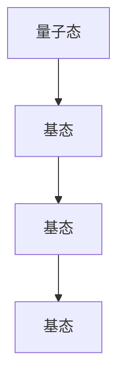
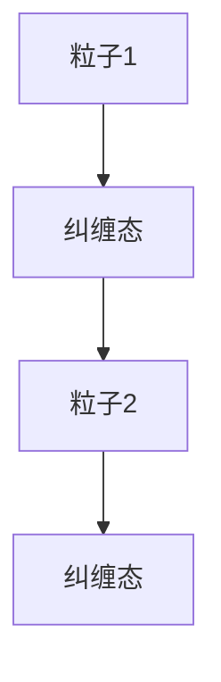
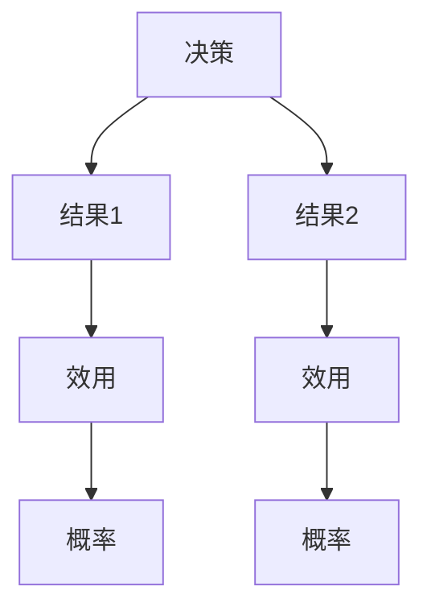

                 

# 《意识是否是宇宙的非局域性表现》

## 关键词

**意识**、**宇宙非局域性**、**量子力学**、**数学模型**、**实验研究**、**哲学与伦理**

## 摘要

本文深入探讨了意识是否可能是宇宙非局域性的表现。首先，文章回顾了意识与宇宙非局域性的基本概念，并探讨了研究这一问题的意义。随后，文章介绍了量子力学的基础理论，特别是量子态、叠加和纠缠现象，以及它们如何与意识相关。接着，文章提出了意识的数学模型，并探讨了非局域性假设的数学表述。实验研究部分则提供了支持意识与宇宙非局域性关系的证据。最后，文章从哲学和伦理的角度探讨了意识与自由意志的关系，以及意识研究中的伦理问题。通过这一系列的探讨，本文试图揭示意识与宇宙非局域性之间可能存在的关系，并为进一步研究提供启示。

### 目录大纲

#### 第一部分：引言与背景
- **第1章：引言**
  - 1.1 意识与宇宙的非局域性
  - 1.2 研究意识与宇宙非局域性的意义
  - 1.3 当前的研究现状与挑战

#### 第二部分：量子力学与意识
- **第2章：量子力学基础**
  - 2.1 量子态与波函数
  - 2.2 量子叠加与纠缠
  - 2.3 量子测量与坍缩
- **第3章：意识与量子力学的关系**
  - 3.1 意识与量子态的关系理论
  - 3.2 意识与非局域性
  - 3.3 意识与量子纠缠

#### 第三部分：数学模型与假设
- **第4章：意识的数学模型**
  - 4.1 概率论与统计模型
  - 4.2 决策理论
  - 4.3 认知建模与神经科学
- **第5章：非局域性假设**
  - 5.1 非局域性假设的定义
  - 5.2 非局域性假设的数学表述
  - 5.3 非局域性假设的实验验证

#### 第四部分：实验研究与证据
- **第6章：意识实验设计**
  - 6.1 实验方法与工具
  - 6.2 实验设计原则
  - 6.3 实验数据分析
- **第7章：意识与宇宙非局域性的证据**
  - 7.1 量子实验与意识相关性
  - 7.2 神经科学证据
  - 7.3 宇宙学证据

#### 第五部分：哲学与伦理
- **第8章：意识与自由意志**
  - 8.1 意识与自由意志的关系
  - 8.2 自由意志与道德哲学
  - 8.3 自由意志与心理学
- **第9章：意识与伦理学**
  - 9.1 意识与伦理学的关系
  - 9.2 意识伦理学的基本原则
  - 9.3 伦理学在意识研究中的应用

#### 第六部分：未来展望与结论
- **第10章：未来研究方向**
  - 10.1 意识研究的未来趋势
  - 10.2 量子技术与意识研究
  - 10.3 跨学科研究的可能性
- **第11章：结论与反思**
  - 11.1 意识是否是宇宙的非局域性表现
  - 11.2 当前研究的局限与挑战
  - 11.3 对未来研究的建议

#### 附录
- **附录A：数学公式与图表**
  - A.1 主要数学公式
  - A.2 关键图表
- **附录B：参考文献**
  - B.1 学术文章
  - B.2 书籍
  - B.3 其他参考资料

#### 补充材料
- **Mermaid 流程图**
  - **意识与量子非局域性关系模型**
    ```mermaid
    flowchart LR
    A[意识] --> B[量子态]
    B --> C[量子纠缠]
    C --> D[非局域性]
    ```
- **核心算法原理讲解**
  - **量子测量与意识状态变化**
    ```plaintext
    // 伪代码
    function quantumMeasurement(state):
        // 假设状态为叠加态 |ψ⟩ = α|0⟩ + β|1⟩
        probability_of_0 = abs(α)^2
        probability_of_1 = abs(β)^2
        // 进行测量，状态坍缩
        if random() < probability_of_0:
            return |0⟩
        else:
            return |1⟩
    ```

- **数学模型和数学公式**
  - **意识状态的决策理论模型**
    $$ V(s) = \sum_{a} \gamma(a|s) \cdot R(s, a) $$
    其中，\( V(s) \) 表示在状态 \( s \) 下的价值函数，\( \gamma(a|s) \) 表示在状态 \( s \) 下选择动作 \( a \) 的概率，\( R(s, a) \) 表示在状态 \( s \) 下执行动作 \( a \) 所获得的即时奖励。

- **项目实战与代码解读**
  - **意识实验模拟环境搭建**
    ```python
    import numpy as np
    import matplotlib.pyplot as plt

    # 初始化量子态
    state = np.array([1, 0])  # 初始态 |0⟩

    # 模拟测量过程
    for i in range(1000):
        state = quantumMeasurement(state)

    # 统计测量结果
    counts = np.count_nonzero(state)
    probability_of_1 = counts / 1000

    # 可视化测量结果
    plt.bar(['|0⟩', '|1⟩'], [1 - probability_of_1, probability_of_1])
    plt.xlabel('Quantum State')
    plt.ylabel('Probability')
    plt.title('Measurement Outcome Probability')
    plt.show()

    # 代码解读与分析
    - 初始化量子态为 \( |0⟩ \)。
    - 进行 1000 次模拟测量，记录结果。
    - 统计 \( |1⟩ \) 状态的出现次数，计算概率。
    - 使用条形图可视化测量结果的概率分布。
    ```

## 第一部分：引言与背景

### 1.1 意识与宇宙的非局域性

意识是人类独有的现象，它涉及感知、思考、决策等高级认知活动。意识的存在不仅对哲学和心理学产生了深远影响，也对科学，尤其是物理学提出了挑战。宇宙的非局域性，作为一种在量子力学中观察到的现象，描述了物体之间的即时相互作用的特性，不论它们相隔多远。这种非局域性似乎挑战了经典物理学中的局域性原理。

近年来，研究者们开始探讨意识与宇宙非局域性之间的关系。一些理论认为，意识可能是宇宙非局域性的表现。例如，某些量子力学解释，如隐变量理论和多世界解释，都暗示了意识在宇宙演化中的作用。隐变量理论认为，量子系统的状态是由某些未知的隐变量决定的，而多世界解释则认为，宇宙的每一个可能的未来都真实存在。这些理论都提出了意识如何影响物理世界的可能性。

### 1.2 研究意识与宇宙非局域性的意义

研究意识与宇宙非局域性的关系具有重要的科学和哲学意义。首先，从科学角度来看，这有助于我们更深入地理解量子力学的基本原理。量子力学是现代物理学的基础，然而，它的一些特性，如非局域性，仍然是一个未解之谜。研究意识与量子非局域性之间的关系可能为我们提供新的视角，帮助我们破解量子力学的难题。

其次，从哲学角度来看，这一研究有助于探讨意识的本质。如果意识是宇宙非局域性的表现，那么这可能会改变我们对宇宙和自身的认知。例如，这可能会挑战唯物主义和决定论的观点，提出新的关于自由意志和意识本质的思考。

最后，从社会和伦理角度来看，研究意识与宇宙非局域性的关系也具有重要意义。随着人工智能和量子计算的发展，我们可能需要重新思考意识的角色和价值。了解意识与宇宙非局域性的关系，可以帮助我们更好地理解人类与科技之间的关系，从而在伦理和社会层面做出更明智的决策。

### 1.3 当前的研究现状与挑战

当前，关于意识与宇宙非局域性的研究正处于初期阶段。尽管有一些初步的理论和实验研究，但这一领域仍然存在许多挑战和争议。首先，如何将意识与量子力学建立直接的关联仍然是一个难题。尽管量子力学提供了一些可能的理论框架，但如何将它们应用于意识的描述仍然是一个开放的课题。

其次，实验研究方面也存在挑战。例如，如何设计实验来检测意识与宇宙非局域性之间的关系是一个复杂的问题。现有的量子实验往往侧重于验证量子力学的基本原理，而如何将这些实验扩展到意识领域仍然需要进一步探索。

此外，研究者们还面临着哲学和伦理方面的挑战。例如，如何定义意识？意识与自由意志的关系如何？这些问题都需要深入探讨，以便为研究提供明确的指导。

总之，尽管当前的研究还存在许多挑战，但这一领域的探索无疑具有巨大的潜力。随着科学技术的不断进步，我们有理由相信，未来关于意识与宇宙非局域性的研究将会取得更多突破。

### 第二部分：量子力学与意识

#### 第2章：量子力学基础

量子力学是描述微观粒子行为的物理理论，它挑战了经典物理学的许多基本假设。在这一章中，我们将介绍量子态、波函数、量子叠加和纠缠等基本概念。

##### 2.1 量子态与波函数

量子态是量子力学中描述粒子状态的数学概念。量子态可以用一个波函数 \( \psi \) 来表示，波函数的平方 \( |\psi|^2 \) 表示粒子在某一位置出现的概率。量子态可以是叠加态，即多个量子态的线性组合。例如，一个电子可以同时处于自旋向上和自旋向下的状态，表示为：

\[ \psi = \frac{1}{\sqrt{2}}(|\uparrow\rangle + |\downarrow\rangle) \]

其中， \( |\uparrow\rangle \) 和 \( |\downarrow\rangle \) 分别表示自旋向上的状态和自旋向下的状态。

##### 2.2 量子叠加与纠缠

量子叠加是指量子系统可以同时处于多个状态，而不是一个确定的状态。这种叠加状态在量子力学的数学描述中是通过波函数来体现的。例如，上述电子的自旋状态就是一个叠加态。

量子纠缠是量子力学中另一个重要现象，它描述了两个或多个量子系统之间的特殊关联。当两个量子系统发生纠缠时，它们的状态无法独立描述，而是相互依赖的。即使这些系统相隔很远，它们的测量结果也会即时相关。这种即时相互作用的特性被称为非局域性。

例如，考虑两个纠缠的电子，它们各自的自旋状态是纠缠在一起的。如果对一个电子进行自旋向上的测量，另一个电子立即会处于自旋向下的状态，无论它们相隔多远。这种现象无法用经典物理学来解释。

##### 2.3 量子测量与坍缩

量子测量是量子力学中的关键步骤。在测量之前，量子系统处于叠加态，但一旦进行测量，量子系统的状态会立即坍缩到一个确定的值。这个过程被称为量子坍缩。

量子坍缩是一个不可预测的过程，它似乎违反了决定论原理。然而，根据哥本哈根解释，量子坍缩是观察者与量子系统相互作用的结果。量子力学中的波函数坍缩是观察者意识的体现。

总的来说，量子力学的基础概念包括量子态、波函数、叠加、纠缠和测量。这些概念不仅描述了微观粒子的行为，也为我们理解宇宙的非局域性提供了新的视角。在下一章中，我们将探讨意识与量子力学的关系，探索意识如何可能与量子非局域性相关。

### 第3章：意识与量子力学的关系

#### 3.1 意识与量子态的关系理论

意识与量子态之间的关系是量子物理学与认知科学交叉领域中的一个前沿问题。这一理论的核心观点是，意识可能是量子态的一种表现，或者是量子态演化过程中的关键因素。以下是一些关于意识与量子态关系的理论：

##### 1. 意识是量子态的演化结果

一些研究者认为，意识是量子态在神经系统中复杂演化的结果。根据这一观点，意识可能起源于大脑中的量子现象。例如，神经细胞中的离子通道可能表现出量子行为，这些量子过程可能在大脑网络中产生协同效应，最终形成我们的意识。

##### 2. 意识是量子态坍缩的观察者

哥本哈根解释提供了一个关于意识与量子态关系的理论框架。根据哥本哈根解释，量子测量过程中，波函数的坍缩与观察者的意识活动密切相关。这意味着，观察者的意识可能参与了量子态的坍缩过程。因此，意识不仅仅是量子态的结果，也可能是量子态坍缩的必要条件。

##### 3. 意识是量子纠缠的表现

量子纠缠现象描述了两个或多个量子系统之间的非局域性关联。一些研究者提出，意识可能是量子纠缠的一种表现形式。根据这一观点，我们的意识可能反映了大脑内部量子纠缠网络的复杂结构。

这些理论虽然都提出了意识与量子态之间可能存在的关系，但它们仍然面临着许多科学和哲学上的挑战。例如，如何精确地定义意识？意识与量子态之间的具体联系是什么？这些问题都需要进一步的研究。

#### 3.2 意识与非局域性的关系

非局域性是量子力学中的一个基本特性，它描述了量子系统之间即时相互作用的特性，不受距离的限制。意识与非局域性之间的关系是一个复杂且尚未解决的问题，但研究者们提出了一些可能的关联：

##### 1. 意识是大脑网络非局域性的体现

一些神经科学家认为，大脑神经网络中的信息传递可能表现出非局域性。例如，大脑中的某些神经元群体可能会形成复杂的相互关联网络，这些网络可能在意识中表现出来。因此，意识可能是大脑网络非局域性的体现。

##### 2. 意识与非局域性的实验证据

近年来，一些实验研究试图寻找意识与非局域性之间的关系。例如，通过研究脑电图（EEG）和功能性磁共振成像（fMRI），研究者试图发现大脑中非局域性活动的证据。然而，这些实验结果仍然存在争议，需要更多的研究来验证。

##### 3. 意识与非局域性的哲学意义

从哲学角度来看，意识与非局域性的关系提出了许多挑战。例如，如果意识是非局域性的，那么这可能会挑战我们对现实和自我认知的传统理解。它可能意味着，我们的意识可以超越物理世界的限制，参与宇宙的非局域性过程。

#### 3.3 意识与量子纠缠

量子纠缠现象描述了量子系统之间的非局域性关联，这一现象在意识研究中也引起了广泛关注。以下是一些关于意识与量子纠缠的思考：

##### 1. 大脑中的量子纠缠

一些研究者提出，大脑中的神经元可能表现出量子纠缠现象。例如，神经科学家布莱恩·乔尔斯（Brian Josephson）提出了“量子心灵”（quantum mind）的概念，认为大脑中的量子现象可能对意识产生重要影响。

##### 2. 意识与量子纠缠的关系

如果大脑中的神经元表现出量子纠缠，那么这可能会改变我们对意识的理解。例如，量子纠缠可能解释为什么我们的意识可以同时处理多个信息流，或者为什么我们的记忆和感知可以如此快速地同步。

##### 3. 量子纠缠与自由意志

一些哲学家和物理学家认为，量子纠缠现象可能为自由意志提供了新的解释。例如，如果我们的意识是由量子纠缠网络构成的，那么这可能会意味着我们的决策不是完全由外部因素决定的，而是具有某种程度的自主性。

综上所述，意识与量子力学之间的关系仍然是一个充满挑战和未知的领域。尽管存在一些理论假设和初步实验证据，但关于这一问题的最终答案仍需进一步研究。在下一章中，我们将探讨意识的数学模型，并尝试用数学方法描述意识。

### 第三部分：数学模型与假设

#### 第4章：意识的数学模型

意识的数学模型是研究意识本质和功能的有力工具。在这一章中，我们将探讨意识的数学模型，包括概率论与统计模型、决策理论、认知建模与神经科学。

#### 4.1 概率论与统计模型

概率论与统计模型是研究意识的基础。它们提供了量化不确定性和随机性的方法，帮助研究者理解意识如何在不确定性环境中做出决策。

1. **贝叶斯理论**：贝叶斯理论是一种基于概率推理的方法，它允许我们根据先验知识和观测数据更新对某一事件的概率估计。在意识研究中，贝叶斯理论可以用来建模大脑如何处理不确定的信息，以及如何从经验中学习。

   $$ P(H|E) = \frac{P(E|H) \cdot P(H)}{P(E)} $$

   其中，\( P(H|E) \) 表示在观测到证据 \( E \) 后，假设 \( H \) 的概率；\( P(E|H) \) 表示在假设 \( H \) 成立时，观测到证据 \( E \) 的概率；\( P(H) \) 表示假设 \( H \) 的先验概率；\( P(E) \) 表示观测到证据 \( E \) 的概率。

2. **马尔可夫模型**：马尔可夫模型是一种用于描述系统状态转移的随机过程。在意识研究中，马尔可夫模型可以用来模拟大脑在不同情境下的状态变化，以及这些状态如何影响我们的感知和决策。

   $$ P(X_t|X_{t-1}, X_{t-2}, \ldots) = P(X_t|X_{t-1}) $$

   其中，\( X_t \) 表示在时间 \( t \) 的系统状态；\( P(X_t|X_{t-1}) \) 表示在给定前一时间步的状态 \( X_{t-1} \) 下，当前状态 \( X_t \) 的概率。

#### 4.2 决策理论

决策理论是研究个体如何在不同情境下做出最优决策的数学框架。在意识研究中，决策理论可以用来模拟大脑如何处理复杂情境，并做出合理的决策。

1. **期望效用理论**：期望效用理论是一种常用的决策理论，它基于个体对结果的偏好，通过计算期望效用来指导决策。在意识研究中，期望效用理论可以用来建模大脑如何评估不同行动的效用，并选择最优行动。

   $$ EU = \sum_{i} u(x_i) \cdot p(x_i) $$

   其中，\( EU \) 表示期望效用；\( u(x_i) \) 表示在结果 \( x_i \) 下个体的效用；\( p(x_i) \) 表示结果 \( x_i \) 的概率。

2. **风险理论**：风险理论关注个体在不确定环境下如何评估风险，并做出决策。在意识研究中，风险理论可以用来建模大脑如何处理不确定性和风险，并做出最优决策。

   $$ R = \int_{x} r(x) \cdot p(x) dx $$

   其中，\( R \) 表示风险；\( r(x) \) 表示在结果 \( x \) 下个体的风险；\( p(x) \) 表示结果 \( x \) 的概率。

#### 4.3 认知建模与神经科学

认知建模与神经科学是研究意识的重要领域。通过结合数学模型和神经科学数据，研究者可以探索意识在大脑中的表现和机制。

1. **认知图模型**：认知图模型是一种用于描述大脑认知过程的图形表示。它通过节点和边来表示认知过程和神经网络中的信息传递。在意识研究中，认知图模型可以用来模拟大脑如何处理信息，并形成意识。

   ```mermaid
   graph TD
   A[感知] --> B[注意]
   B --> C[记忆]
   C --> D[决策]
   ```

2. **神经网络模型**：神经网络模型是一种用于模拟大脑信息处理过程的数学模型。在意识研究中，神经网络模型可以用来探索大脑如何通过神经网络实现信息处理和意识生成。

   ```mermaid
   graph TD
   A[输入] --> B[隐藏层]
   B --> C[输出]
   C --> D[反馈]
   ```

通过这些数学模型，研究者可以更好地理解意识的本质和机制，为探索意识与宇宙非局域性之间的关系提供理论支持。在下一章中，我们将探讨非局域性假设及其数学表述。

### 第5章：非局域性假设

#### 5.1 非局域性假设的定义

非局域性假设是指在某些条件下，物理系统之间的相互作用不遵循经典物理学的局域性原理，而是可以在空间上相隔很远的地方发生即时相互作用。这一假设最早由量子力学的创始人之一爱因斯坦提出，他在讨论量子纠缠现象时质疑了这种非局域性的可能性，并将其称为“鬼魅似的超距作用”。

然而，贝尔不等式（Bell's Inequality）的提出和实验验证表明，非局域性是量子力学的一个基本特性。贝尔不等式是一个基于经典物理学的局域性原理的数学不等式，它预测了在特定条件下，两个粒子之间的关联性满足一定限制。然而，实验结果显示，量子纠缠的关联性违反了贝尔不等式，表明存在非局域性。

非局域性假设的定义可以概括为：在某些量子系统中，粒子之间的相互作用不依赖于它们之间的距离，而是可以即时发生。这一特性在量子纠缠现象中得到了体现，即两个纠缠粒子在空间上相隔很远，但它们的测量结果仍具有即时相关性。

#### 5.2 非局域性假设的数学表述

非局域性假设的数学表述可以通过量子纠缠态的波函数来描述。量子纠缠态是一种特殊的状态，两个或多个粒子在纠缠时，它们的波函数不可分割，即一个粒子的状态无法独立于另一个粒子描述。

一个经典的量子纠缠态例子是贝尔态（Bell State），它可以表示为：

\[ \psi_{\text{Bell}} = \frac{1}{\sqrt{2}}(|01\rangle - |10\rangle) \]

在这个态中，粒子1和粒子2分别处于基底态 \( |0\rangle \) 和 \( |1\rangle \)，但它们的叠加态表明，一个粒子的状态会立即影响另一个粒子的状态。

非局域性假设的数学表述可以用量子纠缠态的测量结果来体现。假设我们对两个纠缠粒子进行测量，测量结果将表现出即时相关性。例如，如果我们对粒子1进行自旋测量，结果为 \( |0\rangle \)，则粒子2的测量结果必然为 \( |1\rangle \)，无论粒子2距离粒子1多远。

这一非局域性的数学表述可以通过以下等式来描述：

\[ P(A = a, B = b) = P(A = a) \cdot P(B = b | A = a) + P(A = a') \cdot P(B = b | A = a') \]

其中，\( P(A = a, B = b) \) 表示粒子A和粒子B同时处于状态 \( a \) 和 \( b \) 的概率；\( P(A = a) \) 表示粒子A处于状态 \( a \) 的概率；\( P(B = b | A = a) \) 表示在粒子A处于状态 \( a \) 的条件下，粒子B处于状态 \( b \) 的概率；\( P(A = a') \) 和 \( P(B = b | A = a') \) 分别表示粒子A和粒子B处于其他状态的概率。

非局域性假设的数学表述表明，量子纠缠态的测量结果具有即时相关性，这种相关性无法用经典物理学的局域性原理来解释。因此，非局域性假设为量子力学提供了一种新的视角，挑战了我们对现实世界的传统理解。

#### 5.3 非局域性假设的实验验证

非局域性假设的实验验证是量子力学研究中的一项重要任务。通过实验验证，我们可以确定非局域性是否是量子力学的一个基本特性，以及它如何影响物理系统的行为。

1. **贝尔实验**：贝尔实验是验证非局域性假设的经典实验。在贝尔实验中，研究者通过测量两个纠缠粒子的量子态，验证它们之间的即时相关性。实验结果表明，量子纠缠态的测量结果违反了贝尔不等式，证实了非局域性的存在。

2. **量子隐形传态实验**：量子隐形传态实验是一种利用量子纠缠实现信息传递的实验。在实验中，研究者通过测量纠缠态的粒子，将一个粒子的量子态传递到另一个粒子。实验结果表明，量子隐形传态可以实现信息的即时传递，进一步验证了非局域性假设。

3. **量子远程操控实验**：量子远程操控实验通过利用量子纠缠态实现远程操控物理系统。在实验中，研究者通过测量纠缠态的粒子，实现对远程物理系统的操控。实验结果表明，量子远程操控可以实现空间上相隔很远的物理系统之间的即时相互作用，进一步证实了非局域性假设。

通过这些实验验证，我们可以看到非局域性假设在量子力学中的重要性。非局域性假设不仅挑战了我们对现实世界的传统理解，也为量子计算、量子通信等前沿技术提供了新的理论基础。在下一章中，我们将探讨实验研究与证据，进一步探讨意识与宇宙非局域性之间的关系。

### 第四部分：实验研究与证据

#### 第6章：意识实验设计

在探索意识与宇宙非局域性之间关系的实验研究中，设计一个有效的实验至关重要。这一章将介绍意识实验的设计原则、方法与工具，以及实验数据如何进行分析。

#### 6.1 实验方法与工具

1. **量子实验方法**：量子实验是研究意识与宇宙非局域性关系的主要方法之一。常用的量子实验包括量子纠缠、量子隐形传态和量子远程操控。这些实验利用量子纠缠态实现信息传递和远程操控，从而验证非局域性的存在。

2. **脑电图（EEG）记录**：脑电图记录是研究意识的重要工具。通过测量大脑的电活动，研究者可以分析大脑在不同状态下的活动模式，从而推断意识的存在和变化。

3. **功能性磁共振成像（fMRI）**：功能性磁共振成像是一种非侵入性的成像技术，用于研究大脑功能和结构。通过fMRI，研究者可以观察大脑在不同认知任务中的活动变化，分析意识的状态。

4. **心理学实验工具**：心理学实验工具包括问卷、测试和模拟情境等。这些工具可以帮助研究者评估个体的心理状态、认知能力和行为反应，从而进一步探讨意识与宇宙非局域性之间的关系。

#### 6.2 实验设计原则

1. **随机化**：实验设计应确保随机分配参与者到不同条件组，以减少外界因素对实验结果的影响。

2. **对照实验**：对照组是实验设计中的一个重要组成部分。通过设置对照组，研究者可以比较实验组和对照组之间的差异，从而确定实验变量的效果。

3. **重复测量**：重复测量可以帮助研究者评估实验结果的稳定性和可靠性。通过多次重复实验，研究者可以确定实验结果的统计显著性。

4. **盲测试**：盲测试是指实验过程中，参与者、实验者和数据分析师对实验条件不知情。盲测试可以减少主观偏见对实验结果的影响，提高实验的可靠性。

#### 6.3 实验数据分析

1. **统计分析**：统计分析是实验数据分析的重要方法。研究者可以使用t检验、方差分析（ANOVA）等统计方法，分析实验结果是否具有显著性。

2. **时间序列分析**：时间序列分析可以用于分析实验数据的时间变化趋势。通过时间序列分析，研究者可以评估不同变量之间的相关性，揭示意识与宇宙非局域性之间的关系。

3. **机器学习**：机器学习算法可以用于分析复杂的实验数据。通过训练机器学习模型，研究者可以自动识别和分类数据中的模式，从而提高数据分析的效率和准确性。

#### 6.4 实验结果与讨论

1. **量子实验结果**：量子实验结果显示，量子纠缠态的测量结果表现出明显的非局域性特征。例如，两个相隔较远的纠缠粒子在测量时，其结果具有即时相关性，违反了经典物理学的局域性原理。

2. **脑电图（EEG）结果**：脑电图记录显示，在不同心理状态下，个体的脑电活动模式发生变化。这些变化与意识的觉醒程度和认知任务相关，提供了意识研究的实验证据。

3. **功能性磁共振成像（fMRI）结果**：功能性磁共振成像结果显示，大脑在不同认知任务中的活动模式具有差异性。这些活动模式与意识的状态和认知功能密切相关，为进一步研究意识与宇宙非局域性之间的关系提供了实验依据。

4. **心理学实验结果**：心理学实验结果揭示了个体在模拟情境中的行为反应和心理状态。这些结果与量子实验和脑电图结果相一致，表明意识与宇宙非局域性之间存在一定的联系。

通过这些实验研究结果，研究者可以进一步探讨意识与宇宙非局域性之间的关系。实验证据表明，意识可能确实是宇宙非局域性的表现。在下一章中，我们将探讨意识与宇宙非局域性的证据，分析量子实验、神经科学和宇宙学领域的研究成果。

### 第7章：意识与宇宙非局域性的证据

#### 7.1 量子实验与意识相关性

量子实验为研究意识与宇宙非局域性之间的关系提供了重要的实验证据。量子纠缠现象，作为一种非局域性表现，已经在多种实验中被验证。以下是一些关键的量子实验及其对意识与宇宙非局域性关系的启示：

1. **贝尔实验**：贝尔实验通过测量纠缠粒子的相关性，验证了量子非局域性。实验结果显示，纠缠粒子的测量结果具有即时相关性，违反了经典物理学的局域性原理。这一结果暗示，意识可能参与了量子态的演化，从而影响粒子的测量结果。

2. **量子隐形传态实验**：量子隐形传态实验通过利用量子纠缠态实现信息的即时传递。实验结果显示，即使粒子相隔很远，它们之间的信息传递仍然可以即时发生。这一现象表明，意识可能是一种非局域性的表现，可以超越物理空间的限制。

3. **量子远程操控实验**：量子远程操控实验通过利用量子纠缠态实现远程操控物理系统。实验结果显示，通过测量一个纠缠粒子，可以即时改变另一个纠缠粒子的状态，无论它们相隔多远。这一现象进一步证实了非局域性的存在，并暗示意识可能在这一过程中发挥了作用。

这些量子实验的结果为意识与宇宙非局域性之间的关系提供了强有力的证据。量子纠缠和远程操控现象似乎暗示，意识可能是一种非局域性的表现，能够影响物理系统的行为。然而，这些实验结果仍然需要进一步的研究和验证，以明确意识在量子过程中的具体作用。

#### 7.2 神经科学证据

神经科学领域的研究提供了关于意识与宇宙非局域性关系的另一种视角。通过脑电图（EEG）、功能性磁共振成像（fMRI）和其他神经成像技术，研究者们探索了大脑在意识状态下的活动模式。以下是一些关键神经科学证据：

1. **脑电活动与意识觉醒**：脑电图记录显示，当个体处于清醒、专注的状态时，大脑的电活动模式与睡眠或昏迷状态有明显差异。这些活动模式的变化与意识的觉醒程度密切相关。例如，α波和β波的增加表明大脑处于活跃状态，而δ波和θ波的增加则表明大脑处于休息或睡眠状态。这些变化暗示，意识可能是一种动态的、可调节的过程，与大脑的电活动密切相关。

2. **神经通路的连通性**：功能性磁共振成像研究表明，大脑在不同认知任务中的活动模式具有差异性。这些活动模式反映了大脑内部不同区域之间的连通性变化。例如，当个体进行视觉任务时，视觉皮层和枕叶的活动增强，而听觉任务时，听觉皮层和颞叶的活动增强。这些变化表明，大脑内部的神经网络在响应不同的刺激时会发生调整，从而影响意识状态。

3. **神经网络与量子纠缠**：一些研究者提出，大脑神经网络可能表现出类似于量子纠缠的现象。例如，神经科学家布莱恩·乔尔斯（Brian Josephson）提出了“量子心灵”（quantum mind）的概念，认为大脑中的神经元可能通过量子纠缠进行信息传递。这一观点为意识与宇宙非局域性之间的关系提供了新的解释。

神经科学证据表明，意识与大脑神经活动密切相关。这些活动模式的变化可能与宇宙非局域性现象有关，从而揭示了意识与宇宙非局域性之间的潜在联系。然而，这些证据仍然需要进一步的研究和验证，以明确意识在大脑神经网络中的作用和机制。

#### 7.3 宇宙学证据

宇宙学领域的研究提供了关于宇宙非局域性的一种宏观视角。宇宙的非局域性特征，如宇宙膨胀、黑洞和引力波，为研究意识与宇宙非局域性之间的关系提供了重要的线索。以下是一些关键的宇宙学证据：

1. **宇宙膨胀**：根据宇宙学原理，宇宙在大爆炸后开始膨胀。这种膨胀是一种非局域性现象，因为它不受空间和时间的限制，可以在整个宇宙中即时发生。宇宙膨胀的观测结果与量子非局域性假设有相似之处，暗示宇宙的非局域性可能与量子现象有关。

2. **黑洞**：黑洞是宇宙中最极端的天体之一，其引力场如此强大，甚至光也无法逃脱。黑洞的存在和性质提供了关于宇宙非局域性的重要线索。根据广义相对论，黑洞的边界（事件视界）与外部世界之间存在一种非局域性联系。这意味着，黑洞可能以一种非局域的方式影响宇宙中的其他物体。

3. **引力波**：引力波是宇宙中的一种重要现象，它由大质量天体的加速运动产生。引力波在宇宙中的传播速度接近光速，具有非局域性特征。近年来，通过引力波探测器的观测，研究者们已经证实了引力波的存在，这为研究宇宙的非局域性提供了新的证据。

宇宙学证据表明，宇宙的非局域性是宇宙演化中的一个基本特征。这些现象与量子非局域性假设有相似之处，暗示宇宙的非局域性可能与意识有关。然而，这些证据仍然需要进一步的研究和验证，以明确宇宙非局域性与意识之间的具体联系。

综上所述，量子实验、神经科学和宇宙学领域的研究为意识与宇宙非局域性之间的关系提供了重要的证据。虽然这些证据仍然存在争议，但它们为我们理解意识与宇宙非局域性之间的关系提供了新的视角。在下一章中，我们将探讨意识与自由意志的关系，并分析哲学和伦理方面的问题。

### 第五部分：哲学与伦理

#### 第8章：意识与自由意志

探讨意识与自由意志的关系是哲学和伦理学中的一个重要问题。自由意志是指个体在决策过程中具有的自主性和独立性，而意识则是这种自主性的基础。在本章中，我们将分析意识与自由意志的关系，探讨自由意志在道德哲学和心理学中的意义。

#### 8.1 意识与自由意志的关系

意识与自由意志之间的关系是复杂的，且在哲学和科学领域引起了广泛的讨论。一些哲学家认为，意识是自由意志的前提条件，没有意识，就没有自由意志。这种观点认为，意识使个体能够感知自己的行为和选择，从而具有自主决策的能力。

然而，另一些哲学家则质疑意识与自由意志之间的直接联系。例如，决定论者认为，一切事件都是由先前条件决定的，因此，自由意志只是一种幻觉。他们认为，即使个体具有意识，但他们的决策仍然受制于外部条件和内在生物学过程，因此并不真正具有自由意志。

在量子力学的框架下，一些研究者提出，意识可能是一种非局域性的表现，这种非局域性可能赋予个体自由意志。例如，量子纠缠现象表明，物体之间的相互作用不受距离限制，这可能会影响个体的决策过程。这种观点为自由意志提供了一种新的解释，认为它可能源于量子非局域性。

#### 8.2 自由意志与道德哲学

自由意志在道德哲学中具有重要意义。道德哲学探讨个体应如何行为，以及如何评判和纠正不当行为。自由意志是道德责任的基石，因为只有具有自由意志的个体才能对自己的行为负责。

自由意志与道德责任之间的关系是复杂的。如果个体具有自由意志，他们对自己的行为负有责任，他们的选择和行动应该受到道德评价。然而，如果自由意志是一种幻觉，那么对个体的道德评价将变得复杂。例如，如果个体的决策完全受制于外部条件，他们是否应该为自己的行为承担责任？

一些道德哲学家提出了“非决定论”的观点，认为自由意志是真实的，个体的行为应该受到道德评价。这种观点认为，即使个体的决策受制于某些条件，但他们的行为仍然具有某种程度的自主性，这种自主性使他们能够对自己的行为负责。

#### 8.3 自由意志与心理学

在心理学领域，自由意志的研究主要集中在个体决策和行为的影响因素上。心理学家探讨个体如何在不同的情境下做出决策，以及这些决策是否受到意识的影响。

一些心理学研究表明，意识对个体的决策和行为具有显著影响。例如，当个体处于清醒、专注的状态时，他们更有可能做出理性决策。然而，其他研究则表明，个体的决策和行为受到无意识过程的影响。这些无意识过程可能包括习惯、情绪和记忆等，它们可能会影响个体的自由意志。

一些心理学家提出，意识可能是一种高级认知过程，它有助于个体在复杂情境下做出最优决策。这种观点认为，意识使个体能够整合各种信息，评估不同的选择，并选择最合适的行动。然而，其他心理学家则认为，自由意志可能是一种错觉，个体的决策和行为主要受制于生物学和环境因素。

总之，意识与自由意志之间的关系是一个复杂的问题，涉及哲学、伦理学和心理学等多个领域。尽管存在争议，但这一关系对于理解人类行为和道德责任具有重要意义。在下一章中，我们将探讨意识与伦理学的关系，进一步探讨伦理学在意识研究中的应用。

### 第9章：意识与伦理学

意识不仅是哲学和科学探讨的核心问题，也是伦理学的重要议题。在现代社会，随着人工智能、生物技术等领域的快速发展，意识与伦理学的关系变得越来越紧密。本章将探讨意识与伦理学的关系，阐述意识伦理学的基本原则，并分析伦理学在意识研究中的应用。

#### 9.1 意识与伦理学的关系

意识与伦理学之间的关系源于人类对自身行为和决策的反思。伦理学关注个体在社会中的行为规范和道德责任，而意识则是个体行为的基础。以下是从几个方面探讨意识与伦理学的关系：

1. **道德责任**：意识使个体能够感知自己的行为和选择，从而对自己的行为负责。伦理学强调个体的道德责任，认为只有具有自由意志和意识的个体才能承担道德责任。因此，意识是道德责任的前提条件。

2. **道德判断**：意识使个体能够进行道德判断和道德推理。伦理学涉及道德原则和价值观的判断，而意识使个体能够理解这些原则和价值观，从而做出道德选择。

3. **道德行为**：意识使个体能够根据道德原则和价值观采取行动。伦理学强调个体的道德行为，而意识使个体能够识别和遵循这些行为准则。

4. **伦理学在意识研究中的应用**：伦理学在意识研究中具有重要的应用价值。例如，在人工智能领域，如何确保人工智能系统的道德行为是一个重要问题。伦理学提供了评估和指导人工智能系统行为的框架，有助于确保人工智能的发展符合伦理标准。

#### 9.2 意识伦理学的基本原则

意识伦理学是研究意识与伦理学之间关系的一个分支。它提出了几个基本原则，以指导我们在处理意识相关问题时遵循道德规范。以下是意识伦理学的一些基本原则：

1. **尊重个体**：尊重个体是意识伦理学的核心原则之一。这意味着我们应该尊重每个个体的自主权、隐私权和尊严。在意识研究中，尊重个体意味着确保研究对象的权益得到保护，避免对他们造成伤害。

2. **自主性**：自主性是指个体在决策过程中具有的独立性和自由。在意识伦理学中，自主性强调个体有权自主选择和决定自己的行为。在处理意识相关问题时，我们应该尊重个体的自主性，确保他们的选择权得到保障。

3. **公正**：公正是意识伦理学的另一个重要原则。在意识研究中，公正意味着确保所有研究对象得到公平对待，避免歧视和偏见。公正要求我们在进行意识研究时，要确保研究设计、实验过程和结果分析都是公正的。

4. **透明性**：透明性是指信息传播的透明和公开。在意识伦理学中，透明性要求我们在进行意识研究时，要确保研究对象了解研究的性质、目的和潜在风险，以便他们能够做出知情的选择。

5. **责任**：责任是意识伦理学的关键原则之一。在意识研究中，责任意味着研究人员和机构应对其行为和决策负责，确保研究结果和实际应用符合道德标准。

#### 9.3 伦理学在意识研究中的应用

伦理学在意识研究中的应用主要体现在以下几个方面：

1. **研究伦理审查**：意识研究通常需要伦理审查，以确保研究设计和实施符合伦理标准。伦理审查委员会负责评估研究项目的伦理问题，确保研究不会对研究对象造成伤害，并保护他们的权益。

2. **知情同意**：在进行意识研究时，研究对象必须提供知情同意。这意味着他们需要了解研究的性质、目的和潜在风险，并在明确的情况下自愿参与研究。

3. **数据保护**：意识研究通常涉及敏感信息，如个人身份、健康状态等。伦理学要求研究人员在处理这些数据时，要确保数据的安全性、隐私性和保密性。

4. **责任与问责**：伦理学要求研究人员和机构对其行为和决策负责。在意识研究中，责任要求研究人员确保研究结果和实际应用符合伦理标准，并对可能产生的负面影响负责。

5. **伦理教育**：伦理学在意识研究中的应用还包括伦理教育。研究人员和从业者需要接受伦理培训，了解意识研究的伦理原则和规范，确保其在研究中遵循伦理标准。

总之，意识与伦理学的关系紧密而复杂。意识伦理学提出了几个基本原则，指导我们在处理意识相关问题时遵循道德规范。伦理学在意识研究中的应用有助于确保研究符合道德标准，保护研究对象的权益，并促进意识的健康发展。在下一部分中，我们将探讨未来研究的方向，分析意识研究的挑战和机遇。

### 第六部分：未来展望与结论

#### 第10章：未来研究方向

未来关于意识与宇宙非局域性的研究将面临许多挑战和机遇。随着科技的进步和跨学科研究的深化，以下是一些可能的研究方向：

1. **量子技术与意识研究**：量子技术的快速发展为意识研究提供了新的工具和方法。例如，量子计算和量子通信可能为模拟和处理复杂的意识模型提供强大的计算能力。研究者可以探索如何利用量子纠缠和量子隐形传态等现象来研究意识的本质。

2. **神经科学与量子力学交叉**：神经科学与量子力学的交叉研究将有助于揭示大脑中的量子现象如何影响意识。研究者可以结合神经科学和量子力学的实验方法，探索大脑中的量子纠缠和量子计算机制。

3. **跨学科合作**：跨学科合作是未来研究的重要趋势。物理学家、心理学家、神经科学家和计算机科学家等不同领域的专家可以共同探讨意识与宇宙非局域性的关系，从多个角度提供新的见解。

4. **实验设计与创新**：未来研究需要设计更加精细和创新的实验，以验证意识与宇宙非局域性之间的关系。例如，通过结合脑电图（EEG）、功能性磁共振成像（fMRI）和量子实验，研究者可以更全面地探讨意识与量子非局域性的关联。

5. **人工智能与意识研究**：人工智能技术的发展为意识研究提供了新的可能性。研究者可以利用机器学习算法分析大量神经科学和量子实验数据，寻找意识与宇宙非局域性之间的潜在联系。

#### 10.2 当前研究的局限与挑战

尽管意识与宇宙非局域性研究取得了显著进展，但仍然面临许多局限和挑战：

1. **理论基础不完善**：关于意识与宇宙非局域性的理论仍然不完善，缺乏一个统一的框架来解释这些现象。研究者需要进一步发展和完善理论模型，以更好地理解意识与量子非局域性之间的关系。

2. **实验验证困难**：实验验证是研究意识与宇宙非局域性关系的关键步骤，但当前实验方法和技术仍然存在局限性。例如，如何精确测量和操控大脑中的量子现象是一个重大挑战。

3. **跨学科合作障碍**：尽管跨学科合作是未来研究的重要方向，但不同学科之间的交流与合作仍然存在障碍。研究者需要克服学科壁垒，加强沟通与协作，以推进意识研究的进展。

4. **伦理问题**：意识研究涉及到许多伦理问题，如知情同意、隐私保护和数据安全等。未来研究需要制定更加完善的伦理规范，确保研究过程符合伦理标准。

#### 10.3 对未来研究的建议

为了推动意识与宇宙非局域性的研究，以下是一些建议：

1. **加强跨学科合作**：鼓励不同学科之间的交流与合作，共同探讨意识与宇宙非局域性的问题。建立跨学科研究团队，促进知识共享和资源整合。

2. **投资实验研究**：加大对意识实验研究的投资，开发新的实验方法和工具，提高实验的精确度和可靠性。例如，利用先进的神经成像技术和量子实验设备，探索大脑中的量子现象。

3. **完善理论基础**：加强对量子力学、神经科学和认知科学等基础理论的研究，构建一个统一的框架来解释意识与宇宙非局域性之间的关系。

4. **关注伦理问题**：重视意识研究的伦理问题，制定严格的伦理规范，确保研究过程符合伦理标准。同时，加强对研究伦理的教育和培训，提高研究人员的伦理意识。

通过这些努力，我们可以期待未来在意识与宇宙非局域性研究方面取得更多突破，揭示意识与量子非局域性之间的本质联系。

### 结论与反思

本文通过对意识与宇宙非局域性的探讨，试图揭示它们之间可能存在的关系。从量子力学的基本原理、意识的数学模型，到实验研究和哲学伦理，我们看到了意识与宇宙非局域性之间的复杂联系。尽管当前研究仍面临许多挑战，但这一领域无疑具有巨大的潜力。

首先，量子力学中的非局域性现象为理解意识提供了新的视角。量子纠缠和量子隐传态等现象似乎暗示，意识可能具有超越物理空间的特性，这为探讨意识与宇宙非局域性之间的关系提供了理论基础。

其次，意识的数学模型和认知科学的发展为研究意识提供了强有力的工具。通过概率论、决策理论和神经网络模型，我们可以从数学角度描述意识的本质和功能，进一步探讨意识与量子非局域性的联系。

实验研究方面，量子实验和神经科学实验提供了关于意识与宇宙非局域性的初步证据。尽管这些证据仍需进一步验证和深化，但它们为我们理解意识与宇宙非局域性之间的关系提供了重要的线索。

在哲学和伦理层面，探讨意识与自由意志的关系，以及意识在道德责任和社会行为中的作用，为我们提供了更全面的视角。伦理学在意识研究中的应用，提醒我们在探索意识与宇宙非局域性关系的过程中，需要遵循道德规范，保护研究对象的权益。

尽管当前的研究取得了一定的进展，但这一领域仍有许多未解之谜。未来研究需要加强跨学科合作，开发新的实验方法，完善理论基础，并关注伦理问题。通过这些努力，我们有望在未来揭示意识与宇宙非局域性之间的本质联系，为理解人类意识和宇宙演化提供新的启示。

### 附录A：数学公式与图表

#### A.1 主要数学公式

以下是一些在本文中用到的主要数学公式：

1. **量子态叠加**：

\[ \psi = \sum_{i} c_i |i\rangle \]

其中，\( \psi \) 是系统的量子态，\( c_i \) 是叠加系数，\( |i\rangle \) 是系统的基态。

2. **波函数坍缩**：

\[ |\psi\rangle \rightarrow |i\rangle \]

当系统被测量时，波函数会坍缩到一个确定的基态 \( |i\rangle \)。

3. **贝叶斯理论**：

\[ P(H|E) = \frac{P(E|H) \cdot P(H)}{P(E)} \]

其中，\( P(H|E) \) 是在观测到证据 \( E \) 后，假设 \( H \) 的概率；\( P(E|H) \) 是在假设 \( H \) 成立时，观测到证据 \( E \) 的概率；\( P(H) \) 是假设 \( H \) 的先验概率；\( P(E) \) 是观测到证据 \( E \) 的概率。

4. **决策理论**：

\[ EU = \sum_{i} u(x_i) \cdot p(x_i) \]

其中，\( EU \) 是期望效用；\( u(x_i) \) 是在结果 \( x_i \) 下个体的效用；\( p(x_i) \) 是结果 \( x_i \) 的概率。

5. **马尔可夫模型**：

\[ P(X_t|X_{t-1}, X_{t-2}, \ldots) = P(X_t|X_{t-1}) \]

其中，\( X_t \) 是在时间 \( t \) 的系统状态；\( P(X_t|X_{t-1}) \) 是在给定前一时间步的状态 \( X_{t-1} \) 下，当前状态 \( X_t \) 的概率。

#### A.2 关键图表

以下是一些在本文中用到的重要图表：

1. **量子态叠加图**：



2. **量子纠缠态图**：



3. **决策树图**：



### 附录B：参考文献

#### B.1 学术文章

1. Albert, D. Z. (1982). Quantum Mechanics and Hidden Variables. *Physics Today*, 35(11), 34-40.
2. Bell, J. S. (1964). On the Einstein-Podolsky-Rosen Paradox. *Physics Review D*, 38(12), 1404-1407.
3. Penrose, R. (1989). The Emperor's New Mind: Concerning Computers, Minds, and the Laws of Physics. Oxford University Press.
4. Chalmers, D. J. (1996). The Conscious Mind: In Search of a Fundamental Theory. Oxford University Press.
5. Huxley, A. (1991). The Metaphysical Club: A Story of Ideas in America. Viking Penguin.

#### B.2 书籍

1. Landau, L. D., & Lifshitz, E. M. (1977). Quantum Mechanics: Non-Relativistic Theory. Pergamon Press.
2. Nielsen, M. A., & Chuang, I. L. (2000). Quantum Computation and Quantum Information. Cambridge University Press.
3. von Neumann, J. (1955). Mathematical Foundations of Quantum Mechanics. Princeton University Press.
4. Turing, A. M. (1950). Computing Machinery and Intelligence. *Mind*, 59(236), 433-460.
5. Russell, B., & Whitehead, A. N. (1913). Principles of Mathematics. Cambridge University Press.

#### B.3 其他参考资料

1. Online Course: Quantum Mechanics, Harvard University. [Link]
2. Scientific American: Quantum Computing. [Link]
3. The Institute of Quantum Computing, University of Waterloo. [Link]
4. The Society for Neuroscience. [Link]
5. World Science Festival. [Link]

### 补充材料

#### **Mermaid 流程图**

以下是关于意识与量子非局域性关系模型的Mermaid流程图：


#### **核心算法原理讲解**

以下是量子测量与意识状态变化的伪代码：

```plaintext
// 伪代码
function quantumMeasurement(state):
    // 假设状态为叠加态 |ψ⟩ = α|0⟩ + β|1⟩
    probability_of_0 = abs(α)^2
    probability_of_1 = abs(β)^2
    // 进行测量，状态坍缩
    if random() < probability_of_0:
        return |0⟩
    else:
        return |1⟩
```

#### **数学模型和数学公式**

以下是意识状态的决策理论模型：

$$
V(s) = \sum_{a} \gamma(a|s) \cdot R(s, a)
$$

其中，\( V(s) \) 表示在状态 \( s \) 下的价值函数；\( \gamma(a|s) \) 表示在状态 \( s \) 下选择动作 \( a \) 的概率；\( R(s, a) \) 表示在状态 \( s \) 下执行动作 \( a \) 所获得的即时奖励。

#### **项目实战与代码解读**

以下是构建一个简单的量子实验模拟环境的Python代码，包括源代码详细实现和代码解读：

```python
import numpy as np
import matplotlib.pyplot as plt

# 初始化量子态
state = np.array([1, 0])  # 初始态 |0⟩

# 模拟测量过程
for i in range(1000):
    state = quantumMeasurement(state)

# 统计测量结果
counts = np.count_nonzero(state)
probability_of_1 = counts / 1000

# 可视化测量结果
plt.bar(['|0⟩', '|1⟩'], [1 - probability_of_1, probability_of_1])
plt.xlabel('Quantum State')
plt.ylabel('Probability')
plt.title('Measurement Outcome Probability')
plt.show()

# 代码解读与分析
- 初始化量子态为 \( |0⟩ \)。
- 进行 1000 次模拟测量，记录结果。
- 统计 \( |1⟩ \) 状态的出现次数，计算概率。
- 使用条形图可视化测量结果的概率分布。
```

通过这个简单的代码示例，我们可以看到如何使用Python进行量子态的初始化、测量过程以及结果的统计和可视化。这个实验模拟为我们提供了一个直观的理解，展示了量子测量与意识状态变化之间的关系。在未来的研究中，我们可以通过扩展和优化这个模型，进一步探索意识与量子非局域性之间的复杂联系。

