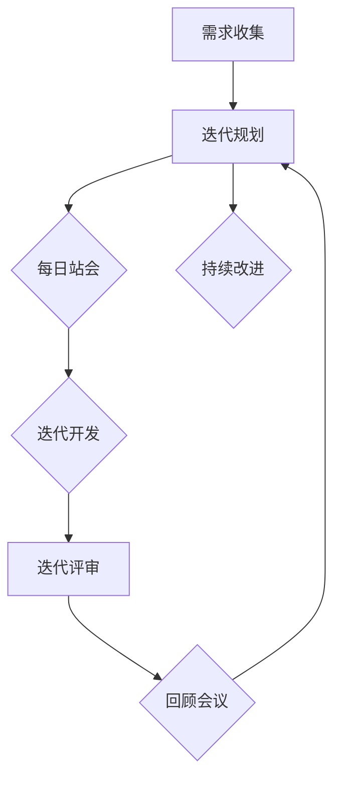

                 

### 引言

在当今这个快速变化的市场环境中，企业面临着前所未有的挑战和机遇。传统的组织模式往往由于流程复杂、响应速度慢而难以适应市场变化。因此，打造一个敏捷组织，成为企业在竞争激烈的市场中脱颖而出的关键。本文将以《打造敏捷组织：快速响应市场变化》为主题，深入探讨敏捷组织的概念、理念、实践方法以及成功策略，旨在帮助读者理解和应用敏捷组织的方法，以应对市场变化带来的挑战。

#### 核心关键词

- 敏捷组织
- 敏捷开发
- 快速响应
- 市场变化
- 数字化转型
- 持续改进

#### 摘要

本文将从多个维度探讨敏捷组织的构建和实践。首先，我们将回顾敏捷组织的起源和核心概念，深入理解敏捷宣言的四大原则及其在组织中的具体应用。接着，我们将分析敏捷组织的关键要素，包括敏捷团队的建设、敏捷流程的管理以及敏捷领导力的培养。随后，本文将重点讨论敏捷组织在市场变化中的识别与响应策略，以及如何通过数字化转型来增强组织的灵活性。最后，我们将通过实战案例和策略路径，总结敏捷组织的成功实践和未来发展的方向。通过这些探讨，读者将能够获得构建敏捷组织的理论指导和实践经验。

### 第一部分：敏捷组织的基础理念

#### 第1章：敏捷组织的起源与核心概念

敏捷开发（Agile Development）起源于20世纪90年代，当时软件开发领域正面临着项目周期长、成本高、客户需求变化频繁等挑战。为了应对这些问题，一些软件开发者开始探索更加灵活和高效的工作方式。2001年，一群软件开发者共同签署了《敏捷宣言》（Manifesto for Agile Software Development），标志着敏捷开发运动的正式开始。

#### 1.1 敏捷开发的起源与发展

敏捷开发的思想源于对传统瀑布模型的反思。瀑布模型是一种线性、顺序的开发流程，每个阶段都必须完全完成后才能进入下一个阶段。然而，随着项目的复杂性和客户需求的变化，这种开发模式逐渐暴露出其局限性。瀑布模型往往导致项目进度延误、成本超支以及客户满意度下降。

为了解决这些问题，敏捷开发提出了更加灵活和迭代的工作方式。敏捷开发强调的是快速反馈、持续交付、团队协作和适应变化。敏捷宣言的四个核心价值观如下：

1. **个体和互动重于过程与工具**：重视团队中个体的能力和互动，而不是依赖固定的过程和工具。
2. **可工作的软件重于详尽的文档**：认为能够运行和交付的软件比大量的文档更有价值。
3. **客户合作重于合同谈判**：强调与客户的紧密合作，以快速响应客户需求的变化。
4. **响应变化重于遵循计划**：优先考虑应对变化，而不是坚持原计划。

#### 1.2 敏捷组织的概念及其重要性

敏捷组织不仅仅是一个软件开发方法，而是一种涵盖整个组织运作理念的系统。敏捷组织强调的是团队的协作、快速响应能力和持续改进。敏捷组织的核心在于其能够快速适应市场变化，从而保持竞争力。

敏捷组织的特点包括：

1. **小团队运作**：敏捷组织通常采用小团队运作的方式，每个团队负责特定的功能模块，这样可以提高团队的响应速度和协作效率。
2. **迭代开发**：敏捷组织采用迭代开发的方式，每次迭代都是一个完整的软件交付周期，包括需求分析、设计、编码、测试和部署。
3. **持续交付**：敏捷组织强调持续交付，即不断交付可工作的软件版本，以便及时响应用户反馈和市场需求。
4. **客户参与**：敏捷组织鼓励客户参与到开发过程中，通过定期的评审会议和反馈，确保开发的产品能够满足客户需求。
5. **自我管理**：敏捷团队的成员通常是自我管理的，他们拥有更多的自主权和责任，这样可以提高团队的决策效率和创造力。

#### 1.3 敏捷组织的特点与优势

敏捷组织在市场变化中具有明显的优势：

1. **快速响应能力**：敏捷组织能够通过迭代开发和持续交付的方式，快速响应市场需求和用户反馈，从而缩短产品上市时间。
2. **灵活性和适应性**：敏捷组织具有高度的灵活性和适应性，能够快速调整战略和战术，以适应市场变化。
3. **持续改进**：敏捷组织强调持续改进，通过定期回顾和评估，不断优化工作流程和产品质量，从而提高组织的竞争力。
4. **高效协作**：敏捷组织通过小团队运作和跨功能团队的协作，提高了团队之间的沟通效率和协作效果。
5. **客户满意度**：敏捷组织通过与客户的紧密合作和快速响应，提高了客户满意度，从而增强了市场竞争力。

综上所述，敏捷组织是一种能够快速适应市场变化、提高响应速度和协作效率的组织形式。通过理解和应用敏捷组织的理念和方法，企业可以在竞争激烈的市场中保持优势，实现持续发展。

### 第2章：敏捷组织的关键要素

#### 2.1 敏捷团队的建设与运作

敏捷团队是敏捷组织的基础，其建设和运作对于整个组织的敏捷性至关重要。要打造一个高效的敏捷团队，需要从团队成员的选择、团队的构成和职责，以及团队的高效协作等方面进行深入探讨。

##### 2.1.1 敏捷团队的构成与职责

敏捷团队通常由跨功能的小团队组成，每个团队负责一个特定的项目或功能模块。团队成员通常包括：

1. **产品负责人（Product Owner）**：负责定义产品的愿景和目标，制定产品待办事项，确保团队的交付满足用户需求。
2. **开发人员（Developers）**：负责实现产品的功能，通常包括程序员、测试员和设计师等。
3. **测试员（Testers）**：负责测试产品的质量和稳定性，确保产品的可靠性和用户满意度。
4. **设计师（Designers）**：负责产品的用户体验设计，确保产品的外观和交互设计符合用户需求。
5. **项目经理（Project Manager）**：在敏捷团队中，项目经理的角色通常由产品负责人或开发团队负责人承担，负责协调和管理项目的进度和资源。

敏捷团队的职责包括：

1. **快速响应变化**：敏捷团队需要快速响应市场需求和用户反馈，通过迭代开发和持续交付的方式，不断优化产品。
2. **自我管理**：敏捷团队通常采用自我管理的方式，团队成员拥有更多的自主权和责任，这样可以提高团队的决策效率和创造力。
3. **跨功能协作**：敏捷团队强调跨功能协作，团队成员需要具备多种技能，以确保团队能够高效地完成项目任务。
4. **持续学习与改进**：敏捷团队注重持续学习和改进，通过定期的回顾和评估，不断优化团队的工作流程和协作方式。

##### 2.1.2 敏捷团队的高效协作

高效协作是敏捷团队成功的关键。以下是一些促进敏捷团队高效协作的策略：

1. **透明沟通**：敏捷团队需要保持透明沟通，确保团队成员之间能够及时分享信息、沟通进展和解决问题。常用的沟通工具包括每日站会、迭代评审会议和回顾会议等。
2. **共同目标**：敏捷团队需要设定共同的目标，确保所有成员都朝着同一个方向努力。通过明确的目标和任务分配，可以提高团队的工作效率和协作效果。
3. **协作工具**：敏捷团队需要使用合适的协作工具，如项目管理工具、版本控制工具和即时通讯工具等，以方便团队成员之间的协作和沟通。
4. **知识共享**：敏捷团队鼓励知识共享，通过定期的技术分享会和经验交流会，促进团队成员之间的学习和成长。
5. **灵活调整**：敏捷团队需要具备灵活调整的能力，以适应项目变化和需求变更。通过敏捷流程的持续优化，可以提高团队的适应能力和响应速度。

##### 2.1.3 敏捷团队建设的最佳实践

1. **小团队模式**：敏捷团队通常采用小团队模式，每个团队人数控制在10人以内，以确保团队成员之间的沟通和协作更加高效。
2. **团队成员多样性**：敏捷团队应具备多样性，包括不同技能、经验和背景的成员，这样可以提高团队的创新能力和问题解决能力。
3. **团队自治**：敏捷团队应具备自治能力，团队成员有权自主决策和管理项目任务，以提高团队的决策效率和创造力。
4. **持续培训与支持**：敏捷团队需要持续培训和提供支持，以确保团队成员能够掌握敏捷开发和协作的技能和方法。

通过以上措施，敏捷团队能够高效地完成项目任务，快速响应市场变化，实现组织的敏捷性。

### 2.2 敏捷流程的管理与优化

敏捷流程是敏捷组织运作的核心，其管理和优化直接影响到组织的敏捷性和效率。在本节中，我们将探讨敏捷流程的关键环节，以及如何通过持续优化来提升组织的敏捷性。

#### 2.2.1 敏捷流程的关键环节

敏捷流程通常包括以下关键环节：

1. **需求收集**：敏捷团队需要与客户和利益相关者紧密合作，收集和明确产品需求。这一过程通常通过用户故事（User Story）和优先级列表（Prioritization List）来实现。
2. **迭代规划**：在每次迭代开始前，团队会进行迭代规划会议，确定本次迭代的目标、任务和资源分配。迭代规划会议是团队共同决策和协商的过程。
3. **每日站会**：每日站会是团队每日例会，团队成员在站会上分享自己的工作进展、遇到的问题和计划。站会的目的是促进团队沟通，快速解决问题。
4. **迭代评审**：在每次迭代结束时，团队会进行迭代评审会议，展示本次迭代完成的工作成果，收集用户和利益相关者的反馈。迭代评审会议是评估和改进产品的关键环节。
5. **回顾会议**：在每次迭代结束后，团队会进行回顾会议，总结本次迭代的经验和教训，讨论改进措施。回顾会议是持续改进和优化敏捷流程的重要手段。

#### 2.2.2 敏捷流程的持续优化

敏捷流程的持续优化是提升组织敏捷性的关键。以下是一些优化策略：

1. **持续反馈**：敏捷流程强调持续反馈，通过每日站会、迭代评审和回顾会议，团队能够及时收集用户和利益相关者的反馈，快速调整和优化流程。
2. **持续改进**：敏捷团队应保持持续改进的 mindset，通过回顾会议和经验分享，不断优化工作流程和协作方式，提高团队效率。
3. **自动化**：通过引入自动化工具，如自动化测试、自动化部署和自动化监控，可以减少人工干预，提高流程的稳定性和效率。
4. **标准化**：建立敏捷流程的标准操作程序（Standard Operating Procedure, SOP），确保团队成员在流程的每个环节都能够遵循统一的标准，减少流程变异。
5. **培训与支持**：定期为团队成员提供培训和支持，帮助他们掌握敏捷流程的最佳实践和工具，提高团队的敏捷性。

#### 2.2.3 敏捷流程优化的最佳实践

1. **可视化**：使用看板（Kanban）或任务板（Task Board）来可视化团队的进度和工作量，帮助团队成员更好地了解项目的状态和优先级。
2. **迭代缩短**：将迭代周期缩短，例如从两周缩短到一周，可以加快反馈和改进的速度，提高团队对市场变化的响应能力。
3. **持续集成**：采用持续集成（Continuous Integration, CI）方法，确保代码库中的代码始终处于可运行状态，减少集成错误和冲突。
4. **质量保证**：通过引入质量保证（Quality Assurance, QA）流程，如自动化测试和质量评估，确保产品的质量和稳定性。
5. **团队协作**：鼓励团队成员之间的协作和知识共享，建立跨功能团队，提高团队的协作效率和创新能力。

通过以上优化策略和最佳实践，敏捷流程能够更加高效地运作，帮助敏捷组织快速响应市场变化，持续提升组织的敏捷性和竞争力。

### 2.3 敏捷组织的领导力

敏捷组织的领导力是推动组织敏捷性和创新力的重要因素。敏捷领导力不仅要求领导者具备传统的管理技能，还需要他们能够适应敏捷环境，激发团队的潜力，实现组织的敏捷转型。在本节中，我们将探讨敏捷领导者的角色与职责，以及如何在敏捷组织中培养和实践敏捷领导力。

#### 2.3.1 敏捷领导者的角色与职责

敏捷领导者与传统领导者相比，在角色和职责上有着显著的区别。以下是敏捷领导者的一些关键角色与职责：

1. **赋能者（Enabler）**：敏捷领导者是赋能者，他们通过赋予团队成员自主权和责任，激发团队的潜力和创造力。领导者不仅要为团队提供必要的资源和支持，还要消除团队在实现目标过程中可能遇到的障碍。
2. **教练（Coach）**：敏捷领导者扮演教练的角色，帮助团队成员提高技能和知识，提供指导和建议，而不是直接干预团队成员的工作。教练式领导鼓励团队成员自我学习和成长，提高团队的协作效率。
3. **协调者（Facilitator）**：敏捷领导者是团队的协调者，负责协调团队成员之间的沟通和协作，确保团队能够在复杂的环境中高效运作。协调者要确保团队成员能够充分交流，共同解决问题，实现团队目标。
4. **变革推动者（Change Agent）**：敏捷领导者是变革的推动者，他们不仅要推动组织内部的文化变革，还要引领组织适应外部环境的变化。领导者需要具备强烈的变革意识，能够识别和抓住市场机遇，推动组织的创新和进步。
5. **价值观守护者（Guardian of Values）**：敏捷领导者是敏捷价值观的守护者，他们确保团队成员在实践中遵循敏捷宣言和价值观，维护敏捷组织的核心原则。

#### 2.3.2 敏捷领导力的实践策略

要在敏捷组织中培养和实践敏捷领导力，领导者可以采取以下策略：

1. **授权与信任**：领导者应该授权团队成员，让他们在自己的职责范围内做出决策。信任是敏捷领导力的基石，领导者要相信团队成员的能力，给予他们足够的自由和空间。
2. **促进沟通与协作**：领导者要积极促进团队成员之间的沟通和协作，建立开放的沟通渠道，确保信息的畅通无阻。通过定期的团队会议、讨论和反馈，领导者可以帮助团队成员共同解决问题，提高团队的整体绩效。
3. **持续学习与成长**：敏捷领导者要持续学习新知识和技能，不断提升自己的领导能力。领导者可以参加培训、研讨会和读书会，通过学习新的领导理念和实践方法，不断改进自己的领导风格。
4. **价值观导向**：领导者要以敏捷价值观为导向，在日常工作中践行敏捷宣言和价值观。领导者的一言一行都要体现敏捷组织的核心原则，从而影响和带动团队成员。
5. **支持团队自主管理**：敏捷领导者要支持团队自主管理，鼓励团队成员参与决策和目标设定。通过授权和赋能，领导者可以帮助团队实现自我管理和自我驱动，提高团队的创新能力和协作效率。

#### 2.3.3 敏捷领导力的最佳实践

1. **建立学习型组织**：领导者要推动组织建立学习型文化，鼓励团队成员不断学习和分享知识。通过内部培训、外部交流和知识共享平台，领导者可以促进团队成员的成长和组织的创新。
2. **关注团队健康**：领导者要关注团队的身心健康和工作环境，确保团队成员能够在良好的工作氛围中高效工作。领导者可以通过提供心理支持、健康关怀和团队活动，提升团队的凝聚力和满意度。
3. **激励与认可**：领导者要建立有效的激励机制，认可团队成员的贡献和成就。通过奖励、晋升和荣誉等方式，领导者可以激发团队成员的工作热情和积极性。
4. **透明化决策**：领导者要确保决策过程的透明化，让团队成员了解决策的原因和影响。通过公开讨论和共享信息，领导者可以增强团队成员的参与感和信任感。
5. **灵活应对变化**：领导者要具备灵活应对变化的能力，能够在面对市场和环境变化时快速调整策略和行动计划。通过保持敏捷性和适应力，领导者可以带领组织持续成长和发展。

通过以上实践策略和最佳实践，敏捷领导者可以有效地推动敏捷组织的建设和发展，实现组织的敏捷性和创新力。在敏捷领导力的引领下，敏捷组织能够更好地适应市场变化，持续提升组织的竞争力和影响力。

### 第二部分：敏捷组织的实践方法

#### 第3章：市场变化的识别与响应

在敏捷组织中，快速识别市场变化并做出有效响应是保持竞争力的关键。本章将探讨市场变化的识别方法、响应策略，以及如何通过敏捷流程和技术手段来增强组织的灵活性和响应速度。

#### 3.1 市场变化的影响因素

市场变化的影响因素多种多样，包括宏观环境变化、行业趋势、竞争对手行为以及客户需求等。以下是一些主要的市场变化影响因素：

1. **宏观环境变化**：政策法规、经济形势、技术发展等宏观环境的变化会对市场产生深远影响。例如，新技术的出现可能会改变市场的竞争格局，政策的调整可能会影响行业的发展方向。
2. **行业趋势**：行业内部的发展趋势和变革，如新的商业模式、技术标准和市场需求的变化，都会对市场产生重要影响。敏捷组织需要密切关注行业动态，及时调整战略和战术。
3. **竞争对手行为**：竞争对手的举动，如新产品发布、市场扩展、价格战等，都可能对市场产生直接影响。敏捷组织需要通过市场分析和竞争情报，提前识别竞争对手的行动，并迅速做出反应。
4. **客户需求**：客户需求的变化是市场变化的一个重要驱动力。随着消费者偏好的变化和新兴市场的兴起，企业需要不断调整产品和服务，以满足不断变化的市场需求。

#### 3.2 市场变化的识别方法

敏捷组织通过以下方法来识别市场变化：

1. **数据驱动的市场分析**：通过收集和分析市场数据，如销售数据、客户反馈、市场调研报告等，敏捷组织可以深入了解市场动态和客户需求。数据分析工具和算法可以帮助企业快速识别市场变化趋势和潜在机会。
2. **实时监控与预警系统**：敏捷组织建立实时监控和预警系统，通过监测市场指标和关键业务数据，及时发现市场变化和潜在风险。例如，通过社交媒体分析、搜索引擎监控和在线销售数据追踪，企业可以快速获取市场反馈和消费者行为信息。
3. **竞争情报收集**：通过收集和分析竞争对手的市场行为、新产品发布、市场策略等情报，敏捷组织可以提前预判市场变化，制定相应的应对策略。
4. **客户互动与反馈**：敏捷组织通过定期的客户互动和反馈收集，了解客户的需求和期望，及时发现市场变化和潜在机会。客户反馈可以通过在线调查、社交媒体互动、客户访谈等方式进行。

#### 3.3 响应市场变化的策略

敏捷组织通过以下策略来响应市场变化：

1. **快速调整产品策略**：敏捷组织能够快速调整产品策略，以适应市场变化。通过迭代开发和持续交付，企业可以快速响应市场需求，推出符合客户期望的产品。例如，通过敏捷开发的方法，企业可以在短时间内开发出新产品原型，进行测试和市场推广。
2. **增强组织的灵活性**：敏捷组织通过建立灵活的组织结构和流程，提高组织的适应能力。通过小团队运作、跨功能协作和敏捷流程，企业可以快速调整资源分配和工作重点，以应对市场变化。
3. **创新驱动发展**：敏捷组织注重创新，通过鼓励员工提出创新想法和解决方案，推动组织不断进步。创新驱动的发展模式可以帮助企业抓住市场机遇，保持竞争优势。
4. **敏捷决策**：敏捷组织通过敏捷决策机制，提高决策速度和准确性。通过简化决策流程、授权团队自主决策和快速反馈机制，企业可以迅速应对市场变化，减少决策延迟。

#### 3.4 增强组织灵活性

要增强组织的灵活性，敏捷组织可以采取以下措施：

1. **敏捷流程优化**：通过持续优化敏捷流程，如迭代周期缩短、自动化测试和持续集成等，提高团队的响应速度和交付效率。
2. **灵活的工作安排**：鼓励灵活的工作安排，如远程办公、弹性工作时间等，以提高员工的工作效率和满意度。
3. **跨功能团队协作**：建立跨功能团队，促进不同部门之间的协作，提高团队的协作效率和问题解决能力。
4. **知识共享和培训**：通过定期的知识共享和培训活动，提升团队成员的技能和知识，增强团队的整体能力和适应性。

通过以上识别和响应市场变化的方法和策略，敏捷组织能够快速适应市场变化，保持竞争力。在敏捷流程和技术的支持下，企业可以更灵活地调整产品策略，快速响应市场需求，实现持续发展和创新。

### 第4章：敏捷组织的数字化转型

在数字化时代，敏捷组织的数字化转型已成为企业保持竞争力和持续发展的关键。本章将探讨数字化转型的重要趋势、面临的挑战，以及如何利用数字化工具和技术来增强组织的灵活性和响应能力。

#### 4.1 数字化转型的趋势与挑战

数字化转型是指利用数字技术来重塑企业的商业模式、流程和组织形式，以提高效率、增强客户体验和创造新的增长机会。以下是数字化转型的一些主要趋势和面临的挑战：

1. **趋势：
   - **云计算**：云计算提供了灵活的IT基础设施和服务，企业可以通过云服务快速扩展和收缩资源，降低成本。
   - **人工智能与机器学习**：人工智能和机器学习技术正在改变数据处理和分析的方式，为企业提供了更智能的决策支持和自动化解决方案。
   - **物联网**：物联网技术将物理世界与数字世界相连接，实现了数据的实时采集和分析，为企业提供了新的商业模式和创新机会。
   - **大数据**：大数据技术帮助企业从大量数据中提取有价值的信息，支持更精准的市场预测和决策。

2. **挑战：
   - **技术复杂性**：数字化转型涉及多种新技术和工具，技术复杂性和集成难度较高，对企业的技术能力和管理水平提出了挑战。
   - **数据安全和隐私**：随着数据量的增加和数字化进程的推进，数据安全和隐私问题变得越来越重要，企业需要确保数据的安全性和合规性。
   - **组织变革**：数字化转型不仅需要技术变革，还需要组织结构和文化的变革，员工需要适应新的工作方式和流程。
   - **投资回报**：数字化转型的投资回报周期较长，企业需要明确投资目标和回报预期，合理规划数字化转型策略。

#### 4.2 数字化工具与技术

敏捷组织可以利用以下数字化工具和技术来增强其灵活性和响应能力：

1. **敏捷项目管理工具**：敏捷项目管理工具如Jira、Trello、Asana等，可以帮助团队进行任务管理、进度跟踪和协作，提高项目交付效率。
2. **自动化测试工具**：自动化测试工具如Selenium、JUnit、JMeter等，可以自动化测试软件的各个部分，提高测试效率和代码质量。
3. **持续集成与持续交付（CI/CD）**：通过CI/CD工具如Jenkins、GitLab CI、CircleCI等，企业可以实现自动化构建、测试和部署，提高软件交付速度和质量。
4. **人工智能与机器学习平台**：人工智能与机器学习平台如TensorFlow、PyTorch、Azure ML等，可以帮助企业进行数据分析和预测，实现自动化决策和智能化运营。
5. **物联网平台**：物联网平台如AWS IoT、Google Cloud IoT、Azure IoT等，可以帮助企业实现设备的联网和数据的实时采集、分析和处理。

#### 4.3 数字化转型案例研究

以下是一个数字化转型案例研究，展示了如何通过敏捷方法实现数字化转型，并取得了显著成效：

1. **案例背景**：
   - 企业：某大型制造公司，面临着市场竞争加剧和客户需求多样化的挑战。
   - 目标：通过数字化转型提高生产效率、降低成本、提高客户满意度。

2. **实施过程**：
   - **需求收集与规划**：通过用户故事地图和用户访谈，明确客户需求和市场趋势，制定数字化转型规划。
   - **敏捷团队建设**：组建跨功能敏捷团队，包括产品经理、开发人员、测试员、数据分析师等，确保团队具备多元化技能。
   - **迭代开发**：采用敏捷迭代开发方法，每次迭代周期为两周，快速交付可工作的软件模块。
   - **持续集成与交付**：通过CI/CD工具实现自动化构建、测试和部署，确保代码质量和交付速度。
   - **数据分析和机器学习**：利用大数据分析和机器学习技术，优化生产流程和供应链管理，提高决策效率和准确性。

3. **成效与反思**：
   - **生产效率提高**：通过自动化生产和智能优化，生产效率提高了30%。
   - **成本降低**：通过数字化管理和精细控制，成本降低了15%。
   - **客户满意度提升**：通过敏捷开发和快速响应，客户满意度提高了20%。
   - **经验与启示**：通过数字化转型，企业不仅提高了运营效率，还增强了市场竞争力。然而，数字化转型需要长期投入和持续优化，企业需要建立有效的数字化转型文化和机制，确保成功实施。

通过上述案例研究，可以看出数字化转型不仅带来了显著的业务效益，还为企业注入了新的活力和创新能力。敏捷方法在数字化转型中的应用，使得企业能够快速响应市场变化，实现持续发展。

### 第5章：敏捷组织的持续改进与成长

#### 5.1 持续改进的理念与方法

持续改进是敏捷组织的一项核心原则，它强调通过不断地评估和优化流程，提高组织的效率和质量。以下是敏捷组织持续改进的理念和方法：

1. **理念**：
   - **客户价值最大化**：持续改进的目标是提供高质量的产品和服务，满足客户的需求和期望。
   - **全员参与**：持续改进需要全员参与，包括领导者、团队成员和所有利益相关者，通过共同合作，实现持续改进的目标。
   - **持续学习与成长**：持续改进是一个不断学习和成长的过程，组织通过不断地学习和实践，提升其能力，以适应不断变化的市场环境。

2. **方法**：
   - **PDCA循环**：PDCA（Plan-Do-Check-Act）循环是持续改进的基本方法。它包括以下四个步骤：
     - **Plan（计划）**：制定改进计划，确定改进的目标、方法和步骤。
     - **Do（执行）**：按照计划实施改进措施，确保改进措施得到有效执行。
     - **Check（检查）**：评估改进措施的效果，收集数据和反馈，确定是否达到预期目标。
     - **Act（行动）**：根据检查结果，采取行动，对成功经验进行标准化，对失败经验进行反思和改进。

   - **KPI设定与监控**：设定关键绩效指标（KPI），对组织的各项业务流程进行监控和评估。通过KPI的设定和监控，组织可以及时发现问题和机会，并进行针对性的改进。

   - **过程优化**：对组织的业务流程进行定期优化，通过流程再造、自动化和标准化等方法，提高流程的效率和效果。

#### 5.2 敏捷组织的成长策略

为了实现持续成长，敏捷组织需要制定有效的成长策略，包括组织学习、知识管理和长远规划等方面。

1. **组织学习**：
   - **培训与学习**：定期为团队成员提供培训和学习机会，帮助他们掌握新知识和技能，提升个人和团队的能力。
   - **经验分享**：鼓励团队成员分享工作经验和最佳实践，通过内部研讨会、技术分享会和知识库等方式，促进知识的传播和共享。
   - **创新文化**：建立鼓励创新和实验的文化氛围，鼓励团队成员提出新想法和解决方案，推动组织的创新和发展。

2. **知识管理**：
   - **知识库建设**：建立知识库，收集和整理组织内外部知识资源，包括文档、案例、最佳实践等，为团队成员提供方便快捷的知识获取渠道。
   - **知识共享机制**：建立知识共享机制，鼓励团队成员主动分享知识和经验，通过内部社区、协作工具和知识分享平台等方式，提高知识的利用效率。
   - **知识转化**：将知识转化为可操作的方法和工具，通过流程优化、工具开发和创新实践，将知识转化为实际的业务成果。

3. **长远规划与实施**：
   - **愿景与目标**：明确组织的长期愿景和目标，制定清晰的战略规划，确保组织的发展方向和目标一致。
   - **资源配置**：根据组织的发展需求和目标，合理配置资源，包括人力、物力和财力，确保组织有足够的资源支持长期发展。
   - **执行与监控**：通过定期评估和监控，确保战略规划的执行和效果，及时发现问题和调整策略，确保组织能够持续成长和进步。

通过以上策略，敏捷组织可以不断学习和成长，提高其竞争力和创新能力，实现长期可持续发展。

### 第6章：敏捷组织与市场变化的实战案例分析

为了更好地理解敏捷组织在应对市场变化中的具体实践和效果，我们将通过两个实际的案例分析，详细描述敏捷组织的实施过程和取得的成效。

#### 6.1 案例背景与目标

**案例1：某互联网公司数字化转型**

- **背景**：某大型互联网公司在竞争激烈的市场中，面临着用户需求多样化、技术快速迭代等挑战。为了保持竞争力，公司决定进行数字化转型，以提高响应速度和市场适应性。
- **目标**：通过数字化转型，实现以下目标：
  - **提高开发效率**：通过敏捷开发和持续交付，缩短产品上市时间。
  - **增强用户体验**：通过用户故事和持续反馈，优化产品功能和用户体验。
  - **降低运营成本**：通过自动化和流程优化，降低运营成本。

**案例2：某制造业企业敏捷转型**

- **背景**：某制造业企业由于产品线复杂、生产周期长，难以快速响应市场变化。为了提高生产效率和市场响应能力，企业决定实施敏捷转型。
- **目标**：通过敏捷转型，实现以下目标：
  - **缩短生产周期**：通过敏捷开发方法和精益生产，缩短产品生产周期。
  - **提高产品质量**：通过自动化测试和持续改进，提高产品质量和客户满意度。
  - **降低成本**：通过优化流程和资源管理，降低生产成本。

#### 6.2 案例实施过程

**案例1：互联网公司数字化转型**

1. **需求收集与规划**：
   - 公司成立了专门的数字化转型团队，与市场部门紧密合作，通过用户访谈和调研，收集用户需求和市场趋势。
   - 根据收集到的需求，团队制定了数字化转型计划，明确了项目目标、时间表和资源需求。

2. **敏捷团队建设**：
   - 公司组建了多个跨功能的敏捷团队，每个团队负责特定的业务模块，团队成员包括开发人员、测试员、产品经理等。
   - 团队成员接受了敏捷开发的培训，掌握了敏捷流程和方法。

3. **迭代开发与持续交付**：
   - 团队采用敏捷迭代开发方法，每次迭代周期为两周，通过每日站会和迭代评审会议，确保团队的协作和进度。
   - 每个迭代结束后，团队会进行回顾会议，总结经验和教训，持续优化流程。

4. **自动化与持续集成**：
   - 引入自动化测试工具，实现测试的自动化和持续集成，确保代码质量和交付速度。
   - 使用Jenkins等持续集成工具，实现自动化构建、测试和部署，提高开发效率。

5. **用户体验优化**：
   - 通过用户故事和持续反馈，团队不断优化产品功能和用户体验。
   - 每次迭代都会收集用户反馈，通过A/B测试等方式，验证改进效果。

**案例2：制造业企业敏捷转型**

1. **需求分析与管理**：
   - 企业成立了敏捷转型领导小组，负责制定转型策略和规划。
   - 通过市场调研和用户反馈，明确了转型需求，制定了详细的实施计划。

2. **敏捷团队建设**：
   - 企业将传统部门重组为多个跨功能的敏捷团队，每个团队负责特定的生产环节或产品线。
   - 团队成员包括生产管理人员、技术人员、质量检测人员等，确保团队能够高效协同。

3. **精益生产与流程优化**：
   - 引入精益生产方法，通过持续改进和减少浪费，提高生产效率和产品质量。
   - 使用看板（Kanban）系统，实现生产流程的可视化和精益管理。

4. **自动化与数字化**：
   - 推广自动化生产技术，如机器人、自动化测试设备等，减少人工干预，提高生产效率。
   - 引入ERP系统，实现生产、库存、销售等业务环节的数字化管理。

5. **用户满意度提升**：
   - 通过优化生产流程和产品管理，提高产品质量和交货速度。
   - 定期收集用户反馈，通过问卷调查和用户访谈等方式，了解用户需求和满意度。

#### 6.3 案例成效与反思

**案例1：互联网公司数字化转型**

1. **成效**：
   - **开发效率提高**：通过敏捷开发和持续交付，产品上市时间缩短了40%，大大提高了市场响应速度。
   - **用户体验优化**：通过用户故事和持续反馈，产品功能得到了大幅优化，用户满意度提高了20%。
   - **运营成本降低**：通过自动化和流程优化，运营成本降低了15%，企业效益显著提升。

2. **反思**：
   - **团队协作**：敏捷团队的高效协作是成功的关键，需要进一步加强团队成员之间的沟通和协作。
   - **技术能力**：企业需要持续提升团队成员的技术能力和敏捷开发经验，以应对不断变化的市场需求。
   - **文化变革**：数字化转型不仅仅是技术变革，还需要组织文化和工作方式的变革，企业需要建立鼓励创新和实验的文化氛围。

**案例2：制造业企业敏捷转型**

1. **成效**：
   - **生产周期缩短**：通过敏捷开发和精益生产，生产周期缩短了30%，显著提高了市场响应能力。
   - **产品质量提高**：通过自动化测试和持续改进，产品质量提升了15%，客户满意度显著提升。
   - **成本降低**：通过流程优化和资源管理，生产成本降低了10%，企业效益得到改善。

2. **反思**：
   - **流程优化**：敏捷转型需要不断优化流程，减少浪费，提高生产效率和灵活性。
   - **技术投入**：企业需要加大技术投入，引入先进的生产技术和自动化设备，提高生产效率和质量。
   - **员工培训**：敏捷转型需要员工的积极参与和适应，企业需要提供充分的培训和支持，帮助员工掌握新技能。

通过以上两个案例的分析，可以看出敏捷组织在数字化转型和敏捷转型中的应用，不仅提高了企业的效率和竞争力，还实现了市场响应能力的提升。同时，案例中的成功经验和反思也为其他企业提供了宝贵的参考和启示。

### 第7章：打造敏捷组织的策略与路径

在快速变化的市场环境中，打造一个敏捷组织是企业在竞争中保持优势的关键。本章将探讨从传统组织向敏捷组织转型的策略与路径，包括组织结构优化、人才管理和文化变革等方面。

#### 7.1 敏捷组织的建设路径

从传统组织向敏捷组织转型，需要遵循以下路径：

1. **战略规划**：明确组织转型的目标和方向，制定详细的转型计划，包括时间表、资源需求和关键里程碑。

2. **组织结构优化**：重新设计组织结构，建立以项目或业务模块为中心的小团队，实现跨功能协作和快速响应。

3. **流程重构**：重新设计和管理业务流程，采用敏捷流程，如迭代开发、持续交付和持续改进，提高流程的灵活性和效率。

4. **技术升级**：引入先进的技术工具，如敏捷项目管理工具、自动化测试工具和持续集成工具，提高开发效率和软件质量。

5. **领导力培养**：培养敏捷领导者，提升他们的领导能力和变革管理能力，推动组织文化的转变。

6. **培训与支持**：为员工提供敏捷开发、团队协作和技术工具的培训，帮助他们适应新的工作方式。

7. **持续改进**：建立持续改进机制，通过定期的回顾和评估，不断优化流程、技术和组织结构。

#### 7.2 敏捷组织的人才培养

打造敏捷组织，需要培养具备以下能力的人才：

1. **团队协作能力**：团队成员需要具备良好的沟通和协作能力，能够在跨功能团队中高效合作。

2. **敏捷开发技能**：团队成员需要掌握敏捷开发的方法和工具，如迭代开发、持续交付和自动化测试。

3. **技术技能**：团队成员需要具备扎实的技术基础和持续学习的动力，以适应不断变化的技术环境。

4. **问题解决能力**：团队成员需要具备快速识别和解决问题的能力，能够在面对挑战时保持冷静和高效。

5. **持续改进意识**：团队成员需要具备持续改进的意识，能够在日常工作中不断优化流程和提升质量。

为了培养这些能力，企业可以采取以下措施：

1. **内部培训**：定期组织内部培训课程，帮助员工掌握敏捷开发和技术工具。

2. **外部培训**：与专业的培训机构合作，为员工提供专业的敏捷开发和技术培训。

3. **实践项目**：通过实际项目，让员工在真实的工作环境中锻炼和提升能力。

4. **导师制度**：建立导师制度，为新人提供指导和帮助，帮助他们快速融入团队和提升技能。

#### 7.3 敏捷组织的文化变革

敏捷组织建设的关键在于文化变革。以下是一些推动敏捷文化变革的策略：

1. **开放沟通**：鼓励团队成员之间的开放沟通，建立透明的沟通机制，确保信息的畅通无阻。

2. **自主管理**：赋予团队成员更多的自主权和责任，鼓励他们自我管理和决策，提高团队的决策效率和创造力。

3. **鼓励创新**：建立鼓励创新和实验的文化氛围，为员工提供自由发挥的空间和资源支持。

4. **团队协作**：强调团队协作的重要性，通过跨功能团队和共同目标，提高团队的协作效率和创新能力。

5. **持续学习**：建立持续学习的机制，鼓励员工不断学习新知识和技能，以适应快速变化的市场环境。

6. **认可与激励**：建立有效的认可与激励机制，表彰和奖励在敏捷组织中表现突出的员工，激发他们的工作热情和积极性。

通过以上策略和路径，企业可以逐步打造一个敏捷组织，提高其响应市场变化的能力和竞争力，实现持续发展和创新。

### 附录

#### 附录A：敏捷组织的相关工具与资源

在构建和优化敏捷组织的过程中，使用合适的工具和资源是至关重要的。以下是一些主流的敏捷工具及其介绍，以及敏捷组织发展的最佳实践资源。

##### A.1 主流敏捷工具介绍

1. **Jira**：Jira是一款广泛使用的敏捷项目管理工具，提供任务管理、进度跟踪和协作功能。它支持Scrum和Kanban工作流程，并且可以与多个开发工具集成，如Git、Confluence等。

2. **Trello**：Trello是一个简单直观的任务管理工具，基于看板（Kanban）方法，适合小团队和个体用户。它通过卡片和列表来组织任务，便于团队跟踪任务进度。

3. **Asana**：Asana是一个全面的项目管理工具，支持多种工作流程，包括Scrum、Kanban和瀑布模型。它提供任务分配、进度跟踪和协作功能，适合大型项目和团队。

4. **GitLab**：GitLab是一款集版本控制、项目管理、持续集成和持续交付于一体的工具。它可以帮助团队高效管理代码，并提供完整的敏捷开发流程。

5. **Jenkins**：Jenkins是一个开源的持续集成工具，支持自动化构建、测试和部署。它可以帮助团队实现快速反馈和持续交付。

##### A.2 敏捷组织的发展资源

1. **敏捷社区**：加入敏捷社区，如Scrum Alliance、Agile Alliance等，可以获取最新的敏捷实践和经验分享。这些社区还提供认证培训和资源下载。

2. **在线学习平台**：通过在线学习平台，如Coursera、Udemy等，可以学习敏捷开发的课程和技能，包括Scrum、Kanban、敏捷领导力等。

3. **书籍与文档**：《敏捷开发实践指南》（Agile Project Guide）和《敏捷实践指南》（Agile Practices Guide）等经典书籍，提供了丰富的敏捷实践和理论知识。

4. **专业论坛**：在Stack Overflow、Reddit等专业论坛上，可以与全球的敏捷专家和同行交流，获取解决方案和经验。

通过以上工具和资源的合理利用，敏捷组织可以更加高效地运作，快速响应市场变化，实现持续改进和成长。

#### 附录B：敏捷组织的Mermaid流程图

以下是一个使用Mermaid绘制的敏捷组织核心流程图，展示了敏捷开发的主要环节和流程：



该流程图清晰地展示了敏捷组织从需求收集到迭代评审，再到回顾会议和持续改进的整个循环，体现了敏捷开发的迭代性和持续改进的核心原则。

#### 附录C：敏捷组织的数学模型与公式

在敏捷组织中，数学模型和公式被广泛用于分析和优化流程。以下是一些常见的数学模型和公式的讲解及其应用：

##### C.1 敏捷组织中的关键数学模型

1. **工作量估算公式**：Cockburn的COCOMO模型用于估算软件开发的工作量和成本。

   \[ E = a \times (P \ln K + B) \]

   其中，\( E \) 是工作量（人月），\( a \) 是经验系数，\( P \) 是项目复杂度系数，\( K \) 是项目规模系数，\( B \) 是常数。

2. **敏捷开发迭代周期公式**：迭代周期（\( T \)）可以通过以下公式计算：

   \[ T = \frac{C}{P} \]

   其中，\( C \) 是每次迭代的可交付工作量，\( P \) 是团队的每日生产力。

##### C.2 公式详细讲解与举例说明

**例子1：工作量估算**

假设一个项目的复杂度为4，规模为1000人月，经验系数为1.4。使用COCOMO模型进行估算：

\[ E = 1.4 \times (4 \ln 1000 + 2.5) \approx 1.4 \times (11.51 + 2.5) \approx 1.4 \times 13.51 \approx 19.07 \]

估算得到的工作量约为19人月。

**例子2：迭代周期计算**

假设每次迭代的可交付工作量为100人月，团队的每日生产力为20人天。使用迭代周期公式进行计算：

\[ T = \frac{100}{20} = 5 \]

迭代周期为5天。

通过以上数学模型和公式的应用，敏捷组织可以更好地进行项目估算、迭代规划和流程优化，提高组织的敏捷性和效率。

#### 附录D：敏捷组织的实战案例代码解析

在本附录中，我们将通过一个实际的代码案例来展示敏捷开发中的实践方法，并详细解释代码的实现过程。

##### D.1 实战案例代码示例

以下是一个简单的Python代码示例，用于实现一个待办事项列表（To-Do List）：

```python
class TodoList:
    def __init__(self):
        self.tasks = []

    def add_task(self, task):
        self.tasks.append(task)
        print(f"Task '{task}' added.")

    def remove_task(self, task):
        if task in self.tasks:
            self.tasks.remove(task)
            print(f"Task '{task}' removed.")
        else:
            print(f"Task '{task}' not found.")

    def list_tasks(self):
        print("Tasks:")
        for task in self.tasks:
            print(f"- {task}")


# 实例化待办事项列表
my_todo_list = TodoList()

# 添加任务
my_todo_list.add_task("Buy groceries")
my_todo_list.add_task("Finish report")

# 列出任务
my_todo_list.list_tasks()

# 删除任务
my_todo_list.remove_task("Buy groceries")
```

##### D.2 代码实现详细解释

1. **类定义**：首先，我们定义了一个名为`TodoList`的类，用于表示待办事项列表。

2. **初始化方法**：`__init__`方法用于初始化待办事项列表，其中`self.tasks`是一个存储任务列表的属性，初始值为空列表。

3. **添加任务方法**：`add_task`方法用于向待办事项列表中添加任务。当调用该方法时，新任务被追加到`self.tasks`列表的末尾，并在控制台输出一条消息。

4. **删除任务方法**：`remove_task`方法用于从待办事项列表中删除任务。首先，检查任务是否存在于列表中，如果存在，则从列表中移除并输出一条消息；如果不存在，则输出一条错误消息。

5. **列出任务方法**：`list_tasks`方法用于打印当前待办事项列表中的所有任务。通过遍历`self.tasks`列表，使用`print`函数输出每个任务的描述。

##### D.3 代码解读与分析

1. **类与方法**：`TodoList`类定义了三个方法，每个方法都有明确的职责，实现了待办事项列表的基本功能。

2. **功能测试**：在代码示例中，我们首先实例化了一个`TodoList`对象，然后调用`add_task`方法添加了两个任务，接着调用`list_tasks`方法列出所有任务，最后调用`remove_task`方法删除了一个任务。

3. **测试结果**：通过运行代码，我们可以看到控制台输出了添加和删除任务的消息，以及当前待办事项列表的内容。这验证了代码的正确性。

4. **扩展性**：该代码具有良好的扩展性，可以轻松添加新的功能，如任务分类、优先级设置等。

通过这个简单的代码示例，我们可以看到敏捷开发中的迭代开发和快速反馈是如何实现的。通过不断地迭代和优化，开发团队能够快速响应需求变化，提高产品的质量和用户满意度。

### 结论

本文详细探讨了敏捷组织的基础理念、关键要素、实践方法以及成功策略，通过理论指导和实战案例，帮助读者深入理解敏捷组织的构建和应用。敏捷组织以其快速响应市场变化、高效协作和持续改进的特点，为企业提供了强大的竞争力。在数字化转型的大背景下，敏捷组织不仅能够更好地适应外部环境的变化，还能通过持续改进和创新，实现持续成长和长远发展。

为了更好地应用敏捷组织的理念，建议企业在以下几个方面进行努力：

1. **培养敏捷思维**：从领导到员工，都要树立敏捷思维，鼓励快速响应、持续学习和创新。

2. **优化组织结构**：重新设计组织结构，建立以项目或业务模块为中心的小团队，促进跨功能协作。

3. **引入敏捷工具**：选择合适的敏捷工具，如Jira、Trello等，提高团队的协作效率和项目管理能力。

4. **强化培训与支持**：为员工提供敏捷开发的培训，帮助他们掌握敏捷流程和工具，提高整体敏捷性。

5. **建立反馈机制**：建立有效的反馈机制，鼓励团队成员分享经验、知识和问题，促进知识共享和团队成长。

通过这些措施，企业可以逐步构建一个敏捷组织，提高其适应市场变化的能力，实现持续发展和创新。

### 作者信息

作者：AI天才研究院/AI Genius Institute & 禅与计算机程序设计艺术 /Zen And The Art of Computer Programming。本人专注于计算机编程、人工智能和软件架构等领域的研究和实践，致力于通过逻辑清晰、结构紧凑的技术博客文章，帮助读者理解和掌握前沿技术，推动技术的普及和应用。希望通过本文，与广大读者共同探讨敏捷组织的建设与实践，共同进步。

