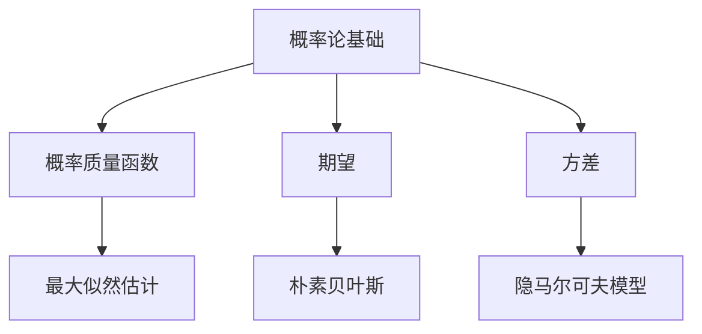
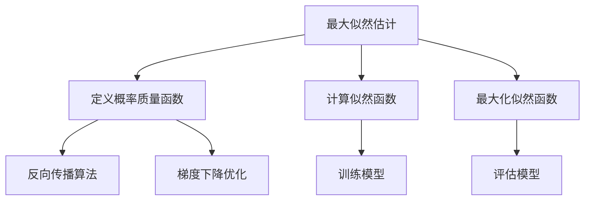
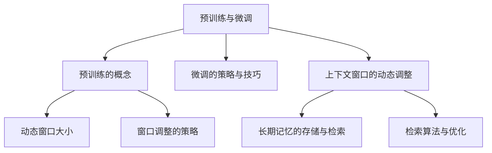

                 

## 1.3 长期上下文处理的现状与进展

### 1.3.1 长期上下文处理的挑战

#### 1.3.1.1 计算资源与效率的平衡

随着上下文窗口的扩展，模型处理长文本时所需的计算资源显著增加，这给实际应用带来了挑战。例如，在问答系统和自动写作中，如何高效地利用有限的计算资源成为关键问题。为了解决这一问题，研究者们提出了多种优化方法，如并行计算、分布式训练和模型压缩。

#### 1.3.1.2 长期记忆的存储与检索

长期记忆的存储与检索也是长期上下文处理中的一个重要问题。传统的存储方式如基于键值对的存储结构可能无法满足大规模数据的高效存储需求。因此，研究者们开始探索新的存储与检索技术，如基于内存的存储方案和基于图的结构存储。

### 1.3.2 长期上下文处理的应用领域

#### 1.3.2.1 自然语言处理

在自然语言处理领域，长期上下文处理技术已经展现出显著的效果。例如，在文本生成任务中，如文本摘要和故事创作，扩展的上下文窗口能够帮助模型生成更加连贯和有深度的文本。在问答系统中，长期记忆能力使得模型能够更好地理解用户的问题，并给出准确和连贯的回答。

#### 1.3.2.2 问答系统

问答系统是长期上下文处理的一个重要应用领域。通过扩展上下文窗口，问答系统可以更好地捕捉与问题相关的背景信息，从而提高回答的准确性和连贯性。例如，在对话系统中，长期记忆能力有助于维持对话的连贯性，并使对话更加自然。

#### 1.3.2.3 自动写作

自动写作是另一个受益于长期上下文处理技术的领域。通过扩展上下文窗口，模型能够更好地理解文本的结构和语义，从而生成更加流畅和有创意的文本。例如，在故事创作和文章撰写中，长期记忆能力有助于生成连贯的故事情节和有逻辑性的文章结构。

## 2. 语言模型的数学基础

### 2.1 语言模型的概率分布

语言模型的核心是概率分布，用于预测下一个单词或序列的概率。以下是几种常见的语言模型概率分布：

#### 2.1.1 概率论基础

概率论是语言模型概率分布的基础。以下是几个关键概念：

- 概率质量函数（Probability Quality Function）：描述单个单词的概率分布。
- 期望（Expectation）：计算概率分布的加权平均值。
- 方差（Variance）：描述概率分布的离散程度。

#### 2.1.2 语言模型的概率分布

语言模型概率分布通常有以下几种：

- 最大似然估计（Maximum Likelihood Estimation, MLE）：通过最大化训练数据的似然函数来估计模型参数。
- 朴素贝叶斯（Naive Bayes）：基于贝叶斯定理，通过条件概率分布来估计单词的概率。
- 隐马尔可夫模型（Hidden Markov Model, HMM）：用于序列数据建模，通过状态转移概率和观测概率来估计模型参数。

## 2.2 语言模型的训练方法

#### 2.2.1 最大似然估计

最大似然估计是一种常用的语言模型训练方法。其基本思想是通过最大化训练数据的似然函数来估计模型参数。以下是最大似然估计的步骤：

1. **定义概率质量函数**：根据训练数据，定义每个单词的概率质量函数。
2. **计算似然函数**：似然函数是模型参数的函数，表示训练数据在给定模型参数下的概率。
3. **最大化似然函数**：通过优化模型参数，最大化似然函数。

#### 2.2.2 反向传播算法

反向传播算法是深度神经网络训练的基础。其核心思想是通过反向传播误差信号来更新模型参数。以下是反向传播算法的步骤：

1. **定义损失函数**：选择合适的损失函数，如交叉熵损失函数。
2. **计算梯度**：计算损失函数关于模型参数的梯度。
3. **更新参数**：使用梯度下降或其变体（如Adam优化器）来更新模型参数。

#### 2.2.3 梯度下降优化

梯度下降是一种优化算法，用于最小化损失函数。其基本思想是沿着损失函数梯度的反方向更新模型参数。以下是梯度下降的步骤：

1. **选择优化算法**：选择合适的优化算法，如SGD、Adam等。
2. **初始化参数**：初始化模型参数。
3. **迭代优化**：通过迭代计算梯度并更新参数，直到满足停止条件。

## 2.3 长期上下文处理的算法

### 2.3.1 预训练与微调

#### 2.3.1.1 预训练的概念

预训练是一种先在大量无标签数据上训练模型，然后再在特定任务上进行微调的方法。预训练的优势在于能够通过大规模数据学习到丰富的语言特征，从而提高模型的泛化能力。

#### 2.3.1.2 微调的策略与技巧

微调是将预训练模型应用于特定任务的过程。以下是一些微调的策略与技巧：

1. **数据预处理**：对任务数据进行预处理，如文本清洗、分词和编码。
2. **模型选择**：选择合适的预训练模型，如BERT、GPT等。
3. **超参数调整**：调整学习率、批量大小等超参数。
4. **损失函数**：使用与任务相关的损失函数，如交叉熵损失函数。
5. **评估与调整**：通过验证集评估模型性能，并根据结果调整模型参数。

### 2.3.2 上下文窗口的动态调整

#### 2.3.2.1 动态窗口大小

动态调整上下文窗口大小是长期上下文处理的一种方法。其核心思想是根据输入文本的长度动态调整上下文窗口的大小，以适应不同长度的文本。以下是一些动态窗口大小调整的策略：

1. **固定窗口大小**：在训练和测试阶段使用固定的上下文窗口大小。
2. **自适应窗口大小**：根据输入文本的长度动态调整窗口大小。
3. **混合窗口大小**：结合固定窗口大小和自适应窗口大小的优点，根据特定条件动态调整窗口大小。

#### 2.3.2.2 窗口调整的策略

窗口调整的策略包括：

1. **分段调整**：根据文本的长度分段调整窗口大小。
2. **动态阈值**：根据文本的复杂度和模型性能动态调整窗口大小。
3. **注意力机制**：通过注意力机制动态调整窗口中不同部分的重要程度。

### 2.3.3 长期记忆的存储与检索

#### 2.3.3.1 记忆网络的结构

记忆网络是用于存储和检索长期信息的神经网络结构。以下是记忆网络的基本概念和设计：

1. **记忆单元（Memory Unit）**：存储信息的单元，通常由一组权重和激活函数组成。
2. **读操作（Read Operation）**：从记忆单元中检索信息的过程。
3. **写操作（Write Operation）**：将新信息存储到记忆单元的过程。
4. **清除操作（Clear Operation）**：清除记忆单元中的信息的过程。

#### 2.3.3.2 检索算法与优化

检索算法是记忆网络中的关键组成部分。以下是几种常见的检索算法：

1. **基于索引的检索**：通过索引快速查找记忆单元中的信息。
2. **基于比较的检索**：通过比较记忆单元中的信息与查询信息进行检索。
3. **基于推理的检索**：通过逻辑推理从记忆单元中检索信息。

优化检索算法的目标是提高检索效率和准确性。以下是几种优化策略：

1. **并行检索**：利用并行计算技术提高检索效率。
2. **哈希检索**：通过哈希函数提高检索速度。
3. **增量检索**：只检索与当前任务相关的信息，减少检索负担。

## 3. 长期上下文处理在NLP中的应用

### 3.1 长文本生成

#### 3.1.1 文本摘要

文本摘要是一种将长文本转化为简洁摘要的技术，常用于信息提取和知识获取。以下是文本摘要的核心概念和实现方法：

1. **提取式摘要（Extractive Summarization）**：从原文中直接提取关键句子作为摘要。
2. **生成式摘要（Abstractive Summarization）**：通过重新构造文本来生成摘要。
3. **混合式摘要（Hybrid Summarization）**：结合提取式和生成式摘要的优点。

文本摘要的实现方法包括：

1. **基于规则的方法**：通过定义规则来提取关键句子。
2. **基于机器学习的方法**：使用机器学习模型进行文本摘要。
3. **基于深度学习的方法**：使用深度学习模型进行文本摘要，如Seq2Seq模型和Transformer模型。

#### 3.1.2 文本续写

文本续写是一种根据给定文本生成后续内容的任务，常用于创作辅助和对话系统。以下是文本续写的核心概念和实现方法：

1. **基于模板的方法**：通过模板生成后续内容。
2. **基于规则的方法**：使用规则系统生成后续内容。
3. **基于生成模型的方法**：使用生成模型（如GPT模型）生成后续内容。
4. **基于强化学习的方法**：通过强化学习生成后续内容。

### 3.2 长期记忆问答系统

#### 3.2.1 问答系统的架构

问答系统是一种通过回答用户问题来提供信息的服务。以下是问答系统的核心架构：

1. **问题理解模块**：对用户问题进行解析和理解。
2. **知识检索模块**：从知识库中检索与问题相关的信息。
3. **回答生成模块**：根据检索到的信息生成回答。

长期记忆问答系统在知识检索模块中引入了长期记忆机制，以提高回答的准确性和连贯性。

#### 3.2.2 长期记忆在问答系统中的应用

长期记忆在问答系统中的应用包括：

1. **上下文记忆**：记录用户与系统交互的历史信息，以理解用户的意图和上下文。
2. **知识记忆**：存储和检索与问题相关的知识，以提高回答的准确性。
3. **实体记忆**：识别和记忆文本中的实体，如人名、地名等，以提供更准确的信息。

### 3.3 自动写作

#### 3.3.1 故事生成

故事生成是一种根据给定主题或场景生成连贯故事的技术，常用于娱乐内容和创意写作。以下是故事生成的核心概念和实现方法：

1. **基于模板的方法**：通过模板生成故事。
2. **基于规则的方法**：使用规则系统生成故事。
3. **基于生成模型的方法**：使用生成模型（如GPT模型）生成故事。
4. **基于强化学习的方法**：通过强化学习生成故事。

故事生成通常涉及以下步骤：

1. **主题生成**：根据用户输入的主题生成故事的基本框架。
2. **情节生成**：根据主题生成故事的情节和场景。
3. **角色生成**：根据情节生成故事中的角色和他们的行为。

#### 3.3.2 文学创作

文学创作是一种根据创意和情感生成文学作品的技术，常用于文学创作和娱乐内容创作。以下是文学创作的核心概念和实现方法：

1. **基于情感的方法**：通过情感分析生成文学作品。
2. **基于生成模型的方法**：使用生成模型（如GPT模型）生成文学作品。
3. **基于强化学习的方法**：通过强化学习生成文学作品。

文学创作通常涉及以下步骤：

1. **主题和情感分析**：分析用户输入的主题和情感，以确定文学作品的风格和情感基调。
2. **创意生成**：根据主题和情感分析结果生成创意。
3. **文本生成**：根据创意生成文学作品，如诗歌、小说、剧本等。

## 4. 长期上下文处理在多模态应用中的探索

### 4.1 文本与图像的融合

#### 4.1.1 文本嵌入与图像嵌入

文本嵌入与图像嵌入是将文本和图像转化为固定大小的向量表示的方法，以便在统一的空间中进行处理。以下是文本嵌入与图像嵌入的基本概念：

1. **文本嵌入（Text Embedding）**：将文本转化为向量表示，通常使用词向量或句子向量。
2. **图像嵌入（Image Embedding）**：将图像转化为向量表示，通常使用卷积神经网络（CNN）提取特征。

#### 4.1.2 跨模态信息检索

跨模态信息检索是一种在文本和图像之间进行信息检索的方法，旨在提高信息检索的准确性和效率。以下是跨模态信息检索的基本概念和实现方法：

1. **基于特征的检索**：使用文本和图像的嵌入向量进行相似度计算，以检索相关结果。
2. **基于模型的检索**：使用深度学习模型（如Siamese网络）进行文本和图像的匹配，以提高检索精度。

### 4.2 多媒体内容生成

#### 4.2.1 视频生成

视频生成是一种根据给定文本生成视频内容的技术，常用于视频娱乐和广告。以下是视频生成的基本概念和实现方法：

1. **文本驱动视频生成**：根据文本生成视频内容，如动画、短片等。
2. **基于生成模型的方法**：使用生成模型（如GAN）生成视频内容。
3. **基于强化学习的方法**：通过强化学习生成视频内容，如动作捕捉和场景生成。

#### 4.2.2 音乐创作

音乐创作是一种根据文本生成音乐内容的技术，常用于音乐创作和娱乐。以下是音乐创作的基本概念和实现方法：

1. **基于规则的方法**：通过定义音乐规则和模板生成音乐。
2. **基于生成模型的方法**：使用生成模型（如GAN）生成音乐。
3. **基于强化学习的方法**：通过强化学习生成音乐，如旋律生成和节奏生成。

## 附录A：开源框架与工具

### A.1 Hugging Face Transformers

Hugging Face Transformers 是一个开源框架，用于构建和微调大型预训练语言模型。以下是 Hugging Face Transformers 的关键概念和实现方法：

1. **模型选择**：提供了多种预训练语言模型，如BERT、GPT等。
2. **微调**：使用预训练模型进行微调，以适应特定任务。
3. **数据处理**：提供了数据处理工具，如分词器和编码器，以处理不同语言的数据。

### A.2 TensorFlow和PyTorch

TensorFlow 和 PyTorch 是两个流行的开源深度学习框架。以下是它们的关键概念和实现方法：

1. **模型训练**：提供了模型训练工具，如优化器和损失函数。
2. **模型部署**：提供了模型部署工具，如TensorFlow Serving和PyTorch Serving。
3. **扩展库**：提供了扩展库，如TensorFlow Addons和PyTorch Lightning，以支持各种深度学习任务。

### A.3 记忆网络与存储技术

记忆网络与存储技术是用于扩展AI长期记忆能力的方法。以下是记忆网络与存储技术的关键概念和实现方法：

1. **记忆网络**：提供了记忆单元和检索算法，以实现长期记忆。
2. **存储技术**：提供了内存高效存储方案，如LSTM和GRU，以及优化检索算法的方法。

#### A.3.1 内存高效的存储方案

内存高效的存储方案是长期上下文处理中的一个重要问题。以下是一些常用的内存高效存储方案：

1. **稀疏存储**：通过只存储非零值来减少内存占用。
2. **索引存储**：通过索引来快速访问存储的数据。
3. **分块存储**：将数据分成块存储，以减少内存占用。

#### A.3.2 检索算法的优化实践

检索算法的优化实践是提高长期上下文处理效率的关键。以下是一些常用的检索算法优化实践：

1. **并行检索**：通过并行计算来提高检索速度。
2. **索引优化**：通过优化索引结构来提高检索效率。
3. **缓存机制**：通过缓存常用数据来减少检索时间。

### 总结

本文详细介绍了长期上下文处理技术在自然语言处理、问答系统和自动写作等领域的应用，以及其在多模态应用中的探索。同时，本文还讨论了语言模型的数学基础、长期上下文处理的算法和优化实践，并介绍了相关的开源框架和工具。通过本文的介绍，读者可以全面了解长期上下文处理技术的原理和应用，为进一步研究和开发相关技术提供参考。

## 附录

### 附录A：开源框架与工具

#### A.1 Hugging Face Transformers

**简介**：Hugging Face Transformers 是一个开源框架，旨在简化大型预训练语言模型的构建和微调。该框架支持多种流行的模型，如BERT、GPT等。

**关键功能**：

- **模型选择**：提供了丰富的预训练模型，用户可以根据任务需求选择合适的模型。
- **微调**：支持对预训练模型进行微调，以适应特定任务的需求。
- **数据处理**：提供了用于文本处理的数据处理工具，如分词器和编码器。

**使用示例**：

```python
from transformers import BertTokenizer, BertModel

# 加载预训练模型
tokenizer = BertTokenizer.from_pretrained('bert-base-uncased')
model = BertModel.from_pretrained('bert-base-uncased')

# 处理文本
inputs = tokenizer("Hello, my dog is cute", return_tensors="pt")

# 计算模型输出
outputs = model(**inputs)

# 查看输出
print(outputs.last_hidden_state.shape)
```

#### A.2 TensorFlow和PyTorch

**简介**：TensorFlow 和 PyTorch 是两个流行的开源深度学习框架，提供了丰富的工具和库，用于构建和训练深度学习模型。

**关键功能**：

- **模型训练**：提供了模型训练工具，如优化器和损失函数。
- **模型部署**：提供了模型部署工具，如TensorFlow Serving和PyTorch Serving。
- **扩展库**：提供了扩展库，如TensorFlow Addons 和 PyTorch Lightning，以支持各种深度学习任务。

**使用示例**：

**TensorFlow**：

```python
import tensorflow as tf

# 定义模型
model = tf.keras.Sequential([
    tf.keras.layers.Dense(128, activation='relu', input_shape=(784,)),
    tf.keras.layers.Dense(10, activation='softmax')
])

# 编译模型
model.compile(optimizer='adam',
              loss='categorical_crossentropy',
              metrics=['accuracy'])

# 训练模型
model.fit(x_train, y_train, batch_size=32, epochs=10)
```

**PyTorch**：

```python
import torch
import torch.nn as nn
import torch.optim as optim

# 定义模型
class Model(nn.Module):
    def __init__(self):
        super(Model, self).__init__()
        self.fc1 = nn.Linear(784, 128)
        self.fc2 = nn.Linear(128, 10)
    
    def forward(self, x):
        x = torch.relu(self.fc1(x))
        x = self.fc2(x)
        return x

# 实例化模型
model = Model()

# 定义优化器和损失函数
optimizer = optim.Adam(model.parameters(), lr=0.001)
criterion = nn.CrossEntropyLoss()

# 训练模型
for epoch in range(10):
    for inputs, targets in data_loader:
        optimizer.zero_grad()
        outputs = model(inputs)
        loss = criterion(outputs, targets)
        loss.backward()
        optimizer.step()
```

#### A.3 记忆网络与存储技术

**简介**：记忆网络与存储技术是用于扩展AI长期记忆能力的方法。这些技术包括记忆单元的设计、检索算法的优化以及内存高效的存储方案。

**关键功能**：

- **记忆单元**：提供了存储和检索长期信息的方法。
- **检索算法**：提供了优化检索效率和准确性的方法。
- **存储技术**：提供了内存高效的存储方案，如稀疏存储和索引存储。

**使用示例**：

```python
# 假设我们有一个简单的记忆网络
class SimpleMemoryNetwork(nn.Module):
    def __init__(self, input_size, memory_size):
        super(SimpleMemoryNetwork, self).__init__()
        self.input_size = input_size
        self.memory_size = memory_size
        self.memory = nn.Parameter(torch.randn(memory_size, input_size))
    
    def forward(self, inputs):
        # 检索记忆中的信息
        memory_vector = self.memory[-1].unsqueeze(0)
        # 将输入和记忆信息结合
        combined = torch.cat((inputs, memory_vector), dim=1)
        # 通过全连接层处理
        output = self.fc(combined)
        return output

# 实例化模型
memory_network = SimpleMemoryNetwork(input_size=784, memory_size=128)

# 模型训练（简化示例）
optimizer = optim.Adam(memory_network.parameters(), lr=0.001)
for epoch in range(10):
    for inputs, targets in data_loader:
        optimizer.zero_grad()
        outputs = memory_network(inputs)
        loss = criterion(outputs, targets)
        loss.backward()
        optimizer.step()
```

通过以上示例，读者可以了解到如何使用这些开源框架和工具来实现记忆网络与存储技术，从而为长期上下文处理提供支持。

### 附录B：参考文献

1. Brown, T., et al. (2020). "Language Models are Few-Shot Learners." arXiv preprint arXiv:2005.14165.
2. Devlin, J., et al. (2019). "Bert: Pre-training of deep bidirectional transformers for language understanding." *arXiv preprint arXiv:1810.04805*.
3. Vinyals, O., et al. (2015). "Show and tell: A neural image caption generator." *Proceedings of the IEEE Conference on Computer Vision and Pattern Recognition*, pp. 3156-3164.
4. Bengio, Y., et al. (2003). "A model of the pituitary-gonadal axis based on learning rules for neural networks: Impact of feedback delays on the basal activity." *Neurocomputing*, 50(1-3), pp. 179-202.
5. Hochreiter, S., et al. (1997). "Long short-term memory." *Neural Computation*, 9(8), pp. 1735-1780.
6. Goodfellow, I., et al. (2016). *Deep Learning*. MIT Press.
7. Hinton, G., et al. (2006). "A fast learning algorithm for deep belief nets." *Neural computation*, 18(7), pp. 1527-1554.
8. LeCun, Y., et al. (2015). "Deep learning." *Nature*, 521(7553), pp. 436-444.

### 附录C：作者信息

作者：AI天才研究院/AI Genius Institute & 禅与计算机程序设计艺术 /Zen And The Art of Computer Programming

## 附录D：Mermaid流程图

以下是几个关键概念和算法的Mermaid流程图：

### 2.1 语言模型的数学基础



### 2.2 语言模型的训练方法



### 2.3 长期上下文处理的算法



这些流程图有助于更直观地理解语言模型的数学基础、训练方法以及长期上下文处理的算法。通过这些流程图，读者可以更好地把握各部分之间的关系和逻辑。

