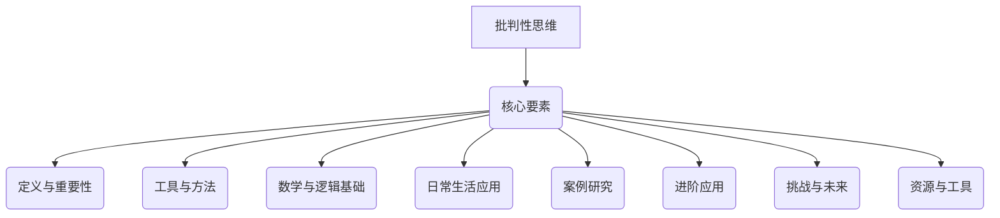

                 

# 批判性思维：提升洞察力的必备工具

> **关键词：批判性思维、洞察力、逻辑推理、算法原理、应用实战**

> **摘要：本文将深入探讨批判性思维的定义、核心要素及其在各领域的应用，通过逻辑推理、数学与逻辑基础、案例研究等方式，帮助读者提升批判性思维，增强洞察力。**

---

## 目录大纲

## 第一部分: 批判性思维基础

### 第1章: 批判性思维概述

#### 1.1 批判性思维的定义与重要性

#### 1.2 批判性思维的核心要素

#### 1.3 批判性思维与创造性思维的关系

### 第2章: 批判性思维的工具与方法

#### 2.1 分析问题的方法

#### 2.2 辩证思维的基本原理

#### 2.3 论证与反驳技巧

### 第3章: 批判性思维的数学与逻辑基础

#### 3.1 基本逻辑概念

#### 3.2 常见的逻辑谬误

#### 3.3 概率和统计学基本概念

### 第4章: 批判性思维在日常生活中的应用

#### 4.1 面对信息过载的批判性阅读

#### 4.2 提高决策质量的批判性思维

#### 4.3 团队协作中的批判性思维

### 第5章: 批判性思维案例研究

#### 5.1 案例一：经济学中的批判性思维

#### 5.2 案例二：社会科学研究中的批判性思维

#### 5.3 案例三：技术创新中的批判性思维

## 第二部分: 批判性思维的进阶应用

### 第6章: 批判性思维在教育中的应用

#### 6.1 教师如何培养学生的批判性思维

#### 6.2 学生的批判性思维能力培养策略

#### 6.3 批判性思维在课堂讨论中的应用

### 第7章: 批判性思维在职场中的应用

#### 7.1 提高职场沟通效率的批判性思维

#### 7.2 解决职场问题的批判性思维

#### 7.3 职场领导力与批判性思维

### 第8章: 批判性思维与个人成长

#### 8.1 增强自我反思能力的批判性思维

#### 8.2 提升个人决策能力的批判性思维

#### 8.3 批判性思维与心理健康

### 第9章: 批判性思维的挑战与未来

#### 9.1 批判性思维的局限性

#### 9.2 批判性思维的未来发展趋势

#### 9.3 如何在实践中持续提升批判性思维

## 附录

### 附录A: 批判性思维资源与工具

#### A.1 批判性思维学习资源推荐

#### A.2 常用的批判性思维工具

#### A.3 批判性思维相关书籍与文献推荐

## Mermaid 流程图

---

接下来，我们将逐步深入探讨批判性思维的基础和进阶应用，帮助读者全面理解并实践这一提升洞察力的必备工具。 <|endoftext|>

