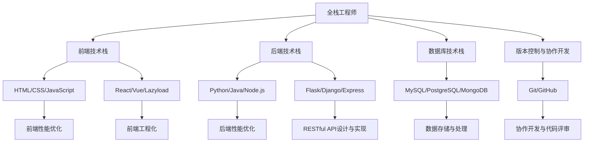

                 

### 《拼多多2024校招全栈工程师面试实战》

#### 关键词：
- 拼多多校招
- 全栈工程师
- 面试实战
- 技术栈
- 算法与数据结构

#### 摘要：
本文将深入探讨2024年拼多多校招全栈工程师面试的实战技巧。通过详细的章节划分，从基础知识、前端与后端开发、数据库技术到版本控制与协作开发，全面解析面试过程中可能遇到的问题。此外，本文还特别关注算法与数据结构的学习，以及编程语言与面试技巧的提升，旨在为考生提供全方位的面试指导。最后，我们将通过真实的面试真题解析和全栈工程师职业发展路径的探讨，帮助考生在面试中脱颖而出。

---

### 《拼多多2024校招全栈工程师面试实战》目录大纲

#### 第一部分：全栈工程师基础知识

##### 第1章：全栈工程师概述
- **1.1 全栈工程师的定义与重要性**
  - **定义**：全栈工程师与前后端工程师的区别
  - **重要性**：为何全栈工程师在职场中备受青睐
- **1.2 全栈工程师技能树**
  - **前端技术栈**
    - HTML/CSS/JavaScript
    - React/Vue/Lazyload
  - **后端技术栈**
    - Python/Java/Node.js
    - Flask/Django/Express
  - **数据库技术栈**
    - MySQL/PostgreSQL/MongoDB
  - **版本控制与代码管理**
    - Git/GitHub
- **1.3 全栈工程师的职业规划**
  - **初级全栈工程师**：如何提升自己
  - **中级全栈工程师**：职业发展的关键点
  - **高级全栈工程师**：职业规划与成长路径

##### 第2章：前端开发实战
- **2.1 前端开发环境搭建**
  - **环境配置**：开发工具与代码编辑器
  - **版本控制**：Git的基本操作与GitHub的使用
- **2.2 React/Vue框架应用**
  - **React组件化开发**
    - **组件定义与生命周期**
    - **状态管理与数据传递**
  - **Vue单页应用**
    - **Vue模板与指令**
    - **Vue组件与生命周期**
  - **前端工程化**
    - **Webpack配置**
    - **Babel编译**
- **2.3 前端性能优化**
  - **资源加载与缓存**
    - **懒加载与预加载**
    - **CDN加速**
  - **代码拆分与懒加载**
    - **代码分割**
    - **模块加载**
  - **响应式设计**
    - **媒体查询**
    - **响应式布局**

##### 第3章：后端开发实战
- **3.1 后端开发环境搭建**
  - **开发工具**：IDE与终端
  - **版本控制**：Git操作
- **3.2 Flask/Django/Express框架应用**
  - **Flask路由与视图**
    - **请求处理与返回**
    - **路由配置与URL映射**
  - **Django模型与视图**
    - **Django ORM**
    - **视图与中间件**
  - **Express路由与中间件**
    - **请求处理**
    - **中间件使用**
- **3.3 RESTful API设计与实现**
  - **RESTful API原理**
    - **RESTful风格**
    - **HTTP方法**
  - **数据验证与错误处理**
    - **数据校验**
    - **错误处理与返回**
  - **JWT认证与授权**
    - **JWT原理**
    - **认证与授权流程**
- **3.4 后端性能优化**
  - **数据库查询优化**
    - **索引**
    - **查询优化**
  - **缓存机制**
    - **Redis缓存**
    - **缓存策略**
  - **并发处理**
    - **线程与进程**
    - **异步编程**

##### 第4章：数据库与数据存储
- **4.1 常见数据库介绍**
  - **MySQL**
    - **安装与配置**
    - **基本操作**
  - **PostgreSQL**
    - **特性**
    - **SQL语法**
  - **MongoDB**
    - **文档数据库**
    - **数据建模**
- **4.2 数据库设计原则**
  - **规范化**
  - **反规范化**
  - **范式**
- **4.3 数据存储与处理**
  - **Redis缓存**
    - **数据结构**
    - **应用场景**
  - **Elasticsearch搜索**
    - **安装与配置**
    - **查询优化**

##### 第5章：版本控制与协作开发
- **5.1 Git基本操作**
  - **仓库创建与克隆**
  - **分支管理**
  - **合并与冲突解决**
- **5.2 GitHub项目管理**
  - **项目创建与托管**
  - **分支协作**
  - **Pull Request与代码评审**
- **5.3 协作开发与代码评审**
  - **团队协作**
  - **代码规范**
  - **代码审查**

#### 第二部分：拼多多校招面试题目详解

##### 第6章：算法与数据结构
- **6.1 算法思维导图**
  - **排序算法**
  - **搜索算法**
  - **图算法**
  - **动态规划**
- **6.2 常见算法题解**
  - **排序算法**
    - **冒泡排序**
    - **选择排序**
    - **插入排序**
  - **搜索算法**
    - **线性搜索**
    - **二分搜索**
  - **图算法**
    - **深度优先搜索**
    - **广度优先搜索**
  - **动态规划**
    - **斐波那契数列**
    - **最长公共子序列**

##### 第7章：编程语言与面试技巧
- **7.1 编程语言基础知识**
  - **Python**
    - **数据类型**
    - **控制流程**
  - **Java**
    - **面向对象**
    - **异常处理**
  - **JavaScript**
    - **DOM操作**
    - **事件处理**
- **7.2 面试准备与技巧**
  - **自我介绍**
    - **准备内容**
    - **注意事项**
  - **项目经历**
    - **如何展示**
    - **亮点突出**
  - **技术面试问题解析**
    - **常见问题与回答思路**
    - **应对策略**

##### 第8章：拼多多校招真题与解析
- **8.1 算法真题解析**
  - **题目列举与解析**
- **8.2 编程题实战**
  - **题目描述与解答**
- **8.3 行为面试真题**
  - **行为问题解析**

##### 第9章：全栈工程师职业发展
- **9.1 职业发展规划**
  - **初级全栈工程师**
  - **中级全栈工程师**
  - **高级全栈工程师**
- **9.2 全栈工程师成长路线**
  - **技术提升**
  - **项目经验**
  - **团队协作与沟通**

### 附录

#### 附录A：全栈工程师学习资源
- **A.1 技术博客与社区**
  - **优秀博客推荐**
  - **活跃社区介绍**
- **A.2 在线课程与教材**
  - **编程语言基础**
  - **框架应用**
  - **算法与数据结构**

#### 附录B：全栈工程师面试问答集锦
- **B.1 常见面试问题与答案**
  - **技术问题**
  - **行为问题**
- **B.2 面试经验分享**
  - **面试技巧**
  - **注意事项**

#### 附录C：全栈工程师面试准备指南
- **C.1 面试前的准备工作**
  - **技能准备**
  - **心理准备**
- **C.2 面试过程中的注意事项**
  - **言行举止**
  - **时间管理**

### 核心概念与联系

在全栈工程师的技能树中，前端与后端、数据库技术以及版本控制与协作开发是四个核心组成部分。以下是一个简单的Mermaid流程图，展示了这些部分之间的联系。



通过这个流程图，我们可以清晰地看到全栈工程师需要掌握的各个技能点，以及它们之间的相互关联。在前端技术栈中，HTML、CSS和JavaScript是基础，而React和Vue则是当前最流行的前端框架。后端技术栈则包括了Python、Java和Node.js等编程语言，以及Flask、Django和Express等常用框架。数据库技术栈涉及MySQL、PostgreSQL和MongoDB等数据库系统，而版本控制与协作开发则依赖于Git和GitHub等工具。

### 核心算法原理讲解

算法是计算机科学的核心，是全栈工程师必须掌握的基本技能。以下，我们将通过伪代码和详细解释，深入阐述几种常见算法的原理。

#### 冒泡排序

**原理**：冒泡排序是一种简单的排序算法。它重复地遍历要排序的数列，一次比较两个元素，如果它们的顺序错误就把它们交换过来。遍历数列的工作是重复进行，直到没有再需要交换的元素为止。

**伪代码**：

```
function bubbleSort(array)
    n = length(array)
    for i from 0 to n-1
        for j from 0 to n-i-1
            if array[j] > array[j+1]
                swap(array[j], array[j+1])
```

**解释**：外层循环`for i from 0 to n-1`负责控制遍历的次数，而内层循环`for j from 0 to n-i-1`负责每次遍历的比较和交换操作。每次外层循环结束时，最大元素都会“冒泡”到数组的末尾。

**举例说明**：

假设数组为`[5, 2, 9, 1, 5]`，经过一次冒泡排序后，最大值`9`会移到数组的末尾：

```
初始状态：[5, 2, 9, 1, 5]
第一轮：[2, 5, 1, 5, 9]
第二轮：[2, 1, 5, 5, 9]
第三轮：[2, 1, 5, 5, 9]
第四轮：[2, 1, 5, 5, 9]
```

#### 二分搜索

**原理**：二分搜索是一种高效的查找算法。它通过将搜索区间不断对半分，来快速定位目标元素。算法假设数列是有序的。

**伪代码**：

```
function binarySearch(array, target)
    low = 0
    high = length(array) - 1
    while low <= high
        mid = (low + high) / 2
        if array[mid] == target
            return mid
        else if array[mid] < target
            low = mid + 1
        else
            high = mid - 1
    return -1
```

**解释**：算法首先设置`low`和`high`两个指针，分别指向数列的第一个和最后一个元素。然后，通过不断缩小区间，逐步逼近目标元素。如果找到目标元素，返回其索引；否则，返回-1。

**举例说明**：

假设数组为`[1, 3, 5, 7, 9, 11]`，目标值为`7`：

```
初始状态：low = 0, high = 5
第一次：mid = 2, array[mid] = 5, low = 3
第二次：mid = 4, array[mid] = 9, high = 3
第三次：mid = 3, array[mid] = 7, 返回mid
```

#### 动态规划

**原理**：动态规划是一种解决最优子结构问题的算法。它通过将复杂问题分解为更小的子问题，并保存子问题的解，来避免重复计算。

**伪代码**：（以计算斐波那契数列为例）

```
function fibonacci(n)
    if n <= 1
        return n
    dp = [0] * (n + 1)
    dp[0] = 0
    dp[1] = 1
    for i from 2 to n
        dp[i] = dp[i-1] + dp[i-2]
    return dp[n]
```

**解释**：动态规划通过一个数组`dp`来存储每个子问题的解。初始时，`dp[0]`和`dp[1]`分别设置为0和1，然后通过迭代计算得到每个子问题的解。

**举例说明**：

```
fibonacci(5) = fibonacci(4) + fibonacci(3)
fibonacci(4) = fibonacci(3) + fibonacci(2)
fibonacci(3) = fibonacci(2) + fibonacci(1)
fibonacci(2) = fibonacci(1) + fibonacci(0)
fibonacci(1) = 1
fibonacci(0) = 0
fibonacci(5) = 3 + 2 = 5
```

通过以上对冒泡排序、二分搜索和动态规划等算法的详细讲解，我们可以看到算法在解决具体问题时的重要性和应用价值。掌握这些核心算法原理，将帮助全栈工程师在面试中应对各种算法题，提高编程能力。

### 数学模型和公式及详细讲解与举例说明

在计算机科学中，数学模型和公式是理解和解决许多问题的基础。下面我们将介绍几个重要的数学模型和公式，并使用LaTeX格式进行书写，同时提供详细讲解和实际应用实例。

#### 1. 决策树模型

决策树是一种广泛用于分类和回归问题的监督学习模型。它通过一系列的决策规则将数据划分为不同的类别。

**LaTeX公式**：

$$
T = \{\text{叶节点}, \text{内部节点}\}
$$

**详细讲解**：决策树由叶节点和内部节点组成。叶节点表示最终的分类结果，而内部节点表示某个决策点。每个内部节点都有一个属性测试，用于将数据划分为两个或更多的子集。

**举例说明**：假设我们有一个分类问题，需要根据客户的年龄和收入来决定是否批准贷款。决策树模型如下：

```
年龄 < 30 ? 是（叶节点）: 年龄 < 50 ? 是（叶节点）: 否（叶节点）
```

#### 2. 贝叶斯公式

贝叶斯公式是概率论中用于计算后验概率的经典公式，广泛应用于各种分类和预测问题。

**LaTeX公式**：

$$
P(A|B) = \frac{P(B|A) \cdot P(A)}{P(B)}
$$

**详细讲解**：贝叶斯公式用于计算在给定事件B发生的情况下，事件A发生的条件概率。它由三个部分组成：事件B在事件A发生的条件下的概率（$P(B|A)$）、事件A的先验概率（$P(A)$），以及事件B的总概率（$P(B)$）。

**举例说明**：假设我们有一个疾病检测器，它可以检测出90%的患病者会给出阳性结果，而10%的健康者会给出误报。如果一个人检测出阳性，我们需要计算这个人实际患病的概率。已知总体中患病的概率是1%。使用贝叶斯公式：

```
P(患病|阳性) = \frac{P(阳性|患病) \cdot P(患病)}{P(阳性)}
                = \frac{0.9 \cdot 0.01}{0.01 \cdot 0.9 + 0.1 \cdot 0.99}
                ≈ 0.0476
```

即阳性检测结果下实际患病的概率约为4.76%。

#### 3. 最小生成树

最小生成树是一种图论算法，用于在一个无向加权图中找到包含全部节点的权重最小的树。

**LaTeX公式**：

$$
T = \{e \in E | T \text{是最小权重集合}, w(e) \leq w(f) \text{对于所有} f \in E\}
$$

**详细讲解**：最小生成树是图中的一个子图，它包含图中的所有节点，且边的权重之和最小。Prim算法和Kruskal算法是常用的最小生成树算法。

**举例说明**：假设有一个图，其中节点的权重如下：

```
A-B: 2, A-C: 3, B-C: 4, B-D: 5, C-D: 6, C-E: 7, D-E: 8
```

我们可以使用Prim算法来找到最小生成树。首先选择任意节点作为起点（例如A），然后逐步添加权重最小的边，直到所有节点都被包含：

```
A-B: 2
A-C: 3
B-C: 4
B-D: 5
C-D: 6
C-E: 7
```

最终，最小生成树的边权之和为2+3+4+5+6+7=27。

#### 4. 加密算法中的Hash函数

Hash函数是加密算法中用于将数据转换为一固定长度的字符串的重要工具。

**LaTeX公式**：

$$
H(x) = \text{固定长度字符串}
$$

**详细讲解**：Hash函数将任意长度的输入（如文件或字符串）映射到固定长度的输出。其主要特性包括确定性和高效性，使得碰撞（不同输入产生相同输出）的概率极低。

**举例说明**：MD5是一种常见的Hash函数，用于生成一个128位的哈希值。假设我们有一个字符串“Hello World”，使用MD5计算其哈希值：

```
H("Hello World") = "2502a1f4f57c7d2a2e2b5613d1e4e56d"
```

通过以上对决策树模型、贝叶斯公式、最小生成树和Hash函数的详细讲解及实际应用实例，我们可以看到数学模型和公式在计算机科学中的广泛应用和重要性。掌握这些概念和工具，将为全栈工程师在面试和实际项目中提供有力的支持。

### 项目实战

在实际项目中，全栈工程师需要掌握从开发环境搭建、代码实现到代码解读与分析的全过程。以下，我们将通过一个简单的博客系统项目，详细讲解这些步骤。

#### 项目简介

本项目是一个简单的博客系统，包含以下功能：

- 用户注册与登录
- 发表文章
- 评论文章
- 文章分类管理

#### 开发环境搭建

1. **前端开发环境**：

   - **代码编辑器**：Visual Studio Code（VSCode）
   - **版本控制**：Git

   安装VSCode后，可以通过扩展市场安装`Git Source Control`插件，以便更好地管理代码。

2. **后端开发环境**：

   - **编程语言**：Python
   - **框架**：Flask
   - **数据库**：SQLite

   安装Python和pip后，使用pip安装Flask和SQLite：

   ```bash
   pip install Flask
   pip install pysqlite3
   ```

3. **数据库配置**：

   - **创建数据库**：在项目目录中创建一个名为`blog.db`的SQLite数据库文件。

   ```sql
   CREATE TABLE users (
       id INTEGER PRIMARY KEY,
       username TEXT UNIQUE NOT NULL,
       password TEXT NOT NULL
   );

   CREATE TABLE posts (
       id INTEGER PRIMARY KEY,
       title TEXT NOT NULL,
       content TEXT NOT NULL,
       author INTEGER,
       created_at TIMESTAMP DEFAULT CURRENT_TIMESTAMP,
       FOREIGN KEY (author) REFERENCES users (id)
   );

   CREATE TABLE comments (
       id INTEGER PRIMARY KEY,
       content TEXT NOT NULL,
       author INTEGER,
       post_id INTEGER,
       created_at TIMESTAMP DEFAULT CURRENT_TIMESTAMP,
       FOREIGN KEY (author) REFERENCES users (id),
       FOREIGN KEY (post_id) REFERENCES posts (id)
   );
   ```

4. **项目目录结构**：

   ```
   blog/
   ├── app.py
   ├── templates/
   │   ├── base.html
   │   ├── login.html
   │   ├── register.html
   │   ├── post.html
   │   ├── posts.html
   ├── static/
   │   ├── css/
   │   │   └── style.css
   │   └── js/
   │       └── script.js
   ├── requirements.txt
   └── .gitignore
   ```

#### 代码实现

1. **用户注册与登录**：

   **app.py**：

   ```python
   from flask import Flask, request, render_template, redirect, url_for, session
   import sqlite3

   app = Flask(__name__)
   app.secret_key = 'mysecretkey'

   def get_db_connection():
       conn = sqlite3.connect('blog.db')
       conn.row_factory = sqlite3.Row
       return conn

   @app.route('/')
   def index():
       conn = get_db_connection()
       posts = conn.execute('SELECT * FROM posts ORDER BY created_at DESC').fetchall()
       conn.close()
       return render_template('posts.html', posts=posts)

   @app.route('/login', methods=['GET', 'POST'])
   def login():
       if request.method == 'POST':
           username = request.form['username']
           password = request.form['password']
           conn = get_db_connection()
           user = conn.execute('SELECT * FROM users WHERE username = ? AND password = ?', (username, password)).fetchone()
           conn.close()
           if user:
               session['user'] = user['id']
               return redirect(url_for('index'))
           else:
               return 'Invalid username or password'
       return render_template('login.html')

   @app.route('/register', methods=['GET', 'POST'])
   def register():
       if request.method == 'POST':
           username = request.form['username']
           password = request.form['password']
           conn = get_db_connection()
           conn.execute('INSERT INTO users (username, password) VALUES (?, ?)', (username, password))
           conn.commit()
           conn.close()
           return redirect(url_for('login'))
       return render_template('register.html')

   if __name__ == '__main__':
       app.run(debug=True)
   ```

   **login.html**：

   ```html
   

   
     <h2>Login</h2>
     <form method="post">
       <label for="username">Username:</label>
       <input type="text" id="username" name="username" required>
       <label for="password">Password:</label>
       <input type="password" id="password" name="password" required>
       <button type="submit">Login</button>
     </form>
   
   ```

   **register.html**：

   ```html
   

   
     <h2>Register</h2>
     <form method="post">
       <label for="username">Username:</label>
       <input type="text" id="username" name="username" required>
       <label for="password">Password:</label>
       <input type="password" id="password" name="password" required>
       <button type="submit">Register</button>
     </form>
   
   ```

2. **发表文章**：

   **app.py**：

   ```python
   @app.route('/post', methods=['GET', 'POST'])
   def post():
       if 'user' not in session:
           return redirect(url_for('login'))
       if request.method == 'POST':
           title = request.form['title']
           content = request.form['content']
           conn = get_db_connection()
           conn.execute('INSERT INTO posts (title, content, author) VALUES (?, ?, ?)', (title, content, session['user']))
           conn.commit()
           conn.close()
           return redirect(url_for('index'))
       return render_template('post.html')

   ```

   **post.html**：

   ```html
   

   
     <h2>Post Article</h2>
     <form method="post">
       <label for="title">Title:</label>
       <input type="text" id="title" name="title" required>
       <label for="content">Content:</label>
       <textarea id="content" name="content" required></textarea>
       <button type="submit">Post</button>
     </form>
   
   ```

3. **评论文章**：

   **app.py**：

   ```python
   @app.route('/post/<int:post_id>/comment', methods=['POST'])
   def comment(post_id):
       if 'user' not in session:
           return redirect(url_for('login'))
       content = request.form['content']
       conn = get_db_connection()
       conn.execute('INSERT INTO comments (content, author, post_id) VALUES (?, ?, ?)', (content, session['user'], post_id))
       conn.commit()
       conn.close()
       return redirect(url_for('post', post_id=post_id))
   ```

   **post.html**：

   ```html
   

   
     <h2>{{ post.title }}</h2>
     <p>{{ post.content }}</p>
     
       <p><strong>{{ comment.author }}</strong>: {{ comment.content }}</p>
     
     <form method="post" action="{{ url_for('comment', post_id=post.id) }}">
       <label for="content">Your comment:</label>
       <textarea id="content" name="content" required></textarea>
       <button type="submit">Submit</button>
     </form>
   
   ```

#### 代码解读与分析

1. **用户注册与登录**：

   - `login`视图函数处理登录请求，通过POST方法获取用户名和密码，并从数据库中验证用户信息。如果验证成功，将用户ID存储在会话中。
   - `register`视图函数处理注册请求，将用户信息插入到数据库中。

2. **发表文章**：

   - `post`视图函数处理文章发表请求。首先检查用户是否已登录，然后通过POST方法获取文章标题和内容，并将信息插入到数据库中。

3. **评论文章**：

   - `comment`视图函数处理评论提交请求。检查用户是否已登录，然后获取评论内容并插入到数据库中。

4. **模板渲染**：

   - 使用Jinja2模板引擎渲染HTML页面。模板文件继承自`base.html`，包含页面布局和通用组件。

通过以上步骤，我们搭建了一个简单的博客系统，实现了用户注册与登录、发表文章和评论文章等功能。实际项目中，还需要考虑更多的功能和优化，如文章分类管理、权限控制、缓存和安全性等。

### 全栈工程师的职业规划

在进入全栈工程师的职业道路之前，了解各个阶段的职业规划是至关重要的。这不仅可以帮助您更好地规划自己的职业发展，还能帮助您在面试中展现自己的职业规划能力。以下是全栈工程师职业规划的详细步骤：

#### 初级全栈工程师

1. **基础知识**：掌握Web开发的基础技术，如HTML、CSS和JavaScript，以及常用的前端框架（如React和Vue）。
2. **后端知识**：熟悉至少一种后端编程语言（如Python、Java或Node.js）和一种后端框架（如Flask、Django或Express）。
3. **数据库知识**：掌握SQL数据库（如MySQL和PostgreSQL）的使用，了解NoSQL数据库（如MongoDB）的基本原理。
4. **项目经验**：通过实际项目，积累开发经验，了解项目从需求分析到最终部署的全过程。
5. **面试准备**：准备常见的编程语言面试题和数据结构算法题，提升自己的编程能力。

#### 中级全栈工程师

1. **技术深化**：深入了解前端和后端技术的细节，如React的组件生命周期、Node.js的异步编程等。
2. **性能优化**：学习前端和后端的性能优化策略，如代码拆分、缓存机制、数据库查询优化等。
3. **架构设计**：学习大型系统的架构设计，了解微服务、容器化技术（如Docker和Kubernetes）等。
4. **团队协作**：提升团队协作能力，学会使用版本控制工具（如Git）和协作开发平台（如GitHub）。
5. **面试提升**：在面试中展示自己的技术深度和解决复杂问题的能力。

#### 高级全栈工程师

1. **技术领导力**：成为团队的技术领导者，负责技术决策和架构设计。
2. **系统设计**：能够设计和实现大型、高并发的系统，如电商平台、社交媒体等。
3. **项目管理**：掌握项目管理方法和工具，如敏捷开发（Agile）和看板（Kanban）。
4. **技术选型**：根据项目需求，选择合适的技术栈和解决方案。
5. **面试策略**：在面试中展示自己的领导力、决策能力和项目经验。

### 职业规划建议

1. **持续学习**：技术更新迅速，保持持续学习的心态，不断更新自己的知识库。
2. **实践项目**：通过实际项目，积累经验，提高解决实际问题的能力。
3. **社区参与**：参与技术社区，与同行交流，学习他们的经验和见解。
4. **代码质量**：注重代码质量，编写可读性高、易于维护的代码。
5. **面试准备**：提前准备面试，模拟面试场景，提升自己的面试表现。

通过以上职业规划的步骤和建议，您可以逐步实现从初级到高级全栈工程师的职业发展。记住，持续学习和不断实践是全栈工程师成功的关键。

### 全栈工程师的成长路线

要成为全栈工程师，不仅需要掌握多种技术，还需要有系统的成长路线。以下是一个全栈工程师的成长路线，涵盖基础知识、技术深化、项目实践和职业发展四个关键阶段。

#### 基础知识阶段

1. **前端基础**：学习HTML、CSS和JavaScript，掌握基本的Web前端开发技能。推荐资源：《HTML与CSS入门经典》和《JavaScript高级程序设计》。
2. **前端框架**：学习React或Vue等现代前端框架，理解组件化开发、状态管理、路由和前端工程化。推荐资源：《React入门教程》和《Vue.js实战》。
3. **后端基础**：学习至少一种后端编程语言（如Python、Java或Node.js），熟悉HTTP协议和RESTful API设计。推荐资源：《Python Web开发实战》和《Node.js开发实战》。
4. **数据库知识**：掌握SQL和NoSQL数据库的使用，理解关系数据库和文档数据库的基本原理。推荐资源：《MySQL必知必会》和《MongoDB权威指南》。
5. **版本控制**：学习Git的基本操作和GitHub的使用，掌握代码的版本管理和协作开发。推荐资源：《Pro Git》。

#### 技术深化阶段

1. **前端深化**：深入学习JavaScript的高级特性，如ES6+语法、异步编程和模块化开发。推荐资源：《你不知道的JavaScript》。
2. **后端深化**：掌握后端框架的深入知识，如Django中的ORM和中间件，Node.js中的异步编程和事件驱动模型。推荐资源：《Django实战》和《Node.js高级编程》。
3. **性能优化**：学习前端和后端的性能优化技巧，如代码拆分、缓存机制、数据库查询优化和并发处理。推荐资源：《前端性能优化指南》和《性能之巅》。
4. **架构设计**：了解大型系统的架构设计，如微服务架构、分布式系统和容器化技术。推荐资源：《大型网站技术架构》和《Docker实战》。

#### 项目实践阶段

1. **个人项目**：通过个人项目，应用所学知识，提高实际开发能力。项目类型可以是博客、社交网络或电商平台。推荐资源：GitHub上的开源项目。
2. **团队合作**：参与团队项目，学习协作开发、代码审查和项目管理的经验。推荐资源：GitHub和GitLab上的团队项目。
3. **开源贡献**：参与开源项目，提升代码质量和团队合作能力。推荐资源：GitHub上的开源项目。

#### 职业发展阶段

1. **初级全栈工程师**：通过实习或初级职位，积累开发经验，了解项目全流程。推荐职位：全栈开发工程师、Web开发工程师。
2. **中级全栈工程师**：在初级职位的基础上，深入技术细节，提高系统设计和性能优化能力。推荐职位：高级全栈工程师、技术专家。
3. **高级全栈工程师**：成为团队的技术领导者，负责技术决策和架构设计。推荐职位：技术经理、首席技术官（CTO）。

通过以上成长路线，全栈工程师可以从基础知识到技术深化，再到项目实践和职业发展，逐步提升自己的能力和地位。

### 全栈工程师学习资源

要成为全栈工程师，掌握扎实的理论基础和丰富的实践经验至关重要。以下是一些推荐的学习资源，涵盖技术博客、在线课程和教材，以帮助您在学习和职业发展中不断提升。

#### 技术博客与社区

1. **FreeCodeCamp**：这是一个免费的全栈开发学习平台，提供丰富的教程和实战项目，适合初学者入门。
   - 地址：[https://www.freecodecamp.org/](https://www.freecodecamp.org/)

2. **Medium**：Medium上有许多优秀的技术博客，涵盖前端、后端和数据库等多个领域。
   - 地址：[https://medium.com/](https://medium.com/)

3. **GitHub**：GitHub不仅是代码托管平台，也是一个巨大的知识库，许多开源项目的技术文档和博客都在这里。
   - 地址：[https://github.com/](https://github.com/)

4. **Stack Overflow**：程序员社区，提供问题解答和技术讨论，适合解决开发中的具体问题。
   - 地址：[https://stackoverflow.com/](https://stackoverflow.com/)

#### 在线课程与教材

1. **Coursera**：提供大量计算机科学和软件工程课程，包括Web开发和数据分析等。
   - 地址：[https://www.coursera.org/](https://www.coursera.org/)

2. **Udemy**：提供丰富多样的编程和全栈开发课程，适合不同水平的学习者。
   - 地址：[https://www.udemy.com/](https://www.udemy.com/)

3. **edX**：由哈佛大学和麻省理工学院合作的在线学习平台，提供高质量的计算机科学课程。
   - 地址：[https://www.edx.org/](https://www.edx.org/)

4. **《Head First 设计模式》**：适合初学者理解设计模式，提高代码的可维护性和扩展性。
   - 地址：[https://www.headfirstlabs.com/books/hfdp/](https://www.headfirstlabs.com/books/hfdp/)

5. **《You Don't Know JS》**：深入讲解JavaScript的高级特性，适合想要提升JavaScript水平的开发者。
   - 地址：[https://github.com/getify/You-Dont-Know-JS](https://github.com/getify/You-Dont-Know-JS)

通过利用这些资源，您可以从基础知识开始，逐步深入到高级技术，全面提升自己的全栈开发能力。

### 全栈工程师面试问答集锦

在面试过程中，全栈工程师可能会遇到各种类型的问题，包括技术问题、行为问题以及项目经验相关的提问。以下是一些建议和答案，帮助您更好地应对面试。

#### 常见技术问题

1. **什么是RESTful API？**
   - **答案**：RESTful API是一种基于HTTP协议的接口设计规范，用于实现Web服务的客户端和服务器之间的通信。它通过GET、POST、PUT、DELETE等方法来实现资源的创建、读取、更新和删除操作。

2. **解释一下JavaScript中的闭包是什么？**
   - **答案**：闭包是一种函数，它能够访问并保持其创建时的作用域链。闭包通常用来封装状态、避免全局变量污染，以及实现一些高级的编程模式，如模块化设计、事件处理和回调函数。

3. **如何实现一个单例模式？**
   - **答案**：单例模式确保一个类只有一个实例，并提供一个全局访问点。实现方式通常包括以下步骤：
     ```javascript
     class Singleton {
         constructor() {
             if (!Singleton.instance) {
                 Singleton.instance = this;
             }
             return Singleton.instance;
         }
     }
     ```
     在这里，我们使用构造函数检查是否已经创建了实例，如果没有则创建一个，并返回该实例。

4. **如何优化前端性能？**
   - **答案**：优化前端性能可以从以下几个方面进行：
     - **资源压缩**：压缩CSS和JavaScript文件，减少HTTP请求。
     - **懒加载**：延迟加载图片和资源，减少初始加载时间。
     - **缓存**：利用浏览器缓存，减少重复请求。
     - **代码拆分**：将代码拆分为多个包，按需加载。
     - **CDN**：使用内容分发网络（CDN）来加速静态资源加载。

5. **解释一下数据库中的索引是什么？**
   - **答案**：索引是数据库中用于快速数据检索的数据结构。它类似于书的目录，通过索引，数据库能够快速定位到特定记录，从而提高查询效率。常用的索引类型包括B树索引、哈希索引和全文索引。

#### 行为问题

1. **你如何处理工作压力？**
   - **答案**：面对工作压力，我会先分析问题的紧迫性和重要性，然后制定一个优先级列表。我会合理分配时间，确保在短时间内处理最重要的任务。此外，我会保持积极的心态，与团队成员保持良好的沟通，共同应对挑战。

2. **你遇到过一个最困难的项目是什么？你是如何解决的？**
   - **答案**：在我参与的一个项目中，我们面临了一个性能瓶颈问题，系统的响应时间超出了预期。我首先分析了系统的架构和数据库查询，通过增加索引、优化查询语句和缓存机制，成功提升了系统的性能。此外，我还与团队成员合作，通过代码审查和优化，进一步提升了代码质量。

3. **请描述一次你解决了一个复杂问题的经历。**
   - **答案**：有一次，我们需要在短时间内开发一个具有高并发处理能力的服务。我首先与团队讨论，确定了技术方案和分工。然后，我专注于后端服务的开发，使用了异步编程和消息队列来处理大量请求。通过不断测试和优化，我们成功实现了系统的高并发处理能力，并按时完成了项目。

#### 项目经验相关问题

1. **你能描述一下你在之前项目中的角色和职责吗？**
   - **答案**：在之前项目中，我担任了全栈开发工程师的角色。我负责前端页面的设计和实现，使用了React框架，并通过Vue框架实现了单页应用。在后端，我使用了Node.js和Express框架，实现了RESTful API。此外，我还参与了数据库设计和优化，使用了MySQL数据库，并通过Redis缓存提高了系统的响应速度。

2. **请简述你参与的一个重要的项目，以及你在项目中的贡献。**
   - **答案**：在我参与的一个电商平台项目中，我负责了一个购物车功能的设计和实现。为了提高用户体验，我使用了Vue.js实现了动态购物车界面，并通过WebSocket技术实现了实时更新购物车数据。我通过模块化设计，将购物车功能与其他模块解耦，提高了代码的可维护性和扩展性。此外，我还与团队成员合作，优化了系统的性能，减少了响应时间。

通过以上问答集锦，您可以更好地准备面试，展示自己的技术能力和项目经验。记住，在面试中保持自信、条理清晰，并针对每个问题给出具体的例子和解决方案，将有助于您在面试中脱颖而出。

### 全栈工程师面试准备指南

在准备全栈工程师的面试过程中，系统的规划和充分的准备是成功的关键。以下是一份全面的面试准备指南，帮助您从技能提升、知识梳理到面试技巧等多个方面进行全面准备。

#### 技能提升

1. **编程基础**：
   - **语言熟练度**：熟悉至少一种前端编程语言（如JavaScript、HTML、CSS）和一种后端编程语言（如Python、Java、Node.js）。通过编写实际的代码来加深理解。
   - **框架掌握**：精通至少一个前端框架（如React或Vue）和一个后端框架（如Flask或Django）。了解框架的核心概念和最佳实践。

2. **数据结构与算法**：
   - **基础知识**：掌握常见的数据结构（如数组、链表、栈、队列、树、图）和算法（如排序、搜索、图算法、动态规划）。
   - **实战练习**：通过编写代码解决LeetCode、HackerRank等在线平台上的算法题目，提升解题速度和思路。

3. **数据库知识**：
   - **SQL**：熟悉SQL的基本语法和常用操作（如查询、插入、更新、删除），以及数据库设计原则（如规范化、反规范化）。
   - **NoSQL**：了解常见NoSQL数据库（如MongoDB、Redis）的基本原理和应用场景。

4. **系统设计**：
   - **架构理解**：学习大型系统架构设计，如微服务、分布式系统、负载均衡等。
   - **性能优化**：了解前端和后端的性能优化策略，如代码拆分、缓存机制、数据库查询优化。

#### 知识梳理

1. **项目梳理**：
   - **项目总结**：梳理参与过的项目，准备详细的项目介绍，包括项目背景、技术栈、遇到的挑战和解决方案。
   - **亮点突出**：在项目介绍中突出自己的贡献和亮点，如技术难题的解决、性能优化措施、代码质量提升等。

2. **技术栈梳理**：
   - **技术深度**：梳理自己在每个技术领域的深度和广度，准备好能够详细解释的技术概念和原理。
   - **框架应用**：准备对所使用的框架进行深入讲解，包括其核心概念、优点和适用场景。

3. **工具掌握**：
   - **版本控制**：熟练使用Git进行版本控制，包括分支管理、合并和冲突解决。
   - **协作开发**：熟悉GitHub或其他协作工具的使用，如Pull Request、代码审查等。

#### 面试技巧

1. **自我介绍**：
   - **简洁明了**：自我介绍要简短而有力，突出自己的优势和特长。
   - **个性特点**：展示自己的性格特点，如团队合作、积极进取等。

2. **行为问题**：
   - **实例准备**：针对常见的行为问题（如处理压力、团队合作、解决问题等），提前准备具体的事例和解决方案。
   - **回答技巧**：用STAR法则（Situation，Task，Action，Result）来组织回答，确保回答具体、有条理。

3. **技术问题**：
   - **思路清晰**：在回答技术问题时，先阐述自己的思路和解决方案，再逐步展开。
   - **举例说明**：如果可能，使用简单的例子来说明复杂的技术概念，使面试官更容易理解。

4. **面试模拟**：
   - **模拟面试**：与朋友或导师进行模拟面试，练习回答各种类型的问题。
   - **反馈改进**：听取反馈，针对不足之处进行改进。

#### 心理准备

1. **调整心态**：面试前保持积极的心态，相信自己的准备。
2. **充分休息**：面试前确保有足够的休息，保持精神饱满。
3. **穿着打扮**：选择合适的面试服装，给人留下良好的第一印象。

通过以上全面的面试准备指南，您将能够更好地应对全栈工程师的面试，提升面试成功的几率。记住，准备是成功的一半，而充分的准备将使您在面试中更加自信和从容。祝您面试成功！
```markdown
### 附录A：全栈工程师学习资源

#### A.1 技术博客与社区

1. **MDN Web文档**：[https://developer.mozilla.org/zh-CN/](https://developer.mozilla.org/zh-CN/)
   - 提供Web开发标准和技术参考，是前端开发的权威资源。

2. **Stack Overflow**：[https://stackoverflow.com/](https://stackoverflow.com/)
   - 程序员社区，提供问题解答和技术讨论。

3. **freeCodeCamp**：[https://www.freecodecamp.org/](https://www.freecodecamp.org/)
   - 提供免费的全栈开发教程和实践项目。

4. **GitHub**：[https://github.com/](https://github.com/)
   - 代码托管平台，许多开源项目和博客在此分享。

5. **JavaScript Weekly**：[https://javascriptweekly.com/](https://javascriptweekly.com/)
   - 每周更新的JavaScript相关资源集合。

#### A.2 在线课程与教材

1. **Coursera**：[https://www.coursera.org/](https://www.coursera.org/)
   - 提供各种计算机科学和软件工程课程。

2. **Udemy**：[https://www.udemy.com/](https://www.udemy.com/)
   - 提供丰富的编程和全栈开发课程。

3. **edX**：[https://www.edx.org/](https://www.edx.org/)
   - 提供高质量的课程，包括计算机科学和软件工程。

4. **《JavaScript高级程序设计》**：[https://www.headfirstlabs.com/books/hfdp/](https://www.headfirstlabs.com/books/hfdp/)
   - 一本深入讲解JavaScript高级特性的经典教材。

5. **《Docker实战》**：[https://www.docker.com/books/docker-handbook](https://www.docker.com/books/docker-handbook)
   - 学习Docker和容器化技术的实用指南。

通过以上资源，您能够系统地学习和掌握全栈开发所需的知识和技能，提升自己的专业能力。无论是初学者还是有一定基础的开发者，这些资源都将为您提供宝贵的帮助。

### 附录B：全栈工程师面试问答集锦

#### B.1 常见面试问题与答案

1. **什么是全栈工程师？**
   - **答案**：全栈工程师是指具备前端和后端开发技能的工程师，能够独立完成Web应用程序的前端和后端开发工作。全栈工程师需要熟悉前端技术（如HTML、CSS、JavaScript和框架如React或Vue），后端技术（如Node.js、Python、Java或Go），以及数据库（如MySQL、PostgreSQL、MongoDB）。

2. **你能解释一下什么是RESTful API吗？**
   - **答案**：RESTful API是基于REST（Representational State Transfer）架构风格设计的一组接口，用于实现客户端与服务器之间的数据交换。它使用HTTP协议的GET、POST、PUT和DELETE方法来执行操作，如获取数据、创建数据、更新数据和删除数据。

3. **请举例说明你知道的几种排序算法。**
   - **答案**：常见的排序算法包括：
     - **冒泡排序**：通过重复遍历要排序的列表，一次比较两个相邻的元素，如果顺序错误就交换它们，直到整个列表排序完成。
     - **快速排序**：选择一个基准元素，将列表分为两部分，一部分小于基准元素，另一部分大于基准元素，然后递归地对这两部分进行快速排序。
     - **归并排序**：将待排序的列表分成若干个子列表，递归地对这些子列表进行排序，然后将它们合并成一个有序的列表。

4. **请解释一下什么是事件循环？**
   - **答案**：事件循环（event loop）是JavaScript中的核心概念之一，它负责处理异步任务和回调函数。JavaScript是单线程的，事件循环允许JavaScript在等待异步操作完成时继续执行其他任务。事件循环会从任务队列中获取异步操作的结果，并调用相应的回调函数，从而实现非阻塞异步编程。

5. **如何优化前端性能？**
   - **答案**：优化前端性能可以从以下几个方面进行：
     - **资源压缩**：压缩CSS和JavaScript文件，减少HTTP请求。
     - **懒加载**：延迟加载图片和资源，减少初始加载时间。
     - **缓存**：利用浏览器缓存，减少重复请求。
     - **代码拆分**：将代码拆分为多个包，按需加载。
     - **CDN**：使用内容分发网络（CDN）来加速静态资源加载。

6. **请解释一下什么是数据库索引？**
   - **答案**：数据库索引是一种特殊的数据结构，用于加速数据库的查询操作。它类似于书的索引，通过索引可以快速找到特定的记录。索引可以基于一个或多个列创建，常用的索引类型包括B树索引、哈希索引和全文索引。

7. **如何处理并发请求？**
   - **答案**：处理并发请求的方法包括：
     - **多线程**：使用多线程来处理多个请求，提高并发处理能力。
     - **异步编程**：通过异步编程模型，如Promise或async/await，避免同步阻塞，提高并发性。
     - **负载均衡**：使用负载均衡器，将请求分配到多个服务器，以均衡负载。

#### B.2 面试经验分享

1. **如何在面试中展示自己的项目经验？**
   - **答案**：在面试中展示项目经验时，可以按照以下步骤：
     - **简述项目背景**：介绍项目的目的和背景。
     - **技术栈使用**：列出项目中使用的技术和工具。
     - **核心贡献**：强调自己在项目中的核心贡献和成就。
     - **遇到的问题和解决方案**：分享在项目中遇到的问题和如何解决。
     - **成果展示**：提供项目的链接或截图，展示实际成果。

2. **如何在面试中回答算法题？**
   - **答案**：在回答算法题时，可以按照以下步骤：
     - **理解问题**：仔细阅读题目，确保理解问题的要求和限制。
     - **分析问题**：分析问题类型，确定使用的算法和数据结构。
     - **写出伪代码**：写出解决问题的伪代码，确保思路清晰。
     - **解释思路**：详细解释算法的思路和步骤。
     - **讨论时间复杂度**：讨论算法的时间复杂度和空间复杂度。

3. **面试前应该准备什么？**
   - **答案**：面试前应该准备以下事项：
     - **回顾基础知识**：复习数据结构、算法、编程语言和数据库等基础知识。
     - **准备项目**：梳理和准备过往的项目经验，准备好具体的例子和解决方案。
     - **模拟面试**：与朋友或同事进行模拟面试，提高面试技巧。
     - **面试着装**：选择合适的面试服装，给人留下良好的第一印象。
     - **心态调整**：保持积极的心态，相信自己的准备。

通过以上面试问答集锦和经验分享，您将能够更好地准备全栈工程师的面试，展示自己的技术实力和项目经验，提升面试成功的概率。

### 附录C：全栈工程师面试准备指南

#### C.1 面试前的准备工作

1. **技能提升**：
   - **编程语言**：熟练掌握至少一种前端和后端编程语言，如JavaScript和Python。
   - **框架掌握**：精通至少一种前端框架（如React或Vue）和一种后端框架（如Flask或Django）。
   - **数据库知识**：掌握SQL和NoSQL数据库的使用，如MySQL、PostgreSQL和MongoDB。

2. **知识梳理**：
   - **核心概念**：梳理前端、后端和数据库等核心概念，确保理解透彻。
   - **项目准备**：回顾并准备以往的项目经验，能够清晰、详细地描述项目的背景、技术和成果。

3. **练习算法题**：
   - **在线平台**：在LeetCode、HackerRank等在线平台上练习常见的算法题目。
   - **解题思路**：掌握常用的算法思维和技巧，如动态规划、分治算法等。

4. **准备面试题目**：
   - **常见问题**：整理并熟悉常见的面试问题，如数据结构和算法问题、编程语言基础问题等。
   - **回答练习**：模拟面试环境，练习回答问题，确保表达清晰、思路连贯。

#### C.2 面试过程中的注意事项

1. **自我介绍**：
   - **简洁明了**：简短介绍自己的姓名、背景和优势。
   - **重点突出**：突出自己的技能和项目经验，与职位要求相匹配。

2. **技术问题**：
   - **理解问题**：仔细阅读题目，确保理解问题的要求和限制。
   - **思路清晰**：在回答问题时，先阐述自己的思路和解决方案，再逐步展开。
   - **举例说明**：如果可能，使用简单的例子来说明复杂的技术概念。

3. **项目经验**：
   - **详细描述**：详细描述项目背景、技术栈、职责和成果。
   - **问题解决**：分享在项目中遇到的问题和解决方案，展示自己的问题解决能力。

4. **行为问题**：
   - **实例准备**：提前准备一些具体的行为问题实例，如处理压力、团队合作等。
   - **STAR法则**：使用STAR（Situation, Task, Action, Result）法则组织回答，确保回答具体、有条理。

5. **面试官互动**：
   - **主动提问**：在面试过程中，可以主动提问，展示自己的学习态度和思考能力。
   - **倾听回答**：认真倾听面试官的问题和回答，确保理解并给予恰当的回应。

#### C.3 面试后的跟进

1. **感谢信**：
   - **及时发送**：面试后及时发送一封感谢信，表达对面试机会的感激。
   - **个性化**：感谢信中可以提到面试过程中的具体话题，展示自己的兴趣和热情。

2. **反馈收集**：
   - **主动询问**：如果公司允许，可以主动询问面试反馈，了解自己的优点和改进方向。

3. **持续学习**：
   - **反思总结**：根据面试反馈，反思自己的不足，并制定改进计划。
   - **继续提升**：持续学习新知识和技能，不断提升自己的专业能力。

通过以上面试准备指南，您可以更加系统地准备全栈工程师的面试，提升面试成功的机会，走向职业发展的成功之路。祝您面试顺利！
```markdown
### 附录D：全栈工程师常见技术难题与解决方案

全栈工程师在日常工作中可能会遇到各种技术难题，以下是一些常见的技术问题及其解决方案，帮助您更好地应对和解决这些问题。

#### 1. 性能优化

**问题**：如何提高前端页面的加载速度？

**解决方案**：
- **资源压缩**：使用工具（如Gzip）压缩CSS和JavaScript文件，减少HTTP请求。
- **懒加载**：对于图片和视频等大文件，使用懒加载技术，仅在需要时加载。
- **代码拆分**：将代码拆分为多个包，按需加载，减少初始加载时间。
- **CDN**：使用CDN（如阿里云、腾讯云）加速静态资源加载。

#### 2. 数据库性能

**问题**：如何优化数据库查询速度？

**解决方案**：
- **索引**：为常用的查询列创建索引，提高查询效率。
- **查询优化**：避免使用SELECT *，只查询必要的列，减少数据传输。
- **缓存**：使用缓存（如Redis）存储常用查询结果，减少数据库访问。
- **分库分表**：对于大数据量，可以考虑分库分表，减少单表的压力。

#### 3. 系统稳定性

**问题**：如何确保系统的稳定性？

**解决方案**：
- **监控**：使用监控工具（如Prometheus、Grafana）实时监控系统的性能和状态。
- **容错**：使用分布式系统和微服务架构，确保系统在一个节点故障时仍能正常运行。
- **限流**：使用限流策略（如令牌桶、漏斗算法），防止系统被大量请求冲垮。
- **日志管理**：使用日志管理工具（如ELK堆栈），收集和分析系统日志，及时发现和解决问题。

#### 4. 安全问题

**问题**：如何确保系统的安全性？

**解决方案**：
- **权限管理**：实现细粒度的权限控制，确保用户只能访问其权限范围内的数据。
- **输入验证**：对用户输入进行严格的验证，防止SQL注入、XSS攻击等安全漏洞。
- **加密**：使用HTTPS协议传输数据，对敏感数据（如用户密码）进行加密存储。
- **安全审计**：定期进行安全审计，发现并修复潜在的安全漏洞。

#### 5. 跨域请求

**问题**：如何处理跨域请求？

**解决方案**：
- **CORS**：使用CORS（跨源资源共享）策略，配置服务端允许特定的跨域请求。
- **代理**：使用代理服务器（如Nginx）转发跨域请求，避免直接跨域通信。
- **JSONP**：使用JSONP技术，绕过CORS限制，但只适用于GET请求。

通过以上常见技术难题与解决方案，全栈工程师可以更好地应对日常开发中的各种挑战，提高系统的性能、稳定性和安全性。

### 附录E：全栈工程师常用工具与软件

在全栈工程师的日常工作中，掌握并熟练使用各种工具和软件是非常重要的。以下是一些常用的工具和软件，它们能显著提高开发效率，优化工作流程。

#### 1. 代码编辑器

**VSCode**：Visual Studio Code 是一款功能强大的开源代码编辑器，支持多种编程语言，具有丰富的插件生态，非常适合全栈开发。

- **优点**：高度可定制、语法高亮、智能提示、代码片段、任务管理等。
- **网址**：[https://code.visualstudio.com/](https://code.visualstudio.com/)

**Sublime Text**：Sublime Text 是一款轻量级且功能丰富的文本编辑器，适用于各种编程任务。

- **优点**：简洁的界面、快速启动、插件支持、多标签页。
- **网址**：[https://www.sublimetext.com/](https://www.sublimetext.com/)

#### 2. 版本控制系统

**Git**：Git 是最流行的分布式版本控制系统，适用于协作开发和代码管理。

- **优点**：高效、灵活、分布式、支持分支管理、代码审查。
- **网址**：[https://git-scm.com/](https://git-scm.com/)

**GitHub**：GitHub 是 Git 的云端服务，支持代码托管、协作开发、项目管理。

- **优点**：代码托管、Pull Request、代码评审、issue跟踪。
- **网址**：[https://github.com/](https://github.com/)

#### 3. 构建工具

**Webpack**：Webpack 是现代前端工程的基石，用于模块打包、代码拆分、性能优化等。

- **优点**：模块打包、代码拆分、懒加载、代码压缩。
- **网址**：[https://webpack.js.org/](https://webpack.js.org/)

**Gulp**：Gulp 是一个基于流和回调的自动化工具，用于任务自动化。

- **优点**：任务自动化、流式处理、插件丰富。
- **网址**：[https://gulpjs.com/](https://gulpjs.com/)

#### 4. 测试工具

**Jest**：Jest 是 Facebook 开发的 JavaScript 测试框架，简单易用。

- **优点**：同步/异步测试、覆盖率报告、 mocking。
- **网址**：[https://jestjs.io/](https://jestjs.io/)

**Mocha**：Mocha 是一个灵活的测试框架，适用于 Node.js 和前端。

- **优点**：模块化测试、插件丰富、集成方便。
- **网址**：[https://mochajs.org/](https://mochajs.org/)

#### 5. 云服务

**AWS**：Amazon Web Services 提供了丰富的云服务和工具，适用于各种应用场景。

- **优点**：云计算、数据库、存储、安全、数据分析。
- **网址**：[https://aws.amazon.com/](https://aws.amazon.com/)

**Google Cloud Platform**：Google Cloud Platform 提供了高性能、高可扩展性的云服务。

- **优点**：云计算、AI、存储、数据库、安全。
- **网址**：[https://cloud.google.com/](https://cloud.google.com/)

通过掌握和熟练使用这些工具和软件，全栈工程师可以显著提高工作效率，优化开发流程，确保项目的顺利进行。

