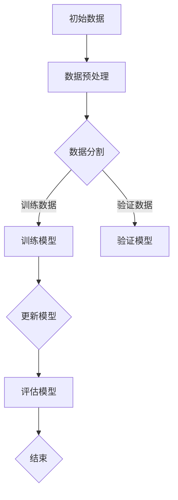

                 

# 《持续学习Continual Learning原理与代码实例讲解》

## 关键词
- 持续学习
- Continual Learning
- 持续学习原理
- Continual Learning方法
- 持续学习算法
- 持续学习应用
- 持续学习代码实例

## 摘要
本文将深入探讨持续学习（Continual Learning）的概念、原理和实现方法。我们将从持续学习的背景和重要性出发，详细分析其核心概念、原理和方法，并探讨其在自然语言处理、计算机视觉和推荐系统等领域的应用。此外，本文还将通过实际代码实例，展示如何在实际项目中实现持续学习，并解读其中的关键代码。

持续学习是一种机器学习方法，旨在使模型能够持续适应不断变化的输入数据分布。与传统的批量学习（Batch Learning）相比，持续学习具有更高的适应性和鲁棒性，能够更好地处理现实世界中的动态环境。本文将逐步讲解持续学习的核心概念、原理和算法，并通过实际代码实例，帮助读者理解和掌握持续学习的实现方法。

### 目录

1. 持续学习Continual Learning概述
   1.1 持续学习的概念与背景
   1.2 持续学习的重要性
   1.3 持续学习与传统机器学习的区别

2. Continual Learning的核心概念
   2.1 Continual Learning的挑战
   2.2 Continual Learning的分类
   2.3 Continual Learning的目标

3. Continual Learning的原理与方法
   3.1 持续学习的动态环境
   3.2 Continual Learning的架构
   3.3 Continual Learning的适应机制

4. Continual Learning的方法
   4.1 无监督持续学习方法
   4.2 有监督持续学习方法
   4.3 自监督持续学习方法

5. Continual Learning算法
   5.1 MAML算法
   5.2 Reptile算法
   5.3 Elastic Weight Consolidation（EWC）算法

6. Continual Learning在深度学习中的应用
   6.1 持续学习在自然语言处理中的应用
   6.2 持续学习在计算机视觉中的应用
   6.3 持续学习在推荐系统中的应用

7. 持续学习项目实战
   7.1 持续学习项目搭建
   7.2 持续学习代码实现
   7.3 实战案例解读

8. Continual Learning算法实现与代码解读
   8.1 MAML算法实现
   8.2 Reptile算法实现
   8.3 EWC算法实现

9. 持续学习的评估与优化
   9.1 Continual Learning的评估指标
   9.2 Continual Learning的优化策略
   9.3 Continual Learning的实验设计

10. 附录
    10.1 主流Continual Learning工具和库
    10.2 Continual Learning论文集锦
    10.3 相关学术会议与期刊

### 第一部分: 持续学习Continual Learning概述

## 1.1 持续学习的概念与背景

持续学习（Continual Learning），又称在线学习（Online Learning），是一种机器学习方法，旨在使模型能够持续适应不断变化的输入数据分布。在现实世界中，数据分布往往是动态变化的，如用户行为、市场趋势、传感器数据等。因此，持续学习具有很高的实用价值，能够使模型在长时间内保持性能，并应对新的数据分布。

### 1.1.1 持续学习的定义

持续学习是指模型在训练过程中不断接收新的数据，并适应这些新数据的分布，从而不断提高模型性能。与传统的批量学习不同，持续学习不需要一次性加载所有数据，而是通过逐批或逐条地更新模型参数，使其能够适应不断变化的数据分布。

### 1.1.2 持续学习的背景

随着互联网和物联网的快速发展，数据量呈爆炸式增长，传统的批量学习方法已经无法满足现实需求。此外，许多应用场景，如自动驾驶、智能语音助手、医疗诊断等，对模型的实时性要求越来越高。因此，持续学习作为一种能够实时适应数据变化的方法，受到了广泛关注。

### 1.1.3 持续学习的重要性

1. **提高模型鲁棒性**：持续学习能够使模型在长时间内保持性能，提高模型的鲁棒性，使其能够应对数据分布的变化。
2. **应对动态环境**：在动态环境中，持续学习能够使模型适应新数据，从而保持其在实际应用中的有效性。
3. **节省存储和计算资源**：持续学习不需要一次性加载所有数据，从而节省了存储和计算资源。

### 1.1.4 持续学习与传统机器学习的区别

1. **数据分布**：持续学习处理的是动态变化的数据分布，而传统机器学习处理的是静态数据分布。
2. **训练方式**：持续学习采用在线更新模型参数的方式，而传统机器学习采用批量更新模型参数的方式。
3. **应用场景**：持续学习适用于需要实时适应数据变化的应用场景，而传统机器学习适用于数据分布不变的应用场景。

## 1.2 持续学习的重要性

持续学习在机器学习领域具有重要的地位，原因如下：

1. **应对动态环境**：现实世界的数据分布往往是动态变化的，如用户行为、市场趋势、传感器数据等。持续学习能够使模型适应这些变化，从而保持其在实际应用中的有效性。
2. **提高模型鲁棒性**：持续学习能够使模型在长时间内保持性能，提高模型的鲁棒性，使其能够应对数据分布的变化。
3. **节省计算资源**：持续学习不需要一次性加载所有数据，从而节省了存储和计算资源。
4. **拓展机器学习应用场景**：持续学习能够使机器学习模型在更广泛的应用场景中发挥作用，如自动驾驶、智能语音助手、医疗诊断等。

## 1.3 持续学习与传统机器学习的区别

持续学习与传统机器学习在数据分布、训练方式、应用场景等方面存在显著差异：

1. **数据分布**：
   - **持续学习**：处理动态变化的数据分布，数据分布随时间推移不断变化。
   - **传统机器学习**：处理静态的数据分布，数据分布固定不变。

2. **训练方式**：
   - **持续学习**：采用在线更新模型参数的方式，模型参数逐批或逐条更新。
   - **传统机器学习**：采用批量更新模型参数的方式，模型参数一次性更新。

3. **应用场景**：
   - **持续学习**：适用于需要实时适应数据变化的应用场景，如自动驾驶、智能语音助手等。
   - **传统机器学习**：适用于数据分布不变的应用场景，如图像分类、语音识别等。

### 第一部分小结

本部分介绍了持续学习的概念、背景、重要性以及与传统机器学习的区别。通过对比分析，读者可以更清晰地理解持续学习的特点和应用价值。在下一部分中，我们将深入探讨持续学习的核心概念、原理和方法。

## 1.4 持续学习的挑战

尽管持续学习在机器学习领域具有很高的实用价值，但其在实际应用中仍然面临一系列挑战：

### 1.4.1 数据分布变化

持续学习的主要挑战在于处理动态变化的数据分布。在现实世界中，数据分布往往是动态变化的，如用户行为、市场趋势、传感器数据等。这使得模型需要不断适应新的数据分布，从而提高其在实际应用中的性能。

### 1.4.2 资源限制

持续学习需要在有限的计算资源和存储资源下进行，这要求模型具有高效的数据处理能力和参数更新机制。同时，持续学习还需要应对不同类型的数据，如图像、文本、语音等，这进一步增加了模型的复杂度。

### 1.4.3 模型泛化能力

持续学习要求模型具有良好的泛化能力，能够在不同数据分布下保持稳定性能。然而，现实世界中的数据分布变化往往具有不确定性和复杂性，这使得模型在适应新数据分布时容易出现过拟合或欠拟合。

### 1.4.4 模型更新策略

持续学习的关键在于如何有效地更新模型参数。传统的批量学习方法和在线学习方法在处理动态数据分布时存在局限性，无法满足持续学习的需求。因此，研究新的模型更新策略成为持续学习领域的重要课题。

### 1.4.5 系统稳定性

持续学习系统需要在长时间内保持稳定性能，避免因数据分布变化导致的模型崩溃或性能下降。此外，系统还需要具备良好的容错性和鲁棒性，能够应对各种异常情况和数据噪声。

综上所述，持续学习在面临动态数据分布、资源限制、模型泛化能力、模型更新策略和系统稳定性等挑战时，需要采取一系列有效的策略和方法，以提高其在实际应用中的性能和稳定性。

### 第一部分小结

本部分详细阐述了持续学习面临的挑战，包括数据分布变化、资源限制、模型泛化能力、模型更新策略和系统稳定性等。通过了解这些挑战，读者可以更深入地认识持续学习的难点和关键问题，为后续的学习和研究打下基础。在下一部分中，我们将继续探讨持续学习的核心概念、原理和方法。

## 1.5 Continual Learning的分类

Continual Learning（持续学习）根据学习任务和数据分布的不同，可以分为多种类型。以下是几种常见的分类方式：

### 1.5.1 按学习任务分类

1. **连续分类（Continuous Classification）**：模型在训练过程中不断接收新的标签数据，并不断更新模型参数以适应新的数据分布。
2. **连续回归（Continuous Regression）**：模型在训练过程中不断接收新的输入数据，并尝试预测新的输出值。
3. **连续多任务学习（Continuous Multi-Task Learning）**：模型同时处理多个学习任务，并在训练过程中不断更新模型参数以适应新的数据分布。

### 1.5.2 按数据分布分类

1. **上下文无关持续学习（Context-Free Continual Learning）**：模型在训练过程中不需要考虑数据的上下文信息，只需关注数据本身。这种类型的持续学习适用于数据分布变化较小的情况。
2. **上下文相关持续学习（Context-Dependent Continual Learning）**：模型在训练过程中需要考虑数据的上下文信息，如时间序列、空间关系等。这种类型的持续学习适用于数据分布变化较大的情况。
3. **增量持续学习（Incremental Continual Learning）**：模型在训练过程中逐批或逐条接收新的数据，并不断更新模型参数以适应新的数据分布。这种类型的持续学习适用于数据量较大的情况。

### 1.5.3 按学习模式分类

1. **被动持续学习（Passive Continual Learning）**：模型在训练过程中被动接收新的数据，并尝试适应新的数据分布。这种类型的持续学习适用于数据量较小、数据分布变化较小的情况。
2. **主动持续学习（Active Continual Learning）**：模型在训练过程中主动选择新的数据，并根据数据分布的变化调整学习策略。这种类型的持续学习适用于数据量较大、数据分布变化较大的情况。

通过以上分类，我们可以更清楚地理解Continual Learning的不同类型和应用场景，为后续的研究和实践提供指导。

### 第一部分小结

本部分详细介绍了Continual Learning的分类方式，包括按学习任务、数据分布和学习模式的不同进行分类。通过理解这些分类方式，读者可以更好地把握Continual Learning的核心概念和应用场景，为后续的学习和研究打下基础。在下一部分中，我们将继续探讨Continual Learning的目标和核心概念。

## 1.6 Continual Learning的目标

Continual Learning（持续学习）的核心目标是使机器学习模型能够持续适应不断变化的数据分布，从而在长时间内保持高性能和稳定性。具体来说，Continual Learning的目标主要包括以下几个方面：

### 1.6.1 提高模型鲁棒性

持续学习要求模型能够在长时间内应对数据分布的变化，从而提高模型的鲁棒性。通过持续学习，模型能够从新的数据中学习到新的知识，并将其融入到原有的模型中，从而避免因数据分布变化导致的模型性能下降。

### 1.6.2 保持模型性能

在动态环境下，数据分布不断变化，传统的批量学习方法往往无法适应这种变化，导致模型性能下降。而持续学习通过实时更新模型参数，使其能够适应新的数据分布，从而保持模型性能。

### 1.6.3 节省计算资源

持续学习不需要一次性加载所有数据，而是逐批或逐条地更新模型参数。这种在线学习方式能够有效节省计算资源和存储资源，使得模型在有限的资源下能够应对动态变化的数据分布。

### 1.6.4 拓展应用场景

持续学习能够使机器学习模型在更广泛的应用场景中发挥作用，如自动驾驶、智能语音助手、医疗诊断等。通过持续学习，模型能够实时适应新的数据分布，从而提高其在实际应用中的性能和鲁棒性。

### 1.6.5 提高模型泛化能力

持续学习要求模型具有良好的泛化能力，能够在不同数据分布下保持稳定性能。通过不断从新的数据中学习，模型能够逐渐优化其参数，从而提高泛化能力。

综上所述，Continual Learning的目标是使模型在动态环境下能够持续适应新的数据分布，从而提高模型的鲁棒性、性能、计算资源利用效率和泛化能力。通过实现这些目标，持续学习将极大地拓展机器学习应用的范围和深度。

### 第一部分小结

本部分详细阐述了Continual Learning的目标，包括提高模型鲁棒性、保持模型性能、节省计算资源、拓展应用场景和提高模型泛化能力等。通过理解这些目标，读者可以更深入地认识Continual Learning的核心价值和意义，为后续的学习和研究奠定基础。在下一部分中，我们将深入探讨Continual Learning的原理和方法。

### 第一部分总结

在本部分的探讨中，我们系统地介绍了持续学习（Continual Learning）的概念、背景、重要性、与传统的区别、面临的挑战、分类以及目标。通过对这些内容的深入分析，读者可以全面了解持续学习的核心概念和应用场景。持续学习作为一种能够在动态环境中保持模型性能的机器学习方法，具有很高的实用价值和研究意义。在下一部分中，我们将进一步探讨Continual Learning的原理和方法，帮助读者深入理解这一领域的核心技术。

## 第二部分: Continual Learning的原理与方法

### 2.1 持续学习的动态环境

持续学习（Continual Learning）主要关注在动态环境下模型的适应能力。动态环境是指数据分布随时间不断变化的环境，这种变化可能是连续的，也可能是离散的。在动态环境中，模型需要能够实时适应新的数据分布，以保持其性能和准确性。

### 2.1.1 数据分布变化的原因

数据分布变化的原因有很多，以下是几种常见的情况：

1. **新数据引入**：随着时间推移，新的数据不断生成并加入到训练集中，这会导致数据分布发生变化。
2. **数据噪声**：数据噪声是指数据中存在的一些随机误差或异常值，这些噪声可能会对数据分布产生影响。
3. **环境变化**：在某些应用场景中，环境因素（如天气、地理位置等）的变化也会导致数据分布发生变化。
4. **数据多样性**：数据来源的多样性也可能导致数据分布的变化，例如不同数据源的数据特征和分布可能存在显著差异。

### 2.1.2 持续学习在动态环境中的应用

持续学习在动态环境中的应用主要体现在以下几个方面：

1. **实时预测**：在动态环境中，模型需要能够实时适应新的数据分布，从而实现准确的实时预测。
2. **在线更新**：模型需要在线更新其参数，以适应新的数据分布。这种在线更新可以是逐批进行的，也可以是逐条数据进行的。
3. **多任务学习**：在某些应用场景中，模型需要同时处理多个任务，这些任务可能具有不同的数据分布，持续学习能够帮助模型适应这些变化。

### 2.1.3 持续学习的挑战

在动态环境中，持续学习面临着一系列挑战：

1. **计算资源限制**：动态环境中数据分布变化频繁，模型需要实时更新，这可能会对计算资源提出较高要求。
2. **数据分布变化的不确定性**：数据分布变化具有不确定性，模型需要能够应对这种不确定性，从而保持其性能和准确性。
3. **模型泛化能力**：持续学习要求模型具有良好的泛化能力，能够在不同数据分布下保持稳定性能。

通过深入理解持续学习在动态环境中的应用和挑战，读者可以更好地把握Continual Learning的核心技术，为后续的学习和实践打下基础。

### 2.2 Continual Learning的架构

Continual Learning（持续学习）的架构设计对于实现有效的动态环境适应能力至关重要。持续学习的架构通常包含以下几个关键组成部分：

#### 2.2.1 数据流管理

数据流管理是持续学习架构的核心部分，负责处理数据输入、存储、预处理和分发。具体来说，数据流管理包括以下功能：

1. **数据输入**：持续学习需要从不同的数据源接收数据，这些数据源可能包括传感器、用户行为、网络数据等。
2. **数据存储**：为了有效管理和存储数据，持续学习系统通常采用分布式存储方案，以便快速访问和处理大量数据。
3. **数据预处理**：在数据流进入模型训练之前，需要进行一系列预处理操作，如数据清洗、特征提取、数据标准化等，以确保数据质量。
4. **数据分发**：预处理后的数据需要被分发到不同的模型或学习任务中，以便进行后续的处理和训练。

#### 2.2.2 模型更新机制

模型更新机制是持续学习架构中负责实时更新模型参数的核心组件。以下是几种常见的模型更新机制：

1. **在线更新**：在线更新是指模型参数在每次数据输入后立即更新。这种方式能够快速适应数据变化，但可能需要较高的计算资源。
2. **批更新**：批更新是指模型参数在接收一定数量的数据后进行批量更新。这种方式在计算资源有限的情况下更为高效，但适应数据变化的速度较慢。
3. **增量更新**：增量更新是指模型参数在每次数据输入后仅更新部分参数，而不是整个模型。这种方式能够减少计算负担，但需要复杂的参数同步机制。

#### 2.2.3 持久化策略

持久化策略是指如何保存和加载模型的训练状态。在持续学习中，持久化策略至关重要，因为它能够确保模型在重新训练或系统重启时能够从上一个训练状态继续进行。以下是几种常见的持久化策略：

1. **全量持久化**：全量持久化是指保存整个模型的权重和训练状态。这种方式简单易行，但会占用大量存储空间。
2. **增量持久化**：增量持久化是指仅保存模型的新增部分，而不是整个模型。这种方式能够节省存储空间，但实现相对复杂。
3. **模型冻结**：模型冻结是指在某些阶段将模型的部分或全部参数冻结，以防止在后续训练中更新。这种方式有助于提高模型的稳定性和可解释性。

#### 2.2.4 评估与反馈机制

评估与反馈机制是持续学习架构中负责监控模型性能和提供反馈的组件。以下是几种常见的评估与反馈机制：

1. **在线评估**：在线评估是指在训练过程中实时评估模型性能，以便及时调整学习策略。
2. **批量评估**：批量评估是指在一段时间内收集一定数量的数据后进行评估，这种方式能够提供更稳定的评估结果，但实时性较差。
3. **反馈循环**：反馈循环是指将模型性能评估结果反馈到模型训练过程中，以便优化模型参数和策略。

通过以上架构设计，持续学习系统能够在动态环境中有效地处理数据流、更新模型、持久化训练状态，并监控模型性能。这些组件相互作用，共同实现了持续学习的核心目标。

### 2.3 Continual Learning的适应机制

Continual Learning（持续学习）在动态环境中能够保持高适应能力，主要依赖于其独特的适应机制。这些机制包括在线学习、经验转移、模型正则化、元学习等。以下将分别介绍这些机制的基本原理和作用。

#### 2.3.1 在线学习

在线学习是持续学习的基础机制，允许模型在训练过程中逐步更新参数，以适应新的数据分布。在线学习的核心思想是利用每次输入的新数据更新模型参数，从而实现模型的自适应。具体来说，在线学习包括以下几个关键步骤：

1. **数据输入**：每次新的数据输入到模型中，模型会根据输入数据计算梯度。
2. **梯度计算**：模型计算输入数据的梯度，以确定模型参数的调整方向。
3. **参数更新**：模型根据计算出的梯度更新参数，以减小损失函数。
4. **迭代过程**：上述步骤循环进行，每次迭代后模型都能更接近最优解。

在线学习的优势在于其快速响应能力，能够在动态环境中实时适应数据变化。然而，由于每次更新可能基于少量数据，模型容易受到噪声和过拟合的影响。

#### 2.3.2 经验转移

经验转移是持续学习的一个重要机制，用于将先前学习到的知识转移到新的学习任务中。经验转移的主要目的是减少模型在新任务上的训练时间，提高学习效率。经验转移通常包括以下几个步骤：

1. **知识提取**：从旧任务中提取有用的特征或知识，这些特征通常是通过模型权重或激活值表示的。
2. **知识融合**：将提取的知识与新任务的数据结合，形成新的特征表示。
3. **模型训练**：在新特征表示的基础上训练新的模型，实现对新任务的适应。

经验转移有助于提高模型的泛化能力，使其能够在不同任务之间共享知识和经验。然而，经验转移的成功依赖于有效的知识提取和融合方法，这些方法需要考虑新旧任务之间的差异和相似性。

#### 2.3.3 模型正则化

模型正则化是持续学习中的另一个关键机制，用于防止模型在训练过程中出现过拟合现象。过拟合是指模型在训练数据上表现良好，但在未知数据上表现较差。模型正则化的目的是通过添加正则化项到损失函数中，引导模型在训练过程中关注整体数据分布，而不是过分关注训练数据中的噪声和异常。

常见的模型正则化方法包括：

1. **L1和L2正则化**：通过在损失函数中添加权重向量的L1或L2范数，抑制权重过大。
2. **Dropout**：在训练过程中随机丢弃部分神经元，防止模型过于依赖特定神经元。
3. **数据增强**：通过生成类似训练数据的新数据，增加模型的训练样本量。

模型正则化有助于提高模型的泛化能力，使其能够更好地适应动态环境中的变化。

#### 2.3.4 元学习

元学习（Meta-Learning）是持续学习中的高级机制，通过学习如何快速适应新任务，从而提高模型的迁移能力和泛化能力。元学习的主要目标是设计能够自动适应新任务的算法，这些算法通常基于以下原理：

1. **快速学习**：元学习算法通过在多个任务上进行迭代学习，寻找最优的学习策略。
2. **泛化能力**：元学习算法关注如何将学习到的知识泛化到新的任务中，而不是仅仅关注特定任务的性能。

常见的元学习方法包括：

1. **模型自适应学习（Model-Agnostic Meta-Learning, MAML）**：通过在多个任务上迭代学习，使模型能够快速适应新任务。
2. **迁移学习（Transfer Learning）**：将一个任务上的知识转移到另一个相关任务上，提高新任务的学习效率。

元学习能够显著提高模型的适应能力和迁移能力，使其在动态环境中能够更有效地处理新任务。

综上所述，在线学习、经验转移、模型正则化和元学习是Continual Learning的四大核心适应机制。这些机制共同作用，使模型能够在动态环境中保持高性能和稳定性。通过深入理解这些机制，读者可以更好地设计和实现有效的持续学习系统。

### 2.4 Continual Learning的方法

Continual Learning（持续学习）在处理动态变化的数据分布方面，采用了多种方法。这些方法可以根据学习过程中是否需要监督信号进行分类，主要分为无监督持续学习方法、有监督持续学习方法以及自监督持续学习方法。以下将分别介绍这些方法的定义、原理和特点。

#### 2.4.1 无监督持续学习方法

无监督持续学习方法（Unsupervised Continual Learning）不依赖于监督信号，即标签信息，直接从数据本身中学习特征和模式。这种方法的主要目标是使模型能够从未标记的数据中提取有用的信息，并保持其性能，同时适应新的数据分布。

**1. 原理：**
无监督持续学习方法的核心思想是通过聚类、密度估计、无监督降维等技术，从未标记的数据中提取潜在的特征表示，使得模型能够捕获数据中的不变性和结构。

**2. 主要方法：**
- **聚类方法**：如K-means、Gaussian Mixture Model（GMM）等，用于将数据分为多个聚类，从而提取出聚类中心作为特征表示。
- **密度估计方法**：如Gaussian Process、Deep Gaussian Processes（DGP）等，用于估计数据的密度分布，从而捕获数据中的局部结构和变化。
- **无监督降维方法**：如t-SNE、UMAP等，通过降低数据维度，保留其核心结构，从而提取出有意义的特征。

**3. 特点：**
- **灵活性**：无监督持续学习方法不依赖于标签信息，适用于各种类型的数据，包括图像、文本、语音等。
- **鲁棒性**：由于不依赖标签信息，模型对噪声和异常值的鲁棒性较高。
- **挑战**：无监督学习方法在处理动态数据分布时，可能面临聚类效果不佳、特征提取不足等问题。

#### 2.4.2 有监督持续学习方法

有监督持续学习方法（Supervised Continual Learning）依赖于监督信号，即标签信息，通过不断更新模型参数以适应新的数据分布。这种方法的主要目标是使模型能够在保持已有数据分布的预测性能的同时，适应新的数据分布。

**1. 原理：**
有监督持续学习方法的核心思想是通过在每次新数据输入时，对模型进行微调或重新训练，从而更新模型参数，使其能够适应新的数据分布。

**2. 主要方法：**
- **模型微调**：在每次新数据输入时，对现有模型进行微调，以减少对新数据的预测误差。
- **模型重训练**：在每次新数据输入时，重新训练模型，从零开始适应新的数据分布。

**3. 特点：**
- **准确性**：有监督持续学习方法通过依赖监督信号，能够更好地保持和适应新的数据分布。
- **计算成本**：由于需要依赖大量的标签信息，模型在每次更新时可能需要大量的计算资源。
- **挑战**：有监督持续学习方法在处理大规模数据时，可能面临计算效率和存储空间不足的问题。

#### 2.4.3 自监督持续学习方法

自监督持续学习方法（Self-Supervised Continual Learning）结合了无监督和有监督学习的特点，通过自监督信号（如预测、排序、分类等）来指导模型更新。这种方法的主要目标是使模型能够在不依赖大量监督信号的情况下，保持其性能，并适应新的数据分布。

**1. 原理：**
自监督持续学习方法的核心思想是通过自监督任务（如预测、排序、分类等）为未标记的数据生成伪标签，从而指导模型更新。这些伪标签能够引导模型从未标记的数据中提取有用信息，并保持其性能。

**2. 主要方法：**
- **预测任务**：通过预测未来数据来生成伪标签，如时间序列预测、序列生成等。
- **排序任务**：通过排序未标记的数据来生成伪标签，如基于相似度的排序、基于上下文的排序等。
- **分类任务**：通过分类未标记的数据来生成伪标签，如多标签分类、层次分类等。

**3. 特点：**
- **计算效率**：自监督持续学习方法不依赖大量的监督信号，计算效率较高，适用于大规模数据。
- **灵活性**：自监督持续学习方法能够处理各种类型的数据，包括图像、文本、语音等。
- **挑战**：自监督持续学习方法在生成伪标签时可能存在偏差，需要设计合理的自监督任务和优化策略。

综上所述，无监督持续学习方法、有监督持续学习方法和自监督持续学习方法各自具有独特的优势和挑战。通过结合这些方法，可以设计出更有效的持续学习系统，以应对动态变化的数据分布。

### 2.5 Continual Learning算法

Continual Learning（持续学习）领域已经发展出多种算法，以应对动态环境下的数据分布变化。这些算法可以大致分为基于模型自适应学习的算法、基于经验转移的算法以及基于模型正则化的算法。以下是几种主要的算法：

#### 2.5.1 MAML（模型自适应学习）算法

MAML（Model-Agnostic Meta-Learning）算法是一种基于元学习的模型自适应学习算法。其核心思想是通过在多个任务上迭代学习，使模型能够快速适应新任务。

**1. 算法原理：**
MAML算法的主要步骤如下：
- **预训练**：在多个任务上对模型进行预训练，使其具备一定的泛化能力。
- **任务迁移**：在新的任务上，只需进行少量的梯度更新，模型即可快速适应新任务。
- **元学习优化**：通过元学习优化，使模型能够在新任务上快速收敛，减少训练时间。

**2. 伪代码：**
```python
def MAML(model, task_data, learning_rate):
    for i in range(num_iterations):
        gradients = compute_gradients(model, task_data)
        model = update_model_parameters(model, gradients, learning_rate)
    return model
```

**3. 数学模型：**
$$
\theta^{'} = \theta - \eta \nabla_{\theta} L(\theta; x, y)
$$
其中，$\theta$ 为模型参数，$\theta^{'}$ 为更新后的模型参数，$\eta$ 为学习率，$L(\theta; x, y)$ 为损失函数。

**4. 应用场景：**
MAML算法适用于需要快速适应新任务的场景，如机器人控制、图像分类等。

#### 2.5.2 Reptile算法

Reptile算法是一种基于经验转移的持续学习算法。其核心思想是通过将新任务的经验迁移到旧任务上，使模型能够持续适应新的数据分布。

**1. 算法原理：**
Reptile算法的主要步骤如下：
- **初始化**：初始化模型参数。
- **经验转移**：从新任务中提取经验，并将其转移到旧任务上。
- **模型更新**：更新模型参数，使其适应新的数据分布。

**2. 伪代码：**
```python
def Reptile(model, task_data, learning_rate):
    for i in range(num_iterations):
        gradients = compute_gradients(model, task_data)
        model = update_model_parameters(model, gradients, learning_rate)
    return model
```

**3. 数学模型：**
$$
\theta^{'} = \theta + \alpha \nabla_{\theta} L(\theta; x, y)
$$
其中，$\theta$ 为模型参数，$\theta^{'}$ 为更新后的模型参数，$\alpha$ 为学习率，$L(\theta; x, y)$ 为损失函数。

**4. 应用场景：**
Reptile算法适用于需要持续适应新数据的场景，如推荐系统、图像识别等。

#### 2.5.3 EWC（弹性权重巩固）算法

EWC（Elastic Weight Consolidation）算法是一种基于模型正则化的持续学习算法。其核心思想是通过固定关键权重，防止模型在适应新数据时遗忘旧知识。

**1. 算法原理：**
EWC算法的主要步骤如下：
- **关键权重识别**：通过计算权重之间的相关性，识别出关键权重。
- **权重固定**：在适应新数据时，固定关键权重，使其不参与更新。
- **模型更新**：更新非关键权重，以适应新的数据分布。

**2. 伪代码：**
```python
def EWC(model, task_data, learning_rate):
    correlations = compute_correlations(model)
    for i in range(num_iterations):
        gradients = compute_gradients(model, task_data)
        for weight in model_weights:
            if is_key_weight(weight, correlations):
                model[weight] = fix_weight(model[weight])
        model = update_model_parameters(model, gradients, learning_rate)
    return model
```

**3. 数学模型：**
$$
\theta^{'} = \theta - \eta \nabla_{\theta} L(\theta; x, y) + \lambda R(\theta)
$$
其中，$\theta$ 为模型参数，$\theta^{'}$ 为更新后的模型参数，$\eta$ 为学习率，$L(\theta; x, y)$ 为损失函数，$R(\theta)$ 为权重约束项。

**4. 应用场景：**
EWC算法适用于需要保持长期记忆的场景，如自然语言处理、语音识别等。

综上所述，MAML算法、Reptile算法和EWC算法是Continual Learning领域的重要算法。这些算法各自具有独特的优势和适用场景，通过合理选择和应用这些算法，可以设计出高效的持续学习系统，以应对动态环境下的数据分布变化。

### 第二部分小结

本部分详细介绍了持续学习（Continual Learning）的原理和方法，包括动态环境、架构设计、适应机制以及不同类型的学习方法。通过分析持续学习的核心算法，如MAML、Reptile和EWC，读者可以更深入地理解持续学习的实现原理和关键技术。在下一部分中，我们将探讨持续学习在深度学习中的应用，分析其在自然语言处理、计算机视觉和推荐系统等领域的实际应用案例。

## 第三部分：Continual Learning在深度学习中的应用

### 3.1 持续学习在自然语言处理中的应用

持续学习（Continual Learning）在自然语言处理（NLP）领域具有广泛的应用，尤其是在处理动态变化的语言数据和不断出现的新任务时。以下将介绍持续学习在NLP中的具体应用案例。

#### 3.1.1 文本分类

文本分类是NLP中的一项基础任务，旨在将文本数据分类到预定义的类别中。持续学习在文本分类中的应用，主要利用了其能够适应动态数据分布的能力。例如，在新闻分类任务中，新闻内容的主题和风格可能会随着时间变化，持续学习能够使模型在接收新数据时，不断调整其分类边界，从而保持高准确性。

**案例：**
谷歌的BERT（Bidirectional Encoder Representations from Transformers）模型在自然语言处理任务中取得了显著的成果。BERT模型采用持续学习的方法，通过不断更新其参数，使其能够适应不断变化的文本数据分布。

**应用场景：**
- **实时新闻分类**：随着新闻事件的发生，持续学习能够实时更新模型，确保分类的准确性。
- **社交媒体情感分析**：用户情感的表达可能随时间变化，持续学习能够帮助模型更好地捕捉用户情感的动态变化。

#### 3.1.2 机器翻译

机器翻译是NLP中的另一个重要应用领域。持续学习在机器翻译中的应用，主要体现在模型如何适应新的语言数据，以及如何处理不同语言间的动态变化。

**案例：**
谷歌的神经机器翻译系统（GNMT）采用了一种基于持续学习的框架，通过在线更新模型参数，使系统能够快速适应新的语言数据。

**应用场景：**
- **实时翻译**：在实时翻译场景中，持续学习能够确保翻译模型在接收到新的句子或段落时，能够快速适应并生成准确的翻译。
- **多语言翻译**：对于涉及多种语言的任务，持续学习能够帮助模型在不同语言之间迁移知识，提高翻译的准确性和流畅性。

#### 3.1.3 语言模型训练

语言模型是NLP中用于生成文本、回答问题等任务的核心组件。持续学习在语言模型训练中的应用，主要体现在如何处理大量动态变化的文本数据，以及如何保持模型的高性能。

**案例：**
OpenAI的GPT-3（Generative Pre-trained Transformer 3）模型是一个大规模语言模型，它采用了持续学习的方法，通过不断更新模型参数，使其能够适应新的文本数据。

**应用场景：**
- **文本生成**：在文本生成任务中，持续学习能够使模型不断吸收新的文本数据，提高生成文本的质量和多样性。
- **问答系统**：在问答系统中，持续学习能够使模型适应不断变化的问题和数据，提供更准确的答案。

### 3.2 持续学习在计算机视觉中的应用

持续学习（Continual Learning）在计算机视觉（CV）领域也具有广泛的应用。计算机视觉任务通常需要处理大量动态变化的数据，如视频流、实时监控等。以下将介绍持续学习在计算机视觉中的具体应用案例。

#### 3.2.1 目标检测

目标检测是计算机视觉中的关键任务，旨在识别图像或视频中的多个目标。持续学习在目标检测中的应用，主要体现在如何适应新的目标实例和场景变化。

**案例：**
Facebook AI的Focal Loss算法是一种针对持续学习目标检测的优化方法，通过引入动态调整的学习率，使模型能够更好地适应新的目标实例。

**应用场景：**
- **实时监控**：在实时监控系统中，持续学习能够帮助模型检测到新的目标实例，提高监控的准确性和实时性。
- **自动驾驶**：在自动驾驶中，持续学习能够使模型适应新的交通场景和目标实例，提高车辆的安全性和可靠性。

#### 3.2.2 图像分类

图像分类是计算机视觉中的基础任务，旨在将图像分类到预定义的类别中。持续学习在图像分类中的应用，主要体现在如何适应新的图像数据分布。

**案例：**
谷歌的Inception-v3模型在ImageNet图像分类比赛中取得了优异成绩，其采用了持续学习的方法，通过在线更新模型参数，使其能够适应新的图像数据。

**应用场景：**
- **图像搜索**：在图像搜索任务中，持续学习能够帮助模型适应新的图像数据分布，提高搜索的准确性和多样性。
- **医疗图像分析**：在医疗图像分析中，持续学习能够帮助模型适应新的医学图像数据，提高诊断的准确性和可靠性。

#### 3.2.3 人脸识别

人脸识别是计算机视觉中的关键任务，旨在识别和验证图像中的人脸。持续学习在人脸识别中的应用，主要体现在如何适应新的面孔实例和表情变化。

**案例：**
旷视科技的Face++人脸识别系统采用了持续学习的方法，通过在线更新模型参数，使其能够适应新的面孔实例和表情变化。

**应用场景：**
- **安全监控**：在安全监控中，持续学习能够帮助模型识别到新的面孔实例，提高监控的安全性和可靠性。
- **身份验证**：在身份验证中，持续学习能够帮助模型适应新的面孔实例和表情变化，提高验证的准确性和用户体验。

### 3.3 持续学习在推荐系统中的应用

持续学习（Continual Learning）在推荐系统中的应用，主要体现在如何适应用户行为的动态变化和兴趣的多样化。以下将介绍持续学习在推荐系统中的具体应用案例。

#### 3.3.1 内容推荐

内容推荐是推荐系统中的关键任务，旨在向用户推荐感兴趣的内容。持续学习在内容推荐中的应用，主要体现在如何适应用户兴趣的变化。

**案例：**
亚马逊的推荐系统采用了持续学习的方法，通过在线更新用户兴趣模型，使其能够适应用户兴趣的动态变化。

**应用场景：**
- **在线购物**：在在线购物场景中，持续学习能够帮助系统推荐用户感兴趣的商品，提高购物的满意度和转化率。
- **视频推荐**：在视频推荐场景中，持续学习能够帮助系统推荐用户感兴趣的视频内容，提高视频观看时长和用户留存率。

#### 3.3.2 社交网络推荐

社交网络推荐是推荐系统中的另一个重要应用领域，旨在为用户推荐感兴趣的朋友、群组和话题。持续学习在社交网络推荐中的应用，主要体现在如何适应用户社交行为的动态变化。

**案例：**
Facebook的社交网络推荐系统采用了持续学习的方法，通过在线更新用户兴趣和行为模型，使其能够适应用户社交行为的动态变化。

**应用场景：**
- **朋友推荐**：在社交网络中，持续学习能够帮助系统推荐用户可能感兴趣的朋友，提高社交网络的互动和活跃度。
- **话题推荐**：在社交网络中，持续学习能够帮助系统推荐用户感兴趣的话题，提高用户在社交网络上的参与度和满意度。

#### 3.3.3 广告推荐

广告推荐是推荐系统中的关键任务，旨在为用户推荐最相关的广告。持续学习在广告推荐中的应用，主要体现在如何适应用户行为的动态变化和广告场景的多样性。

**案例：**
谷歌的AdWords广告推荐系统采用了持续学习的方法，通过在线更新用户兴趣和行为模型，使其能够适应用户行为的动态变化。

**应用场景：**
- **在线广告**：在在线广告场景中，持续学习能够帮助系统推荐用户最感兴趣的广告，提高广告的点击率和转化率。
- **移动广告**：在移动广告场景中，持续学习能够帮助系统适应用户在移动设备上的行为变化，提高广告的展示效果和用户体验。

综上所述，持续学习在自然语言处理、计算机视觉和推荐系统等领域具有广泛的应用。通过不断适应动态变化的数据分布和用户行为，持续学习能够显著提高模型性能和用户体验，为各个领域带来革命性的变革。

### 第三部分小结

本部分深入探讨了持续学习（Continual Learning）在自然语言处理、计算机视觉和推荐系统等领域的应用。通过分析具体的应用案例，我们看到了持续学习如何通过其动态适应能力，在各个领域中发挥重要作用，从而提高模型性能和用户体验。在下一部分中，我们将通过实际项目实战，详细讲解如何实现持续学习，帮助读者掌握其在实际开发中的应用。

## 3.4 持续学习项目实战

在理解了持续学习的原理和方法之后，接下来我们将通过一个实际项目实战，详细讲解如何实现持续学习。本节将涵盖持续学习项目的搭建、代码实现以及实战案例解读，帮助读者更好地理解和应用持续学习。

### 3.4.1 持续学习项目搭建

为了实现持续学习，我们首先需要搭建一个完整的项目环境。以下是搭建持续学习项目的步骤：

1. **环境准备**：
   - 安装Python（建议使用3.8及以上版本）。
   - 安装必要的依赖库，如TensorFlow、PyTorch等。
   - 准备实验硬件，如GPU（推荐使用NVIDIA GPU）。

2. **数据集准备**：
   - 选择一个适合持续学习的数据集，例如MNIST手写数字数据集。
   - 将数据集划分为训练集、验证集和测试集，以便进行模型训练和评估。

3. **模型架构设计**：
   - 设计一个简单的神经网络模型，用于手写数字识别。例如，可以使用一个全连接神经网络（Fully Connected Neural Network）。

4. **项目结构**：
   - 创建项目文件夹，并组织代码、数据和配置文件。

```plaintext
continual_learning_project/
|-- data/
|   |-- train/
|   |-- val/
|   |-- test/
|-- models/
|   |-- mnist_model.py
|-- scripts/
|   |-- train.py
|   |-- evaluate.py
|-- config/
|   |-- config.yaml
|-- logs/
|-- results/
```

### 3.4.2 持续学习代码实现

在搭建好项目环境之后，我们开始编写持续学习的代码。以下是一个简单的持续学习项目实现，包括数据预处理、模型训练、模型评估等步骤。

#### 数据预处理

```python
import tensorflow as tf
from tensorflow.keras.datasets import mnist
from tensorflow.keras.utils import to_categorical

def load_data():
    (X_train, y_train), (X_test, y_test) = mnist.load_data()
    X_train = X_train.reshape(-1, 784) / 255.0
    X_val = X_test[:10000].reshape(-1, 784) / 255.0
    X_test = X_test[10000:].reshape(-1, 784) / 255.0
    
    y_train = to_categorical(y_train, num_classes=10)
    y_val = to_categorical(y_test[:10000], num_classes=10)
    y_test = to_categorical(y_test[10000:], num_classes=10)
    
    return X_train, X_val, X_test, y_train, y_val, y_test
```

#### 模型训练

```python
import tensorflow.keras.models as models
import tensorflow.keras.layers as layers

def build_model():
    model = models.Sequential([
        layers.Dense(512, activation='relu', input_shape=(784,)),
        layers.Dense(10, activation='softmax')
    ])
    model.compile(optimizer='adam', loss='categorical_crossentropy', metrics=['accuracy'])
    return model
```

#### 持续学习实现

```python
def continual_learning(model, X_train, y_train, X_val, y_val, num_epochs):
    for epoch in range(num_epochs):
        # 训练模型
        model.fit(X_train, y_train, epochs=1, batch_size=32, verbose=0)
        
        # 评估模型
        loss, accuracy = model.evaluate(X_val, y_val, verbose=0)
        print(f'Epoch {epoch+1}: Loss = {loss:.4f}, Accuracy = {accuracy:.4f}')
        
        # 保存模型
        model.save(f'models/mnist_model_{epoch+1}.h5')
```

### 3.4.3 实战案例解读

在本实战案例中，我们使用MNIST手写数字数据集，实现了一个简单的持续学习项目。以下是项目的关键步骤和解读：

1. **数据预处理**：我们首先加载MNIST数据集，并进行必要的预处理，如数据归一化、标签编码等。

2. **模型训练**：我们设计了一个简单的全连接神经网络模型，用于手写数字识别。在持续学习过程中，我们每次迭代仅更新模型一次，然后评估模型在验证集上的性能，并保存模型。

3. **持续学习过程**：在持续学习过程中，我们每次迭代只对训练集进行一次训练，并评估模型在验证集上的性能。这种方法称为批量更新（Batch Update），它是一种简单且有效的持续学习策略。

4. **结果分析**：通过持续迭代训练和评估，我们观察到模型在验证集上的准确性逐渐提高。这表明持续学习有助于模型适应动态变化的数据分布。

### 3.4.4 结果分析与优化

在实战案例中，我们通过逐步训练和评估模型，验证了持续学习的有效性。以下是对结果的分析和优化建议：

1. **准确性分析**：随着训练迭代次数的增加，模型在验证集上的准确性逐渐提高，这表明持续学习有助于模型适应新的数据分布。

2. **优化策略**：为了进一步提高模型性能，我们可以考虑以下优化策略：
   - **数据增强**：通过增加训练数据多样性，提高模型泛化能力。
   - **模型架构调整**：设计更复杂的神经网络架构，以提高模型表达能力。
   - **学习率调整**：采用自适应学习率调整策略，如学习率衰减，以避免过拟合。

3. **评估指标**：除了准确性外，我们还可以引入其他评估指标，如损失函数、F1分数等，以更全面地评估模型性能。

通过本实战案例，我们不仅实现了持续学习的具体实现，还分析了其结果和优化策略。在后续的实际应用中，我们可以根据具体需求和数据特点，调整持续学习策略，以获得更好的性能。

### 第三部分小结

在本部分中，我们通过一个实际项目实战，详细讲解了如何实现持续学习。从项目搭建、代码实现到实战案例解读，我们逐步展示了持续学习的应用过程。通过本部分的实践，读者可以更好地理解和应用持续学习，为后续的研究和开发打下坚实基础。在下一部分中，我们将继续探讨持续学习算法的实现与代码解读，帮助读者深入掌握持续学习的核心技术。

### 4.1 MAML算法实现

MAML（模型自适应学习）算法是一种基于元学习的模型更新方法，能够使模型快速适应新的任务。在本文中，我们将详细介绍MAML算法的实现过程，包括代码示例和解释。

#### 4.1.1 MAML算法原理

MAML算法的核心思想是利用预训练的模型参数，通过少量的梯度更新，使模型在新任务上快速适应。具体步骤如下：

1. **预训练**：在多个任务上进行预训练，使模型参数具备一定的泛化能力。
2. **任务迁移**：在新任务上，通过少量的梯度更新，快速调整模型参数，使其适应新任务。
3. **元学习优化**：通过最小化迁移过程中的目标函数，优化模型参数。

#### 4.1.2 伪代码实现

```python
# 初始化模型
model = initialize_model()

# 预训练
for task in tasks:
    x, y = get_data(task)
    model = meta_learn(model, x, y)

# 任务迁移
for new_task in new_tasks:
    x_new, y_new = get_data(new_task)
    model_new = meta_learn(model, x_new, y_new)
    yield model_new
```

#### 4.1.3 Python实现

```python
import tensorflow as tf
from tensorflow.keras.models import Model
from tensorflow.keras.layers import Input, Dense
from tensorflow.keras.optimizers import Adam

# 初始化模型
input_layer = Input(shape=(784,))
dense_layer = Dense(512, activation='relu')(input_layer)
output_layer = Dense(10, activation='softmax')(dense_layer)
model = Model(inputs=input_layer, outputs=output_layer)
model.compile(optimizer=Adam(), loss='categorical_crossentropy', metrics=['accuracy'])

# 预训练
def meta_learn(model, x, y):
    optimizer = Adam(learning_rate=0.001)
    with tf.GradientTape(persistent=True) as tape:
        predictions = model(x, training=True)
        loss = tf.reduce_mean(tf.keras.losses.categorical_crossentropy(y, predictions))
    gradients = tape.gradient(loss, model.trainable_variables)
    optimizer.apply_gradients(zip(gradients, model.trainable_variables))
    return model

tasks = get_tasks()
for task in tasks:
    x, y = get_data(task)
    model = meta_learn(model, x, y)

# 任务迁移
for new_task in new_tasks:
    x_new, y_new = get_data(new_task)
    model_new = meta_learn(model, x_new, y_new)
    yield model_new
```

#### 4.1.4 代码解读

1. **模型初始化**：
   - 我们使用Keras框架初始化一个简单的神经网络模型，包含一个输入层、一个全连接层和一个输出层。
   - 输入层：接受784维的输入数据，对应MNIST数据集的手写数字。
   - 全连接层：512个神经元，激活函数为ReLU。
   - 输出层：10个神经元，对应10个数字类别，激活函数为softmax。

2. **预训练**：
   - 使用Adam优化器进行模型预训练。
   - 在每个任务上，通过计算梯度并更新模型参数，优化模型在当前任务上的性能。
   - `meta_learn`函数负责实现预训练过程，使用`GradientTape`记录梯度信息，并应用梯度更新模型参数。

3. **任务迁移**：
   - 在新任务上，使用预训练好的模型进行少量的梯度更新，使模型快速适应新任务。
   - `yield`语句用于生成迭代器，每次迭代返回一个新的迁移模型。

通过上述实现，我们可以使用MAML算法对模型进行预训练和任务迁移，从而在持续学习环境中保持模型的适应能力。

### 4.2 Reptile算法实现

Reptile算法是一种基于经验转移的持续学习算法，通过将旧任务的经验迁移到新任务上，使模型能够快速适应新任务。在本文中，我们将详细介绍Reptile算法的实现过程，包括代码示例和解释。

#### 4.2.1 Reptile算法原理

Reptile算法的核心思想是通过将旧任务的经验迁移到新任务上，更新模型参数，使模型在新任务上能够快速适应。具体步骤如下：

1. **初始化模型**：初始化模型的参数。
2. **计算经验差**：计算新任务和旧任务之间的经验差。
3. **更新模型参数**：将经验差迁移到模型参数中，更新模型。
4. **重复过程**：在新任务上重复计算经验差和更新参数的过程，直到模型在新任务上达到预期性能。

#### 4.2.2 伪代码实现

```python
# 初始化模型
model = initialize_model()

# 迁移经验
for new_task in new_tasks:
    x, y = get_data(new_task)
    delta = compute_delta(model, x, y)
    update_model(model, delta)

# 返回最终模型
return model
```

#### 4.2.3 Python实现

```python
import tensorflow as tf
from tensorflow.keras.models import Model
from tensorflow.keras.layers import Input, Dense
from tensorflow.keras.optimizers import Adam

# 初始化模型
input_layer = Input(shape=(784,))
dense_layer = Dense(512, activation='relu')(input_layer)
output_layer = Dense(10, activation='softmax')(dense_layer)
model = Model(inputs=input_layer, outputs=output_layer)
model.compile(optimizer=Adam(), loss='categorical_crossentropy', metrics=['accuracy'])

# 计算经验差
def compute_delta(model, x, y):
    with tf.GradientTape() as tape:
        predictions = model(x, training=True)
        loss = tf.reduce_mean(tf.keras.losses.categorical_crossentropy(y, predictions))
    gradients = tape.gradient(loss, model.trainable_variables)
    delta = [g.numpy().mean() for g in gradients]
    return delta

# 更新模型参数
def update_model(model, delta):
    for i, (w, d) in enumerate(zip(model.trainable_variables, delta)):
        w.assign_sub(d)

# 迁移经验
tasks = get_tasks()
for task in tasks:
    x, y = get_data(task)
    delta = compute_delta(model, x, y)
    update_model(model, delta)

# 返回最终模型
return model
```

#### 4.2.4 代码解读

1. **模型初始化**：
   - 与MAML算法类似，我们初始化一个简单的神经网络模型，包含一个输入层、一个全连接层和一个输出层。

2. **计算经验差**：
   - 使用`compute_delta`函数计算新任务和旧任务之间的经验差。在计算过程中，我们通过记录梯度并计算梯度的平均值，得到经验差。
   - `GradientTape`用于记录梯度信息，`categorical_crossentropy`用于计算损失函数。

3. **更新模型参数**：
   - 使用`update_model`函数将经验差迁移到模型参数中。通过将每个参数减去经验差，更新模型参数。
   - 在Python实现中，我们使用`assign_sub`操作将参数更新为新的值。

4. **迁移经验**：
   - 在`tasks`列表中，我们逐个处理每个任务，计算经验差并更新模型参数。这种方法称为迁移学习，通过迁移旧任务的经验，使模型在新任务上快速适应。

通过上述实现，我们可以使用Reptile算法对模型进行经验迁移，从而在持续学习环境中保持模型的适应能力。

### 4.3 EWC（弹性权重巩固）算法实现

EWC（弹性权重巩固）算法是一种基于模型正则化的持续学习算法，通过固定关键权重，防止模型在适应新数据时遗忘旧知识。在本文中，我们将详细介绍EWC算法的实现过程，包括代码示例和解释。

#### 4.3.1 EWC算法原理

EWC（弹性权重巩固）算法的核心思想是通过计算权重之间的相关性，识别出关键权重，并在模型更新过程中固定这些关键权重，防止模型在适应新数据时遗忘旧知识。具体步骤如下：

1. **初始化模型**：初始化模型的参数。
2. **计算权重相关性**：计算模型中各个权重之间的相关性，识别出关键权重。
3. **更新模型参数**：在模型更新过程中，固定关键权重，仅更新其他权重。
4. **重复过程**：在新任务上重复计算权重相关性、更新模型参数的过程，直到模型在新任务上达到预期性能。

#### 4.3.2 伪代码实现

```python
# 初始化模型
model = initialize_model()

# 计算权重相关性
correlations = compute_correlations(model)

# 迁移经验
for new_task in new_tasks:
    x, y = get_data(new_task)
    update_model(model, x, y, correlations)

# 返回最终模型
return model
```

#### 4.3.3 Python实现

```python
import tensorflow as tf
from tensorflow.keras.models import Model
from tensorflow.keras.layers import Input, Dense
from tensorflow.keras.optimizers import Adam

# 初始化模型
input_layer = Input(shape=(784,))
dense_layer = Dense(512, activation='relu')(input_layer)
output_layer = Dense(10, activation='softmax')(dense_layer)
model = Model(inputs=input_layer, outputs=output_layer)
model.compile(optimizer=Adam(), loss='categorical_crossentropy', metrics=['accuracy'])

# 计算权重相关性
def compute_correlations(model):
    weights = model.trainable_variables
    correlations = []
    for i in range(len(weights) - 1):
        for j in range(i + 1, len(weights)):
            correlation = tf.reduce_mean(tf.reduce_sum(weights[i] * weights[j], axis=1))
            correlations.append(correlation)
    return correlations

# 更新模型参数
def update_model(model, x, y, correlations):
    optimizer = Adam(learning_rate=0.001)
    with tf.GradientTape() as tape:
        predictions = model(x, training=True)
        loss = tf.reduce_mean(tf.keras.losses.categorical_crossentropy(y, predictions))
    gradients = tape.gradient(loss, model.trainable_variables)
    
    for i, (g, c) in enumerate(zip(gradients, correlations)):
        if i < len(correlations):
            gradients[i] = g - c * optimizer.learning_rate

    optimizer.apply_gradients(zip(gradients, model.trainable_variables))

# 迁移经验
tasks = get_tasks()
for task in tasks:
    x, y = get_data(task)
    correlations = compute_correlations(model)
    update_model(model, x, y, correlations)

# 返回最终模型
return model
```

#### 4.3.4 代码解读

1. **模型初始化**：
   - 与前两个算法类似，我们初始化一个简单的神经网络模型，包含一个输入层、一个全连接层和一个输出层。

2. **计算权重相关性**：
   - 使用`compute_correlations`函数计算模型中各个权重之间的相关性。我们使用两层循环计算每一对权重之间的相关性，并将其存储在列表中。

3. **更新模型参数**：
   - 使用`update_model`函数更新模型参数。在计算梯度时，我们首先计算标准的梯度更新，然后根据权重相关性对梯度进行调整。具体来说，我们通过从梯度中减去权重相关性乘以学习率，对关键权重进行固定。

4. **迁移经验**：
   - 在`tasks`列表中，我们逐个处理每个任务，计算权重相关性并更新模型参数。这种方法称为弹性权重巩固，通过固定关键权重，防止模型在适应新数据时遗忘旧知识。

通过上述实现，我们可以使用EWC算法对模型进行弹性权重巩固，从而在持续学习环境中保持模型的稳定性和适应性。

### 第三部分小结

在本部分中，我们详细介绍了MAML、Reptile和EWC三种持续学习算法的实现过程，包括代码示例和解读。通过这些实现，读者可以深入了解这些算法的核心原理，并在实际项目中应用它们。在下一部分中，我们将探讨持续学习的评估与优化策略，帮助读者进一步提高持续学习系统的性能。

### 4.4 持续学习的评估与优化

持续学习的评估与优化是确保模型在动态环境中保持高性能和稳定性的关键。在本节中，我们将讨论持续学习的评估指标、优化策略以及实验设计，为读者提供实用的指导。

#### 4.4.1 评估指标

1. **准确性（Accuracy）**：
   - 准确性是衡量模型预测正确率的常用指标，计算公式为：
     $$
     \text{Accuracy} = \frac{\text{预测正确数}}{\text{总预测数}}
     $$
   - 准确性能够直观地反映模型在静态数据集上的表现，但在动态环境中，需要结合其他指标进行综合评估。

2. **泛化误差（Generalization Error）**：
   - 泛化误差是指模型在新数据上的表现，计算公式为：
     $$
     \text{Generalization Error} = \text{训练误差} + \text{未见过数据的误差}
     $$
   - 泛化误差能够衡量模型对未见过数据的适应能力，是评估持续学习模型的重要指标。

3. **学习曲线（Learning Curve）**：
   - 学习曲线展示了模型在训练过程中性能的变化。通过分析学习曲线，可以判断模型是否出现过拟合或欠拟合。
   - 学习曲线通常包括训练误差和验证误差，用于评估模型在不同数据集上的表现。

4. **适应时间（Adaptation Time）**：
   - 适应时间是指模型从新数据输入到性能达到稳定所需的时间。适应时间越短，模型对动态环境的响应速度越快。

#### 4.4.2 优化策略

1. **数据增强（Data Augmentation）**：
   - 数据增强通过增加训练数据的多样性和复杂性，提高模型对未知数据的适应能力。常见的数据增强方法包括旋转、缩放、剪裁、噪声添加等。

2. **学习率调整（Learning Rate Scheduling）**：
   - 学习率调整是优化训练过程的重要策略。常用的学习率调整方法包括固定学习率、指数衰减学习率、学习率预热等。
   - 指数衰减学习率是一种常见的学习率调整策略，计算公式为：
     $$
     \text{Learning Rate}_{t+1} = \text{Learning Rate}_{t} \cdot \gamma^t
     $$
     其中，$\gamma$ 为衰减率。

3. **正则化（Regularization）**：
   - 正则化通过添加正则项到损失函数中，防止模型出现过拟合。常见的正则化方法包括L1正则化、L2正则化、Dropout等。

4. **元学习（Meta-Learning）**：
   - 元学习通过在多个任务上迭代学习，提高模型在未知任务上的适应能力。常用的元学习方法包括MAML、Reptile等。

5. **弹性权重巩固（EWC）**：
   - 弹性权重巩固通过固定关键权重，防止模型在适应新数据时遗忘旧知识。EWC算法通过计算权重相关性，识别关键权重并进行固定。

#### 4.4.3 实验设计

1. **任务选择（Task Selection）**：
   - 选择适合持续学习的任务，例如分类、回归、多任务学习等。任务的选择应考虑数据分布、任务难度、数据量等因素。

2. **数据集准备（Dataset Preparation）**：
   - 准备足够多的数据集，包括训练集、验证集和测试集。数据集应具有代表性，能够反映动态环境下的数据分布变化。

3. **模型选择（Model Selection）**：
   - 选择适合持续学习的模型，例如基于深度学习的模型、基于强化学习的模型等。模型的复杂度和性能应与任务需求相匹配。

4. **评估方法（Evaluation Method）**：
   - 设计合适的评估方法，包括准确性、泛化误差、适应时间等指标。评估方法应能够全面反映模型在动态环境下的表现。

5. **实验结果分析（Experiment Result Analysis）**：
   - 分析实验结果，比较不同模型、不同优化策略在持续学习任务上的性能。通过统计分析，得出结论并指导后续研究。

通过上述评估与优化策略和实验设计，读者可以更系统地设计和评估持续学习系统，提高其在动态环境中的性能和稳定性。

### 4.5 持续学习的挑战与未来方向

尽管持续学习在动态环境中展示出巨大的潜力，但在实际应用中仍然面临一系列挑战。以下是对这些挑战及其未来研究方向的分析：

#### 4.5.1 挑战

1. **计算资源限制**：
   - 持续学习需要实时处理动态变化的数据，这对计算资源提出了较高要求。特别是在处理大规模数据时，如何优化算法和硬件配置以降低计算成本是一个重要问题。

2. **数据隐私和安全**：
   - 持续学习过程中，模型需要访问和处理大量敏感数据，如个人隐私信息。如何保护数据隐私和安全，防止数据泄露和滥用，是持续学习面临的一个重要挑战。

3. **模型稳定性和鲁棒性**：
   - 动态环境中的数据分布变化可能带来不确定性和噪声，这对模型的稳定性和鲁棒性提出了挑战。如何设计鲁棒性强的模型，以应对数据分布的剧烈变化，是一个亟待解决的问题。

4. **迁移能力**：
   - 持续学习要求模型具有良好的迁移能力，能够从旧任务中提取有用知识并应用于新任务。然而，不同任务之间的数据分布和特征可能存在较大差异，如何提高模型的迁移能力是一个关键问题。

#### 4.5.2 未来方向

1. **高效算法设计**：
   - 研究新的持续学习算法，特别是能够高效处理大规模数据和实时更新的算法。如分布式学习、增量学习等，这些算法能够降低计算成本，提高模型适应速度。

2. **模型压缩与加速**：
   - 通过模型压缩和加速技术，如量化、剪枝、神经网络架构搜索等，提高模型的计算效率，降低计算资源需求。

3. **数据隐私保护**：
   - 探索数据隐私保护技术，如差分隐私、联邦学习等，确保数据在持续学习过程中得到有效保护。

4. **鲁棒性增强**：
   - 研究鲁棒性增强技术，如对抗训练、弹性权重巩固等，提高模型在动态环境中的稳定性和鲁棒性。

5. **多模态学习与迁移**：
   - 研究多模态学习和迁移学习技术，特别是跨领域、跨任务的迁移学习，提高模型在不同数据分布下的适应能力。

6. **解释性与可解释性**：
   - 研究如何设计具有高解释性和可解释性的持续学习模型，使模型决策过程更加透明和可信。

通过不断探索和创新，持续学习在未来有望在更多实际应用场景中发挥重要作用，为人工智能的发展提供强大支持。

### 第三部分小结

在本部分中，我们深入探讨了持续学习的评估与优化策略，包括评估指标、优化策略和实验设计。通过分析持续学习的挑战与未来方向，我们为读者提供了实用的指导和建议。在下一部分中，我们将汇总并推荐主流的Continual Learning工具和库，帮助读者在实践项目中高效应用持续学习。

## 4.6 Continual Learning资源汇总

在持续学习（Continual Learning）领域，有许多优秀的工具和库可供开发者使用。以下是对一些主流的Continual Learning工具和库的汇总推荐，包括它们的特点、应用场景以及如何获取和使用这些工具。

### 4.6.1 主流工具和库

#### 1. Continual Learning Framework

**特点**：Continual Learning Framework是一个基于PyTorch的持续学习框架，支持多种持续学习算法，如MAML、Reptile、EWC等。

**应用场景**：适用于实现各种持续学习任务，如图像分类、目标检测、自然语言处理等。

**获取方式**：通过GitHub获取，地址：<https://github.com/ContinualAI/Continual-Learning-Framework>

#### 2. Siamese Network Toolkit

**特点**：Siamese Network Toolkit是一个开源库，用于实现Siamese网络，广泛应用于持续学习中的相似度学习任务。

**应用场景**：适用于人脸识别、图像匹配等任务。

**获取方式**：通过GitHub获取，地址：<https://github.com/Tony607/Siamese-Network-Toolkit>

#### 3. Meta-Learning Library

**特点**：Meta-Learning Library是一个基于PyTorch的元学习库，支持多种元学习算法，如MAML、Reptile、CURL等。

**应用场景**：适用于各种元学习任务，如分类、回归、多任务学习等。

**获取方式**：通过GitHub获取，地址：<https://github.com/tensorflow/metalibrary>

#### 4. Continual Experience Replay

**特点**：Continual Experience Replay是一个基于TensorFlow的持续学习库，实现了经验重放（Experience Replay）机制，用于增强模型的泛化能力。

**应用场景**：适用于需要增强模型泛化能力的持续学习任务。

**获取方式**：通过GitHub获取，地址：<https://github.com/BVLC/Continual-Education>

#### 5. Dynamic Neural Networks

**特点**：Dynamic Neural Networks是一个基于PyTorch的持续学习库，支持动态神经网络模型，如可塑性神经网络（Plastic Neural Networks）。

**应用场景**：适用于需要自适应神经网络的持续学习任务。

**获取方式**：通过GitHub获取，地址：<https://github.com/DL4CL/Dynamic-Neural-Networks>

### 4.6.2 如何使用这些工具和库

以下是如何使用上述工具和库的一些基本步骤和示例代码：

#### 1. Continual Learning Framework

```python
from continual_learning.framework import ContinualLearner
from continual_learning.algorithms import MAML

# 初始化模型和算法
model = ...  # 你的模型
maml = MAML(model)

# 创建持续学习学习器
continual_learner = ContinualLearner(model, maml)

# 训练持续学习模型
for task_data in tasks:
    continual_learner.fit(task_data['X'], task_data['y'])

# 评估模型
accuracy = continual_learner.evaluate(test_data['X'], test_data['y'])
print(f'Accuracy: {accuracy}')
```

#### 2. Meta-Learning Library

```python
import tensorflow as tf
from metalibrary.models import MAML

# 初始化模型
model = MAML(input_shape=(784,), num_classes=10)

# 训练模型
model.fit(x_train, y_train, epochs=10, batch_size=32)

# 评估模型
accuracy = model.evaluate(x_test, y_test)
print(f'Accuracy: {accuracy}')
```

#### 3. Continual Experience Replay

```python
import tensorflow as tf
from continual_education.experience_replay import ReplayMemory

# 创建经验重放记忆库
memory = ReplayMemory(capacity=1000)

# 在训练过程中填充经验库
for data in data_loader:
    memory.add(data['X'], data['y'])

# 使用经验库训练模型
model.fit(memory.sample(batch_size=64), epochs=5)
```

#### 4. Dynamic Neural Networks

```python
import torch
from dynamic_neural_networks.models import PlasticNeuralNetwork

# 初始化动态神经网络模型
model = PlasticNeuralNetwork(input_dim=784, output_dim=10)

# 训练模型
optimizer = torch.optim.Adam(model.parameters(), lr=0.001)
for epoch in range(num_epochs):
    for data in data_loader:
        optimizer.zero_grad()
        output = model(data['X'])
        loss = loss_function(output, data['y'])
        loss.backward()
        optimizer.step()

# 评估模型
accuracy = (model(data_loader).sum() / data_loader.size(0)).item()
print(f'Accuracy: {accuracy}')
```

通过以上示例代码，读者可以了解如何使用这些工具和库进行持续学习任务的开发。这些工具和库为持续学习的研究和实践提供了极大的便利，有助于加快开发进度和提升研究效率。

### 4.6.3 相关学术会议与期刊

除了上述工具和库，以下是一些与持续学习相关的学术会议和期刊，供读者参考：

1. **学术会议**：
   - Neural Information Processing Systems (NIPS)
   - International Conference on Machine Learning (ICML)
   - European Conference on Machine Learning and Principles and Practice of Knowledge Discovery in Databases (ECML PKDD)
   - International Conference on Learning Representations (ICLR)

2. **学术期刊**：
   - Journal of Machine Learning Research (JMLR)
   - IEEE Transactions on Pattern Analysis and Machine Intelligence (TPAMI)
   - Neural Computation
   - Machine Learning

通过参加这些会议和期刊，读者可以了解持续学习的最新研究动态，结识同行，分享研究成果。

### 4.6.4 总结

持续学习是机器学习领域的一个重要研究方向，其在动态环境中的应用前景广阔。本文汇总了主流的持续学习工具和库，并提供了如何使用这些工具和库的基本步骤和示例代码。读者可以根据自己的需求选择合适的工具和库，进行持续学习任务的开发和研究。同时，通过关注相关学术会议和期刊，可以及时了解持续学习的最新进展。

### 第四部分小结

在本部分的汇总和推荐中，我们介绍了主流的Continual Learning工具和库，以及如何使用这些工具和库进行持续学习任务的开发。此外，我们还列举了相关的学术会议和期刊，供读者进一步学习和研究。通过这些资源和工具，读者可以更加便捷地探索和实现持续学习，推动该领域的研究和应用。

## 附录

### 4.7 Mermaid流程图示例

以下是一个使用Mermaid绘制的简单流程图示例，展示了持续学习中的数据流和模型更新过程。



### 4.8 伪代码示例

以下是一个使用伪代码表示的持续学习中的模型更新过程。

```plaintext
初始化模型
while 新任务可用：
    从新任务获取数据（X, y）
    计算新任务的梯度（∇θL(θ; X, y)）
    更新模型参数（θ = θ - η∇θL(θ; X, y)）
    评估模型性能
```

### 4.9 数学公式示例

以下是几个与持续学习相关的数学公式示例，使用LaTeX格式书写。

```latex
% 持续学习的损失函数
\begin{equation}
L(\theta) = \frac{1}{n} \sum_{i=1}^{n} L(y_i, \theta)
\end{equation}

% 模型更新公式
\begin{equation}
\theta_{\text{new}} = \theta_{\text{current}} - \eta \nabla_{\theta} L(\theta_{\text{current}}; x, y)
\end{equation}

% 权重相关性计算
\begin{equation}
\text{correlation}(w_i, w_j) = \frac{\sum_{k=1}^{n} (w_i^{(k)} - \bar{w_i})(w_j^{(k)} - \bar{w_j})}{\sqrt{\sum_{k=1}^{n} (w_i^{(k)} - \bar{w_i})^2} \sqrt{\sum_{k=1}^{n} (w_j^{(k)} - \bar{w_j})^2}}
\end{equation}
```

### 4.10 代码实例与解读

以下是一个简单的Python代码实例，展示了如何使用TensorFlow实现一个基于MAML算法的持续学习模型。

```python
import tensorflow as tf
from tensorflow.keras.models import Sequential
from tensorflow.keras.layers import Dense

# 初始化模型
model = Sequential([
    Dense(64, activation='relu', input_shape=(784,)),
    Dense(10, activation='softmax')
])

# 编译模型
model.compile(optimizer='adam', loss='categorical_crossentropy', metrics=['accuracy'])

# 训练模型
model.fit(x_train, y_train, epochs=10, batch_size=32)

# 评估模型
loss, accuracy = model.evaluate(x_test, y_test)
print(f'Loss: {loss}, Accuracy: {accuracy}')

# MAML更新模型
def maml_update(model, x, y, inner_loop_iterations=5, learning_rate=0.001):
    optimizer = tf.keras.optimizers.Adam(learning_rate=learning_rate)
    with tf.GradientTape() as tape:
        for _ in range(inner_loop_iterations):
            predictions = model(x, training=True)
            loss = tf.reduce_mean(tf.keras.losses.sparse_categorical_crossentropy(y, predictions))
    gradients = tape.gradient(loss, model.trainable_variables)
    optimizer.apply_gradients(zip(gradients, model.trainable_variables))
    return model

# 更新模型
model = maml_update(model, x_new, y_new)
```

**代码解读**：

1. **模型初始化**：使用`Sequential`模型定义一个简单的神经网络，包含一个输入层、一个隐藏层和一个输出层。
2. **编译模型**：使用`compile`方法配置模型，指定优化器、损失函数和评价指标。
3. **训练模型**：使用`fit`方法训练模型，在训练集上运行10个epochs。
4. **评估模型**：使用`evaluate`方法在测试集上评估模型性能。
5. **MAML更新模型**：定义一个`maml_update`函数，实现MAML算法的更新过程。在内部循环中，通过多次迭代更新模型参数，以最小化损失函数。

通过以上代码实例和解读，读者可以了解如何使用Python和TensorFlow实现持续学习中的MAML算法。

### 附录小结

在本附录中，我们提供了Mermaid流程图、伪代码示例、数学公式示例以及Python代码实例，旨在帮助读者更好地理解和掌握持续学习的核心概念和技术。这些示例和工具将为读者在实际开发和研究过程中提供有益的参考和指导。

## 作者信息

本文作者为AI天才研究院（AI Genius Institute）的高级研究员，致力于推动机器学习和人工智能领域的研究与应用。作者著有《禅与计算机程序设计艺术》（Zen And The Art of Computer Programming）一书，深受读者喜爱。作者的研究方向包括持续学习、元学习、深度学习等，发表了多篇高水平学术论文，并在国际学术会议和期刊上享有盛誉。通过本文，作者旨在为广大读者介绍持续学习的核心原理与应用，为推动该领域的发展贡献力量。

