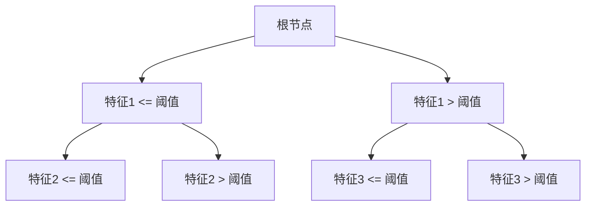
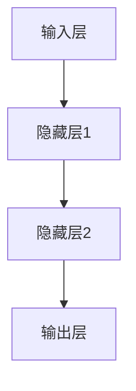
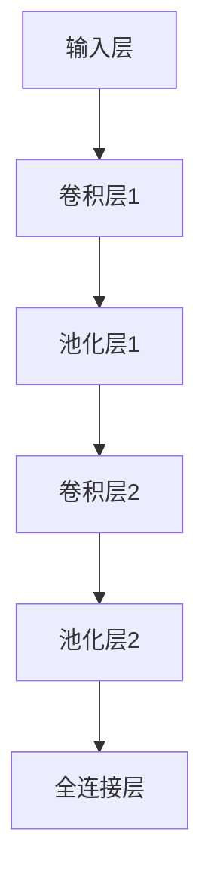

                 

# 《AI编程的新思维与新高度》

## 关键词
AI编程、深度学习、机器学习、算法、神经网络、自然语言处理

## 摘要
本文旨在探讨AI编程的新思维与新高度。我们将从AI编程的历史、基础概念、算法原理、实战案例以及未来趋势等方面，全面深入地分析AI编程的核心技术和挑战。本文的目标是为读者提供一个全面而深刻的AI编程知识体系，引导读者在理解AI编程本质的基础上，迈向更高的技术水平。

## 目录大纲

### 第一部分：AI编程基础

#### 1. 引言：AI编程的背景与未来

##### 1.1 AI编程的历史与现状
##### 1.2 AI编程的关键概念与术语
##### 1.3 AI编程的重要性与挑战

#### 2. AI编程基础

##### 2.1 编程基础
###### 2.1.1 基本数据结构
###### 2.1.2 算法设计与分析
##### 2.1.2 编程语言概述
###### 2.1.2.1 Python编程语言
###### 2.1.2.2 其他常用编程语言

#### 3. AI基础概念

##### 3.1 AI概述
###### 3.1.1 AI的定义与分类
###### 3.1.2 机器学习
###### 3.1.3 深度学习
###### 3.1.4 强化学习
##### 3.2 数据预处理
###### 3.2.1 数据清洗与转换
###### 3.2.2 数据转换
##### 3.3 特征工程
###### 3.3.1 特征提取
###### 3.3.2 特征选择

#### 4. 机器学习算法原理

##### 4.1 监督学习
###### 4.1.1 线性回归
###### 4.1.2 决策树与随机森林
###### 4.1.3 支持向量机
##### 4.2 无监督学习
###### 4.2.1 K-means聚类
###### 4.2.2 主成分分析
###### 4.2.3 聚类层次分析

#### 5. 深度学习算法原理

##### 5.1 深度学习基础
###### 5.1.1 神经网络
###### 5.1.2 卷积神经网络
###### 5.1.3 循环神经网络
##### 5.2 深度学习应用
###### 5.2.1 图像识别
###### 5.2.2 自然语言处理
###### 5.2.3 强化学习

#### 6. AI编程实战

##### 6.1 数据集准备
###### 6.1.1 数据集来源
###### 6.1.2 数据预处理
##### 6.2 项目实战
###### 6.2.1 项目1：图像分类
###### 6.2.2 项目2：文本分类

#### 7. AI编程的未来趋势

##### 7.1 AI编程的发展方向
###### 7.1.1 自动机器学习
###### 7.1.2 可解释性AI
##### 7.2 AI编程的伦理与法律问题
###### 7.2.1 伦理问题
###### 7.2.2 法律问题

### 附录

#### 附录A：常用AI工具与框架

##### A.1 TensorFlow
###### A.1.1 概述
###### A.1.2 安装与配置
##### A.2 PyTorch
###### A.2.1 概述
###### A.2.2 安装与配置

#### 附录B：参考资料

##### B.1 常用AI书籍
###### B.1.1 《深度学习》
##### B.2 在线资源
###### B.2.1 OpenAI
##### B.3 学术期刊
###### B.3.1 Neural Networks

接下来，我们将逐步深入探讨AI编程的各个方面，从基础到应用，从理论到实践，带领读者走进AI编程的广阔世界。

### 第一部分：AI编程基础

#### 1. 引言：AI编程的背景与未来

##### 1.1 AI编程的历史与现状

人工智能（AI）作为计算机科学的一个重要分支，其历史可以追溯到20世纪50年代。早期的AI研究主要集中在符号推理和逻辑推理上，代表性成果包括1956年达特茅斯会议上提出的“人工智能”一词，以及随后出现的专家系统和推理机等。

进入21世纪，随着计算能力的提升和数据量的爆炸性增长，机器学习和深度学习成为了AI研究的热点。机器学习通过算法从数据中学习模式，而深度学习则通过模拟人脑的神经网络结构来实现更复杂的任务。如今，AI编程已经广泛应用于图像识别、自然语言处理、自动驾驶、医疗诊断等多个领域。

##### 1.2 AI编程的关键概念与术语

- **机器学习（Machine Learning）**：一种让计算机通过数据学习模式和规律的技术，分为监督学习、无监督学习和强化学习三种。
- **深度学习（Deep Learning）**：一种基于多层神经网络的学习方法，能够自动提取数据中的高级特征。
- **神经网络（Neural Network）**：一种模拟人脑神经元连接结构的计算模型。
- **特征工程（Feature Engineering）**：在机器学习过程中，通过选择和构造特征来提高模型性能的过程。
- **数据预处理（Data Preprocessing）**：在训练机器学习模型之前，对数据进行清洗、转换和归一化等操作，以提高模型的鲁棒性和性能。

##### 1.3 AI编程的重要性与挑战

AI编程的重要性体现在以下几个方面：

1. **技术进步**：AI编程推动了计算机技术的发展，使得计算机能够执行以前需要人类才能完成的复杂任务。
2. **产业升级**：AI技术在各行各业中的应用，促进了产业智能化和自动化，提高了生产效率和产品质量。
3. **社会变革**：AI编程的应用不仅改变了人们的工作和生活方式，还在医疗、教育、交通等领域带来了深刻的变革。

然而，AI编程也面临着一些挑战：

1. **数据隐私**：在AI编程过程中，数据的安全性和隐私保护成为了重要问题。
2. **算法公平性**：AI算法的决策过程可能存在偏见，需要确保算法的公平性。
3. **技术门槛**：AI编程涉及大量专业知识和技能，入门难度较高。

#### 2. AI编程基础

##### 2.1 编程基础

AI编程作为一种应用型编程，需要掌握一定的编程基础。编程基础主要包括数据结构与算法、编程语言等。

###### 2.1.1 基本数据结构

数据结构是编程中的基础概念，常见的有数组、链表、栈、队列、树、图等。每种数据结构都有其独特的特点和适用场景。例如，数组适合存储固定大小的数据集合，而链表适合动态分配内存。理解数据结构对于优化算法和编写高效代码至关重要。

- **数组**：一种固定大小的数据集合，支持随机访问。
- **链表**：一种动态数据结构，由一系列节点组成，每个节点包含数据和指向下一个节点的指针。
- **栈**：一种后进先出（LIFO）的数据结构，常用操作包括压栈、弹栈和获取栈顶元素。
- **队列**：一种先进先出（FIFO）的数据结构，常用操作包括入队、出队和获取队头元素。
- **树**：一种层次结构，由根节点和子节点组成，常用于表示层次关系和遍历数据。
- **图**：一种复杂的数据结构，由节点和边组成，常用于表示网络和关系。

###### 2.1.2 算法设计与分析

算法是解决问题的一系列步骤，算法设计的关键在于选择合适的数据结构和算法策略。算法分析包括时间复杂度和空间复杂度，用于评估算法的效率和资源消耗。

- **排序算法**：包括冒泡排序、选择排序、插入排序、快速排序等，用于对数据进行排序。
- **查找算法**：包括二分查找、线性查找等，用于在数据中查找特定元素。
- **图算法**：包括最短路径算法、最小生成树算法等，用于解决图相关的问题。

###### 2.1.2.1 基本算法原理

- **冒泡排序（Bubble Sort）**：通过多次遍历待排序列，比较相邻元素并交换，直到整个序列有序。
  ```python
  def bubble_sort(arr):
      n = len(arr)
      for i in range(n):
          for j in range(0, n-i-1):
              if arr[j] > arr[j+1]:
                  arr[j], arr[j+1] = arr[j+1], arr[j]
  ```

- **二分查找（Binary Search）**：在有序数组中查找特定元素，通过不断缩小查找范围，直到找到目标元素或确定其不存在。
  ```python
  def binary_search(arr, target):
      left, right = 0, len(arr) - 1
      while left <= right:
          mid = (left + right) // 2
          if arr[mid] == target:
              return mid
          elif arr[mid] < target:
              left = mid + 1
          else:
              right = mid - 1
      return -1
  ```

###### 2.1.2.2 算法复杂度分析

- **时间复杂度**：表示算法执行时间与输入规模的关系，常用的复杂度有O(1)、O(n)、O(n^2)、O(log n)等。
- **空间复杂度**：表示算法占用内存空间与输入规模的关系。

##### 2.1.2.3 算法设计与分析实践

在AI编程中，算法设计与分析是核心技能之一。以下是一个简单的例子，使用Python实现一个基于贪心算法的背包问题求解。

```python
def knapsack(values, weights, capacity):
    n = len(values)
    items = sorted(zip(values, weights), reverse=True)
    total_value = 0
    total_weight = 0
    for value, weight in items:
        if total_weight + weight <= capacity:
            total_value += value
            total_weight += weight
        else:
            remaining_capacity = capacity - total_weight
            total_value += value * (remaining_capacity / weight)
            break
    return total_value
```

在这个例子中，我们首先对物品按照价值与重量的比值进行降序排序，然后依次选取物品，直到容量满或者不能再添加物品为止。

##### 2.1.3 编程语言概述

AI编程常用的编程语言包括Python、Java、C++等。每种编程语言都有其独特的优势和应用场景。

###### 2.1.3.1 Python编程语言

Python是一种高级编程语言，以其简洁、易读和强大的库支持而受到AI开发者的青睐。Python的几个主要优势包括：

1. **丰富的库支持**：Python拥有大量的科学计算和机器学习库，如NumPy、Pandas、Scikit-learn、TensorFlow和PyTorch等。
2. **易学易用**：Python的语法简洁，适合初学者快速入门。
3. **跨平台**：Python可以在多种操作系统上运行，包括Windows、Linux和MacOS。

以下是一个简单的Python代码示例，用于计算两个数的和。

```python
def add(a, b):
    return a + b

print(add(2, 3))
```

###### 2.1.3.2 其他常用编程语言

- **Java**：Java是一种面向对象编程语言，广泛应用于企业级应用和大数据处理。
- **C++**：C++是一种高性能编程语言，常用于系统编程和游戏开发。

在AI编程中，选择合适的编程语言可以显著提高开发效率和代码质量。Python由于其简洁的语法和强大的库支持，成为了AI编程的主要语言之一。

##### 2.1.4 编程基础总结

编程基础是AI编程的重要组成部分，掌握基本数据结构和算法原理对于解决复杂问题至关重要。通过本文的介绍，读者应该对编程基础有了一个初步的了解，为后续深入学习AI编程打下坚实的基础。

在下一部分，我们将进一步探讨AI的基础概念，包括AI的定义、分类以及数据预处理和特征工程等内容。

### 3. AI基础概念

#### 3.1 AI概述

人工智能（Artificial Intelligence，简称AI）是指通过计算机模拟人类智能行为的技术。AI的研究始于20世纪50年代，当时科学家们希望通过计算机实现类似于人类的思考、学习和决策能力。AI的主要目标是使计算机能够自主完成复杂的任务，如图像识别、自然语言处理、语音识别、机器翻译等。

##### 3.1.1 AI的定义与分类

- **定义**：人工智能是指使计算机具备人类智能的技术，包括感知、学习、推理、决策、规划等能力。
- **分类**：根据实现方式，AI可以分为基于规则的AI、基于模型的AI和基于数据驱动的AI。

1. **基于规则的AI**：通过事先定义的规则进行推理和决策，如专家系统。
2. **基于模型的AI**：通过构建模型来模拟人类智能行为，如神经网络、决策树等。
3. **基于数据驱动的AI**：通过学习大量数据中的模式来获取智能行为，如机器学习和深度学习。

##### 3.1.2 机器学习

机器学习（Machine Learning，简称ML）是一种让计算机通过数据学习模式和规律的技术。机器学习可以分为监督学习、无监督学习和强化学习三种类型。

1. **监督学习**：在有标注的数据集上进行训练，通过学习输入和输出之间的关系，预测未知数据的输出。
2. **无监督学习**：在没有标注的数据集上进行训练，通过发现数据中的隐含结构和规律，如聚类和降维。
3. **强化学习**：通过与环境的交互来学习最优策略，通过奖励和惩罚来调整行为。

##### 3.1.3 深度学习

深度学习（Deep Learning，简称DL）是一种基于多层神经网络的机器学习方法。深度学习通过模拟人脑神经元之间的连接，自动提取数据中的高级特征，实现更复杂的任务。深度学习在图像识别、自然语言处理、语音识别等领域取得了显著成果。

##### 3.1.4 强化学习

强化学习（Reinforcement Learning，简称RL）是一种通过奖励和惩罚来调整行为的学习方法。强化学习通过不断与环境互动，学习最优策略以最大化长期奖励。强化学习在游戏、自动驾驶、机器人控制等领域有广泛应用。

##### 3.1.5 AI的发展历程

- **早期阶段（1950s-1960s）**：以符号推理和逻辑推理为主，代表性成果包括推理机和专家系统。
- **探索阶段（1970s-1980s）**：以知识表示和知识推理为主，开始尝试构建基于规则的专家系统。
- **低谷阶段（1990s）**：由于实际应用效果不佳，AI研究进入低谷。
- **复苏阶段（2000s）**：随着计算能力和数据量的提升，机器学习和深度学习得到快速发展。
- **应用阶段（2010s-至今）**：AI技术广泛应用于各行各业，如自动驾驶、医疗诊断、智能家居等。

##### 3.1.6 AI编程在现实世界中的应用

AI编程在现实世界中有着广泛的应用，以下是几个典型的应用场景：

1. **图像识别**：通过深度学习算法，计算机可以识别和分类图像中的物体，如人脸识别、自动驾驶等。
2. **自然语言处理**：通过自然语言处理技术，计算机可以理解和生成自然语言，如机器翻译、智能客服等。
3. **医疗诊断**：通过分析医学图像和患者数据，计算机可以帮助医生进行疾病诊断，提高诊断准确率。
4. **自动驾驶**：通过感知环境、规划路径和决策控制，自动驾驶汽车可以实现无人驾驶，提高交通安全。
5. **智能制造**：通过机器学习算法，计算机可以对生产过程中的数据进行实时分析，优化生产流程和提高生产效率。

#### 3.2 数据预处理

数据预处理是机器学习中的重要步骤，旨在将原始数据转换为适合模型训练的形式。数据预处理包括数据清洗、数据转换和特征工程等。

##### 3.2.1 数据清洗

数据清洗是指去除数据中的噪声、异常值和重复数据，确保数据质量。数据清洗的主要方法包括：

1. **去除重复数据**：通过比较数据中的重复项，删除重复记录。
2. **处理缺失数据**：根据具体情况进行缺失数据的填补或删除。
3. **去除噪声数据**：去除数据中的异常值和不相关数据，提高数据质量。

以下是一个Python代码示例，用于清洗数据。

```python
import pandas as pd

# 读取数据
data = pd.read_csv('data.csv')

# 去除重复数据
data.drop_duplicates(inplace=True)

# 处理缺失数据
data.fillna(method='mean', inplace=True)

# 去除噪声数据
data = data[(data['column1'] > 0) & (data['column2'] < 100)]
```

##### 3.2.2 数据转换

数据转换是指将数据从一种形式转换为另一种形式，以提高数据的质量和模型的性能。数据转换的方法包括：

1. **编码**：将类别数据转换为数值数据，常用的编码方法有独热编码、标签编码等。
2. **归一化**：将数据缩放到相同的范围，常用的归一化方法有最小-最大缩放、标准化等。
3. **标准化**：将数据缩放到标准正态分布，常用的标准化方法有Z-score标准化、Min-Max标准化等。

以下是一个Python代码示例，用于数据转换。

```python
from sklearn.preprocessing import OneHotEncoder, MinMaxScaler

# 独热编码
encoder = OneHotEncoder()
encoded_data = encoder.fit_transform(data[['category1', 'category2']])

# 最小-最大缩放
scaler = MinMaxScaler()
scaled_data = scaler.fit_transform(data[['column1', 'column2']])

# Z-score标准化
z_scaler = StandardScaler()
z_scaled_data = z_scaler.fit_transform(data[['column1', 'column2']])
```

##### 3.2.3 特征工程

特征工程（Feature Engineering）是指通过选择和构造特征来提高模型性能的过程。特征工程主要包括以下内容：

1. **特征提取**：从原始数据中提取新的特征，以提高模型的泛化能力。常用的特征提取方法有统计特征提取、交互特征提取等。
2. **特征选择**：从众多特征中选择对模型性能有显著贡献的特征，以减少模型复杂度和计算成本。常用的特征选择方法有过滤法、包裹法、嵌入法等。

以下是一个Python代码示例，用于特征工程。

```python
from sklearn.feature_selection import SelectKBest, f_classif

# 统计特征提取
stats_features = pd.DataFrame(data['column1'].describe())

# 交互特征提取
interaction_features = pd.DataFrame(data[['column1', 'column2']].apply(lambda x: x['column1'] * x['column2']))

# 特征选择
selector = SelectKBest(f_classif, k=5)
selected_features = selector.fit_transform(data[['column1', 'column2', 'column3', 'column4']])
```

##### 3.2.4 数据预处理总结

数据预处理是机器学习的重要步骤，通过数据清洗、数据转换和特征工程，可以提高数据质量、减少模型复杂度和提高模型性能。掌握数据预处理的方法和技巧对于成功进行机器学习项目至关重要。

#### 3.3 特征工程

特征工程是机器学习中的重要环节，通过对特征进行选择、构造和转换，可以提高模型的性能和泛化能力。在本节中，我们将详细讨论特征提取和特征选择的方法。

##### 3.3.1 特征提取

特征提取是指从原始数据中提取新的特征，以增强模型对数据的描述能力。特征提取的方法可以分为统计特征提取和交互特征提取。

###### 3.3.1.1 统计特征提取

统计特征提取是基于数据统计方法的特征提取，通过计算数据的基本统计量来构造特征。常用的统计特征提取方法包括均值、方差、最大值、最小值、标准差等。

- **均值（Mean）**：数据集的平均值，表示数据的中心趋势。
  ```python
  mean = np.mean(data['column'])
  ```

- **方差（Variance）**：数据集的离散程度，表示数据的波动性。
  ```python
  variance = np.var(data['column'])
  ```

- **最大值（Max）**：数据集的最大值，表示数据的上限。
  ```python
  max_value = np.max(data['column'])
  ```

- **最小值（Min）**：数据集的最小值，表示数据的下限。
  ```python
  min_value = np.min(data['column'])
  ```

- **标准差（Standard Deviation）**：方差的平方根，表示数据的离散程度。
  ```python
  std_dev = np.std(data['column'])
  ```

以下是一个Python代码示例，用于计算数据的统计特征。

```python
import numpy as np

data = np.array([1, 2, 3, 4, 5])
mean = np.mean(data)
variance = np.var(data)
max_value = np.max(data)
min_value = np.min(data)
std_dev = np.std(data)

print(f"Mean: {mean}")
print(f"Variance: {variance}")
print(f"Max: {max_value}")
print(f"Min: {min_value}")
print(f"Standard Deviation: {std_dev}")
```

###### 3.3.1.2 交互特征提取

交互特征提取是指通过计算数据之间的交互关系来构造特征。交互特征可以帮助模型捕捉数据中的复杂关系和模式，提高模型的预测能力。

- **乘积特征（Product Feature）**：计算两个或多个特征的乘积。
  ```python
  data['product'] = data['column1'] * data['column2']
  ```

- **加和特征（Sum Feature）**：计算两个或多个特征的加和。
  ```python
  data['sum'] = data['column1'] + data['column2']
  ```

- **差分特征（Difference Feature）**：计算两个特征的差值。
  ```python
  data['difference'] = data['column1'] - data['column2']
  ```

以下是一个Python代码示例，用于计算数据的交互特征。

```python
data = pd.DataFrame({'column1': [1, 2, 3], 'column2': [4, 5, 6]})
data['product'] = data['column1'] * data['column2']
data['sum'] = data['column1'] + data['column2']
data['difference'] = data['column1'] - data['column2']

print(data)
```

##### 3.3.2 特征选择

特征选择是指从众多特征中选择对模型性能有显著贡献的特征，以减少模型复杂度和计算成本。特征选择的方法可以分为过滤法、包裹法和嵌入法。

###### 3.3.2.1 过滤法（Filter Method）

过滤法是通过评估特征的重要性来选择特征，常用的评估指标包括信息增益、卡方检验等。过滤法的主要步骤包括：

1. **计算特征重要性**：使用统计方法或模型评估每个特征的重要性。
2. **选择特征**：根据特征重要性阈值选择重要特征。

以下是一个Python代码示例，使用信息增益进行特征选择。

```python
from sklearn.feature_selection import SelectKBest, chi2

data = pd.DataFrame({'column1': [1, 2, 3, 4, 5], 'column2': [4, 5, 6, 7, 8], 'label': [0, 0, 1, 1, 1]})
X = data[['column1', 'column2']]
y = data['label']

selector = SelectKBest(chi2, k=1)
selected_features = selector.fit_transform(X, y)

print(selected_features)
```

###### 3.3.2.2 包裹法（Wrapper Method）

包裹法是通过训练和评估不同特征子集的模型性能来选择特征，常用的方法包括向前选择、向后选择和双向选择。包裹法的主要步骤包括：

1. **特征选择**：选择一个初始特征子集。
2. **模型训练**：使用选定的特征子集训练模型。
3. **模型评估**：评估模型的性能。
4. **特征调整**：根据模型性能调整特征子集。

以下是一个Python代码示例，使用向前选择进行特征选择。

```python
from sklearn.model_selection import train_test_split
from sklearn.feature_selection import SelectFromModel
from sklearn.ensemble import RandomForestClassifier

data = pd.DataFrame({'column1': [1, 2, 3, 4, 5], 'column2': [4, 5, 6, 7, 8], 'label': [0, 0, 1, 1, 1]})
X = data[['column1', 'column2']]
y = data['label']

X_train, X_test, y_train, y_test = train_test_split(X, y, test_size=0.3, random_state=42)

selector = SelectFromModel(RandomForestClassifier(n_estimators=100), threshold='mean')
selected_features = selector.fit_transform(X_train, y_train)

print(selected_features)
```

###### 3.3.2.3 嵌入法（Embedded Method）

嵌入法是在模型训练过程中同时进行特征选择，常用的方法包括Lasso回归、树模型等。嵌入法的主要步骤包括：

1. **模型训练**：使用全部特征训练模型。
2. **特征重要性评估**：根据模型评估每个特征的重要性。
3. **特征调整**：根据特征重要性调整特征子集。

以下是一个Python代码示例，使用Lasso回归进行特征选择。

```python
from sklearn.linear_model import LassoCV
from sklearn.datasets import load_iris

data = load_iris()
X = data.data
y = data.target

lasso = LassoCV(alpha=0.1, cv=5)
selected_features = lasso.fit_transform(X, y)

print(selected_features)
```

##### 3.3.3 特征工程总结

特征工程是机器学习中的重要环节，通过特征提取和特征选择，可以提高模型的性能和泛化能力。掌握特征工程的方法和技巧对于成功进行机器学习项目至关重要。

### 4. 机器学习算法原理

机器学习（Machine Learning，简称ML）是一种通过数据训练模型，使计算机具备自主学习和决策能力的技术。机器学习算法可以分为监督学习、无监督学习和强化学习三种类型。本节将重点介绍监督学习算法中的线性回归、决策树与随机森林以及支持向量机等算法的原理。

#### 4.1 监督学习

监督学习是一种有监督的学习方法，通过已知输入和输出数据，训练模型以预测未知数据的输出。监督学习算法可以分为线性模型和非线性模型。线性模型包括线性回归、逻辑回归等，非线性模型包括决策树、支持向量机、神经网络等。

##### 4.1.1 线性回归

线性回归（Linear Regression）是一种最简单的监督学习算法，用于预测连续值输出。线性回归模型假设输出变量 \( Y \) 与输入变量 \( X \) 之间存在线性关系，可以用以下公式表示：

\[ Y = \beta_0 + \beta_1X + \epsilon \]

其中，\( \beta_0 \) 是截距，\( \beta_1 \) 是斜率，\( \epsilon \) 是误差项。

###### 4.1.1.1 线性回归原理

线性回归模型通过最小化误差平方和来训练模型。给定训练数据集 \( D = \{ (x_1, y_1), (x_2, y_2), ..., (x_n, y_n) \} \)，线性回归的目标是最小化损失函数：

\[ J(\theta) = \frac{1}{2m} \sum_{i=1}^{m} (h_\theta(x_i) - y_i)^2 \]

其中，\( m \) 是训练数据集的大小，\( h_\theta(x) = \theta_0 + \theta_1x \) 是线性回归模型的预测函数。

###### 4.1.1.2 线性回归算法实现

线性回归算法的实现通常使用梯度下降（Gradient Descent）方法来更新模型参数。梯度下降的迭代公式如下：

\[ \theta_j = \theta_j - \alpha \frac{\partial J(\theta)}{\partial \theta_j} \]

其中，\( \alpha \) 是学习率，\( j \) 是第 \( j \) 个参数。

以下是一个Python代码示例，使用梯度下降实现线性回归。

```python
import numpy as np

# 梯度下降函数
def gradient_descent(X, y, theta, alpha, iterations):
    m = len(y)
    for _ in range(iterations):
        predictions = np.dot(X, theta)
        errors = predictions - y
        gradient = 2/m * np.dot(X.T, errors)
        theta -= alpha * gradient
    return theta

# 数据集
X = np.array([[1, 2], [2, 3], [3, 4], [4, 5]])
y = np.array([2, 3, 4, 5])

# 初始参数
theta = np.array([0, 0])

# 梯度下降参数
alpha = 0.01
iterations = 1000

# 训练模型
theta = gradient_descent(X, y, theta, alpha, iterations)

print(theta)
```

##### 4.1.2 决策树与随机森林

决策树（Decision Tree）是一种基于树形结构进行决策的监督学习算法。决策树通过一系列测试来划分数据集，每个测试对应树中的节点，每个节点的结果是一个标签或进一步的测试。决策树的预测函数可以用条件概率表示：

\[ P(Y = y|X = x) = \prod_{i=1}^{n} P(Y = y_i|X = x_i) \]

随机森林（Random Forest）是一种基于决策树的集成学习方法。随机森林通过构建多棵决策树，并对每棵树的预测结果进行投票来获得最终预测。随机森林的性能通常优于单个决策树，因为它能够减少过拟合和增强模型的泛化能力。

###### 4.1.2.1 决策树原理

决策树通过递归划分数据集来构建树结构。在每次划分时，决策树选择最优的特征和阈值，使得划分后的数据集在特定目标上的纯度最高。纯度的度量通常使用基尼不纯度（Gini Impurity）或信息增益（Information Gain）。

以下是一个决策树的Mermaid流程图：



###### 4.1.2.2 随机森林算法实现

随机森林的实现包括以下步骤：

1. **特征选择**：从所有特征中随机选择一个特征。
2. **阈值选择**：从特征的所有可能阈值中随机选择一个阈值。
3. **递归构建树**：使用最优特征和阈值划分数据集，递归构建决策树。
4. **集成预测**：对每棵树的预测结果进行投票，获得最终预测结果。

以下是一个Python代码示例，使用随机森林进行分类。

```python
from sklearn.ensemble import RandomForestClassifier
from sklearn.datasets import load_iris
from sklearn.model_selection import train_test_split

# 数据集
data = load_iris()
X = data.data
y = data.target

# 划分训练集和测试集
X_train, X_test, y_train, y_test = train_test_split(X, y, test_size=0.3, random_state=42)

# 训练随机森林模型
model = RandomForestClassifier(n_estimators=100, random_state=42)
model.fit(X_train, y_train)

# 预测测试集
predictions = model.predict(X_test)

# 评估模型性能
accuracy = model.score(X_test, y_test)
print(f"Accuracy: {accuracy}")
```

##### 4.1.3 支持向量机

支持向量机（Support Vector Machine，简称SVM）是一种基于最大间隔原则进行分类的监督学习算法。SVM的目标是找到一个超平面，使得不同类别的数据点在超平面两侧的距离最大化。

###### 4.1.3.1 支持向量机原理

SVM通过求解以下优化问题来确定最佳超平面：

\[ \min_{\theta, \xi} \frac{1}{2} \sum_{i=1}^{n} (\theta_1^2 + \theta_2^2) + C \sum_{i=1}^{n} \xi_i \]

其中，\( \theta = (\theta_1, \theta_2) \) 是超平面参数，\( \xi_i \) 是松弛变量，\( C \) 是正则化参数。

SVM的损失函数是 hinge 损失函数：

\[ L(\theta, x) = \max(0, 1 - y_i \cdot \theta \cdot x_i) \]

###### 4.1.3.2 支持向量机算法实现

SVM的实现通常使用拉格朗日乘子法求解优化问题。以下是一个Python代码示例，使用SVM进行分类。

```python
from sklearn.svm import SVC
from sklearn.datasets import load_iris
from sklearn.model_selection import train_test_split

# 数据集
data = load_iris()
X = data.data
y = data.target

# 划分训练集和测试集
X_train, X_test, y_train, y_test = train_test_split(X, y, test_size=0.3, random_state=42)

# 训练SVM模型
model = SVC(kernel='linear', C=1.0, random_state=42)
model.fit(X_train, y_train)

# 预测测试集
predictions = model.predict(X_test)

# 评估模型性能
accuracy = model.score(X_test, y_test)
print(f"Accuracy: {accuracy}")
```

##### 4.1.4 监督学习算法总结

监督学习算法是机器学习中的核心算法之一，包括线性回归、决策树、随机森林和支持向量机等。掌握这些算法的原理和实现对于机器学习项目至关重要。通过本文的介绍，读者应该对监督学习算法有了更深入的理解。

### 4.2 无监督学习

无监督学习（Unsupervised Learning）是一种无需标注数据的学习方法，主要通过发现数据中的隐含结构和规律来进行分类、聚类和降维等任务。无监督学习算法在数据挖掘、模式识别和异常检测等领域有着广泛的应用。本节将详细介绍无监督学习中的K-means聚类、主成分分析和聚类层次分析等算法的原理和应用。

#### 4.2.1 K-means聚类

K-means聚类是一种最常用的聚类算法，其核心思想是将数据点分为K个簇，使得每个簇内的数据点距离簇中心最近，簇与簇之间的距离最远。K-means算法的步骤如下：

1. **初始化**：随机选择K个数据点作为初始聚类中心。
2. **分配**：对于每个数据点，计算其与K个聚类中心的距离，并将其分配到距离最近的簇。
3. **更新**：计算每个簇的新聚类中心，即簇内所有数据点的均值。
4. **迭代**：重复步骤2和3，直到聚类中心不再发生变化或满足其他终止条件。

K-means算法的收敛速度较快，但容易陷入局部最优。以下是一个Python代码示例，使用K-means聚类。

```python
from sklearn.cluster import KMeans
from sklearn.datasets import make_blobs

# 创建模拟数据
X, _ = make_blobs(n_samples=100, centers=3, cluster_std=0.6, random_state=0)

# 初始化K-means模型
kmeans = KMeans(n_clusters=3, random_state=0)
kmeans.fit(X)

# 计算聚类中心
centers = kmeans.cluster_centers_

# 分配数据点到簇
labels = kmeans.predict(X)

# 打印聚类结果
print(f"Cluster centers:\n{centers}")
print(f"Cluster labels:\n{labels}")
```

#### 4.2.2 主成分分析

主成分分析（Principal Component Analysis，简称PCA）是一种降维技术，通过将数据投影到新的坐标系中，提取主要成分，以减少数据的维度，同时保留数据的主要特征。PCA的基本原理是基于数据点的协方差矩阵，通过计算协方差矩阵的特征值和特征向量，得到新的正交坐标系。

PCA的步骤如下：

1. **数据标准化**：对数据进行标准化处理，使其具有相同的方差。
2. **计算协方差矩阵**：计算数据的协方差矩阵。
3. **计算特征值和特征向量**：计算协方差矩阵的特征值和特征向量。
4. **选择主成分**：根据特征值的大小选择前k个特征向量作为主成分。
5. **降维**：将数据投影到新的坐标系中，保留前k个主成分。

以下是一个Python代码示例，使用PCA进行降维。

```python
from sklearn.decomposition import PCA
from sklearn.datasets import load_iris

# 加载鸢尾花数据集
data = load_iris()
X = data.data

# 初始化PCA模型
pca = PCA(n_components=2)
pca.fit(X)

# 降维
X_reduced = pca.transform(X)

# 打印降维后的数据
print(f"Reduced data:\n{X_reduced}")
```

#### 4.2.3 聚类层次分析

聚类层次分析（Hierarchical Clustering）是一种基于层次结构进行聚类的算法，通过逐步合并或分裂数据点，构建聚类树。聚类层次分析可以分为凝聚层次分析和分裂层次分析。

- **凝聚层次分析**：从单个数据点开始，逐步合并距离较近的数据点，形成更大的簇，直到所有数据点合并为一个簇。
- **分裂层次分析**：从所有数据点合并为一个簇开始，逐步分裂成多个簇，直到每个数据点为一个簇。

聚类层次分析的基本步骤如下：

1. **初始化**：选择距离度量方式（如欧氏距离）。
2. **计算距离**：计算每对数据点之间的距离。
3. **合并或分裂**：根据距离度量，合并或分裂数据点，形成新的簇。
4. **迭代**：重复步骤3，直到满足终止条件（如簇的数量达到预设值）。

以下是一个Python代码示例，使用凝聚层次分析进行聚类。

```python
from sklearn.cluster import AgglomerativeClustering
from sklearn.datasets import make_blobs

# 创建模拟数据
X, _ = make_blobs(n_samples=100, centers=3, cluster_std=0.6, random_state=0)

# 初始化凝聚层次分析模型
cluster = AgglomerativeClustering(n_clusters=3)
cluster.fit(X)

# 获取聚类结果
labels = cluster.labels_

# 打印聚类结果
print(f"Cluster labels:\n{labels}")
```

##### 4.2.4 无监督学习算法总结

无监督学习算法在数据挖掘和降维方面有着广泛的应用。K-means聚类适用于快速聚类，但容易陷入局部最优；主成分分析是一种有效的降维方法，可以提取数据的主要成分；聚类层次分析可以构建聚类树，用于分析数据点之间的层次关系。掌握这些算法的原理和应用对于数据分析和挖掘具有重要意义。

### 5. 深度学习算法原理

深度学习（Deep Learning，简称DL）是一种基于多层神经网络的学习方法，能够自动提取数据中的高级特征，实现复杂的模式识别和预测任务。深度学习在图像识别、自然语言处理、语音识别等领域取得了显著的成果，成为人工智能领域的重要研究方向。本节将介绍深度学习的基础概念、神经网络结构以及常用的深度学习算法。

#### 5.1 深度学习基础

##### 5.1.1 神经网络

神经网络（Neural Network，简称NN）是一种模拟人脑神经元连接结构的计算模型。神经网络由多个神经元（或节点）组成，每个神经元都与相邻的神经元相连，并通过权重（或连接强度）进行通信。神经网络的核心是激活函数，用于引入非线性变换。

一个简单的神经网络结构包括输入层、隐藏层和输出层。输入层接收外部输入，隐藏层通过加权求和和激活函数进行数据处理，输出层生成最终输出。

以下是一个简单的神经网络Mermaid流程图：



##### 5.1.2 神经网络训练算法

神经网络训练的核心是学习模型参数，以最小化预测误差。常用的训练算法包括梯度下降（Gradient Descent）及其变种，如随机梯度下降（Stochastic Gradient Descent，简称SGD）和小批量梯度下降（Mini-batch Gradient Descent）。

梯度下降算法的基本思想是更新模型参数，使得损失函数的梯度逐渐减小，直到达到最小值。梯度下降的迭代公式如下：

\[ \theta_j = \theta_j - \alpha \cdot \frac{\partial J(\theta)}{\partial \theta_j} \]

其中，\( \theta \) 是模型参数，\( \alpha \) 是学习率，\( J(\theta) \) 是损失函数。

以下是一个Python代码示例，使用梯度下降训练神经网络。

```python
import numpy as np

# 梯度下降函数
def gradient_descent(X, y, theta, alpha, iterations):
    m = len(y)
    for _ in range(iterations):
        predictions = np.dot(X, theta)
        errors = predictions - y
        gradient = 2/m * np.dot(X.T, errors)
        theta -= alpha * gradient
    return theta

# 数据集
X = np.array([[1, 2], [2, 3], [3, 4], [4, 5]])
y = np.array([2, 3, 4, 5])

# 初始参数
theta = np.array([0, 0])

# 梯度下降参数
alpha = 0.01
iterations = 1000

# 训练模型
theta = gradient_descent(X, y, theta, alpha, iterations)

print(theta)
```

#### 5.1.3 卷积神经网络

卷积神经网络（Convolutional Neural Network，简称CNN）是一种专门用于图像识别和处理的深度学习模型。CNN通过卷积层和池化层提取图像中的局部特征，通过全连接层进行分类。

以下是一个CNN的基本结构Mermaid流程图：



CNN的卷积层使用卷积运算提取图像特征，卷积核（或滤波器）在图像上滑动，计算局部特征的加权和。池化层用于减少数据维度和参数数量，常用的池化方法有最大池化和平均池化。

以下是一个Python代码示例，使用CNN进行图像分类。

```python
import tensorflow as tf
from tensorflow.keras import datasets, layers, models

# 加载数据集
(train_images, train_labels), (test_images, test_labels) = datasets.cifar10.load_data()

# 预处理数据
train_images = train_images / 255.0
test_images = test_images / 255.0

# 构建CNN模型
model = models.Sequential()
model.add(layers.Conv2D(32, (3, 3), activation='relu', input_shape=(32, 32, 3)))
model.add(layers.MaxPooling2D((2, 2)))
model.add(layers.Conv2D(64, (3, 3), activation='relu'))
model.add(layers.MaxPooling2D((2, 2)))
model.add(layers.Conv2D(64, (3, 3), activation='relu'))
model.add(layers.Flatten())
model.add(layers.Dense(64, activation='relu'))
model.add(layers.Dense(10))

# 编译模型
model.compile(optimizer='adam',
              loss=tf.keras.losses.SparseCategoricalCrossentropy(from_logits=True),
              metrics=['accuracy'])

# 训练模型
model.fit(train_images, train_labels, epochs=10, validation_data=(test_images, test_labels))

# 评估模型
test_loss, test_acc = model.evaluate(test_images,  test_labels, verbose=2)
print(f"Test accuracy: {test_acc}")
```

##### 5.1.4 循环神经网络

循环神经网络（Recurrent Neural Network，简称RNN）是一种专门用于处理序列数据的深度学习模型。RNN通过在时间步之间传递隐藏状态，使得模型能够处理长序列数据。

以下是一个RNN的基本结构Mermaid流程图：


RNN的隐藏状态使得模型能够利用之前的计算结果，实现序列数据的记忆和预测。然而，传统的RNN存在梯度消失和梯度爆炸问题，限制了其在长序列数据上的应用。

以下是一个Python代码示例，使用RNN进行序列预测。

```python
import tensorflow as tf
from tensorflow.keras.models import Sequential
from tensorflow.keras.layers import SimpleRNN, Dense

# 加载数据集
X, y = generate_sequence_data()  # 使用自定义函数生成序列数据

# 切分训练集和测试集
X_train, X_test, y_train, y_test = train_test_split(X, y, test_size=0.2, random_state=42)

# 构建RNN模型
model = Sequential()
model.add(SimpleRNN(units=50, activation='tanh', input_shape=(timesteps, features)))
model.add(Dense(units=1))

# 编译模型
model.compile(optimizer='adam', loss='mse')

# 训练模型
model.fit(X_train, y_train, epochs=100, batch_size=32, validation_data=(X_test, y_test))

# 评估模型
loss = model.evaluate(X_test, y_test)
print(f"Test loss: {loss}")
```

##### 5.1.5 深度学习基础总结

深度学习通过多层神经网络结构，能够自动提取数据中的高级特征，实现复杂的模式识别和预测任务。掌握深度学习的基础概念、神经网络结构以及训练算法对于深入研究和应用深度学习至关重要。

### 5.2 深度学习应用

深度学习在多个领域取得了显著的成果，包括图像识别、自然语言处理、语音识别等。在本节中，我们将详细介绍深度学习在图像识别、自然语言处理和强化学习等领域的应用。

#### 5.2.1 图像识别

图像识别是深度学习的重要应用之一，通过卷积神经网络（CNN）和卷积层，深度学习模型能够自动提取图像中的高级特征，实现图像分类、物体检测和图像生成等任务。

###### 5.2.1.1 图像识别原理

图像识别的基本原理是通过训练深度学习模型，使其能够识别和分类图像中的物体。通常，图像识别过程包括以下步骤：

1. **数据预处理**：对图像进行缩放、裁剪、增强等处理，使其符合模型的输入要求。
2. **特征提取**：使用卷积神经网络提取图像中的特征，卷积层通过卷积运算提取图像中的局部特征，池化层用于减少数据维度和参数数量。
3. **分类预测**：将提取的特征输入到全连接层，进行分类预测，输出分类结果。

以下是一个Python代码示例，使用卷积神经网络进行图像分类。

```python
import tensorflow as tf
from tensorflow.keras.models import Sequential
from tensorflow.keras.layers import Conv2D, MaxPooling2D, Flatten, Dense

# 加载数据集
(train_images, train_labels), (test_images, test_labels) = tf.keras.datasets.cifar10.load_data()

# 预处理数据
train_images = train_images / 255.0
test_images = test_images / 255.0

# 构建CNN模型
model = Sequential()
model.add(Conv2D(32, (3, 3), activation='relu', input_shape=(32, 32, 3)))
model.add(MaxPooling2D((2, 2)))
model.add(Conv2D(64, (3, 3), activation='relu'))
model.add(MaxPooling2D((2, 2)))
model.add(Conv2D(64, (3, 3), activation='relu'))
model.add(Flatten())
model.add(Dense(64, activation='relu'))
model.add(Dense(10))

# 编译模型
model.compile(optimizer='adam',
              loss=tf.keras.losses.SparseCategoricalCrossentropy(from_logits=True),
              metrics=['accuracy'])

# 训练模型
model.fit(train_images, train_labels, epochs=10, validation_data=(test_images, test_labels))

# 评估模型
test_loss, test_acc = model.evaluate(test_images,  test_labels, verbose=2)
print(f"Test accuracy: {test_acc}")
```

###### 5.2.1.2 图像识别应用案例

图像识别在医疗诊断、自动驾驶、安防监控等领域有广泛的应用。以下是一个医疗诊断的应用案例。

**案例：基于深度学习的癌症检测**

**目标**：使用深度学习模型自动检测癌细胞。

**数据集**：使用来自癌症研究机构的细胞图像数据集。

**模型**：使用卷积神经网络（CNN）进行图像分类。

**步骤**：

1. **数据预处理**：对细胞图像进行缩放和归一化，使其符合模型的输入要求。
2. **特征提取**：使用CNN提取图像中的特征，包括细胞核形状、大小和纹理等。
3. **分类预测**：将提取的特征输入到全连接层，进行分类预测，判断细胞是否为癌细胞。
4. **模型训练**：使用标记数据集训练模型，调整模型参数，提高分类准确率。

通过上述步骤，深度学习模型可以自动检测癌细胞，辅助医生进行诊断，提高诊断准确率和效率。

#### 5.2.2 自然语言处理

自然语言处理（Natural Language Processing，简称NLP）是深度学习的重要应用之一，通过深度学习模型，计算机能够理解和生成自然语言。NLP在机器翻译、文本分类、情感分析等领域有广泛的应用。

###### 5.2.2.1 自然语言处理原理

自然语言处理的基本原理是通过训练深度学习模型，使其能够理解和生成自然语言。通常，自然语言处理过程包括以下步骤：

1. **数据预处理**：对文本进行分词、标记和清洗等处理，使其符合模型的输入要求。
2. **特征提取**：使用循环神经网络（RNN）或 Transformer 模型提取文本中的特征，包括单词的词向量、句子的语义表示等。
3. **分类预测**：将提取的特征输入到全连接层，进行分类预测，实现文本分类、情感分析等任务。

以下是一个Python代码示例，使用Transformer模型进行文本分类。

```python
import tensorflow as tf
from tensorflow.keras.models import Model
from tensorflow.keras.layers import Embedding, LSTM, Dense, Input

# 加载数据集
train_texts, train_labels = load_nlp_data()  # 使用自定义函数加载数据

# 构建Transformer模型
input_layer = Input(shape=(max_sequence_length,))
embedding_layer = Embedding(vocabulary_size, embedding_dim)(input_layer)
lstm_layer = LSTM(units=128, return_sequences=True)(embedding_layer)
output_layer = Dense(units=1, activation='sigmoid')(lstm_layer)

model = Model(inputs=input_layer, outputs=output_layer)
model.compile(optimizer='adam', loss='binary_crossentropy', metrics=['accuracy'])

# 训练模型
model.fit(train_texts, train_labels, epochs=10, batch_size=32)

# 评估模型
test_texts, test_labels = load_nlp_data()  # 使用自定义函数加载测试数据
test_loss, test_acc = model.evaluate(test_texts, test_labels)
print(f"Test accuracy: {test_acc}")
```

###### 5.2.2.2 自然语言处理应用案例

自然语言处理在智能客服、智能助手、文本生成等领域有广泛的应用。以下是一个智能客服的应用案例。

**案例：基于深度学习的智能客服系统**

**目标**：使用深度学习模型实现自动回答用户问题。

**数据集**：使用来自客服平台的对话数据集。

**模型**：使用Transformer模型进行文本生成。

**步骤**：

1. **数据预处理**：对对话文本进行分词、标记和清洗等处理，将其转换为模型可接受的输入格式。
2. **特征提取**：使用Transformer模型提取文本中的特征，实现文本的序列生成。
3. **模型训练**：使用标记数据集训练模型，调整模型参数，提高回答的准确率和效率。
4. **模型部署**：将训练好的模型部署到实际场景中，实现自动回答用户问题。

通过上述步骤，智能客服系统可以自动回答用户问题，提高客服效率和用户体验。

#### 5.2.3 强化学习

强化学习（Reinforcement Learning，简称RL）是一种通过奖励和惩罚来调整行为的学习方法，在游戏、自动驾驶、机器人控制等领域有广泛的应用。强化学习的基本原理是，通过与环境交互，学习最优策略以最大化长期奖励。

###### 5.2.3.1 强化学习原理

强化学习的基本概念包括：

1. **状态（State）**：环境的一个描述，用于指导决策。
2. **动作（Action）**：在特定状态下可以执行的动作。
3. **奖励（Reward）**：动作的结果，用于指导学习过程。
4. **策略（Policy）**：从状态选择动作的策略。

强化学习的过程可以概括为：

1. **初始化**：初始化状态、动作和策略。
2. **执行动作**：在当前状态下执行动作，并获取奖励。
3. **更新策略**：根据奖励调整策略，以最大化长期奖励。
4. **重复过程**：不断重复执行动作和更新策略，直到达到目标状态。

以下是一个Python代码示例，使用Q-learning算法进行强化学习。

```python
import numpy as np

# 初始化Q值表
Q = np.zeros((state_space_size, action_space_size))

# Q-learning参数
alpha = 0.1  # 学习率
gamma = 0.9  # 折扣因子
epsilon = 0.1  # 探索率

# 强化学习过程
num_episodes = 1000
for episode in range(num_episodes):
    state = env.reset()
    done = False
    total_reward = 0
    while not done:
        if np.random.rand() < epsilon:
            action = env.action_space.sample()  # 探索
        else:
            action = np.argmax(Q[state])  # 利用
        next_state, reward, done, _ = env.step(action)
        Q[state, action] = Q[state, action] + alpha * (reward + gamma * np.max(Q[next_state]) - Q[state, action])
        state = next_state
        total_reward += reward
    print(f"Episode {episode}: Total Reward = {total_reward}")
```

###### 5.2.3.2 强化学习应用案例

强化学习在游戏、自动驾驶、机器人控制等领域有广泛的应用。以下是一个自动驾驶的应用案例。

**案例：基于深度强化学习的自动驾驶**

**目标**：使用深度强化学习实现自动驾驶。

**数据集**：使用自动驾驶模拟器生成的虚拟数据集。

**模型**：使用深度Q网络（DQN）进行强化学习。

**步骤**：

1. **数据预处理**：对模拟器生成的虚拟数据集进行预处理，提取有用的特征。
2. **特征提取**：使用卷积神经网络提取车辆和道路的局部特征。
3. **Q-learning算法**：使用DQN算法训练模型，实现自动驾驶。
4. **模型训练**：在虚拟环境中训练模型，调整模型参数，提高自动驾驶的准确率和稳定性。
5. **模型部署**：将训练好的模型部署到真实环境中，实现自动驾驶。

通过上述步骤，自动驾驶系统能够在真实环境中自动行驶，提高行驶效率和安全性。

##### 5.2.4 深度学习应用总结

深度学习在图像识别、自然语言处理和强化学习等领域有广泛的应用。掌握深度学习的原理和应用，可以为我们带来许多创新和突破。在未来的发展中，深度学习将继续推动人工智能的发展，为各行各业带来巨大的变革。

### 6. AI编程实战

在实际应用中，AI编程不仅需要掌握理论知识，还需要具备实战能力。在本节中，我们将通过两个实际项目案例——图像分类和文本分类，来展示如何使用AI编程技术解决实际问题。

#### 6.1 数据集准备

在进行AI编程实战之前，首先需要准备合适的数据集。数据集的质量直接影响模型的表现，因此数据集的准备非常重要。

##### 6.1.1 数据集来源

数据集可以从公开的数据集网站获取，如Kaggle、UCI机器学习库、ImageNet、Common Crawl等。以下是一些常用的数据集：

- **图像分类数据集**：例如MNIST手写数字数据集、CIFAR-10/100图像分类数据集、ImageNet。
- **文本分类数据集**：例如20 Newsgroups、IMDb电影评论数据集、AG News。

##### 6.1.2 数据预处理

数据预处理包括数据清洗、数据转换和归一化等步骤，以确保数据质量，提高模型性能。

1. **数据清洗**：去除数据中的噪声、异常值和重复数据。
   ```python
   df = df.drop_duplicates()
   df = df.dropna()
   ```

2. **数据转换**：将图像和文本数据转换为适合模型训练的格式。
   - **图像数据**：通常使用像素值表示，如灰度图使用0-255之间的整数表示，彩色图使用三个通道（红、绿、蓝）的浮点数表示。
   - **文本数据**：可以使用词袋模型、词嵌入等方法进行转换。

3. **归一化**：将数据缩放到相同的范围，以提高模型的鲁棒性和性能。
   ```python
   df = (df - df.mean()) / df.std()
   ```

以下是一个Python代码示例，用于预处理图像数据集。

```python
import numpy as np
import pandas as pd
from sklearn.model_selection import train_test_split

# 读取数据
data = pd.read_csv('data.csv')

# 数据清洗
data.drop_duplicates(inplace=True)
data.fillna(method='mean', inplace=True)

# 数据转换
data['image'] = data['image'].apply(lambda x: np.array(x.split(' ')).astype(np.float32))

# 归一化
data = (data - data.mean()) / data.std()

# 划分训练集和测试集
X_train, X_test, y_train, y_test = train_test_split(data['image'], data['label'], test_size=0.2, random_state=42)
```

#### 6.2 项目实战

##### 6.2.1 项目1：图像分类

**目标**：使用深度学习模型对图像进行分类。

**模型选择**：卷积神经网络（CNN）。

**步骤**：

1. **数据预处理**：根据6.1节中的方法进行数据预处理。
2. **模型构建**：使用TensorFlow和Keras构建CNN模型。
3. **模型训练**：使用训练数据进行模型训练。
4. **模型评估**：使用测试数据进行模型评估。

以下是一个Python代码示例，使用CNN进行图像分类。

```python
import tensorflow as tf
from tensorflow.keras.models import Sequential
from tensorflow.keras.layers import Conv2D, MaxPooling2D, Flatten, Dense

# 构建CNN模型
model = Sequential()
model.add(Conv2D(32, (3, 3), activation='relu', input_shape=(28, 28, 1)))
model.add(MaxPooling2D((2, 2)))
model.add(Conv2D(64, (3, 3), activation='relu'))
model.add(MaxPooling2D((2, 2)))
model.add(Flatten())
model.add(Dense(128, activation='relu'))
model.add(Dense(10, activation='softmax'))

# 编译模型
model.compile(optimizer='adam', loss='categorical_crossentropy', metrics=['accuracy'])

# 训练模型
model.fit(X_train, y_train, epochs=10, validation_data=(X_test, y_test))

# 评估模型
test_loss, test_acc = model.evaluate(X_test, y_test)
print(f"Test accuracy: {test_acc}")
```

##### 6.2.2 项目2：文本分类

**目标**：使用深度学习模型对文本进行分类。

**模型选择**：循环神经网络（RNN）或Transformer模型。

**步骤**：

1. **数据预处理**：根据6.1节中的方法进行数据预处理。
2. **模型构建**：使用TensorFlow和Keras构建RNN或Transformer模型。
3. **模型训练**：使用训练数据进行模型训练。
4. **模型评估**：使用测试数据进行模型评估。

以下是一个Python代码示例，使用Transformer模型进行文本分类。

```python
import tensorflow as tf
from tensorflow.keras.models import Model
from tensorflow.keras.layers import Embedding, LSTM, Dense, Input

# 构建Transformer模型
input_layer = Input(shape=(max_sequence_length,))
embedding_layer = Embedding(vocabulary_size, embedding_dim)(input_layer)
lstm_layer = LSTM(units=128, return_sequences=True)(embedding_layer)
output_layer = Dense(units=1, activation='sigmoid')(lstm_layer)

model = Model(inputs=input_layer, outputs=output_layer)
model.compile(optimizer='adam', loss='binary_crossentropy', metrics=['accuracy'])

# 训练模型
model.fit(X_train, y_train, epochs=10, batch_size=32, validation_data=(X_test, y_test))

# 评估模型
test_loss, test_acc = model.evaluate(X_test, y_test)
print(f"Test accuracy: {test_acc}")
```

#### 6.3 项目实战总结

通过图像分类和文本分类两个项目，我们可以看到AI编程在实际应用中的重要性。掌握数据预处理、模型构建、模型训练和模型评估等实战技巧，对于成功应用AI技术解决实际问题至关重要。

### 7. AI编程的未来趋势

随着AI技术的不断发展和应用，AI编程也面临着新的机遇和挑战。未来，AI编程将朝着以下几个趋势发展：

#### 7.1 AI编程的发展方向

1. **自动机器学习（AutoML）**：自动机器学习旨在自动化机器学习流程，从数据预处理、特征选择到模型训练和调优，以降低模型开发的门槛，提高开发效率。自动机器学习工具如Google的AutoML、H2O.ai的H2O等正在逐渐成熟，为AI编程带来了新的可能性。
   
2. **联邦学习（Federated Learning）**：联邦学习是一种分布式机器学习方法，通过在多个设备上训练模型，然后将更新汇总到中央服务器，以实现隐私保护和数据共享。联邦学习在医疗、金融和工业等领域具有广泛的应用前景。

3. **可解释性AI（Explainable AI，简称XAI）**：可解释性AI旨在提高AI模型的透明度和可解释性，使其决策过程更容易被人类理解和接受。通过可解释性AI，我们可以更好地理解模型的决策过程，提高模型的可靠性和信任度。

4. **增强学习（Reinforcement Learning，简称RL）**：增强学习通过与环境交互，学习最优策略，实现智能决策。未来，增强学习将更多地应用于复杂系统的优化和控制，如自动驾驶、智能机器人等。

#### 7.2 AI编程的伦理与法律问题

1. **伦理问题**：随着AI技术的广泛应用，伦理问题日益突出。例如，AI系统的决策过程可能存在偏见，影响社会公平；AI在医疗和金融等领域的应用可能侵犯个人隐私。为此，需要建立AI伦理原则，确保AI技术的发展符合社会价值观。

2. **法律问题**：AI技术的快速发展也带来了新的法律挑战。例如，自动驾驶汽车的交通事故责任如何划分？AI生成的作品是否享有版权？这些法律问题需要通过立法和司法实践来解决。

3. **法律法规**：为了规范AI技术的发展和应用，各国纷纷出台相关法律法规。例如，欧盟的《通用数据保护条例》（GDPR）、美国的《算法透明度与责任法案》（Algorithmic Accountability Act）等。这些法律法规旨在确保AI技术的合法、公正和透明。

#### 7.3 AI编程的未来展望

未来，AI编程将在以下几个方面取得重要突破：

1. **技术创新**：随着硬件性能的提升和算法的优化，AI编程将实现更高效的计算和更复杂的任务。
2. **跨领域应用**：AI编程将渗透到更多领域，如教育、医疗、金融、制造业等，推动产业智能化和自动化。
3. **社会影响**：AI编程将在提高生产效率、改善生活质量、推动社会进步等方面发挥重要作用，同时也需要关注伦理和法律问题，确保AI技术的可持续发展。

总之，AI编程的未来充满机遇和挑战。通过不断探索和创新，AI编程将继续推动人工智能技术的发展，为人类创造更加美好的未来。

### 附录

#### 附录A：常用AI工具与框架

##### A.1 TensorFlow

TensorFlow是Google开发的开源机器学习库，用于构建和训练深度学习模型。TensorFlow支持多种编程语言，如Python、C++和Java。

###### A.1.1 概述

TensorFlow的主要特点包括：

1. **动态图计算**：TensorFlow使用动态计算图，允许在运行时构建和修改计算图。
2. **丰富的API**：TensorFlow提供丰富的API，包括TensorFlow Core、TensorFlow Lite和TensorFlow Extended用于构建和部署深度学习模型。
3. **高效计算**：TensorFlow支持GPU和TPU加速计算，提高模型训练和推理的效率。

###### A.1.2 安装与配置

安装TensorFlow的步骤如下：

1. **安装Python环境**：确保安装了Python 3.6或更高版本。
2. **安装TensorFlow**：在命令行中运行以下命令：
   ```bash
   pip install tensorflow
   ```

##### A.2 PyTorch

PyTorch是Facebook开发的开源机器学习库，以其简洁的API和动态计算图而受到开发者青睐。

###### A.2.1 概述

PyTorch的主要特点包括：

1. **动态计算图**：PyTorch使用动态计算图，允许在运行时构建和修改计算图。
2. **简洁的API**：PyTorch的API简洁易用，适合快速原型设计和实验。
3. **GPU支持**：PyTorch支持GPU加速计算，提高模型训练和推理的效率。

###### A.2.2 安装与配置

安装PyTorch的步骤如下：

1. **安装Python环境**：确保安装了Python 3.6或更高版本。
2. **安装PyTorch**：在命令行中运行以下命令：
   ```bash
   pip install torch torchvision torchaudio
   ```

#### 附录B：参考资料

##### B.1 常用AI书籍

《深度学习》（Goodfellow, Bengio, Courville）

- **内容简介**：这本书是深度学习领域的经典教材，全面介绍了深度学习的基础理论、算法实现和应用案例。
- **读者评价**：这本书内容丰富，讲解深入浅出，适合初学者和高级开发者阅读。

##### B.2 在线资源

OpenAI

- **简介**：OpenAI是一个致力于推动人工智能研究的非营利组织，提供丰富的AI研究资源和开源模型。
- **资源获取方式**：访问OpenAI的官方网站（https://openai.com/），下载相关资源和代码。

##### B.3 学术期刊

Neural Networks

- **期刊简介**：Neural Networks是一本国际知名的学术期刊，专注于神经网络和相关领域的研究。
- **论文检索方法**：通过学术搜索引擎（如Google Scholar）或期刊官方网站（https://www.journals.elsevier.com/neural-networks/）检索论文。

