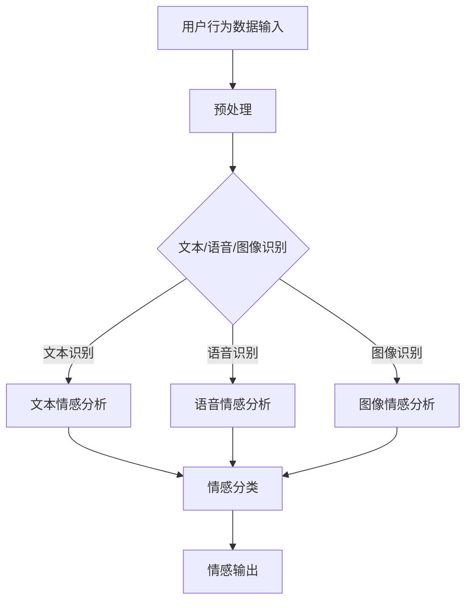

                 

# 《数字化情感表达：元宇宙中的人际交往》

> **关键词**：数字化情感表达、元宇宙、人际交往、情感识别、情感合成、虚拟现实

> **摘要**：本文深入探讨了数字化情感表达在元宇宙中的人际交往中的重要性。通过介绍数字化情感表达的基础技术，分析其在元宇宙中的应用，以及探讨元宇宙中的人际交往实践和未来发展趋势，本文旨在为元宇宙中的人际交往提供技术支持和理论依据。

### 《数字化情感表达：元宇宙中的人际交往》目录大纲

#### 第一部分：数字化情感表达基础

##### 第1章：数字化情感表达概述
- 1.1 数字化情感表达的定义与重要性
- 1.2 数字化情感表达的发展历程
- 1.3 数字化情感表达的主要应用领域

##### 第2章：数字化情感识别与合成技术
- 2.1 情感识别技术原理
  - **2.1.1 情感识别的技术框架（Mermaid流程图）**
  - **2.1.2 情感识别算法伪代码**
- 2.2 情感合成技术原理
  - **2.2.1 情感合成的数学模型（latex公式）**
  - **2.2.2 情感合成算法伪代码**

##### 第3章：数字化情感表达与元宇宙
- 3.1 元宇宙的基本概念与架构
- 3.2 元宇宙中的人际交往模式
- 3.3 数字化情感表达在元宇宙中的应用场景

#### 第二部分：元宇宙中的人际交往实践

##### 第4章：元宇宙中的人际交往心理学
- 4.1 元宇宙中的人际交往特点
- 4.2 元宇宙中的人际关系管理
- 4.3 元宇宙中的情感沟通策略

##### 第5章：元宇宙中的数字化情感表达工具
- 5.1 主流数字化情感表达工具介绍
- 5.2 数字化情感表达工具的实际应用
- 5.3 数字化情感表达工具的未来发展趋势

##### 第6章：元宇宙中的人际交往案例研究
- 6.1 案例一：虚拟现实社交平台
- 6.2 案例二：数字化情感辅助治疗
- 6.3 案例三：元宇宙中的虚拟经济活动

##### 第7章：元宇宙中的人际交往未来展望
- 7.1 元宇宙中人际交往的发展趋势
- 7.2 数字化情感表达的技术挑战与机遇
- 7.3 元宇宙中人际交往的未来影响

#### 第三部分：数字化情感表达与元宇宙的开发实践

##### 第8章：元宇宙开发环境搭建
- 8.1 开发环境准备
- 8.2 虚拟现实平台搭建
- 8.3 数字化情感表达工具集成

##### 第9章：数字化情感表达项目实战
- 9.1 项目需求分析
- 9.2 项目设计思路
- 9.3 项目实现步骤与代码解读
- 9.4 项目性能分析与优化

##### 第10章：数字化情感表达与元宇宙的应用案例分析
- 10.1 案例一：虚拟导游系统
- 10.2 案例二：虚拟心理咨询服务
- 10.3 案例三：虚拟婚礼与庆典服务

##### 第11章：数字化情感表达与元宇宙的未来发展
- 11.1 未来发展趋势
- 11.2 技术创新方向
- 11.3 对社会生活的影响

### 附录

#### 附录A：数字化情感表达与元宇宙开发工具与资源
- A.1 主流开发工具与平台介绍
- A.2 开发工具使用指南
- A.3 开发资源推荐

#### 附录B：数字化情感表达与元宇宙常用算法与模型
- B.1 常用算法介绍
- B.2 常用模型介绍
- B.3 模型应用示例

#### 附录C：数字化情感表达与元宇宙相关书籍与论文推荐
- C.1 推荐书籍
- C.2 推荐论文
- C.3 学术资源库介绍

#### 第一部分：数字化情感表达基础

##### 第1章：数字化情感表达概述

**1.1 数字化情感表达的定义与重要性**

数字化情感表达是指利用计算机技术、人工智能技术等数字化手段，对人类情感进行识别、理解和模拟，从而实现情感信息的传递和交流。在元宇宙中，数字化情感表达是人际交往的重要手段，它不仅能够增强虚拟现实的沉浸感，还能够提升人际沟通的效果。

数字化情感表达的重要性体现在以下几个方面：

1. **提升用户体验**：通过数字化情感表达，元宇宙中的虚拟角色能够更好地理解和回应用户的需求，从而提升用户的体验感。
2. **增强交互性**：数字化情感表达使得虚拟角色能够模拟真实的人际交往行为，增强用户之间的互动性和信任感。
3. **促进社会连接**：数字化情感表达能够跨越物理距离，促进全球范围内的人际交流，增强社会的连接性。
4. **支持心理健康**：在元宇宙中，用户可以通过数字化情感表达进行心理健康治疗，缓解焦虑、抑郁等心理问题。

**1.2 数字化情感表达的发展历程**

数字化情感表达的发展历程可以分为以下几个阶段：

1. **情感识别阶段**：最早的情感识别技术主要基于规则和机器学习算法，通过对文本、语音、图像等数据进行处理，识别出用户的基本情感状态。
2. **情感合成阶段**：随着计算机图形学和音效技术的进步，情感合成技术逐渐成熟。通过音频合成、面部表情合成等技术，虚拟角色能够模拟出丰富的情感表达。
3. **情感理解阶段**：近年来，自然语言处理、认知计算等技术的发展，使得虚拟角色能够更深入地理解用户的情感状态，并做出适当的反应。
4. **情感交互阶段**：当前，数字化情感表达正朝着更加智能化、人性化的方向发展，虚拟角色能够通过情感交互，与用户建立更加深刻的联系。

**1.3 数字化情感表达的主要应用领域**

数字化情感表达在多个领域具有广泛的应用前景：

1. **虚拟现实与游戏**：虚拟现实技术和游戏的结合，使得数字化情感表达在娱乐领域得到广泛应用。通过情感识别和合成技术，虚拟角色能够与玩家建立更加亲密的互动关系。
2. **社交平台与网络应用**：在社交媒体和在线交流平台中，数字化情感表达能够提升用户之间的情感交流效果，增强社交互动性。
3. **心理健康与医疗**：数字化情感表达技术可以为心理健康治疗提供辅助，通过虚拟角色与用户的情感交流，帮助用户缓解心理压力。
4. **教育与培训**：在教育领域，数字化情感表达可以用于模拟真实的课堂教学场景，提高教学效果和学生的参与度。
5. **客户服务与营销**：在商业领域，数字化情感表达可以用于提升客户服务质量，通过情感识别和合成技术，为用户提供个性化的服务体验。

##### 第2章：数字化情感识别与合成技术

**2.1 情感识别技术原理**

情感识别技术是指通过分析用户的行为数据、语音、文本等，识别出用户的心理状态和情感状态。情感识别技术主要分为以下几种类型：

1. **基于文本的情感识别**：通过对用户输入的文本进行分析，识别出用户的情感状态。常用的情感分析算法包括：情感分类算法（如朴素贝叶斯、支持向量机等）和情感强度计算算法（如TF-IDF、Word2Vec等）。

2. **基于语音的情感识别**：通过对用户的语音信号进行分析，识别出用户的情感状态。常用的语音情感识别算法包括：时频分析算法（如短时傅里叶变换、滤波器组等）和深度学习算法（如卷积神经网络、循环神经网络等）。

3. **基于图像的情感识别**：通过对用户的面部表情、身体语言等图像进行分析，识别出用户的情感状态。常用的图像情感识别算法包括：面部识别算法（如Haar级联分类器、深度学习模型等）和身体语言识别算法（如计算机视觉技术、深度学习模型等）。

**2.1.1 情感识别的技术框架（Mermaid流程图）**



**2.1.2 情感识别算法伪代码**

```python
# 基于文本的情感识别
def text_emotion识别(text):
    # 预处理文本
    preprocessed_text = preprocess_text(text)
    
    # 情感分类
    emotion = emotion_classifier(preprocessed_text)
    
    return emotion

# 基于语音的情感识别
def voice_emotion识别(voice):
    # 预处理语音
    preprocessed_voice = preprocess_voice(voice)
    
    # 语音情感分类
    emotion = voice_classifier(preprocessed_voice)
    
    return emotion

# 基于图像的情感识别
def image_emotion识别(image):
    # 预处理图像
    preprocessed_image = preprocess_image(image)
    
    # 图像情感分类
    emotion = image_classifier(preprocessed_image)
    
    return emotion
```

**2.2 情感合成技术原理**

情感合成技术是指通过计算机生成的方式，模拟出人类情感的表达。情感合成技术主要包括以下几种类型：

1. **基于文本的情感合成**：通过文本生成技术，模拟出人类情感的文本表达。常用的文本生成算法包括：生成对抗网络（GAN）、自动编码器（Autoencoder）等。

2. **基于语音的情感合成**：通过音频合成技术，模拟出人类情感的声音表达。常用的语音合成算法包括：循环神经网络（RNN）、长短期记忆网络（LSTM）等。

3. **基于图像的情感合成**：通过计算机图形学技术，模拟出人类情感的面部表情和身体语言表达。常用的图像生成算法包括：生成对抗网络（GAN）、变分自编码器（VAE）等。

**2.2.1 情感合成的数学模型（latex公式）**

$$
\text{情感合成} = f(\text{情感特征}, \text{情感模板})
$$

其中，$f$ 表示情感合成函数，$\text{情感特征}$ 表示用户输入的情感特征（如文本、语音、图像等），$\text{情感模板}$ 表示情感合成的模板（如语音音调、面部表情、身体语言等）。

**2.2.2 情感合成算法伪代码**

```python
# 基于文本的情感合成
def text_emotion合成(text_emotion):
    # 生成情感文本
    synthesized_text = text_generator(text_emotion)
    
    return synthesized_text

# 基于语音的情感合成
def voice_emotion合成(voice_emotion):
    # 生成情感语音
    synthesized_voice = voice_generator(voice_emotion)
    
    return synthesized_voice

# 基于图像的情感合成
def image_emotion合成(image_emotion):
    # 生成情感图像
    synthesized_image = image_generator(image_emotion)
    
    return synthesized_image
```

##### 第3章：数字化情感表达与元宇宙

**3.1 元宇宙的基本概念与架构**

元宇宙（Metaverse）是一个由虚拟世界构成的网络空间，它融合了虚拟现实（VR）、增强现实（AR）、游戏技术、社交媒体等多种元素，形成一个全新的数字生活体验。元宇宙的基本概念可以概括为以下几点：

1. **虚拟现实与增强现实**：元宇宙通过虚拟现实和增强现实技术，为用户创造出一个三维的、沉浸式的虚拟世界，用户可以在这个世界中自由探索、互动和创造。
2. **社交互动**：元宇宙的核心是用户之间的社交互动，通过虚拟角色（Avatar）进行交流，建立人际关系，实现情感互动。
3. **虚拟资产**：元宇宙中存在着虚拟资产，如虚拟货币、虚拟物品等，这些资产可以交易、交换，形成虚拟经济体系。
4. **虚拟活动**：元宇宙提供了丰富的虚拟活动，如虚拟演唱会、虚拟旅游、虚拟教育等，用户可以参与其中，体验不同的生活方式。

元宇宙的架构可以分为以下几个层次：

1. **底层技术**：包括网络通信技术、虚拟现实技术、增强现实技术等，为元宇宙的运行提供基础支持。
2. **平台层**：包括虚拟现实平台、增强现实平台、游戏平台等，为用户提供交互的界面和体验。
3. **内容层**：包括虚拟世界、虚拟角色、虚拟活动等，是元宇宙的核心内容。
4. **经济层**：包括虚拟资产、虚拟交易等，形成元宇宙的虚拟经济体系。
5. **社交层**：包括社交网络、社交平台、社交工具等，为用户之间的互动提供支持。

**3.2 元宇宙中的人际交往模式**

元宇宙中的人际交往模式与传统的人际交往模式有很大不同，主要体现在以下几个方面：

1. **虚拟角色互动**：在元宇宙中，用户通过虚拟角色进行交流，虚拟角色可以模拟真实的人际交往行为，如面部表情、身体语言等，从而增强互动性。
2. **去中心化社交**：元宇宙中的社交模式更加去中心化，用户可以自由地创建和加入不同的社交圈子，形成多元化的社交网络。
3. **情感表达多样化**：元宇宙中提供了丰富的情感表达工具，如虚拟表情、情感语音等，用户可以通过这些工具表达自己的情感，增强沟通效果。
4. **跨平台交流**：元宇宙中的用户可以跨越不同的虚拟世界和平台进行交流，实现跨界的社交互动。

**3.3 数字化情感表达在元宇宙中的应用场景**

数字化情感表达在元宇宙中具有广泛的应用场景，主要包括以下几个方面：

1. **虚拟现实社交**：在元宇宙的虚拟社交平台中，用户可以通过数字化情感表达技术，与虚拟角色进行情感交流，建立人际关系。
2. **虚拟教育**：在元宇宙中的虚拟课堂中，教师和学生可以通过数字化情感表达技术，进行情感互动，提高教学效果。
3. **虚拟医疗**：在元宇宙中的虚拟医疗场景中，医生和患者可以通过数字化情感表达技术，进行情感沟通，提供更好的医疗服务。
4. **虚拟经济活动**：在元宇宙中的虚拟经济活动中，用户可以通过数字化情感表达技术，进行情感投资和交流，增强经济活动的互动性。
5. **虚拟娱乐**：在元宇宙中的虚拟娱乐场景中，用户可以通过数字化情感表达技术，与虚拟角色进行情感互动，提升娱乐体验。

#### 第二部分：元宇宙中的人际交往实践

##### 第4章：元宇宙中的人际交往心理学

**4.1 元宇宙中的人际交往特点**

元宇宙中的人际交往具有以下特点：

1. **虚拟身份**：在元宇宙中，用户通过虚拟角色进行交流，虚拟角色可以自定义外观和个性，从而提供更多的交流可能性。
2. **情感表达多样化**：元宇宙中提供了丰富的情感表达工具，如虚拟表情、情感语音等，用户可以通过这些工具表达自己的情感，增强沟通效果。
3. **去中心化社交**：元宇宙中的社交模式更加去中心化，用户可以自由地创建和加入不同的社交圈子，形成多元化的社交网络。
4. **跨平台交流**：元宇宙中的用户可以跨越不同的虚拟世界和平台进行交流，实现跨界的社交互动。
5. **沉浸式体验**：元宇宙通过虚拟现实和增强现实技术，为用户创造出一个沉浸式的社交环境，增强用户的参与感和认同感。

**4.2 元宇宙中的人际关系管理**

在元宇宙中，人际关系管理具有以下几个方面的挑战：

1. **虚拟身份的真实性**：由于用户通过虚拟角色进行交流，虚拟身份的真实性成为人际关系管理的一个重要问题。如何确保虚拟身份的真实性，防止虚拟欺诈和网络骚扰，是元宇宙中人际关系管理的一个重要课题。
2. **情感沟通的有效性**：在元宇宙中，情感沟通的有效性受到虚拟角色表达能力的限制。如何提高虚拟角色的情感表达能力，使其能够更好地理解和回应用户的需求，是元宇宙中人际关系管理的一个重要挑战。
3. **社交网络的多样性**：元宇宙中的社交网络具有多样性，用户可以自由地创建和加入不同的社交圈子。如何管理这些社交网络，确保用户能够在合适的社交圈子中找到合适的人，是元宇宙中人际关系管理的一个重要课题。
4. **社交规则的制定**：在元宇宙中，社交规则需要适应虚拟环境，确保用户之间的互动能够有序进行。如何制定合理的社交规则，防止虚拟冲突和歧视，是元宇宙中人际关系管理的一个重要挑战。

**4.3 元宇宙中的情感沟通策略**

为了在元宇宙中实现有效的情感沟通，用户可以采取以下策略：

1. **情感表达多样化**：用户可以利用元宇宙中提供的丰富情感表达工具，如虚拟表情、情感语音等，来表达自己的情感，增强沟通效果。
2. **情境感知**：用户可以根据元宇宙中的情境，如虚拟角色之间的互动、虚拟活动等，调整自己的情感表达，使其更加符合情境需求。
3. **情感回应**：用户在交流过程中，要注意对方的情感表达，及时给予回应，表达自己的情感，增强互动性。
4. **情感共鸣**：用户可以尝试理解和感受对方的情感，建立情感共鸣，从而加深彼此的情感联系。
5. **情感管理**：用户要注意自己的情感状态，避免在元宇宙中产生过度的负面情绪，影响自己和他人的交流。

##### 第5章：元宇宙中的数字化情感表达工具

**5.1 主流数字化情感表达工具介绍**

在元宇宙中，数字化情感表达工具是实现情感交流的重要手段。以下介绍几种主流的数字化情感表达工具：

1. **虚拟表情**：虚拟表情是通过计算机图形学技术，模拟出人类面部表情的动画效果。虚拟表情可以用于虚拟角色之间的情感交流，增强互动性。

2. **情感语音**：情感语音是通过语音合成技术，模拟出人类情感的声音效果。情感语音可以用于虚拟角色之间的情感交流，提升沟通效果。

3. **虚拟角色表情**：虚拟角色表情是指虚拟角色通过面部表情、身体语言等动作，表达情感状态。虚拟角色表情可以用于虚拟角色与用户之间的情感交流，增强沉浸感。

4. **情感文字**：情感文字是通过自然语言处理技术，模拟出人类情感的文字表达。情感文字可以用于文本交流，增强文本沟通的情感表达。

**5.2 数字化情感表达工具的实际应用**

数字化情感表达工具在元宇宙中具有广泛的应用场景，以下列举几种实际应用：

1. **虚拟社交平台**：在虚拟社交平台中，用户可以通过虚拟表情、情感语音等工具，表达自己的情感状态，增强社交互动性。

2. **虚拟教育**：在虚拟课堂中，教师可以通过虚拟角色表情、情感文字等工具，与学生学习情感互动，提高教学效果。

3. **虚拟医疗**：在虚拟医疗场景中，医生可以通过虚拟表情、情感语音等工具，与患者进行情感交流，提供更好的医疗服务。

4. **虚拟娱乐**：在虚拟娱乐场景中，用户可以通过虚拟表情、情感语音等工具，与虚拟角色进行情感互动，提升娱乐体验。

**5.3 数字化情感表达工具的未来发展趋势**

随着虚拟现实、增强现实等技术的发展，数字化情感表达工具在未来将呈现以下发展趋势：

1. **情感表达更加真实**：随着计算机图形学、语音合成等技术的进步，数字化情感表达工具将能够更加真实地模拟人类的情感表达。

2. **情感交互更加智能**：通过人工智能技术，数字化情感表达工具将能够更好地理解用户的情感需求，实现更加智能的情感交互。

3. **跨平台融合**：随着元宇宙的不断发展，数字化情感表达工具将实现跨平台的融合，用户可以在不同的虚拟世界中，使用相同的情感表达工具进行交流。

4. **个性化情感表达**：通过用户数据分析和个性化推荐技术，数字化情感表达工具将能够为用户提供更加个性化的情感表达方案。

##### 第6章：元宇宙中的人际交往案例研究

**6.1 案例一：虚拟现实社交平台**

虚拟现实社交平台是元宇宙中的一种重要应用场景，通过虚拟现实技术，用户可以在一个沉浸式的虚拟环境中进行社交互动。以下是一个虚拟现实社交平台的案例研究：

**项目背景**：某虚拟现实社交平台致力于打造一个虚拟世界的社交空间，用户可以通过虚拟角色在平台中互动、交流。

**项目需求**：平台需要实现以下功能：

1. **虚拟角色创建**：用户可以自定义虚拟角色的外观、服饰和个性。
2. **情感表达**：虚拟角色可以模拟出人类的情感表达，如面部表情、身体语言等。
3. **社交互动**：用户可以通过虚拟角色进行聊天、互动、组队等社交活动。

**项目设计思路**：

1. **虚拟角色系统**：设计一个虚拟角色系统，用户可以创建和编辑自己的虚拟角色。
2. **情感识别与合成系统**：利用数字化情感表达技术，实现虚拟角色的情感识别与合成。
3. **社交系统**：设计一个社交系统，支持用户之间的聊天、互动和组队。

**项目实现步骤与代码解读**：

1. **虚拟角色系统**：使用Unity3D游戏引擎设计虚拟角色系统，用户可以自定义虚拟角色的外观、服饰和个性。代码实现示例：

   ```csharp
   public class Avatar : MonoBehaviour
   {
       public Material skinMaterial;
       public Material hairMaterial;
       
       public void SetSkinColor(Color color)
       {
           skinMaterial.color = color;
       }
       
       public void SetHairColor(Color color)
       {
           hairMaterial.color = color;
       }
   }
   ```

2. **情感识别与合成系统**：使用深度学习技术实现情感识别与合成，识别用户的情感状态，并将其转换为虚拟角色的情感表达。代码实现示例：

   ```python
   import tensorflow as tf
   
   class EmotionRecognitionModel:
       def __init__(self):
           self.model = tf.keras.models.load_model('emotion_recognition_model.h5')
   
       def recognize_emotion(self, image):
           processed_image = preprocess_image(image)
           emotion = self.model.predict(processed_image)
           return emotion
   
   def synthesize_emotion(self, emotion):
       # 根据情感类别生成虚拟角色表情
       if emotion == 'happy':
           # 表情动画代码
       elif emotion == 'sad':
           # 表情动画代码
       # 其他情感类别
   ```

3. **社交系统**：设计一个社交系统，支持用户之间的聊天、互动和组队。使用Unity3D游戏引擎实现社交系统，代码实现示例：

   ```csharp
   public class ChatSystem : MonoBehaviour
   {
       public Text chatBox;
       
       public void SendChatMessage(string message)
       {
           chatBox.text += message + "\n";
       }
   }
   ```

**项目性能分析与优化**：

1. **性能优化**：通过优化虚拟角色系统和情感识别与合成系统的代码，提高项目的运行效率。例如，使用多线程技术加快情感识别与合成的速度。
2. **用户体验优化**：通过改进用户界面的交互设计，提高用户的使用体验。例如，增加虚拟角色创建的交互性和实时预览功能。

**6.2 案例二：数字化情感辅助治疗**

数字化情感辅助治疗是元宇宙中的一种应用场景，通过虚拟现实技术和数字化情感表达技术，为心理疾病患者提供辅助治疗。以下是一个数字化情感辅助治疗的案例研究：

**项目背景**：某心理疾病辅助治疗系统致力于为抑郁症患者提供虚拟现实治疗，通过情感交互和虚拟环境，缓解患者的抑郁情绪。

**项目需求**：系统需要实现以下功能：

1. **虚拟环境**：创建一个具有放松、愉悦氛围的虚拟环境，患者可以在环境中自由活动。
2. **情感表达**：虚拟角色可以模拟出人类的情感表达，与患者进行情感交流。
3. **治疗过程记录**：记录患者的治疗过程，分析患者的情感变化。

**项目设计思路**：

1. **虚拟环境系统**：设计一个虚拟环境系统，创建一个具有放松、愉悦氛围的虚拟环境。
2. **情感交互系统**：设计一个情感交互系统，虚拟角色与患者进行情感交流。
3. **数据记录与分析系统**：设计一个数据记录与分析系统，记录患者的治疗过程，分析患者的情感变化。

**项目实现步骤与代码解读**：

1. **虚拟环境系统**：使用Unity3D游戏引擎设计虚拟环境系统，创建一个具有放松、愉悦氛围的虚拟环境。代码实现示例：

   ```csharp
   public class VirtualEnvironment : MonoBehaviour
   {
       public Material skyMaterial;
       
       public void SetSkyColor(Color color)
       {
           skyMaterial.color = color;
       }
   }
   ```

2. **情感交互系统**：使用深度学习技术实现情感交互系统，虚拟角色与患者进行情感交流。代码实现示例：

   ```python
   import tensorflow as tf
   
   class EmotionInteractionModel:
       def __init__(self):
           self.model = tf.keras.models.load_model('emotion_interaction_model.h5')
   
       def generate_response(self, emotion):
           processed_emotion = preprocess_emotion(emotion)
           response = self.model.predict(processed_emotion)
           return response
   
   def process_emotion(self, emotion):
       # 根据情感类别处理虚拟角色响应
       if emotion == 'happy':
           # 响应动画代码
       elif emotion == 'sad':
           # 响应动画代码
       # 其他情感类别
   ```

3. **数据记录与分析系统**：设计一个数据记录与分析系统，记录患者的治疗过程，分析患者的情感变化。代码实现示例：

   ```csharp
   public class TreatmentDataRecorder : MonoBehaviour
   {
       public List<string> treatment_data = new List<string>();
       
       public void RecordTreatmentData(string data)
       {
           treatment_data.Add(data);
       }
       
       public void AnalyzeTreatmentData()
       {
           # 数据分析代码
       }
   }
   ```

**项目性能分析与优化**：

1. **性能优化**：通过优化虚拟环境系统和情感交互系统的代码，提高系统的运行效率。例如，使用轻量级虚拟环境模型，减少计算资源消耗。
2. **用户体验优化**：通过改进用户界面的交互设计，提高用户的使用体验。例如，增加虚拟环境的自定义功能，让患者可以根据自己的喜好调整虚拟环境。

**6.3 案例三：元宇宙中的虚拟经济活动**

元宇宙中的虚拟经济活动是元宇宙中的一种重要应用场景，通过虚拟货币和数字化情感表达技术，用户可以在元宇宙中进行经济活动和情感交流。以下是一个元宇宙中虚拟经济活动的案例研究：

**项目背景**：某元宇宙平台致力于打造一个虚拟经济生态系统，用户可以在平台中进行商品交易、虚拟货币投资等活动。

**项目需求**：平台需要实现以下功能：

1. **虚拟货币系统**：设计一个虚拟货币系统，用户可以使用虚拟货币购买商品、投资等。
2. **商品交易系统**：设计一个商品交易系统，用户可以在平台上购买和出售商品。
3. **情感表达系统**：设计一个情感表达系统，用户可以通过虚拟表情、情感语音等工具，表达自己的情感状态。

**项目设计思路**：

1. **虚拟货币系统**：设计一个虚拟货币系统，实现虚拟货币的发行、流通和交易。
2. **商品交易系统**：设计一个商品交易系统，支持用户之间的商品购买和出售。
3. **情感表达系统**：设计一个情感表达系统，支持用户在商品交易过程中进行情感交流。

**项目实现步骤与代码解读**：

1. **虚拟货币系统**：使用区块链技术实现虚拟货币系统，代码实现示例：

   ```python
   class VirtualCoin:
       def __init__(self, name, total_supply):
           self.name = name
           self.total_supply = total_supply
   
       def transfer(self, from_account, to_account, amount):
           # 转账逻辑
   ```

2. **商品交易系统**：使用数据库技术实现商品交易系统，代码实现示例：

   ```python
   class Product:
       def __init__(self, name, price):
           self.name = name
           self.price = price
   
       def buy(self, buyer, amount):
           # 购买逻辑
   ```

3. **情感表达系统**：使用数字化情感表达技术，实现用户在商品交易过程中的情感交流。代码实现示例：

   ```csharp
   public class EmotionExpressionSystem : MonoBehaviour
   {
       public Text emotion_display;
       
       public void DisplayEmotion(string emotion)
       {
           emotion_display.text = emotion;
       }
   }
   ```

**项目性能分析与优化**：

1. **性能优化**：通过优化虚拟货币系统和商品交易系统的代码，提高系统的运行效率。例如，使用缓存技术减少数据库查询次数。
2. **用户体验优化**：通过改进用户界面的交互设计，提高用户的使用体验。例如，增加商品筛选和排序功能，方便用户快速找到所需商品。

##### 第7章：元宇宙中的人际交往未来展望

**7.1 元宇宙中人际交往的发展趋势**

随着虚拟现实、增强现实等技术的不断发展，元宇宙中的人际交往将呈现以下发展趋势：

1. **情感交互更加智能**：随着人工智能技术的进步，元宇宙中的情感交互将更加智能化，虚拟角色能够更好地理解用户的情感需求，实现更加自然的情感交流。
2. **社交模式更加多样**：元宇宙中的社交模式将更加多样，用户可以在不同的虚拟世界中，以不同的身份进行社交互动，形成多元化的社交网络。
3. **跨平台融合**：元宇宙中的社交互动将实现跨平台的融合，用户可以在不同的虚拟世界和平台之间进行无缝切换，实现更加广泛的社交互动。
4. **情感表达更加丰富**：随着数字化情感表达技术的发展，元宇宙中的情感表达将更加丰富，用户可以通过更多的情感表达工具，表达自己的情感，增强沟通效果。
5. **情感交流更加隐私**：在元宇宙中，用户可以更加便捷地进行私密交流，保护自己的隐私。

**7.2 数字化情感表达的技术挑战与机遇**

数字化情感表达在元宇宙中面临着一系列技术挑战和机遇：

1. **技术挑战**：
   - **情感识别的准确性**：如何在复杂的环境下，准确识别用户的情感状态，是一个重要的挑战。
   - **情感合成的自然度**：如何让虚拟角色的情感表达更加自然，与人类情感表达更加接近，是一个技术难题。
   - **隐私保护**：如何在确保用户隐私的同时，实现有效的情感交互，是一个重要的挑战。

2. **机遇**：
   - **个性化服务**：通过数字化情感表达技术，可以提供更加个性化的服务，满足用户的情感需求。
   - **情感治疗**：数字化情感表达技术可以为心理疾病患者提供辅助治疗，改善患者的生活质量。
   - **虚拟教育**：通过数字化情感表达技术，可以提升虚拟教育的效果，增强学生的参与感。

**7.3 元宇宙中人际交往的未来影响**

元宇宙中的人际交往将对社会生活产生深远的影响：

1. **社交方式的变化**：元宇宙将改变人们的社交方式，人们可以在虚拟世界中，以虚拟身份进行社交互动，实现跨地域、跨文化的交流。
2. **社交隐私的变化**：元宇宙中的社交互动将更加注重隐私保护，用户可以更加便捷地进行私密交流。
3. **心理健康的影响**：元宇宙中的人际交往可以为用户提供情感支持，改善心理健康。
4. **教育方式的变革**：元宇宙中的虚拟教育将带来教育方式的变革，提高教育效果和学生的参与度。
5. **经济活动的影响**：元宇宙中的虚拟经济活动将促进虚拟经济的发展，创造新的就业机会和经济价值。

##### 第三部分：数字化情感表达与元宇宙的开发实践

**第8章：元宇宙开发环境搭建**

**8.1 开发环境准备**

在搭建元宇宙开发环境时，需要准备以下工具和软件：

1. **虚拟现实开发平台**：如Unity3D、Unreal Engine等，用于创建虚拟世界和虚拟角色。
2. **增强现实开发平台**：如ARKit、ARCore等，用于开发增强现实应用。
3. **深度学习框架**：如TensorFlow、PyTorch等，用于实现情感识别和合成算法。
4. **编程语言**：如Python、C++等，用于编写开发环境中的代码。

**8.2 虚拟现实平台搭建**

虚拟现实平台搭建的步骤如下：

1. **环境配置**：安装虚拟现实开发平台，如Unity3D，并配置必要的开发环境。
2. **创建项目**：在虚拟现实开发平台中创建一个新的项目，设置项目的参数和配置。
3. **虚拟角色创建**：设计并创建虚拟角色，设置虚拟角色的外观、服饰和个性。
4. **虚拟环境搭建**：创建虚拟环境，设计并搭建一个具有沉浸感的虚拟世界。

**8.3 数字化情感表达工具集成**

数字化情感表达工具的集成步骤如下：

1. **情感识别与合成算法集成**：将深度学习框架集成到虚拟现实平台中，实现情感识别与合成的功能。
2. **情感表达工具开发**：开发虚拟表情、情感语音等情感表达工具，实现用户在虚拟世界中的情感交流。
3. **用户界面设计**：设计用户界面，使

