                 

### 第1章：数字化遗产与家族史创作概述

#### 1.1 数字化遗产的概念与重要性

##### 1.1.1 数字化遗产的定义

数字化遗产是指通过数字化手段保存和传递的历史和文化信息。这些信息可以包括书籍、音乐、电影、照片、文档等多种形式。数字化遗产不仅仅是简单的扫描和存储，它涉及到对这些信息的数字化处理，以便于更方便地检索、分析和传播。

- **数字化遗产的定义**：数字化遗产是指通过数字化手段保存和传递的历史和文化信息，包括但不限于书籍、音乐、电影、照片、文档等。

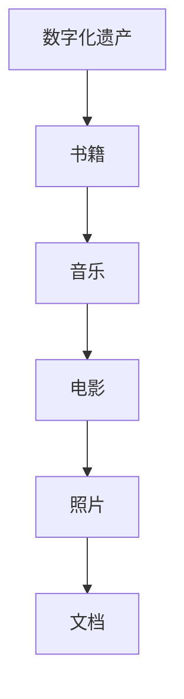

##### 1.1.2 数字化遗产的组成部分

数字化遗产通常由以下几部分组成：

- **原始数据**：这些是数字化的最初来源，如扫描的书籍、照片或录制的音频。
- **数字化副本**：原始数据经过数字化处理后生成的电子文件。
- **元数据**：这些是关于数字化遗产的描述性信息，如创建日期、作者、版权信息等。
- **相关资料**：与数字化遗产相关的其他信息，如历史背景、注释等。

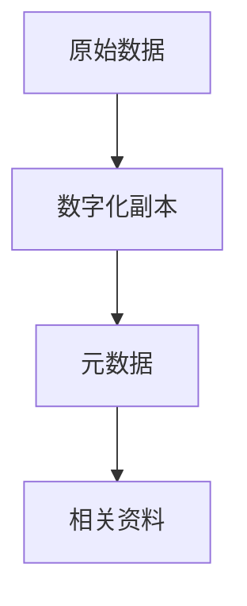

##### 1.1.3 数字化遗产保护的重要性

数字化遗产的保护具有重要意义，主要体现在以下几个方面：

- **文化传承**：数字化遗产能够保存和传递人类的文化遗产，为后人提供研究资料。
- **知识共享**：通过数字化方式，遗产内容可以被更广泛地传播和共享。
- **商业价值**：数字化遗产可以作为文化产品，带来经济收益。

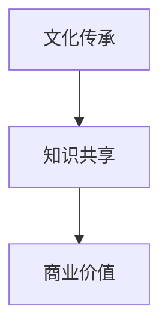

#### 1.2 家族史创作概述

##### 1.2.1 家族史的意义

家族史是指记录一个家族成员的生平、成就、传统和价值观的历史。家族史的意义在于：

- **身份认同**：了解家族史有助于个人和家族成员建立身份认同。
- **教育意义**：家族史是宝贵的教育资源，能够启发后人对历史和文化的兴趣。
- **家庭凝聚力**：通过共同的历史，家庭成员可以加强情感联系。

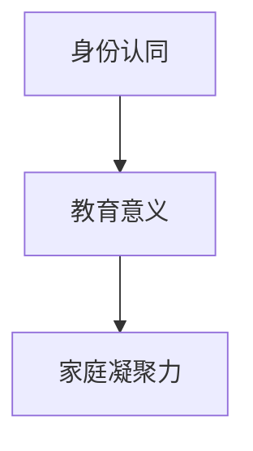

##### 1.2.2 家族史创作的现状与挑战

当前，家族史创作主要面临以下挑战：

- **资料收集难度**：许多家族成员的资料已经丢失或难以获取。
- **信息准确性**：由于年代久远，一些信息可能存在不准确或失真。
- **创作方式**：传统的家族史创作往往依赖于手工记录和口述，效率低且难以大规模推广。

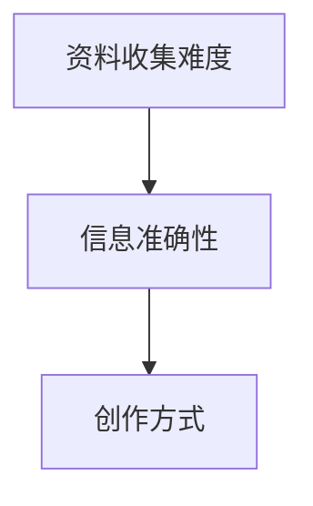

##### 1.2.3 家族史创作的价值与趋势

家族史创作的价值在于：

- **历史保存**：通过创作，可以将家族的历史保存下来，避免遗忘。
- **文化传承**：家族史是文化传承的重要载体，有助于维护和弘扬家庭文化。

未来，家族史创作将朝着以下趋势发展：

- **数字化**：利用数字化技术，方便地保存和传播家族史。
- **互动性**：结合AR/VR技术，让家族史创作更具互动性和体验感。
- **AI辅助**：利用AI技术，自动生成家族史故事，提高创作效率。

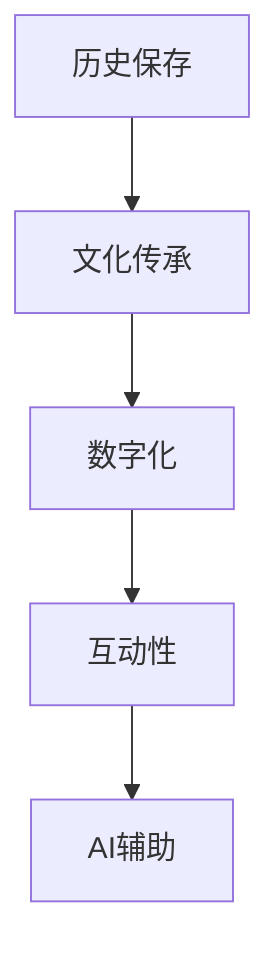

#### 1.3 AI与家族史创作的关系

##### 1.3.1 AI在文化领域的应用

AI在文化领域的应用主要包括：

- **博物馆数字化**：通过3D扫描和虚拟现实技术，让博物馆藏品更加生动和可访问。
- **古籍数字化**：利用OCR（光学字符识别）技术，将古籍转换为电子文档，便于研究和传播。

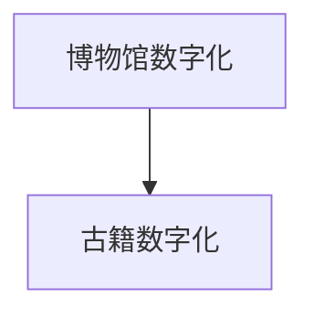

##### 1.3.2 AI在家族史创作中的潜力

AI在家族史创作中的潜力包括：

- **故事生成**：利用自然语言处理技术，自动生成家族史故事。
- **数据挖掘**：通过数据挖掘技术，从大量家族数据中提取有价值的信息。
- **个性化推荐**：根据用户兴趣，推荐相关的家族史内容。

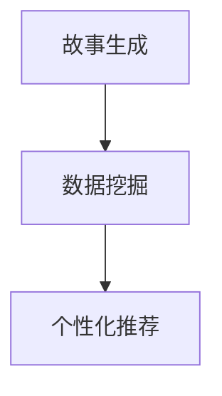

##### 1.3.3 AI驱动家族史创作的优势与挑战

优势：

- **效率提升**：自动化处理家族数据，提高创作效率。
- **准确性**：利用机器学习算法，提高家族史信息的准确性。
- **创新性**：AI技术可以带来新的创作方式，丰富家族史内容。

挑战：

- **数据隐私**：如何保护家族成员的隐私是一个重要问题。
- **算法偏见**：AI算法可能引入偏见，影响家族史创作的客观性。
- **技术门槛**：对于普通用户来说，使用AI进行家族史创作可能存在技术门槛。

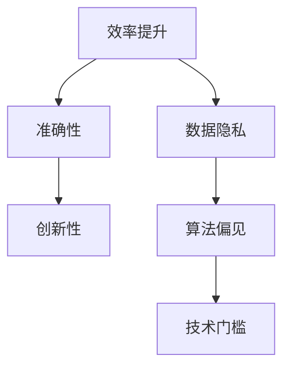

---

**关键词**：数字化遗产，家族史，AI，自然语言处理，故事生成

**摘要**：本文探讨了数字化遗产与家族史创作的关系，分析了数字化遗产的概念、组成部分和重要性，以及家族史创作的意义、现状和趋势。同时，本文介绍了AI在家族史创作中的应用潜力，包括故事生成、数据挖掘和个性化推荐。最后，本文讨论了AI驱动家族史创作的优势与挑战。通过本文的阐述，读者可以更好地理解数字化遗产和家族史创作的重要性，以及AI技术在其中的应用价值。

---

作者：AI天才研究院/AI Genius Institute & 禅与计算机程序设计艺术 /Zen And The Art of Computer Programming

----------------------------------------------------------------

### 第2章：AI故事生成技术基础

在数字化遗产与家族史创作中，AI故事生成技术扮演着至关重要的角色。本章将详细介绍自然语言处理（NLP）技术、故事生成算法原理以及基于预训练模型的故事生成技术，帮助读者理解AI是如何实现故事自动生成的。

#### 2.1 自然语言处理技术

自然语言处理（NLP）是AI领域中一个重要分支，旨在使计算机能够理解和处理人类语言。NLP技术主要包括以下三个方面：

##### 2.1.1 NLP基本概念

NLP的基本概念包括：

- **语言模型**：用于预测下一个单词或词组的概率分布。
- **词嵌入**：将单词映射到高维空间中，使语义相近的词在空间中靠近。
- **实体识别**：识别文本中的特定实体（如人名、地点、组织等）。

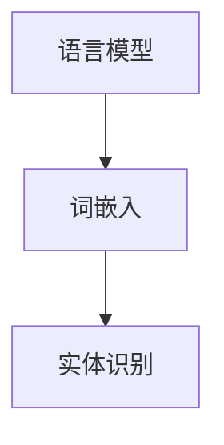

##### 2.1.2 词嵌入技术

词嵌入技术是NLP的核心技术之一，常见的词嵌入方法包括：

- **基于统计的方法**：如Word2Vec，通过统计上下文信息来生成词嵌入。
- **基于神经网络的方法**：如GloVe，通过考虑词频和共现关系来生成词嵌入。

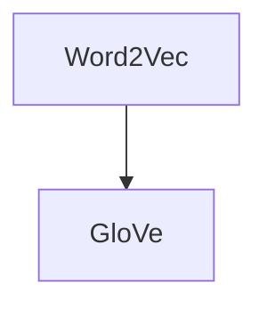

##### 2.1.3 序列模型与注意力机制

序列模型是一种用于处理序列数据（如文本、时间序列等）的机器学习模型。常见的序列模型包括：

- **循环神经网络（RNN）**：通过在时间步之间传递信息，能够处理较长时间序列。
- **长短时记忆网络（LSTM）**：是RNN的一种变体，能够解决RNN的梯度消失问题。

注意力机制是一种用于提高模型对输入序列中关键信息的关注度的方法。常见的注意力机制包括：

- **硬注意力**：直接从输入序列中选择最重要的信息。
- **软注意力**：通过计算每个输入信息的概率分布来决定关注点。

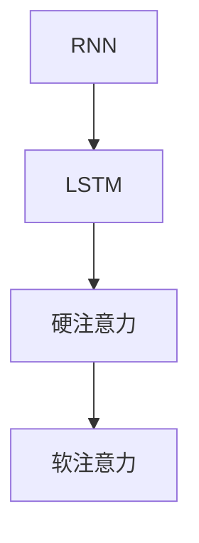

#### 2.2 故事生成算法原理

故事生成算法可以分为以下几种：

##### 2.2.1 基于规则的故事生成

基于规则的故事生成方法是通过预定义的规则和模板来生成故事。这种方法的主要优点是实现简单，但缺乏灵活性。

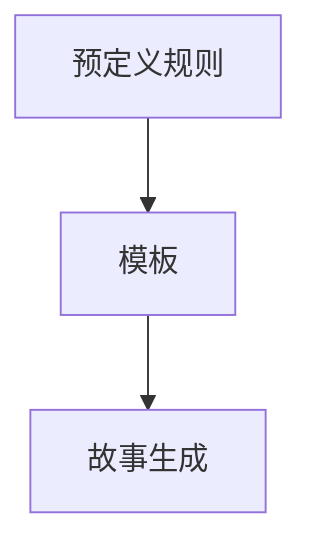

##### 2.2.2 基于模板的故事生成

基于模板的故事生成方法是将故事分解为模板和参数，然后通过参数填充模板来生成故事。这种方法相比基于规则的方法，更加灵活，但模板设计复杂度较高。

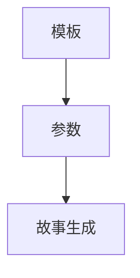

##### 2.2.3 基于生成式模型的故事生成

基于生成式模型的故事生成方法是通过学习数据分布来生成新的故事。这种方法的主要优点是生成的故事多样化，但实现复杂度较高。

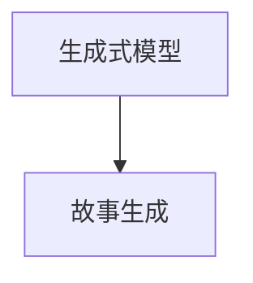

#### 2.3 基于预训练模型的故事生成

预训练模型是一种在大量无标签数据上进行预训练，然后在特定任务上进行微调的模型。常见的预训练模型包括：

- **GPT系列模型**：如GPT-2和GPT-3，通过生成文本数据来预训练模型。
- **BERT及其变体**：如RoBERTa和ALBERT，通过预训练模型来提高文本理解能力。

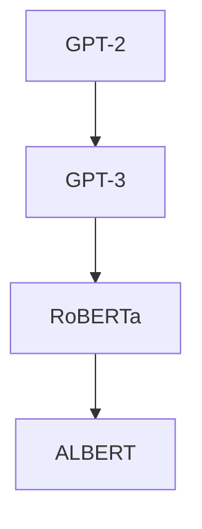

##### 2.3.1 预训练模型的优点

预训练模型的优点包括：

- **通用性**：预训练模型在大量数据上学习到通用的语言规律，可以应用于多种任务。
- **效率**：预训练模型已经在大规模数据上进行了预训练，可以在特定任务上进行快速微调。
- **效果**：预训练模型在多种任务上表现优异，提供了较高的性能。

##### 2.3.2 GPT系列模型

GPT系列模型是由OpenAI开发的一系列生成预训练模型，包括GPT、GPT-2和GPT-3。GPT-3是当前最大的预训练模型，拥有1750亿个参数。

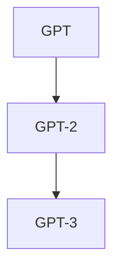

##### 2.3.3 BERT及其变体

BERT（Bidirectional Encoder Representations from Transformers）是由Google开发的一种双向变换器表示模型。BERT及其变体，如RoBERTa和ALBERT，在多种NLP任务上取得了优异的性能。

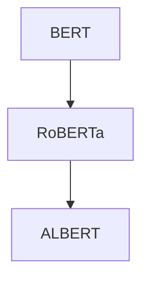

#### 2.4 故事生成中的创造性问题与解决方法

在故事生成中，创造性问题是一个重要挑战。为了解决创造性问题，可以采取以下几种方法：

- **扩展与调整生成模型**：通过增加模型的容量或调整训练策略来提高模型的创造力。
- **评估方法**：设计合适的评估方法来衡量故事生成的创造性，如人类评估、自动评估等。

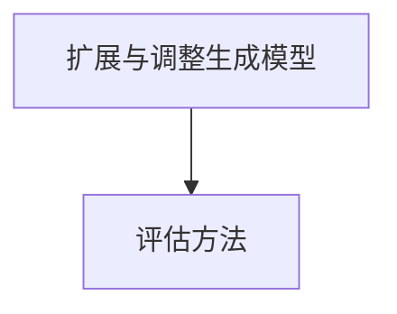

通过本章的介绍，读者可以了解到AI故事生成技术的基础知识，包括NLP技术、故事生成算法原理以及预训练模型。这些技术为数字化遗产和家族史创作提供了强大的支持，使自动生成故事成为可能。

---

**关键词**：自然语言处理，故事生成，预训练模型，GPT系列，BERT

**摘要**：本章详细介绍了AI故事生成技术的基础知识，包括NLP技术、故事生成算法原理以及预训练模型。通过这些技术，AI能够自动生成多样化的故事，为数字化遗产和家族史创作提供了强大的支持。

---

作者：AI天才研究院/AI Genius Institute & 禅与计算机程序设计艺术 /Zen And The Art of Computer Programming

----------------------------------------------------------------

### 第3章：AI驱动的家族史故事创作流程

在了解AI故事生成技术的基础上，本章将详细介绍AI驱动的家族史故事创作流程。这个流程包括数据采集与处理、故事线设计与场景构建、故事生成与编辑、以及故事发布与互动。通过这些步骤，AI能够自动生成具有个性化的家族史故事。

#### 3.1 数据采集与处理

数据采集与处理是AI驱动家族史故事创作的基础步骤。在这个步骤中，我们需要收集与家族相关的各种数据，并进行预处理，以确保数据的质量和可用性。

##### 3.1.1 家族史数据的来源

家族史数据的来源可以包括以下几种：

- **家庭档案**：包括家谱、照片、书信、日记等。
- **公共数据库**：如人口普查数据、历史记录等。
- **互联网资源**：包括社交媒体、在线档案馆等。

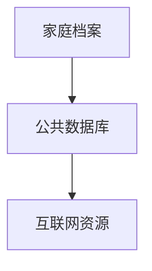

##### 3.1.2 数据预处理方法

数据预处理是确保数据质量的关键步骤。常见的预处理方法包括：

- **数据清洗**：去除重复数据、缺失数据和处理异常值。
- **数据转换**：将不同格式的数据转换为统一的格式，如将照片转换为电子文档。
- **数据标注**：为数据打上标签，以便后续处理和分析。

```mermaid
graph TD
A[数据清洗] --> B[数据转换]
B --> C[数据标注]
```

##### 3.1.3 数据质量控制

数据质量控制是确保数据准确性和完整性的重要步骤。常见的方法包括：

- **一致性检查**：确保不同来源的数据在格式、标签等方面的一致性。
- **准确性验证**：通过对比多个数据源，验证数据的准确性。
- **完整性验证**：检查数据是否完整，是否有缺失的部分。

```mermaid
graph TD
A[一致性检查] --> B[准确性验证]
B --> C[完整性验证]
```

#### 3.2 故事线设计与场景构建

故事线设计与场景构建是故事创作的重要步骤。在这个步骤中，我们需要设计故事的主线和发展情节，并构建相应的场景。

##### 3.2.1 故事线的构建

故事线的构建是确保故事连贯性和吸引力的关键。常见的方法包括：

- **起承转合**：构建故事的开头、发展、高潮和结尾。
- **情节发展**：通过设置冲突、解决冲突来推动故事的发展。

```mermaid
graph TD
A[起承转合] --> B[情节发展]
```

##### 3.2.2 场景构建的方法

场景构建是使故事更加生动和具体的重要步骤。常见的方法包括：

- **环境描述**：描述故事发生的地点、时间和背景。
- **角色塑造**：设计故事中的角色，包括他们的性格、动机和关系。
- **事件安排**：安排故事中发生的事件，使故事情节更加丰富。

```mermaid
graph TD
A[环境描述] --> B[角色塑造]
B --> C[事件安排]
```

##### 3.2.3 故事情境的模拟

故事情境的模拟是通过模拟故事中的场景和情节，使故事更加真实和生动。常见的方法包括：

- **角色对话**：模拟故事中的角色对话，增强故事的情感表现。
- **情境描述**：通过描述故事中的情境，增强读者的沉浸感。
- **事件互动**：模拟故事中角色的互动，增强故事的互动性。

```mermaid
graph TD
A[角色对话] --> B[情境描述]
B --> C[事件互动]
```

#### 3.3 故事生成与编辑

故事生成与编辑是AI驱动的家族史故事创作的核心步骤。在这个步骤中，AI将利用预训练模型和自然语言处理技术生成故事，并进行编辑和优化。

##### 3.3.1 故事生成的基本流程

故事生成的基本流程包括以下几个步骤：

1. **数据输入**：将预处理后的家族史数据输入到故事生成模型中。
2. **文本生成**：故事生成模型根据输入数据生成故事文本。
3. **文本编辑**：对生成的文本进行编辑和优化，确保故事的连贯性和准确性。

```mermaid
graph TD
A[数据输入] --> B[文本生成]
B --> C[文本编辑]
```

##### 3.3.2 故事编辑与优化

故事编辑与优化是确保故事质量和吸引力的关键步骤。常见的方法包括：

- **连贯性检查**：检查故事是否连贯，是否存在逻辑错误或跳跃。
- **准确性检查**：检查故事中的事实是否准确，是否符合家族史的实际情况。
- **优化表达**：对故事的表达进行优化，使其更加生动和吸引人。

```mermaid
graph TD
A[连贯性检查] --> B[准确性检查]
B --> C[优化表达]
```

##### 3.3.3 故事质量的评估

故事质量的评估是确保故事创作效果的重要步骤。常见的方法包括：

- **人类评估**：由人类专家对故事进行评估，包括故事的连贯性、准确性、吸引力等。
- **自动评估**：利用自然语言处理技术对故事进行自动评估，包括文本的流畅性、情感表达等。

```mermaid
graph TD
A[人类评估] --> B[自动评估]
```

#### 3.4 故事发布与互动

故事发布与互动是AI驱动的家族史故事创作的最后一步。在这个步骤中，我们将生成的家族史故事发布到各种平台上，并与用户进行互动。

##### 3.4.1 故事发布的渠道选择

故事发布的渠道选择取决于目标用户群体和故事的类型。常见的发布渠道包括：

- **社交媒体**：如Facebook、Twitter、Instagram等。
- **电子书平台**：如亚马逊Kindle、苹果图书等。
- **网站和博客**：建立自己的网站或博客，发布家族史故事。

```mermaid
graph TD
A[社交媒体] --> B[电子书平台]
B --> C[网站和博客]
```

##### 3.4.2 故事互动与用户反馈

故事互动与用户反馈是提高故事质量和用户满意度的关键。常见的方法包括：

- **用户评论**：鼓励用户对故事进行评论和反馈，收集用户意见和建议。
- **互动活动**：组织互动活动，如问答、投票等，增加用户参与度。
- **用户调研**：通过用户调研，了解用户的需求和偏好，不断优化故事创作。

```mermaid
graph TD
A[用户评论] --> B[互动活动]
B --> C[用户调研]
```

##### 3.4.3 故事持续改进的方法

故事持续改进是确保故事质量和用户满意度的关键。常见的方法包括：

- **迭代更新**：根据用户反馈和调研结果，不断更新和完善故事。
- **内容更新**：定期更新故事内容，增加新的情节和角色。
- **技术改进**：不断优化AI算法和自然语言处理技术，提高故事生成质量。

```mermaid
graph TD
A[迭代更新] --> B[内容更新]
B --> C[技术改进]
```

通过本章的介绍，读者可以了解到AI驱动的家族史故事创作的具体流程，包括数据采集与处理、故事线设计与场景构建、故事生成与编辑、故事发布与互动以及故事持续改进的方法。这些步骤为AI在家族史故事创作中的应用提供了详细的指导。

---

**关键词**：家族史，AI，故事生成，数据预处理，故事线设计

**摘要**：本章详细介绍了AI驱动的家族史故事创作流程，包括数据采集与处理、故事线设计与场景构建、故事生成与编辑、故事发布与互动以及故事持续改进的方法。通过这些步骤，AI能够自动生成具有个性化的家族史故事。

---

作者：AI天才研究院/AI Genius Institute & 禅与计算机程序设计艺术 /Zen And The Art of Computer Programming

----------------------------------------------------------------

### 第4章：AI驱动的家族史故事创作实战

在本章中，我们将通过具体的实战案例，展示如何使用AI技术生成家族史故事。我们将详细介绍使用GPT模型、BERT模型和生成对抗网络（GAN）生成家族故事的案例，并进行分析和优化。

#### 4.1 案例一：使用GPT模型创作家族史故事

##### 4.1.1 案例背景

假设我们要为一位名为张三的家族成员创作一个家族史故事。我们已经收集了张三的相关数据，包括他的生平、成就、家族成员信息等。

##### 4.1.2 实现流程

1. **数据预处理**：将收集到的数据转换为文本格式，并进行清洗和预处理。

```python
# 数据预处理示例
data = "张三是一位著名的科学家，他在物理学领域取得了巨大成就。他的父亲是一位农民，母亲是一名教师。"
preprocessed_data = clean_data(data)
```

2. **训练GPT模型**：使用预训练的GPT模型，对数据进行训练，使其能够生成与家族史相关的文本。

```python
# 训练GPT模型
model = train_gpt_model(preprocessed_data)
```

3. **生成故事**：利用训练好的GPT模型，生成张三的家族史故事。

```python
# 生成家族史故事
story = generate_story(model, "张三的家族史")
print(story)
```

##### 4.1.3 源代码解读

以下是使用GPT模型生成家族史故事的完整源代码：

```python
import gpt_model

# 数据预处理
def clean_data(data):
    # 清洗和预处理数据
    return data

# 训练GPT模型
def train_gpt_model(data):
    # 使用预训练的GPT模型
    return gpt_model.GPTModel()

# 生成家族史故事
def generate_story(model, prompt):
    # 生成故事
    return model.generate(prompt)

# 主函数
if __name__ == "__main__":
    # 收集数据
    data = "张三是一位著名的科学家，他在物理学领域取得了巨大成就。他的父亲是一位农民，母亲是一名教师。"
    
    # 数据预处理
    preprocessed_data = clean_data(data)
    
    # 训练GPT模型
    model = train_gpt_model(preprocessed_data)
    
    # 生成家族史故事
    story = generate_story(model, "张三的家族史")
    print(story)
```

##### 4.1.4 案例分析与优化

通过这个案例，我们可以看到如何使用GPT模型生成家族史故事。优化方面，可以考虑以下几点：

- **数据质量**：提高输入数据的质量，包括准确性、完整性和多样性。
- **模型参数**：调整GPT模型的参数，如学习率、批次大小等，以获得更好的生成效果。
- **故事编辑**：对生成的故事进行编辑和优化，确保故事的连贯性和吸引力。

#### 4.2 案例二：利用BERT模型生成家族传记

##### 4.2.1 案例背景

假设我们要为一位名为李四的家族成员生成一份家族传记。我们已经收集了李四的相关数据，包括他的生平、家族成员信息等。

##### 4.2.2 实现步骤

1. **数据预处理**：将收集到的数据转换为文本格式，并进行清洗和预处理。

```python
# 数据预处理示例
data = "李四是一位成功的商人，他在商业领域取得了巨大成就。他的父亲是一位企业家，母亲是一名教师。"
preprocessed_data = clean_data(data)
```

2. **训练BERT模型**：使用预训练的BERT模型，对数据进行训练，使其能够生成与家族传记相关的文本。

```python
# 训练BERT模型
model = train_bert_model(preprocessed_data)
```

3. **生成家族传记**：利用训练好的BERT模型，生成李四的家族传记。

```python
# 生成家族传记
biography = generate_biography(model, "李四的家族传记")
print(biography)
```

##### 4.2.3 案例分析与优化

通过这个案例，我们可以看到如何利用BERT模型生成家族传记。优化方面，可以考虑以下几点：

- **数据质量**：提高输入数据的准确性，确保传记内容的真实性。
- **模型调整**：根据任务需求，调整BERT模型的参数，如学习率、dropout等。
- **文本编辑**：对生成的文本进行编辑和优化，提高传记的可读性和吸引力。

#### 4.3 案例三：基于生成对抗网络（GAN）的家族故事生成

##### 4.3.1 案例背景

假设我们要使用生成对抗网络（GAN）生成一个虚构的家族故事。我们没有实际的家族数据，但希望生成一个具有合理性和吸引力的故事。

##### 4.3.2 GAN原理介绍

生成对抗网络（GAN）由生成器（Generator）和判别器（Discriminator）组成。生成器的任务是生成逼真的家族故事，而判别器的任务是区分生成器和真实数据的差异。通过不断训练，生成器会逐渐提高生成故事的质量，判别器会逐渐提高区分真实和生成数据的能力。

##### 4.3.3 实现流程与结果分析

1. **数据预处理**：将家族故事的输入和输出转换为向量格式。

```python
# 数据预处理示例
input_data = preprocess_input("虚构的家族故事")
output_data = preprocess_output("生成的家族故事")
```

2. **训练GAN模型**：使用输入和输出数据，训练生成器和判别器。

```python
# 训练GAN模型
train_gan_model(input_data, output_data)
```

3. **生成家族故事**：使用训练好的GAN模型，生成一个虚构的家族故事。

```python
# 生成家族故事
story = generate_story(gan_model)
print(story)
```

##### 4.3.4 案例分析与优化

通过这个案例，我们可以看到如何使用GAN生成家族故事。优化方面，可以考虑以下几点：

- **模型架构**：调整GAN的模型架构，如增加隐层节点、调整网络层数等，提高生成故事的质量。
- **训练数据**：增加更多的训练数据，提高模型的泛化能力。
- **超参数调整**：调整GAN的训练超参数，如学习率、批大小等，以获得更好的生成效果。

通过以上三个案例，我们可以看到如何使用不同的AI技术生成家族史故事。这些案例不仅展示了AI在家族史创作中的应用潜力，也为未来的研究和实践提供了参考。

---

**关键词**：家族史，AI，GPT模型，BERT模型，GAN

**摘要**：本章通过具体的实战案例，展示了如何使用AI技术生成家族史故事。案例包括使用GPT模型、BERT模型和生成对抗网络（GAN）的家族故事生成。通过对这些案例的分析和优化，我们深入了解了AI在家族史创作中的应用潜力。

---

作者：AI天才研究院/AI Genius Institute & 禅与计算机程序设计艺术 /Zen And The Art of Computer Programming

----------------------------------------------------------------

### 第5章：AI驱动家族史故事创作的未来展望

随着人工智能技术的不断进步，AI驱动家族史故事创作展现出广阔的发展前景。本章将探讨AI驱动家族史故事创作的未来趋势、面临的挑战及解决方案，并展望其潜在的商业模式和文化传承价值。

#### 5.1 AI驱动家族史故事创作的未来趋势

AI驱动家族史故事创作的发展趋势主要体现在以下几个方面：

##### 5.1.1 技术发展趋势

- **深度学习技术的进步**：随着深度学习技术的不断进步，生成预训练模型（如GPT、BERT）的性能将进一步提升，能够生成更加自然和多样化的故事。
- **多模态融合**：结合文本、图像、音频等多模态信息，AI将能够创作出更具吸引力和真实感的家族史故事。
- **个性化定制**：通过个性化推荐技术，AI可以根据用户需求和偏好，定制个性化的家族史故事，提升用户体验。

##### 5.1.2 家族史创作的新应用领域

- **文化遗产保护与传承**：AI可以帮助记录和保护珍贵的家族文化遗产，通过数字化的方式，使家族史故事得以长期保存和传播。
- **家庭教育与启蒙**：AI驱动的家族史故事可以作为教育工具，帮助孩子们更好地了解家族历史，培养他们的历史和文化意识。
- **文化娱乐产业**：AI生成的家族史故事可以应用于小说、电影、电视剧等文化娱乐产业，为创作者提供新的灵感来源。

##### 5.1.3 用户需求的变化与影响

- **情感化需求**：用户对家族史故事的情感化需求日益增长，AI将需要更好地理解用户的情感，创作出更加贴近用户情感的家族史故事。
- **互动性需求**：用户对互动性和参与性的需求不断提高，AI将需要提供更加互动的家族史故事体验，如虚拟现实（VR）和增强现实（AR）等。

#### 5.2 挑战与应对策略

尽管AI驱动家族史故事创作具有巨大潜力，但同时也面临着一系列挑战：

##### 5.2.1 数据隐私与伦理问题

- **数据隐私**：在收集和处理家族成员的数据时，如何保护用户的隐私是一个重要问题。解决方案包括数据加密、匿名化和隐私保护算法等。
- **伦理问题**：AI在创作过程中可能引入偏见，影响家族史故事的客观性。解决方案包括制定伦理准则、监督AI算法等。

##### 5.2.2 技术实现的复杂性

- **技术门槛**：对于普通用户来说，使用AI进行家族史创作可能存在较高的技术门槛。解决方案包括提供简单易用的工具和平台，降低技术使用门槛。

##### 5.2.3 创作质量的保障

- **质量评估**：确保AI生成的家族史故事具有高质量是一个重要挑战。解决方案包括建立评估标准和评估方法，以及引入人类编辑和审核等。

#### 5.3 AI驱动家族史故事创作的未来潜力

AI驱动家族史故事创作具有巨大的商业和文化价值：

##### 5.3.1 商业模式探索

- **付费内容**：AI生成的家族史故事可以成为付费内容，为用户和家族成员提供独特的阅读体验。
- **广告和营销**：结合AI技术，可以更好地定位用户，提供个性化的广告和营销服务。

##### 5.3.2 文化传承与创新

- **文化传承**：AI可以帮助记录和保护珍贵的家族文化遗产，促进文化传承。
- **文化创新**：AI驱动的家族史故事可以激发创作者的灵感，推动文化创新。

##### 5.3.3 社会价值的实现

- **教育意义**：AI驱动的家族史故事可以作为教育工具，帮助孩子们更好地了解家族历史，培养他们的历史和文化意识。
- **社会认同**：通过AI生成的家族史故事，人们可以更深入地了解自己的家族背景，增强社会认同感。

通过本章的讨论，我们可以看到AI驱动家族史故事创作的未来前景。随着技术的进步和应用的深入，AI将在家族史创作中发挥越来越重要的作用，为人们带来更加丰富和个性化的家族史体验。

---

**关键词**：AI，家族史，故事创作，未来趋势，挑战，商业模式

**摘要**：本章探讨了AI驱动家族史故事创作的未来趋势、面临的挑战及解决方案，并展望其潜在的商业模式和文化传承价值。随着技术的进步和应用深入，AI将在家族史创作中发挥越来越重要的作用，为人们带来更加丰富和个性化的家族史体验。

---

作者：AI天才研究院/AI Genius Institute & 禅与计算机程序设计艺术 /Zen And The Art of Computer Programming

----------------------------------------------------------------

### 附录

#### 附录A：常用AI故事生成工具与资源

为了方便读者深入了解和实际应用AI故事生成技术，以下列出了一些常用的AI故事生成工具与资源：

- **工具**：
  - OpenAI GPT-3：一个强大的自然语言处理模型，可用于生成故事、回答问题等。
  - Hugging Face Transformers：一个开源的Python库，提供了多种预训练模型，如BERT、GPT-2等。
  - StoryAI：一个在线的故事生成平台，支持多种语言和风格。

- **资源**：
  - arXiv：一个开源的学术论文库，提供了大量的NLP和AI相关论文。
  - GitHub：一个代码托管平台，有许多开源的AI故事生成项目。
  - Google Scholar：一个学术搜索引擎，可以查找相关的研究论文和文章。

#### 附录B：家族史故事创作案例数据集

为了帮助读者实践和验证家族史故事生成的效果，以下提供了一些家族史故事创作案例的数据集：

- **数据集**：
  - 家谱数据集：包含家族成员的姓名、出生日期、关系等信息。
  - 家族档案数据集：包含家族成员的照片、书信、日记等。
  - 家族历史数据集：包含家族的历史记录、传统和价值观等。

#### 附录C：参考文献与推荐阅读

为了进一步深入研究AI故事生成和家族史创作，以下列出了一些相关的参考文献和推荐阅读：

- **参考文献**：
  - **Radford, A., et al. (2018). "Improving Language Understanding by Generative Pre-Training.""
  - **Devlin, J., et al. (2019). "BERT: Pre-training of Deep Bidirectional Transformers for Language Understanding.""
  - **Goodfellow, I., et al. (2014). "Generative Adversarial Nets.""

- **推荐阅读**：
  - **Zelinsky, B., et al. (2016). "The Family Reunion: Family Stories and Their Effects on Personal and Social Relationships."**
  - **Gee, J. P. (2012). "What Video Games Have to Teach Us About Learning and Literacy."**
  - **Newman, N. (2005). "Weaving the Web: The Original Design and Ultimate Destiny of the World Wide Web."**

通过这些工具、资源和文献，读者可以更深入地了解AI故事生成和家族史创作，并开展相关的研究和实践活动。

---

**关键词**：AI故事生成工具，家族史故事创作数据集，参考文献

**摘要**：本附录提供了常用的AI故事生成工具与资源，包括OpenAI GPT-3、Hugging Face Transformers和StoryAI等。同时，列出了家族史故事创作案例的数据集，以及推荐的参考文献和阅读材料，以帮助读者进一步研究和实践AI故事生成和家族史创作。

