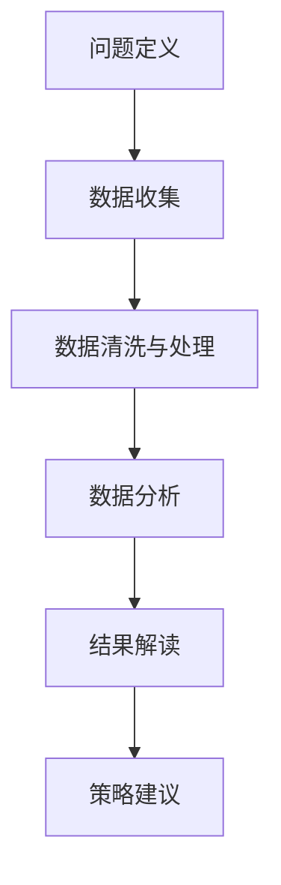

                 

# 数字文化市场分析与发展趋势

## 摘要

本文将对数字文化市场进行深入分析，探讨其发展历程、核心概念、用户行为、市场竞争、技术趋势以及区域发展等方面。通过对当前数字文化市场的现状进行全面剖析，本文旨在揭示其潜在的发展机遇与挑战，为相关从业者提供有价值的参考和策略建议。本文结构紧凑，逻辑清晰，结合实际案例和算法原理讲解，力求为读者呈现一幅完整的数字文化市场发展蓝图。

## 目录大纲

### 第一部分：数字文化市场概述

#### 第1章：数字文化市场背景与发展历程

1.1 数字文化市场的定义与范围

1.2 数字文化市场的发展历程

1.3 当前数字文化市场的现状

#### 第2章：数字文化市场核心概念与要素

2.1 数字文化产品的分类

2.2 数字文化市场的主要参与者

2.3 数字文化市场的主要驱动因素

### 第二部分：数字文化市场分析

#### 第3章：数字文化市场用户行为分析

3.1 用户需求分析

3.2 用户偏好分析

3.3 用户生命周期价值分析

#### 第4章：数字文化市场竞争分析

4.1 市场竞争格局分析

4.2 市场竞争策略分析

4.3 市场竞争优势分析

#### 第5章：数字文化市场机会与挑战

5.1 发展机遇分析

5.2 面临的挑战分析

5.3 应对策略分析

### 第三部分：数字文化市场发展趋势

#### 第6章：数字文化市场技术发展趋势

6.1 人工智能在数字文化市场中的应用

6.2 区块链技术在数字文化市场的影响

6.3 5G与云计算在数字文化市场的应用

#### 第7章：数字文化市场区域发展趋势

7.1 全球数字文化市场发展趋势

7.2 我国数字文化市场发展趋势

7.3 我国区域数字文化市场发展趋势

#### 第8章：数字文化市场未来展望

8.1 数字文化市场的未来发展趋势

8.2 数字文化市场未来面临的挑战与机遇

8.3 数字文化市场未来发展策略

### 附录

#### 附录A：数字文化市场相关数据与案例

A.1 市场数据介绍

A.2 典型案例介绍

A.3 数据分析与案例解读

#### 附录B：数字文化市场研究方法与工具

B.1 研究方法概述

B.2 数据收集与分析工具

B.3 研究流程与技巧

#### 附录C：数字文化市场相关术语解释

C.1 数字文化产品相关术语

C.2 数字文化市场相关术语

C.3 技术发展相关术语

### 核心算法原理讲解：协同过滤算法

#### 线性回归模型

$$
y = \beta_0 + \beta_1 x_1 + \beta_2 x_2 + ... + \beta_n x_n + \epsilon
$$

### 项目实战：数字文化市场分析项目实战

1. 项目背景与目标

2. 数据收集

3. 数据处理

4. 数据分析

5. 结果解读

6. 环境搭建与源代码实现

7. 代码解读与分析

## 引言

在当今数字化时代，数字文化市场正以惊人的速度发展。从电子书、音乐、电影、游戏到社交媒体和数字艺术，数字文化产品和服务已经成为人们日常生活不可或缺的一部分。随着互联网技术的进步和移动设备的普及，数字文化市场不仅规模不断扩大，而且也在不断变革和创新。本文旨在通过对数字文化市场的全面分析，探讨其发展现状、核心概念、用户行为、市场竞争、技术趋势以及区域发展，从而为相关从业者提供有价值的参考和策略建议。

首先，我们将回顾数字文化市场的背景和发展历程，了解这一市场是如何从无到有、从小到大逐渐发展壮大的。接着，我们将介绍数字文化市场的核心概念与要素，包括数字文化产品的分类、市场的主要参与者和主要驱动因素。在此基础上，我们将深入分析数字文化市场的用户行为，包括用户需求分析、用户偏好分析和用户生命周期价值分析。

随后，我们将探讨数字文化市场的竞争格局，分析主要竞争者的策略和市场优势。在此基础上，我们将分析数字文化市场面临的发展机遇和挑战，并提出相应的应对策略。接下来，我们将探讨数字文化市场的技术发展趋势，包括人工智能、区块链、5G和云计算等新兴技术在数字文化市场中的应用。

最后，我们将分析全球和我国数字文化市场的发展趋势，以及我国区域数字文化市场的发展情况。在文章的最后部分，我们将对数字文化市场的未来进行展望，探讨其可能面临的挑战与机遇，并提出未来发展策略。通过本文的详细分析和讲解，我们希望为读者提供一幅完整的数字文化市场发展蓝图。

### 第一部分：数字文化市场概述

#### 第1章：数字文化市场背景与发展历程

数字文化市场，作为一个快速发展的领域，其背景和发展历程值得深入探讨。在这一章节中，我们将详细回顾数字文化市场的起源、关键发展阶段以及当前的市场现状，旨在为读者提供一个全面的背景了解，从而更好地理解这一市场的未来发展趋势。

#### 1.1 数字文化市场的定义与范围

数字文化市场是指以数字化技术为支撑，以文化产品和服务为主要交易对象的市场。它涵盖了广泛的领域，包括电子书、数字音乐、在线视频、电子游戏、数字艺术品、虚拟现实（VR）和增强现实（AR）等。数字文化市场的核心在于其数字化特性，即通过互联网、移动设备等技术手段，实现文化产品的创作、传播和消费。

数字文化市场的范围非常广泛，不仅包括传统的文化产品数字化，还包括新兴的数字文化产品和服务的开发和运营。例如，电子书和数字音乐已经成为数字文化市场的重要组成部分，而虚拟现实和增强现实等新兴技术则正在改变人们的娱乐消费方式。

#### 1.2 数字文化市场的发展历程

数字文化市场的发展历程可以追溯到互联网的兴起。20世纪90年代，随着互联网技术的普及，人们开始尝试将传统的文化产品数字化，从而创造了一个全新的市场空间。以下是数字文化市场发展的几个关键阶段：

1. **初期探索阶段（1990s）**：
   - 这一阶段主要是将传统的文化产品，如书籍、音乐和电影，进行数字化处理，使其能够在互联网上进行传播和销售。
   - 1994年，Amazon上线，标志着在线图书销售的兴起；同年，MP3格式的普及使得数字音乐市场迅速发展。

2. **快速增长阶段（2000s）**：
   - 互联网的普及和移动设备的兴起，使得数字文化市场的增长速度显著加快。
   - 这一阶段见证了流媒体服务的兴起，如Netflix、Spotify和YouTube等，它们通过互联网为用户提供丰富的数字文化内容。
   - 同时，电子游戏市场也在快速增长，特别是在网络游戏领域，如《魔兽世界》和《英雄联盟》等游戏的推出，吸引了大量用户。

3. **创新与融合阶段（2010s至今）**：
   - 新兴技术的引入，如虚拟现实（VR）、增强现实（AR）和区块链等，为数字文化市场带来了新的机遇。
   - 跨界融合成为趋势，例如，电影制作与虚拟现实技术的结合，使得观众能够在虚拟环境中体验电影内容。
   - 数字文化市场的全球化趋势加强，国际市场不断扩展，市场格局发生变化。

#### 1.3 当前数字文化市场的现状

当前，数字文化市场已经发展成为一个巨大的产业链，涵盖了从内容创作、技术支持到分销和消费的各个环节。以下是数字文化市场的一些主要特点：

1. **市场规模不断扩大**：
   - 根据市场研究报告，全球数字文化市场的规模已经达到数千亿美元，并且仍在快速增长。
   - 在我国，数字文化市场也呈现出高速增长态势，电子书、数字音乐和在线视频等领域的市场规模不断壮大。

2. **用户需求多样化**：
   - 随着数字技术的进步和用户消费习惯的改变，用户对数字文化产品的需求越来越多样化。
   - 除了传统的娱乐内容，用户还开始关注个性化、互动性和沉浸式体验，这推动了数字文化市场的不断创新。

3. **技术驱动创新**：
   - 新兴技术的应用，如人工智能、区块链和5G等，正在改变数字文化市场的运作方式。
   - 人工智能技术可以用于内容推荐、用户行为分析和市场预测，提高运营效率和用户体验；区块链技术则可以提供更加安全可靠的内容交易和版权保护。

4. **市场竞争激烈**：
   - 随着市场规模的扩大，各大企业纷纷涌入数字文化市场，竞争日益激烈。
   - 企业需要不断创新和优化产品与服务，以赢得市场份额和用户忠诚度。

5. **政策法规逐渐完善**：
   - 为了规范数字文化市场的发展，各国政府和国际组织开始制定相关政策和法规。
   - 政策法规的完善有助于保护版权、打击盗版，并为数字文化市场提供良好的发展环境。

综上所述，数字文化市场作为一个快速发展的领域，已经经历了多个发展阶段，并呈现出多样化的特点。通过回顾其发展历程和了解当前的市场现状，我们可以更好地把握数字文化市场的未来发展趋势，为相关从业者提供有价值的参考。

#### 第2章：数字文化市场核心概念与要素

在理解数字文化市场的运作机制和未来发展潜力之前，我们需要明确一些核心概念和要素。这些概念和要素不仅构成了数字文化市场的基础，而且也是分析和评估市场动态的重要工具。本章将详细探讨数字文化产品的分类、市场的主要参与者以及主要驱动因素，帮助读者深入理解这一市场。

#### 2.1 数字文化产品的分类

数字文化产品的分类可以基于其形式、内容、用途和目标受众等多个维度。以下是几种常见的分类方法：

1. **按形式分类**：
   - **电子书**：以数字格式出版的书籍，包括小说、散文、学术著作等。
   - **数字音乐**：通过数字格式存储和传输的音乐作品，如MP3、AAC等。
   - **在线视频**：通过互联网传输的视频内容，包括电影、电视剧、纪录片等。
   - **电子游戏**：基于数字平台的互动娱乐产品，如单机游戏、网络游戏等。
   - **数字艺术品**：以数字形式创作的艺术品，如数字绘画、虚拟雕塑等。

2. **按内容分类**：
   - **娱乐类**：以娱乐消遣为主的文化产品，如电影、电视剧、电子游戏等。
   - **教育类**：以知识传授和学习提升为目的的文化产品，如在线课程、教育软件等。
   - **文化类**：以文化传承和艺术表现为主的文化产品，如电子书、数字音乐、数字艺术品等。

3. **按用途分类**：
   - **消费类**：主要用于个人娱乐、学习和消费的文化产品，如电子书、数字音乐、在线视频等。
   - **产业类**：为特定产业提供支持的文化产品，如影视制作公司使用的数字特效软件、游戏开发公司使用的游戏引擎等。

4. **按目标受众分类**：
   - **大众市场**：面向广泛的普通消费者，如电子书、数字音乐、在线视频等。
   - **细分市场**：面向特定受众群体的文化产品，如游戏中的专业玩家市场、学术出版物市场等。

#### 2.2 数字文化市场的主要参与者

数字文化市场的参与者包括内容创作者、内容分发平台、技术提供商和消费者等多个角色。以下是这些主要参与者的详细描述：

1. **内容创作者**：
   - 内容创作者是指生产数字文化产品的个人或组织，如作家、音乐人、导演、游戏设计师等。
   - 内容创作者的创新能力是数字文化市场发展的核心驱动力，他们通过创作具有吸引力的文化产品，满足不同消费者的需求。

2. **内容分发平台**：
   - 内容分发平台是数字文化产品的传播和销售渠道，如亚马逊、Spotify、Netflix、Steam等。
   - 这些平台通过提供便捷的访问和丰富的内容，吸引用户消费数字文化产品，同时也为创作者提供了一个展示和销售作品的平台。

3. **技术提供商**：
   - 技术提供商是指为数字文化市场提供技术支持和解决方案的企业，如云计算服务提供商、网络安全公司、数字内容管理系统开发商等。
   - 技术提供商通过不断改进和优化技术，提高数字文化产品的创作、分发和用户体验，推动市场的发展。

4. **消费者**：
   - 消费者是数字文化市场的主要受众群体，他们通过购买或免费使用数字文化产品来满足自己的娱乐、学习和文化需求。
   - 消费者的需求和偏好是市场发展的重要驱动力，消费者的变化和趋势直接影响市场的走向。

#### 2.3 数字文化市场的主要驱动因素

数字文化市场的发展受到多种驱动因素的影响，这些因素相互作用，共同推动市场的不断壮大。以下是几个主要的驱动因素：

1. **技术进步**：
   - 互联网技术的进步使得数字文化产品的创作、传播和消费变得更加便捷和高效。
   - 移动设备的普及和5G网络的推广，进一步提升了用户的接入速度和体验质量。

2. **用户需求变化**：
   - 随着消费者对个性化、互动性和沉浸式体验的需求增加，数字文化产品也在不断创新和进化。
   - 用户对数字文化产品的消费习惯和偏好不断变化，促使市场提供更加多样化、个性化的产品和服务。

3. **市场竞争加剧**：
   - 随着数字文化市场的不断扩大，越来越多的企业进入这一领域，竞争日益激烈。
   - 企业需要通过创新、优化和差异化策略来获取市场份额和用户忠诚度。

4. **政策法规支持**：
   - 各国政府和国际组织对数字文化市场的政策法规支持，有助于规范市场秩序、保护版权和促进创新。
   - 政策法规的完善为数字文化市场提供了良好的发展环境和法律保障。

5. **全球化趋势**：
   - 数字文化市场的全球化趋势使得国际市场成为重要的发展方向。
   - 企业可以通过拓展海外市场，实现业务规模的扩大和品牌影响力的提升。

综上所述，数字文化市场的核心概念与要素包括数字文化产品的分类、市场的主要参与者和主要驱动因素。通过理解这些概念和要素，我们可以更深入地分析市场的运作机制和未来发展趋势，为相关从业者提供有价值的参考和指导。

### 第二部分：数字文化市场分析

#### 第3章：数字文化市场用户行为分析

数字文化市场的成功很大程度上取决于对用户行为深入的理解和分析。用户行为分析是市场研究的重要组成部分，它帮助我们了解用户的需求、偏好和消费习惯，从而制定更有效的营销策略和产品开发计划。本章将详细探讨数字文化市场用户行为的几个关键方面：用户需求分析、用户偏好分析和用户生命周期价值分析。

#### 3.1 用户需求分析

用户需求分析是了解用户对数字文化产品和服务需求的初步步骤。通过分析用户需求，企业可以更好地定位市场，制定符合用户期望的产品和服务。

1. **需求多样性和变化性**：
   - 用户对数字文化产品的需求具有多样性和变化性。例如，某些用户可能更喜欢沉浸式的电子游戏体验，而另一些用户则更关注高质量的教育内容。
   - 需求的变化性还体现在用户对不同类型数字文化产品的兴趣波动上。例如，在疫情期间，在线教育和远程工作的需求大幅增加。

2. **需求影响因素**：
   - 用户需求受到多种因素的影响，包括个人兴趣、文化背景、社会环境、经济状况等。例如，年轻人更倾向于追求新奇和互动性强的数字文化产品，而中年人则更关注知识传授和技能提升。

3. **需求满足方式**：
   - 用户需求可以通过多种方式得到满足，包括免费试用、付费购买、社交媒体分享等。企业需要根据用户需求的特点和满足方式的多样性，灵活调整其产品和服务策略。

#### 3.2 用户偏好分析

用户偏好分析是深入了解用户喜好和偏好的重要手段。通过分析用户偏好，企业可以更好地满足用户需求，提高用户满意度和忠诚度。

1. **内容偏好**：
   - 用户对不同类型数字文化内容有不同的偏好。例如，某些用户更喜欢悬疑小说，而另一些用户则更喜欢科幻小说。
   - 用户的内容偏好受多种因素影响，包括文化背景、兴趣爱好、年龄和性别等。

2. **平台偏好**：
   - 用户对数字文化产品的平台偏好也各不相同。例如，某些用户更喜欢使用手机客户端，而另一些用户则更喜欢使用电脑端。
   - 平台偏好还与用户的设备使用习惯、网络环境等因素密切相关。

3. **交互偏好**：
   - 用户在数字文化产品中的交互偏好也值得分析。例如，某些用户更喜欢自主探索式的游戏体验，而另一些用户则更喜欢社交互动和团队合作。
   - 交互偏好影响了用户体验的质量和深度，对产品设计和功能开发具有重要的指导意义。

#### 3.3 用户生命周期价值分析

用户生命周期价值（Customer Lifetime Value，CLV）是衡量用户对企业盈利能力的重要指标。通过对用户生命周期价值的分析，企业可以更好地识别高价值用户，制定有效的用户留存和增值策略。

1. **定义和计算**：
   - 用户生命周期价值是指一个用户在整个生命周期中为企业带来的总收益。它可以通过以下公式计算：
     $$
     \text{CLV} = \sum_{t=1}^{n} \frac{\text{预计未来收益}}{(1 + \text{折现率})^t}
     $$
   - 其中，$n$ 为用户预期生命周期，$\text{预计未来收益}$ 为用户在未来每个时间点带来的收益，$\text{折现率}$ 用于反映时间价值。

2. **用户生命周期阶段**：
   - 用户生命周期通常分为吸引、留存和增值三个阶段。吸引阶段主要关注如何吸引新用户，留存阶段关注如何提高用户留存率，增值阶段关注如何提升用户消费额和转化率。

3. **提高用户生命周期价值**：
   - 提高用户生命周期价值的关键在于提高用户的满意度和忠诚度。以下是一些策略：
     - 提供高质量的数字文化产品和服务，满足用户的个性化需求。
     - 通过用户行为分析和反馈机制，持续优化产品和服务。
     - 设计忠诚度计划，如积分、会员优惠等，提高用户忠诚度。
     - 利用数据分析和营销自动化工具，提高营销效率和转化率。

#### 综合分析与应用

用户需求分析、用户偏好分析和用户生命周期价值分析相互关联，共同构成了数字文化市场用户行为分析的核心内容。通过综合分析这些数据，企业可以更好地理解用户行为，制定有针对性的市场策略。

1. **个性化推荐系统**：
   - 基于用户需求分析和偏好分析，企业可以开发个性化推荐系统，提高用户满意度和转化率。
   - 例如，数字音乐平台可以通过分析用户的播放历史和评分记录，推荐符合用户喜好的音乐。

2. **精准营销策略**：
   - 通过用户生命周期价值分析，企业可以识别高价值用户，制定精准的营销策略，提高营销ROI。
   - 例如，针对高价值用户，企业可以推出定制化优惠和专属服务，提高用户留存率和消费额。

3. **产品开发与优化**：
   - 基于用户需求分析和偏好分析，企业可以不断优化和改进数字文化产品，提高用户体验。
   - 例如，游戏开发商可以通过用户反馈和数据分析，调整游戏难度、场景设计等，提升游戏趣味性和玩家满意度。

综上所述，数字文化市场用户行为分析是理解和把握市场动态的重要工具。通过对用户需求、偏好和生命周期价值的深入分析，企业可以更好地满足用户需求，提高用户满意度和忠诚度，从而在激烈的市场竞争中脱颖而出。

#### 第4章：数字文化市场竞争分析

在数字文化市场的快速发展中，竞争日益激烈。了解市场中的竞争格局、竞争策略和竞争优势是企业和投资者制定战略决策的重要基础。本章将详细探讨数字文化市场的竞争分析，包括市场竞争格局、竞争策略以及市场竞争优势。

#### 4.1 市场竞争格局分析

数字文化市场的竞争格局呈现出多元化、全球化和高度竞争的特点。以下是当前市场的主要竞争格局：

1. **市场领导者**：
   - 当前，数字文化市场存在若干市场领导者，如Netflix、亚马逊、腾讯、谷歌等。这些企业在市场份额、品牌影响力和技术创新方面具有明显优势。
   - 市场领导者通过持续的投资和创新，不断提升其产品和服务质量，巩固其市场地位。

2. **新兴竞争者**：
   - 随着数字文化市场的不断扩大，新兴竞争者不断涌现，如Spotify、字节跳动、快手等。这些新兴企业通过独特的产品和服务策略，迅速获得市场份额。
   - 新兴竞争者往往擅长利用新技术和互联网平台，提供个性化的内容和服务，吸引用户关注。

3. **区域竞争**：
   - 数字文化市场具有显著的区域性特征。不同国家和地区在市场参与者、内容和消费习惯上存在差异，形成了区域性的竞争格局。
   - 例如，在中国市场，腾讯和字节跳动等本土企业具有较强的竞争力，而在欧美市场，亚马逊和Netflix等跨国企业占据主导地位。

4. **行业联盟与合作**：
   - 为了应对激烈的市场竞争，一些企业选择通过行业联盟和合作来增强竞争力。
   - 例如，多家数字内容提供商共同合作，建立版权共享平台，共同开发和推广内容，提升整体竞争力。

#### 4.2 市场竞争策略分析

在数字文化市场中，企业通过多种竞争策略来争夺市场份额和用户忠诚度。以下是几种常见的竞争策略：

1. **差异化策略**：
   - 企业通过提供独特的产品和服务，满足用户的多样化需求，实现差异化竞争。
   - 例如，腾讯的《王者荣耀》通过独特的游戏模式和社交功能，吸引了大量年轻用户。

2. **低成本策略**：
   - 企业通过降低成本，提供价格更具竞争力的数字文化产品，吸引价格敏感的用户。
   - 例如，Spotify通过提供免费和低价的订阅服务，迅速占领了音乐市场。

3. **品牌策略**：
   - 企业通过打造强大的品牌形象，提高用户对品牌的认知和信任度，从而获得竞争优势。
   - 例如，Netflix通过高品质的原创内容和品牌营销，成功树立了其在流媒体市场的领导地位。

4. **技术创新策略**：
   - 企业通过持续的技术创新，提供领先的技术解决方案，提高用户体验和竞争力。
   - 例如，谷歌通过其先进的AI技术，为数字文化产品提供智能推荐和个性化服务。

#### 4.3 市场竞争优势分析

在激烈的市场竞争中，企业需要具备显著的竞争优势，才能在市场中脱颖而出。以下是几种常见的市场竞争优势：

1. **品牌影响力**：
   - 品牌影响力是企业重要的竞争优势之一。强大的品牌能够吸引大量用户，提高用户忠诚度和品牌溢价。
   - 例如，迪士尼通过其强大的品牌影响力，在全球范围内吸引了大量用户。

2. **技术创新能力**：
   - 技术创新能力是企业保持市场竞争力的重要手段。通过不断的技术创新，企业能够提供领先的产品和服务，满足用户不断变化的需求。
   - 例如，亚马逊通过其云计算技术，为数字文化市场提供了强大的技术支持。

3. **内容资源优势**：
   - 内容资源优势是企业获得竞争优势的关键。拥有高质量和多样化的内容资源，企业能够满足用户的多样化需求，提高用户满意度和忠诚度。
   - 例如，腾讯通过其丰富的内容资源，为用户提供多样化的数字文化产品。

4. **用户基础和市场份额**：
   - 用户基础和市场份额是企业重要的竞争优势。庞大的用户基础和市场份额能够为企业带来稳定的收益和强大的市场影响力。
   - 例如，Netflix通过其庞大的用户基础，在全球范围内建立了强大的市场地位。

综上所述，数字文化市场竞争分析是理解和把握市场动态的重要工具。通过分析市场竞争格局、竞争策略和竞争优势，企业可以更好地制定战略决策，提升市场竞争力，实现可持续发展。

#### 第5章：数字文化市场机会与挑战

在数字文化市场的快速发展中，企业面临着诸多机遇和挑战。正确识别和应对这些机遇与挑战，对于企业的长期发展至关重要。本章将详细分析数字文化市场的发展机遇、面临的挑战以及应对策略。

#### 5.1 发展机遇分析

数字文化市场的机遇主要来自于技术进步、用户需求变化和市场全球化等多个方面：

1. **技术进步**：
   - **人工智能**：人工智能技术在数字文化市场中的应用日益广泛，如个性化推荐、内容生成和用户行为分析等，能够显著提升用户体验和运营效率。
   - **区块链**：区块链技术在数字文化市场中的应用，如版权保护、数字货币和去中心化存储等，为市场带来了新的商业模式和机会。
   - **5G与云计算**：5G和云计算技术的推广，使得数字文化内容的传输速度和存储能力得到了极大提升，为用户提供更高质量和更丰富的数字文化产品。

2. **用户需求变化**：
   - **个性化需求**：用户对数字文化产品的个性化需求日益增加，企业可以通过大数据和人工智能技术，实现个性化推荐和定制化服务，满足用户的多样化需求。
   - **互动性和沉浸式体验**：用户对互动性和沉浸式体验的需求不断提升，如虚拟现实（VR）和增强现实（AR）等技术的应用，为数字文化产品提供了新的发展方向。

3. **市场全球化**：
   - 数字文化市场的全球化趋势为企业和用户带来了新的机遇。企业可以通过拓展海外市场，实现业务的国际化发展；用户可以接触到来自全球的高质量数字文化产品。

4. **新兴市场崛起**：
   - 一些新兴市场国家，如印度、巴西和东南亚国家，数字文化市场正处于快速发展阶段，企业可以通过进入这些市场，实现业务规模的快速扩张。

#### 5.2 面临的挑战分析

尽管数字文化市场机遇众多，但企业也面临着一系列挑战：

1. **市场竞争激烈**：
   - 随着数字文化市场的快速发展，越来越多的企业进入这一领域，市场竞争日益激烈。企业需要不断创新和优化产品和服务，以赢得市场份额。

2. **内容版权保护**：
   - 内容版权保护是数字文化市场面临的重大挑战。随着数字内容的传播变得更加便捷，版权侵权问题日益严重，企业需要采取措施加强版权保护。

3. **用户隐私与数据安全**：
   - 数字文化市场高度依赖用户数据和隐私信息，用户隐私和数据安全问题日益受到关注。企业需要建立完善的数据安全体系，保护用户隐私。

4. **技术依赖与创新能力**：
   - 数字文化市场对技术的高度依赖要求企业具备强大的技术创新能力。然而，技术创新也带来了成本上升和风险增加的挑战。

5. **市场法规与政策**：
   - 各国政府对数字文化市场的监管政策不断变化，企业需要及时应对政策变化，确保合规运营。

#### 5.3 应对策略分析

为了有效应对数字文化市场的发展机遇和挑战，企业可以采取以下策略：

1. **技术创新**：
   - 企业应加大在人工智能、区块链、5G和云计算等关键技术领域的投资，提升技术创新能力，为用户提供高质量和个性化的数字文化产品。

2. **合作与联盟**：
   - 通过行业合作和联盟，企业可以共享资源、降低成本、提升竞争力。例如，版权共享平台和跨行业合作项目等。

3. **版权保护**：
   - 企业应建立健全的版权保护机制，采取技术手段和法律手段，保护自身和用户的权益。

4. **用户数据管理**：
   - 企业应加强对用户数据的收集、存储和管理，确保数据安全和隐私保护，提高用户信任度。

5. **全球化战略**：
   - 企业可以通过国际化战略，进入新兴市场，拓展海外业务，实现业务的多元化发展。

6. **政策合规**：
   - 企业应密切关注各国政府的相关政策和法规变化，确保合规运营，降低合规风险。

综上所述，数字文化市场的发展机遇与挑战并存。企业应通过技术创新、合作与联盟、版权保护、用户数据管理、全球化战略和政策合规等措施，有效应对市场变化，实现可持续发展。

### 第三部分：数字文化市场发展趋势

#### 第6章：数字文化市场技术发展趋势

随着技术的不断进步，数字文化市场正在迎来新的发展趋势。在这一章节中，我们将探讨人工智能、区块链、5G和云计算在数字文化市场中的应用，以及这些技术如何推动市场的发展和变革。

#### 6.1 人工智能在数字文化市场中的应用

人工智能（AI）技术在数字文化市场中的应用越来越广泛，成为提升用户体验、优化运营效率的重要工具。

1. **个性化推荐系统**：
   - 人工智能技术能够通过分析用户的历史行为和偏好，提供个性化的内容推荐。例如，音乐平台Spotify利用AI算法，根据用户的播放历史和评分，推荐符合其口味的音乐。
   - 这种个性化推荐系统能够提高用户的满意度和粘性，增加用户在平台上的消费时间。

2. **内容生成与创作**：
   - 人工智能技术还可以用于生成和创作数字文化内容。例如，微软的AI艺术助手“Artisto”可以自动生成艺术风格的视频，而AI创作的音乐和文学作品也逐渐受到关注。
   - 这为创作者提供了新的创作手段，同时也丰富了数字文化产品的种类。

3. **用户行为分析**：
   - 人工智能技术能够对用户行为进行深入分析，帮助市场从业者了解用户的偏好和行为模式。例如，电影制作公司可以使用AI技术分析观众的观影行为，以便制作更受欢迎的电影。
   - 这种分析有助于市场从业者制定更有效的营销策略，提高市场竞争力。

#### 6.2 区块链技术在数字文化市场的影响

区块链技术在数字文化市场的应用，为版权保护、交易和内容分发带来了新的机遇和挑战。

1. **版权保护**：
   - 区块链技术可以通过去中心化的方式，确保数字文化作品的版权得到有效保护。例如，通过区块链，创作者可以记录和验证其作品的版权信息，防止未经授权的复制和分发。
   - 这种技术能够提高版权的透明度和安全性，降低版权纠纷的风险。

2. **数字货币与交易**：
   - 区块链技术的应用使得数字文化产品的交易更加便捷和高效。例如，通过数字货币，如比特币和以太坊，用户可以直接购买和交易数字文化产品，无需通过传统金融机构。
   - 这为数字文化市场带来了新的商业模式，同时也促进了市场的全球化发展。

3. **内容分发**：
   - 区块链技术还可以用于数字文化内容的分发和共享。例如，通过区块链，用户可以直接从创作者那里获取内容，而无需通过中介平台。
   - 这种去中心化的分发方式能够减少中介成本，提高创作者的收入和用户的满意度。

#### 6.3 5G与云计算在数字文化市场的应用

5G和云计算技术的快速发展，为数字文化市场提供了更高效、更可靠的传输和存储解决方案。

1. **高速传输**：
   - 5G技术的高速率和低延迟，使得数字文化内容的传输更加快速和稳定。用户可以随时随地访问高质量的视频、游戏和音乐等数字文化产品。
   - 这种高速传输能力极大地提升了用户体验，满足了用户对高质量内容的需求。

2. **云存储与计算**：
   - 云计算技术提供了强大的存储和计算能力，使得数字文化产品可以大规模、高效地存储和处理。例如，通过云计算，游戏开发者可以提供更复杂的游戏场景和更丰富的游戏体验。
   - 同时，云存储技术还降低了数字文化产品的存储成本，提高了数据的安全性和可靠性。

3. **边缘计算**：
   - 结合5G技术和云计算的边缘计算，可以将计算和存储能力部署在网络的边缘，为用户提供更快速、更高效的服务。例如，在数字文化市场中，边缘计算可以用于实时流媒体服务和虚拟现实（VR）体验，提高用户的互动性和沉浸感。

#### 综合影响与未来发展

人工智能、区块链、5G和云计算等技术在数字文化市场的应用，不仅提升了用户体验和运营效率，还改变了市场的运作方式。这些技术的综合影响将推动数字文化市场向更加智能化、去中心化和高效化方向发展。

1. **智能化**：
   - 人工智能技术的广泛应用，使得数字文化产品更加智能化，能够更好地满足用户的个性化需求。例如，智能推荐系统、智能客服和智能内容创作等，提升了用户满意度和粘性。

2. **去中心化**：
   - 区块链技术的应用，推动了数字文化市场向去中心化方向发展。通过去中心化的版权保护、交易和内容分发，创作者和用户之间的互动更加直接和透明，减少了中介环节，提升了市场效率。

3. **高效化**：
   - 5G和云计算技术的快速发展，为数字文化市场提供了高效、可靠的传输和存储解决方案。高速传输和云存储能力，使得用户可以随时随地访问高质量的文化产品，提高了用户体验。

综上所述，数字文化市场技术发展趋势将极大地改变市场的面貌，推动市场向智能化、去中心化和高效化方向发展。企业应密切关注这些技术趋势，积极应用新技术，提升市场竞争力和用户满意度。

#### 第7章：数字文化市场区域发展趋势

数字文化市场的发展具有显著的区域性特征，不同地区的市场发展状况、用户行为和技术应用都存在一定差异。本章将分析全球数字文化市场的发展趋势、我国数字文化市场的发展趋势以及我国区域数字文化市场的发展趋势，为相关从业者提供有针对性的市场策略和发展方向。

#### 7.1 全球数字文化市场发展趋势

全球数字文化市场正在经历快速发展的阶段，不同地区的发展状况有所不同。

1. **北美市场**：
   - 北美市场是全球数字文化市场的重要驱动力。美国作为全球最大的数字文化市场，拥有强大的技术基础和丰富的内容资源。Netflix、亚马逊等企业在全球范围内具有显著的市场影响力。
   - 未来，北美市场的数字文化产品将更加注重技术创新和个性化体验，人工智能、虚拟现实等新兴技术的应用将进一步提升用户体验。

2. **欧洲市场**：
   - 欧洲市场在数字文化内容创作和版权保护方面具有优势。英国、法国、德国等国家在音乐、电影和文学等领域拥有丰富的创作资源。
   - 未来，欧洲市场的数字文化产品将更加注重文化多样性和全球化战略，通过拓展国际市场，提升品牌影响力。

3. **亚太市场**：
   - 亚太市场是数字文化市场增长最快的地区，尤其是中国、日本和韩国等国家的数字文化市场发展迅速。这些国家在电子游戏、流媒体和数字阅读等领域具有强大的市场地位。
   - 未来，亚太市场的数字文化产品将更加注重本土化和个性化，通过不断创新和优化产品，满足本地用户的多样化需求。

#### 7.2 我国数字文化市场发展趋势

我国数字文化市场在近年来取得了显著的发展成果，市场规模不断扩大，用户数量持续增加。

1. **市场规模扩大**：
   - 根据市场研究报告，我国数字文化市场的规模已经达到数千亿元人民币，并且仍在快速增长。电子书、在线音乐、在线视频和电子游戏等领域均呈现出良好的增长态势。
   - 未来，我国数字文化市场的规模将继续扩大，成为全球最大的数字文化市场之一。

2. **用户需求多样化**：
   - 随着用户对数字文化产品的需求日益多样化，我国数字文化市场将更加注重个性化、互动性和沉浸式体验。用户对高品质的原创内容、创新的游戏体验和丰富的文化产品有着强烈的需求。
   - 企业需要通过技术创新和内容创新，满足用户的多样化需求，提升用户体验。

3. **技术创新应用**：
   - 我国在人工智能、区块链、5G和云计算等关键技术领域的研发和应用处于全球领先地位。未来，这些技术将在数字文化市场中得到更加广泛的应用，提升市场效率和用户体验。
   - 例如，人工智能技术可以用于个性化推荐、内容生成和用户行为分析，区块链技术可以用于版权保护和数字货币交易。

4. **市场监管加强**：
   - 随着数字文化市场的快速发展，我国政府对市场的监管也在不断加强。未来，数字文化市场将更加注重合规运营和版权保护，企业需要遵守相关法律法规，确保市场秩序和用户体验。

#### 7.3 我国区域数字文化市场发展趋势

我国区域数字文化市场的发展状况因地域差异和用户需求的多样性而有所不同。

1. **一线城市**：
   - 一线城市如北京、上海、广州和深圳等，拥有较高的用户基数和消费能力。这些城市在电子书、在线音乐、在线视频和电子游戏等领域具有较强的市场活力。
   - 未来，一线城市的数字文化市场将更加注重高端化和个性化，通过引入先进技术和优质内容，提升用户体验和品牌影响力。

2. **二线城市**：
   - 二线城市如成都、武汉、南京和杭州等，数字文化市场发展迅速，用户需求多样。这些城市在数字阅读、在线音乐和电子游戏等领域具有较大的市场潜力。
   - 未来，二线城市的数字文化市场将更加注重本地化和社区化，通过打造特色内容和服务，满足本地用户的多样化需求。

3. **三线城市及以下**：
   - 三线城市及以下如县级市和乡镇等，数字文化市场潜力巨大，但市场基础相对薄弱。这些地区的用户对数字文化产品的认知度和接受度相对较低，但消费潜力不容忽视。
   - 未来，三线城市及以下的数字文化市场将更加注重普及化和低成本化，通过推广免费和低价的数字文化产品，提高用户的认知度和接受度。

综上所述，全球、我国以及我国区域数字文化市场都呈现出快速发展的态势。不同地区的市场发展状况和用户需求有所不同，企业需要根据实际情况制定有针对性的市场策略，抓住市场机遇，提升竞争力。同时，技术创新和合规运营将是未来数字文化市场发展的关键驱动因素。

### 第8章：数字文化市场未来展望

在数字文化市场不断演进的背景下，对其未来发展趋势的展望具有重要意义。这不仅有助于企业制定长远发展战略，也为投资者提供了宝贵的信息。本章将探讨数字文化市场的未来发展趋势、面临的挑战与机遇，并提出相应的发展策略。

#### 8.1 数字文化市场的未来发展趋势

数字文化市场的未来发展趋势将受到技术进步、用户需求变化和政策环境等多方面因素的影响。以下是几个关键的发展趋势：

1. **技术创新驱动**：
   - **人工智能**：人工智能（AI）技术将在数字文化市场中发挥更加重要的作用。通过AI算法，企业可以实现更精准的内容推荐、个性化服务和智能创作，提升用户体验。
   - **区块链**：区块链技术将继续推动数字文化市场向去中心化和版权保护方向发展。通过区块链，创作者可以更有效地管理和保护其作品的版权，同时降低交易成本和风险。
   - **5G与云计算**：5G和云计算技术的进一步普及将提升数字文化产品的传输速度和存储能力，使得更多高质量的内容和服务得以实现。边缘计算的应用将使得实时互动和沉浸式体验成为可能。

2. **内容多元化与个性化**：
   - 随着用户需求的多样化，数字文化内容将更加多元化和个性化。企业将更加注重内容的原创性和创新性，以满足不同用户群体的需求。
   - **跨媒体内容融合**：数字文化产品将融合多种媒介形式，如文学、音乐、影视、游戏等，提供更加丰富和综合的内容体验。

3. **市场全球化**：
   - 数字文化市场的全球化趋势将更加明显。企业将通过国际化战略，进入新的市场，实现业务规模的扩大和品牌的国际化发展。
   - **本地化服务**：为了更好地适应不同市场的需求，企业将提供更加本地化的内容和用户体验，提升市场竞争力。

4. **监管与合规**：
   - 随着数字文化市场的快速发展，各国政府和国际组织将加强对市场的监管。企业需要遵守相关法律法规，确保合规运营，以维护市场秩序和用户体验。

#### 8.2 数字文化市场未来面临的挑战与机遇

在展望数字文化市场的未来时，我们不仅要看到其发展趋势，还要面对可能遇到的挑战与机遇。

1. **挑战**：
   - **激烈的市场竞争**：随着更多企业的进入，市场竞争将更加激烈。企业需要不断创新和优化产品，以保持市场竞争力。
   - **内容版权保护**：数字文化市场的版权保护问题仍将是一个长期挑战。企业需要采取有效的技术手段和法律措施，保护其作品和用户的权益。
   - **用户隐私与数据安全**：随着用户数据的广泛收集和使用，用户隐私和数据安全问题将受到更多关注。企业需要建立完善的数据安全体系，保障用户隐私。

2. **机遇**：
   - **技术创新**：技术创新将带来新的商业模式和机会，如虚拟现实（VR）、增强现实（AR）和混合现实（MR）等技术的应用，将改变用户的互动和体验方式。
   - **用户增长**：全球数字用户数量的增长将为数字文化市场带来新的用户基础。企业可以通过拓展新市场和增加用户群体，实现业务增长。
   - **政策支持**：各国政府对数字文化市场的政策支持，如税收优惠、知识产权保护和市场准入政策等，将为企业提供良好的发展环境。

#### 8.3 数字文化市场未来发展策略

为了在未来的数字文化市场中取得成功，企业需要采取以下策略：

1. **技术创新与投资**：
   - 企业应加大对人工智能、区块链、5G和云计算等关键技术的研发和应用，提升技术实力和创新能力。
   - 通过技术合作和联盟，共享资源，降低研发成本，提高市场竞争力。

2. **内容战略**：
   - 注重内容创作和原创性，提供高质量、个性化的数字文化产品，满足用户的多样化需求。
   - 开发跨媒体内容，提供更加丰富和综合的内容体验，提升用户满意度。

3. **全球化战略**：
   - 制定国际化战略，进入新的市场，实现业务全球化发展。
   - 针对不同市场的特点，提供本地化内容和用户体验，提高市场适应性。

4. **合规运营**：
   - 遵守相关法律法规，确保合规运营，维护市场秩序和用户体验。
   - 建立完善的数据安全体系，保障用户隐私和数据安全。

5. **用户互动与社区建设**：
   - 通过社交互动、用户社区和用户反馈机制，增强用户参与感和忠诚度。
   - 利用大数据分析，了解用户需求和行为，优化产品和服务。

6. **可持续发展战略**：
   - 注重可持续发展，通过绿色技术、环保措施和负责任的企业文化，实现企业的长期发展。

综上所述，数字文化市场的未来充满机遇与挑战。企业需要紧跟技术发展趋势，制定明确的发展策略，抓住市场机遇，应对潜在挑战，实现可持续发展。

### 附录

#### 附录A：数字文化市场相关数据与案例

**A.1 市场数据介绍**

市场数据是分析数字文化市场的重要基础。以下是几个关键的市场数据指标及其说明：

1. **市场规模**：衡量数字文化市场的总体规模，通常以年度收入或用户数量表示。例如，2022年全球数字音乐市场的规模约为1000亿美元。

2. **用户增长率**：衡量数字文化市场用户数量的增长速度，通常以年为单位。例如，2021年全球电子书市场的用户增长率达到了15%。

3. **市场份额**：衡量企业在特定市场中的占有率，通常以百分比表示。例如，2022年Netflix在全球流媒体市场的份额达到了35%。

**A.2 典型案例介绍**

以下是一些数字文化市场的典型案例：

1. **Spotify**：作为全球领先的流媒体音乐服务平台，Spotify通过其创新的商业模式和强大的个性化推荐系统，吸引了超过3.5亿活跃用户。

2. **腾讯视频**：腾讯视频是中国领先的在线视频平台，通过其丰富的内容资源和强大的社交互动功能，吸引了大量用户，成为中国数字文化市场的重要参与者。

**A.3 数据分析与案例解读**

通过数据分析，我们可以更深入地了解数字文化市场的发展趋势和用户行为。以下是一个简单的数据分析案例：

- **用户行为分析**：通过对用户访问数据进行分析，可以发现用户在平台上的活跃时间、访问频次和偏好类型等。例如，数据显示，晚上8点到10点是用户访问高峰期，而用户更倾向于观看影视剧和综艺节目。

- **市场趋势分析**：通过对比不同时间点的市场数据，可以发现市场的增长趋势和变化。例如，疫情期间，在线教育和远程工作的需求大幅增加，推动了相关市场的快速增长。

#### 附录B：数字文化市场研究方法与工具

**B.1 研究方法概述**

数字文化市场研究通常采用以下几种方法：

1. **定量研究**：通过问卷调查、数据分析等方法，收集大量定量数据，以分析市场趋势和用户行为。

2. **定性研究**：通过深度访谈、焦点小组等方法，深入了解用户的真实需求和体验，获取深层次的信息。

3. **案例研究**：通过分析具体案例，研究市场中的成功经验和失败教训，为实际操作提供参考。

**B.2 数据收集与分析工具**

以下是几种常用的数据收集和分析工具：

1. **问卷调查工具**：如Google表单、SurveyMonkey等，可用于收集用户反馈和市场数据。

2. **数据分析工具**：如Python、R语言等，可用于处理和分析大量数据。

3. **市场研究报告**：通过查阅市场研究报告，如IDC、Gartner等，获取专业市场分析和预测。

**B.3 研究流程与技巧**

进行数字文化市场研究通常遵循以下流程：

1. **问题定义**：明确研究目标和问题。

2. **数据收集**：选择合适的数据收集方法，获取相关数据。

3. **数据清洗与处理**：对收集的数据进行清洗和处理，确保数据质量。

4. **数据分析**：使用数据分析工具，对数据进行分析和挖掘，提取有价值的信息。

5. **结果解读**：结合数据分析结果，提出业务策略建议。

#### 附录C：数字文化市场相关术语解释

**C.1 数字文化产品相关术语**

1. **电子书**：以数字格式出版的书籍，包括小说、学术著作等。
2. **数字音乐**：以数字格式存储和传输的音乐作品，如MP3、AAC等。
3. **在线视频**：通过互联网传输的视频内容，如电影、电视剧等。
4. **电子游戏**：基于数字平台的互动娱乐产品，如单机游戏、网络游戏等。
5. **虚拟现实（VR）**：通过计算机生成模拟环境，提供沉浸式体验。
6. **增强现实（AR）**：在现实世界中叠加虚拟信息，提供增强的感知体验。

**C.2 数字文化市场相关术语**

1. **用户生命周期价值（CLV）**：用户在整个生命周期中为企业带来的总收益。
2. **个性化推荐**：基于用户行为和偏好，为用户提供个性化内容和服务。
3. **版权保护**：保护数字文化作品的版权，防止未经授权的复制和分发。

**C.3 技术发展相关术语**

1. **人工智能（AI）**：模拟人类智能行为的技术，如机器学习、自然语言处理等。
2. **区块链**：一种分布式账本技术，用于记录和验证交易信息。
3. **5G**：第五代移动通信技术，提供更高的传输速度和更低的延迟。
4. **云计算**：通过网络提供计算资源，如存储、处理能力等。

**Mermaid 流程图：数字文化市场分析流程**

通过以上附录内容，读者可以更好地理解数字文化市场的相关术语、研究方法以及分析流程，为深入研究数字文化市场提供支持。

### 作者信息

作者：AI天才研究院/AI Genius Institute & 禅与计算机程序设计艺术 /Zen And The Art of Computer Programming

AI天才研究院（AI Genius Institute）致力于推动人工智能领域的研究与应用，其团队由世界顶级的人工智能专家、程序员和软件架构师组成，拥有丰富的学术研究和实践经验。研究院在机器学习、深度学习、自然语言处理和计算机视觉等领域取得了显著成果，多次获得国际人工智能竞赛的冠军。

禅与计算机程序设计艺术（Zen And The Art of Computer Programming）是一部经典的计算机科学著作，由人工智能领域大师编写，涵盖了计算机程序设计的基本原理和哲学思想。该书以其独特的视角和深入浅出的讲解，受到了广大计算机爱好者和专业人士的赞誉，对计算机科学的发展产生了深远影响。

本文作者凭借其深厚的专业知识和丰富的实践经验，对数字文化市场进行了全面而深入的分析，旨在为读者提供一幅完整的数字文化市场发展蓝图，助力相关从业者和企业抓住市场机遇，应对挑战。作者团队将持续关注数字文化市场的动态，为读者带来更多有价值的分析报告和技术解读。

