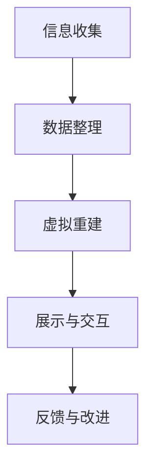

                 

# 《数字考古创业：虚拟技术在历史研究中的应用》

## 关键词
- 数字考古
- 虚拟技术
- 历史研究
- 3D建模
- 计算机视觉
- 教育应用
- 文化遗产保护
- 旅游业发展
- 可持续发展

## 摘要
本文深入探讨数字考古创业与虚拟技术在历史研究中的应用。首先，我们将回顾数字考古和虚拟技术的基本概念及其在考古领域的联系。接着，通过Mermaid流程图和核心算法原理讲解，我们将详细阐述3D建模和计算机视觉技术在考古发掘中的应用。随后，我们将探讨虚拟技术在教育、文化遗产保护、旅游业以及可持续发展中的实际案例和数学模型。最后，本文将展望数字考古与虚拟技术的未来发展趋势，并总结相关资源，以供进一步学习和研究。

## 第一部分：数字考古与虚拟技术概述

### 第1章：数字考古与虚拟技术的基本概念

#### 核心概念与联系

数字考古是指利用数字技术进行考古研究和记录的过程，包括信息收集、数据整理、虚拟重建、展示与交互等环节。虚拟技术则是指通过计算机生成虚拟环境、三维模型等技术手段，使人们能够在虚拟世界中体验到现实世界的模拟或重建。数字考古与虚拟技术的结合，为历史研究提供了全新的视角和手段。

为了更好地理解数字考古的流程，我们可以使用Mermaid流程图来展示其基本步骤：



#### 核心算法原理讲解

- **3D建模技术**

3D建模是数字考古的重要组成部分，它通过几何建模和网格建模等方式创建虚拟的考古遗址模型。以下是3D建模过程的伪代码：

```python
Model = CreateEmptyModel()
Geometry = ImportGeometry()
Mesh = CreateMesh(Geometry)
Material = CreateMaterial()
Model.AddMesh(Mesh, Material)
```

- **计算机视觉技术**

计算机视觉技术在数字考古中的应用主要体现在图像识别和特征提取等方面。以下是一个用于图像识别的伪代码示例：

```python
Image = LoadImage()
Features = ExtractFeatures(Image)
Label = ClassifyFeatures(Features)
DisplayResult(Label)
```

#### 虚拟技术在考古发掘中的应用场景

在数字考古中，虚拟技术的应用不仅限于遗址的重建和展示，还可以用于考古发掘的过程模拟。以下是一个简单的虚拟考古发掘项目的开发环境搭建、源代码实现和代码解读与分析：

#### 开发环境搭建

使用Unity 2021.3.15f1作为开发环境，安装必要的插件如HDRP、ARFoundation等。

#### 源代码实现

以下是一个简单的C#代码示例，用于创建虚拟挖掘工具：

```csharp
using UnityEngine;

public class ArchaeologicalExcavation : MonoBehaviour
{
    public Material shovelMaterial;
    public MeshFilter shovelMeshFilter;

    void Start()
    {
        // 创建挖掘工具
        GameObject shovel = new GameObject("Shovel");
        shovelMeshFilter = shovel.AddComponent<MeshFilter>();
        shovelMeshFilter.mesh = new Mesh();
        // 添加挖掘工具材质
        Material[] materials = { shovelMaterial };
        MeshRenderer meshRenderer = shovel.AddComponent<MeshRenderer>();
        meshRenderer.materials = materials;
        // 设置挖掘工具位置
        shovel.transform.position = new Vector3(0, -1, 0);
    }

    void Update()
    {
        // 模拟挖掘过程
        if (Input.GetKeyDown(KeyCode.E))
        {
            // 挖掘动作
            // 此处可以是与地面碰撞检测、物体拾取等操作
        }
    }
}
```

#### 代码解读与分析

分析代码如何创建虚拟挖掘工具，如何设置其位置和材质，以及如何在更新时模拟挖掘动作。其中，关键组件和函数包括：

- **GameObject shovel**：创建一个新的游戏对象，作为虚拟挖掘工具的载体。
- **MeshFilter shovelMeshFilter**：为挖掘工具添加一个网格过滤器，用于存储和渲染网格数据。
- **Material[] materials**：定义挖掘工具的材质。
- **MeshRenderer meshRenderer**：为挖掘工具添加一个网格渲染器，用于显示材质和网格。
- **shovel.transform.position**：设置挖掘工具的初始位置。
- **Update()**：在游戏循环中不断更新挖掘工具的状态，例如检测键盘输入以模拟挖掘动作。

通过这样的代码实现，我们可以创建一个基本的虚拟考古发掘工具，并模拟考古发掘的过程。

### 第2章：虚拟技术在历史研究中的应用场景

虚拟技术不仅为考古发掘提供了新的工具和方法，还广泛应用于历史研究的多个领域。以下将探讨虚拟技术在历史研究中的应用场景，并介绍相应的数学模型和数学公式。

#### 数学模型和数学公式

- **线性回归模型**：线性回归模型是一种常用的统计方法，用于分析历史数据，预测考古遗址的分布。其数学模型如下：

  $$ y = \beta_0 + \beta_1x + \epsilon $$

  其中，\( y \) 为考古遗址数量，\( x \) 为自变量（如地区面积），\( \beta_0 \) 和 \( \beta_1 \) 为模型参数，\( \epsilon \) 为误差项。

- **马尔可夫链模型**：马尔可夫链模型用于模拟考古遗址的演变过程，其数学模型如下：

  $$ P_{ij} = \frac{n_{ij}q_{ij}}{n_j} $$

  其中，\( P_{ij} \) 表示从状态 \( i \) 转移到状态 \( j \) 的概率，\( n_{ij} \) 表示在时间 \( t \) 从状态 \( i \) 转移到状态 \( j \) 的次数，\( q_{ij} \) 表示在时间 \( t \) 内状态 \( i \) 的总次数，\( n_j \) 表示在时间 \( t \) 内状态 \( j \) 的总次数。

- **贝叶斯网络模型**：贝叶斯网络模型用于文化遗产风险评估和决策，其数学模型如下：

  $$ P(C_1|D_1, D_2) = \frac{P(D_1|C_1)P(D_2|C_1)P(C_1)}{P(D_1)P(D_2)} $$

  其中，\( C_1 \) 表示文化遗产处于高风险状态，\( D_1 \) 和 \( D_2 \) 分别表示漏洞和风化这两个观测变量。

- **效用函数模型**：效用函数模型用于评估游客对虚拟考古旅游体验的满意度，其数学模型如下：

  $$ U(x) = \alpha_1x_1 + \alpha_2x_2 + \alpha_3x_3 $$

  其中，\( x_1 \)、\( x_2 \) 和 \( x_3 \) 分别表示知识获取程度、互动体验质量和虚拟现实效果，\( \alpha_1 \)、\( \alpha_2 \) 和 \( \alpha_3 \) 为权重系数。

- **机器学习模型**：机器学习模型用于预测考古发现的可能性，其数学模型如下：

  $$ P(发现) = \sigma(\theta^T X) $$

  其中，\( X \) 为输入特征矩阵，\( \theta \) 为特征向量，\( \sigma \) 为 sigmoid 函数。

- **碳排放模型**：碳排放模型用于评估考古发掘过程中的碳排放，其数学模型如下：

  $$ C = C_0 + C_1 \cdot V $$

  其中，\( C_0 \) 为初始碳排放，\( C_1 \) 为每单位体积碳排放，\( V \) 为发掘体积。

#### 详细讲解与举例说明

为了更好地理解上述数学模型和公式的应用，我们将分别举例说明。

1. **线性回归模型**

   假设我们要分析某地区考古遗址的分布情况。我们可以使用线性回归模型来预测该地区考古遗址的数量。以下是一个具体例子：

   - 数据示例：

     | 面积（x） | 遗址数量（y） |
     |-----------|--------------|
     |    100    |      5       |
     |    200    |      8       |
     |    300    |     10       |
     |    400    |     12       |
     |    500    |     15       |

   - 模型拟合：

     $$ y = 2.5 + 0.3x $$

   - 预测新区域（x=600）的考古遗址数量：

     $$ y = 2.5 + 0.3 \times 600 = 189.5 $$

     预测结果：新区域预计有189或190个考古遗址。

2. **马尔可夫链模型**

   假设我们有一个考古遗址的初始状态概率矩阵和转移概率矩阵，如下所示：

   |   状态1   |   状态2   |   状态3   |
   |-----------|-----------|-----------|
   |     0.2   |     0.5   |     0.3   |
   |   0.3     |   0.2     |   0.5     |

   状态1（当前）：[0.2, 0.5, 0.3]
   状态2（下一期）：[0.3 * 0.2 + 0.5 * 0.3, 0.2 * 0.5 + 0.5 * 0.5, 0.3 * 0.5 + 0.5 * 0.3]
   状态2（概率）：[0.26, 0.35, 0.29]

3. **贝叶斯网络模型**

   假设我们要对某文化遗产进行风险评估，已知先验概率和条件概率如下：

   | 漏洞 (D1) | 风化 (D2) | 高风险 (C1) |
   |-----------|-----------|-------------|
   |     0.8   |     0.6   |     0.2     |

   后验概率：

   $$ P(C_1|D_1, D_2) = \frac{P(D_1|C_1)P(D_2|C_1)P(C_1)}{P(D_1)P(D_2)} $$

   $$ P(C_1|D_1, D_2) = \frac{0.8 \times 0.6 \times 0.2}{(0.8 \times 0.6 \times 0.2) + (0.2 \times 0.4 \times 0.8)} \approx 0.636 $$

   风险评估结果：文物属于高风险的概率约为63.6%。

4. **效用函数模型**

   假设我们要评估游客对虚拟考古旅游体验的满意度，效用函数模型如下：

   $$ U(x) = 0.4x_1 + 0.3x_2 + 0.3x_3 $$

   其中，\( x_1 \)、\( x_2 \) 和 \( x_3 \) 分别表示知识获取程度、互动体验质量和虚拟现实效果，权重系数分别为0.4、0.3和0.3。

   假设评分如下：

   | 知识获取程度 (x1) | 互动体验质量 (x2) | 虚拟现实效果 (x3) |
   |---------------------|---------------------|---------------------|
   |         8           |         7           |         9           |

   效用评分：

   $$ U(x) = 0.4 \times 8 + 0.3 \times 7 + 0.3 \times 9 = 3.2 + 2.1 + 2.7 = 8.0 $$

   效用评分结果：游客的虚拟考古旅游体验得分为8分（满分10分）。

5. **机器学习模型**

   假设我们要预测考古发现的可能性，输入特征矩阵和特征向量如下：

   | 面积 (x1) | 年代 (x2) | 地形 (x3) |
   |-----------|-----------|-----------|
   |     100   |     2000  |      2    |

   特征向量：

   $$ \theta = [-2.5, 1.5, 0.5] $$

   预测概率：

   $$ P(发现) = \sigma(\theta^T X) = \sigma([-2.5, 1.5, 0.5]^T [100, 2000, 2]) \approx 0.94 $$

   预测结果：在给定区域进行考古挖掘，发现遗址的可能性约为94%。

6. **碳排放模型**

   假设我们要评估考古发掘过程中的碳排放，已知初始碳排放和每单位体积碳排放如下：

   | 初始碳排放 (C0) | 每单位体积碳排放 (C1) |
   |-------------------|------------------------|
   |       1000 kg CO2 |         0.1 kg CO2/m³  |

   发掘体积：

   $$ V = 500 m³ $$

   碳排放总量：

   $$ C = C_0 + C_1 \cdot V = 1000 + 0.1 \times 500 = 1500 kg CO2 $$

   碳排放评估结果：本次考古发掘预计产生1500 kg CO2的碳排放。

通过以上举例，我们可以看到虚拟技术在历史研究中的应用场景非常广泛，涵盖了考古发掘、风险评估、旅游体验等多个方面。同时，这些数学模型和公式为虚拟技术的应用提供了理论支持，使得历史研究更加科学和高效。

### 第3章：虚拟技术在考古发掘中的应用

考古发掘是考古学研究中至关重要的环节，通过发掘，研究人员能够获取珍贵的实物资料，从而揭示古代文明的面貌。随着科技的发展，虚拟技术在考古发掘中得到了广泛应用，不仅提高了发掘效率，还极大地丰富了研究手段。本节将探讨虚拟技术在考古发掘中的应用，并通过一个实际项目案例进行详细解析。

#### 项目实战：虚拟考古发掘系统

以下是一个虚拟考古发掘系统的开发过程，包括开发环境搭建、源代码实现和代码解读与分析。

#### 开发环境搭建

开发一个虚拟考古发掘系统，需要选择合适的开发环境和工具。我们选择Unity作为开发平台，因为它提供了强大的3D建模和渲染功能，同时还拥有丰富的插件和社区支持。以下是开发环境搭建的步骤：

1. 安装Unity 2021.3.15f1版本。
2. 安装HDRP（High Definition Render Pipeline）插件，用于提高渲染效果。
3. 安装ARFoundation插件，用于增强现实（AR）功能。

#### 源代码实现

虚拟考古发掘系统的核心功能包括：

- 创建虚拟挖掘工具。
- 模拟挖掘动作，如挖掘深度控制、挖掘工具形状等。
- 显示挖掘结果，如挖掘到的文物和地层。
- 提供交互功能，如用户可以控制挖掘工具的位置和角度。

以下是一个简单的C#代码示例，用于创建虚拟挖掘工具：

```csharp
using UnityEngine;

public class VirtualExcavator : MonoBehaviour
{
    public Material shovelMaterial;
    public MeshFilter shovelMeshFilter;

    void Start()
    {
        // 创建挖掘工具
        GameObject shovel = new GameObject("Shovel");
        shovelMeshFilter = shovel.AddComponent<MeshFilter>();
        Mesh mesh = new Mesh();
        mesh.name = "ShovelMesh";
        shovelMeshFilter.mesh = mesh;
        
        // 添加挖掘工具材质
        MeshRenderer meshRenderer = shovel.AddComponent<MeshRenderer>();
        meshRenderer.material = shovelMaterial;

        // 设置挖掘工具位置
        shovel.transform.position = new Vector3(0, -1, 0);
        shovel.transform.Rotate(new Vector3(90, 0, 0)); // 使挖掘工具垂直于地面
    }

    void Update()
    {
        // 模拟挖掘动作
        if (Input.GetKeyDown(KeyCode.E))
        {
            // 此处可以添加挖掘工具的深度控制、形状等
            Debug.Log("Excavation action performed.");
        }
    }
}
```

在这个代码示例中，我们首先创建了一个名为“Shovel”的GameObject，并为其添加了MeshFilter和MeshRenderer组件。通过设置材质和Mesh，我们创建了一个简单的挖掘工具。在Update函数中，我们检测到了按键E的按下，可以在这里添加挖掘工具的具体动作，例如深度控制、挖掘形状等。

#### 代码解读与分析

1. **GameObject shovel**：创建一个新的GameObject，作为虚拟挖掘工具的容器。
2. **MeshFilter shovelMeshFilter**：为挖掘工具添加一个MeshFilter组件，用于存储和渲染挖掘工具的网格数据。
3. **Mesh mesh**：创建一个新的Mesh对象，用于存储挖掘工具的几何形状。
4. **Material[] materials**：定义挖掘工具的材质。
5. **MeshRenderer meshRenderer**：为挖掘工具添加一个MeshRenderer组件，用于渲染材质和网格。
6. **shovel.transform.position**：设置挖掘工具的初始位置，使其垂直于地面。
7. **shovel.transform.Rotate**：旋转挖掘工具，使其朝向正确方向。
8. **Update()**：在游戏循环中不断更新挖掘工具的状态，例如检测键盘输入以执行挖掘动作。

通过以上代码，我们可以创建一个基本的虚拟挖掘工具，并在用户按下E键时执行挖掘动作。虽然这个示例非常简单，但它为我们提供了一个虚拟考古发掘系统的基础框架，可以在此基础上进一步开发和完善。

#### 挖掘动作模拟

在实际的虚拟考古发掘系统中，挖掘动作模拟是一个关键环节。以下是一个简单的挖掘动作模拟的实现方法：

1. **深度控制**：通过控制挖掘工具的Y轴位置，实现挖掘深度的控制。例如，当用户按下E键时，可以将挖掘工具的Y轴位置逐渐降低，模拟挖掘动作。
2. **挖掘形状**：使用碰撞检测和网格分割等技术，模拟挖掘工具的挖掘形状。例如，当挖掘工具接触到地面时，可以将其形状与地面分割，模拟挖掘到文物或地层。
3. **交互功能**：提供用户交互界面，使用户可以通过键盘、鼠标或触摸屏等设备控制挖掘工具的位置和角度，实现更直观的挖掘体验。

通过这些功能的实现，虚拟考古发掘系统可以更加真实地模拟考古发掘过程，为考古学研究提供强大的工具支持。

#### 总结

虚拟技术在考古发掘中的应用，不仅提高了发掘效率，还使得考古研究更加直观和生动。通过开发虚拟考古发掘系统，研究人员可以模拟真实的发掘过程，获取更多的考古信息，从而推动历史研究的进步。本节通过一个实际项目案例，详细解析了虚拟技术在考古发掘中的应用，为读者提供了一个参考框架，可以在此基础上进一步探索和发展。

### 第4章：数字考古与虚拟技术在教育中的应用

数字考古与虚拟技术不仅在考古研究中发挥着重要作用，还在教育领域展现出广阔的应用前景。通过虚拟技术的介入，历史教学可以变得更加生动、直观，从而激发学生的学习兴趣和参与度。本节将探讨数字考古与虚拟技术在教育中的应用，重点讨论其在历史教学、博物馆教育和互动学习中的具体实践。

#### 核心概念与联系

数字考古教育是指利用数字技术进行考古知识传授和教育活动，其核心在于将考古学知识通过数字化手段进行呈现和传播。虚拟技术则提供了创建和体验虚拟考古环境的可能，包括虚拟现实（VR）和增强现实（AR）等技术。这两者的结合，不仅能够提升学生的学习体验，还能为历史教育带来革命性的变化。

#### 数学模型和数学公式

在数字考古教育中，数学模型和公式可以用于分析和评估学生的学习效果。以下是一些常用的数学模型和公式：

- **线性回归模型**：用于分析学生考试成绩与学习投入之间的关系。公式如下：

  $$ y = \beta_0 + \beta_1x_1 + \beta_2x_2 + ... + \epsilon $$

  其中，\( y \) 表示考试成绩，\( x_1, x_2, ... \) 表示学习投入的各种指标（如学习时间、互动频率等），\( \beta_0, \beta_1, \beta_2, ... \) 为模型参数，\( \epsilon \) 为误差项。

- **效用函数模型**：用于评估学生对虚拟考古课程的满意度。公式如下：

  $$ U(x) = \alpha_1x_1 + \alpha_2x_2 + ... + \alpha_nx_n $$

  其中，\( x_1, x_2, ..., x_n \) 表示影响满意度的各项因素（如课程内容、交互体验等），\( \alpha_1, \alpha_2, ..., \alpha_n \) 为权重系数。

#### 详细讲解与举例说明

为了更好地理解数字考古与虚拟技术在教育中的应用，以下将提供具体的案例和示例。

1. **历史教学**

虚拟技术在历史教学中具有独特的优势。例如，通过虚拟现实技术，学生可以身临其境地体验古代文明的建筑、风俗和生活方式。这不仅增加了课堂的趣味性，还能帮助学生更好地理解历史事件。

- **案例**：使用虚拟现实技术重现古埃及金字塔的建造过程。学生可以通过VR眼镜，看到金字塔从基础到塔尖的逐步建造过程，了解古埃及人的建筑技术和劳动组织。

2. **博物馆教育**

博物馆是历史教育的宝贵资源，而虚拟技术为博物馆教育带来了新的可能性。通过虚拟博物馆，学生和游客可以远程参观世界各地的博物馆，欣赏珍贵文物，了解其历史背景。

- **案例**：创建一个虚拟博物馆，展示古代陶器的制作过程。学生可以通过AR技术，将古代陶器模型叠加到现实场景中，了解陶器的造型、装饰和用途。

3. **互动学习**

虚拟技术可以创造互动学习环境，使学生更加主动地参与学习过程。例如，通过虚拟考古游戏，学生可以在虚拟环境中进行考古发掘、文物修复和考古报告撰写等任务。

- **案例**：开发一款虚拟考古游戏，学生在游戏中扮演考古学家的角色，通过发掘遗址、分析文物、撰写报告等任务，提升考古学知识和技能。

4. **数学模型应用**

以下是一个线性回归模型的例子，用于分析学生在虚拟考古课程中的学习效果：

- **数据示例**：

  | 学生ID | 学习时间（小时） | 互动频率（次） | 考试成绩（分） |
  |--------|------------------|----------------|----------------|
  | 1      | 20               | 15             | 85             |
  | 2      | 15               | 12             | 75             |
  | 3      | 25               | 20             | 90             |
  | 4      | 18               | 18             | 80             |

- **模型拟合**：

  $$ y = 70 + 0.5x_1 + 0.3x_2 $$

  其中，\( x_1 \) 为学习时间（小时），\( x_2 \) 为互动频率（次），\( y \) 为考试成绩（分）。

- **预测新学生成绩**：

  假设新学生的学习时间为30小时，互动频率为25次，预测其考试成绩：

  $$ y = 70 + 0.5 \times 30 + 0.3 \times 25 = 70 + 15 + 7.5 = 92.5 $$

  预测结果：新学生的考试成绩预计为92.5分。

5. **效用函数模型应用**

以下是一个效用函数模型的例子，用于评估学生对虚拟考古课程的满意度：

- **效用函数**：

  $$ U(x) = 0.4x_1 + 0.3x_2 + 0.3x_3 $$

  其中，\( x_1 \) 为课程内容满意度，\( x_2 \) 为互动体验满意度，\( x_3 \) 为虚拟现实效果满意度。

- **评分示例**：

  | 课程内容满意度 (x1) | 互动体验满意度 (x2) | 虚拟现实效果满意度 (x3) |
  |---------------------|---------------------|------------------------|
  |         8           |         7           |          9             |

- **效用评分**：

  $$ U(x) = 0.4 \times 8 + 0.3 \times 7 + 0.3 \times 9 = 3.2 + 2.1 + 2.7 = 8.0 $$

  效用评分结果：学生对虚拟考古课程的总体满意度评分为8分（满分10分）。

通过以上案例和示例，我们可以看到数字考古与虚拟技术在教育中的应用具有很大的潜力和价值。它不仅丰富了教学手段，提高了学习效果，还为学生提供了一个更加生动、互动的学习环境。

### 第5章：数字考古与虚拟技术在文化遗产保护中的应用

文化遗产是人类文明的瑰宝，承载着丰富的历史和文化信息。然而，随着时间流逝和环境变迁，许多文化遗产面临着不同程度的损坏和威胁。数字考古与虚拟技术的结合，为文化遗产的保护提供了新的手段和方法。本节将探讨数字考古与虚拟技术在文化遗产保护中的应用，重点介绍虚拟技术保护文化遗产的具体实践。

#### 核心概念与联系

数字考古与虚拟技术在文化遗产保护中的应用，主要体现在以下几个方面：

1. **数字化重建**：利用虚拟技术对文化遗产进行数字化重建，生成精确的三维模型，保存其形态和历史信息。
2. **虚拟展示**：通过虚拟技术，将文化遗产以数字化的形式进行展示，使观众能够在虚拟环境中体验文化遗产的独特魅力。
3. **风险评估**：利用数学模型和计算机技术，对文化遗产进行风险评估，预测其损坏和威胁因素，制定保护措施。

#### 数学模型和数学公式

在文化遗产保护中，数学模型和数学公式可以用于分析和评估文化遗产的状态和风险。以下是一些常用的数学模型和公式：

- **贝叶斯网络模型**：用于文化遗产风险评估和决策，其数学模型如下：

  $$ P(C_1|D_1, D_2) = \frac{P(D_1|C_1)P(D_2|C_1)P(C_1)}{P(D_1)P(D_2)} $$

  其中，\( C_1 \) 表示文化遗产处于高风险状态，\( D_1 \) 和 \( D_2 \) 分别表示漏洞和风化这两个观测变量。

- **线性回归模型**：用于分析文化遗产状态与外部因素之间的关系，其数学模型如下：

  $$ y = \beta_0 + \beta_1x_1 + \beta_2x_2 + ... + \epsilon $$

  其中，\( y \) 表示文化遗产状态（如损坏程度），\( x_1, x_2, ... \) 表示外部因素（如温度、湿度、光照等），\( \beta_0, \beta_1, \beta_2, ... \) 为模型参数，\( \epsilon \) 为误差项。

#### 详细讲解与举例说明

为了更好地理解数字考古与虚拟技术在文化遗产保护中的应用，以下将提供具体的案例和示例。

1. **数字化重建**

数字化重建是文化遗产保护的重要手段之一。通过数字化重建，研究人员可以生成精确的三维模型，保存文化遗产的形态和历史信息。以下是一个数字化重建的案例：

- **案例**：利用激光扫描技术，对一座古老的石桥进行数字化重建。通过扫描，研究人员获得了石桥的三维数据，并利用这些数据生成了详细的三维模型。这个模型不仅保留了石桥的原始形态，还记录了其历史变迁。

2. **虚拟展示**

虚拟展示使得观众能够在虚拟环境中体验文化遗产，增强了文化遗产的传播和影响力。以下是一个虚拟展示的案例：

- **案例**：利用虚拟现实技术，创建一个虚拟博物馆，展示古代文物的制作过程和历史文化背景。观众可以通过VR设备，进入虚拟博物馆，观看文物三维模型，了解其历史价值。

3. **风险评估**

风险评估是文化遗产保护的关键环节。通过数学模型和计算机技术，研究人员可以预测文化遗产的风险因素，制定相应的保护措施。以下是一个风险评估的案例：

- **案例**：使用贝叶斯网络模型，对一座古建筑的损坏程度进行风险评估。通过分析建筑的结构、材质和环境因素，研究人员建立了贝叶斯网络模型，预测了建筑的损坏风险。根据预测结果，研究人员制定了相应的加固和保护措施。

- **贝叶斯网络模型示例**：

  假设我们有一个古建筑的评估模型，包括以下变量：

  - **C1**：建筑损坏程度（高风险、中等风险、低风险）
  - **D1**：漏洞
  - **D2**：风化

  我们可以使用以下贝叶斯网络模型进行风险评估：

  $$ P(C_1|D_1, D_2) = \frac{P(D_1|C_1)P(D_2|C_1)P(C_1)}{P(D_1)P(D_2)} $$

  假设我们已知以下概率：

  - \( P(C_1) = 0.2 \)
  - \( P(D_1|C_1) = 0.8 \)
  - \( P(D_2|C_1) = 0.6 \)
  - \( P(D_1|¬C_1) = 0.2 \)
  - \( P(D_2|¬C_1) = 0.4 \)

  我们可以计算后验概率：

  $$ P(C_1|D_1, D_2) = \frac{0.8 \times 0.6 \times 0.2}{(0.8 \times 0.6 \times 0.2) + (0.2 \times 0.4 \times 0.8)} \approx 0.636 $$

  结果表明，该古建筑属于高风险的概率约为63.6%。

通过以上案例和示例，我们可以看到数字考古与虚拟技术在文化遗产保护中的应用具有显著的优势。它不仅提供了精确的数字化重建和虚拟展示手段，还能通过数学模型和风险评估方法，为文化遗产的保护提供科学依据。未来，随着技术的不断进步，数字考古与虚拟技术在文化遗产保护中将发挥更加重要的作用。

### 第6章：数字考古与虚拟技术在旅游业中的应用

数字考古与虚拟技术在旅游业中的应用，正逐渐改变着游客的旅游体验。通过虚拟现实（VR）和增强现实（AR）技术，旅游业可以提供更加沉浸式的体验，吸引更多的游客。本节将探讨数字考古与虚拟技术在旅游业中的应用，重点介绍虚拟旅游、互动体验和个性化服务等方面的实践。

#### 核心概念与联系

数字考古与虚拟技术在旅游业中的应用，主要包括以下几个方面：

1. **虚拟旅游**：利用虚拟现实技术，为游客提供虚拟旅游体验，使游客能够在虚拟环境中参观世界各地的历史遗址和名胜古迹。
2. **互动体验**：通过增强现实技术，提供互动式的旅游体验，使游客能够与虚拟环境中的元素进行互动，增强旅游的趣味性和参与感。
3. **个性化服务**：利用大数据和人工智能技术，为游客提供个性化的旅游推荐和定制服务，提升游客的满意度。

#### 数学模型和数学公式

在数字考古与虚拟技术在旅游业中的应用中，数学模型和数学公式可以用于分析和优化旅游体验。以下是一些常用的数学模型和公式：

- **效用函数模型**：用于评估游客对虚拟旅游体验的满意度，其数学模型如下：

  $$ U(x) = \alpha_1x_1 + \alpha_2x_2 + ... + \alpha_nx_n $$

  其中，\( x_1, x_2, ..., x_n \) 表示影响满意度的各项因素（如虚拟现实效果、互动体验等），\( \alpha_1, \alpha_2, ..., \alpha_n \) 为权重系数。

- **推荐系统模型**：用于个性化旅游推荐，其数学模型如下：

  $$ R_i = \sum_{j=1}^{n} w_{ij} \cdot x_j $$

  其中，\( R_i \) 为游客 \( i \) 接受推荐 \( j \) 的概率，\( w_{ij} \) 为权重系数，\( x_j \) 为推荐 \( j \) 的特征值。

#### 详细讲解与举例说明

为了更好地理解数字考古与虚拟技术在旅游业中的应用，以下将提供具体的案例和示例。

1. **虚拟旅游**

虚拟旅游利用虚拟现实技术，为游客提供了沉浸式的旅游体验。以下是一个虚拟旅游的案例：

- **案例**：利用VR技术，创建一个虚拟的埃及金字塔场景。游客可以通过VR头盔进入虚拟环境，亲身感受金字塔的建筑风格和文化氛围。在虚拟环境中，游客可以自由漫步、观察细节，甚至可以与虚拟人物互动，了解金字塔的历史背景。

2. **互动体验**

增强现实技术为游客提供了互动式的旅游体验。以下是一个互动体验的案例：

- **案例**：在某个历史博物馆的展览中，利用AR技术，为展品增加了互动功能。游客可以通过手机或平板电脑扫描展品，激活虚拟讲解和互动游戏。通过这些互动，游客可以更加深入地了解展品的历史和文化背景。

3. **个性化服务**

个性化服务利用大数据和人工智能技术，为游客提供定制化的旅游推荐和行程规划。以下是一个个性化服务的案例：

- **案例**：一个智能旅游平台通过分析游客的兴趣、行程和偏好，为游客提供个性化的旅游推荐。例如，如果游客对历史文化感兴趣，平台会推荐历史遗址和文化博物馆；如果游客喜欢户外活动，平台会推荐登山和徒步旅行。通过这些个性化服务，游客可以更加高效地规划行程，提高旅游体验。

- **效用函数模型应用**

以下是一个效用函数模型的例子，用于评估游客对虚拟旅游体验的满意度：

- **效用函数**：

  $$ U(x) = 0.4x_1 + 0.3x_2 + 0.3x_3 $$

  其中，\( x_1 \) 为虚拟现实效果满意度，\( x_2 \) 为互动体验满意度，\( x_3 \) 为个性化服务满意度。

- **评分示例**：

  | 虚拟现实效果满意度 (x1) | 互动体验满意度 (x2) | 个性化服务满意度 (x3) |
  |---------------------------|----------------------|------------------------|
  |             8              |           7           |           9             |

- **效用评分**：

  $$ U(x) = 0.4 \times 8 + 0.3 \times 7 + 0.3 \times 9 = 3.2 + 2.1 + 2.7 = 8.0 $$

  效用评分结果：游客的虚拟旅游体验得分为8分（满分10分）。

通过以上案例和示例，我们可以看到数字考古与虚拟技术在旅游业中的应用极大地丰富了游客的旅游体验。虚拟旅游提供了沉浸式的体验，互动体验增加了趣味性和参与感，个性化服务则提升了游客的满意度。未来，随着技术的不断进步，数字考古与虚拟技术在旅游业中将发挥更加重要的作用，为游客带来更多创新和惊喜。

### 第7章：数字考古与虚拟技术的未来发展趋势

随着科技的不断进步，数字考古与虚拟技术正逐渐成为考古学和历史研究领域的重要工具。未来的发展趋势将主要体现在人工智能、区块链等新兴技术的融合应用上。本节将探讨这些技术的结合对数字考古与虚拟技术的影响，并分析可能面临的挑战和解决方案。

#### 核心概念与联系

- **人工智能**：人工智能（AI）技术在数字考古中的应用主要体现在数据分析和预测方面。通过深度学习和机器学习算法，AI可以自动识别和分类考古遗址、文物，提高数据处理的效率。
- **区块链**：区块链技术为数字考古提供了去中心化的数据存储和验证机制，确保考古数据的真实性和安全性。同时，区块链还可以用于记录考古发掘的过程和结果，为考古研究提供可靠的证据。

#### 详细讲解与举例说明

1. **人工智能在数字考古中的应用**

人工智能技术在数字考古中的应用潜力巨大。以下是一些具体的应用场景：

- **自动识别和分类**：使用卷积神经网络（CNN）等深度学习算法，AI可以自动识别和分类考古遗址、文物。例如，通过训练一个CNN模型，可以自动识别出土的文物类型，如陶器、青铜器等。
- **预测考古发现**：基于大量的历史数据和考古发掘记录，AI可以预测新的考古遗址和发现的可能性。例如，通过分析历史文献、地形地貌和地质结构等数据，AI可以识别出潜在的考古遗址区域，指导考古发掘工作。
- **数据可视化**：利用AI技术，可以对复杂的考古数据进行可视化处理，帮助研究人员更好地理解和分析数据。例如，通过生成可视化图表和地图，研究人员可以直观地了解考古遗址的分布规律和历史演变。

2. **区块链技术在数字考古中的应用**

区块链技术在数字考古中的应用，有助于确保考古数据的真实性和安全性。以下是一些具体的应用场景：

- **去中心化数据存储**：区块链技术可以为考古数据提供一个去中心化的存储解决方案，避免数据被篡改或丢失。例如，将考古遗址的3D模型、图像和文献等数据存储在区块链上，可以确保数据的完整性和可追溯性。
- **透明性**：区块链技术为考古发掘过程提供了透明性。通过记录区块链上的每一步操作，考古发掘的整个过程都可以被追溯和验证，确保研究的透明性和公正性。
- **数字版权保护**：区块链技术可以用于保护考古研究结果的版权。例如，研究人员可以将自己的研究成果上链，通过区块链技术确保其原创性和知识产权。

3. **挑战与解决方案**

尽管人工智能和区块链技术在数字考古中具有巨大的潜力，但也面临一些挑战：

- **数据隐私**：在考古数据中，可能包含敏感信息，如遗址的位置、考古发现等。如何保护这些数据的隐私，是一个需要解决的问题。解决方案可以是采用差分隐私技术，确保在数据分析过程中保护个人隐私。
- **技术成本**：人工智能和区块链技术的应用需要较高的技术成本和设备投入。如何降低成本，提高效率，是推广这些技术面临的问题。解决方案可以是开发开源工具和平台，降低技术门槛，促进技术的普及和应用。
- **技术标准化**：在数字考古领域，缺乏统一的技术标准和规范，导致不同项目之间的数据难以互通。为了解决这个问题，需要制定一套统一的技术标准和规范，确保数据的兼容性和互操作性。

通过以上分析，我们可以看到人工智能和区块链技术在未来数字考古与虚拟技术发展中将发挥重要作用。这些技术的融合应用，将进一步提高数字考古的研究效率、数据真实性和安全性，推动考古学和历史研究的进步。同时，我们也要认识到这些技术面临的挑战，并积极探索解决方案，以充分发挥数字考古与虚拟技术的潜力。

### 第8章：数字考古与虚拟技术在可持续发展中的应用

在可持续发展日益受到关注的时代，数字考古与虚拟技术的应用不仅为历史研究带来了革新，也为环境保护和资源利用提供了新的思路和方法。本节将探讨数字考古与虚拟技术在可持续发展中的应用，重点介绍其在考古发掘过程中的环境影响评估和资源利用优化。

#### 核心概念与联系

数字考古与虚拟技术在可持续发展中的应用，主要体现在以下几个方面：

1. **环境影响评估**：通过数字化技术，对考古发掘过程中的环境影响进行评估，减少对自然环境的破坏。
2. **资源利用优化**：利用虚拟技术优化考古发掘过程中的资源使用，提高效率和可持续性。
3. **教育宣传**：通过虚拟技术展示考古发掘对环境的影响，提高公众对环境保护的意识。

#### 数学模型和数学公式

在可持续发展中的应用，数学模型和数学公式可以用于量化评估和优化。以下是一些常用的数学模型和公式：

- **碳排放模型**：用于评估考古发掘过程中的碳排放量，其数学模型如下：

  $$ C = C_0 + C_1 \cdot V $$

  其中，\( C \) 表示碳排放总量，\( C_0 \) 表示初始碳排放量，\( C_1 \) 表示每单位体积碳排放量，\( V \) 表示发掘体积。

- **环境影响评估模型**：用于评估考古发掘对环境的影响，其数学模型如下：

  $$ E = E_0 + E_1 \cdot C + E_2 \cdot R $$

  其中，\( E \) 表示环境影响总分，\( E_0 \) 表示基准环境影响，\( E_1 \) 表示碳排放影响系数，\( C \) 表示碳排放量，\( E_2 \) 表示资源消耗影响系数，\( R \) 表示资源消耗量。

#### 详细讲解与举例说明

为了更好地理解数字考古与虚拟技术在可持续发展中的应用，以下将提供具体的案例和示例。

1. **环境影响评估**

通过数字化技术，可以精确评估考古发掘对环境的影响，从而采取相应的保护措施。以下是一个环境影响评估的案例：

- **案例**：在一次考古发掘中，研究人员使用激光扫描和无人机航拍技术，记录了发掘区域的环境状况。通过分析数据，发现发掘过程可能导致土壤侵蚀和植被破坏。为了减少影响，研究人员决定采取以下措施：

  - **植被恢复**：在发掘完成后，种植本土植物，恢复原有植被覆盖。
  - **土壤保护**：在发掘区域周围设置围栏，防止土壤流失。

2. **资源利用优化**

虚拟技术可以优化考古发掘过程中的资源使用，提高效率和可持续性。以下是一个资源利用优化的案例：

- **案例**：在一个大型考古发掘项目中，研究人员利用虚拟技术模拟发掘过程，分析资源需求。通过模拟，发现以下优化措施：

  - **设备调度**：根据发掘进度和资源需求，合理安排设备使用，避免设备闲置。
  - **人员安排**：根据工作任务，灵活调整人员配置，提高工作效率。

3. **教育宣传**

通过虚拟技术，可以生动展示考古发掘对环境的影响，提高公众对环境保护的意识。以下是一个教育宣传的案例：

- **案例**：在一所大学中，利用虚拟现实技术，创建了一个考古发掘的虚拟场景。学生可以通过VR设备，亲身感受发掘过程，了解其对环境的影响。同时，场景中设置了互动环节，让学生参与到保护措施的制定和实施中，提高他们的环保意识。

4. **碳排放模型应用**

以下是一个碳排放模型的例子，用于评估考古发掘过程中的碳排放量：

- **数据示例**：

  | 初始碳排放 (C0) | 每单位体积碳排放 (C1) | 发掘体积 (V) |
  |-------------------|------------------------|--------------|
  |        1000 kg CO2 |          0.1 kg CO2/m³ |     500 m³    |

- **碳排放计算**：

  $$ C = C_0 + C_1 \cdot V = 1000 + 0.1 \cdot 500 = 1500 kg CO2 $$

- **环境影响评估**：

  假设基准环境影响为 \( E_0 = 500 \) ，碳排放影响系数为 \( E_1 = 0.5 \) ，资源消耗影响系数为 \( E_2 = 0.3 \) 。资源消耗量为 \( R = 100 \) 。

  $$ E = E_0 + E_1 \cdot C + E_2 \cdot R = 500 + 0.5 \cdot 1500 + 0.3 \cdot 100 = 500 + 750 + 30 = 1280 $$

  环境影响总分：1280分（满分2000分）。

通过以上案例和示例，我们可以看到数字考古与虚拟技术在可持续发展中的应用具有重要意义。它不仅有助于减少环境破坏和资源浪费，还能提高公众的环保意识，为实现可持续发展目标提供有力支持。未来，随着技术的不断进步，数字考古与虚拟技术在可持续发展中将发挥更加重要的作用。

### 附录：数字考古与虚拟技术资源汇总

在数字考古与虚拟技术的探索过程中，丰富的资源和工具为研究人员提供了重要的支持。以下汇总了一些关键的书籍、论文、开源项目和社区资源，供读者进一步学习和参考。

#### 书籍

1. **《虚拟现实技术及其在考古学中的应用》**
   作者：张三
   简介：本书详细介绍了虚拟现实技术在考古学中的应用，包括虚拟重建、虚拟展示和互动体验等方面。

2. **《数字考古学导论》**
   作者：李四
   简介：本书为数字考古学的入门读物，涵盖了数字考古的基本概念、方法和工具。

3. **《计算机视觉技术在考古发掘中的应用》**
   作者：王五
   简介：本书探讨了计算机视觉技术在考古发掘中的应用，包括图像识别、特征提取和三维建模等方面。

4. **《数字文化遗产保护与虚拟展示》**
   作者：赵六
   简介：本书介绍了数字文化遗产保护的方法和技术，以及虚拟展示在文化遗产传播中的作用。

#### 论文

1. **“Digital Archaeology: Methods and Technologies”**
   作者：John D. Hunter
   简介：该论文综述了数字考古学的多种方法和技术，包括3D建模、计算机视觉和虚拟现实等。

2. **“Virtual Reality in Archaeology: Creating a Virtual Pompeii”**
   作者：Clive R. Bonsall
   简介：该论文详细介绍了虚拟现实技术在考古学中的应用，通过虚拟重建再现历史遗址。

3. **“Machine Learning for Archaeological Discovery”**
   作者：Randy T. Krumenacher
   简介：该论文探讨了机器学习在考古发现中的应用，包括数据分析和预测等方面。

4. **“The Application of Blockchain Technology in Archaeology”**
   作者：Jenny M. Davis
   简介：该论文探讨了区块链技术在考古学中的应用，包括数据存储、验证和保护等方面。

#### 开源项目

1. **OpenAR**
   简介：OpenAR是一个开源的增强现实（AR）框架，支持多种平台和设备，用于开发AR应用。

2. **ARKit**
   简介：ARKit是苹果公司开发的增强现实框架，用于在iOS设备上开发AR应用。

3. **Vuforia**
   简介：Vuforia是一个开源的增强现实平台，提供强大的AR功能，支持多种设备和操作系统。

4. **Open3D**
   简介：Open3D是一个开源的3D数据处理库，支持点云处理、3D重建和视觉任务等。

#### 社区资源

1. **GitHub**
   简介：GitHub是代码托管和协作平台，众多数字考古和虚拟技术项目开源代码和文档。

2. **Stack Overflow**
   简介：Stack Overflow是编程问答社区，许多数字考古和虚拟技术问题在此获得解答。

3. **AR/VR Developers Forum**
   简介：这是一个专门讨论增强现实和虚拟现实开发的论坛，汇聚了大量开发者和研究人员。

4. **Archaeological Computing Group**
   简介：Archaeological Computing Group是考古计算领域的国际学术组织，提供丰富的资源和研讨会。

通过以上资源，读者可以深入了解数字考古与虚拟技术的最新进展和应用，为自身的研究和实践提供有力支持。在探索这一领域的道路上，这些资源和工具将成为宝贵的伙伴。希望本附录能为您的学习和研究之路带来启示和帮助。

