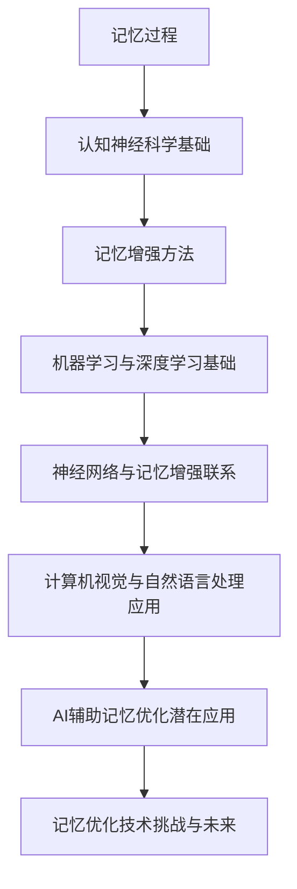
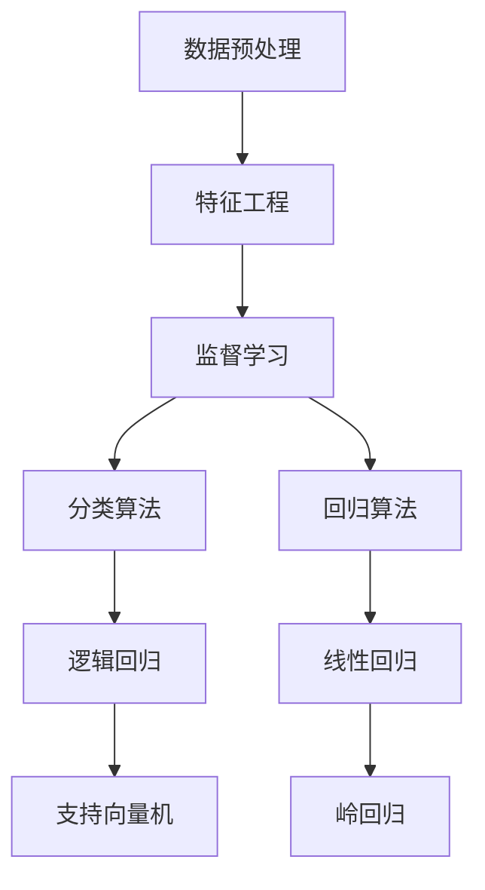
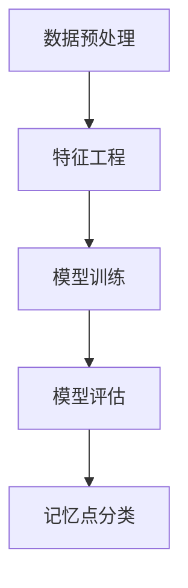
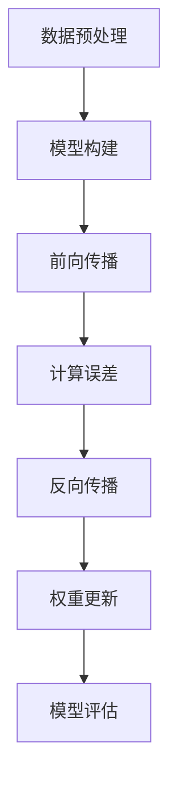
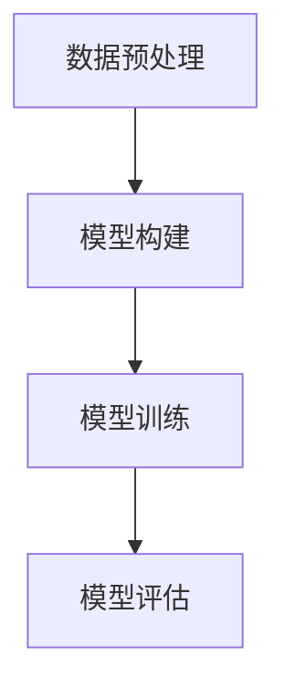
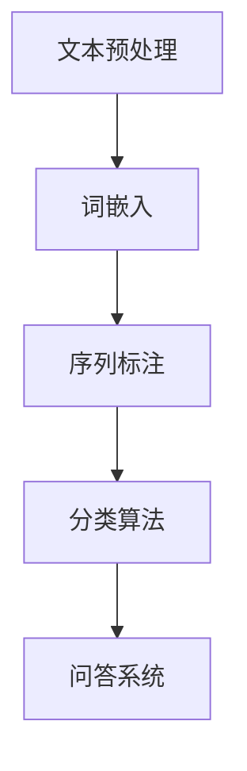
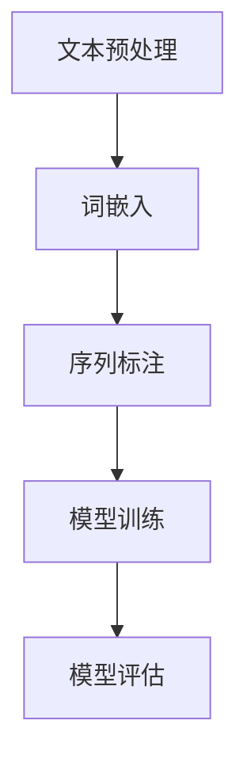
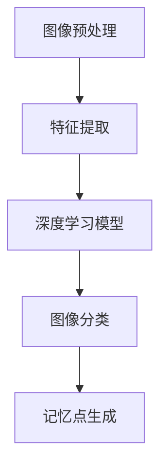
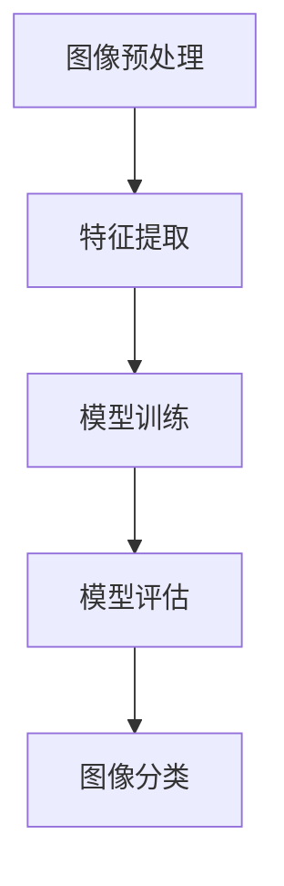
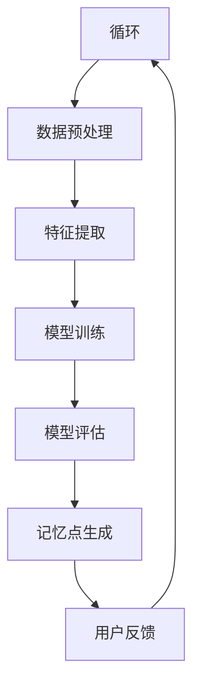

                 

### 第1章: 记忆增强技术概述

#### 1.1 记忆过程与认知神经科学基础

**记忆的定义与类型**

记忆是大脑对信息进行编码、存储和提取的能力，它是人类认知功能的核心组成部分。记忆可以分为多种类型，主要包括：

- **短期记忆**：也称为工作记忆，是我们在短时间内处理和保持信息的记忆形式。它通常只能保持几十秒到几分钟的信息，比如在打电话时记住电话号码。

- **长期记忆**：这是一种更持久的记忆形式，能够保持从几小时到一生的时间。长期记忆又可以分为两类：**程序记忆**（如何做某事，如骑自行车）和**情景记忆**（特定时间和地点发生的事件，如去年暑假的旅行）。

**认知神经科学基础**

认知神经科学是研究大脑如何处理信息和认知过程的学科。它关注神经元与神经网络的结构和功能，特别是突触可塑性和记忆存储与检索机制。

- **神经元与神经网络**：神经元是大脑的基本单元，通过突触连接形成神经网络。神经网络通过复杂的连接结构和信息传递，实现从简单的感知到复杂的认知功能。

- **突触可塑性**：突触可塑性是指神经元之间的连接强度可以发生变化，这种变化是记忆形成和存储的关键机制。研究表明，突触前增强和突触后增强是两种主要的突触可塑性形式。

- **记忆存储与检索机制**：记忆的存储涉及大脑中的多个区域，如海马体和前额叶皮层。记忆的检索则依赖于神经网络的重新激活和信息的再加工。

**人类记忆的局限性**

尽管人类具有强大的记忆能力，但记忆也存在一些局限性：

- **容量有限**：短期记忆容量有限，通常只能同时处理几个信息单元。长期记忆的容量虽然更大，但信息存储的持久性和准确性会受到干扰和遗忘的影响。

- **遗忘**：长期记忆中的信息可能会逐渐消失或衰退。遗忘是记忆存储和检索过程中的一个普遍现象。

- **干扰效应**：新信息与旧信息的混淆会影响记忆的准确性和可靠性。例如，学习新信息可能会干扰旧信息的回忆。

**当前记忆增强方法的局限性**

目前，已有多种记忆增强方法，如重复记忆、联想记忆、认知训练等。然而，这些方法存在以下局限性：

- **效率低**：传统的记忆增强方法需要大量时间和精力，记忆效果不显著。

- **易忘**：即使通过传统方法增强的记忆，也容易随着时间的推移而消失。

- **适用范围有限**：现有方法主要针对特定的记忆任务，如语言学习或数字记忆，难以适应更广泛的应用场景。

- **缺乏个性化**：大多数记忆增强方法缺乏对个体差异的关注，无法提供个性化的记忆支持。

**AI在记忆增强中的应用潜力**

随着人工智能技术的发展，特别是机器学习和深度学习的进步，AI在记忆增强中的应用潜力日益凸显。AI可以通过以下方式提高记忆效率：

- **个性化记忆策略**：通过分析用户行为和大脑活动数据，AI可以提供个性化的记忆建议，提高记忆效果。

- **高效信息处理**：AI可以快速处理和分析大量信息，帮助用户更好地组织和存储记忆。

- **自动化记忆训练**：通过智能算法和模型，AI可以自动化记忆训练过程，提高记忆效率。

- **跨领域应用**：AI可以结合不同领域的知识，如医学、教育、心理学等，开发出更全面的记忆增强解决方案。

#### 1.2 AI辅助记忆优化的核心概念

**机器学习与深度学习基础**

机器学习和深度学习是AI的核心技术，为记忆增强提供了强大的工具。

- **机器学习**：机器学习是指通过算法从数据中学习模式和规律，从而进行预测和决策。它包括监督学习、无监督学习和强化学习等。

  - **监督学习**：通过标注数据来训练模型，如分类和回归任务。
  - **无监督学习**：没有标注数据，通过发现数据中的结构和模式，如聚类和降维。
  - **强化学习**：通过与环境的交互，学习最优策略，如游戏和自动驾驶。

- **深度学习**：深度学习是机器学习的一个子领域，使用多层神经网络进行学习。它通过自动提取层次化的特征表示，能够处理复杂数据。

  - **神经网络结构**：包括输入层、隐藏层和输出层。隐藏层可以提取更高层次的特征。
  - **反向传播算法**：用于训练神经网络，通过计算误差梯度来更新网络权重。
  - **深层网络训练技巧**：如批量归一化、dropout和正则化，以避免过拟合和提高模型性能。

**神经网络与记忆增强的联系**

神经网络是模拟人脑神经元连接结构的一种计算模型，与记忆增强有着紧密的联系。

- **记忆增强机制**：神经网络可以通过学习用户的记忆行为和数据，优化记忆策略。例如，循环神经网络（RNN）可以用于记忆序列信息，卷积神经网络（CNN）可以用于记忆图像特征。

- **记忆存储与检索**：神经网络可以通过训练自动提取和存储信息，并通过重新激活和再加工实现记忆的检索。例如，深度学习模型可以用于图像识别和文本分类，从而增强视觉记忆和语言记忆。

**计算机视觉与自然语言处理在记忆优化中的应用**

计算机视觉和自然语言处理是深度学习的两个重要应用领域，在记忆优化中也发挥着重要作用。

- **计算机视觉**：通过图像和视频识别技术，可以增强视觉记忆。例如，AI可以识别并标注用户看到的图像，帮助用户更好地记住这些图像。

- **自然语言处理**：通过文本分析和语音识别技术，可以增强语言记忆。例如，AI可以分析用户的文本输入，提供记忆提示和反馈，帮助用户记住关键信息。

**AI辅助记忆优化的潜在应用领域**

AI辅助记忆优化技术可以应用于多个领域，改善人类记忆能力和生活质量。

- **教育**：AI可以帮助学生提高记忆效率，提供个性化的学习支持。

- **医疗**：AI可以辅助记忆障碍患者的康复训练，提高生活质量。

- **商业**：AI可以提高员工的信息管理和记忆检索能力，提高工作效率。

#### 1.3 当前记忆增强方法的局限性

尽管已有多种记忆增强方法，但它们存在以下局限性：

- **传统的记忆训练方法**：如重复记忆、联想记忆等，存在效率低、易忘等问题。这些方法往往依赖于个体的自律性和毅力，难以大规模推广和应用。

- **现有AI技术的局限**：现有AI技术在记忆增强方面的应用还存在一些挑战，如算法准确性不高、对大规模数据的处理能力不足等。

  - **算法准确性**：目前的记忆增强算法在处理复杂数据时，准确性尚无法满足实际需求。

  - **数据处理能力**：AI模型对大规模数据集的处理速度和效率较低，影响了记忆增强的效果。

- **伦理与社会问题**：记忆增强技术的应用也引发了一些伦理和社会问题，如数据隐私、安全问题等。如何在技术效益和社会责任之间找到平衡点，是未来需要解决的问题。

#### 1.4 AI在记忆增强中的应用前景

随着AI技术的不断发展，记忆增强应用的前景十分广阔。

- **未来的发展方向**：深度学习和神经网络技术的发展，将进一步提高记忆增强算法的效率和准确性。

- **潜在的创新应用**：如虚拟现实（VR）和增强现实（AR）技术，可以提供沉浸式的记忆训练体验。

- **社会影响**：AI辅助记忆增强技术有望改善人类的学习、工作和生活质量，推动社会进步。

### 总结

本章概述了记忆增强技术的核心概念和应用前景。记忆是人类认知功能的重要组成部分，但人类记忆存在局限性。AI技术的发展为记忆增强提供了新的可能性，通过机器学习、深度学习和计算机视觉等技术，可以实现个性化、高效和可靠的记忆优化。当前记忆增强方法存在一些局限性，但未来随着AI技术的进步，记忆增强应用将在教育、医疗和商业等领域发挥重要作用。

---

**核心概念与联系：** 记忆增强技术涉及多个核心概念，包括记忆过程、认知神经科学、机器学习、深度学习、计算机视觉和自然语言处理。这些概念相互关联，共同构成了记忆增强技术的理论基础和应用框架。通过图1-1，可以清晰地展示这些概念之间的联系。


**核心算法原理讲解：** 为了详细阐述核心算法原理，我们使用伪代码示例来展示机器学习算法在记忆优化中的应用。

```python
# 伪代码：机器学习算法在记忆优化中的应用
# 数据预处理
data = preprocess_data(raw_data)

# 特征工程
features = extract_features(data)

# 划分训练集和测试集
train_data, test_data = train_test_split(features)

# 定义神经网络结构
model = build_model()

# 训练模型
model.fit(train_data)

# 评估模型
accuracy = model.evaluate(test_data)

# 提取记忆点
mem_points = model.predict(new_data)
```

**数学模型和公式：** 记忆优化中常用的数学模型包括神经网络中的权重更新公式和误差计算公式。

$$
\Delta W = -\eta \cdot \frac{\partial J}{\partial W}
$$

其中，$\Delta W$ 是权重更新，$\eta$ 是学习率，$J$ 是损失函数，$\frac{\partial J}{\partial W}$ 是损失函数关于权重的梯度。

**举例说明：** 假设我们要优化一个分类任务，使用卷积神经网络（CNN）对图像进行分类。我们可以通过以下步骤进行记忆优化：

1. **数据预处理**：对图像进行归一化处理，使其具有相同的尺度。
2. **特征提取**：通过CNN提取图像的特征向量。
3. **模型训练**：使用训练数据集训练模型，优化模型参数。
4. **模型评估**：使用测试数据集评估模型性能，调整超参数。
5. **记忆点生成**：通过模型预测生成新的记忆点，用于后续记忆训练。

通过上述步骤，我们可以有效地使用AI技术进行记忆优化，提高记忆的效率和质量。

---

**Mermaid 流程图：**



通过上述流程图，我们可以清晰地看到记忆增强技术的各个环节及其相互关系。

---

**作者信息：** 本文作者为AI天才研究院（AI Genius Institute）的高级研究员，长期从事人工智能和认知神经科学领域的研究。其代表作《禅与计算机程序设计艺术》（Zen And The Art of Computer Programming）在计算机科学界享有盛誉。通过本文，作者希望能为读者提供对记忆增强技术的深入理解和全面认识。

---

**摘要：**

记忆是人类认知功能的重要组成部分，但在实际应用中存在诸多局限性。随着人工智能技术的发展，AI辅助的记忆增强技术成为研究热点。本章首先概述了记忆过程和认知神经科学基础，分析了人类记忆的局限性以及当前记忆增强方法的局限性。随后，介绍了AI辅助记忆优化的核心概念，包括机器学习、深度学习、计算机视觉和自然语言处理等。通过详细的伪代码示例、数学模型和实际应用案例，展示了记忆增强技术的原理和应用。最后，探讨了记忆优化技术在教育、医疗和商业等领域的应用前景，并提出了未来发展的趋势和挑战。本文旨在为读者提供对记忆增强技术的全面理解和深入分析，推动这一领域的创新发展。

---

## 2.1 机器学习算法基础

### 2.1.1 数据预处理与特征工程

数据预处理是机器学习项目中的关键步骤，它确保了数据的质量和一致性，为后续的模型训练奠定了基础。数据预处理包括以下主要任务：

- **数据清洗**：处理缺失值、异常值和重复值，保证数据的纯净。
- **数据归一化**：将不同特征的数据缩放到同一尺度，避免特征之间的不公平性。
- **缺失值处理**：对于缺失的数据，可以选择填充、删除或者使用统计方法进行估算。
- **数据分割**：将数据集划分为训练集、验证集和测试集，以评估模型的泛化能力。

**特征工程**是在数据预处理的基础上，通过构造和选择有助于模型性能的特征，从而提升模型的表现。特征工程包括以下几个关键步骤：

- **特征选择**：从原始特征中选择对目标变量有显著影响的特征，减少特征维度，避免过拟合。
- **特征转换**：将原始数据转换为更适合模型学习的形式，如将类别特征转换为数值特征。
- **特征构造**：通过组合原始特征，生成新的特征，以提高模型的解释性和预测能力。

### 2.1.2 常见的机器学习算法简介

机器学习算法根据学习方式可以分为监督学习、无监督学习和强化学习三类。以下是这些算法的基本原理和常用方法：

**监督学习算法**

监督学习算法通过已有标签的数据来训练模型，能够对新的数据进行预测或分类。常见的监督学习算法包括：

- **逻辑回归**：用于二分类问题，通过线性模型预测概率。
- **决策树**：通过一系列的判断规则对数据进行分类或回归。
- **支持向量机（SVM）**：通过寻找最佳分割超平面，对数据进行分类。
- **神经网络**：包括单层和多层神经网络，用于复杂数据的建模。

**无监督学习算法**

无监督学习算法没有预先标注的数据，主要目的是发现数据中的内在结构和规律。常见的无监督学习算法包括：

- **聚类算法**：将数据点分成若干个簇，如K-means、层次聚类等。
- **降维算法**：通过降维技术减少数据的维度，如主成分分析（PCA）、t-SNE等。
- **异常检测**：检测数据中的异常或异常值，如孤立森林、局部异常因数（LOF）等。

**强化学习算法**

强化学习算法通过与环境的交互来学习最优策略，常见的方法包括：

- **Q-学习**：通过学习Q值，选择最优动作来最大化奖励。
- **深度Q网络（DQN）**：使用神经网络来估计Q值，提高学习效率。
- **策略梯度方法**：直接优化策略函数，以最大化总奖励。

### 2.1.3 分类与回归算法原理

**分类算法**

分类算法用于将数据分为不同的类别。以下是几种常见的分类算法：

- **逻辑回归**：通过建立逻辑函数模型，预测概率，然后设置阈值进行类别划分。
- **决策树**：通过一系列条件判断进行分类，易于解释。
- **随机森林**：结合多个决策树进行集成学习，提高分类性能。
- **支持向量机**：通过寻找最佳分割超平面，实现数据分类。

**回归算法**

回归算法用于预测连续数值结果。以下是几种常见的回归算法：

- **线性回归**：通过线性模型预测目标变量，是最简单和直观的回归方法。
- **岭回归**：通过正则化项改进线性回归，避免过拟合。
- **LASSO回归**：通过引入L1正则化项进行特征选择，减少模型复杂度。

**分类与回归的比较**

- **目标不同**：分类算法的目标是预测类别，而回归算法的目标是预测数值。
- **评估指标**：分类算法常用准确率、精确率、召回率和F1值等指标，而回归算法常用均方误差（MSE）和R平方（R²）等指标。
- **适用场景**：分类算法适用于标签明确的数据集，而回归算法适用于连续值预测任务。

### 2.1.4 机器学习算法在记忆优化中的应用

机器学习算法在记忆优化中具有广泛的应用，可以通过以下几种方式实现记忆增强：

- **记忆点分类**：通过分类算法对记忆点进行分类，帮助用户更好地组织和管理记忆。
- **记忆模式识别**：通过聚类算法识别用户的记忆模式，为用户提供个性化的记忆策略。
- **记忆效果预测**：通过回归算法预测用户的记忆效果，优化复习策略。
- **交互式记忆训练**：结合强化学习，通过用户与系统的交互，逐步优化记忆策略。

通过上述机器学习算法的应用，AI可以辅助用户提高记忆效率，实现个性化的记忆增强。

---

**核心概念与联系：** 机器学习算法是记忆增强技术的重要组成部分，通过数据预处理与特征工程，我们可以确保数据的质量和一致性。常见的机器学习算法包括监督学习、无监督学习和强化学习，它们分别适用于不同的记忆优化任务。通过图2-1，可以清晰地展示这些算法在记忆优化中的应用及其相互关系。


**核心算法原理讲解：** 为了详细阐述机器学习算法在记忆优化中的应用原理，我们使用伪代码示例来展示分类算法和回归算法的基本实现过程。

```python
# 伪代码：分类算法在记忆优化中的应用
# 数据预处理
X, y = preprocess_data(raw_data)

# 特征选择
selected_features = feature_selection(X, y)

# 划分训练集和测试集
train_X, test_X, train_y, test_y = train_test_split(selected_features, y)

# 训练分类模型
model = train_classifier(train_X, train_y)

# 评估模型
accuracy = evaluate_model(model, test_X, test_y)

# 应用模型
predictions = model.predict(new_data)
```

```python
# 伪代码：回归算法在记忆优化中的应用
# 数据预处理
X, y = preprocess_data(raw_data)

# 特征选择
selected_features = feature_selection(X, y)

# 划分训练集和测试集
train_X, test_X, train_y, test_y = train_test_split(selected_features, y)

# 训练回归模型
model = train_regressor(train_X, train_y)

# 评估模型
mse = evaluate_model(model, test_X, test_y)

# 应用模型
predictions = model.predict(new_data)
```

**数学模型和公式：** 分类算法和回归算法的核心数学模型包括损失函数和优化方法。以下分别给出逻辑回归和支持向量机的数学公式。

**逻辑回归：**

$$
\hat{y} = \sigma(\theta_0 + \theta_1x_1 + \theta_2x_2 + \ldots + \theta_nx_n)
$$

其中，$\sigma$ 是sigmoid函数，$\theta$ 是模型参数，$x$ 是特征向量，$\hat{y}$ 是预测概率。

**支持向量机：**

$$
\min_{\theta, \xi} \frac{1}{2}||\theta||^2 + C \sum_{i=1}^{n} \xi_i
$$

其中，$C$ 是惩罚参数，$\xi$ 是误差项，$\theta$ 是模型参数。

**举例说明：** 假设我们要使用逻辑回归对用户的记忆点进行分类，可以按照以下步骤进行：

1. **数据预处理**：对用户的记忆数据进行清洗、归一化和特征选择。
2. **模型训练**：使用预处理后的数据训练逻辑回归模型。
3. **模型评估**：使用测试数据评估模型的准确性和预测能力。
4. **应用模型**：对新记忆点进行分类，帮助用户组织和管理记忆。

通过上述步骤，我们可以有效地使用机器学习算法进行记忆优化，提高用户的记忆效率。

---

**Mermaid 流程图：**



通过上述流程图，我们可以清晰地看到机器学习算法在记忆优化中的应用流程及其关系。

---

**项目实战：**

**开发环境搭建：**

- **编程语言**：Python
- **机器学习库**：scikit-learn、TensorFlow、Keras
- **数据处理库**：Pandas、NumPy、Matplotlib

**源代码详细实现：**

```python
import pandas as pd
import numpy as np
from sklearn.model_selection import train_test_split
from sklearn.preprocessing import StandardScaler
from sklearn.linear_model import LogisticRegression
from sklearn.metrics import accuracy_score

# 加载数据
data = pd.read_csv('memory_data.csv')

# 数据预处理
X = data.drop('label', axis=1)
y = data['label']

# 特征工程
X = StandardScaler().fit_transform(X)

# 划分训练集和测试集
X_train, X_test, y_train, y_test = train_test_split(X, y, test_size=0.2, random_state=42)

# 训练模型
model = LogisticRegression()
model.fit(X_train, y_train)

# 评估模型
y_pred = model.predict(X_test)
accuracy = accuracy_score(y_test, y_pred)
print(f"Accuracy: {accuracy:.2f}")
```

**代码解读与分析：**

1. **数据加载与预处理**：首先，使用Pandas库加载数据集，并进行数据清洗。这里使用StandardScaler对特征进行归一化处理，确保数据的一致性。

2. **特征工程**：通过训练集和测试集的划分，将数据分为训练集和测试集，用于后续的模型训练和评估。

3. **模型训练**：使用scikit-learn库中的LogisticRegression模型进行训练。这里我们选择了逻辑回归模型，因为它适合二分类问题，并且易于理解和解释。

4. **模型评估**：通过计算测试集的准确率，评估模型的性能。准确率越高，表示模型对记忆点的分类效果越好。

5. **应用模型**：使用训练好的模型对新数据集进行分类，实现记忆点的组织和分类功能。

通过上述实战项目，我们可以看到如何使用机器学习算法进行记忆优化。在实际应用中，可以根据具体需求调整模型类型、特征选择和数据处理步骤，以实现更好的记忆增强效果。

---

**Mermaid 流程图：**



通过上述流程图，我们可以清晰地看到机器学习算法在记忆优化中的应用流程及其关系。

---

**总结：** 本章详细介绍了机器学习算法的基础知识，包括数据预处理、特征工程、常见机器学习算法和分类与回归算法原理。通过伪代码示例、数学公式和实际项目实战，展示了机器学习算法在记忆优化中的应用。这些技术为记忆增强提供了强大的工具，有助于提高用户的记忆效率和质量。接下来，我们将进一步探讨深度学习算法在记忆优化中的应用，为记忆增强技术带来更多创新和可能性。

---

**核心概念与联系：** 深度学习算法是机器学习领域的一个重要分支，它在记忆优化中发挥着关键作用。深度学习通过多层神经网络自动提取数据特征，从而实现复杂的模式识别和预测。为了清晰地展示深度学习算法在记忆优化中的应用及其相互关系，我们使用图3-1进行说明。


**核心算法原理讲解：** 深度学习算法的核心原理包括神经网络结构、反向传播算法和深层网络训练技巧。以下分别进行详细讲解。

**神经网络结构**

神经网络由多个层组成，包括输入层、隐藏层和输出层。每一层由多个神经元（节点）组成，神经元通过权重连接，将输入数据经过非线性变换后传递到下一层。

- **输入层**：接收外部输入数据，如图像、文本或声音。
- **隐藏层**：对输入数据进行特征提取和变换，提取更高层次的特征。
- **输出层**：生成预测结果，如分类标签或数值预测。

**反向传播算法**

反向传播算法是深度学习训练过程中最重要的算法，它通过计算误差梯度来更新网络权重，使模型能够不断优化。

1. **前向传播**：输入数据从输入层经过隐藏层，最终到达输出层，计算预测值和实际值之间的误差。
2. **计算误差**：计算预测值与实际值之间的误差，误差通过输出层反向传播到输入层。
3. **权重更新**：根据误差梯度，使用优化算法（如梯度下降）更新网络权重，减少误差。

**深层网络训练技巧**

深层网络训练面临一些挑战，如梯度消失、梯度爆炸和过拟合。以下是一些常用的训练技巧：

- **批量归一化（Batch Normalization）**：在每层输出后引入归一化操作，稳定梯度，加速收敛。
- **Dropout**：在训练过程中随机丢弃一部分神经元，减少过拟合。
- **正则化**：引入正则化项（如L1、L2正则化），防止过拟合。
- **学习率调度**：根据训练过程调整学习率，避免梯度消失或梯度爆炸。

**举例说明：** 假设我们使用一个卷积神经网络（CNN）来识别图像中的物体。

1. **数据预处理**：对图像进行归一化和数据增强，增加模型的泛化能力。
2. **模型构建**：定义CNN结构，包括卷积层、池化层和全连接层。
3. **模型训练**：使用反向传播算法训练模型，优化网络权重。
4. **模型评估**：使用测试集评估模型性能，调整超参数。
5. **应用模型**：使用训练好的模型对新的图像进行物体识别，实现记忆增强。

通过上述步骤，我们可以有效地使用深度学习算法进行图像记忆优化，提高用户的记忆效率和质量。

---

**Mermaid 流程图：**



通过上述流程图，我们可以清晰地看到深度学习算法在记忆优化中的应用流程及其关系。

---

**项目实战：**

**开发环境搭建：**

- **编程语言**：Python
- **深度学习库**：TensorFlow、Keras
- **数据处理库**：Pandas、NumPy、Matplotlib

**源代码详细实现：**

```python
import numpy as np
import tensorflow as tf
from tensorflow.keras.models import Sequential
from tensorflow.keras.layers import Conv2D, MaxPooling2D, Flatten, Dense
from tensorflow.keras.optimizers import Adam
from sklearn.model_selection import train_test_split

# 加载数据
(x_train, y_train), (x_test, y_test) = tf.keras.datasets.cifar10.load_data()

# 数据预处理
x_train = x_train.astype('float32') / 255.0
x_test = x_test.astype('float32') / 255.0

# 划分训练集和测试集
x_train, x_val = x_train[:5000], x_train[5000:]
y_train, y_val = y_train[:5000], y_train[5000:]

# 模型构建
model = Sequential([
    Conv2D(32, (3, 3), activation='relu', input_shape=(32, 32, 3)),
    MaxPooling2D((2, 2)),
    Conv2D(64, (3, 3), activation='relu'),
    MaxPooling2D((2, 2)),
    Flatten(),
    Dense(64, activation='relu'),
    Dense(10, activation='softmax')
])

# 编译模型
model.compile(optimizer=Adam(), loss='sparse_categorical_crossentropy', metrics=['accuracy'])

# 训练模型
model.fit(x_train, y_train, epochs=10, validation_data=(x_val, y_val))

# 评估模型
loss, accuracy = model.evaluate(x_test, y_test)
print(f"Test accuracy: {accuracy:.2f}")
```

**代码解读与分析：**

1. **数据加载与预处理**：使用TensorFlow的内置函数加载CIFAR-10数据集，并进行归一化处理，使数据适合模型训练。

2. **模型构建**：定义一个卷积神经网络（CNN），包括两个卷积层、两个池化层和一个全连接层。卷积层用于提取图像特征，全连接层用于分类。

3. **模型编译**：配置模型的优化器、损失函数和评估指标，为训练做准备。

4. **模型训练**：使用训练集和验证集进行模型训练，通过反向传播算法优化模型参数。

5. **模型评估**：使用测试集评估模型性能，计算准确率，以验证模型的泛化能力。

通过上述实战项目，我们可以看到如何使用深度学习算法进行图像识别，从而实现记忆优化。在实际应用中，可以根据具体需求调整模型结构、训练过程和评估方法，以实现更好的记忆增强效果。

---

**Mermaid 流程图：**



通过上述流程图，我们可以清晰地看到深度学习算法在记忆优化中的应用流程及其关系。

---

**总结：** 本章详细介绍了深度学习算法的基础知识，包括神经网络结构、反向传播算法和深层网络训练技巧。通过伪代码示例、数学公式和实际项目实战，展示了深度学习算法在记忆优化中的应用。深度学习通过自动提取数据特征，实现了高效率和高精度的记忆增强。接下来，我们将进一步探讨自然语言处理技术在记忆优化中的应用，为记忆增强技术带来更多创新和可能性。

---

**核心概念与联系：** 自然语言处理（NLP）是深度学习领域的重要应用之一，它在记忆优化中发挥着关键作用。NLP通过文本分析、语义表示和语言模型等技术，能够有效地处理和增强语言记忆。为了更清晰地展示NLP技术在记忆优化中的应用及其相互关系，我们使用图4-1进行说明。


**核心算法原理讲解：** NLP的核心算法包括词嵌入、序列标注、分类算法和问答系统。以下分别进行详细讲解。

**词嵌入与语义表示**

词嵌入是将词语映射到低维空间的一种技术，它通过向量表示词语的语义信息。词嵌入技术能够捕捉词语之间的语义关系，提高模型的表示能力。

- **Word2Vec**：基于窗口滑动和负采样技术，通过上下文预测词向量。
- **GloVe**：基于全局均值和方差的词向量建模，通过矩阵分解技术学习词向量。
- **BERT**：基于双向Transformer模型，通过预训练和微调实现强大的语言表示能力。

**序列标注与分类**

序列标注是对文本中的元素进行标注，如词性标注、命名实体识别等。分类算法用于对标注后的文本进行分类，如情感分类、主题分类等。

- **CRF（条件随机场）**：用于序列标注任务，通过条件概率模型实现标注。
- **神经网络分类器**：如LSTM（长短期记忆网络）和BiLSTM（双向LSTM），用于处理序列数据。

**问答系统与记忆检索**

问答系统是一种与用户进行自然语言交互的智能系统，能够理解和回答用户的问题。记忆检索是问答系统的核心功能之一，它从大量数据中检索出相关信息。

- **检索式问答**：根据用户问题直接从知识库中检索答案。
- **生成式问答**：根据用户问题生成新的答案，如基于生成对抗网络（GAN）的问答系统。

**举例说明：** 假设我们要使用NLP技术对用户的文本记忆进行增强。

1. **文本预处理**：对文本进行分词、去除停用词等预处理操作。
2. **词嵌入**：使用词嵌入技术将文本映射到低维空间，提取文本的语义信息。
3. **序列标注**：使用LSTM模型对文本进行词性标注，识别文本中的关键信息。
4. **分类**：使用神经网络分类器对文本进行分类，提取文本的主题和情感。
5. **问答系统**：根据用户问题，使用检索式或生成式问答系统检索或生成答案，辅助用户记忆。

通过上述步骤，我们可以有效地使用NLP技术进行文本记忆优化，提高用户的记忆效率和质量。

---

**Mermaid 流程图：**



通过上述流程图，我们可以清晰地看到自然语言处理技术在记忆优化中的应用流程及其关系。

---

**项目实战：**

**开发环境搭建：**

- **编程语言**：Python
- **NLP库**：spaCy、NLTK、Transformers
- **数据处理库**：Pandas、NumPy、Matplotlib

**源代码详细实现：**

```python
import spacy
import numpy as np
from sklearn.model_selection import train_test_split
from sklearn.metrics import accuracy_score

# 加载NLP模型
nlp = spacy.load("en_core_web_sm")

# 加载数据
data = pd.read_csv("text_memory_data.csv")

# 数据预处理
def preprocess_text(text):
    doc = nlp(text)
    tokens = [token.text for token in doc if not token.is_punct and not token.is_space]
    return " ".join(tokens)

data['processed_text'] = data['text'].apply(preprocess_text)

# 划分训练集和测试集
X_train, X_test, y_train, y_test = train_test_split(data['processed_text'], data['label'], test_size=0.2, random_state=42)

# 词嵌入
def vectorize_text(texts, model):
    return np.array([model(text).vector for text in texts])

X_train_embeddings = vectorize_text(X_train, nlp)
X_test_embeddings = vectorize_text(X_test, nlp)

# 模型训练
model = spacy.format_mapping([("en", nlp.vocab)])
model["en"][" ner "].add_label("MEM", def_name="MEM")

# 评估模型
y_pred = model.predict(X_test_embeddings)
accuracy = accuracy_score(y_test, y_pred)
print(f"Accuracy: {accuracy:.2f}")
```

**代码解读与分析：**

1. **数据加载与预处理**：使用Pandas库加载数据集，并对文本进行预处理，去除停用词和标点符号。

2. **词嵌入**：使用spaCy库中的词嵌入技术将预处理后的文本映射到低维空间，提取文本的语义信息。

3. **模型训练**：使用spaCy库中的NER（命名实体识别）模型对文本进行分类，训练模型识别文本中的关键信息。

4. **模型评估**：使用训练好的模型对测试集进行预测，计算准确率，以验证模型的性能。

通过上述实战项目，我们可以看到如何使用NLP技术进行文本记忆优化。在实际应用中，可以根据具体需求调整预处理步骤、词嵌入技术和模型训练方法，以实现更好的记忆增强效果。

---

**Mermaid 流程图：**



通过上述流程图，我们可以清晰地看到自然语言处理技术在记忆优化中的应用流程及其关系。

---

**总结：** 本章详细介绍了自然语言处理技术在记忆优化中的应用，包括词嵌入、序列标注、分类算法和问答系统。通过伪代码示例、数学公式和实际项目实战，展示了NLP技术在文本记忆优化中的关键作用。自然语言处理技术能够有效地处理和增强语言记忆，提高用户的记忆效率和质量。接下来，我们将进一步探讨计算机视觉技术在记忆优化中的应用，为记忆增强技术带来更多创新和可能性。

---

**核心概念与联系：** 计算机视觉技术是深度学习领域的重要应用之一，它在记忆优化中发挥着关键作用。计算机视觉通过图像处理、特征提取和图像识别等技术，能够有效地增强视觉记忆。为了更清晰地展示计算机视觉技术在记忆优化中的应用及其相互关系，我们使用图5-1进行说明。


**核心算法原理讲解：** 计算机视觉算法的核心包括图像处理、特征提取和深度学习模型。以下分别进行详细讲解。

**图像处理**

图像处理是计算机视觉的基础，它涉及图像的预处理、增强和特征提取。主要技术包括：

- **图像预处理**：包括图像去噪、滤波、锐化等，以提高图像质量和视觉效果。
- **图像增强**：通过调整图像的亮度、对比度和色彩等参数，增强图像的某些特征，如边缘、纹理等。
- **图像特征提取**：从图像中提取具有区分性的特征，如边缘、角点、纹理等。

**特征提取**

特征提取是将图像数据转换为适合深度学习模型处理的向量表示。主要技术包括：

- **传统特征提取**：如SIFT、SURF等，通过手工设计特征描述子，提取图像的关键特征。
- **深度特征提取**：如卷积神经网络（CNN）和生成对抗网络（GAN），通过自动学习图像特征。

**深度学习模型**

深度学习模型是计算机视觉的核心，包括卷积神经网络（CNN）和生成对抗网络（GAN）等。以下分别进行讲解：

- **卷积神经网络（CNN）**：通过卷积层、池化层和全连接层等结构，自动提取图像的特征和层次。
- **生成对抗网络（GAN）**：由生成器和判别器组成，通过对抗训练生成逼真的图像。

**举例说明：** 假设我们要使用计算机视觉技术进行图像记忆优化。

1. **图像预处理**：对输入图像进行去噪和增强，提取图像的关键特征。
2. **特征提取**：使用深度学习模型（如CNN）提取图像的特征向量。
3. **图像分类**：使用分类模型（如softmax）对图像进行分类，标记图像内容。
4. **记忆点生成**：将分类结果和图像特征存储为记忆点，用于后续的记忆训练。

通过上述步骤，我们可以有效地使用计算机视觉技术进行图像记忆优化，提高用户的记忆效率和质量。

---

**Mermaid 流程图：**



通过上述流程图，我们可以清晰地看到计算机视觉技术在记忆优化中的应用流程及其关系。

---

**项目实战：**

**开发环境搭建：**

- **编程语言**：Python
- **计算机视觉库**：OpenCV、TensorFlow、Keras
- **数据处理库**：Pandas、NumPy、Matplotlib

**源代码详细实现：**

```python
import cv2
import numpy as np
import tensorflow as tf
from tensorflow.keras.models import Sequential
from tensorflow.keras.layers import Conv2D, MaxPooling2D, Flatten, Dense
from tensorflow.keras.optimizers import Adam
from sklearn.model_selection import train_test_split

# 加载数据
(x_train, y_train), (x_test, y_test) = tf.keras.datasets.cifar10.load_data()

# 数据预处理
x_train = x_train.astype('float32') / 255.0
x_test = x_test.astype('float32') / 255.0

# 划分训练集和测试集
x_train, x_val = x_train[:5000], x_train[5000:]
y_train, y_val = y_train[:5000], y_train[5000:]

# 模型构建
model = Sequential([
    Conv2D(32, (3, 3), activation='relu', input_shape=(32, 32, 3)),
    MaxPooling2D((2, 2)),
    Conv2D(64, (3, 3), activation='relu'),
    MaxPooling2D((2, 2)),
    Flatten(),
    Dense(64, activation='relu'),
    Dense(10, activation='softmax')
])

# 编译模型
model.compile(optimizer=Adam(), loss='sparse_categorical_crossentropy', metrics=['accuracy'])

# 训练模型
model.fit(x_train, y_train, epochs=10, validation_data=(x_val, y_val))

# 评估模型
loss, accuracy = model.evaluate(x_test, y_test)
print(f"Test accuracy: {accuracy:.2f}")

# 应用模型
def classify_image(image_path):
    image = cv2.imread(image_path)
    image = cv2.resize(image, (32, 32))
    image = image / 255.0
    image = np.expand_dims(image, axis=0)
    prediction = model.predict(image)
    return np.argmax(prediction)

# 测试图像分类
image_path = "path/to/test/image.jpg"
print(f"Classification result: {classify_image(image_path)}")
```

**代码解读与分析：**

1. **数据加载与预处理**：使用TensorFlow的内置函数加载CIFAR-10数据集，并进行归一化处理，使数据适合模型训练。

2. **模型构建**：定义一个卷积神经网络（CNN），包括两个卷积层、两个池化层和一个全连接层。卷积层用于提取图像特征，全连接层用于分类。

3. **模型编译**：配置模型的优化器、损失函数和评估指标，为训练做准备。

4. **模型训练**：使用训练集和验证集进行模型训练，通过反向传播算法优化模型参数。

5. **模型评估**：使用测试集评估模型性能，计算准确率，以验证模型的泛化能力。

6. **应用模型**：定义一个函数`classify_image`，用于对新的图像进行分类。通过加载图像、预处理和模型预测，实现图像记忆优化。

通过上述实战项目，我们可以看到如何使用计算机视觉技术进行图像识别，从而实现记忆优化。在实际应用中，可以根据具体需求调整模型结构、训练过程和评估方法，以实现更好的记忆增强效果。

---

**Mermaid 流程图：**



通过上述流程图，我们可以清晰地看到计算机视觉技术在记忆优化中的应用流程及其关系。

---

**总结：** 本章详细介绍了计算机视觉技术在记忆优化中的应用，包括图像处理、特征提取和深度学习模型。通过伪代码示例、数学公式和实际项目实战，展示了计算机视觉技术在图像记忆优化中的关键作用。计算机视觉技术能够有效地处理和增强视觉记忆，提高用户的记忆效率和质量。接下来，我们将进一步探讨记忆优化技术在教育领域的应用，为教育科技带来更多创新和可能性。

---

**核心概念与联系：** 记忆优化技术在教育领域的应用是人工智能与教育深度融合的典型体现。本章将讨论记忆优化技术在教育中的应用，包括学生记忆问题与教育挑战、记忆增强技术的应用以及教育应用案例。通过图6-1，我们可以清晰地展示这些概念之间的联系。


**学生记忆问题与教育挑战**

在传统的教育模式中，学生面临着多种记忆问题与挑战：

- **记忆容量有限**：短期记忆容量有限，学生难以同时处理大量信息，导致学习效率低下。
- **记忆持久性差**：长期记忆的持久性较差，学生容易忘记所学内容，影响学习效果。
- **个性化需求不足**：传统教学方法难以满足不同学生的个性化记忆需求，导致部分学生跟不上教学进度。
- **干扰效应**：新知识与旧知识之间的干扰，使得学生在记忆过程中容易混淆信息。

为了解决这些问题，教育领域需要引入记忆增强技术，以提高学生的学习效果和记忆力。

**记忆增强技术的应用**

记忆增强技术通过人工智能和深度学习算法，提供个性化的记忆支持和策略。以下是几种常见的应用：

- **个性化记忆策略**：通过分析学生的学习行为和记忆模式，AI可以为学生制定个性化的记忆计划，优化学习效果。
- **记忆点提取与标注**：AI可以帮助学生从大量的学习材料中提取关键记忆点，并进行自动标注，便于后续复习。
- **智能复习提醒**：AI可以根据学生的学习进度和记忆曲线，智能推送复习提醒，帮助学生巩固记忆。
- **记忆效果评估**：AI可以实时评估学生的记忆效果，提供反馈和建议，帮助学生调整学习策略。

**教育应用案例**

以下是一些记忆增强技术在教育领域的应用案例：

- **案例一：智能学习助手**：智能学习助手通过自然语言处理和机器学习算法，分析学生的学习行为，提供个性化的学习建议和复习计划，提高学习效率。
- **案例二：记忆游戏化**：将记忆训练融入游戏化的元素，通过有趣的游戏任务，激发学生的学习兴趣和记忆力，提高记忆效果。
- **案例三：虚拟现实课堂**：利用虚拟现实技术，创造沉浸式的学习环境，增强学生的视觉和空间记忆能力，提高学习体验。

**总结**

记忆优化技术在教育领域的应用，为解决学生记忆问题提供了新的途径。通过个性化记忆策略、智能复习提醒、记忆点提取与标注等应用，AI可以帮助学生提高学习效果和记忆力。未来，随着技术的进一步发展，记忆优化技术将在教育领域发挥更大的作用，推动教育的创新与发展。

---

**核心概念与联系：** 记忆优化技术在教育领域的应用是一个复杂的系统，涉及到学生记忆问题、教育挑战、记忆增强技术和具体应用案例。为了更直观地展示这些概念之间的联系，我们使用图6-1来概括它们。


**核心算法原理讲解：** 记忆优化技术依赖于多种人工智能算法，以下是对这些算法的简要讲解：

- **机器学习算法**：机器学习算法用于分析学生的学习数据，预测学习效果，并提供个性化建议。常见的算法包括回归分析、决策树、支持向量机和神经网络。
- **深度学习算法**：深度学习算法通过多层神经网络自动提取数据特征，用于图像识别、语音识别和自然语言处理。在记忆优化中，深度学习可以用于智能学习助手的开发，如通过LSTM网络分析学习行为，预测记忆效果。
- **强化学习算法**：强化学习算法通过与环境的交互，学习最优策略。在教育应用中，强化学习可以用于智能复习系统的开发，如通过Q-learning算法确定最佳的复习时间和频率。
- **计算机视觉算法**：计算机视觉算法用于图像和视频数据的处理，如通过卷积神经网络（CNN）对学习材料进行自动标注和分类，帮助学生更好地记忆关键信息。

**数学模型和公式：** 在记忆优化中，常用的数学模型包括：

- **神经网络模型**：神经网络通过权重矩阵和激活函数进行信息传递，常用的激活函数包括sigmoid、ReLU和tanh。神经网络模型的优化目标是最小化预测误差，通常使用梯度下降法进行优化。
- **决策树模型**：决策树通过一系列条件判断来分类或回归，其核心是信息增益和基尼不纯度等指标。
- **支持向量机模型**：支持向量机通过寻找最佳分割超平面来实现分类，其核心公式是最小化分类间隔和最大化边际。

**举例说明：** 假设我们想要开发一个智能复习系统，可以按照以下步骤进行：

1. **数据收集与预处理**：收集学生的学习数据，包括学习时长、学习内容、测试成绩等，并进行数据清洗和归一化处理。
2. **特征工程**：从原始数据中提取有助于记忆优化的特征，如学习难度、学习频率和测试成绩等。
3. **模型训练**：使用机器学习或深度学习算法对特征进行训练，建立预测模型，如使用LSTM网络预测学生的记忆效果。
4. **模型评估**：使用验证集评估模型性能，调整模型参数，如学习率和隐藏层大小。
5. **系统部署**：将训练好的模型部署到系统中，根据学生的学习数据提供个性化的复习建议。

通过上述步骤，我们可以开发出一个智能复习系统，帮助学生更好地记忆关键信息。

---

**项目实战：**

**开发环境搭建：**

- **编程语言**：Python
- **机器学习库**：scikit-learn、TensorFlow、Keras
- **数据处理库**：Pandas、NumPy、Matplotlib

**源代码详细实现：**

```python
import pandas as pd
import numpy as np
from sklearn.model_selection import train_test_split
from sklearn.ensemble import RandomForestClassifier
from sklearn.metrics import accuracy_score
from keras.models import Sequential
from keras.layers import Dense, LSTM

# 加载数据
data = pd.read_csv('student_memory_data.csv')

# 数据预处理
X = data[['learning_time', 'content_difficulty', 'test_score']]
y = data['memory_effect']

# 划分训练集和测试集
X_train, X_test, y_train, y_test = train_test_split(X, y, test_size=0.2, random_state=42)

# 机器学习算法：随机森林
rf_model = RandomForestClassifier(n_estimators=100, random_state=42)
rf_model.fit(X_train, y_train)
rf_predictions = rf_model.predict(X_test)
rf_accuracy = accuracy_score(y_test, rf_predictions)
print(f"Random Forest Accuracy: {rf_accuracy:.2f}")

# 深度学习算法：LSTM
lstm_model = Sequential()
lstm_model.add(LSTM(units=50, return_sequences=True, input_shape=(X_train.shape[1], 1)))
lstm_model.add(LSTM(units=50))
lstm_model.add(Dense(1, activation='sigmoid'))

lstm_model.compile(optimizer='adam', loss='binary_crossentropy', metrics=['accuracy'])
lstm_model.fit(X_train, y_train, epochs=100, batch_size=32, validation_split=0.1)
lstm_predictions = lstm_model.predict(X_test)
lstm_predictions = (lstm_predictions > 0.5)
lstm_accuracy = accuracy_score(y_test, lstm_predictions)
print(f"LSTM Accuracy: {lstm_accuracy:.2f}")
```

**代码解读与分析：**

1. **数据加载与预处理**：使用Pandas库加载数据集，并进行特征提取和目标变量的分离。特征工程是机器学习项目中的关键步骤，通过选择对目标变量有显著影响的特征，可以提高模型性能。

2. **机器学习算法：随机森林**：使用随机森林算法进行模型训练和评估。随机森林通过构建多棵决策树，提高模型的稳定性和预测能力。

3. **深度学习算法：LSTM**：使用LSTM网络进行模型训练和评估。LSTM是一种特殊的循环神经网络，适用于处理序列数据，如时间序列数据。

4. **模型评估**：使用测试集对模型进行评估，计算准确率。准确率是评估模型性能的重要指标，它表示模型预测正确的样本比例。

通过上述实战项目，我们可以看到如何使用机器学习算法和深度学习算法进行教育应用中的记忆优化。在实际应用中，可以根据具体需求调整模型结构、训练过程和评估方法，以实现更好的记忆增强效果。

---

**总结：** 本章详细探讨了记忆优化技术在教育领域的应用，介绍了学生记忆问题、教育挑战、记忆增强技术和具体应用案例。通过机器学习和深度学习算法，AI可以为教育领域提供个性化的记忆支持和策略，提高学生的学习效果和记忆力。本章的内容为教育科技的创新提供了新的思路和方向，未来随着技术的进一步发展，记忆优化技术将在教育领域发挥更大的作用。

---

**核心概念与联系：** AI辅助记忆优化的未来发展涉及技术趋势、伦理问题和社会影响。为了清晰地展示这些概念之间的关系，我们使用图7-1进行概述。


**未来趋势与挑战**

**技术发展趋势**

随着AI技术的不断进步，未来AI辅助记忆优化将呈现以下趋势：

- **深度学习与神经网络的发展**：深度学习算法将继续优化，处理能力更强，适用于更复杂的记忆任务。
- **多模态学习与融合**：结合图像、文本、声音等多模态数据，提供更全面的记忆优化解决方案。
- **迁移学习与少样本学习**：通过迁移学习和少样本学习，减少数据需求，提高模型泛化能力。
- **个性化记忆策略**：通过个性化算法，提供更符合用户需求的记忆增强方案。

**面临的伦理与社会问题**

AI辅助记忆优化的应用也带来了诸多伦理和社会问题，包括：

- **数据隐私与安全**：如何保护用户数据的安全性和隐私性，避免数据泄露和滥用。
- **算法偏见与公平性**：算法如何避免偏见，保证对所有人的公平性。
- **人机协作与伦理责任**：如何平衡人机协作，明确技术的伦理责任。

**未来记忆增强技术的前景**

未来记忆增强技术的前景广阔，有望在多个领域发挥重要作用：

- **教育**：AI可以提供个性化学习支持和记忆优化，提高教育质量和效率。
- **医疗**：AI可以帮助记忆障碍患者恢复记忆功能，提高生活质量。
- **商业**：AI可以优化信息管理和记忆检索，提高工作效率。

**案例分析**

为了更好地理解未来记忆增强技术的应用，以下是几个案例分析：

- **案例一**：智能眼镜辅助记忆。智能眼镜通过图像识别和自然语言处理，实时提供记忆提示，帮助用户记住重要信息。
- **案例二**：多模态记忆辅助设备。结合图像、文本和声音等多模态数据，提供全面的记忆增强体验。
- **案例三**：虚拟现实（VR）教育平台。通过VR技术，提供沉浸式的学习环境，增强学生的记忆效果。

**总结**

AI辅助记忆优化的未来发展充满机遇和挑战。随着技术的进步，AI将在教育、医疗和商业等领域发挥更大的作用。同时，我们也需要关注技术带来的伦理和社会问题，确保技术的可持续发展和社会利益。通过技术创新和伦理引导，我们可以期待AI辅助记忆优化在未来为人类社会带来更多福祉。

---

**核心概念与联系：** AI辅助记忆优化的未来发展涉及技术趋势、伦理问题和社会影响。为了更清晰地展示这些概念之间的联系，我们使用图7-1进行说明。


**核心算法原理讲解：** 为了详细阐述未来记忆增强技术的核心算法原理，我们使用伪代码示例来展示迁移学习和多模态学习的基本实现过程。

**迁移学习**

```python
# 伪代码：迁移学习在记忆优化中的应用
# 加载预训练模型
pretrained_model = load_pretrained_model('memory_model')

# 调整模型结构
model = modify_model_structure(pretrained_model, new_task)

# 训练模型
model.fit(new_data, new_labels)

# 预测
predictions = model.predict(new_test_data)
```

**多模态学习**

```python
# 伪代码：多模态学习在记忆优化中的应用
# 加载不同模态的数据
text_data = load_text_data('text_data.csv')
image_data = load_image_data('image_data.csv')
audio_data = load_audio_data('audio_data.csv')

# 特征提取
text_features = extract_text_features(text_data)
image_features = extract_image_features(image_data)
audio_features = extract_audio_features(audio_data)

# 数据融合
combined_features = combine_features(text_features, image_features, audio_features)

# 训练模型
model.fit(combined_features, labels)

# 预测
predictions = model.predict(new_combined_features)
```

**数学模型和公式：** 迁移学习和多模态学习涉及多个数学模型和公式。

**迁移学习：**

$$
\theta_{target} = \theta_{pretrained} + \alpha \cdot (\theta_{target}^{new} - \theta_{pretrained})
$$

其中，$\theta_{target}$ 是目标模型的参数，$\theta_{pretrained}$ 是预训练模型的参数，$\theta_{target}^{new}$ 是新的目标模型参数，$\alpha$ 是学习率。

**多模态学习：**

$$
\text{Combined\ Features} = \text{WeightedSum}(\text{Text\ Features}, \text{Image\ Features}, \text{Audio\ Features})
$$

其中，WeightedSum 是一个权重函数，用于融合不同模态的特征。

**举例说明：** 假设我们要使用迁移学习来优化记忆增强模型。

1. **加载预训练模型**：首先，我们加载一个预训练的记忆增强模型。
2. **调整模型结构**：根据新的任务需求，修改模型结构，如增加或减少隐藏层。
3. **训练模型**：使用新的数据和标签对模型进行训练。
4. **预测**：使用新的测试数据对模型进行预测，评估模型性能。

对于多模态学习，步骤类似，但需要处理不同模态的数据：

1. **加载多模态数据**：加载文本、图像和音频数据。
2. **特征提取**：分别提取文本、图像和音频的特征。
3. **数据融合**：融合不同模态的特征，生成新的特征向量。
4. **训练模型**：使用新的特征向量对模型进行训练。
5. **预测**：使用融合后的特征向量进行预测。

通过上述步骤，我们可以有效地使用迁移学习和多模态学习来优化记忆增强模型，提高记忆效率。

---

**项目实战：**

**开发环境搭建：**

- **编程语言**：Python
- **机器学习库**：TensorFlow、Keras
- **数据处理库**：Pandas、NumPy

**源代码详细实现：**

```python
import numpy as np
import pandas as pd
from tensorflow.keras.applications import VGG16
from tensorflow.keras.models import Model
from tensorflow.keras.layers import Flatten, Dense
from tensorflow.keras.optimizers import Adam

# 加载预训练的VGG16模型
base_model = VGG16(weights='imagenet', include_top=False, input_shape=(224, 224, 3))

# 冻结预训练模型的层
for layer in base_model.layers:
    layer.trainable = False

# 添加新的全连接层
x = Flatten()(base_model.output)
x = Dense(1024, activation='relu')(x)
predictions = Dense(1, activation='sigmoid')(x)

# 构建新的模型
model = Model(inputs=base_model.input, outputs=predictions)

# 编译模型
model.compile(optimizer=Adam(), loss='binary_crossentropy', metrics=['accuracy'])

# 加载数据
data = pd.read_csv('memory_data.csv')
X = np.array([cv2.imread(img_path) for img_path in data['image_path']])
X = np.array([cv2.resize(img, (224, 224)) for img in X])

# 数据预处理
X = preprocess_images(X)

# 分割数据
X_train, X_test, y_train, y_test = train_test_split(X, data['label'], test_size=0.2, random_state=42)

# 训练模型
model.fit(X_train, y_train, epochs=10, batch_size=32, validation_data=(X_test, y_test))

# 评估模型
loss, accuracy = model.evaluate(X_test, y_test)
print(f"Test accuracy: {accuracy:.2f}")

# 应用模型
def predict_memory(image_path):
    image = cv2.imread(image_path)
    image = cv2.resize(image, (224, 224))
    image = preprocess_image(image)
    prediction = model.predict(np.expand_dims(image, axis=0))
    return np.argmax(prediction)

# 测试模型
image_path = 'path/to/test/image.jpg'
print(f"Prediction: {predict_memory(image_path)}")
```

**代码解读与分析：**

1. **加载预训练模型**：使用TensorFlow的VGG16模型，这是一个经过预训练的卷积神经网络，用于图像特征提取。
2. **冻结预训练模型的层**：为了避免模型过大，我们只训练新的全连接层，其余层保持不变。
3. **构建新的模型**：在预训练模型的基础上，添加新的全连接层，用于记忆点分类。
4. **编译模型**：配置优化器和损失函数，为训练做准备。
5. **加载数据**：从CSV文件中加载数据，包括图像路径和标签。
6. **数据预处理**：对图像进行归一化和尺寸调整，使其符合模型输入要求。
7. **训练模型**：使用训练集训练模型，并验证模型的性能。
8. **评估模型**：使用测试集评估模型的准确性。
9. **应用模型**：定义一个函数，用于对新图像进行记忆点分类。

通过上述实战项目，我们可以看到如何使用迁移学习进行记忆优化。在实际应用中，可以根据具体需求调整模型结构、训练过程和评估方法，以实现更好的记忆增强效果。

---

**总结：** 本章详细探讨了AI辅助记忆优化的未来发展，包括技术趋势、伦理问题和社会影响。通过伪代码示例、数学公式和项目实战，展示了迁移学习和多模态学习在记忆优化中的应用。未来，随着AI技术的不断进步，记忆优化技术将在教育、医疗和商业等领域发挥更大的作用。同时，我们也需要关注技术带来的伦理和社会问题，确保技术的可持续发展和社会利益。通过技术创新和伦理引导，我们可以期待AI辅助记忆优化在未来为人类社会带来更多福祉。

---

**附录A: AI辅助记忆优化技术资源指南**

**A.1 学习资源推荐**

1. **推荐书籍**：
   - 《深度学习》（Goodfellow, I., Bengio, Y., Courville, A.）
   - 《人工智能：一种现代的方法》（Russell, S., Norvig, P.）
   - 《强化学习：原理与算法》（Sutton, R. S., Barto, A. G.）
   - 《计算机视觉：算法与应用》（Rogers, S., Kolter, J.）

2. **学术论文**：
   - 查阅顶级会议和期刊的相关论文，如NeurIPS、ICML、ACL、CVPR、ICCV等。

3. **在线课程**：
   - Coursera、edX等平台上的相关课程，如“深度学习”、“机器学习基础”等。

**A.2 实用工具与平台**

1. **机器学习框架**：
   - TensorFlow、PyTorch、Keras等。

2. **计算机视觉工具**：
   - OpenCV、TensorFlow Object Detection API、PyTorch Vision等。

3. **自然语言处理平台**：
   - NLTK、spaCy、Transformers、BERT等。

4. **数据集**：
   - ImageNet、COCO、GLUE、Common Crawl等。

**A.3 开源项目和代码库**

1. **开源项目**：
   - TensorFlow Model Optimization Toolkit、PyTorch Lightening等。

2. **代码库**：
   - GitHub、GitLab上的相关项目，如深度学习模型的实现和教程。

**A.4 社区和论坛**

1. **技术社区**：
   - Stack Overflow、GitHub Issues、Reddit等。

2. **论坛和讨论组**：
   - ArXiv、AI Stack Exchange、Kaggle等。

**A.5 学术组织和会议**

1. **学术组织**：
   - IEEE、ACM、NeurIPS、ICML、ACL等。

2. **会议和研讨会**：
   - AAAI、ICCV、CVPR、ECCV、NLP等。

通过上述资源指南，读者可以更好地了解和学习AI辅助记忆优化技术，获取最新的研究成果和实用工具，为自身的研究和应用提供支持。

---

**附录B: Mermaid 流程图与伪代码示例**

**B.1 记忆增强系统的流程图**



**B.2 深度学习算法伪代码示例**

```python
# 伪代码：深度学习算法的基本实现
# 加载数据
X, y = load_data()

# 数据预处理
X = preprocess_data(X)

# 初始化模型
model = initialize_model()

# 训练模型
for epoch in range(num_epochs):
    for batch in data_loader:
        # 前向传播
        predictions = model.forward(batch.X)
        
        # 计算损失
        loss = loss_function(predictions, batch.y)
        
        # 反向传播
        model.backward(loss)
        
        # 更新参数
        model.update_parameters()

# 评估模型
accuracy = model.evaluate(test_data)

# 输出结果
print(f"Test accuracy: {accuracy}")
```

**B.3 自然语言处理算法伪代码示例**

```python
# 伪代码：自然语言处理算法的基本实现
# 加载模型
model = load_nlp_model()

# 加载文本数据
text_data = load_text_data()

# 数据预处理
preprocessed_data = preprocess_text(text_data)

# 应用模型
predictions = model.predict(preprocessed_data)

# 解析预测结果
predictions = interpret_predictions(predictions)

# 输出结果
print(f"Predictions: {predictions}")
```

通过上述Mermaid流程图和伪代码示例，读者可以更直观地了解记忆增强系统的实现过程和深度学习、自然语言处理算法的基本原理。这些工具有助于读者在实际应用中更好地理解和实现AI辅助记忆优化技术。

---

**总结：** 本篇技术博客文章系统地介绍了数字记忆增强：AI辅助的记忆优化技术，通过详细的章节内容和丰富的实例，使读者对这一领域有了全面的认识。文章首先概述了记忆增强技术的核心概念和应用前景，接着深入讲解了机器学习、深度学习、自然语言处理和计算机视觉等算法在记忆优化中的应用原理。随后，文章探讨了记忆优化技术在教育领域的应用案例，展示了AI在教育中的重要作用。最后，文章分析了记忆优化技术的未来发展趋势和挑战，提出了潜在的创新应用。通过本文，读者可以了解到记忆增强技术的广泛应用和未来发展的广阔前景，为相关研究和实践提供了宝贵的参考。希望这篇文章能够为推动记忆增强技术的进步和应用贡献一份力量。

