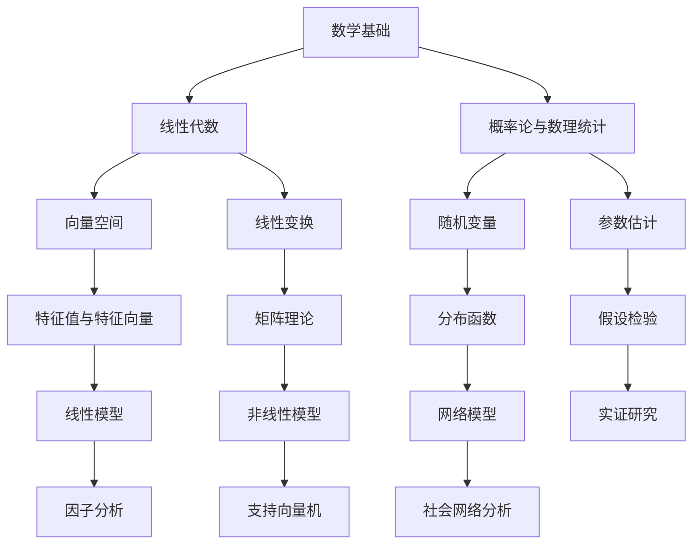

                 

# 《数学与人格心理学：人格特质的数学表达》

## 摘要

本文旨在探讨数学与人格心理学之间的关联，特别是如何运用数学工具表达和量化人格特质。通过对数学基础、人格心理学基础、数学表达与人格特质关系以及实证研究的详细分析，文章揭示了数学模型在人格特质分析中的应用，并展望了数学与人格心理学研究的新趋势和应用前景。

## 引言与背景

### 1.1 引言

数学与人格心理学作为两个看似截然不同的领域，近年来逐渐引起了学术界的关注。数学，作为一门研究数量、结构、变化以及空间等概念的抽象科学，已经成为解决复杂问题的利器。而人格心理学则致力于研究个体的行为、情感和思维特征，探讨这些特质如何影响人们的日常生活和工作表现。将数学与人格心理学结合，不仅有助于揭示人格特质背后的规律，还能为心理治疗、教育干预等领域提供科学依据。

### 1.2 数学与人格心理学的历史背景

数学心理学是心理学与数学的交叉学科，起源于19世纪末。瑞士数学家高尔顿（Francis Galton）通过统计分析研究了人类的身高、体重等身体特征，开创了生物统计学和遗传学的研究方法。而人格心理学则起源于20世纪初，随着心理学实验方法的进步，研究者开始通过量化方法研究个体的心理特质。

### 1.3 本书的研究目的与结构安排

本书旨在探讨如何运用数学工具来分析和表达人格特质。全书分为七个章节，第一章节介绍数学与人格心理学的研究背景；第二章节讲解数学基础；第三章节介绍人格心理学基础；第四章节探讨数学表达与人格特质的关系；第五章节至第七章节通过实证研究分析数学模型在人格特质分析中的应用，并提出未来研究方向。

## 数学基础

### 2.1 数学基本概念

数学的基础概念包括集合、逻辑运算、函数与极限等。集合是数学中的基本结构，用于表示一组确定的元素。逻辑运算包括并集、交集、补集等，用于处理集合之间的关系。函数是数学中描述变量之间关系的工具，极限则用于研究函数的收敛性。

### 2.2 线性代数

线性代数是数学中研究向量空间、线性变换和矩阵理论的分支。向量空间是具有向量加法和标量乘法运算的集合，线性变换则是将向量映射到另一个向量空间的函数。矩阵是线性变换的一种表示方法，通过矩阵运算可以实现向量的线性组合。

### 2.3 概率论与数理统计

概率论与数理统计是研究随机现象的数学分支。概率论主要研究随机事件的发生概率，包括概率的基本性质、条件概率、独立性和概率分布等。数理统计则通过数据收集、处理和分析来推断总体特征，包括参数估计、假设检验和置信区间等。

## 人格心理学基础

### 3.1 人格心理学基本概念

人格是指个体的行为、情感和思维特征，这些特征在个体成长过程中逐渐形成并稳定下来。人格结构包括表面特质、核心特质和构成特质等。人格理论主要分为特质理论和类型理论，特质理论强调个体差异的稳定性，而类型理论则认为人格是离散的类型划分。

### 3.2 人格特质理论

人格特质理论是人格心理学研究的重要方向。基本特质理论认为人格特质是稳定的，且可以通过量表进行量化。五因素模型（大五人格）是目前最流行的特质模型，包括开放性、责任心、外向性、宜人性和神经质。人格特质测量是人格心理学研究的重要方法，常用的测量工具包括自陈量表和投射测验。

### 3.3 人格心理学研究方法

人格心理学研究方法主要包括实验研究、调查研究、实证研究等。实验研究通过控制变量来验证假设，调查研究则通过问卷和访谈收集数据，实证研究则通过数据分析来揭示变量之间的关系。

## 数学表达与人格特质

### 4.1 人格特质数学建模

人格特质的数学建模旨在通过数学方法对人格特质进行量化表达。数学模型构建方法包括线性模型、非线性模型和混合模型等。线性模型如线性回归和因子分析，通过变量之间的关系表达人格特质。非线性模型如多项式回归和支持向量机，则通过非线性变换来捕捉复杂的人格特质关系。

### 4.2 数学工具在人格心理学中的应用

数学工具在人格心理学中有着广泛的应用。线性代数在人格结构分析中用于处理多维度数据，概率论与数理统计则在人格特质预测和假设检验中发挥着重要作用。例如，通过线性回归模型可以分析人格特质与行为表现之间的关系，通过因子分析可以揭示人格特质的结构。

### 4.3 数学表达与人格特质的联系

数学表达与人格特质之间有着密切的联系。一方面，数学工具可以量化表达人格特质，为心理治疗和教育干预提供科学依据；另一方面，数学表达还可以帮助理解人格特质的本质和规律。例如，通过数学模型可以揭示人格特质与遗传、环境等因素的相互作用。

## 数学模型与人格特质分析

### 5.1 线性模型

线性模型是人格特质分析中最常用的模型之一。线性回归模型通过拟合直线或超平面来描述变量之间的关系。因子分析则通过提取主成分来简化数据，揭示变量之间的潜在结构。

### 5.2 非线性模型

非线性模型在处理复杂变量关系时具有优势。多项式回归通过引入多项式项来刻画非线性关系，支持向量机则通过非线性变换将数据映射到高维空间，以实现分类和回归任务。

### 5.3 网络模型

网络模型是近年来发展起来的一种新的数据分析方法。社会网络分析通过构建个体之间的网络关系来研究群体行为，人格特质网络结构建模则通过网络分析方法揭示人格特质在个体和社会层面的相互作用。

## 实证研究与案例分析

### 6.1 数据收集与预处理

数据收集是实证研究的重要环节。数据来源可以是问卷调查、实验数据或公开数据集。数据预处理包括数据清洗、数据归一化和数据标准化等步骤，以提高数据质量和分析效果。

### 6.2 研究设计

研究设计包括确定研究假设、选择研究方法、设计实验步骤等。研究方法可以是实验研究、调查研究或混合研究，根据研究目的和数据特点选择合适的方法。

### 6.3 实证结果与分析

实证结果通过统计分析方法进行分析，包括描述性统计、相关性分析、回归分析和假设检验等。实证结果需要与理论预测进行对比，以验证研究假设的合理性。

## 结论与展望

### 7.1 研究结论

通过对数学与人格心理学的研究，本文得出以下结论：数学工具在人格特质分析中具有重要作用，可以揭示人格特质的规律和本质；数学模型可以量化表达人格特质，为心理治疗和教育干预提供科学依据。

### 7.2 发展展望

未来数学与人格心理学研究的发展趋势包括：引入更先进的数学模型和算法，探索人格特质与生物、社会等因素的相互作用；加强跨学科研究，将数学方法应用于其他心理学领域，如认知心理学、发展心理学等。

### 7.3 应用前景与挑战

数学与人格心理学的结合在多个领域具有广阔的应用前景，如心理健康评估、人才选拔和教育培训等。然而，研究过程中也面临着数据质量、模型选择和解释力等挑战。

## 附录

### 附录 A：数学公式与模型示例

线性回归公式：
$$
y = \beta_0 + \beta_1 x_1 + \beta_2 x_2 + ... + \beta_n x_n + \epsilon
$$

特征值计算公式：
$$
\text{特征值} \lambda = \frac{\det(A - \lambda I)}{0}
$$

概率分布函数：
$$
f(x|\mu, \sigma^2) = \frac{1}{\sqrt{2\pi\sigma^2}} e^{-\frac{(x-\mu)^2}{2\sigma^2}}
$$

### 附录 B：研究数据集介绍

数据集来源可以是公开数据集或自行收集的数据。数据集结构包括样本数量、变量类型和变量描述等。

### 附录 C：研究工具与软件介绍

R语言和Python是常用的数据分析工具。R语言以其强大的统计分析功能而闻名，Python则因其简洁易用的特点被广泛应用于数据分析领域。常用的数据分析软件还包括SPSS和SAS等。

## Mermaid 流程图示例

## 作者信息

作者：AI天才研究院/AI Genius Institute & 禅与计算机程序设计艺术 /Zen And The Art of Computer Programming

---

文章标题：《数学与人格心理学：人格特质的数学表达》

关键词：数学、人格心理学、数学建模、线性模型、非线性模型、实证研究

摘要：本文探讨了数学与人格心理学之间的关联，介绍了数学与人格特质的关系，以及如何运用数学工具来分析和表达人格特质。通过实证研究和案例分析，揭示了数学模型在人格特质分析中的应用，并展望了未来研究的方向和应用前景。

