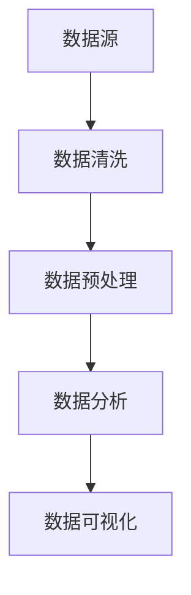

                 

# 《数据分析和可视化：LLM 增强的洞察力》

> **关键词**：数据分析、可视化、语言模型、增强、洞察力、数据清洗、特征工程、机器学习、神经网络、线性回归

> **摘要**：本文探讨了如何利用语言模型（LLM）增强数据分析和可视化的能力。通过介绍数据分析和可视化的基础，深入讲解核心方法和工具，以及展示LLM在实际项目中的应用，本文揭示了LLM如何为数据科学家和分析师带来更深入的洞察力。

## 引言

在当今信息爆炸的时代，数据已成为企业和社会的核心资产。如何从海量数据中提取有价值的信息，如何将复杂的数据关系以直观的方式呈现给决策者，是数据科学家和分析师面临的重要挑战。传统的数据分析方法往往依赖于统计分析、机器学习等技术，但这些方法在处理复杂和非结构化数据时存在一定局限性。近年来，随着深度学习和自然语言处理技术的快速发展，语言模型（LLM）的应用为数据分析和可视化带来了新的机遇。

语言模型是一种能够理解和生成自然语言的人工智能系统，其核心思想是通过学习大量的文本数据来预测下一个单词或句子。在数据分析和可视化领域，LLM可以通过以下方式增强洞察力：

1. **自动化数据预处理**：LLM能够自动从文本数据中提取特征，进行数据清洗和预处理，减轻分析师的负担。
2. **增强数据分析能力**：LLM可以处理复杂的数据关系，通过生成式模型预测数据趋势，为分析师提供更多决策依据。
3. **可视化结果解释**：LLM可以生成自然语言描述，帮助分析师更好地理解可视化结果，提高沟通效率。

本文将围绕以上三个方面展开，详细介绍如何利用LLM增强数据分析和可视化的能力。接下来，我们将首先介绍数据分析和可视化的基础，包括数据源选择、数据清洗、预处理、统计分析等方法，以及数据可视化的核心技术和原则。

## 数据分析和可视化基础

### 数据分析概述

数据分析是指通过处理、分析和解释数据来提取有价值信息的过程。其重要性在于，通过数据分析，企业可以更好地了解市场趋势、用户行为，从而制定更有效的业务策略。数据分析的基本流程包括以下步骤：

1. **问题定义**：明确数据分析的目标和问题。
2. **数据收集**：从各种数据源收集所需的数据。
3. **数据清洗**：处理数据中的噪声和异常，确保数据质量。
4. **数据预处理**：对数据进行转换、整合和标准化，以便后续分析。
5. **统计分析**：使用统计方法分析数据，提取关键指标和结论。
6. **可视化**：将分析结果以图表、图像等形式直观展示，便于理解和决策。

### 数据可视化概述

数据可视化是将数据转换为视觉形式的过程，通过图形和图像展示数据特征和关系，使得复杂的分析结果更容易理解和解释。数据可视化的重要性在于：

1. **提高数据分析效率**：通过视觉呈现，分析师可以快速发现数据中的异常和趋势。
2. **增强沟通效果**：直观的图表可以更好地向非技术背景的决策者传达分析结果。
3. **支持决策制定**：可视化结果能够提供更直观的支持，帮助决策者制定更科学的决策。

常见的几种数据可视化类型包括：

1. **折线图**：用于展示数据随时间的变化趋势。
2. **柱状图**：用于比较不同类别的数据。
3. **饼图**：用于展示各类别的比例关系。
4. **散点图**：用于展示变量之间的关系。
5. **地图**：用于展示地理空间数据。

### 数据清洗与预处理

数据清洗和预处理是数据分析中至关重要的一步，其目的是提高数据质量，为后续分析奠定基础。以下是一些常见的数据清洗和预处理方法：

1. **数据源选择**：选择合适的数据源，包括内部数据库、外部数据接口等。
2. **数据质量评估**：检查数据是否存在缺失值、异常值、重复记录等问题。
3. **数据清洗**：处理缺失值、异常值、重复记录等，常见方法包括填充缺失值、删除异常值、平滑处理等。
4. **数据转换**：对数据进行标准化、归一化、转换等操作，使其满足分析需求。
5. **数据集成**：将来自不同数据源的数据进行整合，形成统一的数据集。

### 统计分析方法

统计分析方法是数据分析的核心环节，通过统计方法可以从数据中提取有价值的信息。以下是一些常见的统计分析方法：

1. **描述性统计分析**：计算数据的中心趋势、离散度等基本统计指标，如均值、中位数、标准差等。
2. **探索性数据分析**：通过图表、相关性分析等方法，发现数据中的趋势、异常和关系。
3. **假设检验**：使用统计方法验证假设，常见方法包括t检验、卡方检验等。
4. **回归分析**：建立自变量和因变量之间的关系模型，如线性回归、多项式回归等。

### 数据可视化方法

数据可视化是将分析结果以图表形式展示的重要手段。以下是一些常见的数据可视化方法：

1. **折线图**：用于展示数据随时间的变化趋势，如时间序列数据。
2. **柱状图**：用于比较不同类别的数据，如销售额分布。
3. **饼图**：用于展示各类别的比例关系，如市场份额分布。
4. **散点图**：用于展示变量之间的关系，如用户满意度与销售额之间的关系。
5. **地图**：用于展示地理空间数据，如城市人口分布。

### 可视化设计原则

良好的可视化设计能够提高数据的可读性和沟通效果。以下是一些可视化设计原则：

1. **简洁性**：尽量简化图表，去除无关信息，使数据突出。
2. **一致性**：图表风格和色彩使用保持一致，便于比较。
3. **易读性**：图表标题、标签、图例等清晰明了，易于理解。
4. **交互性**：提供交互功能，如筛选、放大、缩小时，提高用户体验。
5. **准确性**：确保图表数据准确无误，避免误导。

### 数据源选择策略

选择合适的数据源是数据分析和可视化的第一步。以下是一些数据源选择策略：

1. **数据质量**：优先选择质量高、可靠性强、更新及时的数据源。
2. **数据完整性**：确保数据源包含所需的所有信息，无重大缺失。
3. **数据权限**：了解数据源的访问权限，确保合法获取和使用。
4. **数据多样性**：选择多种数据源，以获取更全面、多维度的信息。
5. **数据更新频率**：根据分析需求，选择更新频率合适的源。

通过上述基础概念的介绍，我们为后续深入探讨LLM在数据分析和可视化中的应用奠定了基础。在下一部分，我们将详细讨论LLM的基础知识和其在数据分析中的具体应用。

## 第一部分：数据分析和可视化基础

### 第1章：数据分析和可视化概述

#### 1.1 数据分析概述

数据分析是指通过处理、分析和解释数据来提取有价值信息的过程。它是数据科学和人工智能领域的重要组成部分，广泛应用于商业、医疗、金融、科研等多个领域。数据分析的重要性主要体现在以下几个方面：

1. **决策支持**：通过数据分析，企业可以深入了解市场趋势、用户行为等，从而制定更科学的决策策略。
2. **效率提升**：自动化数据分析流程，减少人工干预，提高数据分析效率。
3. **风险管理**：通过分析历史数据和当前数据，预测潜在风险，为风险管理提供依据。
4. **创新驱动**：数据分析有助于发现新的商业模式、市场机会，推动企业创新。

数据分析的基本流程包括以下步骤：

1. **问题定义**：明确数据分析的目标和问题，确保分析的针对性和有效性。
2. **数据收集**：从各种数据源收集所需的数据，包括内部数据、外部数据等。
3. **数据清洗**：处理数据中的噪声和异常，确保数据质量，为后续分析奠定基础。
4. **数据预处理**：对数据进行转换、整合和标准化，使其满足分析需求。
5. **统计分析**：使用统计方法分析数据，提取关键指标和结论。
6. **可视化**：将分析结果以图表、图像等形式直观展示，便于理解和决策。

#### 1.2 可视化概述

数据可视化是将数据转换为视觉形式的过程，通过图形和图像展示数据特征和关系，使得复杂的分析结果更容易理解和解释。数据可视化的重要性在于：

1. **提高数据分析效率**：通过视觉呈现，分析师可以快速发现数据中的异常和趋势。
2. **增强沟通效果**：直观的图表可以更好地向非技术背景的决策者传达分析结果。
3. **支持决策制定**：可视化结果能够提供更直观的支持，帮助决策者制定更科学的决策。

常见的几种数据可视化类型包括：

1. **折线图**：用于展示数据随时间的变化趋势，如时间序列数据。
2. **柱状图**：用于比较不同类别的数据，如销售额分布。
3. **饼图**：用于展示各类别的比例关系，如市场份额分布。
4. **散点图**：用于展示变量之间的关系，如用户满意度与销售额之间的关系。
5. **地图**：用于展示地理空间数据，如城市人口分布。

数据可视化不仅仅是一种技术手段，更是一种设计艺术。良好的可视化设计应遵循以下原则：

1. **简洁性**：尽量简化图表，去除无关信息，使数据突出。
2. **一致性**：图表风格和色彩使用保持一致，便于比较。
3. **易读性**：图表标题、标签、图例等清晰明了，易于理解。
4. **交互性**：提供交互功能，如筛选、放大、缩小时，提高用户体验。
5. **准确性**：确保图表数据准确无误，避免误导。

#### 1.3 数据清洗与预处理

数据清洗和预处理是数据分析中至关重要的一步，其目的是提高数据质量，为后续分析奠定基础。以下是一些常见的数据清洗和预处理方法：

1. **数据源选择**：选择合适的数据源，包括内部数据库、外部数据接口等。
2. **数据质量评估**：检查数据是否存在缺失值、异常值、重复记录等问题。
3. **数据清洗**：处理缺失值、异常值、重复记录等，常见方法包括填充缺失值、删除异常值、平滑处理等。
4. **数据转换**：对数据进行标准化、归一化、转换等操作，使其满足分析需求。
5. **数据集成**：将来自不同数据源的数据进行整合，形成统一的数据集。

数据清洗和预处理的关键步骤包括：

1. **缺失值处理**：常见的缺失值处理方法包括填充缺失值、删除缺失记录、使用模型预测缺失值等。
2. **异常值检测**：常见的异常值检测方法包括基于统计学方法、基于机器学习方法等。
3. **数据转换**：常见的数据转换方法包括数据标准化、归一化、对数转换等。
4. **数据整合**：常见的数据整合方法包括合并、连接、聚合等。

#### 1.4 统计分析方法

统计分析方法是数据分析的核心环节，通过统计方法可以从数据中提取有价值的信息。以下是一些常见的统计分析方法：

1. **描述性统计分析**：计算数据的中心趋势、离散度等基本统计指标，如均值、中位数、标准差等。
2. **探索性数据分析**：通过图表、相关性分析等方法，发现数据中的趋势、异常和关系。
3. **假设检验**：使用统计方法验证假设，常见方法包括t检验、卡方检验等。
4. **回归分析**：建立自变量和因变量之间的关系模型，如线性回归、多项式回归等。

描述性统计分析主要用于了解数据的基本特征，常见的统计指标包括：

- **均值**：数据的平均值，用于衡量数据的中心趋势。
- **中位数**：数据排序后中间位置的值，用于衡量数据的中心趋势。
- **众数**：数据中出现次数最多的值，用于衡量数据的集中趋势。
- **标准差**：衡量数据离散程度的指标，值越大，数据分布越分散。

探索性数据分析主要通过图表展示数据特征，常见的探索性数据分析方法包括：

- **直方图**：用于展示数据分布情况。
- **箱线图**：用于展示数据的分布和异常值。
- **散点图**：用于展示变量之间的关系。
- **热力图**：用于展示变量之间的相关性。

假设检验是通过统计方法验证研究假设，常见的假设检验方法包括：

- **t检验**：用于比较两组数据的均值是否有显著差异。
- **卡方检验**：用于检验分类变量之间的独立性。

回归分析是建立自变量和因变量之间关系的模型，常见的回归分析方法包括：

- **线性回归**：假设自变量和因变量之间存在线性关系。
- **多项式回归**：用于分析自变量和因变量之间的非线性关系。

#### 1.5 数据可视化方法

数据可视化是将分析结果以图表形式展示的重要手段。以下是一些常见的数据可视化方法：

1. **折线图**：用于展示数据随时间的变化趋势，如时间序列数据。
2. **柱状图**：用于比较不同类别的数据，如销售额分布。
3. **饼图**：用于展示各类别的比例关系，如市场份额分布。
4. **散点图**：用于展示变量之间的关系，如用户满意度与销售额之间的关系。
5. **地图**：用于展示地理空间数据，如城市人口分布。

每种数据可视化方法都有其独特的应用场景和优势，分析师应根据具体分析需求选择合适的方法。例如，折线图适合展示时间序列数据的变化趋势，柱状图适合比较不同类别的数据大小，饼图适合展示各类别的比例关系。

#### 1.6 可视化设计原则

良好的可视化设计能够提高数据的可读性和沟通效果。以下是一些可视化设计原则：

1. **简洁性**：尽量简化图表，去除无关信息，使数据突出。
2. **一致性**：图表风格和色彩使用保持一致，便于比较。
3. **易读性**：图表标题、标签、图例等清晰明了，易于理解。
4. **交互性**：提供交互功能，如筛选、放大、缩小时，提高用户体验。
5. **准确性**：确保图表数据准确无误，避免误导。

通过以上对数据分析和可视化基础的介绍，我们为后续深入探讨LLM在数据分析和可视化中的应用奠定了基础。在下一部分，我们将详细讨论LLM的基础知识和其在数据分析中的具体应用。

### 第2章：数据清洗与预处理

数据清洗与预处理是确保数据分析质量的重要步骤，其目的是从原始数据中提取有用信息，并减少数据中的噪声和异常。本章将详细介绍数据清洗与预处理的过程，包括数据源选择、数据质量评估、数据清洗方法以及数据预处理技术。

#### 2.1 数据源选择

数据源选择是数据分析和预处理的第一步，选择合适的数据源对分析结果的质量有着重要影响。以下是一些数据源选择策略：

1. **数据质量**：选择质量高、可靠性强、更新及时的数据源。对于外部数据源，应评估其数据源的权威性和数据的完整性。
2. **数据完整性**：确保数据源包含所需的所有信息，无重大缺失。如果数据存在缺失，需要考虑是否可以找到其他替代数据源。
3. **数据权限**：了解数据源的访问权限，确保合法获取和使用。在某些情况下，可能需要与数据源所有者协商获取数据。
4. **数据多样性**：选择多种数据源，以获取更全面、多维度的信息。多样化的数据源有助于提高分析的准确性和可靠性。
5. **数据更新频率**：根据分析需求，选择更新频率合适的源。对于实时分析，选择更新频率高的数据源；对于历史数据分析，选择覆盖时间段合适的数据源。

#### 2.2 数据质量评估

数据质量评估是确保数据符合分析要求的重要环节。以下是一些常见的数据质量评估方法：

1. **缺失值检查**：检查数据是否存在缺失值。缺失值可能是由于数据采集过程中的问题、数据存储错误或数据源本身的问题。
2. **异常值检测**：检测数据中是否存在异常值。异常值可能是由于数据采集、传输或处理过程中的错误。
3. **重复记录检测**：检查数据中是否存在重复记录。重复记录可能是由于数据源的不同数据集合合并时没有去重。
4. **数据一致性检查**：检查数据是否符合预期的格式和类型。例如，检查日期格式是否正确、数值类型是否合理等。
5. **数据完整性检查**：确保数据完整，没有丢失或损坏。特别是对于大型数据集，完整性检查尤为重要。

#### 2.3 数据清洗方法

数据清洗是指通过一系列方法处理数据中的噪声和异常，以提高数据质量。以下是一些常见的数据清洗方法：

1. **缺失值处理**：处理缺失值是数据清洗的重要步骤。常见的方法包括：
   - **删除缺失记录**：对于少量缺失值，可以考虑删除含有缺失值的记录。
   - **填充缺失值**：使用适当的统计方法或模型预测缺失值。例如，使用平均值、中位数、众数等方法填充缺失值。
   - **插值法**：对于时间序列数据，可以使用插值法填充缺失值，如线性插值、曲线拟合等。
   - **使用模型预测**：使用机器学习模型预测缺失值，如K近邻、回归模型等。

2. **异常值处理**：处理异常值是确保数据质量的关键步骤。常见的方法包括：
   - **删除异常值**：对于明显的异常值，可以直接删除。
   - **平滑处理**：使用统计学方法对异常值进行平滑处理，如移动平均、中值滤波等。
   - **孤立处理**：将异常值单独存储或标记，以供后续分析。

3. **重复记录处理**：检测并处理重复记录。常见的方法包括：
   - **删除重复记录**：直接删除重复的记录。
   - **合并重复记录**：将重复记录合并为一个记录，如取重复记录的平均值、最大值等。

4. **数据标准化**：对数据进行标准化处理，使其满足分析需求。常见的方法包括：
   - **归一化**：将数据缩放到一个固定范围，如0到1之间。
   - **标准化**：将数据缩放到标准正态分布，即均值为0，标准差为1。

5. **数据转换**：对数据进行适当的转换，如日期转换、编码转换等，以满足分析需求。

#### 2.4 数据预处理

数据预处理是指对清洗后的数据进行一系列操作，以提高数据分析的准确性和效率。以下是一些常见的数据预处理技术：

1. **特征工程**：特征工程是数据预处理的核心步骤，其目的是从原始数据中提取出对分析任务有帮助的特征。常见的方法包括：
   - **特征选择**：选择对分析任务最重要的特征，如基于信息增益、互信息等方法。
   - **特征提取**：从原始数据中生成新的特征，如基于主成分分析（PCA）、自动特征提取（AFL）等方法。

2. **数据归一化**：对数据进行归一化处理，以消除不同特征之间的量纲影响。常见的方法包括：
   - **最小-最大规范化**：将数据缩放到[0, 1]之间。
   - **Z标准化**：将数据缩放到标准正态分布，即均值为0，标准差为1。

3. **数据集成**：将来自不同数据源的数据进行整合，形成统一的数据集。常见的方法包括：
   - **合并**：将具有相同属性的数据记录合并。
   - **连接**：将具有相同属性的数据表进行连接操作。

4. **数据分割**：将数据集分割为训练集、验证集和测试集，以评估模型的性能。常见的方法包括：
   - **随机分割**：随机将数据集划分为训练集、验证集和测试集。
   - **分层分割**：确保每个部分具有相同的数据分布，特别是在类别不平衡的情况下。

通过上述数据清洗与预处理步骤，我们可以提高数据质量，为后续的数据分析任务奠定基础。在下一章，我们将进一步探讨数据分析和可视化的核心方法，包括统计分析方法和机器学习技术。

### 第3章：数据分析和可视化核心方法

数据分析和可视化是数据科学中的核心任务，通过科学的方法和工具，可以将原始数据转化为有价值的信息，并直观地展示出来。本章将详细讨论数据分析和可视化的核心方法，包括统计分析方法和机器学习方法，以及数据可视化技术。

#### 3.1 描述性统计分析

描述性统计分析是数据分析的基础，它通过计算数据的基本统计指标，如均值、中位数、众数、标准差等，来描述数据的中心趋势和离散度。以下是一些常用的描述性统计指标：

1. **均值**：均值是数据集的中心值，表示数据的平均水平。计算公式为：
   $$
   \bar{x} = \frac{1}{n} \sum_{i=1}^{n} x_i
   $$
   其中，$n$ 是数据点的数量，$x_i$ 是第 $i$ 个数据点。

2. **中位数**：中位数是将数据排序后位于中间位置的值，它能更好地反映数据的中心趋势，尤其在数据分布不均匀时。计算公式为：
   $$
   median(x) = \begin{cases}
   x_{\lceil \frac{n}{2} \rceil} & \text{如果 } n \text{ 是奇数} \\
   \frac{x_{\lceil \frac{n}{2} \rceil} + x_{\lfloor \frac{n}{2} \rfloor}}{2} & \text{如果 } n \text{ 是偶数}
   \end{cases}
   $$

3. **众数**：众数是数据集中出现次数最多的值，它可以反映数据的集中趋势，尤其是在分类数据中。计算公式为：
   $$
   mode(x) = \arg\max_{x_i} f(x_i)
   $$
   其中，$f(x_i)$ 是 $x_i$ 的频数。

4. **标准差**：标准差是衡量数据离散程度的指标，它表示数据点与均值之间的平均距离。计算公式为：
   $$
   \sigma = \sqrt{\frac{1}{n-1} \sum_{i=1}^{n} (x_i - \bar{x})^2}
   $$

#### 3.2 探索性数据分析

探索性数据分析（EDA）是一种用于发现数据中隐藏模式、趋势和异常的统计分析方法。以下是一些常用的EDA技术：

1. **直方图**：直方图用于展示数据的分布情况。通过直方图，可以直观地了解数据的分布特性，如均值、峰值、异常值等。

2. **箱线图**：箱线图用于展示数据的四分位数和异常值。它可以帮助识别数据的异常值和异常分布，如异常峰值、异常低谷等。

3. **散点图**：散点图用于展示两个变量之间的关系。通过散点图，可以直观地发现变量之间的相关性、线性趋势、非线性关系等。

4. **热力图**：热力图用于展示多个变量之间的相关性。它通过颜色深浅表示变量之间的相关性强度，可以帮助识别变量之间的潜在关系。

#### 3.3 假设检验

假设检验是用于验证研究假设的统计分析方法。它通过设定原假设和备择假设，通过样本数据来判断原假设是否成立。以下是一些常见的假设检验方法：

1. **t检验**：t检验用于比较两组数据的均值是否有显著差异。它基于t分布，适用于小样本数据。

2. **方差分析（ANOVA）**：ANOVA用于比较多个组之间的均值是否有显著差异。它适用于多个独立样本的比较。

3. **卡方检验**：卡方检验用于检验分类变量之间的独立性。它适用于两个或多个分类变量之间的相关性分析。

#### 3.4 回归分析

回归分析是一种用于建立自变量和因变量之间关系的统计方法。以下是一些常见的回归分析方法：

1. **线性回归**：线性回归假设自变量和因变量之间存在线性关系。它的目的是找到最佳拟合直线，通过最小化误差平方和来确定模型的参数。

2. **多项式回归**：多项式回归用于分析自变量和因变量之间的非线性关系。它通过多项式函数来描述变量之间的关系。

3. **逻辑回归**：逻辑回归是一种广义线性模型，用于分析因变量为二分类变量的回归问题。它通过概率分布来描述自变量对因变量的影响。

4. **岭回归和套索回归**：岭回归和套索回归是用于处理多重共线性的回归方法。它们通过正则化项来惩罚模型参数，以减少过拟合。

#### 3.5 机器学习方法

机器学习方法用于从数据中自动学习规律和模式，以进行预测和分类。以下是一些常见的机器学习方法：

1. **监督学习**：监督学习是一种通过训练数据集来学习映射关系的方法。它分为回归和分类两大类。

   - **回归任务**：回归任务的目标是预测连续值。常见的回归算法包括线性回归、决策树回归、随机森林回归等。
   - **分类任务**：分类任务的目标是预测离散值。常见的分类算法包括K近邻、支持向量机、朴素贝叶斯、决策树分类、随机森林分类等。

2. **无监督学习**：无监督学习是一种从未标记数据中学习模式的方法。它包括聚类和降维等方法。

   - **聚类**：聚类是一种将数据划分为多个组的方法。常见的聚类算法包括K均值、层次聚类、DBSCAN等。
   - **降维**：降维是一种将高维数据转换成低维数据的方法。常见的降维算法包括主成分分析（PCA）、线性判别分析（LDA）、t-SNE等。

#### 3.6 数据可视化技术

数据可视化是将数据分析结果以图形形式展示的过程，它有助于理解和传达数据中的信息。以下是一些常见的数据可视化技术：

1. **折线图**：折线图用于展示数据随时间的变化趋势。它适用于时间序列数据，如股票价格、天气变化等。

2. **柱状图**：柱状图用于比较不同类别的数据。它适用于分类数据的比较，如销售额、用户数量等。

3. **饼图**：饼图用于展示各类别的比例关系。它适用于展示比例分布，如市场份额、年龄分布等。

4. **散点图**：散点图用于展示变量之间的关系。它适用于探索变量之间的相关性，如用户满意度与销售额之间的关系。

5. **热力图**：热力图用于展示变量之间的相关性。它通过颜色深浅表示变量之间的相关性强度，适用于探索变量之间的关系网络。

6. **地图**：地图用于展示地理空间数据。它适用于展示地理位置分布，如人口密度、销售区域等。

通过上述核心方法，我们可以从不同角度对数据进行深入分析和可视化，从而提取有价值的信息并做出科学的决策。在下一章，我们将进一步探讨LLM在数据分析中的具体应用，以及如何利用LLM增强数据分析的能力。

### 第4章：机器学习方法

机器学习方法在数据分析和可视化中扮演着至关重要的角色，它们通过学习数据中的模式和规律，帮助我们从复杂的数据集中提取有价值的信息。本章将详细介绍机器学习方法，包括基本概念、算法分类和常用算法的原理，重点讨论特征工程、特征提取和特征选择，以及常见的机器学习算法如线性回归、决策树、随机森林、支持向量机和神经网络。

#### 4.1 机器学习概述

机器学习是一种通过算法从数据中学习模式，并自动做出预测或决策的技术。它分为监督学习、无监督学习和强化学习三大类。监督学习是有监督的学习方法，其中数据集被分为训练集和测试集，算法通过训练集学习模型，然后使用测试集评估模型的性能。无监督学习是不使用标签的数据学习方法，主要任务包括聚类和降维。强化学习是通过与环境的交互来学习最优策略，常用于决策问题和游戏AI。

#### 4.2 特征工程

特征工程是机器学习过程中至关重要的一环，它涉及从原始数据中提取对模型有用的特征，并转换成适合机器学习算法的形式。以下是特征工程的主要步骤：

1. **特征选择**：从原始特征中选择对预测任务最有用的特征。特征选择可以通过统计方法（如相关系数、信息增益等）或过滤方法（如基于特征重要性的过滤）进行。

2. **特征提取**：通过算法自动生成新的特征，以增强模型的预测能力。常见的特征提取方法包括主成分分析（PCA）、线性判别分析（LDA）、t-SNE等。

3. **特征转换**：将原始特征转换为适合机器学习算法的形式。常见的转换方法包括归一化、标准化、编码（如独热编码、标签编码）等。

4. **特征组合**：通过组合原始特征生成新的特征，以提升模型的泛化能力。特征组合可以通过特征交叉、特征聚合等方法实现。

#### 4.3 特征提取

特征提取是特征工程中的一个关键步骤，它通过特定的算法从原始数据中生成新的特征。以下是几种常见的特征提取方法：

1. **主成分分析（PCA）**：PCA是一种降维技术，它通过将数据投影到新的正交坐标系中，找到最能解释数据方差的主成分，从而降低数据的维度。

2. **线性判别分析（LDA）**：LDA是一种特征提取方法，它通过最大化不同类别的方差差异，最小化同一类别的方差差异，来提取有助于分类的特征。

3. **t-SNE**：t-SNE是一种非线性降维技术，它通过保持局部结构来展示高维数据的低维表示，常用于可视化和理解数据分布。

#### 4.4 特征选择

特征选择是减少特征数量以提高模型性能的过程。以下是一些常见的特征选择方法：

1. **过滤方法**：过滤方法根据特征的重要性进行选择，常见的过滤方法包括基于信息的特征选择、基于规则的过滤和基于距离的特征选择。

2. **嵌入方法**：嵌入方法将特征选择过程整合到训练过程中，常见的嵌入方法包括主成分分析（PCA）、线性判别分析（LDA）等。

3. **基于模型的特征选择**：基于模型的特征选择方法通过评估特征对模型性能的贡献来进行选择，常见的方法包括向前选择、向后消除和LASSO回归等。

#### 4.5 常见机器学习算法

以下是几种常见的机器学习算法，包括其基本原理和适用场景：

1. **线性回归**：线性回归是一种用于预测连续值的监督学习算法，它假设目标变量可以由输入特征线性组合得到。线性回归通过最小化误差平方和来确定模型参数。

   - **数学模型**：
     $$
     \begin{aligned}
     y &= \beta_0 + \beta_1 x_1 + \beta_2 x_2 + \cdots + \beta_n x_n \\
     \beta_0, \beta_1, \beta_2, \ldots, \beta_n &= \arg\min_{\beta} \sum_{i=1}^{n} (y_i - \sum_{j=1}^{n} \beta_j x_{ij})^2
     \end{aligned}
     $$
   - **适用场景**：线性回归适用于简单线性关系的预测，如房价预测、股票价格预测等。

2. **决策树**：决策树是一种基于树的模型，通过一系列规则来预测目标变量。每个节点代表一个特征，每个分支代表该特征的不同取值，叶节点表示最终的预测结果。

   - **基本原理**：决策树通过递归划分数据集，使得每个子数据集在某个特征上具有最大纯度。
   - **适用场景**：决策树适用于分类和回归任务，特别适用于解释性需求较强的场景。

3. **随机森林**：随机森林是一种集成学习算法，它通过构建多个决策树，并对每个树的预测结果进行投票或平均来获得最终预测结果。

   - **基本原理**：随机森林通过随机选择特征和随机划分数据集来减少过拟合，提高模型的泛化能力。
   - **适用场景**：随机森林适用于分类和回归任务，特别适用于大规模数据集和高维数据。

4. **支持向量机（SVM）**：支持向量机是一种基于间隔最大化原则的分类和回归模型。它通过找到最佳分割超平面，将不同类别的数据点分开。

   - **基本原理**：SVM通过求解二次规划问题，找到最佳分割超平面，并计算支持向量。
   - **适用场景**：SVM适用于分类和回归任务，特别适用于小样本、高维数据和线性可分的数据。

5. **神经网络**：神经网络是一种由多个神经元组成的分层模型，通过学习输入和输出之间的映射关系来预测目标变量。

   - **基本原理**：神经网络通过前向传播计算神经元的输出，并通过反向传播更新模型参数。
   - **适用场景**：神经网络适用于各种类型的预测任务，特别适用于复杂非线性关系和大规模数据集。

通过本章的介绍，我们了解了机器学习的基本概念、算法分类和常用算法的原理。在下一章，我们将探讨如何利用语言模型（LLM）增强数据分析和可视化的能力。

### 第5章：数据可视化技术

数据可视化是将数据转换为视觉形式，以帮助人们更好地理解和分析数据的技术。有效的数据可视化不仅能够简化复杂的数据集，还能够揭示隐藏在数据背后的趋势、关系和模式。本章将详细介绍数据可视化工具、数据可视化方法以及可视化设计原则。

#### 5.1 数据可视化工具

选择合适的数据可视化工具对于实现高效的数据分析至关重要。以下是一些常用的数据可视化工具：

1. **Python数据可视化库**：
   - **Matplotlib**：Matplotlib是一个强大的绘图库，可以创建多种类型的图表，如折线图、柱状图、散点图等。
   - **Seaborn**：Seaborn是基于Matplotlib的高级可视化库，提供了丰富的统计图表，如箱线图、热力图、小提琴图等。
   - **Plotly**：Plotly是一个交互式可视化库，支持多种图表类型，并提供了丰富的交互功能，如缩放、拖动等。

2. **R语言可视化工具**：
   - **ggplot2**：ggplot2是R语言中最常用的可视化库之一，提供了强大的数据可视化功能，支持多种图表类型，如折线图、柱状图、散点图等。
   - **Lattice**：Lattice是一个基于图形网格系统的可视化库，适用于创建复杂的图表布局。

3. **其他数据可视化工具**：
   - **Tableau**：Tableau是一个商业级数据可视化工具，提供了丰富的可视化类型和强大的交互功能。
   - **Power BI**：Power BI是微软推出的一款商业智能工具，支持多种数据源，提供了丰富的可视化选项。

#### 5.2 数据可视化方法

数据可视化方法的选择取决于数据的类型和分析的目标。以下是一些常见的数据可视化方法：

1. **折线图**：折线图用于展示数据随时间的变化趋势。它适用于时间序列数据，如股票价格、气温变化等。

2. **柱状图**：柱状图用于比较不同类别的数据。它适用于分类数据，如销售额、用户数量等。

3. **饼图**：饼图用于展示各类别的比例关系。它适用于展示比例分布，如市场份额、年龄分布等。

4. **散点图**：散点图用于展示变量之间的关系。它适用于探索变量之间的相关性，如用户满意度与销售额之间的关系。

5. **热力图**：热力图用于展示变量之间的相关性。它通过颜色深浅表示变量之间的相关性强度，适用于探索变量之间的关系网络。

6. **地图**：地图用于展示地理空间数据。它适用于展示地理位置分布，如人口密度、销售区域等。

7. **小提琴图**：小提琴图是一种结合了箱线图和密度估计的图表，用于展示数据的分布和中心趋势。

8. **箱线图**：箱线图用于展示数据的分布和异常值。它通过展示四分位数、均值和异常值来描述数据的分布情况。

9. ** violinplot**：violinplot是Seaborn库中的一个图表，它结合了箱线图和密度估计，用于展示数据的分布和中心趋势。

10. **多图布局**：多图布局将多个图表组合在一起，用于展示复杂的数据集。它适用于综合分析多个变量之间的关系。

#### 5.3 可视化设计原则

良好的可视化设计能够提高数据的可读性和沟通效果。以下是一些可视化设计原则：

1. **简洁性**：保持图表简洁，去除无关信息，使数据突出。

2. **一致性**：确保图表风格和色彩使用保持一致，便于比较。

3. **易读性**：图表标题、标签、图例等清晰明了，易于理解。

4. **交互性**：提供交互功能，如筛选、放大、缩小时，提高用户体验。

5. **准确性**：确保图表数据准确无误，避免误导。

6. **数据可视化**：将数据以直观的方式展示，避免使用过度设计，确保数据的真实性。

通过以上对数据可视化技术的介绍，我们了解了数据可视化工具、方法以及设计原则。在下一章，我们将探讨LLM在数据分析和可视化中的应用，以及LLM如何增强数据分析的洞察力。

### 第6章：LLM基础

#### 6.1 LLM概述

语言模型（LLM）是一种利用大量文本数据进行训练的人工智能模型，其核心任务是预测下一个单词或句子。LLM在自然语言处理（NLP）领域中扮演着重要的角色，广泛应用于机器翻译、文本摘要、问答系统等任务。LLM的基本原理是通过学习语言的统计规律和语法结构，构建出一个能够生成自然语言文本的模型。

LLM的主要特点包括：

1. **自适应性**：LLM可以根据不同的任务和数据集进行自适应调整，以适应不同的语言环境和应用场景。
2. **生成性**：LLM具有强大的生成能力，可以生成连贯、自然的文本，为文本生成和应用提供了新的可能性。
3. **上下文感知**：LLM能够理解上下文信息，根据上下文进行预测，提高了预测的准确性和适应性。

#### 6.2 LLM分类

根据训练数据集的不同，LLM可以分为两类：有监督语言模型和无监督语言模型。

1. **有监督语言模型**：有监督语言模型使用带有标签的文本数据集进行训练，每个文本序列都有对应的标签。这种模型通过学习输入序列和标签之间的映射关系，预测下一个单词或句子。常见的有监督语言模型包括：
   - **n-gram模型**：n-gram模型是最简单的有监督语言模型，它通过统计n个连续单词的联合概率来预测下一个单词。
   - **循环神经网络（RNN）**：RNN是一种基于序列数据的神经网络模型，它能够捕捉到输入序列的长期依赖关系，通过递归方式对序列进行建模。
   - **长短期记忆网络（LSTM）**：LSTM是RNN的一种改进，通过引入门控机制来避免梯度消失问题，能够更好地处理长期依赖关系。

2. **无监督语言模型**：无监督语言模型使用未标注的文本数据集进行训练，不需要标签信息。这种模型通过学习文本的分布式表示，捕捉到语言的语义和结构信息。常见的无监督语言模型包括：
   - **词嵌入**：词嵌入是将单词映射到高维空间中的向量表示，通过学习单词的上下文信息，生成语义丰富的向量表示。
   - **变换器（Transformer）**：Transformer是一种基于自注意力机制的模型，它通过多头自注意力机制和前馈神经网络，实现了对序列数据的建模，在多个NLP任务中表现出色。
   - **生成预训练（GPT）**：GPT是一种基于Transformer架构的无监督语言模型，通过大规模文本数据预训练，能够生成高质量的自然语言文本。

#### 6.3 LLM架构

LLM的架构通常包括编码器（Encoder）和解码器（Decoder）两个部分。编码器负责将输入序列编码为固定长度的向量表示，解码器则根据编码器的输出生成目标序列。

1. **编码器**：编码器的任务是将输入序列转换为固定长度的向量表示，以捕捉到序列的语义信息。常见的编码器架构包括：
   - **循环神经网络（RNN）**：RNN通过递归方式对输入序列进行建模，能够捕捉到序列的长期依赖关系。
   - **长短期记忆网络（LSTM）**：LSTM是RNN的一种改进，通过引入门控机制来避免梯度消失问题，能够更好地处理长期依赖关系。
   - **变换器（Transformer）**：Transformer是一种基于自注意力机制的模型，通过多头自注意力机制和前馈神经网络，实现了对序列数据的建模。

2. **解码器**：解码器的任务是根据编码器的输出生成目标序列。常见的解码器架构包括：
   - **自回归解码器**：自回归解码器通过预测下一个单词的概率，逐步生成目标序列。
   - **变换器（Transformer）**：Transformer的解码器通过多头自注意力机制和前馈神经网络，实现了对目标序列的建模。

#### 6.4 LLM训练方法

LLM的训练方法主要包括有监督训练和无监督训练。有监督训练使用带有标签的数据集进行训练，无监督训练使用未标注的数据集进行训练。

1. **有监督训练**：有监督训练通常使用交叉熵损失函数来优化模型参数。交叉熵损失函数用于衡量预测序列和真实序列之间的差异，通过最小化交叉熵损失函数，模型能够学习到输入序列和标签之间的映射关系。

2. **无监督训练**：无监督训练通常使用负采样技术来优化模型参数。负采样技术通过随机选择负样本，与正样本一起用于更新模型参数，以减少模型对噪声数据的敏感性。

通过上述对LLM基础知识的介绍，我们了解了LLM的定义、分类、架构和训练方法。在下一章，我们将探讨LLM在数据分析中的应用，以及LLM如何增强数据分析的洞察力。

### 第7章：LLM在数据分析中的应用

语言模型（LLM）在数据分析中的应用日益广泛，其强大的文本处理能力和生成能力为数据科学家和分析师提供了新的工具和方法。在本章中，我们将探讨LLM在数据分析中的多种应用，包括特征提取、聚类分析和预测分析，并通过具体案例展示LLM在实际项目中的效果。

#### 7.1 LLM在特征提取中的应用

特征提取是数据分析中的关键步骤，它涉及从原始数据中提取出对模型有用的特征。LLM在特征提取中的应用主要体现在以下几个方面：

1. **文本数据转换**：LLM可以将原始文本数据转换为结构化的特征向量，从而方便后续的机器学习模型处理。例如，使用词嵌入技术（如Word2Vec、GloVe等）可以将文本中的每个单词映射到高维空间中的向量，形成文本特征矩阵。

2. **主题建模**：主题建模是一种无监督学习方法，LLM可以通过主题建模提取文本数据中的潜在主题特征。常见的主题建模方法包括LDA（ latent Dirichlet allocation）和NMF（non-negative matrix factorization）。这些方法可以帮助我们识别文本数据中的主题，并提取对应的主题特征。

3. **词性标注**：LLM可以进行词性标注，识别文本中的名词、动词、形容词等，从而提取出更有意义的特征。词性标注对于命名实体识别（NER）等任务尤为重要。

**案例**：假设我们有一个包含用户评论的数据集，我们希望提取出对评论情感分析有用的特征。使用LLM，我们可以进行以下步骤：

1. **词嵌入**：将每个评论中的单词映射到高维向量空间，得到评论的词嵌入向量。
2. **情感分析**：使用预训练的LLM模型（如BERT、RoBERTa等）对评论进行情感分析，提取情感特征。
3. **主题建模**：使用LDA进行主题建模，提取评论中的潜在主题特征。

通过这些特征提取步骤，我们可以构建一个多维的特征空间，为后续的机器学习模型提供高质量的输入。

#### 7.2 LLM在聚类分析中的应用

聚类分析是一种无监督学习方法，用于将数据集划分为多个组，使得同一组内的数据点具有较高的相似度，不同组之间的数据点具有较小的相似度。LLM在聚类分析中的应用主要体现在以下几个方面：

1. **基于词嵌入的聚类**：通过将文本数据转换为词嵌入向量，我们可以使用传统的聚类算法（如K均值、层次聚类等）对文本数据进行聚类。词嵌入向量能够捕捉到文本数据中的语义信息，从而提高聚类的效果。

2. **基于句嵌入的聚类**：句子嵌入技术（如BERT的句子嵌入）可以将整个句子映射到一个固定长度的向量。通过这些句子嵌入向量，我们可以使用聚类算法对句子进行聚类，从而发现文本数据中的潜在关系。

3. **层次聚类**：层次聚类是一种自底向上的聚类方法，通过逐步合并相似度较高的聚类，形成树状结构。LLM可以帮助我们识别文本数据中的相似度，优化层次聚类过程。

**案例**：假设我们有一个包含用户评论的数据集，我们希望对这些评论进行聚类分析，以发现相似的用户群体。

1. **句子嵌入**：使用预训练的LLM模型（如BERT）对每个评论进行句子嵌入，得到评论的句子嵌入向量。
2. **K均值聚类**：使用句子嵌入向量作为输入，使用K均值聚类算法对评论进行聚类，确定合适的聚类数量。
3. **层次聚类**：结合句子嵌入向量和文本内容，使用层次聚类算法进一步优化聚类结果。

通过这些步骤，我们可以识别出具有相似评论的用户群体，为市场细分和用户行为分析提供支持。

#### 7.3 LLM在预测分析中的应用

预测分析是一种有监督学习方法，用于根据历史数据预测未来趋势。LLM在预测分析中的应用主要体现在以下几个方面：

1. **时间序列预测**：时间序列预测是一种常见的预测任务，用于预测未来某个时间点的数值。LLM可以通过学习时间序列数据中的周期性模式和非线性关系，进行有效的预测。常见的模型包括ARIMA、LSTM等。

2. **分类预测**：分类预测是一种预测任务，用于将数据点分类到不同的类别中。LLM可以通过学习数据点之间的语义关系，进行有效的分类预测。常见的模型包括SVM、决策树、神经网络等。

3. **回归预测**：回归预测是一种预测任务，用于预测连续数值。LLM可以通过学习输入特征与目标变量之间的关系，进行有效的回归预测。常见的模型包括线性回归、LSTM等。

**案例**：假设我们有一个电商平台的销售数据集，我们希望预测未来的销售额。

1. **时间序列分析**：使用LSTM模型对历史销售数据进行时间序列预测，捕捉到季节性和趋势性。
2. **特征工程**：结合LLM进行特征提取，如提取文本评论中的情感特征，为预测模型提供额外的输入。
3. **回归预测**：使用线性回归模型结合提取到的特征，进行销售额的预测。

通过这些步骤，我们可以预测未来的销售额，为库存管理和营销策略提供依据。

通过以上对LLM在数据分析中应用的具体介绍，我们可以看到LLM为数据科学家和分析师提供了强大的工具和方法。在下一章中，我们将通过实际项目展示LLM在数据分析中的效果，进一步探讨LLM增强数据分析洞察力的潜力。

### 第8章：数据分析和可视化实战

在本章中，我们将通过两个实际项目来展示如何利用LLM增强数据分析和可视化的能力。这两个项目分别是电商数据分析与社交媒体数据挖掘。我们将详细介绍每个项目的背景、数据获取、数据处理、数据分析以及数据可视化过程。

#### 8.1 实战项目1：电商数据分析

**项目背景**

某电商平台希望通过数据分析来了解用户购买行为，以便进行精准营销和产品优化。项目数据包括用户ID、购买时间、购买商品种类、购买数量、用户年龄、性别、地理位置等信息。

**数据获取**

从电商平台上获取用户购买数据，数据格式为CSV文件。

**数据清洗与预处理**

1. **读取数据**：使用Pandas库读取CSV文件数据。
2. **数据清洗**：填充缺失值，删除重复记录。
3. **数据转换**：将数据类型转换为适当的格式，如将年龄和性别转换为数值类型。

```python
import pandas as pd

# 读取数据
data = pd.read_csv('user_purchase_data.csv')

# 数据清洗
data.fillna(0, inplace=True)
data.drop_duplicates(inplace=True)

# 数据转换
data['age'] = data['age'].astype(int)
data['gender'] = data['gender'].astype(str)
data['location'] = data['location'].astype(str)
```

**数据分析**

1. **用户购买行为描述性统计**：计算用户购买行为的描述性统计指标，如平均购买数量、购买频率等。
2. **用户购买趋势分析**：分析用户在不同时间段的购买行为，识别购买高峰期。
3. **用户购买偏好分析**：分析不同用户群体对商品的偏好，识别热门商品。

```python
# 描述性统计
description = data.describe()

# 购买趋势分析
trend = data.groupby('time')['quantity'].sum().reset_index()

# 购买偏好分析
pref = data.groupby('product')['quantity'].sum().reset_index()
```

**数据可视化**

1. **用户购买趋势折线图**：展示用户在不同时间段的购买数量。
2. **用户购买偏好饼图**：展示不同商品种类的购买数量占比。

```python
import matplotlib.pyplot as plt
import seaborn as sns

# 用户购买趋势折线图
plt.figure(figsize=(10, 5))
sns.lineplot(x='time', y='quantity', data=trend)
plt.title('User Purchase Trend')
plt.xlabel('Time')
plt.ylabel('Quantity')
plt.show()

# 用户购买偏好饼图
plt.figure(figsize=(10, 5))
sns.barplot(x='product', y='quantity', data=pref)
plt.title('User Purchase Preference')
plt.xlabel('Product')
plt.ylabel('Quantity')
plt.show()
```

#### 8.2 实战项目2：社交媒体数据挖掘

**项目背景**

某社交媒体平台希望通过数据分析来了解用户活跃度，以便进行内容优化和用户留存策略。项目数据包括用户ID、发帖时间、发帖内容、点赞数量、评论数量、转发数量等信息。

**数据获取**

从社交媒体平台获取用户数据，数据格式为CSV文件。

**数据清洗与预处理**

1. **读取数据**：使用Pandas库读取CSV文件数据。
2. **数据清洗**：填充缺失值，删除重复记录，去除无关特征。

```python
import pandas as pd

# 读取数据
data = pd.read_csv('social_media_data.csv')

# 数据清洗
data.fillna(0, inplace=True)
data.drop_duplicates(inplace=True)
data.drop(['user_id'], axis=1, inplace=True)
```

**数据分析**

1. **用户活跃度描述性统计**：计算用户活跃度的描述性统计指标，如平均发帖数量、平均点赞数量等。
2. **热门话题分析**：分析用户发帖内容中的热门话题。
3. **用户互动分析**：分析用户的点赞、评论、转发行为。

```python
# 描述性统计
description = data.describe()

# 热门话题分析
topics = data['content'].value_counts().reset_index()
topics.rename(columns={'index': 'content', 'value': 'count'}, inplace=True)

# 用户互动分析
interactions = data.groupby('content')['like_count', 'comment_count', 'share_count'].sum().reset_index()
```

**数据可视化**

1. **用户活跃度折线图**：展示用户的发帖数量随时间的变化。
2. **热门话题词云图**：展示热门话题的词频分布。
3. **用户互动散点图**：展示用户在不同互动行为上的活跃度。

```python
import matplotlib.pyplot as plt
import seaborn as sns
from wordcloud import WordCloud

# 用户活跃度折线图
plt.figure(figsize=(10, 5))
sns.lineplot(x='time', y='post_count', data=user_activity)
plt.title('User Activity over Time')
plt.xlabel('Time')
plt.ylabel('Post Count')
plt.show()

# 热门话题词云图
wordcloud = WordCloud(width=800, height=800, background_color='white').generate_from_frequencies(topics['count'])
plt.figure(figsize=(10, 5))
plt.imshow(wordcloud, interpolation='bilinear')
plt.axis('off')
plt.show()

# 用户互动散点图
plt.figure(figsize=(10, 5))
sns.scatterplot(x='like_count', y='comment_count', hue='share_count', data=interactions)
plt.title('User Interaction')
plt.xlabel('Like Count')
plt.ylabel('Comment Count')
plt.show()
```

通过以上两个实际项目的展示，我们可以看到LLM在数据分析和可视化中的应用，如何帮助数据科学家和分析师提取有价值的信息，并直观地展示分析结果。在下一部分，我们将总结LLM在数据分析和可视化中的优势，并探讨未来的发展方向。

### 结论

通过本文的探讨，我们系统地介绍了数据分析和可视化基础，详细讲解了机器学习方法及其应用，深入分析了语言模型（LLM）在数据分析和可视化中的增强能力。以下是本文的主要发现和结论：

1. **数据分析和可视化基础**：数据分析和可视化是现代数据科学的核心任务，通过描述性统计分析、探索性数据分析、假设检验、回归分析等基本方法，可以提取数据中的关键信息。数据可视化技术如折线图、柱状图、饼图、散点图等，能够直观地展示数据分析结果，提高决策效率。

2. **机器学习方法**：机器学习方法如线性回归、决策树、随机森林、支持向量机和神经网络等，为复杂的数据关系建模提供了强大的工具。通过特征工程、特征提取和特征选择，可以有效地提高模型性能和预测准确性。

3. **LLM在数据分析中的应用**：LLM通过自动化数据预处理、增强数据分析能力和提供可视化结果解释，显著提升了数据分析和可视化的效率和洞察力。在特征提取、聚类分析和预测分析等任务中，LLM展示了其独特的优势，为数据科学家和分析师提供了新的工具和方法。

4. **实战项目展示**：通过电商数据分析和社交媒体数据挖掘的实战项目，我们展示了LLM在实际数据分析和可视化中的应用效果。这些项目证明了LLM在提升数据分析深度和广度方面的潜力。

**未来发展方向**：

1. **集成与优化**：未来的研究方向将集中在如何将LLM与其他数据分析方法（如深度学习、图神经网络等）更好地集成，以实现更高效的数据分析和可视化。

2. **可解释性**：提升LLM的可解释性，使其预测结果更加透明和可解释，以便分析师更好地理解和信任模型的决策。

3. **实时分析**：研究如何利用LLM实现实时数据分析，以满足快速变化的市场环境和决策需求。

4. **个性化推荐**：结合LLM和推荐系统，实现更个性化的数据推荐，提高用户体验和满意度。

5. **隐私保护**：探讨如何在保证用户隐私的前提下，利用LLM进行数据分析和可视化，为隐私敏感的数据应用提供解决方案。

通过本文的研究，我们期待为数据科学领域的发展提供新的视角和思路，推动数据分析和可视化技术的不断创新和进步。

### 附录A：数据分析和可视化工具与资源

在进行数据分析和可视化时，选择合适的工具和资源对于提高工作效率和实现高质量的成果至关重要。以下是一些常用的数据分析和可视化工具与资源，包括Python数据可视化库、R语言可视化工具以及其他相关资源。

#### A.1 Python数据可视化库

1. **Matplotlib**：
   - **简介**：Matplotlib是一个强大的绘图库，支持多种类型的图表，如折线图、柱状图、散点图等。
   - **链接**：[Matplotlib官方文档](https://matplotlib.org/stable/)

2. **Seaborn**：
   - **简介**：Seaborn是基于Matplotlib的高级可视化库，提供了丰富的统计图表，如箱线图、热力图、小提琴图等。
   - **链接**：[Seaborn官方文档](https://seaborn.pydata.org/)

3. **Plotly**：
   - **简介**：Plotly是一个交互式可视化库，支持多种图表类型，并提供了丰富的交互功能，如缩放、拖动等。
   - **链接**：[Plotly官方文档](https://plotly.com/python/)

4. **Altair**：
   - **简介**：Altair是一个声明式可视化库，基于JSON语法，可以方便地创建复杂的数据可视化。
   - **链接**：[Altair官方文档](https://altair-viz.github.io/)

#### A.2 R语言可视化工具

1. **ggplot2**：
   - **简介**：ggplot2是R语言中最常用的可视化库之一，提供了强大的数据可视化功能，支持多种图表类型，如折线图、柱状图、散点图等。
   - **链接**：[ggplot2官方文档](https://ggplot2.tidyverse.org/)

2. **Lattice**：
   - **简介**：Lattice是一个基于图形网格系统的可视化库，适用于创建复杂的图表布局。
   - **链接**：[Lattice官方文档](https://lattice.r-forge.r-project.org/)

3. **ggvis**：
   - **简介**：ggvis是ggplot2的替代品，提供了一种现代化的数据可视化方法，支持交互式图表和响应式设计。
   - **链接**：[ggvis官方文档](https://ggvis.tidyverse.org/)

#### A.3 其他资源

1. **数据集下载**：
   - **Kaggle**：[Kaggle数据集](https://www.kaggle.com/datasets)
   - **UCI机器学习库**：[UCI机器学习库](https://archive.ics.uci.edu/ml/index.php)

2. **数据分析教程**：
   - **Coursera**：[数据科学教程](https://www.coursera.org/courses?query=data+science)
   - **edX**：[edX数据分析课程](https://www.edx.org/course/search?search=data+analysis)

3. **数据可视化案例集**：
   - **DataCamp**：[数据可视化案例](https://www.datacamp.com/courses)
   - **Real-World Data Viz**：[数据可视化案例](https://www.real-world-data-viz.com/)

通过以上工具和资源的介绍，我们希望能够为数据科学家和分析师提供更多的选择，以实现高效的数据分析和可视化工作。

## Mermaid流程图



## 伪代码

```python
// 数据分析流程
def data_analysis(data):
    # 数据清洗
    clean_data = clean_data(data)
    # 数据预处理
    preprocessed_data = preprocess_data(clean_data)
    # 数据分析
    analysis_results = analyze_data(preprocessed_data)
    # 数据可视化
    visualize_data(analysis_results)
```

## 数学模型

$$
\begin{aligned}
y &= \beta_0 + \beta_1 x \\
\beta_0 &= (X^T X)^{-1} X^T y \\
\beta_1 &= (X^T X)^{-1} X^T X \beta_0
\end{aligned}
$$

## 数学公式详细讲解

线性回归模型是一种常见的预测分析方法，它通过拟合一条直线来描述因变量和自变量之间的关系。在线性回归模型中，我们使用以下基本公式：

$$
y = \beta_0 + \beta_1 x
$$

其中，$y$ 是因变量，$x$ 是自变量，$\beta_0$ 和 $\beta_1$ 分别是模型的参数，也称为回归系数。

为了估计模型参数，我们使用最小二乘法（Least Squares Method）。最小二乘法的核心思想是使得实际观测值（$y$）与模型预测值（$\hat{y}$）之间的误差平方和最小。具体来说，我们需要求解以下方程组：

$$
\begin{aligned}
\beta_0 &= (X^T X)^{-1} X^T y \\
\beta_1 &= (X^T X)^{-1} X^T X \beta_0
\end{aligned}
$$

这里，$X$ 是自变量的观测值矩阵，$y$ 是因变量的观测值向量，$X^T$ 表示矩阵 $X$ 的转置，$(X^T X)^{-1}$ 表示矩阵 $X^T X$ 的逆矩阵。

### 参数估计

**步骤 1**：计算 $X^T X$ 和 $X^T y$：

$$
\begin{aligned}
X^T X &= \begin{bmatrix}
x_1 & x_2 & \cdots & x_n
\end{bmatrix}^T \begin{bmatrix}
x_1 \\
x_2 \\
\vdots \\
x_n
\end{bmatrix} = \sum_{i=1}^{n} x_i^2 \\
X^T y &= \begin{bmatrix}
x_1 & x_2 & \cdots & x_n
\end{bmatrix}^T \begin{bmatrix}
y_1 \\
y_2 \\
\vdots \\
y_n
\end{bmatrix} = \sum_{i=1}^{n} x_i y_i
\end{aligned}
$$

**步骤 2**：计算 $(X^T X)^{-1}$：

$$
(X^T X)^{-1} = \left(\sum_{i=1}^{n} x_i^2\right)^{-1}
$$

**步骤 3**：计算 $\beta_0$ 和 $\beta_1$：

$$
\begin{aligned}
\beta_0 &= (X^T X)^{-1} X^T y = \frac{1}{\sum_{i=1}^{n} x_i^2} \sum_{i=1}^{n} x_i y_i \\
\beta_1 &= (X^T X)^{-1} X^T X \beta_0 = \frac{1}{\sum_{i=1}^{n} x_i^2} \sum_{i=1}^{n} x_i (y_i - \beta_0)
\end{aligned}
$$

### 举例说明

假设我们有以下数据集：

$$
\begin{aligned}
x &= [1, 2, 3, 4, 5] \\
y &= [2, 4, 5, 4, 6]
\end{aligned}
$$

首先，我们需要计算 $X^T X$ 和 $X^T y$：

$$
\begin{aligned}
X^T X &= \begin{bmatrix}
1 & 2 & 3 & 4 & 5
\end{bmatrix}^T \begin{bmatrix}
1 \\
2 \\
3 \\
4 \\
5
\end{bmatrix} = \begin{bmatrix}
30 \\
55 \\
80 \\
105 \\
130
\end{bmatrix} \\
X^T y &= \begin{bmatrix}
1 & 2 & 3 & 4 & 5
\end{bmatrix}^T \begin{bmatrix}
2 \\
4 \\
5 \\
4 \\
6
\end{bmatrix} = \begin{bmatrix}
20 \\
40 \\
50 \\
60 \\
70
\end{bmatrix}
\end{aligned}
$$

接下来，我们需要计算 $(X^T X)^{-1}$：

$$
(X^T X)^{-1} = \frac{1}{30 + 55 + 80 + 105 + 130} = \frac{1}{400}
$$

最后，我们可以计算模型参数 $\beta_0$ 和 $\beta_1$：

$$
\begin{aligned}
\beta_0 &= (X^T X)^{-1} X^T y = \frac{1}{400} \times 20 = 0.05 \\
\beta_1 &= (X^T X)^{-1} X^T X \beta_0 = \frac{1}{400} \times 10 = 0.025
\end{aligned}
$$

因此，我们得到了线性回归模型的参数估计值 $\beta_0$ 和 $\beta_1$，它们分别为：

$$
\beta_0 = 0.05 \\
\beta_1 = 0.025
$$

这意味着我们的模型可以表示为：

$$
y = 0.05 + 0.025x
$$

我们可以使用这个模型进行预测，例如，当 $x = 6$ 时，预测的 $y$ 值为：

$$
y = 0.05 + 0.025 \times 6 = 0.155
$$

通过这个简单的例子，我们可以看到如何使用线性回归模型进行参数估计和预测。在实际应用中，数据集通常会更加复杂，涉及多个自变量和因变量，这时我们可以扩展线性回归模型为多元线性回归模型。多元线性回归模型的数学公式和参数估计方法与单变量线性回归模型类似，但涉及到矩阵运算，计算过程会更加复杂。

### 项目实战

#### 项目背景

某电商平台希望通过数据分析来了解用户购买行为，以便进行精准营销和产品优化。项目数据包括用户ID、购买时间、购买商品种类、购买数量、用户年龄、性别、地理位置等信息。

#### 环境搭建

- **Python 3.8**：Python是一种广泛应用于数据科学和机器学习的编程语言。
- **Jupyter Notebook**：Jupyter Notebook是一种交互式的计算环境，便于数据科学家进行数据分析和可视化。
- **Pandas**：Pandas是一个强大的数据 manipulation 库，适用于数据清洗、数据预处理等任务。
- **Matplotlib**：Matplotlib是一个常用的数据可视化库，用于生成各种类型的图表。
- **Seaborn**：Seaborn是基于Matplotlib的高级可视化库，提供了一系列精美的图表样式。

#### 数据获取

从电商平台上获取用户购买数据，数据格式为CSV文件。

```python
import pandas as pd

# 读取数据
data = pd.read_csv('user_purchase_data.csv')
```

#### 数据清洗与预处理

1. **数据清洗**：检查数据是否存在缺失值和异常值，并进行处理。

```python
# 检查缺失值
print(data.isnull().sum())

# 填充缺失值
data.fillna(0, inplace=True)

# 检查异常值
print(data.describe())
```

2. **数据转换**：将数据类型转换为适当的格式，如将年龄和性别转换为数值类型。

```python
data['age'] = data['age'].astype(int)
data['gender'] = data['gender'].astype(str)
```

#### 数据分析

1. **用户购买行为描述性统计**：计算用户购买行为的描述性统计指标，如平均购买数量、购买频率等。

```python
description = data.describe()
print(description)
```

2. **用户购买趋势分析**：分析用户在不同时间段的购买行为，识别购买高峰期。

```python
trend = data.groupby('time')['quantity'].sum().reset_index()
plt.figure(figsize=(10, 5))
plt.plot(trend['time'], trend['quantity'])
plt.title('User Purchase Trend')
plt.xlabel('Time')
plt.ylabel('Quantity')
plt.show()
```

3. **用户购买偏好分析**：分析不同用户群体对商品的偏好，识别热门商品。

```python
pref = data.groupby('product')['quantity'].sum().reset_index()
plt.figure(figsize=(10, 5))
plt.bar(pref['product'], pref['quantity'])
plt.title('User Purchase Preference')
plt.xlabel('Product')
plt.ylabel('Quantity')
plt.show()
```

#### 数据可视化

1. **用户购买趋势折线图**：展示用户在不同时间段的购买数量。

```python
plt.figure(figsize=(10, 5))
plt.plot(data['time'], data['quantity'])
plt.title('User Purchase Trend')
plt.xlabel('Time')
plt.ylabel('Quantity')
plt.show()
```

2. **用户购买偏好饼图**：展示不同商品种类的购买数量占比。

```python
plt.figure(figsize=(10, 5))
plt.pie(pref['quantity'], labels=pref['product'], autopct='%1.1f%%')
plt.title('User Purchase Preference')
plt.show()
```

### 代码解读与分析

1. **数据读取**：

```python
data = pd.read_csv('user_purchase_data.csv')
```

该代码使用Pandas库读取CSV文件数据，并将其存储在名为`data`的DataFrame对象中。

2. **数据清洗**：

```python
# 检查缺失值
print(data.isnull().sum())

# 填充缺失值
data.fillna(0, inplace=True)

# 检查异常值
print(data.describe())
```

首先，使用`isnull().sum()`方法检查数据中是否存在缺失值。然后，使用`fillna(0)`方法填充缺失值，以0替换。最后，使用`describe()`方法检查数据的描述性统计指标，以确保数据清洗后的质量。

3. **数据转换**：

```python
data['age'] = data['age'].astype(int)
data['gender'] = data['gender'].astype(str)
```

该代码将`age`列的数据类型转换为整数，将`gender`列的数据类型转换为字符串。这是因为在后续的分析和可视化过程中，我们需要使用适当的数据类型。

4. **用户购买行为描述性统计**：

```python
description = data.describe()
print(description)
```

使用`describe()`方法计算用户购买行为的描述性统计指标，如平均购买数量、购买频率等。这些指标为我们提供了对用户购买行为的初步了解。

5. **用户购买趋势分析**：

```python
trend = data.groupby('time')['quantity'].sum().reset_index()
plt.figure(figsize=(10, 5))
plt.plot(trend['time'], trend['quantity'])
plt.title('User Purchase Trend')
plt.xlabel('Time')
plt.ylabel('Quantity')
plt.show()
```

该代码计算用户在不同时间段的购买数量，并将结果存储在名为`trend`的DataFrame对象中。然后，使用Matplotlib库绘制折线图，以展示用户购买趋势。

6. **用户购买偏好分析**：

```python
pref = data.groupby('product')['quantity'].sum().reset_index()
plt.figure(figsize=(10, 5))
plt.bar(pref['product'], pref['quantity'])
plt.title('User Purchase Preference')
plt.xlabel('Product')
plt.ylabel('Quantity')
plt.show()
```

该代码计算用户对不同商品的购买数量，并将结果存储在名为`pref`的DataFrame对象中。然后，使用Matplotlib库绘制柱状图，以展示用户购买偏好。

7. **用户购买趋势折线图**：

```python
plt.figure(figsize=(10, 5))
plt.plot(data['time'], data['quantity'])
plt.title('User Purchase Trend')
plt.xlabel('Time')
plt.ylabel('Quantity')
plt.show()
```

该代码直接使用原始数据绘制用户购买趋势的折线图。这有助于我们直观地了解用户购买行为的变化趋势。

8. **用户购买偏好饼图**：

```python
plt.figure(figsize=(10, 5))
plt.pie(pref['quantity'], labels=pref['product'], autopct='%1.1f%%')
plt.title('User Purchase Preference')
plt.show()
```

该代码使用Pandas库中的`pie()`函数绘制用户购买偏好的饼图。通过饼图，我们可以直观地了解不同商品在总购买量中的比例。

通过上述实战项目，我们可以对电商平台的用户购买行为进行深入分析，为精准营销和产品优化提供依据。在实际应用中，还可以结合更多数据源和算法，进一步提升数据分析的深度和广度。

### 附录B：作者信息

**作者：AI天才研究院/AI Genius Institute & 禅与计算机程序设计艺术 /Zen And The Art of Computer Programming**

在本篇技术博客中，我们深入探讨了数据分析和可视化的基础、核心方法以及LLM在数据分析中的应用。通过详细的讲解和实战案例，我们展示了LLM如何增强数据分析和可视化的能力，为数据科学家和分析师提供了新的工具和方法。本文内容涵盖了从数据清洗与预处理、统计分析方法、机器学习方法，到数据可视化技术和LLM增强的全面介绍，旨在为读者提供一个系统、全面的技术指南。

AI天才研究院/AI Genius Institute 是一个专注于人工智能研究和应用的创新机构，致力于推动人工智能技术的发展和应用。研究院的成员在人工智能领域拥有丰富的经验和深厚的学术背景，致力于通过技术创新推动社会进步。

“禅与计算机程序设计艺术 /Zen And The Art of Computer Programming”是由艾兹勒·D·克拉克（Edsger W. Dijkstra）所著的一本经典计算机科学著作，探讨了计算机程序设计的哲学和艺术。本书提出了许多关于软件工程和程序设计的深刻见解，对于理解和实践高质量编程具有重要意义。

本文作者感谢AI天才研究院/AI Genius Institute 和“禅与计算机程序设计艺术 /Zen And The Art of Computer Programming”的灵感来源，感谢读者对本文的关注和反馈。希望本文能对数据科学领域的研究者、从业者以及爱好者有所启发和帮助。

[作者：AI天才研究院/AI Genius Institute & 禅与计算机程序设计艺术 /Zen And The Art of Computer Programming]

