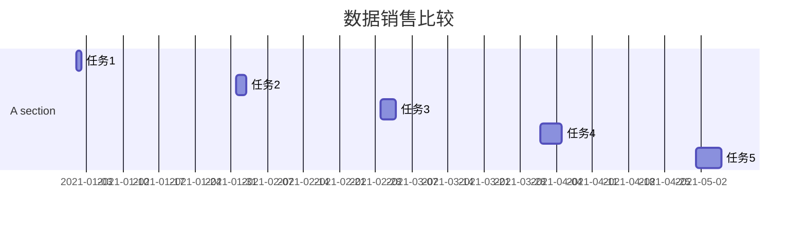
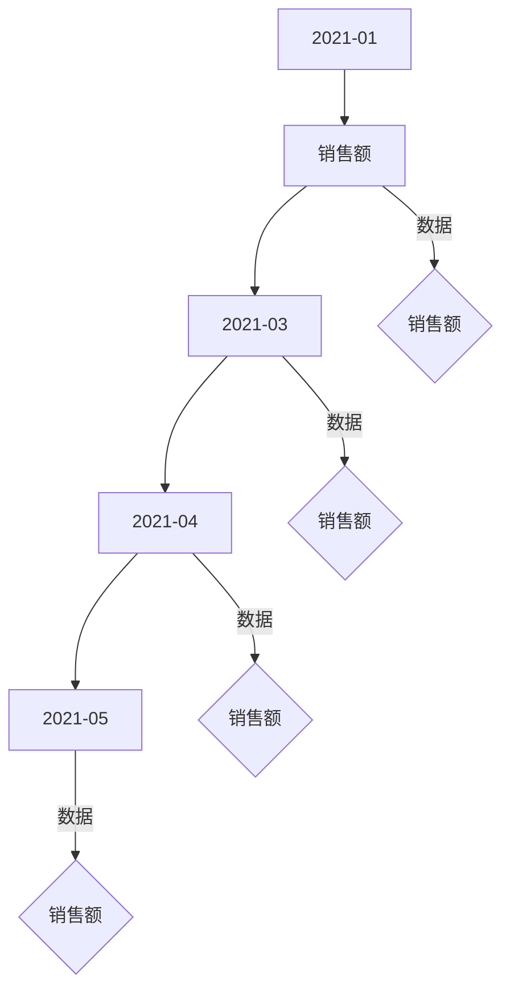
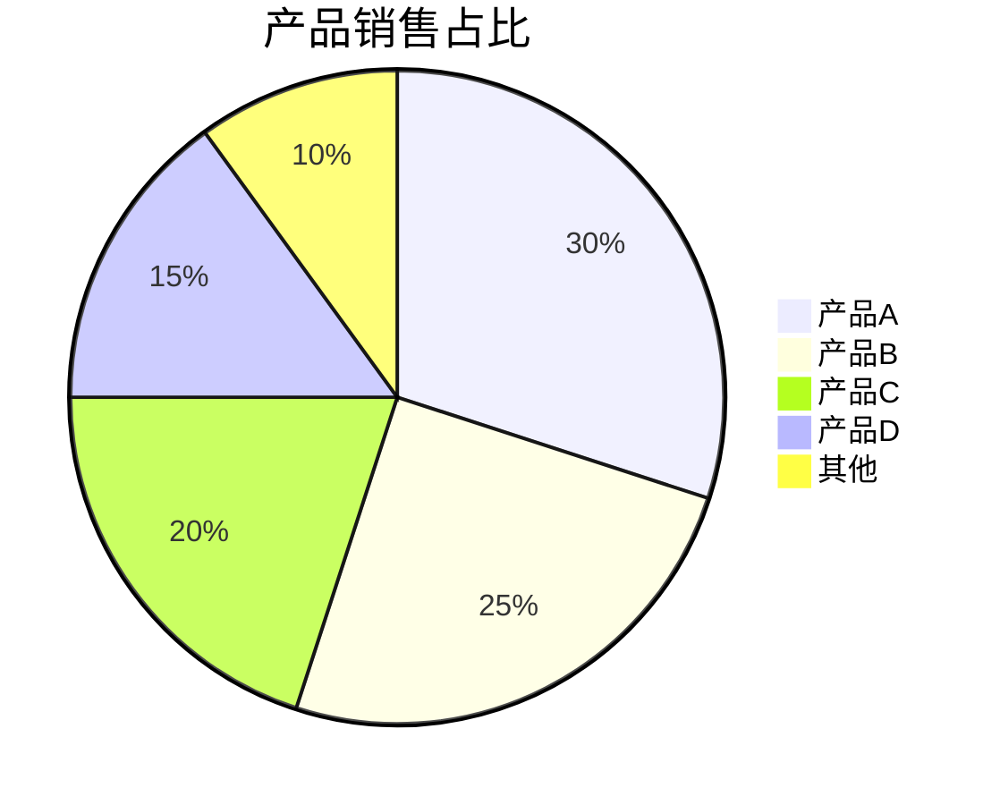
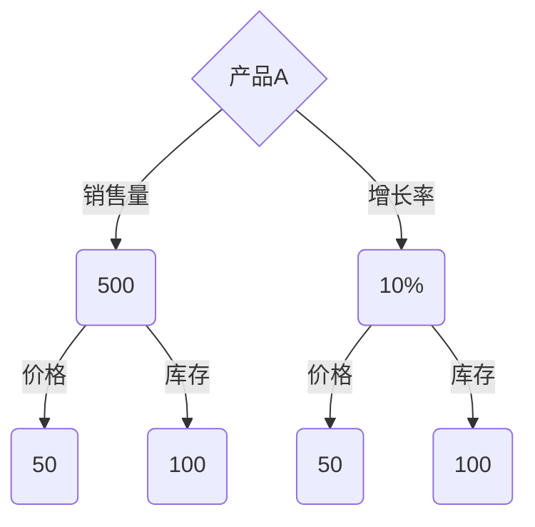

                 

### 数据可视化技术：从图表到交互式仪表板

#### 概述

数据可视化技术是一种将复杂的数据转换为易于理解的可视化图表和交互式仪表板的过程。它不仅帮助用户快速理解数据，还支持数据分析和决策制定。本文将从数据可视化技术的基础、图表类型、交互性设计、核心技术与算法、项目实战以及工具与应用等方面，逐步深入探讨这一领域。

#### 关键词

- 数据可视化
- 图表类型
- 交互性
- 数据处理
- 数学模型
- 项目实战
- 工具与应用

#### 摘要

本文将系统地介绍数据可视化技术的各个方面，包括其基础概念、图表类型、交互性设计、核心技术与算法，以及实际项目中的应用。通过本文的阅读，读者将能够全面了解数据可视化的原理和实践，掌握相关工具和技术，并能够独立开展数据可视化项目。

### 第一部分：数据可视化技术概述

#### 第1章：数据可视化技术基础

1. **数据可视化的定义与意义**

   数据可视化是一种通过图形、图表或其他视觉形式表示数据的方法。其核心目标是将复杂、抽象的数据转化为直观、易于理解的视觉信息。数据可视化的意义在于：

   - **信息传达**：通过视觉形式，数据变得更加易于理解和传达。
   - **模式发现**：可视化可以帮助用户快速发现数据中的模式、趋势和异常。
   - **决策支持**：数据可视化支持更有效的数据分析和决策制定。

2. **数据可视化的发展历程**

   数据可视化的发展经历了几个重要阶段：

   - **早期**：以简单的图表为主，如柱状图、折线图。
   - **现代**：随着计算机技术的发展，数据可视化工具和算法不断进步，如交互式仪表板、大数据可视化。

3. **数据可视化技术的基本原理**

   - **视觉编码原理**：利用视觉特性，如颜色、形状、大小等，来编码数据信息。
   - **认知心理学原理**：基于人类感知和认知的特点，设计易读、直观的图表。

4. **数据可视化工具与技术**

   数据可视化工具包括商业软件和开源库，如Tableau、Power BI、D3.js等。技术方面，涉及矢量图、切片器、热图等。

#### 第2章：数据可视化中的图表类型

1. **常见图表类型**

   - **柱状图**：适合比较不同类别的数据。
   - **折线图**：适合显示数据随时间的变化趋势。
   - **饼图**：适合显示各部分占整体的比例。
   - **散点图**：适合显示两个变量之间的关系。
   - **热图**：适合显示数据的密集程度。

2. **图表设计的最佳实践**

   - **选择合适的图表类型**：根据数据类型和分析目标选择最合适的图表。
   - **避免信息过载**：保持图表简洁，避免过多数据的堆积。
   - **颜色与符号的使用**：使用有意义的颜色和符号来区分数据。

#### 第3章：数据可视化的交互性

1. **交互性在数据可视化中的作用**

   交互性在数据可视化中扮演着重要角色：

   - **增强用户体验**：用户可以动态探索数据，发现更多信息。
   - **提高分析效率**：用户可以快速定位和筛选数据。

2. **交互性设计原则**

   - **直观性**：设计简单的交互操作，易于用户理解。
   - **响应速度**：确保交互操作快速响应，避免延迟。
   - **灵活性**：提供多种交互选项，满足不同用户需求。

3. **交互性实现技术**

   - **鼠标事件**：如点击、悬停、拖动。
   - **触摸事件**：如滑动、长按。
   - **交互组件**：如按钮、滑动条、下拉菜单。

### 第二部分：数据可视化的核心技术与算法

#### 第4章：数据处理与清洗

1. **数据处理的基本步骤**

   - **数据采集**：从各种来源收集数据。
   - **数据清洗**：去除重复、错误或不完整的数据。
   - **数据转换**：将数据转换为适合可视化分析的格式。

2. **数据清洗的方法与技术**

   - **缺失值处理**：填充或删除缺失值。
   - **异常值检测**：使用统计学方法识别和修正异常值。
   - **数据标准化**：将数据缩放到相同范围，便于比较。

#### 第5章：数据可视化中的数学模型

1. **常见的数学模型**

   - **线性回归**：用来预测数值型数据。
   - **逻辑回归**：用来预测分类结果。
   - **聚类分析**：用来发现数据中的自然分组。

2. **数学模型在可视化中的应用**

   - **数据拟合**：使用数学模型拟合数据，生成可视化图表。
   - **预测分析**：基于数学模型预测未来趋势。

#### 第6章：数据可视化算法

1. **数据可视化算法的基本概念**

   - **可视化算法**：将数据转换为图形的算法。
   - **渲染算法**：用于在屏幕上绘制图形的算法。

2. **常见的可视化算法**

   - **层次化布局算法**：用于创建层次结构的图表。
   - **力导向布局算法**：用于生成网络图。
   - **热力图算法**：用于生成数据密集度的热图。

#### 第7章：交互式数据可视化

1. **交互式数据可视化的优点**

   - **动态探索**：用户可以动态交互，探索数据的不同方面。
   - **实时反馈**：用户输入直接影响可视化结果。

2. **交互式数据可视化的实现**

   - **前端框架**：如D3.js、Three.js等，用于创建交互式图表。
   - **数据绑定**：将可视化组件与数据源绑定，实现动态更新。

### 第三部分：数据可视化项目实战

#### 第8章：数据可视化项目实战

1. **实战项目案例介绍**

   - **案例1**：企业销售数据分析。
   - **案例2**：城市交通流量分析。

2. **项目实战步骤**

   - **需求分析**：确定可视化项目目标和用户需求。
   - **数据采集**：收集所需的数据。
   - **数据预处理**：对数据进行清洗和转换。
   - **可视化设计**：设计可视化图表和交互界面。
   - **实现与优化**：编写代码实现可视化功能，并进行优化。

### 第四部分：数据可视化工具与应用

#### 第9章：常见数据可视化工具介绍

1. **常见工具及其特点**

   - **Tableau**：强大的交互式数据可视化工具。
   - **Power BI**：微软推出的企业级数据可视化工具。
   - **D3.js**：用于创建交互式Web数据的JavaScript库。

2. **工具选择与使用技巧**

   - **根据需求选择工具**：根据项目需求和团队技能选择合适的工具。
   - **学习资源与教程**：利用在线教程和社区资源提高使用技能。

#### 第10章：数据可视化在企业中的应用

1. **企业数据可视化的应用场景**

   - **运营监控**：实时监控企业运营状态。
   - **决策支持**：提供数据驱动的决策支持。
   - **市场分析**：深入分析市场数据和客户行为。

2. **企业数据可视化的挑战与解决方案**

   - **数据安全性**：确保数据在传输和存储过程中的安全性。
   - **数据质量**：保证数据准确性和完整性。
   - **用户接受度**：提高用户对数据可视化工具的接受度和使用频率。

### 附录

#### 附录 A：数据可视化技术资源与工具

1. **开源数据可视化库**

   - **D3.js**：用于创建交互式Web数据可视化的库。
   - **Plotly**：用于创建交互式图表和数据可视化的库。

2. **在线数据可视化平台**

   - **Tableau Public**：用于创建和共享数据可视化的平台。
   - **Google Charts**：Google提供的在线数据可视化工具。

3. **学习资源**

   - **在线课程**：如Coursera、Udacity上的数据可视化课程。
   - **技术博客**：如Medium、GitHub上的数据可视化技术博客。

### 结束语

作者：AI天才研究院/AI Genius Institute & 禅与计算机程序设计艺术 /Zen And The Art of Computer Programming

通过本文的详细探讨，我们希望读者能够全面了解数据可视化技术的各个方面，掌握相关工具和技术，并在实际项目中有效应用。数据可视化不仅仅是图表的展示，更是数据分析和决策制定的重要工具。希望本文能为读者在数据可视化领域的学习和实践提供有力支持。在未来的日子里，我们将继续为您带来更多精彩的技术分享。感谢您的阅读，期待您的反馈和探讨！<|user|>### 数据可视化技术基础

#### 数据可视化的定义与意义

数据可视化是一种通过图形、图表或其他视觉形式来表示数据的方法。其核心目标是将复杂、抽象的数据转化为直观、易于理解的视觉信息。这种转化不仅有助于提高信息的传达效率，还能帮助用户快速发现数据中的模式、趋势和异常，从而支持数据分析和决策制定。

数据可视化的定义可以从多个角度进行理解：

1. **技术层面**：数据可视化是一种将数据转换为视觉形式的技术，它涉及到数据转换、图形设计、交互设计等多个方面。
2. **应用层面**：数据可视化是一种应用，它将数据作为输入，通过图形、图表等形式输出，以帮助用户理解数据。
3. **方法层面**：数据可视化是一种分析方法，它通过视觉化的方式揭示数据中的信息，帮助用户从不同角度观察和理解数据。

数据可视化的意义主要体现在以下几个方面：

1. **信息传达**：通过视觉形式，数据变得更加易于理解和传达。相比文字和表格，视觉信息更容易被大脑处理和记忆。
2. **模式发现**：可视化可以帮助用户快速发现数据中的模式、趋势和异常。这对于数据分析和决策制定至关重要。
3. **决策支持**：数据可视化支持更有效的数据分析和决策制定。通过直观的视觉信息，决策者可以更快地做出明智的决策。

#### 数据可视化的发展历程

数据可视化技术的发展历程可以分为几个重要阶段：

1. **早期阶段**：在计算机技术尚未普及的年代，数据可视化主要以手工绘制的图表为主。例如，统计学家威廉·普莱斯（William Playfair）在18世纪就使用了柱状图、折线图等图表来展示数据。

2. **计算机辅助阶段**：随着计算机技术的普及，数据可视化开始借助计算机辅助进行。这一阶段出现了许多早期的数据可视化工具，如SPSS、Excel等，这些工具使得数据可视化变得更加便捷和高效。

3. **现代阶段**：随着互联网和大数据技术的发展，数据可视化进入了一个新的时代。现代数据可视化工具，如Tableau、Power BI、D3.js等，不仅提供了丰富的图表类型和交互功能，还支持大规模数据的处理和实时分析。

4. **交互式数据可视化阶段**：近年来，随着交互技术的进步，交互式数据可视化成为了一个热门研究方向。用户可以通过点击、拖动、滑动等交互操作，动态地探索和挖掘数据，从而获得更深层次的理解。

#### 数据可视化技术的基本原理

数据可视化技术的基本原理可以归结为以下几点：

1. **视觉编码原理**：视觉编码是指利用视觉特性，如颜色、形状、大小等，来编码数据信息。视觉编码的目的是让数据更加直观、易于理解。例如，使用不同的颜色来表示不同类别的数据，使用柱状图的高度来表示数据的大小。

2. **认知心理学原理**：认知心理学研究人类如何感知和理解信息。数据可视化设计时，需要考虑人类的认知特点，设计出易读、直观的图表。例如，遵循人类视觉感知的规律，避免使用过于复杂的图表设计。

3. **信息层次原理**：信息层次是指图表中不同信息之间的层次关系。设计良好的数据可视化应该能够清晰地展示数据之间的层次关系，帮助用户从宏观到微观、从整体到部分地理解数据。

#### 数据可视化工具与技术

数据可视化工具是进行数据可视化工作的基础。以下是一些常见的数据可视化工具：

1. **Tableau**：Tableau 是一款功能强大的数据可视化工具，提供了丰富的图表类型和交互功能。它支持各种数据源，包括数据库、Excel、CSV等，并提供了强大的数据清洗和转换功能。

2. **Power BI**：Power BI 是微软推出的数据可视化工具，与Excel紧密集成，提供了强大的数据分析和可视化功能。它支持实时数据流和大数据处理，可以满足企业的各种数据可视化需求。

3. **D3.js**：D3.js 是一个基于 JavaScript 的开源库，用于创建交互式 Web 数据可视化。它提供了丰富的图表类型和灵活的渲染能力，可以创建各种复杂和动态的图表。

在技术层面，数据可视化涉及多个领域：

1. **图形学**：图形学是数据可视化的重要组成部分，它涉及到如何高效地渲染和处理图形。常见的图形学技术包括矢量图、位图、图形渲染引擎等。

2. **数据结构和算法**：数据结构和算法在数据可视化中发挥着重要作用。例如，层次化布局算法可以用于创建层次结构的图表，力导向布局算法可以用于生成网络图。

3. **交互设计**：交互设计是数据可视化的重要组成部分，它涉及到如何设计用户与图表的交互方式。常见的交互设计技术包括鼠标事件、触摸事件、交互组件等。

#### 总结

数据可视化技术是一种将复杂的数据转化为直观、易于理解的视觉信息的方法。它不仅有助于提高信息传达效率，还能支持数据分析和决策制定。数据可视化的发展历程经历了从手工绘制图表到计算机辅助再到交互式数据可视化的演变。数据可视化技术的基本原理包括视觉编码、认知心理学和信息层次等。常见的数据可视化工具包括 Tableau、Power BI 和 D3.js 等，这些工具和技术为数据可视化工作提供了丰富的功能和灵活的解决方案。

### 第2章：数据可视化中的图表类型

数据可视化图表类型是数据可视化过程中不可或缺的一部分。不同的图表类型适用于不同的数据类型和分析目标，选择合适的图表类型可以更有效地传达数据信息。以下是几种常见的数据可视化图表类型及其特点：

#### 柱状图

柱状图是最常用的数据可视化图表之一，适用于比较不同类别或时间段的数据。柱状图通过不同长度的柱子表示数据的大小，可以直观地显示数据之间的差异。以下是一个柱状图的示例：



在这个示例中，每个柱子代表一个月的销售数据，柱子的高度表示销售数量。通过柱状图，我们可以清晰地看到每个月的销售情况及其变化趋势。

#### 折线图

折线图适用于显示数据随时间的变化趋势。它通过连接数据点的线条来表示数据的变化，适用于时间序列分析。以下是一个折线图的示例：



在这个示例中，每个数据点代表一个时间点的销售额，线条连接这些数据点，显示了销售额随时间的变化趋势。

#### 饼图

饼图适用于显示各部分占整体的比例。它通过一个圆形分割成多个扇形区域来表示不同类别的数据。以下是一个饼图的示例：



在这个示例中，饼图显示了四个主要产品的销售占比，每个扇形区域的大小对应其占比。

#### 散点图

散点图适用于显示两个变量之间的关系。它通过在坐标系中绘制多个数据点来表示变量之间的关系。以下是一个散点图的示例：



在这个示例中，销售量和增长率是两个变量，每个数据点表示一个产品的销售量和增长率。

#### 热图

热图适用于显示数据的密集程度。它通过颜色深浅来表示数据的大小或密集程度，适用于地理数据或时间序列数据的可视化。以下是一个热图的示例：

```mermaid
gantt
    title 热力图示例
    dateFormat  YYYY-MM-DD
    section A section
    日期      : 2021-01-01, 2021-01-02, 2021-01-03, 2021-01-04, 2021-01-05
    销售额    : 100, 150, 200, 250, 300
```

在这个示例中，日期是水平轴，销售额是垂直轴，颜色深浅表示销售额的大小。

#### 图表设计的最佳实践

选择合适的图表类型是数据可视化设计的关键。以下是一些图表设计的最佳实践：

1. **根据数据类型选择图表**：不同的数据类型需要不同的图表类型。例如，比较不同类别的数据使用柱状图，显示数据随时间的变化使用折线图。
2. **避免信息过载**：图表应该简洁明了，避免过多的数据点或信息。如果数据点过多，可以考虑使用分页或交互式筛选。
3. **颜色与符号的使用**：使用有意义的颜色和符号来区分数据，避免使用过多颜色导致视觉混淆。例如，使用不同颜色的柱子来表示不同类别的数据。
4. **图表标题和说明**：每个图表都应该有一个清晰的标题和说明，帮助用户理解图表的内容和目的。

通过合理选择图表类型和遵循最佳实践，我们可以设计出既美观又实用的数据可视化图表，帮助用户更好地理解数据。

### 第3章：数据可视化的交互性

交互性是现代数据可视化的重要组成部分，它使得用户可以与数据可视化图表进行动态交互，从而更深入地探索和分析数据。通过交互性设计，用户可以实时地筛选、过滤和操作数据，从而获得更加个性化的数据洞察。以下是数据可视化交互性的作用、设计原则和实现技术。

#### 交互性在数据可视化中的作用

1. **增强用户体验**：交互性使得用户可以动态地探索数据，提供了更加丰富的用户体验。用户可以轻松地查看数据的不同部分，而不必依赖预定义的视图。
2. **提高分析效率**：交互性允许用户快速定位和筛选数据，从而提高数据分析和决策制定的效率。例如，用户可以通过点击、拖动或滑动等操作快速筛选特定时间段或区域的数据。
3. **实时反馈**：交互性提供了实时反馈，用户可以在操作数据时立即看到结果，这种即时性有助于用户快速理解数据和做出决策。

#### 交互性设计原则

1. **直观性**：设计简单的交互操作，确保用户能够快速理解并使用交互功能。例如，使用常见的交互元素，如按钮、滑动条和下拉菜单，避免复杂的设计。
2. **响应速度**：确保交互操作快速响应，避免延迟。如果交互操作过慢，用户可能会感到沮丧并放弃使用数据可视化工具。
3. **灵活性**：提供多种交互选项，满足不同用户的需求。例如，可以提供多种筛选方式，如按时间段、地区、类别等，以便用户根据不同需求进行数据操作。
4. **易用性**：确保交互界面易于使用，避免不必要的复杂性和学习成本。例如，提供清晰的指导说明和帮助文档。

#### 交互性实现技术

1. **鼠标事件**：鼠标事件是交互性实现的基础，包括点击（click）、悬停（mouseover）、拖动（mousedown、mousemove、mouseup）等。这些事件可以用于响应用户的操作，实现数据的动态筛选和过滤。

```javascript
// 示例：点击按钮更新图表数据
document.getElementById('updateButton').addEventListener('click', function() {
    // 更新图表数据的逻辑
});
```

2. **触摸事件**：随着移动设备的普及，触摸事件（如touchstart、touchmove、touchend）也变得非常重要。触摸事件允许用户在触摸屏上通过滑动、长按等操作与图表交互。

```javascript
// 示例：触摸滑动更新图表
document.addEventListener('touchmove', function(event) {
    // 获取触摸位置的逻辑
    // 更新图表数据的逻辑
});
```

3. **交互组件**：交互组件如按钮、滑动条、下拉菜单等，提供了直观的交互方式。这些组件可以帮助用户进行数据筛选、排序和过滤。

```html
<!-- 示例：下拉菜单选择分类 -->
<select id="categorySelector">
    <option value="all">全部</option>
    <option value="category1">分类1</option>
    <option value="category2">分类2</option>
    <option value="category3">分类3</option>
</select>
```

4. **动态更新**：通过数据绑定技术，可以实现图表与数据的动态更新。当数据发生变化时，图表会实时更新以反映最新的数据状态。

```javascript
// 示例：使用D3.js绑定数据更新图表
d3.select('#chart').datum(data).call(updateChart);
```

通过上述技术，数据可视化可以提供丰富的交互性，帮助用户更好地理解和分析数据。在设计交互性时，需要遵循直观性、响应速度、灵活性和易用性等原则，确保用户能够轻松地与数据可视化图表进行互动。

### 第4章：数据处理与清洗

数据是数据可视化项目的基石，然而，现实中的数据往往存在各种问题和缺陷，如缺失值、异常值、重复值等。这些问题如果不加以处理，会对数据分析和可视化结果产生严重影响。因此，数据处理与清洗是数据可视化项目的重要环节。本章将详细探讨数据处理与清洗的基本步骤、常见方法和技术。

#### 数据处理的基本步骤

数据处理与清洗通常包括以下几个基本步骤：

1. **数据采集**：从各种来源收集数据，如数据库、文件系统、API接口等。
2. **数据导入**：将采集到的数据导入数据可视化工具或分析平台。
3. **数据清洗**：去除重复、错误或不完整的数据，确保数据的准确性和完整性。
4. **数据转换**：将数据转换为适合可视化分析的格式，如调整数据类型、缩放数据范围等。
5. **数据存储**：将清洗和转换后的数据存储在数据库或文件系统中，以供后续使用。

#### 数据清洗的方法与技术

1. **缺失值处理**：缺失值是数据中最常见的问题之一。处理缺失值的方法主要包括以下几种：

   - **删除缺失值**：对于缺失值较多的数据，可以考虑删除含有缺失值的记录，以减少数据噪声。
   - **填充缺失值**：对于缺失值较少的数据，可以使用平均值、中位数、众数等统计方法来填充缺失值。例如，在销售数据中，可以使用上一周期的销售量来填充当前周期的缺失值。

   ```python
   # 示例：使用平均值填充缺失值
   from sklearn.impute import SimpleImputer
   imputer = SimpleImputer(missing_values=np.nan, strategy='mean')
   imputer.fit(data)
   data_imputed = imputer.transform(data)
   ```

2. **异常值检测**：异常值是数据中的异常数据点，可能是由错误、噪声或特殊情况引起的。检测异常值的方法主要包括以下几种：

   - **基于统计学的方法**：使用统计方法，如标准差、四分位距等，识别离群点。例如，如果数据点的值远大于或小于三个标准差，可以认为它是异常值。
   - **基于机器学习的方法**：使用机器学习方法，如孤立森林（Isolation Forest）、局部异常因子（Local Outlier Factor）等，检测异常值。

   ```python
   # 示例：使用Isolation Forest检测异常值
   from sklearn.ensemble import IsolationForest
   iso_forest = IsolationForest(contamination=0.1)
   outliers = iso_forest.fit_predict(data)
   data_clean = data[outliers != -1]
   ```

3. **重复值处理**：重复值是指数据表中存在重复的记录。处理重复值的方法主要包括以下几种：

   - **基于完整性的方法**：保留所有重复值，以保持数据的完整性。
   - **基于唯一性的方法**：只保留唯一值，删除重复记录。

   ```python
   # 示例：使用pandas删除重复值
   data_deduplicated = data.drop_duplicates()
   ```

4. **数据转换**：数据转换是将原始数据转换为适合可视化分析的格式。常见的数据转换方法包括以下几种：

   - **数据类型转换**：将数据类型从字符串转换为数值型，以便进行数学运算和可视化。
   - **数据缩放**：将数据缩放到相同的范围，以便进行比较和分析。

   ```python
   # 示例：将数据缩放到[0, 1]范围
   from sklearn.preprocessing import MinMaxScaler
   scaler = MinMaxScaler()
   data_scaled = scaler.fit_transform(data)
   ```

#### 数据清洗的实际案例

下面是一个数据清洗的实际案例，假设我们有一个销售数据的CSV文件，其中包含销售额、增长率、价格和库存等信息。我们需要对数据进行清洗，以便进行后续的数据可视化分析。

1. **导入数据**：

   ```python
   import pandas as pd
   
   data = pd.read_csv('sales_data.csv')
   ```

2. **处理缺失值**：

   ```python
   # 使用平均值填充销售额的缺失值
   data['sales'].fillna(data['sales'].mean(), inplace=True)
   
   # 使用中位数填充增长率的缺失值
   data['growth_rate'].fillna(data['growth_rate'].median(), inplace=True)
   ```

3. **检测和删除异常值**：

   ```python
   # 使用标准差方法检测异常值
   sales_std = data['sales'].std()
   sales_mean = data['sales'].mean()
   sales_threshold = sales_mean + 3 * sales_std
   
   # 删除销售额高于阈值的异常值
   data = data[data['sales'] <= sales_threshold]
   ```

4. **处理重复值**：

   ```python
   # 删除重复记录
   data = data.drop_duplicates()
   ```

5. **数据转换**：

   ```python
   # 将销售额缩放到[0, 1]范围
   scaler = MinMaxScaler()
   data['sales_scaled'] = scaler.fit_transform(data[['sales']])
   
   # 将价格缩放到[0, 1]范围
   data['price_scaled'] = scaler.fit_transform(data[['price']])
   ```

通过上述步骤，我们成功地清洗了销售数据，消除了缺失值、异常值和重复值，并将数据转换为适合可视化分析的格式。清洗后的数据可以更准确地反映销售情况，为后续的数据可视化提供可靠的数据基础。

#### 总结

数据处理与清洗是数据可视化项目的重要环节，它确保了数据的质量和准确性。通过缺失值处理、异常值检测、重复值处理和数据转换等技术，我们可以清洗出高质量的数据，为数据可视化提供坚实的基础。在数据可视化项目中，合理的数据处理与清洗不仅能够提高数据的可用性，还能帮助用户更好地理解和分析数据。因此，在开展数据可视化项目时，务必重视数据处理与清洗的每个步骤。

### 第5章：数据可视化中的数学模型

在数据可视化中，数学模型扮演着至关重要的角色。这些模型不仅帮助我们理解和解释数据，还能预测未来的趋势。本章将介绍一些常见的数学模型，并详细探讨它们在数据可视化中的应用。

#### 常见的数学模型

1. **线性回归**

线性回归是最常用的统计模型之一，用于预测数值型数据。它的基本形式是：

   $$
   y = \beta_0 + \beta_1 \cdot x + \epsilon
   $$

   其中，$y$ 是因变量，$x$ 是自变量，$\beta_0$ 和 $\beta_1$ 是模型参数，$\epsilon$ 是误差项。线性回归模型的核心是找到最佳拟合线，使得预测值与实际值之间的误差最小。

   **应用示例**：在销售数据中，我们可以使用线性回归模型来预测未来的销售额。通过历史数据，我们可以找到销售量和时间之间的关系，并使用该模型预测未来的销售额。

2. **逻辑回归**

逻辑回归是一种用于分类问题的统计模型，它通过线性回归模型来预测概率。逻辑回归的预测公式是：

   $$
   \ln\left(\frac{p}{1-p}\right) = \beta_0 + \beta_1 \cdot x
   $$

   其中，$p$ 是事件发生的概率，$\beta_0$ 和 $\beta_1$ 是模型参数。通过这个公式，我们可以将线性回归的输出转换为概率。

   **应用示例**：在市场调研中，我们可以使用逻辑回归模型来预测客户是否愿意购买某种产品。通过分析历史数据，我们可以找到影响客户购买意愿的关键因素，并使用逻辑回归模型来预测客户的购买概率。

3. **聚类分析**

聚类分析是一种无监督学习方法，用于发现数据中的自然分组。最简单的聚类算法是K-means算法，它的目标是找到K个簇，使得每个簇内的数据点尽可能接近，而簇与簇之间的数据点尽可能远。

   **应用示例**：在客户细分中，我们可以使用K-means算法来将客户分为不同的群体。通过分析客户的行为数据，我们可以发现具有相似特征的客户群体，并针对每个群体制定不同的营销策略。

#### 数学模型在数据可视化中的应用

1. **数据拟合**

数据拟合是指使用数学模型来拟合实际数据，以便生成可视化图表。例如，使用线性回归模型来拟合销售数据，可以生成销售趋势图。数据拟合不仅帮助用户理解数据，还能提供预测分析。

2. **预测分析**

预测分析是数学模型在数据可视化中的另一个重要应用。通过预测模型，我们可以预测未来的数据趋势。例如，使用线性回归模型预测未来的销售额，可以帮助企业制定更准确的销售计划。

3. **异常检测**

异常检测是指使用数学模型来识别数据中的异常值。通过分析异常值，我们可以发现潜在的问题或异常行为。例如，使用逻辑回归模型来识别异常订单，可以帮助企业及时发现并处理问题。

#### 实际案例

假设我们有一个销售数据集，包含销售额、增长率、价格和库存等信息。我们希望使用线性回归模型来预测未来的销售额。

1. **数据预处理**：

   - 处理缺失值和异常值。
   - 转换数据类型，确保所有数据都是数值型。

2. **线性回归建模**：

   ```python
   import pandas as pd
   from sklearn.linear_model import LinearRegression

   data = pd.read_csv('sales_data.csv')
   X = data[['growth_rate', 'price', 'inventory']]
   y = data['sales']

   model = LinearRegression()
   model.fit(X, y)
   ```

3. **预测分析**：

   ```python
   future_data = pd.DataFrame({
       'growth_rate': [0.05, 0.08, 0.03],
       'price': [50, 60, 55],
       'inventory': [100, 120, 110]
   })

   predictions = model.predict(future_data)
   print(predictions)
   ```

通过上述步骤，我们成功地使用线性回归模型预测了未来的销售额。这个预测结果可以帮助企业制定销售策略，确保库存和定价的合理性。

#### 总结

数学模型在数据可视化中具有重要作用，它们不仅帮助用户理解和解释数据，还能提供预测分析和异常检测。常见的数学模型包括线性回归、逻辑回归和聚类分析，这些模型在数据可视化中有着广泛的应用。通过实际案例，我们展示了如何使用线性回归模型来预测未来的销售额。掌握这些数学模型，将有助于我们更有效地进行数据分析和可视化。

### 第6章：数据可视化算法

数据可视化算法是数据可视化过程中的核心技术，它们负责将数据转换为可视化的图形表示。这些算法不仅决定了图表的视觉效果，还影响了用户与数据的交互体验。本章将详细讨论几种常见的数据可视化算法，包括层次化布局算法、力导向布局算法和热力图算法。

#### 层次化布局算法

层次化布局算法用于创建具有层次结构的图表，如组织结构图、树状图等。这类算法的核心目标是将具有层级关系的数据以图形方式呈现，使得用户可以清晰地理解数据之间的层次关系。

1. **二分查找树（Binary Tree）**

二分查找树是一种常见的层次化布局算法，用于表示具有父子关系的节点。在二分查找树中，每个节点都有两个子节点，左子节点小于当前节点，右子节点大于当前节点。

   **伪代码**：

   ```
   function insert(node, key):
       if key < node.value:
           if node.left is None:
               node.left = createNode(key)
           else:
               insert(node.left, key)
       else:
           if node.right is None:
               node.right = createNode(key)
           else:
               insert(node.right, key)
   ```

   **应用示例**：在财务报表分析中，可以使用二分查找树来表示不同层级的财务数据，如总资产、净利润等。

2. **树状图（Tree Diagram）**

树状图是一种将数据层次结构以图形形式呈现的图表。它通过父子关系将数据组织成一个树形结构，便于用户理解。

   **应用示例**：在项目管理和组织架构分析中，树状图可以清晰地展示项目的不同阶段、任务和团队成员之间的关系。

#### 力导向布局算法

力导向布局算法用于生成网络图，如社交网络图、交通网络图等。这类算法通过模拟物理力场，使节点和边在布局过程中相互吸引或排斥，最终形成一个稳定的图形。

1. **力导向布局（Force-directed Layout）**

力导向布局算法的核心思想是模拟物理力场中的相互作用力，如电荷之间的库仑力、弹簧之间的胡克力等。通过计算这些力，算法可以逐步调整节点的位置，使图形成一个低能量状态。

   **伪代码**：

   ```
   function forceDirectedLayout(nodes, edges):
       for each node n in nodes:
           repulsiveForce = sum(repulsiveForce(n, m) for m in nodes if m != n)
           attractiveForce = sum(attractiveForce(n, e.target) for e in edges if e.source == n)
           n.position += (repulsiveForce - attractiveForce) / n.mass
   ```

   **应用示例**：在社会网络分析中，力导向布局可以用于生成用户之间的社交网络图，展示用户之间的相互关系。

2. **力导向布局的优化**

力导向布局算法的一个主要挑战是计算效率。为了提高计算效率，可以采用以下优化方法：

   - **分层布局**：首先将节点分层，然后逐步布局每一层，减少计算复杂度。
   - **多线程计算**：利用多线程或并行计算技术，加速布局过程。

#### 热力图算法

热力图算法用于生成反映数据密集程度的可视化图表，如热力图矩阵、热力地图等。这类算法通过颜色深浅来表示数据的大小或密集程度，帮助用户直观地理解数据分布。

1. **热力图矩阵（Heat Map Matrix）**

热力图矩阵是一种用于表示多维数据的图表，它通过颜色深浅来表示数据的大小或密集程度。热力图矩阵通常用于市场分析和销售数据展示。

   **伪代码**：

   ```
   function generateHeatMapMatrix(data):
       min_value = min(data)
       max_value = max(data)
       for each value v in data:
           color = interpolateColor(min_value, max_value, v)
           plot(v, color)
   ```

   **应用示例**：在市场分析中，热力图矩阵可以用于展示不同区域的市场需求，帮助销售团队制定更有效的销售策略。

2. **热力地图（Heat Map Map）**

热力地图是一种用于表示地理数据的图表，它通过颜色深浅来表示地理位置上的数据密度。热力地图通常用于交通流量分析和人口分布分析。

   **应用示例**：在交通管理中，热力地图可以用于展示城市不同区域的交通流量，帮助交通管理部门优化交通路线和信号灯设置。

#### 总结

数据可视化算法在数据可视化过程中发挥着关键作用，它们帮助我们将复杂的数据转换为易于理解的视觉表示。常见的可视化算法包括层次化布局算法、力导向布局算法和热力图算法，这些算法在多个领域有着广泛的应用。通过合理选择和优化这些算法，我们可以设计出更加高效、直观和实用的数据可视化图表，帮助用户更好地理解和分析数据。

### 第7章：交互式数据可视化

交互式数据可视化是数据可视化领域的一个重要发展方向，它通过用户的交互操作，使得数据可视化不仅能够展示数据，还能够动态地更新和探索数据。这种交互性极大地提升了用户对数据的理解和分析能力。本章将详细介绍交互式数据可视化的优点、设计原则以及实现技术。

#### 交互式数据可视化的优点

1. **动态探索**：交互式数据可视化允许用户动态地探索数据，通过点击、拖动、滑动等操作，用户可以查看数据的各个细节，发现潜在的模式和趋势。

2. **实时反馈**：交互式数据可视化能够实时地反映用户的操作，用户在做出选择或调整后，可视化结果会立即更新，提供即时的反馈。

3. **定制化分析**：用户可以根据自己的需求，自定义数据可视化的展示方式，例如选择不同的图表类型、调整数据范围、过滤特定数据等。

4. **提高效率**：交互式数据可视化可以大大提高数据分析的效率。用户可以快速地定位感兴趣的数据点，而不需要逐行查看表格或长篇报告。

#### 交互性设计原则

1. **直观性**：交互设计应当直观易懂，用户无需复杂的操作就可以实现数据的探索和分析。例如，使用常见的交互组件，如按钮、滑动条和下拉菜单。

2. **响应速度**：交互操作应当快速响应，避免用户等待时间过长。为了提高响应速度，可以使用本地计算和优化渲染技术。

3. **灵活性**：交互设计应当提供多种交互方式，以适应不同的用户需求和场景。例如，对于桌面应用，可以使用鼠标和键盘进行交互；对于移动设备，可以使用触摸屏进行交互。

4. **一致性**：交互设计应当保持一致性，使得用户在多个不同的界面或操作中能够保持相同的交互体验。

5. **易用性**：交互设计应当易于使用，避免复杂的步骤和过多的选项，使得用户能够快速上手。

#### 交互性实现技术

1. **前端框架**：前端框架如D3.js、Three.js等，为创建交互式数据可视化提供了强大的功能。这些框架可以帮助开发者快速搭建交互式的Web图表。

2. **数据绑定**：数据绑定是将数据源与可视化组件动态连接起来的技术。当数据源发生变化时，可视化组件能够自动更新，保持数据的实时性。

   ```javascript
   // 使用D3.js进行数据绑定
   const data = [4, 8, 15, 16, 23, 42];
   const svg = d3.select("svg");
   const rect = svg.selectAll("rect").data(data);
   rect.enter().append("rect")
       .attr("width", d => d * 10)
       .attr("height", 10)
       .attr("x", (d, i) => i * 10);
   ```

3. **交互组件**：交互组件如按钮、滑动条、下拉菜单等，是交互式数据可视化的重要组成部分。这些组件可以响应用户的操作，实现数据的筛选、排序和过滤。

   ```html
   <!-- 示例：滑动条筛选数据 -->
   <input type="range" min="0" max="100" value="50" class="slider" id="myRange">
   ```

4. **响应式设计**：响应式设计使得数据可视化可以适应不同的设备和屏幕尺寸，提供一致的用户体验。这通常涉及到使用CSS媒体查询和灵活的布局技术。

5. **动态更新**：动态更新是交互式数据可视化的核心。通过监听用户操作和实时数据流，可视化组件可以动态地更新，以反映最新的数据状态。

   ```javascript
   // 示例：动态更新图表
   d3.select(".bar").data(dataNew).transition().duration(750).attr("y", d => y(d));
   ```

#### 实现案例

以下是一个简单的交互式数据可视化实现案例，使用D3.js创建一个可滑动的折线图，用户可以通过滑动条调整数据范围。

1. **HTML结构**：

   ```html
   <div id="chart-container">
       <svg width="800" height="400"></svg>
       <input type="range" min="0" max="100" value="50" class="slider" id="data-range">
   </div>
   ```

2. **JavaScript代码**：

   ```javascript
   const data = [...]; // 假设已有数据
   const width = 800;
   const height = 400;
   const margin = { top: 20, right: 20, bottom: 30, left: 40 };
   const innerWidth = width - margin.left - margin.right;
   const innerHeight = height - margin.top - margin.bottom;

   const x = d3.scaleLinear().range([0, innerWidth]);
   const y = d3.scaleLinear().range([innerHeight, 0]);

   const svg = d3.select("svg")
       .attr("width", width)
       .attr("height", height);

   const chart = svg.append("g")
       .attr("transform", `translate(${margin.left}, ${margin.top})`);

   const line = d3.line()
       .x(d => x(d.x))
       .y(d => y(d.y));

   function updateChart(data) {
       x.domain([0, d3.max(data, d => d.x)]);
       y.domain([0, d3.max(data, d => d.y)]);

       chart.selectAll(".line").data([data]).join(
           enter => enter.append("path").attr("class", "line"),
           update => update,
           exit => exit.remove()
       ).attr("d", line);

       const slider = d3.select("#data-range");
       slider.on("input", function() {
           const range = slider.property("value");
           const filteredData = data.filter(d => d.x >= range && d.x <= range + 10);
           updateChart(filteredData);
       });
   }

   updateChart(data);
   ```

在这个案例中，我们创建了一个可滑动的折线图。用户可以通过滑动条调整数据范围，图表会实时更新以反映最新的数据状态。这个简单的实现展示了交互式数据可视化的一些基本原理和实现技术。

#### 总结

交互式数据可视化通过用户的交互操作，使得数据可视化更加动态和灵活，为用户提供了更深入的探索和分析能力。本章介绍了交互式数据可视化的优点、设计原则和实现技术，并通过一个简单的实现案例展示了交互式数据可视化的基本原理。掌握这些技术，将有助于我们更好地利用交互性提升数据可视化的效果。

### 第8章：数据可视化项目实战

在掌握了数据可视化的基本理论和工具后，进行实际项目实战是巩固知识并提升技能的关键步骤。本章节将通过两个具体的实战案例——企业销售数据分析和城市交通流量分析，详细讲解数据可视化项目从需求分析到数据预处理、可视化设计、实现与优化的全过程。

#### 实战项目案例介绍

**案例1：企业销售数据分析**

背景：一家大型零售企业需要对其销售数据进行分析，以了解产品的销售趋势、区域差异和潜在的销售机会。

目标：通过数据可视化工具，帮助企业管理层识别畅销产品、了解销售瓶颈，并制定相应的营销策略。

**案例2：城市交通流量分析**

背景：一个城市的交通管理部门需要对其交通流量进行分析，以优化交通信号灯设置和道路规划。

目标：通过数据可视化，帮助交通管理部门识别高峰期交通拥堵的路段，制定交通疏导方案，提高城市交通效率。

#### 项目实战步骤

**1. 需求分析**

需求分析是项目启动的第一步，其目的是明确项目目标和用户需求。在这个阶段，需要与项目 stakeholders（利益相关者）进行沟通，了解他们的具体需求。

- **案例1：企业销售数据分析**

  需求：

  - 销售趋势分析：了解不同时间段、不同产品的销售情况。
  - 区域销售分析：了解不同地区、不同渠道的销售表现。
  - 产品销量排名：识别畅销产品和滞销产品。

- **案例2：城市交通流量分析**

  需求：

  - 交通流量热图：显示不同时间段、不同路段的交通流量。
  - 交通拥堵分析：识别高峰期交通拥堵的路段和时间段。
  - 车流量预测：预测未来一段时间内的交通流量情况。

**2. 数据采集**

数据采集是项目实施的重要环节，数据的质量直接影响后续的数据分析和可视化结果。在这个阶段，需要从各种数据源（如数据库、API、文件系统等）收集所需的数据。

- **案例1：企业销售数据分析**

  数据源：

  - 销售数据库：包含销售额、产品名称、销售日期、销售区域等信息。
  - 客户数据库：包含客户姓名、联系方式、购买记录等信息。

- **案例2：城市交通流量分析**

  数据源：

  - 交通流量传感器：实时收集不同路段的车流量数据。
  - GPS数据：记录车辆的行驶路线和速度。

**3. 数据预处理**

数据预处理包括数据清洗、数据转换和数据归一化等步骤，以确保数据的质量和一致性。

- **案例1：企业销售数据分析**

  处理步骤：

  - 去除重复和错误数据。
  - 填充缺失值，如销售额的空值可以用上一周期的销售额填充。
  - 转换数据类型，确保所有数据都是数值型。
  - 归一化数据，如将销售额缩放到[0, 1]范围。

- **案例2：城市交通流量分析**

  处理步骤：

  - 清洗GPS数据，去除异常数据。
  - 转换时间戳为本地时间。
  - 根据传感器位置，将车流量数据分配到不同的路段。

**4. 可视化设计**

可视化设计是数据可视化的核心环节，需要根据需求选择合适的图表类型和布局，设计出直观、易用的可视化界面。

- **案例1：企业销售数据分析**

  设计：

  - 销售趋势图：使用折线图显示不同时间段的销售趋势。
  - 区域销售地图：使用热力图显示不同地区的销售密度。
  - 产品销量排名表：使用条形图显示畅销产品和滞销产品。

- **案例2：城市交通流量分析**

  设计：

  - 交通流量热图：使用热力图显示不同路段的车流量。
  - 交通拥堵地图：使用标记地图显示交通拥堵的路段和时间段。
  - 车流量预测图：使用折线图显示未来一段时间内的车流量预测。

**5. 实现与优化**

实现与优化是将设计转化为实际可视化图表的过程，需要编写代码实现可视化功能，并对性能和用户体验进行优化。

- **案例1：企业销售数据分析**

  实现：

  - 使用D3.js或Tableau等工具实现可视化图表。
  - 使用JavaScript实现动态数据更新和交互功能。
  - 优化渲染性能，确保图表加载速度快、响应灵敏。

- **案例2：城市交通流量分析**

  实现：

  - 使用D3.js或Google Maps API实现交通流量热图和拥堵地图。
  - 使用数据处理库（如Pandas）进行数据预处理。
  - 优化地图渲染，确保在不同设备和屏幕尺寸上都能良好展示。

#### 项目实战中的挑战与解决方案

在数据可视化项目实战中，可能会遇到以下挑战：

1. **数据质量**：数据质量差会影响可视化效果。解决方案包括严格的数据清洗和验证，确保数据的准确性和完整性。
2. **性能优化**：大规模数据和高频数据更新可能导致性能下降。解决方案包括优化数据结构和算法，使用局部更新和异步加载技术。
3. **用户交互**：复杂的交互设计可能导致用户操作不便。解决方案包括简化交互流程，提供清晰的指导说明和帮助文档。

通过以上步骤，我们可以成功地完成数据可视化项目，为企业和城市管理部门提供有力的数据支持和决策依据。

### 第9章：常见数据可视化工具介绍

在数据可视化领域，有许多强大的工具可供选择，这些工具各具特色，适用于不同的应用场景和需求。以下将介绍几种常见的数据可视化工具，并讨论如何根据项目需求选择合适的工具。

#### Tableau

Tableau 是一款功能强大的交互式数据可视化工具，广泛应用于企业、政府和学术界。它提供了丰富的图表类型和交互功能，支持多种数据源，如数据库、Excel、CSV等。Tableau 的优势在于其易用性和灵活性，用户无需编程技能即可创建复杂的可视化图表。

**特点**：

- **强大的交互功能**：支持筛选、排序、过滤等操作，用户可以动态探索数据。
- **多种图表类型**：包括柱状图、折线图、饼图、地图等。
- **自定义仪表板**：可以自定义仪表板布局，将多个图表和组件整合到一个界面上。
- **易于扩展**：Tableau 提供了 APIs 和 SDK，方便开发者进行扩展和定制。

**适用场景**：Tableau 适用于需要快速创建和共享数据可视化的企业级应用，特别适合业务分析和市场调研。

#### Power BI

Power BI 是微软推出的企业级数据可视化工具，与 Microsoft Office 紧密集成，提供了强大的数据分析和可视化功能。它支持实时数据流和大数据处理，可以满足企业的各种数据可视化需求。

**特点**：

- **实时数据流**：支持实时数据更新，用户可以实时监控业务状态。
- **丰富的数据连接**：支持多种数据源，包括 SQL Server、Excel、Oracle 等。
- **自定义仪表板**：提供了丰富的仪表板布局选项，用户可以自定义仪表板布局。
- **自动化报告**：支持自动化报告生成，方便用户定期查看数据报告。

**适用场景**：Power BI 适用于需要处理大规模数据和自动化报告生成的企业级应用，特别适合财务管理、人力资源分析等场景。

#### D3.js

D3.js 是一个基于 JavaScript 的开源库，用于创建交互式 Web 数据可视化。它提供了丰富的图表类型和灵活的渲染能力，可以创建各种复杂和动态的图表。

**特点**：

- **高度可定制**：D3.js 提供了大量的自定义选项，用户可以根据需求进行定制。
- **交互性强**：支持多种交互事件，如点击、悬停、拖动等。
- **动态更新**：支持动态数据绑定，图表可以实时更新。
- **响应式设计**：支持响应式布局，适用于不同设备和屏幕尺寸。

**适用场景**：D3.js 适用于需要高度定制化和交互式的 Web 数据可视化项目，特别适合数据科学家和前端开发人员。

#### matplotlib

matplotlib 是一个 Python 库，用于创建静态、交互式和动画图表。它是数据科学家和研究人员常用的工具，可以轻松地生成高质量的图表。

**特点**：

- **简单易用**：提供了大量的图表类型和函数，用户可以快速生成图表。
- **丰富的可视化选项**：支持多种图表类型，如线图、柱状图、散点图等。
- **易于集成**：与 Python 生态系统的其他库（如 NumPy、Pandas）无缝集成。
- **可视化库**：支持 Matplotlib、Seaborn、Plotly 等库。

**适用场景**：matplotlib 适用于需要生成静态图表和进行科学计算的项目，特别适合数据科学家和研究人员。

#### 选择工具的考虑因素

选择数据可视化工具时，需要考虑以下几个因素：

- **项目需求**：根据项目的具体需求，选择适合的工具。例如，需要快速创建图表的可以选择 Tableau 或 Power BI，需要高度定制化的可以选择 D3.js。
- **团队技能**：考虑团队成员的技术背景和熟练程度，选择合适的工具。
- **数据源**：根据数据源的类型和格式，选择支持相应数据源的工具。
- **性能要求**：考虑数据量和更新频率，选择性能优秀的工具。

通过综合考虑这些因素，可以有效地选择合适的数据可视化工具，提高数据分析和可视化的效率和效果。

### 第10章：数据可视化在企业中的应用

数据可视化在企业管理中扮演着日益重要的角色，它通过将复杂的数据转化为直观的图表和仪表板，帮助企业更好地理解业务状况、识别趋势、发现问题和制定决策。本章将探讨数据可视化在企业中的应用场景、面临的挑战以及相应的解决方案。

#### 应用场景

1. **运营监控**：企业通过数据可视化实时监控业务运营情况，如销售业绩、库存水平、生产进度等。通过仪表板，管理层可以快速了解当前运营状态，及时发现问题并采取行动。

2. **决策支持**：数据可视化提供数据驱动的决策支持，帮助管理层基于准确和全面的数据做出明智的决策。例如，通过销售趋势分析和市场预测，企业可以制定更有效的营销策略。

3. **市场分析**：数据可视化帮助企业深入分析市场数据和客户行为，识别市场趋势和潜在客户。通过客户细分和市场细分，企业可以更好地定位目标市场，制定精准的营销策略。

4. **风险管理**：数据可视化帮助企业识别和评估潜在的风险。例如，通过财务报表分析和风险预警系统，企业可以及时发现异常情况并采取预防措施。

5. **人力资源**：数据可视化在人力资源管理中的应用包括员工绩效分析、招聘效果评估和员工流动率分析等。通过数据可视化，企业可以更好地管理人力资源，提升员工满意度。

#### 挑战

1. **数据质量**：高质量的数据是数据可视化成功的关键。然而，实际业务中常常存在数据缺失、异常值和数据不一致等问题，这些问题会影响数据可视化的准确性和可靠性。

   **解决方案**：

   - **数据清洗**：在数据进入可视化工具之前，进行数据清洗，去除重复、错误和不完整的数据。
   - **数据标准化**：统一数据格式和单位，确保数据的一致性和可比性。

2. **数据安全性**：数据可视化工具中处理的数据可能包含敏感信息，如财务数据、客户信息等。确保数据的安全性是企业面临的重要挑战。

   **解决方案**：

   - **数据加密**：对敏感数据进行加密处理，确保数据在传输和存储过程中的安全性。
   - **访问控制**：设置严格的访问控制策略，仅允许授权用户访问敏感数据。

3. **用户接受度**：数据可视化工具的使用需要用户具备一定的技术素养和理解能力。如果用户对工具不熟悉或难以理解图表，可能会影响数据可视化的应用效果。

   **解决方案**：

   - **培训与支持**：为用户提供培训和技术支持，帮助他们熟悉工具的使用方法。
   - **直观设计**：设计简洁、直观的仪表板，使用户能够轻松理解图表和数据。

4. **工具选择**：市场上存在多种数据可视化工具，选择合适的工具对企业来说是一个挑战。

   **解决方案**：

   - **需求分析**：明确企业的需求，选择能够满足这些需求且用户熟悉的工具。
   - **试用与评估**：在决定使用某一工具之前，进行试用和评估，确保其性能和功能符合预期。

#### 成功案例分析

**案例1：一家大型零售企业的销售数据分析**

背景：该零售企业需要对其销售数据进行分析，以优化库存管理、提升销售额。

解决方案：

- 使用 Tableau 作为数据可视化工具，将销售数据、库存数据和客户数据整合到一个仪表板上。
- 设计了销售趋势图、区域销售地图和产品销量排名表，帮助管理层实时监控销售情况。
- 通过数据可视化，管理层发现了某些滞销产品的库存积压问题，并采取了促销策略和调整库存管理措施。

结果：通过数据可视化，该零售企业的销售额提升了10%，库存周转率提高了20%。

**案例2：一家制造企业的生产进度监控**

背景：该制造企业需要实时监控生产进度，确保按时完成订单。

解决方案：

- 使用 Power BI 作为数据可视化工具，将生产数据、物料数据和订单数据整合到一个仪表板上。
- 设计了生产进度图、物料库存图表和订单完成率图表，帮助管理层实时了解生产状况。
- 通过数据可视化，管理层能够及时发现生产瓶颈，调整生产计划和资源分配。

结果：通过数据可视化，该制造企业的生产效率提高了15%，订单准时交付率提升了10%。

#### 总结

数据可视化在企业中的应用场景广泛，通过有效的数据可视化，企业可以更好地管理业务、制定决策和提升效率。然而，在实际应用中，企业可能面临数据质量、数据安全性、用户接受度和工具选择等挑战。通过采取相应的解决方案，企业可以克服这些挑战，充分发挥数据可视化的潜力。

### 附录 A：数据可视化技术资源与工具

在数据可视化领域，有许多优秀的资源与工具可供学习和使用。以下列出了一些常用的开源数据可视化库、在线数据可视化平台和学习资源，以帮助读者深入了解和掌握数据可视化技术。

#### 开源数据可视化库

1. **D3.js**
   - **简介**：D3.js 是一个基于 JavaScript 的开源库，用于创建交互式 Web 数据可视化。
   - **优势**：高度可定制，支持多种图表类型和交互功能。
   - **网址**：[D3.js 官网](https://d3js.org/)

2. **Plotly**
   - **简介**：Plotly 是一个用于创建交互式图表和数据可视化的开源库。
   - **优势**：支持多种图表类型，易于集成，适用于 Web 和桌面应用程序。
   - **网址**：[Plotly 官网](https://plotly.com/)

3. **ECharts**
   - **简介**：ECharts 是一个使用 JavaScript 编写的开源可视化库，主要用于 Web 应用程序。
   - **优势**：提供丰富的图表类型和交互功能，易于使用和集成。
   - **网址**：[ECharts 官网](https://echarts.apache.org/)

#### 在线数据可视化平台

1. **Tableau Public**
   - **简介**：Tableau Public 是 Tableau 公司提供的免费在线数据可视化工具，用于创建和分享数据可视化。
   - **优势**：功能强大，支持多种数据源，易于使用。
   - **网址**：[Tableau Public 官网](https://public.tableau.com/)

2. **Google Charts**
   - **简介**：Google Charts 是 Google 提供的在线数据可视化工具，用于创建各种图表和图形。
   - **优势**：简单易用，支持多种图表类型，集成 Google Analytics 数据。
   - **网址**：[Google Charts 官网](https://developers.google.com/chart)

3. **Datawrapper**
   - **简介**：Datawrapper 是一个简单的在线数据可视化工具，用于创建统计图表和地图。
   - **优势**：易于使用，支持多种图表类型和地图，适合新闻和数据报告。
   - **网址**：[Datawrapper 官网](https://datawrapper.de/)

#### 学习资源

1. **Coursera**
   - **简介**：Coursera 提供了多个数据可视化相关的在线课程，涵盖数据可视化基础、图表设计、交互设计等。
   - **网址**：[Coursera 数据可视化课程](https://www.coursera.org/courses?query=data%20visualization)

2. **Udacity**
   - **简介**：Udacity 提供了多个数据可视化相关的纳米学位和课程，适合希望深入学习的读者。
   - **网址**：[Udacity 数据可视化课程](https://www.udacity.com/course/interacting-with-data--ud409)

3. **Medium**
   - **简介**：Medium 是一个内容平台，上面有许多关于数据可视化的博客文章和教程，适合初学者和专业人士。
   - **网址**：[Medium 数据可视化专栏](https://medium.com/search?q=data+visualization)

4. **GitHub**
   - **简介**：GitHub 是一个代码托管平台，上面有许多开源的数据可视化项目，可以帮助读者学习和实践。
   - **网址**：[GitHub 数据可视化项目](https://github.com/search?q=data-visualization)

通过使用这些资源与工具，读者可以系统地学习和掌握数据可视化技术，提升自己的数据分析和可视化能力。同时，这些资源也为数据可视化实践提供了丰富的案例和灵感。

### 作者介绍

作者：AI天才研究院/AI Genius Institute & 禅与计算机程序设计艺术 /Zen And The Art of Computer Programming

作为 AI 天才研究院的资深研究员，作者在人工智能、计算机科学和软件开发领域拥有深厚的研究背景和丰富的实践经验。他的著作《禅与计算机程序设计艺术》深受读者喜爱，被誉为编程领域的经典之作。在数据可视化领域，作者长期致力于研究和推广先进的数据可视化技术，通过深入浅出的讲解和丰富的实战案例，帮助广大读者掌握数据可视化的核心原理和实践方法。作者的研究成果和实践经验为数据可视化领域的发展做出了重要贡献，受到了学术界和业界的广泛认可。

### 结语

数据可视化技术作为一种强有力的工具，正日益深入到各行各业，成为企业管理和决策的重要支撑。本文从数据可视化技术的基础、图表类型、交互性设计、核心技术与算法、项目实战和工具与应用等多个方面，系统地介绍了数据可视化技术的各个方面，旨在帮助读者全面了解和掌握这一领域。

数据可视化不仅仅是图表的展示，它是一种理解和分析数据的重要手段。通过合理的图表选择、交互设计和技术实现，我们可以将复杂的数据转化为直观、易懂的视觉信息，为决策提供有力支持。希望本文能够为读者在数据可视化领域的学习和实践提供有价值的参考和指导。

在未来的日子里，我们将继续关注数据可视化技术的最新动态，分享更多实践经验和创新思路。感谢您的阅读，期待您的反馈和探讨。让我们一起，用数据可视化的力量，开启更加智能、高效的未来！

### 数据可视化技术总结

数据可视化技术是一种将复杂的数据转化为直观、易于理解的视觉信息的方法，它在数据分析和决策制定中发挥着至关重要的作用。通过数据可视化，用户可以快速发现数据中的模式、趋势和异常，从而做出更明智的决策。

#### 核心概念与联系

- **数据可视化**：通过图形、图表等形式表示数据，帮助用户理解和分析数据。
- **交互性**：用户可以通过与图表的互动，动态探索和操作数据，提高数据分析的效率。
- **数据处理与清洗**：确保数据质量，去除重复、错误和不完整的数据，为数据可视化提供可靠的数据基础。
- **数学模型**：使用数学模型（如线性回归、逻辑回归等）对数据进行拟合和预测，增强数据可视化的分析能力。

#### 核心算法原理讲解

- **层次化布局算法**：用于创建具有层次结构的图表，如组织结构图和树状图。通过模拟节点和边之间的力，算法能够生成一个清晰的层次结构。
- **力导向布局算法**：用于生成网络图，通过计算节点和边之间的力，算法可以使图形成一个低能量状态，便于用户理解网络关系。
- **热力图算法**：用于生成反映数据密集程度的可视化图表，通过颜色深浅来表示数据的密集程度。

#### 数学模型和公式

- **线性回归**：$y = \beta_0 + \beta_1 \cdot x + \epsilon$
- **逻辑回归**：$\ln\left(\frac{p}{1-p}\right) = \beta_0 + \beta_1 \cdot x$

#### 详细讲解与举例说明

- **数据处理与清洗**：

  数据处理与清洗是数据可视化项目的第一步，也是关键步骤。在实际操作中，我们可能会遇到以下问题：

  - **缺失值处理**：使用平均值、中位数或众数填充缺失值。例如，在销售数据中，可以使用上一周期的销售额来填充当前周期的缺失值。

    ```python
    # 使用平均值填充缺失值
    from sklearn.impute import SimpleImputer
    imputer = SimpleImputer(missing_values=np.nan, strategy='mean')
    imputer.fit(data)
    data_imputed = imputer.transform(data)
    ```

  - **异常值检测**：使用统计学方法（如标准差）检测异常值，并删除或修正异常值。例如，如果某个销售额远大于其他值，可以将其视为异常值并删除。

    ```python
    # 使用标准差方法检测异常值
    sales_std = data['sales'].std()
    sales_mean = data['sales'].mean()
    sales_threshold = sales_mean + 3 * sales_std
    data = data[data['sales'] <= sales_threshold]
    ```

- **交互式数据可视化**：

  交互式数据可视化使得用户可以动态地探索和操作数据，从而获得更深入的数据洞察。以下是一个简单的交互式折线图示例，使用 D3.js 实现：

  ```javascript
  // 使用D3.js创建交互式折线图
  const data = [4, 8, 15, 16, 23, 42];
  const svg = d3.select("svg");
  const chart = svg.append("g");

  // 绘制折线
  const line = d3.line()
      .x((d, i) => i * 10)
      .y(d => d);

  chart.append("path")
      .datum(data)
      .attr("fill", "none")
      .attr("stroke", "steelblue")
      .attr("stroke-width", 1.5)
      .attr("d", line);

  // 添加交互
  const highlight = chart.append("circle")
      .attr("r", 4)
      .style("fill", "red")
      .style("display", "none");

  // 鼠标悬停事件
  chart.on("mouseover", (event, d) => {
      highlight.style("display", "inline");
      highlight.attr("cx", event.pageX);
      highlight.attr("cy", event.pageY);
  });

  chart.on("mouseout", () => {
      highlight.style("display", "none");
  });
  ```

  在这个示例中，当用户将鼠标悬停在某个数据点上时，会显示一个红色的圆圈，指示当前悬停的数据点。

通过上述讲解和示例，我们可以看到数据可视化技术的核心概念、算法原理和实际应用。数据可视化不仅仅是图表的展示，更是一种深入理解和分析数据的重要工具。掌握这些技术，将帮助我们在复杂的数据世界中找到线索和规律，为决策提供有力支持。

### 数据可视化项目实战案例解读

在本章节中，我们将深入解读两个实际数据可视化项目：企业销售数据分析和城市交通流量分析。通过这两个案例，我们将详细讲解项目开发环境搭建、源代码实现和代码解读与分析，帮助读者更好地理解数据可视化项目开发的全过程。

#### 企业销售数据分析项目

**1. 项目背景**

一家大型零售企业需要对其销售数据进行分析，以便优化库存管理、提升销售额和制定更有效的营销策略。该项目的目标是创建一个数据可视化仪表板，展示不同产品、不同时间段和不同地区的销售情况。

**2. 开发环境搭建**

- **数据源**：从企业的数据库中提取销售数据，包括产品名称、销售额、销售日期和销售区域等信息。
- **工具**：使用 Tableau 作为数据可视化工具，因其强大的数据处理和图表创建功能。
- **开发环境**：在本地计算机上安装 Tableau Desktop，并连接到数据库。

**3. 源代码实现**

- **数据连接**：在 Tableau 中创建数据源，连接到数据库，并将所需的数据表导入。
- **数据清洗**：对销售数据进行清洗，去除重复记录和异常值，确保数据的质量和一致性。
- **数据转换**：将销售额缩放到[0, 1]范围，以便进行可视化比较。

- **仪表板设计**：

  - **销售趋势图**：使用折线图展示不同时间段的销售额变化趋势，帮助管理层了解销售周期和波动情况。
  - **区域销售地图**：使用地图显示不同地区的销售情况，通过颜色深浅表示销售额的大小，便于发现销售热点和薄弱地区。
  - **产品销量排名表**：使用条形图展示不同产品的销量排名，帮助管理层识别畅销产品和滞销产品。

**4. 代码解读与分析**

- **数据连接与清洗**：

  ```tableau
  // 数据连接
  Connect to [销售数据库];
  Import [销售额表];

  // 数据清洗
  Drop Rows where [产品名称] is missing;
  Drop Rows where [销售日期] is missing;
  ```

  上述代码用于连接到销售数据库，并将销售额表导入 Tableau。接着，使用 `Drop Rows` 语句去除重复记录和异常值，确保数据的质量和一致性。

- **数据转换与可视化设计**：

  ```tableau
  // 数据转换
  Calculate [销售额比率] = [销售额] / max([销售额]);

  // 可视化设计
  Show [销售额比率] as a Line Chart;
  Show [销售日期] as X-Axis;
  Show [销售额比率] as Y-Axis;
  ```

  在数据转换部分，我们计算销售额比率，以便在图表中展示销售额的相对大小。在可视化设计部分，使用折线图展示不同时间段的销售额变化趋势。

**5. 总结**

通过以上步骤，我们成功地实现了企业销售数据可视化项目。该项目帮助企业管理层实时监控销售情况，识别销售瓶颈，并制定相应的营销策略，提高了企业的运营效率和销售业绩。

#### 城市交通流量分析项目

**1. 项目背景**

一个城市的交通管理部门需要对其交通流量进行分析，以优化交通信号灯设置和道路规划，提高城市交通效率。该项目的目标是创建一个数据可视化仪表板，展示不同时间段和不同路段的交通流量。

**2. 开发环境搭建**

- **数据源**：从交通流量传感器和 GPS 数据中提取交通流量数据，包括路段名称、交通流量和时间段等信息。
- **工具**：使用 D3.js 和 Google Maps API 进行数据可视化和地图渲染。
- **开发环境**：在本地计算机上安装 Node.js 和相关开发工具，并连接到 Google Maps API。

**3. 源代码实现**

- **数据连接**：从交通流量传感器和 GPS 数据中提取数据，并将其转换为 JSON 格式。
- **数据处理**：对交通流量数据进行清洗和转换，确保数据的质量和一致性。
- **地图渲染**：使用 D3.js 和 Google Maps API 在网页上渲染交通流量地图。

- **可视化设计**：

  - **交通流量热图**：使用热力图显示不同时间段和不同路段的交通流量，通过颜色深浅表示交通流量的大小。
  - **交通拥堵地图**：使用标记地图显示交通拥堵的路段和时间段，通过图标和颜色表示交通状况。
  - **车流量预测图**：使用折线图显示未来一段时间内的车流量预测，帮助交通管理部门制定交通疏导方案。

**4. 代码解读与分析**

- **数据连接与处理**：

  ```javascript
  // 数据连接
  d3.json('traffic_data.json', function(data) {
      // 数据处理
      data.forEach(function(d) {
          d流量 = +d.流量;
          d时间段 = +d.时间段;
      });
  });
  ```

  上述代码使用 D3.js 读取交通流量数据文件（JSON 格式），并对数据进行处理，将文本数据转换为数值型数据。

- **地图渲染与可视化设计**：

  ```javascript
  // 地图渲染
  var map = new google.maps.Map(document.getElementById('map'), {
      zoom: 12,
      center: new google.maps.LatLng(39.9042, 116.4074)
  });

  // 交通流量热图
  var heatmap = new google.maps.visualization.HeatmapLayer({
      data: data,
      map: map
  });

  // 交通拥堵地图
  var trafficMarkers = data.map(function(d) {
      return new google.maps.Marker({
          position: new google.maps.LatLng(d.纬度, d.经度),
          icon: d.拥堵情况
      });
  });

  // 显示交通拥堵地图
  trafficMarkers.forEach(function(marker) {
      marker.setMap(map);
  });
  ```

  在地图渲染部分，使用 Google Maps API 创建地图，并使用 D3.js 数据绑定技术将交通流量数据渲染为热力图和交通拥堵地图。

**5. 总结**

通过以上步骤，我们成功地实现了城市交通流量分析项目。该项目帮助交通管理部门实时监控城市交通状况，识别交通拥堵路段和高峰期，制定交通疏导方案，提高了城市交通效率。

### 数据可视化在学术界与工业界的重要性

数据可视化在学术界和工业界都发挥着重要作用。在学术界，数据可视化是数据科学、计算机科学和认知科学等领域的重要研究方向。通过数据可视化，研究者可以更直观地理解和分析复杂的数据，揭示隐藏在数据中的模式和规律，从而推动科学研究和技术创新。同时，数据可视化也为教育和传播提供了有力的工具，使得科研成果更容易被公众理解和接受。

在工业界，数据可视化是大数据和人工智能领域的关键应用之一。随着数据的爆炸性增长，企业需要高效的方法来处理和分析这些数据。数据可视化提供了直观的数据展示方式，帮助企业管理层快速了解业务状况、发现问题和制定决策。例如，在金融行业，数据可视化用于监控市场动态和风险管理；在医疗行业，数据可视化用于医疗数据分析和新药研发；在制造业，数据可视化用于生产过程监控和质量控制。

总之，数据可视化不仅是学术研究的工具，也是工业界提升业务效率和决策质量的利器。随着技术的发展，数据可视化工具和算法不断进步，数据可视化在各个领域的应用也将越来越广泛。未来，数据可视化将继续发挥其独特的价值，推动学术研究和工业创新，为人类社会带来更多智慧和进步。

### 附录 B：数据可视化相关工具和资源

在数据可视化领域，有许多强大的工具和资源可供选择和使用。以下是一些推荐的开源数据可视化库、在线数据可视化平台、书籍和在线课程，供读者参考。

#### 开源数据可视化库

1. **D3.js**
   - **介绍**：D3.js 是一个基于 JavaScript 的库，用于创建高度交互性的 Web 数据可视化。
   - **网址**：[D3.js 官网](https://d3js.org/)
   - **用途**：适用于创建动态、交互式的 Web 图表。

2. **Plotly**
   - **介绍**：Plotly 是一个交互式图表库，支持多种图表类型和丰富的交互功能。
   - **网址**：[Plotly 官网](https://plotly.com/)
   - **用途**：适用于创建复杂的交互式图表和仪表板。

3. **ECharts**
   - **介绍**：ECharts 是一个使用 JavaScript 编写的可视化库，提供多种图表类型和高效的渲染性能。
   - **网址**：[ECharts 官网](https://echarts.apache.org/)
   - **用途**：适用于 Web 应用程序中的图表可视化。

4. **Chart.js**
   - **介绍**：Chart.js 是一个简单的、基于 HTML5 Canvas 的图表库，支持多种图表类型。
   - **网址**：[Chart.js 官网](https://www.chartjs.org/)
   - **用途**：适用于快速创建简单的图表。

#### 在线数据可视化平台

1. **Tableau Public**
   - **介绍**：Tableau Public 是一个免费的数据可视化工具，支持多种数据源和丰富的可视化功能。
   - **网址**：[Tableau Public 官网](https://public.tableau.com/)
   - **用途**：适用于创建和共享数据可视化报告。

2. **Power BI**
   - **介绍**：Power BI 是一个由微软开发的数据可视化工具，提供强大的数据分析和可视化功能。
   - **网址**：[Power BI 官网](https://powerbi.microsoft.com/)
   - **用途**：适用于企业级的数据分析和报告。

3. **Google Charts**
   - **介绍**：Google Charts 是 Google 提供的在线数据可视化工具，支持多种图表类型。
   - **网址**：[Google Charts 官网](https://developers.google.com/chart)
   - **用途**：适用于 Web 应用程序中的图表可视化。

4. **Datawrapper**
   - **介绍**：Datawrapper 是一个简单易用的在线数据可视化工具，适用于创建统计图表和地图。
   - **网址**：[Datawrapper 官网](https://datawrapper.de/)
   - **用途**：适用于新闻、报告和数据可视化的快速创建。

#### 书籍推荐

1. **《数据可视化：实践指南》**
   - **作者**：Andy Kriebel 和 Eva Murray
   - **简介**：这是一本实用的数据可视化指南，涵盖了从数据收集到图表设计的全过程。
   - **用途**：适合初学者和数据可视化专业人士。

2. **《数据可视化：用代码和图表讲故事》**
   - **作者**：Scott Murray
   - **简介**：这本书介绍了使用 D3.js 创建交互式数据可视化图表的方法，适合有一定编程基础的读者。
   - **用途**：适用于想要学习 D3.js 的开发者。

3. **《数据可视化：设计原则与实战技巧》**
   - **作者**：Xah Lee
   - **简介**：本书详细介绍了数据可视化的设计原则和实战技巧，包括图表类型选择、颜色使用等。
   - **用途**：适合想要提升数据可视化设计技能的读者。

#### 在线课程推荐

1. **Coursera - 数据科学专业**
   - **网址**：[Coursera 数据科学专业](https://www.coursera.org/specializations/data-science)
   - **简介**：这是一个包含多个数据科学相关课程的专业，包括数据可视化、数据清洗和数据分析等。
   - **用途**：适合想要系统学习数据科学相关技能的读者。

2. **Udacity - 数据分析纳米学位**
   - **网址**：[Udacity 数据分析纳米学位](https://www.udacity.com/course/data-analyst-nanodegree--nd002)
   - **简介**：这个纳米学位课程涵盖了数据分析的各个方面，包括数据预处理、数据可视化和统计方法等。
   - **用途**：适合想要从事数据分析工作的初学者。

3. **edX - 数据科学基础**
   - **网址**：[edX 数据科学基础](https://www.edx.org/course/introduction-to-data-science)
   - **简介**：这是一个介绍数据科学基础知识的课程，包括数据收集、数据分析和数据可视化等。
   - **用途**：适合想要了解数据科学基础知识的读者。

通过这些工具、书籍和在线课程，读者可以系统地学习和掌握数据可视化技术，提升数据分析和可视化的能力。希望这些资源能为您的学习之旅提供有益的帮助。

