                 

# 《数据安全：如何保护数据不被泄露和滥用？》

> **关键词：数据安全、数据泄露、加密技术、访问控制、数据生命周期管理、数据安全法律法规**

> **摘要：本文将详细探讨数据安全的基础知识、数据泄露防护措施、数据滥用防范策略以及数据安全项目管理与实践。通过深入分析数据安全的核心概念、技术原理、法律法规和实战案例，为读者提供全面的指导，帮助企业和个人有效保护数据不被泄露和滥用。**

## 第一部分：数据安全基础

### 1.1 数据安全概述

#### 1.1.1 数据安全定义

数据安全是指通过一系列技术和管理措施，确保数据在存储、传输和处理过程中不被未经授权的访问、泄露、篡改或破坏。数据安全包括多个层面，涵盖了物理安全、网络安全、应用安全等多个领域。

#### 1.1.2 数据泄露风险

数据泄露风险主要包括以下几种：

1. **外部攻击**：黑客通过网络攻击手段非法获取数据。
2. **内部威胁**：内部人员有意或无意泄露数据。
3. **系统漏洞**：软件或系统漏洞导致数据泄露。
4. **社会工程学攻击**：通过欺骗手段获取数据。

#### 1.1.3 数据安全与隐私保护

数据安全与隐私保护密切相关。隐私保护是指保护个人信息的权利，确保个人信息不被非法收集、使用、泄露或篡改。数据安全是隐私保护的基础，只有确保数据安全，才能实现有效的隐私保护。

### 1.2 数据安全的基本原则

#### 1.2.1 机密性

机密性是指确保数据在传输和存储过程中不被未经授权的访问。实现机密性通常采用加密技术。

#### 1.2.2 完整性

完整性是指确保数据在传输和存储过程中不被篡改。完整性可以通过数字签名、哈希算法等技术实现。

#### 1.2.3 可用性

可用性是指确保数据在需要时能够被合法用户访问。可用性受到网络攻击、系统故障等因素的影响。

#### 1.2.4 可审计性

可审计性是指确保数据在传输和存储过程中能够被审计和追溯。审计日志、监控工具等技术可以帮助实现数据的可审计性。

### 1.3 数据安全架构

#### 1.3.1 数据安全体系架构

数据安全体系架构包括以下几个方面：

1. **物理安全**：保护硬件设备、数据存储设备等。
2. **网络安全**：保护网络基础设施、网络传输数据等。
3. **应用安全**：保护应用程序、数据库等。
4. **数据安全**：保护数据在存储、传输、处理过程中的安全。

#### 1.3.2 数据生命周期管理

数据生命周期管理是指对数据从创建、存储、处理、传输到销毁的全过程进行管理。数据生命周期管理包括数据分类、数据加密、数据备份与恢复等。

#### 1.3.3 数据分类与敏感度评估

数据分类是指根据数据的重要性和敏感性将数据分为不同等级。敏感度评估是指对数据的敏感性进行评估，以确定数据保护措施。

### 1.4 安全技术概述

#### 1.4.1 加密技术

加密技术是确保数据机密性的重要手段。常见的加密技术包括对称加密（如AES）和非对称加密（如RSA）。

#### 1.4.2 认证与授权技术

认证技术用于验证用户身份，授权技术用于确定用户权限。常见的认证技术包括密码认证、生物识别等。

#### 1.4.3 防火墙与入侵检测系统

防火墙用于阻止非法访问，入侵检测系统用于检测和响应网络攻击。

#### 1.4.4 安全信息与事件管理系统（SIEM）

SIEM是一种集成的安全信息和事件管理平台，用于收集、分析和响应安全事件。

### 1.5 数据安全法律法规

#### 1.5.1 数据安全法律法规概述

数据安全法律法规主要包括国际和国内的法律法规。国际方面，有GDPR、CCPA等；国内方面，有《个人信息保护法》、《网络安全法》等。

#### 1.5.2 重要法律法规解析

- **GDPR**：欧盟的通用数据保护条例，对个人数据的收集、处理和存储提出了严格的要求。
- **CCPA**：美国的加州消费者隐私法案，保护加州居民的个人信息。
- **《个人信息保护法》**：我国于2021年实施的个人信息保护法，对个人信息处理活动进行了规范。
- **等保2.0**：我国的等级保护2.0标准，对信息系统安全提出了具体要求。

## 第二部分：数据泄露防护

### 2.1 数据泄露防护措施

#### 2.1.1 防火墙与入侵检测

防火墙是网络安全的第一道防线，用于阻止非法访问。入侵检测系统（IDS）用于实时监控网络流量，检测和响应网络攻击。

#### 2.1.2 加密技术与实现

加密技术是保护数据机密性的重要手段。加密存储和传输数据可以确保数据在未经授权的情况下无法被读取。

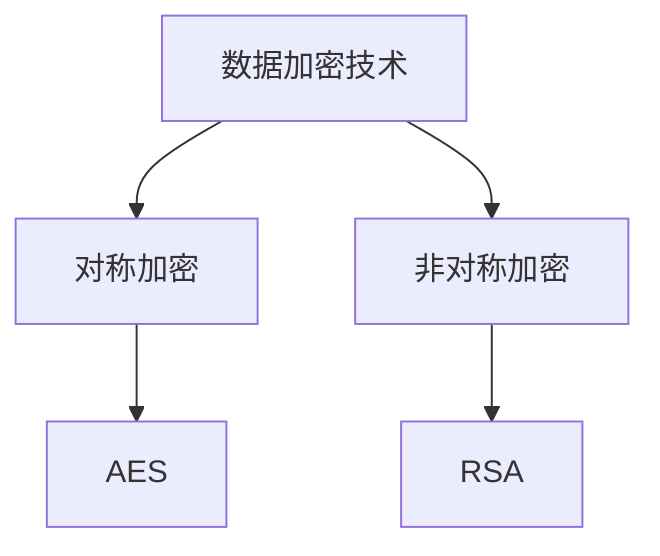

对称加密（如AES）和非对称加密（如RSA）各有优缺点。对称加密速度快，但密钥管理困难；非对称加密安全性高，但计算复杂度大。

#### 2.1.3 访问控制机制

访问控制是确保数据仅被授权用户访问的重要机制。常见的访问控制模型有基于角色的访问控制（RBAC）和基于属性的访问控制（ABAC）。

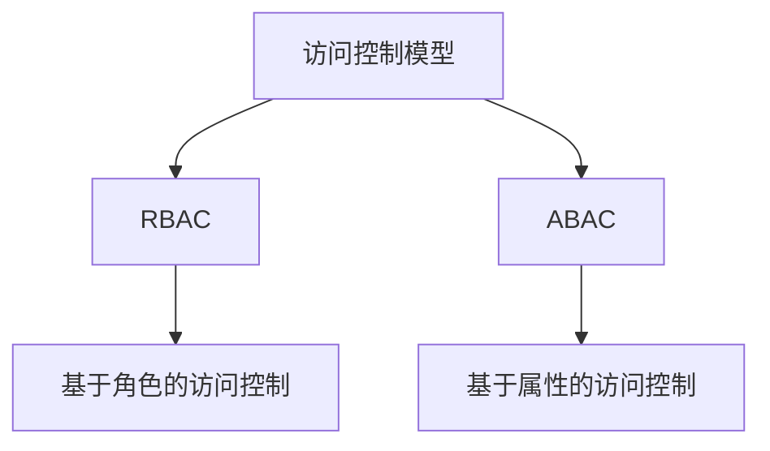

RBAC和ABAC各有适用场景，RBAC适用于简单的权限管理，ABAC适用于复杂的权限管理。

#### 2.1.4 单点登录（SSO）

单点登录（SSO）是一种身份认证机制，允许用户使用一个账号和密码登录多个系统。SSO可以简化用户认证流程，提高用户体验。

### 2.2 数据泄露检测与响应

#### 2.2.1 数据泄露检测技术

数据泄露检测技术包括数据流量分析、威胁情报和异常行为分析等。

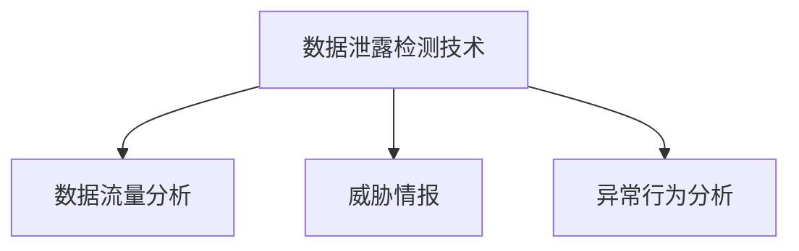

数据流量分析通过分析网络流量发现异常行为；威胁情报通过收集和分析网络攻击情报来预测和应对攻击；异常行为分析通过监测和分析用户行为发现异常。

#### 2.2.2 数据泄露响应策略

数据泄露响应策略包括应急响应计划、数据泄露通知与披露、数据恢复与重建等。

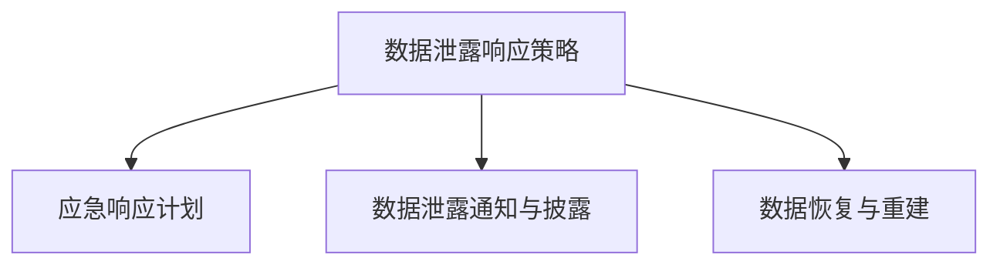

应急响应计划是针对数据泄露事件制定的具体应对措施；数据泄露通知与披露是向相关方通知数据泄露事件并公开信息；数据恢复与重建是恢复受损数据和重建数据系统。

### 2.3 恢复与防护机制

#### 2.3.1 数据恢复策略

数据恢复策略包括数据备份与恢复、数据冗余与分布式存储等。

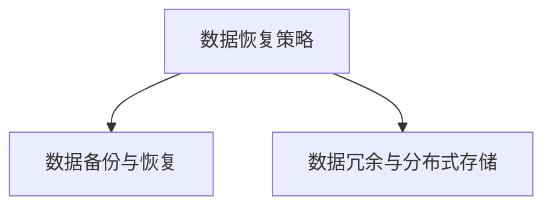

数据备份与恢复是确保数据在发生故障时能够恢复的重要手段；数据冗余与分布式存储可以提高数据存储的可靠性和可用性。

#### 2.3.2 防护机制与持续监控

防护机制与持续监控包括防护策略制定、漏洞扫描与修复、安全监控与日志分析等。


防护策略制定是确保系统安全的基础；漏洞扫描与修复是发现和修复系统漏洞；安全监控与日志分析是实时监控系统和数据的安全状况。

## 第三部分：数据滥用防范

### 3.1 数据滥用防范策略

#### 3.1.1 数据滥用场景分析

数据滥用场景包括内部威胁和外部攻击等。

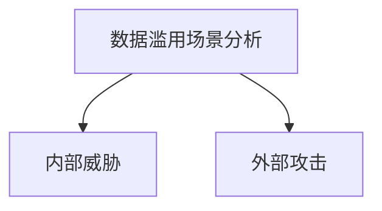

内部威胁包括员工滥用权限、合作伙伴非法访问等；外部攻击包括黑客入侵、恶意软件等。

#### 3.1.2 数据滥用检测与预防

数据滥用检测与预防包括数据滥用特征识别和数据滥用预防措施。

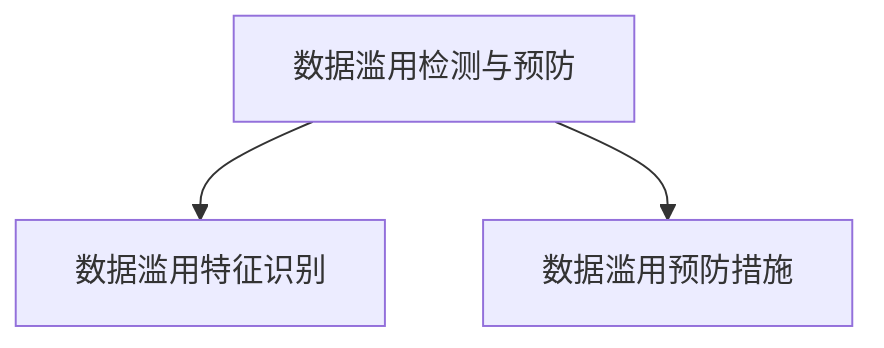

数据滥用特征识别是通过分析用户行为和系统日志发现异常行为；数据滥用预防措施包括限制权限、监控行为等。

### 3.2 数据安全意识培养

#### 3.2.1 数据安全意识的重要性

数据安全意识是指员工对数据安全的认识和重视程度。提高数据安全意识是防范数据滥用的重要措施。

#### 3.2.2 安全意识传播与实施

安全意识传播与实施包括安全意识宣传、安全培训与教育和安全文化建设。

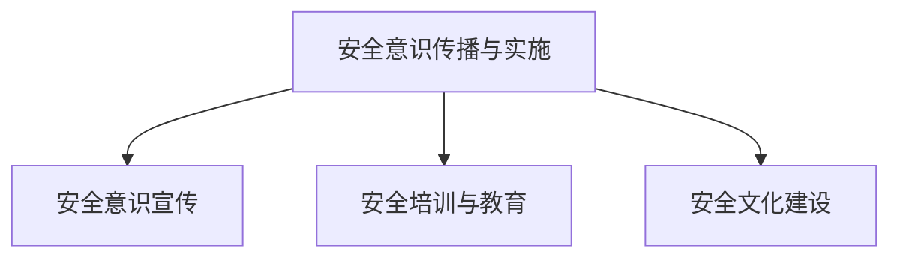

安全意识宣传是通过各种渠道宣传数据安全知识；安全培训与教育是员工定期参加数据安全培训；安全文化建设是建立良好的数据安全文化。

## 第四部分：数据安全项目管理与实践

### 4.1 数据安全项目管理

#### 4.1.1 数据安全项目规划

数据安全项目规划包括项目目标设定、项目风险管理、项目团队构建等。

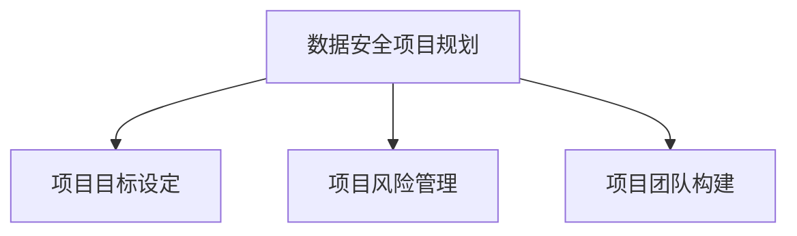

项目目标设定是明确项目目标；项目风险管理是识别和应对项目风险；项目团队构建是组建项目团队。

#### 4.1.2 数据安全项目实施

数据安全项目实施包括技术方案与工具选择、安全测试与评估、安全运维与持续改进等。

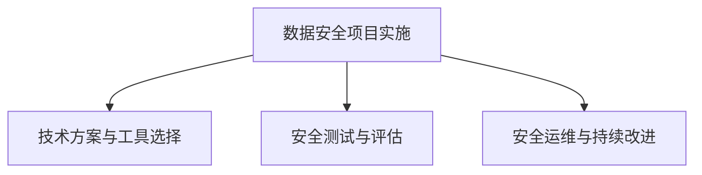

技术方案与工具选择是根据项目需求选择合适的技术和工具；安全测试与评估是测试和评估数据安全措施的有效性；安全运维与持续改进是确保数据安全措施持续有效。

### 4.2 数据安全实战案例

#### 4.2.1 数据泄露案例解析

- **案例一**：某公司数据泄露事件
  - **事件概述**：某公司数据库被黑客入侵，导致大量客户数据泄露。
  - **原因分析**：系统漏洞、缺乏有效的安全防护措施、员工安全意识不足。

- **案例二**：某政府机构数据泄露事件
  - **事件概述**：某政府机构服务器遭到攻击，导致内部敏感信息泄露。
  - **原因分析**：网络安全防护不足、内部人员违规操作、缺乏有效的监控和审计机制。

#### 4.2.2 数据安全防护实践

- **数据加密与传输项目实战**
  - **开发环境搭建**：选择合适的开发环境和工具。
  - **源代码实现与解读**：实现数据加密和解密功能，并对源代码进行详细解读。

- **数据安全防护项目实战**
  - **代码解读与分析**：分析代码实现的安全防护措施，评估其有效性。

### 4.3 数据安全发展趋势

#### 4.3.1 数据安全发展趋势

- **人工智能与数据安全**：人工智能在数据安全领域的应用，如自动化威胁检测、安全防护模型等。
- **区块链技术与应用**：区块链技术在数据安全中的应用，如数据加密、分布式存储等。
- **物联网安全与隐私保护**：物联网设备的安全防护和隐私保护。

#### 4.3.2 未来数据安全展望

- **数据安全法律法规演变**：随着数据安全需求的增加，数据安全法律法规将不断完善和演进。
- **数据安全技术创新**：新的数据安全技术的不断涌现，如量子加密、零知识证明等。
- **数据安全职业发展**：数据安全领域的人才需求不断增加，数据安全专家将成为热门职业。

## 附录

### 附录 A：数据安全资源与工具

#### A.1 数据安全相关书籍与资料

- **书籍推荐**：《数据安全：实践与原理》、《网络安全：设计与实现》等。
- **在线资源**：数据安全论坛、博客、技术文档等。

#### A.2 数据安全工具介绍

- **数据加密工具**：AES加密工具、RSA加密工具等。
- **安全信息与事件管理系统（SIEM）**：Splunk、LogRhythm等。
- **入侵检测系统（IDS）**：Snort、Suricata等。

#### A.3 数据安全标准与规范

- **数据安全标准组织**：国际标准化组织（ISO）、国际电信联盟（ITU）等。
- **数据安全相关规范与指南**：《信息安全技术：信息系统安全等级保护基本要求》、《网络安全等级保护定级指南》等。

### 附录 B：Mermaid 流程图

#### B.1 数据安全架构流程图

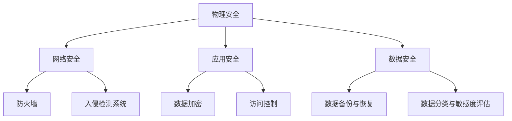

#### B.2 数据生命周期管理流程图

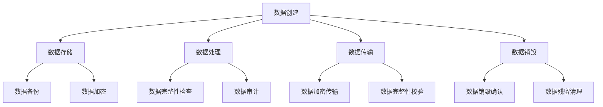

#### B.3 数据泄露防护流程图

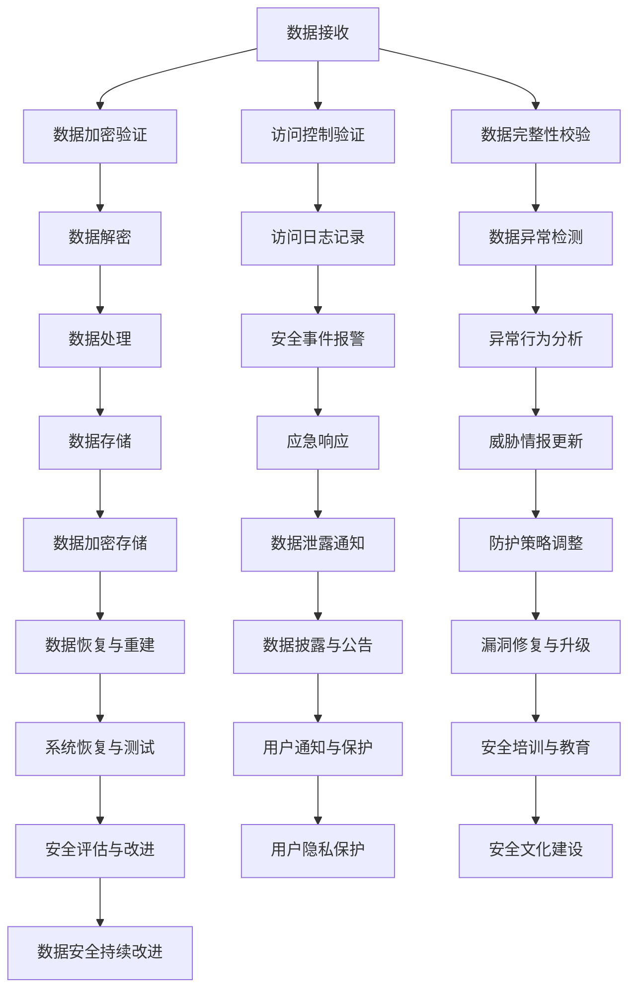

### 附录 C：核心算法原理讲解与伪代码

#### C.1 加密算法原理

**AES加密算法伪代码**

```c
function AES_encrypt(plaintext, key):
    K = generate_key_schedule(key)
    ciphertext = AES_encrypt_block(plaintext[0], K)
    for i in 1 to length(plaintext) - 1:
        ciphertext[i] = AES_encrypt_block(plaintext[i], K)
    return ciphertext

function AES_encrypt_block(block, key):
    state = block
    for i in 1 to 10:
        state = add_round_key(state, key[i])
        if i < 10:
            state = substitute_bytes(state)
            state = shift_rows(state)
            state = mix_columns(state)
    return state
```

**RSA加密算法数学模型**

$$
c = m^e \mod n
$$

其中，$m$ 为明文，$c$ 为密文，$e$ 和 $n$ 分别为加密指数和模数。

### 附录 D：数学模型和公式

#### D.1 数据加密数学模型

**RSA加密算法数学模型**

$$
c = m^e \mod n
$$

其中，$m$ 为明文，$c$ 为密文，$e$ 和 $n$ 分别为加密指数和模数。

**AES加密算法数学模型**

$$
c = \sum_{i=0}^{15} (k_i \oplus (s \oplus r))
$$

其中，$c$ 为密文，$k_i$ 为子密钥，$s$ 和 $r$ 分别为状态矩阵的行和列。

#### D.2 数据安全评估数学模型

**数据安全评估指标计算公式**

$$
SA = \frac{S_1 + S_2 + S_3 + S_4}{4}
$$

其中，$SA$ 为数据安全评估得分，$S_1$、$S_2$、$S_3$ 和 $S_4$ 分别为机密性、完整性、可用性和可审计性得分。

## 附录 E：项目实战

### E.1 数据加密与传输项目实战

#### 开发环境搭建

- **环境准备**：安装Python、OpenSSL等工具。

#### 源代码实现与解读

**加密和解密代码**

```python
from Crypto.PublicKey import RSA
from Crypto.Cipher import PKCS1_OAEP
from Crypto.Random import get_random_bytes

def generate_keys():
    key = RSA.generate(2048)
    private_key = key.export_key()
    public_key = key.publickey().export_key()
    return private_key, public_key

def encrypt_message(message, public_key):
    cipher = PKCS1_OAEP.new(RSA.import_key(public_key))
    encrypted_message = cipher.encrypt(message)
    return encrypted_message

def decrypt_message(encrypted_message, private_key):
    cipher = PKCS1_OAEP.new(RSA.import_key(private_key))
    decrypted_message = cipher.decrypt(encrypted_message)
    return decrypted_message

# 测试
private_key, public_key = generate_keys()
message = b'Hello, World!'
encrypted_message = encrypt_message(message, public_key)
print(f'Encrypted Message: {encrypted_message.hex()}')

decrypted_message = decrypt_message(encrypted_message, private_key)
print(f'Decrypted Message: {decrypted_message.decode()}')
```

**代码解读**：

- `generate_keys()`：生成RSA密钥对。
- `encrypt_message()`：使用公钥加密消息。
- `decrypt_message()`：使用私钥解密消息。

### E.2 数据安全防护项目实战

#### 代码解读与分析

**防火墙配置**

```shell
# 创建防火墙规则
sudo ufw allow from any to any port 80 proto tcp
sudo ufw allow from any to any port 443 proto tcp

# 启动防火墙
sudo ufw enable

# 查看防火墙状态
sudo ufw status
```

**代码解读**：

- `ufw allow`：允许特定的网络流量通过防火墙。
- `ufw enable`：启用防火墙。
- `ufw status`：查看防火墙状态。

### E.3 数据安全意识培养项目实战

#### 安全培训与教育实施

**培训内容**：

- 数据安全基本概念
- 数据泄露案例解析
- 加密技术原理与应用
- 安全防护措施与技巧

**培训方式**：

- 在线课程
- 培训手册
- 实战演练

## 作者

**作者：AI天才研究院/AI Genius Institute & 禅与计算机程序设计艺术 /Zen And The Art of Computer Programming** 

## 总结

本文从数据安全基础、数据泄露防护、数据滥用防范、数据安全项目管理与实践等方面，详细介绍了数据安全的重要性和保护措施。通过深入分析数据安全的核心概念、技术原理、法律法规和实战案例，为读者提供了全面的数据安全指导。希望本文能帮助企业和个人更好地保护数据不被泄露和滥用。在未来的数据安全领域，随着技术的发展和法律法规的完善，数据安全将面临更多挑战和机遇，我们期待看到更多创新和突破。

