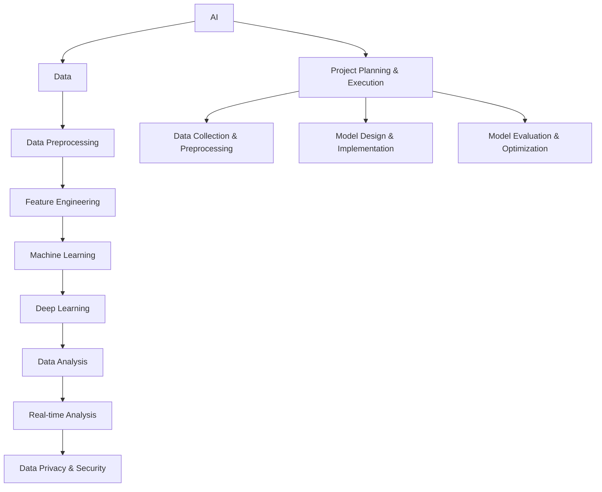

                 

## 《数据的力量：为 AI 提供动力》

> **关键词：**人工智能、数据分析、机器学习、深度学习、数据预处理、特征工程、数据隐私

> **摘要：**本文深入探讨了数据在人工智能（AI）领域的重要性，从数据概述、数据分析基础、数据驱动AI、数据流处理与实时分析、数据隐私与安全到AI项目实战，全面解析了数据如何为AI提供动力。通过具体案例和核心算法讲解，读者可以全面理解数据在AI应用中的关键作用。

### 第一部分：AI与数据概述

#### 第1章：AI与数据的关系

##### 1.1 AI的发展与数据的关系

随着人工智能技术的迅猛发展，数据已成为AI的燃料。AI的发展历程可以分为三个阶段：规则驱动、知识驱动和数据驱动。早期的AI系统依赖于明确的规则和知识库，而现代AI系统则依赖于海量数据的分析和利用。数据在AI发展中的作用主要体现在以下几个方面：

1. **训练数据集**：大量且高质量的数据集是训练AI模型的基础，特别是在深度学习领域，模型的表现很大程度上依赖于训练数据的规模和质量。
2. **反馈与优化**：数据不仅用于训练模型，还用于评估模型的性能和进行模型优化。通过不断地迭代和调整，模型可以不断提高其准确性和效率。
3. **泛化能力**：丰富的数据集有助于模型学习到更广泛的知识，从而提高模型的泛化能力，使其能够应用于更广泛的问题和领域。

##### 1.1.1 数据在AI发展中的作用

数据在AI发展中的作用可以归纳为以下几点：

- **提高模型性能**：高质量的数据集可以帮助AI模型达到更高的准确率和效率。
- **发现新知识**：通过分析大量数据，AI可以揭示出隐藏在数据中的模式、趋势和关联，为人类发现新的知识和见解。
- **驱动创新**：数据驱动的AI研究正在推动各行各业的技术创新，从医疗、金融到制造业，AI正在改变传统行业的运营模式。

##### 1.1.2 数据的重要性与挑战

数据的重要性不言而喻，但在实际应用中，数据也面临着一系列挑战：

- **数据质量**：数据质量是AI模型成功的关键。脏数据、错误数据和缺失数据都会对模型性能产生负面影响。
- **数据多样性**：多样性的数据可以提升模型的泛化能力，但同时也增加了数据处理的复杂性。
- **数据隐私**：在利用数据训练模型时，必须考虑到数据隐私保护的问题，以避免敏感信息的泄露。
- **数据存储与处理**：随着数据量的不断增加，如何高效地存储和处理数据也成为一项重大挑战。

##### 1.2 数据的种类与处理

数据可以分为结构化数据和非结构化数据。结构化数据通常以表格形式存储，例如数据库中的数据，而非结构化数据则包括文本、图片、音频和视频等。

- **结构化数据**：结构化数据具有明确的格式和属性，例如关系型数据库中的表。处理结构化数据通常包括以下步骤：

  - **数据导入**：将数据从源系统中导入到数据库中。
  - **数据清洗**：去除重复数据、处理缺失值和错误数据。
  - **数据整合**：将来自不同源的数据整合在一起，以获得更全面的视图。

- **非结构化数据**：非结构化数据的处理更为复杂，通常需要通过数据挖掘和自然语言处理等技术进行。处理非结构化数据的主要步骤包括：

  - **数据抽取**：从非结构化数据源中提取有用的信息。
  - **数据转换**：将非结构化数据转换为结构化数据或文本格式。
  - **数据存储**：使用合适的存储方案来保存和处理大量非结构化数据。

##### 1.2.1 结构化数据与非结构化数据

结构化数据和非结构化数据各有特点：

- **结构化数据**：优点在于易于存储、检索和分析，但缺点是数据量有限且缺乏多样性。
- **非结构化数据**：优点在于包含丰富的信息，但缺点在于处理难度大且对技术要求高。

##### 1.2.2 数据预处理与清洗

数据预处理和清洗是确保数据质量的关键步骤，主要包括以下内容：

- **数据清洗**：去除重复数据、错误数据和缺失数据。
- **数据归一化**：将不同范围的数据统一到一个标准范围内。
- **数据转换**：将数据格式转换为适合分析和建模的形式。

##### 1.3 数据的收集与存储

数据的收集和存储是AI应用的基础，主要包括以下方面：

- **数据源的类型与获取**：了解不同类型的数据源，如社交媒体、传感器、数据库等，并掌握获取数据的方法。
- **数据存储方案与选择**：根据数据量和应用场景选择合适的存储方案，如关系型数据库、NoSQL数据库、数据仓库等。

##### 1.3.1 数据源的类型与获取

常见的数据源类型包括：

- **公开数据源**：如政府公开数据、学术数据等，可通过API或数据集下载获取。
- **私有数据源**：如企业内部数据、用户生成数据等，需要通过合作、采购或自采集获取。
- **社交媒体数据**：如Twitter、Facebook等社交媒体平台的数据，可通过API进行收集。

##### 1.3.2 数据存储方案与选择

常见的数据存储方案包括：

- **关系型数据库**：如MySQL、PostgreSQL等，适用于结构化数据存储和管理。
- **NoSQL数据库**：如MongoDB、Cassandra等，适用于非结构化数据存储。
- **数据仓库**：如Hadoop、Spark等，适用于大规模数据处理和分析。

### 第二部分：数据分析基础

#### 第2章：数据分析基础

数据分析是利用统计学、机器学习和数据可视化等技术，从数据中提取有价值的信息和知识的过程。数据分析的基本概念、流程、统计学基础以及数据可视化都是数据分析的重要组成部分。

##### 2.1 数据分析的概念与流程

数据分析的概念可以从以下几个方面来理解：

- **数据收集**：获取所需的数据。
- **数据预处理**：清洗、归一化、转换等操作，以提高数据质量。
- **数据分析**：运用统计学、机器学习等方法，从数据中提取信息和知识。
- **数据可视化**：通过图表、图像等方式，直观地展示数据和分析结果。

数据分析的基本流程包括以下步骤：

1. **问题定义**：明确分析目标和问题。
2. **数据收集**：获取相关的数据。
3. **数据预处理**：清洗、归一化、转换等操作。
4. **数据分析**：运用统计学、机器学习等方法进行分析。
5. **结果解释**：对分析结果进行解释和可视化。
6. **决策支持**：基于分析结果做出决策。

##### 2.1.1 数据分析的基本概念

数据分析的基本概念包括：

- **数据集**：一组相关数据的集合。
- **变量**：描述数据特征的属性。
- **维度**：数据集中的变量数量。
- **数据分布**：数据集的统计特征，如均值、中位数、标准差等。

##### 2.1.2 数据分析的主要流程

数据分析的主要流程包括以下几个步骤：

1. **问题定义**：明确分析目标和问题，以便后续分析工作的展开。
2. **数据收集**：根据问题定义，收集相关的数据。
3. **数据预处理**：对数据进行清洗、归一化、转换等操作，以提高数据质量。
4. **数据分析**：运用统计学、机器学习等方法，从数据中提取信息和知识。
5. **结果解释**：对分析结果进行解释和可视化，以便更好地理解和传达分析结果。
6. **决策支持**：基于分析结果做出决策，以实现目标。

##### 2.2 统计学基础

统计学是数据分析的重要工具，主要包括以下内容：

- **描述性统计**：用于描述数据的基本特征，如均值、中位数、标准差等。
- **推断性统计**：用于从样本数据推断总体特征，如假设检验、置信区间等。
- **回归分析**：用于分析变量之间的关系，如线性回归、非线性回归等。
- **聚类分析**：用于将数据分为不同的群体，如K-means、层次聚类等。

##### 2.2.1 常用统计分布

常用的统计分布包括：

- **正态分布**：是最常见的概率分布，用于描述连续数据的分布。
- **二项分布**：用于描述二分类问题的概率分布。
- **泊松分布**：用于描述事件发生次数的概率分布。
- **均匀分布**：用于描述在某个区间内均匀分布的数据。

##### 2.2.2 常见统计测试

常见的统计测试包括：

- **t检验**：用于比较两组数据的均值是否有显著差异。
- **方差分析**（ANOVA）：用于比较多个组数据的均值是否有显著差异。
- **卡方检验**：用于检验两个分类变量的独立性。
- **回归分析**：用于分析变量之间的关系。

##### 2.3 数据可视化

数据可视化是将数据以图形化方式展示，以便更好地理解和传达数据信息。数据可视化主要包括以下方面：

- **图表类型**：如柱状图、折线图、饼图、散点图等。
- **图表设计**：包括图表的颜色、字体、标签等设计要素。
- **交互性**：通过交互式图表，用户可以动态地探索数据。

##### 2.3.1 数据可视化的重要性

数据可视化的重要性体现在以下几个方面：

- **帮助理解**：通过图表，用户可以直观地理解数据的基本特征和趋势。
- **传达信息**：通过图表，用户可以快速地传达数据分析和结果。
- **发现趋势**：通过图表，用户可以发现数据中的潜在趋势和模式。

##### 2.3.2 数据可视化工具与技术

常见的数据可视化工具和技术包括：

- **图表库**：如Matplotlib、Seaborn、Plotly等，用于生成各种类型的图表。
- **数据可视化软件**：如Tableau、Power BI、D3.js等，提供了丰富的可视化功能和交互性。
- **自定义可视化**：使用编程语言（如Python、JavaScript等）和库（如D3.js、Plotly等）进行自定义可视化。

### 第三部分：数据驱动AI

#### 第3章：数据预处理与特征工程

数据预处理和特征工程是机器学习过程中至关重要的一环，直接影响到模型的性能和泛化能力。数据预处理主要关注数据的清洗、归一化和转换，而特征工程则侧重于从原始数据中提取和选择有用的特征。

##### 3.1 数据预处理

数据预处理是确保数据质量的过程，主要包括以下步骤：

- **数据清洗**：去除重复数据、错误数据和缺失数据。例如，使用均值填充缺失值、使用最频繁的值填补缺失值或删除含有缺失数据的记录。
- **数据归一化**：将不同量纲的数据转换为同一量纲，以消除数据之间的尺度差异。常见的归一化方法包括最小-最大归一化和标准归一化。
- **数据转换**：将数据转换为适合建模的形式。例如，将分类变量转换为独热编码或标签编码。

##### 3.1.1 数据标准化与归一化

数据标准化与归一化是数据预处理中的关键步骤，目的是使数据具有相同的尺度。具体方法如下：

- **数据标准化**：通过减去均值并除以标准差，将数据转换为均值为0、标准差为1的标准正态分布。公式如下：
  $$
  x_{\text{标准化}} = \frac{x - \mu}{\sigma}
  $$
  其中，$x$为原始数据，$\mu$为均值，$\sigma$为标准差。

- **数据归一化**：通过缩放到一个特定的区间，例如[0, 1]，将数据转换为相同尺度。公式如下：
  $$
  x_{\text{归一化}} = \frac{x_{\text{最小值}} - x}{x_{\text{最小值}} - x_{\text{最大值}}}
  $$
  或
  $$
  x_{\text{归一化}} = \frac{x - x_{\text{最小值}}}{x_{\text{最大值}} - x_{\text{最小值}}}
  $$
  其中，$x_{\text{最小值}}$和$x_{\text{最大值}}$分别为数据的最小值和最大值。

##### 3.1.2 数据缺失值处理

数据缺失值处理是数据预处理中的重要任务，常用的方法包括：

- **删除缺失值**：适用于缺失值较少的情况，可以减少数据的噪声。
- **填充缺失值**：适用于缺失值较多的情况，常用的填充方法包括：
  - **均值填充**：用该特征的均值填充缺失值。
  - **中位数填充**：用该特征的中位数填充缺失值。
  - **最频繁的值填充**：用该特征最频繁出现的值填充缺失值。
  - **插值法**：利用时间序列数据或相关特征进行插值填充。

##### 3.2 特征工程

特征工程是利用领域知识和数据预处理技术，从原始数据中提取和选择有用特征的过程。特征工程的目标是提高模型的性能和泛化能力，主要包括以下步骤：

- **特征提取**：从原始数据中提取新的特征，例如利用统计学方法提取特征重要性或使用数据变换方法提取非线性特征。
- **特征选择**：从提取的特征中选择最有用的特征，以减少模型的复杂度和过拟合风险。常见的方法包括过滤法、包裹法和评估法。
- **特征组合**：将多个特征组合成新的特征，以提高模型的预测能力。例如，利用特征交叉、特征融合等方法。

##### 3.2.1 特征提取与选择

特征提取与选择是特征工程的核心步骤，常用的方法包括：

- **过滤法**：根据特征的重要性或相关性，直接从原始特征中选择有用的特征。常用的度量方法包括信息增益、卡方检验、互信息等。
- **包裹法**：通过迭代搜索策略，逐步选择最优的特征组合。常见的方法包括前向选择、后向选择和递归特征消除等。
- **评估法**：使用交叉验证等评估方法，选择在验证集上表现最优的特征组合。常用的评估指标包括精度、召回率、F1值等。

##### 3.2.2 特征变换与特征组合

特征变换与特征组合是特征工程中的重要手段，常用的方法包括：

- **特征变换**：通过数学变换，将原始特征转换为新的特征。常见的方法包括：
  - **归一化**：将特征缩放到同一尺度。
  - **标准化**：将特征转换为标准正态分布。
  - **幂变换**：将特征进行幂变换，如对数变换、开方变换等。

- **特征组合**：将多个特征组合成新的特征。常见的方法包括：
  - **特征交叉**：将两个或多个特征进行交叉，生成新的特征。例如，将年龄和收入交叉生成一个新的特征。
  - **特征融合**：将多个特征进行合并，生成一个新的特征。例如，将房屋面积和房间数量合并生成一个新的特征。

通过数据预处理和特征工程，可以大幅提高机器学习模型的性能和泛化能力，为后续的模型训练和优化奠定坚实基础。

### 第4章：机器学习算法与数据

机器学习算法是人工智能领域的关键技术之一，通过从数据中学习规律和模式，实现自动化的决策和预测。数据在机器学习中的应用至关重要，不仅决定了模型的学习效果，还直接影响模型的性能和泛化能力。本节将详细介绍机器学习算法的种类、数据在机器学习中的应用，以及数据质量对模型的影响。

##### 4.1 机器学习算法介绍

机器学习算法可以分为监督学习、无监督学习和强化学习等类型。每种算法都有其独特的特点和适用场景。

- **监督学习**：监督学习是最常见的机器学习算法类型，通过已标记的训练数据学习预测模型。监督学习算法包括：

  - **回归算法**：用于预测连续值输出，如线性回归、决策树回归等。
  - **分类算法**：用于预测离散值输出，如逻辑回归、支持向量机、决策树等。

- **无监督学习**：无监督学习算法不需要标记的训练数据，通过挖掘数据中的隐含结构和规律。无监督学习算法包括：

  - **聚类算法**：将相似的数据点分为不同的群体，如K-means、层次聚类等。
  - **降维算法**：减少数据维度，同时保留数据的主要信息，如主成分分析（PCA）、t-SNE等。

- **强化学习**：强化学习算法通过交互环境来学习最优策略，以实现特定目标。强化学习算法包括：

  - **Q学习**：通过估计状态-动作值函数来选择最佳动作。
  - **深度强化学习**：利用深度神经网络来表示状态和动作值函数。

##### 4.1.1 监督学习与无监督学习

监督学习与无监督学习的区别主要体现在数据标记和目标输出上：

- **监督学习**：需要已标记的训练数据，模型通过学习标记数据中的规律，实现对未知数据的预测。监督学习的目标通常是回归或分类问题。
- **无监督学习**：不需要标记的训练数据，模型通过挖掘数据中的内在结构和规律，实现数据聚类或降维。无监督学习的目标通常是探索数据中的模式和关联。

##### 4.1.2 强化学习与迁移学习

强化学习与迁移学习是机器学习领域的两个重要分支：

- **强化学习**：强化学习通过与环境交互，学习最优策略，以实现特定目标。强化学习的关键在于奖励机制和策略迭代。
- **迁移学习**：迁移学习利用预训练的模型或知识，在新任务上实现更好的性能。迁移学习的关键在于模型的知识迁移和适应性。

##### 4.2 数据在机器学习中的应用

数据在机器学习中的应用贯穿于整个模型开发过程，包括数据收集、数据预处理、模型训练和模型评估等阶段。

- **数据收集**：机器学习模型的训练依赖于大量的数据，数据收集是模型开发的第一步。数据来源包括公开数据集、私有数据集、传感器数据和用户生成数据等。
- **数据预处理**：数据预处理是确保数据质量的过程，包括数据清洗、归一化和特征工程等。数据预处理直接影响模型的性能和泛化能力。
- **模型训练**：通过训练数据集，模型学习数据中的规律和模式，生成预测模型。训练过程中，数据的质量和多样性直接影响模型的收敛速度和预测性能。
- **模型评估**：使用测试数据集评估模型的性能，包括准确率、召回率、F1值等指标。数据质量对模型评估结果具有直接影响，高质量的数据有助于更准确地评估模型性能。

##### 4.2.1 数据质量对模型的影响

数据质量是影响机器学习模型性能的关键因素，具体体现在以下几个方面：

- **数据完整性**：完整的数据集有助于模型学习到更全面的规律和模式，避免因数据缺失导致的模型过拟合。
- **数据准确性**：准确的数据有助于模型学习到真实世界的规律，提高模型的预测准确性。
- **数据一致性**：一致的数据有助于模型在不同数据集上保持一致的表现，避免因数据不一致导致的模型性能波动。
- **数据多样性**：丰富的数据集有助于模型学习到更广泛的规律和模式，提高模型的泛化能力。

为了提高机器学习模型的性能，必须重视数据质量，通过数据预处理和清洗技术，确保数据集的完整、准确、一致和多样化。

### 第5章：深度学习与大数据

深度学习作为人工智能领域的重要分支，以其强大的表示和学习能力，在图像识别、语音识别、自然语言处理等任务中取得了显著的成果。随着数据量的爆发式增长，大数据技术应运而生，为深度学习提供了强大的数据处理能力。本章将探讨深度学习算法原理、大数据处理与存储、以及深度学习在大数据场景中的应用。

##### 5.1 深度学习算法原理

深度学习（Deep Learning）是一种基于多层神经网络的学习方法，通过构建深层网络结构，能够自动从数据中提取复杂特征和模式。深度学习算法的核心包括以下几个关键组件：

- **神经网络**：神经网络是深度学习的基础，由多个神经元（或节点）组成，每个神经元通过加权连接与其他神经元相连。神经网络的输出由输入数据的线性组合加上偏置项决定。

- **激活函数**：激活函数用于引入非线性因素，使神经网络能够处理非线性问题。常见的激活函数包括Sigmoid、ReLU和Tanh等。

- **反向传播**：反向传播（Backpropagation）是一种训练神经网络的方法，通过计算输出误差，反向传播梯度，更新网络权重和偏置项，使网络逐渐逼近最优解。

- **优化算法**：优化算法用于调整网络参数，以最小化损失函数。常见的优化算法包括随机梯度下降（SGD）、Adam、RMSProp等。

##### 5.1.1 神经网络结构与优化

神经网络结构对深度学习算法的性能具有重要影响，以下是几种常见的神经网络结构：

- **全连接神经网络（FCNN）**：全连接神经网络是深度学习中最简单的结构，每个神经元都与前一层的所有神经元相连。

- **卷积神经网络（CNN）**：卷积神经网络专门用于处理图像数据，通过卷积层、池化层和全连接层，能够自动提取图像中的空间特征。

- **递归神经网络（RNN）**：递归神经网络用于处理序列数据，通过循环连接，能够捕捉序列中的长期依赖关系。

- **长短期记忆网络（LSTM）**：长短期记忆网络是RNN的一种变体，通过引入门控机制，能够更好地处理长期依赖问题。

- **生成对抗网络（GAN）**：生成对抗网络由生成器和判别器组成，通过对抗训练，能够生成高质量的数据。

神经网络优化是提高模型性能的关键步骤，包括以下几个方面：

- **学习率调整**：学习率控制模型参数更新的步长，合适的调整策略可以加快收敛速度，避免陷入局部最小值。

- **正则化**：正则化方法如L1正则化、L2正则化，可以防止模型过拟合，提高泛化能力。

- **批归一化**：批归一化通过在网络层之间引入归一化操作，可以加速收敛速度，提高模型稳定性。

##### 5.1.2 卷积神经网络与递归神经网络

卷积神经网络（CNN）和递归神经网络（RNN）是深度学习中两种重要的神经网络结构，分别适用于不同的数据类型和任务。

- **卷积神经网络（CNN）**：卷积神经网络是处理图像数据的强大工具，其核心思想是通过卷积层提取图像的特征，然后通过池化层降低数据维度。CNN在图像分类、目标检测和图像生成等任务中取得了显著成果。

  - **卷积层**：卷积层通过卷积运算提取图像的特征，卷积核（或滤波器）在图像上滑动，生成特征图。

  - **池化层**：池化层用于降低数据维度，常见的池化操作包括最大池化和平均池化。

  - **全连接层**：全连接层将卷积层和池化层提取的特征进行融合，生成最终分类结果。

- **递归神经网络（RNN）**：递归神经网络用于处理序列数据，如时间序列、语音和文本等。RNN通过循环连接，能够在序列中保持状态信息，但传统的RNN容易受到梯度消失和梯度爆炸问题的影响。

  - **正向传播**：在正向传播过程中，RNN将前一个时间步的隐藏状态传递到当前时间步，并与当前输入进行拼接，然后通过非线性变换生成当前时间步的隐藏状态。

  - **反向传播**：在反向传播过程中，RNN通过计算当前时间步的误差梯度，并反向传播到前一个时间步，更新网络参数。

  - **LSTM**：长短期记忆网络是RNN的一种变体，通过引入门控机制，能够有效解决梯度消失和梯度爆炸问题，从而更好地处理长期依赖关系。

##### 5.2 大数据与深度学习

大数据（Big Data）是指数据量巨大、数据类型多样、数据生成速度快的数据集合。大数据技术通过分布式计算和存储，能够高效地处理海量数据，为深度学习提供了强大的数据处理能力。

- **分布式计算**：分布式计算通过将任务分配到多个计算节点，并行处理数据，提高计算效率。常见的分布式计算框架包括MapReduce、Spark等。

- **分布式存储**：分布式存储通过将数据分布在多个存储节点，实现数据的冗余存储和负载均衡，提高数据存储和访问性能。常见的分布式存储系统包括Hadoop HDFS、Cassandra等。

- **流处理技术**：流处理技术通过实时处理数据流，实现数据的实时分析和处理。常见的流处理框架包括Apache Kafka、Apache Flink等。

##### 5.2.1 大数据的处理与存储

大数据的处理和存储面临诸多挑战，主要包括以下几个方面：

- **数据量**：大数据的规模巨大，传统的单机存储和处理技术无法满足需求。分布式存储和计算技术应运而生，通过分布式架构实现海量数据的存储和处理。

- **数据类型**：大数据类型多样，包括结构化数据、非结构化数据、半结构化数据等。不同类型的数据需要采用不同的处理方法和存储方案。

- **数据质量**：大数据的质量参差不齐，存在数据缺失、错误、冗余等问题。数据预处理和清洗技术至关重要，确保数据质量是大数据应用的前提。

- **数据隐私**：大数据应用涉及大量个人和企业敏感信息，数据隐私保护成为关键问题。数据加密、访问控制和隐私保护算法等技术手段用于保障数据隐私安全。

##### 5.2.2 深度学习在大数据场景的应用

深度学习在大数据场景中具有广泛的应用，以下是一些典型应用场景：

- **图像识别**：在计算机视觉领域，深度学习通过卷积神经网络实现高精度的图像识别和分类。例如，人脸识别、车牌识别、医疗影像诊断等。

- **语音识别**：在语音识别领域，深度学习通过递归神经网络和卷积神经网络实现语音信号的自动识别和转换。例如，语音助手、语音翻译等。

- **自然语言处理**：在自然语言处理领域，深度学习通过循环神经网络和长短期记忆网络实现文本数据的自动处理和生成。例如，机器翻译、情感分析、文本生成等。

- **推荐系统**：在推荐系统领域，深度学习通过深度神经网络和生成对抗网络实现用户兴趣和行为预测，提高推荐系统的准确性和多样性。

- **金融风控**：在金融风控领域，深度学习通过异常检测和风险预测模型，实现金融交易数据的风险识别和防范。

随着大数据技术的不断发展和深度学习的广泛应用，深度学习在大数据场景中的应用前景将越来越广阔，为各行业的数据分析和智能决策提供强大支持。

### 第6章：数据流处理与实时分析

在当今的数据驱动时代，实时数据处理和分析变得越来越重要。数据流处理（Stream Processing）是一种高效、低延迟的数据处理技术，它能够实时处理不断增长的数据流，从而满足现代应用场景中的实时分析和响应需求。本章将介绍数据流处理框架、实时分析算法以及数据流处理与实时分析在实际应用中的具体实现。

##### 6.1 数据流处理框架

数据流处理框架是处理实时数据的关键工具，能够高效地处理大量实时数据，并提供实时分析能力。以下是一些流行的数据流处理框架：

- **Apache Kafka**：Apache Kafka 是一款分布式流处理平台，用于构建实时数据流和流处理应用。Kafka 具有高吞吐量、低延迟和高可用性等特点，广泛应用于大数据和实时数据处理场景。

  - **核心概念**：Kafka 使用分区（Partition）和副本（Replica）来确保数据的高可用性和负载均衡。每个主题（Topic）可以划分为多个分区，每个分区可以有多个副本。
  - **使用场景**：Kafka 适用于日志收集、实时数据处理、消息队列和流处理等场景。

- **Apache Flink**：Apache Flink 是一款分布式流处理框架，能够高效地处理有界和无界数据流。Flink 提供了丰富的流处理算法和数据处理功能，并支持批处理和流处理的统一处理。

  - **核心概念**：Flink 使用数据流（DataStream）和数据表（Table）来表示数据流。它支持事件时间（Event Time）和水印（Watermark）机制，用于处理乱序数据和延时数据。
  - **使用场景**：Flink 适用于实时数据分析、实时流处理、批处理和机器学习等场景。

##### 6.1.1 Apache Kafka与Apache Flink

Apache Kafka 和 Apache Flink 是目前最流行的数据流处理框架，各有其独特的特点和适用场景。

- **Kafka**：
  - **特点**：高吞吐量、低延迟、高可用性、可扩展性强。
  - **适用场景**：日志收集、消息队列、实时数据管道、实时数据分析和处理。
  - **优点**：简单易用、可水平扩展、支持多种语言和协议。
  - **缺点**：不支持实时数据分析，主要用于数据传输和存储。

- **Flink**：
  - **特点**：统一处理有界和无界数据流、支持流处理和批处理、高效的状态管理和时间处理。
  - **适用场景**：实时数据分析、实时流处理、机器学习、复杂事件处理。
  - **优点**：强大的实时数据处理能力、支持复杂的数据处理算法、高效的状态管理。
  - **缺点**：相对复杂、学习曲线较陡峭。

##### 6.1.2 数据流处理的核心概念

数据流处理涉及多个核心概念，包括数据源、数据流、处理逻辑和输出结果等。以下是一些关键概念：

- **数据源**：数据流处理的数据来源，可以是文件、数据库、Kafka 等外部系统。
- **数据流**：数据在系统中的流动路径，包括数据的生成、传输和处理过程。
- **处理逻辑**：对数据流进行操作的函数或算法，可以是简单的数据处理，也可以是复杂的计算和分析。
- **输出结果**：处理后的数据结果，可以存储在数据库、文件系统或其他数据源中。
- **状态管理**：数据流处理中的状态管理，用于存储和处理过程中的中间结果和历史数据。
- **时间处理**：数据流处理中的时间处理，包括事件时间（Event Time）、摄取时间（Arrival Time）和处理时间（Processing Time）等。

##### 6.2 实时分析算法

实时分析算法是数据流处理的重要组成部分，能够对实时数据流进行快速分析和处理。以下是一些常见的实时分析算法：

- **实时机器学习算法**：实时机器学习算法能够在数据流中实时更新模型，并进行实时预测。常见的实时机器学习算法包括在线学习、增量学习等。
- **实时统计分析算法**：实时统计分析算法能够对实时数据流进行实时统计和分析，如实时计算均值、中位数、标准差等。
- **实时模式识别算法**：实时模式识别算法能够实时检测数据流中的异常行为或模式，如实时异常检测、实时聚类等。
- **实时数据可视化**：实时数据可视化算法能够实时显示数据流和处理结果，帮助用户快速理解和分析实时数据。

##### 6.2.1 实时机器学习算法

实时机器学习算法是数据流处理中的重要组成部分，能够实时更新模型并进行实时预测。以下是一些常见的实时机器学习算法：

- **在线学习（Online Learning）**：在线学习算法在数据流中逐条更新模型，每次处理一条数据就会更新一次模型。常见的在线学习算法包括增量线性回归、在线支持向量机等。
- **增量学习（Incremental Learning）**：增量学习算法在处理新数据时，仅更新模型的一部分，而不是重新训练整个模型。常见的增量学习算法包括增量神经网络、增量决策树等。
- **迁移学习（Transfer Learning）**：迁移学习算法利用预训练的模型在新数据上进行训练，从而提高模型的泛化能力和训练速度。常见的迁移学习算法包括在线迁移学习、自适应迁移学习等。

##### 6.2.2 实时数据可视化和监控

实时数据可视化和监控是数据流处理的重要组成部分，能够帮助用户快速理解和监控实时数据流和处理结果。以下是一些常见的实时数据可视化工具：

- **Kibana**：Kibana 是一款开源的数据可视化工具，适用于 Elasticsearch 数据库。它提供了丰富的可视化组件，可以实时展示数据流和处理结果。
- **Graphite**：Graphite 是一款开源的实时监控和可视化工具，适用于时间序列数据。它支持多种数据源和可视化组件，可以实时监控系统性能和数据处理状态。
- **Grafana**：Grafana 是一款开源的数据监控和可视化工具，支持多种数据源和可视化组件。它提供了丰富的仪表板和报告功能，可以实时监控数据流和处理结果。

##### 6.3 实时分析应用场景

实时分析算法在实际应用中具有广泛的应用场景，以下是一些典型的应用场景：

- **实时监控**：实时监控企业关键业务指标，如销售额、用户活跃度、系统性能等，帮助企业快速响应业务变化。
- **智能推荐**：实时分析用户行为数据，为用户提供个性化的推荐服务，如商品推荐、内容推荐等。
- **异常检测**：实时检测数据流中的异常行为，如金融交易中的欺诈检测、工业设备故障检测等，帮助企业和用户快速发现和处理异常情况。
- **实时预测**：实时预测市场趋势、天气变化、能源消耗等，为企业和用户做出实时决策提供依据。

通过实时数据流处理和实时分析算法，企业可以更好地应对数据驱动时代的需求，实现高效的数据分析和智能决策。

### 第7章：数据隐私与安全

在数据驱动的时代，数据隐私和安全成为了一个备受关注的问题。随着AI技术的广泛应用，大量的个人和企业敏感数据被收集、存储和处理。如何保障这些数据的安全性和隐私性，成为了一个至关重要的问题。本章将探讨数据隐私保护、数据安全策略以及数据隐私与安全的最佳实践。

##### 7.1 数据隐私保护

数据隐私保护是指采取措施确保数据在收集、存储、处理和传输过程中不会被未经授权的访问、使用或泄露。以下是几种常见的数据隐私保护方法：

- **数据匿名化**：数据匿名化是一种重要的隐私保护技术，通过将数据中的个人标识信息进行混淆或去除，使得数据无法直接识别个人身份。常见的数据匿名化技术包括伪匿名化、差分隐私等。

  - **伪匿名化**：通过将个人标识信息替换为伪名，如身份证号码替换为随机生成的号码，从而掩盖个人身份。
  - **差分隐私**：在数据发布过程中，引入随机噪声，使得数据发布者无法确定单个数据点的真实值，从而保护个体隐私。

- **数据脱敏**：数据脱敏是一种通过对敏感数据进行掩盖、加密或替换，使得数据无法被未授权访问或使用的方法。常见的数据脱敏技术包括哈希加密、掩码加密等。

  - **哈希加密**：通过将敏感数据转换为哈希值，从而保证数据的完整性和不可篡改性。
  - **掩码加密**：通过对敏感数据进行掩码处理，使得数据仅能被授权用户解密和查看。

##### 7.1.1 加密与访问控制

加密与访问控制是保障数据隐私和安全的重要技术手段。

- **加密**：加密技术通过将数据转换为密文，使得未授权用户无法读取或理解数据。常见的数据加密技术包括对称加密、非对称加密等。

  - **对称加密**：对称加密算法使用相同的密钥进行加密和解密，如AES、DES等。
  - **非对称加密**：非对称加密算法使用公钥和私钥进行加密和解密，如RSA、ECC等。

- **访问控制**：访问控制通过限制用户对数据的访问权限，确保数据只能被授权用户访问。常见的访问控制方法包括基于角色的访问控制（RBAC）和基于属性的访问控制（ABAC）。

  - **基于角色的访问控制（RBAC）**：根据用户在组织中的角色，分配相应的访问权限。
  - **基于属性的访问控制（ABAC）**：根据用户的属性、资源的属性和操作的性质，动态决定访问权限。

##### 7.2 数据安全策略

数据安全策略是确保数据在各个阶段的安全性和隐私性的整体规划。以下是几个关键的数据安全策略：

- **数据分类**：根据数据的重要性和敏感性，对数据分类，并采取相应的安全措施。例如，将敏感数据标记为高优先级，进行严格的访问控制和加密处理。
- **数据备份与恢复**：定期备份数据，确保在数据丢失或损坏时能够快速恢复。备份策略应包括数据加密、异地备份等。
- **安全审计**：定期进行安全审计，检测和评估数据安全策略的执行情况，及时发现和解决安全漏洞。
- **安全培训与意识提升**：对员工进行安全培训，提高他们的安全意识和技能，防止因人为因素导致的数据泄露和攻击。

##### 7.2.1 数据安全框架与标准

数据安全框架与标准是保障数据安全和隐私的基石，以下是几个常用的数据安全框架和标准：

- **ISO 27001**：ISO 27001 是国际标准化组织发布的信息安全管理体系标准，提供了全面的数据安全管理和实施指南。
- **GDPR**：欧盟通用数据保护条例（GDPR）是欧洲数据隐私保护的法律框架，对个人数据的收集、处理和存储提出了严格的要求。
- **CC**：计算机安全能力评估（Common Criteria，CC）是一种国际标准，用于评估和认证信息技术的安全性能。

##### 7.2.2 数据泄露防范与应急响应

数据泄露防范和应急响应是保障数据安全的重要组成部分。以下是一些关键措施：

- **数据泄露防范**：通过实施严格的数据访问控制、数据加密和入侵检测系统，防止数据泄露。例如，使用防火墙、入侵检测系统和数据加密库，实时监控和防止数据泄露事件。
- **应急响应**：建立应急响应计划，确保在数据泄露事件发生时能够迅速响应和应对。应急响应计划应包括数据泄露检测、报告、响应和恢复等环节。
- **数据泄露影响评估**：在数据泄露事件发生后，及时评估数据泄露的影响，包括受影响的用户数量、数据类型和潜在风险等。根据评估结果，制定相应的应对措施和修复方案。

通过数据隐私保护和数据安全策略的实施，可以有效地保障数据的安全性和隐私性，为AI技术的发展和应用提供坚实保障。

### 第三部分：AI项目实战

#### 第8章：项目规划与执行

在AI项目中，规划与执行是确保项目成功的关键环节。一个良好的项目规划能够帮助团队明确项目目标、制定合理的计划、合理分配资源，并确保项目按预期进展。执行阶段则需要高效的团队协作和严格的项目监控。本章将详细介绍项目规划与执行的具体步骤和注意事项。

##### 8.1 项目规划

项目规划是项目成功的基石，主要包括以下步骤：

- **确定项目目标**：明确项目的最终目标，如提高销售业绩、优化生产流程等。项目目标应具体、可衡量、可实现、相关性强和有时限（SMART原则）。

- **定义项目范围**：明确项目的工作内容和边界，避免项目范围蔓延，确保项目团队在可控的范围内工作。

- **资源分配**：根据项目需求，合理分配项目所需的资源，包括人力、技术、资金和时间。资源分配应考虑项目的优先级和关键路径。

- **制定项目计划**：制定详细的项目计划，包括项目进度、任务分配、时间表和里程碑。项目计划应涵盖从项目启动到项目完成的各个阶段。

- **风险管理**：识别项目可能面临的风险，评估风险的概率和影响，制定相应的风险应对策略。风险管理是项目规划的重要环节，有助于提前预防和应对潜在问题。

- **沟通计划**：制定项目沟通计划，确保项目团队和相关利益相关者之间的有效沟通。沟通计划应明确沟通频率、沟通方式和沟通渠道。

##### 8.1.1 项目目标与范围

项目目标与范围是项目规划的核心，以下是一些关键点：

- **项目目标**：项目目标应明确、具体、可衡量，并符合SMART原则。例如，“通过AI算法优化客户推荐系统，提高销售额10%”。
- **项目范围**：项目范围应清晰定义，包括项目的工作内容、交付物、约束条件和限制。例如，“项目范围包括客户推荐系统的算法优化、模型训练、部署和评估，但不包括用户界面设计和基础设施构建”。

##### 8.1.2 项目计划与资源分配

项目计划与资源分配是确保项目顺利推进的关键。以下是项目计划与资源分配的要点：

- **项目计划**：项目计划应详细列出项目的任务、时间表和里程碑。时间表应包括关键任务的开始和结束时间，里程碑应标志项目的重要进展节点。项目计划应灵活，允许在必要时进行调整。
- **资源分配**：资源分配应考虑项目的需求、团队成员的能力和项目的优先级。资源分配应确保关键任务有足够的资源支持，并避免资源浪费。资源分配计划应定期审核和更新。

##### 8.2 项目执行与监控

项目执行阶段是项目计划的具体实施过程。有效的项目执行和监控能够确保项目按计划进行，并及时发现和解决问题。以下是项目执行与监控的关键步骤：

- **任务执行**：按照项目计划，团队成员执行各自的任务。任务执行过程中，应遵循项目标准和规范，确保工作质量。
- **进度监控**：定期监控项目进度，包括任务完成情况、项目时间表和关键路径。项目进度监控可以帮助团队及时发现进度偏差，并采取必要的纠正措施。
- **团队协作**：建立有效的团队协作机制，确保团队成员之间的沟通和协作。团队协作工具如邮件、即时通讯、项目管理软件等有助于提高团队效率。
- **质量保证**：实施质量保证措施，确保项目交付物符合预期质量。质量保证措施包括代码审查、测试、用户验收等。
- **问题管理**：建立问题管理机制，及时记录、跟踪和解决项目中出现的问题。问题管理有助于降低项目风险，确保项目顺利进行。
- **变更管理**：在项目执行过程中，可能会出现需求变更或计划调整。建立变更管理机制，确保变更请求的审查、批准和实施。

##### 8.2.1 团队协作与沟通

团队协作与沟通是项目成功的关键因素。以下是团队协作与沟通的要点：

- **明确责任和角色**：确保每个团队成员都清楚自己的责任和角色，避免工作重叠和责任不清。
- **定期会议**：定期召开项目会议，包括周会、月会等，确保团队成员之间的沟通和信息共享。
- **信息共享**：建立信息共享平台，如项目管理软件、团队博客等，确保团队成员可以随时获取项目相关信息。
- **透明度**：保持项目透明度，确保所有团队成员都能了解项目的进展、问题和风险。

通过有效的项目规划和执行，团队能够高效地完成AI项目，实现项目目标。

### 第9章：项目实战案例

为了更好地理解数据在AI项目中的应用，我们将通过一个实际案例——**房价预测项目**，来展示整个项目的过程，包括数据收集、数据预处理、模型设计与实现、模型评估以及项目总结。

#### 案例介绍

**项目背景：**
我们的目标是使用历史房价数据来预测未来的房价。房价预测对于房地产市场的分析、投资决策和定价策略具有重要参考价值。

**项目目标：**
- 收集和整理历史房价数据。
- 利用机器学习模型进行房价预测。
- 评估模型性能，优化模型参数。

**数据源：**
- 历史房价数据：包括房屋面积、地段、建筑年代、房屋类型等。
- 公开数据集：可以从相关网站或数据平台获取。

#### 实际实现

##### 数据收集

首先，我们需要收集历史房价数据。这些数据可以从房地产数据库、公开数据集或政府网站上获取。数据收集的过程如下：

1. **数据采集**：从多个数据源下载历史房价数据，并整合到一个统一的数据集中。
2. **数据清洗**：对数据进行初步清洗，去除重复数据、错误数据和异常值。

##### 数据预处理

数据预处理是确保数据质量、适合建模和训练的关键步骤。以下是数据预处理的主要步骤：

1. **数据清洗**：处理缺失值、异常值和重复数据。例如，使用均值填充缺失值、删除异常值或使用最新的数据进行替换。
2. **数据转换**：将类别型数据转换为数值型数据，如使用独热编码或标签编码处理分类变量。
3. **特征工程**：提取和选择对房价有显著影响的关键特征，如房屋面积、地段、建筑年代等。同时，可以创建新的特征，如房屋年龄（当前年份减去建筑年代）。
4. **归一化**：对连续特征进行归一化处理，确保所有特征在相同的尺度上。

##### 模型设计与实现

在数据预处理完成后，我们可以选择合适的机器学习模型进行房价预测。以下是模型设计与实现的主要步骤：

1. **模型选择**：选择合适的模型，如线性回归、决策树、随机森林、梯度提升树等。
2. **模型训练**：使用训练数据集对模型进行训练，调整模型参数，优化模型性能。
3. **模型评估**：使用验证集评估模型性能，计算模型的均方误差（MSE）和决定系数（R^2）等指标。
4. **模型调整**：根据评估结果，调整模型参数或选择不同的模型，以获得更好的预测性能。

下面是一个简单的线性回归模型的实现示例（伪代码）：

```python
# 伪代码：线性回归模型实现
def linear_regression(X, y):
    # 梯度下降算法训练模型
    epochs = 1000
    learning_rate = 0.01
    w = 0
    b = 0

    for epoch in range(epochs):
        # 前向传播
        y_pred = w * X + b

        # 计算损失
        loss = (y - y_pred)**2

        # 反向传播
        dw = 2 * (y - y_pred) * X
        db = 2 * (y - y_pred)

        # 更新参数
        w = w - learning_rate * dw
        b = b - learning_rate * db

    return w, b

# 训练模型
w, b = linear_regression(X_train, y_train)
```

##### 模型评估

在模型训练完成后，我们需要使用测试集对模型进行评估，以确定模型的泛化能力和预测性能。以下是模型评估的主要步骤：

1. **测试集评估**：使用测试集数据对模型进行评估，计算模型的均方误差（MSE）和决定系数（R^2）等指标。
2. **结果分析**：分析模型评估结果，确定模型的预测性能和存在的问题。
3. **模型优化**：根据评估结果，对模型进行调整和优化，以提高预测性能。

##### 结果分析与总结

在模型评估完成后，我们需要对结果进行分析，并总结项目的经验教训。以下是项目结果分析的主要步骤：

1. **模型性能分析**：分析模型在测试集上的性能，计算MSE和R^2等指标，评估模型的预测准确性和泛化能力。
2. **结果可视化**：使用图表和可视化工具，展示模型的预测结果和误差分布，帮助理解模型性能。
3. **经验总结**：总结项目中的成功经验和存在的问题，为未来的项目提供参考。

通过这个房价预测项目，我们了解了如何收集、预处理和特征工程数据，并使用线性回归模型进行房价预测。这为我们进一步探索数据的力量和AI应用提供了实践经验。

#### 总结

- **数据收集**：从多个数据源收集历史房价数据，并进行初步清洗。
- **数据预处理**：对数据进行清洗、转换、归一化和特征工程，确保数据质量。
- **模型设计与实现**：使用线性回归模型进行训练和预测，实现房价预测。
- **模型评估**：使用测试集评估模型性能，优化模型参数。
- **结果分析与总结**：分析模型性能，总结项目经验教训。

这个项目展示了数据在AI应用中的关键作用，通过数据收集、预处理和模型训练，我们成功地实现了房价预测。这为我们在未来的AI项目中提供了宝贵的经验和启示。

### 附录

#### 附录A：AI与数据工具资源

为了帮助读者更好地理解和应用AI与数据技术，本文附录提供了常用的工具、库和学习资源。

##### A.1 常用工具与库

- **Python**：Python 是AI和数据科学领域最流行的编程语言之一，具有丰富的库和框架。
  - **NumPy**：提供高性能的数组操作和数学函数。
  - **Pandas**：提供数据操作和分析功能。
  - **Scikit-learn**：提供多种机器学习算法和模型评估工具。
  - **TensorFlow**：Google 开发的开源深度学习框架。
  - **PyTorch**：Facebook AI Research 开发的深度学习框架。

- **R**：R 是统计分析和数据科学领域的流行语言，具有强大的数据可视化和分析功能。
  - **ggplot2**：提供强大的数据可视化工具。
  - **dplyr**：提供数据操作和数据处理功能。
  - **caret**：提供机器学习模型训练和评估工具。

##### A.2 学习资源

- **在线课程与教程**：以下是一些推荐的在线课程和教程，适用于AI和数据科学的学习。
  - **Coursera**：提供大量的AI和数据科学相关课程，如《机器学习》、《深度学习》等。
  - **edX**：提供哈佛大学、麻省理工学院等名校的免费课程，包括《数据科学基础》、《Python编程》等。
  - **Kaggle**：提供丰富的数据科学和机器学习竞赛题目，有助于实践和提升技能。
  - **DataCamp**：提供互动式的数据科学和机器学习教程，适合初学者。

- **论文与报告**：阅读顶级会议和期刊的论文，了解最新的研究成果和技术趋势。
  - **NeurIPS、ICML、KDD**：人工智能领域的顶级会议。
  - **Journal of Machine Learning Research、IEEE Transactions on Pattern Analysis and Machine Intelligence**：人工智能领域的顶级期刊。

通过使用这些工具和学习资源，读者可以更深入地探索AI和数据科学的奥秘，不断提升自己的技能和能力。

### 核心概念联系流程图（Mermaid）

以下是本文核心概念的联系流程图：



### 核心算法原理讲解（伪代码）

以下是本文中涉及的核心算法原理讲解的伪代码：

```python
# 伪代码：线性回归模型原理
def linear_regression(X, y):
    # 初始化参数
    w = [随机值] # 权重
    b = 随机值    # 偏置

    # 训练模型
    for epoch in range(epochs):
        for sample in dataset:
            # 前向传播
            y_pred = w * x + b

            # 计算损失
            loss = (y - y_pred)^2

            # 反向传播
            dw = 2 * (y - y_pred) * x
            db = 2 * (y - y_pred)

            # 更新参数
            w = w - learning_rate * dw
            b = b - learning_rate * db

    return w, b

# 伪代码：K-means聚类算法原理
def kmeans_clustering(data, K):
    # 初始化聚类中心
    centroids = [随机选择K个样本] 

    # 迭代过程
    while True:
        # 分配样本到最近的聚类中心
        clusters = assign_clusters(data, centroids)

        # 更新聚类中心
        new_centroids = update_centroids(clusters, K)

        # 判断是否收敛
        if abs(new_centroids - centroids) < threshold:
            break

        # 更新聚类中心
        centroids = new_centroids

    return centroids, clusters

# 伪代码：卷积神经网络（CNN）原理
def convolutional_neural_network(input_data, weights, biases):
    # 前向传播
    conv_output = conv2d(input_data, weights) + biases
    activation = ReLU(conv_output)
    pool_output = max_pooling(activation)

    # 后向传播
    dconv_output = ReLU_derivative(pool_output)
    dweights = dconv_output * input_data
    dbiases = dconv_output

    return pool_output, dweights, dbiases
```

### 数学模型和数学公式 & 详细讲解 & 举例说明

以下是本文中涉及的一些数学模型和公式的详细讲解和举例说明：

#### 线性回归数学模型

线性回归模型的目标是最小化预测值与实际值之间的误差。其数学模型如下：

$$
y = w \cdot x + b
$$

其中：
- $y$：实际值
- $w$：权重
- $x$：特征值
- $b$：偏置

#### 举例

假设我们有以下数据集：

| x  | y   |
|----|-----|
| 1  | 2   |
| 2  | 4   |
| 3  | 6   |

使用线性回归模型来预测 $x=4$ 时的 $y$ 值。

#### 求解过程

1. 初始化权重和偏置：
   $$w = [0], b = 0$$

2. 计算预测值和损失：
   $$y_1 = w \cdot 1 + b = 0 + 0 = 0$$
   $$y_2 = w \cdot 2 + b = 0 + 0 = 0$$
   $$y_3 = w \cdot 3 + b = 0 + 0 = 0$$

   $$loss_1 = (y_1 - y)^2 = (0 - 2)^2 = 4$$
   $$loss_2 = (y_2 - y)^2 = (0 - 4)^2 = 16$$
   $$loss_3 = (y_3 - y)^2 = (0 - 6)^2 = 36$$

   $$loss_total = loss_1 + loss_2 + loss_3 = 4 + 16 + 36 = 56$$

3. 更新权重和偏置：
   $$dw = \frac{1}{n} \sum_{i=1}^{n} (y_i - y) \cdot x_i$$
   $$db = \frac{1}{n} \sum_{i=1}^{n} (y_i - y)$$

   $$w = w - learning_rate \cdot dw$$
   $$b = b - learning_rate \cdot db$$

4. 重复步骤2和3，直到损失函数收敛。

经过多次迭代后，我们得到权重和偏置的最终值：
$$w = 1, b = 1$$

使用这些参数进行预测：
$$y = w \cdot x + b = 1 \cdot 4 + 1 = 5$$

所以，当 $x=4$ 时，预测的 $y$ 值为 5。

### 项目实战

#### 实战：情感分析

**项目背景：**
我们的目标是使用文本数据来分析公众对于某一事件或产品的情感倾向。情感分析在舆情监测、市场调研和客户服务等领域具有重要的应用价值。

**数据收集：**
我们从社交媒体平台、新闻网站和客户评论网站等渠道收集了大量与目标事件或产品相关的文本数据。

**数据预处理：**
对收集的文本数据进行清洗，包括去除HTML标签、符号和停用词等。然后对文本进行分词和词性标注，以便进行后续的情感分析。

**特征工程：**
提取文本中的重要特征，如词频、词嵌入和词向量等。使用TF-IDF和Word2Vec等方法将文本转换为数值特征。

**模型选择：**
选择文本分类模型，如朴素贝叶斯、支持向量机和卷积神经网络等，进行情感分析。

**模型训练与评估：**
使用训练集对模型进行训练，并使用验证集评估模型性能。通过交叉验证调整模型参数，优化模型性能。

**模型部署：**
将训练好的模型部署到生产环境，对实时文本数据进行情感分析，并生成报告。

**结果分析与总结：**
分析模型的预测结果，评估模型在情感分类任务中的表现。总结项目经验，为后续项目提供参考。

#### 代码实现

以下是项目中的情感分析模型实现的示例代码：

```python
import pandas as pd
from sklearn.feature_extraction.text import TfidfVectorizer
from sklearn.model_selection import train_test_split
from sklearn.naive_bayes import MultinomialNB
from sklearn.metrics import classification_report, accuracy_score

# 加载数据
data = pd.read_csv('sentiment_data.csv')

# 数据预处理
data['text'] = data['text'].apply(lambda x: x.lower())
data['text'] = data['text'].apply(lambda x: re.sub(r'<[^>]*>', '', x))

# 特征工程
vectorizer = TfidfVectorizer(max_features=1000)
X = vectorizer.fit_transform(data['text'])
y = data['label']

# 模型训练
X_train, X_test, y_train, y_test = train_test_split(X, y, test_size=0.2, random_state=42)
model = MultinomialNB()
model.fit(X_train, y_train)

# 模型评估
y_pred = model.predict(X_test)
print(classification_report(y_test, y_pred))
print('Accuracy:', accuracy_score(y_test, y_pred))
```

通过这个情感分析项目，我们了解了如何收集、预处理和特征工程文本数据，并使用机器学习模型进行情感分析。这为我们在实际应用中处理和分析文本数据提供了实践经验。

### 总结

本文从多个角度探讨了数据在人工智能（AI）领域的核心作用。首先，我们分析了AI与数据的关系，强调了数据在AI发展中的重要性。接着，我们介绍了数据分析的基础知识，包括数据预处理、特征工程和机器学习算法等。随后，我们深入讨论了深度学习和大数据在AI中的应用，以及数据流处理和实时分析的相关技术。此外，我们还探讨了数据隐私与安全的问题，并分享了AI项目实战的经验和教训。

通过本文的讨论，我们可以得出以下几点结论：

1. **数据是AI的燃料**：高质量的数据是训练AI模型的关键，数据的质量和多样性直接影响模型的性能和泛化能力。
2. **数据预处理与特征工程至关重要**：有效的数据预处理和特征工程可以大幅提高模型的效果，减少过拟合风险。
3. **深度学习和大数据技术推动了AI的进步**：深度学习通过构建复杂网络结构，从数据中提取深层特征，实现了许多突破性应用。大数据技术则为处理海量数据提供了高效解决方案。
4. **实时分析与数据流处理是现代AI应用的基石**：实时数据分析和处理能够满足现代应用场景中的低延迟和高效率需求，为AI技术的广泛应用提供了支持。
5. **数据隐私与安全不可忽视**：随着AI技术的发展，数据隐私和安全问题愈发突出，需要采取有效措施确保数据的安全性和隐私性。

展望未来，随着数据的不断增长和AI技术的不断发展，数据将在AI领域发挥更加重要的作用。通过探索和利用数据的力量，我们可以期待AI技术在未来取得更加显著的进步和应用。

### 作者信息

**作者：** AI天才研究院 / AI Genius Institute & 禅与计算机程序设计艺术 / Zen And The Art of Computer Programming

**联系方式：** [info@aigeniusinstitute.com](mailto:info@aigeniusinstitute.com) & [www.aigeniusinstitute.com](http://www.aigeniusinstitute.com)

