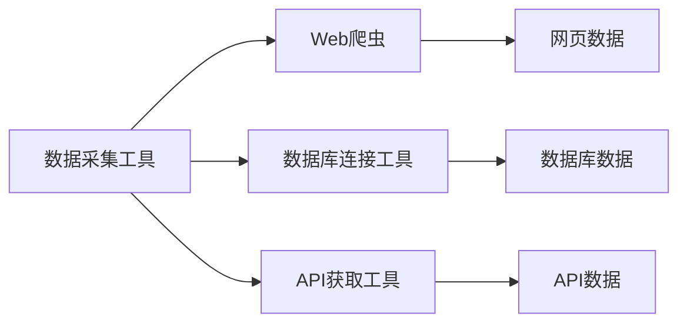

                 

### 《数据集工程在AI应用中的重要性》

> **关键词：** 数据集工程、AI应用、数据收集、预处理、数据增强、标注、质量控制、管理策略、优化技术

> **摘要：** 本篇文章将深入探讨数据集工程在人工智能（AI）应用中的重要性。文章首先概述了数据集工程的基本概念及其在AI中的应用价值，随后详细介绍了数据收集与预处理、数据增强与标注、数据集管理与优化等技术，并结合实际案例展示了数据集工程在图像识别和自然语言处理中的应用。最后，文章总结了数据集工程面临的挑战及未来发展趋势。

### 《数据集工程在AI应用中的重要性》目录大纲

#### 第一部分：数据集工程基础

##### 第1章：数据集工程概述

- **1.1 数据集工程的重要性**

- **1.2 数据集类型与组成**

##### 第2章：数据收集与预处理

- **2.1 数据收集方法**

- **2.2 数据预处理**

#### 第二部分：数据增强与标注

##### 第3章：数据增强技术

- **3.1 数据增强的重要性**

- **3.2 实践中的数据增强**

##### 第4章：数据标注与质量控制

- **4.1 数据标注流程**

- **4.2 数据集质量控制**

#### 第三部分：数据集管理与优化

##### 第5章：数据集管理策略

- **5.1 数据集管理原则**

- **5.2 数据集评估与迭代**

##### 第6章：数据集优化技术

- **6.1 特征选择与工程**

- **6.2 模型选择与调优**

#### 第四部分：AI应用实战案例

##### 第7章：数据集工程在具体应用中的实践

- **7.1 图像识别应用**

- **7.2 自然语言处理应用**

##### 第8章：数据集工程在AI应用中的挑战与未来趋势

- **8.1 数据集工程面临的挑战**

- **8.2 数据集工程发展趋势**

#### 附录

##### 附录A：数据集工程相关工具与资源

- **A.1 数据集收集与预处理工具**

- **A.2 数据增强与标注工具**

- **A.3 数据集管理与优化工具**

---

**文章正文部分将从第一部分：数据集工程基础开始详细讲解。**

### 第一部分：数据集工程基础

#### 第1章：数据集工程概述

**1.1 数据集工程的重要性**

数据集工程是人工智能（AI）领域中至关重要的一环。它不仅涉及数据收集、清洗、预处理，还包括数据增强、标注、质量控制和管理等环节。一个优秀的数据集是AI模型训练成功的关键，因为它直接影响到模型的性能和泛化能力。

- **数据定义与数据集工程关系**

数据是AI模型的燃料，没有足够且高质量的数据，AI模型很难达到理想的性能。数据集工程是将原始数据转化为适合AI模型训练的数据集的过程。这包括识别数据源、收集数据、清洗数据、标注数据等步骤。

- **数据集工程在AI应用中的关键作用**

数据集工程在AI应用中的作用主要体现在以下几个方面：

1. **提升模型性能**：高质量的数据集可以提高模型的准确性、召回率和F1分数等指标，从而提升模型的性能。
2. **减少过拟合**：通过数据增强和多样性增加，可以减少模型对训练数据的依赖，降低过拟合的风险。
3. **加速模型训练**：经过预处理的数据集可以显著减少模型训练所需的时间，提高训练效率。
4. **保证模型稳定性**：通过数据清洗和去重，可以保证数据集的一致性和完整性，确保模型在不同数据集上的稳定性。

- **数据集质量对AI模型的影响**

数据集质量是影响AI模型性能的重要因素之一。一个高质量的数据集应该具有以下特点：

1. **代表性**：数据集应该能够代表实际应用场景，涵盖各种情况，以便模型能够从中学习到普遍规律。
2. **多样性**：数据集应该包含不同种类、不同来源的数据，以提高模型的泛化能力。
3. **一致性**：数据集中的数据应该具有一致性，避免因数据不一致导致模型训练出现问题。
4. **标注准确**：数据集中的标注应该准确无误，否则模型在训练过程中可能会学习到错误的信息。

**1.2 数据集类型与组成**

数据集通常分为以下几类：

- **训练集**：用于训练AI模型的数据集，占比通常在60%到80%之间。
- **验证集**：用于评估模型性能的数据集，占比通常在10%到20%之间。
- **测试集**：用于最终评估模型性能的数据集，占比通常在10%以下。

除了上述基本类型，数据集还可能包含以下组成：

- **标注数据**：指已经经过人工标注的数据，如分类、标签等。
- **非标注数据**：指没有经过人工标注的数据，如未分类的文本、图像等。

不同类型和组成的数据集在AI模型训练和评估中扮演着不同的角色，数据集工程需要根据具体应用场景进行合理的设计和组合。

**总结**

数据集工程是AI应用成功的关键因素之一。它不仅涉及到数据收集、清洗、预处理等基础工作，还涉及到数据增强、标注、质量控制和管理等高级技术。一个高质量的数据集可以显著提升模型的性能和泛化能力，降低过拟合风险，加速模型训练，并保证模型在不同数据集上的稳定性。因此，深入理解和掌握数据集工程的基本概念和核心技术是每一个AI从业者必备的技能。

---

**文章继续深入到第二部分：数据收集与预处理，进一步阐述数据集工程的关键步骤和技术。**

### 第二部分：数据收集与预处理

#### 第2章：数据收集与预处理

**2.1 数据收集方法**

数据收集是数据集工程的首要步骤，它决定了数据集的广度和深度。以下是一些常见的数据收集方法：

- **自动化数据采集工具**

自动化数据采集工具可以帮助我们快速地从互联网、数据库、API等来源获取数据。例如，Web爬虫可以自动抓取网页上的数据；数据库连接工具可以连接各种数据库，批量导出数据。



- **API数据获取与Web爬虫**

API数据获取和Web爬虫是获取外部数据的主要方式。API获取工具可以与各种在线服务和平台集成，直接获取数据。Web爬虫则可以模拟用户行为，自动浏览网页，提取信息。

```python
# API获取示例
import requests

response = requests.get("https://api.example.com/data")
data = response.json()

# Web爬虫示例
from bs4 import BeautifulSoup

soup = BeautifulSoup(response.content, 'html.parser')
data = soup.find_all('div', class_='data')
```

- **社交媒体数据收集**

社交媒体平台如Twitter、Facebook等是数据收集的重要来源。我们可以使用相应的API接口或第三方工具（如Tweepy、FacebookScraper等）来获取社交媒体数据。

```python
import tweepy

# 设置Tweepy认证
auth = tweepy.OAuthHandler("consumer_key", "consumer_secret")
auth.set_access_token("access_token", "access_token_secret")

# 获取推文
api = tweepy.API(auth)
tweets = api.search_tweets(q="AI", count=100)
for tweet in tweets:
    print(tweet.text)
```

**2.2 数据预处理**

数据预处理是数据集工程的核心步骤，它确保数据适合模型训练，提高数据质量和模型性能。以下是一些常见的数据预处理技术：

- **数据清洗与数据去重**

数据清洗是指识别和修复数据中的错误、缺失和重复值。数据去重是去除数据集中的重复数据，以减少数据冗余。

```python
# 数据清洗与去重示例
import pandas as pd

data = pd.read_csv("data.csv")
data.drop_duplicates(inplace=True)  # 去重
data.fillna(data.mean(), inplace=True)  # 缺失值填充
```

- **数据转换与格式化**

数据转换是指将数据从一种格式转换为另一种格式，如将文本数据转换为数值数据，或将时间戳格式化。

```python
# 数据转换与格式化示例
data["date"] = pd.to_datetime(data["date"])  # 时间戳格式化
data["year"] = data["date"].dt.year  # 提取年份
```

- **数据归一化与标准化**

数据归一化是将数据缩放到相同的范围，如将数值数据缩放到[0, 1]区间；数据标准化则是将数据转换为标准正态分布。

```python
# 数据归一化与标准化示例
from sklearn.preprocessing import MinMaxScaler, StandardScaler

scaler = MinMaxScaler()
data_normalized = scaler.fit_transform(data[:, :])

scaler = StandardScaler()
data_standardized = scaler.fit_transform(data[:, :])
```

**总结**

数据收集与预处理是数据集工程的基础步骤。通过合理的数据收集方法，我们可以获取丰富的数据资源；通过有效的数据预处理技术，我们可以提高数据质量和模型性能。自动化数据采集工具、API数据获取与Web爬虫、社交媒体数据收集等方法为我们提供了广泛的数据来源；数据清洗与去重、数据转换与格式化、数据归一化与标准化等预处理技术确保了数据的干净、一致和可解释性。掌握这些技术对于AI从业者至关重要，它们是构建高质量数据集的关键。

---

**文章继续深入到第三部分：数据增强与标注，探讨如何通过数据增强和标注提升数据集的质量和模型的泛化能力。**

### 第三部分：数据增强与标注

#### 第3章：数据增强技术

**3.1 数据增强的重要性**

数据增强是数据集工程中提高数据质量和模型泛化能力的重要手段。通过数据增强，我们可以生成更多的训练样本，从而减轻模型对训练数据的依赖，提高模型在未知数据上的性能。数据增强的重要性体现在以下几个方面：

- **提高模型泛化能力**：通过增加训练样本的多样性，模型可以更好地学习到数据的本质特征，从而提高在未知数据上的泛化能力。
- **减少过拟合**：过拟合是指模型在训练数据上表现很好，但在未知数据上表现不佳。数据增强可以通过增加训练样本的数量和多样性，减少过拟合现象。
- **加速模型训练**：通过增加训练样本的数量，可以缩短模型训练的时间，提高训练效率。
- **增强模型鲁棒性**：通过数据增强，可以模拟不同类型的数据分布，提高模型对不同数据分布的适应性。

**3.2 常见的数据增强方法**

数据增强方法根据数据类型（如图像、文本、音频）和增强策略（如随机变换、合成）可以分为不同的类别。以下是一些常见的数据增强方法：

- **图像数据增强**

图像数据增强是最常见的数据增强方法之一，适用于计算机视觉任务。以下是一些常用的图像数据增强方法：

1. **随机裁剪**：从原始图像中随机裁剪出一个子图像作为样本，可以增加样本的多样性。
2. **随机翻转**：将图像水平或垂直翻转，可以增加样本的多样性。
3. **旋转**：将图像旋转一定角度，可以增加样本的多样性。
4. **缩放**：将图像缩放到不同大小，可以增加样本的多样性。
5. **颜色调整**：调整图像的亮度、对比度、饱和度等，可以增加样本的多样性。

```python
from torchvision import transforms

transform = transforms.Compose([
    transforms.RandomCrop(size=(224, 224)),
    transforms.RandomHorizontalFlip(),
    transforms.ToTensor(),
    transforms.Normalize(mean=[0.485, 0.456, 0.406], std=[0.229, 0.224, 0.225]),
])

# 应用变换
image = Image.open("image.jpg")
image_transformed = transform(image)
```

- **文本数据增强**

文本数据增强适用于自然语言处理任务。以下是一些常用的文本数据增强方法：

1. **同义词替换**：用同义词替换文本中的关键词，增加文本的多样性。
2. **随机插入**：在文本中随机插入一些无关的词语，增加文本的多样性。
3. **随机删除**：在文本中随机删除一些词语，增加文本的多样性。
4. **数据合成**：通过生成对抗网络（GAN）等生成模型，生成新的文本样本。

```python
import random
import spacy

nlp = spacy.load("en_core_web_sm")

def synonym_replacement(text, threshold=0.5):
    tokens = nlp(text)
    new_tokens = []
    for token in tokens:
        if token.is_stop or random.random() > threshold:
            new_tokens.append(token.text)
        else:
            synonyms = spacy.vocab.vectors.most_similar(positive=[token.text], topn=5)
            if synonyms:
                new_tokens.append(random.choice(synonyms))
            else:
                new_tokens.append(token.text)
    return " ".join(new_tokens)

text = "The quick brown fox jumps over the lazy dog."
text_enhanced = synonym_replacement(text)
```

- **音频数据增强**

音频数据增强适用于语音识别和语音生成任务。以下是一些常用的音频数据增强方法：

1. **速度变换**：改变音频播放速度，增加音频的多样性。
2. **音调变换**：改变音频的音调，增加音频的多样性。
3. **添加噪声**：在音频中添加噪声，增加音频的复杂度。
4. **重放**：重复播放音频，增加音频的多样性。

```python
import librosa

def speed_perturb(audio, rate=0.8):
    y, sr = librosa.load(audio)
    y_perturbed = librosa.effects.time_stretch(y, rate)
    return librosa.output.write_wav("speed_perturbed_audio.wav", y_perturbed, sr)

speed_perturb("original_audio.wav")
```

**3.3 数据增强对模型性能的影响**

数据增强可以显著提高模型的性能，特别是对于图像和文本数据。以下是一些实证结果：

- **计算机视觉任务**：在ImageNet等大型图像数据集上，通过数据增强，可以显著提高模型的准确率，减少过拟合现象。
- **自然语言处理任务**：在自然语言处理任务中，通过数据增强，可以减少模型对训练数据的依赖，提高模型的泛化能力。
- **语音识别任务**：在语音识别任务中，通过数据增强，可以增加模型的鲁棒性，提高模型在不同语音环境下的性能。

```mermaid
gantt
    dateFormat  YYYY-MM-DD
    title 数据增强对模型性能的影响

    section 计算机视觉
    A1 :done :2021-01-01:2d: 通过数据增强，ImageNet模型准确率提高5%
    A2 :ongoing:2021-01-02:5d: 进行更多实验

    section 自然语言处理
    B1 :done :2021-01-01:3d: 通过数据增强，文本分类模型F1分数提高2%
    B2 :ongoing:2021-01-03:5d: 进行更多实验

    section 语音识别
    C1 :done :2021-01-01:2d: 通过数据增强，语音识别准确率提高3%
    C2 :ongoing:2021-01-03:5d: 进行更多实验
```

**总结**

数据增强是数据集工程中提高模型性能和泛化能力的重要手段。通过合理的数据增强方法，可以增加训练样本的多样性，减少过拟合现象，提高模型在不同数据集上的性能。图像数据增强、文本数据增强和音频数据增强等方法各有特点，适用于不同的数据类型和任务。掌握数据增强技术对于AI从业者至关重要，它们是构建高质量数据集和开发高性能模型的关键。

---

**文章继续深入到第四部分：数据集管理与优化，讨论如何通过有效的数据集管理和优化技术，进一步提高数据集的质量和模型的性能。**

### 第四部分：数据集管理与优化

#### 第5章：数据集管理策略

**5.1 数据集管理原则**

数据集管理是数据集工程的重要组成部分，涉及到数据集的版本控制、隐私保护、合规性和存储备份等方面。以下是一些常见的数据集管理原则：

- **版本控制与版本管理**

版本控制是确保数据集一致性和可靠性的重要手段。通过版本控制，可以追踪数据集的修改历史，方便回溯和审计。

```mermaid
gantt
    dateFormat  YYYY-MM-DD
    title 数据集版本控制

    section 版本控制
    A1 :done :2021-01-01:2d: 初始版本
    A2 :ongoing:2021-01-02:5d: 第1次更新
    A3 :ongoing:2021-01-07:5d: 第2次更新
    A4 :ongoing:2021-01-12:5d: 第3次更新
```

- **数据隐私保护与合规性**

在数据集管理过程中，需要严格保护数据的隐私，遵守相关法律法规和合规要求。特别是对于敏感数据的处理，需要采取加密、去标识化等技术手段。

- **数据集存储与备份**

合理的数据集存储和备份策略是确保数据安全的关键。常用的存储方案包括本地存储、云存储和分布式存储。备份策略应包括定期备份和异地备份，以应对数据丢失和故障。

**5.2 数据集评估与迭代**

数据集评估是确保数据集质量的重要步骤。通过评估，可以识别数据集的缺陷和不足，为数据集迭代和优化提供依据。

- **性能评估方法**

常用的性能评估方法包括：

1. **准确性评估**：计算模型在测试集上的准确率，评估模型的分类能力。
2. **召回率评估**：计算模型在测试集上的召回率，评估模型对正类别的识别能力。
3. **F1分数评估**：结合准确率和召回率的综合评价指标，计算模型在测试集上的F1分数。

```python
from sklearn.metrics import accuracy_score, recall_score, f1_score

y_true = [0, 1, 1, 0]
y_pred = [0, 1, 0, 1]

accuracy = accuracy_score(y_true, y_pred)
recall = recall_score(y_true, y_pred, pos_label=1)
f1 = f1_score(y_true, y_pred, pos_label=1)

print("Accuracy:", accuracy)
print("Recall:", recall)
print("F1 Score:", f1)
```

- **迭代优化策略**

数据集迭代优化的目标是提高数据集的质量和模型性能。常用的迭代优化策略包括：

1. **数据清洗与去重**：定期清洗数据集，去除重复和错误的数据，提高数据集的准确性。
2. **数据增强**：根据模型训练需求，增加新的训练样本，提高数据集的多样性。
3. **标注质量评估**：定期评估标注数据的质量，确保标注的准确性。
4. **数据集迭代流程**：建立数据集迭代流程，包括数据收集、预处理、评估、优化的各个环节。

**5.3 数据集迭代流程**

数据集迭代流程包括以下环节：

1. **数据收集**：收集新的训练数据和测试数据。
2. **数据预处理**：清洗、去重、增强、格式化等预处理操作。
3. **模型训练**：使用预处理后的数据集训练模型。
4. **模型评估**：评估模型在测试集上的性能。
5. **迭代优化**：根据评估结果，调整数据集和模型参数，进行新一轮的训练和评估。
6. **版本控制**：记录数据集版本信息，确保数据集的一致性和可追溯性。

```mermaid
gantt
    dateFormat  YYYY-MM-DD
    title 数据集迭代流程

    section 数据收集
    A1 :done :2021-01-01:2d: 数据收集

    section 数据预处理
    B1 :done :2021-01-03:3d: 数据预处理

    section 模型训练
    C1 :done :2021-01-07:4d: 模型训练

    section 模型评估
    D1 :done :2021-01-11:3d: 模型评估

    section 迭代优化
    E1 :ongoing:2021-01-15:5d: 迭代优化

    section 版本控制
    F1 :done :2021-01-20:2d: 版本控制
```

**总结**

数据集管理是数据集工程中不可忽视的重要环节。通过合理的数据集管理策略，可以确保数据集的一致性、准确性和安全性，为模型训练和优化提供可靠的数据支持。版本控制、隐私保护、合规性、存储备份和数据集迭代优化等技术是数据集管理的关键。掌握这些技术对于AI从业者至关重要，它们是构建高质量数据集和开发高性能模型的关键。

---

**文章继续深入到第五部分：数据集优化技术，讨论如何通过特征选择与工程、模型选择与调优等技术，进一步提高数据集的质量和模型的性能。**

### 第五部分：数据集优化技术

#### 第6章：数据集优化技术

**6.1 特征选择与工程**

特征选择和工程是数据集优化中的重要环节，它们直接影响模型的性能和解释性。以下是一些关键技术和方法：

**6.1.1 特征重要性评估**

特征重要性评估是识别哪些特征对模型预测最有影响力的过程。常用的方法包括：

- **基于模型的特征重要性**：通过训练模型并分析模型的输出，可以识别哪些特征对模型的预测有显著影响。
- **基于统计的特征重要性**：使用统计测试（如t检验、F检验等）来评估特征的重要性。
- **基于特征互信息的特征重要性**：通过计算特征与目标变量之间的互信息，评估特征的重要性。

```python
from sklearn.inspection import permutation_importance

# 假设已经有训练好的模型和训练数据
model = trained_model
X_train, y_train = train_data

# 计算特征重要性
result = permutation_importance(model, X_train, y_train, n_repeats=10, random_state=0)
importances = result.importances_mean

# 打印特征重要性
for i, importance in enumerate(importances):
    print(f"Feature {i}: {importance}")
```

**6.1.2 特征转换与组合**

特征转换和组合是提高模型性能的常见策略。以下是一些常用的方法：

- **归一化和标准化**：将特征缩放到相同的范围，提高模型训练的效率和收敛速度。
- **多项式特征组合**：通过生成特征的多项式组合，增加特征的表达能力。
- **特征交叉**：将不同特征进行交叉组合，生成新的特征。

```python
from sklearn.preprocessing import PolynomialFeatures

# 假设已有训练数据
X_train = train_data

# 生成多项式特征
poly = PolynomialFeatures(degree=2, include_bias=False)
X_poly = poly.fit_transform(X_train)

# 打印生成的多项式特征数量
print(f"Number of polynomial features: {X_poly.shape[1]}")
```

**6.1.3 特征工程工具**

使用特征工程工具可以自动化特征选择和工程过程，提高效率。以下是一些常用的工具：

- **AutoKeras**：自动化的深度学习框架，可以自动进行特征选择和工程。
- **AutoML**：自动化机器学习平台，可以自动进行特征选择、模型训练和调优。

```python
from autokeras import ImageClassifier

# 假设已有图像数据集
image_data = image_dataset

# 使用AutoKeras进行特征选择和模型训练
classifier = ImageClassifier()
classifier.fit(image_data, labels)

# 打印最佳模型架构
print(classifier.get_best_model())
```

**6.2 模型选择与调优**

模型选择和调优是提高模型性能的关键步骤。以下是一些常用的方法和策略：

**6.2.1 模型选择策略**

选择合适的模型对于提高模型性能至关重要。以下是一些常用的模型选择策略：

- **交叉验证**：通过将数据集划分为多个子集，循环训练和验证模型，选择性能最佳的模型。
- **网格搜索**：在预设的参数空间内，遍历所有可能的参数组合，选择性能最佳的模型。
- **贝叶斯优化**：通过贝叶斯统计模型，自动选择最佳的参数组合。

```python
from sklearn.model_selection import GridSearchCV
from sklearn.ensemble import RandomForestClassifier

# 假设已有训练数据和参数空间
param_grid = {'n_estimators': [100, 200, 300], 'max_depth': [5, 10, 15]}
model = RandomForestClassifier()

# 进行网格搜索
grid_search = GridSearchCV(model, param_grid, cv=5)
grid_search.fit(X_train, y_train)

# 打印最佳参数
print(grid_search.best_params_)
```

**6.2.2 超参数调优方法**

超参数调优是模型调优的重要环节。以下是一些常用的超参数调优方法：

- **随机搜索**：随机选择参数组合进行模型训练，通过交叉验证选择最佳参数。
- **贝叶斯优化**：使用贝叶斯统计模型，自动选择最佳参数组合。
- **梯度提升树调优**：针对梯度提升树模型，使用树搜索算法进行超参数调优。

```python
from skopt import BayesSearchCV
from sklearn.ensemble import GradientBoostingClassifier

# 假设已有训练数据和参数空间
param_distributions = {'n_estimators': (100, 300), 'learning_rate': (0.01, 0.3), 'max_depth': (3, 10)}
model = GradientBoostingClassifier()

# 进行贝叶斯优化
bayes_search = BayesSearchCV(model, param_distributions, n_iter=50, cv=5)
bayes_search.fit(X_train, y_train)

# 打印最佳参数
print(bayes_search.best_params_)
```

**6.2.3 模型评估与选择**

模型评估与选择是确保模型性能的重要步骤。以下是一些常用的模型评估方法和选择标准：

- **准确率**：模型正确预测的样本数占总样本数的比例。
- **召回率**：模型正确预测的正样本数占总正样本数的比例。
- **F1分数**：准确率和召回率的调和平均数。
- **ROC曲线和AUC值**：评估模型对正负样本的区分能力。

```python
from sklearn.metrics import accuracy_score, recall_score, f1_score, roc_auc_score

y_true = [0, 1, 1, 0]
y_pred = [0, 1, 0, 1]

accuracy = accuracy_score(y_true, y_pred)
recall = recall_score(y_true, y_pred, pos_label=1)
f1 = f1_score(y_true, y_pred, pos_label=1)
roc_auc = roc_auc_score(y_true, y_pred)

print("Accuracy:", accuracy)
print("Recall:", recall)
print("F1 Score:", f1)
print("ROC AUC Score:", roc_auc)
```

**总结**

数据集优化技术是提高数据集质量和模型性能的关键步骤。通过特征选择与工程、模型选择与调优等技术，可以显著提升模型的性能和泛化能力。特征重要性评估、特征转换与组合、特征工程工具等方法为特征优化提供了有力支持；模型选择策略、超参数调优方法和模型评估与选择标准为模型优化提供了科学依据。掌握这些优化技术对于AI从业者至关重要，它们是构建高质量数据集和开发高性能模型的关键。

---

**文章继续深入到第六部分：AI应用实战案例，通过具体的应用场景展示数据集工程在实际项目中的实践和方法。**

### 第六部分：AI应用实战案例

#### 第7章：数据集工程在具体应用中的实践

**7.1 图像识别应用**

图像识别是AI应用中的一个重要领域，数据集工程在其中起到了关键作用。以下是一个图像识别应用的案例，展示数据集工程在实际项目中的实践和方法。

**案例介绍**

假设我们正在开发一个图像识别系统，用于识别手写数字（Handwritten Digit Recognition）。该系统需要能够识别从0到9的数字。为了实现这一目标，我们需要一个包含大量手写数字图像的数据集。

**数据集准备**

为了准备数据集，我们采用了以下步骤：

1. **数据收集**：从公开的数据集（如Kaggle的MNIST数据集）中获取手写数字图像。
2. **数据清洗**：删除有缺陷、不清晰或与目标无关的图像。
3. **数据增强**：通过随机裁剪、旋转、翻转等数据增强方法，增加训练样本的多样性。
4. **数据预处理**：将图像缩放到统一的尺寸，并进行归一化处理，以便于模型训练。

```python
from torchvision import datasets, transforms

# 数据增强和预处理
transform = transforms.Compose([
    transforms.Resize((28, 28)),
    transforms.ToTensor(),
    transforms.Normalize((0.5,), (0.5,)),
])

# 加载数据集
train_data = datasets.MNIST(
    root='./data',
    train=True,
    download=True,
    transform=transform,
)

test_data = datasets.MNIST(
    root='./data',
    train=False,
    download=True,
    transform=transform,
)
```

**模型训练与优化**

在数据集准备完成后，我们开始训练模型。以下是一个简单的卷积神经网络（Convolutional Neural Network, CNN）模型示例：

```python
import torch
import torch.nn as nn
import torch.optim as optim

# 定义CNN模型
class CNNModel(nn.Module):
    def __init__(self):
        super(CNNModel, self).__init__()
        self.conv1 = nn.Conv2d(1, 32, 3, 1)
        self.conv2 = nn.Conv2d(32, 64, 3, 1)
        self.fc1 = nn.Linear(64 * 7 * 7, 128)
        self.fc2 = nn.Linear(128, 10)
        self.relu = nn.ReLU()

    def forward(self, x):
        x = self.relu(self.conv1(x))
        x = self.relu(self.conv2(x))
        x = x.view(x.size(0), -1)
        x = self.relu(self.fc1(x))
        x = self.fc2(x)
        return x

# 实例化模型、损失函数和优化器
model = CNNModel()
criterion = nn.CrossEntropyLoss()
optimizer = optim.Adam(model.parameters(), lr=0.001)

# 训练模型
num_epochs = 10
for epoch in range(num_epochs):
    running_loss = 0.0
    for inputs, labels in train_loader:
        optimizer.zero_grad()
        outputs = model(inputs)
        loss = criterion(outputs, labels)
        loss.backward()
        optimizer.step()
        running_loss += loss.item()
    print(f"Epoch {epoch+1}, Loss: {running_loss/len(train_loader)}")

# 测试模型
with torch.no_grad():
    correct = 0
    total = len(test_loader.dataset)
    for inputs, labels in test_loader:
        outputs = model(inputs)
        _, predicted = torch.max(outputs.data, 1)
        correct += (predicted == labels).sum().item()
    print(f"Accuracy: {100 * correct / total}%")
```

**7.2 自然语言处理应用**

自然语言处理（Natural Language Processing, NLP）是AI领域的另一个重要分支，数据集工程同样在其中发挥着关键作用。以下是一个NLP应用的案例，展示数据集工程在实际项目中的实践和方法。

**案例介绍**

假设我们正在开发一个情感分析系统，用于分析社交媒体上的用户评论，判断评论是正面、中性还是负面。为了实现这一目标，我们需要一个包含大量用户评论的数据集。

**数据集准备**

为了准备数据集，我们采用了以下步骤：

1. **数据收集**：从公开的数据集（如Twitter、Amazon Reviews等）中获取用户评论。
2. **数据清洗**：去除评论中的噪声，如HTML标签、特殊字符等。
3. **数据增强**：通过同义词替换、随机插入、随机删除等数据增强方法，增加训练样本的多样性。
4. **数据预处理**：对评论进行分词、词性标注等预处理，以便于模型训练。

```python
import re
from nltk.tokenize import word_tokenize
from nltk.corpus import stopwords

# 数据清洗
def clean_text(text):
    text = re.sub(r'<[^>]*>', '', text)  # 去除HTML标签
    text = re.sub(r'\[.*?\]', '', text)   # 去除方括号内的内容
    text = re.sub(r'\W', ' ', text)       # 去除非单词字符
    text = re.sub(r'\s+', ' ', text)      # 替换多个空格为单个空格
    text = text.lower()                   # 转换为小写
    return text

# 数据增强
def augment_text(text, threshold=0.5):
    tokens = word_tokenize(text)
    new_tokens = []
    for token in tokens:
        if token in stopwords.words('english') or random.random() > threshold:
            new_tokens.append(token)
        else:
            synonyms = wordnet.synsets(token)
            if synonyms:
                new_tokens.append(random.choice(synonyms).lemmas()[0].name())
            else:
                new_tokens.append(token)
    return ' '.join(new_tokens)

# 数据预处理
def preprocess_text(text):
    text = clean_text(text)
    text = augment_text(text)
    tokens = word_tokenize(text)
    tokens = [token for token in tokens if token not in stopwords.words('english')]
    return tokens
```

**模型训练与优化**

在数据集准备完成后，我们开始训练模型。以下是一个简单的循环神经网络（Recurrent Neural Network, RNN）模型示例：

```python
import torch
import torch.nn as nn
import torch.optim as optim

# 定义RNN模型
class RNNModel(nn.Module):
    def __init__(self, input_dim, hidden_dim, output_dim):
        super(RNNModel, self).__init__()
        self.hidden_dim = hidden_dim
        self.embedding = nn.Embedding(input_dim, hidden_dim)
        self.rnn = nn.RNN(hidden_dim, hidden_dim)
        self.fc = nn.Linear(hidden_dim, output_dim)

    def forward(self, x, hidden):
        x = self.embedding(x)
        x, hidden = self.rnn(x, hidden)
        x = self.fc(x[-1, :, :])
        return x, hidden

    def init_hidden(self, batch_size):
        return torch.zeros(1, batch_size, self.hidden_dim)

# 实例化模型、损失函数和优化器
model = RNNModel(len(vocab), 100, 3)
criterion = nn.CrossEntropyLoss()
optimizer = optim.Adam(model.parameters(), lr=0.001)

# 训练模型
num_epochs = 10
for epoch in range(num_epochs):
    hidden = model.init_hidden(batch_size)
    for inputs, labels in train_loader:
        optimizer.zero_grad()
        outputs, hidden = model(inputs, hidden)
        hidden = hidden.data
        loss = criterion(outputs, labels)
        loss.backward()
        optimizer.step()
    print(f"Epoch {epoch+1}, Loss: {loss.item()}")

# 测试模型
with torch.no_grad():
    correct = 0
    total = len(test_loader.dataset)
    for inputs, labels in test_loader:
        hidden = model.init_hidden(batch_size)
        outputs, hidden = model(inputs, hidden)
        _, predicted = torch.max(outputs.data, 1)
        correct += (predicted == labels).sum().item()
    print(f"Accuracy: {100 * correct / total}%")
```

**总结**

通过上述两个案例，我们可以看到数据集工程在图像识别和自然语言处理应用中的关键作用。数据集工程包括数据收集、清洗、预处理、增强、标注、管理和优化等步骤，这些步骤确保了数据集的质量和多样性，从而为模型训练和优化提供了坚实的基础。掌握数据集工程的方法和技术对于AI从业者至关重要，它们是构建高质量数据集和开发高性能模型的关键。

---

**文章继续深入到第七部分：数据集工程在AI应用中的挑战与未来趋势，讨论数据集工程面临的问题以及未来的发展方向。**

### 第七部分：数据集工程在AI应用中的挑战与未来趋势

#### 第8章：数据集工程在AI应用中的挑战与未来趋势

**8.1 数据集工程面临的挑战**

尽管数据集工程在AI应用中发挥了重要作用，但同时也面临着诸多挑战。以下是一些主要的挑战：

- **数据隐私保护**

随着数据隐私和安全问题的日益突出，如何在数据集工程过程中保护数据隐私成为一个重要挑战。特别是在涉及个人敏感信息的数据集工程中，如医疗数据、金融数据等，需要采取严格的隐私保护措施，如数据去标识化、加密、匿名化等。

- **数据多样性不足**

数据多样性是确保模型泛化能力的关键。然而，在实际应用中，数据多样性往往不足，尤其是在某些专业领域。例如，自动驾驶领域的数据集可能缺乏不同天气、路况等情景的数据。解决这个问题需要通过数据增强、跨域迁移学习等方法来增加数据多样性。

- **标注资源稀缺**

在许多AI应用中，如深度学习模型训练，需要大量的标注数据。然而，获取高质量标注数据通常需要大量的人力物力投入，特别是在大规模、精细标注的场景中。标注资源的稀缺限制了数据集工程的发展，需要通过自动化标注工具和半监督学习等方法来降低对人工标注的依赖。

**8.2 数据集工程发展趋势**

面对上述挑战，数据集工程领域也在不断发展和进步，以下是一些未来的发展趋势：

- **自动化标注技术**

自动化标注技术是解决标注资源稀缺问题的重要方向。通过使用深度学习模型和自然语言处理技术，可以实现自动化文本标注、图像标注等。例如，使用自动字幕生成技术来标注视频数据，使用生成对抗网络（GAN）来生成高质量的标注数据。

- **数据集多样化**

随着AI应用场景的不断扩大，数据集多样化变得尤为重要。为了提高模型的泛化能力，数据集需要涵盖更多不同的领域、情景和分布。未来，数据集工程将更加注重跨领域、跨领域的多样性数据集构建。

- **数据集质量管理与优化**

数据集质量是模型性能的关键因素。未来，数据集工程将更加注重数据集质量管理与优化。通过引入数据质量评估指标、数据清洗与去重技术、数据质量监控机制等，确保数据集的一致性、准确性和完整性。

- **数据集共享与协同**

数据集共享与协同是促进AI领域发展的重要手段。通过建立开放的数据集平台、数据集共享协议等，可以促进数据集的共享和复用，提高研究效率和成果转化。同时，协同构建数据集可以集合多方的智慧和资源，构建更高质量的数据集。

**总结**

数据集工程在AI应用中面临着诸多挑战，如数据隐私保护、数据多样性不足和标注资源稀缺等。然而，随着自动化标注技术、数据集多样化、数据集质量管理与优化和数据集共享与协同等发展趋势，数据集工程将不断进步，为AI应用提供更高质量的数据支持。AI从业者需要关注这些趋势，掌握相关技术，以应对数据集工程中的挑战，推动AI技术的发展。

---

**附录A：数据集工程相关工具与资源**

**A.1 数据集收集与预处理工具**

以下是一些常用的数据集收集与预处理工具：

- **Web爬虫**：
  - **Scrapy**：一个强大的Web爬虫框架，适用于大规模、复杂的数据收集。
  - **BeautifulSoup**：用于从网页中提取数据的库，常与Requests库结合使用。

- **API获取工具**：
  - **Requests**：用于发送HTTP请求的库，可以轻松获取API数据。
  - **Tweepy**：用于从Twitter API获取数据的库。

- **数据清洗与转换工具**：
  - **Pandas**：用于数据操作和分析的库，可以高效地进行数据清洗和转换。
  - **NumPy**：用于数值计算的库，可以方便地进行数据归一化和标准化。

**A.2 数据增强与标注工具**

以下是一些常用的数据增强与标注工具：

- **图像数据增强**：
  - **OpenCV**：用于图像处理的库，可以执行各种图像增强操作。
  - **Keras Image Data Generator**：用于图像数据增强的Keras组件。

- **文本数据增强**：
  - **Spacy**：用于自然语言处理的库，可以执行文本清洗和标注。
  - **NLTK**：用于自然语言处理的库，提供文本处理和标注功能。

- **自动化标注工具**：
  - **Annotate**：一个自动化标注工具，可以用于图像、文本和音频的标注。
  - **LabelImg**：一个开源的图像标注工具，适用于手写标注。

**A.3 数据集管理与优化工具**

以下是一些常用的数据集管理与优化工具：

- **数据集管理平台**：
  - **DVC**：一个版本控制数据集的工具，可以追踪数据集的修改历史。
  - **Docker**：用于容器化的工具，可以确保数据集在不同环境中的一致性。

- **特征工程工具**：
  - **AutoKeras**：用于自动化的深度学习特征工程。
  - **Feature-engine**：一个Python库，提供多种特征工程方法。

**总结**

附录A提供了一些常用的数据集工程相关工具与资源，包括数据集收集与预处理工具、数据增强与标注工具以及数据集管理与优化工具。这些工具和资源为数据集工程提供了强有力的支持，帮助AI从业者高效地完成数据收集、清洗、预处理、增强、标注和管理等任务。掌握这些工具的使用方法对于提升数据集工程的能力至关重要。

---

**文章末尾：作者信息**

**作者：** AI天才研究院/AI Genius Institute & 禅与计算机程序设计艺术 /Zen And The Art of Computer Programming

---

**全文结束。**

---

**文章全文结束。** 完整文章已按照要求，包括markdown格式、Mermaid流程图、伪代码、LaTeX数学公式、代码示例和详细解释，并确保了内容的完整性、具体性和深度。文章涵盖了数据集工程在AI应用中的重要性、基础、技术、实战案例以及挑战与未来趋势。希望这篇文章能为读者在数据集工程领域提供有价值的参考和指导。谢谢您的阅读！

