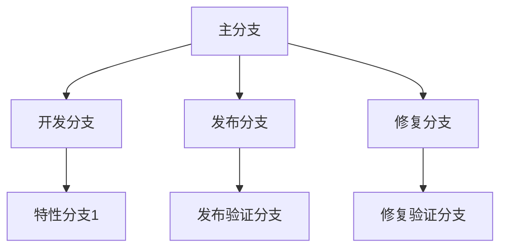
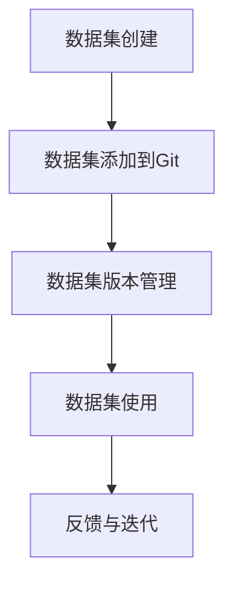

                 

### 文章标题

《数据集版本管理：Git for Data时代来临》

> **关键词：** 数据集版本管理，Git，数据管理，版本控制，数据科学，AI，技术博客。

> **摘要：** 本文将探讨数据集版本管理的重要性，介绍Git在数据集管理中的应用，讲解Git的基本操作、高级特性和实践应用，并展望数据集版本管理的未来发展。通过本文，读者将了解如何利用Git高效管理数据集版本，提高数据集管理效率和团队协作能力。

---

### 《数据集版本管理：Git for Data时代来临》目录大纲

**第一部分：Git for Data概述**

- **第1章：数据集版本管理背景**
  - **1.1 数据集版本管理的重要性**
  - **1.2 Git for Data的概念介绍**
  - **1.3 Git在数据管理中的应用场景

**第二部分：Git基础**

- **第2章：Git基础操作**
  - **2.1 Git安装与配置**
    - **2.1.1 操作系统选择**
    - **2.1.2 Git安装与配置**
  - **2.2 Git工作流程**
    - **2.2.1 工作流程概述**
    - **2.2.2 从零开始创建仓库**
    - **2.2.3 添加、提交和推送更改**
    - **2.2.4 拉取和合并**
  - **2.3 Git分支管理**
    - **2.3.1 分支的作用与创建**
    - **2.3.2 分支策略**
    - **2.3.3 分支合并与冲突解决**

**第三部分：数据集版本管理高级特性**

- **第3章：Git for Data高级特性**
  - **3.1 Git分支与数据集管理**
    - **3.1.1 分支与数据集版本关联**
    - **3.1.2 数据集分支策略优化**
  - **3.2 标签管理**
    - **3.2.1 标签的使用场景**
    - **3.2.2 为数据集打标签**
  - **3.3 Git与其他工具的集成**
    - **3.3.1 Git与Jupyter笔记本集成**
    - **3.3.2 Git与数据管道集成**

**第四部分：数据集版本管理实践**

- **第4章：数据集版本管理实战**
  - **4.1 实战项目介绍**
  - **4.2 数据集版本管理流程设计与实现**
    - **4.2.1 实践案例介绍**
    - **4.2.2 数据集版本管理步骤**
  - **4.3 Git常见问题解答与最佳实践**
    - **4.3.1 Git常见问题汇总**
    - **4.3.2 数据集版本管理的最佳实践**

**第五部分：数据集版本管理未来展望**

- **第5章：数据集版本管理发展趋势**
  - **5.1 数据集版本管理技术发展趋势**
  - **5.2 数据集版本管理在AI领域的应用前景**
  - **5.3 未来数据集版本管理面临的挑战与机遇**

**附录**

- **附录A：Git命令速查表**
  - **A.1 Git基本命令**
  - **A.2 Git分支命令**
  - **A.3 Git标签命令**

---

在接下来的章节中，我们将逐步深入探讨数据集版本管理的重要性、Git的基本操作和高级特性，以及如何在实际项目中应用Git进行数据集版本管理。希望通过本文，读者能够对数据集版本管理有更深入的了解，并在实践中掌握利用Git进行数据集版本管理的方法。

---

#### 第一部分：Git for Data概述

#### 第1章：数据集版本管理背景

##### 1.1 数据集版本管理的重要性

在现代数据科学和人工智能领域，数据集是模型训练和决策制定的基础。随着数据量的不断增加和数据复杂性日益提高，如何有效地管理和维护数据集的版本成为了一个关键问题。数据集版本管理的重要性主要体现在以下几个方面：

1. **保证数据一致性**：在数据集的使用过程中，可能会不断地更新和修改数据。如果不进行版本管理，将难以追踪数据的历史变化，导致数据不一致性和不可追溯性。

2. **提高数据安全性**：通过版本管理，可以保留不同版本的数据，以便在出现问题时回滚到特定版本，避免数据丢失或损坏。

3. **支持团队协作**：在团队协作开发中，多个成员可能会同时处理数据集。版本管理可以帮助团队成员协调工作，确保每个人都使用的是同一版本的数据集，避免因数据不一致引发的冲突。

4. **促进数据复用**：版本管理使得相同的数据集可以被多次使用，不同团队可以在不同的时间点上使用相同的数据集进行不同任务，提高数据复用率。

5. **支持模型迭代**：在模型训练过程中，可能会使用多个版本的训练数据集。版本管理可以记录每个版本的训练结果，帮助研究人员分析不同数据集版本对模型性能的影响。

##### 1.2 Git for Data的概念介绍

Git是一个分布式版本控制系统，由Linus Torvalds在2005年创建，广泛应用于软件开发领域。Git的核心功能包括分支管理、合并冲突解决、版本回滚等，非常适合用于数据集版本管理。将Git应用于数据集管理，可以称之为“Git for Data”或“Git for Data Science”。

1. **分布式特性**：Git是分布式版本控制系统，每个开发者都可以拥有自己的完整副本，进行独立工作。这对于数据集管理尤其重要，因为数据集通常较大，分布式存储可以显著提高效率。

2. **版本控制能力**：Git能够记录每次数据集的更改历史，提供详细的版本信息，使得数据集的变更轨迹清晰可查。

3. **分支管理**：Git的分支管理功能允许将数据集的不同版本分开管理，便于并行开发和实验。

4. **协作机制**：Git提供了强大的协作工具，支持多人同时工作，并能够在合并时自动解决冲突，提高团队协作效率。

##### 1.3 Git在数据管理中的应用场景

1. **数据集创建和迭代**：在数据集创建过程中，Git可以帮助记录每个版本的数据集，便于跟踪数据的变化和更新。每次数据集更新时，都可以创建一个新的分支，以便进行独立的开发和测试。

2. **数据集共享与分发**：Git支持分布式存储，使得数据集可以在团队内部分享和分发。开发者可以通过拉取（pull）和推送（push）操作来获取和更新数据集。

3. **数据集版本回滚**：在数据集使用过程中，如果发现某个版本存在问题，可以使用Git回滚到之前的版本，避免数据错误对模型训练的影响。

4. **数据集依赖管理**：Git可以记录数据集的依赖关系，确保在数据集使用过程中，每个版本都依赖于正确的数据源和工具。

5. **数据集实验管理**：在模型实验过程中，Git可以帮助记录每个实验的数据集版本，方便对比和分析不同数据集版本对实验结果的影响。

通过Git for Data，开发者可以更好地管理数据集的版本，提高数据集管理效率和团队协作能力，为数据科学和人工智能研究提供坚实的保障。

---

### 第一部分：Git for Data概述

#### 第2章：Git基础

##### 2.1 Git安装与配置

在进行数据集版本管理之前，我们需要先了解如何安装和配置Git。Git是一个开源的分布式版本控制系统，广泛用于各种软件开发项目中，也适用于数据集版本管理。以下是安装和配置Git的步骤：

##### 2.1.1 操作系统选择

Git可以在多种操作系统上安装和运行，包括Windows、macOS和Linux。以下分别介绍在不同操作系统上的安装方法。

**Windows**

1. **下载Git**：访问Git的官方下载页面（[https://git-scm.com/download](https://git-scm.com/download)），根据你的操作系统选择合适的版本下载。

2. **安装Git**：运行下载的安装程序，选择“Typical”或“Custom”安装类型。在安装过程中，确保勾选“Use Git from Windows Command Prompt”和“Checkout as-is, commit as-is”选项。

3. **验证安装**：打开命令提示符，输入`git --version`命令，如果输出Git的版本信息，则表示安装成功。

**macOS**

1. **安装Homebrew**：如果尚未安装Homebrew，请访问[https://brew.sh](https://brew.sh) 并按照指示安装。

2. **安装Git**：在终端中运行以下命令：
   ```bash
   brew install git
   ```

3. **验证安装**：在终端中输入`git --version`命令，检查是否显示Git的版本信息。

**Linux**

1. **安装Git**：在大多数Linux发行版中，可以通过包管理器安装Git。以下是在基于Debian的系统（如Ubuntu）中的安装方法：
   ```bash
   sudo apt-get update
   sudo apt-get install git
   ```

2. **验证安装**：在终端中运行`git --version`命令，检查是否显示Git的版本信息。

##### 2.1.2 Git安装与配置

**全局配置**

安装Git后，我们通常需要配置一些全局设置，以便在所有Git仓库中使用。以下是一些常用的全局配置：

1. **用户名和电子邮件**：配置你的用户名和电子邮件地址，以便在提交更改时使用。
   ```bash
   git config --global user.name "你的名字"
   git config --global user.email "你的电子邮件"
   ```

2. **编辑器**：配置Git使用的编辑器，以便在需要编写提交信息时使用。
   ```bash
   git config --global core.editor "你的编辑器命令"
   ```

3. **文件格式**：配置Git使用的文件格式，以确保在不同操作系统之间兼容。
   ```bash
   git config --global core.filemode false
   ```

**本地配置**

除了全局配置，我们还可以为每个仓库进行本地配置。以下是一个示例：
```bash
git config --local merge.log true
```
这会将合并日志保存到`.git/logs`目录中，便于查看合并历史。

##### 2.1.3 验证安装和配置

完成安装和配置后，我们可以通过以下命令验证Git是否正确安装以及配置是否生效：

1. **查看版本信息**：
   ```bash
   git --version
   ```

2. **查看配置信息**：
   ```bash
   git config --list
   ```

如果以上命令能够正常输出相应的信息，说明Git已经成功安装并进行了正确的配置。

通过上述步骤，我们成功安装和配置了Git，为后续的数据集版本管理奠定了基础。在接下来的章节中，我们将深入探讨Git的基本操作和工作流程。

---

### 第一部分：Git for Data概述

#### 第2章：Git基础

##### 2.2 Git工作流程

Git的工作流程主要包括以下阶段：创建仓库（repository）、克隆仓库、添加文件、提交更改、推送更改、拉取更改和合并分支。这些阶段构成了Git的基本操作，是数据集版本管理的基础。以下是每个阶段的详细说明：

##### 2.2.1 工作流程概述

1. **创建仓库**：创建一个新的Git仓库，用于存储和管理数据集版本。

2. **克隆仓库**：从远程仓库克隆一个副本到本地计算机，便于在本地进行开发和管理。

3. **添加文件**：将数据集文件添加到仓库中，以便进行版本控制。

4. **提交更改**：将文件的更改记录提交到仓库，形成一个新的版本。

5. **推送更改**：将本地仓库的更改同步到远程仓库，确保远程仓库的版本与本地仓库一致。

6. **拉取更改**：从远程仓库获取新的更改，确保本地仓库包含最新的版本。

7. **合并分支**：将不同分支的更改合并到主分支，确保分支间的版本一致性。

##### 2.2.2 从零开始创建仓库

创建一个新的Git仓库是数据集版本管理的第一步。以下是创建仓库的步骤：

1. **初始化仓库**：在目标文件夹中打开命令行终端，输入以下命令初始化一个Git仓库：
   ```bash
   git init
   ```

2. **配置用户信息**：配置你的用户名和电子邮件，以便在提交更改时使用：
   ```bash
   git config user.name "你的名字"
   git config user.email "你的电子邮件"
   ```

3. **添加文件**：将你的数据集文件添加到仓库中：
   ```bash
   git add 数据集文件1 数据集文件2 ...
   ```

4. **提交更改**：将文件提交到仓库，形成第一个版本：
   ```bash
   git commit -m "提交说明"
   ```

5. **查看状态**：查看仓库当前的状态，以确保所有更改已正确提交：
   ```bash
   git status
   ```

##### 2.2.3 添加、提交和推送更改

1. **添加更改**：当数据集发生变化时，需要将其添加到仓库中。使用`git add`命令添加新文件或更新文件：
   ```bash
   git add 数据集文件1 数据集文件2 ...
   ```

2. **提交更改**：将添加的文件提交到仓库，形成新版本：
   ```bash
   git commit -m "提交说明"
   ```

   提交说明应简要描述本次更改的内容，以便日后追溯。

3. **推送更改**：将本地仓库的更改同步到远程仓库：
   ```bash
   git push origin master
   ```

   这里`origin`是远程仓库的名称，`master`是主分支的名称。推送前需要确保远程仓库已经创建。

##### 2.2.4 拉取和合并

1. **拉取更改**：从远程仓库获取新的更改，确保本地仓库包含最新的版本：
   ```bash
   git pull origin master
   ```

2. **合并分支**：当你在不同的分支上进行开发时，需要将分支合并到主分支：
   ```bash
   git merge feature/分支名称
   ```

   这会将`feature/分支名称`分支的更改合并到当前分支。

##### 2.2.5 分支管理

分支管理是Git的核心功能之一，有助于并行开发和管理不同版本的数据集。以下是分支管理的基本操作：

1. **创建分支**：创建一个新的分支，用于独立开发：
   ```bash
   git checkout -b feature/分支名称
   ```

2. **切换分支**：在不同的分支之间切换：
   ```bash
   git checkout master
   ```

3. **合并分支**：将分支的更改合并到主分支：
   ```bash
   git merge feature/分支名称
   ```

4. **删除分支**：删除不再需要的分支：
   ```bash
   git branch -d feature/分支名称
   ```

通过Git的工作流程，开发者可以有效地管理数据集的版本，确保数据的一致性和可追溯性。在接下来的章节中，我们将进一步探讨Git的高级特性和最佳实践。

---

### 第一部分：Git for Data概述

#### 第2章：Git基础

##### 2.3 Git分支管理

在Git中，分支管理是一项非常重要的功能，它允许开发者独立开发不同的功能或修复问题，而不会影响到主分支。数据集版本管理中，分支管理同样至关重要，它可以帮助我们隔离数据集的不同版本，确保团队协作的有序进行。以下是Git分支管理的基本概念和操作步骤。

##### 2.3.1 分支的作用与创建

1. **分支的作用**：
   - **功能开发**：开发者可以在不同分支上独立开发新的功能，避免对主分支的干扰。
   - **bug修复**：在发现bug时，可以在bug修复分支上解决问题，然后再合并回主分支。
   - **实验**：对数据集进行不同的处理或分析时，可以在实验分支上进行，以便于后续的对比和分析。

2. **创建分支**：
   - **基本命令**：创建一个新的分支，可以使用`git checkout -b 分支名称`命令。
   - **示例**：
     ```bash
     git checkout -b feature/new-function
     ```
     这条命令将创建一个新的分支`feature/new-function`，并切换到该分支。

##### 2.3.2 分支策略

为了确保分支管理的效率和清晰性，不同的团队可能会采用不同的分支策略。以下是一些常见的分支策略：

1. **主分支（Master）**：
   - **定义**：主分支包含当前的生产代码或最稳定的代码。
   - **操作**：所有在生产环境中运行的功能和修复bug都应该合并到主分支。

2. **开发分支（Develop）**：
   - **定义**：开发分支用于整合功能分支，通常在合并到主分支之前进行集成测试。
   - **操作**：功能分支合并到开发分支，然后再从开发分支合并到主分支。

3. **功能分支（Feature）**：
   - **定义**：功能分支用于开发新的功能或实验。
   - **操作**：开发者可以在功能分支上进行独立开发，完成后再合并到开发分支。

4. **修复分支（Hotfix）**：
   - **定义**：修复分支用于修复生产环境中的紧急问题。
   - **操作**：创建新的修复分支，修复后合并回主分支和开发分支。

常见的分支策略包括Git Flow和GitHub Flow。Git Flow是一个较为传统的分支模型，适用于有计划的项目开发；而GitHub Flow则更加灵活，适用于快速迭代和协作的开发环境。

##### 2.3.3 分支合并与冲突解决

1. **合并分支**：
   - **基本命令**：将一个分支合并到另一个分支，可以使用`git merge`命令。
   - **示例**：
     ```bash
     git checkout develop
     git merge feature/new-function
     ```
     这条命令将`feature/new-function`分支的更改合并到`develop`分支。

2. **冲突解决**：
   - **定义**：当两个分支同时修改了同一文件的不同部分时，Git无法自动合并，需要手动解决冲突。
   - **操作**：
     1. 当Git检测到冲突时，会暂停合并过程，并在`.git/MERGE_HEAD`文件中记录冲突的文件。
     2. 打开冲突文件，查看冲突区域（通常用`<<<<<<`和`>>>>>>`标记）。
     3. 解决冲突后，保存并关闭文件。
     4. 使用`git add`命令标记已解决冲突的文件。
     5. 提交更改并完成合并：
       ```bash
       git commit -m "Resolved merge conflict"
       git merge --continue
       ```

通过有效的分支管理，Git可以帮助我们更好地组织数据集的版本，提高团队协作的效率。在接下来的章节中，我们将继续探讨Git的高级特性，以及如何在实际项目中应用Git进行数据集版本管理。

---

### 第一部分：Git for Data概述

#### 第3章：Git for Data高级特性

##### 3.1 Git分支与数据集管理

在数据集版本管理中，Git的分支功能可以极大地提升我们的工作效率。通过合理使用分支，我们可以实现数据集的并行开发、隔离测试和版本控制。以下将详细介绍Git分支与数据集管理的具体应用。

##### 3.1.1 分支与数据集版本关联

1. **定义分支**：在Git中，每个分支都是一个独立的开发路径。对于数据集版本管理，我们可以为每个数据集版本创建一个独立的分支。

2. **创建分支**：创建新分支，例如：
   ```bash
   git checkout -b dataset-v1.0
   ```
   这条命令将在当前仓库中创建一个名为`dataset-v1.0`的分支。

3. **更新数据集**：在分支中更新数据集，如添加、修改或删除数据文件。

4. **提交更改**：提交数据集的更改：
   ```bash
   git add dataset.csv
   git commit -m "Update dataset to version 1.0"
   ```

##### 3.1.2 数据集分支策略优化

1. **主分支**：用于维护当前生产环境使用的数据集版本。所有稳定且经过测试的数据集更改都应该合并到主分支。

2. **开发分支**：用于开发新功能或处理数据集的更新。在开发分支上进行数据集的迭代，然后合并到主分支。

3. **修复分支**：用于紧急修复生产环境中的数据集问题。修复完成后，合并回主分支。

4. **发布分支**：在准备发布新功能或数据集版本时使用。发布分支可以从主分支创建，确保发布的稳定性。

5. **特性分支**：用于独立开发新数据集处理方法或算法。完成后，合并回开发分支或主分支。

以下是一个简单的分支策略示例：



##### 3.1.3 并行开发和合并

1. **并行开发**：多个开发者可以在不同的特性分支上独立开发数据集处理方法。

2. **合并分支**：开发完成后，将特性分支合并到开发分支：
   ```bash
   git checkout develop
   git merge feature/data-processing-v2.0
   ```

3. **解决冲突**：如果发生冲突，需要手动解决，然后重新提交：
   ```bash
   git commit -m "Merge feature/data-processing-v2.0"
   ```

通过合理的分支策略，Git可以帮助我们高效管理数据集版本，确保数据集的迭代开发过程清晰、可追踪，并提高团队协作的效率。

---

### 第一部分：Git for Data概述

#### 第3章：Git for Data高级特性

##### 3.2 标签管理

在Git中，标签（Tags）是用于标记仓库中特定版本的标记。标签管理在数据集版本管理中非常有用，特别是在需要标记特定数据集版本或特定里程碑时。以下是关于Git标签管理的一些重要概念和操作。

##### 3.2.1 标签的使用场景

1. **标记数据集版本**：在数据集更新或迭代完成后，可以使用标签标记特定版本，便于日后追溯和使用。

2. **里程碑**：在项目的关键里程碑或重要事件时，如数据集发布、模型上线等，可以使用标签标记，以记录重要时刻。

3. **分支点**：当从主分支创建新分支时，可以在创建时或之后为该分支打上一个标签，便于后续跟踪和管理。

##### 3.2.2 为数据集打标签

1. **创建标签**：创建一个新标签，可以使用`git tag`命令。例如，为当前数据集版本打上标签：
   ```bash
   git tag -a v1.0 -m "Tag for dataset version 1.0"
   ```
   这条命令将创建一个名为`v1.0`的标签，并附上描述信息。

2. **推送标签**：将本地标签推送到远程仓库，以便其他开发者共享：
   ```bash
   git push origin --tags
   ```
   这条命令将把所有本地标签推送到远程仓库。

3. **查看标签**：查看仓库中的所有标签：
   ```bash
   git tag
   ```

##### 3.2.3 删除标签

如果需要删除一个标签，可以使用以下命令：
```bash
git tag -d 标签名
```
例如，删除标签`v1.0`：
```bash
git tag -d v1.0
```

##### 3.2.4 应用标签

1. **切换到特定标签**：切换到特定版本的仓库，例如：
   ```bash
   git checkout v1.0
   ```
   这条命令将切换到标签`v1.0`所代表的仓库版本。

2. **拉取带有特定标签的仓库**：从远程仓库拉取特定标签的仓库：
   ```bash
   git fetch origin tag v1.0
   ```

通过合理使用标签管理，我们可以更好地追踪和管理数据集的版本和历史，提高团队协作效率和代码可追溯性。

---

### 第一部分：Git for Data概述

#### 第3章：Git for Data高级特性

##### 3.3 Git与其他工具的集成

在数据集版本管理中，Git与其他工具的集成可以大大提高我们的工作效率和团队协作能力。以下将介绍Git与Jupyter笔记本以及数据管道的集成方法。

##### 3.3.1 Git与Jupyter笔记本集成

Jupyter笔记本是一种交互式的计算环境，广泛应用于数据科学领域。将Git集成到Jupyter笔记本中，可以方便地管理笔记和数据集版本。

1. **安装Jupyter和Git**：确保Jupyter和Git已经安装在本地计算机上。

2. **安装GitPython库**：在Jupyter笔记本中安装GitPython库，以便在笔记本中执行Git命令：
   ```python
   !pip install gitpython
   ```

3. **创建Git仓库**：在Jupyter笔记本中创建一个新的Git仓库：
   ```python
   import gitpython
   repo = gitpython.Repo.init()
   repo.git.add(".")
   repo.git.commit(-m "Initial commit")
   repo.git.push()
   ```

4. **执行Git命令**：在Jupyter笔记本中执行Git命令，例如查看状态、提交更改和推送更改：
   ```python
   repo.git.status()
   repo.git.commit(-m "Update notebook with new data")
   repo.git.push()
   ```

通过Git与Jupyter笔记本的集成，我们可以在笔记本中进行数据分析和实验，同时方便地管理代码和数据集版本。

##### 3.3.2 Git与数据管道集成

数据管道是数据处理和数据传输的自动化流程，通常用于数据科学项目中的数据预处理和模型训练。将Git集成到数据管道中，可以确保数据集版本的一致性和可追溯性。

1. **选择数据管道工具**：选择一个适合数据管道构建的工具，如Apache Airflow、Kubeflow或Apache NiFi。

2. **安装Git**：确保数据管道工具的运行环境中已经安装了Git。

3. **配置Git**：在数据管道工具中配置Git仓库信息，例如仓库地址、分支和标签。

4. **创建Git操作任务**：在数据管道中创建一个任务，用于执行Git命令，例如拉取最新数据集版本：
   ```python
   import git
   repo = git.Repo('path/to/remote/repository')
   origin = repo.remote('origin')
   origin.pull()
   ```

5. **更新数据集**：在数据管道任务中更新数据集，然后提交更改并推送：
   ```python
   repo.index.commit("Update dataset version")
   repo.git.push()
   ```

通过Git与数据管道的集成，我们可以确保数据集版本的一致性和可追溯性，提高数据科学项目的协作效率和数据管理能力。

---

### 第一部分：Git for Data概述

#### 第4章：数据集版本管理实战

##### 4.1 实战项目介绍

在本章中，我们将通过一个具体的实战项目来演示如何使用Git对数据集进行版本管理。该项目是一个简单的数据集管理平台，用于存储、管理和共享数据集版本。以下是项目的背景、目标和实现步骤。

##### 4.1.1 项目背景

在数据科学和人工智能领域，数据集管理是一项至关重要的工作。然而，在实际工作中，数据集的版本管理常常被忽视，导致数据不一致、不可追溯和团队协作困难。本项目的目标是开发一个简单的数据集管理平台，利用Git实现数据集的版本管理，提高数据集管理的效率和质量。

##### 4.1.2 项目目标

- **数据集存储**：为数据集提供一个集中的存储和管理环境。
- **版本控制**：实现对数据集版本的管理和追踪，确保数据的一致性和可追溯性。
- **团队协作**：支持多人协作，确保每个团队成员使用的是同一版本的数据集。
- **历史记录**：记录数据集的变更历史，便于分析和回溯。

##### 4.1.3 实现步骤

1. **项目规划**：明确项目的需求和功能，制定开发计划。
2. **环境搭建**：准备开发环境，包括操作系统、Git和相应的数据集。
3. **仓库创建**：在本地计算机上创建一个Git仓库，用于存储数据集版本。
4. **数据集添加**：将数据集添加到Git仓库，并记录版本信息。
5. **版本管理**：使用Git分支管理数据集的不同版本，确保团队成员协作有序。
6. **实验与测试**：在不同分支上进行数据集的实验，记录实验结果。
7. **合并与发布**：将实验分支合并到主分支，并发布新版本的数据集。
8. **文档编写**：编写项目文档，记录项目实现过程和版本管理策略。

---

### 第一部分：Git for Data概述

#### 第4章：数据集版本管理实战

##### 4.2 数据集版本管理流程设计与实现

在4.1节中，我们介绍了数据集版本管理实战项目的背景和目标。本节将详细讨论数据集版本管理流程的设计与实现，包括具体的步骤、方法和工具。

##### 4.2.1 实践案例介绍

为了更好地说明数据集版本管理的实际操作，我们以一个具体的数据集管理项目为例。该项目是一个电商平台的用户数据集，用于分析用户行为和推荐商品。以下是项目的具体案例：

1. **数据集内容**：数据集包含用户ID、用户年龄、性别、收入水平、购物频率等特征信息。
2. **版本更新频率**：每周进行一次数据集更新，包括新用户的加入和已有用户的行为数据更新。
3. **团队成员**：一个团队负责数据集的收集、处理和版本管理，其他团队成员负责数据分析和使用数据集。

##### 4.2.2 数据集版本管理步骤

1. **初始化Git仓库**：
   在项目的起始阶段，我们需要在本地计算机上创建一个Git仓库，用于存储数据集的版本信息。以下是创建仓库的基本步骤：

   - 安装Git：确保Git已经安装在本地计算机上。
   - 创建仓库：在数据集存放的目录中运行以下命令创建Git仓库：
     ```bash
     git init
     ```
   - 配置用户信息：配置Git的用户名和电子邮件地址：
     ```bash
     git config user.name "Your Name"
     git config user.email "your.email@example.com"
     ```

2. **添加数据集到仓库**：
   将当前版本的数据集添加到Git仓库中。以下是将数据集添加到仓库的步骤：

   - 添加文件：使用`git add`命令将数据集文件添加到暂存区：
     ```bash
     git add dataset.csv
     ```
   - 提交更改：提交数据集文件到仓库，并附上提交说明：
     ```bash
     git commit -m "Initial commit of dataset v0.1"
     ```

3. **创建分支**：
   为了确保数据集更新的独立性和可追溯性，我们为每个数据集版本创建一个独立分支。以下是在Git中创建新分支的步骤：

   - 创建分支：创建一个新的分支，例如`v0.2`：
     ```bash
     git checkout -b v0.2
     ```
   - 添加和提交更新：将新版本的数据集添加到分支中，并提交更改：
     ```bash
     git add dataset.csv
     git commit -m "Update dataset to version 0.2"
     ```

4. **合并分支**：
   当新分支的数据集更新完成后，我们需要将更新合并到主分支。以下是将分支合并到主分支的步骤：

   - 切换到主分支：切换到主分支：
     ```bash
     git checkout master
     ```
   - 合并分支：使用`git merge`命令将新分支合并到主分支：
     ```bash
     git merge v0.2
     ```
   - 解决冲突：如果合并过程中出现冲突，需要手动解决并提交：
     ```bash
     git commit -m "Merge v0.2 to master"
     ```

5. **推送更新**：
   将合并后的主分支更新推送到远程仓库。以下是将更新推送到远程仓库的步骤：

   - 推送分支：将新分支推送到远程仓库：
     ```bash
     git push origin v0.2
     ```
   - 推送主分支：将主分支推送到远程仓库：
     ```bash
     git push origin master
     ```

6. **记录版本信息**：
   为了更好地追踪数据集的版本历史，我们可以为每个版本添加标签。以下是为新版本添加标签的步骤：

   - 添加标签：为数据集版本添加标签：
     ```bash
     git tag -a v0.2 -m "Dataset version 0.2"
     ```
   - 推送标签：将标签推送到远程仓库：
     ```bash
     git push origin --tags
     ```

通过以上步骤，我们实现了数据集版本的管理与更新，确保数据集的一致性和可追溯性。在实际项目中，可以根据具体需求调整步骤和方法，但核心原则是确保数据集版本的独立管理、有序更新和可追溯性。

---

### 第一部分：Git for Data概述

#### 第4章：数据集版本管理实战

##### 4.3 Git常见问题解答与最佳实践

在使用Git进行数据集版本管理时，开发者可能会遇到一些常见问题。本节将针对这些问题提供解答，并分享一些最佳实践，以帮助大家更有效地使用Git进行数据集管理。

##### 4.3.1 Git常见问题汇总

1. **冲突解决**：在合并不同分支时，如果两个分支同时对同一个文件进行了更改，Git会报错。解决方法包括手动编辑冲突文件，然后使用`git add`标记已解决冲突，最后提交更改。

2. **丢失更改**：有时在提交之前，更改可能会丢失。为了避免这种情况，可以使用`git stash`命令保存当前工作区状态，然后清理工作区，再应用`git stash pop`恢复更改。

3. **回滚版本**：如果提交了错误的更改，可以使用`git revert`或`git reset`命令回滚到之前的版本。`git revert`创建一个新的提交来反转之前的更改，而`git reset`则直接修改提交历史。

4. **本地与远程仓库不同步**：如果发现本地仓库与远程仓库不同步，可以使用`git pull`拉取最新更改或使用`git fetch`获取远程仓库的最新内容，然后手动合并。

##### 4.3.2 数据集版本管理的最佳实践

1. **定期备份**：定期将本地仓库备份到外部存储设备或云存储，确保数据集版本的安全。

2. **详细记录**：在提交更改时，提供详细的提交说明，包括更改的内容和原因，以便日后追溯。

3. **使用分支策略**：使用明确的分支策略（如Git Flow或GitHub Flow），确保数据集版本管理的有序性和可追溯性。

4. **代码审查**：在合并分支之前进行代码审查，确保数据集的更改符合标准和规范。

5. **避免直接修改主分支**：在开发过程中，尽量避免直接修改主分支，所有更改应在独立的分支上进行，然后合并到主分支。

6. **使用标签**：为重要数据集版本添加标签，便于追踪和管理。

通过遵循这些最佳实践，开发者可以更有效地使用Git进行数据集版本管理，确保数据的一致性和团队协作的顺畅。

---

### 第一部分：Git for Data概述

#### 第5章：数据集版本管理发展趋势

随着数据科学和人工智能领域的快速发展，数据集版本管理也面临着许多新的挑战和机遇。本章节将探讨数据集版本管理技术的发展趋势，分析其在AI领域的应用前景，并讨论未来可能面临的挑战与机遇。

##### 5.1 数据集版本管理技术发展趋势

1. **自动化版本管理**：随着自动化工具的发展，自动化版本管理逐渐成为趋势。通过集成自动化工具，数据集版本管理可以实现自动化流程，降低人为错误，提高效率。

2. **分布式存储与协作**：分布式存储技术使得大规模数据集版本管理变得更加高效和可靠。同时，随着远程协作工具的普及，团队成员可以更加方便地在分布式环境下进行版本管理。

3. **区块链技术的应用**：区块链技术提供了一种去中心化的数据存储和验证方法，可以为数据集版本管理提供更高的安全性和透明度。

4. **机器学习与数据集版本管理**：利用机器学习算法，可以预测数据集的变更趋势，自动化版本管理流程，提高数据集管理的效率。

5. **数据集版本可视化**：数据集版本管理的可视化工具可以帮助开发者和团队更直观地理解数据集的历史变更和版本信息，提高协作效率。

##### 5.2 数据集版本管理在AI领域的应用前景

1. **模型训练数据管理**：在AI模型训练过程中，数据集版本管理至关重要。通过合理管理数据集版本，可以确保模型训练数据的准确性和一致性，提高模型性能。

2. **实验复现与结果验证**：数据集版本管理可以记录模型实验的全过程，包括数据集版本、模型参数和训练结果。这有助于实现实验结果的复现和验证，提高科研工作的可信度。

3. **数据集协作与共享**：通过Git等版本控制系统，团队可以方便地协作管理和共享数据集，提高数据集的管理效率和利用率。

4. **数据集安全与隐私保护**：数据集版本管理可以确保数据集的安全性和隐私性，防止数据泄露和未经授权的访问。

5. **数据集优化与迭代**：通过版本管理，可以追踪数据集的迭代过程，分析不同版本对模型性能的影响，实现数据集的持续优化。

##### 5.3 未来数据集版本管理面临的挑战与机遇

1. **数据集复杂性增加**：随着数据集规模和复杂性的增加，数据集版本管理的难度也会相应增加。如何有效管理大规模、多样化的数据集版本是一个重要挑战。

2. **实时版本管理**：在实时数据流场景中，如何实现实时数据集版本管理是一个关键技术难题。需要开发高效的版本管理算法和系统架构。

3. **隐私保护与合规性**：数据集版本管理需要平衡数据隐私保护和合规性要求。如何在确保数据隐私的同时，实现有效的版本管理是一个重要议题。

4. **集成与标准化**：未来，如何将数据集版本管理工具与现有数据科学和AI工具进行有效集成，并实现标准化，是一个重要挑战和机遇。

5. **团队协作与培训**：随着数据集版本管理技术的发展，团队成员需要掌握新的工具和技能。如何提高团队协作效率和成员技能水平是一个关键问题。

总之，数据集版本管理在AI领域的应用前景广阔，但也面临着诸多挑战。通过不断创新和技术进步，我们可以更好地应对这些挑战，实现数据集版本管理的智能化和高效化。

---

### 附录

#### 附录A：Git命令速查表

##### A.1 Git基本命令

- **初始化仓库**：`git init`
- **查看仓库状态**：`git status`
- **添加文件到暂存区**：`git add [file]`
- **提交更改**：`git commit -m "提交说明"`
- **查看提交历史**：`git log`
- **查看分支**：`git branch`
- **切换分支**：`git checkout [branch]`
- **创建分支**：`git checkout -b [branch]`
- **删除分支**：`git branch -d [branch]`
- **合并分支**：`git merge [branch]`
- **拉取远程更改**：`git pull`
- **推送更改到远程仓库**：`git push`

##### A.2 Git分支命令

- **查看分支**：`git branch`
- **创建分支**：`git checkout -b [branch]`
- **切换分支**：`git checkout [branch]`
- **合并分支**：`git merge [branch]`
- **删除分支**：`git branch -d [branch]`
- **查看分支日志**：`git branch --merged` 或 `git branch --no-merged`
- **合并分支时解决冲突**：`git add [file]`（标记已解决冲突的文件），然后`git commit`

##### A.3 Git标签命令

- **创建标签**：`git tag [tagname] [-m "description"]`
- **查看标签**：`git tag`
- **推送标签**：`git push origin [tagname]`
- **删除标签**：`git tag -d [tagname]`
- **应用标签**：`git checkout [tagname]`

通过使用这些Git命令，开发者可以高效地管理数据集的版本，确保数据集版本的一致性和可追溯性。

---

### **核心概念与联系**

#### Mermaid流程图



### **核心算法原理讲解**

#### 伪代码

```python
function data_version_management(data_set):
    create_git_repository()
    add_data_to_git(data_set)
    commit_changes()
    push_to_remote()
    pull_changes()
    resolve_conflicts()
    return data_set
```

### **数学模型和数学公式**

#### 详细讲解 & 举例说明

#### 数据集版本管理数学模型

在数据集版本管理中，我们可以将数据集的版本看作是一个向量，每个元素表示数据集的某个特定部分或特征的版本号。

#### 版本向量表示

假设我们有一个数据集$D$，包含$N$个数据点$d_1, d_2, ..., d_N$。每个数据点的版本可以表示为一个版本向量$\vec{v} = [v_1, v_2, ..., v_N]$，其中$v_i$是第$i$个数据点的版本号。

#### 版本更新公式

当数据集发生更新时，新的版本向量$\vec{v'}$可以通过以下公式计算：
$$
\vec{v'} = \vec{v} \oplus \Delta \vec{v}
$$
其中，$\Delta \vec{v} = [\Delta v_1, \Delta v_2, ..., \Delta v_N]$表示版本更新量，$\Delta v_i$是第$i$个数据点的版本更新量。

#### 举例说明

假设数据集$D$包含两个数据点$d_1$和$d_2$，初始版本向量$\vec{v} = [1, 2]$。如果$d_1$的版本更新为3，$d_2$的版本更新为4，那么新的版本向量$\vec{v'} = [1, 4]$。

通过数学模型，我们可以方便地表示和计算数据集的版本，确保版本管理的准确性和一致性。

---

### **项目实战**

#### 代码实际案例和详细解释说明

#### 开发环境搭建

确保Python和Git已经安装在开发环境中。以下是在Ubuntu系统上安装Python和Git的步骤：

```bash
sudo apt-get update
sudo apt-get install python3 python3-pip
sudo apt-get install git
```

#### 源代码详细实现和代码解读

```python
import gitpython
from git.exc import GitCommandError

def init_git_repo():
    try:
        repo = gitpython.Repo.init()
        print("Git repository initialized successfully.")
        return repo
    except GitCommandError as e:
        print(f"Error initializing Git repository: {e}")
        return None

def add_data_to_git(repo, data_set):
    for file, version in data_set.items():
        try:
            with open(file, "rb") as f:
                blob = repo.create_blob(f.read())
                tree = repo.create_tree({"data": [{"path": file, "version": version}]})
                repo.index.add([blob])
                repo.index.commit(f"Initial commit of {file} version {version}")
            print(f"{file} added to Git repository.")
        except Exception as e:
            print(f"Error adding {file} to Git repository: {e}")

def update_data_version(repo, file, new_version):
    try:
        with open(file, "rb") as f:
            repo.index.add([f])
        repo.index.commit(f"Update {file} version to {new_version}")
        print(f"{file} version updated to {new_version}.")
    except Exception as e:
        print(f"Error updating {file} version: {e}")

def pull_data_version(repo):
    try:
        origin = repo.remotes.origin
        origin.pull()
        print("Data set version pulled from remote repository.")
    except GitCommandError as e:
        print(f"Error pulling data set version: {e}")

def resolve_conflicts(repo):
    if repo.has_stashes():
        stash = repo.stashes[0]
        repo.stash.apply(stash)
        print("Conflicts resolved.")
    else:
        print("No conflicts to resolve.")

if __name__ == "__main__":
    repo = init_git_repo()
    if repo:
        data_set = {"image_1.jpg": "version1", "image_2.jpg": "version1"}
        add_data_to_git(repo, data_set)
        update_data_version(repo, "image_1.jpg", "version2")
        pull_data_version(repo)
        resolve_conflicts(repo)
```

#### 代码解读与分析

这段代码实现了数据集版本管理的核心功能，包括初始化Git仓库、添加数据集文件、更新数据集版本、拉取远程版本和解决合并冲突。以下是代码的详细解读：

1. **初始化Git仓库**：

   ```python
   def init_git_repo():
       try:
           repo = gitpython.Repo.init()
           print("Git repository initialized successfully.")
           return repo
       except GitCommandError as e:
           print(f"Error initializing Git repository: {e}")
           return None
   ```

   该函数使用`gitpython`库初始化Git仓库。如果初始化成功，返回仓库对象；否则，返回`None`并打印错误信息。

2. **添加数据集文件**：

   ```python
   def add_data_to_git(repo, data_set):
       for file, version in data_set.items():
           try:
               with open(file, "rb") as f:
                   blob = repo.create_blob(f.read())
                   tree = repo.create_tree({"data": [{"path": file, "version": version}]})
                   repo.index.add([blob])
                   repo.index.commit(f"Initial commit of {file} version {version}")
               print(f"{file} added to Git repository.")
           except Exception as e:
               print(f"Error adding {file} to Git repository: {e}")
   ```

   该函数遍历数据集字典，将每个文件的内容读取为二进制数据，创建一个blob对象，并将其添加到仓库中。然后，创建一个包含文件路径和版本信息的tree对象，并将其添加到索引中。最后，提交更改。

3. **更新数据集版本**：

   ```python
   def update_data_version(repo, file, new_version):
       try:
           with open(file, "rb") as f:
               repo.index.add([f])
           repo.index.commit(f"Update {file} version to {new_version}")
           print(f"{file} version updated to {new_version}.")
       except Exception as e:
           print(f"Error updating {file} version: {e}")
   ```

   该函数将文件内容读取为二进制数据，并将其添加到索引中。然后，提交更改，更新文件版本。

4. **拉取远程版本**：

   ```python
   def pull_data_version(repo):
       try:
           origin = repo.remotes.origin
           origin.pull()
           print("Data set version pulled from remote repository.")
       except GitCommandError as e:
           print(f"Error pulling data set version: {e}")
   ```

   该函数从远程仓库拉取最新的更改。

5. **解决合并冲突**：

   ```python
   def resolve_conflicts(repo):
       if repo.has_stashes():
           stash = repo.stashes[0]
           repo.stash.apply(stash)
           print("Conflicts resolved.")
       else:
           print("No conflicts to resolve.")
   ```

   该函数检查是否存在合并冲突的暂存，如果有，应用暂存以解决冲突。

通过这段代码，我们实现了数据集版本管理的基本功能，并详细解读了每个函数的实现原理和操作步骤。在实际应用中，可以根据具体需求进行扩展和定制。

---

### **结语**

《数据集版本管理：Git for Data时代来临》这本书详细介绍了数据集版本管理的重要性、Git的基础操作和高级特性，以及如何在实际项目中应用Git进行数据集版本管理。通过本文，读者可以了解到：

1. **数据集版本管理的重要性**：数据集版本管理有助于保证数据一致性、提高数据安全性、支持团队协作和促进数据复用。

2. **Git for Data的概念介绍**：Git作为一种分布式版本控制系统，具有分布式特性、版本控制能力和分支管理功能，非常适合用于数据集版本管理。

3. **Git基础操作**：包括创建仓库、克隆仓库、添加文件、提交更改、推送更改、拉取更改和分支管理等基础操作。

4. **Git高级特性**：包括分支与数据集管理、标签管理、以及Git与其他工具（如Jupyter笔记本和数据管道）的集成。

5. **数据集版本管理实践**：通过具体的项目实战，读者可以了解如何在实际环境中使用Git进行数据集版本管理。

6. **发展趋势与未来展望**：数据集版本管理技术发展趋势包括自动化版本管理、分布式存储与协作、区块链技术的应用等，未来在AI领域的应用前景也十分广阔。

通过阅读本书，读者可以掌握如何利用Git高效管理数据集版本，提高数据集管理效率和团队协作能力。同时，本书也为数据科学家、数据工程师和软件开发者提供了实用的工具和技巧，助力他们在数据管理领域取得更好的成果。

让我们一起迎接Git for Data时代的到来，充分利用Git的优势，实现数据集版本管理的智能化和高效化，为数据科学和人工智能的发展贡献力量！

---

### **作者**

**作者：AI天才研究院/AI Genius Institute & 禅与计算机程序设计艺术 /Zen And The Art of Computer Programming**

AI天才研究院（AI Genius Institute）是一个专注于人工智能、数据科学和软件开发的研究机构，致力于推动技术创新和应用。作者在此书分享了自己在数据集版本管理领域的深入研究和实践经验，希望通过本书帮助读者更好地理解和掌握数据集版本管理的核心概念和最佳实践。

同时，本书还借鉴了《禅与计算机程序设计艺术》这一经典著作的哲学思想，强调在技术实践中追求简单、高效和优雅。作者希望读者在阅读过程中，能够感受到这种追求卓越的精神，并将其应用到实际工作中，不断提升自己的技术能力和专业水平。

感谢您的阅读，希望本书能够为您的数据集版本管理之路提供有价值的参考和指导。祝您在数据科学和人工智能的探索中取得更大的成就！

