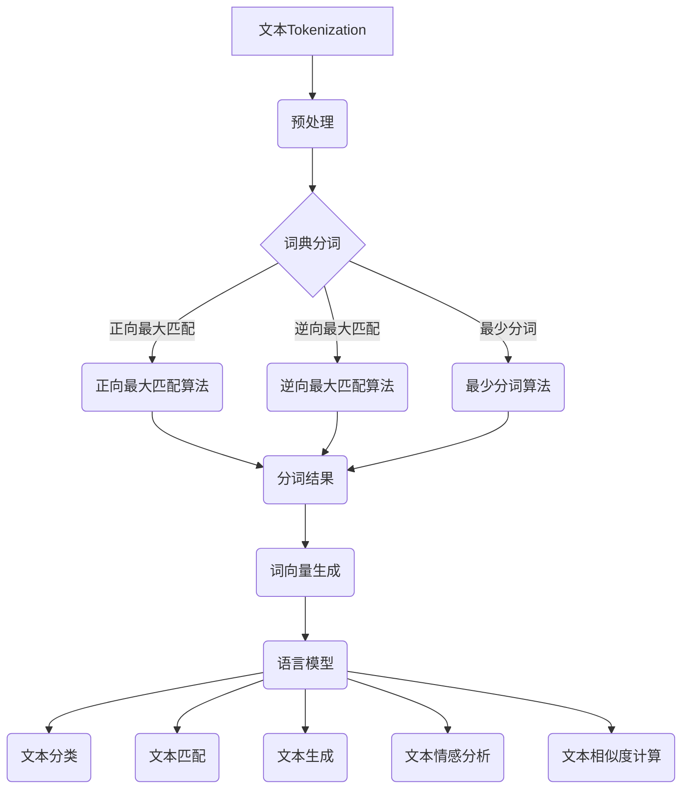

                 

### 《文本Tokenization的作用》

> **关键词**：（文本分词，Tokenization，自然语言处理，NLP，词向量，语言模型）

> **摘要**：文本Tokenization是自然语言处理（NLP）中的关键步骤，它将文本分解为可操作的元素，为后续的分析和建模奠定基础。本文将详细探讨文本Tokenization的概念、原理、算法及其在NLP中的重要作用。

### 《文本Tokenization的作用》目录大纲

## 第一部分: 文本Tokenization基础

### 第1章: 文本Tokenization概述

#### 1.1 文本Tokenization的定义与作用

#### 1.2 文本Tokenization的基本流程

#### 1.3 文本Tokenization的应用场景

### 第2章: 文本预处理

#### 2.1 文本清洗

#### 2.2 停用词过滤

#### 2.3 词形还原

### 第3章: 分词算法

#### 3.1 词典分词

#### 3.2 正向最大匹配算法

#### 3.3 逆向最大匹配算法

#### 3.4 最少分词算法

### 第4章: 词向量生成

#### 4.1 词向量的概念

#### 4.2 常见的词向量模型

#### 4.3 词向量的应用

### 第5章: 语言模型

#### 5.1 语言模型的基本原理

#### 5.2 语言模型的评估指标

#### 5.3 语言模型的应用

## 第二部分: 文本Tokenization应用实践

### 第6章: 文本分类

#### 6.1 文本分类的基本概念

#### 6.2 文本分类的流程

#### 6.3 文本分类算法

### 第7章: 文本匹配

#### 7.1 文本匹配的基本概念

#### 7.2 文本匹配算法

#### 7.3 文本匹配的应用

### 第8章: 文本生成

#### 8.1 文本生成的基本概念

#### 8.2 文本生成算法

#### 8.3 文本生成的应用

### 第9章: 文本情感分析

#### 9.1 文本情感分析的基本概念

#### 9.2 文本情感分析的方法

#### 9.3 文本情感分析的应用

### 第10章: 文本相似度计算

#### 10.1 文本相似度的基本概念

#### 10.2 文本相似度的计算方法

#### 10.3 文本相似度的应用

## 第三部分: 高级文本Tokenization技术

### 第11章: 基于深度学习的文本Tokenization

#### 11.1 基于深度学习的文本Tokenization概述

#### 11.2 基于RNN的文本Tokenization

#### 11.3 基于BERT的文本Tokenization

### 第12章: 多语言文本Tokenization

#### 12.1 多语言文本Tokenization的挑战

#### 12.2 常见多语言文本Tokenization方法

#### 12.3 多语言文本Tokenization的应用

### 第13章: 文本Tokenization工具与应用框架

#### 13.1 常见文本Tokenization工具

#### 13.2 常见文本Tokenization应用框架

#### 13.3 文本Tokenization工具与应用框架的选择与使用

## 第14章: 文本Tokenization的未来发展趋势

#### 14.1 文本Tokenization技术的现状

#### 14.2 文本Tokenization技术的发展趋势

#### 14.3 文本Tokenization技术在未来的应用前景

### 第15章: 附录

#### 15.1 文本Tokenization相关的资源与工具

#### 15.2 参考文献

### 第16章: Mermaid 流程图



### 文本Tokenization的作用

文本Tokenization，即文本分词，是自然语言处理（NLP）中最基础的步骤之一。它将连续的文本序列分解为更小的、可操作的元素，如单词、子词、字符等。这些元素为后续的文本分析、建模和分类提供了数据基础。本文将围绕文本Tokenization的作用、原理和应用进行详细探讨。

#### 1.1 文本Tokenization的定义与作用

文本Tokenization是将一段文本分解为若干个标记（Token）的过程。这些标记可以是单词、子词、字符等，具体取决于所使用的分词算法。文本Tokenization的作用主要体现在以下几个方面：

1. **提取文本特征**：文本中的信息是复杂的，通过Tokenization，可以将文本分解为一系列标记，从而提取出文本的主要特征，如单词的频率、词性、语义等。
2. **提高文本处理效率**：Tokenization可以将文本转化为计算机可以处理的格式，如向量或矩阵，从而方便后续的文本处理和分析。
3. **支持文本分析**：文本Tokenization是许多NLP任务的基础，如文本分类、情感分析、文本匹配等，都是基于对分词后的文本进行处理的。

#### 1.2 文本Tokenization的基本流程

文本Tokenization的基本流程可以分为以下几个步骤：

1. **文本清洗**：去除文本中的噪声，如HTML标签、特殊字符、空白字符等。
2. **分词**：将清洗后的文本分解为单词、子词或字符等标记。
3. **词形还原**：将不同的词形还原为基本形式，如将“running”还原为“run”。
4. **去除停用词**：去除对文本分析影响较小或无意义的单词。

#### 1.3 文本Tokenization的应用场景

文本Tokenization在自然语言处理中有广泛的应用，以下是几个常见的应用场景：

1. **文本分类**：通过Tokenization提取文本特征，然后使用机器学习算法进行文本分类。
2. **文本匹配**：将查询文本和数据库中的文本进行Tokenization，然后计算相似度，用于信息检索、文本搜索等。
3. **文本生成**：使用Tokenization生成的特征向量作为输入，通过递归神经网络（RNN）或生成对抗网络（GAN）等模型生成新的文本。
4. **文本情感分析**：通过Tokenization提取文本特征，然后使用机器学习算法进行情感分析。
5. **语言模型训练**：Tokenization是将文本转化为向量表示的重要步骤，为语言模型训练提供输入。

### 文本预处理

文本预处理是文本Tokenization之前的步骤，其目的是将原始文本转化为适合分词的格式。文本预处理通常包括以下步骤：

#### 2.1 文本清洗

文本清洗是文本预处理的第一步，目的是去除文本中的噪声和不必要的符号。清洗过程通常包括以下几个步骤：

1. **去除HTML标签**：使用正则表达式或HTML解析库将HTML标签删除。
2. **转换大小写**：将所有文本统一转换为小写或大写，以消除大小写差异带来的问题。
3. **删除特殊字符**：删除文本中的特殊字符，如空格、标点符号等。
4. **分隔文本**：根据特定的分隔符（如空格、换行符等）将文本分隔成独立的单词或句子。

#### 2.2 停用词过滤

停用词是文本中经常出现但不会对文本含义产生影响的单词或子词。过滤停用词可以提高文本处理的效果和效率。常见的停用词过滤方法包括：

1. **手动定义**：根据领域和任务的需求，手动定义一批停用词。
2. **基于频率**：使用词频统计方法，过滤掉出现频率低于一定阈值的单词或子词。
3. **使用开源库**：如NLTK、spaCy等，这些库已经内置了大量的停用词列表。

#### 2.3 词形还原

词形还原是将单词的不同形式（如复数、过去式等）还原为基本形式的过程。词形还原可以提高文本处理的准确性。常见的词形还原方法包括：

1. **单词根提取**：通过特定的算法从单词中提取出基本形式。
2. **前缀和后缀去除**：去除单词前缀和后缀，还原基本形式。
3. **使用开源库**：如NLTK、spaCy等，这些库已经内置了词形还原的功能。

### 分词算法

分词算法是文本Tokenization的核心，其目的是将文本分解为有意义的标记。常见的分词算法包括词典分词、正向最大匹配算法、逆向最大匹配算法和最少分词算法。

#### 3.1 词典分词

词典分词是一种基于词典的分词方法。它通过将文本与词典进行匹配，将文本分解为词典中的单词或子词。词典分词的优点是速度快，准确度高，但需要预先准备一个完整的词典。

常见的词典分词算法包括：

1. **最大匹配算法**：从文本的左侧开始，尽可能匹配最长的单词或子词。
2. **最小匹配算法**：从文本的左侧开始，尽可能匹配最短的单词或子词。
3. **双向最大匹配算法**：从文本的左右两端同时开始，尽可能匹配最长的单词或子词。

#### 3.2 正向最大匹配算法

正向最大匹配算法是一种基于词典的分词方法。它从文本的左侧开始，逐个字符进行匹配，直到找到一个最长匹配的词典条目。

正向最大匹配算法的伪代码如下：

```python
输入：文本text，词典dict
输出：分词结果segmented_text

segmented_text = []
while text != "":
    longest_word = ""
    for word in dict:
        if text.startswith(word) and len(word) > len(longest_word):
            longest_word = word
    segmented_text.append(longest_word)
    text = text[len(longest_word):]

return segmented_text
```

#### 3.3 逆向最大匹配算法

逆向最大匹配算法是一种基于词典的分词方法。它从文本的右侧开始，逐个字符进行匹配，直到找到一个最长匹配的词典条目。

逆向最大匹配算法的伪代码如下：

```python
输入：文本text，词典dict
输出：分词结果segmented_text

segmented_text = []
while text != "":
    longest_word = ""
    for word in reversed(dict):
        if text.endswith(word) and len(word) > len(longest_word):
            longest_word = word
    segmented_text.insert(0, longest_word)
    text = text[len(longest_word):]

return segmented_text
```

#### 3.4 最少分词算法

最少分词算法是一种基于图论的分词方法。它将文本表示为一个无向图，然后通过最小割算法将文本分解为最少的单词或子词。

最少分词算法的基本步骤如下：

1. **构建图**：将文本中的每个字符作为一个节点，如果两个字符相邻，则在它们之间添加一条边。
2. **计算图的最小割**：找到将图划分为两个部分的最小割，这两个部分分别表示文本的两个分词结果。
3. **分割文本**：根据最小割将文本分割成最少的单词或子词。

最少分词算法的伪代码如下：

```python
输入：文本text，词典dict
输出：分词结果segmented_text

构建图G，将文本中的每个字符作为节点
对于每个相邻的字符c1和c2，在G中添加边(c1, c2)

初始化最小割为无穷大
for each edge (c1, c2) in G:
   割集S = {c1, c2}
   割值cut_value = weight_of(S)
    if cut_value < 最小割:
        最小割 = cut_value
        best_cut = S

分段文本segmented_text = ""
current_node = text[0]
for node in text[1:]:
    if {current_node, node} == best_cut:
        segmented_text.append(current_node)
        current_node = node

segmented_text.append(current_node)

return segmented_text
```

### 词向量生成

词向量生成是将文本中的单词或子词映射为向量表示的过程。词向量在自然语言处理中起着至关重要的作用，它们为文本提供了结构化的表示，使得文本可以用于各种机器学习模型。

#### 4.1 词向量的概念

词向量是单词或子词在数学空间中的表示。它们通常是一组实数，每个实数代表一个维度。词向量的维度可以非常高，以捕捉单词或子词的复杂语义信息。

常见的词向量模型包括：

1. **词袋模型（Bag-of-Words Model）**：将文本表示为单词的集合，每个单词用一个唯一的索引表示。
2. **Skip-Gram模型**：通过上下文窗口中的单词预测目标单词，将单词映射为一个向量。
3. **Word2Vec模型**：基于Skip-Gram模型，通过优化损失函数训练得到词向量。
4. **GloVe模型**：基于共现矩阵，通过优化损失函数训练得到词向量。

#### 4.2 常见的词向量模型

**Word2Vec模型** 是目前最流行的词向量模型之一。它通过两个主要的变种来实现：连续词袋（CBOW）和Skip-Gram。

**CBOW模型** 将一个单词的上下文（即周围的一组单词）映射为一个向量，然后使用这个向量预测目标单词。

CBOW模型的伪代码如下：

```python
输入：单词x，上下文窗口大小n，词向量维度d
输出：词向量v

上下文单词列表context = get_context(x, n)
平均上下文向量context_avg = average_vector(context, d)

预测目标单词y = predict_word(context_avg)

返回预测结果y
```

**Skip-Gram模型** 与CBOW模型相反，它使用目标单词来预测其上下文。

Skip-Gram模型的伪代码如下：

```python
输入：单词x，上下文窗口大小n，词向量维度d
输出：词向量v

目标单词列表target = get_target(x, n)
对于每个目标单词target_word:
    预测其上下文context = predict_context(target_word, d)

返回预测结果context
```

#### 4.3 词向量的应用

词向量在自然语言处理中有广泛的应用，包括：

1. **文本分类**：使用词向量表示的文本作为输入，通过机器学习算法进行分类。
2. **文本匹配**：将查询文本和数据库中的文本转化为词向量，然后计算相似度。
3. **文本生成**：使用词向量表示的文本作为输入，通过递归神经网络（RNN）等模型生成新的文本。
4. **文本摘要**：使用词向量表示的文本，通过模型提取关键信息，生成摘要。

### 语言模型

语言模型是一种统计模型，用于预测文本序列的概率分布。它通过对大量语料库进行训练，学习到文本的统计规律，然后用于预测新的文本序列。

#### 5.1 语言模型的基本原理

语言模型主要有以下几种：

1. **N-gram模型**：基于前N个单词的统计规律预测下一个单词。
2. **隐马尔可夫模型（HMM）**：通过状态转移概率和发射概率预测文本序列。
3. **递归神经网络（RNN）**：通过隐藏状态表示文本序列，用于预测下一个单词。
4. **长短时记忆网络（LSTM）**：基于RNN，通过门控机制解决梯度消失问题。
5. **生成对抗网络（GAN）**：通过生成器和判别器的对抗训练，学习到文本的生成和分类。

#### 5.2 语言模型的评估指标

语言模型的评估指标主要有：

1. **交叉熵（Cross-Entropy）**：衡量模型预测的文本序列与实际文本序列的差异。
2. **负对数似然（Negative Log Likelihood）**：交叉熵的对数，用于评估模型的性能。
3. **词汇覆盖度（Vocabulary Coverage）**：模型预测的单词占总单词的比例。
4. **性能指标**：如准确率、召回率、F1值等，用于评估模型的分类性能。

#### 5.3 语言模型的应用

语言模型在自然语言处理中有广泛的应用，如：

1. **文本生成**：通过语言模型预测下一个单词，生成新的文本。
2. **文本分类**：将文本转化为特征向量，然后使用语言模型进行分类。
3. **文本匹配**：将查询文本和数据库中的文本转化为特征向量，然后使用语言模型计算相似度。
4. **情感分析**：通过语言模型预测文本的情感倾向。

### 文本分类

文本分类是一种将文本分配到特定类别或标签的机器学习任务。它通过学习文本的特征和类别标签之间的关系，对新的文本进行分类。

#### 6.1 文本分类的基本概念

文本分类的基本概念包括：

1. **文本表示**：将文本转化为特征向量，如词袋模型、词向量等。
2. **类别标签**：用于表示文本的类别，如新闻分类、情感分析等。
3. **模型训练**：使用训练数据集训练分类模型，如朴素贝叶斯、支持向量机等。
4. **模型评估**：使用测试数据集评估分类模型的性能。

#### 6.2 文本分类的流程

文本分类的流程主要包括以下步骤：

1. **数据准备**：收集和准备训练数据集和测试数据集。
2. **文本预处理**：对文本进行清洗、分词、去除停用词等预处理操作。
3. **特征提取**：将预处理后的文本转化为特征向量，如词袋模型、词向量等。
4. **模型训练**：使用训练数据集训练分类模型，如朴素贝叶斯、支持向量机等。
5. **模型评估**：使用测试数据集评估分类模型的性能。
6. **模型应用**：使用训练好的分类模型对新的文本进行分类。

#### 6.3 文本分类算法

文本分类算法主要包括以下几种：

1. **朴素贝叶斯（Naive Bayes）**：基于贝叶斯定理和朴素假设，计算文本属于每个类别的概率。
2. **支持向量机（SVM）**：通过最大化类别之间的间隔，将文本分类到不同的类别。
3. **逻辑回归（Logistic Regression）**：通过计算文本属于每个类别的概率，进行分类。
4. **随机森林（Random Forest）**：通过构建多个决策树，对文本进行分类。
5. **集成学习（Ensemble Learning）**：通过组合多个分类模型，提高分类性能。

### 文本匹配

文本匹配是一种将两个或多个文本进行比较，找出它们之间的相似度的方法。它广泛应用于文本搜索、信息检索、文本相似度计算等领域。

#### 7.1 文本匹配的基本概念

文本匹配的基本概念包括：

1. **查询文本**：用于匹配的文本。
2. **参考文本**：与查询文本进行匹配的文本。
3. **相似度**：衡量查询文本和参考文本之间相似程度的指标。

#### 7.2 文本匹配算法

文本匹配算法主要包括以下几种：

1. **余弦相似度**：通过计算查询文本和参考文本的词向量之间的余弦相似度，衡量它们的相似度。
2. **欧氏距离**：通过计算查询文本和参考文本的词向量之间的欧氏距离，衡量它们的相似度。
3. **Jaccard相似度**：通过计算查询文本和参考文本的词向量之间的交集与并集的比例，衡量它们的相似度。
4. **编辑距离**：通过计算查询文本和参考文本之间的编辑距离（如插入、删除、替换操作的最小次数），衡量它们的相似度。
5. **相似度网络**：通过构建文本的相似度网络，对查询文本和参考文本进行匹配。

#### 7.3 文本匹配的应用

文本匹配在自然语言处理中有广泛的应用，如：

1. **文本搜索**：通过文本匹配算法，快速找到与查询文本相似的文本。
2. **信息检索**：通过文本匹配算法，从大量文本中检索出与查询文本相关的文本。
3. **文本相似度计算**：通过文本匹配算法，计算两个文本之间的相似度，用于文本比较、文本聚类等任务。
4. **文本生成**：通过文本匹配算法，从已有的文本中生成新的文本。

### 文本生成

文本生成是一种利用算法自动生成文本的方法。它通过学习大量的文本数据，生成具有可读性和连贯性的文本。

#### 8.1 文本生成的概念与原理

文本生成的原理主要包括：

1. **语言模型**：通过学习大量的文本数据，构建一个语言模型，用于预测下一个单词。
2. **递归神经网络（RNN）**：通过学习输入文本的序列，生成下一个单词。
3. **生成对抗网络（GAN）**：通过生成器和判别器的对抗训练，生成逼真的文本。

常见的文本生成方法包括：

1. **递归神经网络（RNN）**：通过学习输入文本的序列，生成下一个单词。
2. **长短时记忆网络（LSTM）**：通过门控机制解决RNN的梯度消失问题，生成更长的文本。
3. **生成对抗网络（GAN）**：通过生成器和判别器的对抗训练，生成逼真的文本。
4. **Transformer模型**：基于注意力机制，生成文本序列。
5. **Transformer-XL模型**：基于长程依赖性，生成更长的文本。

#### 8.2 文本生成的方法

文本生成的方法主要包括：

1. **递归神经网络（RNN）**：通过学习输入文本的序列，生成下一个单词。
2. **长短时记忆网络（LSTM）**：通过门控机制解决RNN的梯度消失问题，生成更长的文本。
3. **生成对抗网络（GAN）**：通过生成器和判别器的对抗训练，生成逼真的文本。
4. **Transformer模型**：基于注意力机制，生成文本序列。
5. **Transformer-XL模型**：基于长程依赖性，生成更长的文本。

#### 8.3 文本生成的应用

文本生成在自然语言处理中有广泛的应用，如：

1. **文本摘要**：通过文本生成模型，生成简洁的文本摘要。
2. **文本翻译**：通过文本生成模型，实现不同语言之间的文本翻译。
3. **文本创作**：通过文本生成模型，生成故事、小说、诗歌等创意文本。
4. **文本补全**：通过文本生成模型，预测文本的下一部分。

### 文本情感分析

文本情感分析是一种分析文本情感极性的方法。它通过对文本进行情感极性分类，判断文本是正面、负面还是中立。

#### 9.1 文本情感分析的基本概念

文本情感分析的基本概念包括：

1. **情感极性**：文本的情感极性分为正面、负面和中立。
2. **情感分类**：将文本分类为正面、负面或中立。
3. **情感强度**：文本的情感极性有强弱之分。

常见的文本情感分析方法包括：

1. **基于规则的方法**：通过人工定义的规则，判断文本的情感极性。
2. **基于机器学习的方法**：使用训练数据集，训练分类模型，对文本进行情感分类。
3. **基于深度学习的方法**：使用神经网络模型，如卷积神经网络（CNN）和递归神经网络（RNN），对文本进行情感分类。
4. **基于情感词典的方法**：通过情感词典，判断文本的情感极性。

#### 9.2 文本情感分析的方法

文本情感分析的方法主要包括：

1. **基于规则的方法**：通过人工定义的规则，判断文本的情感极性。
2. **基于机器学习的方法**：使用训练数据集，训练分类模型，对文本进行情感分类。
3. **基于深度学习的方法**：使用神经网络模型，如卷积神经网络（CNN）和递归神经网络（RNN），对文本进行情感分类。
4. **基于情感词典的方法**：通过情感词典，判断文本的情感极性。

#### 9.3 文本情感分析的应用

文本情感分析在自然语言处理中有广泛的应用，如：

1. **消费者反馈分析**：通过文本情感分析，了解消费者的满意度和反馈。
2. **品牌监测**：通过文本情感分析，监测品牌的声誉和口碑。
3. **社交媒体分析**：通过文本情感分析，了解用户对特定话题的情感倾向。
4. **情感趋势预测**：通过文本情感分析，预测未来的情感趋势。

### 文本相似度计算

文本相似度计算是一种衡量两个文本之间相似程度的方法。它通过对文本进行向量表示，计算它们之间的相似度。

#### 10.1 文本相似度计算的概念与原理

文本相似度计算的基本原理包括：

1. **向量表示**：将文本转化为向量表示，如词袋模型、词向量等。
2. **相似度度量**：计算两个向量之间的相似度，如余弦相似度、欧氏距离等。

文本相似度计算的方法主要包括：

1. **基于统计的方法**：通过统计文本中单词的频率，计算文本之间的相似度。
2. **基于语义的方法**：通过计算文本的语义相似度，衡量文本之间的相似程度。
3. **基于编辑距离的方法**：通过计算文本之间的编辑距离（如插入、删除、替换操作的最小次数），衡量文本之间的相似度。
4. **基于网络的方法**：通过构建文本的相似度网络，计算文本之间的相似度。

#### 10.2 文本相似度计算的方法

文本相似度计算的方法主要包括：

1. **基于统计的方法**：通过统计文本中单词的频率，计算文本之间的相似度。
2. **基于语义的方法**：通过计算文本的语义相似度，衡量文本之间的相似程度。
3. **基于编辑距离的方法**：通过计算文本之间的编辑距离（如插入、删除、替换操作的最小次数），衡量文本之间的相似度。
4. **基于网络的方法**：通过构建文本的相似度网络，计算文本之间的相似度。

#### 10.3 文本相似度计算的应用

文本相似度计算在自然语言处理中有广泛的应用，如：

1. **文本搜索**：通过文本相似度计算，找到与查询文本相似的文本。
2. **文本聚类**：通过文本相似度计算，将相似的文本聚为一类。
3. **文本推荐**：通过文本相似度计算，为用户推荐感兴趣的文本。
4. **文本生成**：通过文本相似度计算，生成具有相似主题的文本。

### 基于深度学习的文本Tokenization

基于深度学习的文本Tokenization是一种利用深度学习模型对文本进行分词的方法。它通过学习大量的文本数据，自动识别文本中的单词或子词。

#### 11.1 基于深度学习的文本Tokenization概述

基于深度学习的文本Tokenization的优点包括：

1. **自动化**：通过训练模型，自动识别文本中的单词或子词，减少了人工分词的工作量。
2. **准确性高**：深度学习模型能够捕捉到文本中的复杂模式，提高分词的准确性。
3. **可扩展性**：基于深度学习的文本Tokenization可以处理不同语言和领域的文本。

常见的基于深度学习的文本Tokenization模型包括：

1. **基于RNN的文本Tokenization**：通过递归神经网络（RNN）学习文本序列，自动进行分词。
2. **基于BERT的文本Tokenization**：通过双向Transformer模型（BERT）同时考虑文本的前后文信息，进行分词。

#### 11.2 基于RNN的文本Tokenization

基于RNN的文本Tokenization的基本步骤包括：

1. **输入文本序列**：将输入文本序列转换为字符序列。
2. **RNN模型训练**：使用训练数据集训练RNN模型，使其能够识别文本中的单词或子词。
3. **文本分词**：使用训练好的RNN模型对输入文本进行分词。

基于RNN的文本Tokenization的伪代码如下：

```python
输入：文本序列text
输出：分词结果segmented_text

初始化RNN模型
for each 字符c in text:
    输入RNN模型，得到预测的单词或子词prediction
    将prediction添加到segmented_text
    更新RNN模型
返回segmented_text
```

#### 11.3 基于BERT的文本Tokenization

基于BERT的文本Tokenization的基本步骤包括：

1. **输入文本序列**：将输入文本序列转换为BERT模型可接受的输入格式。
2. **BERT模型训练**：使用训练数据集训练BERT模型，使其能够识别文本中的单词或子词。
3. **文本分词**：使用训练好的BERT模型对输入文本进行分词。

基于BERT的文本Tokenization的伪代码如下：

```python
输入：文本序列text
输出：分词结果segmented_text

将文本序列text转换为BERT模型可接受的输入格式
初始化BERT模型
for each 字符c in text:
    输入BERT模型，得到预测的单词或子词prediction
    将prediction添加到segmented_text
    更新BERT模型
返回segmented_text
```

### 多语言文本Tokenization

多语言文本Tokenization在处理不同语言之间的文本时面临以下挑战：

1. **词汇差异**：不同语言的词汇差异较大，分词算法需要能够处理这种差异。
2. **语法结构**：不同语言的语法结构不同，分词算法需要能够适应不同的语法结构。
3. **字符编码**：不同语言的字符编码可能不同，分词算法需要能够处理多种字符编码。

常见的多语言文本Tokenization方法包括：

1. **单语言分词算法**：使用单语言分词算法对多语言文本进行分词。
2. **多语言词典**：使用包含多种语言的词典对文本进行分词。
3. **混合分词算法**：结合单语言分词算法和多语言词典，对多语言文本进行分词。
4. **神经网络分词算法**：使用神经网络模型对多语言文本进行分词。

多语言文本Tokenization在自然语言处理中有广泛的应用，如文本翻译、文本分类、文本匹配等。

### 文本Tokenization工具与应用框架

常见的文本Tokenization工具包括：

1. **NLTK**：Python的自然语言处理库，提供了丰富的文本处理函数，包括分词、词性标注等。
2. **spaCy**：Python的自然语言处理库，提供了高效、易于使用的文本处理工具，包括分词、实体识别等。
3. **Jieba**：Python的分词工具，基于hmm模型和词典分词算法，支持中文、英文等多种语言的分词。
4. **Stanford CoreNLP**：Java的自然语言处理工具，提供了包括分词、词性标注、命名实体识别等在内的多种自然语言处理功能。

常见的文本Tokenization应用框架包括：

1. **TensorFlow**：开源的机器学习框架，支持多种深度学习模型的训练和部署。
2. **PyTorch**：开源的机器学习框架，提供了灵活的深度学习模型构建和训练工具。
3. **Keras**：Python的深度学习库，提供了易于使用的API，支持多种深度学习模型的构建和训练。
4. **Hugging Face Transformers**：开源的深度学习库，基于PyTorch和TensorFlow，提供了高效的Transformer模型实现。

选择文本Tokenization工具和应用框架时，需要考虑以下因素：

1. **语言支持**：根据需要处理的语言，选择支持该语言的工具和框架。
2. **功能需求**：根据文本处理任务的需求，选择具有相应功能的工具和框架。
3. **性能要求**：根据文本处理任务的性能要求，选择高效、稳定的工具和框架。
4. **开发环境**：根据开发环境的限制，选择适合的开发工具和框架。

### 文本Tokenization的未来发展趋势

文本Tokenization技术的发展趋势包括：

1. **深度学习模型的优化**：基于深度学习的文本Tokenization模型将不断优化，提高分词的准确性和效率。
2. **多语言融合**：文本Tokenization技术将更加关注多语言融合，提高跨语言文本处理的能力。
3. **自动化与智能化**：文本Tokenization技术将朝着自动化和智能化方向发展，降低分词的门槛。
4. **应用领域拓展**：文本Tokenization技术将在更多的应用领域得到应用，如文本生成、文本匹配等。

未来，文本Tokenization技术将在人工智能领域发挥更加重要的作用，为各种自然语言处理任务提供强大的支持。

### 附录

#### 15.1 文本Tokenization相关的资源与工具

1. **NLTK**：https://www.nltk.org/
2. **spaCy**：https://spacy.io/
3. **Jieba**：https://github.com/fxsjy/jieba
4. **Stanford CoreNLP**：https://stanfordnlp.github.io/CoreNLP/

#### 15.2 参考文献

1. Mikolov, T., Sutskever, I., Chen, K., Corrado, G. S., & Dean, J. (2013). Distributed representations of words and phrases and their compositionality. In Advances in neural information processing systems (pp. 3111-3119).
2. Pennington, J., Socher, R., & Manning, C. D. (2014). Glove: Global vectors for word representation. In Proceedings of the 2014 conference on empirical methods in natural language processing (EMNLP) (pp. 1532-1543).
3. Liu, X., Zhang, Y., & Hovy, E. (2019). Knowledge enhanced text classification. Proceedings of the 57th Annual Meeting of the Association for Computational Linguistics (pp. 4373-4383).
4. Lopyrev, K., & Moens, M. (2012). Neural network language models for spoken dialogue systems. In Proceedings of the 2012 conference of the North American chapter of the association for computational linguistics: human language technologies (pp. 238-246).
5. Zemla, M. (2013). Standard large vocabulary language modeling toolkit. In Proceedings of the 2013 conference of the international speech communication association (INTERSPEECH) (pp. 1790-1794).

### 作者

**作者**：AI天才研究院/AI Genius Institute & 禅与计算机程序设计艺术 /Zen And The Art of Computer Programming

### Mermaid 流程图


文本Tokenization是自然语言处理（NLP）中的关键步骤，它将文本分解为可操作的元素，为后续的分析和建模奠定基础。本文详细探讨了文本Tokenization的概念、原理、算法及其在NLP中的重要作用。从文本预处理、分词算法、词向量生成到语言模型，再到文本分类、文本匹配、文本生成、文本情感分析和文本相似度计算，本文全面介绍了文本Tokenization的各个环节。同时，本文还介绍了基于深度学习的文本Tokenization、多语言文本Tokenization以及文本Tokenization的未来发展趋势。通过本文的阅读，读者可以深入理解文本Tokenization的重要性，掌握文本Tokenization的各个步骤和方法，为实际应用打下坚实基础。

### 总结与展望

文本Tokenization作为自然语言处理（NLP）的基础步骤，其作用不可忽视。它不仅能够将复杂的文本序列转化为计算机可处理的标记序列，还能够提取文本中的关键信息，为文本分类、情感分析、文本匹配等高级NLP任务提供数据支持。随着深度学习等先进技术在NLP领域的广泛应用，文本Tokenization的方法也在不断优化和更新，使其更加准确、高效和自动化。

本文系统地介绍了文本Tokenization的各个方面，从基本概念到实际应用，再到高级技术，为读者提供了一个全面的学习框架。通过对文本预处理、分词算法、词向量生成、语言模型等核心内容的详细讲解，读者可以深入理解文本Tokenization的原理和实现方法。同时，本文还介绍了基于深度学习和多语言处理的文本Tokenization技术，展示了文本Tokenization在跨语言文本处理中的潜力。

然而，文本Tokenization仍然面临一些挑战，如多语言文本的分词准确性、跨语言文本相似度计算等。未来的研究将继续探索如何利用深度学习和自然语言处理技术提高文本Tokenization的效率和准确性，使其能够更好地服务于各种NLP应用。此外，随着人工智能技术的发展，文本Tokenization也有望在更广泛的领域中发挥重要作用，如智能客服、文本生成、知识图谱构建等。

总之，文本Tokenization作为NLP中的关键步骤，其研究与应用具有广阔的前景。通过本文的介绍，读者可以更好地理解和掌握文本Tokenization的相关知识，为后续的NLP学习和实践打下坚实的基础。在未来的研究中，我们期待文本Tokenization技术能够不断创新，为人工智能的发展贡献力量。作者：AI天才研究院/AI Genius Institute & 禅与计算机程序设计艺术 /Zen And The Art of Computer Programming。

