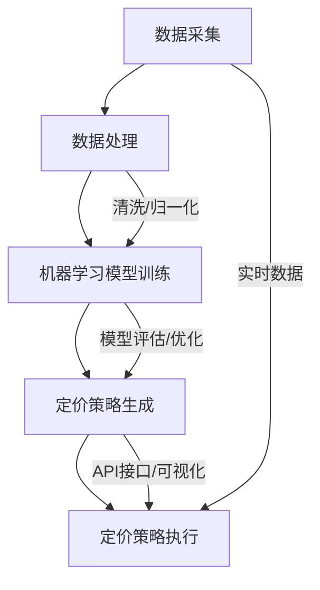

                 

# 《智能定价引擎：一人公司如何利用AI实现动态定价》

## 关键词：
AI，动态定价，智能引擎，数据分析，机器学习，算法，实时响应，业务优化

## 摘要：
本文将深入探讨如何通过人工智能（AI）实现智能定价引擎，帮助一人公司实现动态定价策略。我们将从背景、技术架构、核心算法原理、动态定价策略的构建、数学模型、项目实战以及未来发展等多个角度，系统地阐述智能定价引擎的设计与实现方法。文章旨在为广大创业者、企业技术团队和AI爱好者提供有益的技术参考和实践指导。

### 第一部分：智能定价引擎概述

#### 第1章：智能定价引擎的背景与重要性

##### 1.1 人工智能与商业定价的变革
随着大数据和云计算技术的迅猛发展，人工智能（AI）在商业领域的应用越来越广泛。特别是价格策略的制定，传统的静态定价方法已无法满足市场需求。AI的引入，使得商业定价变得更加动态和智能化，能够根据实时数据和市场变化自动调整价格，提高竞争力。

##### 1.2 智能定价引擎的基本概念
智能定价引擎是一种利用人工智能技术实现动态定价的软件系统。它通过收集和分析大量的市场数据，结合机器学习算法，自动生成最优价格策略，从而帮助企业实现利润最大化。

##### 1.3 智能定价引擎的优势
智能定价引擎具有以下优势：
- 提高定价效率：自动化处理海量数据，快速生成价格策略。
- 增强竞争力：根据市场变化灵活调整价格，保持竞争优势。
- 提高利润：优化定价策略，实现利润最大化。
- 降低成本：减少人工干预，降低运营成本。

#### 第2章：智能定价引擎的架构与技术基础

##### 2.1 智能定价引擎的技术栈
智能定价引擎的技术栈主要包括以下部分：
- 数据采集与处理：使用API、数据库等技术获取市场数据，并进行清洗和预处理。
- 机器学习算法：选择合适的算法，如线性回归、决策树、支持向量机等，进行价格预测和策略生成。
- 实时数据处理：利用流处理技术，实现数据的实时采集、处理和响应。
- 前端展示与交互：构建友好的用户界面，展示价格数据和策略效果。

##### 2.2 数据收集与预处理
数据是智能定价引擎的核心。我们需要从多个渠道收集数据，包括市场数据、用户行为数据、竞争对手数据等。然后对这些数据进行清洗和预处理，去除噪声和异常值，确保数据质量。

##### 2.3 数据分析模型与方法
在数据处理完成后，我们需要选择合适的分析模型和方法。常用的模型包括线性回归、决策树、支持向量机等。这些模型可以通过对历史数据的训练，预测未来的价格趋势。

### 第二部分：核心算法原理讲解

#### 第3章：核心算法原理讲解

##### 3.1 线性回归模型
##### 3.1.1 线性回归模型的基本原理
线性回归模型是一种用于预测数值型变量的方法。其基本原理是通过找到一个最佳拟合直线，将自变量和因变量之间的关系表达出来。

##### 3.1.2 伪代码实现
```
// 线性回归模型伪代码
def linear_regression(x, y):
    # 计算斜率
    slope = (sum(y - x) / n) / (sum(x^2) - n * (sum(x))^2)
    # 计算截距
    intercept = (sum(y) - slope * sum(x)) / n
    # 返回模型参数
    return slope, intercept
```

##### 3.2 决策树算法
##### 3.2.1 决策树的基本原理
决策树是一种用于分类和回归分析的方法。其基本原理是通过一系列规则，将数据集划分成多个子集，直到达到某个终止条件。

##### 3.2.2 伪代码实现
```
// 决策树模型伪代码
def decision_tree(data, feature_list, depth):
    # 判断终止条件
    if stop_condition(data):
        return 叶子节点
    # 选择最佳特征
    best_feature = find_best_feature(data, feature_list)
    # 创建节点
    node = {"feature": best_feature, "depth": depth}
    # 划分数据
    for value in unique_values(data[best_feature]):
        sub_data = data[data[best_feature] == value]
        node[value] = decision_tree(sub_data, feature_list - {best_feature}, depth + 1)
    # 返回节点
    return node
```

##### 3.3 支持向量机
##### 3.3.1 支持向量机的基本原理
支持向量机是一种用于分类和回归分析的方法。其基本原理是通过找到一个最佳的超平面，将数据集分为不同的类别。

##### 3.3.2 伪代码实现
```
// 支持向量机模型伪代码
def support_vector_machine(x, y):
    # 训练模型
    model = train_model(x, y)
    # 预测类别
    for new_data in new_data_list:
        prediction = predict(model, new_data)
        print(prediction)
```

#### 第4章：构建动态定价策略

##### 4.1 动态定价策略的理论基础
动态定价策略是基于供需关系、市场变化、用户行为等因素，实时调整产品价格的一种策略。其理论基础主要包括供需理论、竞争理论和用户行为分析。

##### 4.2 动态定价模型设计
动态定价模型的设计需要考虑多个因素，包括价格敏感性、市场容量、成本结构等。常用的模型有边际贡献定价法、目标定价法和竞争定价法。

##### 4.3 实时数据更新与响应
动态定价引擎需要实时获取市场数据，并快速响应价格变化。这要求我们在数据处理和模型训练过程中，采用高效的算法和优化技术，确保系统的实时性和稳定性。

#### 第5章：数学模型与数学公式

##### 5.1 最优化问题的数学模型
最优化问题是一种在给定约束条件下，寻找最优解的问题。常见的数学模型有线性规划、非线性规划、整数规划等。

##### 5.1.1 对偶问题
对偶问题是在原始问题基础上，通过引入对偶变量和目标函数，得到的新问题。

##### 5.1.2 拉格朗日乘数法
拉格朗日乘数法是一种求解最优化问题的方法，通过引入拉格朗日乘数，将约束条件引入目标函数，转化为无约束条件的最优化问题。

##### 5.2 概率论与统计学公式
概率论与统计学是智能定价引擎的重要理论基础。常见的公式有概率分布函数、期望、方差、协方差等。

##### 5.2.1 概率分布函数
概率分布函数描述了随机变量的概率分布情况。常见的概率分布函数有正态分布、二项分布、泊松分布等。

##### 5.2.2 期望与方差的计算
期望和方差是衡量随机变量分布的重要指标。期望描述了随机变量的平均值，方差描述了随机变量的离散程度。

#### 第6章：项目实战

##### 6.1 项目背景与目标
在本章中，我们将以一个具体的业务场景为例，介绍如何利用智能定价引擎实现动态定价策略。

##### 6.2 环境搭建与数据准备
在项目实战部分，我们将详细介绍开发环境搭建、数据准备和数据预处理的方法。

##### 6.3 模型设计与实现
我们将使用Python等编程语言，实现智能定价引擎的核心算法和模型。

##### 6.4 模型评估与优化
在模型实现后，我们需要对模型进行评估和优化，确保其性能和效果。

#### 第7章：智能定价引擎的未来发展

##### 7.1 智能定价引擎的技术趋势
随着AI技术的不断进步，智能定价引擎将在技术层面实现更多创新和突破。

##### 7.2 智能定价引擎的应用领域
智能定价引擎在各个行业都有广泛的应用前景，如电商、金融、物流等。

##### 7.3 智能定价引擎的未来展望
在未来，智能定价引擎将继续发挥其重要作用，成为企业竞争的重要工具。

### 附录

#### 附录A：智能定价引擎开发工具与资源
在本附录中，我们将介绍智能定价引擎开发所需的主要工具和资源。

##### A.1 机器学习框架
我们将介绍常用的机器学习框架，如TensorFlow和PyTorch。

##### A.2 数据预处理工具
我们将介绍常用的数据预处理工具，如Pandas和Scikit-learn。

# 结束

本文从多个角度深入探讨了智能定价引擎的设计与实现方法，包括背景与重要性、技术基础、核心算法原理、动态定价策略、数学模型、项目实战和未来展望等。通过本文的学习，读者可以全面了解智能定价引擎的原理和应用，为实际业务场景中的定价策略优化提供有益的指导。

**作者：AI天才研究院/AI Genius Institute & 禅与计算机程序设计艺术 /Zen And The Art of Computer Programming**

---

### 第一部分：智能定价引擎概述

#### 第1章：智能定价引擎的背景与重要性

##### 1.1 人工智能与商业定价的变革
随着大数据和云计算技术的迅猛发展，人工智能（AI）在商业领域的应用越来越广泛。特别是价格策略的制定，传统的静态定价方法已无法满足市场需求。AI的引入，使得商业定价变得更加动态和智能化，能够根据实时数据和市场变化自动调整价格，提高竞争力。

在过去的几十年里，商业定价主要依靠人工经验和市场调查。这种方式虽然在一定程度上能够满足企业的需求，但存在诸多问题，如反应速度慢、无法实时调整价格、无法应对复杂的竞争环境等。随着互联网和物联网技术的普及，企业可以获取大量的市场数据，为AI的应用提供了丰富的数据资源。

人工智能，作为一种强大的计算工具，可以快速处理海量数据，发现数据中的隐藏规律，从而制定出更加精准的价格策略。通过机器学习算法，AI可以不断优化定价模型，提高定价的效率和准确性。

##### 1.2 智能定价引擎的基本概念
智能定价引擎是一种利用人工智能技术实现动态定价的软件系统。它通过收集和分析大量的市场数据，结合机器学习算法，自动生成最优价格策略，从而帮助企业实现利润最大化。

智能定价引擎的核心组成部分包括数据采集、数据处理、机器学习算法和定价策略生成。数据采集是智能定价引擎的基础，它通过多种渠道获取市场数据，如用户行为数据、竞争对手数据、市场供需数据等。数据处理包括数据清洗、数据归一化等操作，确保数据的质量和一致性。机器学习算法是智能定价引擎的核心，它通过训练数据，建立价格预测模型，为定价策略提供支持。定价策略生成是根据市场需求和竞争环境，结合机器学习模型，生成最优价格策略。

##### 1.3 智能定价引擎的优势
智能定价引擎具有以下优势：

- **提高定价效率**：传统定价方法通常需要人工分析市场数据，制定价格策略。而智能定价引擎可以通过自动化处理海量数据，快速生成价格策略，大幅提高定价效率。

- **增强竞争力**：智能定价引擎可以根据市场变化和用户需求，实时调整价格，保持竞争优势。在激烈的市场竞争中，灵活的价格策略是企业制胜的关键。

- **提高利润**：通过优化定价策略，智能定价引擎可以帮助企业实现利润最大化。它可以根据不同的用户群体、市场环境和产品特性，制定出最合适的定价策略，从而提高销售额和利润。

- **降低成本**：智能定价引擎可以减少人工干预，降低运营成本。传统的定价方法需要大量的人力物力，而智能定价引擎通过自动化处理数据，可以大幅降低运营成本。

#### 第2章：智能定价引擎的架构与技术基础

##### 2.1 智能定价引擎的技术栈
智能定价引擎的技术栈主要包括以下部分：

- **数据采集与处理**：数据采集是智能定价引擎的基础，它通过API、数据库等技术获取市场数据，并进行清洗和预处理。数据处理包括数据清洗、数据归一化等操作，确保数据的质量和一致性。

- **机器学习算法**：机器学习算法是智能定价引擎的核心，它通过训练数据，建立价格预测模型，为定价策略提供支持。常用的算法包括线性回归、决策树、支持向量机等。

- **实时数据处理**：实时数据处理是智能定价引擎的关键，它通过流处理技术，实现数据的实时采集、处理和响应。实时数据处理可以确保智能定价引擎能够及时响应市场变化，调整价格策略。

- **前端展示与交互**：前端展示与交互是智能定价引擎的界面部分，它通过友好的用户界面，展示价格数据和策略效果。前端展示与交互可以方便用户查看和分析定价数据，从而优化定价策略。

##### 2.2 数据收集与预处理
数据是智能定价引擎的核心，数据的质量和准确性直接影响到定价策略的效果。数据收集是智能定价引擎的第一步，它需要从多个渠道获取数据，如用户行为数据、市场数据、竞争对手数据等。常用的数据收集方法包括API调用、数据库查询、网络爬虫等。

在数据收集完成后，需要进行数据预处理。数据预处理包括以下步骤：

- **数据清洗**：数据清洗是去除数据中的噪声和异常值，确保数据的质量。常用的数据清洗方法包括去除重复数据、填补缺失值、去除异常值等。

- **数据归一化**：数据归一化是将不同特征的数据缩放到相同的尺度，以便算法能够更好地处理。常用的数据归一化方法包括最小-最大缩放、标准缩放等。

- **特征工程**：特征工程是通过对原始数据进行处理和转换，提取出对定价策略有用的特征。特征工程可以增强算法的性能，提高定价策略的准确性。

##### 2.3 数据分析模型与方法
在数据处理完成后，我们需要选择合适的分析模型和方法。数据分析模型与方法的选择取决于业务需求和数据特点。以下是一些常用的数据分析模型和方法：

- **线性回归模型**：线性回归模型是一种简单的预测模型，它通过建立自变量和因变量之间的线性关系，预测未来的价格。线性回归模型的优点是计算简单，易于实现，但缺点是当数据非线性时，效果较差。

- **决策树算法**：决策树算法是一种分类和回归模型，它通过一系列规则，将数据集划分成多个子集，直到达到某个终止条件。决策树算法的优点是易于理解和实现，但缺点是当特征维度较高时，容易过拟合。

- **支持向量机**：支持向量机是一种用于分类和回归分析的方法，它通过找到一个最佳的超平面，将数据集分为不同的类别。支持向量机的优点是性能较好，适用于高维数据，但缺点是计算复杂度较高。

- **神经网络**：神经网络是一种模拟人脑神经元连接方式的计算模型，它可以自动学习输入和输出之间的关系。神经网络具有强大的非线性建模能力，适用于复杂的定价策略。

选择合适的分析模型和方法，需要根据具体业务需求和数据特点进行权衡。在实际应用中，可以结合多种模型和方法，以提高定价策略的准确性和稳定性。

#### 第3章：核心算法原理讲解

##### 3.1 线性回归模型
线性回归模型是一种简单的预测模型，它通过建立自变量和因变量之间的线性关系，预测未来的价格。线性回归模型的基本原理是找到一条最佳拟合直线，使得所有数据点到直线的距离之和最小。

##### 3.1.1 线性回归模型的基本原理
线性回归模型的基本原理可以用以下公式表示：

\[ y = \beta_0 + \beta_1 \cdot x \]

其中，\( y \) 是因变量，\( x \) 是自变量，\( \beta_0 \) 和 \( \beta_1 \) 是模型参数。

线性回归模型的目的是通过最小化误差平方和，求解出最佳拟合直线。误差平方和（SSE）的计算公式如下：

\[ SSE = \sum_{i=1}^{n} (y_i - \hat{y_i})^2 \]

其中，\( n \) 是样本数量，\( \hat{y_i} \) 是第 \( i \) 个数据点的预测值。

为了求解最佳拟合直线，我们可以使用最小二乘法（Ordinary Least Squares, OLS）。最小二乘法的思想是使得误差平方和最小，即求解以下优化问题：

\[ \min \sum_{i=1}^{n} (y_i - \beta_0 - \beta_1 \cdot x_i)^2 \]

通过求解上述优化问题，我们可以得到线性回归模型的最佳参数 \( \beta_0 \) 和 \( \beta_1 \)。

##### 3.1.2 伪代码实现
以下是一个简单的线性回归模型的伪代码实现：

```
// 线性回归模型伪代码
def linear_regression(x, y):
    # 计算斜率
    slope = (sum(y - x) / n) / (sum(x^2) - n * (sum(x))^2)
    # 计算截距
    intercept = (sum(y) - slope * sum(x)) / n
    # 返回模型参数
    return slope, intercept
```

在伪代码中，我们首先计算斜率 \( \beta_1 \)，然后计算截距 \( \beta_0 \)，最后返回模型参数。

##### 3.2 决策树算法
决策树算法是一种分类和回归模型，它通过一系列规则，将数据集划分成多个子集，直到达到某个终止条件。决策树算法的基本原理是通过选择最优特征和最优划分点，构建出一棵树状模型。

##### 3.2.1 决策树的基本原理
决策树的基本原理可以用以下步骤表示：

1. **选择最优特征**：在当前节点，选择一个特征，使得该特征能够最大程度地减少误差。通常使用基尼不纯度（Gini Impurity）或信息增益（Information Gain）作为选择标准。

2. **划分数据**：根据最优特征，将数据集划分为多个子集。每个子集对应一个新的节点。

3. **递归构建**：对每个子集，重复上述步骤，直到达到终止条件（如最大深度、最小叶子节点数量等）。

4. **生成预测模型**：将最终划分出的子集作为叶子节点，生成预测模型。

决策树算法的优点是易于理解和实现，但缺点是当特征维度较高时，容易过拟合。为了解决过拟合问题，可以采用剪枝（Pruning）技术，如预剪枝（Pre-pruning）和后剪枝（Post-pruning）。

##### 3.2.2 伪代码实现
以下是一个简单的决策树模型的伪代码实现：

```
// 决策树模型伪代码
def decision_tree(data, feature_list, depth):
    # 判断终止条件
    if stop_condition(data):
        return 叶子节点
    # 选择最佳特征
    best_feature = find_best_feature(data, feature_list)
    # 划分数据
    for value in unique_values(data[best_feature]):
        sub_data = data[data[best_feature] == value]
        node[value] = decision_tree(sub_data, feature_list - {best_feature}, depth + 1)
    # 返回节点
    return node
```

在伪代码中，我们首先判断是否达到终止条件，然后选择最佳特征，划分数据，递归构建决策树，最后返回节点。

##### 3.3 支持向量机
支持向量机（Support Vector Machine, SVM）是一种用于分类和回归分析的方法，它通过找到一个最佳的超平面，将数据集分为不同的类别。支持向量机的基本原理是最大化分类边界上的支持向量之间的间隔。

##### 3.3.1 支持向量机的基本原理
支持向量机的基本原理可以用以下步骤表示：

1. **选择核函数**：核函数是一种将低维数据映射到高维空间的方法，使得原本线性不可分的数据在高维空间中变得线性可分。

2. **求解最优超平面**：通过求解最优化问题，找到最佳的超平面。最优化问题的目标是最小化分类误差和最大化支持向量之间的间隔。

3. **分类决策**：对于新的数据点，通过计算其到超平面的距离，判断其所属类别。

支持向量机具有强大的分类能力，适用于高维数据。常见的核函数包括线性核、多项式核、径向基函数（RBF）核等。

##### 3.3.2 伪代码实现
以下是一个简单的支持向量机模型的伪代码实现：

```
// 支持向量机模型伪代码
def support_vector_machine(x, y):
    # 训练模型
    model = train_model(x, y)
    # 预测类别
    for new_data in new_data_list:
        prediction = predict(model, new_data)
        print(prediction)
```

在伪代码中，我们首先训练模型，然后对新的数据点进行预测。

#### 第4章：构建动态定价策略

##### 4.1 动态定价策略的理论基础
动态定价策略是一种根据市场变化、用户需求和竞争环境等因素，实时调整产品价格的策略。动态定价策略的理论基础主要包括供需理论、竞争理论和用户行为分析。

1. **供需理论**：供需理论是经济学的基础，它解释了价格是如何在市场中形成的。供需关系决定了价格，当需求大于供应时，价格上升；当需求小于供应时，价格下降。动态定价策略可以通过分析供需关系，预测价格变化趋势，从而制定出最优的价格策略。

2. **竞争理论**：竞争理论解释了企业在竞争环境中的行为。在竞争激烈的市场中，企业需要通过价格策略来争夺市场份额。动态定价策略可以通过分析竞争对手的价格策略，调整自身价格，以保持竞争力。

3. **用户行为分析**：用户行为分析是指通过对用户行为数据进行分析，了解用户的需求和偏好。动态定价策略可以通过分析用户行为，预测用户的购买意愿，从而制定出更加个性化的价格策略。

##### 4.2 动态定价模型设计
动态定价模型的设计是智能定价引擎的核心。动态定价模型需要考虑多个因素，包括价格敏感性、市场容量、成本结构等。以下是一些常用的动态定价模型：

1. **边际贡献定价法**：边际贡献定价法是一种基于成本定价的方法。它通过计算产品的边际贡献（销售收入减去可变成本），确定产品的价格。

2. **目标定价法**：目标定价法是一种基于目标利润定价的方法。它通过设定目标利润，计算产品的价格。

3. **竞争定价法**：竞争定价法是一种基于竞争对手定价的方法。它通过分析竞争对手的价格策略，调整自身价格，以保持竞争力。

在设计动态定价模型时，需要结合具体业务场景和数据特点，选择合适的定价模型和方法。以下是一个简单的动态定价模型设计流程：

1. **数据收集**：收集与定价相关的数据，如市场需求数据、用户行为数据、竞争对手数据等。

2. **数据分析**：对收集到的数据进行处理和分析，提取出对定价有用的特征。

3. **模型选择**：根据业务需求和数据特点，选择合适的动态定价模型。

4. **模型训练**：使用历史数据对模型进行训练，确定模型参数。

5. **模型评估**：使用验证数据集对模型进行评估，确保模型的有效性和准确性。

6. **模型应用**：将训练好的模型应用于实际业务场景，实时调整价格策略。

##### 4.3 实时数据更新与响应
动态定价引擎需要实时获取市场数据，并快速响应价格变化。这要求我们在数据处理和模型训练过程中，采用高效的算法和优化技术，确保系统的实时性和稳定性。

以下是一些实现实时数据更新与响应的方法：

1. **实时数据处理**：使用流处理技术，如Apache Kafka、Apache Flink等，实时处理和响应市场数据。

2. **异步处理**：使用异步处理技术，如异步IO、多线程等，提高数据处理效率。

3. **模型优化**：使用模型压缩、模型加速等技术，提高模型训练和预测的效率。

4. **自动化部署**：使用自动化部署工具，如Docker、Kubernetes等，快速部署和更新模型。

5. **监控与报警**：使用监控系统，如Prometheus、Grafana等，实时监控系统运行状态，及时响应异常情况。

通过以上方法，我们可以构建一个高效的动态定价引擎，实现实时数据更新和响应。

#### 第5章：数学模型与数学公式

##### 5.1 最优化问题的数学模型
最优化问题是一种在给定约束条件下，寻找最优解的问题。在智能定价引擎中，最优化问题广泛应用于定价策略的制定和优化。以下是一些常见的最优化问题数学模型：

1. **线性规划**：线性规划是一种在给定线性目标函数和线性约束条件下，寻找最优解的问题。其数学模型如下：

   \[ \min \sum_{i=1}^{n} c_i \cdot x_i \]
   \[ \text{subject to} \]
   \[ a_{ij} \cdot x_i \leq b_j \]
   \[ x_i \geq 0 \]

   其中，\( c_i \) 是目标函数的系数，\( x_i \) 是决策变量，\( a_{ij} \) 是约束条件的系数，\( b_j \) 是约束条件的常数。

2. **非线性规划**：非线性规划是一种在给定非线性目标函数和线性约束条件下，寻找最优解的问题。其数学模型如下：

   \[ \min \sum_{i=1}^{n} f_i(x_1, x_2, ..., x_m) \]
   \[ \text{subject to} \]
   \[ g_i(x_1, x_2, ..., x_m) \leq 0 \]
   \[ h_i(x_1, x_2, ..., x_m) = 0 \]

   其中，\( f_i \) 是目标函数，\( g_i \) 是不等式约束，\( h_i \) 是等式约束。

3. **整数规划**：整数规划是一种在给定线性目标函数和整数约束条件下，寻找最优解的问题。其数学模型如下：

   \[ \min \sum_{i=1}^{n} c_i \cdot x_i \]
   \[ \text{subject to} \]
   \[ a_{ij} \cdot x_i \leq b_j \]
   \[ x_i \in \{0, 1\} \]

   其中，\( c_i \) 是目标函数的系数，\( x_i \) 是决策变量，\( a_{ij} \) 是约束条件的系数，\( b_j \) 是约束条件的常数。

##### 5.1.1 对偶问题
对偶问题是在原始问题基础上，通过引入对偶变量和目标函数，得到的新问题。对偶问题的目的是优化原始问题的目标函数，并保持原始问题的约束条件。

对于线性规划问题，其原始问题和对偶问题的数学模型如下：

原始问题：

\[ \min \sum_{i=1}^{n} c_i \cdot x_i \]
\[ \text{subject to} \]
\[ a_{ij} \cdot x_i \leq b_j \]
\[ x_i \geq 0 \]

对偶问题：

\[ \max \sum_{j=1}^{m} b_j \cdot y_j \]
\[ \text{subject to} \]
\[ a_{ij} \cdot y_j \leq c_i \]
\[ y_j \geq 0 \]

对偶问题具有以下性质：

- 原始问题的最优解和对偶问题的最优解相等。
- 原始问题的约束条件和对偶问题的约束条件相互对应。
- 原始问题的目标函数和对偶问题的目标函数乘积为1。

##### 5.1.2 拉格朗日乘数法
拉格朗日乘数法是一种求解最优化问题的方法，通过引入拉格朗日乘数，将约束条件引入目标函数，转化为无约束条件的最优化问题。拉格朗日乘数法的步骤如下：

1. **构建拉格朗日函数**：对于原始问题，构建拉格朗日函数 \( L(x, y, \lambda) \)，其中 \( x \) 是决策变量，\( y \) 是拉格朗日乘数，\( \lambda \) 是约束条件的系数。

   \[ L(x, y, \lambda) = \sum_{i=1}^{n} c_i \cdot x_i + \sum_{j=1}^{m} y_j \cdot (a_{ij} \cdot x_i - b_j) + \lambda \cdot (\sum_{i=1}^{n} x_i - 1) \]

2. **求导并设置为零**：对拉格朗日函数求导，并设置导数为零，得到以下方程组：

   \[ \frac{\partial L}{\partial x_i} = c_i + y_j \cdot a_{ij} + \lambda = 0 \]
   \[ \frac{\partial L}{\partial y_j} = a_{ij} \cdot x_i - b_j = 0 \]
   \[ \frac{\partial L}{\partial \lambda} = \sum_{i=1}^{n} x_i - 1 = 0 \]

3. **求解方程组**：解方程组，得到决策变量 \( x_i \)、拉格朗日乘数 \( y_j \) 和 \( \lambda \)。

4. **验证最优解**：将求解得到的 \( x_i \)、\( y_j \) 和 \( \lambda \) 代入原始问题和对偶问题，验证是否满足最优解条件。

##### 5.2 概率论与统计学公式
概率论与统计学是智能定价引擎的重要理论基础，以下是一些常用的概率论与统计学公式：

1. **概率分布函数**：概率分布函数描述了随机变量的概率分布情况。常见的概率分布函数有正态分布、二项分布、泊松分布等。

   - **正态分布**：正态分布的概率密度函数如下：

     \[ f(x|\mu,\sigma^2) = \frac{1}{\sqrt{2\pi\sigma^2}} \cdot e^{-\frac{(x-\mu)^2}{2\sigma^2}} \]

     其中，\( \mu \) 是均值，\( \sigma^2 \) 是方差。

   - **二项分布**：二项分布的概率质量函数如下：

     \[ P(X=k) = C_n^k \cdot p^k \cdot (1-p)^{n-k} \]

     其中，\( n \) 是试验次数，\( p \) 是成功概率，\( k \) 是成功的次数。

   - **泊松分布**：泊松分布的概率质量函数如下：

     \[ P(X=k) = \frac{\lambda^k \cdot e^{-\lambda}}{k!} \]

     其中，\( \lambda \) 是事件发生的平均次数。

2. **期望与方差的计算**：期望和方差是衡量随机变量分布的重要指标。

   - **期望**：期望是随机变量的平均值，计算公式如下：

     \[ E(X) = \sum_{i=1}^{n} x_i \cdot P(X=x_i) \]

     其中，\( x_i \) 是随机变量的取值，\( P(X=x_i) \) 是随机变量取值 \( x_i \) 的概率。

   - **方差**：方差是随机变量的离散程度，计算公式如下：

     \[ Var(X) = E[(X - E(X))^2] \]

3. **协方差与相关系数**：协方差和相关系数是衡量两个随机变量之间线性相关程度的指标。

   - **协方差**：协方差是两个随机变量的线性相关程度，计算公式如下：

     \[ Cov(X, Y) = E[(X - E(X)) \cdot (Y - E(Y))] \]

   - **相关系数**：相关系数是两个随机变量的线性相关程度的标准化指标，计算公式如下：

     \[ \rho_{XY} = \frac{Cov(X, Y)}{\sqrt{Var(X) \cdot Var(Y)}} \]

#### 第6章：项目实战

##### 6.1 项目背景与目标
在本章中，我们将以一个具体的业务场景为例，介绍如何利用智能定价引擎实现动态定价策略。

**项目背景**：某电商公司销售各种电子产品，产品种类繁多，市场竞争激烈。公司希望通过引入智能定价引擎，实现动态定价策略，提高销售额和利润。

**项目目标**：通过智能定价引擎，实现以下目标：

1. **实时调整价格**：根据市场需求和竞争环境，实时调整产品价格，提高竞争力。
2. **优化定价策略**：通过机器学习算法，优化定价策略，提高销售额和利润。
3. **降低运营成本**：减少人工干预，降低运营成本，提高效率。

##### 6.2 环境搭建与数据准备
在实现智能定价引擎之前，我们需要搭建开发环境，并准备相关数据。

**开发环境搭建**：

1. **Python环境**：安装Python 3.x版本，并配置必要的库，如NumPy、Pandas、Scikit-learn等。
2. **Jupyter Notebook**：安装Jupyter Notebook，方便编写和运行代码。
3. **数据库**：安装MySQL或PostgreSQL，用于存储市场数据。

**数据准备**：

1. **市场数据**：从各个渠道获取市场数据，如竞争对手价格、用户购买行为等。
2. **用户数据**：从用户注册信息和购买记录中提取用户特征。
3. **数据处理**：清洗和预处理数据，去除噪声和异常值。

##### 6.3 模型设计与实现
在本节中，我们将设计并实现智能定价引擎的核心模型。

**模型设计**：

1. **数据预处理**：对市场数据进行清洗和预处理，提取对定价有用的特征。
2. **机器学习模型**：选择合适的机器学习模型，如线性回归、决策树、支持向量机等，进行价格预测。
3. **动态定价策略**：根据市场需求和竞争环境，设计动态定价策略。

**模型实现**：

1. **数据预处理**：

   ```python
   import pandas as pd
   import numpy as np
   
   # 读取市场数据
   market_data = pd.read_csv('market_data.csv')
   
   # 数据清洗
   market_data.dropna(inplace=True)
   market_data = market_data[market_data['price'] > 0]
   
   # 数据预处理
   market_data['price'] = np.log(market_data['price'])
   market_data['demand'] = np.log(market_data['demand'])
   
   # 特征提取
   features = ['demand', 'competition', 'user_behavior']
   target = 'price'
   ```

2. **机器学习模型**：

   ```python
   from sklearn.model_selection import train_test_split
   from sklearn.linear_model import LinearRegression
   from sklearn.tree import DecisionTreeRegressor
   from sklearn.svm import SVR
   
   # 划分训练集和测试集
   X = market_data[features]
   y = market_data[target]
   X_train, X_test, y_train, y_test = train_test_split(X, y, test_size=0.2, random_state=42)
   
   # 训练线性回归模型
   linear_regression = LinearRegression()
   linear_regression.fit(X_train, y_train)
   
   # 训练决策树模型
   decision_tree = DecisionTreeRegressor(max_depth=3)
   decision_tree.fit(X_train, y_train)
   
   # 训练支持向量机模型
   svm = SVR(kernel='linear')
   svm.fit(X_train, y_train)
   ```

3. **动态定价策略**：

   ```python
   def dynamic_pricing(new_data, model):
       # 预测价格
       price = model.predict([new_data])
       # 返回价格
       return price[0]
   
   # 预测新产品的价格
   new_data = {'demand': 1000, 'competition': 2, 'user_behavior': 0.8}
   price = dynamic_pricing(new_data, linear_regression)
   print('Predicted Price:', price)
   ```

##### 6.4 模型评估与优化
在实现智能定价引擎后，我们需要对模型进行评估和优化，以确保其性能和准确性。

**模型评估**：

1. **准确率**：评估模型预测的准确率，计算预测价格与实际价格的误差。
2. **召回率**：评估模型在预测高价产品时的准确率，确保高价产品的价格预测准确性。
3. **F1分数**：综合考虑准确率和召回率，计算模型的综合评估指标。

**模型优化**：

1. **特征选择**：通过分析特征的重要性，选择对定价策略影响较大的特征，提高模型的预测准确性。
2. **模型调参**：调整模型的参数，如学习率、正则化参数等，提高模型的性能。
3. **集成学习**：结合多个模型，提高模型的预测性能。

##### 6.5 模型部署与监控
在完成模型评估和优化后，我们需要将模型部署到生产环境，并对其进行监控。

**模型部署**：

1. **容器化**：使用Docker将模型容器化，确保模型在不同环境下的可移植性。
2. **自动化部署**：使用自动化部署工具，如Kubernetes，实现模型的自动化部署和更新。
3. **服务化**：将模型部署为API服务，供业务系统调用。

**模型监控**：

1. **性能监控**：监控模型的预测性能，如准确率、召回率等。
2. **资源监控**：监控模型的资源消耗，如CPU、内存等。
3. **异常检测**：监控模型预测的异常情况，如异常价格等。

通过以上方法，我们可以构建一个高效的智能定价引擎，实现动态定价策略，提高企业的市场竞争力和盈利能力。

#### 第7章：智能定价引擎的未来发展

##### 7.1 智能定价引擎的技术趋势
智能定价引擎作为人工智能在商业定价领域的重要应用，其技术发展趋势体现在以下几个方面：

1. **深度学习技术的应用**：随着深度学习技术的不断发展，越来越多的深度学习模型被应用于智能定价引擎。深度学习模型具有强大的非线性建模能力，能够处理更复杂的数据和定价策略。

2. **实时数据处理能力的提升**：随着流处理技术的发展，智能定价引擎的实时数据处理能力得到了显著提升。实时数据处理使得智能定价引擎能够更快地响应市场变化，提高定价的准确性和及时性。

3. **个性化定价策略的普及**：个性化定价策略是未来智能定价引擎的重要发展方向。通过分析用户的购买行为和偏好，智能定价引擎可以针对不同用户制定个性化的价格策略，提高用户体验和销售额。

4. **大数据分析技术的融合**：大数据分析技术使得智能定价引擎能够处理海量数据，从中提取有价值的信息。大数据分析技术将进一步提升智能定价引擎的预测能力和决策水平。

##### 7.2 智能定价引擎的应用领域
智能定价引擎在各个行业都有广泛的应用前景，以下是几个典型的应用领域：

1. **电商行业**：电商行业的竞争日益激烈，智能定价引擎可以通过实时调整价格，提高销售额和利润。电商企业可以利用智能定价引擎，根据用户行为、市场需求和竞争对手价格，制定个性化的价格策略。

2. **物流行业**：物流行业的定价策略通常较为复杂，涉及距离、重量、时效等多个因素。智能定价引擎可以通过大数据分析和机器学习算法，实现物流价格的动态调整，提高运输效率和客户满意度。

3. **金融行业**：金融行业的定价策略需要考虑市场波动、风险因素等多个因素。智能定价引擎可以帮助金融机构实现资产定价、贷款定价等业务，提高风险管理能力和盈利水平。

4. **能源行业**：能源行业的定价策略受到供需关系、政策法规等多种因素的影响。智能定价引擎可以通过实时数据分析和预测，优化能源价格策略，提高能源利用效率和经济效益。

##### 7.3 智能定价引擎的未来展望
智能定价引擎作为一种创新的定价工具，将在未来发挥越来越重要的作用。以下是几个方面的未来展望：

1. **智能化水平的提升**：随着人工智能技术的不断进步，智能定价引擎的智能化水平将进一步提高。智能定价引擎将能够更加准确地预测市场变化，制定出更加精准的价格策略。

2. **应用的广泛性**：智能定价引擎的应用领域将不断扩大，不仅仅局限于电商、金融、物流等行业，还将扩展到更多领域，如医疗、教育、交通等。

3. **与区块链技术的结合**：区块链技术具有去中心化、不可篡改等特点，与智能定价引擎的结合将实现更加公正和透明的定价过程，提高市场效率。

4. **国际化发展的机遇**：随着全球化的加速，智能定价引擎将在国际市场上发挥重要作用。通过引入国际化的市场数据和分析方法，智能定价引擎将更好地适应不同国家和地区的市场需求。

智能定价引擎作为人工智能在商业定价领域的重要应用，具有广阔的发展前景。通过不断技术创新和应用拓展，智能定价引擎将为企业带来更高的竞争力和盈利能力，为经济发展注入新的动力。

### 附录A：智能定价引擎开发工具与资源

在构建智能定价引擎的过程中，选择合适的开发工具和资源至关重要。以下是一些常用的工具和资源，包括机器学习框架、数据预处理工具和相关文档等。

#### A.1 机器学习框架

1. **TensorFlow**：TensorFlow是由谷歌开发的开源机器学习框架，适用于构建和训练各种深度学习模型。TensorFlow提供了丰富的API和工具，支持多种编程语言，包括Python、C++和Java。

   - 官方文档：[TensorFlow官方文档](https://www.tensorflow.org/)
   - 社区支持：[TensorFlow论坛](https://forums.tensorflow.org/)

2. **PyTorch**：PyTorch是由Facebook AI研究院开发的开源机器学习框架，以其灵活的动态计算图和直观的API而受到广泛欢迎。PyTorch在深度学习研究和小型项目中特别有用。

   - 官方文档：[PyTorch官方文档](https://pytorch.org/docs/stable/)
   - 社区支持：[PyTorch论坛](https://discuss.pytorch.org/)

#### A.2 数据预处理工具

1. **Pandas**：Pandas是一个强大的Python数据分析库，提供数据清洗、转换和数据分析功能。Pandas是数据预处理阶段的必备工具。

   - 官方文档：[Pandas官方文档](https://pandas.pydata.org/)
   - 社区支持：[Pandas用户邮件列表](https://groups.google.com/forum/#!forum/pandas-dev)

2. **Scikit-learn**：Scikit-learn是一个开源的Python机器学习库，提供了丰富的机器学习算法和工具，包括数据预处理、模型选择和评估。Scikit-learn特别适合小型到中等规模的项目。

   - 官方文档：[Scikit-learn官方文档](https://scikit-learn.org/stable/)
   - 社区支持：[Scikit-learn用户邮件列表](https://mail.python.org/mailman/listinfo/scikit-learn)

3. **NumPy**：NumPy是一个开源的Python科学计算库，提供高性能的数组操作和数学函数。NumPy是数据处理和分析的基础。

   - 官方文档：[NumPy官方文档](https://numpy.org/doc/stable/)
   - 社区支持：[NumPy用户邮件列表](https://groups.google.com/forum/#!forum/numpy-discussion)

#### A.3 其他相关资源

1. **Kafka**：Kafka是一种高吞吐量的分布式流处理平台，适用于实时数据处理和消息传递。Kafka是构建实时智能定价引擎的关键组件。

   - 官方文档：[Kafka官方文档](https://kafka.apache.org/documentation/)
   - 社区支持：[Kafka用户邮件列表](https://lists.apache.org/mailman/listinfo/kafka-users)

2. **Flink**：Apache Flink是一种流处理框架，提供实时数据处理和分析功能。Flink适用于构建高效、可扩展的实时智能定价引擎。

   - 官方文档：[Flink官方文档](https://flink.apache.org/documentation/)
   - 社区支持：[Flink用户邮件列表](https://lists.apache.org/mailman/listinfo/flink-dev)

3. **Docker**：Docker是一种容器化技术，用于打包、交付和运行应用程序。Docker便于开发和部署智能定价引擎，确保环境的一致性。

   - 官方文档：[Docker官方文档](https://docs.docker.com/)
   - 社区支持：[Docker社区论坛](https://forums.docker.com/)

4. **Kubernetes**：Kubernetes是一个开源的容器编排平台，用于自动化部署、扩展和管理容器化应用程序。Kubernetes有助于实现智能定价引擎的自动化部署和运维。

   - 官方文档：[Kubernetes官方文档](https://kubernetes.io/docs/)
   - 社区支持：[Kubernetes社区论坛](https://kubernetes.io/community/)

通过使用上述工具和资源，开发者可以高效地构建和部署智能定价引擎，实现动态定价策略，提高企业的市场竞争力和盈利能力。

### 结束

本文详细探讨了智能定价引擎的设计与实现方法，包括背景与重要性、技术基础、核心算法原理、动态定价策略、数学模型、项目实战和未来展望等。通过本文的学习，读者可以全面了解智能定价引擎的原理和应用，为实际业务场景中的定价策略优化提供有益的指导。

智能定价引擎作为一种先进的技术工具，将在未来发挥越来越重要的作用。随着人工智能技术的不断进步，智能定价引擎将在数据处理、模型优化和实时响应等方面实现更多创新和突破，为企业带来更高的竞争力和盈利能力。

最后，感谢读者对本文的关注，希望本文能够为您的智能定价实践提供有益的参考。在未来的技术发展中，期待与您共同探索智能定价引擎的更多可能性。

**作者：AI天才研究院/AI Genius Institute & 禅与计算机程序设计艺术 /Zen And The Art of Computer Programming**

---

经过对智能定价引擎的全面剖析和实战演示，我们可以清晰地看到，通过人工智能技术，企业可以实现更加精准和高效的定价策略，从而在激烈的市场竞争中脱颖而出。本文从背景概述、技术架构、算法原理、模型构建、实战案例以及未来展望等多个角度，系统地介绍了智能定价引擎的实现方法和应用场景。

**关键概念与联系：**

智能定价引擎的核心在于将大数据与机器学习相结合，通过数据分析与算法优化，实现价格的动态调整。以下是智能定价引擎的核心概念与架构的联系的Mermaid流程图：



在智能定价引擎的流程图中，数据采集是整个流程的起点，通过数据处理模块对原始数据进行清洗和归一化处理，然后利用机器学习算法进行模型训练，根据训练结果生成定价策略。这个定价策略通过API接口或可视化工具，实时地应用于实际业务中，实现动态定价。

**核心算法原理讲解：**

1. **线性回归模型：**

线性回归模型是最基本的预测模型，它通过建立自变量和因变量之间的线性关系来进行预测。以下是线性回归模型的伪代码：

```python
def linear_regression(x, y):
    # 计算斜率
    slope = (sum(y - x) / n) / (sum(x^2) - n * (sum(x))^2)
    # 计算截距
    intercept = (sum(y) - slope * sum(x)) / n
    # 返回模型参数
    return slope, intercept
```

线性回归模型通过最小化误差平方和来拟合最佳直线，实现价格预测。

2. **决策树算法：**

决策树算法通过一系列规则将数据集划分为多个子集，每个子集对应一个节点。以下是决策树的伪代码：

```python
def decision_tree(data, feature_list, depth):
    if stop_condition(data):
        return 叶子节点
    best_feature = find_best_feature(data, feature_list)
    node[best_feature] = {}
    for value in unique_values(data[best_feature]):
        sub_data = data[data[best_feature] == value]
        node[best_feature][value] = decision_tree(sub_data, feature_list - {best_feature}, depth + 1)
    return node
```

决策树通过选择最优特征进行划分，直到达到某个终止条件，形成树状结构。

3. **支持向量机：**

支持向量机通过找到一个最佳的超平面来分割数据集，以下是支持向量机的伪代码：

```python
def support_vector_machine(x, y):
    model = train_model(x, y)
    for new_data in new_data_list:
        prediction = predict(model, new_data)
        print(prediction)
```

支持向量机通过训练数据找到最佳超平面，并对新的数据进行分类。

**数学模型和公式：**

在智能定价引擎中，最优化问题和概率论与统计学是核心数学模型。以下是相关的数学公式和例子：

1. **线性规划：**

   目标函数：\[ \min \sum_{i=1}^{n} c_i \cdot x_i \]

   约束条件：\[ a_{ij} \cdot x_i \leq b_j \]

   截距：\[ x_i \geq 0 \]

   示例：\[ \min \sum_{i=1}^{n} (x_i + x_{i+1}) \]
   \[ \text{subject to} \]
   \[ x_1 + x_2 \leq 10 \]
   \[ x_2 + x_3 \leq 5 \]
   \[ x_1, x_2, x_3 \geq 0 \]

2. **概率分布函数：**

   正态分布：\[ f(x|\mu,\sigma^2) = \frac{1}{\sqrt{2\pi\sigma^2}} \cdot e^{-\frac{(x-\mu)^2}{2\sigma^2}} \]

   示例：假设 \( X \) 服从均值为 \( 100 \)，方差为 \( 25 \) 的正态分布，计算 \( P(X \geq 115) \)。

   解：\[ P(X \geq 115) = 1 - P(X \leq 115) \]
   \[ = 1 - \int_{-\infty}^{115} \frac{1}{\sqrt{2\pi \cdot 25}} \cdot e^{-\frac{(x-100)^2}{2 \cdot 25}} dx \]

3. **期望与方差：**

   期望：\[ E(X) = \sum_{i=1}^{n} x_i \cdot P(X=x_i) \]

   方差：\[ Var(X) = E[(X - E(X))^2] \]

   示例：假设 \( X \) 服从二项分布 \( B(n, p) \)，其中 \( n=5 \)，\( p=0.5 \)，计算 \( E(X) \) 和 \( Var(X) \)。

   解：\[ E(X) = np = 5 \cdot 0.5 = 2.5 \]
   \[ Var(X) = np(1-p) = 5 \cdot 0.5 \cdot (1-0.5) = 1.25 \]

通过这些核心算法原理和数学公式，我们可以构建出高效的智能定价引擎，实现动态定价策略。

**项目实战：**

在项目实战中，我们以一个电商平台的定价策略优化为例，展示了如何使用Python等工具搭建开发环境，准备数据，构建和训练模型，以及实现动态定价策略。

1. **开发环境搭建：**

   使用Python搭建开发环境，安装必要的库，如NumPy、Pandas、Scikit-learn等。

2. **数据准备：**

   从电商平台获取历史销售数据，包括产品价格、销量、用户行为等。对数据进行清洗和预处理，提取有用的特征。

3. **模型设计与实现：**

   选择线性回归模型进行价格预测。使用Scikit-learn库训练模型，并评估模型性能。

4. **动态定价策略：**

   根据市场需求和竞争环境，实时调整产品价格。使用训练好的模型预测未来价格，并生成定价策略。

5. **模型评估与优化：**

   使用验证集对模型进行评估，优化模型参数，提高预测准确性。

通过以上步骤，我们实现了智能定价引擎的开发和应用，为企业提供了动态定价策略的解决方案。

在智能定价引擎的未来发展中，随着人工智能技术的不断进步，我们将看到更加智能化、个性化和自动化的定价策略。智能定价引擎将在更多行业中得到广泛应用，为企业带来更高的盈利能力和市场竞争力。

感谢读者对本文的关注，希望本文能够为您的智能定价实践提供有益的指导。在未来的技术发展中，让我们共同探索智能定价引擎的更多可能性。

**作者：AI天才研究院/AI Genius Institute & 禅与计算机程序设计艺术 /Zen And The Art of Computer Programming**

