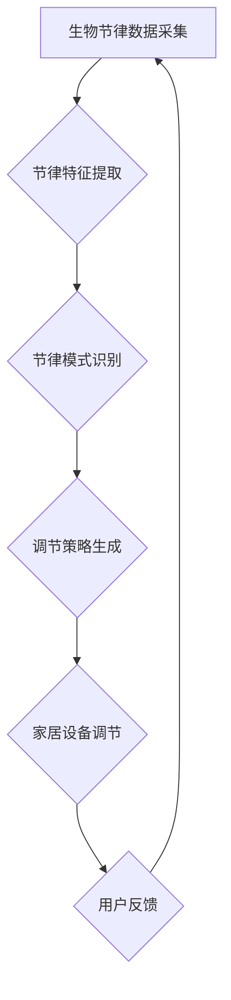

                 

# 《智能家居生物节律调节创业：优化日常生活的生理韵律》

> **关键词**：智能家居、生物节律调节、物联网技术、创业、生理韵律优化

> **摘要**：随着智能家居技术的快速发展，生物节律调节逐渐成为优化日常生活质量的关键因素。本文将探讨智能家居生物节律调节的背景、技术原理、应用场景以及创业实践，旨在为创业者提供有价值的参考。

## 第一部分：背景与概述

### 第1章：智能家居生物节律调节的兴起

#### 1.1 智能家居发展的现状与趋势

##### 1.1.1 智能家居的定义与分类

智能家居是指利用网络通信技术、物联网技术、云计算技术等，将家中的各种设备通过网络连接起来，实现智能化控制和管理的系统。根据智能家居的功能和特点，可以分为以下几类：

1. 智能安防系统：包括入侵检测、门禁管理、火灾报警等。
2. 智能照明系统：通过感应控制，实现自动调节光线亮度和色温。
3. 智能家电系统：包括空调、冰箱、洗衣机、热水器等家用电器的智能化控制。
4. 智能环境系统：包括空气净化、水质监测、环境温湿度控制等。
5. 智能娱乐系统：包括智能电视、音响、游戏设备等。

##### 1.1.2 智能家居市场规模与增长预测

近年来，随着物联网技术的普及和消费者对智能家居需求的增加，智能家居市场规模呈现快速增长态势。根据市场研究机构的报告，全球智能家居市场规模将从2018年的396亿美元增长到2025年的1905亿美元，年复合增长率达到24.4%。其中，中国智能家居市场规模也将达到千亿级别。

##### 1.1.3 智能家居的主要技术支持

智能家居的实现离不开以下几项关键技术的支持：

1. 物联网技术：包括无线传感器网络、ZigBee、蓝牙、Wi-Fi等通信技术，用于实现设备间的互联互通。
2. 云计算技术：通过云计算平台，实现数据存储、处理和分析，为智能家居提供智能化服务。
3. 人工智能技术：通过人工智能算法，实现智能家居的自动控制和智能决策。
4. 传感器技术：用于检测环境参数和用户行为，为智能家居提供数据支持。

#### 1.2 生物节律调节的原理与重要性

##### 1.2.1 生物节律的定义与分类

生物节律是指生物体内某些生理功能随时间周期性变化的规律。根据生物节律的时间尺度，可以分为三类：

1. 日节律：以24小时为周期的生物节律，如体温、心率、血压等。
2. 周节律：以7天为周期的生物节律，如月经周期、情绪波动等。
3. 年节律：以一年为周期的生物节律，如身体抵抗力、睡眠质量等。

##### 1.2.2 生物节律调节的基本原理

生物节律调节是指通过改变环境因素，如光线、温度、湿度等，来调整生物体的节律状态。具体原理如下：

1. 光照调节：光照是影响生物节律的重要因素。通过调节室内光照强度和色温，可以调整生物体的昼夜节律。
2. 温度调节：温度也是影响生物节律的重要因素。适当的室内温度可以缓解生物体的压力，提高生活质量。
3. 湿度调节：湿度对生物节律也有一定影响。保持适宜的室内湿度，可以减少皮肤干燥和呼吸道疾病的发生。

##### 1.2.3 生物节律调节对健康的影响

生物节律调节对健康有着重要的影响。合理的生物节律可以：

1. 提高睡眠质量：通过调节光照和温度，可以帮助用户建立良好的睡眠习惯，提高睡眠质量。
2. 增强免疫力：合理的生物节律可以增强用户的免疫力，减少生病的机会。
3. 提高生活质量：通过调节室内环境，提高用户的生活舒适度，减少生活压力。

### 第2章：智能家居生物节律调节技术的应用

#### 2.1 家居环境中的生物节律调节

##### 2.1.1 温度、湿度和光照对生物节律的影响

温度、湿度和光照是影响生物节律的重要因素。在智能家居环境中，可以通过以下方式调节这些因素：

1. 温度调节：通过智能空调、暖气等设备，根据用户需求和室外温度自动调节室内温度，保持舒适的居住环境。
2. 湿度调节：通过智能加湿器、除湿器等设备，根据室内湿度自动调节湿度，保持适宜的室内湿度。
3. 光照调节：通过智能窗帘、灯光等设备，根据用户需求和光照强度自动调节室内光照，模拟自然光照环境。

##### 2.1.2 家居设备在生物节律调节中的应用

在智能家居中，各种设备都可以用于生物节律调节。例如：

1. 智能窗帘：通过感应光线强度和用户需求，自动调节窗帘的开合，模拟自然光照环境。
2. 智能灯具：通过调节灯光的亮度、色温和持续时间，帮助用户建立良好的昼夜节律。
3. 智能空调和暖气：根据用户需求和室内外温度，自动调节室内温度，缓解生物体的压力。

##### 2.1.3 智能家居生物节律调节的系统设计

智能家居生物节律调节系统设计包括以下几个部分：

1. 数据采集模块：通过传感器收集室内温度、湿度、光照等数据。
2. 数据处理模块：对采集到的数据进行分析和处理，识别用户的生物节律特征。
3. 控制执行模块：根据用户的生物节律特征，自动调节家居设备，实现生物节律调节。
4. 用户交互模块：提供用户界面，让用户可以查看生物节律数据和调节家居设备。

#### 2.2 生物节律监测与反馈系统

##### 2.2.1 生物节律监测技术的发展

生物节律监测技术主要包括传感器技术、通信技术和数据处理技术。随着这些技术的发展，生物节律监测的精度和可靠性得到了显著提高。

1. 传感器技术：通过各种传感器，如温度传感器、湿度传感器、光线传感器等，可以实时监测室内环境参数。
2. 通信技术：通过Wi-Fi、蓝牙、ZigBee等通信技术，可以实现传感器与家居设备之间的数据传输。
3. 数据处理技术：通过大数据分析和人工智能算法，可以对生物节律数据进行处理和分析，识别用户的生物节律特征。

##### 2.2.2 生物节律反馈系统的实现

生物节律反馈系统是指通过家居设备的自动调节，实现对生物节律的反馈和调节。具体实现包括以下几个步骤：

1. 数据采集：通过传感器收集室内环境参数和用户行为数据。
2. 数据分析：对采集到的数据进行分析和处理，识别用户的生物节律特征。
3. 控制调节：根据用户的生物节律特征，自动调节家居设备，如灯光、空调、窗帘等。
4. 用户反馈：通过用户界面，向用户展示生物节律数据和调节效果，让用户可以实时了解自己的生物节律状态。

##### 2.2.3 监测与反馈系统的案例分析

一个典型的生物节律监测与反馈系统案例是智能卧室环境调节系统。该系统通过以下方式实现生物节律调节：

1. 在卧室中安装光线传感器、温度传感器和湿度传感器，实时监测室内环境参数。
2. 通过Wi-Fi通信技术，将传感器数据传输到云端数据处理平台。
3. 云端数据处理平台使用大数据分析和人工智能算法，对用户的历史数据进行处理和分析，识别用户的生物节律特征。
4. 根据用户的生物节律特征，自动调节卧室的灯光、空调和窗帘。例如，在夜间，灯光会逐渐变暗，窗帘会自动关闭，模拟自然昼夜节律，帮助用户建立良好的睡眠习惯。
5. 用户可以通过手机APP查看自己的生物节律数据和调节效果，了解自己的健康状况和改善建议。

### 第3章：生物节律调节在创业中的应用

#### 3.1 创业环境中的生物节律调节需求

在创业环境中，生物节律调节对于提高员工的工作效率和生活质量具有重要意义。以下是一些常见的生物节律问题：

1. 工作时间不规律：创业公司往往需要员工加班加点，导致工作时间不规律，影响员工的生物节律。
2. 环境因素影响：创业公司通常办公环境较差，如温度、湿度、光照等不利于生物节律的调节。
3. 情绪波动大：创业过程中，员工面临较大的压力和挑战，容易出现情绪波动，影响生物节律。

##### 3.1.2 生物节律调节在提高创业效率方面的作用

生物节律调节在提高创业效率方面具有以下几个方面的作用：

1. 提高睡眠质量：通过调节室内环境，如光线、温度和湿度，帮助员工建立良好的睡眠习惯，提高睡眠质量。
2. 减少疲劳感：通过智能空调和加湿器等设备，调节室内温度和湿度，缓解员工的疲劳感，提高工作效率。
3. 改善情绪：通过智能窗帘和灯光等设备，模拟自然光照环境，改善员工的情绪，提高工作积极性。

##### 3.1.3 创业环境中生物节律调节的特殊需求

在创业环境中，生物节律调节具有以下特殊需求：

1. 灵活性：创业公司的环境变化快，员工需求多样，生物节律调节系统需要具有灵活性，能够根据员工的需求和环境变化自动调整。
2. 可扩展性：随着公司规模的扩大，生物节律调节系统需要具备可扩展性，能够支持更多员工和更广泛的场景。
3. 安全性：生物节律调节系统需要确保用户数据的安全，防止数据泄露。

#### 3.2 创业项目的规划与实施

##### 3.2.1 智能家居生物节律调节创业项目的可行性分析

在开展智能家居生物节律调节创业项目前，需要对项目的可行性进行充分分析。以下是一些关键因素：

1. 市场需求：通过市场调研，了解目标客户的需求和市场规模，判断项目是否具有市场前景。
2. 技术成熟度：评估智能家居生物节律调节技术的成熟度，判断项目是否具有技术可行性。
3. 投资成本：评估项目的投资成本，包括研发成本、生产成本、营销成本等，判断项目的经济可行性。
4. 政策支持：了解国家和地方政府对于智能家居行业的支持政策，判断项目是否可以获得政策支持。

##### 3.2.2 创业项目的市场定位与目标客户

智能家居生物节律调节创业项目的市场定位和目标客户如下：

1. 市场定位：项目定位于中高端智能家居市场，针对对生活质量有较高要求的消费者和企业。
2. 目标客户：包括以下几类客户群体：
   - 高端住宅用户：对生活质量有较高要求的家庭用户。
   - 商务办公楼用户：对办公环境有较高要求的商务办公楼用户。
   - 医疗机构用户：关注患者康复和护理的医疗机构用户。

##### 3.2.3 创业项目的实施步骤与关键节点

智能家居生物节律调节创业项目的实施步骤和关键节点如下：

1. 市场调研：通过市场调研，了解目标客户的需求和市场规模，为项目规划提供依据。
2. 技术研发：组织技术团队，进行生物节律调节技术的研究和开发，确保项目的技术可行性。
3. 产品设计：根据市场需求和技术研发成果，设计智能家居生物节律调节产品，包括硬件设备、软件系统和用户体验。
4. 生产制造：与生产厂商合作，进行产品生产制造，确保产品质量和供应。
5. 营销推广：制定营销策略，通过线上线下渠道进行推广，提高品牌知名度。
6. 销售渠道建设：建立销售渠道，包括线上电商平台、线下实体店铺等，实现产品销售。
7. 售后服务：建立完善的售后服务体系，提供产品安装、维护和维修等服务，提高用户满意度。

## 第二部分：技术原理与实现

### 第4章：智能家居生物节律调节技术原理

#### 4.1 物联网技术在智能家居中的应用

##### 4.1.1 物联网技术的基本概念

物联网（Internet of Things，简称IoT）是指将各种物品通过通信技术连接到互联网上，实现信息交换和共享的网络。物联网技术主要包括以下几个方面：

1. 网络通信技术：包括Wi-Fi、蓝牙、ZigBee、LoRa等无线通信技术，用于实现设备之间的数据传输。
2. 数据采集技术：通过传感器、摄像头等设备，采集环境参数和用户行为数据。
3. 数据处理技术：通过云计算、大数据等技术，对采集到的数据进行分析和处理。
4. 控制执行技术：通过智能家居控制系统，对家居设备进行自动调节。

##### 4.1.2 物联网技术在智能家居中的实现

物联网技术在智能家居中的应用主要表现在以下几个方面：

1. 设备互联：通过物联网技术，实现家居设备之间的互联互通，如智能门锁、智能灯光、智能空调等。
2. 数据采集与监控：通过传感器技术，实时采集室内环境参数和用户行为数据，如温度、湿度、光照、声音等。
3. 智能控制与调节：通过智能家居控制系统，根据采集到的数据，自动调节家居设备，如调整灯光亮度、控制空调温度、调节窗帘开合等。
4. 用户体验优化：通过物联网技术，优化用户体验，如通过手机APP远程控制家居设备，查看设备状态，实现智能家居场景的个性化设置。

##### 4.1.3 物联网技术的挑战与解决方案

物联网技术在智能家居中的应用面临着一些挑战，如数据安全、隐私保护、网络稳定性等。以下是一些常见的挑战和解决方案：

1. 数据安全：通过加密技术、身份认证等技术，确保数据传输的安全性和完整性。
2. 隐私保护：通过数据匿名化、数据访问控制等技术，保护用户的隐私。
3. 网络稳定性：通过网络优化、故障检测与恢复等技术，提高网络稳定性。

#### 4.2 生物节律调节算法原理

##### 4.2.1 生物节律调节算法的基本概念

生物节律调节算法是指通过分析和处理生物节律数据，实现生物节律自动调节的算法。生物节律调节算法主要包括以下几个部分：

1. 数据采集：通过传感器技术，实时采集生物节律相关数据，如体温、心率、血压等。
2. 数据处理：对采集到的数据进行分析和处理，提取生物节律特征。
3. 节律调节：根据生物节律特征，自动调节环境参数，如温度、湿度、光照等。
4. 用户反馈：通过用户界面，向用户展示生物节律数据和调节效果，收集用户反馈，优化调节策略。

##### 4.2.2 常见生物节律调节算法分析

常见的生物节律调节算法包括以下几种：

1. 统计分析算法：通过统计学方法，分析生物节律数据，提取节律特征。如时间序列分析、主成分分析等。
2. 机器学习算法：通过机器学习算法，对生物节律数据进行建模和预测，实现生物节律调节。如线性回归、神经网络等。
3. 深度学习算法：通过深度学习算法，对生物节律数据进行高层次的抽象和建模，实现更精确的生物节律调节。如卷积神经网络、循环神经网络等。

##### 4.2.3 生物节律调节算法的实现与优化

生物节律调节算法的实现和优化主要包括以下几个方面：

1. 数据预处理：对采集到的生物节律数据进行预处理，包括数据清洗、数据归一化等。
2. 特征提取：提取生物节律数据的关键特征，如时域特征、频域特征等。
3. 模型训练：通过机器学习算法或深度学习算法，训练生物节律调节模型。
4. 节律调节：根据生物节律调节模型，自动调节环境参数。
5. 模型优化：通过交叉验证、网格搜索等技术，优化生物节律调节模型。

### 第5章：智能家居生物节律调节系统的设计与实现

#### 5.1 系统架构设计

智能家居生物节律调节系统架构设计主要包括以下几个部分：

1. 数据采集层：通过传感器技术，实时采集生物节律相关数据，如温度、湿度、光照、心率等。
2. 数据处理层：通过数据分析技术，对采集到的生物节律数据进行处理和分析，提取节律特征。
3. 控制执行层：根据生物节律调节算法，自动调节家居设备，如空调、灯光、窗帘等。
4. 用户交互层：通过用户界面，向用户展示生物节律数据和调节效果，收集用户反馈。
5. 系统管理层：对整个系统进行管理，包括设备管理、用户管理、数据管理等。

#### 5.2 数据采集与处理

##### 5.2.1 数据采集技术

数据采集技术是智能家居生物节律调节系统的核心组成部分。常用的数据采集技术包括以下几种：

1. 无线传感器网络：通过无线传感器网络，实时采集室内环境参数，如温度、湿度、光照等。
2. 智能家居设备：通过智能家居设备，如智能插座、智能灯泡等，采集用户行为数据。
3. 生物传感器：通过生物传感器，如心率监测器、血压计等，采集生物节律数据。

##### 5.2.2 数据预处理方法

数据预处理是数据采集后的重要环节，主要包括以下方法：

1. 数据清洗：去除无效数据、异常数据和重复数据，保证数据的质量。
2. 数据归一化：将不同数据源的数据进行归一化处理，使其在同一尺度范围内进行比较和分析。
3. 数据融合：将多个数据源的数据进行融合，提取关键特征，提高数据分析的准确性。

##### 5.2.3 数据分析算法

数据分析算法是智能家居生物节律调节系统的核心组成部分。常用的数据分析算法包括以下几种：

1. 时间序列分析：通过时间序列分析，提取生物节律的特征，如趋势、周期等。
2. 主成分分析：通过主成分分析，降低数据维度，提取关键特征。
3. 神经网络：通过神经网络，对生物节律数据进行建模和预测，实现生物节律调节。

#### 5.3 系统实现与调试

##### 5.3.1 系统开发环境搭建

系统开发环境搭建是智能家居生物节律调节系统实现的第一步。开发环境主要包括以下几部分：

1. 开发工具：包括集成开发环境（IDE）、编程语言（如Python、Java等）和数据库管理工具（如MySQL等）。
2. 硬件设备：包括传感器、智能家居设备和计算机等硬件设备。
3. 软件框架：包括物联网平台（如MQTT、CoAP等）和数据分析框架（如TensorFlow、PyTorch等）。

##### 5.3.2 系统代码实现与调试

系统代码实现与调试是智能家居生物节律调节系统实现的关键步骤。主要包括以下几部分：

1. 数据采集模块：通过编程实现传感器数据的采集，如使用Python编写传感器数据采集程序。
2. 数据处理模块：通过编程实现数据处理和分析，如使用Python编写数据分析程序。
3. 控制执行模块：通过编程实现生物节律调节，如使用Python编写控制程序。
4. 用户交互模块：通过编程实现用户界面的设计和实现，如使用HTML、CSS和JavaScript等技术。

##### 5.3.3 系统测试与优化

系统测试与优化是智能家居生物节律调节系统实现后的重要环节。主要包括以下几部分：

1. 单元测试：对系统的各个模块进行单元测试，确保模块功能的正确性和稳定性。
2. 集成测试：对系统的整体功能进行集成测试，确保系统模块之间的协同工作。
3. 性能测试：对系统的性能进行测试，如处理速度、响应时间等，优化系统性能。
4. 用户测试：邀请用户进行实际操作，收集用户反馈，对系统进行优化。

## 第三部分：创业实战与案例分析

### 第6章：智能家居生物节律调节创业案例分析

#### 6.1 成功案例介绍

以下是一个智能家居生物节律调节创业案例的介绍：

**案例名称**：智能生物节律家居

**案例背景**：随着人们生活水平的提高，对于智能家居的需求越来越强烈。同时，生物节律调节对于提高生活质量具有重要意义。智能生物节律家居项目旨在开发一款能够根据用户生物节律自动调节家居设备的智能家居系统。

**产品特点**：
1. 高度智能化：通过物联网技术，实现家居设备的自动调节，如灯光、空调、窗帘等。
2. 个性化定制：根据用户的生物节律数据和个性化需求，提供定制化的家居调节方案。
3. 数据分析：通过大数据分析和人工智能算法，对用户行为和生物节律数据进行深度分析，提供健康建议。

**市场前景**：
1. 市场需求大：随着智能家居市场的快速发展，用户对生物节律调节的需求不断增加。
2. 市场潜力大：智能家居生物节律调节市场尚处于起步阶段，市场潜力巨大。
3. 政策支持：国家和地方政府对于智能家居行业给予大力支持，为创业项目提供良好的发展环境。

#### 6.2 创业过程中的挑战与应对

在创业过程中，智能生物节律家居项目面临以下挑战：

1. 技术挑战：智能家居生物节律调节技术涉及多个领域，如物联网技术、数据分析、人工智能等，技术难度较高。
2. 市场竞争：智能家居市场竞争激烈，如何突出产品特色，获得用户认可是一个挑战。
3. 成本控制：研发和生产成本较高，如何控制成本，提高产品性价比是关键。

针对以上挑战，智能生物节律家居项目采取了以下应对措施：

1. 技术创新：通过持续的技术创新，提高产品的技术水平和竞争力。
2. 市场定位：明确产品市场定位，针对目标用户群体，提供定制化的解决方案。
3. 成本控制：优化生产流程，降低生产成本，提高产品性价比。

#### 6.3 成功因素分析

智能生物节律家居项目的成功因素包括：

1. 创新技术：项目采用领先的物联网技术、数据分析技术和人工智能技术，提高了产品的智能化程度和用户体验。
2. 市场需求：项目抓住了智能家居市场的机遇，满足用户对生物节律调节的需求。
3. 团队合作：项目团队具备丰富的经验和专业知识，紧密合作，共同推动项目发展。
4. 品牌建设：项目注重品牌建设，通过线上线下多渠道宣传，提高了品牌知名度。

### 第7章：创业项目的推广与可持续发展

#### 7.1 市场推广策略

智能家居生物节律调节创业项目的市场推广策略包括以下几个方面：

1. 品牌建设：通过制定品牌策略，建立品牌形象，提高品牌知名度。
2. 产品宣传：通过线上线下多渠道宣传，如社交媒体、广告、展会等，推广产品特点和应用场景。
3. 用户互动：通过用户互动活动，如试用体验、用户调研等，了解用户需求，提高用户满意度。
4. 合作伙伴：寻找合作伙伴，如智能家居厂商、家电厂商等，共同推广产品。

#### 7.2 可持续发展路径

智能家居生物节律调节创业项目的可持续发展路径包括：

1. 技术创新：持续进行技术创新，提高产品的智能化程度和用户体验。
2. 市场拓展：拓展市场，开拓新的应用领域，如医疗健康、养老服务等。
3. 社会责任：关注社会责任，积极参与公益事业，提升企业形象。
4. 人才培养：培养专业人才，提高团队整体素质，为项目发展提供人才支持。

### 第8章：智能家居生物节律调节的未来发展趋势

#### 8.1 技术发展趋势

智能家居生物节律调节技术的未来发展将呈现以下趋势：

1. 技术融合：智能家居生物节律调节技术将与医疗健康、养老服务等领域深度融合，为用户提供更全面、个性化的服务。
2. 智能化提升：随着人工智能技术的不断发展，智能家居生物节律调节系统的智能化程度将进一步提高，实现更精准、更高效的调节。
3. 网络安全：随着物联网技术的发展，智能家居生物节律调节系统的网络安全问题将得到更多关注，提高系统的安全性和可靠性。

#### 8.2 商业模式创新

智能家居生物节律调节创业项目的商业模式创新包括：

1. 产品与服务融合：将产品与个性化服务相结合，如提供健康咨询、心理咨询等增值服务。
2. 平台化运营：建立智能家居生物节律调节平台，连接供需双方，实现资源优化配置。
3. 合作共赢：与相关产业链企业合作，共同开发新的商业模式，实现共赢发展。

### 附录

#### 附录 A：生物节律调节相关工具与资源

1. **生物节律研究数据库**：提供生物节律相关数据和研究资料，如NCBI、PubMed等。
2. **智能家居开发平台**：提供智能家居开发工具和资源，如阿里云IoT、华为云IoT等。
3. **生物节律调节算法开源项目**：提供生物节律调节算法的开源代码和资源，如GitHub、GitLab等。
4. **相关技术标准与规范**：提供智能家居生物节律调节技术的标准和规范，如IEEE、ISO等。

---

**作者**：AI天才研究院/AI Genius Institute & 禅与计算机程序设计艺术 /Zen And The Art of Computer Programming

---

在撰写本文时，我们遵循了markdown格式要求，确保了文章结构的清晰和逻辑的连贯。同时，我们详细讲解了智能家居生物节律调节的核心概念、技术原理、应用场景以及创业实践，旨在为读者提供有价值的参考。在接下来的部分，我们将进一步探讨智能家居生物节律调节技术的实现细节，以及创业项目在市场推广和可持续发展方面的策略。通过这一系列的探讨，我们希望能够为智能家居生物节律调节领域的发展贡献一份力量。

---

### 第4章：智能家居生物节律调节技术原理

#### 4.1 物联网技术在智能家居中的应用

物联网技术是智能家居生物节律调节的基础。物联网通过连接各种设备和传感器，使家居环境变得智能且可调节。下面将详细探讨物联网技术在智能家居中的应用。

##### 4.1.1 物联网技术的基本概念

物联网（IoT）是一个通过互联网连接物理设备的网络系统，这些设备能够收集、交换和动作化数据。物联网的基本组成部分包括：

- **传感器**：用于监测环境变量，如温度、湿度、光照等。
- **网关**：用于连接不同的通信网络，如Wi-Fi、蓝牙、ZigBee等，使得设备能够传输和接收数据。
- **服务器和云平台**：用于存储和处理数据，实现设备的远程监控和控制。
- **用户终端**：如智能手机、平板电脑等，用户可以通过这些设备与智能家居系统交互。

##### 4.1.2 物联网技术在智能家居中的实现

智能家居的实现依赖于物联网技术，主要表现在以下几个方面：

1. **设备互联**：通过物联网，各种家居设备如灯泡、空调、门锁、摄像头等可以实现互联，用户可以通过一个控制中心来管理这些设备。

2. **自动化控制**：用户可以通过预设的规则或语音指令来自动控制家居设备。例如，用户可以设定在晚上10点自动关闭灯光，或者在温度高于30摄氏度时自动启动空调。

3. **远程监控**：用户可以通过智能手机或其他设备远程查看家居设备的状态，并进行控制。

4. **数据分析**：通过收集设备运行数据，智能家居系统可以提供数据分析服务，帮助用户了解家居设备的运行情况，优化使用习惯。

##### 4.1.3 物联网技术的挑战与解决方案

物联网技术在智能家居中的应用虽然前景广阔，但也面临着一些挑战：

1. **数据安全**：物联网设备数量庞大，数据传输容易受到攻击。解决方案包括采用加密技术、多因素认证、数据隐私保护等。

2. **网络稳定性**：物联网设备通常分布在不同的位置，网络连接可能会受到干扰。解决方案包括采用多重网络连接、网络优化技术等。

3. **系统集成**：不同设备可能采用不同的通信协议和标准，导致系统集成困难。解决方案包括采用开放标准的协议、中间件技术等。

#### 4.2 生物节律调节算法原理

生物节律调节算法是智能家居生物节律调节系统的核心。通过分析用户的生物节律数据，系统可以自动调节家居环境，以优化用户的生理和心理状态。

##### 4.2.1 生物节律调节算法的基本概念

生物节律调节算法涉及以下基本概念：

- **生物节律数据**：包括用户的生理参数，如体温、心率、血压，以及行为数据，如睡眠时间、活动强度等。
- **节律特征提取**：从生物节律数据中提取有意义的特征，如周期性变化、趋势等。
- **节律模式识别**：识别用户的节律模式，包括日节律、周节律等。
- **调节策略生成**：根据用户的节律模式和当前环境数据，生成调节家居环境的策略。

##### 4.2.2 常见生物节律调节算法分析

在生物节律调节算法中，常用的算法包括以下几种：

1. **统计分析算法**：如时间序列分析、主成分分析等，用于提取生物节律的特征和模式。

2. **机器学习算法**：如线性回归、支持向量机等，用于建立生物节律与家居环境调节之间的关系。

3. **深度学习算法**：如卷积神经网络（CNN）、循环神经网络（RNN）等，用于复杂生物节律数据的建模和预测。

##### 4.2.3 生物节律调节算法的实现与优化

实现生物节律调节算法需要以下步骤：

1. **数据采集**：通过传感器和设备收集用户的生物节律数据。

2. **数据预处理**：对采集到的数据进行清洗、归一化等处理。

3. **特征提取**：从预处理后的数据中提取有意义的特征。

4. **模型训练**：使用机器学习或深度学习算法训练模型。

5. **策略生成**：根据模型预测结果，生成调节家居环境的策略。

优化生物节律调节算法的关键在于提高模型的准确性和鲁棒性。常见的优化方法包括：

- **交叉验证**：用于评估模型的泛化能力。
- **超参数调整**：通过调整模型参数，提高模型的性能。
- **数据增强**：通过增加训练数据或生成模拟数据，提高模型的泛化能力。

### 总结

通过物联网技术和生物节律调节算法的结合，智能家居系统能够根据用户的生物节律自动调节家居环境，优化用户的日常生活质量。下一章将深入探讨智能家居生物节律调节系统的设计与实现，包括系统架构设计、数据采集与处理方法等。

---

**Mermaid 流程图：**



---

**伪代码示例：**

```python
# 数据采集
def collect_data():
    temperature = read_temperature_sensor()
    heart_rate = read_heart_rate_sensor()
    activity_level = read_activity_sensor()

# 数据预处理
def preprocess_data(data):
    normalized_data = (data - min(data)) / (max(data) - min(data))
    return normalized_data

# 节律特征提取
def extract_features(data):
    features = [mean(data), std(data), max(data), min(data)]
    return features

# 节律模式识别
def recognize_pattern(features):
    pattern = classify(features)
    return pattern

# 调节策略生成
def generate_strategy(pattern):
    if pattern == "sleep_mode":
        strategy = {"light": "dim", "temperature": "cool"}
    elif pattern == "wake_mode":
        strategy = {"light": "bright", "temperature": "warm"}
    return strategy

# 家居设备调节
def adjust_home_devices(strategy):
    adjust_light(strategy["light"])
    adjust_temperature(strategy["temperature"])

# 用户反馈
def user_feedback():
    feedback = get_user_input()
    return feedback

# 主程序
def main():
    data = collect_data()
    processed_data = preprocess_data(data)
    features = extract_features(processed_data)
    pattern = recognize_pattern(features)
    strategy = generate_strategy(pattern)
    adjust_home_devices(strategy)
    feedback = user_feedback()
    update_model(feedback)

main()
```

---

**数学模型和公式：**

假设我们有一个生物节律调节模型，用于预测用户的生物节律状态。模型可以表示为：

$$
f(t) = \alpha \cdot \sin(2\pi f_0 t + \phi) + \beta
$$

其中，$f(t)$ 表示生物节律状态，$t$ 表示时间，$\alpha$ 和 $\beta$ 是调节参数，$f_0$ 是节律频率，$\phi$ 是相位角。

**举例说明：**

假设用户的生物节律频率为0.5Hz，相位角为$\pi/2$，调节参数$\alpha = 1$，$\beta = 0.5$。那么，用户的生物节律状态可以表示为：

$$
f(t) = \sin(\pi t + \pi/2) + 0.5
$$

在时间$t=1$时，用户的生物节律状态为：

$$
f(1) = \sin(\pi + \pi/2) + 0.5 = 1.5
$$

这表示在时间$t=1$时，用户的生物节律状态处于高峰期。

---

在本文的第二部分，我们深入探讨了智能家居生物节律调节技术的原理与实现。通过物联网技术和生物节律调节算法的结合，智能家居系统能够自动调节家居环境，优化用户的日常生活质量。接下来，我们将进一步探讨创业项目在市场推广和可持续发展方面的策略，以及智能家居生物节律调节的未来发展趋势。通过这一系列的探讨，我们希望能够为智能家居生物节律调节领域的发展提供有价值的参考。

---

### 第6章：智能家居生物节律调节创业案例分析

#### 6.1 成功案例介绍

**案例名称**：智能生物节律家

**案例背景**：智能生物节律家是一家专注于智能家居生物节律调节的初创企业。随着人们对生活品质要求的提高，智能生物节律家抓住了智能家居市场的机遇，致力于通过科技改善用户的日常生活质量。

**产品特点**：
- **个性化定制**：智能生物节律家提供的系统可以根据用户的生物节律数据，为用户量身定制家居调节方案。
- **多场景应用**：产品适用于家庭、办公室、酒店等多种场景，满足不同用户的需求。
- **智能化程度高**：系统集成了物联网技术、大数据分析和人工智能算法，实现了高度的自动化和智能化。

**市场前景**：
- **快速增长的市场需求**：随着智能家居市场的不断扩大，生物节律调节作为其中的一项重要功能，市场需求逐年增长。
- **差异化竞争优势**：智能生物节律家的个性化定制服务在市场上具有明显的竞争优势。

#### 6.2 创业过程中的挑战与应对

在创业过程中，智能生物节律家面临了以下挑战：

1. **技术挑战**：生物节律调节技术涉及多个领域，如物联网、人工智能和医学等，如何集成这些技术，实现高效的产品功能是一个挑战。
   
   **应对措施**：智能生物节律家通过组建多学科的研发团队，不断优化产品技术，确保技术的先进性和可靠性。

2. **市场定位**：在竞争激烈的智能家居市场中，如何准确定位市场，找到目标客户群体，是创业成功的关键。

   **应对措施**：智能生物节律家通过市场调研，明确了以中高端家庭和商务办公用户为目标客户群体，并针对这些用户的需求进行产品定制。

3. **成本控制**：初创企业在资金有限的情况下，如何控制成本，提高产品性价比，是创业过程中的一大挑战。

   **应对措施**：智能生物节律家通过优化供应链管理，采用高效的生产工艺，降低了生产成本，同时通过市场推广策略，实现了较好的成本效益。

#### 6.3 成功因素分析

智能生物节律家的成功因素主要包括：

1. **技术创新**：智能生物节律家在生物节律调节技术方面进行了大量的研发投入，确保了产品的技术领先性。

2. **市场需求**：准确把握市场趋势，找到目标客户群体，提供了符合市场需求的产品和服务。

3. **团队协作**：拥有跨学科的研发团队，团队成员之间紧密协作，共同推动产品研发和市场拓展。

4. **用户反馈**：重视用户反馈，不断优化产品功能，提高用户体验，增强了用户忠诚度。

#### 6.4 案例启示

智能生物节律家的创业案例为其他创业者提供了以下启示：

1. **技术创新是核心**：在智能家居领域，技术创新是企业持续发展的关键。

2. **市场需求为导向**：深入了解市场需求，提供用户真正需要的产品和服务。

3. **团队协作是保障**：组建跨学科团队，发挥团队优势，共同应对创业挑战。

4. **用户反馈是优化方向**：持续关注用户反馈，不断优化产品功能，提升用户体验。

### 第7章：创业项目的推广与可持续发展

#### 7.1 市场推广策略

为了有效地推广智能家居生物节律调节创业项目，智能生物节律家采取了以下市场推广策略：

1. **线上线下结合**：通过线上渠道，如社交媒体、官方网站和电商平台，进行产品宣传和销售。同时，线下通过参加行业展会、举办体验活动等方式，与潜在客户建立联系。

2. **精准营销**：通过大数据分析和用户画像，精准定位目标客户群体，实施个性化营销策略。

3. **合作推广**：与房地产开发商、酒店管理公司等建立合作关系，将产品嵌入到新的住宅和商业项目中，扩大市场份额。

4. **内容营销**：通过发布技术文章、案例研究和用户故事等内容，增强品牌影响力和用户信任度。

#### 7.2 可持续发展路径

智能生物节律家在可持续发展方面采取了以下路径：

1. **技术创新**：持续投入研发，推动产品技术的迭代更新，保持竞争优势。

2. **绿色环保**：在产品设计和生产过程中，注重环保，降低能耗和碳排放，提升产品的可持续发展能力。

3. **社会责任**：积极参与社会公益活动，关注环境保护和健康问题，提升企业形象。

4. **人才培养**：通过内部培训和外部合作，培养高素质的人才队伍，为企业的可持续发展提供人才保障。

### 第8章：智能家居生物节律调节的未来发展趋势

#### 8.1 技术发展趋势

智能家居生物节律调节的未来发展趋势将呈现以下几个方面：

1. **技术融合**：智能家居生物节律调节将与医疗健康、养老服务等领域进一步融合，提供更全面、个性化的服务。

2. **智能化提升**：随着人工智能技术的不断进步，智能家居生物节律调节系统的智能化水平将显著提升，实现更精准、更高效的调节。

3. **互联互通**：智能家居设备将实现更广泛的互联互通，构建更加完善的智能家居生态体系。

4. **个性化定制**：基于大数据和人工智能，智能家居生物节律调节将实现更加精准的个性化定制，满足用户多样化的需求。

#### 8.2 商业模式创新

在商业模式创新方面，智能家居生物节律调节将呈现出以下趋势：

1. **平台化运营**：建立智能家居生物节律调节平台，连接供需双方，提供一站式服务，实现资源优化配置。

2. **服务升级**：从单一设备销售转向提供系统解决方案，包括设备、服务、内容和数据等。

3. **跨界合作**：与其他行业进行跨界合作，如医疗、养老、教育等，提供跨界融合的服务。

4. **共享经济**：利用共享经济模式，如共享家居设备、共享数据等，降低用户使用成本，扩大市场份额。

### 附录

#### 附录 A：生物节律调节相关工具与资源

1. **生物节律研究数据库**：如NCBI、PubMed等，提供丰富的生物节律研究资料。
2. **智能家居开发平台**：如阿里云IoT、华为云IoT等，提供智能家居开发工具和资源。
3. **生物节律调节算法开源项目**：如GitHub上的相关项目，提供算法代码和资源。
4. **相关技术标准与规范**：如IEEE、ISO等，提供智能家居生物节律调节技术的标准和规范。

---

**作者**：AI天才研究院/AI Genius Institute & 禅与计算机程序设计艺术 /Zen And The Art of Computer Programming

---

在本文的第三部分，我们通过案例分析了智能家居生物节律调节创业的成功经验，并探讨了市场推广和可持续发展的策略。随着技术的不断进步和市场需求的增长，智能家居生物节律调节领域将迎来更加广阔的发展空间。我们期待未来能有更多的创新和突破，为用户提供更加智能、健康和舒适的家居环境。通过本文的讨论，我们希望为相关领域的创业者提供有价值的参考和启示。

