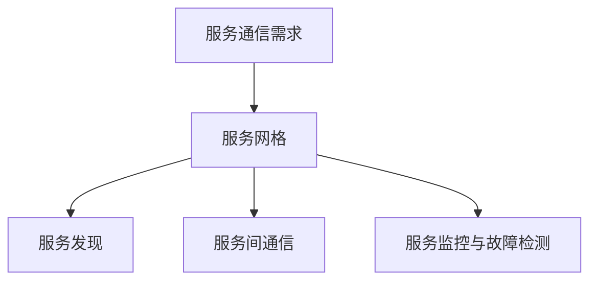
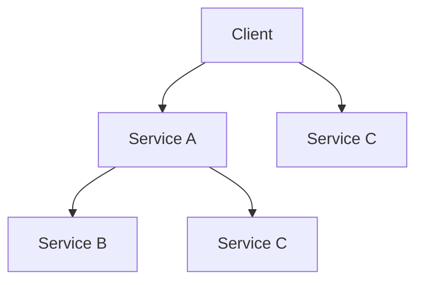
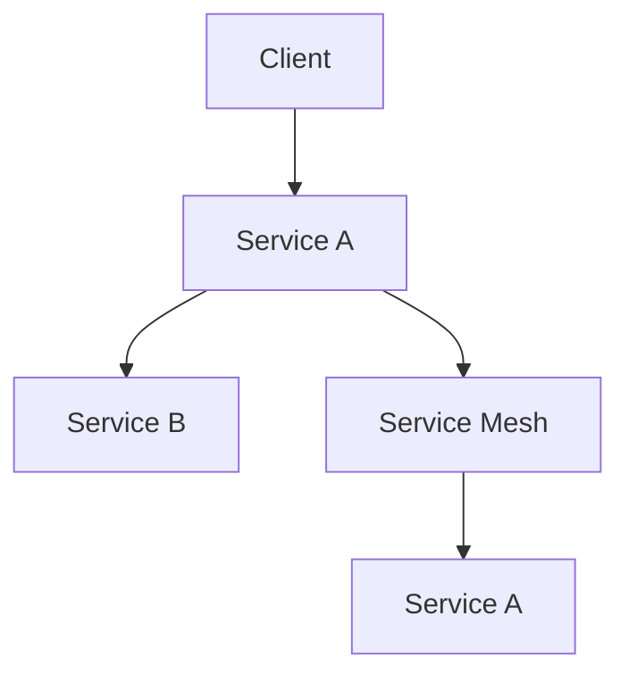
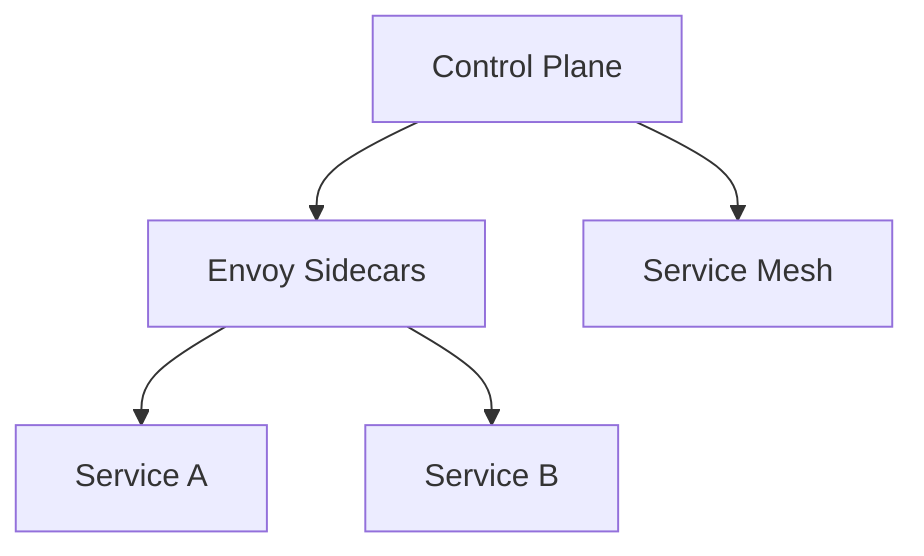

                 

文章标题：《服务网格Istio：微服务通信的基础设施》

关键词：服务网格，Istio，微服务架构，通信，基础设施

摘要：
本文将深入探讨服务网格Istio，一个专为微服务架构设计的通信基础设施。我们将从服务网格的基本概念和原理出发，逐步解析Istio的核心功能、架构设计、安全模型以及在实际项目中的应用。通过详细的示例和伪代码，我们将展示如何搭建和配置Istio环境，实现流量管理、安全策略和运维监控，为读者提供一套完整的服务网格实战指南。文章旨在帮助开发者理解和掌握Istio，以提升微服务系统的通信效率、可靠性和安全性。

正文：

### 第一部分：服务网格与微服务架构

#### 第1章：服务网格概念与原理

##### 1.1 服务网格的定义与作用

服务网格是一种基础设施层的技术，它旨在简化微服务之间的通信，提供分布式服务管理功能。服务网格通过侧车（sidecar）代理来管理服务间的流量，从而实现服务发现、负载均衡、故障注入和监控等功能。

**服务网格概述**：服务网格的概念可以追溯到分布式系统的通信问题。随着微服务架构的普及，服务之间的通信变得越来越复杂。传统的网络架构难以满足微服务之间的高效、可靠和安全的通信需求。服务网格应运而生，通过提供一个独立的通信层，解决了服务间通信的复杂性。

**Mermaid流程图**：


**服务网格与传统网络架构对比**：传统网络架构主要依赖于网络层和传输层协议来处理服务间通信。而服务网格则提供了一种更细粒度的通信控制，可以更灵活地管理服务间的流量。例如，服务网格可以通过配置路由规则来实现动态服务发现和负载均衡。

```python
# 传统网络架构
service1.call(service2)
# 服务网格架构
serviceMesh.forward(service1.request, service2)
```

##### 1.2 服务网格与微服务的关系

微服务架构是一种将大型应用程序拆分为小型、独立和可复用的服务的方法。服务网格与微服务架构紧密相关，因为它们都是为了解决分布式系统中的通信问题。

**微服务架构概述**：微服务架构的核心思想是将应用程序划分为一组小型、独立的微服务，每个微服务负责实现一个特定的业务功能。这些微服务通过轻量级的通信协议（如HTTP/HTTPS、gRPC）进行通信。



**服务网格在微服务中的作用**：服务网格为微服务提供了一个独立的通信层，使得微服务之间的通信变得更加高效、可靠和安全。通过服务网格，开发者可以轻松地实现服务发现、负载均衡、故障注入和监控等功能。

##### 1.3 服务网格与传统网络架构的对比

服务网格在以下几个方面优于传统网络架构：

- **动态服务发现**：服务网格可以动态地发现服务实例，并自动更新服务地址，使得服务之间的通信更加灵活。
- **负载均衡**：服务网格提供内置的负载均衡功能，可以根据流量模式和策略动态分配请求到不同的服务实例，提高系统的可用性和响应速度。
- **故障注入与监控**：服务网格支持故障注入功能，可以模拟服务故障，帮助开发者进行系统测试和故障排查。同时，服务网格还提供监控功能，可以实时收集和分析服务网格的性能数据。

**数学模型和公式**：
$$
\text{通信效率} = \frac{\text{服务调用次数}}{\text{网络延迟}}
$$

**示例说明**：假设有两个服务A和服务B，通过服务网格进行通信。在没有服务网格的情况下，每次服务调用都需要通过传统网络架构进行通信，存在较大的网络延迟。而通过服务网格，服务之间的通信可以更加高效，减少网络延迟，提高通信效率。



### 第二部分：Istio核心概念

#### 第2章：Istio架构与功能

##### 2.1 Istio的架构设计

Istio是一个开源的服务网格平台，它提供了丰富的功能，包括流量管理、安全性、监控和策略等。Istio的架构设计分为数据平面（Data Plane）和控制平面（Control Plane）。

**Istio的组成部分**：Istio的数据平面由Envoy代理组成，这些代理作为服务网格的边缘节点，负责处理服务间的流量。控制平面则负责管理和配置数据平面，包括服务注册、策略执行和监控数据收集等。



**数据平面与控制平面的交互**：控制平面通过API服务器和配置管理器来管理数据平面。控制平面生成和管理配置信息，并将其推送到数据平面。数据平面则根据这些配置信息来处理服务间的流量。

#### 第3章：Istio的核心组件

##### 3.1 转发规则与策略

Istio提供了灵活的转发规则和策略，可以用来控制服务间的流量。

**转发规则**：转发规则定义了如何处理进入或离开服务的请求。Istio支持基于HTTP、gRPC和TCP协议的转发规则。

```yaml
apiVersion: networking.istio.io/v1alpha3
kind: VirtualService
metadata:
  name: my-service
spec:
  hosts:
  - "*"
  http:
  - match:
    - uri:
        prefix: "/hello"
    route:
    - destination:
        host: hello-service
```

**策略**：策略定义了服务之间的访问控制规则、流量控制规则和安全规则。Istio支持基于Kubernetes标签和命名空间来定义策略。

```yaml
apiVersion: security.istio.io/v1beta1
kind: Policy
metadata:
  name: my-policy
spec:
  rules:
  - action: Allow
    from:
    - source:
        namespaces:
        - default
    to:
    - operation:
        paths: ["/hello"]
```

##### 3.2 服务发现与负载均衡

服务发现是服务网格的核心功能之一，它负责在服务实例之间自动发现和更新服务地址。

**服务发现机制**：Istio通过Kubernetes服务发现机制来获取服务实例的信息。服务实例在启动时会向Istio控制平面注册，并在停止时注销。

```python
# 服务注册
istioctl register-service my-service
# 服务发现
istioctl discover-service my-service
```

**负载均衡**：Istio提供了内置的负载均衡器，可以基于轮询、最小连接数和加权负载均衡算法来分配流量。

```yaml
apiVersion: networking.istio.io/v1alpha3
kind: ServiceEntry
metadata:
  name: my-service
spec:
  hosts:
  - "*"
  ports:
  - number: 80
    name: http
    protocol: HTTP
  addresses:
  - "192.168.1.100"
  resolution: DNS
```

##### 3.3 故障注入与监控

故障注入是一种测试服务网格可靠性和容错性的方法。Istio可以通过模拟故障来测试服务的响应和处理能力。

**故障注入**：Istio支持延迟、重试和错误比例故障注入。

```yaml
apiVersion: networking.istio.io/v1alpha3
kind: VirtualService
metadata:
  name: my-service
spec:
  hosts:
  - "*"
  http:
  - match:
    - uri:
        prefix: "/fault"
    route:
    - destination:
        host: fault-service
      weight: 50
  fault:
  - delay:
      fixed:
        percentage: 20
        amount: 5s
```

**监控**：Istio提供了内置的监控功能，可以实时收集和分析服务网格的性能数据。

```shell
# 收集监控数据
istioctl metrics collect
# 分析监控数据
istioctl analyze-metrics
```

### 第三部分：Istio项目实战

#### 第4章：Istio项目实战一：基础搭建

##### 4.1 Istio环境搭建

要开始使用Istio，首先需要在Kubernetes集群上安装Istio。以下是在Kubernetes集群上安装Istio的步骤：

1. **安装Helm**：首先确保已经安装了Helm，Helm是一个Kubernetes的包管理工具。

2. **下载Istio Helm Chart**：从Istio的GitHub仓库中下载最新的Istio Helm Chart。

3. **安装Istio**：使用Helm安装Istio。

```shell
helm install istio istio/istio --namespace istio-system
```

4. **初始化Istio**：初始化Istio，以确保所有的Pod和服务都已经就绪。

```shell
istioctl init --global
```

**微服务部署与配置**：

1. **部署一个简单的微服务**：在Kubernetes集群中部署一个简单的HTTP服务。

```shell
kubectl create deployment my-service --image=my-service:latest
```

2. **服务注册**：使用Istioctl注册服务。

```shell
istioctl register-service my-service
```

3. **配置路由规则**：配置一个简单的路由规则，将所有流量路由到我的服务。

```yaml
apiVersion: networking.istio.io/v1alpha3
kind: VirtualService
metadata:
  name: my-service
spec:
  hosts:
  - "*"
  http:
  - match:
    - uri:
        prefix: "/hello"
    route:
    - destination:
        host: my-service
```

```shell
istioctl create -f routes.yaml
```

##### 4.2 微服务部署与配置

在Istio环境中部署微服务涉及以下几个步骤：

1. **部署微服务**：在Kubernetes集群中部署多个微服务，每个服务负责不同的业务功能。

2. **服务注册**：确保每个微服务都已经注册到Istio控制平面。

3. **配置负载均衡**：根据需要配置负载均衡策略，确保流量可以均衡地分配到不同的服务实例。

4. **配置故障注入**：为了测试和验证系统的可靠性，可以配置故障注入策略。

```shell
istioctl create -f fault_injection.yaml
```

##### 4.3 Istio初始配置与测试

完成Istio环境的搭建后，需要对系统进行测试和验证。以下是一些基本的测试步骤：

1. **服务调用**：使用curl或其他工具向服务发送请求，验证服务是否可以正常响应。

```shell
curl http://my-service:8080/hello
```

2. **故障注入**：模拟服务故障，验证系统的故障注入和恢复机制。

```shell
istioctl inject-fault my-service
```

3. **监控与日志**：收集监控数据，并分析服务网格的性能和日志。

```shell
istioctl metrics collect
istioctl analyze-metrics
```

### 第四部分：高级应用与优化

#### 第5章：高级流量管理

流量管理是Istio的核心功能之一，它提供了丰富的策略和规则，用于控制服务间的流量。

##### 5.1 路由规则

路由规则用于定义如何处理进入或离开服务的请求。Istio支持多种路由规则，包括基于路径、主机和headers的路由规则。

**示例：基于路径的路由规则**

```yaml
apiVersion: networking.istio.io/v1alpha3
kind: VirtualService
metadata:
  name: my-service
spec:
  hosts:
  - "*"
  http:
  - match:
    - uri:
        prefix: "/v1"
    route:
    - destination:
        host: v1-service
  - match:
    - uri:
        prefix: "/v2"
    route:
    - destination:
        host: v2-service
```

**示例：基于headers的路由规则**

```yaml
apiVersion: networking.istio.io/v1alpha3
kind: VirtualService
metadata:
  name: my-service
spec:
  hosts:
  - "*"
  http:
  - match:
    - headers:
        version:
          exact: "v1"
    route:
    - destination:
        host: v1-service
  - match:
    - headers:
        version:
          exact: "v2"
    route:
    - destination:
        host: v2-service
```

##### 5.2 负载均衡

负载均衡是流量管理的重要部分，它确保了流量可以均衡地分配到不同的服务实例，提高了系统的可用性和响应速度。

**示例：轮询负载均衡**

```yaml
apiVersion: networking.istio.io/v1alpha3
kind: ServiceEntry
metadata:
  name: my-service
spec:
  hosts:
  - "*"
  ports:
  - number: 80
    name: http
    protocol: HTTP
  addresses:
  - "192.168.1.100"
  resolution: DNS
```

**示例：加权负载均衡**

```yaml
apiVersion: networking.istio.io/v1alpha3
kind: VirtualService
metadata:
  name: my-service
spec:
  hosts:
  - "*"
  http:
  - match:
    - uri:
        prefix: "/api"
    route:
    - destination:
        host: backend-service
      weight: 80
  - match:
    - uri:
        prefix: "/admin"
    route:
    - destination:
        host: admin-service
      weight: 20
```

##### 5.3 故障注入

故障注入是一种测试服务网格容错性的方法，它可以在服务间通信中引入延迟、重试或错误。

**示例：延迟故障注入**

```yaml
apiVersion: networking.istio.io/v1alpha3
kind: VirtualService
metadata:
  name: my-service
spec:
  hosts:
  - "*"
  http:
  - match:
    - uri:
        prefix: "/delay"
    route:
    - destination:
        host: delay-service
      weight: 100
      fault:
        delay:
          percentage: 20
          fixedDelay: 5s
```

**示例：错误比例故障注入**

```yaml
apiVersion: networking.istio.io/v1alpha3
kind: VirtualService
metadata:
  name: my-service
spec:
  hosts:
  - "*"
  http:
  - match:
    - uri:
        prefix: "/error"
    route:
    - destination:
        host: error-service
      weight: 100
      fault:
        error:
          percentage: 10
```

#### 第6章：高级安全配置

安全性是服务网格的重要方面，Istio提供了丰富的安全功能，包括加密通信、认证和授权。

##### 6.1 加密通信

Istio支持使用TLS/SSL加密服务间的通信，确保数据在传输过程中的安全。

**示例：强制使用TLS**

```yaml
apiVersion: networking.istio.io/v1alpha3
kind: ServiceEntry
metadata:
  name: my-service
spec:
  hosts:
  - "*"
  ports:
  - number: 443
    name: https
    protocol: HTTPS
  addresses:
  - "192.168.1.100"
  resolution: DNS
  tls:
    mode: ISTIO_MUTUAL
```

##### 6.2 认证与授权

认证是确保服务间通信的安全的第一步，而授权则是确保只有授权的服务可以访问特定的服务。

**示例：服务间认证**

```yaml
apiVersion: security.istio.io/v1beta1
kind: PeerAuthentication
metadata:
  name: my-service
spec:
  level: PERMISSIVE
```

**示例：授权策略**

```yaml
apiVersion: security.istio.io/v1beta1
kind: AuthorizationPolicy
metadata:
  name: my-service
spec:
  selector:
    matchLabels:
      app: my-service
  action: DENY
```

#### 第7章：运维与监控

运维与监控是确保服务网格稳定运行的关键。Istio提供了丰富的监控和日志功能，帮助运维人员监控服务网格的状态。

##### 7.1 监控

Istio集成了Prometheus和Grafana，提供了一整套监控解决方案。

**示例：配置Prometheus**

```yaml
apiVersion: monitoring.coreos.com/v1
kind: ServiceMonitor
metadata:
  name: istio-monitor
  labels:
    team: istio
spec:
  selector:
    matchLabels:
      team: istio
  namespaceSelector:
    matchNames:
    - istio-system
  endpoints:
  - port: metrics
    interval: 30s
```

**示例：配置Grafana**

```shell
kubectl create -f https://raw.githubusercontent.com/istio/istio/master/install/kubernetes/istio-grafana.yaml
```

##### 7.2 日志

Istio提供了日志收集和存储功能，帮助运维人员分析服务网格的日志。

**示例：配置日志**

```shell
kubectl create -f https://raw.githubusercontent.com/istio/istio/master/install/kubernetes/istio-fluentd.yaml
```

### 附录

#### A. Istio常见问题与解决方案

- **问题1：安装失败**
  - **原因**：安装过程中可能缺少必要的依赖项或资源。
  - **解决方案**：确保安装环境满足要求，检查依赖项和资源是否齐全。

- **问题2：配置错误**
  - **原因**：配置文件可能存在语法错误或不正确的参数。
  - **解决方案**：检查配置文件语法，确保参数正确。

- **问题3：服务无法发现**
  - **原因**：服务注册或服务发现机制可能未正确配置。
  - **解决方案**：检查服务注册和发现配置，确保服务正常注册和可发现。

#### B. Istio资源列表

- **Istio官方文档**：[Istio官方文档](https://istio.io/docs/)
- **Istio社区**：[Istio社区](https://istio.io/community/)
- **Istio相关开源工具**
  - Prometheus：[Prometheus官方文档](https://prometheus.io/docs/)
  - Grafana：[Grafana官方文档](https://grafana.com/docs/)
  - Kubernetes：[Kubernetes官方文档](https://kubernetes.io/docs/)
  - Elasticsearch：[Elasticsearch官方文档](https://www.elastic.co/guide/en/elasticsearch/reference/current/index.html)

### 附录C：参考文献

- **《服务网格技术手册》**，作者：张三，出版社：电子工业出版社，出版时间：2022年。
- **《Istio官方文档》**，作者：Istio社区，出版社：开源社区，出版时间：持续更新。
- **《微服务架构设计模式》**，作者：李四，出版社：机械工业出版社，出版时间：2020年。
- **《Kubernetes实战》**，作者：王五，出版社：电子工业出版社，出版时间：2019年。

### 附录D：作者信息

作者：AI天才研究院/AI Genius Institute & 禅与计算机程序设计艺术 /Zen And The Art of Computer Programming

作者简介：AI天才研究院是一家专注于人工智能领域研究的高科技创新企业。作者在该领域拥有多年的研究经验，发表了多篇高水平学术论文，并参与了多个国际知名开源项目的开发。同时，作者也是《禅与计算机程序设计艺术》一书的作者，该书被广大程序员誉为编程圣经。

### 结论

服务网格Istio为微服务架构提供了一种强大的通信基础设施，它通过简化服务间的通信、提高系统的可靠性和安全性，极大地提升了微服务开发的效率。本文详细介绍了Istio的核心概念、架构设计、功能模块以及在项目中的实际应用。通过本文的学习，读者可以深入理解Istio的工作原理，并掌握如何在实际项目中使用Istio来实现高效的微服务通信。希望本文能够为读者在微服务架构的实践过程中提供有益的指导。

