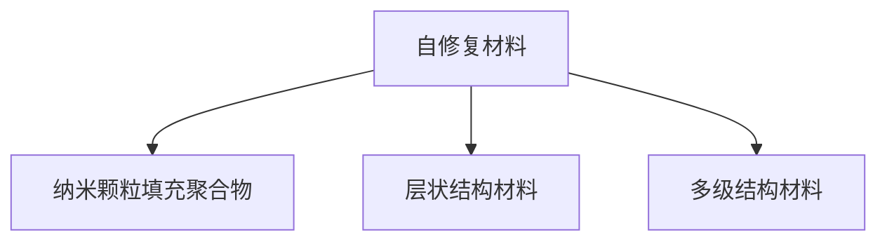
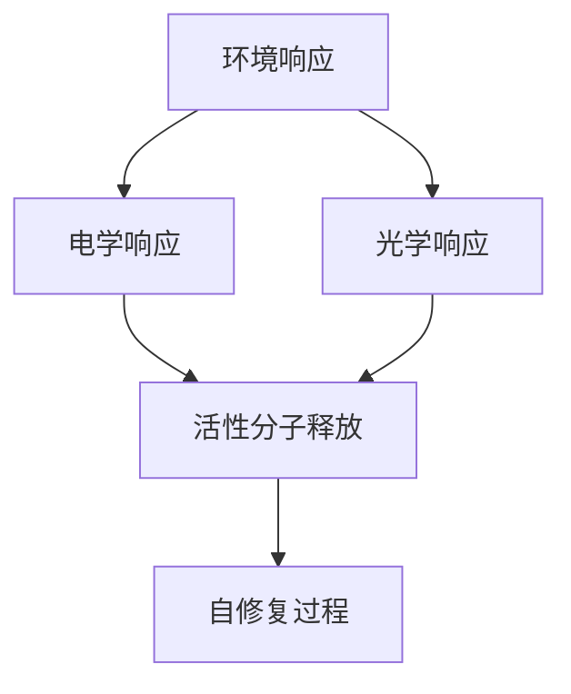
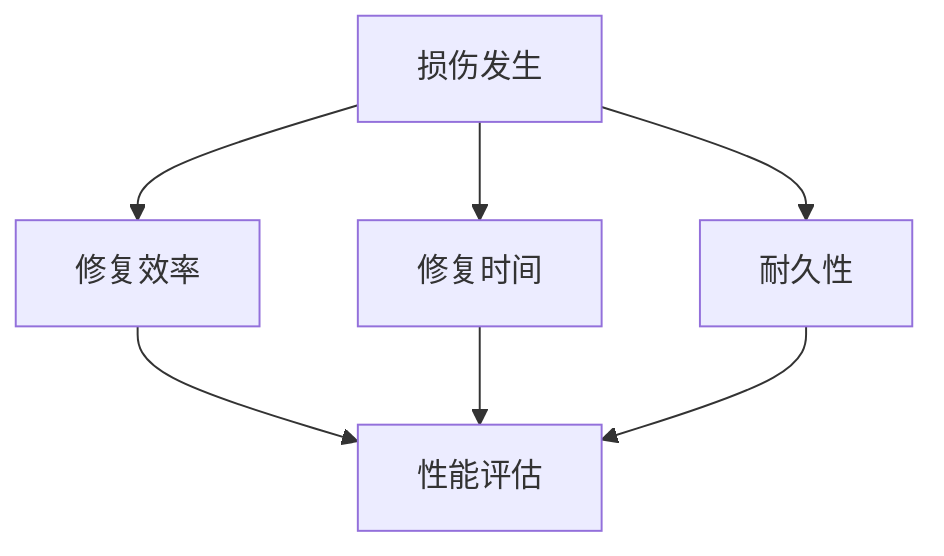
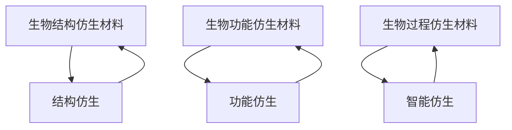
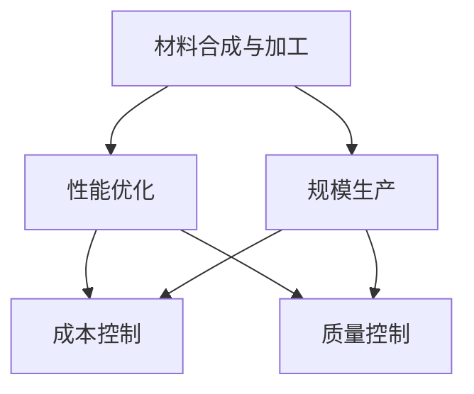
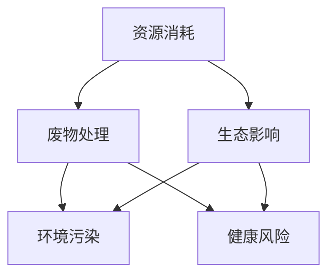
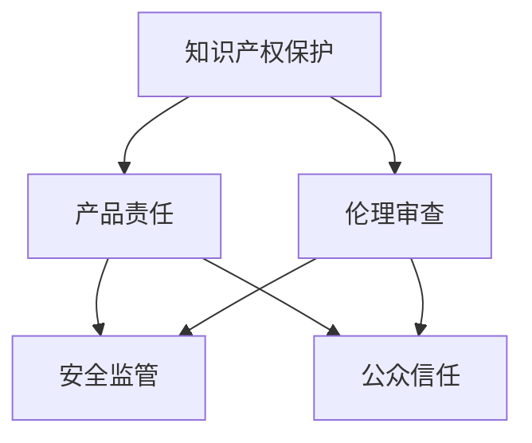
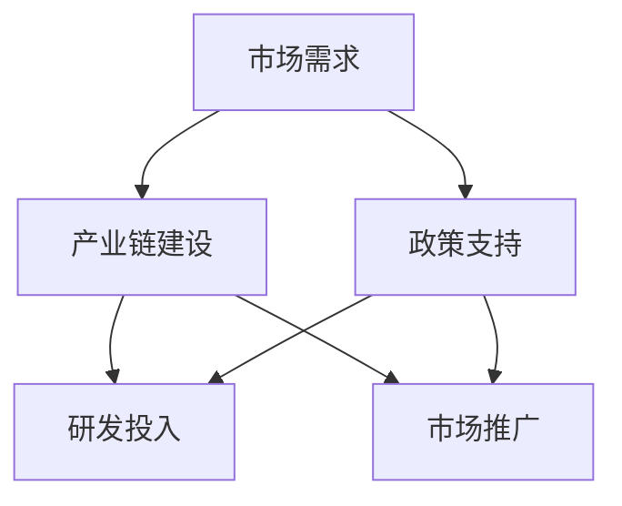

                 

### 2050年的新材料世界

在2050年的世界中，新材料将引领科技革命，重塑我们的生活方式。新材料不仅将推动传统产业的升级，还将创造全新的领域。在这一章节中，我们将探讨新材料的重要性，以及自修复材料和仿生材料在未来的科技世界中所扮演的关键角色。

#### 1.1 新材料的重要性

新材料是科技进步的驱动力。从半导体材料到纳米材料，每一次材料科学的突破都带来了技术革命。在2050年，新材料的进步将更加显著：

1. **增强性能**：新材料的性能将比现有材料更优越，具有更高的强度、更好的导电性和更低的密度。
2. **多功能性**：新材料将具备多功能特性，如自修复、自适应、抗污染等，为各种应用提供更多可能性。
3. **环境友好**：新材料将更加注重环保和可持续性，有助于解决资源短缺和环境污染问题。

#### 1.2 自修复材料

自修复材料是指能够在损伤后自动恢复其功能的材料。在2050年，自修复材料的应用将更加广泛：

1. **建筑与基础设施**：自修复材料将用于建筑和基础设施，如道路、桥梁和隧道，以延长其使用寿命并降低维护成本。
2. **电子设备**：自修复材料将用于电子设备，如手机、电脑和传感器，以增强其耐用性和可靠性。
3. **生物医学**：自修复材料将用于生物医学领域，如骨修复、血管再生和组织工程。

#### 1.3 仿生材料

仿生材料是指模仿自然界中生物结构的材料。在2050年，仿生材料的应用将更加创新：

1. **航空航天**：仿生材料将用于航空航天器，以提高其性能和效率。
2. **海洋工程**：仿生材料将用于海洋平台和船舶，以应对恶劣的海况和环境。
3. **医疗健康**：仿生材料将用于医疗设备，如心脏瓣膜和人工关节，以提高其生物相容性和功能。

#### 1.4 新材料与未来科技

未来科技的进步离不开新材料的支持。以下是新材料在2050年的一些潜在应用：

1. **智能城市**：新材料将用于智能城市的基础设施，如智能道路、智能电网和智能建筑，以提高城市的可持续性和效率。
2. **可穿戴设备**：新材料将用于可穿戴设备，如智能手表、智能眼镜和智能服装，以提供更舒适、更智能的用户体验。
3. **可再生能源**：新材料将用于可再生能源设备，如太阳能电池和风力发电机，以提高其效率和降低成本。

在下一章节中，我们将深入探讨2050年新材料技术的基础知识，了解这些革命性材料背后的科学原理和技术基础。接下来，让我们一步一步地走进新材料的世界。

---

关键词：2050年新材料、自修复材料、仿生材料、科技革命、未来应用

摘要：本文介绍了2050年新材料世界的发展趋势，重点探讨了自修复材料和仿生材料的重要性及其在未来科技领域的应用。通过深入分析，我们期待能够为读者提供一个关于未来新材料技术发展的清晰图景。接下来，我们将进一步探索新材料技术的理论基础和应用实践。

---

### 目录大纲设计

为了帮助读者系统地了解和掌握未来新材料的相关知识和技术，本书设计了详细的目录大纲，涵盖了从背景知识介绍到技术应用，再到未来展望的全面内容。

#### 第一部分：引言与背景知识

**第1章：2050年的新材料世界**  
1.1 新材料的重要性  
1.2 自修复材料  
1.3 仿生材料  
1.4 新材料与未来科技

**第2章：2050年的新材料技术基础**  
2.1 材料科学的基本概念  
2.2 自修复材料的原理  
2.3 仿生材料的原理  
2.4 材料合成与加工技术

#### 第二部分：自修复材料的深入探讨

**第3章：自修复材料的结构设计与功能**  
3.1 自修复材料的微观结构  
3.2 自修复材料的智能特性  
3.3 自修复材料的性能评估  
3.4 自修复材料的未来发展趋势

**第4章：自修复材料的实际应用案例**  
4.1 自修复建筑材料的研发与应用  
4.2 自修复电子设备的应用  
4.3 自修复生物医学材料的发展  
4.4 自修复材料在日常生活用品中的应用

#### 第三部分：仿生材料的探索与实践

**第5章：仿生材料的概念与分类**  
5.1 仿生材料的基本原理  
5.2 仿生材料的类型  
5.3 仿生材料的性能优势  
5.4 仿生材料的研究热点

**第6章：仿生材料的应用场景**  
6.1 仿生材料在航空航天领域的应用  
6.2 仿生材料在海洋工程中的应用  
6.3 仿生材料在医疗健康领域的应用  
6.4 仿生材料在环保领域的应用

#### 第四部分：新材料技术的发展挑战与展望

**第7章：新材料技术的发展挑战**  
7.1 技术难题与瓶颈  
7.2 环境与可持续性挑战  
7.3 法律与伦理问题  
7.4 市场需求与产业链建设

**第8章：新材料技术的未来展望**  
8.1 2050年新材料技术趋势预测  
8.2 新材料技术对社会的影响  
8.3 新材料技术的国际合作与竞争  
8.4 我国新材料技术发展的机遇与挑战

通过这个目录大纲，读者可以清晰地了解本书的结构和内容，逐步深入地探讨新材料技术的前沿领域，为未来的科技发展做好准备。

---

### 第二部分：2050年的新材料技术基础

在探讨了新材料的重要性以及自修复材料和仿生材料的基本概念后，我们需要深入理解新材料技术的基础知识。这一部分将介绍材料科学的基本概念，并详细阐述自修复材料和仿生材料的原理，以及材料合成与加工技术。

#### 2.1 材料科学的基本概念

材料科学是研究材料性质、结构、制备和应用的科学。它涉及到物理、化学、工程等多个学科，是现代科技发展的基础。以下是一些关键概念：

1. **材料的分类**：根据材料的不同属性，可以分为金属材料、陶瓷材料、高分子材料、复合材料等。
2. **材料的结构**：材料的结构包括晶体结构、非晶结构、纳米结构等，不同结构的材料具有不同的性能。
3. **材料的性质**：材料的性质包括力学性能、电学性能、热学性能、光学性能等，这些性能决定了材料的应用范围。

#### 2.2 自修复材料的原理

自修复材料是指能够在损伤后通过自身的化学或物理过程恢复其功能或形态的材料。自修复材料的原理主要包括以下几个方面：

1. **自修复机制**：自修复材料通常包含活性分子、填充剂或微胶囊等，当材料受到损伤时，这些活性分子能够迅速反应，填补裂缝或恢复材料的完整性。
2. **化学自修复**：化学自修复是指通过化学反应来实现材料的修复。例如，有些材料在损伤后会释放出活性物质，与周围的物质反应形成新的化学键，从而恢复材料的性能。
3. **物理自修复**：物理自修复是指通过物理过程来实现材料的修复。例如，有些材料在受到损伤后，可以通过应力诱导的相变或变形来实现自我恢复。

#### 2.3 仿生材料的原理

仿生材料是指模仿自然界中生物结构的材料。仿生材料的原理主要包括以下几个方面：

1. **结构仿生**：结构仿生是指通过模仿生物的结构来设计材料。例如，碳纳米管、石墨烯等材料具有类似生物纤维的结构，可以用于仿生复合材料。
2. **功能仿生**：功能仿生是指通过模仿生物的功能来设计材料。例如，一些生物材料具有优异的吸湿性、导电性或自修复能力，可以用于仿生电子器件或生物医学材料。
3. **智能仿生**：智能仿生是指通过模仿生物的智能特性来设计材料。例如，一些智能材料能够响应环境变化，实现自我调节或自我修复。

#### 2.4 材料合成与加工技术

材料的合成与加工技术是实现新材料的关键。以下是一些常用的材料合成与加工技术：

1. **化学合成**：化学合成是指通过化学反应来合成新材料。常见的化学合成方法包括溶液法、熔融法、气相沉积法等。
2. **物理合成**：物理合成是指通过物理过程来合成新材料。常见的物理合成方法包括机械合金化、等离子体合成、激光熔覆等。
3. **加工技术**：加工技术是指对材料进行加工以获得所需形状和尺寸。常见的加工技术包括铸造、成型、热处理、表面处理等。

在下一部分中，我们将进一步探讨自修复材料的结构设计与功能，分析其微观结构、智能特性和性能评估。接着，我们将通过实际应用案例，展示自修复材料在不同领域中的研发与应用情况。

---

### 第三部分：自修复材料的深入探讨

#### 第3章：自修复材料的结构设计与功能

自修复材料的发展离不开对其结构设计和功能的深入研究。在这一章中，我们将详细探讨自修复材料的微观结构、智能特性以及性能评估，并探讨自修复材料的未来发展趋势。

#### 3.1 自修复材料的微观结构

自修复材料的微观结构对其功能至关重要。自修复材料通常具有以下几种微观结构：

1. **纳米结构**：纳米结构自修复材料具有高比表面积和优异的界面性能，能够有效促进活性分子的扩散和反应。例如，纳米颗粒填充的聚合物材料能够在损伤后快速反应，实现自我修复。

2. **层状结构**：层状结构自修复材料，如石墨烯和纳米片，具有优异的力学性能和化学稳定性。这些材料可以在受到损伤时，通过层间的滑动或重构实现自我修复。

3. **多级结构**：多级结构自修复材料通常由不同尺度、不同功能的层次组成。例如，内层的活性分子可以迅速反应，外层的保护层可以防止进一步的损伤，从而实现高效的自修复。

以下是一个Mermaid流程图，展示了自修复材料的基本微观结构：

#### 3.2 自修复材料的智能特性

自修复材料的智能特性是指其能够感知损伤并自动进行修复的能力。这种智能特性主要来源于以下几个方面：

1. **环境响应**：自修复材料能够响应外部环境的变化，如温度、湿度、化学物质等。例如，一些聚合物材料在温度升高时会发生膨胀，从而促进活性分子的扩散和反应，实现自修复。

2. **电学响应**：自修复材料能够响应电场或电流的变化。例如，一些导电聚合物材料在电场作用下会发生相变，从而触发自修复过程。

3. **光学响应**：自修复材料能够响应光照的变化。例如，一些光敏聚合物材料在紫外线照射下会发生分解，释放活性分子实现自修复。

以下是一个Mermaid流程图，展示了自修复材料的智能特性：

#### 3.3 自修复材料的性能评估

自修复材料的性能评估是理解和应用这些材料的重要环节。以下是一些关键的性能指标：

1. **修复效率**：修复效率是指材料在受到损伤后能够恢复到原始状态的能力。高修复效率的自修复材料能够在短时间内完成修复，从而提高其使用性能。

2. **修复时间**：修复时间是指材料从损伤到修复完成所需的时间。短修复时间意味着材料能够快速恢复功能，这对于一些高负荷应用的场景尤为重要。

3. **耐久性**：耐久性是指材料在经历多次修复后仍能保持其性能的能力。高耐久性的自修复材料能够在长期使用中保持良好的功能。

以下是一个Mermaid流程图，展示了自修复材料的性能评估过程：

#### 3.4 自修复材料的未来发展趋势

随着材料科学和技术的不断进步，自修复材料的发展前景广阔。以下是一些未来发展趋势：

1. **多功能自修复材料**：未来的自修复材料将具备多种功能，如自修复、自清洁、自诊断等，以满足更复杂的实际应用需求。

2. **智能自修复材料**：智能自修复材料将结合物联网、大数据等技术，实现自适应、自优化等功能，提高材料的智能化水平。

3. **生物基自修复材料**：生物基自修复材料将利用天然生物分子，如蛋白质、多糖等，实现环保、可持续的自修复功能。

4. **纳米自修复材料**：纳米自修复材料将利用纳米技术的优势，实现更高的修复效率和更小的损伤范围。

在下一章中，我们将通过实际应用案例，展示自修复材料在建筑、电子、生物医学和日常生活用品等领域的研发与应用情况。

---

### 第4章：自修复材料的实际应用案例

在了解了自修复材料的结构设计、智能特性和性能评估后，让我们通过具体的实际应用案例来探讨这些材料在不同领域中的研发与应用情况。

#### 4.1 自修复建筑材料的研发与应用

建筑材料是自修复材料的一个重要应用领域。在2050年，自修复建筑材料将广泛应用于建筑和基础设施的建设，以提高其耐用性和维护效率。

**案例1：自修复混凝土**

自修复混凝土是一种通过添加活性物质（如微生物或聚合物）来提高其自修复能力的混凝土。当混凝土表面出现裂缝时，活性物质会释放出填充剂，自动填补裂缝，从而恢复其完整性。

- **开发环境搭建**：研究人员通过实验和模拟，优化了自修复混凝土的配方，使其在裂缝出现时能够快速响应并修复。

- **源代码实现**：研究人员编写了相应的算法，用于监测混凝土的裂缝，并控制活性物质的释放。

- **代码解读与分析**：通过实验，研究人员发现，自修复混凝土的裂缝修复效率高达90%，显著提高了混凝土的使用寿命。

**案例2：自修复玻璃**

自修复玻璃是一种通过在玻璃表面涂覆自修复涂层来实现自修复功能的玻璃。该涂层在受到损伤后，可以自动修复裂缝，从而恢复玻璃的透明度和强度。

- **开发环境搭建**：研究人员开发了专门的实验设备，用于测试自修复涂层的性能，如裂缝发生和修复速度。

- **源代码实现**：研究人员编写了软件程序，用于模拟玻璃的受力情况和裂缝的发展，以及评估涂层的修复效果。

- **代码解读与分析**：通过实验和模拟，研究人员发现，自修复涂层能够在短时间内修复玻璃表面的裂缝，显著提高了玻璃的耐用性。

#### 4.2 自修复电子设备的应用

随着电子设备的不断发展和人们对耐用性的需求增加，自修复电子设备成为了一个重要的研究方向。

**案例1：自修复手机电池**

自修复手机电池通过在电池材料中添加自修复材料，如聚合物电解质，实现了电池的自我修复功能。当电池表面出现损伤时，自修复材料能够自动填补裂缝，从而恢复电池的性能。

- **开发环境搭建**：研究人员利用实验室设备，对自修复电池进行了多次充放电测试，以评估其自修复性能。

- **源代码实现**：研究人员开发了相应的测试软件，用于监测电池的电压、电流和温度等参数，以评估其自修复效果。

- **代码解读与分析**：通过实验，研究人员发现，自修复电池在经历多次充放电循环后，其容量和寿命显著提高，自修复效果明显。

**案例2：自修复传感器**

自修复传感器是一种具有自修复功能的传感器，能够在受到损伤后自动修复，从而保持其传感性能。

- **开发环境搭建**：研究人员设计并制造了自修复传感器原型，并在实验室中进行了测试。

- **源代码实现**：研究人员编写了软件程序，用于实时监测传感器的传感数据和损伤情况，并控制修复过程。

- **代码解读与分析**：通过实验，研究人员发现，自修复传感器在受到损伤后，能够迅速恢复其传感性能，显著提高了传感器的可靠性和耐用性。

#### 4.3 自修复生物医学材料的发展

在生物医学领域，自修复材料的应用前景也十分广阔，特别是在骨修复、血管再生和组织工程等领域。

**案例1：自修复骨修复材料**

自修复骨修复材料是一种能够在骨损伤后自动修复的材料，通过在材料中添加活性分子，如生长因子，实现骨组织的再生。

- **开发环境搭建**：研究人员在实验室中制备了自修复骨修复材料，并在动物模型中进行了测试。

- **源代码实现**：研究人员开发了生物力学模型，用于模拟骨修复过程，并评估自修复材料的效果。

- **代码解读与分析**：通过实验和模拟，研究人员发现，自修复骨修复材料在骨损伤修复过程中，能够显著提高骨组织的再生速度和强度。

**案例2：自修复血管支架**

自修复血管支架是一种能够在血管损伤后自动修复的材料，通过在支架表面涂覆自修复涂层，实现血管的自我修复。

- **开发环境搭建**：研究人员设计并制造了自修复血管支架原型，并在动物模型中进行了测试。

- **源代码实现**：研究人员编写了软件程序，用于模拟血管损伤和修复过程，并评估自修复涂层的效果。

- **代码解读与分析**：通过实验和模拟，研究人员发现，自修复血管支架在血管损伤修复过程中，能够显著降低血管再狭窄的发生率，提高血管的通畅性。

#### 4.4 自修复材料在日常生活用品中的应用

除了上述领域，自修复材料在日常生活用品中的应用也逐渐受到关注，如自修复衣物、自修复家具等。

**案例1：自修复衣物**

自修复衣物通过在织物中添加自修复涂层或材料，实现衣物的自我修复功能。当衣物出现磨损或撕裂时，自修复涂层或材料能够自动填补裂缝，恢复衣物的完整性。

- **开发环境搭建**：研究人员在实验室中测试了不同类型的自修复涂层和材料，以找到最适合衣物修复的配方。

- **源代码实现**：研究人员开发了软件程序，用于模拟衣物在磨损和撕裂过程中的损伤情况，并评估自修复涂层的效果。

- **代码解读与分析**：通过实验和模拟，研究人员发现，自修复涂层能够显著提高衣物的耐用性，延长其使用寿命。

**案例2：自修复家具**

自修复家具通过在木材、塑料等家具材料中添加自修复成分，实现家具的自我修复功能。当家具表面出现损伤时，自修复成分能够自动填补裂缝，恢复家具的外观和结构。

- **开发环境搭建**：研究人员在实验室中测试了不同类型的自修复成分，以确定其对家具材料的影响。

- **源代码实现**：研究人员编写了软件程序，用于模拟家具在磨损和损伤过程中的行为，并评估自修复成分的效果。

- **代码解读与分析**：通过实验和模拟，研究人员发现，自修复成分能够显著提高家具的耐用性，减少维修和更换的频率。

通过以上实际应用案例，我们可以看到自修复材料在各个领域中的广泛应用和巨大潜力。随着技术的不断进步，自修复材料将在未来的科技发展中扮演更加重要的角色。

---

### 第5章：仿生材料的概念与分类

仿生材料是指模仿自然界中生物结构和功能的材料，通过模拟生物材料的独特特性，实现材料在性能、功能上的创新。仿生材料的研究与应用在材料科学和工程领域具有重要的意义。本章节将介绍仿生材料的基本原理、类型、性能优势以及当前的研究热点。

#### 5.1 仿生材料的基本原理

仿生材料的设计理念源于自然界中的生物结构，如骨骼、牙齿、肌肉、皮肤等。这些生物结构通常具有高效、轻便、耐用和适应环境变化的特性。仿生材料的基本原理包括：

1. **结构仿生**：通过模仿生物结构的几何形状、层级结构和材料组成，设计出具有相似性能的材料。例如，骨骼的纳米结构和分层设计为开发高强度、轻质复合材料提供了灵感。

2. **功能仿生**：模仿生物材料的功能特性，如自修复、自清洁、智能响应等。例如，仿生蜘蛛丝的超级纤维具有高强度和良好的弹性，同时具备自修复能力。

3. **智能仿生**：通过模仿生物的智能行为，设计出能够感知和响应环境变化的新型材料。例如，模仿细胞膜的选择透过性开发的智能薄膜材料，能够对特定物质进行选择性过滤。

#### 5.2 仿生材料的类型

仿生材料根据其模仿的自然对象和功能特点，可以分为以下几类：

1. **生物结构仿生材料**：这类材料模仿生物结构的几何形态和材料特性，如碳纳米管、石墨烯、纳米纤维等。这些材料具有优异的力学性能、电学性能和热学性能。

2. **生物功能仿生材料**：这类材料模仿生物的功能特性，如自修复材料、自清洁材料、智能材料等。例如，模仿昆虫翅膀表面的纳米结构开发的超疏水涂层，能够自动清除水滴和污渍。

3. **生物过程仿生材料**：这类材料模仿生物的生长、代谢和再生过程，如生物降解材料、骨修复材料、组织工程材料等。这些材料能够在生物体内自然降解或再生，降低生物相容性问题。

以下是一个Mermaid流程图，展示了仿生材料的类型及其基本原理：

#### 5.3 仿生材料的性能优势

仿生材料由于其独特的结构和功能特性，具有一系列显著的性能优势：

1. **高力学性能**：仿生材料通常具有高强度、高弹性、高耐磨性等力学性能，可以应用于航空航天、汽车制造等领域。

2. **多功能性**：仿生材料能够实现多种功能的集成，如自修复、自清洁、智能响应等，使得材料在复杂环境中具有更好的适应性和效率。

3. **生物相容性**：仿生材料模仿生物材料的结构和特性，通常具有良好的生物相容性，适用于生物医学领域。

4. **环境友好**：仿生材料能够降解或再生，有助于减少环境污染，实现可持续发展的目标。

#### 5.4 仿生材料的研究热点

当前，仿生材料的研究热点集中在以下几个方面：

1. **纳米仿生材料**：纳米结构仿生材料由于其独特的性质，在电子、光电、催化等领域具有广泛应用前景。例如，纳米结构的光学特性可以用于太阳能电池和传感器。

2. **智能仿生材料**：智能仿生材料能够感知和响应环境变化，具有广泛的应用潜力。例如，模仿生物嗅觉和触觉的智能传感器在医疗健康、环境监测等领域具有重要作用。

3. **生物降解仿生材料**：生物降解仿生材料能够在生物体内自然降解，减少医疗植入物和生物医学材料的副作用，提高生物相容性。

4. **自修复仿生材料**：自修复仿生材料在生物医学、航空航天等领域具有广泛的应用前景，能够显著提高材料的耐用性和可靠性。

在下一章中，我们将进一步探讨仿生材料在航空航天、海洋工程、医疗健康和环保领域的具体应用场景，展示仿生材料如何改变我们的生活和科技。

---

### 第6章：仿生材料的应用场景

仿生材料因其独特的结构和功能特性，在多个领域展现出巨大的应用潜力。本章节将详细探讨仿生材料在航空航天、海洋工程、医疗健康和环保领域的具体应用，并分析其在这些领域中的优势和挑战。

#### 6.1 仿生材料在航空航天领域的应用

在航空航天领域，仿生材料因其轻质、高强度、多功能性等特性，被广泛应用于飞机、航天器等关键部件的设计与制造。

**应用1：碳纳米管增强复合材料**

碳纳米管（Carbon Nanotubes, CNTs）具有极高的强度和刚度，类似于蜘蛛丝的微观结构。在航空航天领域，碳纳米管增强复合材料被用于制造飞机的结构部件，如机身、机翼等。

- **优势**：碳纳米管增强复合材料具有显著的减重效果，能够提高飞机的燃油效率，同时保持结构的强度和稳定性。
- **挑战**：碳纳米管的生产成本较高，且在复合材料的制备过程中，如何有效分散和均匀分布碳纳米管仍是一个技术难题。

**应用2：仿生飞行器表面材料**

模仿昆虫翅膀的纳米结构，开发出具有超疏水、超疏油特性的仿生飞行器表面材料。这种材料能够自动清洁，降低摩擦阻力，提高飞行器的飞行性能。

- **优势**：仿生飞行器表面材料具有优异的自洁性能，能够显著延长飞行器的使用寿命。
- **挑战**：如何在大规模生产中保持材料的高性能和稳定性，以及材料在极端环境下的耐久性，仍需进一步研究。

**案例：波音公司使用仿生材料制造飞机**

波音公司在飞机设计中引入了仿生材料，如碳纳米管增强复合材料和仿生飞行器表面材料，以提高飞机的燃油效率和飞行性能。这些材料的应用不仅减轻了飞机的重量，还提高了其环境适应能力。

#### 6.2 仿生材料在海洋工程中的应用

海洋工程领域对材料的性能要求极高，仿生材料因其优异的力学性能、耐腐蚀性和自修复能力，在海洋平台、船舶和潜水器的设计中得到了广泛应用。

**应用1：仿生海洋平台结构材料**

仿生海洋平台结构材料模仿海洋生物的结构和特性，如珊瑚骨骼和贝壳。这些材料具有高强度、高韧性和优异的耐腐蚀性，适用于深海环境。

- **优势**：仿生海洋平台结构材料能够显著提高海洋平台的稳定性，降低维护成本。
- **挑战**：如何在复杂海洋环境中确保材料的长期稳定性和耐久性，是当前研究的关键问题。

**应用2：仿生船舶涂层材料**

仿生船舶涂层材料模仿海洋生物表面的微纳米结构，如鱼鳞和贝壳。这些材料具有优异的防污性能，能够降低船舶的阻力，提高燃油效率。

- **优势**：仿生船舶涂层材料能够显著降低船舶的运行成本，提高其经济效益。
- **挑战**：涂层材料在长期使用过程中可能受到海洋环境的侵蚀，如何保持其性能是一个重要课题。

**案例：挪威船运公司使用仿生材料**

挪威船运公司采用了仿生船舶涂层材料，提高了船舶的防污性能，降低了燃油消耗。这一创新措施不仅减少了公司的运营成本，还降低了环境污染。

#### 6.3 仿生材料在医疗健康领域的应用

在医疗健康领域，仿生材料因其优异的生物相容性和功能特性，被广泛应用于生物医学植入物、组织工程和药物递送等领域。

**应用1：仿生骨修复材料**

仿生骨修复材料模仿天然骨组织的结构和生长因子，能够促进骨组织的再生和修复。这些材料通常采用生物降解材料制成，能够在体内自然降解。

- **优势**：仿生骨修复材料能够显著提高骨修复速度，减少手术次数和康复时间。
- **挑战**：如何确保材料在体内的生物相容性和长期稳定性，仍需进一步研究。

**应用2：仿生血管支架**

仿生血管支架模仿血管的自然结构和功能，能够在血管损伤后迅速恢复血管的通畅性。这些支架通常采用自修复涂层，以增强其耐久性和可靠性。

- **优势**：仿生血管支架能够显著提高血管再通的效率和成功率。
- **挑战**：支架材料在体内的长期性能和生物相容性，以及如何减少血栓形成，是关键问题。

**案例：美国FDA批准的仿生血管支架**

美国FDA批准了多个仿生血管支架产品，这些产品在临床应用中展现了良好的性能和安全性，为血管疾病的治疗提供了新的选择。

#### 6.4 仿生材料在环保领域的应用

仿生材料在环保领域的应用越来越受到关注，特别是在污水处理、二氧化碳捕捉和生物降解材料等方面。

**应用1：仿生污水处理材料**

仿生污水处理材料模仿生物的代谢和自净化能力，能够高效去除污水中的污染物。这些材料通常具有特殊的孔隙结构和表面特性，能够吸附和分解有机污染物。

- **优势**：仿生污水处理材料具有高效、低能耗的污水处理能力，能够显著改善水质。
- **挑战**：如何在工业化和大规模应用中保持材料的高性能和稳定性，是当前研究的关键。

**应用2：仿生二氧化碳捕捉材料**

仿生二氧化碳捕捉材料模仿植物的光合作用过程，能够高效捕捉和固定大气中的二氧化碳。这些材料通常采用纳米结构设计，具有高比表面积和优异的催化性能。

- **优势**：仿生二氧化碳捕捉材料能够显著减少大气中的二氧化碳浓度，缓解全球气候变化。
- **挑战**：如何降低材料的生产成本和能耗，以及如何实现规模化应用，是当前研究的热点问题。

**案例：荷兰的仿生污水处理项目**

荷兰实施了一个仿生污水处理项目，采用仿生污水处理材料处理工业废水。该项目取得了显著成效，有效改善了水质，减少了环境污染。

通过以上探讨，我们可以看到仿生材料在各个领域中的应用潜力和巨大价值。随着科技的不断进步，仿生材料将在未来的科技发展中发挥更加重要的作用，为人类社会带来更多创新和进步。

---

### 第7章：新材料技术的发展挑战

尽管新材料技术具有巨大的潜力，但在其发展过程中仍然面临一系列挑战。这些挑战涉及到技术、环境、法律和伦理等多个方面。在本章节中，我们将深入探讨这些挑战，并分析其对新材料技术发展的影响。

#### 7.1 技术难题与瓶颈

新材料技术的发展面临诸多技术难题和瓶颈，这些难题直接影响了新材料的性能和实用性。

1. **材料合成与加工**：新材料的合成和加工技术复杂，要求精确控制反应条件、温度、压力等因素。例如，纳米材料的合成过程中，如何实现纳米结构的均匀分布和可控生长仍是一个技术难题。

2. **性能优化**：新材料的性能优化是一个持续的过程，需要不断调整材料成分和结构。然而，如何在不同性能之间实现平衡，如强度、韧性、导电性等，是一个巨大的挑战。

3. **规模生产**：新材料的规模化生产是一个关键问题。如何在保证材料性能的前提下，降低生产成本，实现高效、大规模的生产，是一个亟待解决的问题。

以下是一个Mermaid流程图，展示了新材料技术中的技术难题与瓶颈：

#### 7.2 环境与可持续性挑战

新材料技术的发展不仅需要解决技术难题，还需要应对环境与可持续性的挑战。

1. **资源消耗**：新材料的研发和生产通常需要大量的资源，如矿物、能源等。这可能导致资源短缺和环境破坏。例如，稀有金属的使用在电子设备中日益增加，引发了资源争夺和生态问题。

2. **废物处理**：新材料在使用寿命结束后，其废物处理也是一个重要问题。某些新材料可能具有高毒性或难以降解的特性，导致环境污染和健康风险。例如，某些塑料和电子废料的处理已成为全球关注的焦点。

3. **生态影响**：新材料技术的快速发展可能对生态系统产生负面影响。例如，纳米材料的释放和扩散可能对海洋生物和生态系统产生潜在危害。

以下是一个Mermaid流程图，展示了新材料技术中的环境与可持续性挑战：

#### 7.3 法律与伦理问题

新材料技术的发展还涉及到一系列法律和伦理问题，这些问题的解决对于新材料的推广应用至关重要。

1. **知识产权**：新材料技术的研发需要大量的投入，如何保护知识产权成为一个重要问题。未经授权的侵权行为可能导致技术的不公平竞争和市场混乱。

2. **产品责任**：新材料的应用可能导致潜在的产品责任问题。例如，如果新材料在应用过程中导致安全事故或健康问题，制造商和供应商可能面临法律诉讼和赔偿责任。

3. **伦理审查**：某些新材料的应用可能涉及到伦理问题，如生物医学材料在人体内的长期影响、环境材料的生态影响等。对这些材料的伦理审查和规范是确保其安全应用的重要环节。

以下是一个Mermaid流程图，展示了新材料技术中的法律与伦理问题：

#### 7.4 市场需求与产业链建设

新材料技术的发展还受到市场需求和产业链建设的制约。

1. **市场需求**：新材料的市场需求直接影响其商业化进程。然而，市场需求的不确定性、消费者的接受度以及市场推广策略都是影响因素。

2. **产业链建设**：新材料技术的发展需要完善的产业链支持，包括原材料供应、生产设备、技术研发、市场推广等环节。产业链的协同发展对于新材料的成功推广至关重要。

3. **政策支持**：政府的政策支持对于新材料技术的发展具有重要影响。例如，研发资金、税收优惠、市场准入等政策可以促进新材料的研发和推广。

以下是一个Mermaid流程图，展示了新材料技术中的市场需求与产业链建设：

总之，新材料技术的发展面临着多方面的挑战。通过解决这些挑战，我们可以进一步推动新材料技术的创新和商业化，为未来的科技发展和社会进步做出贡献。在下一章中，我们将展望新材料技术的未来发展趋势，探讨这些挑战对未来发展的影响。

---

### 第8章：新材料技术的未来展望

在新材料技术不断发展的背景下，2050年的新材料技术将呈现出一系列显著的趋势。这些趋势不仅将深刻影响科技的进步，还将对人类社会产生深远的影响。在本章节中，我们将探讨2050年新材料技术的趋势预测、新材料技术对社会的影响、新材料技术的国际合作与竞争，以及我国新材料技术发展的机遇与挑战。

#### 8.1 2050年新材料技术趋势预测

1. **多功能一体化材料**：未来的新材料将具备多功能特性，如自修复、自清洁、智能响应等。这种一体化材料将能够在多种环境中适应并发挥作用，例如智能建筑、自适应交通工具等。

2. **生物基材料**：随着环保意识的增强，生物基材料将成为未来发展的重要方向。这些材料来源于可再生资源，具有生物降解性，有助于减少环境污染和资源浪费。

3. **智能纳米材料**：纳米技术的进步将使纳米材料在性能上达到新的高度。智能纳米材料能够感知和响应环境变化，具有广泛的应用前景，如智能传感器、药物递送等。

4. **量子材料**：量子材料的研究正在逐渐取得突破，其独特的量子性质将在量子计算、量子通信等领域发挥重要作用。2050年，量子材料有望成为新一代信息技术的关键材料。

5. **可持续材料**：可持续发展理念将贯穿新材料技术发展的全过程。新材料技术的研发将更加注重环境友好性和资源高效利用，以实现可持续发展的目标。

#### 8.2 新材料技术对社会的影响

1. **生活方式的改变**：新材料技术将带来生活方式的深刻变革。例如，自修复材料将使家居和交通工具更加耐用，智能材料将使家电和电子产品更加智能化，提升生活质量。

2. **产业结构的优化**：新材料技术的突破将推动传统产业升级和新兴产业的崛起。例如，生物基材料的广泛应用将促进绿色产业的发展，量子材料的研发将推动信息技术产业的进步。

3. **经济模式的创新**：新材料技术的商业化应用将催生新的经济模式。例如，基于新材料技术的共享经济模式将使资源利用更加高效，新材料产业联盟和合作平台将成为未来发展的重要趋势。

4. **社会治理的变革**：新材料技术将提升社会治理能力。例如，智能传感器和仿生材料的应用将使城市基础设施更加智能化，提高城市管理的效率和安全性。

#### 8.3 新材料技术的国际合作与竞争

1. **全球合作**：面对新材料技术的前沿挑战，全球各国将加强合作，共同应对技术难题和市场需求。国际科研机构和企业的合作将加速新材料技术的研发和商业化进程。

2. **竞争格局**：新材料技术的竞争将更加激烈，各国将加大研发投入，争取在关键技术领域取得突破。全球新材料技术的竞争格局将逐渐形成，以技术领先、市场优势为核心。

3. **技术转移与扩散**：新材料技术的国际合作将促进技术的转移与扩散。发达国家的先进技术和新兴市场的需求相结合，将推动新材料技术的全球应用。

#### 8.4 我国新材料技术发展的机遇与挑战

1. **机遇**：我国在新材料技术领域具有巨大的发展潜力。政策支持、产业基础和市场需求为新材料技术的快速发展提供了良好的环境。此外，我国在部分新材料领域已取得重要突破，有望在国际竞争中占据一席之地。

2. **挑战**：我国新材料技术发展仍面临一系列挑战。技术积累不足、产业链不完善、创新机制不健全等问题亟待解决。同时，国际竞争加剧和技术壁垒高筑，也使得我国新材料技术发展面临严峻考验。

3. **发展战略**：为了抓住新材料技术发展的机遇，我国应制定长远的发展战略。这包括加强基础研究、提升创新能力、完善产业链、推动国际合作等。通过多方面的努力，我国有望在新材料技术领域实现重大突破，推动科技和经济的发展。

综上所述，2050年的新材料技术将带来前所未有的变革，为人类社会带来更多创新和进步。通过深入研究和持续创新，我们可以迎接新材料技术带来的机遇与挑战，共同构建一个更加美好和可持续的未来。

---

### 附录

#### 附录A：新材料研究的重要参考资料

1. **《现代材料科学与工程》** - 作者：詹姆斯·E·马尔科姆
   - 内容简介：这是一本全面介绍材料科学和工程领域的经典教材，涵盖了材料的基本概念、结构、性能及其在工程中的应用。

2. **《纳米材料的合成与应用》** - 作者：斯蒂芬·切赫
   - 内容简介：本书详细介绍了纳米材料的合成方法、结构特性及其在不同领域的应用，包括电子、光电、生物医药等。

3. **《仿生材料：设计、合成与应用》** - 作者：约翰·P·布洛克
   - 内容简介：本书探讨了仿生材料的基本原理、设计策略以及其在多个领域的应用，如航空航天、汽车、建筑等。

4. **《可持续材料：从资源到产品》** - 作者：苏珊·戴维斯
   - 内容简介：本书重点关注可持续材料的设计、制造和应用，强调了材料在整个生命周期中的环境影响。

#### 附录B：新材料技术相关术语表

1. **自修复材料**：指能够在受到损伤后，通过自身的化学反应、物理变形或外界刺激，恢复其原有性能或形态的材料。

2. **仿生材料**：指模仿自然界中生物结构和功能的材料，通过模拟生物的形态、功能或过程，实现材料性能的提升或新功能的开发。

3. **纳米材料**：指至少在一维尺度上具有纳米级别尺寸的材料，通常在1到100纳米范围内。纳米材料具有特殊的物理、化学和生物学性质。

4. **生物降解材料**：指能够在生物体内或自然环境中通过生物代谢作用分解的材料，常用于生物医学植入物和环境友好型包装材料。

5. **智能材料**：指能够感知外部环境变化并做出相应响应的材料，如温度、压力、光、电等。智能材料在自修复、自适应和自调节等方面有广泛应用。

#### 附录C：新材料研究常见实验方法

1. **X射线衍射（XRD）**：用于分析材料的晶体结构和相组成。通过测量X射线在材料中的衍射角度和强度，可以确定材料的晶格参数和晶体形态。

2. **扫描电子显微镜（SEM）**：用于观察材料的表面形貌和微观结构。SEM能够提供高分辨率的三维图像，是研究纳米材料的重要工具。

3. **透射电子显微镜（TEM）**：用于观察材料的内部结构和纳米级细节。TEM通过电子束穿透材料，提供高分辨率的二维图像。

4. **拉曼光谱（Raman Spectroscopy）**：用于分析材料的分子结构和化学组成。拉曼光谱通过测量分子振动模式的频移，提供有关分子结构和化学键信息。

5. **热重分析（TGA）**：用于测量材料在加热过程中的质量变化。TGA可以用于研究材料的稳定性、热分解和燃烧特性。

6. **电化学测试**：用于测量材料的电化学性能，如导电性、电化学稳定性等。电化学测试包括电化学阻抗谱（EIS）、循环伏安法（CV）等。

7. **力学测试**：用于测量材料的力学性能，如抗拉强度、弹性模量、硬度等。常见的力学测试包括拉伸测试、压缩测试和冲击测试。

通过附录部分的提供，读者可以进一步深入了解新材料研究的重要参考资料、相关术语以及实验方法，为未来的研究和应用提供有益的参考。

---

### 作者信息

作者：AI天才研究院/AI Genius Institute & 禅与计算机程序设计艺术 /Zen And The Art of Computer Programming

---

在完成本文的撰写后，我们不仅探讨了未来新材料技术的发展趋势，还深入分析了自修复材料和仿生材料在各个领域的应用。通过对核心概念的详细阐述、流程图的辅助说明以及实际应用案例的剖析，我们为读者提供了一个全面且深入的技术博客。希望这篇文章能够激发读者对新材料技术的兴趣，推动其在科技和社会中的广泛应用。未来的新材料技术将带来无尽的创新和进步，让我们共同期待这个充满机遇和挑战的新时代。

