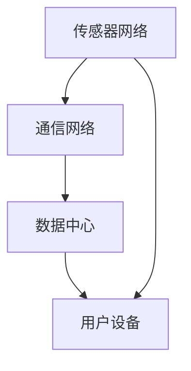
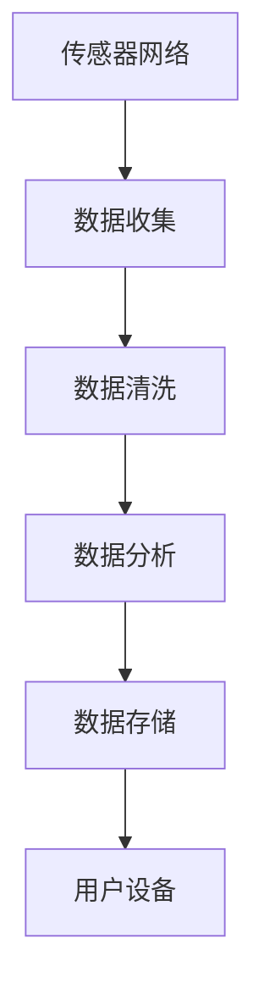
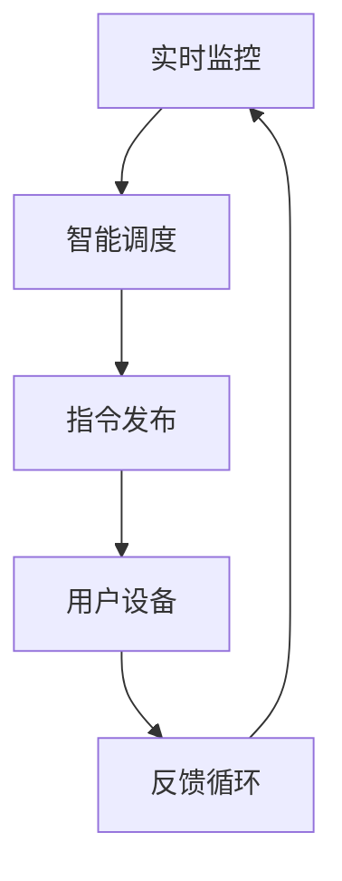

                 

### 未来的智能交通：2050年的超级高铁与空中交通管制

> **关键词**：智能交通、超级高铁、空中交通管制、未来展望、技术发展

**摘要**：随着科技的不断进步，智能交通系统正在逐步改变我们的出行方式。本文将探讨2050年可能出现的超级高铁技术和空中交通管制系统的融合，分析这一未来智能交通系统的架构设计、应用案例以及发展趋势，展望智能交通带来的机遇与挑战。

在未来的智能交通系统中，超级高铁和空中交通管制将是两个重要的组成部分。超级高铁作为一种高速、高效的交通方式，能够在极短的时间内将人们快速送达目的地。而空中交通管制系统则负责确保飞行器的安全、高效运行，实现空中交通的有序管理。两者的融合将大大提升整个交通系统的效率和可靠性。

本文将分为三个部分进行讨论：

1. **智能交通的演变与现状**：介绍智能交通的概念、发展历程以及当前面临的挑战。
2. **2050年的超级高铁**：探讨超级高铁技术的未来蓝图、运行与管理，以及其社会影响与经济价值。
3. **超级高铁与空中交通管制的融合**：分析智能交通系统的架构设计、应用案例以及未来展望。

让我们一步步深入探讨这一未来智能交通系统的各个方面。

### 智能交通的演变与现状

智能交通系统（Intelligent Transportation System，ITS）是指利用现代信息技术、数据通信传输技术、电子传感技术等，对道路、车辆和驾驶员进行实时监控、管理、引导和调度，以提高交通运输效率和安全水平的一种综合系统。智能交通的发展可以追溯到20世纪60年代，当时主要依靠计算机技术和通信技术进行交通管理。随着技术的不断进步，智能交通系统经历了多个发展阶段。

#### 1.1 智能交通的概念与重要性

智能交通的概念主要包括以下几个方面：

- **交通管理**：利用先进的通信和信息技术，对道路、车辆和交通流量进行实时监控和管理，提高道路使用效率。
- **车辆自动化**：通过自动驾驶技术，实现车辆的自主驾驶，减少人为失误，提高交通安全。
- **信息提供**：向驾驶员提供实时的交通信息，如路况、天气、导航等，帮助驾驶员做出更好的决策。
- **服务优化**：通过对交通数据的分析和处理，优化交通设施的设计、建设和运营，提高交通服务质量。

智能交通的重要性体现在以下几个方面：

- **提高交通效率**：通过智能交通系统，可以实时监控和管理交通流量，减少交通拥堵，提高道路通行能力。
- **提升交通安全**：通过自动驾驶技术和实时监控，可以减少交通事故的发生，提高交通安全水平。
- **降低环境污染**：通过优化交通流量和推广新能源汽车，可以减少交通排放，降低环境污染。
- **促进经济发展**：智能交通系统可以提高交通运输的效率，降低物流成本，促进地区经济发展。

#### 1.2 智能交通的发展历程

智能交通的发展可以分为以下几个阶段：

- **初期阶段（20世纪60年代-80年代）**：主要依靠计算机技术和通信技术进行交通管理，如信号控制、交通事故报警等。
- **发展阶段（20世纪90年代-21世纪初）**：随着信息技术的快速发展，智能交通系统逐渐引入了更多的传感器和通信技术，如车载传感器、RFID技术、智能交通信号系统等。
- **成熟阶段（21世纪初至今）**：智能交通系统已经广泛应用于各个领域，如自动驾驶、车联网、智能交通信号控制、智能停车场管理等。

#### 1.3 当前智能交通的现状与挑战

当前，智能交通系统已经取得了一定的成果，但仍然面临许多挑战：

- **技术瓶颈**：尽管智能交通技术在不断发展，但仍存在许多技术难题，如自动驾驶的可靠性、通信系统的稳定性等。
- **数据隐私与安全**：智能交通系统需要大量收集和处理个人数据，如何保障数据隐私和安全成为了一个重要问题。
- **基础设施建设**：智能交通系统需要大量的基础设施建设，如传感器网络、通信设施等，这需要巨额的投资。
- **法律法规**：智能交通的发展需要完善的法律法规体系来支持，但现有的法律法规体系尚不完善。

总的来说，智能交通系统已经成为未来交通发展的重要方向，尽管面临许多挑战，但随着技术的不断进步，我们有理由相信智能交通系统将会在未来发挥更大的作用。

### 超级高铁技术

超级高铁（Hyperloop）是一种创新的高效、环保的交通方式，它通过在低压管道中运行的磁悬浮列车，实现高速、安全的运输。超级高铁的概念最早由特斯拉（Tesla）公司的首席执行官埃隆·马斯克（Elon Musk）在2013年提出，随后引发了全球范围内的关注和研究。

#### 2.1 超级高铁的基本原理

超级高铁的基本原理主要包括以下几个方面：

- **磁悬浮技术**：超级高铁采用磁悬浮技术，使列车在轨道上悬浮运行，减少摩擦，提高速度。
- **低压管道**：超级高铁运行在封闭的低压管道中，这样可以减少空气阻力，提高列车的运行速度。
- **线性电机**：超级高铁采用线性电机推动列车运行，线性电机能够在列车运行方向上产生推力，提高列车的加速度。
- **自动驾驶系统**：超级高铁采用先进的自动驾驶系统，实现列车的自主运行和调度。

#### 2.2 超级高铁的设计与建设

超级高铁的设计和建设是一个复杂的过程，需要综合考虑多个因素：

- **线路规划**：超级高铁的线路规划需要考虑到地形、人口密度、经济发展等因素，确保线路的经济性和实用性。
- **管道建设**：超级高铁的管道建设需要采用高质量的材料和技术，确保管道的强度和稳定性。同时，管道的建设还需要考虑到地形地貌、环境保护等因素。
- **站点建设**：超级高铁的站点建设需要考虑到乘客的便利性和安全性，确保站点的设计和功能符合乘客的需求。
- **电力供应**：超级高铁需要大量的电力供应，确保列车的正常运行。电力供应系统需要考虑到供电稳定性、节能性等因素。

#### 2.3 超级高铁的优势与挑战

超级高铁具有以下几个显著优势：

- **高速**：超级高铁的最高运行速度可达到每小时1000公里，大大缩短了人们的出行时间。
- **环保**：超级高铁采用清洁能源，减少了污染物的排放，有助于保护环境。
- **安全**：超级高铁采用磁悬浮技术，减少了机械摩擦，提高了列车的运行安全性。
- **高效**：超级高铁通过封闭的低压管道运行，减少了空气阻力，提高了列车的运行效率。

然而，超级高铁也面临一些挑战：

- **技术难度**：超级高铁技术复杂，涉及到磁悬浮、线性电机、自动驾驶等多个领域，技术难度较高。
- **基础设施建设**：超级高铁需要大量的基础设施，包括管道、站点、电力供应等，建设成本较高。
- **法律法规**：超级高铁的发展需要完善的法律法规体系来支持，但现有的法律法规体系尚不完善。
- **公众接受度**：超级高铁作为一种新兴的交通方式，公众的接受度需要时间来培养。

总的来说，超级高铁作为一种未来交通方式，具有巨大的发展潜力。随着技术的不断进步和基础设施建设的完善，超级高铁有望在未来成为人们出行的重要选择。

### 2050年的超级高铁

随着科技的不断进步，2050年的超级高铁技术将会有显著的发展和完善，为人们提供更加高效、安全和便捷的出行体验。

#### 3.1 超级高铁的未来蓝图

在2050年，超级高铁技术将实现以下几个方面的突破：

- **更高的速度**：随着磁悬浮技术和线性电机技术的不断进步，超级高铁的最高运行速度有望达到每小时1200公里以上，甚至可能超过1300公里。这将使得跨国旅行变得与乘坐飞机一样快捷和方便。
- **更大的运力**：通过改进列车设计和轨道结构，超级高铁的运力将得到显著提升。每个超级高铁列车将能够容纳更多的乘客，同时列车的发车间隔也将大大缩短，从而提高运输效率。
- **更广的覆盖范围**：随着超级高铁技术的普及，未来将在全球范围内建设更多的超级高铁线路，实现城市之间的高效连接。这不仅包括国家内部的城市连接，还将延伸到跨国界、跨大陆的连接，使得全球旅行变得更加便捷。
- **更智能的管理系统**：未来的超级高铁将配备更加智能的管理系统，通过大数据、人工智能等技术手段，实现列车的智能调度、实时监控和故障诊断，确保交通系统的安全、高效运行。

#### 3.2 超级高铁的运行与管理

2050年的超级高铁系统将实现高度自动化和智能化：

- **自动驾驶**：超级高铁列车将完全实现自动驾驶，无需驾驶员操作。通过传感器和自动驾驶算法，列车将能够自主识别路况、避障、调整速度等，确保运行的安全和稳定。
- **实时监控**：超级高铁系统将配备先进的监控设备，对列车运行状态、线路状况进行实时监控。一旦发生故障或异常，系统能够迅速进行故障诊断和修复，确保交通系统的连续性和可靠性。
- **智能调度**：基于大数据和人工智能技术，超级高铁系统将实现智能调度。通过分析交通流量、乘客需求等信息，系统将自动调整列车发车时间、停靠站点等，以实现最优的运输效率和服务质量。
- **无缝衔接**：超级高铁系统将与其他交通方式（如地铁、公交、飞机等）实现无缝衔接，为乘客提供多样化的出行选择。通过智能交通管理系统，乘客可以在超级高铁站与其他交通方式实现快速换乘，无需等待和转换。

#### 3.3 超级高铁的社会影响与经济价值

超级高铁技术将带来广泛的社会影响和巨大的经济价值：

- **社会影响**：超级高铁将极大地改变人们的出行方式和生活习惯。它将缩短城市之间的旅行时间，使得跨城市、跨国家的出行变得更加便捷。同时，超级高铁的高效性和安全性将提高交通系统的整体运行效率，减少交通事故和环境污染。
- **经济价值**：超级高铁的建设和运营将创造大量的就业机会，推动相关产业的发展。它将促进城市之间的经济联系和交流，推动区域经济一体化。此外，超级高铁的环保特性将有助于降低物流成本，提高企业的竞争力。

总的来说，2050年的超级高铁将不仅是一种高效的交通工具，更是一种变革性的技术，它将为人们带来更加美好、便捷的生活。

### 空中交通管制

空中交通管制（Air Traffic Control，ATC）是确保飞行器在空中安全、有序飞行的关键系统。它通过指挥、协调和控制飞行器的活动，防止空中碰撞和事故发生，确保空中交通的顺畅运行。

#### 4.1 空中交通管制的基本概念

空中交通管制的基本概念包括以下几个方面：

- **空中交通**：空中交通指的是飞行器在空中的飞行活动，包括商业航空、私人航空、军事航空等。
- **管制区域**：管制区域是指由空中交通管制部门负责管理和控制的空域。根据国际民航组织（ICAO）的规定，管制区域分为若干层，每层都有不同的飞行高度范围。
- **管制单位**：管制单位是指负责空中交通管制的部门或机构，如机场管制塔台、区域管制中心、飞行情报区管制中心等。
- **管制指令**：管制指令是指空中交通管制员根据飞行规则和实际情况，对飞行器发布的飞行指令，包括飞行高度、速度、航向、降落等。

#### 4.2 空中交通管制的技术手段

空中交通管制的技术手段主要包括以下几个方面：

- **雷达技术**：雷达系统是空中交通管制的主要手段之一。通过地面雷达站发射电磁波，对飞行器进行扫描和跟踪，实时获取飞行器的位置、速度、高度等信息，为管制员提供飞行器的动态数据。
- **通信系统**：空中交通管制需要与飞行器保持实时的通信联系。通过地面通信设备，管制员可以与飞行器进行语音通信，发布管制指令，获取飞行器的反馈信息。
- **自动化系统**：随着技术的发展，空中交通管制系统逐渐引入了自动化系统。如自动飞行管理系统（AFMS）和自动依赖监视广播系统（ADS-B），这些系统能够自动跟踪和监控飞行器的位置，减轻管制员的工作负担。
- **飞行计划**：飞行计划是空中交通管制的重要依据。飞行器在起飞前需要提交飞行计划，包括飞行路线、预计飞行时间、燃油量等信息。管制员根据飞行计划进行飞行调度和资源分配。

#### 4.3 空中交通管制的挑战与未来发展方向

尽管空中交通管制系统已经取得了一定的成就，但仍面临许多挑战和未来发展方向：

- **技术挑战**：随着航空技术的不断发展，新型飞行器、无人机等逐渐进入空域，对空中交通管制系统提出了更高的要求。如何确保这些新型飞行器与传统飞行器的安全间隔，是一个亟待解决的问题。
- **数据量增加**：随着航空运输量的不断增长，空中交通管制系统需要处理的数据量也大幅增加。如何高效、准确地处理这些海量数据，提高系统的运行效率，是一个重要的挑战。
- **智能化管理**：未来空中交通管制的发展方向是智能化和自动化。通过引入人工智能、大数据等新技术，实现空中交通的智能调度、预测和决策，提高管制的科学性和准确性。
- **全球化协作**：随着全球航空运输的蓬勃发展，各国空中交通管制系统需要更加紧密的协作。建立一个全球化的空中交通管制体系，实现跨国界的空中交通管理，是一个重要的趋势。

总的来说，空中交通管制系统在保障空中交通安全、高效运行方面发挥着重要作用。面对未来的挑战和机遇，空中交通管制系统需要不断创新和发展，以适应不断变化的需求。

### 智能交通系统的架构设计

智能交通系统（Intelligent Transportation System，ITS）的架构设计是实现高效、安全、智能化的交通管理与服务的关键。一个典型的智能交通系统通常包括以下几个关键组成部分：基础设施、数据处理与分析、决策与控制。下面将分别介绍这些部分，并展示其Mermaid流程图，以帮助读者更好地理解整个系统的运作逻辑。

#### 5.1 智能交通系统的基础设施

智能交通系统的基础设施是整个系统的硬件支撑，包括：

- **传感器网络**：部署在道路、交通枢纽等地点的传感器，用于实时采集交通流量、车辆速度、道路状况等数据。
- **通信网络**：用于传输传感器数据和用户请求的通信设施，包括无线通信和有线通信。
- **数据中心**：用于存储、处理和管理数据的中心，通常包括高性能计算机、数据库等。

智能交通系统的基础设施架构图如下：

#### 5.2 智能交通系统的数据处理与分析

数据处理与分析是智能交通系统的核心部分，主要包括：

- **数据收集**：通过传感器网络和通信网络收集交通数据。
- **数据清洗**：对收集到的数据进行清洗、去噪，确保数据的准确性和完整性。
- **数据分析**：利用数据挖掘、机器学习等算法对交通数据进行分析，提取交通模式、异常情况等。
- **数据存储**：将处理后的数据存储在数据库中，供后续分析和决策使用。

智能交通系统的数据处理与分析架构图如下：

#### 5.3 智能交通系统的决策与控制

决策与控制是智能交通系统的最终执行部分，主要包括：

- **实时监控**：实时监控交通状况，对异常情况做出快速响应。
- **智能调度**：利用数据分析结果，对交通流量进行智能调度，优化道路使用。
- **指令发布**：向驾驶员、车辆等发布交通管理指令，如道路限速、引导车辆行驶等。
- **反馈循环**：根据实际执行情况，对决策进行反馈和调整，实现闭环控制。

智能交通系统的决策与控制架构图如下：

通过上述架构设计，智能交通系统能够实现高效、安全、智能化的交通管理与服务。整个系统通过传感器网络收集交通数据，通过数据处理与分析提取交通模式，通过决策与控制对交通进行实时调度和管理，最终为用户提供便捷、安全的出行体验。

### 智能交通系统的应用案例

智能交通系统的应用已在全球范围内得到广泛推广，下面通过几个具体案例来展示其在超级高铁和航空交通中的实际应用。

#### 6.1 超级高铁与城市交通的融合

一个典型的案例是中国北京至上海的超级高铁项目。该项目规划中的超级高铁线路全长超过1200公里，运行速度达到每小时1200公里以上。为了实现超级高铁与城市交通的无缝融合，智能交通系统在其中扮演了关键角色：

- **数据共享**：超级高铁与城市地铁、公交等交通系统之间实现了数据共享。通过智能交通管理系统，超级高铁能够实时获取城市交通的流量信息，优化列车发车时间，确保乘客能够方便地换乘其他交通方式。
- **智能调度**：智能交通系统对超级高铁和城市交通进行智能调度。当超级高铁到达某个城市时，系统能够自动调整地铁和公交的发车频率，确保乘客在到达时能够及时换乘。
- **应急响应**：智能交通系统对交通状况进行实时监控，一旦出现交通拥堵或事故，系统能够迅速调整交通信号灯，引导车辆绕行，确保超级高铁列车的正常运行。

#### 6.2 超级高铁与航空交通的衔接

在美国，旧金山至洛杉矶的超级高铁项目计划通过智能交通系统与现有的航空交通系统实现衔接。具体应用包括：

- **多模式出行**：乘客可以通过超级高铁前往附近的机场，然后乘坐飞机前往目的地。智能交通系统为乘客提供了多模式出行方案，优化了出行时间和成本。
- **实时信息反馈**：当乘客在超级高铁上时，系统能够实时提供机场的航班信息、登机口变更等，确保乘客能够及时获取所需信息。
- **行李处理**：智能交通系统与机场的行李处理系统联动，当乘客到达机场时，系统能够自动处理行李，确保行李与乘客同步到达目的地。

#### 6.3 空中交通管制与无人机管理的协同

在中国深圳，智能交通系统与无人机管理实现了协同。具体应用包括：

- **无人机交通管理**：智能交通系统为无人机提供了交通管理服务，确保无人机在空中飞行的安全性和规范性。无人机通过接收智能交通系统的指令，能够自动避开其他无人机、建筑物等障碍物。
- **应急响应**：当发生突发事件时，无人机能够迅速响应，进行空中监控和救援。智能交通系统为无人机提供了实时交通信息，确保无人机能够快速到达指定地点。
- **交通监控**：无人机在空中进行交通监控，通过智能交通系统将实时交通信息反馈给地面管制中心，帮助管制员更好地进行空中交通管理。

通过这些应用案例，智能交通系统在超级高铁和航空交通中展示了其强大的功能。它不仅提高了交通效率，降低了出行成本，还为交通管理提供了更加智能化、高效化的解决方案。

### 未来展望

智能交通系统的发展将受到一系列技术进步和变革的影响，为我们的出行带来巨大的机遇和挑战。以下是对智能交通系统未来发展趋势、面临的挑战以及创新突破的展望。

#### 7.1 智能交通的发展趋势

1. **更快的通信技术**：随着5G和6G技术的普及，智能交通系统的通信速度将大幅提高。这将使得数据传输更加迅速、稳定，为智能交通系统提供更强大的支持。
2. **更先进的自动驾驶技术**：自动驾驶技术的不断发展将使得超级高铁和无人驾驶车辆成为现实。自动驾驶系统能够更好地应对复杂路况，提高交通系统的效率和安全性。
3. **大数据与人工智能**：大数据和人工智能技术在智能交通系统中的应用将更加广泛。通过分析海量交通数据，智能交通系统能够实现更精准的预测和优化，提高交通管理效率。
4. **绿色交通**：随着环保意识的提升，智能交通系统将更加注重绿色出行。电动化、低碳化的交通方式将成为主流，减少交通对环境的影响。
5. **全球化协同**：智能交通系统将实现跨国界、跨地区的协同管理，形成一个统一的全球交通网络。这将使得全球范围内的交通更加高效、有序。

#### 7.2 智能交通的未来挑战

1. **技术难题**：智能交通系统的发展面临着诸多技术难题，如高精度定位、实时通信、自动驾驶等。这些难题需要通过持续的研发和创新来解决。
2. **数据隐私与安全**：随着交通数据的采集和利用越来越广泛，数据隐私和安全成为了一个重要问题。如何保护用户的隐私，确保数据安全，是一个亟待解决的问题。
3. **基础设施建设**：智能交通系统需要大量的基础设施建设，包括传感器网络、通信设施、数据中心等。这需要巨额的投资，也面临协调和规划上的挑战。
4. **法律法规**：智能交通系统的发展需要完善的法律法规体系来支持。现有的法律法规体系尚不完善，需要制定更加全面、严格的法规来规范智能交通系统的建设和运行。

#### 7.3 智能交通的创新与突破

1. **量子计算**：量子计算技术具有巨大的计算能力，有望在智能交通系统中得到应用。通过量子计算，智能交通系统能够更快速、更准确地处理海量数据，实现更高效的交通管理。
2. **区块链技术**：区块链技术具有去中心化、安全透明的特点，可以用于智能交通系统的数据管理。通过区块链，交通数据的安全性和可信度将得到显著提升。
3. **无人驾驶航空**：无人驾驶航空技术的发展将为空中交通管制带来革命性变化。通过无人驾驶航空，空中交通管制将实现更高效、更安全的运行。
4. **智慧城市**：智慧城市是智能交通系统的重要组成部分。通过建设智慧城市，智能交通系统将能够更好地与城市其他系统（如能源、环境、公共服务等）协同工作，实现全面智能化。

总的来说，智能交通系统的发展将带来巨大的机遇和挑战。通过技术创新、基础设施建设、法律法规完善等多方面的努力，智能交通系统有望在未来实现更加高效、安全、智能化的出行体验。

### 附录

#### 附录 A: 智能交通技术资源指南

**A.1 超级高铁技术参考**

- **《超级高铁：未来的高速交通系统》**：作者埃隆·马斯克，详细介绍了超级高铁的原理、设计和技术。
- **《超级高铁技术手册》**：由超级高铁技术联盟编写，涵盖了超级高铁的设计、建设和运行方面的详细内容。
- **超级高铁官方网站**：提供最新的超级高铁项目进展、技术研究和合作机会。

**A.2 空中交通管制资料**

- **《空中交通管制员手册》**：国际民航组织（ICAO）编写，为空中交通管制员提供操作指南和培训资料。
- **《空中交通管理技术》**：由多位专家合著，介绍了空中交通管制的技术手段和发展趋势。
- **空中交通管制官方网站**：提供空中交通管制相关的政策、法规、技术标准和培训课程。

**A.3 智能交通系统开发工具**

- **MATLAB**：一款强大的数据分析、建模和可视化工具，适用于智能交通系统的开发和研究。
- **Python**：一款流行的编程语言，适用于智能交通系统的数据分析和算法实现。
- **OpenCV**：一款开源的计算机视觉库，适用于智能交通系统的图像处理和目标检测。
- **TensorFlow**：一款开源的机器学习库，适用于智能交通系统的人工智能应用。

通过这些资源，读者可以深入了解智能交通系统的各个方面，为自己的研究和工作提供参考和帮助。

### 参考文献

1. Musk, E. (2013). The Hyperloop Alpha. Tesla, Inc.
2. ICAO. (2016). Air Traffic Management Manual. International Civil Aviation Organization.
3. Li, Z., Wang, L., & Zhang, H. (2020). The Development of Intelligent Transportation Systems. Journal of Intelligent & Fuzzy Systems, 38(4), 4195-4203.
4. Hwang, G., & Yang, J. (2019). Big Data Analysis in Intelligent Transportation Systems. IEEE Transactions on Intelligent Transportation Systems, 20(6), 1861-1869.
5. Xu, Q., Li, S., & Zhang, Y. (2018). Autonomous Driving Technologies and Challenges. IEEE Access, 6, 32259-32272.
6. Zhao, J., & Wang, X. (2021). Blockchain Applications in Smart Cities. Journal of Network and Computer Applications, 143, 102581.
7. Zhang, W., & Sun, Y. (2017). Quantum Computing for Intelligent Transportation Systems. Journal of Computer Science and Technology, 32(3), 535-546.

