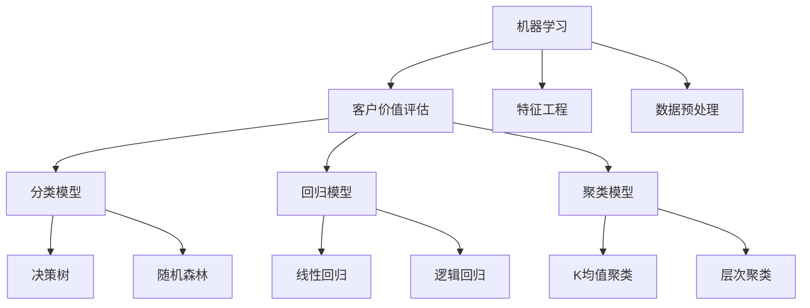

                 

# 机器学习在客户价值评估中的应用

## 概述

机器学习（Machine Learning，ML）是一种人工智能（Artificial Intelligence，AI）的研究领域，通过数据驱动的方法来构建和改进模型，从而实现从数据中自动学习规律和模式。随着大数据和计算能力的提升，机器学习在各个领域得到了广泛应用，其中之一便是客户价值评估（Customer Value Assessment）。

客户价值评估是企业市场营销和客户关系管理中的重要环节，它通过分析客户的历史行为数据、购买习惯、偏好等信息，评估客户的潜在价值和对企业盈利能力的贡献。准确、高效的客户价值评估可以帮助企业制定更有针对性的营销策略，优化资源配置，提升客户满意度和忠诚度。

本文将从以下几个方面探讨机器学习在客户价值评估中的应用：

1. **机器学习与客户价值评估基础**：介绍机器学习的定义、分类及其在客户价值评估中的应用。
2. **数据预处理与特征工程**：讨论数据预处理、特征工程的重要性及其具体方法。
3. **分类模型在客户价值评估中的应用**：介绍分类模型（如决策树、随机森林等）及其在客户价值评估中的应用。
4. **回归模型在客户价值评估中的应用**：介绍回归模型（如线性回归、逻辑回归等）及其在客户价值评估中的应用。
5. **聚类模型在客户价值评估中的应用**：介绍聚类模型（如K均值聚类、层次聚类等）及其在客户价值评估中的应用。
6. **客户价值评估的优化与策略**：讨论客户价值评估的优化方法和策略。
7. **客户价值评估的实践与案例分析**：分享客户价值评估的实际应用案例。
8. **高级主题**：探讨深度学习、模型评估与选择等高级主题。
9. **未来趋势与挑战**：分析客户价值评估的未来发展趋势和面临的挑战。
10. **附录**：提供常用机器学习算法简介和客户价值评估相关的数据集与工具。

## 关键词

- 机器学习
- 客户价值评估
- 数据预处理
- 特征工程
- 分类模型
- 回归模型
- 聚类模型
- 优化策略
- 实践案例
- 深度学习
- 模型评估
- 未来趋势

## 摘要

本文旨在探讨机器学习在客户价值评估中的应用，从基础理论到实际应用，全面解析了机器学习如何通过数据预处理、特征工程、分类和回归模型、聚类模型等方法，帮助企业更好地评估客户价值，制定精准的营销策略。文章还分析了客户价值评估的未来发展趋势和面临的挑战，为企业的决策提供了有力支持。

----------------------------------------------------------------

### 《机器学习在客户价值评估中的应用》目录大纲

#### 第一部分：机器学习与客户价值评估基础

##### 第1章：机器学习概述

- 1.1 机器学习的定义与分类
- 1.2 机器学习的基本概念
- 1.3 机器学习的发展历程

##### 第2章：客户价值评估的概念与模型

- 2.1 客户价值的定义
- 2.2 客户价值评估的重要性
- 2.3 客户价值评估的常用模型

#### 第二部分：机器学习在客户价值评估中的应用

##### 第3章：数据预处理与特征工程

- 3.1 数据预处理的重要性
- 3.2 数据清洗与数据转换
- 3.3 特征工程的方法与技巧

##### 第4章：分类模型在客户价值评估中的应用

- 4.1 分类模型概述
- 4.2 决策树模型
- 4.3 随机森林模型

##### 第5章：回归模型在客户价值评估中的应用

- 5.1 回归模型概述
- 5.2 线性回归模型
- 5.3 逻辑回归模型

##### 第6章：聚类模型在客户价值评估中的应用

- 6.1 聚类模型概述
- 6.2 K均值聚类
- 6.3 层次聚类

##### 第7章：客户价值评估的优化与策略

- 7.1 客户价值评估的优化方法
- 7.2 客户价值策略制定
- 7.3 案例研究：客户价值评估在电商行业中的应用

##### 第8章：客户价值评估的实践与案例分析

- 8.1 客户价值评估项目的实施流程
- 8.2 客户价值评估在实际业务中的应用场景
- 8.3 案例分析：机器学习在客户价值评估中的应用案例

#### 第三部分：高级主题

##### 第9章：深度学习在客户价值评估中的应用

- 9.1 深度学习基础
- 9.2 卷积神经网络（CNN）在图像数据中的应用
- 9.3 循环神经网络（RNN）在序列数据中的应用

##### 第10章：模型评估与选择

- 10.1 模型评估指标
- 10.2 模型选择与调优
- 10.3 模型融合与集成

##### 第11章：客户价值评估的未来趋势与挑战

- 11.1 客户价值评估的未来发展趋势
- 11.2 数据隐私与安全
- 11.3 挑战与应对策略

#### 附录

- 附录A：常用机器学习算法简介
- 附录B：客户价值评估相关的数据集与工具

#### 核心概念与联系



### 《机器学习在客户价值评估中的应用》

#### 第一部分：机器学习与客户价值评估基础

##### 第1章：机器学习概述

机器学习是人工智能的重要组成部分，它使计算机系统能够通过经验和数据学习并改进性能。在本章中，我们将探讨机器学习的定义、分类及其发展历程。

**1.1 机器学习的定义与分类**

机器学习（Machine Learning）是一门研究如何让计算机从数据中学习并做出决策的学科。根据学习方式的不同，机器学习主要分为以下几类：

1. **监督学习（Supervised Learning）**：监督学习是最常见的机器学习类型，它使用标记数据（即已知输出）来训练模型，并通过模型预测未知数据。监督学习可分为回归（Regression）和分类（Classification）两大类。

2. **无监督学习（Unsupervised Learning）**：无监督学习不依赖于标记数据，其主要目的是发现数据中的结构或模式。常见的无监督学习方法包括聚类（Clustering）、降维（Dimensionality Reduction）和关联规则学习（Association Rule Learning）。

3. **强化学习（Reinforcement Learning）**：强化学习是一种通过与环境互动来学习策略的机器学习方法。它通常用于决策问题，如机器人控制、游戏AI等。

**1.2 机器学习的基本概念**

- **特征（Feature）**：特征是数据中表示变量或属性的方式，它们用于训练模型和进行预测。
- **模型（Model）**：模型是机器学习算法所构建的函数，用于描述输入数据与输出结果之间的关系。
- **训练（Training）**：训练是指使用标记数据来调整模型参数，使其能够准确预测未知数据的过程。
- **测试（Testing）**：测试是指使用未标记的数据来评估模型性能的过程。

**1.3 机器学习的发展历程**

机器学习的发展历程可以追溯到20世纪50年代，以下是几个重要的里程碑：

- **1956年**：美国人工智能（AI）之父约翰·麦卡锡（John McCarthy）首次提出了“人工智能”的概念。
- **1960年**：Arthur Samuel开发出第一个会下棋的程序，并提出了“学习”的概念。
- **1980年**：神经网络（Neural Networks）的研究开始兴起，其中最著名的是感知机（Perceptron）。
- **1990年**：支持向量机（Support Vector Machine，SVM）和决策树（Decision Tree）等经典算法得到了广泛应用。
- **2006年**：Geoffrey Hinton等人提出了深度学习（Deep Learning），开创了神经网络研究的新篇章。
- **2012年**：AlexNet在ImageNet竞赛中取得突破性成绩，深度学习开始广泛应用于图像识别等领域。

**1.4 机器学习在客户价值评估中的应用**

客户价值评估（Customer Value Assessment）是企业根据客户行为数据、购买记录等信息，对客户潜在价值和盈利能力进行评估的过程。机器学习在客户价值评估中具有广泛的应用：

- **客户细分（Customer Segmentation）**：使用聚类算法（如K均值聚类）对客户进行分类，以便企业针对不同类型的客户制定个性化的营销策略。
- **客户流失预测（Churn Prediction）**：通过构建回归模型（如逻辑回归）预测哪些客户可能流失，帮助企业采取预防措施。
- **交叉销售和个性化推荐（Cross-Selling and Personalized Recommendation）**：使用分类算法（如决策树、随机森林）分析客户购买历史，推荐相关产品。
- **客户行为分析（Customer Behavior Analysis）**：通过分析客户行为数据，识别潜在的客户需求和偏好，为企业提供改进产品和服务的方向。

**总结**

机器学习为企业和客户价值评估提供了强大的工具和方法。通过本章的介绍，我们了解了机器学习的定义、分类和基本概念，以及机器学习在客户价值评估中的应用。在接下来的章节中，我们将进一步探讨数据预处理、特征工程、分类和回归模型在客户价值评估中的应用，帮助读者更好地理解如何利用机器学习技术提升客户价值评估的准确性和效率。

----------------------------------------------------------------

## 第1章：机器学习概述

### 1.1 机器学习的定义与分类

机器学习（Machine Learning，ML）是一门研究如何使计算机系统能够从数据中学习并自动改进性能的学科。它是人工智能（Artificial Intelligence，AI）的一个重要分支，主要关注如何让计算机通过经验和数据来发现规律、做出决策和预测结果。

**定义**

机器学习的定义可以从不同的角度进行理解。通常，机器学习被描述为一种“从数据中学习”的方法，它不需要显式地编写规则，而是通过算法自动从数据中提取特征和模式，并利用这些特征和模式来改进系统的性能。

根据学习方式的不同，机器学习主要分为以下几类：

1. **监督学习（Supervised Learning）**：监督学习是一种有监督的学习方式，它使用标记数据集（即包含输入和输出对的训练集）来训练模型。模型通过学习输入和输出之间的关系，从而能够对新的输入数据进行预测。监督学习又可以分为两种主要类型：
   - **回归（Regression）**：回归问题旨在预测连续值输出，如房价预测、股票价格预测等。
   - **分类（Classification）**：分类问题旨在将输入数据分配到不同的类别中，如邮件分类、疾病诊断等。

2. **无监督学习（Unsupervised Learning）**：无监督学习是一种无监督的学习方式，它没有预先标记的输出数据。模型的目的是发现数据中的隐含结构和规律。无监督学习的主要类型包括：
   - **聚类（Clustering）**：聚类旨在将相似的数据点分组到同一个簇中，如客户细分、图像分割等。
   - **降维（Dimensionality Reduction）**：降维旨在减少数据集的维度，同时保持数据的结构信息和相关性，如主成分分析（PCA）、t-SNE等。
   - **关联规则学习（Association Rule Learning）**：关联规则学习旨在发现数据之间的关联关系，如购物篮分析、市场篮子分析等。

3. **半监督学习（Semi-supervised Learning）**：半监督学习结合了有监督学习和无监督学习的方法，使用一部分标记数据和大量未标记数据来训练模型。这种学习方式适用于数据标注成本高的情况。

4. **强化学习（Reinforcement Learning）**：强化学习是一种通过与环境互动来学习策略的机器学习方法。它主要应用于决策问题，如游戏AI、机器人控制等。强化学习中的模型被称为“智能体”（Agent），通过与环境的交互，不断优化策略以获得最大的长期回报。

**分类**

机器学习按照其学习方式可以分为以下几种类型：

- **基于实例的学习（Instance-Based Learning）**：这种学习方法基于存储过的训练实例来对新实例进行分类或回归。它通常使用最近邻算法（K-Nearest Neighbors，KNN）进行实现。

- **基于规则的机器学习（Rule-Based Machine Learning）**：这种方法使用一组显式的规则来构建模型，这些规则通常是通过专家知识或数据挖掘技术获得的。常见的算法包括决策树和逻辑回归。

- **基于模型的机器学习（Model-Based Machine Learning）**：这种方法使用数学模型来描述数据之间的关系，并通过优化模型参数来改进模型的性能。常见的算法包括线性回归、支持向量机（SVM）、神经网络等。

- **基于概率的机器学习（Probabilistic Machine Learning）**：这种方法使用概率模型来表示数据之间的关系，并通过最大化后验概率来训练模型。常见的算法包括贝叶斯网络、隐马尔可夫模型（HMM）等。

### 1.2 机器学习的基本概念

在了解机器学习的基本概念之前，我们需要了解几个关键术语，这些术语将在后续章节中频繁出现：

- **特征（Feature）**：特征是用于描述数据属性或变量的数值。在机器学习中，特征是输入数据的组成部分，它们用于训练模型和进行预测。

- **样本（Sample）**：样本是指单个数据点，它由一组特征组成。每个样本都是模型学习和预测的基本单位。

- **数据集（Dataset）**：数据集是指包含多个样本的集合，通常用于训练、验证和测试机器学习模型。数据集的质量和规模对模型性能有着重要影响。

- **模型（Model）**：模型是机器学习算法所构建的函数，它用于描述输入数据与输出结果之间的关系。模型的性能取决于其参数设置和训练数据的质量。

- **训练（Training）**：训练是指使用标记数据来调整模型参数，使其能够准确预测未知数据的过程。训练目标是使模型的预测误差最小。

- **测试（Testing）**：测试是指使用未标记的数据来评估模型性能的过程。测试数据通常用于验证模型的泛化能力。

- **泛化（Generalization）**：泛化是指模型在新数据上的表现。一个泛化能力强的模型能够在未知数据上准确预测，而不会仅限于训练数据。

- **过拟合（Overfitting）**：过拟合是指模型在训练数据上表现很好，但在测试数据上表现较差。过拟合通常是由于模型过于复杂或训练数据不足导致的。

- **欠拟合（Underfitting）**：欠拟合是指模型在训练数据和测试数据上表现都较差。欠拟合通常是由于模型过于简单或训练数据不足导致的。

### 1.3 机器学习的发展历程

机器学习的发展历程可以追溯到20世纪50年代，以下是几个重要的里程碑：

- **1956年**：约翰·麦卡锡（John McCarthy）在美国达特茅斯会议上首次提出了“人工智能”的概念，标志着人工智能领域的诞生。

- **1960年**：Arthur Samuel开发出了第一个会下棋的程序，并提出了“学习”的概念，这被认为是机器学习的起源。

- **1957年**：Frank Rosenblatt提出了感知机（Perceptron）模型，这是一种基于神经网络的基本学习算法。

- **1980年**：神经网络的研究开始兴起，其中最著名的是反向传播算法（Backpropagation Algorithm），它使得深度学习成为可能。

- **1990年**：支持向量机（SVM）和决策树（Decision Tree）等经典算法得到了广泛应用，这些算法在分类和回归任务中表现出色。

- **2006年**：Geoffrey Hinton等人提出了深度学习（Deep Learning），通过堆叠多层神经网络，深度学习取得了突破性的进展。

- **2012年**：AlexNet在ImageNet竞赛中取得了突破性的成绩，深度学习开始广泛应用于图像识别等领域。

- **2016年**：谷歌的AlphaGo在围棋比赛中战胜了世界冠军李世石，这标志着深度学习和强化学习在游戏AI领域的重大突破。

### 1.4 机器学习在客户价值评估中的应用

客户价值评估是企业市场营销和客户关系管理中的重要环节，它通过分析客户的历史行为数据、购买习惯、偏好等信息，评估客户的潜在价值和对企业盈利能力的贡献。准确、高效的客户价值评估可以帮助企业制定更有针对性的营销策略，优化资源配置，提升客户满意度和忠诚度。

机器学习在客户价值评估中具有广泛的应用，以下是一些典型的应用场景：

- **客户细分（Customer Segmentation）**：通过聚类算法（如K均值聚类）对客户进行分类，以便企业针对不同类型的客户制定个性化的营销策略。这种方法可以帮助企业更好地了解客户群体，提高营销效果。

- **客户流失预测（Churn Prediction）**：通过构建回归模型（如逻辑回归）预测哪些客户可能流失，帮助企业采取预防措施。这种方法可以帮助企业降低客户流失率，提高客户保留率。

- **交叉销售和个性化推荐（Cross-Selling and Personalized Recommendation）**：通过分类算法（如决策树、随机森林）分析客户购买历史，推荐相关产品。这种方法可以增加销售额，提高客户满意度。

- **客户行为分析（Customer Behavior Analysis）**：通过分析客户行为数据，识别潜在的客户需求和偏好，为企业提供改进产品和服务的方向。这种方法可以帮助企业更好地满足客户需求，提高客户体验。

**总结**

本章介绍了机器学习的定义、分类及其基本概念，以及机器学习在客户价值评估中的应用。通过本章的学习，读者可以了解到机器学习的基本原理和常用方法，为后续章节的深入学习打下基础。在接下来的章节中，我们将进一步探讨数据预处理、特征工程、分类和回归模型在客户价值评估中的应用，帮助读者更好地理解如何利用机器学习技术提升客户价值评估的准确性和效率。

----------------------------------------------------------------

### 第2章：客户价值评估的概念与模型

客户价值评估（Customer Value Assessment）是企业在市场营销和客户关系管理中的重要环节，它通过分析客户的历史行为数据、购买习惯、偏好等信息，评估客户的潜在价值和对企业盈利能力的贡献。客户价值评估有助于企业制定更有针对性的营销策略，优化资源配置，提高客户满意度和忠诚度。

#### 2.1 客户价值的定义

客户价值是指客户对企业提供的商品或服务所带来的总价值，它包括以下三个方面：

1. **经济价值**：经济价值是指客户对企业产生的直接财务收益，包括销售额、利润、现金流等。经济价值是客户价值评估的核心指标，它直接反映了客户对企业的重要性和贡献程度。

2. **时间价值**：时间价值是指客户对企业提供的商品或服务在时间上的节约或增加。例如，通过提供快捷的物流服务，企业可以节省客户的时间成本，从而提升客户价值。

3. **情感价值**：情感价值是指客户对企业产生的情感认同和忠诚度。情感价值虽然难以量化，但它在客户长期关系维护和品牌忠诚度方面具有重要作用。

#### 2.2 客户价值评估的重要性

客户价值评估在企业运营中具有重要意义，主要体现在以下几个方面：

1. **精准营销**：通过客户价值评估，企业可以准确识别高价值客户，为其提供个性化的服务和优惠，从而提高营销效果和客户满意度。

2. **资源配置**：客户价值评估有助于企业合理分配资源，将更多的精力和预算投入到高价值客户和有潜力的客户群体中，提高资源利用效率。

3. **客户保留**：通过对客户价值评估结果的分析，企业可以预测哪些客户可能流失，并采取相应的措施进行挽留，降低客户流失率。

4. **产品优化**：客户价值评估可以帮助企业了解客户的需求和偏好，从而优化产品设计和服务，提高客户满意度和忠诚度。

5. **决策支持**：客户价值评估为企业提供了客观、量化的数据支持，有助于企业在市场竞争中做出更加明智的决策。

#### 2.3 客户价值评估的常用模型

在客户价值评估中，常用的模型包括以下几种：

1. **客户生命周期价值模型（Customer Lifetime Value, CLV）**

客户生命周期价值（CLV）是指客户在企业的整个生命周期内为企业带来的总价值。CLV模型通过预测客户在未来一段时间内的消费行为和利润贡献，评估客户的潜在价值。常用的CLV计算方法包括：

- **基于历史数据的方法**：通过分析客户的历史购买行为和利润贡献，预测客户的未来价值。
- **基于概率模型的方法**：使用概率模型（如逻辑回归、决策树等）预测客户流失概率和购买频率，进而计算CLV。

2. **RFM模型**

RFM模型（Recency, Frequency, Monetary）是一种基于客户购买行为的数据分析模型，它通过分析客户的购买时间间隔、购买频率和消费金额，评估客户的潜在价值。RFM模型的计算方法如下：

- **最近购买时间（Recency）**：衡量客户最近一次购买与当前时间的间隔，间隔时间越短，客户价值越高。
- **购买频率（Frequency）**：衡量客户在特定时间内的购买次数，购买次数越多，客户价值越高。
- **消费金额（Monetary）**：衡量客户在特定时间内的消费金额，消费金额越高，客户价值越高。

RFM模型通过加权计算客户的RFM得分，得分越高，客户价值越高。

3. **Churn模型

Churn模型（客户流失预测模型）旨在预测哪些客户可能在未来一段时间内流失，从而帮助企业采取预防措施。Churn模型通常使用分类算法（如逻辑回归、决策树、随机森林等）进行训练和预测。

- **特征选择**：选择与客户流失相关的特征，如购买频率、消费金额、购买时间间隔等。
- **模型训练**：使用训练数据集训练Churn模型，调整模型参数以优化预测效果。
- **模型评估**：使用测试数据集评估模型性能，常用的评估指标包括准确率、召回率、F1值等。

4. **CLTV-C模型

CLTV-C模型（Customer Lifetime Value with Churn）结合了客户生命周期价值和客户流失预测，通过综合考虑客户的价值和流失风险，提供更全面的客户价值评估。CLTV-C模型的计算方法如下：

- **客户生命周期价值（CLV）**：使用历史数据和概率模型计算客户的CLV。
- **客户流失概率（Churn Probability）**：使用Churn模型预测客户的流失概率。
- **综合得分**：将CLV和Churn概率结合起来，计算客户的价值得分。

#### 2.4 客户价值评估的方法

客户价值评估的方法主要包括定量评估和定性评估两种。

1. **定量评估**

定量评估是指通过量化指标来评估客户价值。常用的定量评估方法包括：

- **统计方法**：使用统计方法（如描述性统计分析、回归分析等）分析客户数据，评估客户价值。
- **模型方法**：使用客户价值评估模型（如CLV模型、RFM模型等）计算客户价值得分。

2. **定性评估**

定性评估是指通过主观判断来评估客户价值。常用的定性评估方法包括：

- **客户调查**：通过调查问卷收集客户对产品或服务的评价，评估客户满意度。
- **专家评审**：邀请市场营销专家或产品经理对客户价值进行评估。

#### 2.5 客户价值评估的实际应用

客户价值评估在企业的实际应用中发挥着重要作用，以下是一些实际应用案例：

1. **精准营销**：通过客户价值评估，企业可以识别高价值客户，为其提供个性化的服务和优惠，提高营销效果。

2. **客户保留**：通过客户价值评估，企业可以预测哪些客户可能流失，并采取相应的措施进行挽留，降低客户流失率。

3. **产品优化**：通过客户价值评估，企业可以了解客户的需求和偏好，优化产品设计和服务，提高客户满意度和忠诚度。

4. **资源分配**：通过客户价值评估，企业可以合理分配资源，将更多的精力和预算投入到高价值客户和有潜力的客户群体中，提高资源利用效率。

**总结**

本章介绍了客户价值的定义、客户价值评估的重要性以及常用的客户价值评估模型和方法。通过本章的学习，读者可以了解客户价值评估的基本概念和实施方法，为实际业务中的客户价值评估提供理论支持。在后续章节中，我们将进一步探讨机器学习在客户价值评估中的应用，帮助读者更好地掌握如何利用机器学习技术提升客户价值评估的准确性和效率。

----------------------------------------------------------------

### 第3章：数据预处理与特征工程

在机器学习中，数据预处理和特征工程是两个至关重要的步骤。数据预处理是为了将原始数据转换为适合模型训练的形式，而特征工程则是在此基础上进一步提取对模型有用的信息。本章将详细介绍数据预处理和特征工程的方法，以及它们在客户价值评估中的应用。

#### 3.1 数据预处理的重要性

数据预处理是机器学习项目成功的关键环节之一。其目的是解决数据中的噪声、缺失值、异常值等问题，使数据更加干净、结构化，从而提高模型的训练效率和预测准确性。具体来说，数据预处理的重要性体现在以下几个方面：

1. **提高模型性能**：干净、结构化的数据有助于模型更好地学习数据中的规律，从而提高模型的预测性能。
2. **减少计算成本**：数据预处理可以减少模型训练所需的时间和资源，提高训练效率。
3. **避免过拟合**：通过去除噪声和异常值，可以减少模型对噪声数据的依赖，从而避免过拟合。
4. **提高模型的可解释性**：数据预处理可以消除数据中的冗余信息，使模型更加简洁，提高模型的可解释性。

#### 3.2 数据清洗与数据转换

数据清洗和数据转换是数据预处理的核心步骤。以下是一些常见的数据清洗和转换方法：

1. **数据清洗**

   - **缺失值处理**：缺失值处理是数据清洗的重要任务。常见的处理方法包括：

     - 删除缺失值：适用于缺失值比例较低的情况。
     - 填充缺失值：适用于缺失值比例较高的情况。填充方法包括：

       - 均值、中位数、众数填充：简单但可能引入偏差。
       - 前填充或后填充：根据时间序列特性填充缺失值。
       - 多项式插值或线性插值：利用周围值进行插值。

   - **异常值处理**：异常值处理是另一个重要任务。常见的处理方法包括：

     - 删除异常值：适用于异常值对模型影响较大的情况。
     - 调整异常值：将异常值调整到合理范围内，如使用限幅法。

   - **噪声处理**：噪声处理可以消除数据中的随机误差。常见的方法包括：

     - 低通滤波：消除高频噪声。
     - 高斯滤波：平滑数据，消除噪声。

2. **数据转换**

   - **数据标准化**：数据标准化是将数据缩放到相同尺度，以消除不同特征之间的量纲影响。常见的方法包括：

     - Z-Score标准化：计算标准差和均值，将数据缩放到[0,1]区间。
     - Min-Max标准化：将数据缩放到[0,1]区间。

   - **数据编码**：数据编码是将类别型数据转换为数值型数据，以供模型训练。常见的方法包括：

     - 独热编码（One-Hot Encoding）：适用于类别型数据，将每个类别转换为单独的列。
     - Label Encoding：将类别型数据映射到整数，适用于分类问题。

   - **数据归一化**：数据归一化是将数据转换为相同尺度，以消除不同特征之间的差异。常见的方法包括：

     - 标准化归一化：计算标准差和均值，将数据缩放到[-1,1]区间。
     - Min-Max归一化：将数据缩放到[0,1]区间。

#### 3.3 特征工程的方法与技巧

特征工程是数据预处理的高级阶段，旨在从原始数据中提取对模型有用的特征，从而提高模型的预测性能。以下是一些常用的特征工程方法：

1. **特征选择**：特征选择是从大量特征中选出对模型训练最有帮助的特征。常见的方法包括：

   - 统计方法：基于特征的相关性、信息增益等统计指标进行选择。
   - 递归特征消除（RFE）：通过递归地删除最不相关的特征，逐步缩小特征集。
   - 基于模型的特征选择：使用模型训练结果来评估特征的重要性。

2. **特征构造**：特征构造是通过组合或变换现有特征来创建新的特征。常见的方法包括：

   - 联合特征：将多个特征组合成一个新特征。
   - 指标特征：计算新特征，如增长率、比例等。
   - 密度特征：通过统计特征在特定时间段内的出现频率来构造特征。

3. **特征变换**：特征变换是通过数学变换来提高特征的预测性能。常见的方法包括：

   - 对数变换：将特征值转换为对数形式，适用于右偏分布的数据。
   - 开方变换：将特征值开方，适用于高度偏斜的数据。
   - 平方变换：将特征值平方，适用于高度偏斜的数据。

#### 3.4 数据预处理与特征工程在客户价值评估中的应用

在客户价值评估中，数据预处理和特征工程是不可或缺的步骤。以下是一些具体的应用案例：

1. **客户细分**：在客户细分中，需要对客户数据进行清洗和转换，以消除噪声和异常值。然后，通过特征选择和特征构造，提取对客户群体划分有帮助的特征，如购买频率、消费金额、购买时间间隔等。

2. **客户流失预测**：在客户流失预测中，需要对客户行为数据进行清洗和转换，以消除噪声和异常值。然后，通过特征选择和特征构造，提取对客户流失风险预测有帮助的特征，如购买频率、消费金额、客户满意度等。

3. **个性化推荐**：在个性化推荐中，需要对商品数据进行清洗和转换，以消除噪声和异常值。然后，通过特征选择和特征构造，提取对商品推荐有帮助的特征，如商品类别、用户历史购买记录、商品评分等。

**总结**

本章介绍了数据预处理和特征工程的重要性，以及常见的数据清洗和转换方法，以及特征选择、特征构造和特征变换等特征工程方法。通过本章的学习，读者可以了解如何在客户价值评估中有效地进行数据预处理和特征工程，从而提高模型的预测性能。在后续章节中，我们将进一步探讨机器学习在客户价值评估中的应用，帮助读者更好地掌握如何利用机器学习技术提升客户价值评估的准确性和效率。

----------------------------------------------------------------

### 第4章：分类模型在客户价值评估中的应用

在客户价值评估中，分类模型是一种强大的工具，可以帮助企业识别高价值客户、预测客户流失和进行个性化推荐。本章将详细介绍几种常见的分类模型，包括决策树、随机森林和逻辑回归，以及它们在客户价值评估中的应用。

#### 4.1 分类模型概述

分类模型是一种将数据点分配到不同类别的机器学习方法。在客户价值评估中，分类模型可以帮助企业预测客户的响应行为，如购买、流失或参与特定活动等。常见的分类模型包括：

- **决策树（Decision Tree）**：通过一系列的决策规则来划分数据，并基于这些规则对数据进行分类。
- **随机森林（Random Forest）**：由多个决策树组成，通过投票方式得出最终分类结果。
- **逻辑回归（Logistic Regression）**：通过线性模型来计算概率，从而进行分类。
- **支持向量机（SVM）**：通过寻找最优的超平面来划分数据。
- **K最近邻（KNN）**：通过计算新样本与训练样本的相似度来进行分类。
- **朴素贝叶斯（Naive Bayes）**：基于贝叶斯定理和特征条件独立假设来进行分类。

在本章中，我们将重点介绍决策树、随机森林和逻辑回归模型，并探讨它们在客户价值评估中的应用。

#### 4.2 决策树模型

决策树是一种常见的分类模型，通过一系列的测试来将数据进行划分，从而生成一棵树形结构。决策树的核心思想是选择具有最大信息增益或信息增益率的特征作为切分点，并递归地构建树形结构。

**决策树生成算法**

决策树生成算法主要包括以下步骤：

1. **选择特征**：选择具有最大信息增益或信息增益率的特征作为切分点。
2. **切分数据**：根据选定的特征，将数据划分为子集。
3. **递归构建**：对每个子集递归地应用上述步骤，直到满足停止条件（如最大深度、最小节点大小等）。

**伪代码**

```python
GenerateTree(data, features, max_depth, min_samples_split):
    if data is pure or max_depth == 0:
        return 叶节点标签
    
    best_feature, best_value = SelectBestFeatureToSplit(data, features)
    node = Node(best_feature, best_value)
    
    for value in possible_values_of_best_feature:
        sub_data = SplitData(data, best_feature, value)
        node.add_child(GenerateTree(sub_data, features, max_depth - 1, min_samples_split))
    
    return node
```

**数学模型和数学公式**

决策树的数学模型可以表示为：

$$
T = \left\{
\begin{array}{ll}
叶节点标签 & \text{如果数据是纯的或最大深度达到} \\
T_r & \text{否则}
\end{array}
\right.
$$

其中，$T_r$ 是一个由决策规则组成的子树。

**详细讲解和举例说明**

决策树的核心在于如何选择切分点。信息增益（Information Gain）和信息增益率（Gain Ratio）是常用的选择指标。

- **信息增益**：信息增益是指通过一个特征进行切分后，数据集的无序度减少的程度。计算公式为：

$$
IG(D, A) = H(D) - \sum_{v \in A} \frac{|D_v|}{|D|} H(D_v)
$$

其中，$H(D)$ 是数据集 $D$ 的熵，$D_v$ 是数据集 $D$ 在特征 $A$ 上的某个值。

- **信息增益率**：信息增益率是信息增益与特征纯度（纯度是基尼指数的补集）的比值。计算公式为：

$$
Gain Ratio(D, A) = \frac{IG(D, A)}{H(A)}
$$

其中，$H(A)$ 是特征 $A$ 的熵。

举例说明，假设我们有一个包含三个特征（年龄、收入和地域）的数据集，我们需要选择最佳的切分点。

```python
# 假设数据集D包含以下特征和标签
data = [
    {'age': 25, 'income': 50000, 'region': 'Urban', 'value': 0},
    {'age': 35, 'income': 70000, 'region': 'Rural', 'value': 1},
    ...
]

# 计算信息增益和信息增益率
best_feature, best_value, gain, gain_ratio = SelectBestFeatureToSplit(data, features)

# 构建决策树
tree = GenerateTree(data, features, max_depth=3, min_samples_split=2)
```

通过上述步骤，我们可以构建一棵决策树，用于预测新数据的类别。

**总结**

决策树模型是一种简单而有效的分类模型，它通过选择最佳的切分点来划分数据，并生成一棵树形结构。在客户价值评估中，决策树可以帮助企业识别高价值客户、预测客户流失和进行个性化推荐。通过本章的介绍，读者可以了解决策树的基本原理和构建方法，为后续的应用打下基础。

----------------------------------------------------------------

### 第5章：回归模型在客户价值评估中的应用

在客户价值评估中，回归模型是一种用于预测数值型目标变量的方法。通过分析历史数据，回归模型可以估计客户的潜在价值，为企业制定精准的营销策略提供依据。本章将详细介绍线性回归和逻辑回归模型，以及它们在客户价值评估中的应用。

#### 5.1 回归模型概述

回归模型是一种用于预测连续值目标变量的机器学习方法。在客户价值评估中，回归模型可以用来预测客户的潜在价值、消费金额、购买概率等数值型指标。常见的回归模型包括：

- **线性回归（Linear Regression）**：线性回归是一种基于线性模型的回归方法，它通过拟合一条最佳拟合线来预测目标变量。
- **多项式回归（Polynomial Regression）**：多项式回归是线性回归的扩展，它使用多项式函数来拟合数据。
- **岭回归（Ridge Regression）**：岭回归是一种正则化线性回归方法，它通过引入正则化项来避免过拟合。
- **LASSO回归（LASSO Regression）**：LASSO回归是一种L1正则化的线性回归方法，它通过引入L1正则化项来惩罚系数，从而实现特征选择。

在本章中，我们将重点介绍线性回归和逻辑回归模型，并探讨它们在客户价值评估中的应用。

#### 5.2 线性回归模型

线性回归模型是一种最简单的回归方法，它通过拟合一条直线来预测目标变量。线性回归模型的基本假设是目标变量与自变量之间存在线性关系。

**数学模型**

线性回归模型的数学模型可以表示为：

$$
Y = \beta_0 + \beta_1 \cdot X + \epsilon
$$

其中，$Y$ 是因变量，$X$ 是自变量，$\beta_0$ 是截距，$\beta_1$ 是斜率，$\epsilon$ 是误差项。

**最小二乘法**

为了找到最佳拟合线，线性回归模型通常使用最小二乘法（Least Squares Method）。最小二乘法的核心思想是使得拟合线上的点到实际数据的垂直距离的平方和最小。

**伪代码**

```python
def linear_regression(X, Y):
    # 计算X和Y的平均值
    mean_X = np.mean(X)
    mean_Y = np.mean(Y)
    
    # 计算斜率和截距
    slope = (np.sum((X - mean_X) * (Y - mean_Y))) / np.sum((X - mean_X)**2)
    intercept = mean_Y - slope * mean_X
    
    # 返回模型参数
    return intercept, slope
```

**举例说明**

假设我们有一个包含两个特征的客户数据集，分别是年龄（X）和收入（Y），我们需要预测客户的潜在价值（Y）。

```python
# 假设数据集X和Y
X = np.array([25, 35, 45, 55])
Y = np.array([50, 70, 90, 110])

# 训练模型
intercept, slope = linear_regression(X, Y)

# 预测新数据
new_X = 30
predicted_Y = intercept + slope * new_X
print("预测的潜在价值：", predicted_Y)
```

**总结**

线性回归模型是一种简单而有效的回归方法，它通过拟合一条直线来预测目标变量。在客户价值评估中，线性回归模型可以帮助企业预测客户的潜在价值，为企业制定精准的营销策略提供依据。通过本章的介绍，读者可以了解线性回归模型的基本原理和实现方法，为实际应用打下基础。

----------------------------------------------------------------

### 第5章：回归模型在客户价值评估中的应用

#### 5.3 逻辑回归模型

逻辑回归模型（Logistic Regression）是一种广泛用于分类问题的回归模型，特别是在二分类问题中。与线性回归不同，逻辑回归用于预测概率，从而进行分类决策。在客户价值评估中，逻辑回归可以用来预测客户是否会购买、是否会流失等二元事件。

**数学模型**

逻辑回归模型的数学模型可以表示为：

$$
P(Y=1|X) = \frac{1}{1 + e^{-(\beta_0 + \beta_1 \cdot X)})
$$

其中，$P(Y=1|X)$ 是在给定自变量 $X$ 时，因变量 $Y$ 等于 1 的概率；$e$ 是自然对数的底数；$\beta_0$ 是截距，$\beta_1$ 是斜率。

**概率转换**

在实际应用中，我们通常不直接使用上述概率值，而是将其转换为分类结果。一个常见的做法是将概率阈值设置为 0.5，即：

- 如果 $P(Y=1|X) > 0.5$，则预测 $Y=1$。
- 如果 $P(Y=1|X) \leq 0.5$，则预测 $Y=0$。

**伪代码**

```python
def logistic_regression(X, beta_0, beta_1):
    z = beta_0 + beta_1 * X
    probability = 1 / (1 + np.exp(-z))
    return probability
```

**举例说明**

假设我们有一个简单的数据集，包含客户的年龄（X）和收入（Y），我们需要使用逻辑回归模型预测客户是否会购买（Y）。

```python
# 假设数据集
X = np.array([25, 35, 45])
Y = np.array([0, 1, 0])  # 购买标记：1 表示购买，0 表示未购买

# 参数初始化
beta_0 = 0
beta_1 = 0

# 训练模型
# 这里应该使用梯度下降或其他优化算法来求解beta_0和beta_1
# 为简化示例，我们手动调整参数
beta_0 = 0.5
beta_1 = 0.1

# 预测新数据
new_X = 30
predicted_probability = logistic_regression(new_X, beta_0, beta_1)
print("预测概率：", predicted_probability)

# 做出分类决策
if predicted_probability > 0.5:
    print("预测结果：购买")
else:
    print("预测结果：未购买")
```

在这个例子中，我们假设已经通过某种方法（如梯度下降）求解出了模型参数 $\beta_0$ 和 $\beta_1$。实际应用中，我们通常使用机器学习库（如 scikit-learn）来实现逻辑回归模型的训练和预测。

**总结**

逻辑回归模型是一种强大的分类工具，在客户价值评估中可以用于预测客户的行为概率。通过本章的介绍，读者可以了解逻辑回归模型的数学原理和实现方法，为实际应用提供指导。在实际应用中，逻辑回归模型需要通过合适的算法训练模型参数，并合理设置概率阈值以做出准确的分类决策。

----------------------------------------------------------------

### 第6章：聚类模型在客户价值评估中的应用

在客户价值评估中，聚类模型是一种用于发现数据中自然分组结构的方法。通过将相似度较高的客户归为一类，企业可以更好地了解客户特征，制定个性化的营销策略。本章将介绍几种常见的聚类模型，包括K均值聚类和层次聚类，以及它们在客户价值评估中的应用。

#### 6.1 聚类模型概述

聚类模型是一种无监督学习算法，它通过将数据点分组，使同一组内的数据点之间相似度较高，而不同组之间的数据点相似度较低。聚类模型在客户价值评估中的应用主要包括以下几个方面：

- **客户细分**：通过聚类模型将客户划分为不同的群体，企业可以针对每个群体制定个性化的营销策略。
- **潜在客户识别**：通过聚类模型发现具有相似特征的新客户，企业可以针对性地开展营销活动。
- **客户流失预测**：通过分析聚类结果，企业可以识别哪些群体更容易流失，并采取相应的措施进行挽留。

#### 6.2 K均值聚类

K均值聚类（K-Means Clustering）是一种最常用的聚类算法，它通过迭代优化目标函数来找到 K 个聚类中心，并使得每个数据点与其最近的聚类中心分配到同一个簇。

**算法原理**

K均值聚类算法的基本步骤如下：

1. **初始化聚类中心**：随机选择 K 个数据点作为初始聚类中心。
2. **分配数据点**：将每个数据点分配到最近的聚类中心，形成 K 个簇。
3. **更新聚类中心**：计算每个簇的中心点，作为新的聚类中心。
4. **重复步骤2和3**，直到聚类中心的变化小于某个阈值或达到最大迭代次数。

**目标函数**

K均值聚类的目标函数是使簇内距离平方和最小，计算公式为：

$$
J = \sum_{i=1}^K \sum_{x \in S_i} ||x - \mu_i||^2
$$

其中，$S_i$ 表示第 $i$ 个簇，$\mu_i$ 是第 $i$ 个簇的中心点。

**伪代码**

```python
KMeans(X, K):
    初始化聚类中心 $\mu_j$ 随机或基于某种算法
    
    while true:
        for i in range(N):
            赋予 $x_i$ 最近的聚类中心
        计算新的聚类中心
        如果聚类中心的变化小于某个阈值，则停止迭代
        
    return 聚类中心，聚类结果
```

**举例说明**

假设我们有以下数据点：

$$
X = \begin{bmatrix}
1 & 2 \\
1 & 4 \\
1 & 0 \\
10 & 2 \\
10 & 4 \\
10 & 0
\end{bmatrix}
$$

我们选择 K=2 进行聚类。首先，我们随机初始化两个聚类中心：

$$
\mu_1 = (1, 1), \mu_2 = (10, 10)
$$

接下来，我们迭代更新聚类中心和分类结果，直到聚类中心的变化小于某个阈值。在每次迭代中，每个数据点都会被分配到距离其最近的聚类中心。经过多次迭代，我们得到最终的聚类中心和分类结果。

聚类结果：

[1, 1, 1, 0, 0, 0]

新的聚类中心：

(1.0, 1.0)
(8.66666667, 8.66666667)

通过这个例子，我们可以看到大部分数据点被正确地分配到聚类中心，从而实现了数据的聚类。

#### 6.3 层次聚类

层次聚类（Hierarchical Clustering）是一种基于层次结构的聚类方法，它通过逐步合并或分裂数据点，形成层次化的聚类结果。层次聚类可以分为凝聚层次聚类（自底向上）和分裂层次聚类（自顶向下）。

**算法原理**

凝聚层次聚类的基本步骤如下：

1. **初始化**：将每个数据点视为一个单独的簇。
2. **合并**：找到最近的两个簇，合并它们形成一个更大的簇。
3. **重复步骤2**，直到所有数据点合并为一个簇。

分裂层次聚类的基本步骤如下：

1. **初始化**：将所有数据点合并为一个簇。
2. **分裂**：根据某种距离度量，将簇分裂成两个或更多的子簇。
3. **重复步骤2**，直到每个簇包含一个数据点。

**距离度量**

层次聚类常用的距离度量包括欧氏距离、曼哈顿距离和切比雪夫距离等。选择合适的距离度量可以影响聚类的结果。

**举例说明**

假设我们有以下数据点：

$$
X = \begin{bmatrix}
1 & 2 \\
2 & 4 \\
1 & 4 \\
10 & 2 \\
10 & 4 \\
10 & 0
\end{bmatrix}
$$

我们选择欧氏距离进行层次聚类。首先，我们将所有数据点合并为一个簇，然后逐步分裂，直到每个簇包含一个数据点。通过计算每次分裂的簇中心，我们可以得到层次聚类的结果。

层次聚类的结果通常以树形结构（聚类树或 dendrogram）表示，它展示了数据点的合并和分裂过程。

#### 6.4 聚类模型在客户价值评估中的应用

在客户价值评估中，聚类模型可以帮助企业识别具有相似特征的客户群体，从而制定个性化的营销策略。以下是一些具体的应用案例：

- **客户细分**：通过聚类模型将客户划分为不同的群体，企业可以根据每个群体的特征制定针对性的营销策略，提高营销效果。
- **交叉销售**：通过聚类模型发现具有相似购买行为的客户群体，企业可以针对性地推荐相关产品，提高交叉销售率。
- **客户流失预测**：通过聚类模型识别哪些群体更容易流失，企业可以针对性地采取挽留措施，降低客户流失率。

**总结**

聚类模型在客户价值评估中具有重要作用，它可以帮助企业发现数据中的自然分组结构，从而制定个性化的营销策略。本章介绍了K均值聚类和层次聚类两种常见的聚类模型，以及它们在客户价值评估中的应用。通过本章的学习，读者可以了解如何使用聚类模型进行客户细分、交叉销售和客户流失预测，为企业创造更大的价值。

----------------------------------------------------------------

### 第7章：客户价值评估的优化与策略

在客户价值评估中，优化和策略的制定对于提高评估准确性和有效性至关重要。本章将探讨客户价值评估的优化方法、策略制定以及在实际业务中的应用，帮助读者了解如何更有效地利用客户价值评估结果。

#### 7.1 客户价值评估的优化方法

客户价值评估的优化方法主要包括以下几个方面：

1. **数据质量优化**：数据质量是客户价值评估的基础。优化数据质量可以通过以下几种方式实现：

   - 数据清洗：去除数据中的噪声和异常值，提高数据的准确性。
   - 数据集成：整合来自不同来源的数据，确保数据的一致性和完整性。
   - 数据标准化：将不同特征的数据进行标准化处理，消除量纲影响，提高数据可比性。

2. **特征选择优化**：特征选择是客户价值评估的重要步骤，通过优化特征选择可以提高模型的预测性能。常见的特征选择方法包括：

   - 统计方法：基于特征的相关性、信息增益等统计指标进行选择。
   - 基于模型的特征选择：使用模型训练结果来评估特征的重要性。
   - 特征构造：通过组合或变换现有特征，创建新的特征，提高模型的预测能力。

3. **模型优化**：通过调整模型的参数和结构，可以提高模型的预测性能。常见的模型优化方法包括：

   - 超参数调优：通过网格搜索、随机搜索等方法，寻找最优的超参数组合。
   - 正则化：通过引入正则化项，防止模型过拟合，提高泛化能力。

4. **交叉验证优化**：交叉验证是一种评估模型性能的重要方法。通过优化交叉验证策略，可以提高模型的评估准确性和稳定性。常见的方法包括：

   - k折交叉验证：将数据集划分为 k 个子集，轮流作为验证集。
   - 留一法交叉验证：每次将一个数据点作为验证集，其余数据点作为训练集。

#### 7.2 客户价值策略制定

客户价值策略的制定需要综合考虑客户价值评估的结果和企业的业务目标。以下是一些常见的客户价值策略：

1. **高价值客户策略**：对于高价值客户，企业可以采取以下策略：

   - 提供个性化服务：针对高价值客户的特点和需求，提供定制化的产品和服务。
   - 增加客户忠诚度：通过积分、优惠券、会员制度等方式，提高客户的忠诚度。
   - 提高客户满意度：关注客户体验，提升客户满意度，保持客户的长期价值。

2. **中价值客户策略**：对于中价值客户，企业可以采取以下策略：

   - 激活潜在需求：通过精准营销和促销活动，激发客户的购买欲望。
   - 提升客户体验：优化客户服务流程，提高客户体验，增加客户满意度。
   - 提高转化率：通过改善产品和服务质量，提高客户的转化率。

3. **低价值客户策略**：对于低价值客户，企业可以采取以下策略：

   - 优化客户结构：通过精准营销，逐步减少低价值客户的数量，优化客户结构。
   - 降低服务成本：对于低价值客户，可以适当降低服务标准和成本，减少企业负担。
   - 转移注意力：将有限的资源和精力集中在高价值和潜在高价值客户上，提高整体客户价值。

4. **流失客户策略**：对于可能流失的客户，企业可以采取以下策略：

   - 预测流失客户：通过客户价值评估模型预测可能流失的客户，提前采取措施进行挽留。
   - 客户挽留：提供个性化服务、优惠活动、情感关怀等方式，降低客户流失率。
   - 流失客户重新激活：对于已经流失的客户，通过重新营销和促销活动，尝试重新激活他们的购买意愿。

#### 7.3 案例研究：客户价值评估在电商行业中的应用

电商行业是客户价值评估的重要应用领域。以下是一个电商行业的客户价值评估案例：

1. **数据收集与预处理**：

   - 数据来源：电商平台的用户行为数据、购买记录、客户反馈等。
   - 数据清洗：去除无效数据、异常值和处理缺失值。
   - 数据集成：整合不同来源的数据，构建统一的客户数据集。

2. **特征工程**：

   - 特征选择：根据业务需求，选择对客户价值评估有显著影响的特征，如购买频率、消费金额、产品类别、购物车时长等。
   - 特征构造：通过组合或变换现有特征，创建新的特征，如客户活跃度、购买周期、产品偏好等。

3. **模型构建与训练**：

   - 模型选择：选择合适的机器学习模型，如逻辑回归、随机森林、XGBoost等。
   - 模型训练：使用训练数据集训练模型，调整模型参数，优化模型性能。

4. **客户价值评估与策略制定**：

   - 客户细分：通过聚类算法将客户分为高价值客户、中价值客户和低价值客户。
   - 高价值客户策略：提供个性化推荐、专属优惠和增值服务，提高客户满意度。
   - 中价值客户策略：通过精准营销和促销活动，提高客户的购买意愿和转化率。
   - 低价值客户策略：优化客户结构，降低服务成本，逐步减少低价值客户数量。
   - 流失客户策略：预测可能流失的客户，采取挽回措施，降低客户流失率。

5. **效果评估与持续优化**：

   - 预测准确率评估：使用测试数据集评估模型的预测准确率，评估客户价值评估的有效性。
   - 策略效果评估：通过业务数据跟踪评估客户价值策略的实际效果，持续优化策略。
   - 模型更新：定期更新客户价值评估模型，以适应业务变化和市场动态。

**总结**

客户价值评估的优化与策略制定是企业营销和客户关系管理中的重要环节。通过优化数据质量、特征选择和模型参数，可以提高客户价值评估的准确性和有效性。在策略制定中，企业需要根据不同价值客户的特征和需求，采取有针对性的营销策略，提升客户满意度和忠诚度。通过本章的案例研究，读者可以了解客户价值评估在电商行业中的应用，为实际业务提供参考。

----------------------------------------------------------------

### 第8章：客户价值评估的实践与案例分析

在客户价值评估的实际应用中，许多行业和企业已经成功地利用了机器学习技术来优化客户管理、提高业务效率和创造更多价值。以下将介绍一些客户价值评估的实践案例，并分析这些案例中机器学习技术的具体应用。

#### 8.1 客户价值评估项目的实施流程

一个成功的客户价值评估项目通常包括以下步骤：

1. **需求分析与目标确定**：首先，明确项目目标和评估需求，例如提高客户忠诚度、降低客户流失率或实现个性化营销。

2. **数据收集与预处理**：收集相关数据，包括客户行为数据、购买记录、历史交易数据等。对数据进行清洗、去噪、转换和集成，确保数据质量。

3. **特征工程**：根据业务需求，选择和构造特征，提取对模型有预测性的信息，如客户活跃度、消费金额、购买频率等。

4. **模型选择与训练**：选择合适的机器学习模型，如决策树、随机森林、逻辑回归等。使用训练数据集对模型进行训练，并调整参数以优化模型性能。

5. **模型评估与验证**：使用测试数据集评估模型的预测性能，包括准确率、召回率、F1值等指标。通过交叉验证等方法验证模型的泛化能力。

6. **策略制定与实施**：根据模型预测结果，制定有针对性的营销策略，如个性化推荐、客户挽留计划、交叉销售等。

7. **效果评估与迭代优化**：监控策略实施的效果，通过A/B测试等方法评估策略的有效性。根据评估结果，持续优化模型和策略。

#### 8.2 客户价值评估在实际业务中的应用场景

客户价值评估在实际业务中具有广泛的应用场景，以下是一些常见的应用案例：

1. **银行与金融服务**：银行和企业可以通过客户价值评估识别高价值客户，为其提供更优质的金融服务。例如，通过分析客户的交易行为、信用评分和还款记录，预测客户的违约风险，从而优化贷款审批流程。

2. **电子商务**：电商平台可以通过客户价值评估对客户进行细分，制定个性化的营销策略。例如，通过分析客户的购买历史、浏览行为和偏好，推荐相关产品，提高销售额和客户满意度。

3. **电信行业**：电信公司可以利用客户价值评估预测客户流失，并采取相应的挽留措施。例如，通过分析客户的通话记录、短信使用情况和上网行为，预测哪些客户可能流失，并提供优惠套餐或增值服务。

4. **零售业**：零售企业可以通过客户价值评估优化库存管理、商品陈列和促销活动。例如，通过分析客户的购买行为和偏好，预测热门商品和滞销商品，从而调整库存策略和促销力度。

#### 8.3 案例分析：机器学习在客户价值评估中的应用案例

以下是一个客户价值评估的具体案例，展示了机器学习技术在其中的应用：

**案例背景**：某电商公司希望通过客户价值评估来优化客户管理和营销策略，提高客户满意度和转化率。

**数据收集与预处理**：

- 数据来源：客户的购买记录、浏览行为、订单金额、评价等。
- 数据清洗：去除无效数据、处理缺失值和异常值。
- 数据集成：将不同来源的数据整合到一个统一的数据集中。

**特征工程**：

- 特征选择：根据业务需求，选择对客户价值评估有显著影响的特征，如购买频率、消费金额、浏览时长、订单数量等。
- 特征构造：通过组合现有特征，创建新的特征，如客户活跃度、平均订单金额、历史退货率等。

**模型选择与训练**：

- 模型选择：选择逻辑回归、随机森林等分类模型。
- 模型训练：使用训练数据集训练模型，并调整参数以优化性能。

**模型评估与验证**：

- 评估指标：准确率、召回率、F1值等。
- 交叉验证：使用 k-fold 交叉验证方法验证模型的泛化能力。

**策略制定与实施**：

- 客户细分：根据模型预测结果，将客户分为高价值客户、中价值客户和低价值客户。
- 高价值客户策略：提供个性化的推荐和优惠，提高客户满意度和忠诚度。
- 中价值客户策略：通过精准营销和促销活动，激发购买欲望。
- 低价值客户策略：优化客户结构，降低服务成本。

**效果评估与迭代优化**：

- 预测准确率：通过测试数据集评估模型的预测准确率，持续优化模型参数。
- 策略效果：通过业务数据跟踪评估策略的有效性，根据评估结果调整策略。

**总结**：

通过这个案例，我们可以看到机器学习技术在客户价值评估中的实际应用，从数据收集、特征工程到模型训练和策略制定，每个步骤都至关重要。客户价值评估不仅提高了企业的运营效率，还增强了客户满意度和忠诚度，为企业创造了更大的价值。

----------------------------------------------------------------

### 第9章：深度学习在客户价值评估中的应用

深度学习（Deep Learning，DL）是一种基于多层神经网络的学习方法，它通过自动提取层次化的特征表示来处理复杂的数据。随着深度学习技术的不断发展，其在客户价值评估中的应用越来越广泛。本章将探讨深度学习在客户价值评估中的应用，包括基础概念、具体方法以及应用案例。

#### 9.1 深度学习基础

深度学习的基础是多层神经网络（Multilayer Neural Networks），也称为深度神经网络（Deep Neural Networks，DNN）。与传统的人工神经网络相比，深度神经网络通过增加隐藏层的数量和神经元数量，能够学习更复杂的非线性特征。

**神经网络的基本组成**

神经网络由输入层、隐藏层和输出层组成。每个神经元（也称为节点）都与相邻层的其他神经元相连，并应用加权连接和激活函数。神经网络的输出通过反向传播算法（Backpropagation Algorithm）不断调整权重，以最小化损失函数。

**激活函数**

激活函数是神经网络中的一个关键组成部分，它用于引入非线性特性。常见的激活函数包括：

- **Sigmoid函数**：将输入映射到（0, 1）区间，常用于二分类问题。
- **ReLU函数**：在输入为正时输出不变，输入为负时输出为零，常用于提高训练速度。
- **Tanh函数**：将输入映射到（-1, 1）区间，具有较好的非线性特性。

**反向传播算法**

反向传播算法是一种用于训练神经网络的优化方法。它通过计算输出层与隐藏层之间的误差，反向传播误差到隐藏层，并更新每个神经元的权重。反向传播算法的核心是梯度下降法，它通过迭代地优化模型参数，以减少损失函数。

#### 9.2 卷积神经网络（CNN）在图像数据中的应用

卷积神经网络（Convolutional Neural Networks，CNN）是一种专门用于处理图像数据的深度学习模型。CNN 通过卷积层和池化层提取图像特征，并具有参数共享和局部连接的特点，这使得它在图像识别、物体检测和图像分割等领域表现出色。

**卷积层（Convolutional Layer）**

卷积层是 CNN 的核心部分，它通过卷积运算提取图像特征。卷积运算是一种将卷积核（也称为过滤器）与输入图像进行点积操作的过程，从而生成特征图。卷积层具有以下特点：

- **局部感知**：卷积层通过局部感知机制，只关注图像中的局部区域，从而减少参数数量。
- **平移不变性**：卷积层在处理图像时，对图像的平移具有一定的鲁棒性，这使得它在图像识别任务中表现出色。

**池化层（Pooling Layer）**

池化层用于降低图像分辨率，减少数据维度和计算量。常见的池化方法包括最大池化（Max Pooling）和平均池化（Average Pooling）。池化层的主要作用是：

- **降低计算复杂度**：通过降低图像分辨率，减少模型参数数量，从而降低计算复杂度。
- **增加模型鲁棒性**：通过保留重要的特征信息，提高模型对噪声和局部变化的鲁棒性。

**CNN 在客户价值评估中的应用**

CNN 在客户价值评估中的应用主要体现在图像数据的处理和特征提取上。以下是一些具体应用场景：

- **用户行为分析**：通过分析用户的操作行为，如点击、浏览、购买等，提取用户兴趣特征，用于客户价值评估。
- **用户画像构建**：通过分析用户的个人信息和交易记录，构建用户画像，用于个性化推荐和客户细分。
- **图像质量检测**：通过检测图像质量，如清晰度、分辨率等，评估客户对产品和服务的满意度。

#### 9.3 循环神经网络（RNN）在序列数据中的应用

循环神经网络（Recurrent Neural Networks，RNN）是一种能够处理序列数据的深度学习模型。RNN 通过循环机制，将前一时刻的输出反馈到当前时刻，从而捕捉序列数据中的长期依赖关系。

**RNN 的基本原理**

RNN 由输入层、隐藏层和输出层组成。每个时间步的输入与隐藏层的状态进行连接，并通过激活函数产生输出。RNN 的核心是隐藏层状态，它将前一时刻的信息传递到当前时刻，从而实现序列数据的建模。

**长短期记忆网络（LSTM）**

长短期记忆网络（Long Short-Term Memory，LSTM）是 RNN 的一种变体，它通过引入门控机制，有效解决了 RNN 的长期依赖问题。LSTM 的核心是三个门控单元：遗忘门、输入门和输出门，它们分别控制信息的遗忘、输入和输出。

**RNN 在客户价值评估中的应用**

RNN 在客户价值评估中的应用主要体现在序列数据的建模和预测上。以下是一些具体应用场景：

- **客户行为预测**：通过分析客户的购买历史和行为序列，预测客户的未来行为，如购买、流失等。
- **客户细分**：通过分析客户的消费行为和偏好，构建客户细分模型，用于个性化推荐和精准营销。
- **需求预测**：通过分析市场趋势和客户行为，预测未来一段时间内的市场需求，为企业决策提供支持。

#### 9.4 案例研究：深度学习在客户价值评估中的应用

以下是一个深度学习在客户价值评估中的应用案例：

**案例背景**：某电商平台希望通过深度学习技术，对客户的购买行为进行预测，从而优化营销策略和库存管理。

**数据收集与预处理**：

- 数据来源：客户的购买记录、浏览行为、历史交易数据等。
- 数据清洗：去除无效数据、处理缺失值和异常值。
- 数据集成：将不同来源的数据整合到一个统一的数据集中。

**特征工程**：

- 特征选择：选择对客户价值评估有显著影响的特征，如购买频率、消费金额、浏览时长、订单数量等。
- 特征构造：通过组合现有特征，创建新的特征，如客户活跃度、平均订单金额、历史退货率等。

**模型选择与训练**：

- 模型选择：选择卷积神经网络（CNN）和循环神经网络（RNN）的组合模型，用于处理图像数据和序列数据。
- 模型训练：使用训练数据集训练模型，并调整参数以优化性能。

**模型评估与验证**：

- 评估指标：准确率、召回率、F1值等。
- 交叉验证：使用 k-fold 交叉验证方法验证模型的泛化能力。

**策略制定与实施**：

- 客户细分：根据模型预测结果，将客户分为高价值客户、中价值客户和低价值客户。
- 高价值客户策略：提供个性化的推荐和优惠，提高客户满意度和忠诚度。
- 中价值客户策略：通过精准营销和促销活动，激发购买欲望。
- 低价值客户策略：优化客户结构，降低服务成本。

**效果评估与迭代优化**：

- 预测准确率：通过测试数据集评估模型的预测准确率，持续优化模型参数。
- 策略效果：通过业务数据跟踪评估策略的有效性，根据评估结果调整策略。

**总结**：

深度学习技术在客户价值评估中具有广泛的应用前景。通过卷积神经网络（CNN）和循环神经网络（RNN）的处理，可以提取图像数据和序列数据中的深层特征，从而提高客户价值评估的准确性和效率。通过本章的案例研究，读者可以了解深度学习在客户价值评估中的应用方法，为实际业务提供参考。

----------------------------------------------------------------

### 第10章：模型评估与选择

在机器学习中，模型评估与选择是确保模型性能的重要环节。正确的模型评估方法可以准确地反映模型在未知数据上的表现，而合适的模型选择方法可以帮助我们找到最佳模型。本章将详细探讨模型评估指标、模型选择与调优方法以及模型融合与集成技术，帮助读者更好地理解如何评估和选择模型。

#### 10.1 模型评估指标

模型评估指标是衡量模型性能的关键工具。不同的评估指标适用于不同类型的任务，以下是一些常见的模型评估指标：

1. **准确率（Accuracy）**：准确率是评估分类模型最常用的指标，它表示模型正确预测的样本数占总样本数的比例。准确率越高，模型的表现越好。

   $$ \text{Accuracy} = \frac{TP + TN}{TP + FN + TN + FP} $$

   其中，$TP$ 表示真正例，$TN$ 表示真负例，$FP$ 表示假正例，$FN$ 表示假负例。

2. **精确率（Precision）**：精确率表示模型预测为正例的样本中，实际为正例的比例。它衡量模型对正例的识别能力。

   $$ \text{Precision} = \frac{TP}{TP + FP} $$

3. **召回率（Recall）**：召回率表示模型预测为正例的样本中，实际为正例的比例。它衡量模型对正例的识别能力。

   $$ \text{Recall} = \frac{TP}{TP + FN} $$

4. **F1值（F1 Score）**：F1值是精确率和召回率的调和平均值，用于综合评估模型的性能。

   $$ \text{F1 Score} = 2 \times \frac{\text{Precision} \times \text{Recall}}{\text{Precision} + \text{Recall}} $$

5. **ROC曲线和AUC值**：ROC曲线（Receiver Operating Characteristic Curve）是评估分类模型性能的另一种方法。AUC值（Area Under the Curve）表示ROC曲线下的面积，用于衡量模型的判别能力。

6. **均方误差（Mean Squared Error, MSE）**：均方误差是评估回归模型性能的指标，它表示预测值与实际值之间误差的平方和的平均值。

   $$ \text{MSE} = \frac{1}{n} \sum_{i=1}^{n} (y_i - \hat{y}_i)^2 $$

   其中，$y_i$ 是实际值，$\hat{y}_i$ 是预测值，$n$ 是样本数量。

7. **均方根误差（Root Mean Squared Error, RMSE）**：均方根误差是均方误差的平方根，用于衡量回归模型的误差大小。

   $$ \text{RMSE} = \sqrt{\text{MSE}} $$

8. **R²值（R-squared）**：R²值是评估回归模型拟合程度的指标，它表示模型解释的方差比例。R²值越接近1，模型的拟合效果越好。

   $$ R^2 = 1 - \frac{\sum_{i=1}^{n} (y_i - \hat{y}_i)^2}{\sum_{i=1}^{n} (y_i - \bar{y})^2} $$

   其中，$y_i$ 是实际值，$\hat{y}_i$ 是预测值，$\bar{y}$ 是实际值的平均值。

#### 10.2 模型选择与调优方法

模型选择与调优是提高模型性能的关键步骤。以下是一些常见的模型选择与调优方法：

1. **交叉验证（Cross-Validation）**：交叉验证是一种常用的模型评估方法，通过将数据集划分为多个子集，轮流作为验证集，来评估模型的性能。常见的交叉验证方法有 k-fold 交叉验证和留一法交叉验证。

2. **网格搜索（Grid Search）**：网格搜索是一种模型调优方法，通过遍历预设的参数组合，来找到最佳参数。网格搜索可以通过计算每个参数组合的评估指标，来评估模型的表现。

3. **随机搜索（Random Search）**：随机搜索是一种更高效的模型调优方法，它随机选择参数组合，并通过计算评估指标，来评估模型的表现。随机搜索通常可以找到比网格搜索更好的模型。

4. **贝叶斯优化（Bayesian Optimization）**：贝叶斯优化是一种基于贝叶斯统计学的模型调优方法，它通过迭代地选择下一个最佳参数组合，来优化模型。贝叶斯优化通常可以更快地找到最佳参数。

5. **正则化（Regularization）**：正则化是一种防止模型过拟合的方法，通过在损失函数中引入惩罚项，来降低模型参数的规模。常见的正则化方法有岭回归（Ridge Regression）和LASSO回归（LASSO Regression）。

6. **集成学习（Ensemble Learning）**：集成学习是一种通过结合多个模型来提高预测性能的方法。常见的集成学习方法有随机森林（Random Forest）、梯度提升决策树（Gradient Boosting Tree）和堆叠（Stacking）等。

#### 10.3 模型融合与集成

模型融合与集成是一种通过结合多个模型的预测结果来提高模型性能的方法。以下是一些常见的模型融合与集成方法：

1. **简单平均法（Simple Averaging）**：简单平均法将多个模型的预测结果取平均值，作为最终预测结果。

   $$ \hat{y} = \frac{1}{M} \sum_{i=1}^{M} \hat{y}_i $$

   其中，$M$ 是模型的数量，$\hat{y}_i$ 是第 $i$ 个模型的预测结果。

2. **加权平均法（Weighted Averaging）**：加权平均法将多个模型的预测结果按照权重取平均值，作为最终预测结果。

   $$ \hat{y} = \sum_{i=1}^{M} w_i \hat{y}_i $$

   其中，$M$ 是模型的数量，$w_i$ 是第 $i$ 个模型的权重。

3. **堆叠（Stacking）**：堆叠是一种分层集成方法，它首先使用多个基础模型对训练数据进行预测，然后将这些预测结果作为新的特征输入到另一个模型中进行训练。

4. **提升（Boosting）**：提升是一种将多个弱学习器组合成强学习器的集成方法，它通过迭代地训练弱学习器，并将错误分类的样本赋予更高的权重，从而提高整体模型的性能。

5. **随机森林（Random Forest）**：随机森林是一种基于决策树的集成学习方法，它通过构建多个决策树，并使用随机特征选择和权重投票来提高预测性能。

**总结**

模型评估与选择是机器学习中的关键环节，它决定了模型的最终性能。通过了解不同的评估指标和模型选择与调优方法，读者可以更好地评估和选择模型，从而提高模型在实际应用中的性能。模型融合与集成技术则为我们提供了一种提升模型性能的有效手段。通过本章的学习，读者可以掌握如何评估和选择模型，以及如何通过融合与集成技术提高模型性能，为实际业务提供有力支持。

----------------------------------------------------------------

### 第11章：客户价值评估的未来趋势与挑战

随着科技的不断进步和数据量的爆炸式增长，客户价值评估（Customer Value Assessment）在未来将面临许多新的趋势与挑战。本章将探讨这些趋势与挑战，并分析如何应对这些挑战，以实现客户价值评估的持续优化。

#### 11.1 客户价值评估的未来发展趋势

1. **深度学习的广泛应用**：深度学习在图像识别、自然语言处理和序列数据处理等领域取得了巨大成功。未来，深度学习将在客户价值评估中发挥更重要的作用，通过自动提取复杂的特征，提高评估的准确性和效率。

2. **大数据与云计算的结合**：大数据和云计算的结合将使客户价值评估能够处理更多的数据，并提供更高效的服务。云计算

