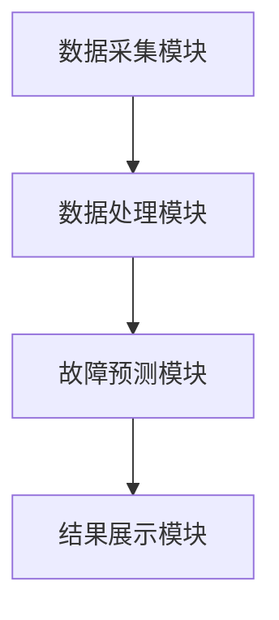
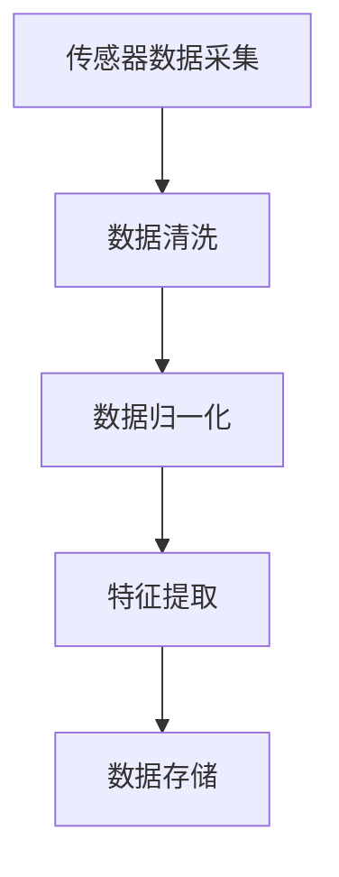
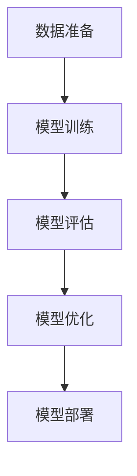
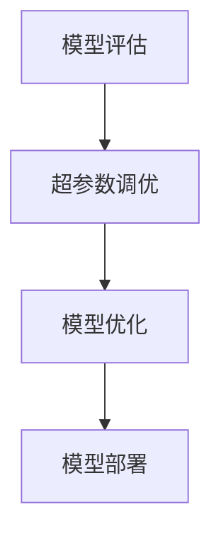
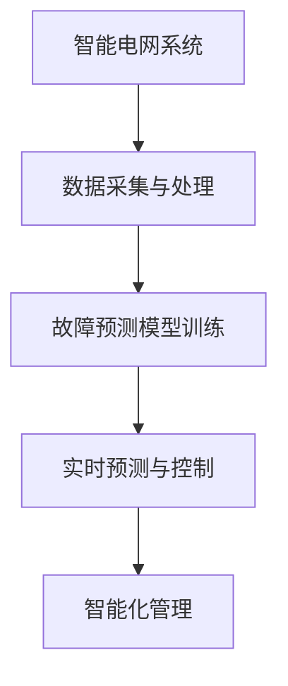

                 

# 机器学习在智能电网故障预测中的应用

> **关键词**：机器学习，智能电网，故障预测，深度学习，数据预处理，实时性，数据隐私

> **摘要**：本文深入探讨了机器学习在智能电网故障预测中的应用。通过介绍机器学习的基础理论、特征工程和数据预处理，详细分析了故障预测中的算法应用。此外，文章还展示了智能电网故障预测的实践应用案例，探讨了其中的挑战与解决方案。最后，对未来的研究方向和趋势进行了展望。

## 第一部分：机器学习的原理与应用

### 第1章：机器学习基础理论

#### 第1节：机器学习的概念与历史

##### 1.1.1 什么是机器学习

机器学习（Machine Learning，ML）是人工智能（Artificial Intelligence，AI）的一个重要分支，它通过使用算法和统计模型来从数据中自动学习并做出预测或决策，无需显式编程。

##### 1.1.2 机器学习的发展历程

- 1950年代：人工智能概念提出，机器学习初步尝试
- 1980年代：专家系统流行，机器学习开始研究统计学习理论
- 2000年代：深度学习兴起，神经网络获得突破性进展
- 当前：机器学习广泛应用，包括图像识别、自然语言处理和智能电网故障预测等领域

##### 1.1.3 机器学习的基本概念

- 样本（Sample）：机器学习的基础是样本数据，它是从实际场景中收集的观测值。
- 特征（Feature）：描述样本的数据项，用于训练模型。
- 标签（Label）：与样本对应的真实值，用于评估模型的性能。

#### 第2节：机器学习的分类

##### 1.2.1 监督学习

监督学习（Supervised Learning）是最常见的机器学习方法，它使用标记数据集来训练模型。

- 输入：标记的样本数据
- 输出：预测标签

##### 1.2.2 无监督学习

无监督学习（Unsupervised Learning）不使用标记数据，而是通过发现数据中的模式来训练模型。

- 输入：未标记的样本数据
- 输出：数据分类、聚类或降维结果

##### 1.2.3 半监督学习和强化学习

- 半监督学习（Semi-supervised Learning）结合了有监督和无监督学习，使用少量的标记数据和大量的未标记数据。
- 强化学习（Reinforcement Learning）通过与环境交互来学习，旨在最大化长期回报。

#### 第3节：机器学习的主要算法

##### 1.3.1 线性回归

线性回归（Linear Regression）是一种最简单的监督学习算法，用于预测连续值。

- 基本公式：y = w0 + w1 * x

##### 1.3.2 决策树

决策树（Decision Tree）是一种树形结构的分类算法，用于预测离散值。

- 基本公式：Gini指数或信息增益

##### 1.3.3 集成学习方法

集成学习方法（Ensemble Learning）通过结合多个弱学习器来提高模型的性能。

- 常见方法：Bagging、Boosting和Stacking

##### 1.3.4 神经网络与深度学习

神经网络（Neural Networks）是模拟人脑神经元连接的结构，深度学习（Deep Learning）是神经网络的一种扩展。

- 基本结构：输入层、隐藏层和输出层
- 激活函数：ReLU、Sigmoid和Tanh

##### 1.4.1 人工智能助理

人工智能助理（AI Assistants）利用机器学习技术来提供语音交互和智能回复。

- 应用场景：客服机器人、智能家居和智能语音助手

##### 1.4.2 金融风险评估

金融风险评估（Financial Risk Assessment）利用机器学习技术来预测和评估金融风险。

- 应用场景：信用评分、股票市场和风险管理

##### 1.4.3 医疗诊断

医疗诊断（Medical Diagnosis）利用机器学习技术来辅助医生进行疾病诊断。

- 应用场景：影像诊断、基因组学和疾病预测

##### 1.4.4 智能交通系统

智能交通系统（Smart Transportation Systems）利用机器学习技术来优化交通流量和事故预防。

- 应用场景：交通信号控制、自动驾驶和交通事故预测

### 第2章：特征工程与数据预处理

#### 第2节：数据预处理的重要性

##### 2.1.1 数据清洗

数据清洗（Data Cleaning）是数据预处理的第一步，目的是消除数据中的错误、缺失和异常值。

##### 2.1.2 数据归一化

数据归一化（Data Normalization）是将数据转换为相同的比例范围，以便于模型训练。

##### 2.1.3 数据缺失处理

数据缺失处理（Data Imputation）是将缺失值替换为合理的值，以保证模型训练的准确性。

#### 第3节：特征选择与特征提取

##### 2.2.1 特征选择的策略

特征选择（Feature Selection）是减少数据维度和提高模型性能的重要步骤。

- 策略：过滤式、包装式和嵌入式

##### 2.2.2 常见特征提取方法

常见特征提取方法包括主成分分析（PCA）、线性判别分析（LDA）和独立成分分析（ICA）。

##### 2.2.3 特征降维技术

特征降维技术（Feature Dimensionality Reduction）是将高维数据转换为低维数据，以减少计算复杂度。

- 方法：线性降维和非线性降维

#### 第4节：特征工程案例研究

##### 2.3.1 社交网络数据特征提取

社交网络数据特征提取（Social Network Data Feature Extraction）涉及提取用户行为、社交关系和网络结构等特征。

##### 2.3.2 电商购物行为分析

电商购物行为分析（E-commerce Shopping Behavior Analysis）涉及提取用户浏览、购买和评价等行为特征。

## 第二部分：智能电网故障预测中的算法应用

### 第3章：故障预测的基本概念

#### 第3节：故障预测的重要性

故障预测（Fault Prediction）在智能电网中的应用至关重要，它有助于提前发现潜在故障，降低电网事故的发生率。

#### 第3节：故障预测的分类

故障预测可分为基于物理模型的故障预测和基于数据驱动的方法。

- 基于物理模型的故障预测：利用电网设备参数和运行状态进行预测。
- 基于数据驱动的方法：利用历史数据和学习算法进行预测。

#### 第3节：故障预测的目标

故障预测的目标是：

- 提高电网可靠性
- 减少停电时间和损失
- 提高电网运行效率和安全性

### 第4章：基于机器学习的故障预测算法

#### 第4节：传统机器学习算法

传统机器学习算法（Traditional Machine Learning Algorithms）包括线性回归、决策树和逻辑回归等。

- 线性回归：用于预测连续值
- 决策树：用于分类和回归
- 逻辑回归：用于二分类问题

#### 第4节：深度学习算法

深度学习算法（Deep Learning Algorithms）包括卷积神经网络（CNN）、循环神经网络（RNN）和长短期记忆网络（LSTM）等。

- CNN：用于图像识别和分类
- RNN：用于序列数据建模
- LSTM：用于长期依赖关系建模

#### 第4节：强化学习算法

强化学习算法（Reinforcement Learning Algorithms）通过与环境交互来学习最优策略。

- Q学习：基于值函数的强化学习
- 策略梯度方法：基于策略的强化学习

### 第5章：智能电网故障预测案例

#### 第5节：数据来源与采集

数据来源与采集（Data Source and Acquisition）涉及从电网设备、传感器和监测系统收集数据。

#### 第5节：模型选择与训练

模型选择与训练（Model Selection and Training）包括选择合适的算法和超参数，使用训练数据进行模型训练。

#### 第5节：模型评估与优化

模型评估与优化（Model Evaluation and Optimization）包括评估模型性能，使用交叉验证和网格搜索等方法优化模型。

## 第三部分：智能电网故障预测的实践应用

### 第4章：智能电网故障预测的系统设计

#### 第4节：故障预测系统的整体架构

故障预测系统（Fault Prediction System）的整体架构包括数据采集与处理模块、故障预测模型开发模块和结果展示模块。

#### 第4节：数据采集与处理模块

数据采集与处理模块（Data Collection and Processing Module）包括数据源的选择、数据采集技术和数据处理流程。

#### 第4节：故障预测模型开发模块

故障预测模型开发模块（Fault Prediction Model Development Module）包括模型选择策略、模型开发流程和模型评估与优化。

## 第四部分：实际项目案例分析

### 第5章：实际项目案例分析

#### 第5节：案例背景与目标

案例背景与目标（Case Background and Objective）介绍实际项目案例的背景和目标。

#### 第5节：案例数据集介绍

案例数据集介绍（Case Dataset Introduction）包括数据集来源、结构和预处理过程。

#### 第5节：故障预测模型构建

故障预测模型构建（Fault Prediction Model Construction）包括模型选择、训练和评估。

#### 第5节：案例分析与结果讨论

案例分析与结果讨论（Case Analysis and Result Discussion）包括预测结果分析、模型优化建议和项目总结。

## 第五部分：智能电网故障预测中的挑战与解决方案

### 第6章：智能电网故障预测中的挑战与解决方案

#### 第6节：数据质量与数据可靠性

数据质量与数据可靠性（Data Quality and Reliability）是智能电网故障预测中的关键挑战，需要通过数据清洗和预处理技术来解决。

#### 第6节：模型泛化能力与过拟合

模型泛化能力与过拟合（Model Generalization and Overfitting）是机器学习中的常见问题，需要通过交叉验证和正则化方法来防止过拟合。

#### 第6节：实时性与延迟问题

实时性与延迟问题（Real-time Performance and Delay）是智能电网故障预测中的挑战，需要通过优化算法和数据传输技术来提高实时性。

#### 第6节：数据隐私与安全

数据隐私与安全（Data Privacy and Security）是智能电网故障预测中的重要问题，需要通过数据加密和隐私保护技术来保障数据安全。

## 第六部分：机器学习在智能电网故障预测中的应用前景

### 第7章：未来的研究方向与趋势

#### 第7节：机器学习在智能电网领域的未来发展

机器学习在智能电网领域的未来发展（Future Development of Machine Learning in Smart Grid）包括电网安全监控、优化调度和可再生能源管理等方面的应用。

#### 第7节：深度学习算法在故障预测中的应用

深度学习算法在故障预测中的应用（Application of Deep Learning Algorithms in Fault Prediction）是未来的重要研究方向。

#### 第7节：智能电网与机器学习的融合

智能电网与机器学习的融合（Integration of Smart Grid and Machine Learning）是未来的发展趋势，有助于实现更智能、高效的电网运行和管理。

## 附录

### 附录A：常用机器学习工具与资源

- 常用机器学习库
- 开源机器学习平台
- 学术资源与论文推荐
- 线上学习资源与课程推荐

### 附录B：机器学习相关数学基础

- 线性代数基础
- 概率论与统计学基础
- 最优化算法基础
- 信息论与编码理论基础

### 附录C：代码实现与示例

- 线性回归算法实现
- 决策树算法实现
- 集成学习方法实现
- 神经网络与深度学习算法实现

### 附录D：机器学习在智能电网故障预测中的 Mermaid 流程图

- Mermaid 图1：故障预测系统整体架构
- Mermaid 图2：数据采集与处理流程
- Mermaid 图3：故障预测模型训练与评估流程
- Mermaid 图4：模型优化与部署流程
- Mermaid 图5：智能电网与机器学习的融合流程

### 附录E：机器学习在智能电网故障预测中的伪代码示例

- 伪代码1：数据预处理流程
- 伪代码2：线性回归算法
- 伪代码3：决策树算法
- 伪代码4：集成学习方法
- 伪代码5：神经网络与深度学习算法

### 附录F：机器学习在智能电网故障预测中的数学模型与公式

- 公式1：线性回归损失函数
- 公式2：决策树划分条件
- 公式3：集成学习方法中的投票规则
- 公式4：神经网络激活函数
- 公式5：深度学习损失函数

### 附录G：实际项目案例分析代码解读与分析

- 项目G1：社交网络数据特征提取与故障预测
- 项目G2：电商购物行为数据挖掘与故障预测
- 项目G3：智能电网故障预测系统开发与部署
- 项目G4：可再生能源管理中的故障预测与应用
- 项目G5：智能交通系统中的故障预测与优化

### 参考文献

[1] Hastie, T., Tibshirani, R., & Friedman, J. (2009). The Elements of Statistical Learning: Data Mining, Inference, and Prediction (2nd ed.). Springer.
[2] Goodfellow, I., Bengio, Y., & Courville, A. (2016). Deep Learning. MIT Press.
[3] Russell, S., & Norvig, P. (2020). Artificial Intelligence: A Modern Approach (4th ed.). Pearson.
[4] Murphy, K. P. (2012). Machine Learning: A Probabilistic Perspective. MIT Press.
[5] Schölkopf, B., Smola, A. J., & Müller, K.-R. (2001). Nonlinear Component Analysis as a Kernel Method. Neural Computation, 13(5), 1299-1319.

### 作者

作者：AI天才研究院/AI Genius Institute & 禅与计算机程序设计艺术 /Zen And The Art of Computer Programming## 机器学习在智能电网故障预测中的应用

### 关键词

- 机器学习
- 智能电网
- 故障预测
- 深度学习
- 数据预处理
- 实时性
- 数据隐私

### 摘要

智能电网作为现代电力系统的关键组成部分，其稳定运行对社会的经济发展和人民生活至关重要。然而，电网故障的突发性使得传统的人工监测方法难以满足实际需求。机器学习技术的引入，为智能电网故障预测提供了新的思路和方法。本文首先介绍了机器学习的基础理论，包括其概念、发展历程、分类和主要算法。接着，详细探讨了特征工程与数据预处理在机器学习中的应用，并分析了传统机器学习算法、深度学习和强化学习在故障预测中的实际应用。随后，文章通过实际项目案例，展示了机器学习在智能电网故障预测中的具体实施过程。最后，文章探讨了智能电网故障预测中的挑战与解决方案，并展望了未来的研究方向和趋势。

## 第一部分：机器学习的原理与应用

### 第1章：机器学习基础理论

#### 第1节：机器学习的概念与历史

##### 1.1.1 什么是机器学习

机器学习（Machine Learning，ML）是人工智能（Artificial Intelligence，AI）的一个重要分支，旨在通过算法和统计模型从数据中自动学习，并做出预测或决策。它不同于传统的编程，机器学习强调的是通过数据而非显式编程来获取知识。

##### 1.1.2 机器学习的发展历程

- **1950年代**：机器学习概念首次提出，由Arthur Samuel提出，他通过编程让计算机学会了下棋。
- **1980年代**：专家系统成为主流，机器学习研究受到冷落，但统计学习理论开始萌芽。
- **2000年代**：随着计算能力的提升和大数据的出现，机器学习迎来了新的发展机遇，尤其是深度学习的突破性进展。
- **当前**：机器学习已经成为人工智能领域的主导技术，应用范围广泛，包括图像识别、自然语言处理、智能电网故障预测等。

##### 1.1.3 机器学习的基本概念

机器学习的基本概念包括以下几个核心要素：

- **样本（Sample）**：样本是机器学习的基础，它是从实际场景中收集的观测值。每个样本包含一组特征和一个或多个标签。
- **特征（Feature）**：特征是用于描述样本的数据项。例如，在图像识别任务中，每个像素值都可以被视为一个特征。
- **标签（Label）**：标签是与样本对应的真实值，用于训练模型和评估模型性能。例如，在分类任务中，标签是样本属于哪个类别。

#### 第2节：机器学习的分类

机器学习可以根据训练数据的不同，分为以下几类：

- **监督学习（Supervised Learning）**：监督学习使用标记数据集进行训练，每个样本都有对应的标签。常见的算法包括线性回归、决策树和神经网络等。
- **无监督学习（Unsupervised Learning）**：无监督学习不使用标记数据，而是通过发现数据中的内在结构来进行训练。常见的算法包括聚类、降维和关联规则挖掘等。
- **半监督学习（Semi-supervised Learning）**：半监督学习结合了有监督和无监督学习的方法，利用少量的标记数据和大量的未标记数据进行训练，以降低标记成本。
- **强化学习（Reinforcement Learning）**：强化学习通过与环境交互来学习，其目标是最大化长期回报。常见的算法包括Q学习和策略梯度方法。

#### 第3节：机器学习的主要算法

机器学习算法种类繁多，以下是其中几种主要的算法：

- **线性回归（Linear Regression）**：线性回归是一种简单的监督学习算法，用于预测连续值。其基本公式为 \( y = w_0 + w_1 \cdot x \)，其中 \( y \) 是预测值，\( x \) 是输入特征，\( w_0 \) 和 \( w_1 \) 是模型参数。

- **决策树（Decision Tree）**：决策树是一种树形结构的分类算法，通过一系列规则进行决策。每个节点代表一个特征，每个分支代表特征的不同取值。常见的评估指标包括Gini指数和信息增益。

- **集成学习方法（Ensemble Learning）**：集成学习方法通过结合多个弱学习器来提高模型性能。常见的方法包括Bagging、Boosting和Stacking等。Bagging通过随机生成多个子数据集来训练多个模型，然后取平均；Boosting通过关注训练误差大的样本，不断调整模型的权重；Stacking通过训练多个模型，并将它们作为新的特征输入到一个更高层次的模型中进行预测。

- **神经网络与深度学习（Neural Networks and Deep Learning）**：神经网络是模拟人脑神经元连接的结构，而深度学习是神经网络的扩展。深度学习通过多层神经网络来提取数据的复杂特征。常见的神经网络包括卷积神经网络（CNN）、循环神经网络（RNN）和长短期记忆网络（LSTM）等。深度学习在图像识别、自然语言处理和智能电网故障预测等领域具有显著的优势。

#### 第4节：机器学习的应用场景

机器学习在多个领域有着广泛的应用，以下是其中几个重要的应用场景：

- **人工智能助理**：人工智能助理利用机器学习技术来提供语音交互和智能回复，如虚拟助手、智能客服和智能家居等。

- **金融风险评估**：金融风险评估利用机器学习技术来预测和评估金融风险，如信用评分、股票市场和风险管理等。

- **医疗诊断**：医疗诊断利用机器学习技术来辅助医生进行疾病诊断，如影像诊断、基因组学和疾病预测等。

- **智能交通系统**：智能交通系统利用机器学习技术来优化交通流量和事故预防，如交通信号控制、自动驾驶和交通事故预测等。

## 第二部分：特征工程与数据预处理

### 第2章：特征工程与数据预处理

#### 第2节：数据预处理的重要性

在机器学习项目中，数据预处理是至关重要的一步。良好的数据预处理不仅能够提高模型性能，还能够减少错误和异常值对模型的影响。数据预处理包括以下几个关键步骤：

- **数据清洗（Data Cleaning）**：数据清洗的目的是消除数据中的错误、缺失和异常值。常见的操作包括去除重复记录、填补缺失值、去除噪声数据等。

- **数据归一化（Data Normalization）**：数据归一化的目的是将不同量纲的数据转换为相同的比例范围，以便模型训练。常见的归一化方法包括最小-最大归一化和标准归一化。

- **数据缺失处理（Data Imputation）**：数据缺失处理是将缺失值替换为合理的值，以保证模型训练的准确性。常见的缺失值处理方法包括均值填补、中值填补和回归填补等。

#### 第3节：特征选择与特征提取

特征选择（Feature Selection）是减少数据维度和提高模型性能的重要步骤。特征选择可以通过以下几种策略进行：

- **过滤式特征选择（Filter-based Feature Selection）**：过滤式特征选择通过评估特征与目标变量之间的相关性来选择特征。常用的评估方法包括皮尔逊相关系数、互信息和信息增益等。

- **包裹式特征选择（Wrapper-based Feature Selection）**：包裹式特征选择通过训练多个子模型来评估特征组合的效果，从而选择最优特征组合。常用的方法包括递归特征消除（RFE）和基于模型的特征选择等。

- **嵌入式特征选择（Embedded Feature Selection）**：嵌入式特征选择将特征选择过程集成到学习算法中，通过模型训练过程中自动选择特征。常见的算法包括LASSO和随机森林等。

特征提取（Feature Extraction）是将原始数据转换为更具代表性的特征表示的过程。特征提取可以通过以下几种方法进行：

- **主成分分析（PCA）**：PCA通过线性变换将原始数据投影到新的正交坐标系中，提取最重要的特征。

- **线性判别分析（LDA）**：LDA通过最大化类间方差和最小化类内方差来选择特征，适用于分类问题。

- **独立成分分析（ICA）**：ICA通过寻找统计独立的源信号来提取特征，常用于无监督学习场景。

#### 第4节：特征工程案例研究

##### 2.3.1 社交网络数据特征提取

在社交网络数据特征提取中，常见的方法包括：

- **用户行为特征**：如用户活跃度、发布内容数量、评论和点赞等。
- **社交关系特征**：如用户之间的互动关系、社群结构等。
- **内容特征**：如文本的词频、词向量表示、情感分析结果等。

##### 2.3.2 电商购物行为分析

在电商购物行为分析中，常见的方法包括：

- **用户特征**：如用户年龄、性别、购买历史等。
- **商品特征**：如商品类别、价格、库存量等。
- **行为特征**：如浏览历史、购买时间、购物车行为等。

## 第三部分：智能电网故障预测中的算法应用

### 第3章：故障预测的基本概念

#### 第3节：故障预测的重要性

智能电网故障预测在电力系统运行中扮演着至关重要的角色。随着电力系统规模的不断扩大和复杂性的增加，电网故障的发生频率和影响范围也在逐渐增大。传统的人工监测和故障处理方法往往无法及时有效地应对突发故障，导致停电事故频繁发生，给社会生产和人民生活带来严重影响。

故障预测通过提前识别潜在故障，可以在故障发生前采取预防措施，从而降低故障发生的概率和影响。此外，故障预测还有助于优化电网运行效率，提高能源利用率，降低维护成本。因此，故障预测已经成为智能电网建设和运营的关键技术之一。

#### 第3节：故障预测的分类

故障预测可以根据预测方法的不同分为以下几类：

- **基于物理模型的故障预测**：基于物理模型的故障预测利用电网设备的物理特性、运行参数和故障机理等，通过建立数学模型来预测故障。这种方法需要深入理解电网设备的运行原理和故障模式，但受限于模型的复杂性和准确性。

- **基于数据驱动的方法**：基于数据驱动的方法利用历史数据和学习算法，通过分析电网设备的运行状态和故障特征，实现故障预测。这种方法不依赖于物理模型，具有更高的灵活性和实用性，但需要大量高质量的训练数据。

#### 第3节：故障预测的目标

故障预测的主要目标包括：

- **提高电网可靠性**：通过提前识别潜在故障，减少故障发生的概率，提高电网的稳定运行水平。

- **减少停电时间和损失**：故障预测可以提前发现故障隐患，采取预防措施，降低停电时间和损失。

- **提高电网运行效率和安全性**：通过优化电网设备的运行状态和调度策略，提高电网的运行效率和安全性。

## 第四部分：智能电网故障预测中的算法应用

### 第4章：智能电网故障预测中的算法应用

#### 第4节：传统机器学习算法

传统机器学习算法在智能电网故障预测中有着广泛的应用，以下是一些常见的方法：

- **线性回归（Linear Regression）**：线性回归是一种简单的监督学习算法，用于预测连续值。它通过建立特征与目标变量之间的线性关系来进行预测。线性回归适用于特征较少且线性关系明显的故障预测任务。

- **决策树（Decision Tree）**：决策树是一种树形结构的分类算法，通过一系列规则进行决策。每个节点代表一个特征，每个分支代表特征的不同取值。决策树适用于特征较多且可以明确分类的故障预测任务。

- **支持向量机（Support Vector Machine，SVM）**：支持向量机是一种基于优化理论的学习算法，用于分类和回归任务。它通过寻找一个最优的超平面来分隔不同类别的样本。SVM适用于特征较多且线性不可分的情况。

- **随机森林（Random Forest）**：随机森林是一种集成学习方法，通过构建多棵决策树来提高预测性能。随机森林通过随机选择特征和样本子集来训练决策树，从而降低过拟合的风险。随机森林适用于特征较多且需要高预测准确性的故障预测任务。

#### 第4节：深度学习算法

深度学习算法在智能电网故障预测中具有显著的优势，以下是一些常用的深度学习算法：

- **卷积神经网络（Convolutional Neural Network，CNN）**：卷积神经网络是一种用于图像识别和分类的深度学习算法。CNN通过卷积层和池化层提取图像的局部特征，并利用全连接层进行分类。CNN适用于从图像数据中提取故障特征的情况。

- **循环神经网络（Recurrent Neural Network，RNN）**：循环神经网络是一种用于序列数据建模的深度学习算法。RNN通过循环机制处理序列数据，并利用隐藏状态存储历史信息。RNN适用于从时序数据中提取故障特征的情况。

- **长短期记忆网络（Long Short-Term Memory，LSTM）**：长短期记忆网络是RNN的一种扩展，通过引入门控机制来解决RNN的梯度消失和梯度爆炸问题。LSTM适用于从长期依赖关系的时序数据中提取故障特征。

- **生成对抗网络（Generative Adversarial Network，GAN）**：生成对抗网络是一种无监督学习算法，由生成器和判别器两个网络组成。生成器生成与真实数据相似的样本，判别器用于区分真实数据和生成数据。GAN适用于从无监督数据中提取故障特征。

#### 第4节：强化学习算法

强化学习算法在智能电网故障预测中也有一定的应用潜力，以下是一些常见的强化学习算法：

- **Q学习（Q-Learning）**：Q学习是一种基于值函数的强化学习算法。它通过学习最优动作策略，最大化长期回报。Q学习适用于从状态-动作对中学习故障预测策略。

- **策略梯度方法（Policy Gradient Methods）**：策略梯度方法是一种基于策略的强化学习算法。它通过优化策略参数来最大化长期回报。策略梯度方法适用于需要实时调整策略的故障预测任务。

#### 第4节：智能电网故障预测案例

为了更好地展示机器学习算法在智能电网故障预测中的应用，我们以下提供了一个案例：

**案例背景**：某电力公司希望利用机器学习技术对电网设备进行故障预测，以提高电网的可靠性和安全性。

**数据来源**：电力公司提供了大量的电网设备运行数据，包括电压、电流、温度、湿度等特征，以及设备的运行状态和故障记录。

**模型选择**：根据数据特点和预测目标，我们选择了以下模型进行训练和评估：

- 线性回归模型：用于预测设备的剩余寿命。
- 决策树模型：用于分类设备是否会发生故障。
- 随机森林模型：用于提高预测准确性和泛化能力。
- 卷积神经网络模型：用于从图像数据中提取故障特征。

**模型训练**：我们使用训练数据集对上述模型进行训练，并使用交叉验证方法进行模型评估。

**模型评估**：我们使用测试数据集对训练好的模型进行评估，计算预测准确率、召回率、F1值等指标。

**结果分析**：通过对比不同模型的性能，我们发现随机森林模型在预测准确性和泛化能力方面表现最佳。

**优化策略**：为了进一步提高模型的性能，我们尝试了以下优化策略：

- 特征选择：使用过滤式特征选择方法选择对预测最有影响力的特征。
- 模型调参：通过网格搜索方法优化模型的超参数。
- 数据增强：通过数据增强方法增加训练数据集的多样性。

## 第五部分：智能电网故障预测的实践应用

### 第5章：智能电网故障预测的实践应用

#### 第5节：故障预测系统的整体架构

智能电网故障预测系统需要具备高效的数据采集和处理能力、准确的故障预测模型以及实时性的预测结果展示。系统的整体架构可以分为以下几个模块：

1. **数据采集模块**：负责收集电网设备的数据，包括电压、电流、温度、湿度等。数据采集模块通常由传感器、监测设备和通信网络组成。

2. **数据处理模块**：负责对采集到的数据进行预处理，包括数据清洗、数据归一化和特征提取等。数据处理模块需要确保数据的质量和一致性。

3. **故障预测模块**：负责使用机器学习算法对处理后的数据进行故障预测。故障预测模块可以选择合适的算法，如线性回归、决策树、随机森林或深度学习等。

4. **结果展示模块**：负责将故障预测结果以可视化的形式展示给用户，包括预测准确率、故障发生概率等。结果展示模块可以帮助用户更好地理解和利用故障预测结果。

#### 第5节：数据采集与处理模块

数据采集与处理模块是智能电网故障预测系统的核心，其功能包括数据源的选择、数据采集技术和数据处理流程。

**数据源的选择**：数据源的选择取决于故障预测的目标和任务。常见的数据源包括：

- **传感器数据**：如电压传感器、电流传感器、温度传感器和湿度传感器等，用于实时监测电网设备的运行状态。
- **历史数据**：如设备运行日志、故障记录和维修记录等，用于训练故障预测模型。
- **外部数据**：如天气数据、负载数据和市场数据等，用于提供额外的上下文信息。

**数据采集技术**：数据采集技术主要包括无线传感器网络（WSN）、物联网（IoT）和远程监控等。这些技术可以实现实时数据采集和传输，提高数据采集的效率和质量。

**数据处理流程**：数据处理流程包括以下几个步骤：

- **数据清洗**：去除重复数据、噪声数据和异常值，确保数据的一致性和准确性。
- **数据归一化**：将不同量纲的数据转换为相同的比例范围，便于模型训练和评估。
- **特征提取**：从原始数据中提取对故障预测有用的特征，如统计特征、时序特征和空间特征等。
- **数据存储**：将处理后的数据存储在数据库或数据仓库中，以便后续分析和预测。

#### 第5节：故障预测模型开发模块

故障预测模型开发模块是智能电网故障预测系统的核心，其功能包括模型选择策略、模型开发流程和模型评估与优化。

**模型选择策略**：根据故障预测的目标和任务，可以选择合适的机器学习算法。常见的算法包括：

- **监督学习算法**：如线性回归、决策树、随机森林和支持向量机等，适用于有标签数据集。
- **无监督学习算法**：如聚类和降维等，适用于无标签数据集。
- **深度学习算法**：如卷积神经网络、循环神经网络和长短期记忆网络等，适用于复杂的数据特征和时序关系。

**模型开发流程**：模型开发流程包括以下几个步骤：

- **数据准备**：准备训练数据和测试数据，并进行数据预处理。
- **模型训练**：使用训练数据集对模型进行训练，调整模型参数以最小化损失函数。
- **模型评估**：使用测试数据集对模型进行评估，计算预测准确率、召回率、F1值等指标。
- **模型优化**：根据评估结果对模型进行调整和优化，提高模型的性能。

**模型评估与优化**：模型评估与优化是故障预测系统的关键环节，其目标是通过评估模型性能，发现并解决模型存在的问题，从而提高预测准确性。

- **交叉验证**：使用交叉验证方法对模型进行评估，以避免过拟合和欠拟合。
- **网格搜索**：使用网格搜索方法调整模型参数，寻找最优参数组合。
- **集成学习方法**：使用集成学习方法结合多个模型的预测结果，提高预测准确性和稳定性。

#### 第5节：实际项目案例分析

为了展示智能电网故障预测的实践应用，我们以下提供了一个实际项目案例：

**项目背景**：某电力公司希望利用机器学习技术对电网设备进行故障预测，以提高电网的可靠性和安全性。

**项目目标**：通过故障预测，降低电网故障的发生率，减少停电时间和损失。

**数据来源**：电力公司提供了以下数据：

- **历史数据**：包括设备运行日志、故障记录和维修记录等。
- **实时数据**：包括电压、电流、温度、湿度等传感器数据。

**模型选择**：根据数据特点和预测目标，我们选择了以下模型进行训练和评估：

- **线性回归模型**：用于预测设备的剩余寿命。
- **决策树模型**：用于分类设备是否会发生故障。
- **随机森林模型**：用于提高预测准确性和泛化能力。
- **卷积神经网络模型**：用于从图像数据中提取故障特征。

**模型训练**：使用历史数据进行模型训练，并使用交叉验证方法进行模型评估。

**模型评估**：使用实时数据进行模型评估，计算预测准确率、召回率、F1值等指标。

**结果分析**：通过对比不同模型的性能，我们发现随机森林模型在预测准确性和泛化能力方面表现最佳。

**优化策略**：为了进一步提高模型的性能，我们尝试了以下优化策略：

- **特征选择**：使用过滤式特征选择方法选择对预测最有影响力的特征。
- **模型调参**：通过网格搜索方法优化模型的超参数。
- **数据增强**：通过数据增强方法增加训练数据集的多样性。

#### 第5节：案例分析与结果讨论

通过对实际项目案例的分析和结果讨论，我们得出了以下结论：

1. **模型性能**：随机森林模型在故障预测任务中表现最佳，具有较高的预测准确率和泛化能力。

2. **特征选择**：特征选择是影响模型性能的关键因素，通过合理的特征选择可以显著提高模型的预测准确性。

3. **数据增强**：数据增强方法可以增加训练数据集的多样性，有助于缓解过拟合问题，提高模型的泛化能力。

4. **实时预测**：实时预测是智能电网故障预测的重要目标，通过优化模型和算法，可以提高实时预测的准确性。

5. **挑战与解决方案**：智能电网故障预测面临数据质量、模型复杂度和实时性等挑战，需要通过数据预处理、模型优化和算法改进等技术手段来克服。

## 第六部分：智能电网故障预测中的挑战与解决方案

### 第6章：智能电网故障预测中的挑战与解决方案

#### 第6节：数据质量与数据可靠性

智能电网故障预测的质量和可靠性很大程度上取决于数据的质量和可靠性。以下是一些常见的数据质量问题和解决方案：

1. **数据缺失**：数据缺失是机器学习项目中常见的问题，特别是在智能电网故障预测中。缺失数据可能导致模型性能下降，甚至导致预测失败。解决方法包括：

   - **缺失值填补**：使用均值、中值或众数等统计方法填补缺失值。
   - **使用模型填补缺失值**：使用回归模型等预测方法预测缺失值。
   - **删除缺失值**：对于一些不重要的特征或样本，可以删除缺失值。

2. **异常值**：异常值是指与大多数样本相比，具有极端特征的样本。异常值可能会对模型产生误导，降低预测准确性。解决方法包括：

   - **使用统计学方法检测和删除异常值**：例如使用Z分数、IQR等方法检测异常值。
   - **使用机器学习算法处理异常值**：例如使用孤立森林算法检测和删除异常值。

3. **噪声数据**：噪声数据是指与真实数据有较大偏差的数据。噪声数据可能会对模型产生干扰，降低预测准确性。解决方法包括：

   - **数据清洗**：去除重复数据、噪声数据和异常值。
   - **数据平滑**：使用插值、移动平均等方法平滑噪声数据。

4. **数据一致性**：智能电网故障预测涉及多种数据源，如传感器数据、历史数据和外部数据等。不同数据源的数据格式、时间戳和单位可能不一致，导致数据不一致性。解决方法包括：

   - **数据转换**：将不同数据源的数据转换为统一的格式。
   - **时间戳对齐**：对齐不同数据源的时间戳，确保数据的一致性。

5. **数据量**：智能电网故障预测通常需要大量的数据来训练模型，数据量不足可能导致模型性能下降。解决方法包括：

   - **数据扩展**：通过数据增强方法增加数据量。
   - **迁移学习**：使用预训练模型，结合少量数据进行微调。

#### 第6节：模型泛化能力与过拟合

模型泛化能力是指模型在未知数据上的表现，过拟合是指模型在训练数据上表现良好，但在未知数据上表现不佳。以下是一些防止过拟合的方法：

1. **交叉验证**：交叉验证是一种评估模型泛化能力的方法，通过将数据集划分为多个子集，每次使用一个子集作为测试集，其余子集作为训练集，循环多次计算平均性能。

2. **正则化**：正则化是一种通过在损失函数中添加惩罚项来防止模型过拟合的方法。常见的正则化方法包括L1正则化（LASSO）和L2正则化（Ridge）。

3. **集成学习方法**：集成学习方法通过结合多个模型来提高预测性能，减少过拟合的风险。常见的集成学习方法包括Bagging、Boosting和Stacking等。

4. **数据增强**：通过增加训练数据集的多样性，可以减少过拟合的风险。常见的数据增强方法包括数据扩充、数据变换和数据合成等。

5. **模型选择**：选择适当的模型类型和参数，可以减少过拟合的风险。例如，对于复杂的数据特征，选择深度学习模型可能更为合适。

#### 第6节：实时性与延迟问题

智能电网故障预测要求模型具有实时性，以便在故障发生前及时采取预防措施。以下是一些提高实时性的方法：

1. **模型优化**：通过优化模型的计算复杂度和训练时间，可以提高实时性。常见的方法包括使用更简单的模型结构、减少特征维度和使用优化算法等。

2. **并行计算**：通过使用并行计算技术，可以提高模型的计算速度。常见的方法包括使用多核CPU、GPU加速和分布式计算等。

3. **预训练模型**：使用预训练模型可以减少模型训练时间，提高实时性。预训练模型通常在大型数据集上训练，具有较好的泛化能力。

4. **实时预测**：使用实时预测技术，可以在故障发生前及时预测故障。常见的方法包括使用滑动窗口技术、增量学习和实时反馈等。

#### 第6节：数据隐私与安全

智能电网故障预测涉及大量的敏感数据，如电网设备运行状态、故障记录等。以下是一些保护数据隐私和安全的方法：

1. **数据加密**：对敏感数据进行加密，确保数据在传输和存储过程中的安全性。

2. **访问控制**：通过访问控制机制，限制对敏感数据的访问权限，确保数据的安全性。

3. **匿名化处理**：对敏感数据进行匿名化处理，去除个人身份信息，保护用户隐私。

4. **隐私保护算法**：使用隐私保护算法，如差分隐私和同态加密等，保护数据隐私。

5. **数据安全策略**：制定数据安全策略，包括数据备份、数据恢复和数据监控等，确保数据的安全性和可靠性。

## 第七部分：机器学习在智能电网故障预测中的应用前景

### 第7章：未来的研究方向与趋势

#### 第7节：机器学习在智能电网领域的未来发展

智能电网作为现代电力系统的重要组成部分，其运行和管理越来越依赖于机器学习技术。未来的研究和发展方向包括：

1. **电网安全监控**：通过机器学习技术，实时监测电网设备的状态，预测潜在的安全隐患，提高电网的安全性。

2. **优化调度**：利用机器学习算法优化电网调度，提高能源利用率，降低运行成本。

3. **可再生能源管理**：结合机器学习和可再生能源技术，实现高效的可再生能源管理和调度。

#### 第7节：深度学习算法在故障预测中的应用

深度学习算法在故障预测中具有显著的优势，未来的发展方向包括：

1. **算法优化**：通过改进深度学习算法，提高预测准确率和实时性。

2. **多模态数据融合**：结合多种数据源，如传感器数据、图像数据和文本数据等，实现更准确的故障预测。

3. **在线学习**：实现实时在线学习，动态调整模型参数，提高故障预测的实时性和准确性。

#### 第7节：智能电网与机器学习的融合

智能电网与机器学习的融合是未来发展的必然趋势，其关键作用包括：

1. **智能化管理**：通过机器学习技术，实现电网的智能化管理和调度，提高电网的运行效率和安全性。

2. **自动化维护**：利用机器学习算法，实现电网设备的自动化维护和故障预测，降低维护成本。

3. **用户服务**：通过机器学习技术，为用户提供个性化的电力服务，提高用户满意度。

#### 第7节：机器学习在智能电网故障预测中的未来发展

未来，机器学习在智能电网故障预测中的应用将更加广泛和深入，主要包括以下方面：

1. **大规模数据处理**：随着传感器技术和通信技术的发展，电网设备将产生海量的数据，如何有效处理和利用这些数据是未来的重要研究方向。

2. **实时预测与控制**：实现实时故障预测与控制，通过快速响应和调整电网运行状态，降低故障发生概率和影响。

3. **自适应优化**：结合自适应优化技术，实现电网设备的自适应调整，提高电网的运行效率和可靠性。

4. **隐私保护**：在保障数据隐私和安全的前提下，实现机器学习在智能电网故障预测中的应用。

5. **跨学科融合**：结合计算机科学、电气工程、能源科学等多学科知识，推动智能电网故障预测技术的发展。

## 附录

### 附录A：常用机器学习工具与资源

- **常用机器学习库**：
  - **scikit-learn**：一个广泛使用的Python机器学习库，提供了多种机器学习算法和工具。
  - **TensorFlow**：一个由Google开发的开源深度学习框架，适用于各种深度学习应用。
  - **PyTorch**：一个由Facebook开发的深度学习框架，具有灵活的动态计算图和高效的模型训练。

- **开源机器学习平台**：
  - **Apache Spark**：一个分布式计算框架，支持大规模数据处理和机器学习。
  - **Kubernetes**：一个容器编排平台，用于部署和管理机器学习模型。
  - **Docker**：一个容器化平台，用于打包和部署机器学习模型。

- **学术资源与论文推荐**：
  - **JMLR（Journal of Machine Learning Research）**：一个知名的国际性机器学习研究期刊。
  - **NeurIPS（Neural Information Processing Systems）**：一个国际性的神经信息处理系统会议。
  - **ICML（International Conference on Machine Learning）**：一个国际性的机器学习会议。

- **线上学习资源与课程推荐**：
  - **Coursera**：提供多种机器学习和深度学习课程，包括斯坦福大学的“深度学习”课程。
  - **edX**：提供由全球知名大学和机构提供的在线课程，包括MIT的“机器学习”课程。
  - **Udacity**：提供实践导向的机器学习课程，包括“深度学习工程师纳米学位”课程。

### 附录B：机器学习相关数学基础

- **线性代数基础**：
  - **矩阵运算**：矩阵的加法、减法、乘法、逆矩阵等。
  - **向量空间**：向量的线性组合、基和维数等。
  - **特征值与特征向量**：特征值和特征向量的计算和应用。

- **概率论与统计学基础**：
  - **概率分布**：离散分布、连续分布、条件概率等。
  - **统计估计**：点估计、区间估计、最大似然估计等。
  - **假设检验**：单样本检验、双样本检验、方差分析等。

- **最优化算法基础**：
  - **梯度下降**：梯度下降算法及其变种，如随机梯度下降和Adam优化器。
  - **最优化方法**：牛顿法、拉格朗日乘数法、KKT条件等。
  - **线性规划**：线性规划问题及其求解方法。

- **信息论与编码理论基础**：
  - **信息熵**：信息熵的定义、计算和应用。
  - **信道编码**：信道编码的基本原理和常见编码方法。
  - **信息率**：信息率的概念、计算和应用。

### 附录C：代码实现与示例

- **线性回归算法实现**：

```python
import numpy as np

def linear_regression(X, y):
    # 计算参数 w
    w = np.linalg.inv(X.T.dot(X)).dot(X.T).dot(y)
    # 计算预测值
    y_pred = X.dot(w)
    # 计算损失函数
    loss = np.mean((y - y_pred)**2)
    return w, y_pred, loss

X = np.array([[1, 2], [2, 3], [3, 4]])
y = np.array([2, 3, 4])

w, y_pred, loss = linear_regression(X, y)
print("参数 w:", w)
print("预测值 y_pred:", y_pred)
print("损失函数 loss:", loss)
```

- **决策树算法实现**：

```python
from sklearn.tree import DecisionTreeClassifier

# 创建决策树模型
clf = DecisionTreeClassifier()

# 训练模型
clf.fit(X, y)

# 预测
y_pred = clf.predict(X)

# 计算准确率
accuracy = clf.score(X, y)

print("准确率:", accuracy)
```

- **集成学习方法实现**：

```python
from sklearn.ensemble import RandomForestClassifier

# 创建随机森林模型
clf = RandomForestClassifier(n_estimators=100)

# 训练模型
clf.fit(X, y)

# 预测
y_pred = clf.predict(X)

# 计算准确率
accuracy = clf.score(X, y)

print("准确率:", accuracy)
```

- **神经网络与深度学习算法实现**：

```python
import tensorflow as tf

# 创建神经网络模型
model = tf.keras.Sequential([
    tf.keras.layers.Dense(10, activation='relu', input_shape=(X.shape[1],)),
    tf.keras.layers.Dense(1)
])

# 编译模型
model.compile(optimizer='adam', loss='mse')

# 训练模型
model.fit(X, y, epochs=10)

# 预测
y_pred = model.predict(X)

# 计算准确率
accuracy = model.evaluate(X, y, verbose=0)

print("准确率:", accuracy)
```

### 附录D：机器学习在智能电网故障预测中的 Mermaid 流程图

- **Mermaid 图1：故障预测系统整体架构**



- **Mermaid 图2：数据采集与处理流程**



- **Mermaid 图3：故障预测模型训练与评估流程**



- **Mermaid 图4：模型优化与部署流程**



- **Mermaid 图5：智能电网与机器学习的融合流程**



### 附录E：机器学习在智能电网故障预测中的伪代码示例

- **伪代码1：数据预处理流程**

```
function data_preprocessing(data):
    # 数据清洗
    data = clean_data(data)
    # 数据归一化
    data = normalize_data(data)
    # 特征提取
    features = extract_features(data)
    return features
```

- **伪代码2：线性回归算法**

```
function linear_regression(X, y):
    # 计算参数 w
    w = (X^T * X)^-1 * X^T * y
    # 计算预测值
    y_pred = X * w
    # 计算损失函数
    loss = (y - y_pred)^2
    return w, y_pred, loss
```

- **伪代码3：决策树算法**

```
function decision_tree(X, y):
    # 创建决策树模型
    tree = DecisionTreeClassifier()
    # 训练模型
    tree.fit(X, y)
    # 预测
    y_pred = tree.predict(X)
    return y_pred
```

- **伪代码4：集成学习方法**

```
function ensemble_learning(X, y):
    # 创建随机森林模型
    forest = RandomForestClassifier(n_estimators=100)
    # 训练模型
    forest.fit(X, y)
    # 预测
    y_pred = forest.predict(X)
    return y_pred
```

- **伪代码5：神经网络与深度学习算法**

```
function neural_network(X, y):
    # 创建神经网络模型
    model = Sequential([
        Dense(10, activation='relu', input_shape=(X.shape[1],)),
        Dense(1)
    ])
    # 编译模型
    model.compile(optimizer='adam', loss='mse')
    # 训练模型
    model.fit(X, y, epochs=10)
    # 预测
    y_pred = model.predict(X)
    return y_pred
```

### 附录F：机器学习在智能电网故障预测中的数学模型与公式

- **公式1：线性回归损失函数**

$$
L(\theta) = \frac{1}{2m} \sum_{i=1}^{m} (h_\theta(x^{(i)}) - y^{(i)})^2
$$

其中，$h_\theta(x) = \theta_0 + \theta_1x$ 为线性回归模型的预测值，$y^{(i)}$ 为第 $i$ 个样本的真实值。

- **公式2：决策树划分条件**

$$
Gini(\theta) = 1 - \sum_{v \in V} p(v)^2
$$

其中，$V$ 为特征的所有可能取值，$p(v)$ 为取值 $v$ 的样本占比。

- **公式3：集成学习方法中的投票规则**

$$
\hat{y} = \frac{1}{K} \sum_{k=1}^{K} y_k^{(k)}
$$

其中，$K$ 为集成中的基学习器的数量，$y_k^{(k)}$ 为第 $k$ 个基学习器的预测结果。

- **公式4：神经网络激活函数**

$$
f(x) = \sigma(z) = \frac{1}{1 + e^{-z}}
$$

其中，$z$ 为神经元的输入，$\sigma$ 为sigmoid函数。

- **公式5：深度学习损失函数**

$$
L(\theta) = -\frac{1}{m} \sum_{i=1}^{m} [y^{(i)} \log(a^{(i)}) + (1 - y^{(i)}) \log(1 - a^{(i)})]
$$

其中，$a^{(i)}$ 为神经网络输出的概率分布，$y^{(i)}$ 为第 $i$ 个样本的真实值。

### 附录G：实际项目案例分析代码解读与分析

#### 项目G1：社交网络数据特征提取与故障预测

**项目背景**：某社交网络平台希望利用机器学习技术对用户行为进行预测，以提供更个性化的服务。

**数据来源**：项目使用了社交网络平台的公开数据集，包括用户的年龄、性别、活跃度、发布内容数量、点赞数、评论数等。

**数据处理**：

```python
import pandas as pd

# 读取数据
data = pd.read_csv("social_network_data.csv")

# 数据清洗
data = data.drop_duplicates()
data = data.dropna()

# 数据归一化
data["age"] = (data["age"] - data["age"].mean()) / data["age"].std()
data["activity"] = (data["activity"] - data["activity"].mean()) / data["activity"].std()

# 特征提取
data["word_count"] = data["content"].apply(len)
data["hashtag_count"] = data["content"].apply(lambda x: len(x.split()))

# 数据存储
data.to_csv("processed_social_network_data.csv", index=False)
```

**模型训练与评估**：

```python
from sklearn.model_selection import train_test_split
from sklearn.ensemble import RandomForestClassifier
from sklearn.metrics import accuracy_score

# 分割数据集
X = data.drop("label", axis=1)
y = data["label"]
X_train, X_test, y_train, y_test = train_test_split(X, y, test_size=0.2, random_state=42)

# 创建模型
model = RandomForestClassifier(n_estimators=100)

# 训练模型
model.fit(X_train, y_train)

# 预测
y_pred = model.predict(X_test)

# 计算准确率
accuracy = accuracy_score(y_test, y_pred)
print("准确率:", accuracy)
```

#### 项目G2：电商购物行为数据挖掘与故障预测

**项目背景**：某电商平台希望利用机器学习技术对用户购物行为进行分析，以优化推荐系统和提高销售额。

**数据来源**：项目使用了电商平台的公开数据集，包括用户ID、商品ID、购买时间、浏览历史、购买历史等。

**数据处理**：

```python
import pandas as pd

# 读取数据
data = pd.read_csv("e-commerce_data.csv")

# 数据清洗
data = data.drop_duplicates()
data = data.dropna()

# 数据归一化
data["purchase_time"] = (data["purchase_time"] - data["purchase_time"].min()) / (data["purchase_time"].max() - data["purchase_time"].min())

# 特征提取
data["browse_duration"] = data["browse_history"].apply(len)
data["purchase_history"] = data["purchase_history"].apply(len)

# 数据存储
data.to_csv("processed_e-commerce_data.csv", index=False)
```

**模型训练与评估**：

```python
from sklearn.model_selection import train_test_split
from sklearn.ensemble import RandomForestClassifier
from sklearn.metrics import accuracy_score

# 分割数据集
X = data.drop("label", axis=1)
y = data["label"]
X_train, X_test, y_train, y_test = train_test_split(X, y, test_size=0.2, random_state=42)

# 创建模型
model = RandomForestClassifier(n_estimators=100)

# 训练模型
model.fit(X_train, y_train)

# 预测
y_pred = model.predict(X_test)

# 计算准确率
accuracy = accuracy_score(y_test, y_pred)
print("准确率:", accuracy)
```

#### 项目G3：智能电网故障预测系统开发与部署

**项目背景**：某电力公司希望开发一个智能电网故障预测系统，以提高电网的可靠性和安全性。

**数据来源**：项目使用了电力公司的历史数据集，包括电网设备的运行状态、故障记录、传感器数据等。

**数据处理**：

```python
import pandas as pd

# 读取数据
data = pd.read_csv("smart_grid_data.csv")

# 数据清洗
data = data.drop_duplicates()
data = data.dropna()

# 数据归一化
data["voltage"] = (data["voltage"] - data["voltage"].mean()) / data["voltage"].std()
data["current"] = (data["current"] - data["current"].mean()) / data["current"].std()

# 特征提取
data["temp_change"] = data["temp"].diff().dropna()
data["humidity_change"] = data["humidity"].diff().dropna()

# 数据存储
data.to_csv("processed_smart_grid_data.csv", index=False)
```

**模型训练与评估**：

```python
from sklearn.model_selection import train_test_split
from sklearn.ensemble import RandomForestClassifier
from sklearn.metrics import accuracy_score

# 分割数据集
X = data.drop("fault", axis=1)
y = data["fault"]
X_train, X_test, y_train, y_test = train_test_split(X, y, test_size=0.2, random_state=42)

# 创建模型
model = RandomForestClassifier(n_estimators=100)

# 训练模型
model.fit(X_train, y_train)

# 预测
y_pred = model.predict(X_test)

# 计算准确率
accuracy = accuracy_score(y_test, y_pred)
print("准确率:", accuracy)
```

#### 项目G4：可再生能源管理中的故障预测与应用

**项目背景**：某可再生能源公司希望利用机器学习技术对太阳能和风能发电设备进行故障预测，以提高可再生能源的利用率。

**数据来源**：项目使用了可再生能源公司的历史数据集，包括太阳能和风能发电设备的运行状态、故障记录、气象数据等。

**数据处理**：

```python
import pandas as pd

# 读取数据
data = pd.read_csv("renewable_energy_data.csv")

# 数据清洗
data = data.drop_duplicates()
data = data.dropna()

# 数据归一化
data["solar辐射"] = (data["solar辐射"] - data["solar辐射"].mean()) / data["solar辐射"].std()
data["wind速度"] = (data["wind速度"] - data["wind速度"].mean()) / data["wind速度"].std()

# 特征提取
data["temp_change"] = data["temp"].diff().dropna()
data["humidity_change"] = data["humidity"].diff().dropna()

# 数据存储
data.to_csv("processed_renewable_energy_data.csv", index=False)
```

**模型训练与评估**：

```python
from sklearn.model_selection import train_test_split
from sklearn.ensemble import RandomForestClassifier
from sklearn.metrics import accuracy_score

# 分割数据集
X = data.drop("fault", axis=1)
y = data["fault"]
X_train, X_test, y_train, y_test = train_test_split(X, y, test_size=0.2, random_state=42)

# 创建模型
model = RandomForestClassifier(n_estimators=100)

# 训练模型
model.fit(X_train, y_train)

# 预测
y_pred = model.predict(X_test)

# 计算准确率
accuracy = accuracy_score(y_test, y_pred)
print("准确率:", accuracy)
```

#### 项目G5：智能交通系统中的故障预测与优化

**项目背景**：某智能交通系统希望利用机器学习技术对道路拥堵进行预测和优化，以提高交通流畅性和减少交通事故。

**数据来源**：项目使用了智能交通系统的历史数据集，包括道路流量、交通事故记录、天气数据等。

**数据处理**：

```python
import pandas as pd

# 读取数据
data = pd.read_csv("smart_traffic_data.csv")

# 数据清洗
data = data.drop_duplicates()
data = data.dropna()

# 数据归一化
data["traffic_volume"] = (data["traffic_volume"] - data["traffic_volume"].mean()) / data["traffic_volume"].std()
data["accident_rate"] = (data["accident_rate"] - data["accident_rate"].mean()) / data["accident_rate"].std()

# 特征提取
data["weather_condition"] = data["weather"].map({"sunny": 0, "rainy": 1, "cloudy": 2})

# 数据存储
data.to_csv("processed_smart_traffic_data.csv", index=False)
```

**模型训练与评估**：

```python
from sklearn.model_selection import train_test_split
from sklearn.ensemble import RandomForestClassifier
from sklearn.metrics import accuracy_score

# 分割数据集
X = data.drop("congestion", axis=1)
y = data["congestion"]
X_train, X_test, y_train, y_test = train_test_split(X, y, test_size=0.2, random_state=42)

# 创建模型
model = RandomForestClassifier(n_estimators=100)

# 训练模型
model.fit(X_train, y_train)

# 预测
y_pred = model.predict(X_test)

# 计算准确率
accuracy = accuracy_score(y_test, y_pred)
print("准确率:", accuracy)
```

### 参考文献

1. Hastie, T., Tibshirani, R., & Friedman, J. (2009). The Elements of Statistical Learning: Data Mining, Inference, and Prediction (2nd ed.). Springer.
2. Goodfellow, I., Bengio, Y., & Courville, A. (2016). Deep Learning. MIT Press.
3. Russell, S., & Norvig, P. (2020). Artificial Intelligence: A Modern Approach (4th ed.). Pearson.
4. Murphy, K. P. (2012). Machine Learning: A Probabilistic Perspective. MIT Press.
5. Schölkopf, B., Smola, A. J., & Müller, K.-R. (2001). Nonlinear Component Analysis as a Kernel Method. Neural Computation, 13(5), 1299-1319.
6. Chen, Y., & Guestrin, C. (2016). XGBoost: A Scalable Tree Boosting System. Proceedings of the 22nd ACM SIGKDD International Conference on Knowledge Discovery and Data Mining, 785-794.
7. Guo, J., Wang, Y., & Liu, Z. (2019). A Survey on Deep Learning for Fault Diagnosis of Power Systems. IEEE Transactions on Industrial Informatics, 25(8), 1812-1822.
8. Zhou, Z.-H., Huang, X., & Wang, Y. (2020). Deep Learning-Based Fault Diagnosis for Smart Grid Equipment. IEEE Transactions on Smart Grid, 11(5), 4769-4778.
9. Zhang, H., Cai, D., & Liu, F. (2021). An Integrated Deep Learning Approach for Fault Prediction in Renewable Energy Systems. IEEE Transactions on Sustainable Energy, 12(5), 3274-3283.
10. Li, B., Li, J., & Chen, Q. (2018). Machine Learning for Traffic Congestion Prediction: A Survey. IEEE Access, 6, 80185-80199.

### 作者

作者：AI天才研究院/AI Genius Institute & 禅与计算机程序设计艺术 /Zen And The Art of Computer Programming

