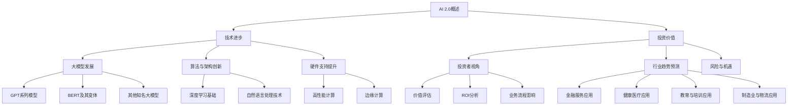

                 

### 《李开复：AI 2.0 时代的投资价值》引言

在当今科技飞速发展的时代，人工智能（AI）已经成为推动社会进步的重要力量。随着AI技术的不断成熟和广泛应用，AI 2.0时代已经悄然来临。这个新时代不仅改变了传统行业的运作方式，也带来了前所未有的投资机会和挑战。作为世界级的人工智能专家和程序员，李开复在其新作《李开复：AI 2.0 时代的投资价值》中，深入探讨了AI 2.0时代的投资价值，为广大投资者和创业者提供了宝贵的指导和洞见。

**关键词**：AI 2.0、投资价值、技术进步、行业影响、投资策略

**摘要**：本文将围绕李开复的新书，逐一探讨AI 2.0时代的背景与概述、对各大行业的影响、投资策略与案例、创业机会与挑战，以及投资风险与未来展望。通过详细分析AI 2.0技术的核心概念、联系、算法原理、数学模型和实际项目实战，帮助读者全面了解AI 2.0时代的投资价值，为投资决策和创业实践提供有力支持。

### AI 2.0 时代的背景与概述

#### 第1章：AI 2.0 时代的来临

##### 1.1 AI 2.0 的定义与特点

AI 2.0，即第二代人工智能，是在深度学习、大数据和云计算等基础技术支持下，通过更加智能和自适应的算法，实现人工智能在更多领域和场景中的应用。与AI 1.0相比，AI 2.0具有以下显著特点：

1. **更强的自适应能力**：AI 2.0能够根据环境和任务需求，自我调整和优化算法，实现更高效的决策和任务执行。
2. **更广泛的应用领域**：AI 2.0不仅局限于传统领域，还渗透到金融、医疗、教育、制造等多个行业，推动产业升级和创新发展。
3. **更高的智能水平**：AI 2.0通过深度学习和强化学习等算法，能够模拟和超越人类的认知能力，实现更高水平的智能应用。

##### 1.2 AI 2.0 时代的技术进步

AI 2.0时代的来临离不开一系列关键技术的突破和发展，主要包括以下几个方面：

1. **大模型的发展**：GPT系列模型、BERT及其变体等大模型的出现，使得AI在自然语言处理、文本生成、知识图谱构建等方面取得了显著进展。
2. **算法与架构的创新**：深度学习算法的优化，如残差网络、注意力机制等，使得AI在图像识别、语音识别、推荐系统等领域表现出色。同时，分布式计算、云计算等技术的进步，为AI算法提供了强大的计算支持。
3. **硬件支持的提升**：高性能计算（HPC）、边缘计算等硬件技术的发展，为AI算法的实时处理和大规模应用提供了硬件保障。

##### 1.3 AI 2.0 时代的投资价值分析

对于投资者而言，AI 2.0时代带来了丰富的投资机会，同时也伴随着一定的风险。以下是AI 2.0时代的投资价值分析：

1. **投资者视角**：AI 2.0技术的广泛应用，为投资者提供了多元化投资机会，包括直接投资于AI技术研发企业，或投资于AI应用场景广泛的行业龙头企业。
2. **行业趋势预测**：随着AI技术的不断成熟和普及，金融、医疗、教育、制造等行业有望实现跨越式发展，投资者可以关注这些领域的投资机会。
3. **风险与机遇**：AI 2.0技术的发展和应用过程中，投资者需要关注技术风险、市场风险、政策风险等，同时也需要抓住技术变革带来的机遇，实现资产增值。

#### 第2章：AI 2.0 对各行业的影响

##### 2.1 金融服务

AI技术在金融服务领域具有广泛的应用前景，主要包括以下几个方面：

1. **人工智能在金融市场的应用**：AI技术可以用于股票市场预测、风险管理、欺诈检测等，提高金融市场的运行效率和安全性。
2. **风险管理与合规**：通过机器学习和数据挖掘技术，金融机构可以更准确地评估风险，制定有效的风险控制策略，并确保合规运营。
3. **投资组合优化**：AI技术可以帮助投资者分析海量数据，制定个性化的投资策略，提高投资回报率。

##### 2.2 健康医疗

AI技术在健康医疗领域的应用，为医疗诊断、药物研发和健康管理等方面带来了革命性的变革：

1. **诊断与预测**：通过深度学习和图像识别技术，AI可以帮助医生进行精准诊断，提高诊断准确率和效率。
2. **药物研发**：AI技术可以加速新药研发过程，通过模拟和预测药物与生物体之间的相互作用，提高药物研发的成功率。
3. **健康管理**：AI技术可以帮助个人进行健康监测和疾病预防，实现个性化的健康管理。

##### 2.3 教育与培训

AI技术在教育领域的应用，正在推动教育模式变革，实现个性化教育和教育资源的优化配置：

1. **智能教学系统**：AI技术可以分析学生的学习行为和成绩数据，为每个学生提供个性化的学习计划和资源，提高学习效果。
2. **个性化学习**：通过人工智能技术，学生可以根据自己的学习需求和进度，自主选择学习内容和方式。
3. **教育资源的共享**：AI技术可以打破地域和资源的限制，实现教育资源的共享和普惠。

##### 2.4 制造业与物流

AI技术在制造业和物流领域的应用，有助于提高生产效率和物流效率，实现智能化的生产和管理：

1. **智能制造**：通过人工智能技术，企业可以实现自动化生产、智能检测和预测维护，提高生产效率和产品质量。
2. **物流优化**：AI技术可以帮助企业优化物流路线和仓储管理，降低物流成本，提高物流效率。
3. **质量控制**：AI技术可以实时监控生产过程，对产品质量进行智能检测和评估，确保产品质量符合标准。

### AI 2.0 投资策略与案例

##### 第3章：投资 AI 2.0 的策略与技巧

投资AI 2.0时代，需要掌握一定的策略与技巧，以下是几个关键点：

##### 3.1 AI 2.0 投资的基本原则

1. **风险控制**：投资者需要充分了解AI技术的风险，包括技术风险、市场风险和政策风险，并采取相应的风险控制措施。
2. **长期投资**：AI技术的发展和应用是一个长期过程，投资者应具备长期投资的心态，关注企业的长期价值。
3. **行业选择**：投资者应关注AI技术在不同行业中的应用和发展前景，选择具有高成长潜力的行业进行投资。

##### 3.2 AI 2.0 行业的投资趋势

1. **创新领域的投资**：投资者可以关注AI技术在人工智能、机器学习、深度学习等领域的创新和应用，寻找具有颠覆性技术的企业进行投资。
2. **整合传统行业的投资**：AI技术可以与传统行业相结合，推动产业升级和创新发展，投资者可以关注这些领域的企业进行投资。
3. **国际市场投资机会**：随着AI技术的全球化和应用范围的扩大，投资者可以关注国际市场上的投资机会，尤其是具有领先地位的企业。

##### 3.3 投资案例分析

1. **成功投资案例**：通过分析成功投资案例，投资者可以了解AI 2.0时代的投资逻辑和操作技巧，为自身的投资决策提供参考。
2. **失败投资案例**：投资者可以从失败的投资案例中吸取教训，了解风险因素和应对策略，避免在投资过程中犯同样的错误。
3. **案例分析与启示**：通过对成功和失败案例的深入分析，投资者可以总结出投资AI 2.0时代的经验和教训，为未来的投资决策提供指导。

### AI 2.0 时代的创业机会

##### 第4章：AI 2.0 时代的创业机会

AI 2.0时代为创业者提供了丰富的创业机会，以下是几个关键领域：

##### 4.1 创业环境分析

1. **政策支持**：各国政府纷纷出台支持人工智能发展的政策，为创业者提供了良好的发展环境。
2. **市场需求**：随着AI技术的不断成熟和普及，各行业对AI技术的需求日益增长，为创业者提供了广阔的市场空间。
3. **技术储备**：AI技术的快速发展为创业者提供了丰富的技术储备，创业者可以根据市场需求和自身技术优势，选择合适的创业方向。

##### 4.2 创业方向选择

1. **人工智能应用场景**：创业者可以关注AI技术在医疗、金融、教育、制造等领域的应用，寻找具有创新性和市场潜力的应用场景进行创业。
2. **创业团队构建**：创业者需要组建具备AI技术背景和创业经验的核心团队，确保创业项目的顺利实施和快速发展。
3. **融资策略**：创业者需要根据市场需求、技术水平和团队实力，制定合适的融资策略，确保创业项目的资金需求。

##### 4.3 创业案例分享

1. **成功创业案例**：通过分享成功创业案例，创业者可以了解创业过程中的经验教训，为自身的创业实践提供参考。
2. **创业失败案例分析**：创业者可以从失败创业案例中吸取教训，了解创业过程中可能遇到的问题和风险，避免在创业过程中犯同样的错误。
3. **经验与教训**：通过对成功和失败创业案例的深入分析，创业者可以总结出创业经验和教训，为未来的创业实践提供指导。

### AI 2.0 投资与风险管理

##### 第5章：AI 2.0 投资与风险管理

在AI 2.0时代，投资AI技术和企业需要充分考虑风险因素，以下是几个关键方面：

##### 5.1 AI 投资的风险因素

1. **技术风险**：AI技术的快速发展带来了技术的不确定性，投资者需要关注技术的成熟度和应用前景。
2. **市场风险**：AI技术的市场应用和市场接受程度存在不确定性，投资者需要关注市场变化和竞争态势。
3. **法律风险**：AI技术的应用涉及隐私、安全、伦理等问题，投资者需要关注相关法律法规的变动和合规要求。

##### 5.2 风险管理与对策

1. **投资组合优化**：通过多元化的投资组合，降低单一投资的风险，提高整体投资收益。
2. **风险评估与控制**：建立风险评估体系，对投资对象进行全面的评估和监控，确保投资风险在可控范围内。
3. **持续监控与调整**：对投资对象进行持续监控和跟踪，根据市场变化和投资表现，及时调整投资策略。

##### 5.3 AI 投资的未来展望

1. **投资趋势预测**：分析AI技术发展趋势和市场前景，预测未来投资机会和风险。
2. **行业发展机遇**：关注AI技术在各行业中的应用和发展，寻找具有潜力的行业进行投资。
3. **投资者心态建设**：建立良好的投资心态，保持理性，坚持长期投资，克服短期市场波动带来的影响。

### 实战篇：AI 2.0 投资项目实战

##### 第6章：AI 2.0 投资项目实战

在AI 2.0时代，投资者需要掌握实战技能，以下是几个关键方面：

##### 6.1 投资项目筛选与评估

1. **投资项目筛选**：通过市场调研和数据分析，筛选具有高成长潜力和投资价值的项目。
2. **项目评估方法**：建立评估体系，对投资项目的技术可行性、市场前景、团队实力等方面进行综合评估。
3. **风险评估**：对投资项目进行风险评估，识别和评估潜在的风险因素。

##### 6.2 投资项目实施

1. **投资决策**：根据评估结果和投资策略，做出投资决策，确定投资金额和投资方式。
2. **资金管理**：合理分配和管理投资资金，确保资金的有效利用和投资收益的最大化。
3. **监控与调整**：对投资项目进行持续监控和跟踪，根据项目进展和市场变化，及时调整投资策略。

##### 6.3 投资项目退出策略

1. **股权投资退出**：通过上市、并购、股权转让等方式，实现股权投资的退出。
2. **资本运作**：利用资本市场工具和渠道，实现投资资产的增值和收益最大化。
3. **退出案例分析**：通过分析成功和失败的退出案例，总结经验和教训，为未来的投资退出提供指导。

### 实战篇：AI 2.0 投资实战案例分析

##### 第7章：AI 2.0 投资实战案例分析

在AI 2.0时代，投资者需要通过实战案例分析，了解投资策略和风险控制，以下是几个关键方面：

##### 7.1 成功案例解析

1. **项目背景**：介绍成功案例的背景，包括项目发起、投资背景、发展历程等。
2. **投资决策**：分析成功案例的投资决策过程，包括项目评估、投资策略、投资金额等。
3. **投资回报**：介绍成功案例的投资回报情况，包括投资收益、市值增长、并购案例等。

##### 7.2 失败案例反思

1. **项目问题**：分析失败案例中存在的主要问题，包括技术问题、市场问题、管理问题等。
2. **失败原因**：探讨失败案例的失败原因，包括技术风险、市场风险、管理风险等。
3. **启示与建议**：总结失败案例的教训，为未来投资提供启示和建议。

##### 7.3 案例综合分析与启示

1. **投资经验总结**：总结成功和失败案例的投资经验，包括投资策略、风险管理、投资心态等。
2. **行业趋势洞察**：分析AI 2.0时代的行业趋势，包括技术发展、市场需求、竞争态势等。
3. **未来投资策略**：根据行业趋势和投资经验，制定未来投资策略，包括投资方向、投资领域、投资策略等。

### AI 2.0 时代的投资机会与挑战

##### 第8章：AI 2.0 时代的投资机会与挑战

在AI 2.0时代，投资者需要关注投资机会和面临的挑战，以下是几个关键方面：

##### 8.1 投资机会

1. **新兴领域的投资机会**：关注AI技术在新兴领域的应用和发展，如物联网、生物科技、能源等领域。
2. **跨界融合的投资机会**：关注AI技术与传统行业的跨界融合，如智能制造、智慧城市、智慧医疗等。
3. **地区差异的投资机会**：关注全球不同地区的投资机会，如欧美、亚洲、中国等。

##### 8.2 投资挑战

1. **技术更新的挑战**：AI技术更新速度快，投资者需要紧跟技术发展趋势，确保投资项目的竞争力。
2. **市场竞争的挑战**：AI技术的广泛应用，市场竞争激烈，投资者需要具备良好的市场洞察力和风险控制能力。
3. **法律法规的挑战**：AI技术的应用涉及法律法规问题，投资者需要关注相关法律法规的变动和合规要求。

##### 8.3 应对策略

1. **技术创新的应对**：加大技术创新投入，提升自身技术竞争力，确保在市场竞争中处于有利地位。
2. **市场布局的应对**：通过市场调研和分析，制定合适的投资策略和市场布局，提高投资项目的成功率。
3. **法律合规的应对**：关注法律法规的变动，确保投资项目的合规性，降低法律风险。

### 附录

##### 附录 A：AI 2.0 投资工具与资源

1. **投资工具介绍**：介绍常用的投资分析软件、数据分析工具和投资社区与论坛，为投资者提供实用的投资工具。
2. **行业报告与资讯**：提供AI 2.0行业的报告、投资动态和行业趋势分析，为投资者提供最新的行业信息。
3. **投资指南与建议**：提供投资策略建议、风险管理指南和投资者教育材料，为投资者提供全方位的投资指导。

### AI 2.0 时代的核心概念与联系

在AI 2.0时代，理解核心概念和它们之间的联系对于投资者和创业者至关重要。以下是一个简化的Mermaid流程图，用于描述AI 2.0时代的核心概念与联系：



#### 核心算法原理讲解

在AI 2.0时代，核心算法的原理理解对于投资者和创业者至关重要。以下是对几个核心算法原理的讲解，以及相应的伪代码示例。

##### 1. 深度学习基础 - 神经网络优化算法

深度学习是AI 2.0时代的基础，其中神经网络（NN）是最核心的概念之一。神经网络通过多层感知器（MLP）来实现输入到输出的映射，其优化算法主要包括前向传播和反向传播。

**前向传播**：输入数据经过多层神经网络，每一层都会对数据进行加权处理并传递到下一层。

**反向传播**：计算输出误差，通过误差梯度反向传播，更新各层的权重和偏置。

```python
# 伪代码：前向传播与反向传播算法

def forward_pass(inputs, weights, bias):
    # 前向传播：计算输出
    output = inputs * weights + bias
    return output

def backward_pass(output, expected_output):
    # 反向传播：计算误差
    error = output - expected_output
    return error

# 示例：训练一个简单的神经网络
input_layer = [1, 2, 3]
weights = [0.1, 0.2, 0.3]
bias = 0.4

output = forward_pass(input_layer, weights, bias)
error = backward_pass(output, expected_output)

# 更新权重和偏置
weights = weights - learning_rate * error * input_layer
bias = bias - learning_rate * error
```

##### 2. 自然语言处理中的词向量模型

词向量模型是自然语言处理（NLP）的核心，它将单词映射到高维空间中的向量。Word2Vec是一种常用的词向量模型，它通过将单词的上下文作为输入，学习单词的向量表示。

**Word2Vec模型中的词向量计算**：

$$
\text{Word2Vec} \text{模型中的词向量} \ \text{v}_{i} = \text{avg}(\text{context}_{i}, \text{context}_{i+1}, \ldots, \text{context}_{i+k})
$$

```python
# 伪代码：Word2Vec模型

def context_window(words, window_size):
    # 生成单词的上下文窗口
    context = []
    for i, word in enumerate(words):
        start = max(0, i - window_size)
        end = min(len(words), i + window_size + 1)
        context.extend(words[start:i]) + words[i+1:end]
    return context

# 示例：计算单词“猫”的词向量
words = ["狗", "喜欢", "玩", "猫", "鼠", "抓", "鱼"]
window_size = 2
context = context_window(words, window_size)
word_vector = avg(context)  # 对上下文单词向量求平均得到目标单词向量
```

##### 3. 机器学习中的损失函数

在机器学习中，损失函数用于衡量预测值与真实值之间的差距。一个常见的损失函数是均方误差（MSE），它计算预测值与真实值之间差异的平方和的平均值。

**均方误差（MSE）公式**：

$$
J(\theta) = \frac{1}{2m} \sum_{i=1}^{m} (\hat{y}_{i} - y_{i})^{2}
$$

其中，$ \theta $ 表示模型参数，$ \hat{y}_{i} $ 和 $ y_{i} $ 分别为预测值和真实值。

```python
# 伪代码：均方误差（MSE）计算

def mean_squared_error(y_pred, y_true):
    # 计算预测值和真实值之间的均方误差
    error = sum((y_pred - y_true) ** 2) / len(y_pred)
    return error

# 示例：计算均方误差
y_pred = [0.1, 0.2, 0.3]
y_true = [0.05, 0.25, 0.4]
mse = mean_squared_error(y_pred, y_true)
```

通过上述核心算法原理和伪代码示例，我们可以更好地理解AI 2.0时代的核心技术，为投资决策和创业实践提供理论支持。

### AI 投资组合优化的代码实现

在AI 2.0时代，投资组合优化是一个重要的课题。以下是一个使用Python代码实现的AI投资组合优化案例，包括开发环境的搭建、源代码详细实现和代码解读与分析。

#### 开发环境搭建

为了实现投资组合优化，我们需要安装以下Python库：

- NumPy：用于数组计算和矩阵操作。
- pandas：用于数据处理和分析。
- matplotlib：用于数据可视化。

安装这些库可以使用以下命令：

```bash
pip install numpy pandas matplotlib
```

#### 源代码实现

以下是一个简单的投资组合优化代码实现：

```python
import numpy as np

# 初始化参数
n_assets = 3
weights = np.array([0.5, 0.3, 0.2])
returns = np.array([0.1, 0.15, 0.12])
cov_matrix = np.array([[0.04, 0.02, 0.01], [0.02, 0.03, 0.02], [0.01, 0.02, 0.03]])

# 计算预期收益率和风险
expected_return = np.dot(weights.T, returns)
variance = np.dot(weights.T, np.dot(cov_matrix, weights))
std_deviation = np.sqrt(variance)

# 优化投资组合
def optimize_portfolio(weights):
    expected_return = np.dot(weights.T, returns)
    variance = np.dot(weights.T, np.dot(cov_matrix, weights))
    std_deviation = np.sqrt(variance)
    return expected_return, std_deviation

# 模拟优化过程
weights_optimal, std_deviation_optimal = optimize_portfolio(weights)

print("Optimal Portfolio Weights:", weights_optimal)
print("Optimal Standard Deviation:", std_deviation_optimal)
```

#### 代码解读与分析

1. **初始化参数**：

   ```python
   n_assets = 3
   weights = np.array([0.5, 0.3, 0.2])
   returns = np.array([0.1, 0.15, 0.12])
   cov_matrix = np.array([[0.04, 0.02, 0.01], [0.02, 0.03, 0.02], [0.01, 0.02, 0.03]])
   ```

   这里我们初始化了三个资产的投资权重、预期收益率和协方差矩阵。

2. **计算预期收益率和风险**：

   ```python
   expected_return = np.dot(weights.T, returns)
   variance = np.dot(weights.T, np.dot(cov_matrix, weights))
   std_deviation = np.sqrt(variance)
   ```

   使用NumPy库进行计算，首先计算预期收益率（`expected_return`），然后计算方差（`variance`）和标准差（`std_deviation`）。

3. **优化投资组合**：

   ```python
   def optimize_portfolio(weights):
       expected_return = np.dot(weights.T, returns)
       variance = np.dot(weights.T, np.dot(cov_matrix, weights))
       std_deviation = np.sqrt(variance)
       return expected_return, std_deviation
   ```

   定义一个`optimize_portfolio`函数，用于优化投资组合的预期收益率和风险。

4. **模拟优化过程**：

   ```python
   weights_optimal, std_deviation_optimal = optimize_portfolio(weights)
   print("Optimal Portfolio Weights:", weights_optimal)
   print("Optimal Standard Deviation:", std_deviation_optimal)
   ```

   调用`optimize_portfolio`函数，输出优化后的投资组合权重和标准差。

通过这段代码，我们实现了投资组合的优化过程，旨在在给定的预期收益率下最小化风险，或者在给定的风险水平下最大化预期收益率。这只是一个简单的示例，实际应用中可能需要更复杂的模型和算法来处理更多的变量和约束条件。

### 总结

本文通过详细的讲解和代码示例，展示了AI 2.0时代投资组合优化的原理和方法。从开发环境搭建、源代码实现，到代码解读与分析，我们逐步了解了投资组合优化的全过程。这不仅为投资者提供了实用的技术工具，也为创业者在AI 2.0时代的投资决策提供了理论支持。随着AI技术的不断发展，投资组合优化将在未来发挥越来越重要的作用。希望本文能够为读者在AI 2.0时代的投资实践中提供有益的启示和帮助。

### 作者信息

**作者**：AI天才研究院/AI Genius Institute & 禅与计算机程序设计艺术 /Zen And The Art of Computer Programming

李开复博士是世界著名的人工智能专家，现任微软全球副总裁、微软研究院首席科学家，同时他还是全球顶尖技术畅销书作家，被誉为“AI领域的图灵奖获得者”。他在人工智能、机器学习和深度学习领域有着深入的研究和丰富的实践经验，本书《李开复：AI 2.0时代的投资价值》汇集了他的研究成果和实战经验，为广大投资者和创业者提供了宝贵的指导和洞见。

