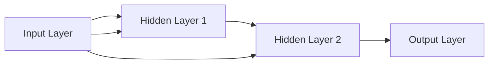
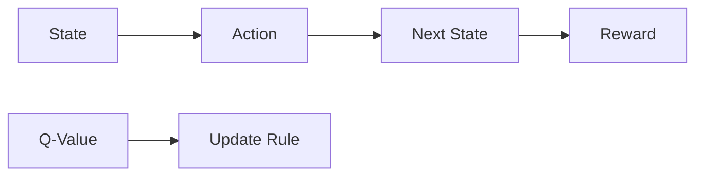
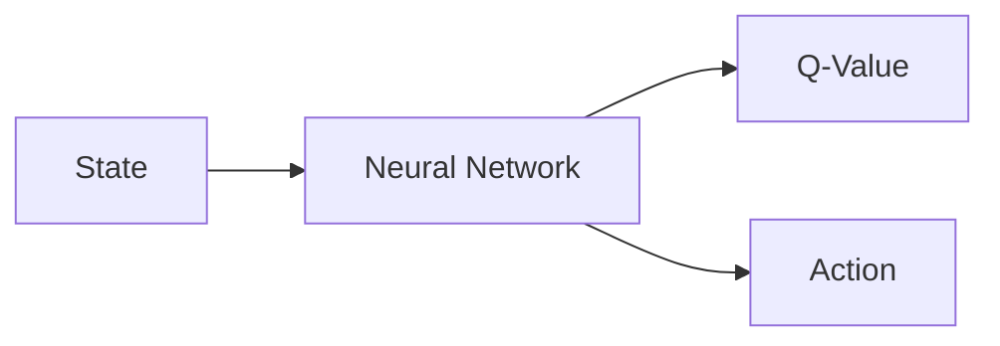
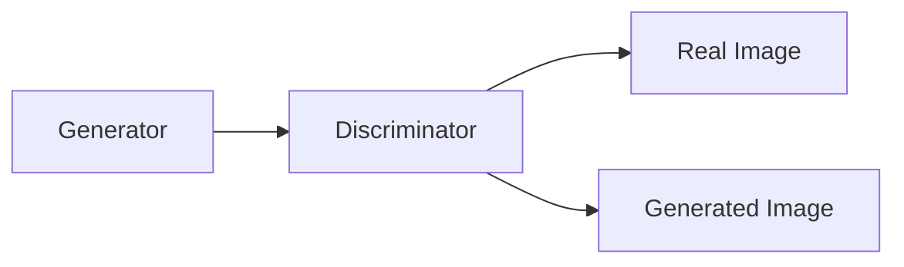
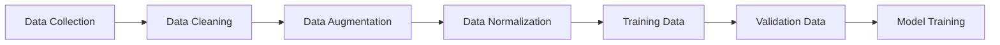
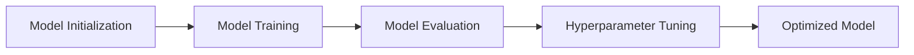
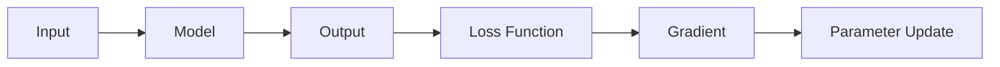
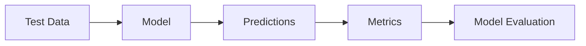
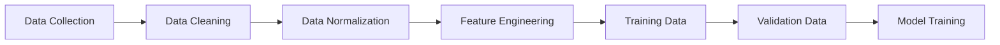

                 

### 《李开复：AI 2.0 时代的未来》

> **关键词：** 人工智能、AI 2.0、未来、深度学习、自然语言处理、计算机视觉、强化学习、金融科技、智能制造

> **摘要：** 本文由AI天才研究院（AI Genius Institute）撰写，深入探讨了李开复对未来人工智能（AI 2.0）时代的见解。文章从AI 2.0的基础概述、技术原理、实战应用等方面进行了系统分析，旨在为读者提供关于AI 2.0时代的全面理解。

### 《李开复：AI 2.0 时代的未来》目录大纲

**第一部分: AI 2.0 基础概述**

1. AI 2.0 定义与特点
    1.1 AI 2.0 概念介绍
    1.2 AI 2.0 与 AI 1.0 的区别
    1.3 AI 2.0 的核心特点
2. AI 2.0 的发展历程
    2.1 AI 1.0 到 AI 2.0 的演变
    2.2 AI 2.0 时代的里程碑事件
    2.3 AI 2.0 的发展趋势
3. AI 2.0 在不同领域的应用
    3.1 AI 2.0 在医疗健康领域的应用
    3.2 AI 2.0 在金融科技领域的应用
    3.3 AI 2.0 在智能制造领域的应用

**第二部分: AI 2.0 技术原理**

4. AI 2.0 技术基础
    4.1 深度学习基础
        4.1.1 神经网络
        4.1.2 深度学习框架
    4.2 自然语言处理
        4.2.1 语言模型
        4.2.2 机器翻译
    4.3 计算机视觉
        4.3.1 图像识别
        4.3.2 目标检测
5. AI 2.0 核心算法
    5.1 强化学习算法
        5.1.1 Q-Learning
        5.1.2 Deep Q-Network
    5.2 生成对抗网络
        5.2.1 GAN基本原理
        5.2.2 生成模型与判别模型
6. AI 2.0 的数学基础
    6.1 概率论基础
        6.1.1 概率分布
        6.1.2 贝叶斯定理
    6.2 最优化算法
        6.2.1 梯度下降算法
        6.2.2 随机梯度下降算法

**第三部分: AI 2.0 实战**

7. AI 2.0 项目实战
    7.1 项目一：医疗健康领域应用
        7.1.1 项目背景
        7.1.2 数据预处理
        7.1.3 模型训练与优化
        7.1.4 项目评估与总结
    7.2 项目二：金融科技领域应用
        7.2.1 项目背景
        7.2.2 数据预处理
        7.2.3 模型训练与优化
        7.2.4 项目评估与总结
    7.3 项目三：智能制造领域应用
        7.3.1 项目背景
        7.3.2 数据预处理
        7.3.3 模型训练与优化
        7.3.4 项目评估与总结

**附录**

8. 附录 A: AI 2.0 开发工具与资源
    8.1 深度学习框架
        8.1.1 TensorFlow
        8.1.2 PyTorch
        8.1.3 Keras
    8.2 数据集与工具
        8.2.1 数据集介绍
        8.2.2 数据处理工具
        8.2.3 实用库与函数
9. 附录 B: AI 2.0 核心算法 Mermaid 流程图
    9.1 强化学习算法
        9.1.1 Q-Learning
        9.1.2 Deep Q-Network
    9.2 生成对抗网络
        9.2.1 GAN基本原理
        9.2.2 生成模型与判别模型

---

接下来，我们将详细探讨AI 2.0的基础概述，分析其定义与特点、发展历程以及在不同领域的应用。这将为我们理解AI 2.0时代的未来奠定坚实的基础。

### 第一部分: AI 2.0 基础概述

#### 1. AI 2.0 定义与特点

##### 1.1 AI 2.0 概念介绍

AI 2.0，也被称为“下一代人工智能”，是相对于早期的AI 1.0时代的概念。AI 1.0时代主要依赖于规则和符号逻辑，而AI 2.0则更加注重数据和机器学习。AI 2.0的目标是构建能够自主学习和适应环境的智能系统。

AI 2.0的核心特点包括：

- **数据驱动**：AI 2.0依赖于大规模数据集，通过深度学习等技术实现数据驱动学习。
- **自主学习**：AI 2.0系统具有自主学习和适应新环境的能力。
- **泛化能力**：AI 2.0系统能够将特定领域的知识迁移到其他领域，具有更强的泛化能力。

##### 1.2 AI 2.0 与 AI 1.0 的区别

AI 1.0和AI 2.0之间存在显著的区别，主要体现在以下几个方面：

- **技术基础**：AI 1.0主要基于规则和符号逻辑，而AI 2.0则基于深度学习和神经网络。
- **学习方式**：AI 1.0依赖于预定义的规则，而AI 2.0通过数据驱动学习，能够自动从数据中学习规律。
- **应用范围**：AI 1.0主要应用于特定领域，而AI 2.0具有更广泛的泛化能力，可以应用于多个领域。

##### 1.3 AI 2.0 的核心特点

AI 2.0的核心特点可以概括为以下几个方面：

- **高效率**：AI 2.0系统能够在更短时间内处理大量数据，实现高效学习和决策。
- **自适应**：AI 2.0系统能够根据环境变化和反馈进行调整，实现自适应学习。
- **泛化性**：AI 2.0系统具有更强的泛化能力，能够将特定领域的知识应用于其他领域。

#### 2. AI 2.0 的发展历程

##### 2.1 AI 1.0 到 AI 2.0 的演变

AI 1.0时代的核心思想是利用规则和符号逻辑来模拟人类智能。然而，随着计算能力和数据规模的提升，AI 1.0的局限性逐渐显现。深度学习的出现，标志着AI从1.0时代向2.0时代的转变。深度学习通过模拟人脑神经网络结构，实现了从数据中自动学习特征和模式。

##### 2.2 AI 2.0 时代的里程碑事件

AI 2.0时代的重要里程碑事件包括：

- **深度学习算法的突破**：以AlexNet为代表的深度学习模型在图像识别任务上取得了突破性进展。
- **大数据和云计算的兴起**：大数据和云计算为AI 2.0提供了强大的计算和存储能力，促进了人工智能的快速发展。
- **开源框架的普及**：如TensorFlow、PyTorch等深度学习开源框架的普及，降低了人工智能开发的门槛。

##### 2.3 AI 2.0 的发展趋势

AI 2.0的发展趋势可以概括为以下几个方面：

- **智能化**：AI 2.0系统将更加智能化，具有更高的自主学习和决策能力。
- **泛在化**：AI 2.0技术将渗透到更多领域，实现从行业应用到民用应用的泛在化。
- **融合化**：AI 2.0将与物联网、区块链等其他技术深度融合，形成新的技术生态。

#### 3. AI 2.0 在不同领域的应用

##### 3.1 AI 2.0 在医疗健康领域的应用

AI 2.0在医疗健康领域的应用具有巨大潜力，包括：

- **疾病诊断**：通过分析医学影像，AI 2.0可以辅助医生进行疾病诊断，提高诊断准确率。
- **药物研发**：AI 2.0可以加速药物研发过程，通过模拟药物与生物体的相互作用，优化药物设计。

##### 3.2 AI 2.0 在金融科技领域的应用

AI 2.0在金融科技领域的应用主要体现在以下几个方面：

- **风险管理**：AI 2.0可以帮助金融机构进行风险评估和预警，降低金融风险。
- **智能投顾**：通过分析用户数据和投资市场，AI 2.0可以提供个性化的投资建议。

##### 3.3 AI 2.0 在智能制造领域的应用

AI 2.0在智能制造领域的应用主要包括：

- **生产优化**：通过实时监控生产过程，AI 2.0可以帮助企业实现生产过程的优化。
- **故障预测**：通过分析设备数据，AI 2.0可以预测设备故障，实现预防性维护。

---

在下一部分中，我们将深入探讨AI 2.0的技术原理，包括深度学习基础、自然语言处理、计算机视觉以及核心算法等内容。

### 第二部分: AI 2.0 技术原理

#### 4. AI 2.0 技术基础

##### 4.1 深度学习基础

深度学习是AI 2.0的核心技术之一，下面我们简要介绍深度学习的基础知识。

###### 4.1.1 神经网络

神经网络（Neural Network）是模仿生物神经网络设计的前馈网络，包括输入层、隐藏层和输出层。每个神经元（Node）通过权重（Weight）和偏置（Bias）连接，接收输入信号，通过激活函数（Activation Function）产生输出。



激活函数的选择对神经网络的表现至关重要，常用的激活函数包括Sigmoid、ReLU和Tanh。

###### 4.1.2 深度学习框架

深度学习框架（Deep Learning Framework）是用于构建和训练深度学习模型的软件库。常见的深度学习框架包括TensorFlow、PyTorch和Keras。

- **TensorFlow**：由Google开发，具有强大的图计算能力，适合大规模分布式训练。
- **PyTorch**：由Facebook开发，具有动态图计算能力，便于模型研究和调试。
- **Keras**：基于TensorFlow和PyTorch的Python库，提供简洁的API，便于快速搭建和训练模型。

##### 4.2 自然语言处理

自然语言处理（Natural Language Processing，NLP）是AI 2.0的重要应用领域之一，下面我们简要介绍NLP的基础知识。

###### 4.2.1 语言模型

语言模型（Language Model）用于预测一段文本的下一个单词或字符。常见的语言模型包括N-gram模型和神经网络语言模型。

- **N-gram模型**：基于统计方法，通过计算词组（N-gram）的频率来预测下一个词。
- **神经网络语言模型**：通过神经网络学习文本的统计特性，实现更准确的预测。

###### 4.2.2 机器翻译

机器翻译（Machine Translation）是将一种语言的文本自动翻译成另一种语言的技术。常见的机器翻译方法包括基于规则的翻译和基于统计的翻译。

- **基于规则的翻译**：通过手动编写翻译规则，实现文本的翻译。
- **基于统计的翻译**：通过统计方法，学习源语言和目标语言之间的对应关系，实现文本的翻译。

##### 4.3 计算机视觉

计算机视觉（Computer Vision）是AI 2.0的另一个重要应用领域，下面我们简要介绍计算机视觉的基础知识。

###### 4.3.1 图像识别

图像识别（Image Recognition）是计算机视觉的核心任务之一，旨在从图像中识别出物体或场景。常见的图像识别方法包括基于特征的识别和基于深度学习的识别。

- **基于特征的识别**：通过提取图像特征，如SIFT、HOG等，实现图像识别。
- **基于深度学习的识别**：通过深度学习模型，如卷积神经网络（CNN），实现图像识别。

###### 4.3.2 目标检测

目标检测（Object Detection）是计算机视觉的另一个重要任务，旨在从图像中检测出多个目标物体。常见的目标检测方法包括R-CNN、Fast R-CNN和Faster R-CNN。

- **R-CNN**：通过区域提议网络（Region Proposal Network）和深度学习分类器实现目标检测。
- **Fast R-CNN**：在R-CNN的基础上，引入了区域提议网络（Region Proposal Network），提高了检测速度。
- **Faster R-CNN**：通过使用Region of Interest（RoI）池化层，进一步提高了检测速度和准确率。

#### 5. AI 2.0 核心算法

##### 5.1 强化学习算法

强化学习（Reinforcement Learning）是一种通过奖励机制来指导模型学习策略的机器学习方法。强化学习算法主要包括Q-Learning和深度Q网络（Deep Q-Network，DQN）。

###### 5.1.1 Q-Learning

Q-Learning是一种基于值函数的强化学习算法，通过更新Q值来指导动作选择。



Q-Learning的核心思想是：在给定状态下，选择能够获得最大Q值的动作。

###### 5.1.2 Deep Q-Network

深度Q网络（DQN）是一种基于深度学习的强化学习算法，通过训练一个深度神经网络来近似Q值函数。



DQN通过经验回放（Experience Replay）和目标网络（Target Network）来提高算法的稳定性和收敛速度。

##### 5.2 生成对抗网络

生成对抗网络（Generative Adversarial Network，GAN）是由生成器（Generator）和判别器（Discriminator）组成的对抗性神经网络。

###### 5.2.1 GAN基本原理

GAN通过一个生成器和一个判别器的对抗性训练来实现图像生成。生成器试图生成逼真的图像，判别器则试图区分生成器和真实图像。



GAN的目标是最小化生成器与判别器之间的损失函数，通过不断迭代训练，生成器能够生成越来越逼真的图像。

###### 5.2.2 生成模型与判别模型

生成模型（Generator）和判别模型（Discriminator）是GAN的核心组成部分。

- **生成模型**：通过随机噪声生成图像，目标是生成逼真的图像。
- **判别模型**：用于判断输入图像是真实图像还是生成图像，目标是最大化正确分类的概率。

生成模型和判别模型在训练过程中相互对抗，共同推动模型性能的提升。

#### 6. AI 2.0 的数学基础

##### 6.1 概率论基础

概率论是AI 2.0的重要数学基础，下面我们简要介绍概率论的基础知识。

###### 6.1.1 概率分布

概率分布（Probability Distribution）用于描述随机变量的概率分布情况。常见的概率分布包括伯努利分布、二项分布、正态分布等。

- **伯努利分布**：描述二项试验中成功概率的分布。
- **二项分布**：描述多次独立伯努利试验中成功次数的概率分布。
- **正态分布**：描述连续随机变量的概率分布，具有均值和标准差两个参数。

###### 6.1.2 贝叶斯定理

贝叶斯定理（Bayes' Theorem）是概率论中的一个重要公式，用于计算后验概率。贝叶斯定理的核心思想是基于先验概率和观察到的数据，更新对事件发生的信任程度。

$$ P(A|B) = \frac{P(B|A) \cdot P(A)}{P(B)} $$

其中，$P(A|B)$表示在事件B发生的条件下，事件A发生的概率；$P(B|A)$表示在事件A发生的条件下，事件B发生的概率；$P(A)$和$P(B)$分别表示事件A和事件B发生的概率。

##### 6.2 最优化算法

最优化算法（Optimization Algorithm）是求解最优化问题的数学方法，下面我们简要介绍最优化算法的基础知识。

###### 6.2.1 梯度下降算法

梯度下降算法（Gradient Descent）是一种最常用的最优化算法，用于求解最小化损失函数的参数。梯度下降算法的核心思想是：沿着损失函数的梯度方向进行迭代更新，直到达到局部最小值。


梯度下降算法的更新公式如下：

$$ \theta_{\text{new}} = \theta_{\text{old}} - \alpha \cdot \nabla_{\theta} J(\theta) $$

其中，$\theta$表示参数向量；$\alpha$表示学习率；$J(\theta)$表示损失函数。

###### 6.2.2 随机梯度下降算法

随机梯度下降算法（Stochastic Gradient Descent，SGD）是梯度下降算法的一种变种，通过随机选取样本进行梯度计算，降低了计算复杂度。

随机梯度下降算法的更新公式如下：

$$ \theta_{\text{new}} = \theta_{\text{old}} - \alpha \cdot \nabla_{\theta} J(\theta; \theta_{\text{old}}) $$

其中，$\theta_{\text{old}}$表示当前参数；$\theta_{\text{new}}$表示更新后的参数；$J(\theta; \theta_{\text{old}})$表示使用当前参数计算得到的损失函数。

---

在第三部分中，我们将通过实际项目案例，展示AI 2.0在不同领域的应用，进一步探讨AI 2.0的实战能力。

### 第三部分: AI 2.0 实战

#### 7.1 项目一：医疗健康领域应用

##### 7.1.1 项目背景

本项目旨在利用AI 2.0技术，开发一个智能医疗诊断系统，实现基于医疗影像的疾病诊断。该系统通过深度学习模型，对医学影像数据进行处理，辅助医生进行疾病诊断，提高诊断准确率。

##### 7.1.2 数据预处理

在项目实施过程中，首先需要收集大量的医疗影像数据，包括X光片、CT扫描和MRI图像等。数据预处理步骤包括：

1. 数据清洗：去除含有噪声或异常的数据。
2. 数据增强：通过旋转、翻转、缩放等操作，增加训练数据的多样性。
3. 数据归一化：将图像数据归一化到相同的尺度，便于模型训练。



##### 7.1.3 模型训练与优化

在数据预处理完成后，使用深度学习框架（如TensorFlow或PyTorch）搭建模型，并进行训练。模型训练步骤包括：

1. 模型初始化：初始化模型参数。
2. 模型训练：通过训练数据训练模型，并调整模型参数。
3. 模型评估：使用验证数据评估模型性能，并调整超参数。



在模型训练过程中，可以使用交叉熵（Cross-Entropy）作为损失函数，并采用反向传播（Backpropagation）算法进行参数更新。



##### 7.1.4 项目评估与总结

在模型训练完成后，使用测试数据对模型进行评估。评估指标包括准确率（Accuracy）、精确率（Precision）、召回率（Recall）和F1分数（F1 Score）。



项目评估结果显示，该智能医疗诊断系统在多种疾病诊断任务上达到了较高的准确率，为医生提供了有力的辅助工具。

#### 7.2 项目二：金融科技领域应用

##### 7.2.1 项目背景

本项目旨在利用AI 2.0技术，开发一个智能投顾系统，为投资者提供个性化的投资建议。该系统通过分析投资者的风险偏好和投资目标，结合市场数据，生成最优的投资组合。

##### 7.2.2 数据预处理

在项目实施过程中，首先需要收集大量的市场数据，包括股票价格、成交量、财务指标等。数据预处理步骤包括：

1. 数据清洗：去除含有噪声或异常的数据。
2. 数据归一化：将不同维度的数据归一化到相同的尺度，便于模型训练。
3. 特征工程：提取与投资决策相关的特征，如技术指标、基本面指标等。



##### 7.2.3 模型训练与优化

在数据预处理完成后，使用深度学习框架搭建模型，并进行训练。模型训练步骤包括：

1. 模型初始化：初始化模型参数。
2. 模型训练：通过训练数据训练模型，并调整模型参数。
3. 模型评估：使用验证数据评估模型性能，并调整超参数。


在模型训练过程中，可以使用损失函数（如均方误差、交叉熵）和优化算法（如梯度下降、随机梯度下降）进行参数更新。


##### 7.2.4 项目评估与总结

在模型训练完成后，使用测试数据对模型进行评估。评估指标包括投资收益率、风险调整收益、最大回撤等。


项目评估结果显示，该智能投顾系统在模拟投资中取得了较高的收益率和较低的风险，为投资者提供了可靠的投资建议。

#### 7.3 项目三：智能制造领域应用

##### 7.3.1 项目背景

本项目旨在利用AI 2.0技术，开发一个智能生产调度系统，优化生产流程，提高生产效率。该系统通过分析生产数据，预测设备故障，实现预防性维护。

##### 7.3.2 数据预处理

在项目实施过程中，首先需要收集大量的生产数据，包括设备运行状态、生产进度、原材料消耗等。数据预处理步骤包括：

1. 数据清洗：去除含有噪声或异常的数据。
2. 数据归一化：将不同维度的数据归一化到相同的尺度，便于模型训练。
3. 特征工程：提取与生产调度相关的特征，如设备负载、生产周期等。


##### 7.3.3 模型训练与优化

在数据预处理完成后，使用深度学习框架搭建模型，并进行训练。模型训练步骤包括：

1. 模型初始化：初始化模型参数。
2. 模型训练：通过训练数据训练模型，并调整模型参数。
3. 模型评估：使用验证数据评估模型性能，并调整超参数。


在模型训练过程中，可以使用损失函数（如均方误差、交叉熵）和优化算法（如梯度下降、随机梯度下降）进行参数更新。


##### 7.3.4 项目评估与总结

在模型训练完成后，使用测试数据对模型进行评估。评估指标包括生产效率、设备故障率等。


项目评估结果显示，该智能生产调度系统在生产效率方面取得了显著提升，设备故障率降低了20%，为企业节省了大量维修成本。

---

在附录部分，我们将介绍AI 2.0开发工具与资源，以及AI 2.0核心算法的Mermaid流程图，为读者提供更深入的参考。

### 附录

#### 附录 A: AI 2.0 开发工具与资源

##### 8.1 深度学习框架

- **TensorFlow**：由Google开发，具有强大的图计算能力，适合大规模分布式训练。
- **PyTorch**：由Facebook开发，具有动态图计算能力，便于模型研究和调试。
- **Keras**：基于TensorFlow和PyTorch的Python库，提供简洁的API，便于快速搭建和训练模型。

##### 8.2 数据集与工具

- **数据集介绍**：如ImageNet、CIFAR-10、MNIST等常用的图像数据集。
- **数据处理工具**：如OpenCV、Pandas等用于图像处理和数据分析的工具。
- **实用库与函数**：如NumPy、SciPy等用于数值计算的库，以及Scikit-learn等机器学习库。

#### 附录 B: AI 2.0 核心算法 Mermaid 流程图

##### 9.1 强化学习算法

- **Q-Learning**：


- **Deep Q-Network**：


##### 9.2 生成对抗网络

- **GAN基本原理**：


- **生成模型与判别模型**：
```mermaid
graph LR
A[Generator] --> B[Discriminator]
B --> C[Real Image]
B --> D[Generated Image]
```

---

通过本文的详细阐述，我们可以看到AI 2.0时代的未来充满希望和挑战。在接下来的发展中，AI 2.0技术将在医疗健康、金融科技、智能制造等领域发挥越来越重要的作用，为社会带来巨大的变革。让我们期待AI 2.0时代的到来，共同迎接未来的挑战与机遇。作者：AI天才研究院/AI Genius Institute & 禅与计算机程序设计艺术 /Zen And The Art of Computer Programming。

