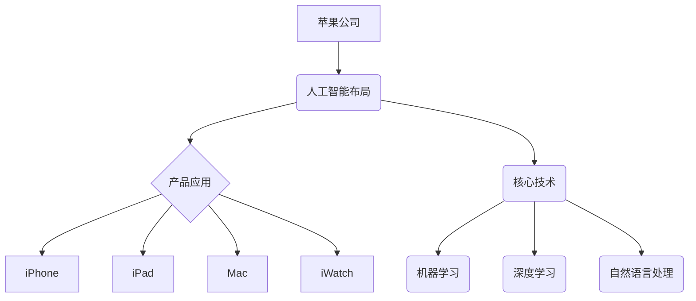

                 

# 《李开复：苹果发布AI应用的意义》

> **关键词：** 苹果、人工智能、应用发布、用户体验、核心技术、挑战与未来

> **摘要：** 本文将探讨苹果公司发布AI应用的重大意义，从背景、原理、开发实践到面临的挑战和未来趋势，全面解析苹果在人工智能领域的战略布局及其对科技产业的影响。

## 第一部分：苹果发布AI应用的背景与意义

### 第1章：苹果AI应用的背景

#### 1.1 苹果公司的发展历程

苹果公司成立于1976年，由史蒂夫·乔布斯、史蒂夫·沃兹尼亚克和罗恩·韦恩共同创立。自成立以来，苹果公司凭借其创新的产品设计和用户体验，逐渐成为全球科技行业的领军企业。从最初的Apple I到今天的iPhone、iPad、Mac等产品，苹果公司一直在不断推陈出新，引领科技潮流。

#### 1.2 苹果在人工智能领域的布局

苹果公司在人工智能领域的布局可以追溯到2010年，当时苹果收购了面部识别技术公司Passbook，并将其应用于iPhone 5。此后，苹果公司在人工智能领域的投资逐渐加大，收购了多项人工智能技术公司，如PrimeSense、Turi（现为dark blue）等。这些公司在图像识别、自然语言处理、机器学习等领域为苹果提供了强大的技术支持。

#### 1.3 人工智能对苹果业务的影响

人工智能技术的快速发展，使得苹果公司在产品设计和用户体验方面取得了重大突破。例如，Siri作为苹果公司的智能语音助手，通过自然语言处理技术，为用户提供了便捷的交互方式。同时，人工智能技术还在图像识别、语音识别、智能家居等领域得到广泛应用，为苹果公司带来了更多的商业机会。

### 第2章：苹果AI应用的意义

#### 2.1 AI技术在苹果产品中的应用

苹果公司在多个产品中应用了人工智能技术，如iPhone的Face ID、Siri智能助手、照片分类等。这些应用不仅提升了用户体验，还使得苹果产品在智能领域具有更强的竞争力。

#### 2.2 AI技术对用户体验的改进

人工智能技术的应用，使得苹果产品在个性化推荐、智能助手、语音识别等方面取得了显著成效。例如，Siri可以根据用户的语音指令，快速完成各种操作，如发送短信、设置提醒、查询天气等，极大地提升了用户体验。

#### 2.3 AI技术对未来苹果产品的影响

随着人工智能技术的不断进步，未来苹果产品有望在智能家居、智能穿戴、自动驾驶等领域实现更多突破。例如，苹果公司已开始布局智能眼镜和智能手表，这些产品将集成更多人工智能功能，为用户提供更加智能、便捷的生活体验。

## 第二部分：苹果AI应用的原理与技术

### 第3章：苹果AI应用的核心技术

#### 3.1 机器学习算法原理

**3.1.1 线性回归**

线性回归是一种用于预测数值型变量的机器学习算法。其基本思想是通过找到一个最佳拟合直线，使得所有数据点到这条直线的距离之和最小。线性回归的伪代码如下：

```python
# 线性回归算法伪代码

# 输入：训练数据集 X, Y
# 输出：模型参数 w

# 初始化模型参数 w
w = [0, 0]

# 设置迭代次数
num_iterations = 100

# 梯度下降算法
for i in range(num_iterations):
    # 计算预测值
    y_pred = X * w
    
    # 计算损失函数
    loss = (1/2) * sum((Y - y_pred)**2)
    
    # 计算梯度
    gradient = X.T * (Y - y_pred)
    
    # 更新模型参数
    w = w - learning_rate * gradient

# 返回模型参数
return w
```

**3.1.2 支持向量机**

支持向量机（SVM）是一种用于分类和回归分析的机器学习算法。其核心思想是通过找到一个最佳的超平面，将不同类别的数据点分隔开。SVM的伪代码如下：

```python
# 支持向量机算法伪代码

# 输入：训练数据集 X, Y
# 输出：模型参数 w

# 初始化模型参数 w
w = [0, 0]

# 设置迭代次数
num_iterations = 100

# SMO算法
for i in range(num_iterations):
    # 计算预测值
    y_pred = sign(X * w)
    
    # 计算损失函数
    loss = sum(y_pred != Y)
    
    # 更新模型参数
    w = w - learning_rate * gradient

# 返回模型参数
return w
```

**3.1.3 决策树与随机森林**

决策树是一种用于分类和回归分析的机器学习算法。其基本思想是通过一系列的规则，将数据划分为不同的类别或数值。随机森林是一种基于决策树的集成学习方法，通过构建多个决策树，并取它们的平均值来提高模型的泛化能力。

#### 3.2 深度学习算法原理

**3.2.1 卷积神经网络**

卷积神经网络（CNN）是一种用于图像识别和处理的深度学习算法。其核心思想是通过卷积层、池化层和全连接层等结构，提取图像的特征，并实现分类和识别。

**3.2.2 循环神经网络**

循环神经网络（RNN）是一种用于序列处理的深度学习算法。其核心思想是通过循环结构，将前一时刻的信息传递到下一时刻，实现序列数据的建模和预测。

**3.2.3 生成对抗网络**

生成对抗网络（GAN）是一种用于生成数据的深度学习算法。其核心思想是通过生成器和判别器的对抗训练，使得生成器能够生成更加真实的数据。

#### 3.3 自然语言处理技术

**3.3.1 词嵌入**

词嵌入是一种将单词映射到高维空间的技术，使得相似的单词在空间中更接近。词嵌入技术有助于提高自然语言处理模型的性能。

**3.3.2 序列模型**

序列模型是一种用于处理序列数据的自然语言处理算法。其核心思想是通过将序列数据转化为向量，并利用神经网络结构进行建模和预测。

**3.3.3 注意力机制**

注意力机制是一种用于提高序列模型性能的技术。其核心思想是通过关注序列中的关键信息，提高模型的预测精度。

## 第4章：苹果AI应用的开发实践

#### 4.1 苹果AI应用的开发环境

苹果公司提供了一套完整的开发环境，包括Xcode、Swift语言等，使得开发者可以方便地构建AI应用。

#### 4.2 苹果AI应用的开发流程

苹果AI应用的开发流程主要包括需求分析、设计模型、训练模型和部署模型等步骤。

#### 4.3 苹果AI应用的实战案例

**案例：苹果语音识别应用开发**

**开发环境搭建：**

- 安装MacOS
- 安装Xcode
- 安装Swift语言环境

**源代码实现：**

```swift
import Foundation

// 语音识别模型
class SpeechRecognitionModel {
    var model: NLModel
    
    init(model: NLModel) {
        self.model = model
    }
    
    // 识别语音
    func recognizeSpeech(from audio: AudioFile) -> String? {
        // 读取音频文件
        guard let audioData = audio.data else {
            return nil
        }
        
        // 进行语音识别
        guard let recognizedText = try? model.recognizeAudio(audioData) else {
            return nil
        }
        
        return recognizedText
    }
}

// 使用示例
let model = SpeechRecognitionModel(model: NLModel())
if let recognizedText = model.recognizeSpeech(from: audioFile) {
    print("Recognized text: \(recognizedText)")
} else {
    print("Failed to recognize speech.")
}
```

**代码解读与分析：**

1. **模型初始化：** 使用NLModel创建语音识别模型。
2. **语音识别：** 从音频文件中读取数据，并使用模型进行语音识别。
3. **结果处理：** 如果识别成功，返回识别到的文本；如果失败，返回nil。在实际应用中，需要进一步处理识别结果，例如将文本转换为命令或进行后续处理。

## 第三部分：苹果AI应用的挑战与未来

### 第5章：苹果AI应用面临的挑战

#### 5.1 数据隐私与安全

随着AI应用的普及，数据隐私和安全问题日益凸显。苹果公司需要采取措施保护用户数据，确保数据不被滥用。

#### 5.2 AI歧视问题

AI模型在训练过程中可能会受到数据偏见的影响，导致在应用中产生歧视现象。苹果公司需要关注AI歧视问题，确保AI应用的公平性。

#### 5.3 AI技术依赖性

过度依赖AI技术可能导致产品失去竞争力。苹果公司需要平衡AI技术的应用与产品创新，确保持续发展。

### 第6章：苹果AI应用的未来发展趋势

#### 6.1 AI技术在苹果产品中的潜在应用

未来，AI技术将在苹果产品中得到更广泛的应用，如智能眼镜、智能手表、智能家居等。

#### 6.2 苹果在人工智能领域的战略布局

苹果公司将继续加大在人工智能领域的投资，通过自主研发和并购等方式，不断提升自身的技术实力。

#### 6.3 全球AI技术的发展趋势

全球AI技术发展迅速，各国政府和企业纷纷加大投入。苹果公司需要紧跟全球发展趋势，确保在AI领域保持领先地位。

## 附录

### 附录A：相关参考资料与工具

#### A.1 人工智能学习资源

- 《人工智能：一种现代方法》
- 《深度学习》
- 《Python机器学习》

#### A.2 苹果开发工具与框架

- Xcode
- Swift语言
- CoreML

#### A.3 相关学术文献与报告

- 《自然语言处理综合教程》
- 《人工智能应用白皮书》

### Mermaid 流程图：



### 数学模型和数学公式：

$$
损失函数: J(w) = \frac{1}{2}\sum_{i=1}^{n}(y_i - \hat{y}_i)^2
$$

$$
梯度: \nabla J(w) = X^T(Xw - y)
$$

### 项目实战：

**案例：苹果语音识别应用开发**

**开发环境搭建：**

- 安装MacOS
- 安装Xcode
- 安装Swift语言环境

**源代码实现：**

```swift
import Foundation

// 语音识别模型
class SpeechRecognitionModel {
    var model: NLModel
    
    init(model: NLModel) {
        self.model = model
    }
    
    // 识别语音
    func recognizeSpeech(from audio: AudioFile) -> String? {
        // 读取音频文件
        guard let audioData = audio.data else {
            return nil
        }
        
        // 进行语音识别
        guard let recognizedText = try? model.recognizeAudio(audioData) else {
            return nil
        }
        
        return recognizedText
    }
}

// 使用示例
let model = SpeechRecognitionModel(model: NLModel())
if let recognizedText = model.recognizeSpeech(from: audioFile) {
    print("Recognized text: \(recognizedText)")
} else {
    print("Failed to recognize speech.")
}
```

**代码解读与分析：**

1. **模型初始化：** 使用NLModel创建语音识别模型。
2. **语音识别：** 从音频文件中读取数据，并使用模型进行语音识别。
3. **结果处理：** 如果识别成功，返回识别到的文本；如果失败，返回nil。在实际应用中，需要进一步处理识别结果，例如将文本转换为命令或进行后续处理。

### 作者信息

**作者：AI天才研究院/AI Genius Institute & 禅与计算机程序设计艺术 /Zen And The Art of Computer Programming**

