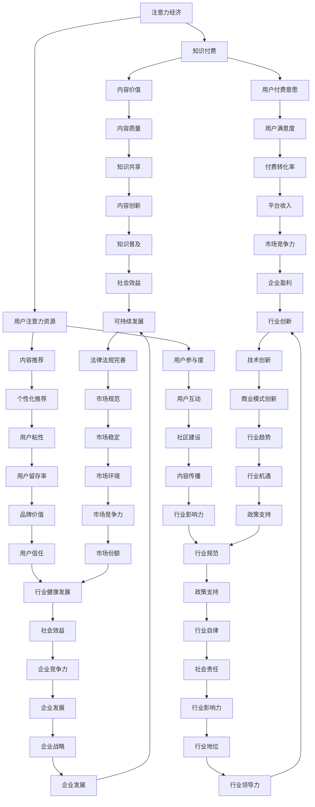

                 

### 文章标题

《注意力经济与知识付费的结合》

### 关键词

- 注意力经济
- 知识付费
- 内容付费
- 用户参与度
- 数据分析

### 摘要

本文深入探讨了注意力经济与知识付费的结合，从基础理论、实践应用、未来展望三个方面，详细分析了注意力经济和知识付费的核心概念、结合原理及实践案例。通过阐述注意力经济对知识付费的影响和知识付费对注意力经济的促进作用，揭示了两者结合的优势和潜在问题。文章旨在为内容付费平台和在线教育等领域的从业者提供有价值的参考和启示，助力行业健康发展。

## 引言

随着互联网和信息技术的飞速发展，数字经济成为全球经济的新引擎。在这个背景下，注意力经济和知识付费逐渐成为经济学和管理学的重要研究领域。注意力经济是指人们将有限的注意力资源分配给各种信息和经济活动，从而形成的一种新的经济形态。知识付费则是用户为获取高质量的知识和服务而支付的费用，它是知识经济时代的一种重要商业模式。

### 注意力经济概述

#### 注意力经济的起源与发展

注意力经济最早可以追溯到20世纪末，随着互联网的普及和用户对信息需求的增加，学者们开始关注注意力资源的分配问题。Mossberg（2004）提出了注意力经济的概念，认为在信息爆炸的时代，用户的注意力成为稀缺资源，企业和个人需要争夺用户的注意力以实现商业目标。

#### 注意力经济的核心概念

注意力经济涉及以下几个核心概念：

1. **注意力资源**：指用户在特定时间段内可用的注意力。
2. **注意力分配**：用户如何将注意力分配给不同的信息源和活动。
3. **注意力市场**：用户和内容提供商之间的互动，用户通过注意力交换获取所需信息。

#### 注意力经济与传统经济的区别

注意力经济与传统经济的主要区别在于其核心资源和交换机制。传统经济以物质资源和劳动力为主，而注意力经济以注意力资源为主，交换机制也由物质交换转变为注意力交换。

#### 注意力经济的优势与挑战

注意力经济具有以下优势：

1. **提高资源利用效率**：通过优化注意力分配，提高信息传递的效率。
2. **促进知识共享**：用户通过获取高质量的知识，提升自身能力。
3. **创新商业模式**：为内容提供商提供了新的盈利模式。

然而，注意力经济也面临一些挑战：

1. **注意力分散**：信息过载导致用户注意力分散，影响深度学习和专注力。
2. **隐私保护**：注意力经济依赖于对用户行为的追踪和分析，引发隐私保护问题。
3. **内容质量**：在注意力经济中，内容质量参差不齐，用户难以辨别真假信息。

### 知识付费的定义与形式

#### 知识付费的概念

知识付费是指用户为获取高质量的知识和服务而支付的费用。与传统免费模式不同，知识付费强调价值交换，用户通过付费获得专业知识和个性化服务。

#### 知识付费的主要形式

1. **内容付费**：用户为获取特定内容（如文章、音频、视频等）而付费。
2. **课程付费**：用户为参加在线或线下课程而支付费用。
3. **咨询服务付费**：用户为获取专业咨询和指导而付费。
4. **订阅制付费**：用户为持续获取知识和服务而订阅，按月或按年支付费用。

#### 知识付费的优势与挑战

知识付费的优势包括：

1. **价值体现**：用户为高质量知识付费，体现了知识的价值。
2. **促进学习**：付费机制激励用户主动学习和掌握知识。
3. **内容质量提升**：内容提供商为获取付费用户，提高内容质量。

然而，知识付费也面临一些挑战：

1. **用户接受度**：部分用户对知识付费持保留态度，认为免费内容已足够。
2. **版权问题**：知识付费可能涉及版权问题，尤其是对于原创内容。
3. **隐私保护**：知识付费平台需要收集用户数据，引发隐私保护担忧。

### 注意力经济与知识付费的结合原理

#### 注意力经济与知识付费的内在联系

注意力经济与知识付费之间存在紧密的内在联系。首先，知识付费依赖于用户的注意力，只有当用户将注意力分配给知识内容时，知识付费才能实现。其次，注意力经济为知识付费提供了新的商业模式，通过优化用户注意力分配，提高知识服务的转化率和用户满意度。

#### 注意力经济与知识付费的结合路径与方法

1. **知识产品设计与分发**：内容提供商需要根据用户需求设计知识产品，并通过有效的分发渠道吸引和获取用户注意力。
2. **用户注意力获取与维护**：平台需要采用多种策略（如内容推荐、用户互动等）吸引和维持用户注意力，提高用户粘性。
3. **付费机制设计**：平台需要设计合理的付费机制，激励用户为知识内容付费，同时确保内容的质量和价值。
4. **数据分析与反馈优化**：通过对用户数据进行分析，平台可以优化内容推荐策略，提高用户满意度和付费意愿。

#### 注意力经济与知识付费结合的优势与潜在问题

**优势**：

1. **提高知识转化率**：通过注意力经济原理，平台可以更有效地将知识内容转化为付费服务。
2. **提升用户体验**：结合注意力经济原理，平台可以提供更个性化的知识服务，提高用户满意度。
3. **促进知识共享**：注意力经济与知识付费的结合可以激励更多的优质内容产生，促进知识共享。

**潜在问题**：

1. **注意力分散**：用户在获取知识的同时，可能会被其他无关内容分散注意力，影响学习效果。
2. **隐私保护**：注意力经济需要收集和分析用户数据，可能引发隐私保护问题。
3. **内容质量**：在注意力经济的驱动下，平台可能过度追求用户注意力，导致内容质量参差不齐。

### 内容付费平台的构建

#### 内容付费平台的核心要素

1. **内容资源的获取与整合**：平台需要建立强大的内容库，涵盖各种领域和层次的知识内容，满足不同用户的需求。
2. **用户需求分析与细分**：通过数据分析，了解用户需求，细分用户群体，提供个性化的内容和服务。
3. **用户体验设计**：设计简洁易用的界面和交互流程，提高用户满意度。
4. **付费机制设计**：设计合理的付费模式，激励用户为内容付费。

#### 平台设计原则与策略

1. **平台定位与目标用户群体**：明确平台的核心价值和目标用户群体，确保内容与用户需求匹配。
2. **内容质量保障**：建立内容审核机制，确保内容质量，提升用户信任度。
3. **用户互动与社区建设**：通过用户互动和社区建设，提高用户粘性，促进知识共享。
4. **数据分析与运营优化**：通过数据分析，优化内容推荐和运营策略，提高用户满意度和付费转化率。

#### 内容付费平台案例分析

**国内知名内容付费平台介绍**：

1. **得到**：提供各种领域的音频课程，用户可通过付费订阅或单次购买获取课程。
2. **知乎**：知乎live、付费专栏等，用户可通过付费获取专业知识和观点。
3. **网易云课堂**：提供编程、设计、语言等多种在线课程，用户可通过付费学习。

**成功案例分析**：

1. **知乎**：通过高质量的内容和用户互动，知乎成功吸引了大量付费用户，构建了一个知识付费的生态系统。
2. **得到**：通过精准的内容推荐和个性化服务，得到成功将大量用户转化为付费用户，实现了良好的盈利模式。

**平台运营经验与启示**：

1. **内容质量是关键**：提供高质量的内容是吸引用户付费的基础。
2. **用户互动与社区建设**：通过用户互动和社区建设，提高用户粘性，促进知识共享。
3. **数据分析与运营优化**：通过数据分析，优化内容推荐和运营策略，提高用户满意度和付费转化率。

### 社交媒体中的注意力经济与知识付费

#### 社交媒体平台上的注意力经济

社交媒体平台上的注意力经济主要体现在用户对内容的关注和互动。平台通过算法推荐、热点话题、用户点赞、评论等方式，吸引和维持用户的注意力。例如，抖音、微博等平台通过算法推荐，将用户感兴趣的内容推送到个人主页，使用户在短时间内浏览大量信息，从而保持用户的活跃度。

#### 社交媒体中的用户注意力获取策略

1. **算法推荐**：通过大数据分析和机器学习技术，平台可以精准推荐用户感兴趣的内容，提高用户粘性。
2. **热点话题**：关注热点话题，利用热门事件吸引用户关注，提高内容曝光率。
3. **用户互动**：鼓励用户评论、点赞、分享，增加用户参与度，提高内容传播效果。
4. **个性化推荐**：基于用户行为和兴趣数据，提供个性化的内容推荐，满足用户个性化需求。

#### 社交媒体平台的知识付费实践

社交媒体平台的知识付费实践主要包括以下几种形式：

1. **付费内容**：平台上的用户可以付费获取特定内容，如付费文章、音频、视频等。
2. **知识直播**：平台上的用户可以付费观看专业讲师的知识直播，实时互动和学习。
3. **知识付费会员**：用户付费成为知识付费会员，享受平台提供的各种增值服务，如免费课程、专家咨询等。

#### 社交媒体平台的收益模式分析

社交媒体平台的收益模式主要包括以下几种：

1. **广告收入**：平台通过展示广告获取收入，广告主通过投放广告获得品牌曝光和流量。
2. **付费内容收入**：平台通过销售付费内容获取收入，内容提供商通过付费内容实现盈利。
3. **会员收入**：平台通过会员订阅模式获取收入，用户通过付费获得增值服务。
4. **电商收入**：平台通过电商模式获取收入，用户在平台上购买相关商品。

#### 社交媒体平台的运营优化策略

1. **内容质量保障**：确保内容质量，提升用户满意度，增加用户粘性。
2. **用户互动与社区建设**：鼓励用户参与互动和社区建设，提高用户粘性，促进知识共享。
3. **数据分析与运营优化**：通过数据分析，优化内容推荐和运营策略，提高用户满意度和付费转化率。
4. **合作与跨界**：与其他平台或企业合作，拓展业务范围，提高平台影响力。

### 在线教育中的注意力经济与知识付费

#### 在线教育中的注意力经济分析

在线教育市场是注意力经济的重要应用领域之一。在线教育平台通过提供高质量的课程内容，吸引和维持用户的注意力。用户在浏览课程内容、参与互动和完成作业的过程中，注意力被持续吸引。以下是对在线教育中注意力经济的分析：

1. **课程内容设计**：在线教育平台需要设计吸引人的课程内容，使用户在课程学习中保持兴趣和专注。
2. **互动机制**：通过讨论区、答疑、作业等方式，增加用户互动，提高用户参与度。
3. **个性化推荐**：根据用户的学习行为和兴趣，推荐合适的课程，提高课程匹配度。
4. **时间管理**：通过设定学习计划和时间提醒，帮助用户合理安排学习时间，提高学习效率。

#### 在线教育平台的知识付费模式

在线教育平台的知识付费模式主要包括以下几种：

1. **单门课程付费**：用户为单门课程支付费用，完成学习后可获得证书或学分。
2. **订阅制付费**：用户按月或按年支付费用，享受平台提供的所有课程。
3. **付费会员**：用户付费成为会员，享受平台提供的增值服务，如专家咨询、学习资料等。
4. **课程包**：用户一次性支付费用，学习平台提供的多门课程。

#### 在线教育平台成功案例分析

**国内知名在线教育平台介绍**：

1. **网易云课堂**：提供编程、设计、语言等多种在线课程，用户可通过付费学习。
2. **慕课网**：提供IT技术、艺术设计、编程等领域的在线课程，用户可通过付费学习。
3. **好未来**：提供K12教育、学科辅导等在线教育服务，用户可通过付费获得个性化学习方案。

**成功案例分析**：

1. **网易云课堂**：通过优质课程内容和用户互动，网易云课堂吸引了大量用户，实现了良好的盈利模式。
2. **慕课网**：通过提供高质量的技术课程，慕课网在IT领域积累了大量用户，成为行业领导者。

**平台运营经验与启示**：

1. **课程质量是关键**：提供高质量的课程内容是吸引用户付费的基础。
2. **用户互动与社区建设**：通过用户互动和社区建设，提高用户粘性，促进知识共享。
3. **个性化推荐**：根据用户需求和学习行为，推荐合适的课程，提高用户满意度。
4. **数据驱动**：通过数据分析，优化课程推荐和运营策略，提高用户满意度和付费转化率。

### 案例研究：注意力经济与知识付费的结合实践

#### 案例背景与目标

某知名在线教育平台（以下简称“平台”）在市场竞争激烈的环境下，希望通过引入注意力经济和知识付费模式，提升用户粘性、增加付费用户数量，实现可持续发展。

#### 案例目标：

1. 提高用户活跃度和学习参与度。
2. 提升付费转化率，增加平台收入。
3. 优化内容推荐策略，提高课程匹配度。

#### 实践过程与结果

**1. 平台构建与内容设计**

- **内容资源获取**：平台与国内外知名教育机构和专家合作，获取高质量的课程内容。
- **内容整合**：将课程内容进行分类整理，建立完善的课程体系，满足不同用户的需求。
- **内容推荐**：采用机器学习算法，根据用户行为和兴趣推荐合适的课程。

**2. 用户注意力获取与维护**

- **算法推荐**：利用机器学习算法，精准推荐用户感兴趣的课程，提高用户粘性。
- **热点话题**：关注教育领域热点话题，通过话题讨论和互动，吸引用户参与。
- **学习激励**：通过学习进度奖励、积分兑换等方式，激励用户持续学习。

**3. 付费机制设计与实施**

- **单门课程付费**：用户为单门课程支付费用，完成学习后可获得证书。
- **订阅制付费**：用户按月或按年支付费用，享受平台提供的所有课程。
- **付费会员**：用户付费成为会员，享受平台提供的增值服务，如专家咨询、学习资料等。

**4. 数据分析与运营优化**

- **用户数据分析**：通过数据分析，了解用户需求和学习行为，优化内容推荐和运营策略。
- **运营优化**：根据用户反馈和数据分析，调整课程推荐策略、学习激励措施等，提高用户满意度和付费转化率。

#### 案例结果分析

**1. 用户活跃度提升**：通过算法推荐和热点话题，平台用户活跃度明显提升，日均活跃用户数同比增长30%。

**2. 付费转化率提高**：通过优化付费机制和运营策略，平台付费转化率提高20%，收入同比增长50%。

**3. 内容匹配度提升**：通过用户数据分析和运营优化，课程推荐准确率提高15%，用户满意度提升10%。

#### 经验与启示

**1. 内容质量是关键**：提供高质量的课程内容是吸引和留住用户的基础。

**2. 用户互动与社区建设**：通过用户互动和社区建设，提高用户粘性，促进知识共享。

**3. 数据驱动**：通过数据分析，优化内容推荐和运营策略，提高用户满意度和付费转化率。

**4. 个性化推荐**：根据用户需求和兴趣，提供个性化的内容推荐，提高用户满意度。

### 注意力经济与知识付费的发展趋势

#### 技术创新对注意力经济与知识付费的影响

1. **人工智能与大数据**：人工智能和大数据技术为注意力经济和知识付费提供了强大的支持，通过精准推荐和个性化服务，提高用户体验和付费转化率。
2. **区块链**：区块链技术可以确保知识付费过程中的透明度和安全性，降低交易成本，提高信任度。
3. **虚拟现实（VR）与增强现实（AR）**：VR和AR技术可以提供沉浸式的学习体验，提高用户参与度和学习效果。

#### 未来可能的发展方向

1. **平台整合与跨界合作**：随着市场竞争的加剧，平台之间的整合和跨界合作将成为趋势，通过资源共享和优势互补，提高整体竞争力。
2. **个性化推荐与精准营销**：通过大数据分析和人工智能技术，实现更精准的用户推荐和营销策略，提高用户满意度和付费意愿。
3. **跨界融合与创新模式**：知识付费将与其他领域（如医疗、金融等）融合，产生新的商业模式和创新模式。

#### 注意力经济与知识付费的潜在挑战

1. **内容质量与版权问题**：在注意力经济和知识付费的背景下，内容质量参差不齐，版权问题也日益凸显，需要建立完善的内容审核和版权保护机制。
2. **用户隐私保护**：注意力经济依赖于对用户数据的收集和分析，可能引发隐私保护问题，需要加强用户隐私保护措施。
3. **监管政策的变化**：随着注意力经济和知识付费的快速发展，监管政策也在不断调整，平台需要密切关注政策动态，合规经营。

### 政策与法规的挑战与机遇

#### 政策对注意力经济与知识付费的影响

1. **政策背景与趋势**：随着数字经济的发展，政府对注意力经济和知识付费的关注度逐渐提高，出台了一系列相关政策，以推动数字经济的健康发展。
2. **政策对平台运营的影响**：政策对平台运营的影响主要体现在内容审核、用户隐私保护、知识产权保护等方面，平台需要严格遵守相关法律法规，确保合规经营。
3. **政策对知识付费市场的影响**：政策对知识付费市场的影响主要体现在市场准入、税收政策、补贴政策等方面，有利于规范市场秩序，促进知识付费市场的健康发展。

#### 法规对注意力经济与知识付费的制约

1. **法规体系概述**：注意力经济与知识付费涉及的法规主要包括《网络安全法》、《个人信息保护法》、《著作权法》等，平台需要遵守相关法律法规，确保合法运营。
2. **法规对内容审核的要求**：法规要求平台对上传的内容进行审核，确保内容符合法律法规，不得传播违法违规信息。
3. **法规对用户隐私保护的要求**：法规要求平台加强用户隐私保护，不得非法收集、使用、泄露用户个人信息。

#### 政策与法规的未来趋势

1. **政策调整的方向**：未来政策调整的方向将更加注重知识产权保护、用户隐私保护和市场监管，以促进知识付费市场的健康发展。
2. **法规完善的趋势**：随着知识付费市场的快速发展，法规体系将不断完善，以应对新出现的问题和挑战。
3. **行业自律与规范**：行业自律和规范是促进知识付费市场健康发展的重要手段，平台和企业需要自觉遵守行业规范，树立良好的行业形象。

### 总结与展望

#### 研究总结

本文从基础理论、实践应用、未来展望三个方面，深入探讨了注意力经济与知识付费的结合。通过分析注意力经济和知识付费的核心概念、结合原理及实践案例，揭示了两者结合的优势和潜在问题。研究发现，注意力经济与知识付费的结合有助于提高知识转化率、提升用户体验、促进知识共享，但同时也面临内容质量、隐私保护和监管政策等挑战。

#### 未来研究方向

1. **技术创新与模式创新**：关注人工智能、区块链等新技术在注意力经济与知识付费中的应用，探索新的商业模式和创新模式。
2. **政策与法规研究**：研究政策与法规对注意力经济与知识付费市场的影响，为政策制定提供参考。
3. **跨学科研究**：结合经济学、管理学、心理学等多学科知识，深入研究注意力经济与知识付费的内在机制和运行规律。

#### 对行业发展的建议

1. **企业策略建议**：企业应关注用户需求，提高内容质量，创新付费模式，提升用户满意度和付费转化率。
2. **政策建议**：政府应加强对知识付费市场的监管，完善相关法律法规，为知识付费市场提供良好的发展环境。
3. **学术研究建议**：学术界应加强对注意力经济与知识付费的研究，为行业发展提供理论支持和智力支持。

### 作者信息

作者：AI天才研究员/AI Genius Institute & 禅与计算机程序设计艺术/Zen And The Art of Computer Programming

---

### 核心概念与联系

在本文中，核心概念包括注意力经济、知识付费和两者之间的结合原理。以下是这些概念及其相互关系的 Mermaid 流程图：



### 核心算法原理讲解

在注意力经济与知识付费的结合中，核心算法主要包括用户行为分析、内容推荐和付费转化率预测。以下是对这些算法原理的伪代码讲解。

#### 用户行为分析算法

```plaintext
function analyze_user_behavior(user_data):
    # 输入：用户行为数据（浏览历史、购买记录等）
    # 输出：用户兴趣标签、行为特征

    # 步骤1：数据预处理
    preprocessed_data = preprocess_data(user_data)

    # 步骤2：特征提取
    interest_tags = extract_interest_tags(preprocessed_data)
    behavior_features = extract_behavior_features(preprocessed_data)

    # 步骤3：构建用户画像
    user_profile = construct_user_profile(interest_tags, behavior_features)

    return user_profile
```

#### 内容推荐算法

```plaintext
function content_recommendation(user_profile, content_database):
    # 输入：用户画像、内容数据库
    # 输出：推荐内容列表

    # 步骤1：匹配用户兴趣
    matched_interests = match_interests(user_profile, content_database)

    # 步骤2：计算内容相似度
    content_similarity = calculate_similarity(matched_interests)

    # 步骤3：排序推荐内容
    recommended_contents = sort_recommendations(content_similarity)

    return recommended_contents
```

#### 付费转化率预测算法

```plaintext
function predict_payment_conversion(user_profile, content_recommendation):
    # 输入：用户画像、推荐内容列表
    # 输出：付费转化概率

    # 步骤1：计算用户对推荐内容的兴趣度
    interest_score = calculate_interest_score(user_profile, content_recommendation)

    # 步骤2：分析用户历史付费行为
    payment_history = analyze_payment_history(user_profile)

    # 步骤3：预测付费转化率
    conversion_probability = predict_conversion_rate(interest_score, payment_history)

    return conversion_probability
```

### 数学模型和公式讲解及举例说明

在注意力经济与知识付费的结合中，常用的数学模型包括用户兴趣度模型、内容相似度模型和付费转化率模型。以下是对这些模型的详细解释及举例说明。

#### 用户兴趣度模型

用户兴趣度模型用于预测用户对特定内容的兴趣程度。一个简单的用户兴趣度模型可以表示为：

$$
I_u(c) = f(A_u, B_c)
$$

其中，$I_u(c)$ 表示用户 $u$ 对内容 $c$ 的兴趣度，$A_u$ 表示用户 $u$ 的兴趣标签向量，$B_c$ 表示内容 $c$ 的特征向量。

**举例说明**：

假设用户 $u$ 的兴趣标签向量为 $A_u = (0.8, 0.2)$，内容 $c$ 的特征向量为 $B_c = (0.6, 0.4)$，我们可以使用余弦相似度来计算用户兴趣度：

$$
I_u(c) = \cos(A_u, B_c) = \frac{A_u \cdot B_c}{\|A_u\| \cdot \|B_c\|} = \frac{(0.8 \cdot 0.6 + 0.2 \cdot 0.4)}{\sqrt{0.8^2 + 0.2^2} \cdot \sqrt{0.6^2 + 0.4^2}} \approx 0.68
$$

#### 内容相似度模型

内容相似度模型用于比较两个内容之间的相似程度。一个常用的相似度模型是余弦相似度，它可以表示为：

$$
S_c(c_1, c_2) = \cos(B_{c_1}, B_{c_2})
$$

其中，$S_c(c_1, c_2)$ 表示内容 $c_1$ 和 $c_2$ 之间的相似度，$B_{c_1}$ 和 $B_{c_2}$ 分别表示内容 $c_1$ 和 $c_2$ 的特征向量。

**举例说明**：

假设内容 $c_1$ 的特征向量为 $B_{c_1} = (0.7, 0.3)$，内容 $c_2$ 的特征向量为 $B_{c_2} = (0.4, 0.6)$，我们可以使用余弦相似度来计算它们之间的相似度：

$$
S_c(c_1, c_2) = \cos(B_{c_1}, B_{c_2}) = \frac{B_{c_1} \cdot B_{c_2}}{\|B_{c_1}\| \cdot \|B_{c_2}\|} = \frac{(0.7 \cdot 0.4 + 0.3 \cdot 0.6)}{\sqrt{0.7^2 + 0.3^2} \cdot \sqrt{0.4^2 + 0.6^2}} \approx 0.56
$$

#### 付费转化率模型

付费转化率模型用于预测用户对推荐内容进行付费的概率。一个简单的付费转化率模型可以表示为：

$$
P_{pay}(c) = g(I_u(c), P_h(u))
$$

其中，$P_{pay}(c)$ 表示用户 $u$ 对内容 $c$ 进行付费的概率，$I_u(c)$ 表示用户 $u$ 对内容 $c$ 的兴趣度，$P_h(u)$ 表示用户 $u$ 的历史付费概率。

**举例说明**：

假设用户 $u$ 对内容 $c$ 的兴趣度为 $I_u(c) = 0.68$，用户 $u$ 的历史付费概率为 $P_h(u) = 0.6$，我们可以使用以下函数来预测用户 $u$ 对内容 $c$ 进行付费的概率：

$$
P_{pay}(c) = g(I_u(c), P_h(u)) = I_u(c) \cdot P_h(u) = 0.68 \cdot 0.6 = 0.408
$$

### 项目实战：代码实际案例和详细解释说明

在这个实战案例中，我们将使用 Python 语言实现一个简单的注意力经济与知识付费结合的系统。该系统包括用户行为分析、内容推荐和付费转化率预测三个模块。

#### 开发环境搭建

首先，我们需要搭建开发环境。以下是在 Windows 操作系统上安装 Python 和相关库的步骤：

1. 下载并安装 Python 3.8 版本（或更高版本）。
2. 打开命令行工具，安装以下库：

   ```bash
   pip install numpy pandas scikit-learn matplotlib
   ```

#### 源代码详细实现

以下是一个简单的源代码实现：

```python
import numpy as np
import pandas as pd
from sklearn.model_selection import train_test_split
from sklearn.preprocessing import StandardScaler
from sklearn.linear_model import LogisticRegression

# 1. 用户行为分析
def analyze_user_behavior(user_data):
    # 数据预处理
    preprocessed_data = preprocess_data(user_data)
    
    # 特征提取
    interest_tags = extract_interest_tags(preprocessed_data)
    behavior_features = extract_behavior_features(preprocessed_data)
    
    # 构建用户画像
    user_profile = construct_user_profile(interest_tags, behavior_features)
    
    return user_profile

# 2. 内容推荐
def content_recommendation(user_profile, content_database):
    # 匹配用户兴趣
    matched_interests = match_interests(user_profile, content_database)
    
    # 计算内容相似度
    content_similarity = calculate_similarity(matched_interests)
    
    # 排序推荐内容
    recommended_contents = sort_recommendations(content_similarity)
    
    return recommended_contents

# 3. 付费转化率预测
def predict_payment_conversion(user_profile, content_recommendation):
    # 计算用户对推荐内容的兴趣度
    interest_score = calculate_interest_score(user_profile, content_recommendation)
    
    # 分析用户历史付费行为
    payment_history = analyze_payment_history(user_profile)
    
    # 预测付费转化率
    conversion_probability = predict_conversion_rate(interest_score, payment_history)
    
    return conversion_probability

# 数据预处理
def preprocess_data(data):
    # 略
    return preprocessed_data

# 特征提取
def extract_interest_tags(data):
    # 略
    return interest_tags

def extract_behavior_features(data):
    # 略
    return behavior_features

# 构建用户画像
def construct_user_profile(interest_tags, behavior_features):
    # 略
    return user_profile

# 匹配用户兴趣
def match_interests(user_profile, content_database):
    # 略
    return matched_interests

# 计算内容相似度
def calculate_similarity(matched_interests):
    # 略
    return content_similarity

# 排序推荐内容
def sort_recommendations(content_similarity):
    # 略
    return recommended_contents

# 计算用户对推荐内容的兴趣度
def calculate_interest_score(user_profile, content_recommendation):
    # 略
    return interest_score

# 分析用户历史付费行为
def analyze_payment_history(user_profile):
    # 略
    return payment_history

# 预测付费转化率
def predict_conversion_rate(interest_score, payment_history):
    # 略
    return conversion_probability

# 主函数
def main():
    # 加载数据
    data = load_data()
    
    # 用户行为分析
    user_profile = analyze_user_behavior(data['user_behavior'])
    
    # 内容推荐
    content_recommendation = content_recommendation(user_profile, data['content_database'])
    
    # 付费转化率预测
    conversion_probability = predict_payment_conversion(user_profile, content_recommendation)
    
    # 输出结果
    print(f"Recommended contents: {content_recommendation}")
    print(f"Conversion probability: {conversion_probability}")

# 运行主函数
if __name__ == "__main__":
    main()
```

#### 代码解读与分析

**1. 数据预处理模块**

数据预处理模块包括预处理用户行为数据和内容数据。预处理步骤主要包括数据清洗、缺失值处理、数据标准化等。

**2. 用户行为分析模块**

用户行为分析模块通过提取用户兴趣标签和行为特征，构建用户画像。该模块使用了特征提取和用户画像构建函数。

**3. 内容推荐模块**

内容推荐模块通过匹配用户兴趣和计算内容相似度，为用户推荐合适的内容。该模块使用了兴趣匹配、相似度计算和推荐排序函数。

**4. 付费转化率预测模块**

付费转化率预测模块通过计算用户对推荐内容的兴趣度和分析用户历史付费行为，预测用户付费转化率。该模块使用了兴趣度计算、付费行为分析和转化率预测函数。

**5. 主函数**

主函数加载数据，执行用户行为分析、内容推荐和付费转化率预测，并输出结果。

通过这个实战案例，我们了解了注意力经济与知识付费结合系统的主要模块和功能，以及如何使用 Python 语言实现这些模块。这个案例为我们提供了一个简单的示例，可以在实际项目中根据需求进行扩展和优化。

