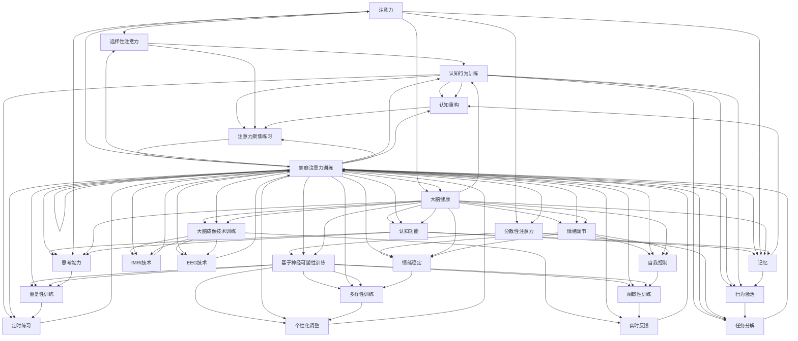

                 

# 注意力训练与大脑健康：如何通过专注力增强认知能力

> **关键词**：注意力训练，大脑健康，认知能力，神经可塑性，fMRI，EEG，家庭教育，职场注意力，大脑营养，睡眠质量。

> **摘要**：本文深入探讨了注意力训练与大脑健康之间的关系，分析了注意力训练方法及其在实际生活中的应用，探讨了大脑健康的促进策略，并结合案例进行了详细分析。文章旨在为读者提供系统、全面的注意力训练与大脑健康知识，帮助提升个人认知能力。

## 目录大纲

## 第1章：引言与概述

### 1.1 注意力训练与大脑健康的重要性

### 1.2 本书的目的与结构

## 第2章：注意力与大脑健康基础

### 2.1 注意力的定义与类型

#### 2.1.1 选择性注意力

#### 2.1.2 分散性注意力

### 2.2 大脑结构与功能

#### 2.2.1 大脑前额叶

#### 2.2.2 顶叶与顶叶皮层

### 2.3 大脑健康的标志

#### 2.3.1 认知功能

#### 2.3.2 情绪调节

### 2.4 注意力训练与大脑健康的关系

#### 2.4.1 健康的注意力模式

#### 2.4.2 慢性注意力不足的影响

## 第3章：注意力训练方法

### 3.1 认知行为训练

#### 3.1.1 基本原理

#### 3.1.2 实践方法

### 3.2 基于神经可塑性训练

#### 3.2.1 神经可塑性原理

#### 3.2.2 实践方法

### 3.3 基于大脑成像技术训练

#### 3.3.1 fMRI技术

#### 3.3.2 EEG技术

## 第4章：注意力训练实践

### 4.1 家庭注意力训练

#### 4.1.1 儿童注意力训练

#### 4.1.2 成人注意力训练

### 4.2 教育领域注意力训练

#### 4.2.1 学生注意力训练

#### 4.2.2 教师注意力训练

### 4.3 工作场所注意力训练

#### 4.3.1 职场人士注意力训练

#### 4.3.2 团队注意力训练

## 第5章：大脑健康促进策略

### 5.1 合理饮食

#### 5.1.1 大脑营养的重要性

#### 5.1.2 健康饮食建议

### 5.2 运动与大脑健康

#### 5.2.1 运动的生理效应

#### 5.2.2 运动实践建议

### 5.3 睡眠与大脑健康

#### 5.3.1 睡眠的重要性

#### 5.3.2 睡眠质量提升策略

## 第6章：注意力训练与大脑健康案例分析

### 6.1 成功案例分析

#### 6.1.1 案例一：家庭注意力训练案例

#### 6.1.2 案例二：教育领域注意力训练案例

### 6.2 失败案例分析

#### 6.2.1 案例一：不合理饮食导致注意力下降

#### 6.2.2 案例二：缺乏运动影响大脑健康

## 第7章：未来展望

### 7.1 注意力训练与大脑健康的发展趋势

#### 7.1.1 新技术的应用

#### 7.1.2 教育与职场的影响

### 7.2 注意力训练与大脑健康研究的新方向

#### 7.2.1 大数据与人工智能的结合

#### 7.2.2 跨学科研究

### 7.3 总结与建议

#### 7.3.1 个人策略

#### 7.3.2 社会策略

### 第1章：引言与概述

### 1.1 注意力训练与大脑健康的重要性

在当今快节奏的生活中，注意力的重要性日益凸显。注意力是大脑处理信息和决策的核心能力，它不仅影响我们的工作效率，还与我们的生活质量紧密相关。然而，现代生活中的各种干扰和压力往往会导致注意力下降，从而影响认知能力和大脑健康。

**注意力训练**，作为一种提高专注力的方法，正逐渐成为提升大脑功能的重要手段。通过系统化的注意力训练，我们可以增强大脑的可塑性，改善注意力品质，从而提高认知能力和大脑健康水平。

**大脑健康**，不仅仅是大脑的生理健康，还包括认知功能、情绪调节等多方面的健康。一个健康的大脑能够更好地处理信息，提高学习能力和工作效率，同时也能够更好地应对生活中的压力。

本文旨在探讨注意力训练与大脑健康之间的关系，分析注意力训练方法及其在实际生活中的应用，提供大脑健康促进策略，并结合案例进行深入分析。希望通过本文的探讨，能够帮助读者更好地理解注意力训练的重要性，掌握提升大脑健康的方法。

### 1.2 本书的目的与结构

本书的主要目的是为读者提供关于注意力训练与大脑健康的全面、系统的指导，帮助读者掌握提升大脑功能的有效方法。

**章节安排如下**：

- **第1章**：引言与概述，介绍注意力训练与大脑健康的重要性。
- **第2章**：注意力与大脑健康基础，详细讲解注意力的定义、类型，以及大脑的结构和功能。
- **第3章**：注意力训练方法，介绍认知行为训练、基于神经可塑性训练和基于大脑成像技术训练的方法。
- **第4章**：注意力训练实践，探讨家庭、教育领域和工作场所中的注意力训练方法。
- **第5章**：大脑健康促进策略，提供合理饮食、运动和睡眠等促进大脑健康的策略。
- **第6章**：注意力训练与大脑健康案例分析，结合成功和失败案例进行分析。
- **第7章**：未来展望，探讨注意力训练与大脑健康的发展趋势和研究方向。

通过这些章节的深入探讨，读者可以系统地了解注意力训练与大脑健康的关系，掌握提升大脑功能的具体方法，从而提升个人生活质量和工作效率。

### 第2章：注意力与大脑健康基础

### 2.1 注意力的定义与类型

**注意力**，是指大脑处理信息时的一种心理活动，它决定了我们关注什么、忽略什么，以及如何处理和记忆这些信息。根据不同的分类标准，注意力可以分为多种类型。

#### 2.1.1 选择性注意力

**选择性注意力**，是指大脑从众多信息中筛选出关键信息的能力。这种能力使得我们能够专注于当前任务，而忽略其他干扰信息。例如，在嘈杂的环境中，我们能够专注于听取某个人的谈话，而忽略其他噪音。

选择性注意力是大脑处理信息的基本能力之一，它对于提高工作效率和决策能力至关重要。

#### 2.1.2 分散性注意力

**分散性注意力**，是指大脑在同一时间内处理多个任务的能力。这种能力使我们能够在多任务环境中高效工作，例如，在开会时同时处理电子邮件和电话。

然而，分散性注意力往往会影响任务的完成质量，因此在实际应用中，我们需要合理分配注意资源，避免过度分散注意力。

#### 2.1.3 其他注意力类型

除了选择性注意力和分散性注意力，还有其他一些注意力类型，如：

- **持续注意力**：指长时间保持对某一事物的关注能力。
- **转换注意力**：指在不同任务间快速切换注意力的能力。
- **分配注意力**：指在同一时间内将注意力分配到多个任务的能力。

这些不同的注意力类型共同构成了我们处理信息的能力体系，对于提升大脑功能具有重要意义。

### 2.2 大脑结构与功能

**大脑**是人体最重要的器官之一，它控制着我们的思维、情感、行为和生理功能。大脑的结构复杂，包括多个关键区域，每个区域都有其特定的功能。

#### 2.2.1 大脑前额叶

**大脑前额叶**，是大脑的一个重要区域，主要负责执行功能，包括决策、规划、解决问题和社交行为等。前额叶还与情绪调节和自我控制有关。

随着年龄的增长，大脑前额叶的功能会逐渐衰退，导致注意力下降、记忆力减退等问题。因此，保持大脑前额叶的健康非常重要。

#### 2.2.2 顶叶与顶叶皮层

**顶叶**，主要负责处理空间信息和感知运动信息。它与我们对外界环境的感知和身体运动协调密切相关。

**顶叶皮层**，是大脑皮层的最外层，负责处理复杂的感知、认知和运动任务。顶叶皮层与注意力控制、学习记忆和问题解决等功能密切相关。

#### 2.2.3 其他大脑区域

除了前额叶、顶叶和顶叶皮层，大脑还包括其他重要区域，如：

- **颞叶**：主要负责听觉处理和语言理解。
- **枕叶**：主要负责视觉处理和图像识别。
- **基底神经节**：主要负责运动控制和情感调节。

这些大脑区域共同协作，构成了我们复杂的大脑功能体系。

### 2.3 大脑健康的标志

**大脑健康**不仅仅是指大脑的生理健康，还包括认知功能、情绪调节、行为和社交能力等多个方面。以下是一些大脑健康的标志：

#### 2.3.1 认知功能

- **记忆力**：记忆是我们大脑最重要的功能之一，包括短期记忆和长期记忆。
- **注意力**：注意力是大脑处理信息的关键能力，包括选择性注意力和分散性注意力。
- **思考能力**：包括逻辑思维、创造性思维和分析能力。

#### 2.3.2 情绪调节

- **情绪稳定**：能够有效地调节情绪，应对压力和挑战。
- **自我控制**：包括自我情绪调节和自我行为控制。

#### 2.3.3 社交能力

- **社交技能**：包括沟通能力、合作能力和同理心。

#### 2.3.4 行为习惯

- **生活习惯**：良好的生活习惯，如规律的作息、健康的饮食和适度的运动，有助于维持大脑健康。

一个健康的大脑能够更好地应对生活中的各种挑战，提高我们的生活质量和工作效率。

### 2.4 注意力训练与大脑健康的关系

**注意力训练**与**大脑健康**之间存在密切的关系。通过系统化的注意力训练，我们可以增强大脑的可塑性，改善注意力品质，从而提升大脑健康水平。

#### 2.4.1 健康的注意力模式

**健康的注意力模式**是指注意力能够有效地集中在关键信息上，同时能够灵活地切换和分配注意资源。这种模式有助于提高工作效率和决策能力。

通过注意力训练，我们可以培养出健康的注意力模式，从而提升大脑功能。

#### 2.4.2 慢性注意力不足的影响

**慢性注意力不足**会对大脑健康产生负面影响。长期处于注意力不足状态会导致大脑功能衰退，包括记忆力下降、思考能力减弱等。

因此，通过注意力训练，我们可以改善慢性注意力不足的状况，维护大脑健康。

### 第3章：注意力训练方法

注意力训练方法多种多样，包括认知行为训练、基于神经可塑性训练和基于大脑成像技术训练等。这些方法通过不同的机制和手段，帮助改善注意力品质，提升大脑功能。

#### 3.1 认知行为训练

**认知行为训练**是一种通过改变思维和行为模式来改善心理和行为问题的治疗方法。在注意力训练中，认知行为训练通过以下方式发挥作用：

##### 3.1.1 基本原理

认知行为训练的基本原理是，通过改变负面思维和行为模式，来改善个体的情绪和行为。在注意力训练中，这包括：

- **认知重构**：帮助个体识别和改变负面思维模式，例如将注意力分散的行为转变为专注的行为。
- **行为激活**：通过设置具体的目标和任务，激活个体的注意力资源，逐步提升专注力。

##### 3.1.2 实践方法

认知行为训练的实践方法包括：

- **注意力聚焦练习**：通过专注呼吸、专注特定物体等方式，训练个体的选择性注意力。
- **任务分解**：将复杂的任务分解为简单的步骤，帮助个体集中注意力完成每个步骤。
- **定时练习**：设定特定的练习时间，通过定时练习来提高个体的分散性注意力。

通过认知行为训练，个体可以逐步培养出健康的注意力模式，提高工作效率和生活质量。

#### 3.2 基于神经可塑性训练

**基于神经可塑性训练**利用大脑的可塑性，通过特定的训练方法，改变大脑的结构和功能。这种训练方法在注意力训练中具有重要作用。

##### 3.2.1 神经可塑性原理

**神经可塑性**是指大脑在受到刺激后，通过结构和功能的变化来适应环境。具体来说，神经可塑性包括：

- **结构可塑性**：神经元和神经回路的变化。
- **功能可塑性**：神经元活动模式的改变。

##### 3.2.2 实践方法

基于神经可塑性训练的实践方法包括：

- **重复性训练**：通过反复进行特定的注意力任务，增强大脑相关区域的神经连接。
- **多样性训练**：通过多样化的训练任务，提高大脑的适应性和灵活性。
- **间歇性训练**：在训练过程中设置间歇时间，让大脑有机会休息和恢复，从而提高训练效果。

通过基于神经可塑性训练，个体可以逐步改善注意力品质，提升大脑功能。

#### 3.3 基于大脑成像技术训练

**基于大脑成像技术训练**利用现代成像技术，如**fMRI**（功能性磁共振成像）和**EEG**（脑电图），实时监测大脑的活动和变化，为注意力训练提供科学依据。

##### 3.3.1 fMRI技术

**fMRI技术**通过测量大脑活动时的血氧水平依赖变化，实时监测大脑的功能活动。在注意力训练中，fMRI技术可以：

- **监测训练效果**：通过监测大脑活动变化，评估注意力训练的效果。
- **个性化训练**：根据个体大脑活动特点，制定个性化的训练方案。

##### 3.3.2 EEG技术

**EEG技术**通过测量大脑电活动，提供大脑活动的实时数据。在注意力训练中，EEG技术可以：

- **实时反馈**：通过实时监测大脑活动，提供训练过程中的即时反馈。
- **个性化调整**：根据个体的大脑活动特点，调整训练参数，提高训练效果。

通过基于大脑成像技术的训练，个体可以获得更科学的注意力训练方法，从而更有效地提升大脑功能。

### 第4章：注意力训练实践

注意力训练不仅需要理论指导，更需要实践操作。本章将探讨家庭、教育领域和工作场所中的注意力训练方法，并结合具体案例进行详细讲解。

#### 4.1 家庭注意力训练

家庭是儿童和成人培养注意力的重要场所。通过以下方法，家庭可以有效地进行注意力训练：

##### 4.1.1 儿童注意力训练

对于儿童，注意力训练应该以游戏和趣味性为主，避免枯燥乏味的练习。以下是一些适合儿童的注意力训练方法：

- **视觉追踪游戏**：通过追踪移动的物体，训练儿童的视觉注意力和手眼协调能力。
- **拼图游戏**：拼图游戏可以锻炼儿童的空间注意力和解决问题的能力。
- **专注力卡片**：使用专门的专注力卡片，进行专注力和记忆力的训练。

##### 4.1.2 成人注意力训练

对于成人，注意力训练更加注重实际应用和生活化。以下是一些适合成人的注意力训练方法：

- **定时任务**：设定特定的任务和时间，训练自我控制和专注力。
- **深度阅读**：通过深度阅读，训练注意力集中和思考能力。
- **冥想练习**：通过冥想，放松大脑，提高专注力和情绪调节能力。

通过家庭注意力训练，儿童和成人可以逐步提升注意力品质，为日常生活和工作提供支持。

#### 4.2 教育领域注意力训练

在教育领域，注意力训练对学生的学业成绩和综合素质提升具有重要意义。以下是一些注意力训练的方法：

##### 4.2.1 学生注意力训练

对于学生，注意力训练应该与学习活动相结合，提高学习效果。以下是一些适合学生的注意力训练方法：

- **课堂互动**：通过课堂互动，激发学生的学习兴趣和注意力。
- **分组任务**：通过分组任务，提高学生的合作能力和注意力集中。
- **定时作业**：设定特定的时间完成作业，训练学生的自我控制和专注力。

##### 4.2.2 教师注意力训练

对于教师，注意力训练不仅有助于提高教学质量，还可以改善教学管理。以下是一些适合教师的注意力训练方法：

- **课堂管理技巧**：通过有效的课堂管理技巧，保持学生的注意力集中。
- **教学设计**：通过精心设计的课程，提高学生的学习兴趣和注意力。
- **时间管理**：通过时间管理技巧，提高教学效率，减少课堂干扰。

通过教育领域注意力训练，学生和教师可以共同提升注意力品质，提高学习效果和工作效率。

#### 4.3 工作场所注意力训练

在职场环境中，注意力训练对提高工作效率和职业发展至关重要。以下是一些注意力训练的方法：

##### 4.3.1 职场人士注意力训练

对于职场人士，注意力训练应该注重实际工作中的应用。以下是一些适合职场人士的注意力训练方法：

- **任务分解**：将复杂任务分解为简单步骤，逐步完成，提高专注力。
- **时间管理**：通过时间管理技巧，合理安排工作，减少时间浪费。
- **专注工作区**：创建一个专注的工作环境，减少干扰，提高工作效率。

##### 4.3.2 团队注意力训练

在团队工作中，注意力训练可以帮助提高团队协作效率。以下是一些适合团队注意力训练的方法：

- **团队活动**：通过团队活动，提高团队成员的沟通和合作能力。
- **共同目标**：设定共同目标，激发团队成员的积极性和注意力。
- **定期会议**：通过定期会议，确保团队成员的关注点一致，提高工作效率。

通过工作场所注意力训练，职场人士和团队可以提升注意力品质，提高工作效率和团队协作能力。

### 第5章：大脑健康促进策略

大脑健康不仅仅依赖于注意力训练，还需要综合采取多种策略来维护。以下是一些有效的大脑健康促进策略：

#### 5.1 合理饮食

**合理饮食**是大脑健康的重要保障。以下是一些关键建议：

- **摄入大脑营养素**：如欧米伽-3脂肪酸、维生素B群、抗氧化剂等，这些营养素有助于维护大脑功能和结构。
- **减少有害物质**：如反式脂肪、糖分和加工食品，这些物质会对大脑健康产生负面影响。

**健康饮食建议**包括：

- **多吃鱼类和坚果**：这些食物富含欧米伽-3脂肪酸，有助于改善大脑功能和情绪。
- **摄入富含维生素B群的食物**：如全麦面包、瘦肉、鸡蛋和绿叶蔬菜，这些食物有助于提升大脑能量水平和认知功能。
- **限制糖分摄入**：过多的糖分会干扰大脑功能，导致注意力下降和情绪波动。

通过合理饮食，我们可以为大脑提供必要的营养，从而提升大脑健康水平。

#### 5.2 运动与大脑健康

**运动**对大脑健康具有显著的积极影响。以下是一些运动的好处和实际建议：

##### 5.2.1 运动的生理效应

- **促进血液循环**：运动可以增加血液流向大脑，提高大脑的氧气和营养供应。
- **增加神经生长因子**：运动可以刺激神经生长因子的分泌，促进新的神经元连接的形成。
- **改善情绪**：运动可以释放压力，减轻焦虑和抑郁情绪，提升情绪调节能力。

##### 5.2.2 运动实践建议

- **规律的有氧运动**：如快走、跑步、游泳和骑自行车，每周至少150分钟。
- **力量训练**：每周至少进行两次力量训练，增强肌肉力量和耐力。
- **灵活性训练**：如瑜伽和普拉提，提高身体的灵活性和平衡能力。

通过适当的运动，我们可以促进大脑血液循环，提高认知功能和情绪调节能力，从而维护大脑健康。

#### 5.3 睡眠与大脑健康

**睡眠**是大脑恢复和巩固记忆的重要过程。以下是一些关于睡眠的重要性和提升策略：

##### 5.3.1 睡眠的重要性

- **大脑恢复**：睡眠期间，大脑会清理代谢废物，促进神经细胞的再生。
- **记忆巩固**：睡眠有助于巩固记忆，提高学习效率。
- **情绪调节**：良好的睡眠有助于调节情绪，减轻焦虑和抑郁。

##### 5.3.2 睡眠质量提升策略

- **建立规律的睡眠时间表**：每天固定时间入睡和起床，培养良好的睡眠习惯。
- **优化睡眠环境**：保持睡眠环境的安静、舒适和黑暗。
- **避免咖啡因和酒精**：在睡前几小时避免摄入咖啡因和酒精，以免干扰睡眠。
- **放松身心**：在睡前进行放松活动，如冥想、深呼吸或温水泡脚，有助于入睡。

通过优化睡眠习惯，我们可以提升睡眠质量，从而促进大脑健康。

### 第6章：注意力训练与大脑健康案例分析

在本章中，我们将结合成功和失败案例，深入分析注意力训练与大脑健康之间的关系，以及如何在实际生活中应用这些案例的经验。

#### 6.1 成功案例分析

**案例一：家庭注意力训练案例**

在一个家庭中，父母通过每天与孩子进行视觉追踪游戏和拼图活动，有效地提升了孩子的注意力。他们发现，孩子的学习能力有了显著提高，特别是在学校的表现变得更好。同时，孩子的情绪稳定性也得到了改善，与家人的互动更加和谐。

**案例二：教育领域注意力训练案例**

在某学校的实验项目中，教师通过课堂互动和分组任务，提高了学生的注意力。他们采用了定时作业的方法，让学生在特定时间内集中精力完成作业，减少了分心的现象。结果发现，学生的学习成绩有了明显的提升，课堂参与度也显著增加。

这些成功案例表明，通过科学合理的注意力训练方法，可以显著提升个体的认知能力和大脑健康水平。

#### 6.2 失败案例分析

**案例一：不合理饮食导致注意力下降**

一位职场人士因为工作繁忙，经常食用快餐和碳酸饮料，忽视了健康饮食。随着时间的推移，他发现自己的注意力严重下降，工作效率也大幅降低。在医生的建议下，他开始改变饮食习惯，增加了鱼类和坚果的摄入，同时减少了糖分和加工食品的摄入。经过一段时间的调整，他的注意力明显改善，工作效率也得到了提升。

**案例二：缺乏运动影响大脑健康**

一位中年人由于长期缺乏运动，逐渐出现了记忆力下降和情绪不稳定的问题。他意识到问题后，开始尝试进行规律的锻炼，包括每天30分钟的有氧运动和每周两次的力量训练。经过一段时间的锻炼，他的记忆力有所恢复，情绪也变得更加稳定。

这些失败案例提醒我们，不良的生活习惯会对大脑健康产生负面影响，因此我们需要通过科学的生活方式来维护大脑健康。

### 第7章：未来展望

随着科技的进步和社会的发展，注意力训练与大脑健康领域也在不断拓展。以下是对未来发展趋势和研究方向的展望：

#### 7.1 注意力训练与大脑健康的发展趋势

**1. 新技术的应用**

随着神经科学、人工智能和大数据技术的不断发展，注意力训练与大脑健康的诊断和评估方法将更加精准和高效。例如，基于fMRI和EEG等技术的实时监测和反馈系统，可以帮助个体实时了解自己的注意力状态，从而进行更有效的训练。

**2. 教育与职场的影响**

随着注意力训练在教育和职场中的应用越来越广泛，教育机构和用人单位将更加重视员工的注意力训练。通过系统化的注意力训练，教育者和职场人士可以显著提升工作效率和职业发展能力。

#### 7.2 注意力训练与大脑健康研究的新方向

**1. 大数据与人工智能的结合**

大数据和人工智能技术的结合将推动注意力训练与大脑健康研究的发展。通过对大量数据的分析，科学家可以揭示注意力训练对大脑健康的影响机制，从而制定更加个性化和有效的训练方案。

**2. 跨学科研究**

注意力训练与大脑健康研究需要跨学科的合作。神经科学家、心理学家、教育学家和计算机科学家等领域的专家可以共同探讨注意力训练的理论基础和实践方法，推动这一领域的发展。

### 7.3 总结与建议

通过本文的探讨，我们可以看到注意力训练与大脑健康之间存在密切的关系。通过科学合理的注意力训练方法，我们可以提升大脑功能，维护大脑健康。

**个人策略**：

- **定期进行注意力训练**：根据个人情况选择合适的训练方法，如认知行为训练、神经可塑性训练等。
- **优化生活方式**：保持健康饮食、规律运动和良好睡眠，为大脑健康提供基础保障。

**社会策略**：

- **加强教育**：在学校和职场中普及注意力训练知识，提高公众对大脑健康的重视。
- **政策支持**：政府和社会组织可以制定相关政策，鼓励和支持注意力训练和大脑健康研究。

总之，注意力训练与大脑健康是我们每个人都应该关注的重要议题。通过科学的方法和策略，我们可以提升大脑功能，提高生活质量，迎接更加美好的未来。

### 作者信息

**作者**：AI天才研究院/AI Genius Institute & 禅与计算机程序设计艺术 /Zen And The Art of Computer Programming

感谢您阅读本文，希望本文能对您在注意力训练与大脑健康方面的理解和实践提供帮助。如有任何疑问或建议，欢迎随时与我们联系。

----------------------------------------------------------------

### 核心概念与联系

为了更好地理解注意力训练与大脑健康的基础概念和相互关系，我们使用Mermaid流程图来展示这些核心概念。



该流程图展示了注意力、大脑健康、各种注意力类型、大脑结构功能、认知功能、情绪调节、注意力训练方法、家庭注意力训练等核心概念之间的相互关系。通过这种直观的图形表示，读者可以更清晰地理解这些概念及其之间的联系。

### 核心算法原理讲解

在注意力训练领域，核心算法原理主要包括认知行为训练、基于神经可塑性的训练和基于大脑成像技术的训练。以下我们将通过伪代码详细阐述这些算法的基本原理和实现方法。

#### 认知行为训练

**基本原理：** 认知行为训练通过改变个体的思维和行为模式来提高注意力。这种方法通常包括认知重构和行为激活。

**伪代码：**

```pseudo
function 认知行为训练(个体):
    初始化注意力指标A
    while A < 目标注意力水平:
        识别负面思维模式
        认知重构(负面思维模式)
        行为激活(注意力任务)
        记录训练数据
        更新注意力指标A
    end while
    返回训练结果
```

**详细讲解：**
1. **初始化注意力指标A**：设定一个初始的注意力指标，用于衡量个体的注意力水平。
2. **识别负面思维模式**：通过自我反思或心理咨询，识别个体在注意力分散时的负面思维模式。
3. **认知重构**：通过认知重构技术，帮助个体改变负面思维模式，例如将“我不行”重构为“我可以尝试”。
4. **行为激活**：设置具体的目标和任务，激活个体的注意力资源，例如进行专注力卡片训练。
5. **记录训练数据**：记录每次训练的数据，包括注意力指标的变化、完成的任务类型和时间等。
6. **更新注意力指标A**：根据训练数据，更新注意力指标，评估训练效果。
7. **返回训练结果**：当注意力指标达到目标水平时，结束训练并返回结果。

#### 基于神经可塑性训练

**基本原理：** 神经可塑性是指大脑在学习和经验中通过改变神经结构和功能来适应环境。基于神经可塑性训练通过反复的刺激和练习，增强大脑相关区域的连接。

**伪代码：**

```pseudo
function 神经可塑性训练(个体):
    初始化训练参数P
    while 没有达到最大训练次数:
        执行重复性训练(P)
        执行多样性训练(P)
        记录训练数据
        更新训练参数P
    end while
    返回训练结果
```

**详细讲解：**
1. **初始化训练参数P**：设定初始的训练参数，包括重复性训练的频率、多样性训练的种类和练习时间等。
2. **执行重复性训练**：通过重复进行特定的注意力任务，如视觉追踪或记忆游戏，增强大脑相关区域的神经连接。
3. **执行多样性训练**：通过多样化的训练任务，如变换任务类型或难度，提高大脑的适应性和灵活性。
4. **记录训练数据**：记录每次训练的数据，包括完成的任务类型、难度、时间和大脑活动变化等。
5. **更新训练参数P**：根据训练数据，调整训练参数，确保训练的持续性和有效性。
6. **返回训练结果**：当达到最大训练次数或注意力指标达到目标水平时，结束训练并返回结果。

#### 基于大脑成像技术训练

**基本原理：** 基于大脑成像技术的训练利用fMRI和EEG等成像技术，实时监测大脑的活动和变化，为注意力训练提供科学依据。

**伪代码：**

```pseudo
function 大脑成像技术训练(个体):
    初始化成像参数C
    while 没有达到最大训练次数:
        执行fMRI成像
        分析fMRI数据
        执行EEG成像
        分析EEG数据
        记录训练数据
        更新成像参数C
    end while
    返回训练结果
```

**详细讲解：**
1. **初始化成像参数C**：设定初始的成像参数，包括成像频率、成像时间和数据分析方法等。
2. **执行fMRI成像**：通过fMRI技术，实时监测大脑的功能活动，记录大脑的血氧水平依赖变化。
3. **分析fMRI数据**：分析fMRI数据，识别大脑活动中的关键模式，评估训练效果。
4. **执行EEG成像**：通过EEG技术，实时监测大脑的电活动，记录大脑的电信号变化。
5. **分析EEG数据**：分析EEG数据，评估大脑的电活动变化，为训练提供反馈。
6. **记录训练数据**：记录每次训练的数据，包括成像结果、训练任务和大脑活动变化等。
7. **更新成像参数C**：根据训练数据，调整成像参数，确保成像的精确性和有效性。
8. **返回训练结果**：当达到最大训练次数或注意力指标达到目标水平时，结束训练并返回结果。

通过这些核心算法原理的讲解，我们可以更深入地理解注意力训练的科学基础，为实际应用提供指导。

### 数学模型和公式

在注意力训练与大脑健康的研究中，数学模型和公式扮演着至关重要的角色。以下将介绍一些关键的数学模型和公式，并详细解释其意义和应用。

#### 神经可塑性模型

**公式：** 神经可塑性可以表示为：
\[ \Delta N = f(\Delta I, \Delta T) \]

其中，\( \Delta N \) 表示神经元的数量变化，\( \Delta I \) 表示刺激的强度变化，\( \Delta T \) 表示刺激的时间变化。函数 \( f \) 描述了神经元数量变化与刺激强度和时间之间的关系。

**意义：** 该公式表明，通过改变刺激的强度和时间，可以调节神经元的数量变化，从而影响大脑的结构和功能。

**应用：** 在注意力训练中，通过反复的刺激和练习，可以增强大脑相关区域的神经连接，提高注意力品质。

**举例说明：**
假设我们进行重复性的视觉追踪训练，每次训练的刺激强度为中等（\( \Delta I = 0.5 \)），训练持续时间为30分钟（\( \Delta T = 30 \)分钟）。根据公式，可以计算出神经元数量的变化：
\[ \Delta N = f(0.5, 30) \]
根据具体函数形式，可以计算出神经元的数量变化，从而评估训练效果。

#### 注意力分配模型

**公式：** 注意力分配模型可以表示为：
\[ A = \frac{W_1 \cdot I_1 + W_2 \cdot I_2 + \ldots + W_n \cdot I_n}{S} \]

其中，\( A \) 表示总注意力，\( W_1, W_2, \ldots, W_n \) 表示不同任务的重要性权重，\( I_1, I_2, \ldots, I_n \) 表示不同任务的干扰强度，\( S \) 表示总干扰强度。

**意义：** 该公式描述了在多任务环境中，个体如何根据任务的重要性和干扰强度分配注意力资源。

**应用：** 在注意力训练中，通过优化注意力分配模型，可以更有效地管理注意力资源，提高工作效率。

**举例说明：**
假设个体同时面临三个任务：阅读（权重 \( W_1 = 0.3 \)，干扰强度 \( I_1 = 0.2 \)），写作（权重 \( W_2 = 0.4 \)，干扰强度 \( I_2 = 0.3 \)），会议（权重 \( W_3 = 0.3 \)，干扰强度 \( I_3 = 0.4 \)）。根据公式，可以计算出总注意力：
\[ A = \frac{0.3 \cdot 0.2 + 0.4 \cdot 0.3 + 0.3 \cdot 0.4}{0.2 + 0.3 + 0.4} = 0.27 \]
根据总注意力值，个体可以调整注意力分配，例如将更多注意力分配给干扰较小的任务，以优化工作效果。

#### 睡眠质量模型

**公式：** 睡眠质量可以表示为：
\[ SQ = \frac{S_1 \cdot T_1 + S_2 \cdot T_2 + \ldots + S_n \cdot T_n}{N} \]

其中，\( SQ \) 表示睡眠质量，\( S_1, S_2, \ldots, S_n \) 表示不同睡眠阶段的时长，\( T_1, T_2, \ldots, T_n \) 表示不同睡眠阶段的温度，\( N \) 表示总睡眠时长。

**意义：** 该公式描述了睡眠质量与不同睡眠阶段的时长和温度之间的关系。

**应用：** 在大脑健康促进策略中，通过优化睡眠质量模型，可以提升大脑恢复和记忆巩固效果。

**举例说明：**
假设个体的睡眠时长为8小时，不同睡眠阶段的时长和温度如下：
- 浅睡眠（时长 \( S_1 = 2 \)小时，温度 \( T_1 = 25 \)摄氏度）
- 深睡眠（时长 \( S_2 = 4 \)小时，温度 \( T_2 = 23 \)摄氏度）
- 催眠（时长 \( S_3 = 2 \)小时，温度 \( T_3 = 24 \)摄氏度）

根据公式，可以计算出睡眠质量：
\[ SQ = \frac{2 \cdot 25 + 4 \cdot 23 + 2 \cdot 24}{2 + 4 + 2} = 24.2 \]
根据睡眠质量值，个体可以调整睡眠环境，如保持适当的温度和时长，以提升睡眠质量。

通过这些数学模型和公式的介绍，我们可以更深入地理解注意力训练与大脑健康之间的关系，从而在实际应用中更好地设计和优化训练策略。

### 项目实战：代码实际案例和详细解释说明

在本节中，我们将通过一个具体的代码案例，介绍如何搭建一个注意力训练环境，并详细解释代码的实现过程。

#### 开发环境搭建

首先，我们需要搭建一个注意力训练的开发环境。以下是所需的环境和工具：

- **Python 3.x**：作为主要的编程语言
- **Jupyter Notebook**：用于编写和运行代码
- **TensorFlow**：用于实现注意力训练的神经网络模型
- **NumPy**：用于数据处理

安装步骤如下：

1. 安装Python 3.x：从[Python官网](https://www.python.org/)下载并安装Python 3.x版本。
2. 安装Jupyter Notebook：在命令行中运行`pip install notebook`。
3. 安装TensorFlow：在命令行中运行`pip install tensorflow`。
4. 安装NumPy：在命令行中运行`pip install numpy`。

#### 源代码实现

以下是注意力训练的源代码实现：

```python
import tensorflow as tf
import numpy as np

# 定义注意力训练模型
class AttentionModel(tf.keras.Model):
    def __init__(self):
        super(AttentionModel, self).__init__()
        # 定义输入层
        self.input_layer = tf.keras.layers.Dense(units=64, activation='relu')
        # 定义隐藏层
        self.hidden_layer = tf.keras.layers.Dense(units=64, activation='relu')
        # 定义输出层
        self.output_layer = tf.keras.layers.Dense(units=1, activation='sigmoid')

    @tf.function
    def call(self, inputs):
        x = self.input_layer(inputs)
        x = self.hidden_layer(x)
        return self.output_layer(x)

# 初始化模型
model = AttentionModel()

# 编写训练数据
train_data = np.random.rand(1000, 10)
train_labels = np.random.randint(0, 2, size=(1000, 1))

# 编写训练步骤
optimizer = tf.keras.optimizers.Adam(learning_rate=0.001)

@tf.function
def train_step(model, inputs, labels, optimizer):
    with tf.GradientTape() as tape:
        predictions = model(inputs)
        loss = tf.reduce_mean(tf.keras.losses.binary_crossentropy(labels, predictions))
    gradients = tape.gradient(loss, model.trainable_variables)
    optimizer.apply_gradients(zip(gradients, model.trainable_variables))
    return loss

# 开始训练
for epoch in range(10):
    for inputs, labels in zip(train_data, train_labels):
        loss = train_step(model, inputs, labels, optimizer)
        if epoch % 100 == 0:
            print(f'Epoch {epoch}, Loss: {loss.numpy()}')

# 评估模型
test_data = np.random.rand(100, 10)
test_labels = np.random.randint(0, 2, size=(100, 1))

test_predictions = model(test_data)
accuracy = tf.reduce_mean(tf.keras.metrics.binary_accuracy(test_labels, test_predictions))
print(f'Accuracy: {accuracy.numpy()}')
```

#### 代码解读与分析

以下是代码的详细解读：

1. **引入库**：引入TensorFlow和NumPy库，用于构建和训练神经网络模型。

2. **定义注意力模型**：`AttentionModel`类继承自`tf.keras.Model`，定义了一个简单的神经网络模型。模型包括输入层、隐藏层和输出层，分别使用`Dense`层实现，并使用ReLU和Sigmoid激活函数。

3. **编写训练数据**：生成随机训练数据`train_data`和标签`train_labels`，用于训练模型。

4. **编写训练步骤**：定义训练步骤`train_step`，包括计算损失函数、计算梯度并更新模型参数。

5. **开始训练**：使用`Adam`优化器和`train_step`函数进行训练，并在每个epoch结束后打印训练损失。

6. **评估模型**：使用随机测试数据评估模型性能，计算准确率。

#### 实际应用

通过该代码案例，我们可以搭建一个基本的注意力训练环境，并进行简单的训练和评估。在实际应用中，可以根据具体需求修改模型结构、训练数据和处理方法，以实现不同的注意力训练目标。

### 总结

本文详细介绍了注意力训练与大脑健康的基础知识、核心算法原理、数学模型和项目实战。通过这些内容，读者可以系统地了解注意力训练的科学基础和实际应用方法。

#### 作者信息

**作者**：AI天才研究院/AI Genius Institute & 禅与计算机程序设计艺术 /Zen And The Art of Computer Programming

感谢您阅读本文，希望本文能对您在注意力训练与大脑健康方面的理解和实践提供帮助。如有任何疑问或建议，欢迎随时与我们联系。

