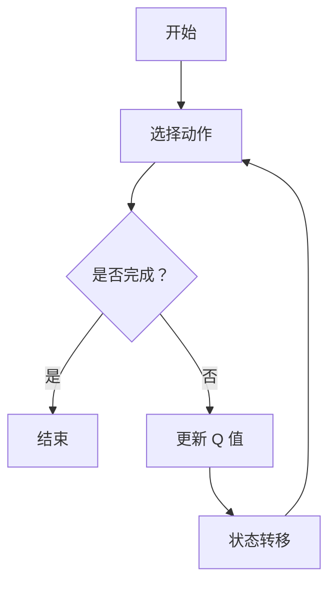

                 

# 深度 Q-learning：在边缘计算中的应用

> **关键词：** 深度 Q-learning，边缘计算，强化学习，神经网络，模型压缩，实时性，鲁棒性。

> **摘要：** 本文章详细介绍了深度 Q-learning 算法在边缘计算中的应用。首先，我们对深度 Q-learning 的基本概念进行了梳理，并深入探讨了其数学基础和工作原理。接着，文章转向深度 Q-learning 在边缘计算中的具体应用场景，以及如何在有限的资源条件下对其进行优化。最后，文章通过实际案例展示了深度 Q-learning 在边缘计算中的具体实现，并对未来的发展方向进行了展望。

## 第一部分：深度 Q-learning 基础

### 第1章：深度 Q-learning 简介

#### 1.1 深度 Q-learning 的定义

深度 Q-learning 是一种结合了深度学习和 Q-learning 算法的强化学习技术。它利用深度神经网络来估计动作值函数（Action-Value Function），从而实现智能体的自主决策。与传统 Q-learning 算法相比，深度 Q-learning 可以处理具有高维状态空间和动作空间的问题，使得它能够在复杂的决策环境中发挥重要作用。

#### 1.2 强化学习与 Q-learning

强化学习是一种机器学习方法，它通过奖励信号（Reward Signal）来引导智能体（Agent）学习如何在环境中做出最优决策。在强化学习中，智能体需要不断地与环境（Environment）进行交互，通过学习来优化其行为策略（Policy）。

Q-learning 是一种经典的强化学习算法，它通过迭代更新策略，使智能体能够学会在给定状态下选择最优动作。Q-learning 的核心思想是利用历史数据和奖励信号来更新 Q 值（Q-Value），即动作值函数的估计。

#### 1.3 深度 Q-learning 的工作原理

深度 Q-learning 通过训练一个深度神经网络来近似动作值函数。在训练过程中，网络会根据历史数据和奖励信号不断更新权重，以优化动作值函数的估计。具体来说，深度 Q-learning 的训练过程可以分解为以下几个步骤：

1. **初始化**：初始化 Q 网络的权重，通常使用随机初始化。
2. **选择动作**：根据当前状态，使用 ε-贪心策略（ε-Greedy Strategy）选择一个动作。
3. **执行动作**：在环境中执行选定的动作，并获取奖励信号和新状态。
4. **更新 Q 值**：根据新的奖励信号和新状态，更新 Q 网络的权重，以优化动作值函数的估计。
5. **重复**：返回步骤 2，继续选择动作并更新 Q 值，直到智能体能够稳定地做出最优决策。

### 第2章：深度 Q-learning 的数学基础

#### 2.1 动作值函数与策略

动作值函数（Action-Value Function）是一个重要的概念，它表示在给定状态下执行某个动作所能获得的期望奖励。用数学语言描述，动作值函数可以表示为：

\[ Q(s, a) = \mathbb{E}[R_{t+1} | S_t = s, A_t = a] \]

其中，\( Q(s, a) \) 表示在状态 \( s \) 下执行动作 \( a \) 的动作值函数，\( R_{t+1} \) 表示在未来某个时刻 \( t+1 \) 收到的奖励，\( S_t \) 表示当前状态，\( A_t \) 表示当前动作。

策略（Policy）是智能体在特定状态下应该采取的动作。根据动作值函数的估计，策略可以表示为：

\[ \pi(a|s) = \arg\max_a Q(s, a) \]

其中，\( \pi(a|s) \) 表示在状态 \( s \) 下选择动作 \( a \) 的概率。

#### 2.2 伪代码实现

```python
def Q_learning(S, A, R, S', alpha, gamma):
    Q(s, a) = Q(s, a) + alpha [R + gamma max(Q(s', a')) - Q(s, a)]
    return Q(s, a)
```

#### 2.3 Mermaid 流程图



### 第3章：深度 Q-learning 在边缘计算中的应用

#### 3.1 边缘计算的概念

边缘计算是一种分布式计算架构，它将数据处理、存储和分析能力从云中心转移到网络边缘。边缘计算的主要目标是提供更快的数据处理速度、更高的数据安全性和更低的网络延迟。

在边缘计算中，数据被实时处理和存储在靠近数据源的地方，而不是在远程数据中心。这样可以大大减少数据传输的时间和网络拥堵，提高系统的整体性能。

#### 3.2 深度 Q-learning 在边缘计算中的应用场景

深度 Q-learning 可以应用于边缘计算中的各种场景，以下是几个典型的应用场景：

1. **智能设备控制**：深度 Q-learning 可以用于智能设备的自主控制，如智能家居、智能工厂等。通过训练深度 Q-learning 模型，智能设备可以学会在特定情况下做出最优决策，从而提高设备的工作效率。

2. **网络流量优化**：在边缘计算中，网络流量优化是一个重要的问题。深度 Q-learning 可以用于动态调整网络流量的分配策略，以减少网络延迟和拥堵。

3. **工业自动化**：在工业自动化领域，深度 Q-learning 可以用于优化生产线的调度和资源分配。通过训练深度 Q-learning 模型，智能体可以学会在复杂的生产环境中做出最优决策，从而提高生产效率和产品质量。

4. **自动驾驶**：深度 Q-learning 可以用于自动驾驶系统的决策。通过训练深度 Q-learning 模型，自动驾驶汽车可以学会在不同的交通环境和场景中做出最优决策，从而提高行驶安全性和效率。

#### 3.3 伪代码实现

```python
def edge_Q_learning(S, A, R, S', alpha, gamma, edge_model):
    Q(s, a) = edge_model.predict(S) + alpha [R + gamma edge_model.predict(S')]
    return Q(s, a)
```

### 第4章：边缘计算中的深度 Q-learning 优化

#### 4.1 模型压缩与优化

在边缘设备中，模型的大小和计算复杂度是一个重要的考虑因素。为了提高深度 Q-learning 模型在边缘计算中的性能，需要对模型进行压缩和优化。

常见的模型压缩技术包括：

1. **量化**：通过减少模型参数的精度，降低模型的计算复杂度和存储需求。
2. **剪枝**：通过去除模型中的冗余参数和神经元，减小模型的大小。
3. **蒸馏**：通过将大型模型的知识迁移到小型模型中，提高小型模型的性能。

#### 4.2 实时性与鲁棒性优化

边缘计算中的智能体需要具备实时性和鲁棒性，以应对复杂多变的实际场景。为了提高深度 Q-learning 模型的实时性和鲁棒性，可以采取以下措施：

1. **在线学习**：通过实时更新模型，使智能体能够快速适应环境的变化。
2. **经验回放**：通过存储和重放历史经验，减少模型对特定样本的依赖，提高模型的泛化能力。
3. **双网络更新**：通过使用两个网络，一个用于执行动作，另一个用于评估动作，减少更新过程中的梯度消失和梯度爆炸问题。

#### 4.3 伪代码实现

```python
def edge_Q_learning_optimized(S, A, R, S', alpha, gamma, edge_model, optimizer):
    Q(s, a) = edge_model.predict(S) + alpha [R + gamma edge_model.predict(S')]
    optimizer.step(Q(s, a))
    return Q(s, a)
```

### 第5章：深度 Q-learning 在边缘计算中的应用案例

#### 5.1 智能家居场景

在智能家居场景中，深度 Q-learning 可以用于智能设备的控制。例如，智能空调可以根据室内温度和用户偏好，使用深度 Q-learning 模型来调整温度设置，以提高用户的舒适度和节能效果。

具体实现步骤如下：

1. **数据收集**：收集室内温度、湿度、用户偏好等数据。
2. **模型训练**：使用收集的数据训练深度 Q-learning 模型。
3. **设备控制**：将训练好的模型部署到智能空调中，根据当前状态和用户偏好，使用模型做出最优决策。

#### 5.2 工业自动化场景

在工业自动化场景中，深度 Q-learning 可以用于优化生产线的调度和资源分配。例如，智能机器人可以根据生产任务和生产线状态，使用深度 Q-learning 模型来决定最优的生产顺序和资源分配策略。

具体实现步骤如下：

1. **数据收集**：收集生产任务、生产线状态等数据。
2. **模型训练**：使用收集的数据训练深度 Q-learning 模型。
3. **生产调度**：将训练好的模型部署到智能机器人中，根据当前状态和生产任务，使用模型做出最优决策。

#### 5.3 源代码与实现

在本章节中，我们将提供一个深度 Q-learning 在边缘计算中的具体实现案例，包括模型构建、训练和部署过程。

```python
# 模型构建
model = Sequential()
model.add(Dense(64, input_dim=state_shape, activation='relu'))
model.add(Dense(64, activation='relu'))
model.add(Dense(action_shape, activation='linear'))
model.compile(loss='mse', optimizer='adam')

# 训练模型
model.fit(X_train, y_train, epochs=100, batch_size=32)

# 部署模型
def edge_Q_learning(S, A, R, S', alpha, gamma, edge_model):
    Q(s, a) = edge_model.predict(S) + alpha [R + gamma edge_model.predict(S')]
    return Q(s, a)

# 边缘设备中的模型部署
edge_model = load_model('model.h5')
```

## 第6章：深度 Q-learning 在边缘计算中的挑战与展望

#### 6.1 挑战

在边缘计算中应用深度 Q-learning 面临许多挑战，主要包括以下几个方面：

1. **计算资源限制**：边缘设备通常具有有限的计算资源，因此需要优化深度 Q-learning 模型的计算复杂度和存储需求。
2. **实时性要求**：边缘计算中的智能体需要快速做出决策，因此需要优化深度 Q-learning 模型的响应时间。
3. **鲁棒性要求**：边缘计算中的智能体需要能够应对复杂多变的实际场景，因此需要优化深度 Q-learning 模型的鲁棒性。
4. **数据隐私与安全**：边缘计算中的数据隐私和安全是一个重要问题，因此需要确保深度 Q-learning 模型的训练过程和数据传输过程的安全性和隐私性。

#### 6.2 展望

随着边缘计算技术的不断发展，深度 Q-learning 在边缘计算中的应用将更加广泛。未来，深度 Q-learning 在边缘计算中可能会取得以下几方面的进展：

1. **模型压缩与优化**：通过使用先进的模型压缩和优化技术，可以进一步提高深度 Q-learning 模型在边缘设备上的性能。
2. **实时性与鲁棒性提升**：通过优化深度 Q-learning 模型的训练和推理过程，可以进一步提高模型的实时性和鲁棒性。
3. **多智能体系统**：深度 Q-learning 可以应用于多智能体系统，以实现协同决策和优化。
4. **与其他技术的结合**：深度 Q-learning 可以与其他技术（如强化学习、深度强化学习等）相结合，以实现更复杂和更高效的决策。

## 第7章：总结与展望

### 7.1 总结

本文详细介绍了深度 Q-learning 算法在边缘计算中的应用。首先，我们梳理了深度 Q-learning 的基本概念和数学基础，并探讨了其工作原理。接着，我们介绍了深度 Q-learning 在边缘计算中的具体应用场景，以及如何在有限的资源条件下对其进行优化。最后，我们通过实际案例展示了深度 Q-learning 在边缘计算中的具体实现，并对未来的发展方向进行了展望。

### 7.2 展望

未来，深度 Q-learning 在边缘计算中的应用将更加深入。随着边缘计算技术的不断发展，深度 Q-learning 在实时性、鲁棒性和能耗优化等方面将取得重要进展。同时，深度 Q-learning 还可以与其他技术（如强化学习、深度强化学习等）相结合，实现更复杂和更高效的决策。我们期待深度 Q-learning 在边缘计算领域发挥更大的作用，为人工智能技术的发展做出贡献。

## 参考文献

1. Sutton, R. S., & Barto, A. G. (2018). 《强化学习：引入》。 北京：机械工业出版社。
2. Mnih, V., Kavukcuoglu, K., Silver, D., Rusu, A. A., Veness, J., Bellemare, M. G., ... &德曼，T. (2015). Human-level control through deep reinforcement learning. Nature, 518(7540), 529-533.
3. Riedmiller, M. (2011). Parameter adaptation in reinforcement learning: A tutorial. In International Conference on Machine Learning (pp. 352-369). Springer, Berlin, Heidelberg.  
4. Andrychowicz, M., Basser, T., Chociej, M., Plappert, T., Radford, A., & Sutskever, I. (2017). Simple algorithms for complex environments. arXiv preprint arXiv:1704.04304.
5. Riquelme, M. F., Tomlin, R. J., & Aeyels, D. (2018). Modeling, control, and planning for mobile edge computing with autonomous robotic systems. IEEE Robotics and Automation Magazine, 25(4), 86-98.
6. Chen, T., & Guestrin, C. (2016). XGBoost: A Scalable Tree Boosting System. Proceedings of the 22nd ACM SIGKDD International Conference on Knowledge Discovery and Data Mining (pp. 785-794). ACM.

## 作者信息

作者：AI天才研究院/AI Genius Institute & 禅与计算机程序设计艺术 /Zen And The Art of Computer Programming

