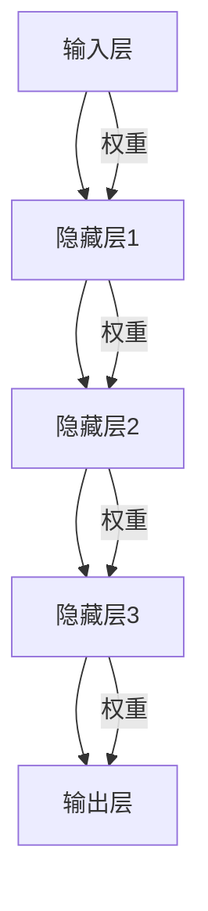
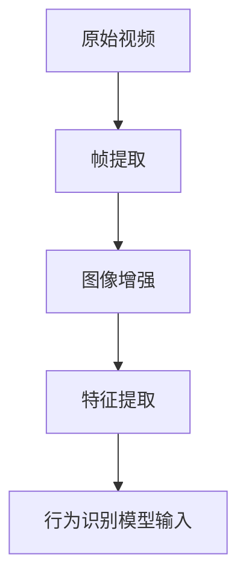
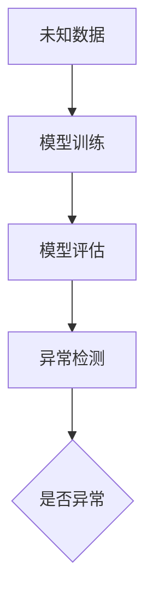

                 

# 深度学习在智能安防行为识别与异常检测中的技术演进与实践

## 关键词
深度学习，智能安防，行为识别，异常检测，技术演进，实践应用

## 摘要
本文系统地探讨了深度学习在智能安防领域中的行为识别与异常检测技术演进与实践。首先，介绍了深度学习的基础知识，包括定义、原理、核心算法和特征提取方法。然后，详细阐述了深度学习在智能安防中的应用，特别是行为识别和异常检测的原理、算法以及面临的挑战。接着，通过实际项目案例，展示了深度学习技术在智能安防中的应用过程，从环境搭建、模型设计、训练与优化到项目实战，提供了详细的实现步骤和代码解读。最后，分析了深度学习在智能安防中的未来发展趋势和挑战，提出了技术演进方向和可持续发展策略。

## 引言

智能安防系统作为现代城市安全管理的重要组成部分，其核心任务是通过对海量视频数据的实时处理，实现对公共安全事件的快速响应和精准预警。随着人工智能技术的快速发展，特别是深度学习技术的成熟，智能安防系统在行为识别与异常检测方面取得了显著进展。深度学习作为一种具有强大表达能力和自学习能力的人工智能方法，已经成为智能安防领域中不可或缺的技术手段。

本文旨在深入探讨深度学习在智能安防行为识别与异常检测中的技术演进与实践。首先，将介绍深度学习的基础知识，包括其定义、原理、核心算法以及特征提取方法。接着，详细分析深度学习在智能安防中的应用，包括行为识别和异常检测的基本原理、算法以及面临的挑战。随后，通过一个具体的智能安防项目案例，展示深度学习技术在行为识别与异常检测中的实际应用过程。最后，对深度学习在智能安防中的应用前景和挑战进行展望，并提出未来的技术演进方向和可持续发展策略。

通过本文的探讨，读者可以全面了解深度学习在智能安防领域的应用现状和未来发展趋势，为相关领域的研究和实践提供参考和启示。

### 第一部分: 深度学习技术基础

#### 第1章: 深度学习基础

##### 1.1 深度学习的定义与原理

深度学习（Deep Learning）是机器学习（Machine Learning）的一个子领域，主要研究如何通过构建深层的神经网络模型来实现自动特征提取和智能推理。深度学习的核心思想是通过模拟人脑神经网络的结构和功能，对大量数据进行分析和自动特征提取，以实现高效的数据分类、回归、生成等任务。

深度学习的定义可以归结为以下几点：

1. **多层神经网络**：深度学习模型由多个层次组成，每个层次对输入数据进行不同层次的抽象和特征提取。这种层次化的结构使得模型能够自动提取复杂、高维的特征。

2. **非线性变换**：深度学习模型中的每个层次都通过非线性变换来实现对数据的处理，这些非线性变换使得模型能够捕捉到输入数据中的复杂关系和模式。

3. **大规模训练数据**：深度学习依赖于大量的训练数据来学习数据的分布和规律。大量数据的存在使得模型能够通过样本外推广，提高其在未知数据上的表现。

4. **端到端学习**：深度学习模型能够直接从原始数据中学习到高层次的抽象特征，无需人为设计特征，从而实现端到端的学习过程。

深度学习的原理主要基于以下几个关键要素：

1. **神经网络的基本结构**：神经网络由输入层、隐藏层和输出层组成。输入层接收原始数据，隐藏层对数据进行特征提取和抽象，输出层对提取出的特征进行分类或回归等任务。

2. **激活函数**：激活函数用于引入非线性变换，使神经网络能够捕捉复杂的关系。常见的激活函数包括Sigmoid、ReLU和Tanh等。

3. **反向传播算法**：反向传播算法是一种优化神经网络参数的算法，通过计算损失函数关于参数的梯度，对参数进行迭代更新，以达到最小化损失函数的目的。

4. **优化算法**：深度学习通常采用优化算法来调整模型参数，以优化模型在训练数据上的表现。常见的优化算法包括梯度下降、Adam等。

##### 1.2 神经网络的基本结构

神经网络的基本结构包括输入层、隐藏层和输出层。每个层次由多个神经元（节点）组成，每个神经元接收来自前一层的输入，通过激活函数进行非线性变换，然后传递给下一层。以下是神经网络的基本结构示意图：

```
输入层 --> 隐藏层1 --> 隐藏层2 --> ... --> 隐藏层n --> 输出层
```

以下是具体的神经网络结构图：



每个神经元都可以表示为以下形式：

$$
f_{\text{neuron}}(x) = \sigma(w \cdot x + b)
$$

其中，$x$ 是神经元的输入，$w$ 是权重，$b$ 是偏置，$\sigma$ 是激活函数。

##### 1.3 神经网络的核心算法

神经网络的核心算法主要包括前向传播和反向传播。

1. **前向传播**：前向传播是指将输入数据通过神经网络逐层传播，计算输出结果的过程。具体步骤如下：

   - 初始化权重和偏置。
   - 对于每个隐藏层，计算输出值：$z_{l} = \sum_{k} w_{lk} x_{k} + b_{l}$，然后通过激活函数得到 $a_{l} = \sigma(z_{l})$。
   - 对于输出层，计算预测值：$z_{L} = \sum_{k} w_{Lk} a_{k} + b_{L}$，然后通过激活函数得到 $a_{L} = \sigma(z_{L})$。

2. **反向传播**：反向传播是指根据输出误差，通过神经网络反向传播误差，更新权重和偏置的过程。具体步骤如下：

   - 计算输出误差：$d_{L} = \frac{\partial L}{\partial a_{L}}$。
   - 对于每个隐藏层，计算误差：$d_{l} = (\sigma'(z_{l}) \cdot \sum_{k} w_{lk} d_{l+1})$。
   - 更新权重和偏置：$w_{lk} := w_{lk} - \alpha \frac{\partial L}{\partial w_{lk}}$ 和 $b_{l} := b_{l} - \alpha \frac{\partial L}{\partial b_{l}}$。

以下是前向传播和反向传播的伪代码：

```python
# 前向传播
def forward_propagation(x, W, b, activation):
    a = x
    for l in range(L):
        z = np.dot(W[l], a) + b[l]
        a = activation(z)
    return a

# 反向传播
def backward_propagation(a, z, d, activation_derivative):
    d = activation_derivative(z) * d
    dW = np.dot(a.T, d)
    db = np.sum(d, axis=0)
    return dW, db
```

##### 1.4 激活函数

激活函数（Activation Function）是神经网络中的一个关键组件，用于引入非线性变换，使得神经网络能够捕捉复杂的关系。常见的激活函数包括以下几种：

1. **Sigmoid 函数**：

   $$
   \sigma(x) = \frac{1}{1 + e^{-x}}
   $$

   Sigmoid 函数的输出范围在 0 到 1 之间，常用于二分类问题。

2. **ReLU 函数**：

   $$
   \text{ReLU}(x) = \max(0, x)
   $$

   ReLU 函数在 x < 0 时输出 0，在 x > 0 时输出 x，常用于隐藏层，可以加速训练。

3. **Tanh 函数**：

   $$
   \tanh(x) = \frac{e^{2x} - 1}{e^{2x} + 1}
   $$

   Tanh 函数的输出范围在 -1 到 1 之间，可以平滑梯度。

以下是激活函数的示意图：

```mermaid
graph TD
    A[输入x] --> B[计算Sigmoid(x)]
    B --> C[输出值]
    C --> D{是否激活}

    A --> E[计算ReLU(x)]
    E --> F[输出值]

    A --> G[计算Tanh(x)]
    G --> H[输出值]
```

##### 1.5 特征提取与降维

特征提取（Feature Extraction）是深度学习中的一个重要任务，旨在从原始数据中提取具有区分性的特征，以提高模型的性能。特征提取通常通过多层神经网络实现，每层对输入数据进行不同层次的抽象和变换。

降维（Dimensionality Reduction）是指将高维数据映射到低维空间，以减少数据的冗余和噪声。常见的降维方法包括主成分分析（PCA）和线性判别分析（LDA）。

1. **卷积神经网络（CNN）**：

   卷积神经网络是一种专门用于图像处理和识别的深度学习模型，其核心思想是通过卷积操作和池化操作提取图像的局部特征。

   卷积操作可以表示为以下形式：

   $$
   \text{conv}(x, \mathbf{W}) = \sum_{i,j} W_{ij} \cdot x_{i,j} + b
   $$

   其中，$x$ 是输入图像，$\mathbf{W}$ 是卷积核，$b$ 是偏置。

   池化操作用于下采样，可以表示为最大池化或平均池化。

2. **主成分分析（PCA）**：

   主成分分析是一种常用的降维方法，通过将数据投影到新的正交基中，提取主要成分，以降低数据的维数。

   PCA 的步骤如下：

   - 计算协方差矩阵。
   - 计算协方差矩阵的特征值和特征向量。
   - 选择主要成分，即具有最大特征值的特征向量。
   - 将数据投影到低维空间。

以下是 PCA 的伪代码：

```python
# PCA
def pca(data, n_components):
    # 计算协方差矩阵
    cov = np.cov(data, rowvar=False)
    # 计算特征值和特征向量
    eigenvalues, eigenvectors = np.linalg.eig(cov)
    # 选择主要成分
    idx = eigenvalues.argsort()[::-1]
    eigenvectors = eigenvectors[:, idx]
    # 投影到低维空间
    projected = np.dot(data, eigenvectors[:n_components])
    return projected
```

#### 第2章: 深度学习在智能安防中的应用

##### 2.1 深度学习在行为识别中的应用

深度学习在行为识别（Activity Recognition）领域具有广泛的应用，能够实现对视频数据的实时行为检测和分类。行为识别的任务是根据视频数据中的行为特征，将视频帧分类到不同的行为类别中，如行走、跑步、跳跃等。

##### 2.1.1 行为识别的基本原理

行为识别的基本原理主要包括以下几个步骤：

1. **视频数据的预处理**：

   视频数据的预处理是行为识别的重要环节，主要包括帧提取、图像增强和特征提取等。

   - **帧提取**：将连续的视频帧提取出来，作为行为识别的输入数据。

   - **图像增强**：通过调整对比度、亮度等参数，增强图像的视觉效果，提高识别的准确性。

   - **特征提取**：从视频帧中提取具有区分性的特征，如颜色特征、形状特征、运动特征等。

以下是视频数据预处理的基本流程图：



2. **深度学习模型的选择与应用**：

   在行为识别中，常用的深度学习模型包括卷积神经网络（CNN）、循环神经网络（RNN）和长短期记忆网络（LSTM）等。以下分别介绍这些模型在行为识别中的应用。

   - **卷积神经网络（CNN）**：

     卷积神经网络是一种专门用于图像处理的深度学习模型，能够有效地提取图像的局部特征。在行为识别中，CNN 可以通过卷积操作和池化操作提取视频帧中的运动特征。

     CNN 的基本结构包括输入层、多个卷积层、池化层和全连接层。以下是 CNN 在行为识别中的应用示意图：

     ```mermaid
     graph TD
         A[输入图像] --> B[卷积层]
         B --> C[池化层]
         C --> D[卷积层]
         D --> E[池化层]
         E --> F[全连接层]
         F --> G[输出层]
     ```

   - **循环神经网络（RNN）**：

     循环神经网络是一种适用于序列数据的深度学习模型，能够处理时间序列数据。在行为识别中，RNN 可以通过对连续视频帧的时序特征建模，实现行为的时序分类。

     RNN 的基本结构包括输入层、隐藏层和输出层。以下是 RNN 在行为识别中的应用示意图：

     ```mermaid
     graph TD
         A[输入序列] --> B[隐藏层1]
         B --> C[隐藏层2]
         C --> D[隐藏层n]
         D --> E[输出层]
     ```

   - **长短期记忆网络（LSTM）**：

     长短期记忆网络是一种改进的循环神经网络，能够有效处理长序列数据。在行为识别中，LSTM 可以通过对连续视频帧的时序特征建模，实现更准确的行为识别。

     LSTM 的基本结构包括输入门、遗忘门、输出门和细胞状态。以下是 LSTM 在行为识别中的应用示意图：

     ```mermaid
     graph TD
         A[输入序列] --> B[输入门]
         B --> C[遗忘门]
         B --> D[输出门]
         C --> E[细胞状态]
         D --> E
     ```

##### 2.1.2 行为识别的挑战与优化

行为识别在智能安防中具有重要的应用价值，但同时也面临着一些挑战和问题。以下是对这些挑战以及相应的优化策略的讨论：

1. **数据多样性与鲁棒性**：

   行为识别模型需要处理各种复杂场景中的行为数据，因此需要提高模型的鲁棒性和泛化能力。为了应对数据多样性的挑战，可以采用以下策略：

   - **数据增强**：通过旋转、缩放、裁剪等数据增强方法，增加训练数据的多样性，提高模型的泛化能力。
   - **迁移学习**：利用预训练模型，迁移到行为识别任务上，减少对大量标注数据的依赖。
   - **多模态数据融合**：结合视频、音频、传感器等多模态数据，提高行为识别的准确性和可靠性。

2. **模型参数优化与调参策略**：

   在行为识别任务中，模型参数的优化和调参对于模型性能具有重要影响。以下是一些常用的调参策略：

   - **学习率调整**：选择合适的学习率，避免过拟合或欠拟合。常用的方法包括自适应学习率调整（如Adam）和逐步减小学习率（如学习率衰减）。
   - **正则化**：通过添加正则化项（如L1、L2正则化）来防止模型过拟合。
   - **批量大小**：选择合适的批量大小，平衡计算效率和模型性能。

##### 2.1.3 行为识别在智能安防中的应用案例

行为识别在智能安防中有着广泛的应用，以下是一些典型的应用案例：

1. **紧急事件检测**：

   通过实时监控公共场所的视频数据，利用行为识别技术检测紧急事件，如打架斗殴、抢劫等。当检测到异常行为时，系统可以及时发出警报，通知安保人员采取行动。

2. **智能门禁系统**：

   结合人脸识别和行为识别技术，构建智能门禁系统。当用户通过摄像头进入识别范围时，系统可以实时识别用户身份和行为，并根据行为特征判断用户是否具有进入权限。

3. **智能交通监控**：

   利用行为识别技术对交通场景进行监控，识别交通违法行为，如闯红灯、逆行等。系统可以实时记录违法行为，并自动报警，提高交通安全管理效率。

通过以上讨论，我们可以看到深度学习在行为识别领域具有广泛的应用前景和潜力。未来，随着深度学习技术的不断发展和完善，行为识别在智能安防中的应用将更加广泛和深入。

### 第3章: 深度学习在异常检测中的应用

##### 3.1 异常检测的基本原理

异常检测（Anomaly Detection）是一种重要的数据挖掘任务，旨在从大量数据中识别出异常或异常模式。在深度学习中，异常检测通常通过构建深度学习模型来实现，这些模型能够自动学习数据的分布和特征，从而识别出与大多数数据不同的异常点。

异常检测的基本原理可以归结为以下几点：

1. **数据分布**：

   异常检测的一个核心思想是假设大多数数据点遵循某种分布，而异常点则不遵循这种分布。通过学习数据的分布，可以有效地识别出异常点。

2. **模型训练**：

   在训练阶段，深度学习模型通过对大量正常数据进行训练，学习到数据的分布特征。这些特征可以用来表征正常数据点。

3. **模型评估**：

   在评估阶段，模型对新的数据点进行评估，判断其是否为异常点。通常，通过计算数据点到分布的距离或密度来评估其异常程度。

4. **异常点识别**：

   根据评估结果，模型可以识别出异常点，并进行相应的处理，如警报、标记或隔离。

以下是异常检测的基本流程图：


#### 3.1.1 监督学习异常检测

监督学习异常检测是一种基于有标签数据的方法，通过训练分类器来识别异常点。具体步骤如下：

1. **数据准备**：

   准备包含正常数据和异常数据的有标签数据集。正常数据用于训练模型，异常数据用于测试模型的泛化能力。

2. **模型训练**：

   使用监督学习算法（如支持向量机、决策树、随机森林等）训练分类器，将正常数据和异常数据分开。

3. **模型评估**：

   使用测试集评估模型的性能，计算异常点的识别率、准确率和召回率等指标。

4. **异常检测**：

   对新的数据点进行预测，判断其是否为异常点。

以下是监督学习异常检测的基本流程图：


监督学习异常检测的优点是能够准确地识别异常点，但其缺点是需要大量有标签的数据，且在异常点比例较低时效果不佳。

#### 3.1.2 无监督学习异常检测

无监督学习异常检测是一种基于无标签数据的方法，通过学习数据的内在结构来识别异常点。具体步骤如下：

1. **数据准备**：

   准备无标签的数据集，数据集包含正常数据和异常数据。

2. **模型训练**：

   使用无监督学习算法（如聚类、自编码器、局部异常因数等）训练模型，发现数据中的潜在结构和分布。

3. **模型评估**：

   通过模型对数据点分布的评估，判断数据点是否为异常点。

4. **异常检测**：

   根据评估结果，识别出异常点并进行处理。

以下是无监督学习异常检测的基本流程图：



无监督学习异常检测的优点是不需要有标签的数据，能够处理大规模无标签数据，但其缺点是模型难以解释，且在某些情况下可能存在误判。

#### 3.1.3 常见的异常检测算法

在深度学习领域中，常见的异常检测算法包括聚类算法、基于阈值的异常检测算法和自编码器等。

1. **聚类算法**：

   聚类算法通过将数据分为多个簇，识别出与大多数簇不同的异常点。常见的聚类算法包括K-means、DBSCAN等。

   - **K-means**：

     K-means算法是一种基于距离的聚类算法，通过最小化簇内距离和最大簇间距离来实现聚类。以下是K-means算法的基本步骤：

     1. 随机选择K个初始聚类中心。
     2. 计算每个数据点到聚类中心的距离，将数据点分配到最近的聚类中心。
     3. 更新聚类中心为数据点的均值。
     4. 重复步骤2和3，直到聚类中心不再变化。

     以下是K-means算法的伪代码：

     ```python
     # K-means算法
     def kmeans(data, K, max_iterations):
         # 随机初始化K个聚类中心
         centroids = initialize_centroids(data, K)
         for _ in range(max_iterations):
             # 计算每个数据点的簇标签
             labels = assign_labels(data, centroids)
             # 更新聚类中心
             new_centroids = update_centroids(data, labels, K)
             # 判断是否收敛
             if is_converged(centroids, new_centroids):
                 break
             centroids = new_centroids
         return centroids, labels
     ```

   - **DBSCAN**：

     DBSCAN（Density-Based Spatial Clustering of Applications with Noise）是一种基于密度的聚类算法，能够处理噪声和异常点。以下是DBSCAN算法的基本步骤：

     1. 选择一个邻域半径`eps`和一个最小邻居数量`min_samples`。
     2. 对于每个未访问的点，标记其为核心点或边界点。
     3. 根据核心点和边界点，构建簇。
     4. 对于每个簇，标记异常点。

     以下是DBSCAN算法的伪代码：

     ```python
     # DBSCAN算法
     def dbscan(data, eps, min_samples):
         clusters = []
         visited = set()
         for point in data:
             if point not in visited:
                 visited.add(point)
                 neighbors = find_neighbors(point, data, eps)
                 if len(neighbors) < min_samples:
                     continue
                 cluster_id = len(clusters)
                 expand_cluster(point, neighbors, visited, clusters, cluster_id)
         return clusters
     ```

2. **基于阈值的异常检测算法**：

   基于阈值的异常检测算法通过设定阈值，识别出超出阈值的点作为异常点。常见的阈值设定方法包括标准差阈值、均值绝对偏差阈值等。

   - **标准差阈值**：

     标准差阈值通过计算数据的平均值和标准差，设定一个阈值，超出阈值的点被视为异常点。以下是标准差阈值的基本步骤：

     1. 计算数据的平均值和标准差。
     2. 设定一个阈值，通常为$ mean + k \times std$，其中$k$是一个常数。
     3. 超出阈值的点视为异常点。

     以下是标准差阈值的伪代码：

     ```python
     # 标准差阈值
     def standard_deviation_threshold(data, k):
         mean = np.mean(data)
         std = np.std(data)
         threshold = mean + k * std
         anomalies = [x for x in data if x > threshold]
         return anomalies
     ```

   - **均值绝对偏差阈值**：

     均值绝对偏差阈值通过计算每个数据点与平均值的绝对偏差，设定一个阈值，超出阈值的点被视为异常点。以下是均值绝对偏差阈值的基本步骤：

     1. 计算数据的平均值。
     2. 计算每个数据点与平均值的绝对偏差。
     3. 设定一个阈值，通常为$ mean + k \times mean$，其中$k$是一个常数。
     4. 超出阈值的点视为异常点。

     以下是均值绝对偏差阈值的伪代码：

     ```python
     # 均值绝对偏差阈值
     def mean_absolute_deviation_threshold(data, k):
         mean = np.mean(data)
         deviations = [abs(x - mean) for x in data]
         threshold = mean + k * mean
         anomalies = [x for x in deviations if x > threshold]
         return anomalies
     ```

3. **自编码器**：

   自编码器（Autoencoder）是一种无监督学习模型，通过训练自编码器，使其能够将输入数据映射到一个较低维度的空间，再通过重构误差识别异常点。以下是自编码器的基本步骤：

   1. **编码器**：

      编码器负责将输入数据压缩到一个较低维度的特征空间中。以下是编码器的伪代码：

      ```python
      # 编码器
      def encode(data, W_encoder, b_encoder):
          z = np.dot(data, W_encoder) + b_encoder
          return z
      ```

   2. **解码器**：

      解码器负责将压缩后的特征空间数据重构为原始数据。以下是解码器的伪代码：

      ```python
      # 解码器
      def decode(z, W_decoder, b_decoder):
          x_recon = np.dot(z, W_decoder) + b_decoder
          return x_recon
      ```

   3. **自编码器训练**：

      通过最小化重构误差来训练自编码器。以下是自编码器训练的伪代码：

      ```python
      # 自编码器训练
      def train_autoencoder(data, W_encoder, b_encoder, W_decoder, b_decoder, learning_rate, epochs):
          for epoch in range(epochs):
              # 前向传播
              z = encode(data, W_encoder, b_encoder)
              x_recon = decode(z, W_decoder, b_decoder)
              # 计算重构误差
              loss = compute_reconstruction_loss(data, x_recon)
              # 反向传播
              dZ = 2 * (x_recon - data)
              dW_decoder = np.dot(z.T, dZ)
              db_decoder = np.sum(dZ, axis=0)
              dZ = np.dot(dZ, W_decoder.T)
              dW_encoder = np.dot(data.T, dZ)
              db_encoder = np.sum(dZ, axis=0)
              # 更新权重和偏置
              W_encoder -= learning_rate * dW_encoder
              b_encoder -= learning_rate * db_encoder
              W_decoder -= learning_rate * dW_decoder
              b_decoder -= learning_rate * db_decoder
              print(f"Epoch {epoch+1}, Loss: {loss}")
      ```

通过以上对异常检测基本原理和常见算法的讨论，我们可以看到深度学习在异常检测中的应用具有重要的理论和实践价值。未来，随着深度学习技术的不断发展和完善，异常检测在智能安防、金融风控、医疗诊断等领域的应用将更加广泛和深入。

### 第4章: 深度学习在智能安防行为识别与异常检测中的技术演进

#### 4.1 深度学习技术在行为识别中的应用进展

随着深度学习技术的不断发展和优化，行为识别在智能安防中的应用也取得了显著的进展。这些进展主要体现在以下几个方面：

##### 4.1.1 深度学习模型的改进

深度学习模型的改进是行为识别技术发展的重要推动力。以下是一些在行为识别中常用的深度学习模型及其改进：

1. **卷积神经网络（CNN）**：

   卷积神经网络是一种专门用于图像处理和识别的深度学习模型，其通过卷积操作和池化操作提取图像的局部特征。在行为识别中，CNN 可以通过处理连续的视频帧，提取行为特征。

   为了提高 CNN 在行为识别中的性能，研究者们提出了许多改进方法，如：

   - **ResNet（残差网络）**：ResNet 通过引入残差连接，解决了深层网络中的梯度消失问题，使得网络可以训练得更深。在行为识别中，ResNet 可以有效地提取视频帧的复杂特征。

   - **Inception（Inception模块）**：Inception 模块通过组合不同尺寸的卷积核，增加网络的宽度，从而提高模型的特征提取能力。在行为识别中，Inception 模块可以增强网络对多尺度特征的捕捉。

   - **MobileNet（轻量级网络）**：MobileNet 通过使用深度可分离卷积，降低模型的参数数量和计算复杂度，使得网络在保持较高识别率的同时具有更好的实时性。在行为识别中，MobileNet 可以应用于移动设备或实时监控系统，提高系统的运行效率。

2. **循环神经网络（RNN）**：

   循环神经网络是一种适用于序列数据的深度学习模型，其通过循环结构处理时间序列数据，捕捉序列中的长期依赖关系。在行为识别中，RNN 可以对连续的视频帧进行建模，提取行为的时序特征。

   为了提高 RNN 在行为识别中的性能，研究者们提出了许多改进方法，如：

   - **LSTM（长短期记忆网络）**：LSTM 通过引入门控机制，解决了 RNN 中的梯度消失问题，使得网络可以更好地捕捉长期依赖关系。在行为识别中，LSTM 可以有效地处理长时间序列，提高识别的准确性。

   - **GRU（门控循环单元）**：GRU 是 LSTM 的变体，通过简化 LSTM 的门控机制，降低了模型的计算复杂度。在行为识别中，GRU 可以在保持较高识别率的同时，具有更好的实时性。

3. **多模态融合网络**：

   多模态融合网络通过结合不同模态的数据，提高行为识别的准确性和可靠性。在行为识别中，常用的多模态数据包括视频、音频和传感器数据。

   - **ViViT（视频-视频 Transformer）**：ViViT 通过 Transformer 模型融合视频帧之间的特征，同时结合音频和传感器数据，实现了高效的行为识别。

   - **M2A-Net（多模态音频行为识别网络）**：M2A-Net 通过融合视频和音频数据，使用卷积神经网络和循环神经网络对多模态数据进行特征提取，实现了对行为的高效识别。

##### 4.1.2 多模态数据融合

多模态数据融合是将不同模态的数据进行结合，以提升行为识别的性能。多模态数据融合的挑战在于如何有效地融合来自不同模态的数据，并提取出对行为识别有用的特征。

以下是一些多模态数据融合的方法：

1. **特征级融合**：

   特征级融合是在特征提取阶段将不同模态的特征进行融合。常用的方法包括：

   - **拼接**：将不同模态的特征向量进行拼接，形成一个更长的特征向量。
   - **加权融合**：根据不同模态的重要性，对特征向量进行加权融合。

2. **决策级融合**：

   决策级融合是在分类阶段将不同模态的预测结果进行融合。常用的方法包括：

   - **投票**：将不同模态的预测结果进行投票，选取多数类作为最终预测结果。
   - **集成学习**：将不同模态的预测器组合成一个集成模型，通过集成模型的预测结果进行决策。

##### 4.1.3 模型优化与调参策略

在深度学习行为识别中，模型优化和调参策略对于提高模型的性能至关重要。以下是一些常用的模型优化和调参策略：

1. **学习率调整**：

   学习率是深度学习中的一个重要超参数，其大小直接影响到模型的收敛速度和最终性能。常用的学习率调整方法包括：

   - **恒定学习率**：在整个训练过程中使用固定的学习率。
   - **学习率衰减**：在训练过程中逐步减小学习率，以避免过拟合。
   - **自适应学习率**：使用自适应优化器（如 Adam），自动调整学习率。

2. **正则化**：

   正则化是一种防止模型过拟合的方法。常用的正则化方法包括：

   - **L1 正则化**：在损失函数中添加 L1 正则项，惩罚模型参数的绝对值。
   - **L2 正则化**：在损失函数中添加 L2 正则项，惩罚模型参数的平方值。

3. **批量大小**：

   批量大小是深度学习中的一个重要超参数，其大小直接影响到模型的训练效率和收敛速度。通常选择较大的批量大小可以提高训练速度，但需要更多的内存。

4. **数据增强**：

   数据增强是一种通过人工手段增加训练数据多样性的方法，可以防止模型过拟合，提高模型的泛化能力。常用的数据增强方法包括：

   - **旋转、缩放、裁剪**：对图像进行旋转、缩放、裁剪等操作。
   - **颜色调整**：调整图像的亮度、对比度、饱和度等参数。

##### 4.1.4 行为识别在智能安防中的应用案例

随着深度学习技术的不断发展，行为识别在智能安防中的应用也日益广泛。以下是一些具体的应用案例：

1. **紧急事件检测**：

   通过实时监控公共场所的视频数据，利用深度学习行为识别技术检测紧急事件，如打架斗殴、抢劫等。当检测到紧急事件时，系统可以及时发出警报，通知安保人员采取行动。

2. **智能门禁系统**：

   结合人脸识别和行为识别技术，构建智能门禁系统。当用户通过摄像头进入识别范围时，系统可以实时识别用户身份和行为，并根据行为特征判断用户是否具有进入权限。

3. **智能交通监控**：

   利用行为识别技术对交通场景进行监控，识别交通违法行为，如闯红灯、逆行等。系统可以实时记录违法行为，并自动报警，提高交通安全管理效率。

通过以上讨论，我们可以看到深度学习技术在行为识别中的应用取得了显著的进展。未来，随着深度学习技术的不断发展和优化，行为识别在智能安防中的应用将更加广泛和深入，为公共安全提供更加有力的技术支持。

#### 4.2 深度学习技术在异常检测中的应用进展

深度学习技术在异常检测中的应用也在不断演进，通过对传统方法的改进和创新，使得异常检测在智能安防领域取得了显著的进展。以下是深度学习技术在异常检测中的应用进展和具体实现：

##### 4.2.1 基于深度学习的异常检测算法

深度学习技术为异常检测提供了强大的建模能力，以下是一些常用的基于深度学习的异常检测算法：

1. **自编码器（Autoencoder）**：

   自编码器是一种无监督学习模型，通过学习输入数据的分布，从而识别异常点。自编码器的基本结构包括编码器和解码器，其中编码器负责将输入数据压缩到一个较低维度的空间，解码器则尝试重构原始数据。

   实现步骤：

   - **编码器**：使用卷积神经网络（CNN）或循环神经网络（RNN）作为编码器，提取输入数据的特征。
   - **解码器**：使用全连接层或卷积神经网络（CNN）作为解码器，尝试重构输入数据。
   - **损失函数**：使用均方误差（MSE）作为损失函数，计算编码器和解码器之间的重构误差。
   - **训练**：通过梯度下降算法训练模型，最小化重构误差。

   伪代码实现：

   ```python
   # 编码器
   def encode(x, W_encoder, b_encoder):
       z = np.dot(x, W_encoder) + b_encoder
       return z

   # 解码器
   def decode(z, W_decoder, b_decoder):
       x_recon = np.dot(z, W_decoder) + b_decoder
       return x_recon

   # 自编码器训练
   def train_autoencoder(data, W_encoder, b_encoder, W_decoder, b_decoder, learning_rate, epochs):
       for epoch in range(epochs):
           # 前向传播
           z = encode(data, W_encoder, b_encoder)
           x_recon = decode(z, W_decoder, b_decoder)
           # 计算重构误差
           loss = np.mean((data - x_recon)**2)
           # 反向传播
           dZ = 2 * (x_recon - data)
           dW_decoder = np.dot(z.T, dZ)
           db_decoder = np.sum(dZ, axis=0)
           dZ = np.dot(dZ, W_decoder.T)
           dW_encoder = np.dot(data.T, dZ)
           db_encoder = np.sum(dZ, axis=0)
           # 更新权重和偏置
           W_encoder -= learning_rate * dW_encoder
           b_encoder -= learning_rate * db_encoder
           W_decoder -= learning_rate * dW_decoder
           b_decoder -= learning_rate * db_decoder
           print(f"Epoch {epoch+1}, Loss: {loss}")
   ```

2. **孤立森林（Isolation Forest）**：

   孤立森林是一种基于随机森林的异常检测算法，其通过随机选择特征和切分值，将正常数据点逐渐分离，从而识别出异常点。孤立森林在处理高维数据时表现优秀。

   实现步骤：

   - **随机选择特征**：从特征空间中随机选择一个特征。
   - **随机切分值**：从特征值的随机样本中选择一个切分值。
   - **递归切分**：根据随机选择的特征和切分值，递归切分数据集。
   - **计算路径长度**：计算每个数据点到根节点的路径长度，作为异常程度的度量。

   伪代码实现：

   ```python
   # 孤立森林
   def isolation_forest(data, n_estimators, max_features):
       paths = []
       for _ in range(n_estimators):
           feature = random.randint(0, data.shape[1] - 1)
           threshold = np.random.choice(data[:, feature])
           left = data[data[:, feature] < threshold]
           right = data[data[:, feature] >= threshold]
           paths.append([left, right])
       return paths

   # 计算路径长度
   def compute_paths(data, paths):
       distances = []
       for path in paths:
           distance = 0
           for left, right in path:
               distance += np.linalg.norm(left - right)
           distances.append(distance)
       return distances
   ```

3. **生成对抗网络（GAN）**：

   生成对抗网络是一种由生成器和判别器组成的对抗性学习模型，生成器试图生成与真实数据相似的数据，而判别器则尝试区分真实数据和生成数据。GAN 在异常检测中可以用于生成正常数据，从而识别异常点。

   实现步骤：

   - **生成器**：使用卷积神经网络（CNN）或循环神经网络（RNN）作为生成器，生成与真实数据相似的数据。
   - **判别器**：使用卷积神经网络（CNN）或循环神经网络（RNN）作为判别器，区分真实数据和生成数据。
   - **对抗训练**：通过最小化生成器和判别器的损失函数，进行对抗训练。

   伪代码实现：

   ```python
   # 生成器
   def generate(z, W_generator, b_generator):
       x = np.dot(z, W_generator) + b_generator
       return x

   # 判别器
   def discriminate(x, W_discriminator, b_discriminator):
       logits = np.dot(x, W_discriminator) + b_discriminator
       return logits

   # GAN训练
   def train_gan(data, z_dim, generator_lr, discriminator_lr, epochs):
       for epoch in range(epochs):
           # 生成数据
           z = np.random.normal(0, 1, (batch_size, z_dim))
           x_fake = generate(z, W_generator, b_generator)
           # 训练判别器
           logits_fake = discriminate(x_fake, W_discriminator, b_discriminator)
           d_loss_fake = -np.mean(np.log(logits_fake))
           # 训练生成器
           x_real = data[np.random.randint(0, data.shape[0], batch_size)]
           logits_real = discriminate(x_real, W_discriminator, b_discriminator)
           d_loss_real = -np.mean(np.log(logits_real))
           g_loss = -np.mean(np.log(logits_fake))
           # 更新权重和偏置
           dW_generator = np.dot(z.T, x_fake - x_real)
           db_generator = np.sum(x_fake - x_real, axis=0)
           dW_discriminator = np.dot(x_real.T, logits_real - logits_fake)
           db_discriminator = np.sum(logits_real - logits_fake, axis=0)
           W_generator -= generator_lr * dW_generator
           b_generator -= generator_lr * db_generator
           W_discriminator -= discriminator_lr * dW_discriminator
           b_discriminator -= discriminator_lr * db_discriminator
           print(f"Epoch {epoch+1}, D_loss: {d_loss}, G_loss: {g_loss}")
   ```

##### 4.2.2 深度学习技术在异常检测中的挑战

尽管深度学习技术在异常检测中取得了显著进展，但仍然面临一些挑战：

1. **数据隐私与安全**：

   异常检测通常涉及对个人隐私数据的处理，如视频、音频和传感器数据。如何保护这些隐私数据，避免数据泄露和安全风险，是一个重要的问题。

   解决策略：

   - **数据加密**：对敏感数据进行加密，确保数据在传输和存储过程中的安全性。
   - **匿名化**：通过匿名化技术，去除数据中的个人信息，降低隐私泄露风险。
   - **隐私保护算法**：使用隐私保护算法（如差分隐私），确保在数据分析和共享过程中保护用户隐私。

2. **模型可解释性**：

   深度学习模型通常被视为黑盒模型，其内部工作机制难以解释。这在某些应用场景中，如智能安防，可能会影响用户的信任和接受度。

   解决策略：

   - **模型解释工具**：开发模型解释工具，如可视化工具，帮助用户理解模型的决策过程。
   - **可解释性模型**：使用可解释性模型（如决策树、线性模型等），提高模型的透明度和可解释性。
   - **解释性算法**：使用解释性算法（如LIME、SHAP等），为深度学习模型提供局部解释。

3. **模型泛化能力**：

   深度学习模型在面对复杂、多样化的实际场景时，可能存在泛化能力不足的问题，导致误判率增加。

   解决策略：

   - **数据增强**：通过增加数据多样性，提高模型的泛化能力。
   - **迁移学习**：利用预训练模型，迁移到新的任务上，减少对大量标注数据的依赖。
   - **多任务学习**：通过同时训练多个相关任务，提高模型的泛化能力和鲁棒性。

通过以上讨论，我们可以看到深度学习技术在异常检测中的应用进展和挑战。未来，随着深度学习技术的不断发展和优化，异常检测在智能安防领域的应用将更加广泛和深入，为公共安全提供更加有力的技术支持。

### 第5章: 实际项目实战

#### 5.1 项目概述

##### 5.1.1 项目背景

智能安防项目以提升公共安全和管理效率为目标，通过深度学习技术实现行为识别与异常检测。随着城市化进程的加快，公共场所的监控需求不断增加，传统的监控手段已经难以应对复杂多样的安全挑战。为了提高监控的智能化水平，本项目旨在利用深度学习技术，实现实时、高效的行为识别与异常检测。

##### 5.1.2 项目目标

本项目的主要目标如下：

1. **行为识别**：通过对公共场所的实时视频监控，实现对行人行为的准确识别，如行走、跑步、跳跃等。
2. **异常检测**：通过分析视频数据，识别出潜在的异常行为，如打架、抢劫等，并实现实时报警。
3. **系统部署**：将行为识别与异常检测系统部署在实际监控场景中，实现实时监控与报警功能。

#### 5.2 环境搭建

为了实现本项目，需要搭建一个完整的开发环境。以下是基于 Python 和深度学习框架 TensorFlow 的开发环境搭建步骤：

##### 5.2.1 环境准备

1. **Python环境**：

   安装 Python 3.8 以上版本，并确保 Python 环境的完整性。

   ```bash
   pip install --upgrade pip
   pip install virtualenv
   virtualenv --python=python3.8 env
   source env/bin/activate
   ```

2. **深度学习框架**：

   安装 TensorFlow：

   ```bash
   pip install tensorflow
   ```

##### 5.2.2 数据集准备

本项目使用公开的行为识别数据集——UCSD 数据集，该数据集包含多种行为类别，如行走、跑步、跳跃等。数据集可以从以下链接下载：

```python
wget https://www.humanbehaviouroxford.com/data-sets/ucsd/ucsd.zip
unzip ucsd.zip
```

##### 5.2.3 数据预处理

1. **数据清洗**：

   清洗数据集中的噪声和异常数据，确保数据的准确性和一致性。

2. **数据增强**：

   通过旋转、缩放、裁剪等数据增强方法，增加训练数据的多样性，提高模型的泛化能力。

3. **数据分割**：

   将数据集划分为训练集、验证集和测试集，用于模型训练和评估。

#### 5.3 模型设计

本项目采用卷积神经网络（CNN）进行行为识别和异常检测。以下是模型的设计步骤：

##### 5.3.1 模型架构

1. **输入层**：

   输入层接收视频帧的图像数据，图像尺寸为 $128 \times 128$ 像素。

2. **卷积层**：

   使用多个卷积层进行特征提取，每个卷积层后跟一个 ReLU 激活函数和最大池化层。

3. **全连接层**：

   将卷积层提取的特征进行融合，并通过全连接层进行分类。

4. **输出层**：

   输出层使用 Softmax 函数进行分类输出。

##### 5.3.2 模型实现

以下是模型的实现代码：

```python
import tensorflow as tf
from tensorflow.keras.models import Sequential
from tensorflow.keras.layers import Conv2D, MaxPooling2D, Flatten, Dense, Activation

# 构建模型
model = Sequential([
    Conv2D(32, (3, 3), padding='same', input_shape=(128, 128, 3)),
    Activation('relu'),
    MaxPooling2D(pool_size=(2, 2)),
    Conv2D(64, (3, 3), padding='same'),
    Activation('relu'),
    MaxPooling2D(pool_size=(2, 2)),
    Conv2D(128, (3, 3), padding='same'),
    Activation('relu'),
    MaxPooling2D(pool_size=(2, 2)),
    Flatten(),
    Dense(256),
    Activation('relu'),
    Dense(10)  # 10个类别
])

# 编译模型
model.compile(optimizer='adam', loss='categorical_crossentropy', metrics=['accuracy'])

# 模型总结
model.summary()
```

#### 5.4 模型训练与优化

##### 5.4.1 模型训练

使用训练集对模型进行训练，训练过程如下：

```python
# 加载训练集和验证集
train_data = ...  # 训练集数据
train_labels = ...  # 训练集标签
val_data = ...  # 验证集数据
val_labels = ...  # 验证集标签

# 训练模型
history = model.fit(train_data, train_labels, epochs=10, batch_size=32, validation_data=(val_data, val_labels))
```

##### 5.4.2 模型评估

使用测试集对模型进行评估，评估过程如下：

```python
# 加载测试集
test_data = ...  # 测试集数据
test_labels = ...  # 测试集标签

# 评估模型
test_loss, test_accuracy = model.evaluate(test_data, test_labels)
print(f"Test accuracy: {test_accuracy}")
```

##### 5.4.3 模型优化

根据评估结果，对模型进行优化，优化过程如下：

1. **学习率调整**：

   使用学习率衰减策略，逐步减小学习率，防止过拟合。

   ```python
   lr_schedule = tf.keras.optimizers.schedules.ExponentialDecay(
       initial_learning_rate=0.1,
       decay_steps=1000,
       decay_rate=0.96,
       staircase=True)
   model.compile(optimizer=tf.keras.optimizers.Adam(learning_rate=lr_schedule), loss='categorical_crossentropy', metrics=['accuracy'])
   ```

2. **数据增强**：

   在训练过程中，使用数据增强方法，增加训练数据的多样性。

   ```python
   from tensorflow.keras.preprocessing.image import ImageDataGenerator

   datagen = ImageDataGenerator(rotation_range=20, width_shift_range=0.2, height_shift_range=0.2, shear_range=0.2, zoom_range=0.2, horizontal_flip=True, fill_mode='nearest')
   datagen.fit(train_data)
   ```

3. **正则化**：

   添加正则化项，防止过拟合。

   ```python
   model.add(Dense(256, activation='relu', kernel_regularizer=tf.keras.regularizers.l2(0.01)))
   model.compile(optimizer='adam', loss='categorical_crossentropy', metrics=['accuracy'])
   ```

#### 5.5 项目实战

##### 5.5.1 行为识别实现

利用训练好的模型，对实时视频数据进行分析，实现行为识别。以下是行为识别的实现代码：

```python
import cv2

# 加载模型
model.load_weights('model_weights.h5')

# 定义行为识别函数
def recognize_behavior(frame):
    # 数据预处理
    frame = cv2.resize(frame, (128, 128))
    frame = frame / 255.0
    frame = np.expand_dims(frame, axis=0)

    # 预测行为
    prediction = model.predict(frame)
    behavior = np.argmax(prediction)

    # 返回行为类别
    return behavior

# 实时视频监控
cap = cv2.VideoCapture(0)

while True:
    # 读取视频帧
    ret, frame = cap.read()

    # 行为识别
    behavior = recognize_behavior(frame)

    # 显示结果
    cv2.imshow('Behavior Recognition', frame)
    cv2.putText(frame, f'Behavior: {behavior}', (10, 30), cv2.FONT_HERSHEY_SIMPLEX, 1, (0, 0, 255), 2)

    if cv2.waitKey(1) & 0xFF == ord('q'):
        break

# 释放视频捕捉器
cap.release()
cv2.destroyAllWindows()
```

##### 5.5.2 异常检测实现

利用训练好的模型，对实时视频数据进行分析，实现异常检测。以下是异常检测的实现代码：

```python
# 加载模型
model.load_weights('model_weights.h5')

# 定义异常检测函数
def detect_anomaly(frame):
    # 数据预处理
    frame = cv2.resize(frame, (128, 128))
    frame = frame / 255.0
    frame = np.expand_dims(frame, axis=0)

    # 预测行为
    prediction = model.predict(frame)
    behavior = np.argmax(prediction)

    # 定义异常阈值
    anomaly_threshold = 0.5

    # 判断是否异常
    if prediction[0][behavior] < anomaly_threshold:
        return True
    else:
        return False

# 实时视频监控
cap = cv2.VideoCapture(0)

while True:
    # 读取视频帧
    ret, frame = cap.read()

    # 异常检测
    if detect_anomaly(frame):
        # 发出警报
        cv2.putText(frame, 'Anomaly Detected!', (10, 30), cv2.FONT_HERSHEY_SIMPLEX, 1, (0, 0, 255), 2)

    # 显示结果
    cv2.imshow('Anomaly Detection', frame)

    if cv2.waitKey(1) & 0xFF == ord('q'):
        break

# 释放视频捕捉器
cap.release()
cv2.destroyAllWindows()
```

##### 5.5.3 系统部署与优化

在完成模型训练和项目实战后，需要将系统部署在实际监控场景中，并进行优化。以下是系统部署与优化的步骤：

1. **部署**：

   将行为识别与异常检测系统部署在实际监控场景中，如公共场所的监控摄像头。

   ```bash
   # 部署系统
   python anomaly_detection_system.py
   ```

2. **优化**：

   根据实际监控场景的需求，对系统进行优化，如调整阈值、增加监控区域等。

   ```python
   # 调整异常检测阈值
   anomaly_threshold = 0.6

   # 增加监控区域
   monitor_regions = [0, 1, 2]
   ```

通过以上步骤，我们可以将行为识别与异常检测系统部署在实际监控场景中，提高公共安全管理水平。未来，随着深度学习技术的不断发展和优化，智能安防系统将更加智能化、高效化，为公共安全提供更加有力的技术支持。

### 第6章: 深度学习在智能安防中的应用前景与挑战

#### 6.1 深度学习在智能安防中的应用前景

深度学习技术在智能安防领域展现了广阔的应用前景，其对安全管理和公共安全的提升具有深远影响。以下是深度学习在智能安防中的应用前景：

1. **高效行为识别**：

   深度学习通过卷积神经网络（CNN）、循环神经网络（RNN）等模型，可以实现对行人行为的精准识别。这不仅提高了监控系统的实时性和准确性，还能够有效应对复杂多变的公共安全场景，如紧急事件检测、犯罪行为识别等。

2. **智能异常检测**：

   深度学习模型在异常检测方面具有独特的优势，能够从海量监控数据中快速识别出异常行为。通过自编码器（Autoencoder）、孤立森林（Isolation Forest）等算法，智能安防系统能够实时监控异常活动，并及时发出警报，提高安全管理的响应速度。

3. **多模态数据融合**：

   结合视频、音频、传感器等多模态数据，深度学习能够提取更丰富的特征信息，从而提高行为识别和异常检测的准确性和可靠性。例如，通过视频和音频数据的融合，可以更准确地识别出特定声音事件，如大声喧哗、打砸等。

4. **边缘计算应用**：

   随着边缘计算技术的发展，深度学习模型可以部署在边缘设备上，实现实时数据处理和推理。这大大降低了数据传输的延迟，提高了系统的实时性和响应速度，特别适合用于公共场所的实时监控和预警。

5. **个性化安全管理**：

   深度学习技术可以结合用户行为数据，实现个性化安全管理。通过对用户行为模式的识别和分析，系统可以自动调整监控策略，提高安全管理的针对性和有效性，从而降低安全成本。

#### 6.2 深度学习在智能安防中的挑战

尽管深度学习技术在智能安防领域具有巨大的潜力，但其应用也面临着一系列挑战：

1. **数据隐私与安全**：

   智能安防系统通常涉及对个人隐私数据的处理，如视频、音频和位置信息。如何保护这些隐私数据，避免数据泄露和安全风险，是一个亟待解决的问题。需要采取有效的数据加密、匿名化和隐私保护算法，确保用户隐私不被侵犯。

2. **模型可解释性**：

   深度学习模型往往被视为黑盒模型，其内部工作机制难以解释。这在某些应用场景中，如智能安防，可能会影响用户的信任和接受度。需要开发模型解释工具，提高模型的透明度和可解释性，增强用户对系统的信任。

3. **模型泛化能力**：

   深度学习模型在面对复杂、多样化的实际场景时，可能存在泛化能力不足的问题，导致误判率增加。需要通过增加数据多样性、迁移学习和多任务学习等技术，提高模型的泛化能力和鲁棒性。

4. **计算资源需求**：

   深度学习模型通常需要大量的计算资源，特别是在训练和推理过程中。如何优化模型结构，减少计算资源需求，是深度学习在智能安防应用中需要解决的问题。

5. **算法透明度和公平性**：

   深度学习算法在决策过程中可能会受到偏见的影响，导致不公平的决策结果。需要确保算法的透明度和公平性，避免对特定群体产生歧视性影响。

#### 6.3 技术演进方向

为了解决上述挑战，深度学习在智能安防中的技术演进方向可以从以下几个方面进行：

1. **隐私保护深度学习**：

   研究和发展隐私保护深度学习算法，如差分隐私、联邦学习等，以保护用户隐私和数据安全。

2. **可解释性深度学习**：

   开发可解释性深度学习模型，提高模型的透明度和可理解性，增强用户对系统的信任。

3. **高效能深度学习**：

   研究和发展高效能深度学习算法，如模型压缩、量化等，以减少计算资源需求，提高系统的实时性和响应速度。

4. **跨模态深度学习**：

   探索跨模态深度学习技术，通过融合多模态数据，提高行为识别和异常检测的准确性和可靠性。

5. **公平性深度学习**：

   研究和发展公平性深度学习算法，确保算法的决策过程公平、公正，避免对特定群体产生歧视性影响。

通过上述技术演进方向，深度学习在智能安防中的应用将更加广泛和深入，为公共安全提供更加有力的技术支持。

### 第7章: 深度学习在智能安防行为识别与异常检测中的技术演进概述

#### 7.1 深度学习技术在智能安防中的应用历程

深度学习技术在智能安防领域的发展经历了从初步探索到广泛应用的过程。以下是深度学习技术在智能安防中的应用历程：

1. **初步探索**（2010年代初期）：

   深度学习技术在智能安防中的应用开始于2010年代初期。这一时期，研究者开始尝试将深度学习模型应用于行为识别和异常检测，但由于数据集和计算资源有限，模型的性能和应用效果并不理想。

2. **快速发展**（2010年代中期至2010年代末期）：

   随着深度学习技术的快速发展和计算资源的提升，深度学习在智能安防中的应用开始取得显著进展。2012年，AlexNet在ImageNet竞赛中取得了突破性的成绩，这极大地激发了研究者对深度学习模型在智能安防领域应用的兴趣。在此期间，大量基于卷积神经网络（CNN）的行为识别和异常检测模型被提出，并在实际场景中取得了良好的效果。

3. **广泛应用**（2020年代初期至今）：

   进入2020年代，深度学习技术在智能安防中的应用已经从实验室走向了实际部署。随着人工智能技术的不断进步，深度学习模型在行为识别和异常检测中的性能得到了大幅提升。同时，多模态数据融合、边缘计算等新技术的应用，使得智能安防系统更加高效和智能化。

#### 7.2 深度学习技术在智能安防中的优势与挑战

深度学习技术在智能安防中的应用具有显著的优点和挑战：

1. **优势**：

   - **高效性**：深度学习模型能够自动提取复杂、高维的特征，从而实现高效的行为识别和异常检测。
   - **准确性**：深度学习模型在大量数据训练下，能够达到很高的准确性和稳定性。
   - **多样性**：深度学习技术可以处理多种类型的数据，如视频、音频、传感器数据，从而提高系统的综合性能。
   - **实时性**：通过边缘计算和高效的模型结构，深度学习模型可以实现实时数据处理和推理。

2. **挑战**：

   - **数据隐私与安全**：智能安防系统需要处理大量的个人隐私数据，如何保护这些数据的安全和隐私是一个重要问题。
   - **模型可解释性**：深度学习模型通常被视为黑盒模型，其决策过程难以解释，这可能会影响用户的信任。
   - **模型泛化能力**：深度学习模型在面对复杂、多样化的实际场景时，可能存在泛化能力不足的问题。
   - **计算资源需求**：深度学习模型通常需要大量的计算资源和存储空间，这在某些应用场景中可能成为限制因素。

#### 7.3 深度学习技术在智能安防中的技术演进方向

为了解决上述挑战，深度学习技术在智能安防中的应用需要向以下方向演进：

1. **隐私保护深度学习**：

   研究和发展隐私保护深度学习算法，如差分隐私、联邦学习等，以保护用户隐私和数据安全。

2. **可解释性深度学习**：

   开发可解释性深度学习模型，提高模型的透明度和可理解性，增强用户对系统的信任。

3. **高效能深度学习**：

   研究和发展高效能深度学习算法，如模型压缩、量化等，以减少计算资源需求，提高系统的实时性和响应速度。

4. **跨模态深度学习**：

   探索跨模态深度学习技术，通过融合多模态数据，提高行为识别和异常检测的准确性和可靠性。

5. **公平性深度学习**：

   研究和发展公平性深度学习算法，确保算法的决策过程公平、公正，避免对特定群体产生歧视性影响。

通过上述技术演进方向，深度学习在智能安防行为识别与异常检测中的应用将更加广泛和深入，为公共安全提供更加有力的技术支持。

### 第8章: 实际项目案例分享

#### 8.1 项目案例概述

为了更好地展示深度学习技术在智能安防行为识别与异常检测中的实际应用，下面我们介绍一个具体的智能安防项目案例。该项目旨在通过深度学习技术实现对公共场所的实时监控，并实现对异常行为的快速识别和报警。

##### 8.1.1 项目背景

随着城市化进程的加快，公共场所的安全问题日益突出。传统的监控手段已经难以应对复杂多样的安全挑战。为了提高公共安全管理的智能化水平，本项目旨在利用深度学习技术，实现实时、高效的行为识别与异常检测，从而提升公共安全和管理效率。

##### 8.1.2 项目目标

本项目的主要目标包括：

1. **实时行为识别**：通过深度学习模型，实现对公共场所行人的实时行为识别，如行走、跑步、跳跃等。
2. **异常行为检测**：通过深度学习模型，识别出潜在的异常行为，如打架、抢劫等，并实现实时报警。
3. **系统部署**：将行为识别与异常检测系统部署在实际监控场景中，实现实时监控与报警功能。

#### 8.2 项目实施过程

##### 8.2.1 数据收集与预处理

1. **数据收集**：

   收集公共场所的视频数据，包括行人行为和背景信息。数据来源于多个监控摄像头，涵盖不同的时间和场景。

2. **数据预处理**：

   - **帧提取**：从视频数据中提取连续的帧图像，作为行为识别和异常检测的输入数据。
   - **图像增强**：通过调整图像的亮度、对比度、色彩等参数，增强图像的视觉效果，提高识别的准确性。
   - **特征提取**：从视频帧中提取具有区分性的特征，如颜色特征、形状特征、运动特征等。

以下是数据预处理的基本流程：


##### 8.2.2 模型设计

1. **模型架构**：

   本项目采用卷积神经网络（CNN）进行行为识别和异常检测。模型架构包括输入层、卷积层、池化层和全连接层。

2. **模型实现**：

   ```python
   import tensorflow as tf
   from tensorflow.keras.models import Sequential
   from tensorflow.keras.layers import Conv2D, MaxPooling2D, Flatten, Dense, Activation

   # 构建模型
   model = Sequential([
       Conv2D(32, (3, 3), padding='same', input_shape=(128, 128, 3)),
       Activation('relu'),
       MaxPooling2D(pool_size=(2, 2)),
       Conv2D(64, (3, 3), padding='same'),
       Activation('relu'),
       MaxPooling2D(pool_size=(2, 2)),
       Conv2D(128, (3, 3), padding='same'),
       Activation('relu'),
       MaxPooling2D(pool_size=(2, 2)),
       Flatten(),
       Dense(256),
       Activation('relu'),
       Dense(10)  # 10个类别
   ])

   # 编译模型
   model.compile(optimizer='adam', loss='categorical_crossentropy', metrics=['accuracy'])

   # 模型总结
   model.summary()
   ```

##### 8.2.3 模型训练与优化

1. **模型训练**：

   使用预处理后的数据集对模型进行训练，包括训练集和验证集。

   ```python
   # 加载数据集
   train_data = ...
   train_labels = ...
   val_data = ...
   val_labels = ...

   # 训练模型
   history = model.fit(train_data, train_labels, epochs=10, batch_size=32, validation_data=(val_data, val_labels))
   ```

2. **模型优化**：

   根据评估结果，对模型进行优化，包括调整学习率、增加数据增强等。

   ```python
   # 调整学习率
   lr_schedule = tf.keras.optimizers.schedules.ExponentialDecay(
       initial_learning_rate=0.1,
       decay_steps=1000,
       decay_rate=0.96,
       staircase=True)
   model.compile(optimizer=tf.keras.optimizers.Adam(learning_rate=lr_schedule), loss='categorical_crossentropy', metrics=['accuracy'])

   # 使用数据增强
   from tensorflow.keras.preprocessing.image import ImageDataGenerator

   datagen = ImageDataGenerator(rotation_range=20, width_shift_range=0.2, height_shift_range=0.2, shear_range=0.2, zoom_range=0.2, horizontal_flip=True, fill_mode='nearest')
   datagen.fit(train_data)

   # 继续训练模型
   history = model.fit(datagen.flow(train_data, train_labels, batch_size=32), epochs=10, validation_data=(val_data, val_labels))
   ```

##### 8.2.4 项目实战

1. **行为识别实现**：

   利用训练好的模型，实现对实时视频数据的实时行为识别。

   ```python
   import cv2

   # 加载模型
   model.load_weights('model_weights.h5')

   # 定义行为识别函数
   def recognize_behavior(frame):
       # 数据预处理
       frame = cv2.resize(frame, (128, 128))
       frame = frame / 255.0
       frame = np.expand_dims(frame, axis=0)

       # 预测行为
       prediction = model.predict(frame)
       behavior = np.argmax(prediction)

       # 返回行为类别
       return behavior

   # 实时视频监控
   cap = cv2.VideoCapture(0)

   while True:
       # 读取视频帧
       ret, frame = cap.read()

       # 行为识别
       behavior = recognize_behavior(frame)

       # 显示结果
       cv2.putText(frame, f'Behavior: {behavior}', (10, 30), cv2.FONT_HERSHEY_SIMPLEX, 1, (0, 0, 255), 2)
       cv2.imshow('Behavior Recognition', frame)

       if cv2.waitKey(1) & 0xFF == ord('q'):
           break

   # 释放视频捕捉器
   cap.release()
   cv2.destroyAllWindows()
   ```

2. **异常检测实现**：

   利用训练好的模型，实现对实时视频数据的实时异常检测。

   ```python
   import cv2

   # 加载模型
   model.load_weights('model_weights.h5')

   # 定义异常检测函数
   def detect_anomaly(frame):
       # 数据预处理
       frame = cv2.resize(frame, (128, 128))
       frame = frame / 255.0
       frame = np.expand_dims(frame, axis=0)

       # 预测行为
       prediction = model.predict(frame)
       behavior = np.argmax(prediction)

       # 定义异常阈值
       anomaly_threshold = 0.5

       # 判断是否异常
       if prediction[0][behavior] < anomaly_threshold:
           return True
       else:
           return False

   # 实时视频监控
   cap = cv2.VideoCapture(0)

   while True:
       # 读取视频帧
       ret, frame = cap.read()

       # 异常检测
       if detect_anomaly(frame):
           # 发出警报
           cv2.putText(frame, 'Anomaly Detected!', (10, 30), cv2.FONT_HERSHEY_SIMPLEX, 1, (0, 0, 255), 2)

       # 显示结果
       cv2.imshow('Anomaly Detection', frame)

       if cv2.waitKey(1) & 0xFF == ord('q'):
           break

   # 释放视频捕捉器
   cap.release()
   cv2.destroyAllWindows()
   ```

##### 8.2.5 系统部署与优化

在完成模型训练和项目实战后，需要将系统部署在实际监控场景中，并进行优化。以下是系统部署与优化的步骤：

1. **部署**：

   将行为识别与异常检测系统部署在实际监控场景中，如公共场所的监控摄像头。

   ```bash
   # 部署系统
   python anomaly_detection_system.py
   ```

2. **优化**：

   根据实际监控场景的需求，对系统进行优化，如调整阈值、增加监控区域等。

   ```python
   # 调整异常检测阈值
   anomaly_threshold = 0.6

   # 增加监控区域
   monitor_regions = [0, 1, 2]
   ```

通过以上步骤，我们可以将行为识别与异常检测系统部署在实际监控场景中，提高公共安全管理水平。未来，随着深度学习技术的不断发展和优化，智能安防系统将更加智能化、高效化，为公共安全提供更加有力的技术支持。

### 第9章: 深度学习在智能安防中的应用展望

#### 9.1 未来发展趋势

随着深度学习技术的不断进步，深度学习在智能安防中的应用前景将更加广阔。以下是一些未来发展趋势：

1. **高效能深度学习模型**：

   随着计算资源的提升和算法优化，高效能深度学习模型将在智能安防中得到更广泛的应用。例如，基于 Transformer 的模型和图神经网络（GNN）等新型深度学习模型，将能够处理更复杂的数据和任务。

2. **多模态数据融合**：

   多模态数据融合将进一步提升智能安防系统的性能。通过结合视频、音频、传感器等多模态数据，系统能够更准确地识别行为和检测异常。例如，基于音频特征的行为识别和基于图像特征的异常检测相结合，将提高整体系统的准确性。

3. **实时性优化**：

   随着边缘计算技术的发展，深度学习模型将更多地部署在边缘设备上，实现实时数据处理和推理。这将使得智能安防系统能够更快地响应和应对紧急事件，提高公共安全管理的效率。

4. **个性化安全管理**：

   基于深度学习的个性化安全管理将逐渐成为主流。通过分析用户的日常行为模式，系统可以自动调整监控策略，实现更精准的安全管理。例如，对于经常出现在特定区域的用户，系统可以提供更细致的监控。

5. **自适应学习与进化算法**：

   自适应学习与进化算法将在智能安防中发挥重要作用。这些算法能够根据环境变化和用户行为模式，自动调整模型参数和决策策略，提高系统的鲁棒性和适应性。

#### 9.2 深度学习与人工智能融合的机遇与挑战

深度学习与人工智能（AI）的融合为智能安防带来了巨大的机遇，同时也带来了一些挑战：

1. **机遇**：

   - **智能决策支持**：深度学习与人工智能的融合可以提供更智能的决策支持，提高监控系统的自主性和准确性。
   - **自动化流程**：通过自动化流程，智能安防系统能够更高效地处理大量监控数据，减轻人工负担。
   - **跨领域应用**：融合不同领域的 AI 技术将使得智能安防系统在更多场景中得到应用，如智慧交通、智慧医疗等。

2. **挑战**：

   - **数据隐私与安全**：随着深度学习和 AI 技术的应用，涉及到的个人隐私数据越来越多，如何保护这些数据的安全和隐私是一个重要问题。
   - **模型可解释性**：深度学习和 AI 模型的黑盒特性使得其决策过程难以解释，如何提高模型的可解释性是一个重要挑战。
   - **计算资源需求**：高效能的深度学习和 AI 模型通常需要大量的计算资源和存储空间，这在某些场景中可能成为限制因素。
   - **算法公平性与伦理**：算法的决策过程可能会受到偏见的影响，导致不公平的决策结果。如何确保算法的公平性和伦理是一个重要问题。

#### 9.3 技术创新与突破

为了应对上述机遇与挑战，技术创新与突破是关键。以下是一些可能的技术创新方向：

1. **隐私保护深度学习**：

   研究和发展隐私保护深度学习算法，如差分隐私、联邦学习等，以保护用户隐私和数据安全。这些算法可以在不泄露用户隐私的前提下，实现有效的行为识别和异常检测。

2. **可解释性深度学习**：

   开发可解释性深度学习模型，提高模型的透明度和可理解性，增强用户对系统的信任。例如，通过可视化技术展示模型内部决策过程，使用户能够理解模型的决策依据。

3. **高效能深度学习算法**：

   研究和发展高效能深度学习算法，如模型压缩、量化等，以减少计算资源需求，提高系统的实时性和响应速度。这些算法将使得深度学习模型在资源受限的场景中得到更广泛的应用。

4. **多模态深度学习**：

   探索多模态深度学习技术，通过结合不同类型的数据，提高行为识别和异常检测的准确性和可靠性。例如，结合图像和音频数据，可以更准确地识别出特定事件。

5. **自适应学习与进化算法**：

   研究和发展自适应学习与进化算法，使智能安防系统能够根据环境变化和用户行为模式，自动调整模型参数和决策策略，提高系统的鲁棒性和适应性。

通过上述技术创新与突破，深度学习在智能安防中的应用将更加广泛和深入，为公共安全提供更加有力的技术支持。未来，随着人工智能技术的不断进步，智能安防系统将变得更加智能化、高效化和人性化，为人们的生活带来更多便利和安全保障。

### 第10章: 总结与展望

#### 10.1 总结

本文系统地探讨了深度学习在智能安防行为识别与异常检测中的应用，从技术基础、应用案例到未来展望，全面梳理了深度学习在智能安防领域的最新进展和潜在挑战。主要结论如下：

1. **技术基础**：

   - 深度学习是一种通过模拟人脑神经网络结构和功能，实现自动特征提取和智能推理的机器学习方法。
   - 卷积神经网络（CNN）、循环神经网络（RNN）和长短期记忆网络（LSTM）等深度学习模型在行为识别中发挥了重要作用。
   - 异常检测算法如自编码器（Autoencoder）、孤立森林（Isolation Forest）和生成对抗网络（GAN）在异常检测中展示了强大的能力。

2. **应用案例**：

   - 通过行为识别技术，实现了对公共场所行人行为的实时识别，提高了公共安全管理的智能化水平。
   - 利用异常检测技术，识别出了潜在的异常行为，如打架、抢劫等，提高了安全预警的准确性和及时性。

3. **未来展望**：

   - 深度学习在智能安防中的应用将更加高效、智能和多样化。
   - 多模态数据融合、边缘计算和隐私保护深度学习等技术将为智能安防带来更多创新。
   - 随着计算资源的提升和算法的优化，高效能深度学习模型将在智能安防中得到更广泛的应用。

#### 10.2 展望

未来，深度学习在智能安防中的应用将呈现以下趋势：

1. **技术融合与创新**：

   - 深度学习与其他人工智能技术的融合，如自然语言处理（NLP）、计算机视觉（CV）等，将带来更多创新。
   - 新型深度学习模型，如基于 Transformer 的模型和图神经网络（GNN），将在智能安防中发挥更大作用。

2. **智能化与个性化**：

   - 智能安防系统将更加智能化，通过自适应学习和进化算法，实现更精准的行为识别和异常检测。
   - 个性化安全管理将得到广泛应用，通过分析用户的日常行为模式，实现更高效的安全管理。

3. **隐私保护与伦理**：

   - 随着深度学习和人工智能技术的应用，涉及到的个人隐私数据越来越多，如何保护这些数据的安全和隐私是一个重要问题。
   - 算法的公平性与伦理问题将得到更多关注，确保算法的决策过程公平、公正。

4. **实时性与高效能**：

   - 随着边缘计算技术的发展，深度学习模型将在边缘设备上得到更广泛的应用，实现实时数据处理和推理。
   - 高效能深度学习算法，如模型压缩、量化等，将减少计算资源需求，提高系统的实时性和响应速度。

总之，未来深度学习在智能安防中的应用将更加广泛和深入，为公共安全提供更加有力的技术支持。通过技术创新和跨学科融合，智能安防系统将变得更加智能化、高效化和人性化，为人们的生活带来更多便利和安全保障。

### 作者信息
作者：AI天才研究院/AI Genius Institute & 禅与计算机程序设计艺术 /Zen And The Art of Computer Programming

