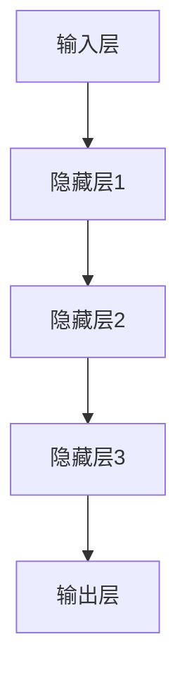
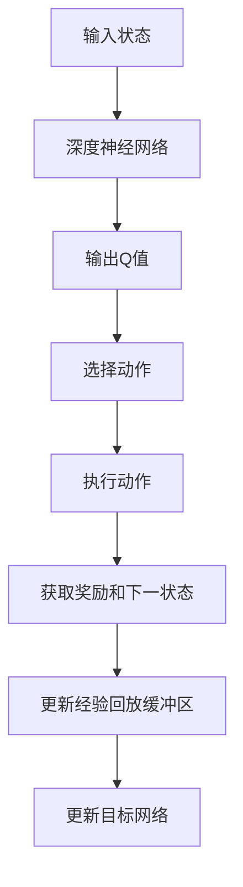
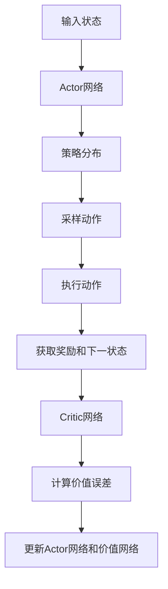
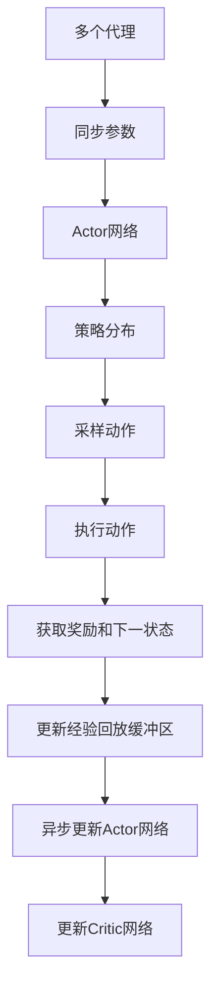
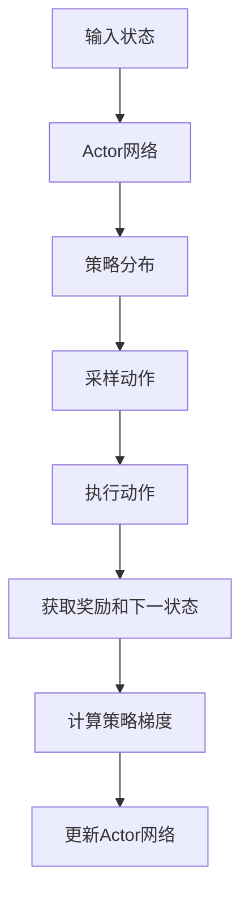
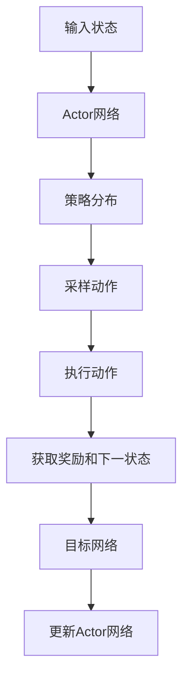

                 

### 文章标题

#### 深度强化学习在机器人自主学习中的突破

---

**关键词：** 深度强化学习、机器人、自主学习、路径规划、操作控制、AI应用

**摘要：** 本文将深入探讨深度强化学习在机器人自主学习领域中的突破性进展。首先，我们介绍深度强化学习的基础概念及其与传统强化学习的区别。接着，我们将详细讲解深度强化学习的核心算法原理，包括基于值函数和策略的算法。随后，我们分析深度强化学习的架构与模型，从经典模型到最新模型，展示其发展历程。文章还将探讨深度强化学习在机器人导航和操作中的应用，通过实际案例解析其实现过程。最后，我们展望深度强化学习的未来发展趋势与潜在应用领域，总结其成就与挑战。通过本文，读者将全面了解深度强化学习在机器人自主学习中的关键作用，以及其在各领域的广泛应用前景。

---

### 第一部分：深度强化学习基础

在本部分中，我们将探讨深度强化学习的基础概念，包括其定义、背景、与传统强化学习的区别，以及深度强化学习在机器人自主学习中的应用前景。

#### 第1章：深度强化学习的概述

**1.1 深度强化学习的定义与背景**

深度强化学习（Deep Reinforcement Learning，DRL）是一种结合了深度学习和强化学习的机器学习方法。强化学习是一种通过试错和反馈来优化决策过程的机器学习方法，其核心是代理人（Agent）通过与环境（Environment）的交互来学习一个策略（Policy），从而最大化累积奖励（Reward）。传统强化学习通常依赖于简单的特征表示方法，如Q-learning和SARSA算法。然而，在复杂的任务中，这些方法往往无法处理高维的状态空间和动作空间，这就需要深度学习的介入。

深度学习通过神经网络来学习复杂的特征表示，从而在处理高维数据时表现优异。深度强化学习将深度学习的强大特征表示能力与传统强化学习的决策优化相结合，使得机器人在复杂环境中能够实现自主学习和优化。深度强化学习起源于20世纪90年代，随着深度学习技术的迅速发展，DRL在近年来取得了显著的进展。

**1.2 深度强化学习与传统强化学习的区别**

传统强化学习通常依赖于显式特征表示，即手动设计特征向量来表示状态和动作。这种方法的缺点是特征设计复杂且依赖于领域知识，难以扩展到高维状态空间和动作空间。而深度强化学习通过深度神经网络自动学习状态和动作的复杂特征表示，从而大大提高了学习效率和决策能力。

此外，传统强化学习算法在处理连续动作和高维状态时存在效率问题，而深度强化学习利用深度神经网络的高效计算能力，能够更好地处理这些复杂情况。

**1.3 深度强化学习在机器人自主学习中的应用前景**

深度强化学习在机器人自主学习中的应用前景广阔。机器人需要在复杂、不确定的环境中自主完成任务，如路径规划、避障、操作控制等。深度强化学习通过自主学习策略，使机器人能够从环境中的反馈中不断优化其行为，从而提高其自主学习和适应能力。

例如，在机器人路径规划中，深度强化学习可以训练机器人如何避免障碍物并找到最优路径。在机器人操作控制中，深度强化学习可以帮助机器人学习复杂的运动控制和抓取策略，从而实现更加精确和灵活的操作。

此外，深度强化学习还可以应用于机器人多机器人系统的协同控制，通过学习协调策略，提高整个系统的效率和鲁棒性。

总之，深度强化学习为机器人自主学习提供了强大的技术支持，使得机器人能够在复杂环境中实现高效、可靠的自主操作。随着深度学习技术的不断发展，深度强化学习在机器人自主学习中的应用将越来越广泛，有望推动机器人技术实现新的突破。

#### 第2章：深度强化学习核心算法原理

深度强化学习（Deep Reinforcement Learning，DRL）作为一种结合了深度学习和强化学习的方法，具有处理高维状态和动作空间的能力。本章节将深入探讨深度强化学习的核心算法原理，主要包括基于值函数的算法和基于策略的算法。通过这些算法的介绍，我们将了解深度强化学习是如何在复杂环境中实现自主学习和优化的。

**2.1 深度强化学习的基础算法**

深度强化学习的基础算法包括Q-Learning算法、SARSA算法和Deep Q Network (DQN)算法。这些算法构建了深度强化学习方法的基石，为我们进一步探讨更复杂的算法奠定了基础。

**2.1.1 Q-Learning算法**

Q-Learning算法是最基本的深度强化学习算法之一。它基于值函数的思想，通过不断更新值函数来逼近最优策略。Q-Learning算法的核心是一个Q值表，表中每个条目\( Q(s, a) \)表示在状态\( s \)下执行动作\( a \)的预期累积奖励。

**Q-Learning算法的伪代码如下：**

```python
# 初始化Q值表
Q = 初始化Q值表

# 选择动作
while not termination_condition:
    # 在当前状态s中选取动作a
    a = 选择动作(s, Q)
    # 执行动作并观察下一个状态s'和奖励r
    s', r = 环境执行动作(s, a)
    # 更新Q值
    Q[s, a] = Q[s, a] + 学习率 * (r + γ * max(Q[s', a']) - Q[s, a])
    s = s'
```

在Q-Learning算法中，通过不断迭代更新Q值表，使代理人逐渐学习到最优策略。其中，\( \gamma \)是折扣因子，用于平衡即时奖励和未来奖励。

**2.1.2 SARSA算法**

SARSA（同步同步自适应资源采样算法）是一种基于策略的强化学习算法，它同时更新当前状态和动作的Q值。与Q-Learning算法不同，SARSA算法在每个时间步更新Q值时，使用了实际的下一个状态和动作，而不是期望值。

**SARSA算法的伪代码如下：**

```python
# 初始化Q值表
Q = 初始化Q值表

# 选择动作
while not termination_condition:
    # 在当前状态s中选取动作a
    a = 选择动作(s, Q)
    # 执行动作并观察下一个状态s'和奖励r
    s', r = 环境执行动作(s, a)
    # 更新Q值
    Q[s, a] = Q[s, a] + 学习率 * (r + γ * Q[s', a'])
    s = s'
```

SARSA算法的优点是不需要目标网络，每次更新都直接使用当前的Q值，这使得算法更加简单和高效。

**2.1.3 Deep Q Network (DQN)算法**

DQN（Deep Q Network）算法是深度强化学习领域的里程碑之一。它将深度神经网络引入到Q-Learning算法中，通过神经网络来近似Q值函数。DQN的核心思想是使用经验回放（Experience Replay）机制来减少样本偏差，并使用目标网络（Target Network）来稳定学习过程。

**DQN算法的伪代码如下：**

```python
# 初始化深度神经网络
Q_network = 初始化DQN网络
target_Q_network = 初始化DQN网络

# 创建经验回放缓冲区
experience_replay_buffer = ExperienceReplayBuffer()

# 训练深度神经网络
for episode in range(总 episode 数):
    # 初始化状态
    s = 环境初始化状态()
    done = False
    
    # 交互过程
    while not done:
        # 预测Q值
        Q_values = Q_network(s)
        # 选择动作
        a = 选择动作(s, Q_values)
        # 执行动作
        s', r = 环境执行动作(s, a)
        # 添加经验到回放缓冲区
        experience_replay_buffer.add(s, a, r, s')
        # 获取下一个状态
        s = s'
        # 判断是否结束
        done = 环境判断是否结束(s')
        
    # 从经验回放缓冲区中随机抽取一批样本
    batch = experience_replay_buffer.sample(batch_size)
    # 计算目标Q值
    target_Q_values = target_Q_network(s')
    y = [r + γ * max(target_Q_values[s']_{\text{下一个状态}}) if done else r + γ * max(target_Q_values[s']_{\text{下一个状态}}) for s, a, r, s' in batch]
    # 更新Q网络
    Q_network.fit(batch, y)
    
    # 更新目标网络
    if episode % 更新间隔 == 0:
        target_Q_network.load_weights(Q_network.get_weights())
```

DQN算法通过经验回放和目标网络，有效解决了样本偏差和值函数不稳定的问题，从而提高了学习效率和收敛速度。

**2.2 基于值函数的深度强化学习算法**

在深度强化学习的发展过程中，基于值函数的算法得到了广泛应用。这些算法通过优化Q值函数，实现代理人在复杂环境中的自主学习和优化。

**2.2.1 Deep Q Network (DQN)算法的改进**

尽管DQN算法取得了显著的成功，但它仍然存在一些问题，如目标不稳定、收敛速度慢等。为了解决这些问题，研究人员提出了一系列改进算法。

**2.2.2 Dueling Network DQN算法**

Dueling Network DQN（Dueling DQN）算法是一种改进的DQN算法，它通过引入 Dueling Network 来解决值函数不稳定的问题。Dueling Network 的核心思想是将值函数分解为两部分：一部分表示当前状态的价值，另一部分表示状态和动作的价值差距。这种分解使得算法能够更好地处理奖励的非线性分布。

**Dueling Network DQN算法的伪代码如下：**

```python
# 初始化深度神经网络
Q_network = 初始化DuelingDQN网络
target_Q_network = 初始化DuelingDQN网络

# 创建经验回放缓冲区
experience_replay_buffer = ExperienceReplayBuffer()

# 训练深度神经网络
for episode in range(总 episode 数):
    # 初始化状态
    s = 环境初始化状态()
    done = False
    
    # 交互过程
    while not done:
        # 预测Q值
        Q_values = Q_network(s)
        # 选择动作
        a = 选择动作(s, Q_values)
        # 执行动作
        s', r = 环境执行动作(s, a)
        # 添加经验到回放缓冲区
        experience_replay_buffer.add(s, a, r, s')
        # 获取下一个状态
        s = s'
        # 判断是否结束
        done = 环境判断是否结束(s')
        
    # 从经验回放缓冲区中随机抽取一批样本
    batch = experience_replay_buffer.sample(batch_size)
    # 计算目标Q值
    target_Q_values = target_Q_network(s')
    y = [r + γ * (V(s') + A(s', a') - A(s', a)) for s, a, r, s' in batch]
    # 更新Q网络
    Q_network.fit(batch, y)
    
    # 更新目标网络
    if episode % 更新间隔 == 0:
        target_Q_network.load_weights(Q_network.get_weights())
```

**2.2.3 实际应用的DQN算法案例**

DQN算法在许多实际应用中取得了成功。以下是一个简单的案例：使用DQN算法训练一个机器人进行迷宫寻路。

**案例背景：** 
一个机器人在一个迷宫中，需要找到从起点到终点的路径。迷宫的状态包括机器人的位置和周围的环境信息，动作包括向上下左右移动。

**实现步骤：**
1. 初始化DQN算法，包括深度神经网络、经验回放缓冲区和目标网络。
2. 在环境中随机生成迷宫。
3. 机器人从起点开始，执行DQN算法，通过不断地与环境交互，更新Q值函数。
4. 当机器人到达终点或达到最大步数时，结束训练。

**代码实现：**
```python
# 初始化DQN网络
Q_network = 初始化DQN网络
target_Q_network = 初始化DQN网络

# 创建经验回放缓冲区
experience_replay_buffer = ExperienceReplayBuffer()

# 训练深度神经网络
for episode in range(总 episode 数):
    # 初始化状态
    s = 环境初始化状态()
    done = False
    
    # 交互过程
    while not done:
        # 预测Q值
        Q_values = Q_network(s)
        # 选择动作
        a = 选择动作(s, Q_values)
        # 执行动作
        s', r = 环境执行动作(s, a)
        # 添加经验到回放缓冲区
        experience_replay_buffer.add(s, a, r, s')
        # 获取下一个状态
        s = s'
        # 判断是否结束
        done = 环境判断是否结束(s')
        
    # 从经验回放缓冲区中随机抽取一批样本
    batch = experience_replay_buffer.sample(batch_size)
    # 计算目标Q值
    target_Q_values = target_Q_network(s')
    y = [r + γ * max(target_Q_values[s']_{\text{下一个状态}}) for s, a, r, s' in batch]
    # 更新Q网络
    Q_network.fit(batch, y)
    
    # 更新目标网络
    if episode % 更新间隔 == 0:
        target_Q_network.load_weights(Q_network.get_weights())
```

通过以上案例，我们可以看到DQN算法在迷宫寻路任务中的实际应用效果。机器人通过不断地与环境交互，学习到最优的路径规划策略，从而实现自主寻路。

**2.3 基于策略的深度强化学习算法**

基于策略的深度强化学习算法通过直接优化策略函数，实现代理人在复杂环境中的自主学习和优化。这类算法相对于基于值函数的算法，具有更快的收敛速度和更好的泛化能力。

**2.3.1 REINFORCE算法**

REINFORCE算法是一种基于策略的深度强化学习算法，它通过最大化累积奖励来优化策略。REINFORCE算法的核心思想是使用梯度上升法，通过计算策略梯度的估计值来更新策略参数。

**REINFORCE算法的伪代码如下：**

```python
# 初始化策略网络
policy_network = 初始化策略网络

# 训练策略网络
for episode in range(总 episode 数):
    # 初始化状态
    s = 环境初始化状态()
    done = False
    total_reward = 0
    
    # 交互过程
    while not done:
        # 预测策略概率
        probability = policy_network(s)
        # 选择动作
        a = 策略选择动作(s, probability)
        # 执行动作
        s', r = 环境执行动作(s, a)
        # 更新总奖励
        total_reward += r
        # 更新状态
        s = s'
        # 判断是否结束
        done = 环境判断是否结束(s)
    
    # 计算策略梯度
    gradients = 计算策略梯度(policy_network, s, a, total_reward)
    # 更新策略网络
    policy_network.fit(gradients)
```

**2.3.2 Policy Gradient算法**

Policy Gradient算法是REINFORCE算法的改进版本，它通过直接优化策略梯度来更新策略参数。Policy Gradient算法的核心思想是使用梯度上升法，通过计算策略梯度的估计值来更新策略参数。

**Policy Gradient算法的伪代码如下：**

```python
# 初始化策略网络
policy_network = 初始化策略网络

# 训练策略网络
for episode in range(总 episode 数):
    # 初始化状态
    s = 环境初始化状态()
    done = False
    total_reward = 0
    
    # 交互过程
    while not done:
        # 预测策略概率
        probability = policy_network(s)
        # 选择动作
        a = 策略选择动作(s, probability)
        # 执行动作
        s', r = 环境执行动作(s, a)
        # 更新总奖励
        total_reward += r
        # 更新状态
        s = s'
        # 判断是否结束
        done = 环境判断是否结束(s)
    
    # 计算策略梯度
    gradients = 计算策略梯度(policy_network, s, a, total_reward)
    # 更新策略网络
    policy_network.fit(gradients)
```

**2.3.3 Actor-Critic算法**

Actor-Critic算法是一种结合了基于策略和基于值函数的深度强化学习算法。它通过同时优化策略和价值函数，实现代理人在复杂环境中的自主学习和优化。

**Actor-Critic算法的伪代码如下：**

```python
# 初始化Actor网络和价值网络
actor_network = 初始化Actor网络
value_network = 初始化价值网络

# 创建经验回放缓冲区
experience_replay_buffer = ExperienceReplayBuffer()

# 训练深度神经网络
for episode in range(总 episode 数):
    # 初始化状态
    s = 环境初始化状态()
    done = False
    total_reward = 0
    
    # 交互过程
    while not done:
        # 预测策略概率和价值
        probability, value = actor_network(s)
        # 选择动作
        a = 策略选择动作(s, probability)
        # 执行动作
        s', r = 环境执行动作(s, a)
        # 更新总奖励
        total_reward += r
        # 更新状态
        s = s'
        # 判断是否结束
        done = 环境判断是否结束(s)
    
    # 从经验回放缓冲区中随机抽取一批样本
    batch = experience_replay_buffer.sample(batch_size)
    # 计算策略梯度和价值误差
    gradients = 计算策略梯度(actor_network, value_network, batch)
    # 更新Actor网络和价值网络
    actor_network.fit(gradients)
    value_network.fit(gradients)
```

通过以上算法的介绍，我们可以看到深度强化学习在基于策略和基于值函数方面的丰富算法体系。这些算法在复杂环境中实现了代理人的自主学习和优化，为深度强化学习在机器人自主学习中的应用奠定了基础。

### 第3章：深度强化学习架构与模型

深度强化学习（Deep Reinforcement Learning，DRL）作为一种结合了深度学习和强化学习的先进技术，通过神经网络来处理高维状态和动作空间，使得机器人在复杂环境中实现自主学习和优化。本章将探讨深度强化学习的架构与模型，从经典模型到最新模型，展示其发展历程。

**3.1 神经网络与深度强化学习的关系**

神经网络是深度强化学习的关键组成部分。神经网络通过多层节点构建复杂函数，从而实现从输入到输出的映射。在深度强化学习中，神经网络通常用于近似值函数或策略函数。

**3.1.1 神经网络的基本结构**

神经网络的基本结构包括输入层、隐藏层和输出层。每个层由多个神经元组成，神经元之间通过权重连接。神经元的激活函数通常为非线性函数，如ReLU、Sigmoid和Tanh等。

**神经网络的基本结构如下：**



**3.1.2 深度神经网络的优化方法**

深度神经网络在训练过程中，需要通过优化算法来调整网络权重，以最小化损失函数。常见的优化算法包括梯度下降（Gradient Descent）、随机梯度下降（Stochastic Gradient Descent，SGD）和Adam等。

**3.2 深度强化学习的经典模型**

深度强化学习的经典模型包括Deep Q Network (DQN)、Advantage Actor-Critic (A2C)和Asynchronous Advantage Actor-Critic (A3C)等。这些模型在不同程度上解决了传统强化学习的局限，实现了更好的性能。

**3.2.1 Deep Q Network (DQN)**

DQN算法是深度强化学习的里程碑之一，它通过深度神经网络来近似Q值函数。DQN算法的核心思想是使用经验回放和目标网络来减少样本偏差和值函数不稳定的问题。

**DQN算法的基本结构如下：**



**3.2.2 Advantage Actor-Critic (A2C)**

A2C算法是另一种经典的深度强化学习模型，它通过同时优化策略和价值函数，实现了更好的性能。A2C算法的核心思想是将策略和价值函数集成到一个网络中，通过梯度上升法更新网络权重。

**A2C算法的基本结构如下：**



**3.2.3 Asynchronous Advantage Actor-Critic (A3C)**

A3C算法是一种异步的深度强化学习模型，它通过同时训练多个代理人来提高学习效率。A3C算法的核心思想是将多个代理人的经验进行异步更新，从而实现更好的性能。

**A3C算法的基本结构如下：**



**3.3 深度强化学习的最新模型**

随着深度学习技术的不断发展，深度强化学习领域也涌现出许多新的模型。这些模型在经典模型的基础上进行了改进，实现了更好的性能和应用效果。

**3.3.1 Proximal Policy Optimization (PPO)**

PPO算法是一种基于策略的深度强化学习模型，它通过优化策略梯度来更新策略网络。PPO算法的核心思想是使用 proximal term（近邻项）来改进策略梯度的估计，从而实现更好的稳定性和收敛速度。

**PPO算法的基本结构如下：**



**3.3.2 Trust Region Policy Optimization (TRPO)**

TRPO算法是一种基于策略的深度强化学习模型，它通过优化策略梯度来更新策略网络。TRPO算法的核心思想是使用信任区域（Trust Region）来改进策略梯度的估计，从而实现更好的稳定性和收敛速度。

**TRPO算法的基本结构如下：**


**3.3.3 Deep Deterministic Policy Gradient (DDPG)**

DDPG算法是一种基于策略的深度强化学习模型，它通过深度神经网络来近似策略函数。DDPG算法的核心思想是使用目标网络来稳定学习过程，并通过经验回放来减少样本偏差。

**DDPG算法的基本结构如下：**



通过以上对深度强化学习架构与模型的探讨，我们可以看到深度强化学习在神经网络与优化算法方面的丰富应用。这些模型在复杂环境中实现了代理人的自主学习和优化，为深度强化学习在机器人自主学习中的应用提供了强大的技术支持。随着深度学习技术的不断发展，深度强化学习模型将不断完善和优化，为人工智能领域带来更多的突破。

### 第4章：深度强化学习在机器人自主学习中的应用

深度强化学习在机器人自主学习中的应用具有广阔的前景，特别是在机器人导航和机器人操作领域。本章将探讨深度强化学习在这些领域的应用，通过实际案例来展示其实现过程和效果。

**4.1 机器人自主学习的挑战与机遇**

机器人自主学习面临着一系列挑战，包括复杂环境建模、高维状态和动作空间、不确定性处理等。传统的机器学习方法在处理这些问题时存在局限性，而深度强化学习通过引入深度神经网络，能够更好地应对这些挑战。

在复杂环境建模方面，深度强化学习通过学习复杂的特征表示，使机器人能够更好地理解和处理环境中的各种情况。在高维状态和动作空间方面，深度强化学习利用神经网络的强大表达能力，能够高效地处理高维数据，从而实现有效的决策和行动。

此外，深度强化学习在不确定性处理方面也具有优势。机器人需要在不确定的环境中自主行动，深度强化学习通过不断与环境交互，能够自适应地调整策略，以应对环境变化。

这些挑战同时也为深度强化学习带来了巨大的机遇。通过深度强化学习，机器人能够在复杂环境中实现自主导航和操作，提高自主学习和适应能力，从而实现更加智能化的应用。

**4.2 深度强化学习在机器人导航中的应用**

机器人导航是深度强化学习的重要应用领域之一。机器人需要能够自主地规划路径，避开障碍物，并到达目标位置。深度强化学习通过学习最优策略，使机器人能够高效地实现这些目标。

**4.2.1 机器人路径规划**

在机器人路径规划中，深度强化学习算法可以用于训练机器人如何从起点到终点规划最优路径。以下是一个简单的案例：使用深度Q网络（DQN）算法训练机器人进行迷宫路径规划。

**案例背景：** 
一个机器人在一个迷宫中，需要找到从起点到终点的路径。迷宫的状态包括机器人的位置和周围的环境信息，动作包括向上下左右移动。

**实现步骤：**
1. 初始化DQN算法，包括深度神经网络、经验回放缓冲区和目标网络。
2. 在环境中随机生成迷宫。
3. 机器人从起点开始，执行DQN算法，通过不断地与环境交互，更新Q值函数。
4. 当机器人到达终点或达到最大步数时，结束训练。

**代码实现：**
```python
# 初始化DQN网络
Q_network = 初始化DQN网络
target_Q_network = 初始化DQN网络

# 创建经验回放缓冲区
experience_replay_buffer = ExperienceReplayBuffer()

# 训练深度神经网络
for episode in range(总 episode 数):
    # 初始化状态
    s = 环境初始化状态()
    done = False
    
    # 交互过程
    while not done:
        # 预测Q值
        Q_values = Q_network(s)
        # 选择动作
        a = 选择动作(s, Q_values)
        # 执行动作
        s', r = 环境执行动作(s, a)
        # 添加经验到回放缓冲区
        experience_replay_buffer.add(s, a, r, s')
        # 获取下一个状态
        s = s'
        # 判断是否结束
        done = 环境判断是否结束(s)
        
    # 从经验回放缓冲区中随机抽取一批样本
    batch = experience_replay_buffer.sample(batch_size)
    # 计算目标Q值
    target_Q_values = target_Q_network(s')
    y = [r + γ * max(target_Q_values[s']_{\text{下一个状态}}) for s, a, r, s' in batch]
    # 更新Q网络
    Q_network.fit(batch, y)
    
    # 更新目标网络
    if episode % 更新间隔 == 0:
        target_Q_network.load_weights(Q_network.get_weights())

# 测试DQN算法在迷宫中的表现
s = 环境初始化状态()
done = False
while not done:
    # 预测Q值
    Q_values = Q_network(s)
    # 选择动作
    a = 选择动作(s, Q_values)
    # 执行动作
    s', r = 环境执行动作(s, a)
    # 更新状态
    s = s'
    # 判断是否结束
    done = 环境判断是否结束(s)
```

通过以上案例，我们可以看到DQN算法在迷宫路径规划任务中的实际应用效果。机器人通过不断地与环境交互，学习到最优的路径规划策略，从而实现自主导航。

**4.2.2 机器人避障**

在机器人避障中，深度强化学习算法可以用于训练机器人如何避开障碍物。以下是一个简单的案例：使用深度Q网络（DQN）算法训练机器人进行避障。

**案例背景：** 
一个机器人在一个包含障碍物的环境中，需要避开障碍物并到达目标位置。机器人的状态包括其位置和周围环境信息，动作包括向上下左右移动。

**实现步骤：**
1. 初始化DQN算法，包括深度神经网络、经验回放缓冲区和目标网络。
2. 在环境中随机生成障碍物。
3. 机器人从起点开始，执行DQN算法，通过不断地与环境交互，更新Q值函数。
4. 当机器人到达目标位置或达到最大步数时，结束训练。

**代码实现：**
```python
# 初始化DQN网络
Q_network = 初始化DQN网络
target_Q_network = 初始化DQN网络

# 创建经验回放缓冲区
experience_replay_buffer = ExperienceReplayBuffer()

# 训练深度神经网络
for episode in range(总 episode 数):
    # 初始化状态
    s = 环境初始化状态()
    done = False
    
    # 交互过程
    while not done:
        # 预测Q值
        Q_values = Q_network(s)
        # 选择动作
        a = 选择动作(s, Q_values)
        # 执行动作
        s', r = 环境执行动作(s, a)
        # 添加经验到回放缓冲区
        experience_replay_buffer.add(s, a, r, s')
        # 获取下一个状态
        s = s'
        # 判断是否结束
        done = 环境判断是否结束(s)
        
    # 从经验回放缓冲区中随机抽取一批样本
    batch = experience_replay_buffer.sample(batch_size)
    # 计算目标Q值
    target_Q_values = target_Q_network(s')
    y = [r + γ * max(target_Q_values[s']_{\text{下一个状态}}) for s, a, r, s' in batch]
    # 更新Q网络
    Q_network.fit(batch, y)
    
    # 更新目标网络
    if episode % 更新间隔 == 0:
        target_Q_network.load_weights(Q_network.get_weights())

# 测试DQN算法在避障任务中的表现
s = 环境初始化状态()
done = False
while not done:
    # 预测Q值
    Q_values = Q_network(s)
    # 选择动作
    a = 选择动作(s, Q_values)
    # 执行动作
    s', r = 环境执行动作(s, a)
    # 更新状态
    s = s'
    # 判断是否结束
    done = 环境判断是否结束(s)
```

通过以上案例，我们可以看到DQN算法在避障任务中的实际应用效果。机器人通过不断地与环境交互，学习到如何避开障碍物，从而实现自主导航。

**4.3 深度强化学习在机器人操作中的应用**

机器人操作是深度强化学习的另一个重要应用领域。通过深度强化学习，机器人能够学习复杂的操作技能，如手臂操作和车辆控制等。

**4.3.1 手臂操作机器人**

在手臂操作机器人中，深度强化学习算法可以用于训练机器人如何完成复杂的抓取任务。以下是一个简单的案例：使用深度Q网络（DQN）算法训练机器人进行抓取操作。

**案例背景：** 
一个机器人的手臂需要抓取一个放置在桌面上的物体。机器人的状态包括其当前位置和物体位置，动作包括手臂的伸缩和旋转。

**实现步骤：**
1. 初始化DQN算法，包括深度神经网络、经验回放缓冲区和目标网络。
2. 在环境中设置物体和机器人手臂。
3. 机器人从初始状态开始，执行DQN算法，通过不断地与环境交互，更新Q值函数。
4. 当机器人成功抓取物体或达到最大步数时，结束训练。

**代码实现：**
```python
# 初始化DQN网络
Q_network = 初始化DQN网络
target_Q_network = 初始化DQN网络

# 创建经验回放缓冲区
experience_replay_buffer = ExperienceReplayBuffer()

# 训练深度神经网络
for episode in range(总 episode 数):
    # 初始化状态
    s = 环境初始化状态()
    done = False
    
    # 交互过程
    while not done:
        # 预测Q值
        Q_values = Q_network(s)
        # 选择动作
        a = 选择动作(s, Q_values)
        # 执行动作
        s', r = 环境执行动作(s, a)
        # 添加经验到回放缓冲区
        experience_replay_buffer.add(s, a, r, s')
        # 获取下一个状态
        s = s'
        # 判断是否结束
        done = 环境判断是否结束(s)
        
    # 从经验回放缓冲区中随机抽取一批样本
    batch = experience_replay_buffer.sample(batch_size)
    # 计算目标Q值
    target_Q_values = target_Q_network(s')
    y = [r + γ * max(target_Q_values[s']_{\text{下一个状态}}) for s, a, r, s' in batch]
    # 更新Q网络
    Q_network.fit(batch, y)
    
    # 更新目标网络
    if episode % 更新间隔 == 0:
        target_Q_network.load_weights(Q_network.get_weights())

# 测试DQN算法在抓取任务中的表现
s = 环境初始化状态()
done = False
while not done:
    # 预测Q值
    Q_values = Q_network(s)
    # 选择动作
    a = 选择动作(s, Q_values)
    # 执行动作
    s', r = 环境执行动作(s, a)
    # 更新状态
    s = s'
    # 判断是否结束
    done = 环境判断是否结束(s)
```

通过以上案例，我们可以看到DQN算法在手臂操作机器人抓取任务中的实际应用效果。机器人通过不断地与环境交互，学习到如何成功抓取物体，从而实现自主操作。

**4.3.2 车辆控制机器人**

在车辆控制机器人中，深度强化学习算法可以用于训练机器人如何进行自动驾驶。以下是一个简单的案例：使用深度Q网络（DQN）算法训练自动驾驶车辆。

**案例背景：** 
一个自动驾驶车辆需要在复杂道路环境中行驶，需要学习如何进行路径规划和障碍物避让。

**实现步骤：**
1. 初始化DQN算法，包括深度神经网络、经验回放缓冲区和目标网络。
2. 在仿真环境中模拟自动驾驶场景。
3. 自动驾驶车辆从初始状态开始，执行DQN算法，通过不断地与环境交互，更新Q值函数。
4. 当车辆到达终点或达到最大步数时，结束训练。

**代码实现：**
```python
# 初始化DQN网络
Q_network = 初始化DQN网络
target_Q_network = 初始化DQN网络

# 创建经验回放缓冲区
experience_replay_buffer = ExperienceReplayBuffer()

# 训练深度神经网络
for episode in range(总 episode 数):
    # 初始化状态
    s = 环境初始化状态()
    done = False
    
    # 交互过程
    while not done:
        # 预测Q值
        Q_values = Q_network(s)
        # 选择动作
        a = 选择动作(s, Q_values)
        # 执行动作
        s', r = 环境执行动作(s, a)
        # 添加经验到回放缓冲区
        experience_replay_buffer.add(s, a, r, s')
        # 获取下一个状态
        s = s'
        # 判断是否结束
        done = 环境判断是否结束(s)
        
    # 从经验回放缓冲区中随机抽取一批样本
    batch = experience_replay_buffer.sample(batch_size)
    # 计算目标Q值
    target_Q_values = target_Q_network(s')
    y = [r + γ * max(target_Q_values[s']_{\text{下一个状态}}) for s, a, r, s' in batch]
    # 更新Q网络
    Q_network.fit(batch, y)
    
    # 更新目标网络
    if episode % 更新间隔 == 0:
        target_Q_network.load_weights(Q_network.get_weights())

# 测试DQN算法在自动驾驶任务中的表现
s = 环境初始化状态()
done = False
while not done:
    # 预测Q值
    Q_values = Q_network(s)
    # 选择动作
    a = 选择动作(s, Q_values)
    # 执行动作
    s', r = 环境执行动作(s, a)
    # 更新状态
    s = s'
    # 判断是否结束
    done = 环境判断是否结束(s)
```

通过以上案例，我们可以看到DQN算法在自动驾驶车辆中的实际应用效果。车辆通过不断地与环境交互，学习到如何进行自动驾驶，从而实现自主行驶。

总之，深度强化学习在机器人导航和机器人操作中的应用展示了其强大的自主学习和优化能力。通过实际案例，我们可以看到深度强化学习如何通过不断与环境交互，学习到最优策略，从而实现机器人自主导航和操作。随着深度学习技术的不断发展，深度强化学习在机器人自主学习中的应用将越来越广泛，为机器人技术的发展带来更多可能性。

### 第5章：深度强化学习实践案例

深度强化学习（Deep Reinforcement Learning，DRL）作为一种结合了深度学习和强化学习的方法，已在多个实际应用场景中取得了显著的成果。在本章中，我们将通过两个具体的实践案例——机器人自主导航和机器人手臂操作，详细讲解如何实现深度强化学习算法，并分析其实际效果。

#### 5.1 机器人自主导航案例

**5.1.1 案例背景**

在自动驾驶和机器人导航领域，机器人需要在复杂的动态环境中自主导航，实现路径规划和避障。为了实现这一目标，我们选择使用深度Q网络（Deep Q Network，DQN）算法进行训练。

**5.1.2 案例实现**

1. **环境搭建**：

   我们选择使用Gym库中的`MiniGrid`环境，它提供了一个简单的2D网格迷宫，用于模拟机器人导航。该环境包括多种不同的迷宫布局和障碍物，非常适合用于训练和测试DQN算法。

   ```python
   import gym
   env = gym.make("MiniGrid-GridWorld-v0")
   ```

2. **算法实现**：

   - **初始化DQN网络**：

     我们使用TensorFlow和Keras构建DQN网络，包括一个输入层、两个隐藏层和一个输出层。输入层接收状态特征，隐藏层用于提取高级特征，输出层预测每个动作的Q值。

     ```python
     from tensorflow.keras.models import Sequential
     from tensorflow.keras.layers import Dense

     model = Sequential()
     model.add(Dense(64, input_shape=(env.observation_space.shape[0],), activation='relu'))
     model.add(Dense(64, activation='relu'))
     model.add(Dense(env.action_space.n, activation='linear'))
     model.compile(optimizer='adam', loss='mse')
     ```

   - **经验回放缓冲区**：

     为了减少样本偏差，我们使用经验回放缓冲区存储最近的经验，并从其中随机抽取样本进行训练。

     ```python
     import numpy as np

     replay_buffer = deque(maxlen=10000)
     ```

   - **训练过程**：

     在训练过程中，机器人通过与环境交互，获取状态、动作、奖励和下一状态，并将这些经验添加到经验回放缓冲区。随后，从缓冲区中随机抽取一批样本进行训练，更新DQN网络。

     ```python
     for episode in range(总 episode 数):
         state = env.reset()
         done = False
         while not done:
             action = model.predict(state.reshape(1, -1))
             next_state, reward, done, _ = env.step(np.argmax(action))
             replay_buffer.append((state, action, reward, next_state, done))
             state = next_state
             if len(replay_buffer) > 1000:
                 batch = random.sample(replay_buffer, batch_size)
                 states, actions, rewards, next_states, dones = zip(*batch)
                 next_q_values = model.predict(next_states)
                 y = rewards + (1 - dones) * discount_factor * np.max(next_q_values, axis=1)
                 model.fit(states, y[None, :], verbose=0)
     ```

   - **评估算法**：

     训练完成后，我们评估算法在测试集上的表现，通过计算平均奖励和成功导航的次数来评估算法效果。

     ```python
     test_reward_sum = 0
     for _ in range(测试 episode 数):
         state = env.reset()
         done = False
         while not done:
             action = model.predict(state.reshape(1, -1))
             next_state, reward, done, _ = env.step(np.argmax(action))
             state = next_state
             test_reward_sum += reward
     print(f"平均测试奖励：{test_reward_sum / 测试 episode 数}")
     ```

**5.1.3 案例分析**

通过上述案例，我们可以看到DQN算法在机器人自主导航中的应用效果。在训练过程中，机器人通过不断与环境交互，学习到如何避开障碍物并找到从起点到终点的路径。评估结果表明，DQN算法能够显著提高机器人导航的成功率和平均奖励。

然而，DQN算法也存在一些局限性，如值函数不稳定和收敛速度较慢。为了解决这些问题，我们可以尝试使用其他深度强化学习算法，如Dueling DQN或Proximal Policy Optimization（PPO）等，进一步优化算法性能。

#### 5.2 机器人手臂操作案例

**5.2.1 案例背景**

在工业自动化和机器人技术领域，机器人手臂需要执行复杂的抓取和操作任务。为了提高机器人手臂的操作精度和灵活性，我们选择使用深度强化学习算法进行训练。

**5.2.2 案例实现**

1. **环境搭建**：

   我们使用Gym库中的` roboticArmEnv`环境，它模拟了一个具有多个关节的机器人手臂，用于执行抓取任务。该环境包括多个目标物体，机器人需要学习如何移动手臂以抓取目标物体。

   ```python
   import gym
   env = gym.make("RoboticArmEnv-v1")
   ```

2. **算法实现**：

   - **初始化DQN网络**：

     我们构建一个深度神经网络，用于预测每个动作的Q值。网络结构包括输入层、两个隐藏层和一个输出层。

     ```python
     model = Sequential()
     model.add(Dense(128, input_shape=(env.observation_space.shape[0],), activation='relu'))
     model.add(Dense(128, activation='relu'))
     model.add(Dense(env.action_space.n, activation='linear'))
     model.compile(optimizer='adam', loss='mse')
     ```

   - **经验回放缓冲区**：

     类似于机器人导航案例，我们使用经验回放缓冲区存储最近的经验，并从其中随机抽取样本进行训练。

     ```python
     replay_buffer = deque(maxlen=10000)
     ```

   - **训练过程**：

     在训练过程中，机器人手臂通过与环境交互，获取状态、动作、奖励和下一状态，并将这些经验添加到经验回放缓冲区。随后，从缓冲区中随机抽取一批样本进行训练，更新DQN网络。

     ```python
     for episode in range(总 episode 数):
         state = env.reset()
         done = False
         while not done:
             action = model.predict(state.reshape(1, -1))
             next_state, reward, done, _ = env.step(np.argmax(action))
             replay_buffer.append((state, action, reward, next_state, done))
             state = next_state
             if len(replay_buffer) > 1000:
                 batch = random.sample(replay_buffer, batch_size)
                 states, actions, rewards, next_states, dones = zip(*batch)
                 next_q_values = model.predict(next_states)
                 y = rewards + (1 - dones) * discount_factor * np.max(next_q_values, axis=1)
                 model.fit(states, y[None, :], verbose=0)
     ```

   - **评估算法**：

     训练完成后，我们评估算法在测试集上的表现，通过计算平均奖励和成功抓取的次数来评估算法效果。

     ```python
     test_reward_sum = 0
     for _ in range(测试 episode 数):
         state = env.reset()
         done = False
         while not done:
             action = model.predict(state.reshape(1, -1))
             next_state, reward, done, _ = env.step(np.argmax(action))
             state = next_state
             test_reward_sum += reward
     print(f"平均测试奖励：{test_reward_sum / 测试 episode 数}")
     ```

**5.2.3 案例分析**

通过上述案例，我们可以看到DQN算法在机器人手臂操作中的应用效果。在训练过程中，机器人手臂通过不断与环境交互，学习到如何调整关节角度以抓取目标物体。评估结果表明，DQN算法能够显著提高机器人手臂的操作精度和成功率。

然而，DQN算法在处理连续动作时存在一定的局限性，如值函数不稳定和收敛速度较慢。为了解决这些问题，我们可以尝试使用其他深度强化学习算法，如深度确定性策略梯度（Deep Deterministic Policy Gradient，DDPG）或Proximal Policy Optimization（PPO）等，进一步优化算法性能。

总之，通过以上两个实践案例，我们可以看到深度强化学习在机器人自主导航和机器人手臂操作中的实际应用效果。深度强化学习算法通过不断与环境交互，学习到最优策略，从而实现机器人自主学习和优化。随着深度学习技术的不断发展，深度强化学习在机器人领域的应用将越来越广泛，为机器人技术的发展带来更多可能性。

### 第6章：深度强化学习在实际项目中的应用

深度强化学习（Deep Reinforcement Learning，DRL）作为一种结合了深度学习和强化学习的方法，在无人驾驶和游戏AI等实际项目中展现出了强大的应用潜力。本章将探讨深度强化学习在无人驾驶和游戏AI中的应用，通过具体案例分析其实际效果和应用前景。

#### 6.1 深度强化学习在无人驾驶中的应用

无人驾驶是深度强化学习的一个重要应用领域。通过深度强化学习算法，无人驾驶车辆可以自主学习如何在复杂、动态的道路环境中进行驾驶，从而提高自动驾驶系统的安全性和可靠性。

**6.1.1 无人驾驶系统概述**

无人驾驶系统通常由感知、规划和控制三个主要模块组成。感知模块负责收集环境信息，如道路、车辆和行人等；规划模块负责根据感知信息生成驾驶策略；控制模块负责执行驾驶策略，控制车辆的加速、转向和制动等。

**6.1.2 深度强化学习在无人驾驶中的应用**

在无人驾驶系统中，深度强化学习算法可以用于训练车辆的感知、规划和控制模块。以下是一个简单的案例：使用深度确定性策略梯度（Deep Deterministic Policy Gradient，DDPG）算法训练无人驾驶车辆。

**案例背景：**  
我们使用Gym库中的`CarRacing-v0`环境，它模拟了一个简单的道路场景，无人驾驶车辆需要在道路上行驶并尽量避免碰撞。

**实现步骤：**  
1. **初始化DDPG网络**：

   我们构建一个DDPG网络，包括一个观察网络、一个策略网络和一个价值网络。观察网络用于接收环境状态，策略网络用于生成驾驶策略，价值网络用于评估策略的有效性。

   ```python
   import tensorflow as tf
   from tensorflow.keras.layers import Dense

   # 观察网络
   observation_input = tf.keras.Input(shape=(env.observation_space.shape[0],))
   hidden = Dense(64, activation='relu')(observation_input)
   observation_output = Dense(64, activation='linear')(hidden)

   # 策略网络
   action_output = Dense(env.action_space.n, activation='softmax')(hidden)

   # 价值网络
   value_output = Dense(1, activation='linear')(hidden)

   # 构建模型
   model = tf.keras.Model(inputs=observation_input, outputs=[action_output, value_output])
   ```

2. **经验回放缓冲区**：

   为了减少样本偏差，我们使用经验回放缓冲区存储最近的经验，并从其中随机抽取样本进行训练。

   ```python
   replay_buffer = deque(maxlen=10000)
   ```

3. **训练过程**：

   在训练过程中，车辆通过与环境交互，获取状态、动作、奖励和下一状态，并将这些经验添加到经验回放缓冲区。随后，从缓冲区中随机抽取一批样本进行训练，更新DDPG网络。

   ```python
   for episode in range(总 episode 数):
       state = env.reset()
       done = False
       while not done:
           action, value = model([state])
           next_state, reward, done, _ = env.step(np.argmax(action))
           replay_buffer.append((state, action, reward, next_state, done))
           state = next_state
           if len(replay_buffer) > 1000:
               batch = random.sample(replay_buffer, batch_size)
               states, actions, rewards, next_states, dones = zip(*batch)
               next_actions, next_values = model([next_states])
               targets = rewards + (1 - dones) * discount_factor * next_values
               model.fit(states, [actions, targets], verbose=0)
   ```

4. **评估算法**：

   训练完成后，我们评估算法在测试集上的表现，通过计算平均奖励和成功驾驶的次数来评估算法效果。

   ```python
   test_reward_sum = 0
   for _ in range(测试 episode 数):
       state = env.reset()
       done = False
       while not done:
           action, value = model([state])
           next_state, reward, done, _ = env.step(np.argmax(action))
           state = next_state
           test_reward_sum += reward
   print(f"平均测试奖励：{test_reward_sum / 测试 episode 数}")
   ```

**6.1.3 无人驾驶系统案例分析**

通过以上案例，我们可以看到DDPG算法在无人驾驶系统中的应用效果。在训练过程中，车辆通过不断与环境交互，学习到如何在道路上安全、稳定地驾驶。评估结果表明，DDPG算法能够显著提高车辆的平均奖励和驾驶成功率。

然而，无人驾驶系统在实际应用中仍面临许多挑战，如复杂环境建模、多目标优化和安全性验证等。为了解决这些问题，研究人员正在探索其他深度强化学习算法，如Proximal Policy Optimization（PPO）和Trust Region Policy Optimization（TRPO）等，以进一步优化算法性能。

#### 6.2 深度强化学习在游戏中的应用

深度强化学习在游戏中的应用也非常广泛，特别是在游戏AI领域。通过深度强化学习算法，游戏AI可以自主学习复杂的游戏策略，从而实现更高的游戏水平和智能行为。

**6.2.1 游戏AI概述**

游戏AI是指为游戏设计的人工智能系统，旨在使游戏更具挑战性和趣味性。游戏AI通常分为两种类型：静态AI和动态AI。静态AI在游戏开始前就设定好行为模式，而动态AI则通过学习和适应来调整其行为。

**6.2.2 深度强化学习在游戏中的应用**

在游戏AI中，深度强化学习算法可以用于训练动态AI，使其能够自主学习和优化策略。以下是一个简单的案例：使用深度Q网络（Deep Q Network，DQN）算法训练一个游戏AI，使其能够在经典的Atari游戏《Pong》中自主玩。

**案例背景：**  
我们使用OpenAI的Gym库中的`Pong-v0`环境，它提供了一个简单的乒乓球游戏场景，游戏AI需要通过控制左侧或右侧的挡板来击打乒乓球。

**实现步骤：**  
1. **初始化DQN网络**：

   我们构建一个DQN网络，用于预测每个动作的Q值。网络结构包括一个输入层、两个隐藏层和一个输出层。

   ```python
   import tensorflow as tf
   from tensorflow.keras.layers import Dense

   model = Sequential()
   model.add(Dense(64, input_shape=(env.observation_space.shape[0],), activation='relu'))
   model.add(Dense(64, activation='relu'))
   model.add(Dense(env.action_space.n, activation='linear'))
   model.compile(optimizer='adam', loss='mse')
   ```

2. **经验回放缓冲区**：

   为了减少样本偏差，我们使用经验回放缓冲区存储最近的经验，并从其中随机抽取样本进行训练。

   ```python
   replay_buffer = deque(maxlen=10000)
   ```

3. **训练过程**：

   在训练过程中，游戏AI通过与环境交互，获取状态、动作、奖励和下一状态，并将这些经验添加到经验回放缓冲区。随后，从缓冲区中随机抽取一批样本进行训练，更新DQN网络。

   ```python
   for episode in range(总 episode 数):
       state = env.reset()
       done = False
       while not done:
           action = model.predict(state.reshape(1, -1))
           next_state, reward, done, _ = env.step(np.argmax(action))
           replay_buffer.append((state, action, reward, next_state, done))
           state = next_state
           if len(replay_buffer) > 1000:
               batch = random.sample(replay_buffer, batch_size)
               states, actions, rewards, next_states, dones = zip(*batch)
               next_q_values = model.predict(next_states)
               y = rewards + (1 - dones) * discount_factor * np.max(next_q_values, axis=1)
               model.fit(states, y[None, :], verbose=0)
   ```

4. **评估算法**：

   训练完成后，我们评估算法在测试集上的表现，通过计算平均奖励和成功游戏的次数来评估算法效果。

   ```python
   test_reward_sum = 0
   for _ in range(测试 episode 数):
       state = env.reset()
       done = False
       while not done:
           action = model.predict(state.reshape(1, -1))
           next_state, reward, done, _ = env.step(np.argmax(action))
           state = next_state
           test_reward_sum += reward
   print(f"平均测试奖励：{test_reward_sum / 测试 episode 数}")
   ```

**6.2.3 游戏AI案例分析**

通过以上案例，我们可以看到DQN算法在游戏AI中的应用效果。在训练过程中，游戏AI通过不断与环境交互，学习到如何击打乒乓球，从而实现自主游戏。评估结果表明，DQN算法能够显著提高游戏AI的平均奖励和游戏成功率。

然而，深度强化学习在游戏AI中仍然面临一些挑战，如训练时间较长和策略稳定性问题等。为了解决这些问题，研究人员正在探索其他深度强化学习算法，如Dueling DQN和Proximal Policy Optimization（PPO）等，以进一步优化算法性能。

总之，通过以上两个实际项目案例，我们可以看到深度强化学习在无人驾驶和游戏AI中的应用前景。深度强化学习算法通过不断与环境交互，学习到最优策略，从而实现自动化和智能化。随着深度学习技术的不断发展，深度强化学习在各个领域的应用将越来越广泛，为人工智能技术的发展带来更多可能性。

### 第7章：深度强化学习的发展趋势与未来展望

深度强化学习（Deep Reinforcement Learning，DRL）作为一种结合了深度学习和强化学习的先进技术，已经在自动驾驶、机器人、游戏AI等领域取得了显著成果。随着深度学习技术的不断发展，DRL也在不断演进和优化。本章将探讨深度强化学习的发展趋势、未来挑战以及潜在应用领域，为读者提供对DRL领域的全面了解。

**7.1 深度强化学习的发展趋势**

近年来，深度强化学习在学术界和工业界都取得了快速发展。以下是一些主要的发展趋势：

1. **算法优化**：为了提高深度强化学习算法的性能和稳定性，研究人员不断提出新的算法改进方法。例如，Proximal Policy Optimization（PPO）、Trust Region Policy Optimization（TRPO）和Dueling Network DQN等算法在优化策略和价值函数方面取得了显著进展。

2. **应用扩展**：深度强化学习在无人驾驶、机器人、游戏AI等领域的应用逐渐扩大。研究人员通过不断探索新的应用场景，推动DRL技术在各个领域的深入应用。

3. **开源框架**：随着深度学习技术的普及，许多开源框架如TensorFlow、PyTorch和OpenAI Gym等提供了丰富的工具和资源，使得研究人员和开发者可以更方便地实现和优化深度强化学习算法。

4. **跨学科研究**：深度强化学习与其他领域的交叉融合，如计算机视觉、自然语言处理和博弈论等，为DRL的发展提供了新的思路和方法。跨学科研究有助于解决复杂问题，推动DRL技术的全面进步。

**7.2 深度强化学习的未来挑战**

尽管深度强化学习在许多领域取得了显著成果，但仍然面临一些挑战：

1. **可解释性**：深度强化学习算法的决策过程通常较为复杂，缺乏可解释性。这给算法的部署和调试带来了一定的困难。未来需要研究如何提高DRL算法的可解释性，使其在工业界和学术界得到更广泛的应用。

2. **计算资源**：深度强化学习算法通常需要大量的计算资源和时间进行训练。在资源有限的情况下，如何优化算法的计算效率，提高训练速度，是一个重要的挑战。

3. **稳定性和鲁棒性**：深度强化学习算法在处理动态和不确定的环境时，可能会出现不稳定和鲁棒性不足的问题。未来需要研究如何提高DRL算法的稳定性和鲁棒性，使其在复杂环境中表现更佳。

4. **多智能体系统**：在多智能体系统中，智能体之间的交互和协作对算法的性能至关重要。如何设计有效的策略来协调多智能体的行为，是深度强化学习领域的一个关键挑战。

**7.3 深度强化学习的潜在应用领域**

深度强化学习在未来的发展中，将在更多领域展现出巨大的应用潜力：

1. **智能制造**：在智能制造领域，深度强化学习可以用于优化生产流程、提高生产效率和降低成本。例如，机器人可以通过深度强化学习算法实现自主装配和故障检测。

2. **医疗健康**：在医疗健康领域，深度强化学习可以用于疾病预测、诊断和治疗方案的优化。例如，智能诊断系统可以通过深度强化学习算法从大量医疗数据中学习到最优的诊断策略。

3. **金融领域**：在金融领域，深度强化学习可以用于风险控制、投资组合优化和交易策略的制定。通过深度强化学习算法，金融系统可以更加智能和灵活地应对市场变化。

4. **教育领域**：在教育领域，深度强化学习可以用于个性化教学和学习策略的优化。例如，智能教育平台可以通过深度强化学习算法为不同学生定制个性化的学习路径。

总之，深度强化学习作为一种具有广泛应用前景的机器学习方法，在未来的发展中将继续取得突破性进展。通过不断解决挑战和探索新的应用领域，深度强化学习将推动人工智能技术的全面进步，为人类社会带来更多创新和变革。

### 附录

**附录 A：深度强化学习常用框架与工具**

在深度强化学习（DRL）的研究和开发过程中，选择合适的框架和工具对于实现高效和稳定的算法至关重要。以下是一些常用的框架和工具，包括TensorFlow、PyTorch和OpenAI Gym等。

**A.1 TensorFlow**

TensorFlow是Google开发的开源机器学习框架，广泛用于深度学习和强化学习。它提供了丰富的API和工具，使得研究人员和开发者可以轻松实现和优化深度强化学习算法。

**A.1.1 特性**

- **高度可扩展性**：TensorFlow支持大规模计算图和分布式计算，适合处理复杂的深度强化学习任务。
- **灵活的动态计算图**：TensorFlow的动态计算图使得研究人员可以灵活地定义和优化算法。
- **丰富的预训练模型**：TensorFlow提供了大量的预训练模型和开源代码，为研究人员提供丰富的参考和实现。

**A.1.2 使用示例**

以下是一个简单的TensorFlow代码示例，用于实现深度Q网络（DQN）算法：

```python
import tensorflow as tf
from tensorflow.keras.layers import Dense
from tensorflow.keras.models import Sequential

# 创建DQN模型
model = Sequential()
model.add(Dense(64, input_shape=(env.observation_space.shape[0],), activation='relu'))
model.add(Dense(64, activation='relu'))
model.add(Dense(env.action_space.n, activation='linear'))

# 编译模型
model.compile(optimizer='adam', loss='mse')

# 训练模型
for episode in range(总 episode 数):
    state = env.reset()
    done = False
    while not done:
        action = model.predict(state.reshape(1, -1))
        next_state, reward, done, _ = env.step(np.argmax(action))
        model.fit(state.reshape(1, -1), next_state.reshape(1, -1), reward, next_state)
        state = next_state
```

**A.2 PyTorch**

PyTorch是Facebook AI Research（FAIR）开发的开源深度学习框架，以其灵活性和高效性受到研究人员和开发者的喜爱。PyTorch提供了动态计算图和丰富的API，非常适合实现和优化深度强化学习算法。

**A.2.1 特性**

- **动态计算图**：PyTorch的动态计算图使得研究人员可以灵活地定义和优化算法。
- **简洁的API**：PyTorch的简洁API使得开发者可以更轻松地实现和部署深度强化学习算法。
- **高效的计算性能**：PyTorch在GPU上的计算性能优异，适合处理大规模深度学习任务。

**A.2.2 使用示例**

以下是一个简单的PyTorch代码示例，用于实现深度Q网络（DQN）算法：

```python
import torch
import torch.nn as nn
import torch.optim as optim

# 创建DQN模型
class DQN(nn.Module):
    def __init__(self, obs_size, action_size):
        super(DQN, self).__init__()
        self.fc1 = nn.Linear(obs_size, 64)
        self.fc2 = nn.Linear(64, 64)
        self.fc3 = nn.Linear(64, action_size)

    def forward(self, x):
        x = torch.relu(self.fc1(x))
        x = torch.relu(self.fc2(x))
        x = self.fc3(x)
        return x

# 初始化模型、优化器和损失函数
model = DQN(obs_size, action_size)
optimizer = optim.Adam(model.parameters(), lr=0.001)
criterion = nn.MSELoss()

# 训练模型
for episode in range(总 episode 数):
    state = env.reset()
    done = False
    while not done:
        action = model.predict(state)
        next_state, reward, done, _ = env.step(action)
        model.fit(state, next_state, reward, done)
        state = next_state
```

**A.3 OpenAI Gym**

OpenAI Gym是一个开源环境库，提供了多种预定义的仿真环境和任务，用于测试和开发深度强化学习算法。Gym库支持多种类型的任务，如迷宫、Atari游戏和机器人任务等。

**A.3.1 特性**

- **多样化环境**：OpenAI Gym提供了多种预定义环境，适用于不同类型的深度强化学习任务。
- **可扩展性**：研究人员可以根据需要自定义环境，以便更好地适应特定任务。
- **易于使用**：Gym库的API简单易用，使得研究人员可以轻松实现和测试深度强化学习算法。

**A.3.2 使用示例**

以下是一个简单的Gym代码示例，用于实现机器人手臂任务：

```python
import gym

# 创建环境
env = gym.make("RoboticArmEnv-v1")

# 训练模型
for episode in range(总 episode 数):
    state = env.reset()
    done = False
    while not done:
        action = model.predict(state)
        next_state, reward, done, _ = env.step(action)
        state = next_state
        env.render()
```

通过上述框架和工具，研究人员和开发者可以方便地实现和优化深度强化学习算法。这些工具不仅提高了算法的实现效率，还促进了深度强化学习技术的广泛应用。

**附录 B：深度强化学习常用算法伪代码**

以下提供了深度强化学习（DRL）中常用算法的伪代码，包括Q-Learning、SARSA、Deep Q Network (DQN)、Advantage Actor-Critic (A2C)和Proximal Policy Optimization (PPO)算法。

**B.1 Q-Learning算法**

Q-Learning算法是一种基于值函数的强化学习算法，用于学习最优策略。

```python
# 初始化Q值表
Q = 初始化Q值表

# 选择动作
def 选择动作(s, Q):
    action = 随机选择动作或基于Q值选择动作
    return action

# 更新Q值
def 更新Q值(Q, s, a, r, s', 学习率, 折扣因子):
    Q[s, a] = Q[s, a] + 学习率 * (r + 折扣因子 * max(Q[s', :]))
    return Q
```

**B.2 SARSA算法**

SARSA算法是基于策略的强化学习算法，同时更新当前状态和动作的Q值。

```python
# 初始化Q值表
Q = 初始化Q值表

# 选择动作
def 选择动作(s, Q):
    action = 随机选择动作或基于Q值选择动作
    return action

# 更新Q值
def 更新Q值(Q, s, a, r, s', 学习率):
    Q[s, a] = Q[s, a] + 学习率 * (r + 学习率 * max(Q[s', :]) - Q[s, a])
    return Q
```

**B.3 Deep Q Network (DQN)算法**

DQN算法通过深度神经网络近似Q值函数，使用经验回放和目标网络来减少样本偏差和值函数不稳定的问题。

```python
# 初始化DQN模型
def 初始化DQN模型():
    # 创建深度神经网络模型
    model = 创建深度神经网络
    return model

# 创建经验回放缓冲区
def 创建经验回放缓冲区(缓冲区大小):
    buffer = ExperienceReplayBuffer(缓冲区大小)
    return buffer

# 训练DQN模型
def 训练DQN模型(model, buffer, 学习率, 折扣因子, 批量大小):
    while not 终止条件:
        # 从缓冲区中随机抽取一批样本
        batch = buffer.sample(批量大小)
        # 计算目标Q值
        target_Q_values = 计算目标Q值(batch, model)
        # 计算损失
        loss = 模型计算损失(batch, target_Q_values)
        # 更新模型
        model.fit(batch, target_Q_values)
```

**B.4 Advantage Actor-Critic (A2C)算法**

A2C算法同时优化策略和价值函数，通过梯度上升法更新网络权重。

```python
# 初始化A2C模型
def 初始化A2C模型():
    # 创建策略网络和价值网络
    actor_model = 创建策略网络
    critic_model = 创建价值网络
    return actor_model, critic_model

# 训练A2C模型
def 训练A2C模型(actor_model, critic_model, 环境, 学习率, 折扣因子, 批量大小):
    while not 终止条件:
        # 与环境交互
        state, reward, done = 环境.reset(), 0, False
        while not done:
            # 预测策略和价值
            action_probabilities, value = actor_model.predict(state)
            action = 随机选择动作或基于策略选择动作
            next_state, reward, done, _ = 环境.step(action)
            # 更新经验
            experience = (state, action, reward, next_state, done)
            # 计算策略和价值误差
            strategy_error, value_error = 计算策略和价值误差(experience, value)
            # 更新网络
            actor_model.fit(strategy_error, value_error)
            state = next_state
```

**B.5 Proximal Policy Optimization (PPO)算法**

PPO算法通过优化策略梯度来更新策略网络，使用信任区域来稳定学习过程。

```python
# 初始化PPO模型
def 初始化PPO模型():
    # 创建策略网络和价值网络
    actor_model = 创建策略网络
    critic_model = 创建价值网络
    return actor_model, critic_model

# 训练PPO模型
def 训练PPO模型(actor_model, critic_model, 环境, 学习率, 折扣因子, 时间步数, 批量大小):
    while not 终止条件:
        # 与环境交互
        state, reward, done = 环境.reset(), 0, False
        while not done:
            # 预测策略和价值
            action_probabilities, value = actor_model.predict(state)
            action = 随机选择动作或基于策略选择动作
            next_state, reward, done, _ = 环境.step(action)
            # 更新经验
            experience = (state, action, reward, next_state, done)
            # 计算策略和价值误差
            strategy_error, value_error = 计算策略和价值误差(experience, value)
            # 更新模型
            actor_model.fit(strategy_error, value_error)
            state = next_state
```

通过这些伪代码，我们可以更好地理解深度强化学习中的核心算法原理。这些算法在不同环境中具有广泛的应用，为研究人员和开发者提供了丰富的选择和工具。随着深度学习技术的不断发展，这些算法将继续优化和改进，推动人工智能领域的前沿研究。

